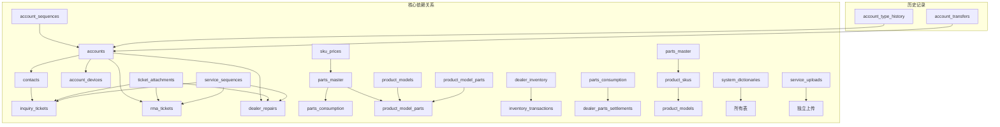

# 服务数据模型文档

<cite>
**本文档引用的文件**
- [001_extend_issues.sql](file://server/service/migrations/001_extend_issues.sql)
- [002_service_records.sql](file://server/service/migrations/002_service_records.sql)
- [003_issue_types.sql](file://server/service/migrations/003_issue_types.sql)
- [004_advanced_search.sql](file://server/service/migrations/004_advanced_search.sql)
- [005_knowledge_base.sql](file://server/service/migrations/005_knowledge_base.sql)
- [006_repair_management.sql](file://server/service/migrations/006_repair_management.sql)
- [007_parts_inventory.sql](file://server/service/migrations/007_parts_inventory.sql)
- [008_service_sequences.sql](file://server/service/migrations/008_service_sequences.sql)
- [009_three_layer_tickets.sql](file://server/service/migrations/009_three_layer_tickets.sql)
- [010_pr_adjustments.sql](file://server/service/migrations/010_pr_adjustments.sql)
- [011_add_knowledge_source.sql](file://server/service/migrations/011_add_knowledge_source.sql)
- [012_account_contact_architecture.sql](file://server/service/migrations/012_account_contact_architecture.sql)
- [013_migrate_to_account_contact.sql](file://server/service/migrations/013_migrate_to_account_contact.sql)
- [014_dealer_deactivation.sql](file://server/service/migrations/014_dealer_deactivation.sql)
- [015_update_account_types.sql](file://server/service/migrations/015_update_account_types.sql)
- [016_add_account_deleted_fields.sql](file://server/service/migrations/016_add_account_deleted_fields.sql)
- [039_add_attachments_count.sql](file://server/migrations/039_add_attachments_count.sql)
- [032_service_uploads.sql](file://server/service/migrations/032_service_uploads.sql)
- [031_parts_master.sql](file://server/service/migrations/031_parts_master.sql)
- [add_material_id.js](file://server/migrations/add_material_id.js)
- [upgrade_parts_pricing.js](file://server/migrations/upgrade_parts_pricing.js)
- [index.js](file://server/index.js)
- [tickets.js](file://server/service/routes/tickets.js)
- [ticket-activities.js](file://server/service/routes/ticket-activities.js)
- [system.js](file://server/service/routes/system.js)
- [parts-master.js](file://server/service/routes/parts-master.js)
- [parts-consumption.js](file://server/service/routes/parts-consumption.js)
- [parts-inventory.js](file://server/service/routes/parts-inventory.js)
- [parts-settlement.js](file://server/service/routes/parts-settlement.js)
- [check_attachments.js](file://server/scripts/check_attachments.js)
- [AttachmentZone.tsx](file://client/src/components/Service/AttachmentZone.tsx)
- [upload.js](file://server/service/routes/upload.js)
- [product-skus.js](file://server/service/routes/product-skus.js)
- [PartsCatalogPage.tsx](file://client/src/components/PartsManagement/PartsCatalogPage.tsx)
- [PartsDetailPage.tsx](file://client/src/components/PartsManagement/PartsDetailPage.tsx)
- [product-models-admin.js](file://server/service/routes/product-models-admin.js)
</cite>

## 更新摘要
**所做更改**
- 更新配件管理系统架构，移除parts_master表中的compatible_models字段，采用新的product_model_parts中间表架构
- 重构JSON处理逻辑，实现SSOT（Single Source of Truth）方法论
- 新增产品型号与配件的规范化关联管理
- 更新配件查询和BOM推荐机制，支持更精确的兼容性匹配
- 完善客户端兼容性过滤逻辑，支持新的数据结构

## 目录
1. [简介](#简介)
2. [项目结构](#项目结构)
3. [核心组件](#核心组件)
4. [架构概览](#架构概览)
5. [详细组件分析](#详细组件分析)
6. [统一定价架构](#统一定价架构)
7. [配件管理系统](#配件管理系统)
8. [附件管理功能](#附件管理功能)
9. [服务上传功能](#服务上传功能)
10. [依赖关系分析](#依赖关系分析)
11. [性能考虑](#性能考虑)
12. [故障排除指南](#故障排除指南)
13. [结论](#结论)

## 简介

Longhorn项目是一个综合性的服务管理系统，专注于提供完整的售后服务解决方案。该项目通过多层数据模型设计，实现了从客户服务到物理维修的全生命周期管理。

该服务数据模型采用渐进式演进策略，通过16个主要迁移文件构建了一个完整的服务体系，涵盖了客户服务、工单管理、知识库、维修管理、配件库存等多个核心业务领域。

**最新更新**：系统现已采用SSOT（Single Source of Truth）方法论重构配件管理系统，移除了parts_master表中的compatible_models字段，通过product_model_parts中间表实现产品型号与配件的规范化关联管理。新的架构支持更精确的兼容性匹配和BOM推荐机制，同时保持了与现有客户端功能的兼容性。系统现已集成完整的附件管理功能，支持工单级别的文件上传、下载、权限控制和缩略图生成，为服务流程提供了更丰富的多媒体支持能力。

## 项目结构

### 数据库迁移架构


**图表来源**
- [001_extend_issues.sql:1-196](file://server/service/migrations/001_extend_issues.sql#L1-L196)
- [002_service_records.sql:1-174](file://server/service/migrations/002_service_records.sql#L1-L174)
- [003_issue_types.sql:1-138](file://server/service/migrations/003_issue_types.sql#L1-L138)
- [031_parts_master.sql:1-226](file://server/service/migrations/031_parts_master.sql#L1-L226)
- [032_service_uploads.sql:1-21](file://server/service/migrations/032_service_uploads.sql#L1-L21)
- [039_add_attachments_count.sql:1-11](file://server/migrations/039_add_attachments_count.sql#L1-L11)
- [upgrade_parts_pricing.js:1-92](file://server/migrations/upgrade_parts_pricing.js#L1-L92)

### 核心数据模型层次

```mermaid
erDiagram
subgraph "第一层: 客 户服务层"
INQUIRY_TICKETS {
ticket_number PK
customer_info
service_type
status
created_at
attachments_count
}
SERVICE_RECORDS {
record_number PK
service_mode
customer_info
service_type
status
created_at
}
end
subgraph "第二层: 工单管理层"
RMA_TICKETS {
ticket_number PK
channel_code
issue_classification
repair_priority
status
created_at
attachments_count
}
DEALER_REPAIRS {
ticket_number PK
dealer_info
issue_category
status
created_at
}
end
subgraph "第三层: 物理维修层"
PARTS_MASTER {
sku PK
name
name_en
name_internal
name_internal_en
category
material_id
description
specifications
price_cny
price_usd
price_eur
cost_cny
status
min_stock_level
reorder_point
}
PRODUCT_MODEL_PARTS {
id PK
product_model_id FK
product_model_name
part_id FK
part_sku
part_name
is_common
quantity_per_unit
priority
notes
}
PARTS_CONSUMPTION {
id PK
ticket_id FK
part_id FK
quantity
unit_price
currency
total_amount
source_type
dealer_id FK
settlement_status
settlement_id FK
used_by FK
used_at
notes
}
DEALER_INVENTORY {
id PK
part_id FK
dealer_id FK
quantity
reserved_quantity
min_stock_level
reorder_point
}
end
subgraph "第四层: 结算管理层"
DEALER_PARTS_SETTLEMENTS {
id PK
settlement_number
dealer_id FK
period_start
period_end
period_type
total_quantity
total_amount_cny
total_amount_usd
total_amount_eur
status
confirmed_by FK
invoiced_by FK
paid_by FK
}
SKU_PRICES {
sku PK
item_type
price_cny
price_usd
price_eur
cost_cny
updated_at
}
end
```

**图表来源**
- [009_three_layer_tickets.sql:5-198](file://server/service/migrations/009_three_layer_tickets.sql#L5-L198)
- [006_repair_management.sql:10-353](file://server/service/migrations/006_repair_management.sql#L10-L353)
- [002_service_records.sql:10-174](file://server/service/migrations/002_service_records.sql#L10-L174)
- [031_parts_master.sql:6-42](file://server/service/migrations/031_parts_master.sql#L6-L42)
- [031_parts_master.sql:130-150](file://server/service/migrations/031_parts_master.sql#L130-L150)
- [031_parts_master.sql:44-82](file://server/service/migrations/031_parts_master.sql#L44-L82)
- [031_parts_master.sql:84-128](file://server/service/migrations/031_parts_master.sql#L84-L128)
- [upgrade_parts_pricing.js:22-33](file://server/migrations/upgrade_parts_pricing.js#L22-L33)

**章节来源**
- [001_extend_issues.sql:1-196](file://server/service/migrations/001_extend_issues.sql#L1-L196)
- [002_service_records.sql:1-174](file://server/service/migrations/002_service_records.sql#L1-L174)
- [003_issue_types.sql:1-138](file://server/service/migrations/003_issue_types.sql#L1-L138)

## 核心组件

### 1. 三层工单体系

#### 咨询工单 (Inquiry Tickets)
咨询工单作为服务入口，提供多渠道的客户问题收集和初步处理能力。

**核心字段特性**:
- `ticket_number`: 格式化标识符 KYYMM-XXXX
- `service_type`: 支持咨询、故障排除、远程协助、投诉等类型
- `channel`: 多渠道支持（电话、邮件、微信、在线等）
- `communication_log`: JSON格式的沟通记录
- `status`: InProgress/AwaitingFeedback/Resolved/AutoClosed/Upgraded 状态流转
- `attachments_count`: 附件数量统计字段，用于快速查询附件数量

#### RMA返厂单 (RMA Tickets)
物理维修工单，处理需要返厂维修的产品问题。

**关键特性**:
- `channel_code`: 渠道区分（D=Dealer, C=Customer, I=Internal）
- `issue_classification`: 问题类型、类别、子类别分级
- `repair_priority`: R1/R2/R3优先级管理
- `approval_status`: 经销商提交的审批流程
- `attachments_count`: 附件数量统计字段，用于快速查询附件数量

#### 经销商维修单 (Dealer Repairs)
针对经经销商提供的维修服务。

**业务特点**:
- `dealer_id`: 经销商关联
- `issue_category`: 维修分类管理
- `status`: InProgress/Completed 简化状态管理

**章节来源**
- [009_three_layer_tickets.sql:5-198](file://server/service/migrations/009_three_layer_tickets.sql#L5-L198)

### 2. 服务记录系统

服务记录作为轻量级的服务跟踪工具，提供快速查询和客户服务记录功能。

**核心功能**:
- `record_number`: SR{Type}-{YYMM}-{Seq} 格式化编号
- `service_mode`: QuickQuery/CustomerService 两种模式
- `communication_log`: JSON数组的消息记录
- `status`: Created/InProgress/WaitingCustomer/Resolved/AutoClosed/UpgradedToTicket 状态管理

**章节来源**
- [002_service_records.sql:10-174](file://server/service/migrations/002_service_records.sql#L10-L174)

### 3. 维修管理系统

#### 配件目录管理
建立完整的配件分类和定价体系。

**数据结构**:
- `part_number`: 唯一SKU标识
- `category`: 传感器/电路板/机械件/线缆/光学件/配件分类
- `pricing`: 成本价、零售价、经销商价三重定价
- `stock_info`: 库存水平、安全库存、补货周期

#### 报价单系统
提供维修报价的完整生命周期管理。

**核心流程**:
- `quotation_number`: QT-YYYYMMDD-XXX 格式
- `pricing_breakdown`: 零件费用、人工费、运费、其他费用明细
- `status`: Draft/Sent/Approved/Rejected/Expired 状态控制
- `valid_until`: 报价有效期管理

#### 物流跟踪系统
集成全球物流合作伙伴的跟踪能力。

**功能特性**:
- `shipment_type`: Inbound/Outbound 双向物流
- `carrier`: DHL/FedEx/UPS/顺丰等国际物流
- `tracking_events`: 物流事件历史记录
- `status`: Pending/Shipped/InTransit/Delivered/Exception 实时状态

**章节来源**
- [006_repair_management.sql:10-353](file://server/service/migrations/006_repair_management.sql#L10-L353)

### 4. 知识库系统

#### 文章管理
支持多层级的知识内容管理。

**分类体系**:
- `category`: FAQ/Troubleshooting/Manual/ReleaseNotes/Compatibility/Internal
- `visibility`: Public/Dealer/Internal/Department 多层可见性
- `product_association`: 产品线、型号、固件版本关联
- `tags`: JSON标签系统

#### 兼容性测试
建立产品兼容性测试数据库。

**测试维度**:
- `target_type`: 镜头/监视器/录机/存储介质/配件/软件
- `compatibility_status`: Compatible/PartiallyCompatible/Incompatible/Untested
- `known_issues`: JSON已知问题列表
- `workarounds`: JSON解决方案列表

**章节来源**
- [005_knowledge_base.sql:10-214](file://server/service/migrations/005_knowledge_base.sql#L10-L214)

### 5. 经销商库存与PI发票系统

#### 经销商库存管理
实现分布式库存的统一管理。

**库存控制**:
- `available_quantity`: 可用库存计算（quantity - reserved_quantity）
- `min/max_stock_level`: 安全库存管理
- `inventory_transactions`: 交易流水记录
- `reorder_point`: 补货点预警

#### 预开发票系统
支持复杂的商业发票管理。

**发票流程**:
- `pi_number`: PI-YYYYMMDD-XXX 格式
- `payment_terms`: Prepaid/Net30/Net60/Net90 灵活付款条件
- `bank_details`: JSON银行信息
- `status`: Draft/Sent/Confirmed/Cancelled 审批流程

#### 月度结算
自动化经销商结算管理。

**结算维度**:
- `settlement_period`: YYYY-MM 格式化结算周期
- `total_repairs`: 结算期内维修数量统计
- `parts_used_value`: 配件使用价值计算
- `status`: Pending/Calculated/Approved/Settled 状态流转

**章节来源**
- [007_parts_inventory.sql:10-349](file://server/service/migrations/007_parts_inventory.sql#L10-L349)

### 6. 账户联系架构

#### 账户模型
统一管理客户和经销商的双层架构。

**账户类型**:
- `DEALER`: 经销商账户
- `ORGANIZATION`: 企业组织账户  
- `INDIVIDUAL`: 个人账户

**业务属性**:
- `service_tier`: STANDARD/VIP/VVIP/BLACKLIST 服务等级
- `industry_tags`: JSON行业标签
- `credit_limit`: 信用额度管理
- `parent_dealer_id`: 经销商层级关系

#### 联系人管理
多联系人的灵活管理机制。

**联系人状态**:
- `status`: ACTIVE/INACTIVE/PRIMARY 状态管理
- `is_primary`: 主要联系人标识
- `communication_preference`: EMAIL/PHONE/WECHAT 偏好设置

#### 设备关联
产品设备的账户绑定管理。

**设备状态**:
- `device_status`: ACTIVE/SOLD/RETIRED 设备生命周期
- `warranty_until`: 保修截止日期
- `purchase_date`: 购买日期记录

**章节来源**
- [012_account_contact_architecture.sql:6-131](file://server/service/migrations/012_account_contact_architecture.sql#L6-L131)

## 架构概览

### 数据流架构

```mermaid
flowchart TD
subgraph "客户入口层"
A[客户咨询] --> B[咨询工单]
C[在线客服] --> B
D[电话服务] --> B
end
subgraph "服务处理层"
B --> E{是否需要维修?}
E --> |否| F[服务记录]
E --> |是| G[RMA返厂单]
F --> H[知识库查询]
G --> I[配件库存检查]
end
subgraph "维修执行层"
I --> J[维修报价]
J --> K{客户同意?}
K --> |否| L[报价作废]
K --> |是| M[生成维修单]
M --> N[物流发货]
N --> O[维修完成]
O --> P[结算处理]
end
subgraph "统一定价层"
Q[sku_prices表] --> R[配件价格查询]
S[产品SKU价格] --> R
T[配件BOM价格] --> R
R --> U[统一价格计算]
end
subgraph "SSOT兼容性层"
V[product_model_parts中间表] --> W[产品型号-配件关联]
X[parts_master.compatible_models字段移除] --> Y[规范化兼容性管理]
W --> Z[精确兼容性匹配]
Y --> Z
end
subgraph "附件管理层"
AA[附件上传] --> AB[工单附件]
AC[活动附件] --> AB
AD[缩略图生成] --> AB
AB --> AE[权限控制]
end
subgraph "数据存储层"
B --> AF[工单数据库]
F --> AG[服务记录库]
G --> AH[维修管理库]
H --> AI[知识库]
J --> AJ[报价库]
M --> AK[物流跟踪库]
P --> AL[财务结算库]
Q --> AM[价格管理库]
V --> AN[兼容性管理库]
AA --> AO[附件存储]
AE --> AP[权限验证]
U --> AQ[价格计算引擎]
Z --> AR[兼容性引擎]
AQ --> AS[统一定价引擎]
AS --> AT[SSOT兼容性引擎]
```

**图表来源**
- [009_three_layer_tickets.sql:5-198](file://server/service/migrations/009_three_layer_tickets.sql#L5-L198)
- [006_repair_management.sql:53-353](file://server/service/migrations/006_repair_management.sql#L53-L353)
- [index.js:258-276](file://server/index.js#L258-L276)
- [upgrade_parts_pricing.js:22-33](file://server/migrations/upgrade_parts_pricing.js#L22-L33)
- [parts-master.js:100-110](file://server/service/routes/parts-master.js#L100-L110)

### 系统字典管理

```mermaid
erDiagram
SYSTEM_DICTIONARIES {
dict_type PK
dict_key PK
dict_value
sort_order
is_active
}
DICTIONARY_TYPES {
dict_type_name
description
created_at
}
DICTIONARY_VALUES {
dict_key
dict_value
sort_order
description
}
SYSTEM_DICTIONARIES }|--|| DICTIONARY_TYPES : "定义"
SYSTEM_DICTIONARIES }|--|| DICTIONARY_VALUES : "包含"
```

**图表来源**
- [001_extend_issues.sql:130-185](file://server/service/migrations/001_extend_issues.sql#L130-L185)
- [002_service_records.sql:140-173](file://server/service/migrations/002_service_records.sql#L140-L173)

## 详细组件分析

### 1. 序列号管理系统

#### 统一服务序列
通过统一的序列表管理所有服务标识符。

**序列格式规范**:
- `RMA-09C-2602`: RMA产品09，客户渠道，2026年2月
- `SRC-2512-001`: 服务记录客户类型，2025年12月序列001
- `RA09C-2512-001`: RMA返厂单格式

**序列管理特性**:
- `sequence_key`: 唯一序列键
- `last_sequence`: 最后使用的序列号
- 支持月度重置和十六进制扩展

**章节来源**
- [008_service_sequences.sql:18-48](file://server/service/migrations/008_service_sequences.sql#L18-L48)

### 2. 高级搜索与导出系统

#### 搜索过滤器
支持复杂条件组合的搜索功能。

**过滤器类型**:
- `filter_type`: issue/service_record 类型区分
- `filter_config`: JSON配置的过滤参数
- `is_public`: 公共/私有过滤器

**导出功能**:
- `export_type`: issues/service_records/statistics 导出类型
- `export_format`: xlsx/csv 格式支持
- `audit_trail`: 导出历史记录

**章节来源**
- [004_advanced_search.sql:10-95](file://server/service/migrations/004_advanced_search.sql#L10-L95)

### 3. 经销商停用与转移系统

#### 停用管理
支持经销商的生命周期管理。

**停用字段**:
- `deactivated_at`: 停用时间戳
- `deactivated_reason`: 停用原因
- `successor_account_id`: 后继账户关联

#### 客户转移
完整的客户继承和转移机制。

**转移类型**:
- `dealer_to_dealer`: 经销商间转移
- `dealer_to_direct`: 转为直客
- `transfer_type`: 转移类型标识

**章节来源**
- [014_dealer_deactivation.sql:10-35](file://server/service/migrations/014_dealer_deactivation.sql#L10-L35)

### 4. 软删除支持

#### 账户软删除
实现数据的逻辑删除和恢复能力。

**删除字段**:
- `is_deleted`: 0=未删除, 1=已删除 标识
- `deleted_at`: 删除时间戳
- `index`: `idx_accounts_deleted` 性能优化

**应用场景**:
- 数据审计和恢复
- 合规性要求
- 业务逻辑回滚

**章节来源**
- [016_add_account_deleted_fields.sql:4-12](file://server/service/migrations/016_add_account_deleted_fields.sql#L4-L12)

## 统一定价架构

### sku_prices表设计

统一定价架构通过sku_prices表实现配件、产品和配件的统一价格管理，确保价格数据的一致性和可维护性。

**核心表结构**:
- `sku`: 唯一键，支持配件SKU、产品SKU和配件SKU
- `item_type`: 枚举值（part/product/accessory），标识物品类型
- `price_cny/usd/eur`: 多币种价格字段，默认0
- `cost_cny`: 成本价字段，用于内部成本核算
- `updated_at`: 价格最后更新时间戳

**设计原则**:
- 100%向下兼容：只增加不删除，确保现有功能不受影响
- 统一管理：所有物品类型的价格统一存储和查询
- 实时同步：配件主数据的价格变更自动同步到sku_prices表

**章节来源**
- [upgrade_parts_pricing.js:22-33](file://server/migrations/upgrade_parts_pricing.js#L22-L33)

### 配件主数据扩展

#### 新增字段
配件主数据表通过迁移脚本新增了多个字段，支持更精细的物料管理。

**新增字段**:
- `name_internal`: 内部名称（中文）
- `name_internal_en`: 内部名称（英文）
- `name_external`: 外部名称（中文）
- `name_external_en`: 外部名称（英文）
- `material_id`: 物料ID，关联物料管理系统

**字段用途**:
- 内部/外部名称分离：支持不同渠道的差异化命名
- 物料管理集成：与物料管理系统建立关联
- 多语言支持：完整的中英文名称支持

**章节来源**
- [upgrade_parts_pricing.js:54-77](file://server/migrations/upgrade_parts_pricing.js#L54-L77)
- [add_material_id.js:11-16](file://server/migrations/add_material_id.js#L11-L16)

### 价格查询机制

#### 统一查询接口
系统通过LEFT JOIN的方式实现统一的价格查询，确保查询性能和数据一致性。

**查询逻辑**:
```sql
SELECT pm.*, sp.price_cny, sp.price_usd, sp.price_eur, sp.cost_cny
FROM parts_master pm
LEFT JOIN sku_prices sp ON pm.sku = sp.sku
```

**权限控制**:
- OP部门：隐藏价格字段（price_cny, price_usd, price_eur, cost_cny）
- 其他部门：正常显示所有价格信息

**章节来源**
- [parts-master.js:84-93](file://server/service/routes/parts-master.js#L84-L93)
- [parts-master.js:144-152](file://server/service/routes/parts-master.js#L144-L152)

## 配件管理系统

### SSOT方法论实施

#### Single Source of Truth (SSOT)架构
系统采用SSOT方法论重构配件兼容性管理，消除数据冗余和不一致问题。

**核心原则**:
- **单一真实来源**: 产品型号与配件的关联关系统一存储在product_model_parts表中
- **规范化数据结构**: 移除parts_master表中的JSON字段，采用关系型规范化设计
- **精确匹配机制**: 通过product_model_parts表实现精确的产品型号-配件匹配
- **动态兼容性计算**: 客户端通过解析product_model_parts表动态生成compatible_models数组

**章节来源**
- [parts-master.js:100-110](file://server/service/routes/parts-master.js#L100-L110)
- [031_parts_master.sql:130-150](file://server/service/migrations/031_parts_master.sql#L130-L150)

### 配件主数据管理

#### 配件主数据表 (parts_master)
配件主数据表是整个配件系统的核心，存储所有配件的基础信息和配置。

**核心字段**:
- `sku`: 唯一SKU编码，格式如S1-011-013
- `name/name_en`: 中文和英文名称
- `name_internal/name_internal_en`: 内部名称（中文/英文）
- `name_external/name_external_en`: 外部名称（中文/英文）
- `category`: 配件分类（主板/接口/外壳/线缆/传感器等）
- `material_id`: 物料ID，关联物料管理系统
- `description/specifications`: 详细描述和规格参数（JSON格式）
- `price_cny/usd/eur/cost_cny`: 多币种价格和成本价
- `status`: active/discontinued/pending 状态管理

**库存管理字段**:
- `min_stock_level`: 最低库存预警线（默认5）
- `reorder_point`: 补货点（默认10）

**兼容性字段**:
- **已移除**: `compatible_models` JSON字段（不再直接存储）
- **替代方案**: 通过product_model_parts中间表实现规范化关联

**章节来源**
- [031_parts_master.sql:6-42](file://server/service/migrations/031_parts_master.sql#L6-L42)

### 产品型号配件BOM关联

#### BOM关联表 (product_model_parts)
定义每个产品型号的常用维修配件，支持BOM管理和优先级排序。

**核心字段**:
- `product_model_id`: 关联产品型号ID
- `product_model_name`: 冗余存储的产品型号名称
- `part_id`: 关联配件ID
- `part_sku/part_name`: 冗余存储的配件信息

**BOM属性**:
- `is_common`: 是否常用配件（默认1）
- `quantity_per_unit`: 每台设备所需数量（默认1）
- `priority`: 优先级（数值越小越优先，默认100）
- `notes`: 备注信息

**唯一约束**:
- `UNIQUE(product_model_id, part_id)`: 避免重复关联

**SSOT实现**:
- **规范化设计**: 消除JSON字段，采用关系型表存储
- **精确匹配**: 支持按型号ID、型号代码、型号名称的精确匹配
- **动态兼容性**: 客户端通过解析BOM表动态生成compatible_models数组

**章节来源**
- [031_parts_master.sql:130-150](file://server/service/migrations/031_parts_master.sql#L130-L150)

### 配件消耗记录

#### 消耗记录表 (parts_consumption)
记录每次维修使用的配件，支持多种来源和结算状态。

**核心字段**:
- `ticket_id`: 关联工单ID
- `ticket_number`: 冗余存储的工单编号
- `part_id`: 关联配件ID
- `part_sku/part_name`: 冗余存储的配件信息
- `quantity`: 使用数量（默认1）
- `unit_price`: 实际使用单价（可能打折）
- `currency`: 币种（默认CNY）
- `total_amount`: 总价 = quantity * unit_price

**来源追踪**:
- `source_type`: hq_inventory/dealer_inventory/external_purchase/warranty_free
- `dealer_id/dealer_name`: 经销商信息（如果来自经销商库存）

**结算状态**:
- `settlement_status`: pending/included/waived/disputed
- `settlement_id`: 关联结算单ID

**使用人信息**:
- `used_by/used_by_name`: 使用人信息
- `used_at`: 使用时间戳

**章节来源**
- [031_parts_master.sql:44-82](file://server/service/migrations/031_parts_master.sql#L44-L82)

### 经销商配件结算

#### 结算单表 (dealer_parts_settlements)
支持月度/季度/自定义周期的经销商配件结算管理。

**核心字段**:
- `settlement_number`: 结算单号，格式PS-YYYYMM-0001
- `dealer_id/dealer_name`: 经销商信息
- `period_start/period_end`: 结算周期起止日期
- `period_type`: monthly/quarterly/custom

**金额汇总**:
- `total_quantity`: 配件总数量
- `total_amount_cny/usd/eur`: 多币种总金额

**结算状态**:
- `status`: draft/confirmed/invoiced/paid/disputed

**确认和开票信息**:
- `confirmed_by/confirmed_at/confirmed_notes`
- `invoiced_by/invoiced_at/invoice_number`

**付款信息**:
- `paid_by/paid_at/payment_reference`

**章节来源**
- [031_parts_master.sql:84-128](file://server/service/migrations/031_parts_master.sql#L84-L128)

### 库存交易记录

#### 交易记录表 (inventory_transactions)
记录所有库存变动，支持完整的库存追踪。

**交易类型**:
- `inbound`: 入库
- `outbound`: 出库  
- `transfer_in`: 调入
- `transfer_out`: 调出
- `adjustment`: 盘点调整
- `consumption`: 维修消耗
- `return`: 退货

**关联信息**:
- `part_id`: 关联配件ID
- `dealer_id`: 关联经销商ID（NULL表示总部库存）
- `reference_type/reference_id/reference_number`: 关联单据信息

**数量记录**:
- `quantity`: 数量（入库为正数，出库为负数）
- `before_quantity/after_quantity`: 变动前后数量

**操作人**:
- `operated_by/operated_by_name`: 操作人信息
- `operated_at`: 操作时间戳

**章节来源**
- [031_parts_master.sql:152-189](file://server/service/migrations/031_parts_master.sql#L152-L189)

### 配件API接口

#### 配件主数据API
提供完整的配件管理接口，支持CRUD操作和权限控制。

**核心接口**:
- `GET /api/v1/parts-master`: 获取配件列表（支持分页、搜索、过滤）
- `GET /api/v1/parts-master/:id`: 获取配件详情
- `POST /api/v1/parts-master`: 创建新配件
- `PATCH /api/v1/parts-master/:id`: 更新配件信息
- `DELETE /api/v1/parts-master/:id`: 软删除配件

**权限控制**:
- 查看：Admin/Lead/Exec + MS/GE/OP部门
- 管理：Admin/Lead/Exec + MS部门

**SSOT兼容性**:
- **兼容性字段**: 通过product_model_parts表动态生成compatible_models数组
- **BOM查询**: 支持按产品型号ID精确查询兼容配件
- **客户端兼容**: 保持与现有客户端功能的完全兼容

**章节来源**
- [parts-master.js:25-128](file://server/service/routes/parts-master.js#L25-L128)
- [parts-master.js:197-292](file://server/service/routes/parts-master.js#L197-L292)

#### 配件消耗API
支持配件消耗记录的创建、查询和结算状态管理。

**核心接口**:
- `GET /api/v1/parts-consumption`: 获取消耗记录列表
- `GET /api/v1/parts-consumption/summary`: 获取消耗统计
- `POST /api/v1/parts-consumption`: 记录配件消耗
- `PATCH /api/v1/parts-consumption/:id/settlement`: 更新结算状态
- `DELETE /api/v1/parts-consumption/:id`: 撤销消耗记录

**库存检查**:
- 自动检查库存充足性
- 支持总部库存和经销商库存
- 记录库存交易流水

**章节来源**
- [parts-consumption.js:25-131](file://server/service/routes/parts-consumption.js#L25-L131)
- [parts-consumption.js:234-368](file://server/service/routes/parts-consumption.js#L234-L368)

#### 经销商库存API
提供库存查询、统计和交易记录管理。

**核心接口**:
- `GET /api/v1/parts-inventory`: 获取库存列表
- `GET /api/v1/parts-inventory/summary`: 获取库存汇总统计
- `GET /api/v1/parts-inventory/low-stock`: 获取低库存预警
- `POST /api/v1/parts-inventory/inbound`: 入库操作
- `POST /api/v1/parts-inventory/outbound`: 出库操作
- `GET /api/v1/parts-inventory/transactions`: 获取交易记录

**统计功能**:
- 库存价值统计（按成本价和售价）
- 低库存预警统计
- 分类统计和排序

**章节来源**
- [parts-inventory.js:25-124](file://server/service/routes/parts-inventory.js#L25-L124)
- [parts-inventory.js:260-434](file://server/service/routes/parts-inventory.js#L260-L434)

#### 配件结算API
完整的结算单生命周期管理。

**核心接口**:
- `GET /api/v1/parts-settlements`: 获取结算单列表
- `GET /api/v1/parts-settlements/summary`: 获取结算汇总统计
- `GET /api/v1/parts-settlements/pending-consumptions`: 获取待结算消耗记录
- `POST /api/v1/parts-settlements`: 创建结算单
- `GET /api/v1/parts-settlements/:id`: 获取结算单详情
- `PATCH /api/v1/parts-settlements/:id/confirm`: 确认结算单
- `PATCH /api/v1/parts-settlements/:id/pay`: 标记已付款
- `PATCH /api/v1/parts-settlements/:id/cancel`: 取消结算单
- `DELETE /api/v1/parts-settlements/:id`: 删除结算单

**结算流程**:
- 自动生成结算单号
- 自动计算总金额和数量
- 支持批量选择消耗记录
- 完整的状态流转控制

**章节来源**
- [parts-settlement.js:40-135](file://server/service/routes/parts-settlement.js#L40-L135)
- [parts-settlement.js:279-386](file://server/service/routes/parts-settlement.js#L279-L386)

### 客户端兼容性处理

#### 兼容性过滤逻辑重构
客户端代码已更新以支持新的SSOT架构，通过product_model_parts表动态生成兼容性信息。

**兼容性过滤**:
- `filterByFamily`: 通过compatible_models数组进行产品族过滤
- 动态模型匹配：支持按型号ID、型号代码、型号名称的匹配
- 客户端缓存：缓存所有产品型号信息以提高过滤性能

**兼容性显示**:
- `compatible_models`: 通过product_model_parts表动态生成的模型代码数组
- `model_bom`: 完整的BOM关联信息，包含优先级、数量等属性
- 多语言支持：支持中文和英文型号名称的显示

**章节来源**
- [PartsCatalogPage.tsx:173-181](file://client/src/components/PartsManagement/PartsCatalogPage.tsx#L173-L181)
- [PartsDetailPage.tsx:48-49](file://client/src/components/PartsManagement/PartsDetailPage.tsx#L48-L49)

## 附件管理功能

### 附件系统架构

#### 统一附件表设计
系统采用统一的附件表设计，支持工单级别和活动级别的附件管理。

**核心表结构** (`ticket_attachments`):
- `id`: 自增主键
- `ticket_id`: 关联工单ID（必填）
- `activity_id`: 关联活动ID（可选，NULL表示工单级附件）
- `file_name`: 文件原始名称
- `file_path`: 文件存储路径
- `file_size`: 文件大小（字节）
- `file_type`: MIME类型
- `uploaded_by`: 上传用户ID
- `uploaded_at`: 上传时间戳

**独立上传表** (`service_uploads`):
- `id`: 自增主键
- `file_name`: 文件名称
- `file_path`: 存储路径
- `file_size`: 文件大小
- `file_type`: 文件类型
- `upload_type`: 上传类型（默认'general'）
- `uploaded_by`: 上传用户
- `uploaded_at`: 上传时间

#### 附件计数功能
为工单表添加附件计数字段，提供快速的附件数量统计能力。

**新增字段** (`tickets.attachments_count`):
- 默认值：0
- 自动更新：通过触发器或应用程序逻辑维护
- 查询优化：避免每次查询时进行COUNT操作

**章节来源**
- [index.js:258-276](file://server/index.js#L258-L276)
- [039_add_attachments_count.sql:1-11](file://server/migrations/039_add_attachments_count.sql#L1-L11)
- [032_service_uploads.sql:5-21](file://server/service/migrations/032_service_uploads.sql#L5-L21)

### 附件上传流程

#### 工单附件上传
支持在创建工单时直接上传附件，以及后续的附件添加功能。

**上传接口** (`POST /api/v1/tickets/:id/attachments`):
1. 权限验证：检查用户对工单的访问权限
2. 文件验证：限制文件类型和大小
3. 文件存储：保存到指定的存储目录
4. 数据库记录：插入附件记录
5. 计数更新：更新工单的附件计数

**支持的文件类型**:
- 图片：image/*
- 视频：video/*
- PDF：application/pdf
- 文本：text/plain
- 最大文件大小：50MB

#### 活动附件上传
支持在工单活动（如评论）中添加附件，实现更细粒度的附件管理。

**活动附件特性**:
- 自动关联到特定的活动记录
- 支持缩略图自动生成（针对图片文件）
- 权限继承：自动继承工单的访问权限

**章节来源**
- [tickets.js:2760-2792](file://server/service/routes/tickets.js#L2760-L2792)
- [ticket-activities.js:364-432](file://server/service/routes/ticket-activities.js#L364-L432)

### 附件权限控制

#### 多层次权限验证
系统实现多层次的附件访问权限控制，确保数据安全。

**权限检查顺序**:
1. 管理员权限：Admin/Exec 拥有完全访问权限
2. 经销商权限：附件所属经销商的用户可访问
3. 上传者权限：附件上传者本人可访问
4. 责任人权限：工单负责人可访问

**下载权限验证** (`/api/v1/system/attachments/:id/download`):
- 验证附件是否存在且属于目标工单
- 执行权限检查逻辑
- 返回适当的HTTP状态码（200/403/404）

**删除权限控制** (`DELETE /api/v1/tickets/:id/attachments/:attachId`):
- 管理员和执行官：完全删除权限
- 工单负责人：MS部门负责人可删除
- 上传者本人：只能删除自己上传的附件

**章节来源**
- [system.js:382-407](file://server/service/routes/system.js#L382-L407)
- [tickets.js:2798-2849](file://server/service/routes/tickets.js#L2798-L2849)

### 附件缩略图生成功能

#### 自动缩略图生成
系统支持图片附件的自动缩略图生成，提升用户体验。

**缩略图生成流程**:
1. 检测文件类型：仅对图片文件生成缩略图
2. 文件转换：使用sharp库进行图像处理
3. 格式优化：生成WebP格式的压缩图片
4. 尺寸控制：最大400像素的正方形缩略图
5. 平台适配：HEIC格式使用macOS sips工具

**缩略图存储**:
- 存储在 `.thumbnails` 目录下
- 文件名包含原文件信息和尺寸标识
- 异步生成，不影响主流程性能

**章节来源**
- [ticket-activities.js:380-423](file://server/service/routes/ticket-activities.js#L380-L423)

### 附件管理界面

#### 客户端附件组件
提供直观的附件上传和管理界面。

**AttachmentZone 组件特性**:
- 拖拽上传：支持拖拽文件到指定区域
- 文件预览：支持图片和视频的即时预览
- 类型限制：自动过滤不支持的文件类型
- 移除功能：支持删除已选择的文件
- 响应式设计：适配不同屏幕尺寸

**界面交互**:
- 拖拽激活状态：视觉反馈当前拖拽状态
- 文件类型图标：根据文件类型显示相应图标
- 删除按钮：悬停显示删除按钮
- 名称截断：长文件名自动截断显示

**章节来源**
- [AttachmentZone.tsx:1-108](file://client/src/components/Service/AttachmentZone.tsx#L1-L108)

### 附件查询与管理

#### 数据库查询优化
提供高效的附件查询和管理功能。

**常用查询示例**:
- 工单附件列表：按工单ID查询所有附件
- 活动附件查询：按活动ID查询相关附件
- 诊断报告附件：特殊活动类型的附件查询
- 最新附件查询：按时间倒序获取最新附件

**索引优化**:
- `idx_ticket_attachments_ticket`: 按工单ID查询优化
- `idx_ticket_attachments_activity`: 按活动ID查询优化
- `idx_service_uploads_type`: 按上传类型查询优化
- `idx_service_uploads_user`: 按上传用户查询优化

**章节来源**
- [check_attachments.js:1-36](file://server/scripts/check_attachments.js#L1-L36)
- [index.js:274-275](file://server/index.js#L274-L275)

## 服务上传功能

### 服务上传架构

#### 独立上传表设计
系统提供独立的服务上传功能，支持不绑定工单的文件上传和管理。

**核心表结构** (`service_uploads`):
- `id`: 自增主键
- `file_name`: 文件原始名称
- `file_path`: 文件存储路径
- `file_size`: 文件大小（字节）
- `file_type`: MIME类型
- `upload_type`: 上传类型（默认'general'）
- `uploaded_by`: 上传用户ID
- `uploaded_at`: 上传时间戳

**上传类型分类**:
- `warranty_invoice`: 保修发票
- `product_photo`: 产品照片
- `ticket_attachment`: 工单附件
- `general`: 通用文件

#### 上传接口设计
提供统一的文件上传接口，支持多种上传类型和权限控制。

**上传接口** (`POST /api/v1/upload`):
1. 文件类型验证：根据上传类型限制文件类型
2. 存储路径映射：将上传类型映射到对应存储目录
3. 文件保存：使用multer进行文件存储
4. 数据库记录：插入上传记录
5. URL生成：返回可访问的文件URL

**支持的上传类型**:
- `warranty_invoice`: 保修发票上传
- `product_photo`: 产品照片上传
- `ticket_attachment`: 工单附件上传
- `general`: 通用文件上传

**章节来源**
- [upload.js:1-114](file://server/service/routes/upload.js#L1-L114)
- [032_service_uploads.sql:5-21](file://server/service/migrations/032_service_uploads.sql#L5-L21)

### 上传权限控制

#### 多层次权限验证
服务上传功能同样实现多层次的权限控制。

**权限检查**:
1. 身份验证：必须登录用户
2. 文件类型验证：根据上传类型限制文件类型
3. 存储空间检查：确保有足够的存储空间
4. 文件大小限制：最大50MB限制

**存储路径管理**:
- 优先使用外部文件服务器 `/Volumes/fileserver/Service`
- 开发环境回退到本地 `attachmentsDir`
- 不同上传类型映射到不同存储目录

**章节来源**
- [upload.js:16-24](file://server/service/routes/upload.js#L16-L24)
- [upload.js:76-95](file://server/service/routes/upload.js#L76-L95)

### 上传查询与管理

#### 数据库查询优化
提供高效的上传记录查询和管理功能。

**常用查询示例**:
- 按上传类型查询：按upload_type查询上传记录
- 按上传用户查询：按uploaded_by查询用户上传记录
- 按时间范围查询：按uploaded_at查询时间段内上传记录

**索引优化**:
- `idx_service_uploads_type`: 按上传类型查询优化
- `idx_service_uploads_user`: 按上传用户查询优化
- `idx_service_uploads_path`: 按文件路径查询优化

**章节来源**
- [032_service_uploads.sql:17-21](file://server/service/migrations/032_service_uploads.sql#L17-L21)

## 依赖关系分析

### 数据模型依赖图



**图表来源**
- [012_account_contact_architecture.sql:96-120](file://server/service/migrations/012_account_contact_architecture.sql#L96-L120)
- [006_repair_management.sql:113-130](file://server/service/migrations/006_repair_management.sql#L113-L130)
- [008_service_sequences.sql:18-24](file://server/service/migrations/008_service_sequences.sql#L18-L24)
- [index.js:258-276](file://server/index.js#L258-L276)
- [upgrade_parts_pricing.js:41-45](file://server/migrations/upgrade_parts_pricing.js#L41-L45)
- [product-models-admin.js:70-88](file://server/service/routes/product-models-admin.js#L70-L88)

### 外部依赖与集成

#### 物流合作伙伴集成
通过标准化的数据接口支持多家物流服务商。

**集成范围**:
- `carrier`: DHL/FedEx/UPS/顺丰等国际物流
- `logistics_events`: 物流事件API集成
- `shipping_rates`: 运费计算API

#### 知识库内容集成
支持多种内容来源的知识管理。

**内容类型**:
- `source_type`: PDF/URL/Text/Excel/Manual 多格式支持
- `source_url`: 外部链接集成
- `knowledge_articles_fts`: 全文搜索引擎集成

#### 附件存储集成
支持本地文件系统和可能的云存储集成。

**存储特性**:
- 本地文件系统存储
- 相对路径存储（相对于BASE_DIR）
- 文件权限和安全控制
- 存储空间监控和清理

**章节来源**
- [006_repair_management.sql:199-215](file://server/service/migrations/006_repair_management.sql#L199-L215)
- [005_knowledge_base.sql:52-75](file://server/service/migrations/005_knowledge_base.sql#L52-L75)

## 性能考虑

### 索引优化策略

#### 复合索引设计
针对高频查询场景优化索引结构：

**工单查询索引**:
- `idx_inquiry_tickets_status`: 咨询工单状态查询
- `idx_rma_tickets_channel`: RMA工单渠道查询  
- `idx_service_records_customer`: 客户服务记录查询
- `idx_dealer_repairs_dealer`: 经销商维修查询

**附件查询索引**:
- `idx_ticket_attachments_ticket`: 工单附件查询优化
- `idx_ticket_attachments_activity`: 活动附件查询优化
- `idx_service_uploads_type`: 上传类型查询优化
- `idx_service_uploads_user`: 用户上传查询优化

**配件查询索引**:
- `idx_parts_master_sku`: 配件SKU查询优化
- `idx_parts_master_category`: 配件分类查询优化
- `idx_parts_master_status`: 配件状态查询优化
- `idx_parts_consumption_ticket`: 消耗记录工单查询优化
- `idx_parts_consumption_part`: 消耗记录配件查询优化
- `idx_parts_consumption_dealer`: 消耗记录经销商查询优化
- `idx_parts_consumption_settlement`: 消耗记录结算查询优化
- `idx_parts_consumption_used_at`: 消耗记录时间查询优化
- `idx_settlements_dealer`: 结算单经销商查询优化
- `idx_settlements_period`: 结算单周期查询优化
- `idx_settlements_status`: 结算单状态查询优化
- `idx_product_model_parts_model`: BOM记录查询优化
- `idx_inventory_transactions_part`: 交易记录配件查询优化
- `idx_inventory_transactions_dealer`: 交易记录经销商查询优化

**SSOT优化索引**:
- `idx_product_model_parts_model`: 产品型号索引
- `idx_product_model_parts_part`: 配件索引
- `idx_product_model_parts_unique`: 唯一约束索引

**时间序列索引**:
- `idx_inquiry_ticket_sequences_ym`: 月度序列查询
- `idx_service_records_created`: 创建时间查询
- `idx_export_history_date`: 导出历史查询

### 查询性能优化

#### 分区策略
- 按时间分区的工单表设计
- 按地区/渠道的索引优化
- 常用字段的前缀索引

#### 缓存策略
- 热门查询结果缓存
- 配件库存实时更新
- 知识库内容静态缓存
- 缩略图缓存机制
- 统一定价数据缓存
- 产品型号缓存（用于兼容性过滤）

#### 附件性能优化
- 附件计数字段避免频繁COUNT查询
- 异步缩略图生成减少响应时间
- 文件存储路径优化访问速度
- 服务上传缓存机制

#### 配件系统性能优化
- sku_prices表的UNIQUE索引确保价格查询高效
- LEFT JOIN查询避免重复计算
- 库存交易记录的批量操作优化
- 结算单的事务处理确保数据一致性
- SSOT架构减少数据冗余和查询复杂度

#### 客户端性能优化
- 产品型号数据缓存
- 兼容性过滤的客户端优化
- JSON解析的延迟处理
- 动态兼容性数据的缓存策略

### 存储和带宽考虑

#### 文件存储优化
- 图片文件自动压缩和格式转换
- 缩略图按需生成和缓存
- 大文件分块传输和断点续传
- 存储空间监控和清理策略

#### 数据库存储优化
- 配件规格参数使用JSON存储节省空间
- 冗余字段优化查询性能
- 软删除机制减少数据迁移成本
- 历史数据归档策略
- SSOT架构减少数据冗余

## 故障排除指南

### 常见问题诊断

#### 数据迁移问题
**症状**: 账户关联失败
**解决方案**: 
1. 检查 `account_sequences` 表的序列号
2. 验证 `accounts` 表的唯一约束
3. 确认外键关系完整性

#### 序列号冲突
**症状**: 工单编号重复
**解决方案**:
1. 检查 `service_sequences` 表的 `sequence_key`
2. 验证月度重置逻辑
3. 确认并发访问控制

#### 统一定价架构问题
**症状**: 配件价格查询异常
**解决方案**:
1. 检查 `sku_prices` 表的数据完整性
2. 验证 `parts_master` 和 `sku_prices` 的SKU匹配
3. 确认迁移脚本执行状态
4. 检查LEFT JOIN查询逻辑

#### SSOT架构问题
**症状**: 兼容性匹配失败或不准确
**解决方案**:
1. 检查 `product_model_parts` 表的数据完整性
2. 验证产品型号与配件的关联关系
3. 确认SSOT数据同步机制
4. 检查客户端兼容性过滤逻辑

#### 配件库存问题
**症状**: 库存数量不准确
**解决方案**:
1. 检查 `dealer_inventory` 表的库存数据
2. 验证 `inventory_transactions` 交易记录
3. 确认库存扣减逻辑
4. 检查BOM关联的准确性

#### 附件相关问题
**症状**: 附件上传失败或无法下载
**解决方案**:
1. 检查文件类型和大小限制
2. 验证存储目录权限
3. 确认权限验证逻辑
4. 检查缩略图生成日志

#### 服务上传问题
**症状**: 上传文件无法访问
**解决方案**:
1. 检查上传类型映射
2. 验证存储路径配置
3. 确认文件权限设置
4. 检查外部文件服务器连接

#### 性能问题
**症状**: 查询响应缓慢
**解决方案**:
1. 分析执行计划和索引使用
2. 检查复合索引的有效性
3. 优化大数据量表的分区策略
4. 检查附件计数字段的更新频率
5. 确认统一定价查询的索引使用
6. 检查SSOT查询的索引优化

### 数据一致性检查

#### 校验查询
```sql
-- 检查账户联系人关联完整性
SELECT COUNT(*) FROM accounts a
LEFT JOIN contacts c ON a.id = c.account_id
WHERE c.account_id IS NULL;

-- 检查序列号使用情况
SELECT COUNT(*) FROM service_sequences s
WHERE last_sequence > 0;

-- 检查附件计数一致性
SELECT t.id, t.ticket_number, t.attachments_count, 
       (SELECT COUNT(*) FROM ticket_attachments ta WHERE ta.ticket_id = t.id) as actual_count
FROM tickets t
WHERE t.attachments_count != (
    SELECT COUNT(*) FROM ticket_attachments ta WHERE ta.ticket_id = t.id
);

-- 检查统一定价数据一致性
SELECT pm.sku, pm.price_cny, sp.price_cny
FROM parts_master pm
LEFT JOIN sku_prices sp ON pm.sku = sp.sku
WHERE pm.price_cny != sp.price_cny;

-- 检查SSOT兼容性数据一致性
SELECT pmp.id, pmp.product_model_id, pmp.part_id, 
       (SELECT COUNT(*) FROM product_model_parts pmp2 WHERE pmp2.product_model_id = pmp.product_model_id) as expected_count
FROM product_model_parts pmp
WHERE pmp.product_model_id IS NOT NULL AND pmp.part_id IS NOT NULL;

-- 检查库存数据一致性
SELECT di.id, di.quantity, 
       (SELECT SUM(quantity) FROM inventory_transactions it WHERE it.part_id = di.part_id) as transaction_total
FROM dealer_inventory di
WHERE di.quantity != (
    SELECT SUM(CASE WHEN transaction_type = 'inbound' THEN quantity ELSE -quantity END)
    FROM inventory_transactions it 
    WHERE it.part_id = di.part_id
);
```

**章节来源**
- [013_migrate_to_account_contact.sql:254-284](file://server/service/migrations/013_migrate_to_account_contact.sql#L254-L284)
- [check_attachments.js:30-35](file://server/scripts/check_attachments.js#L30-L35)
- [upgrade_parts_pricing.js:82-84](file://server/migrations/upgrade_parts_pricing.js#L82-L84)

## 结论

Longhorn服务数据模型通过16个阶段的渐进式演进建立了一个完整的售后服务生态系统。该模型的核心优势包括：

### 架构优势
- **分层设计**: 三层工单体系清晰分离了客户服务、工单管理和物理维修三个层面
- **统一标识**: 通过统一的序列号系统确保所有服务记录的可追溯性
- **灵活扩展**: 模块化的数据结构支持业务需求的持续演进
- **多媒体支持**: 完整的附件管理功能为服务流程提供丰富的媒体支持
- **独立上传**: 服务上传功能支持不绑定工单的文件管理
- **统一定价**: 通过sku_prices表实现配件、产品和配件的统一价格管理
- **物料集成**: 新增material_id字段支持与物料管理系统的深度集成
- **完整配件生态**: 从主数据管理到消耗、库存、结算的完整闭环
- **SSOT方法论**: 采用Single Source of Truth架构，消除数据冗余和不一致问题

### 业务价值
- **全生命周期管理**: 从客户咨询到维修完成的完整流程覆盖
- **多渠道支持**: 支持电话、邮件、在线等多种客户服务渠道
- **智能决策支持**: 基于历史数据和知识库的智能推荐和决策辅助
- **协作效率提升**: 附件功能支持团队协作和知识共享
- **灵活文件管理**: 独立上传功能支持各种业务场景的文件管理需求
- **成本控制**: 统一定价架构支持透明的成本核算和价格管理
- **库存优化**: 完整的库存管理和预警机制提升运营效率
- **数据质量提升**: SSOT架构确保产品型号与配件关联的准确性和一致性

### 技术创新
- **账户联系架构**: 双层架构有效管理复杂的客户关系网络
- **分布式库存**: 支持全球范围内的配件库存统一管理
- **软删除机制**: 提供数据安全和合规性保障
- **智能附件管理**: 自动化文件处理和权限控制
- **缩略图优化**: 高效的图片处理和缓存机制
- **统一定价引擎**: 支持多币种、多类型物品的统一价格管理
- **SSOT兼容性引擎**: 通过product_model_parts表实现精确的兼容性匹配
- **规范化BOM管理**: 支持产品型号与配件的智能关联和优先级管理

### 配件系统特色
- **SSOT架构**: 通过product_model_parts中间表实现产品型号与配件的规范化关联
- **移除冗余字段**: parts_master表中compatible_models字段的移除消除了数据冗余
- **精确匹配机制**: 支持按型号ID、型号代码、型号名称的精确匹配
- **动态兼容性**: 客户端通过解析BOM表动态生成compatible_models数组
- **统一定价架构**: 通过sku_prices表实现配件、产品和配件的统一价格管理
- **物料集成**: 新增material_id字段支持与物料管理系统的深度集成
- **完整生命周期**: 从主数据管理到消耗、库存、结算的完整闭环
- **智能BOM管理**: 支持产品型号与配件的智能关联和优先级管理
- **库存追踪**: 完整的库存交易记录支持精确的库存管理和审计
- **结算自动化**: 支持月度/季度/自定义周期的自动结算流程

该数据模型为Longhorn项目提供了坚实的技术基础，能够支持企业级的售后服务需求，并为未来的业务扩展奠定了良好的技术框架。SSOT方法论的引入和配件管理系统的重构进一步增强了系统的实用性和智能化水平，为现代企业服务管理提供了全面的数字化解决方案。