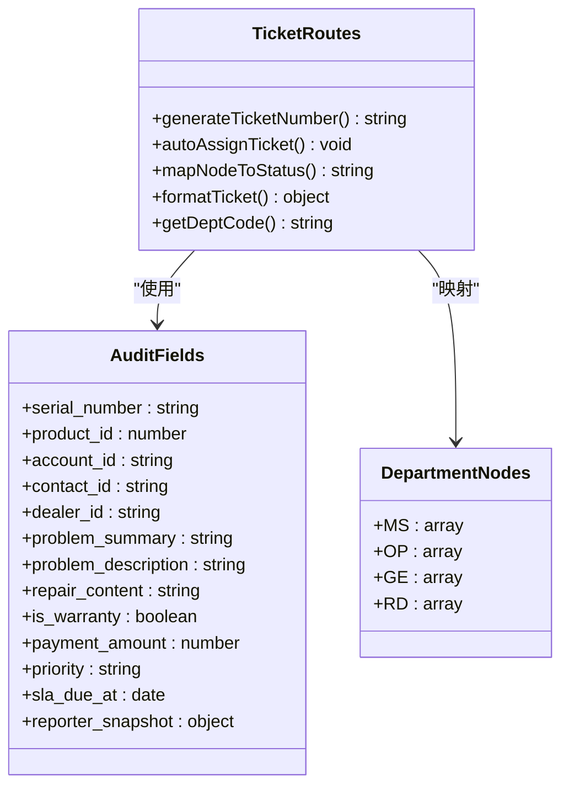
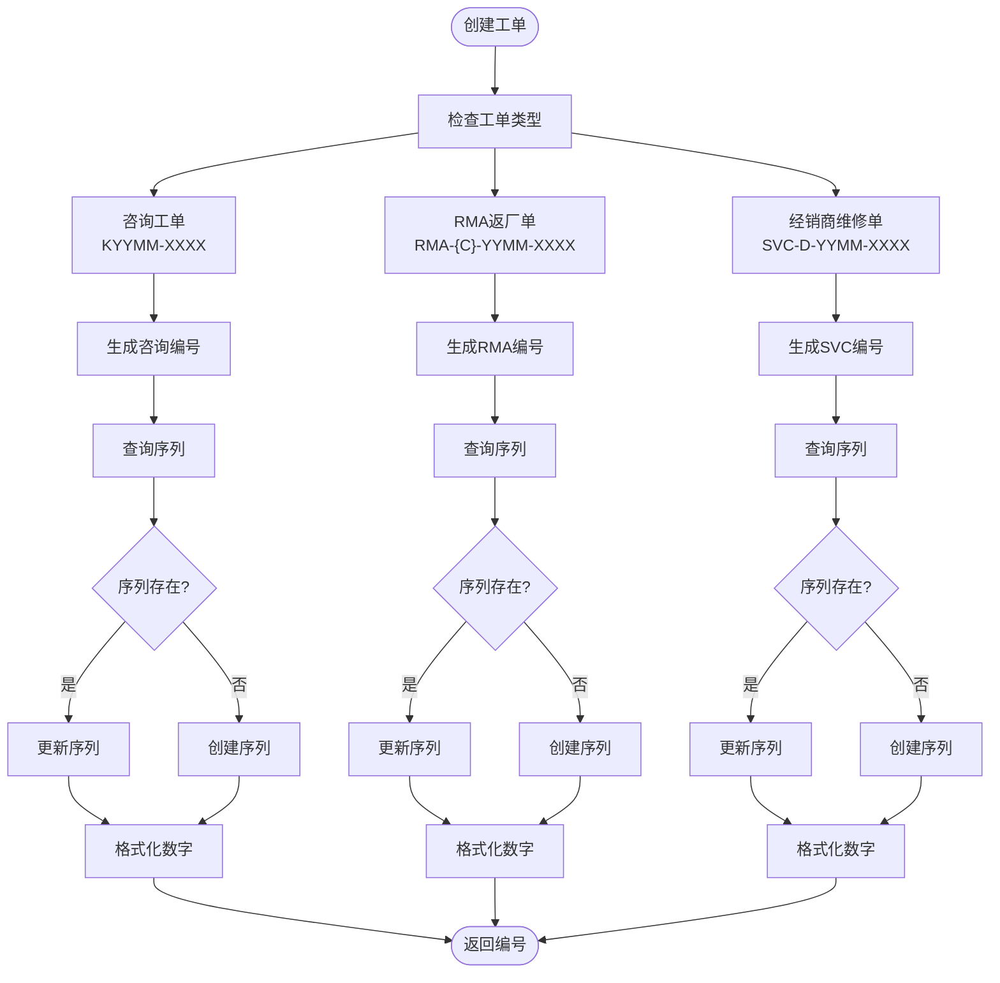
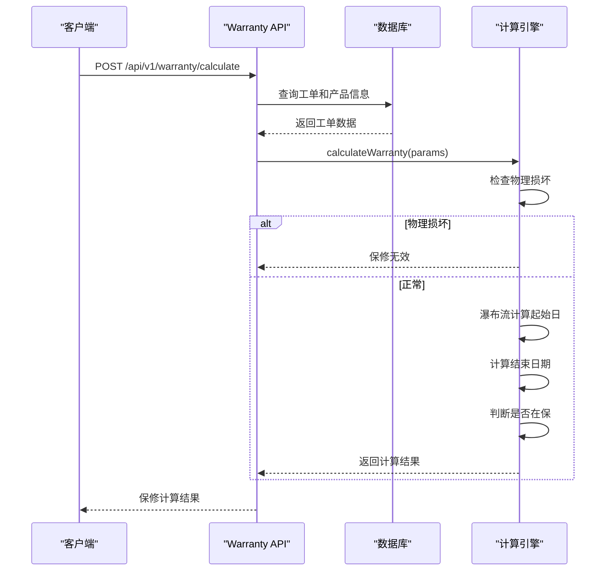
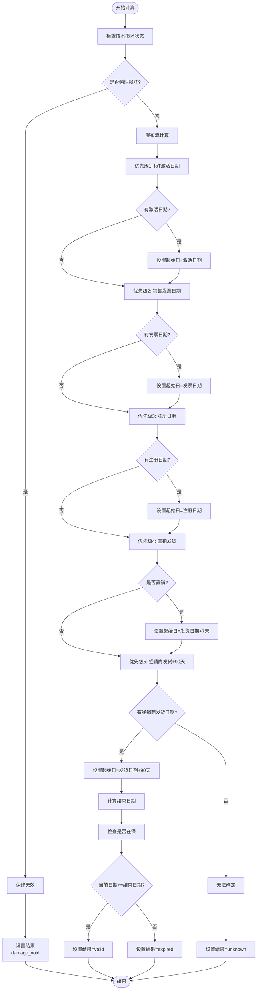
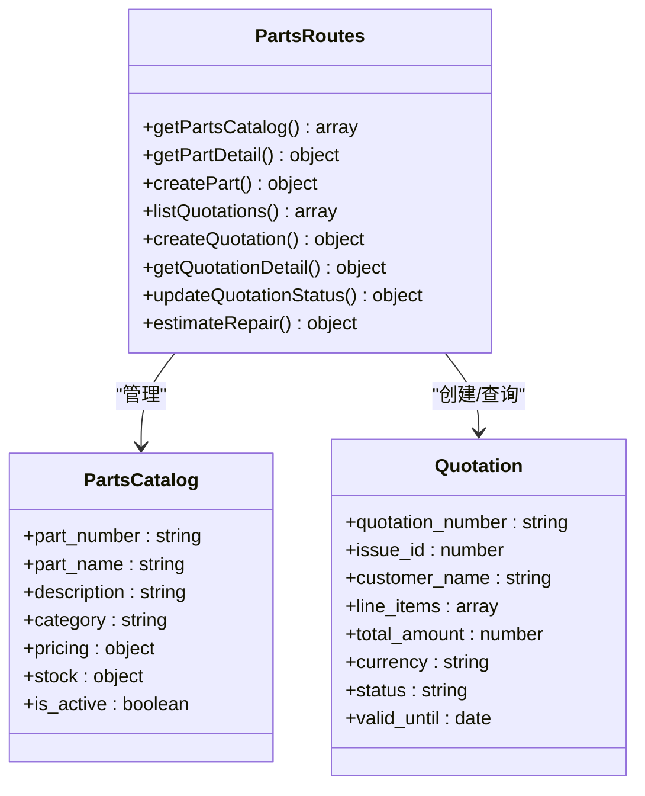
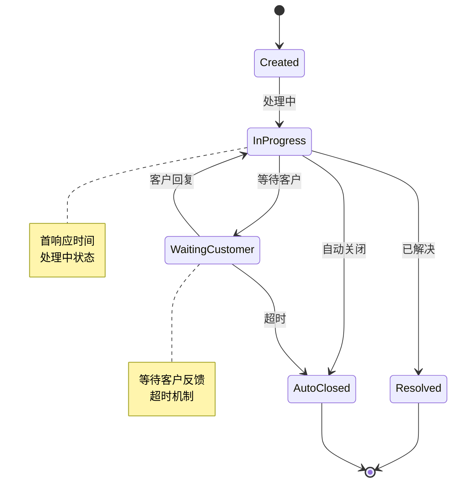
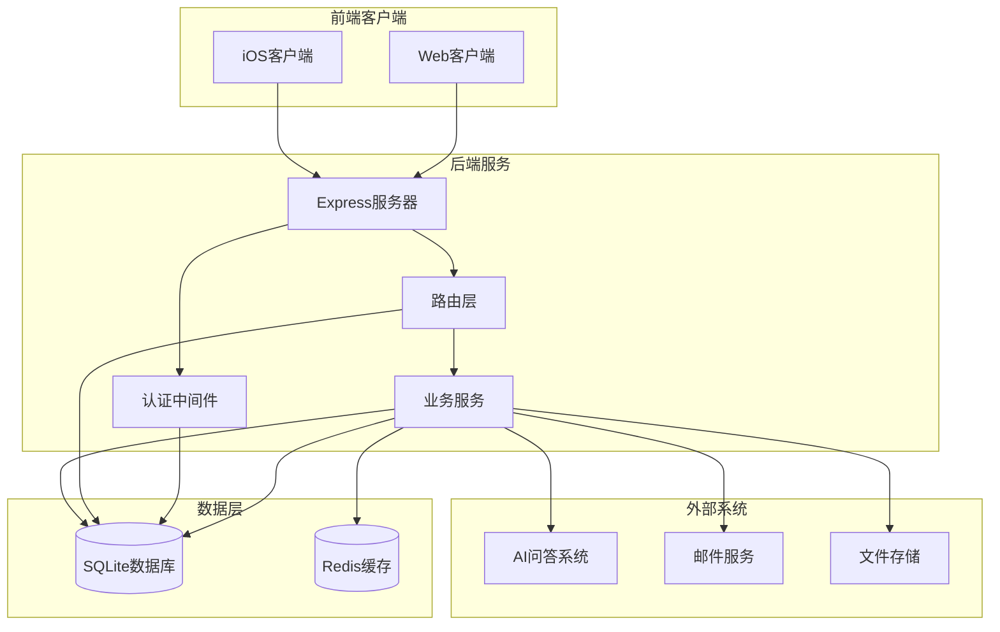
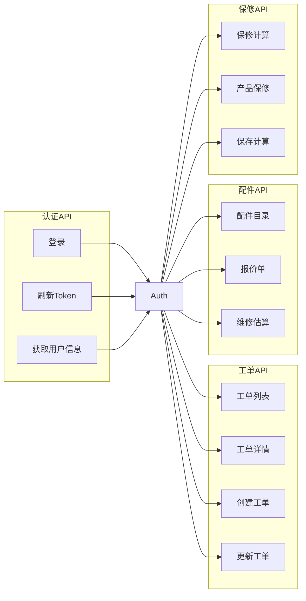

# 服务产品需求文档（PRD）

<cite>
**本文档引用的文件**
- [Service_PRD.md](file://docs/Service_PRD.md)
- [Service_PRD_P2_warranty_update.md](file://docs/Service_PRD_P2_warranty_update.md)
- [Service_UserScenarios.md](file://docs/Service_UserScenarios.md)
- [Ticket_Creation_Optimization.md](file://docs/Ticket_Creation_Optimization.md)
- [Service_API.md](file://docs/Service_API.md)
- [API_DOCUMENTATION.md](file://docs/API_DOCUMENTATION.md)
- [tickets.js](file://server/service/routes/tickets.js)
- [ticket-activities.js](file://server/service/routes/ticket-activities.js)
- [service-records.js](file://server/service/routes/service-records.js)
- [parts.js](file://server/service/routes/parts.js)
- [warranty.js](file://server/service/routes/warranty.js)
- [AttachmentZone.tsx](file://client/src/components/Service/AttachmentZone.tsx)
- [TicketCreationModal.tsx](file://client/src/components/Service/TicketCreationModal.tsx)
</cite>

## 目录
1. [项目概述](#项目概述)
2. [系统架构](#系统架构)
3. [核心组件](#核心组件)
4. [架构总览](#架构总览)
5. [详细组件分析](#详细组件分析)
6. [依赖关系分析](#依赖关系分析)
7. [性能考量](#性能考量)
8. [故障排除指南](#故障排除指南)
9. [结论](#结论)
10. [附录](#附录)

## 项目概述

Longhorn 是 Kinefinity 的产品服务闭环系统，旨在构建以"客户服务"为核心的完整生态体系。系统通过三层工单模型（咨询工单、RMA返厂单、经销商维修单）实现从问题响应到知识沉淀的完整闭环。

### 系统定位与愿景

**从被动响应到主动赋能**
- ❌ 过去：被动接收问题、手工记录、Excel跟踪、经验难沉淀
- ✅ 现在：主动服务管理、智能协同、知识积累、数据驱动决策

**连接三方，形成闭环**
```
        ┌──────────────────────────────────────┐
        │         客户（终端用户）              │
        │    购买产品、使用产品、反馈问题       │
        └─────────┬──────────────┬─────────────┘
                  │              │
     ┌────────────┘              └────────────┐
     │ 直客渠道                    经销商渠道  │
     │ (直接联系Kine)            (通过经销商)  │
     ▼                                        ▼
┌─────────────────┐              ┌─────────────────┐
│  Kinefinity     │◄─ 协作/共享 ─┤  经销商         │
│  (服务中枢)     │              │  (服务延伸)     │
├─────────────────┤              ├─────────────────┤
│ 市场部│生产部   │              │ 一线支持        │
│ 服务  │维修     │              │ 经销商维修      │
│ 前端  │执行     │              │ 配件管理        │
└─────────────────┘              └─────────────────┘
         │
         │ 三种工单
         ├─────────────┬─────────────┐
         ▼             ▼             ▼
    咨询工单(K)   RMA返厂单      经销商维修单
                                   (SVC)
         │             │             │
         └─────────────┴─────────────┘
                       ▼
          ┌────────────┼────────────┐
          ▼            ▼            ▼
    工单管理    知识沉淀    数据洞察
```

### 三大核心价值

**1. 服务闭环管理**
- 统一工单体系：咨询→RMA返厂→经销商维修，全流程追踪
- 智能协同：市场部、生产部、研发部、经销商无缝协作
- 数据透明：实时状态、物流追踪、费用结算自动化

**2. 知识体系构建**
- 问题→解决方案→知识沉淀
- 从个人经验到组织能力
- AI辅助：智能问答、自动分类、知识推荐

**3. 产品持续改进**
- 客户反馈→功能期望→产品迭代
- 问题趋势分析→质量改进
- 数据驱动：从经验决策到数据决策

## 系统架构

### 三层工单模型

系统采用**三层工单模型**，清晰区分咨询、RMA返厂和经销商维修三种场景。

**P2 升级：统一工单表设计**  
后端采用单表多态设计，通过 `ticket_type` 字段区分 inquiry/rma/svc 三种类型。  
新增字段：`current_node` (状态机节点), `priority` (P0/P1/P2), `sla_due_at`, `sla_status`, `participants` (协作者数组)。

```
┌─────────────────────────────────────────────────────────────────────────┐
│                            三层工单模型                                    │
│                                                                         │
│  ┌───────────────┐      ┌───────────────┐      ┌───────────────┐       │
│  │ 咨询工单 (K)   │      │ RMA返厂单     │      │ 经销商维修单   │       │
│  │               │      │               │      │  (SVC)        │       │
│  │ K2602-0001    │      │ RMA-D-2602-001│      │ SVC-D-2602-001│       │
│  ├───────────────┤      ├───────────────┤      ├───────────────┤       │
│  │ • 咨询解答    │      │ • 设备返厂    │      │ • 经销商维修  │       │
│  │ • 问题排查    │ 升级 │ • 检测诊断    │      │ • 配件消耗    │       │
│  │ • 远程协助    │─────▶│ • 维修执行    │      │ • 费用结算    │       │
│  │ • 技术支持    │      │ • 费用结算    │      │ • 经销商处理  │       │
│  │ • 投诉处理    │      │ • 物流跟踪    │      │               │       │
│  └───────────────┘      └───────────────┘      └───────────────┘       │
│       服务入口               RMA返厂层            经销商维修层           │
└─────────────────────────────────────────────────────────────────────────┘
```

**工单类型定义**：

| 工单类型 | ID格式 | 示例 | 说明 |
|---------|--------|------|------|
| **咨询工单** | KYYMM-XXXX | K2602-0001 | 咨询、问题排查等服务的统一入口 |
| **RMA返厂单** | RMA-{C}-YYMM-XXXX | RMA-D-2602-0015 | 设备返回Kinefinity总部维修，每台设备独立RMA号 |
| **经销商维修单** | SVC-D-YYMM-XXXX | SVC-D-2602-0001 | 经销商维修，不寄回总部 |

**编号规则**：
- YYMM：年份后两位 + 月份（如2602=2026年2月）
- XXXX：月度序号，0001-9999为十进制，超过9999自动转16进制(A000-FFFF)
- 每月序号重置，最大容量65535条/月
- RMA中的 {C} 为渠道代码：D=Dealer（经销商），C=Customer（直客）

### 服务优先级与 SLA 体系

**P2 升级**：统一使用 P0/P1/P2 优先级体系，涵盖响应、诊断、维修、完结全流程 SLA。

**P0/P1/P2：统一服务优先级**

| 优先级 | 业务定义 | 触发条件 | MS 首响 | OP 诊断 | OP 维修 | 总承诺周期 |
|--------|---------|---------|--------|--------|--------|----------|
| **P0 紧急** | CRITICAL | VVIP客户、新机开箱即损(DOA)、剧组停机事故 | 2小时 | 4小时 | 24小时 | <36小时 |
| **P1 优先** | HIGH | VIP客户、经销商加急、核心功能失效 | 8小时 | 24小时 | 48小时 | 3工作日 |
| **P2 标准** | NORMAL | 标准客户、常规故障/咨询 | 24小时 | 48小时 | 5天 | 7工作日 |

**SLA 计算逻辑**：
- **初始化**：创建工单时，优先级默认等于客户 `service_tier` 对应的等级
- **计时重置**：当状态变更时，`node_entered_at` 更新为 `NOW()`，重新计算 `sla_due_at`
- **SLA 状态**：`normal` (正常) / `warning` (剩余<25%) / `breached` (已超时) [COMPLETED v12.3.0]
- **统计字段**：`breach_counter` 累计超时次数 [COMPLETED v12.3.0]

**Loaner Gear（备机）触发逻辑**：
- **触发条件**：VVIP/机构客户 + P1优先维修（预估3个工作日）
- **系统提示**：创建RMA或报价确认时，系统提示"维修预估需3天，是否申请备机？"
- **状态字段**：`loaner_requested: boolean`，`loaner_status: enum(pending/approved/shipped/returned)`
- **初期实现**：手动处理（市场部协调），Phase 4后期自动化

## 核心组件

### 用户与服务职责

**P2 升级：角色与权限模型**

**角色缩写与核心职责**：

| 缩写 | 全称 | 中文角色 | 核心职责与数据边界 |
|------|---------------------|---------|----------------------------------------------|
| **MS** | Marketing & Service | 市场/客服 | **全知全能 (Global Hub)**。负责客户沟通、报价、收款、物流指令。拥有 CRM、IB、工单的全局读写权限。 |
| **OP** | Operations | 生产运营 | **受限执行 (Restricted Doer)**。负责收发货、维修、备件。对 CRM/IB 默认不可见，仅通过工单获得"穿透式"技术视图。 |
| **RD** | R&D | 研发 | **受限专家 (Restricted Expert)**。不持有工单，仅通过 @ 协作提供技术建议。对 CRM/IB 默认不可见。 |
| **GE** | Finance | 财务 | **资金监管 (Gatekeeper)**。负责确认收款、库存审计。 |
| **DL** | Dealer | 经销商 | **外部伙伴 (Partner)**。Phase 1 由 MS 代理录入；Phase 2 自行登录。仅见私有数据。 |

**数据安全与权限架构**

**核心原则：隔离与穿透**
- **数据隔离 (Data Silo)**：OP/RD 默认无权访问 CRM（客户/经销商列表）及 IB（全量资产库）
- **按需穿透 (Just-in-Time Access)**：OP/RD 只有在成为工单的 Assignee 或 Participant 时，才获得该工单关联资产的只读权限

**视图分级 (View Scoping)**：

| 视图类型 | 适用角色 | 可见字段 | 隐藏字段 |
|---------|---------|---------|----------|
| **商业视图 (Commercial View)** | MS | 完整 IB 信息，含 Sold To、合同号、开票日及价格 | - |
| **技术视图 (Technician View)** | OP/RD | 序列号、固件版本、生产日期、过往维修履历 | 价格、客户联系方式、经销商渠道 |

**协作机制：@Mention 与参与者**

**提及即邀请 (Mention = Invite)**：@Mention 是驱动权限授予的核心交互。
- **前端交互**：用户在评论框输入 `@陈高松` 并发送
- **后端逻辑**：
  1. 检测到 @ 符号，校验被提及用户是否已在 `tickets.participants`
  2. 若不在，自动追加到参与者数组
  3. 被提及用户立即获得该工单及关联资产的受邀可见权限
  4. 触发高优先级通知

### 返修管理体系

**重要区分**：返修涉及多种场景，需要区分处理流程和结算方式。

```
返修场景
├── A. 客户返修（寄回总部）
│   ├── A1. 国内客户直接寄修
│   └── A2. 海外客户通过经销商寄修，也可能直接寄回总部维修
│
├── B. 经销商维修（不寄回总部）
│   ├── B1. 一级经销商：使用库存配件维修
│   └── B2. 二级经销商：申请配件后维修
│
└── C. 生产问题/内部样机
  └── 内部流程，不涉及客户收费
```

**场景与收费对照**：

| 场景 | 维修地点 | 配件来源 | 收费对象 | 结算方式 |
|-----|---------|---------|---------|---------|
| A1 国内客户寄修 | 深圳总部 | 总部库存 | 客户（过保） | 单次PI |
| A2 海外客户寄修 | 深圳总部 | 总部库存 | 客户（过保） | 单次PI |
| B1 一级经销商维修 | 经销商 | 经销商库存 | 客户（过保） | 月度/季度结算 |
| B2 二级经销商维修 | 经销商 | 临时发货 | 客户（过保） | 单次PI |
| C 生产问题/样机 | 深圳总部 | 总部库存 | 内部（无） | 不收费 |

### 维修配件SKU体系

**SKU格式**: `S` + `物料ID`（部分老型号配件无SKU编码）

**价格支持**: CNY / USD / EUR 三种货币

**配件分类概览** (共74个配件):

| 分类 | 配件数量 | 价格区间(USD) |
|-----|---------|--------------|
| EAGLE EVF | 3 | $68 - $586 |
| MAVO Edge/mark2 | 29 | $19 - $2499 |
| TERRA/MAVO S35/LF | 14 | $39 - $1599 |
| 监看 | 9 | $69 - $299 |
| 转接卡口 | 8 | $49 - $399 |
| KineBACK | 3 | $109起 |
| KineMAG Nano | 1 | $79 |
| UPS底座 | 1 | - |
| 供电 | 4 | - |
| 线缆 | 2 | - |

### 产品族群与配件兼容规则

为避免产品生命周期和配件兼容关系被混用，服务系统在产品层面引入 4 个具有不同服务逻辑的族群，用于驱动工单创建、配件候选列表和维修报价规则。

**A 类：在售电影摄影机 (Current Cine Cameras)**
- 范围：当前主力销售和维护的电影摄影机，如 MAVO Edge 8K / MAVO Edge 6K / MAVO mark2 等。
- 服务特性：
  - 在工单创建和产品选择界面中默认优先展示。
  - 配件候选列表优先显示新一代专属配件（如 Edge/mark2 专用兔笼、KineMAG Nano 存储卡等）。

**B 类：存档/历史机型 (Archived Cine Cameras)**
- 范围：已停产但仍提供维修服务的机型，如 MAVO LF、MAVO S35、Terra 4K/6K 等。
- 服务特性：
  - 前端需折叠或明确标记为「历史机型」，避免干扰新用户选型，但仍支持创建工单和返修。
  - 仅关联老一代专属配件（如 KineMAG SSD (SATA)、老款手柄等），不暴露新一代专属配件。

**C 类：电子寻像器 (e-Viewfinder)**
- 范围：独立的电子取景系统，如 Eagle SDI / Eagle HDMI 等电子寻像器。
- 服务特性（关键）：
  - 创建与 C 类产品相关的咨询工单 / RMA 时，**必须填写「宿主设备信息 (Host Device)」**：
    - **宿主类型** (`host_device_type`): Enum
      - `KINEFINITY_CAMERA`: Kinefinity 电影机
      - `THIRD_PARTY_CAMERA`: 第三方相机
    - **宿主品牌** (`host_brand`): Enum
      - Kinefinity / Arri / Sony / Canon / Blackmagic / RED / Panasonic / Nikon / Z CAM / Other
    - **宿主机型** (`host_model`): String
      - 例如「MAVO Edge 6K」或「Canon C400」或「Sony FX6」
    - **连接方式** (`connection_type`): Enum
      - SDI / HDMI / Other
  - **字段级定义的必要性**：
    - 这些是**结构化数据**，而非备注文本，确保后续在质量仪表盘中可以分析出"Sony FX6 兼容性问题高发"这样的结论
    - 前端创建工单时，根据 `product_family = C` 自动显示宿主设备信息录入界面
    - 数据库字段设计需预留这些枚举类型，避免后期改造成本
  - 流程分流：
    - 如宿主类型 = 第三方相机，则工单默认归类为「兼容性排查」场景，供研发/产品集中分析第三方兼容性问题；
    - 如宿主类型 = Kinefinity 电影机，则按常规硬件问题进入 RMA / 经销商维修流程。

**D 类：通用配件 (Universal Accessories)**
- 范围：严格限定为跨代通用、与具体机型兼容性弱相关的配件，例如：
  - GripBAT 系列电池等标准供电配件；
  - Magic Arm / Dark Tower 等安装类通用附件。
- 约束：
  - D 类配件在创建工单时可以不强制绑定具体机型，但系统仍鼓励填写实际关联机型以便后续分析。
  - **KineMON 系列监视器仅保证与 Kinefinity 电影摄影机配合使用，不属于 D 类通用配件**；在第三方机型场景下，系统需提示兼容性风险，不将其视作「通用显示器」。

**核心业务规则**

1. **存储卡隔离规则**
   - KineMAG Nano：仅当产品属于 A 类（Edge/mark2 系列）时，才作为配件候选出现；
   - KineMAG SSD (SATA)：仅当产品属于 B 类（MAVO LF/Terra 系列）时，才作为配件候选出现；
   - 目的：防止经销商/内部选错卡型导致备件发错，降低返工和物流成本。

2. **电子寻像器 + 宿主设备规则 (Eagle 兼容性)**
   - 当产品族群 = C 且宿主类型 = 第三方相机时：
     - 工单自动标记为「兼容性排查」，在统计报表和研发视图中可单独拉出；
     - 有利于识别「第三方兼容性问题」趋势，而不与常规硬件故障混在一起。
   - 当产品族群 = C 且宿主类型 = Kinefinity 电影机时：
     - 视为常规硬件/稳定性问题，走标准 RMA / 经销商维修流程，无需特殊标记。

**以上产品族群与配件规则，作为服务系统的**业务约束层**，为前端产品选择、配件候选过滤和报表统计提供统一依据，避免「在售/历史机型」「通用/专用配件」混用导致的误选和沟通成本。

### 保修计算引擎

**P2 升级**：系统采用 "瀑布流 (Waterfall)" 逻辑自动计算保修期起始日。

**计算优先级**：

| 优先级 | 条件 | 说明 |
|-------|------|------|
| 1 (IoT) | `activation_date` 存在 | 联网激活时间为准（未来 IoT 设备） |
| 2 (人工) | `sales_invoice_date` 存在 | 有发票凭证，以发票日期为准 |
| 3 (注册) | `registration_date` 存在 | 官网注册日期为准 |
| 4 (直销) | `sales_channel == DIRECT` | 按 ship_date + 7天 |
| 5 (兜底) | 均为 NULL | 按 `ship_to_dealer_date` + 90天 |

**计算结果字段**：
- `warranty_source`: 追踪保修期按哪个标准计算（IOT_ACTIVATION / INVOICE_PROOF / REGISTRATION / DIRECT_SHIPMENT / DEALER_FALLBACK）
- `warranty_start_date`: 最终计算出的保修起始日
- `warranty_end_date`: 保修截止日
- `warranty_status`: ACTIVE / EXPIRED / VOID

## 架构总览

### 系统功能三层架构

系统采用**三层架构**，清晰区分「作业」「知识」「档案」三类功能：

```
┌─────────────────────────────────────────────────────────────────────────┐
│                          系统功能三层架构                                 │
│                                                                         │
│  ┌───────────────────┐  ┌───────────────────┐  ┌───────────────────┐  │
│  │  服务作业台        │  │  技术知识支撑      │  │  档案和基础信息    │  │
│  │  (Workbench)      │  │  (Tech Hub)       │  │  (Archives)       │  │
│  ├───────────────────┤  ├───────────────────┤  ├───────────────────┤  │
│  │ 处理每天变动的     │  │ 获取解决能力的     │  │ 管理基础资源       │  │
│  │ 工单（动态作业）   │  │ 知识中心           │  │ （基石数据库）     │  │
│  ├───────────────────┤  ├───────────────────┤  ├───────────────────┤  │
│  │ • 咨询工单        │  │ • Tech Hub │  │ • 客户档案         │  │
│  │ • RMA返厂单       │  │ • 智能问答(Bokeh) │  │ • 设备资产         │  │
│  │ • 经销商维修单    │  │ • 公告与培训      │  │ • 物料与价目       │  │
│  └───────────────────┘  └───────────────────┘  └───────────────────┘  │
└─────────────────────────────────────────────────────────────────────────┘
```

### 服务作业台 (Workbench)

**客服和工程师的一线战场**：处理每天变动的工单。

**咨询工单处理**
- **功能入口**：`/workbench/inquiry-tickets`
- **核心功能**：
  - 工单列表与筛选：按状态、优先级、负责人筛选
  - 工单详情与回复：查看完整沟通历史、添加回复
  - 知识库快速引用：从知识库拖拽内容到回复框
  - 转RMA/维修单：判断需要维修时升级工单
  - 客户上下文：自动显示客户历史、设备信息

**RMA返厂单处理**
- **功能入口**：`/workbench/rma-tickets`
- **核心功能**：
  - RMA创建：从咨询升级 / 直接创建
  - 设备资产自动关联：输入SN码自动查询保修状态
  - 保修状态判定：自动判定保内/保外，计算费用
  - 备件调用与报价：从物料库选择配件，自动计算价格
  - 维修流程跟踪：物流→收货→检测→维修→发货
  - 异常审批：超预估费用需客户确认

## 详细组件分析

### 工单路由组件分析

#### 工单路由核心功能



**图表来源**
- [tickets.js:15-82](file://server/service/routes/tickets.js#L15-L82)

**章节来源**
- [tickets.js:15-82](file://server/service/routes/tickets.js#L15-L82)

#### 工单编号生成机制



**图表来源**
- [tickets.js:89-130](file://server/service/routes/tickets.js#L89-L130)

**章节来源**
- [tickets.js:89-130](file://server/service/routes/tickets.js#L89-L130)

### 保修计算引擎

#### 保修计算核心逻辑



**图表来源**
- [warranty.js:34-81](file://server/service/routes/warranty.js#L34-L81)
- [warranty.js:211-285](file://server/service/routes/warranty.js#L211-L285)

**章节来源**
- [warranty.js:34-81](file://server/service/routes/warranty.js#L34-L81)
- [warranty.js:211-285](file://server/service/routes/warranty.js#L211-L285)

#### 保修计算算法



**图表来源**
- [warranty.js:211-285](file://server/service/routes/warranty.js#L211-L285)

**章节来源**
- [warranty.js:211-285](file://server/service/routes/warranty.js#L211-L285)

### 配件管理系统

#### 配件目录与报价管理



**图表来源**
- [parts.js:15-660](file://server/service/routes/parts.js#L15-L660)

**章节来源**
- [parts.js:15-660](file://server/service/routes/parts.js#L15-L660)

### 服务记录系统

#### 服务记录生命周期



**图表来源**
- [service-records.js:15-798](file://server/service/routes/service-records.js#L15-L798)

**章节来源**
- [service-records.js:15-798](file://server/service/routes/service-records.js#L15-L798)

### 工单创建与附件管理

#### 工单创建流程优化

**P2 升级：增强的工单创建工作流程**

系统引入了全新的工单创建流程优化方案，重点关注用户体验和数据完整性。

**全局快捷入口**：
- 侧边栏常驻 `[ + ]` 按钮
- 快捷键支持：`Alt + N` 直接唤起新建弹窗
- 工作空间集成：在"我的任务"和"部门工单"顶部增加"快速新建"磁贴

**智能表单设计**：
- CRM 优先：优先从现有 `accounts` 和 `contacts` 表中搜索客户
- 类型差分：咨询工单极简表单，RMA工单强制S/N，SVC工单必须关联经销商
- 动态加载：点击新建后，系统先提供工单类型选择，随后动态加载对应表单

**AI 协作建模**：
- "Copilot" 式输入体验：支持文本/截图智能预填
- S/N 校验增强：AI 解析出 S/N 后，系统自动发起后台查询
- 协作模式：AI 预处理 → 人工校验 → 系统补全

**智能工单枢纽 (Smart Ticket Hub)**：
- 左右互动分屏布局
- 左区：智能沙盒 (The AI Sandbox) - 支持全格式输入和拖拽
- 右区：结构化蓝图 (The Formal Blueprint) - 动态骨架和三级颜色反馈

**章节来源**
- [Ticket_Creation_Optimization.md:1-94](file://docs/Ticket_Creation_Optimization.md#L1-L94)

#### 附件管理功能

**增强的附件管理功能**：

**AttachmentZone 组件**：
- 支持拖拽上传：图片、视频、PDF、纯文本
- 实时预览：拖拽时显示文件类型图标
- 文件移除：悬停显示删除按钮
- 大小限制：最大 50MB

**TicketCreationModal 中的附件处理**：
- 附件预览：在表单右侧显示已选择文件
- 多文件支持：支持同时上传多个附件
- 文件类型识别：自动识别图片、视频、文档类型
- 删除功能：每个附件都有独立的删除按钮

**后端附件处理**：
- 工单级附件：`activity_id = NULL`
- 附件类型区分：图片、视频、文档自动分类
- 文件路径管理：统一的文件存储和访问路径

**章节来源**
- [AttachmentZone.tsx:1-108](file://client/src/components/Service/AttachmentZone.tsx#L1-L108)
- [TicketCreationModal.tsx:940-970](file://client/src/components/Service/TicketCreationModal.tsx#L940-L970)
- [tickets.js:1652-1667](file://server/service/routes/tickets.js#L1652-L1667)
- [ticket-activities.js:315-344](file://server/service/routes/ticket-activities.js#L315-L344)

## 依赖关系分析

### 系统依赖图



**图表来源**
- [API_DOCUMENTATION.md:10-105](file://docs/API_DOCUMENTATION.md#L10-L105)

**章节来源**
- [API_DOCUMENTATION.md:10-105](file://docs/API_DOCUMENTATION.md#L10-L105)

### API 依赖关系



**图表来源**
- [Service_API.md:25-800](file://docs/Service_API.md#L25-L800)

**章节来源**
- [Service_API.md:25-800](file://docs/Service_API.md#L25-L800)

## 性能考量

### 工单查询性能优化

系统采用多种策略来优化工单查询性能：

1. **分页查询**：默认每页20条记录，支持自定义页大小
2. **索引优化**：对常用查询字段建立索引
3. **条件过滤**：支持多维度条件过滤，减少数据传输
4. **懒加载**：详情页面按需加载相关数据

### 缓存策略

- **Redis缓存**：热点数据缓存，减少数据库压力
- **CDN加速**：静态资源CDN分发
- **数据库连接池**：优化数据库连接复用

### API 性能监控

- **响应时间监控**：关键API响应时间统计
- **错误率监控**：API错误率实时监控
- **并发控制**：限流和熔断机制

## 故障排除指南

### 常见问题诊断

**工单编号生成失败**
- 检查 `ticket_sequences` 表数据完整性
- 验证序列号格式转换逻辑
- 确认月度重置机制

**保修计算异常**
- 验证产品激活状态
- 检查发票和注册信息
- 确认计算优先级顺序

**权限访问问题**
- 检查用户角色和部门映射
- 验证部门协作权限
- 确认经销商数据隔离

**附件上传失败**
- 检查文件大小限制（50MB）
- 验证文件类型支持（image/*, video/*, application/pdf, text/plain）
- 确认文件存储路径权限

**章节来源**
- [tickets.js:89-130](file://server/service/routes/tickets.js#L89-L130)
- [warranty.js:34-81](file://server/service/routes/warranty.js#L34-L81)
- [AttachmentZone.tsx:24-32](file://client/src/components/Service/AttachmentZone.tsx#L24-L32)

### 日志记录与监控

系统实现完整的日志记录机制：

- **操作日志**：记录用户关键操作
- **错误日志**：捕获系统异常和错误
- **性能日志**：监控API响应时间和数据库查询
- **审计日志**：记录数据变更历史

## 结论

Longhorn 服务产品需求文档全面阐述了以客户服务为核心的完整生态体系。通过三层工单模型、统一的优先级体系、智能的保修计算引擎、完善的配件管理系统和增强的工单创建工作流程，系统实现了从问题响应到知识沉淀的完整闭环。

**主要成就**：
1. **统一工单体系**：咨询→RMA→经销商维修的全流程管理
2. **智能协作**：多部门无缝协作，数据驱动决策
3. **知识积累**：从个人经验到组织能力的转变
4. **持续改进**：基于客户反馈的产品迭代机制
5. **用户体验提升**：智能工单创建和附件管理功能

**未来发展方向**：
1. **AI增强**：进一步提升智能问答和自动分类能力
2. **移动端优化**：完善iOS客户端功能
3. **自动化流程**：减少人工干预，提高处理效率
4. **数据分析**：深入挖掘服务数据，提供预测性洞察
5. **附件管理扩展**：支持更多文件类型和自动分类功能

该系统为 Kinefinity 的客户服务提供了强有力的技术支撑，有助于提升客户满意度和产品竞争力。

## 附录

### API 设计规范

**基础规范**：
- **协议**：HTTPS
- **格式**：JSON
- **编码**：UTF-8
- **版本**：URL路径版本控制 `/api/v1/`
- **认证**：Bearer Token (JWT)

**响应格式**：
```json
{
  "success": true,
  "data": {},
  "meta": {
    "page": 1,
    "page_size": 20,
    "total": 100
  }
}
```

**错误响应**：
```json
{
  "success": false,
  "error": {
    "code": "VALIDATION_ERROR",
    "message": "问题描述不能为空",
    "details": []
  }
}
```

**章节来源**
- [API_DOCUMENTATION.md:35-84](file://docs/API_DOCUMENTATION.md#L35-L84)