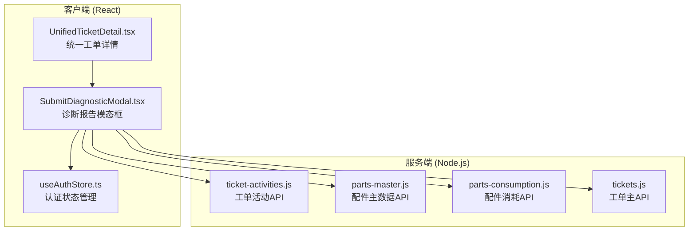
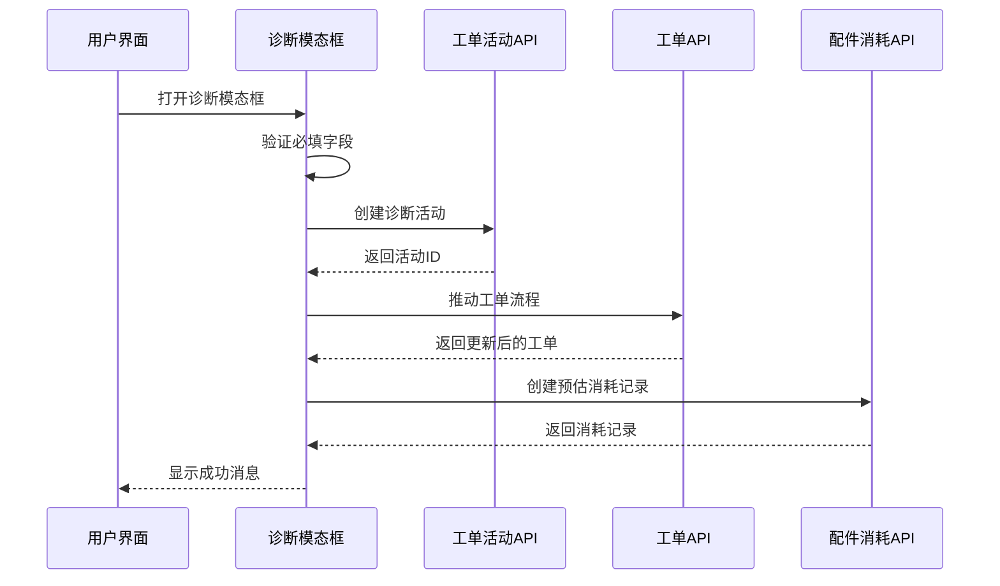
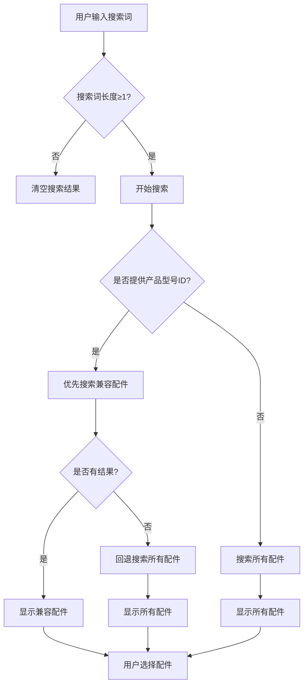

# 提交诊断报告模态框

<cite>
**本文档引用的文件**
- [SubmitDiagnosticModal.tsx](file://client/src/components/Workspace/SubmitDiagnosticModal.tsx)
- [UnifiedTicketDetail.tsx](file://client/src/components/Workspace/UnifiedTicketDetail.tsx)
- [parts-master.js](file://server/service/routes/parts-master.js)
- [ticket-activities.js](file://server/service/routes/ticket-activities.js)
- [parts-consumption.js](file://server/service/routes/parts-consumption.js)
- [tickets.js](file://server/service/routes/tickets.js)
- [useAuthStore.ts](file://client/src/store/useAuthStore.ts)
</cite>

## 目录
1. [简介](#简介)
2. [项目结构](#项目结构)
3. [核心组件](#核心组件)
4. [架构概览](#架构概览)
5. [详细组件分析](#详细组件分析)
6. [依赖关系分析](#依赖关系分析)
7. [性能考虑](#性能考虑)
8. [故障排除指南](#故障排除指南)
9. [结论](#结论)

## 简介

提交诊断报告模态框是 Longhorn 工单管理系统中的关键组件，专门用于技术工程师在诊断环节提交设备故障诊断结果和维修建议。该组件提供了完整的诊断流程界面，包括故障判定、维修建议、配件预估、工时估算、技术损坏评估、保修建议以及多媒体附件上传等功能。

该模态框集成在统一工单详情页面中，当工单处于诊断节点（op_diagnosing）时，技术工程师可以点击相应的操作按钮打开此模态框进行诊断报告的提交。系统会自动将诊断信息转换为工单活动，并推动工单流程进入商务审核阶段。

## 项目结构

Longhorn 采用前后端分离的架构设计，客户端使用 React + TypeScript 开发，服务端基于 Node.js 和 Express 框架。提交诊断报告功能涉及以下主要文件：



**图表来源**
- [SubmitDiagnosticModal.tsx:1-572](file://client/src/components/Workspace/SubmitDiagnosticModal.tsx#L1-L572)
- [UnifiedTicketDetail.tsx:174-2775](file://client/src/components/Workspace/UnifiedTicketDetail.tsx#L174-L2775)

**章节来源**
- [SubmitDiagnosticModal.tsx:1-572](file://client/src/components/Workspace/SubmitDiagnosticModal.tsx#L1-L572)
- [UnifiedTicketDetail.tsx:1-200](file://client/src/components/Workspace/UnifiedTicketDetail.tsx#L1-L200)

## 核心组件

### SubmitDiagnosticModal 组件

SubmitDiagnosticModal 是一个功能完整的诊断报告提交组件，具有以下核心特性：

#### 数据结构定义

组件定义了多个接口来管理不同类型的数据：

- **PartOption**: 配件选项接口，包含配件的基本信息
- **EstimatedPart**: 预估配件接口，包含配件的详细信息和数量
- **SubmitDiagnosticModalProps**: 组件属性接口，定义了所有必要的输入参数

#### 状态管理

组件内部维护了丰富的状态管理机制：

- **表单状态**: 诊断结论、维修建议、技术损坏状态、保修建议、附件文件
- **预估配件状态**: 预估工时、预估配件列表、配件搜索词、配件选项、搜索状态
- **编辑模式支持**: 支持历史数据的编辑和更正功能

#### 功能特性

1. **智能配件搜索**: 支持按产品型号 ID 进行兼容配件搜索，提供自动完成功能
2. **多媒体附件上传**: 支持图片和视频附件的批量上传和管理
3. **工作流集成**: 自动推动工单流程从诊断节点到商务审核节点
4. **预估消耗记录**: 自动生成预估的配件消耗记录
5. **响应式设计**: 提供完整的移动端和桌面端适配

**章节来源**
- [SubmitDiagnosticModal.tsx:6-34](file://client/src/components/Workspace/SubmitDiagnosticModal.tsx#L6-L34)
- [SubmitDiagnosticModal.tsx:40-68](file://client/src/components/Workspace/SubmitDiagnosticModal.tsx#L40-L68)

## 架构概览

提交诊断报告功能采用分层架构设计，确保了良好的可维护性和扩展性：



**图表来源**
- [SubmitDiagnosticModal.tsx:169-236](file://client/src/components/Workspace/SubmitDiagnosticModal.tsx#L169-L236)
- [ticket-activities.js:357-616](file://server/service/routes/ticket-activities.js#L357-L616)

### 数据流分析

诊断报告的提交过程涉及复杂的数据流转：

1. **前端验证**: 组件首先验证必填字段（诊断结论、维修建议、技术损坏状态）
2. **活动创建**: 通过工单活动 API 创建诊断活动，包含元数据和附件
3. **流程推进**: 更新工单状态，推动到商务审核节点
4. **消耗记录**: 为预估的配件创建消耗记录
5. **状态同步**: 更新 UI 状态，显示操作结果

**章节来源**
- [SubmitDiagnosticModal.tsx:169-236](file://client/src/components/Workspace/SubmitDiagnosticModal.tsx#L169-L236)

## 详细组件分析

### 配件搜索与管理

#### 智能搜索算法

组件实现了两级搜索策略来优化配件查找体验：



**图表来源**
- [SubmitDiagnosticModal.tsx:83-115](file://client/src/components/Workspace/SubmitDiagnosticModal.tsx#L83-L115)
- [SubmitDiagnosticModal.tsx:118-142](file://client/src/components/Workspace/SubmitDiagnosticModal.tsx#L118-L142)

#### 预估配件管理

组件提供了完整的预估配件管理功能：

- **添加配件**: 支持重复添加同一配件并自动增加数量
- **移除配件**: 允许用户移除不需要的预估配件
- **数量调整**: 提供数字输入框调整配件数量
- **实时计算**: 自动计算预估总金额

**章节来源**
- [SubmitDiagnosticModal.tsx:144-167](file://client/src/components/Workspace/SubmitDiagnosticModal.tsx#L144-L167)

### 技术损坏评估

组件提供了三种技术损坏状态供用户选择：

| 状态 | 描述 | 颜色标识 |
|------|------|----------|
| no_damage | 无人为损坏 / 正常故障 | 绿色 (#10B981) |
| physical_damage | 人为损坏 / 物理损伤 | 红色 (#EF4444) |
| uncertain | 无法判定 | 黄色 (#FFD200) |

### 保修建议功能

提供三种保修建议供商务部门参考：

- **建议保内**: 保内维修
- **建议保外**: 保外维修  
- **需进一步核实**: 需要更多信息确认

**章节来源**
- [SubmitDiagnosticModal.tsx:421-492](file://client/src/components/Workspace/SubmitDiagnosticModal.tsx#L421-L492)

### 多媒体附件处理

组件支持多种类型的附件上传：

- **图片格式**: JPG, PNG, GIF 等
- **视频格式**: MP4, AVI, MOV 等
- **文件大小限制**: 单个文件最大 10MB
- **批量上传**: 支持一次选择多个文件
- **进度显示**: 实时显示上传进度

**章节来源**
- [SubmitDiagnosticModal.tsx:494-527](file://client/src/components/Workspace/SubmitDiagnosticModal.tsx#L494-L527)

## 依赖关系分析

### 前端依赖关系

```mermaid
graph LR
A[SubmitDiagnosticModal.tsx] --> B[useAuthStore.ts<br/>认证状态]
A --> C[lucide-react<br/>图标库]
A --> D[axios<br/>HTTP客户端]
A --> E[React<br/>核心框架]
F[UnifiedTicketDetail.tsx] --> A<br/>调用模态框
G[parts-master.js] --> A<br/>配件搜索
H[ticket-activities.js] --> A<br/>活动创建
I[parts-consumption.js] --> A<br/>消耗记录
J[tickets.js] --> A<br/>工单更新
```

**图表来源**
- [SubmitDiagnosticModal.tsx:1-4](file://client/src/components/Workspace/SubmitDiagnosticModal.tsx#L1-L4)
- [UnifiedTicketDetail.tsx:40](file://client/src/components/Workspace/UnifiedTicketDetail.tsx#L40)

### 后端 API 依赖

服务端提供了完整的 API 支持：

| API 路由 | 功能 | 权限要求 |
|----------|------|----------|
| GET /api/v1/parts-master | 配件列表查询 | OP/MS/GE/ADMIN |
| POST /api/v1/tickets/:id/activities | 创建工单活动 | 所有用户 |
| POST /api/v1/parts-consumption | 创建消耗记录 | MS/ADMIN |
| PATCH /api/v1/tickets/:id | 更新工单状态 | OP/MS/GE/ADMIN |

**章节来源**
- [parts-master.js:28-157](file://server/service/routes/parts-master.js#L28-L157)
- [ticket-activities.js:357-616](file://server/service/routes/ticket-activities.js#L357-L616)
- [parts-consumption.js:349-369](file://server/service/routes/parts-consumption.js#L349-L369)

## 性能考虑

### 前端性能优化

1. **状态管理优化**: 使用 React Hooks 进行细粒度状态管理，避免不必要的重渲染
2. **搜索防抖**: 配件搜索实现防抖机制，减少 API 调用频率
3. **虚拟滚动**: 对于大量附件的场景，考虑实现虚拟滚动以提升性能
4. **懒加载**: 图片和视频附件采用懒加载策略

### 后端性能优化

1. **数据库索引**: 配件搜索建立适当的数据库索引
2. **分页查询**: 默认每页 50 条记录，支持分页加载
3. **缓存策略**: 对常用查询结果实施缓存机制
4. **并发控制**: 限制同时进行的附件上传数量

## 故障排除指南

### 常见问题及解决方案

#### 1. 配件搜索无结果

**问题描述**: 输入配件名称后无法找到任何结果

**可能原因**:
- 产品型号 ID 不正确
- 配件状态为非激活状态
- 搜索关键词过短

**解决方案**:
- 确认产品型号 ID 的正确性
- 检查配件状态是否为 active
- 尝试使用更具体的搜索关键词

#### 2. 附件上传失败

**问题描述**: 附件上传过程中出现错误

**可能原因**:
- 文件大小超过限制
- 文件格式不支持
- 网络连接不稳定

**解决方案**:
- 检查文件大小是否超过 10MB
- 确认文件格式是否受支持
- 检查网络连接稳定性

#### 3. 工单状态未更新

**问题描述**: 诊断报告提交成功但工单状态未改变

**可能原因**:
- 工单流程权限不足
- 系统配置问题
- 数据库事务异常

**解决方案**:
- 检查用户权限是否足够
- 验证系统配置设置
- 查看服务器日志获取详细错误信息

**章节来源**
- [SubmitDiagnosticModal.tsx:231-235](file://client/src/components/Workspace/SubmitDiagnosticModal.tsx#L231-L235)

### 错误处理机制

组件实现了多层次的错误处理：

1. **前端验证**: 表单提交前的即时验证
2. **API 错误捕获**: 捕获并显示 API 调用错误
3. **用户友好提示**: 提供清晰的错误信息和解决方案

## 结论

提交诊断报告模态框是 Longhorn 工单管理系统中的重要组成部分，它通过以下特点确保了高效的工单处理流程：

1. **完整的诊断功能**: 提供从故障判定到维修建议的全流程支持
2. **智能配件管理**: 基于产品型号的智能配件搜索和推荐
3. **无缝工作流集成**: 自动推动工单流程，无需手动操作
4. **多媒体支持**: 完整的图片和视频附件处理能力
5. **响应式设计**: 适配各种设备和屏幕尺寸

该组件的设计充分体现了现代 Web 应用的最佳实践，通过合理的架构设计和完善的错误处理机制，为用户提供了一致且可靠的服务体验。随着业务需求的发展，该组件还可以进一步扩展更多功能，如智能诊断建议、历史数据分析等。