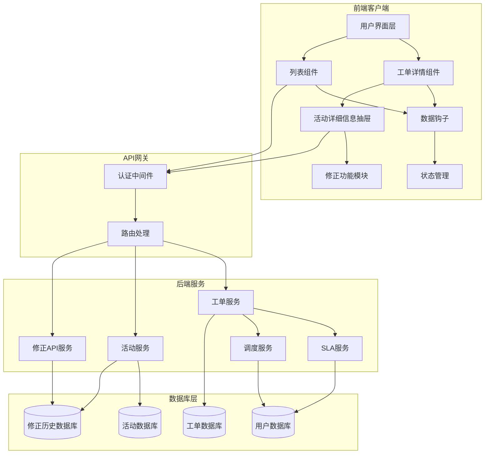
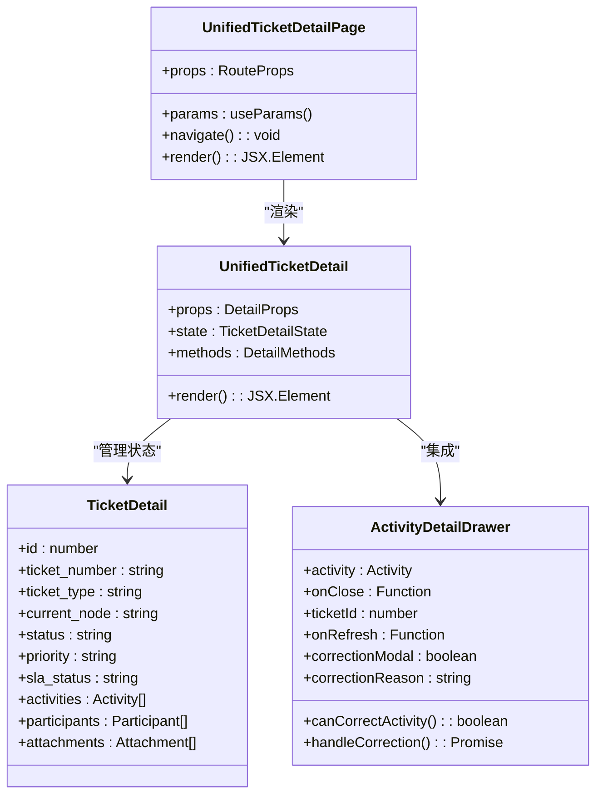
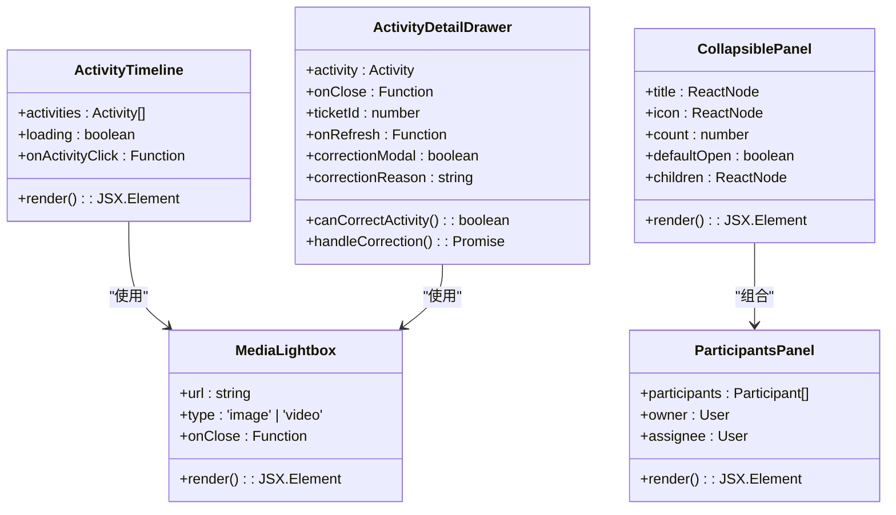
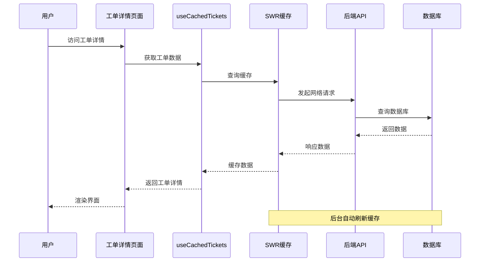
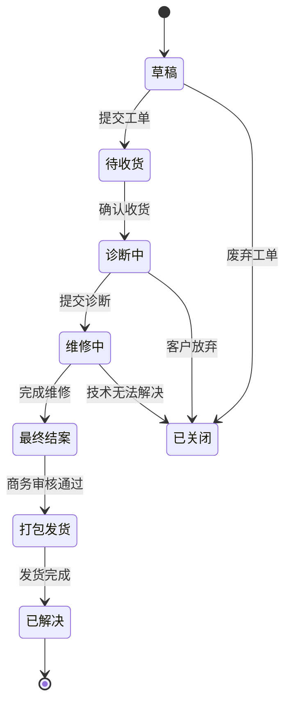
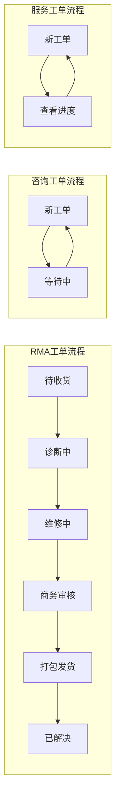
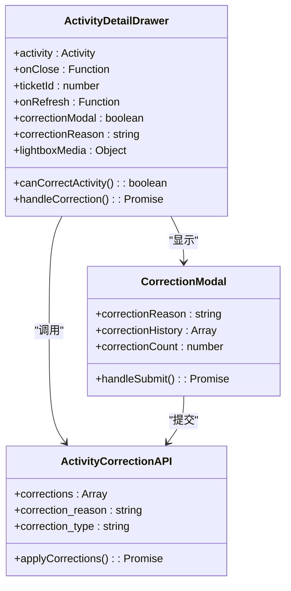
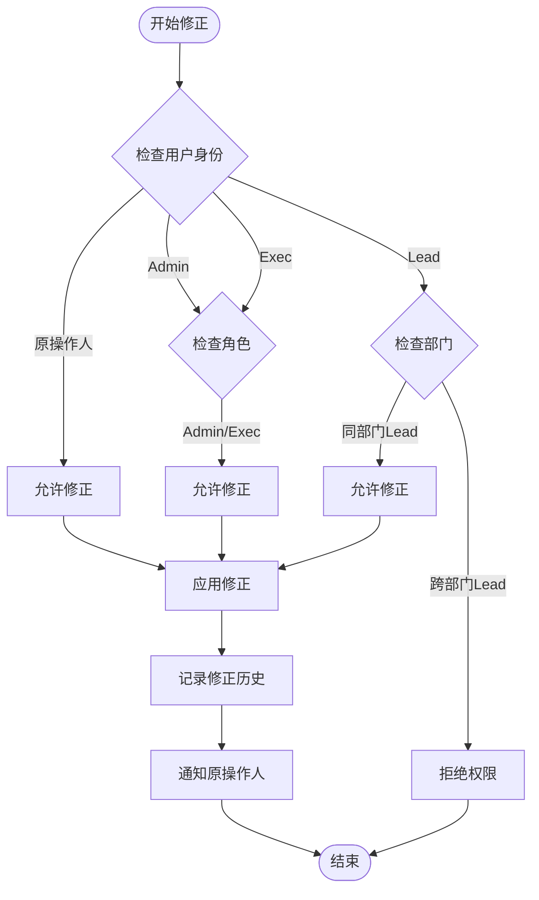
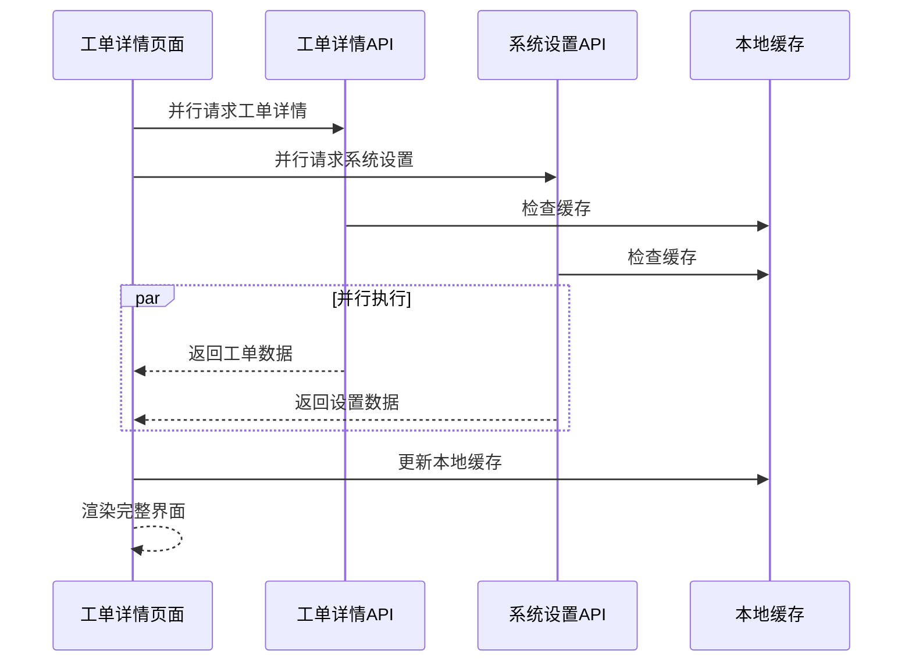
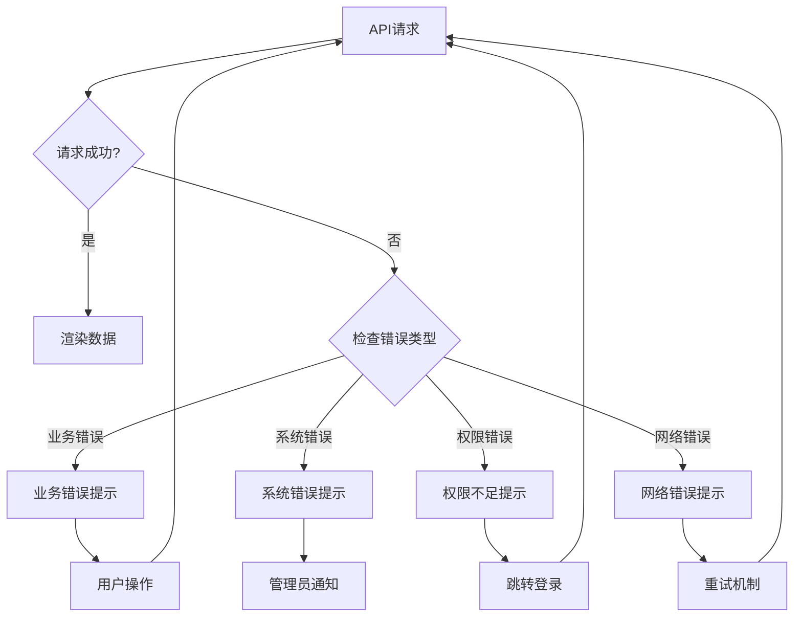

# 工单详情系统

<cite>
**本文档引用的文件**
- [UnifiedTicketDetailPage.tsx](file://client/src/components/Service/UnifiedTicketDetailPage.tsx)
- [UnifiedTicketDetail.tsx](file://client/src/components/Workspace/UnifiedTicketDetail.tsx)
- [TicketDetailComponents.tsx](file://client/src/components/Workspace/TicketDetailComponents.tsx)
- [useCachedTickets.ts](file://client/src/hooks/useCachedTickets.ts)
- [useTicketStore.ts](file://client/src/store/useTicketStore.ts)
- [RMATicketListPage.tsx](file://client/src/components/RMATickets/RMATicketListPage.tsx)
- [InquiryTicketListPage.tsx](file://client/src/components/InquiryTickets/InquiryTicketListPage.tsx)
- [IssueDetailPage.tsx](file://client/src/components/Issues/IssueDetailPage.tsx)
- [tickets.js](file://server/service/routes/tickets.js)
- [ticket-activities.js](file://server/service/routes/ticket-activities.js)
- [ActionBufferModal.tsx](file://client/src/components/Workspace/ActionBufferModal.tsx)
- [Ticket_Refinement_Plan.md](file://docs/Ticket_Refinement_Plan.md)
</cite>

## 更新摘要
**变更内容**
- 新增活动详细信息抽屉的全面修正功能
- 添加多种活动类型的修正请求支持
- 增强诊断报告、OP维修报告、发货信息、评论和内部备注的修正能力
- 实现完整的权限控制和审计追踪机制

## 目录
1. [项目概述](#项目概述)
2. [系统架构](#系统架构)
3. [核心组件分析](#核心组件分析)
4. [数据流分析](#数据流分析)
5. [权限控制机制](#权限控制机制)
6. [工作流处理](#工作流处理)
7. [修正功能增强](#修正功能增强)
8. [性能优化策略](#性能优化策略)
9. [错误处理与调试](#错误处理与调试)
10. [总结](#总结)

## 项目概述

工单详情系统是Longhorn项目中的核心功能模块，负责提供统一的工单管理界面，支持多种工单类型（咨询工单、RMA返修工单、经销商维修工单）的统一展示和操作。该系统采用前后端分离架构，前端使用React构建现代化的用户界面，后端基于Express.js提供RESTful API服务。

系统的核心目标是为用户提供一致的工单管理体验，无论工单类型如何，都能通过统一的界面进行查看、编辑、评论和状态跟踪。**最新更新**增强了活动详细信息抽屉的修正功能，支持多种活动类型的修正请求，包括诊断报告、OP维修报告、发货信息、评论和内部备注。

## 系统架构



**图表来源**
- [UnifiedTicketDetail.tsx:125-442](file://client/src/components/Workspace/UnifiedTicketDetail.tsx#L125-L442)
- [TicketDetailComponents.tsx:756-949](file://client/src/components/Workspace/TicketDetailComponents.tsx#L756-L949)
- [ticket-activities.js:650-815](file://server/service/routes/ticket-activities.js#L650-L815)

## 核心组件分析

### 工单详情页面组件

UnifiedTicketDetailPage作为工单详情的入口组件，负责路由管理和参数传递：



**图表来源**
- [UnifiedTicketDetailPage.tsx:12-35](file://client/src/components/Service/UnifiedTicketDetailPage.tsx#L12-L35)
- [UnifiedTicketDetail.tsx:30-62](file://client/src/components/Workspace/UnifiedTicketDetail.tsx#L30-L62)
- [TicketDetailComponents.tsx:756-820](file://client/src/components/Workspace/TicketDetailComponents.tsx#L756-L820)

### 工具组件库

TicketDetailComponents提供了丰富的UI组件：



**图表来源**
- [TicketDetailComponents.tsx:21-49](file://client/src/components/Workspace/TicketDetailComponents.tsx#L21-L49)
- [TicketDetailComponents.tsx:63-96](file://client/src/components/Workspace/TicketDetailComponents.tsx#L63-L96)
- [TicketDetailComponents.tsx:756-949](file://client/src/components/Workspace/TicketDetailComponents.tsx#L756-L949)

**章节来源**
- [UnifiedTicketDetailPage.tsx:1-38](file://client/src/components/Service/UnifiedTicketDetailPage.tsx#L1-L38)
- [UnifiedTicketDetail.tsx:1-800](file://client/src/components/Workspace/UnifiedTicketDetail.tsx#L1-L800)
- [TicketDetailComponents.tsx:1-799](file://client/src/components/Workspace/TicketDetailComponents.tsx#L1-L799)

## 数据流分析

### 前端数据缓存机制

系统采用SWR库实现智能缓存和数据同步：



**图表来源**
- [useCachedTickets.ts:80-102](file://client/src/hooks/useCachedTickets.ts#L80-L102)

### 工单状态流转

系统实现了完整的工单状态管理：



**图表来源**
- [UnifiedTicketDetail.tsx:550-614](file://client/src/components/Workspace/UnifiedTicketDetail.tsx#L550-L614)

**章节来源**
- [useCachedTickets.ts:1-149](file://client/src/hooks/useCachedTickets.ts#L1-L149)
- [UnifiedTicketDetail.tsx:547-614](file://client/src/components/Workspace/UnifiedTicketDetail.tsx#L547-L614)

## 权限控制机制

### 视角降级系统

系统实现了PRD §7.1中规定的"View As"权限降级机制：


**图表来源**
- [UnifiedTicketDetail.tsx:125-213](file://client/src/components/Workspace/UnifiedTicketDetail.tsx#L125-L213)

### 部门权限矩阵

系统根据工单当前节点动态分配权限：

| 节点类型 | 部门代码 | 权限级别 | 允许操作 |
|---------|---------|---------|---------|
| MS相关节点 | MS | Lead | 编辑、删除、指派 |
| OP相关节点 | OP | Lead | 编辑、删除、指派 |
| GE相关节点 | GE | Lead | 编辑、删除、指派 |
| OP相关节点 | OP | 成员 | 查看、评论 |
| 其他节点 | 任意 | 管理员 | 完全控制 |

**章节来源**
- [UnifiedTicketDetail.tsx:174-213](file://client/src/components/Workspace/UnifiedTicketDetail.tsx#L174-L213)

## 工作流处理

### 节点动作映射

系统为不同工单类型定义了特定的动作映射：



**图表来源**
- [UnifiedTicketDetail.tsx:74-95](file://client/src/components/Workspace/UnifiedTicketDetail.tsx#L74-L95)

### 审计日志系统

所有工单变更都会记录详细的审计信息：

| 变更类型 | 记录内容 | 审计字段 | 触发条件 |
|---------|---------|---------|---------|
| 字段更新 | 旧值→新值 | 所有审计字段 | 任何字段变更 |
| 状态变更 | 节点状态转换 | from_node, to_node | 节点状态改变 |
| 优先级变更 | P0→P2 | from_priority, to_priority | 优先级调整 |
| 指派人变更 | 旧指派人→新指派人 | from_assignee, to_assignee | 指派人更改 |

**章节来源**
- [tickets.js:16-30](file://server/service/routes/tickets.js#L16-L30)
- [tickets.js:1815-1874](file://server/service/routes/tickets.js#L1815-L1874)

## 修正功能增强

### 活动详细信息抽屉

**新增** 活动详细信息抽屉提供了全面的修正功能，支持多种活动类型的修正请求：



**图表来源**
- [TicketDetailComponents.tsx:756-949](file://client/src/components/Workspace/TicketDetailComponents.tsx#L756-L949)
- [TicketDetailComponents.tsx:1282-1345](file://client/src/components/Workspace/TicketDetailComponents.tsx#L1282-L1345)

### 支持的修正活动类型

系统支持以下活动类型的修正请求：

| 活动类型 | 描述 | 修正范围 | 权限要求 |
|---------|------|----------|----------|
| op_repair_report | OP维修报告 | 维修操作、更换零件、工时费用、维修结论 | 原操作人、Lead、Admin、Exec |
| diagnostic_report | 诊断报告 | 故障判定、维修方案、损坏判定、保修建议 | 原操作人、Lead、Admin、Exec |
| shipping_info | 发货信息 | 快递单号、承运商、发货地址、物流状态 | 原操作人、Lead、Admin、Exec |
| comment | 评论 | 评论内容、附件 | 原操作人、Lead、Admin、Exec |
| internal_note | 内部备注 | 备注内容 | 原操作人、Lead、Admin、Exec |

### 修正权限控制



**图表来源**
- [TicketDetailComponents.tsx:782-793](file://client/src/components/Workspace/TicketDetailComponents.tsx#L782-L793)
- [ticket-activities.js:658-682](file://server/service/routes/ticket-activities.js#L658-L682)

### 修正历史追踪

系统实现了完整的修正历史追踪机制：

```mermaid
sequenceDiagram
participant User as 用户
participant Drawer as 活动详细信息抽屉
participant API as 修正API
participant DB as 数据库
participant Actor as 原操作人
User->>Drawer : 点击更正按钮
Drawer->>Drawer : 显示修正弹窗
User->>Drawer : 输入修正原因
Drawer->>API : 提交修正请求
API->>DB : 保存修正历史
API->>DB : 更新活动元数据
API->>Actor : 发送通知
API-->>Drawer : 返回修正结果
Drawer-->>User : 显示成功消息
```

**图表来源**
- [TicketDetailComponents.tsx:795-819](file://client/src/components/Workspace/TicketDetailComponents.tsx#L795-L819)
- [ticket-activities.js:694-752](file://server/service/routes/ticket-activities.js#L694-L752)

**章节来源**
- [TicketDetailComponents.tsx:756-1345](file://client/src/components/Workspace/TicketDetailComponents.tsx#L756-L1345)
- [ticket-activities.js:650-815](file://server/service/routes/ticket-activities.js#L650-L815)

## 性能优化策略

### 缓存策略

系统采用了多层次的缓存机制：

1. **SWR智能缓存**：自动处理缓存失效和重新验证
2. **本地状态缓存**：使用Zustand进行局部状态管理
3. **预取机制**：提前加载可能访问的数据

### 并行数据获取



**图表来源**
- [UnifiedTicketDetail.tsx:369-392](file://client/src/components/Workspace/UnifiedTicketDetail.tsx#L369-L392)

**章节来源**
- [useCachedTickets.ts:80-102](file://client/src/hooks/useCachedTickets.ts#L80-L102)
- [UnifiedTicketDetail.tsx:369-392](file://client/src/components/Workspace/UnifiedTicketDetail.tsx#L369-L392)

## 错误处理与调试

### 错误边界处理

系统实现了全面的错误处理机制：



### 调试工具

系统提供了丰富的调试功能：

1. **实时状态监控**：显示当前工单状态和节点信息
2. **审计日志**：详细记录所有操作历史
3. **性能指标**：监控API响应时间和渲染性能
4. **错误追踪**：捕获和报告前端JavaScript错误

**章节来源**
- [UnifiedTicketDetail.tsx:619-644](file://client/src/components/Workspace/UnifiedTicketDetail.tsx#L619-L644)

## 总结

工单详情系统是一个功能完整、架构清晰的工单管理解决方案。系统的主要特点包括：

1. **统一性**：支持多种工单类型的统一管理界面
2. **权限控制**：实现了细粒度的权限管理和视角降级
3. **工作流**：完整的工单状态流转和自动化处理
4. **性能优化**：智能缓存和并行数据获取机制
5. **审计追踪**：全面的操作日志和变更记录
6. **用户体验**：现代化的界面设计和交互体验

**最新增强功能**：
- **活动详细信息抽屉**：提供全面的活动查看和修正功能
- **多类型修正支持**：支持诊断报告、OP维修报告、发货信息、评论和内部备注的修正
- **权限控制**：严格的权限验证确保只有授权用户才能进行修正操作
- **审计追踪**：完整的修正历史记录和通知机制
- **用户友好界面**：直观的修正流程和反馈机制

该系统为Longhorn项目提供了强大的工单管理能力，能够满足复杂业务场景下的工单处理需求。通过持续的优化和扩展，系统将继续为用户提供更好的服务体验。修正功能的引入进一步增强了系统的可靠性和数据准确性，为工单管理提供了更加完善的解决方案。