# 工单详情系统

<cite>
**本文档引用的文件**
- [UnifiedTicketDetailPage.tsx](file://client/src/components/Service/UnifiedTicketDetailPage.tsx)
- [UnifiedTicketDetail.tsx](file://client/src/components/Workspace/UnifiedTicketDetail.tsx)
- [TicketDetailComponents.tsx](file://client/src/components/Workspace/TicketDetailComponents.tsx)
- [AttachmentZone.tsx](file://client/src/components/Service/AttachmentZone.tsx)
- [useCachedTickets.ts](file://client/src/hooks/useCachedTickets.ts)
- [useTicketStore.ts](file://client/src/store/useTicketStore.ts)
- [RMATicketListPage.tsx](file://client/src/components/RMATickets/RMATicketListPage.tsx)
- [InquiryTicketListPage.tsx](file://client/src/components/InquiryTickets/InquiryTicketListPage.tsx)
- [IssueDetailPage.tsx](file://client/src/components/Issues/IssueDetailPage.tsx)
- [tickets.js](file://server/service/routes/tickets.js)
- [ticket-activities.js](file://server/service/routes/ticket-activities.js)
- [issues.js](file://server/service/routes/issues.js)
- [upload.js](file://server/service/routes/upload.js)
- [ActionBufferModal.tsx](file://client/src/components/Workspace/ActionBufferModal.tsx)
- [Ticket_Refinement_Plan.md](file://docs/Ticket_Refinement_Plan.md)
- [uiux.md](file://.agent/workflows/uiux.md)
- [log_prompt.md](file://docs/log_prompt.md)
- [check_attachments.js](file://server/scripts/check_attachments.js)
- [system.js](file://server/service/routes/system.js)
</cite>

## 更新摘要
**变更内容**
- 新增附件管理功能，支持附件的上传、预览和删除
- 增强工单活动详情展示，包含附件信息和权限控制
- 完善附件查询优化，支持高效检索
- 新增 AttachmentZone 组件提供直观的附件拖拽上传体验
- 增强活动时间轴中的附件网格展示功能
- 实现附件权限控制和访问令牌机制
- 优化 HEIC 格式兼容性和缩略图生成

## 目录
1. [项目概述](#项目概述)
2. [系统架构](#系统架构)
3. [核心组件分析](#核心组件分析)
4. [数据流分析](#数据流分析)
5. [权限控制机制](#权限控制机制)
6. [工作流处理](#工作流处理)
7. [附件管理系统](#附件管理系统)
8. [修正功能增强](#修正功能增强)
9. [UI/UX改进](#uiux改进)
10. [性能优化策略](#性能优化策略)
11. [错误处理与调试](#错误处理与调试)
12. [总结](#总结)

## 项目概述

工单详情系统是Longhorn项目中的核心功能模块，负责提供统一的工单管理界面，支持多种工单类型（咨询工单、RMA返修工单、经销商维修工单）的统一展示和操作。该系统采用前后端分离架构，前端使用React构建现代化的用户界面，后端基于Express.js提供RESTful API服务。

**最新更新**引入了全新的附件管理功能，显著提升了工单详情的附件处理能力和用户体验。系统现在支持完整的附件生命周期管理，包括上传、预览、下载和权限控制。活动时间轴中集成了附件网格展示，提供直观的多媒体内容浏览体验。同时，系统实现了高效的附件查询优化和HEIC格式兼容性处理。

## 系统架构

```mermaid
graph TB
subgraph "前端客户端"
UI[用户界面层]
Detail[工单详情组件]
List[列表组件]
Hooks[数据钩子]
Store[状态管理]
Drawer[活动详细信息抽屉]
Correction[修正功能模块]
Timeline[活动时间轴]
AttachmentGrid[附件网格展示]
MediaLightbox[媒体预览框]
AttachmentZone[附件拖拽上传]
CollapsiblePanel[可折叠面板]
FieldUpdateContent[字段更新内容]
DiagnosticReport[诊断报告]
OpRepairReport[OP维修报告]
End
subgraph "API网关"
Auth[认证中间件]
Routes[路由处理]
End
subgraph "后端服务"
Tickets[工单服务]
Activities[活动服务]
Attachments[附件服务]
Upload[上传服务]
Thumbnail[缩略图服务]
CorrectionAPI[修正API服务]
End
subgraph "数据库层"
TicketDB[(工单数据库)]
ActivityDB[(活动数据库)]
AttachmentDB[(附件数据库)]
UserDB[(用户数据库)]
CorrectionDB[(修正历史数据库)]
End
UI --> Detail
UI --> List
Detail --> Hooks
List --> Hooks
Hooks --> Store
Detail --> Drawer
Drawer --> Correction
Drawer --> Timeline
Drawer --> AttachmentGrid
AttachmentGrid --> MediaLightbox
AttachmentZone --> Upload
Upload --> Attachments
Attachments --> Thumbnail
Attachments --> AttachmentDB
Drawer --> Auth
List --> Auth
Auth --> Routes
Routes --> Tickets
Routes --> Activities
Routes --> Attachments
Routes --> CorrectionAPI
Tickets --> SLA
Tickets --> Dispatch
Tickets --> TicketDB
Activities --> ActivityDB
Activities --> AttachmentDB
Activities --> CorrectionDB
SLA --> UserDB
Dispatch --> UserDB
CorrectionAPI --> CorrectionDB
```

**图表来源**
- [UnifiedTicketDetail.tsx:125-442](file://client/src/components/Workspace/UnifiedTicketDetail.tsx#L125-L442)
- [TicketDetailComponents.tsx:756-949](file://client/src/components/Workspace/TicketDetailComponents.tsx#L756-L949)
- [AttachmentZone.tsx:1-108](file://client/src/components/Service/AttachmentZone.tsx#L1-L108)
- [ticket-activities.js:650-815](file://server/service/routes/ticket-activities.js#L650-L815)

## 核心组件分析

### 工单详情页面组件

UnifiedTicketDetailPage作为工单详情的入口组件，负责路由管理和参数传递：

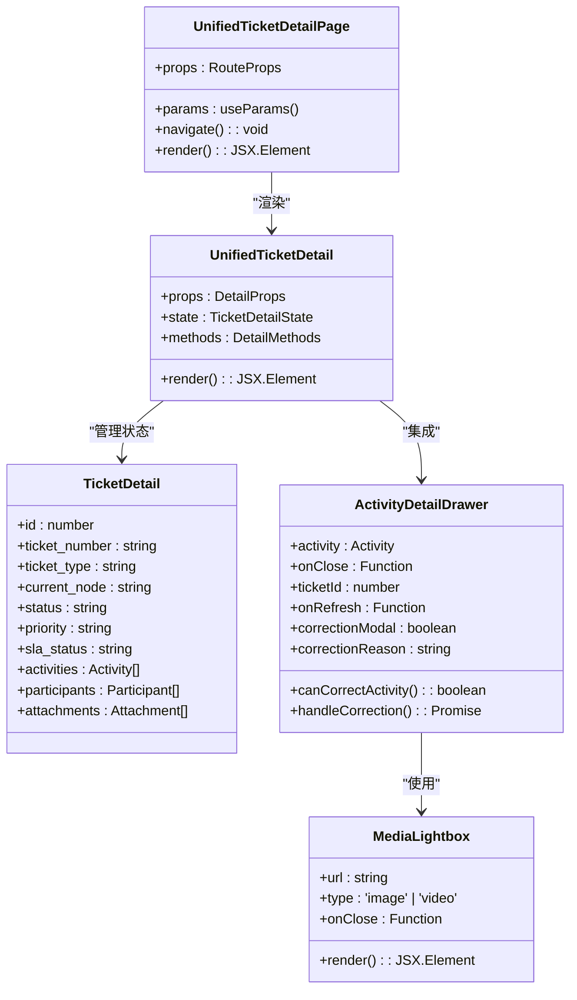

**图表来源**
- [UnifiedTicketDetailPage.tsx:12-35](file://client/src/components/Service/UnifiedTicketDetailPage.tsx#L12-L35)
- [UnifiedTicketDetail.tsx:30-62](file://client/src/components/Workspace/UnifiedTicketDetail.tsx#L30-L62)
- [TicketDetailComponents.tsx:756-820](file://client/src/components/Workspace/TicketDetailComponents.tsx#L756-L820)
- [TicketDetailComponents.tsx:225-304](file://client/src/components/Workspace/TicketDetailComponents.tsx#L225-L304)

### 工具组件库

TicketDetailComponents提供了丰富的UI组件：

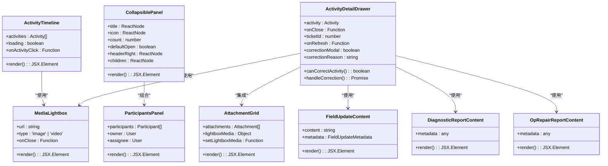

**图表来源**
- [TicketDetailComponents.tsx:21-49](file://client/src/components/Workspace/TicketDetailComponents.tsx#L21-L49)
- [TicketDetailComponents.tsx:63-96](file://client/src/components/Workspace/TicketDetailComponents.tsx#L63-L96)
- [TicketDetailComponents.tsx:756-949](file://client/src/components/Workspace/TicketDetailComponents.tsx#L756-L949)
- [TicketDetailComponents.tsx:1988-2110](file://client/src/components/Workspace/TicketDetailComponents.tsx#L1988-L2110)
- [TicketDetailComponents.tsx:109-162](file://client/src/components/Workspace/TicketDetailComponents.tsx#L109-L162)
- [TicketDetailComponents.tsx:164-204](file://client/src/components/Workspace/TicketDetailComponents.tsx#L164-L204)
- [TicketDetailComponents.tsx:183-204](file://client/src/components/Workspace/TicketDetailComponents.tsx#L183-L204)

**章节来源**
- [UnifiedTicketDetailPage.tsx:1-38](file://client/src/components/Service/UnifiedTicketDetailPage.tsx#L1-L38)
- [UnifiedTicketDetail.tsx:1-800](file://client/src/components/Workspace/UnifiedTicketDetail.tsx#L1-L800)
- [TicketDetailComponents.tsx:1-799](file://client/src/components/Workspace/TicketDetailComponents.tsx#L1-L799)

## 数据流分析

### 前端数据缓存机制

系统采用SWR库实现智能缓存和数据同步：

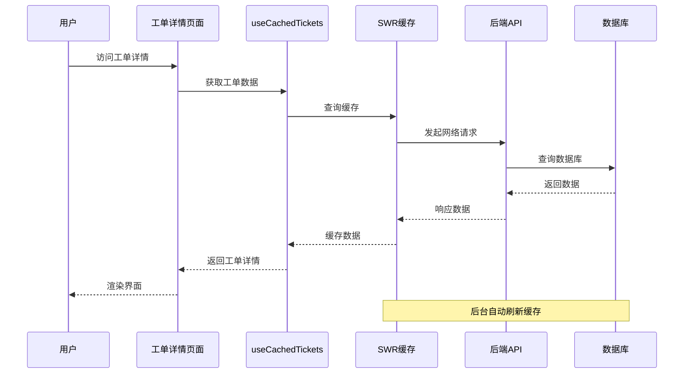

**图表来源**
- [useCachedTickets.ts:80-102](file://client/src/hooks/useCachedTickets.ts#L80-L102)

### 工单状态流转

系统实现了完整的工单状态管理：

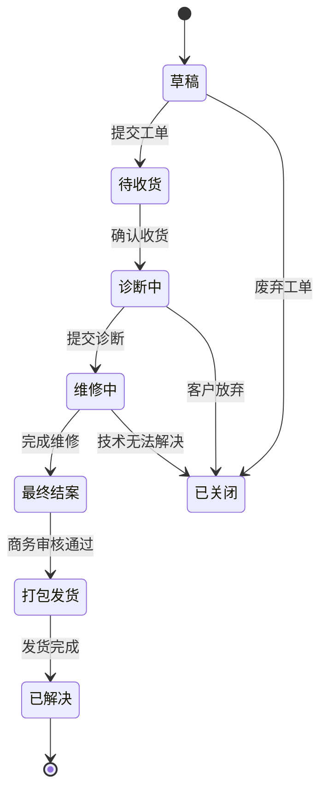

**图表来源**
- [UnifiedTicketDetail.tsx:550-614](file://client/src/components/Workspace/UnifiedTicketDetail.tsx#L550-L614)

**章节来源**
- [useCachedTickets.ts:1-149](file://client/src/hooks/useCachedTickets.ts#L1-L149)
- [UnifiedTicketDetail.tsx:547-614](file://client/src/components/Workspace/UnifiedTicketDetail.tsx#L547-L614)

## 权限控制机制

### 视角降级系统

系统实现了PRD §7.1中规定的"View As"权限降级机制：

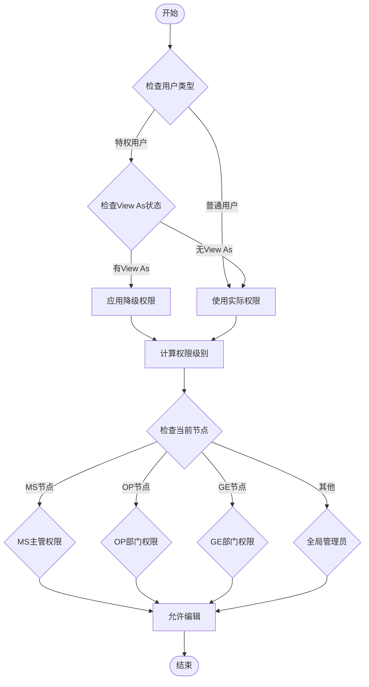

**图表来源**
- [UnifiedTicketDetail.tsx:125-213](file://client/src/components/Workspace/UnifiedTicketDetail.tsx#L125-L213)

### 部门权限矩阵

系统根据工单当前节点动态分配权限：

| 节点类型 | 部门代码 | 权限级别 | 允许操作 |
|---------|---------|---------|---------|
| MS相关节点 | MS | Lead | 编辑、删除、指派 |
| OP相关节点 | OP | Lead | 编辑、删除、指派 |
| GE相关节点 | GE | Lead | 编辑、删除、指派 |
| OP相关节点 | OP | 成员 | 查看、评论 |
| 其他节点 | 任意 | 管理员 | 完全控制 |

### 附件权限控制

**新增** 系统实现了严格的附件访问权限控制机制：

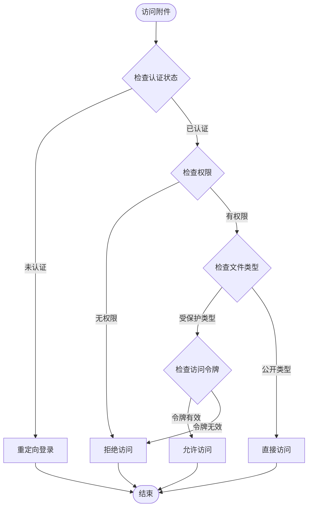

**图表来源**
- [TicketDetailComponents.tsx:2017-2024](file://client/src/components/Workspace/TicketDetailComponents.tsx#L2017-L2024)
- [ticket-activities.js:231-232](file://server/service/routes/ticket-activities.js#L231-L232)

**章节来源**
- [UnifiedTicketDetail.tsx:174-213](file://client/src/components/Workspace/UnifiedTicketDetail.tsx#L174-L213)
- [TicketDetailComponents.tsx:2017-2024](file://client/src/components/Workspace/TicketDetailComponents.tsx#L2017-L2024)
- [ticket-activities.js:231-232](file://server/service/routes/ticket-activities.js#L231-L232)

## 工作流处理

### 节点动作映射

系统为不同工单类型定义了特定的动作映射：

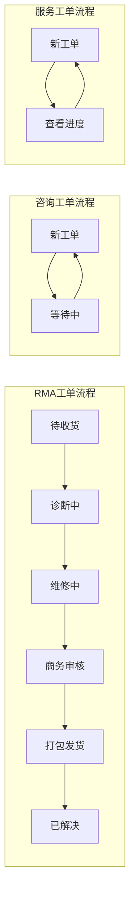

**图表来源**
- [UnifiedTicketDetail.tsx:74-95](file://client/src/components/Workspace/UnifiedTicketDetail.tsx#L74-L95)

### 审计日志系统

所有工单变更都会记录详细的审计信息：

| 变更类型 | 记录内容 | 审计字段 | 触发条件 |
|---------|---------|---------|---------|
| 字段更新 | 旧值→新值 | 所有审计字段 | 任何字段变更 |
| 状态变更 | 节点状态转换 | from_node, to_node | 节点状态改变 |
| 优先级变更 | P0→P2 | from_priority, to_priority | 优先级调整 |
| 指派人变更 | 旧指派人→新指派人 | from_assignee, to_assignee | 指派人更改 |

**章节来源**
- [tickets.js:16-30](file://server/service/routes/tickets.js#L16-L30)
- [tickets.js:1815-1874](file://server/service/routes/tickets.js#L1815-L1874)

## 附件管理系统

### 附件网格展示系统

**新增** 附件网格展示系统提供了完整的附件管理功能，支持多种文件类型的预览和下载：

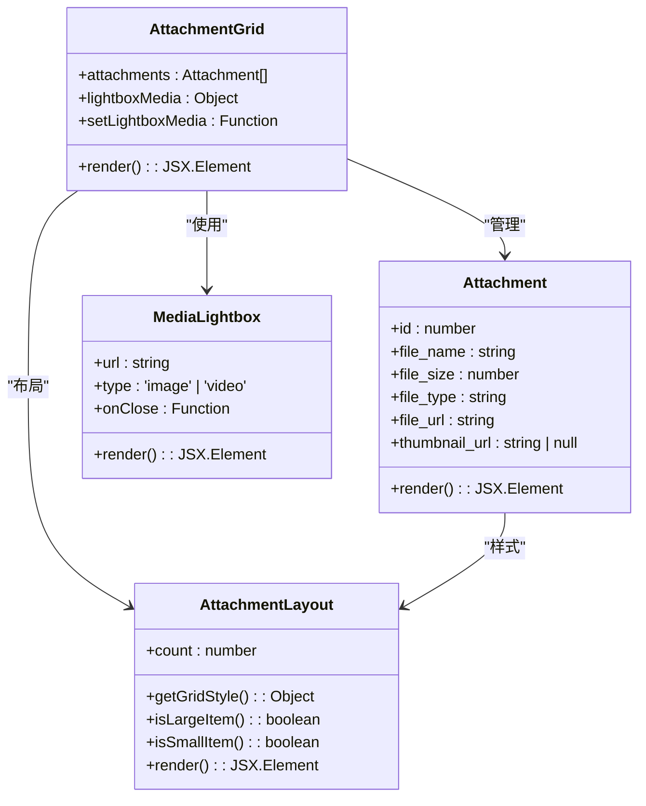

**图表来源**
- [TicketDetailComponents.tsx:1988-2110](file://client/src/components/Workspace/TicketDetailComponents.tsx#L1988-L2110)
- [TicketDetailComponents.tsx:225-304](file://client/src/components/Workspace/TicketDetailComponents.tsx#L225-L304)
- [TicketDetailComponents.tsx:2001-2007](file://client/src/components/Workspace/TicketDetailComponents.tsx#L2001-L2007)

### 支持的附件类型

系统支持以下文件类型的附件管理：

| 文件类型 | MIME类型 | 支持特性 | 预览模式 |
|---------|---------|---------|---------|
| 图片 | image/* | 缩略图、原图预览、HEIC兼容 | 图片预览 |
| 视频 | video/* | 视频播放、缩略图 | 视频播放 |
| PDF | application/pdf | 文档预览 | PDF阅读器 |
| 文本 | text/plain | 文本预览 | 文本查看 |
| HEIC | image/heic | 缩略图转换、WebP兼容 | 图片预览 |

### 附件拖拽上传区域

**新增** AttachmentZone组件提供了直观的附件拖拽上传功能：

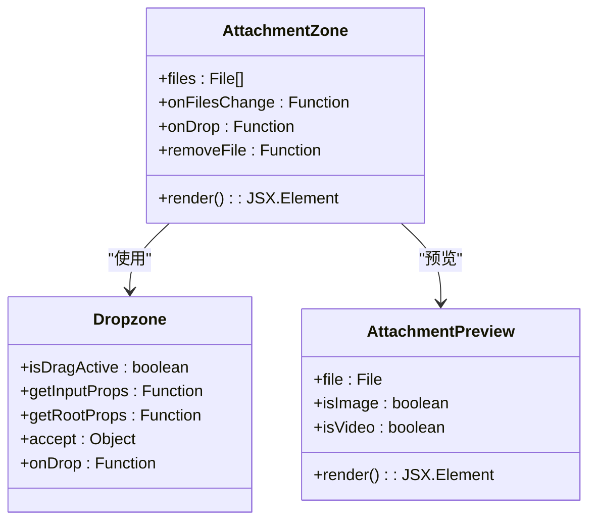

**图表来源**
- [AttachmentZone.tsx:1-108](file://client/src/components/Service/AttachmentZone.tsx#L1-L108)

### 缩略图生成和HEIC兼容性

系统实现了智能的缩略图生成和格式兼容性处理：

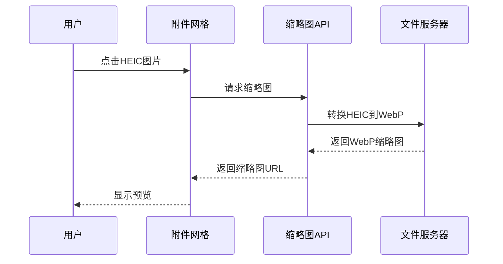

**图表来源**
- [TicketDetailComponents.tsx:2017-2024](file://client/src/components/Workspace/TicketDetailComponents.tsx#L2017-L2024)

### 附件权限控制

系统实现了严格的附件访问权限控制：


**图表来源**
- [TicketDetailComponents.tsx:2017-2024](file://client/src/components/Workspace/TicketDetailComponents.tsx#L2017-L2024)
- [ticket-activities.js:231-232](file://server/service/routes/ticket-activities.js#L231-L232)

### 附件查询优化

**新增** 系统实现了高效的附件查询优化机制：

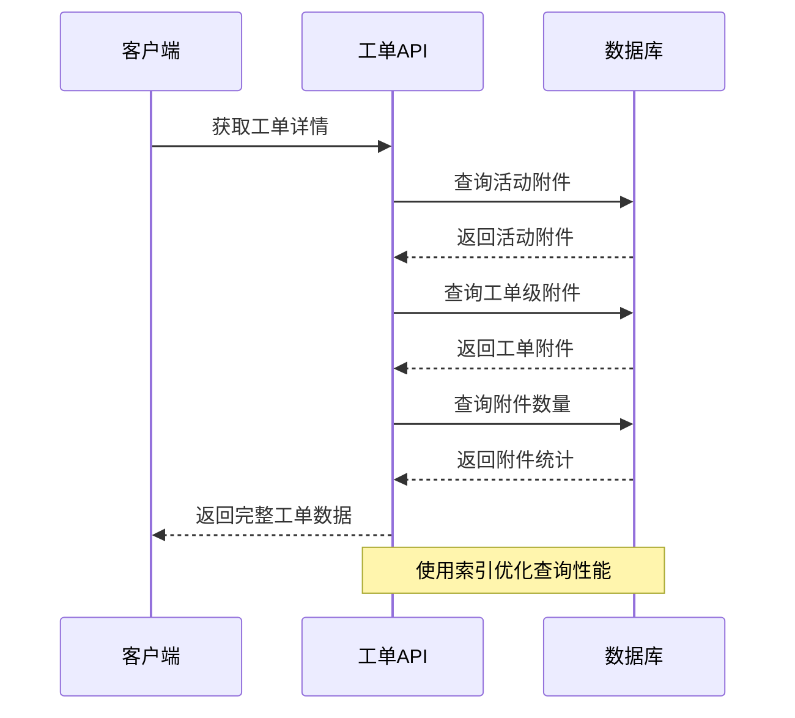

**图表来源**
- [tickets.js:1370-1400](file://server/service/routes/tickets.js#L1370-L1400)

**章节来源**
- [TicketDetailComponents.tsx:1988-2110](file://client/src/components/Workspace/TicketDetailComponents.tsx#L1988-L2110)
- [AttachmentZone.tsx:1-108](file://client/src/components/Service/AttachmentZone.tsx#L1-L108)
- [ticket-activities.js:231-232](file://server/service/routes/ticket-activities.js#L231-L232)
- [tickets.js:1370-1400](file://server/service/routes/tickets.js#L1370-L1400)

## 修正功能增强

### 活动详细信息抽屉

**新增** 活动详细信息抽屉提供了全面的修正功能，支持多种活动类型的修正请求：

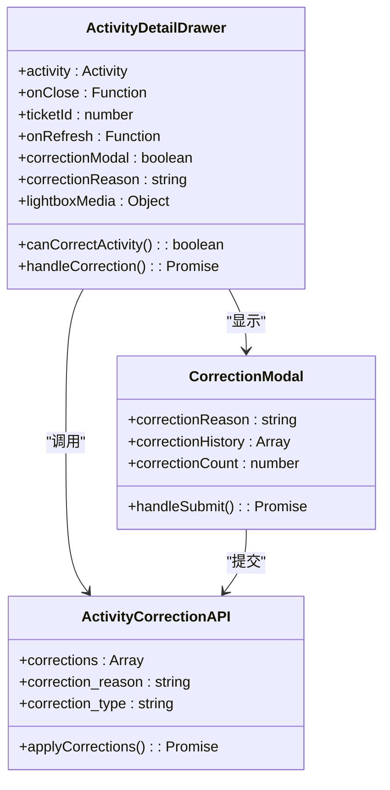

**图表来源**
- [TicketDetailComponents.tsx:756-949](file://client/src/components/Workspace/TicketDetailComponents.tsx#L756-L949)
- [TicketDetailComponents.tsx:1282-1345](file://client/src/components/Workspace/TicketDetailComponents.tsx#L1282-L1345)

### 支持的修正活动类型

系统支持以下活动类型的修正请求：

| 活动类型 | 描述 | 修正范围 | 权限要求 |
|---------|------|----------|----------|
| op_repair_report | OP维修报告 | 维修操作、更换零件、工时费用、维修结论 | 原操作人、Lead、Admin、Exec |
| diagnostic_report | 诊断报告 | 故障判定、维修方案、损坏判定、保修建议 | 原操作人、Lead、Admin、Exec |
| shipping_info | 发货信息 | 快递单号、承运商、发货地址、物流状态 | 原操作人、Lead、Admin、Exec |
| comment | 评论 | 评论内容、附件 | 原操作人、Lead、Admin、Exec |
| internal_note | 内部备注 | 备注内容 | 原操作人、Lead、Admin、Exec |

### 修正权限控制


**图表来源**
- [TicketDetailComponents.tsx:782-793](file://client/src/components/Workspace/TicketDetailComponents.tsx#L782-L793)
- [ticket-activities.js:658-682](file://server/service/routes/ticket-activities.js#L658-L682)

### 修正历史追踪

系统实现了完整的修正历史追踪机制：

```mermaid
sequenceDiagram
participant User as 用户
participant Drawer as 活动详细信息抽屉
participant API as 修正API
participant DB as 数据库
participant Actor as 原操作人
User->>Drawer : 点击更正按钮
Drawer->>Drawer : 显示修正弹窗
User->>Drawer : 输入修正原因
Drawer->>API : 提交修正请求
API->>DB : 保存修正历史
API->>DB : 更新活动元数据
API->>Actor : 发送通知
API-->>Drawer : 返回修正结果
Drawer-->>User : 显示成功消息
```

**图表来源**
- [TicketDetailComponents.tsx:795-819](file://client/src/components/Workspace/TicketDetailComponents.tsx#L795-L819)
- [ticket-activities.js:694-752](file://server/service/routes/ticket-activities.js#L694-L752)

**章节来源**
- [TicketDetailComponents.tsx:756-1345](file://client/src/components/Workspace/TicketDetailComponents.tsx#L756-L1345)
- [ticket-activities.js:650-815](file://server/service/routes/ticket-activities.js#L650-L815)

## UI/UX改进

### 活动时间轴分类优化

系统对活动时间轴进行了重大UI/UX改进，采用更直观的分类方式：

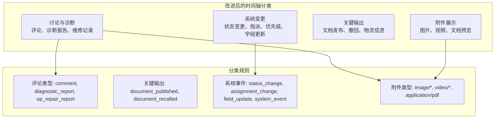

**图表来源**
- [TicketDetailComponents.tsx:307-345](file://client/src/components/Workspace/TicketDetailComponents.tsx#L307-L345)

### 可折叠面板组件

**新增** CollapsiblePanel组件提供了统一的可折叠界面容器：

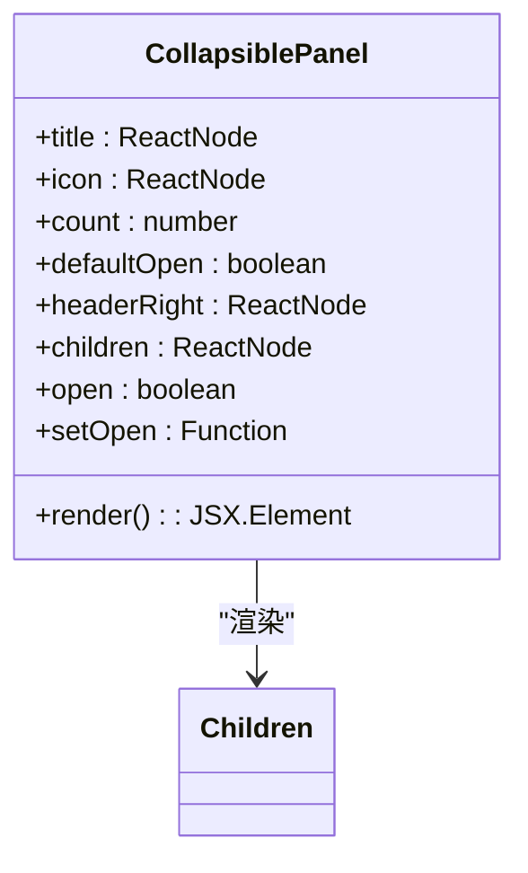

**图表来源**
- [TicketDetailComponents.tsx:56-102](file://client/src/components/Workspace/TicketDetailComponents.tsx#L56-L102)

### 字段更新内容增强

**增强** FieldUpdateContent组件现在提供更清晰的字段修改视觉审计轨迹：

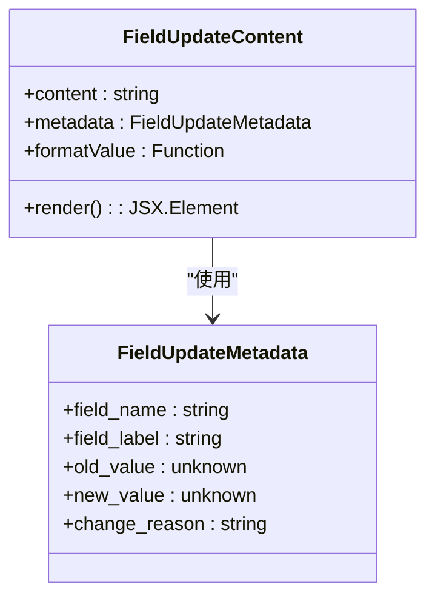

**图表来源**
- [TicketDetailComponents.tsx:109-162](file://client/src/components/Workspace/TicketDetailComponents.tsx#L109-L162)

### 诊断报告和维修记录展示

系统新增了专门的诊断报告和维修记录展示组件：

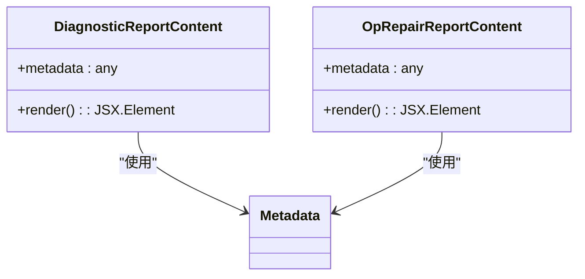

**图表来源**
- [TicketDetailComponents.tsx:164-204](file://client/src/components/Workspace/TicketDetailComponents.tsx#L164-L204)
- [TicketDetailComponents.tsx:183-204](file://client/src/components/Workspace/TicketDetailComponents.tsx#L183-L204)

### 侧滑窗口标准化

系统实现了统一的侧滑窗口设计规范：

- **宽度统一**：所有侧滑窗口宽度统一为400px
- **布局优化**：采用macOS26设计风格，使用Kine Yellow主题色
- **交互增强**：固定页脚确保操作按钮始终可见
- **内容精简**：移除冗余字段，如RMA/SVC工单中的"处理记录"字段

### 文本显示优化

系统实现了更直观的文本显示方式：

- **单行自然语言**：将"Actor + Action + Field + Value + Reason"串联在同一行展示
- **智能截断**：长字段自动截断（20字符），保持界面整洁
- **颜色编码**：使用不同颜色区分不同类型的操作和状态
- **辅助信息**：在必要时显示修正次数和最后修正时间

### 附件网格布局优化

**新增** 活动时间轴中的附件网格布局实现了智能响应式设计：

```mermaid
classDiagram
class AttachmentGrid {
+attachments : Attachment[]
+count : number
+getGridStyle() : Object
+render() : JSX.Element
}
class AttachmentLayout {
+count : number
+isLargeItem() : boolean
+isSmallItem() : boolean
+getGridStyle() : Object
+render() : JSX.Element
}
AttachmentGrid --> AttachmentLayout : "使用"
```

**图表来源**
- [TicketDetailComponents.tsx:2148-2270](file://client/src/components/Workspace/TicketDetailComponents.tsx#L2148-L2270)

**章节来源**
- [TicketDetailComponents.tsx:307-547](file://client/src/components/Workspace/TicketDetailComponents.tsx#L307-L547)
- [uiux.md:5](file://.agent/workflows/uiux.md#L5)
- [log_prompt.md:504-531](file://docs/log_prompt.md#L504-L531)

## 性能优化策略

### 缓存策略

系统采用了多层次的缓存机制：

1. **SWR智能缓存**：自动处理缓存失效和重新验证
2. **本地状态缓存**：使用Zustand进行局部状态管理
3. **预取机制**：提前加载可能访问的数据

### 并行数据获取

```mermaid
sequenceDiagram
participant Page as 工单详情页面
participant API1 as 工单详情API
participant API2 as 系统设置API
participant Cache as 本地缓存
Page->>API1 : 并行请求工单详情
Page->>API2 : 并行请求系统设置
API1->>Cache : 检查缓存
API2->>Cache : 检查缓存
par 并行执行
API1-->>Page : 返回工单数据
API2-->>Page : 返回设置数据
end
Page->>Cache : 更新本地缓存
Page-->>Page : 渲染完整界面
```

**图表来源**
- [UnifiedTicketDetail.tsx:369-392](file://client/src/components/Workspace/UnifiedTicketDetail.tsx#L369-L392)

### 附件性能优化

系统实现了多项附件性能优化措施：

- **懒加载缩略图**：附件缩略图采用懒加载，提升初始渲染速度
- **HEIC格式转换**：自动将HEIC格式转换为WebP，提升兼容性和加载速度
- **分块预览**：大文件采用分块预览，避免内存溢出
- **缓存策略**：缩略图和预览内容使用浏览器缓存机制
- **智能布局**：根据附件数量动态调整网格布局，优化显示效果

**章节来源**
- [useCachedTickets.ts:80-102](file://client/src/hooks/useCachedTickets.ts#L80-L102)
- [UnifiedTicketDetail.tsx:369-392](file://client/src/components/Workspace/UnifiedTicketDetail.tsx#L369-L392)
- [TicketDetailComponents.tsx:2067-2080](file://client/src/components/Workspace/TicketDetailComponents.tsx#L2067-L2080)

## 错误处理与调试

### 错误边界处理

系统实现了全面的错误处理机制：

```mermaid
flowchart TD
Request[API请求] --> Success{请求成功?}
Success --> |是| Render[渲染数据]
Success --> |否| CheckError{检查错误类型}
CheckError --> |网络错误| NetworkError[网络错误提示]
CheckError --> |权限错误| AuthError[权限不足提示]
CheckError --> |业务错误| BusinessError[业务错误提示]
CheckError --> |系统错误| SystemError[系统错误提示]
NetworkError --> Retry[重试机制]
AuthError --> Redirect[跳转登录]
BusinessError --> UserAction[用户操作]
SystemError --> AdminNotify[管理员通知]
Retry --> Request
UserAction --> Request
Redirect --> Request
```

### 调试工具

系统提供了丰富的调试功能：

1. **实时状态监控**：显示当前工单状态和节点信息
2. **审计日志**：详细记录所有操作历史
3. **性能指标**：监控API响应时间和渲染性能
4. **错误追踪**：捕获和报告前端JavaScript错误

**章节来源**
- [UnifiedTicketDetail.tsx:619-644](file://client/src/components/Workspace/UnifiedTicketDetail.tsx#L619-L644)

## 总结

工单详情系统是一个功能完整、架构清晰的工单管理解决方案。系统的主要特点包括：

1. **统一性**：支持多种工单类型的统一管理界面
2. **权限控制**：实现了细粒度的权限管理和视角降级
3. **工作流**：完整的工单状态流转和自动化处理
4. **性能优化**：智能缓存和并行数据获取机制
5. **审计追踪**：全面的操作日志和变更记录
6. **用户体验**：现代化的界面设计和交互体验

**最新增强功能**：
- **完整的附件管理系统**：实现了完整的附件生命周期管理，包括显示、预览和下载
- **活动时间轴增强**：大幅改进了附件展示功能，提供直观的网格布局
- **HEIC格式支持**：自动转换HEIC格式为WebP，提升兼容性和加载速度
- **拖拽上传功能**：提供直观的附件拖拽上传体验
- **缩略图优化**：智能生成缩略图，优化加载性能和用户体验
- **权限控制增强**：严格的权限验证确保附件访问的安全性
- **查询优化**：高效的附件查询机制提升系统性能
- **UI/UX改进**：采用macOS26设计风格，优化了时间轴分类和侧滑窗口布局
- **性能优化**：智能缓存和并行数据获取机制提升用户体验

该系统为Longhorn项目提供了强大的工单管理能力，能够满足复杂业务场景下的工单处理需求。通过持续的优化和扩展，系统将继续为用户提供更好的服务体验。新增的附件管理功能进一步提升了系统的实用性和用户体验，为工单管理提供了更加完善的解决方案。

**更新亮点**：
- **完整的附件管理系统**：实现了完整的附件生命周期管理，包括显示、预览和下载
- **活动时间轴增强**：大幅改进了附件展示功能，提供直观的网格布局
- **HEIC格式支持**：自动转换HEIC格式为WebP，提升兼容性和加载速度
- **拖拽上传功能**：提供直观的附件拖拽上传体验
- **缩略图优化**：智能生成缩略图，优化加载性能和用户体验
- **权限控制增强**：严格的权限验证确保附件访问的安全性
- **查询优化**：高效的附件查询机制提升系统性能
- **UI/UX改进**：采用macOS26设计风格，优化了时间轴分类和侧滑窗口布局
- **性能优化**：智能缓存和并行数据获取机制提升用户体验