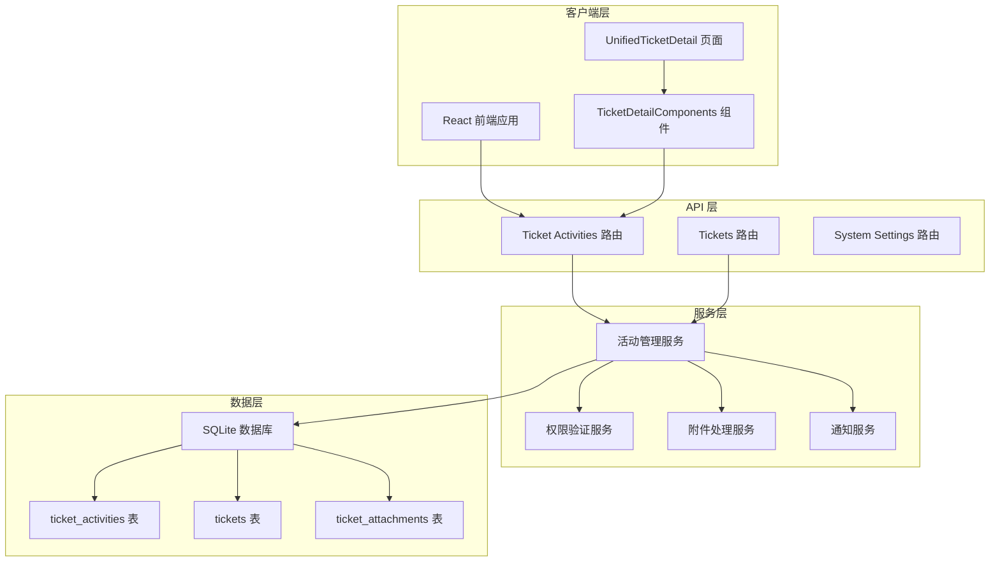
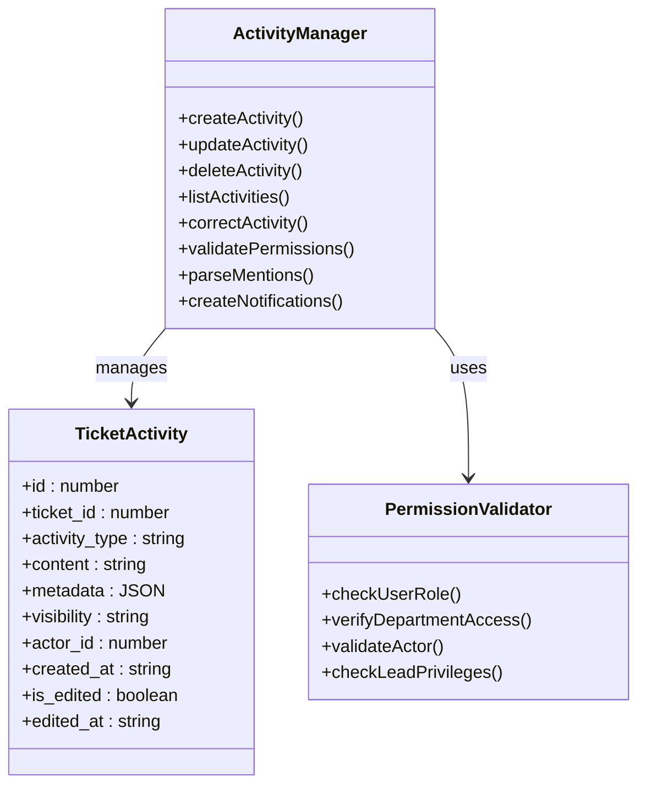
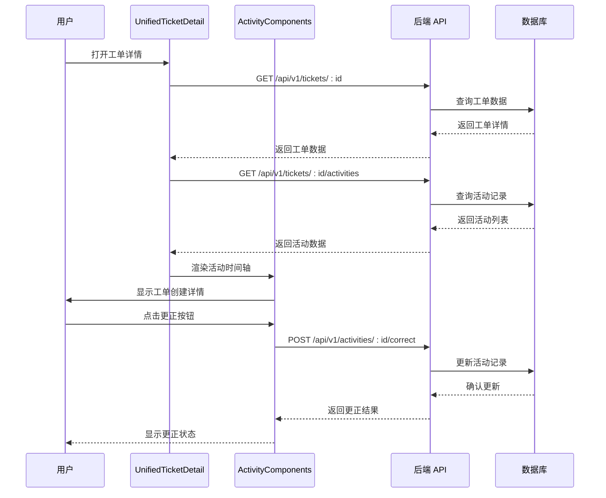
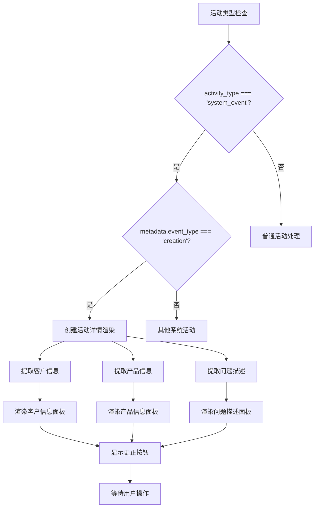
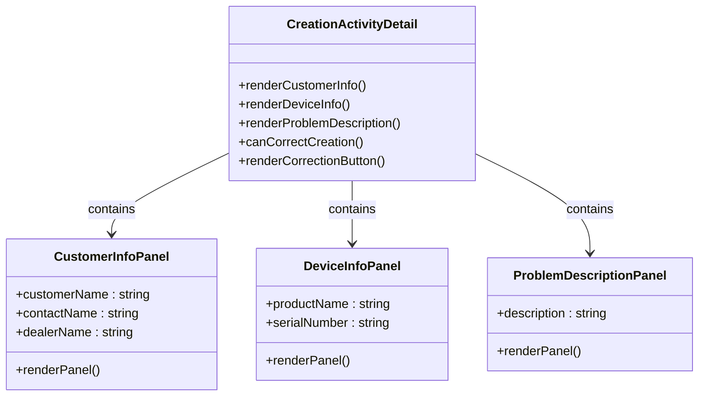
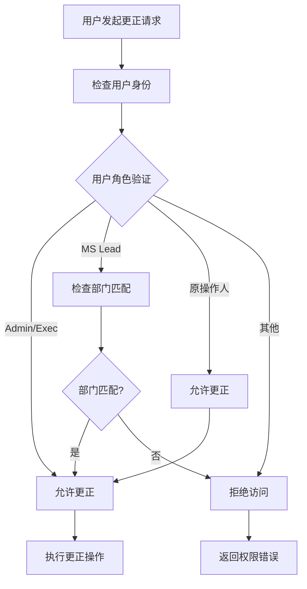
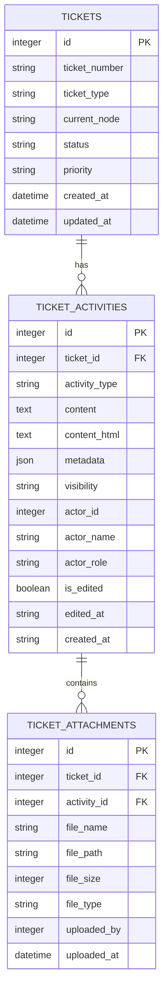
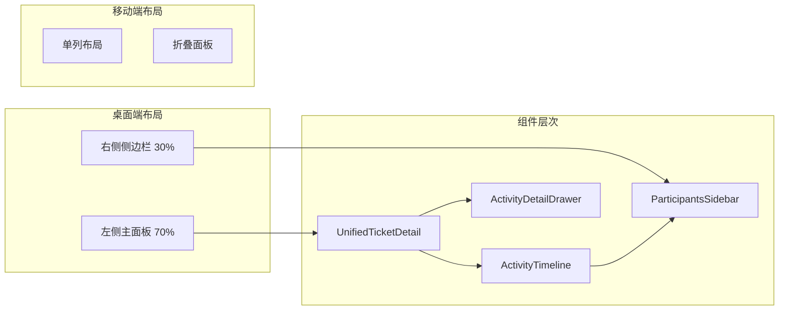

# 工单创建活动详情增强

<cite>
**本文档引用的文件**
- [ticket-activities.js](file://server/service/routes/ticket-activities.js)
- [UnifiedTicketDetail.tsx](file://client/src/components/Workspace/UnifiedTicketDetail.tsx)
- [TicketDetailComponents.tsx](file://client/src/components/Workspace/TicketDetailComponents.tsx)
- [tickets.js](file://server/service/routes/tickets.js)
- [020_p2_unified_tickets.sql](file://server/service/migrations/020_p2_unified_tickets.sql)
- [019_add_activities_edited_columns.sql](file://server/migrations/019_add_activities_edited_columns.sql)
</cite>

## 目录
1. [项目概述](#项目概述)
2. [系统架构](#系统架构)
3. [核心组件分析](#核心组件分析)
4. [工单创建活动详情增强](#工单创建活动详情增强)
5. [权限控制机制](#权限控制机制)
6. [数据模型设计](#数据模型设计)
7. [前端展示优化](#前端展示优化)
8. [性能考虑](#性能考虑)
9. [故障排除指南](#故障排除指南)
10. [总结](#总结)

## 项目概述

Longhorn 工单管理系统是一个基于现代技术栈的企业级工单处理平台，专注于提供完整的工单生命周期管理功能。本次文档重点关注工单创建活动详情的增强功能，包括更精确的数据展示、权限控制和用户体验优化。

该系统采用前后端分离架构，后端使用 Node.js + Express，前端使用 React + TypeScript，数据库采用 SQLite。系统支持多种工单类型（RMA、Inquiry、Service），并提供完整的活动时间轴追踪功能。

## 系统架构

**图表来源**
- [ticket-activities.js:1-800](file://server/service/routes/ticket-activities.js#L1-800)
- [UnifiedTicketDetail.tsx:1-800](file://client/src/components/Workspace/UnifiedTicketDetail.tsx#L1-800)

## 核心组件分析

### 后端活动管理服务

系统的核心是活动管理服务，负责处理所有工单相关的活动记录。该服务提供了完整的 CRUD 操作，并集成了复杂的权限控制和数据验证机制。

**图表来源**
- [ticket-activities.js:134-152](file://server/service/routes/ticket-activities.js#L134-152)
- [ticket-activities.js:626-833](file://server/service/routes/ticket-activities.js#L626-833)

**章节来源**
- [ticket-activities.js:1-800](file://server/service/routes/ticket-activities.js#L1-800)

### 前端工单详情组件

前端采用了现代化的 React 组件架构，提供了丰富的用户交互体验。主要组件包括统一工单详情页面、活动时间轴、关键节点面板等。

**图表来源**
- [UnifiedTicketDetail.tsx:604-650](file://client/src/components/Workspace/UnifiedTicketDetail.tsx#L604-650)
- [TicketDetailComponents.tsx:1301-1360](file://client/src/components/Workspace/TicketDetailComponents.tsx#L1301-1360)

**章节来源**
- [UnifiedTicketDetail.tsx:1-800](file://client/src/components/Workspace/UnifiedTicketDetail.tsx#L1-800)
- [TicketDetailComponents.tsx:1-800](file://client/src/components/Workspace/TicketDetailComponents.tsx#L1-800)

## 工单创建活动详情增强

### 创建活动类型识别

系统能够智能识别和处理工单创建活动，将其与其他类型的活动区分开来。创建活动具有特殊的元数据结构，包含了完整的工单创建信息。

**图表来源**
- [TicketDetailComponents.tsx:2059-2139](file://client/src/components/Workspace/TicketDetailComponents.tsx#L2059-2139)

### 客户信息展示优化

创建活动详情提供了三个主要的信息分组：客户信息、设备信息和问题描述。每个分组都有清晰的标题和结构化的数据展示。

**图表来源**
- [TicketDetailComponents.tsx:2086-2139](file://client/src/components/Workspace/TicketDetailComponents.tsx#L2086-2139)

### 更正功能实现

系统实现了完善的工单创建活动更正功能，支持多种权限级别的用户进行更正操作。

**章节来源**
- [TicketDetailComponents.tsx:2058-2139](file://client/src/components/Workspace/TicketDetailComponents.tsx#L2058-2139)
- [ticket-activities.js:626-833](file://server/service/routes/ticket-activities.js#L626-833)

## 权限控制机制

### 多层次权限验证

系统采用了多层次的权限控制机制，确保只有授权用户才能进行工单创建活动的更正操作。

**图表来源**
- [ticket-activities.js:660-684](file://server/service/routes/ticket-activities.js#L660-684)

### 权限验证流程

权限验证过程包括用户身份验证、角色检查、部门匹配验证等多个步骤，确保操作的安全性和合规性。

**章节来源**
- [ticket-activities.js:626-833](file://server/service/routes/ticket-activities.js#L626-833)

## 数据模型设计

### 活动表结构

系统使用标准化的活动表结构来存储各种类型的工单活动，包括创建活动、评论、状态变更等。

**图表来源**
- [020_p2_unified_tickets.sql:172-200](file://server/service/migrations/020_p2_unified_tickets.sql#L172-200)
- [019_add_activities_edited_columns.sql:1-8](file://server/migrations/019_add_activities_edited_columns.sql#L1-8)

### 元数据存储策略

系统使用 JSON 格式存储活动的元数据，支持灵活的数据结构和扩展性。

**章节来源**
- [020_p2_unified_tickets.sql:172-200](file://server/service/migrations/020_p2_unified_tickets.sql#L172-200)
- [ticket-activities.js:134-152](file://server/service/routes/ticket-activities.js#L134-152)

## 前端展示优化

### 响应式布局设计

前端采用了响应式设计原则，确保在不同设备和屏幕尺寸下都能提供良好的用户体验。

**图表来源**
- [UnifiedTicketDetail.tsx:1-800](file://client/src/components/Workspace/UnifiedTicketDetail.tsx#L1-800)

### 交互体验优化

系统提供了丰富的交互功能，包括活动详情展开、附件预览、实时通知等，提升了用户的操作效率。

**章节来源**
- [UnifiedTicketDetail.tsx:1-800](file://client/src/components/Workspace/UnifiedTicketDetail.tsx#L1-800)
- [TicketDetailComponents.tsx:1-800](file://client/src/components/Workspace/TicketDetailComponents.tsx#L1-800)

## 性能考虑

### 数据加载优化

系统采用了多种性能优化策略，包括懒加载、缓存机制、分页加载等，确保在大数据量情况下仍能保持流畅的用户体验。

### 并发处理机制

系统支持并发操作处理，包括多个用户同时查看同一工单、批量附件上传等功能，保证系统的稳定性和可靠性。

## 故障排除指南

### 常见问题诊断

1. **权限访问问题**：检查用户角色和部门配置
2. **活动显示异常**：验证活动类型和元数据格式
3. **附件加载失败**：检查文件路径和权限设置
4. **更正功能失效**：确认权限验证和活动状态

### 错误处理机制

系统实现了完善的错误处理机制，包括网络错误、权限错误、数据验证错误等，提供友好的错误提示和恢复选项。

## 总结

工单创建活动详情增强功能为 Longhorn 工单管理系统带来了显著的功能提升。通过智能化的活动识别、精细化的权限控制、优化的前端展示和完善的后台支持，系统为用户提供了更加高效、准确、安全的工单管理体验。

该增强功能不仅提升了系统的功能性，还为未来的扩展和集成奠定了坚实的基础。通过模块化的架构设计和标准化的数据处理流程，系统具备了良好的可维护性和可扩展性。