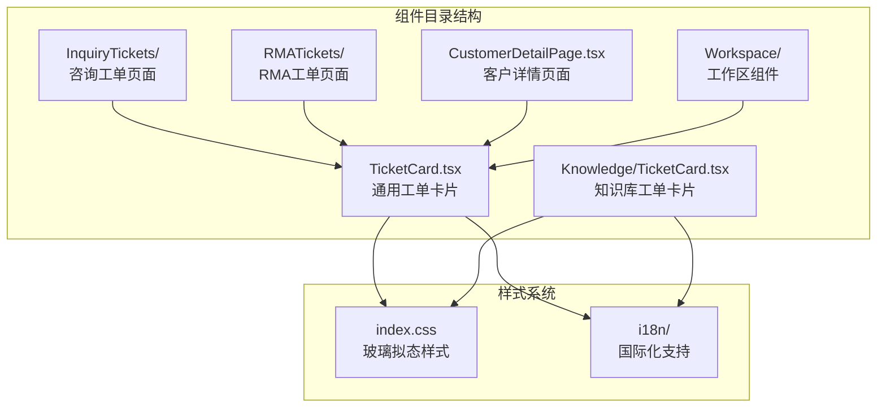
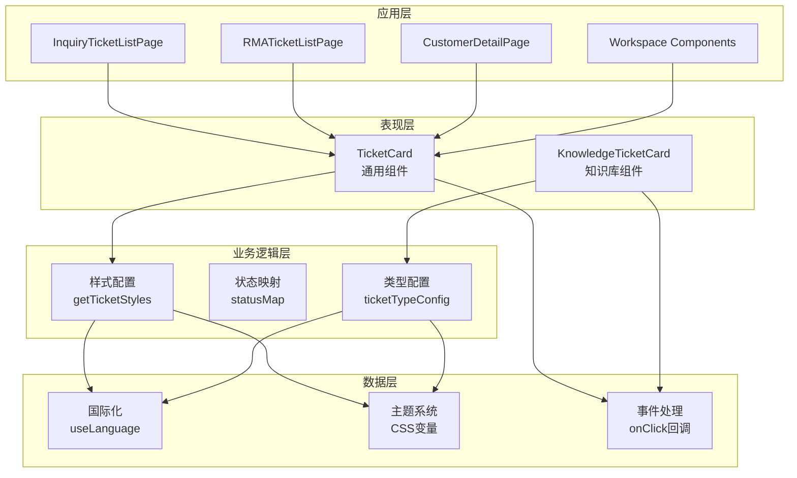
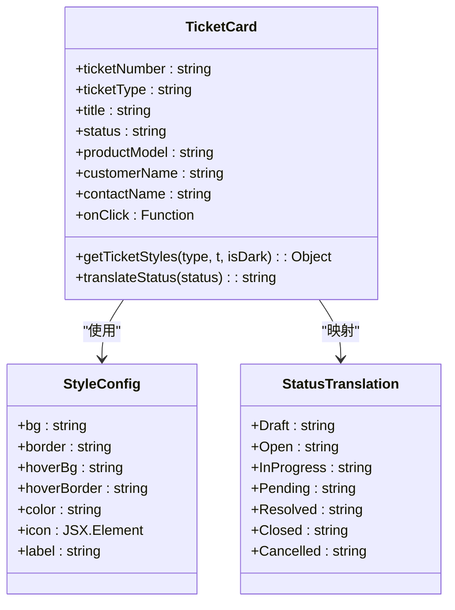
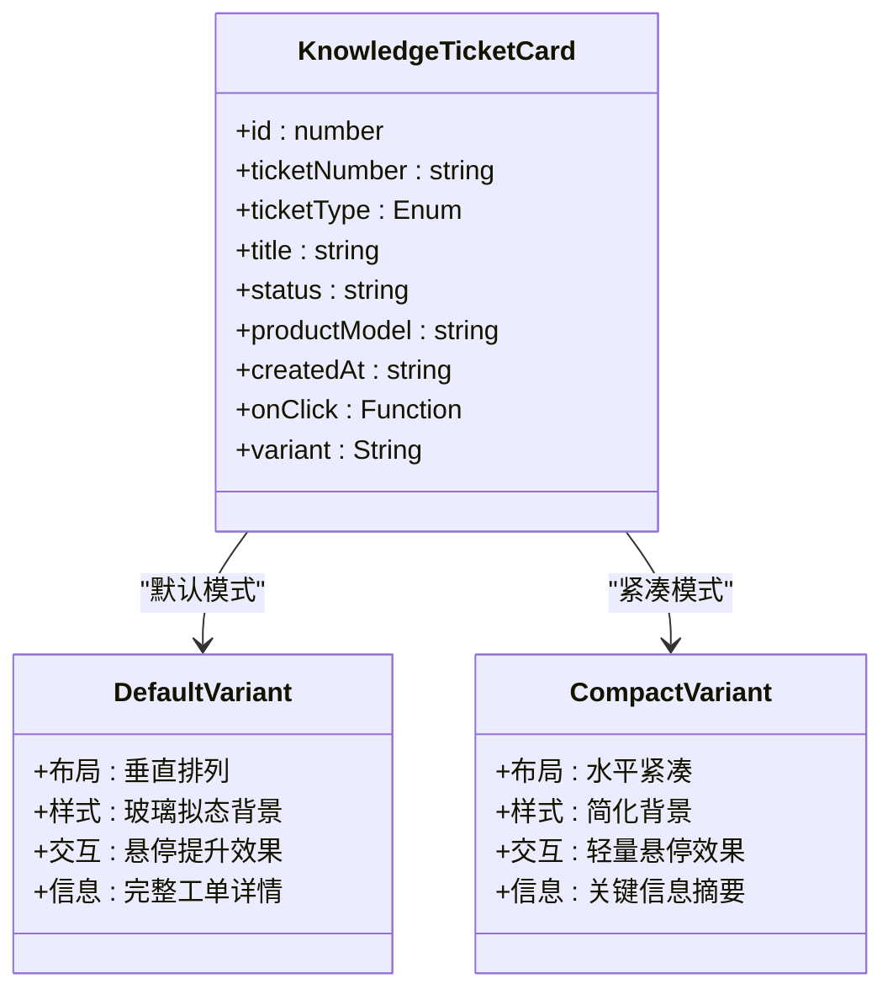
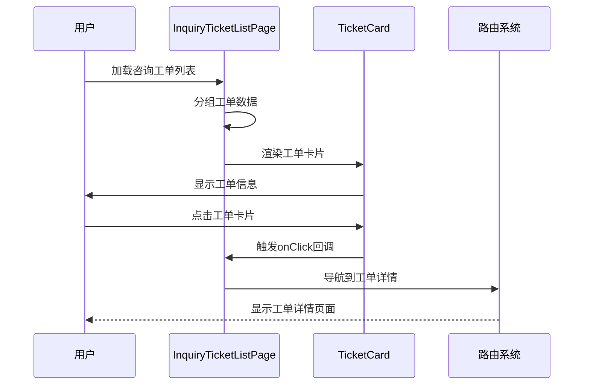
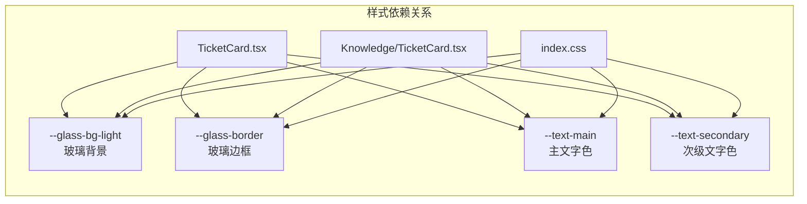
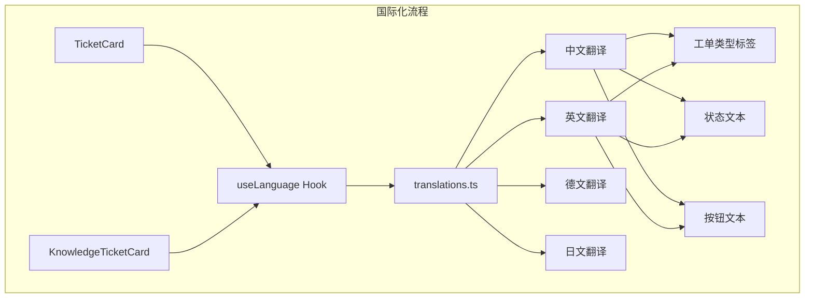

# 工单卡片组件

<cite>
**本文档引用的文件**
- [TicketCard.tsx](file://client/src/components/TicketCard.tsx)
- [TicketCard.tsx](file://client/src/components/Knowledge/TicketCard.tsx)
- [InquiryTicketListPage.tsx](file://client/src/components/InquiryTickets/InquiryTicketListPage.tsx)
- [RMATicketListPage.tsx](file://client/src/components/RMATickets/RMATicketListPage.tsx)
- [CustomerDetailPage.tsx](file://client/src/components/CustomerDetailPage.tsx)
- [TicketDetailComponents.tsx](file://client/src/components/Workspace/TicketDetailComponents.tsx)
- [index.css](file://client/src/index.css)
- [translations.ts](file://client/src/i18n/translations.ts)
</cite>

## 目录
1. [简介](#简介)
2. [项目结构](#项目结构)
3. [核心组件](#核心组件)
4. [架构概览](#架构概览)
5. [详细组件分析](#详细组件分析)
6. [依赖关系分析](#依赖关系分析)
7. [性能考虑](#性能考虑)
8. [故障排除指南](#故障排除指南)
9. [结论](#结论)

## 简介

工单卡片组件是Longhorn服务管理系统中的核心UI组件，用于展示和交互各类服务工单信息。该组件系统包含两个主要实现：通用工单卡片组件和知识库工单卡片组件，分别服务于不同的业务场景和用户体验需求。

组件系统采用React函数式组件设计，支持多种工单类型（咨询、RMA、经销商维修等），提供丰富的视觉反馈和交互效果。通过统一的样式系统和国际化支持，确保在不同语言环境下的一致性体验。

## 项目结构

工单卡片组件分布在客户端项目的多个目录中，体现了模块化的设计理念：



**图表来源**
- [TicketCard.tsx:1-167](file://client/src/components/TicketCard.tsx#L1-L167)
- [TicketCard.tsx:1-217](file://client/src/components/Knowledge/TicketCard.tsx#L1-L217)

**章节来源**
- [TicketCard.tsx:1-167](file://client/src/components/TicketCard.tsx#L1-L167)
- [TicketCard.tsx:1-217](file://client/src/components/Knowledge/TicketCard.tsx#L1-L217)

## 核心组件

### 通用工单卡片组件

通用工单卡片组件提供了基础的工单展示功能，支持多种工单类型和状态显示：

**主要特性：**
- 多工单类型支持：咨询、RMA、经销商维修、维护记录等
- 动态样式系统：根据工单类型自动应用相应的颜色和图标
- 国际化支持：完整的多语言文本翻译
- 响应式设计：适配不同屏幕尺寸和布局需求
- 交互反馈：悬停效果和状态变化动画

**章节来源**
- [TicketCard.tsx:5-51](file://client/src/components/TicketCard.tsx#L5-L51)
- [TicketCard.tsx:53-167](file://client/src/components/TicketCard.tsx#L53-L167)

### 知识库工单卡片组件

知识库工单卡片组件专为知识库场景优化，提供更简洁的展示方式：

**主要特性：**
- 紧凑模式：适合列表视图的紧凑布局
- 统一色彩系统：基于工单类型的标准化颜色方案
- 状态可视化：清晰的状态指示和颜色编码
- 产品信息集成：支持产品型号等关键信息展示
- 导航集成：与知识库系统的无缝连接

**章节来源**
- [TicketCard.tsx:4-35](file://client/src/components/Knowledge/TicketCard.tsx#L4-L35)
- [TicketCard.tsx:46-217](file://client/src/components/Knowledge/TicketCard.tsx#L46-L217)

## 架构概览

工单卡片组件系统采用分层架构设计，确保组件间的松耦合和高内聚：



**图表来源**
- [TicketCard.tsx:5-51](file://client/src/components/TicketCard.tsx#L5-L51)
- [TicketCard.tsx:16-35](file://client/src/components/Knowledge/TicketCard.tsx#L16-L35)
- [InquiryTicketListPage.tsx:900-970](file://client/src/components/InquiryTickets/InquiryTicketListPage.tsx#L900-L970)

## 详细组件分析

### 通用工单卡片组件深度分析

#### 样式系统设计

组件采用动态样式生成机制，根据工单类型自动配置视觉属性：



**图表来源**
- [TicketCard.tsx:5-51](file://client/src/components/TicketCard.tsx#L5-L51)
- [TicketCard.tsx:62-85](file://client/src/components/TicketCard.tsx#L62-L85)

#### 状态转换流程

```mermaid
flowchart TD
A[工单状态输入] --> B{状态类型判断}
B --> |草稿| C[翻译为"草稿"]
B --> |待处理| D[翻译为"待处理"]
B --> |处理中| E[翻译为"处理中"]
B --> |待定| F[翻译为"待定"]
B --> |已解决| G[翻译为"已解决"]
B --> |已关闭| H[翻译为"已关闭"]
B --> |已取消| I[翻译为"已取消"]
B --> |其他| J[保持原值]
C --> K[返回翻译结果]
D --> K
E --> K
F --> K
G --> K
H --> K
I --> K
J --> K
```

**图表来源**
- [TicketCard.tsx:62-85](file://client/src/components/TicketCard.tsx#L62-L85)

**章节来源**
- [TicketCard.tsx:53-167](file://client/src/components/TicketCard.tsx#L53-L167)

### 知识库工单卡片组件分析

#### 变体模式设计

知识库工单卡片支持两种显示模式，适应不同的使用场景：



**图表来源**
- [TicketCard.tsx:4-14](file://client/src/components/Knowledge/TicketCard.tsx#L4-L14)
- [TicketCard.tsx:58-121](file://client/src/components/Knowledge/TicketCard.tsx#L58-L121)

**章节来源**
- [TicketCard.tsx:46-217](file://client/src/components/Knowledge/TicketCard.tsx#L46-L217)

### 应用场景集成

#### 咨询工单列表集成

工单卡片在咨询工单列表中发挥核心作用，支持分组显示和多种视图模式：



**图表来源**
- [InquiryTicketListPage.tsx:900-970](file://client/src/components/InquiryTickets/InquiryTicketListPage.tsx#L900-L970)
- [TicketCard.tsx:53-167](file://client/src/components/TicketCard.tsx#L53-L167)

**章节来源**
- [InquiryTicketListPage.tsx:900-1001](file://client/src/components/InquiryTickets/InquiryTicketListPage.tsx#L900-L1001)

#### RMA工单列表集成

RMA工单卡片在专门的RMA工单列表中提供专业的工单管理功能：

**章节来源**
- [RMATicketListPage.tsx:760-832](file://client/src/components/RMATickets/RMATicketListPage.tsx#L760-L832)

#### 客户详情集成

在客户详情页面中，工单卡片作为客户历史工单的重要组成部分：

**章节来源**
- [CustomerDetailPage.tsx:980-1015](file://client/src/components/CustomerDetailPage.tsx#L980-L1015)

## 依赖关系分析

### 样式系统依赖

工单卡片组件高度依赖于全局样式系统，特别是玻璃拟态设计：



**图表来源**
- [TicketCard.tsx:88-110](file://client/src/components/TicketCard.tsx#L88-L110)
- [TicketCard.tsx:127-146](file://client/src/components/Knowledge/TicketCard.tsx#L127-L146)
- [index.css:103-135](file://client/src/index.css#L103-L135)

### 国际化依赖

组件系统全面支持多语言国际化，通过统一的翻译接口提供本地化体验：



**图表来源**
- [translations.ts:1-200](file://client/src/i18n/translations.ts#L1-L200)
- [TicketCard.tsx:57-60](file://client/src/components/TicketCard.tsx#L57-L60)

**章节来源**
- [index.css:97-1702](file://client/src/index.css#L97-L1702)
- [translations.ts:1-200](file://client/src/i18n/translations.ts#L1-L200)

## 性能考虑

### 渲染优化策略

工单卡片组件采用了多项性能优化措施：

1. **条件渲染优化**：仅在必要时渲染客户名称和产品信息
2. **样式缓存**：通过函数式组件避免不必要的样式重新计算
3. **事件处理优化**：使用箭头函数避免this绑定开销
4. **虚拟滚动支持**：为大量工单列表提供高效的滚动体验

### 内存管理

组件系统注重内存效率：
- 使用React.memo避免不必要的重渲染
- 合理的事件监听器管理
- 及时清理定时器和订阅

## 故障排除指南

### 常见问题及解决方案

**问题1：工单状态显示异常**
- 检查状态映射表是否包含对应状态
- 验证国际化配置是否正确
- 确认后端返回的状态格式

**问题2：样式显示错误**
- 检查CSS变量定义是否正确
- 验证主题切换逻辑
- 确认浏览器兼容性

**问题3：点击事件无效**
- 检查onClick回调函数是否正确传递
- 验证事件冒泡处理
- 确认路由配置正确

**章节来源**
- [TicketCard.tsx:62-85](file://client/src/components/TicketCard.tsx#L62-L85)
- [TicketCard.tsx:46-54](file://client/src/components/Knowledge/TicketCard.tsx#L46-L54)

## 结论

工单卡片组件系统展现了现代前端开发的最佳实践，通过模块化设计、统一的样式系统和完善的国际化支持，为Longhorn服务管理系统提供了强大而灵活的工单展示能力。

组件系统的核心优势包括：
- **高度可定制性**：支持多种工单类型和显示模式
- **优秀的用户体验**：流畅的交互效果和响应式设计
- **强大的扩展性**：清晰的架构便于功能扩展
- **完善的国际化**：支持多语言环境下的统一体验

未来可以考虑的改进方向：
- 增加更多动画效果和过渡效果
- 优化移动端触摸交互体验
- 扩展更多的工单类型支持
- 增强无障碍访问功能