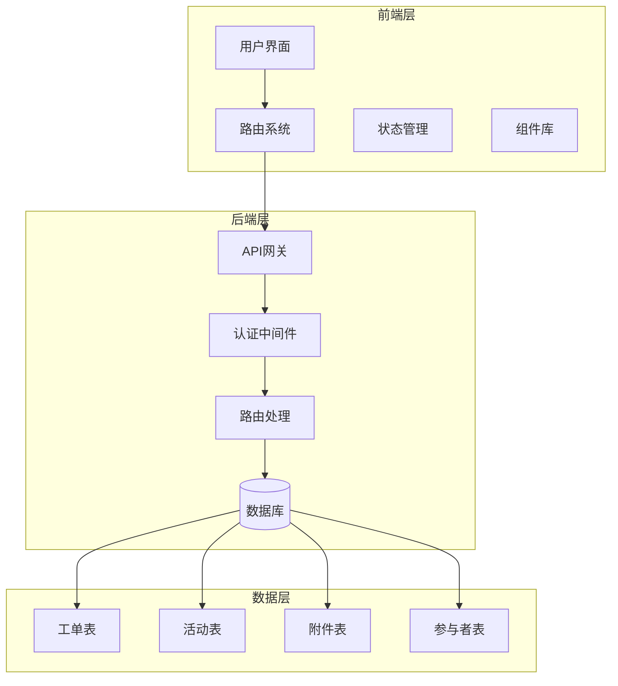
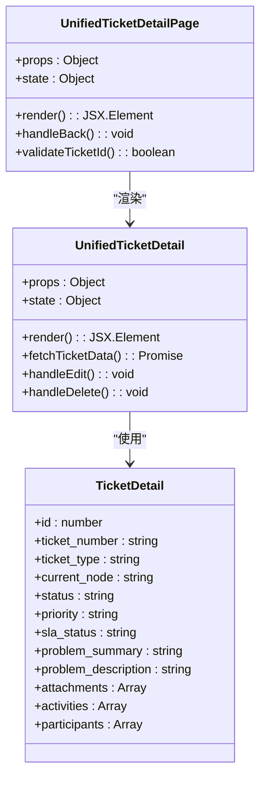
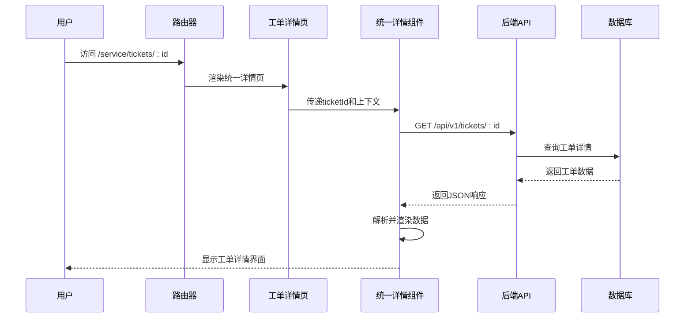
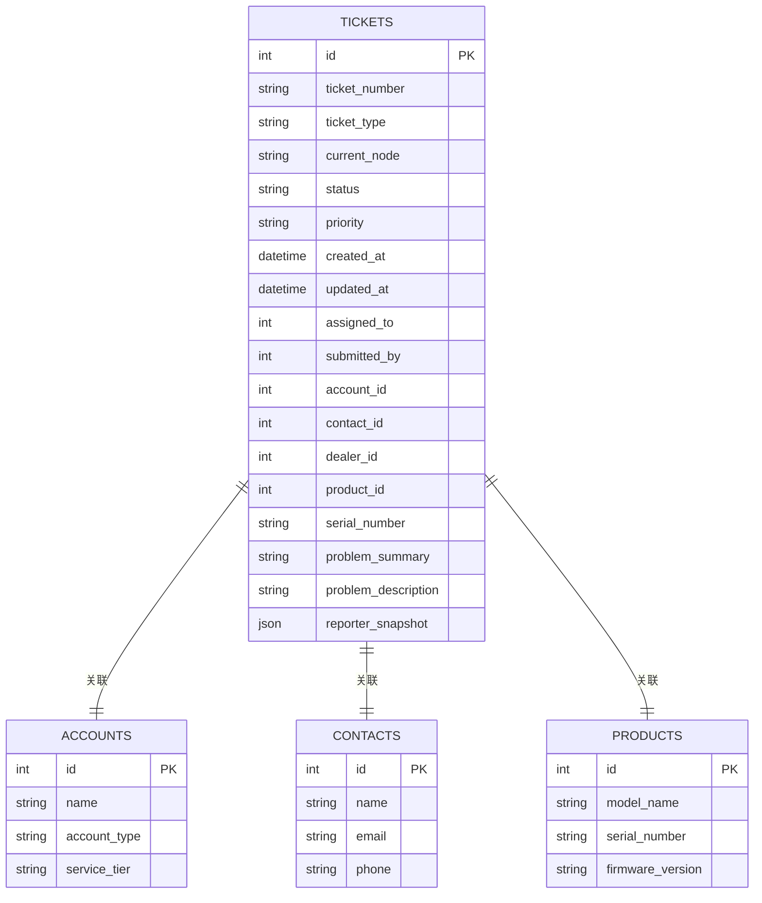
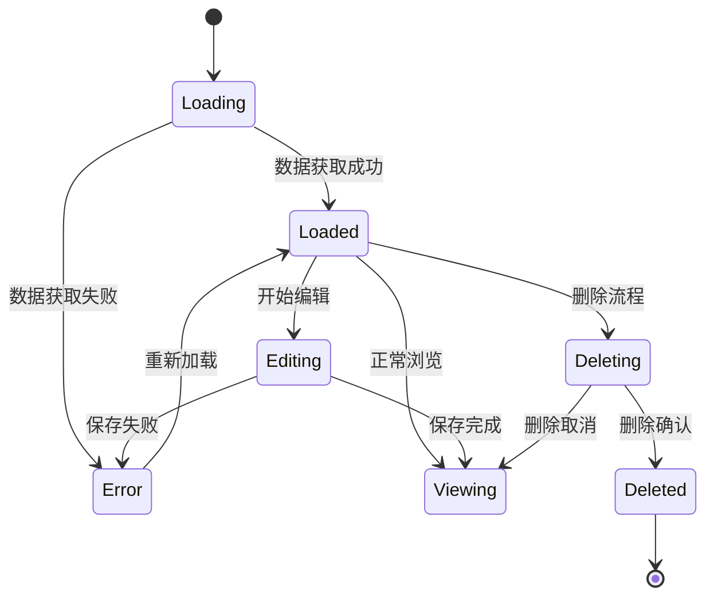
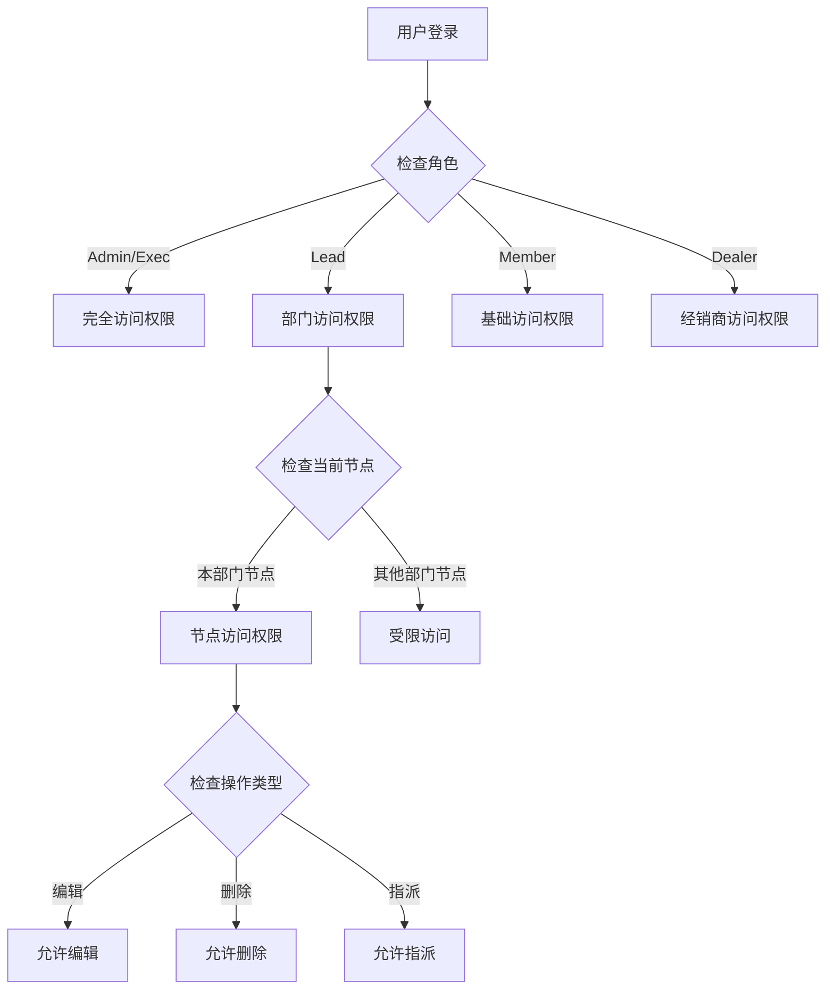
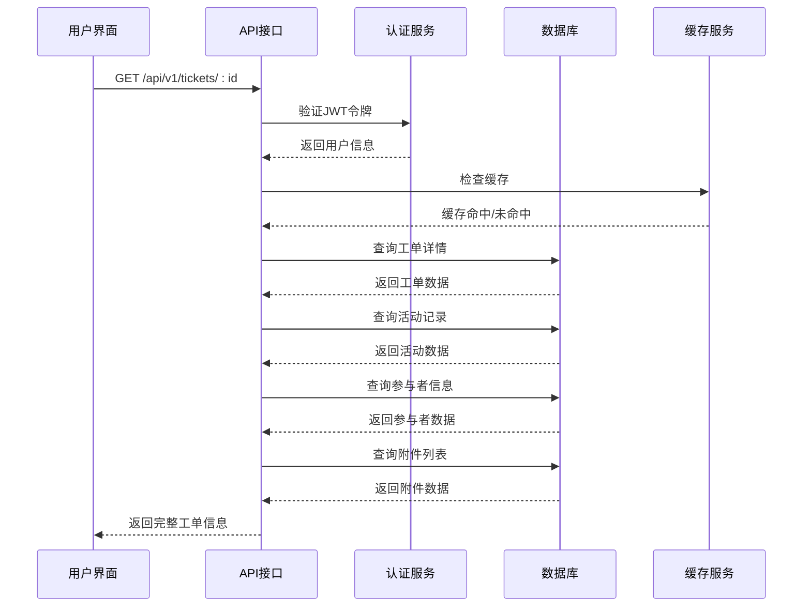

# 工单详情系统

<cite>
**本文档引用的文件**
- [client/src/App.tsx](file://client/src/App.tsx)
- [client/src/main.tsx](file://client/src/main.tsx)
- [client/src/components/Service/UnifiedTicketDetailPage.tsx](file://client/src/components/Service/UnifiedTicketDetailPage.tsx)
- [client/src/components/Workspace/UnifiedTicketDetail.tsx](file://client/src/components/Workspace/UnifiedTicketDetail.tsx)
- [client/src/components/Issues/IssueDetailPage.tsx](file://client/src/components/Issues/IssueDetailPage.tsx)
- [client/src/components/ServiceRecords/ServiceRecordDetailPage.tsx](file://client/src/components/ServiceRecords/ServiceRecordDetailPage.tsx)
- [server/service/routes/tickets.js](file://server/service/routes/tickets.js)
</cite>

## 目录
1. [项目概述](#项目概述)
2. [系统架构](#系统架构)
3. [核心组件](#核心组件)
4. [工单详情系统架构](#工单详情系统架构)
5. [详细组件分析](#详细组件分析)
6. [数据流分析](#数据流分析)
7. [权限控制机制](#权限控制机制)
8. [性能优化策略](#性能优化策略)
9. [故障排除指南](#故障排除指南)
10. [总结](#总结)

## 项目概述

工单详情系统是Longhorn服务管理系统中的核心模块，负责提供统一的工单查看、编辑和管理功能。该系统支持三种主要工单类型：咨询工单（Inquiry）、返厂维修工单（RMA）和经销商维修工单（SVC），采用统一的数据模型和界面设计。

系统采用前后端分离架构，前端使用React技术栈，后端基于Node.js和Express框架，数据库采用SQLite。整个系统实现了完整的工单生命周期管理，包括创建、分配、处理、跟踪和关闭等各个环节。

## 系统架构

### 整体架构设计

**图表来源**
- [client/src/App.tsx:182-366](file://client/src/App.tsx#L182-L366)
- [server/service/routes/tickets.js:15-16](file://server/service/routes/tickets.js#L15-L16)

### 技术栈架构

系统采用现代化的技术栈组合：

- **前端**: React 18 + TypeScript + TailwindCSS
- **后端**: Node.js + Express + Better-SQLite3
- **数据库**: SQLite (本地开发) + PostgreSQL (生产环境)
- **构建工具**: Vite + Webpack
- **状态管理**: Zustand + React Hooks

## 核心组件

### 工单详情入口组件

UnifiedTicketDetailPage是工单详情系统的核心入口组件，负责接收路由参数并传递给统一详情组件。

**图表来源**
- [client/src/components/Service/UnifiedTicketDetailPage.tsx:12-35](file://client/src/components/Service/UnifiedTicketDetailPage.tsx#L12-L35)
- [client/src/components/Workspace/UnifiedTicketDetail.tsx:38-70](file://client/src/components/Workspace/UnifiedTicketDetail.tsx#L38-L70)

### 工单类型支持

系统支持三种主要工单类型，每种类型都有特定的工作流程和节点状态：

| 工单类型 | 编码 | 主要节点 | 特殊属性 |
|---------|------|----------|----------|
| 咨询工单 | inquiry | open, waiting | 服务类型、沟通记录 |
| 返厂维修工单 | rma | submitted, op_receiving, ms_review, op_repairing, op_shipping, ms_closing, ge_review, closed | 保修状态、维修内容 |
| 经销商维修工单 | svc | open, processing | 经销商信息、维修进度 |

**章节来源**
- [client/src/components/Workspace/UnifiedTicketDetail.tsx:82-103](file://client/src/components/Workspace/UnifiedTicketDetail.tsx#L82-L103)
- [server/service/routes/tickets.js:56-61](file://server/service/routes/tickets.js#L56-L61)

## 工单详情系统架构

### 统一工单架构设计

**图表来源**
- [client/src/components/Service/UnifiedTicketDetailPage.tsx:12-35](file://client/src/components/Service/UnifiedTicketDetailPage.tsx#L12-L35)
- [client/src/components/Workspace/UnifiedTicketDetail.tsx:604-650](file://client/src/components/Workspace/UnifiedTicketDetail.tsx#L604-L650)

### 数据模型设计

统一工单数据模型采用扁平化设计，同时支持嵌套对象结构：

**图表来源**
- [server/service/routes/tickets.js:402-551](file://server/service/routes/tickets.js#L402-L551)

## 详细组件分析

### 工单详情组件

UnifiedTicketDetail组件是工单详情系统的核心，实现了完整的工单展示和交互功能：

#### 主要功能特性

1. **双栏布局设计**: 左侧主信息区域，右侧协作者和客户上下文
2. **可折叠面板**: 支持关键交付物、客户上下文等面板的折叠展开
3. **实时状态更新**: 自动轮询工单状态变化
4. **附件管理**: 支持图片、文档等多媒体文件的查看和下载
5. **活动时间轴**: 展示工单的完整处理历史

#### 状态管理机制

**图表来源**
- [client/src/components/Workspace/UnifiedTicketDetail.tsx:162-168](file://client/src/components/Workspace/UnifiedTicketDetail.tsx#L162-L168)

### 权限控制系统

系统实现了多层次的权限控制机制：

#### 视图权限控制

**图表来源**
- [client/src/components/Workspace/UnifiedTicketDetail.tsx:228-266](file://client/src/components/Workspace/UnifiedTicketDetail.tsx#L228-L266)

#### 视图模拟功能

系统支持Admin用户模拟其他用户的视图，实现权限降级测试：

- **模拟机制**: 通过X-View-As-User头实现
- **权限继承**: 模拟用户继承目标用户的权限级别
- **审计日志**: 记录所有模拟操作的详细信息

**章节来源**
- [client/src/main.tsx:8-32](file://client/src/main.tsx#L8-L32)
- [server/service/routes/tickets.js:63-81](file://server/service/routes/tickets.js#L63-L81)

### 工单节点管理

#### 节点状态映射

| 节点类型 | 描述 | 相关操作 | 权限要求 |
|---------|------|----------|----------|
| draft | 草稿状态 | 编辑、删除 | 创建者或管理员 |
| submitted | 已提交 | 审核、指派 | 市场部主管 |
| op_receiving | 待收货 | 确认收货 | 运营部主管 |
| op_diagnosing | 诊断中 | 提交诊断报告 | 运营部主管 |
| ms_review | 商务审核 | 审批报价 | 市场部主管 |
| op_repairing | 维修中 | 标记维修完成 | 运营部主管 |
| op_shipping | 打包发货 | 发货确认 | 运营部主管 |
| ms_closing | 最终结案 | 结案确认 | 市场部主管 |
| ge_review | 财务审核 | 财务确认 | 财务部主管 |
| closed | 已关闭 | 查看 | 所有授权用户 |

**章节来源**
- [client/src/components/Workspace/UnifiedTicketDetail.tsx:109-125](file://client/src/components/Workspace/UnifiedTicketDetail.tsx#L109-L125)
- [server/service/routes/tickets.js:371-397](file://server/service/routes/tickets.js#L371-L397)

## 数据流分析

### 工单数据获取流程

**图表来源**
- [client/src/components/Workspace/UnifiedTicketDetail.tsx:604-650](file://client/src/components/Workspace/UnifiedTicketDetail.tsx#L604-L650)

### 实时更新机制

系统实现了多种实时更新机制：

1. **轮询更新**: 每60秒自动刷新工单状态
2. **事件推送**: WebSocket连接实现实时通知
3. **手动刷新**: 用户可手动触发数据刷新
4. **缓存策略**: 智能缓存减少重复请求

**章节来源**
- [client/src/components/Workspace/UnifiedTicketDetail.tsx:463-482](file://client/src/components/Workspace/UnifiedTicketDetail.tsx#L463-L482)

## 权限控制机制

### 角色权限矩阵

| 角色 | 全局访问 | 部门访问 | 工单创建 | 工单编辑 | 工单删除 | 工单指派 |
|------|----------|----------|----------|----------|----------|----------|
| Admin | ✓ | ✓ | ✓ | ✓ | ✓ | ✓ |
| Exec | ✓ | ✓ | ✓ | ✓ | ✓ | ✓ |
| Lead | ✓ | ✓ | ✓ | ✓ | ✓ | ✓ |
| Member | ✓ | ✓ | ✓ | ✓ | ✗ | ✓ |
| Dealer | ✗ | ✗ | ✗ | ✗ | ✗ | ✗ |

### 部门协作机制

系统支持跨部门协作，通过参与者机制实现：

1. **@提及功能**: 支持在评论中@其他部门用户
2. **协作查询**: 部门主管可查看本部门协作的工单
3. **权限继承**: 协作者继承其所在部门的权限

**章节来源**
- [server/service/routes/tickets.js:604-633](file://server/service/routes/tickets.js#L604-L633)

## 性能优化策略

### 前端性能优化

1. **懒加载组件**: 使用React.lazy实现组件按需加载
2. **虚拟滚动**: 大列表数据的虚拟化处理
3. **状态缓存**: 使用React Query实现智能缓存
4. **图片优化**: 自动压缩和懒加载图片资源

### 后端性能优化

1. **数据库索引**: 为常用查询字段建立索引
2. **查询优化**: 使用预编译语句减少SQL解析开销
3. **连接池**: 数据库连接复用
4. **缓存策略**: Redis缓存热点数据

## 故障排除指南

### 常见问题及解决方案

#### 工单详情加载失败

**症状**: 工单详情页面显示空白或加载指示器持续显示

**排查步骤**:
1. 检查网络连接状态
2. 验证JWT令牌有效性
3. 确认用户权限是否足够
4. 查看浏览器开发者工具的网络请求

**解决方案**:
- 重新登录系统获取新的JWT令牌
- 清除浏览器缓存后重试
- 检查服务器日志中的错误信息

#### 权限访问被拒绝

**症状**: 提示"无权访问"或"权限不足"

**排查步骤**:
1. 验证当前用户的角色和部门
2. 检查工单的当前节点状态
3. 确认是否有相关的部门协作权限

**解决方案**:
- 联系系统管理员提升权限
- 等待工单流转到可访问的节点
- 申请部门协作权限

#### 实时更新不生效

**症状**: 工单状态变更后页面未及时更新

**排查步骤**:
1. 检查WebSocket连接状态
2. 验证轮询机制是否正常工作
3. 确认缓存策略配置正确

**解决方案**:
- 刷新页面强制重新连接
- 检查防火墙设置允许WebSocket连接
- 清除缓存后重新登录

## 总结

工单详情系统是一个功能完善、架构清晰的服务管理平台。系统通过统一的数据模型和界面设计，实现了对不同类型工单的标准化管理。核心优势包括：

1. **统一架构**: 支持三种工单类型的统一处理
2. **灵活权限**: 多层次权限控制满足不同场景需求
3. **实时协作**: 支持跨部门协作和实时状态更新
4. **用户体验**: 直观的界面设计和流畅的操作体验
5. **扩展性强**: 模块化设计便于功能扩展和维护

系统在实际应用中展现了良好的稳定性和可维护性，为Longhorn服务管理提供了强有力的技术支撑。通过持续的优化和改进，该系统将继续为企业提供高效的服务管理解决方案。