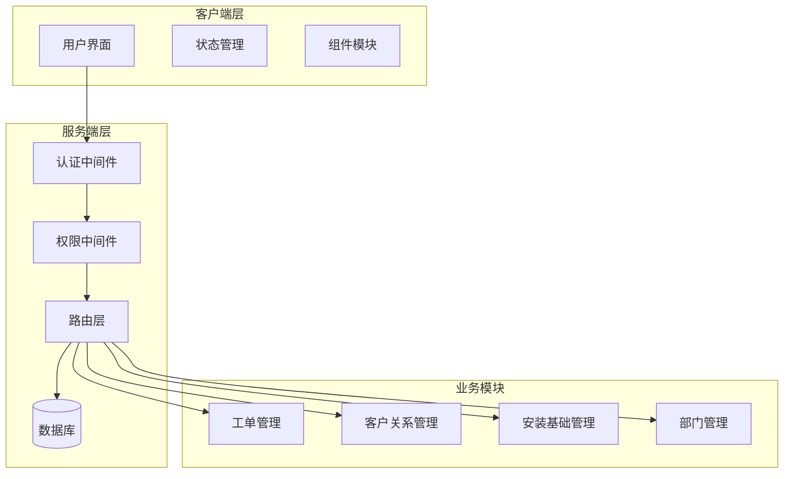
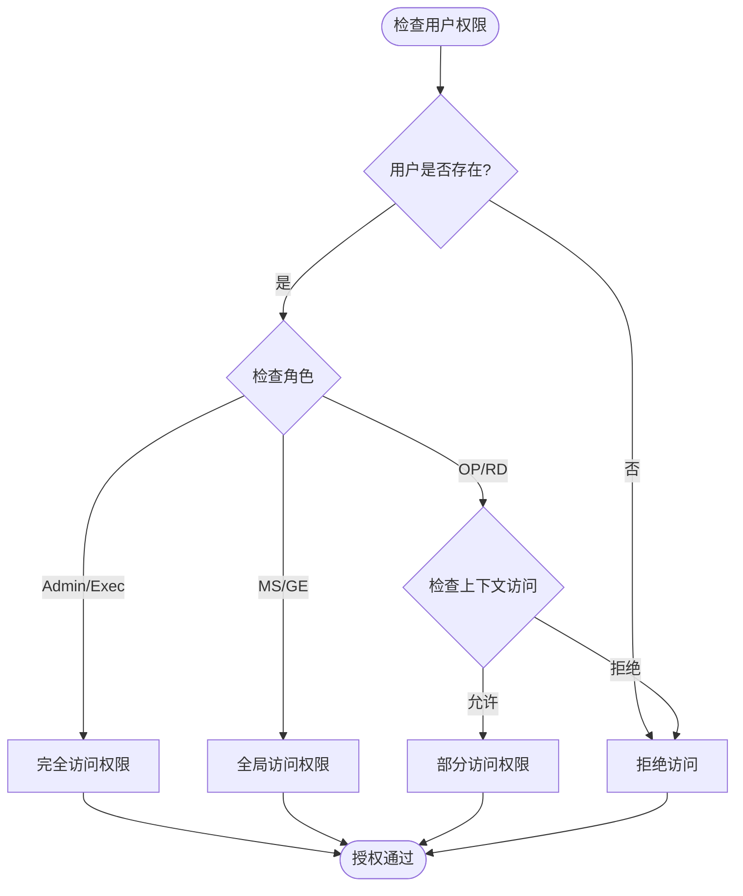
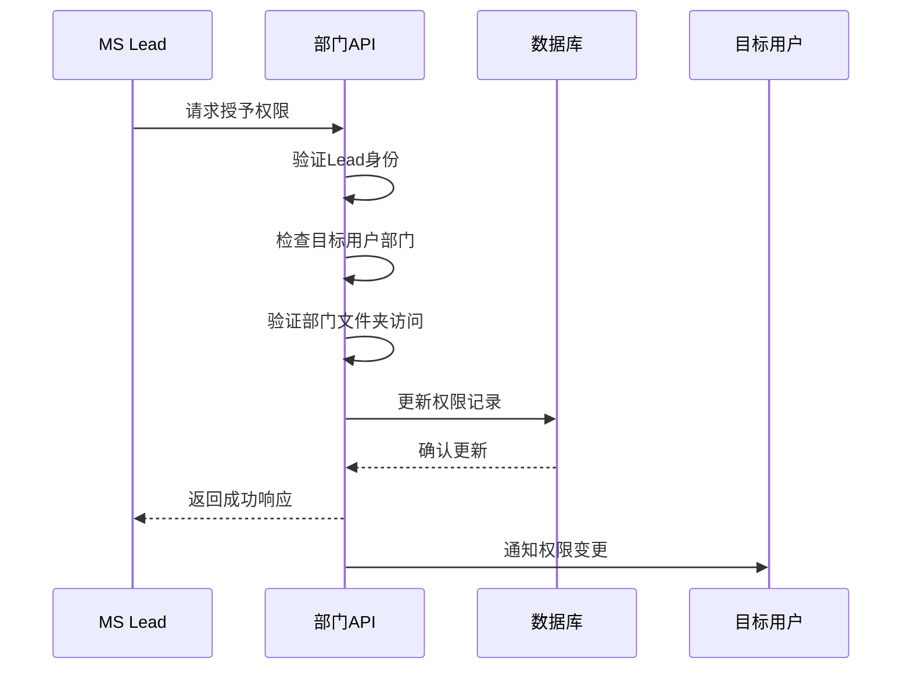
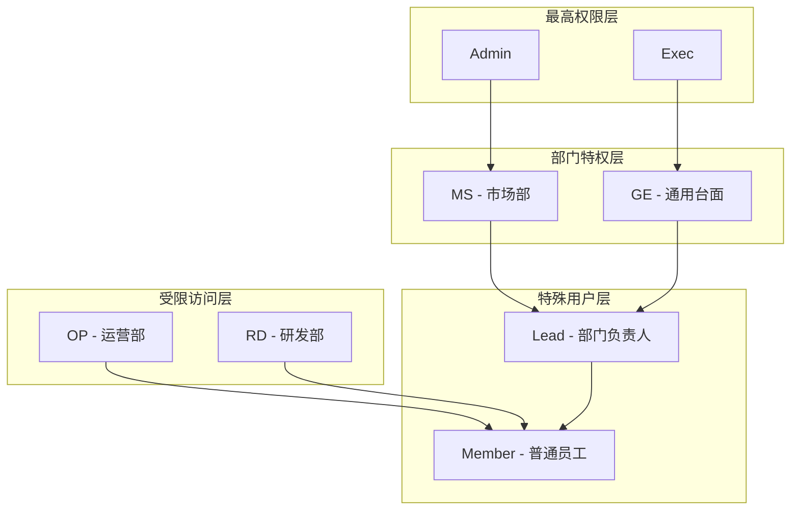
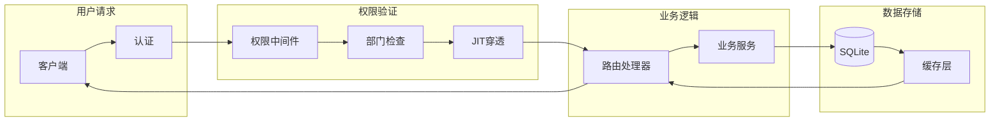
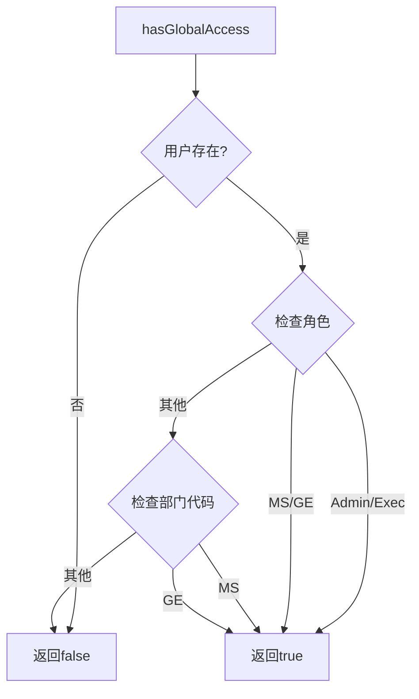
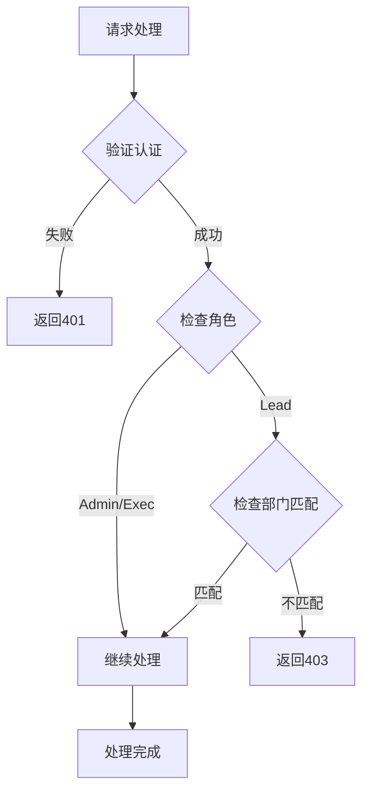
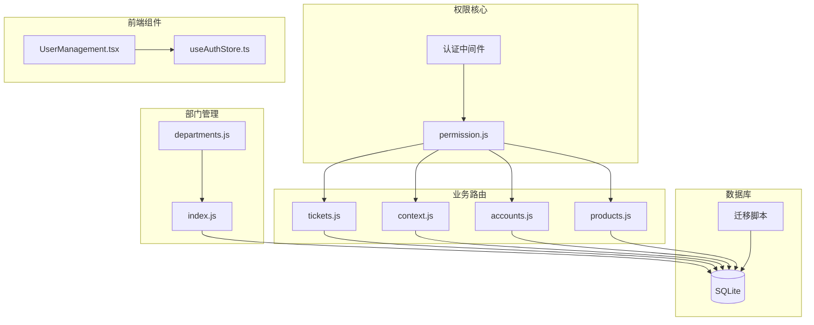

# MS Lead权限扩展

<cite>
**本文档引用的文件**
- [permission.js](file://server/service/middleware/permission.js)
- [departments.js](file://server/service/routes/departments.js)
- [tickets.js](file://server/service/routes/tickets.js)
- [context.js](file://server/service/routes/context.js)
- [accounts.js](file://server/service/routes/accounts.js)
- [products.js](file://server/service/routes/products.js)
- [index.js](file://server/index.js)
- [027_add_department_lead.sql](file://server/service/migrations/027_add_department_lead.sql)
- [028_add_department_code.sql](file://server/service/migrations/028_add_department_code.sql)
- [fix_departments_permissions.sql](file://server/migrations/fix_departments_permissions.sql)
- [UserManagement.tsx](file://client/src/components/Admin/UserManagement.tsx)
- [useAuthStore.ts](file://client/src/store/useAuthStore.ts)
</cite>

## 目录
1. [项目概述](#项目概述)
2. [项目结构](#项目结构)
3. [核心组件](#核心组件)
4. [架构概览](#架构概览)
5. [详细组件分析](#详细组件分析)
6. [依赖关系分析](#依赖关系分析)
7. [性能考虑](#性能考虑)
8. [故障排除指南](#故障排除指南)
9. [结论](#结论)

## 项目概述

Longhorn项目是一个基于P2架构的统一工单管理系统，专注于MS（市场部）Lead权限扩展功能。该项目实现了严格的部门权限控制机制，通过"隔离与穿透"原则确保不同部门间的权限边界，同时为MS Lead提供必要的管理权限。

### 核心特性

- **部门权限隔离**：OP/RD部门默认无权访问CRM/IB系统，仅通过工单获得JIT（按需）穿透权限
- **MS Lead特权**：市场部Lead在部门内拥有完整的管理权限
- **全局访问控制**：Admin/Exec拥有全系统权限，MS部门拥有全局读写权限
- **JIT权限穿透**：通过工单关联实现最小化权限访问

## 项目结构

**图表来源**
- [permission.js:1-232](file://server/service/middleware/permission.js#L1-L232)
- [departments.js:1-164](file://server/service/routes/departments.js#L1-L164)

**章节来源**
- [permission.js:1-232](file://server/service/middleware/permission.js#L1-L232)
- [departments.js:1-164](file://server/service/routes/departments.js#L1-L164)

## 核心组件

### 权限中间件系统

权限中间件是整个系统的安全核心，实现了以下关键功能：

#### 全局访问判断

**图表来源**
- [permission.js:34-44](file://server/service/middleware/permission.js#L34-L44)

#### JIT权限穿透机制
- **账户ID穿透**：通过`ticket_participants`表查询用户可访问的账户列表
- **序列号穿透**：限制用户只能访问与自己相关的设备序列号
- **经销商ID穿透**：控制用户对经销商信息的访问范围

**章节来源**
- [permission.js:34-96](file://server/service/middleware/permission.js#L34-L96)

### 部门管理模块

部门管理模块为MS Lead提供了完整的部门管理能力：

#### Lead权限控制

**图表来源**
- [index.js:1991-2014](file://server/index.js#L1991-L2014)

**章节来源**
- [departments.js:13-28](file://server/service/routes/departments.js#L13-L28)
- [index.js:1991-2014](file://server/index.js#L1991-L2014)

## 架构概览

### 权限层次结构

**图表来源**
- [permission.js:34-44](file://server/service/middleware/permission.js#L34-L44)

### 数据流架构

**图表来源**
- [permission.js:107-182](file://server/service/middleware/permission.js#L107-L182)

## 详细组件分析

### 权限中间件详细分析

#### 核心函数实现

**全局访问判断函数**

**图表来源**
- [permission.js:34-44](file://server/service/middleware/permission.js#L34-L44)

**JIT权限查询函数**
- `getAccessibleAccountIds()`: 查询用户可通过工单访问的账户ID列表
- `getAccessibleSerialNumbers()`: 查询用户可通过工单访问的设备序列号列表
- `getAccessibleDealerIds()`: 查询用户可通过工单访问的经销商ID列表

**章节来源**
- [permission.js:50-96](file://server/service/middleware/permission.js#L50-L96)

#### 访问守卫实现

**CRM访问守卫**
- Admin/Exec: 完全访问权限
- MS/GE: 全局访问权限  
- OP/RD: 仅能通过上下文API访问特定信息

**IB访问守卫**
- Admin/Exec: 完全访问权限
- MS/GE: 全局访问权限
- OP/RD: 仅能搜索与自己相关的设备信息

**上下文访问守卫**
- 验证用户是否有权访问特定账户或设备
- 实施JIT权限穿透检查

**章节来源**
- [permission.js:107-182](file://server/service/middleware/permission.js#L107-L182)

### 部门管理功能

#### 部门路由实现

**分发规则管理**
- Lead和Admin可以管理指定部门的自动分发规则
- 支持批量更新和创建操作
- 实现ON CONFLICT处理确保数据一致性

**部门信息查询**
- 获取当前用户所属部门信息
- 支持按部门代码查询
- 提供部门设置更新功能

**章节来源**
- [departments.js:34-160](file://server/service/routes/departments.js#L34-L160)

#### 部门领导权限

**Lead权限范围**
- 仅能管理自己部门的分发规则
- 可以更新部门设置
- 无法访问其他部门的管理功能

**权限验证流程**

**图表来源**
- [departments.js:13-28](file://server/service/routes/departments.js#L13-L28)

### 工单系统集成

#### 权限集成点

**工单列表权限控制**
- Admin/Exec: 查看所有工单
- MS/GE: 查看所有工单
- OP/RD: 仅能查看与自己相关的工单

**JIT权限应用**
- 通过`ticket_participants`表实现权限穿透
- 支持按创建者、处理者、参与者等维度控制

**章节来源**
- [tickets.js:620-633](file://server/service/routes/tickets.js#L620-L633)

#### 自动分发机制

**MS部门自动分发**
- 优先使用部门分发规则
- 支持返回原处理人的防呆规则
- 无法匹配时自动释放到待认领池

**跨部门处理**
- 检测跨部门流转情况
- 自动清理原处理人权限
- 记录自动分发活动日志

**章节来源**
- [tickets.js:196-251](file://server/service/routes/tickets.js#L196-L251)

### 上下文API权限控制

#### 客户上下文访问

**账户ID穿透验证**
- OP/RD用户仅能访问与自己相关的账户
- 通过`getAccessibleAccountIds()`函数实现
- 实施严格的权限边界检查

**技术视图与商业视图**
- MS用户可查看完整客户信息
- OP/RD用户查看脱敏后的技术视图
- 控制敏感信息的展示范围

**章节来源**
- [context.js:21-29](file://server/service/routes/context.js#L21-L29)

#### 设备上下文访问

**序列号穿透验证**
- 通过`getAccessibleSerialNumbers()`函数实现
- 仅允许访问与用户相关的设备信息
- 支持未注册设备的有限访问

**设备历史查询**
- 查询与设备相关的服务历史
- 支持按产品ID和序列号两种方式
- 实施权限边界控制

**章节来源**
- [context.js:359-367](file://server/service/routes/context.js#L359-L367)

## 依赖关系分析

### 权限系统依赖图

**图表来源**
- [permission.js:1-232](file://server/service/middleware/permission.js#L1-L232)
- [departments.js:1-164](file://server/service/routes/departments.js#L1-L164)

### 数据库模式依赖

**部门领导关系**
- `departments`表新增`lead_id`字段
- 引用`users`表的外键关系
- 支持部门级别的权限控制

**权限存储**
- `permissions`表存储用户文件夹访问权限
- 支持过期时间控制
- 实现权限继承机制

**章节来源**
- [027_add_department_lead.sql:1-11](file://server/service/migrations/027_add_department_lead.sql#L1-L11)
- [fix_departments_permissions.sql:28-57](file://server/migrations/fix_departments_permissions.sql#L28-L57)

## 性能考虑

### 权限查询优化

**索引策略**
- 在`ticket_participants`表上建立复合索引
- 优化`user_id`和`ticket_id`的查询性能
- 实施适当的数据库连接池配置

**缓存机制**
- 缓存用户部门信息减少数据库查询
- 实施权限结果缓存避免重复计算
- 使用Redis或其他内存存储提高响应速度

### 查询性能优化

**SQL查询优化**
- 使用UNION操作符合并多个查询条件
- 实施LIMIT和OFFSET进行分页处理
- 优化JOIN操作减少数据扫描

**并发控制**
- 实施数据库事务确保数据一致性
- 使用适当的锁机制避免竞态条件
- 实现连接超时和重试机制

## 故障排除指南

### 常见权限问题

**问题：Lead无法管理其他用户权限**
- 检查`department_id`是否匹配
- 验证部门文件夹路径格式
- 确认Lead权限范围限制

**问题：OP/RD用户无法访问工单**
- 检查`ticket_participants`表数据完整性
- 验证用户是否参与相关工单
- 确认JIT权限穿透是否正确配置

**问题：权限验证失败**
- 检查用户认证状态
- 验证部门代码标准化处理
- 确认权限中间件执行顺序

### 调试工具

**服务器端调试**
- 启用详细的日志记录
- 实施权限检查点跟踪
- 监控数据库查询性能

**客户端调试**
- 检查认证令牌有效性
- 验证用户角色和部门信息
- 实施前端权限状态显示

**章节来源**
- [index.js:1991-2014](file://server/index.js#L1991-L2014)

## 结论

MS Lead权限扩展功能成功实现了以下目标：

### 安全性提升
- 建立了清晰的权限边界，防止越权访问
- 实现了最小化权限原则，仅授予必要权限
- 通过JIT机制确保权限的按需分配

### 管理效率改善
- 为MS Lead提供了高效的部门管理能力
- 简化了权限管理流程，降低了管理复杂度
- 实现了自动化权限分配和回收

### 系统稳定性
- 通过严格的权限验证确保系统安全
- 实现了完善的错误处理和恢复机制
- 提供了全面的日志记录和监控能力

该权限扩展系统为Longhorn项目提供了坚实的安全基础，支持未来更大规模的企业部署需求。通过持续的优化和改进，该系统将继续为企业用户提供安全、高效的服务体验。