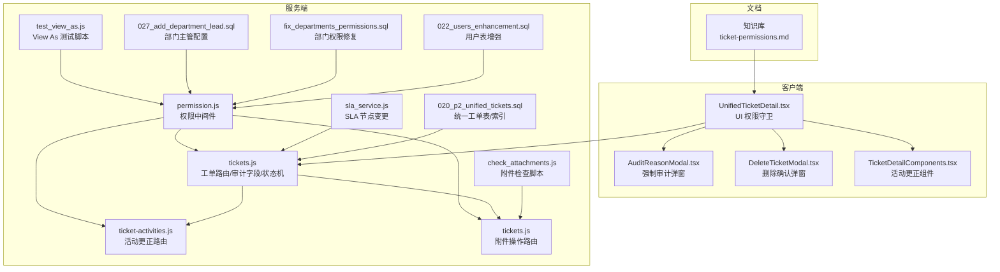
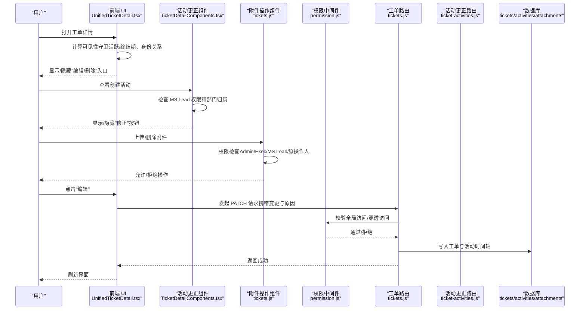
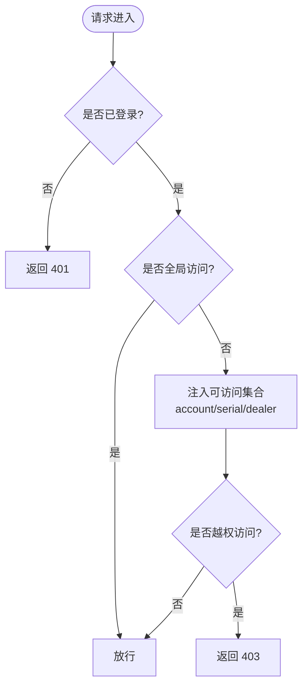
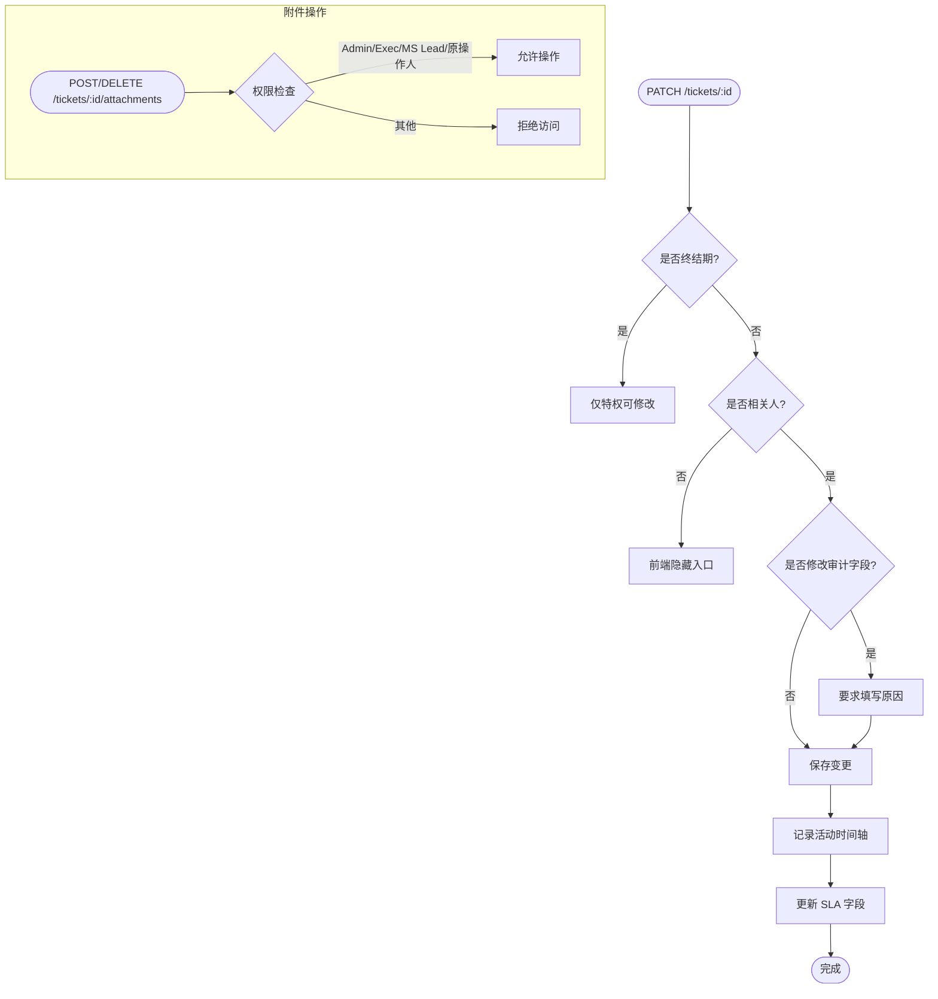
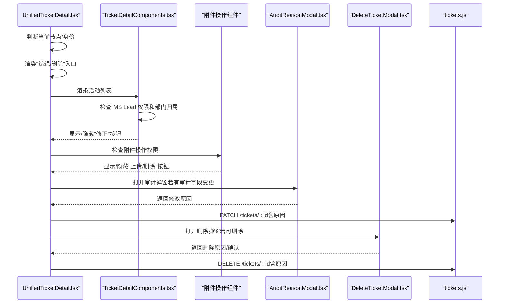
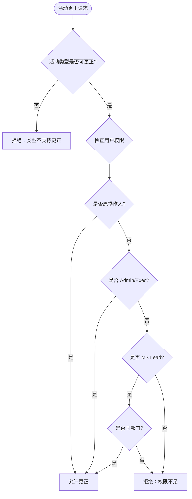
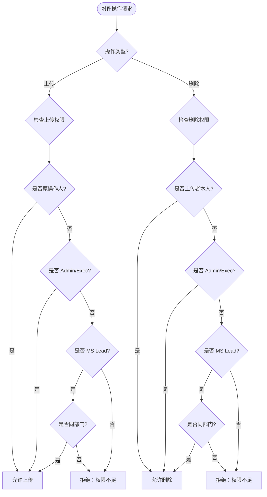
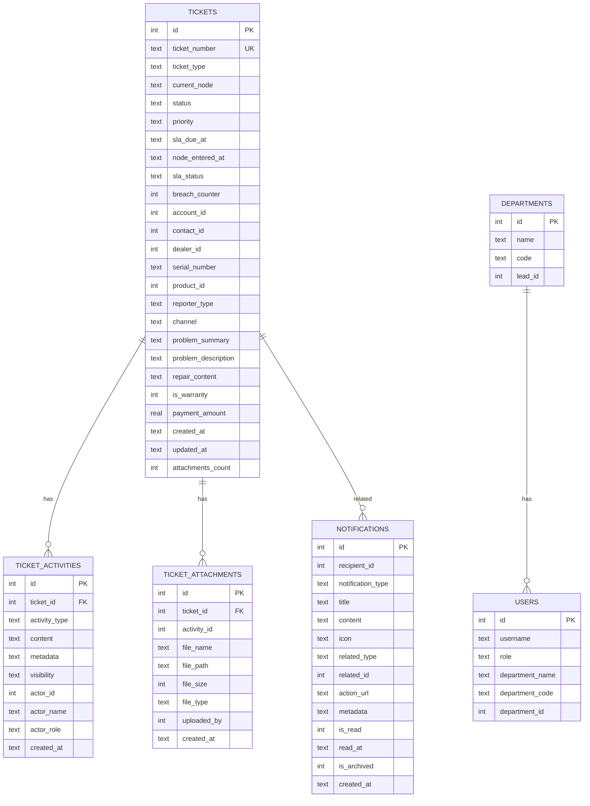
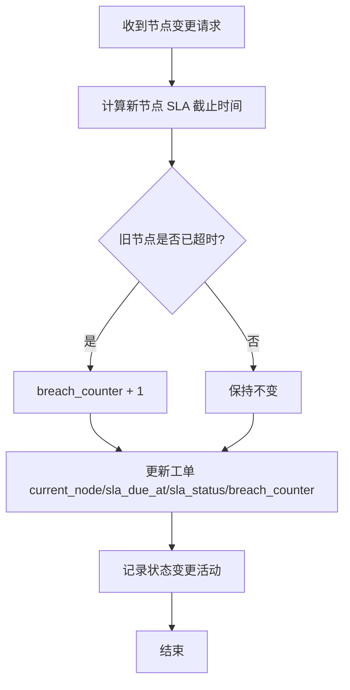
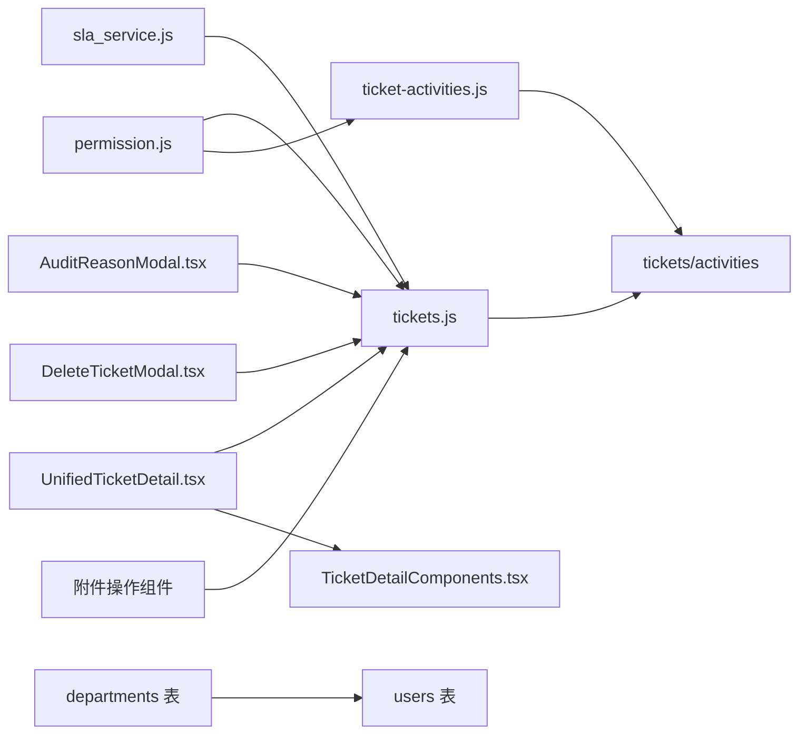

# 工单权限

<cite>
**本文引用的文件**
- [docs/kb/ticket-permissions.md](file://docs/kb/ticket-permissions.md)
- [server/service/middleware/permission.js](file://server/service/middleware/permission.js)
- [server/service/routes/tickets.js](file://server/service/routes/tickets.js)
- [server/service/routes/ticket-activities.js](file://server/service/routes/ticket-activities.js)
- [client/src/components/Workspace/UnifiedTicketDetail.tsx](file://client/src/components/Workspace/UnifiedTicketDetail.tsx)
- [client/src/components/Workspace/TicketDetailComponents.tsx](file://client/src/components/Workspace/TicketDetailComponents.tsx)
- [client/src/components/Service/AuditReasonModal.tsx](file://client/src/components/Service/AuditReasonModal.tsx)
- [client/src/components/Service/DeleteTicketModal.tsx](file://client/src/components/Service/DeleteTicketModal.tsx)
- [server/service/migrations/020_p2_unified_tickets.sql](file://server/service/migrations/020_p2_unified_tickets.sql)
- [server/scripts/test_view_as.js](file://server/scripts/test_view_as.js)
- [server/service/sla_service.js](file://server/service/sla_service.js)
- [server/scripts/fix_ticket_status.js](file://server/scripts/fix_ticket_status.js)
- [server/migrations/fix_departments_permissions.sql](file://server/migrations/fix_departments_permissions.sql)
- [server/service/migrations/027_add_department_lead.sql](file://server/service/migrations/027_add_department_lead.sql)
- [server/scripts/check_attachments.js](file://server/scripts/check_attachments.js)
- [server/service/migrations/022_users_enhancement.sql](file://server/service/migrations/022_users_enhancement.sql)
</cite>

## 更新摘要
**变更内容**
- 新增 MS Lead 用户可查看工单创建活动的修正按钮功能
- 新增附件上传/删除权限控制，支持 Admin/Exec/MS Lead/原操作人进行附件操作
- 增强活动更正权限控制，支持 MS Lead 对创建工单活动进行更正
- 增强部门归属验证和原操作人权限控制
- 新增附件操作权限检查和验证机制
- 完善部门主管配置和权限验证机制

## 目录
1. [简介](#简介)
2. [项目结构](#项目结构)
3. [核心组件](#核心组件)
4. [架构总览](#架构总览)
5. [详细组件分析](#详细组件分析)
6. [依赖分析](#依赖分析)
7. [性能考虑](#性能考虑)
8. [故障排查指南](#故障排查指南)
9. [结论](#结论)

## 简介
本文件系统性阐述 Longhorn 工单系统的"权限与操作"体系，围绕"阶梯式风控模型"展开，覆盖服务端权限中间件、前端 UI 可见性守卫、强制审计机制、删除与恢复策略、以及跨端（Web/iOS）的一致行为。目标是帮助开发者、测试与运营人员准确理解"谁能在何时对工单进行何种操作"，并提供可追溯、可验证的实现依据。

**更新** 本版本新增了 MS Lead 用户的权限增强和附件操作权限控制，进一步完善了权限管理体系。新增了对工单创建活动的修正按钮支持，增强了部门归属验证和原操作人权限控制，完善了部门主管配置机制。

## 项目结构
本主题涉及的关键位置包括：
- 文档层：知识库中关于"工单权限与操作"的说明
- 服务端：权限中间件、工单路由与审计字段白名单、状态机与 SLA 服务、活动更正路由、附件操作路由
- 客户端：统一工单详情页的 UI 权限守卫、审计理由弹窗、删除确认弹窗、活动更正组件
- 数据层：统一工单表结构与索引、活动时间轴与通知、附件管理

**图表来源**
- [docs/kb/ticket-permissions.md:1-63](file://docs/kb/ticket-permissions.md#L1-L63)
- [client/src/components/Workspace/UnifiedTicketDetail.tsx:750-949](file://client/src/components/Workspace/UnifiedTicketDetail.tsx#L750-L949)
- [client/src/components/Workspace/TicketDetailComponents.tsx:1220-1419](file://client/src/components/Workspace/TicketDetailComponents.tsx#L1220-L1419)
- [client/src/components/Service/AuditReasonModal.tsx:1-338](file://client/src/components/Service/AuditReasonModal.tsx#L1-L338)
- [client/src/components/Service/DeleteTicketModal.tsx:1-383](file://client/src/components/Service/DeleteTicketModal.tsx#L1-L383)
- [server/service/middleware/permission.js:1-232](file://server/service/middleware/permission.js#L1-L232)
- [server/service/routes/tickets.js:1-2853](file://server/service/routes/tickets.js#L1-L2853)
- [server/service/routes/ticket-activities.js:650-833](file://server/service/routes/ticket-activities.js#L650-L833)
- [server/service/sla_service.js:124-172](file://server/service/sla_service.js#L124-L172)
- [server/service/migrations/020_p2_unified_tickets.sql:1-271](file://server/service/migrations/020_p2_unified_tickets.sql#L1-L271)
- [server/scripts/test_view_as.js:1-200](file://server/scripts/test_view_as.js#L1-L200)
- [server/service/migrations/027_add_department_lead.sql:1-10](file://server/service/migrations/027_add_department_lead.sql#L1-L10)
- [server/migrations/fix_departments_permissions.sql:28-57](file://server/migrations/fix_departments_permissions.sql#L28-L57)
- [server/scripts/check_attachments.js:1-36](file://server/scripts/check_attachments.js#L1-L36)
- [server/service/migrations/022_users_enhancement.sql:1-12](file://server/service/migrations/022_users_enhancement.sql#L1-L12)

**章节来源**
- [docs/kb/ticket-permissions.md:1-63](file://docs/kb/ticket-permissions.md#L1-L63)
- [server/service/middleware/permission.js:1-232](file://server/service/middleware/permission.js#L1-L232)
- [server/service/routes/tickets.js:1-2853](file://server/service/routes/tickets.js#L1-L2853)
- [server/service/routes/ticket-activities.js:650-833](file://server/service/routes/ticket-activities.js#L650-L833)
- [client/src/components/Workspace/UnifiedTicketDetail.tsx:750-949](file://client/src/components/Workspace/UnifiedTicketDetail.tsx#L750-L949)
- [client/src/components/Workspace/TicketDetailComponents.tsx:1220-1419](file://client/src/components/Workspace/TicketDetailComponents.tsx#L1220-L1419)
- [client/src/components/Service/AuditReasonModal.tsx:1-338](file://client/src/components/Service/AuditReasonModal.tsx#L1-L338)
- [client/src/components/Service/DeleteTicketModal.tsx:1-383](file://client/src/components/Service/DeleteTicketModal.tsx#L1-L383)
- [server/service/migrations/020_p2_unified_tickets.sql:1-271](file://server/service/migrations/020_p2_unified_tickets.sql#L1-L271)
- [server/scripts/test_view_as.js:1-200](file://server/scripts/test_view_as.js#L1-L200)
- [server/service/sla_service.js:124-172](file://server/service/sla_service.js#L124-L172)
- [server/service/migrations/027_add_department_lead.sql:1-10](file://server/service/migrations/027_add_department_lead.sql#L1-L10)
- [server/migrations/fix_departments_permissions.sql:28-57](file://server/migrations/fix_departments_permissions.sql#L28-L57)
- [server/scripts/check_attachments.js:1-36](file://server/scripts/check_attachments.js#L1-L36)
- [server/service/migrations/022_users_enhancement.sql:1-12](file://server/service/migrations/022_users_enhancement.sql#L1-L12)

## 核心组件
- 阶梯式风控模型与角色权限
  - 活跃期放权：处理中赋予足够编辑权，避免流程卡死
  - 结算期锁定：终态仅特权角色可修正
  - 归属审计：非特权用户的操作需与身份挂钩并强制填写原因
- 强制审计字段白名单：设备/归属、核心内容、经济/时效等关键字段变更需填写原因
- UI 可见性守卫：编辑/删除入口按条件隐藏，杜绝"点了报错"
- 删除与恢复：墓碑化软删除，限定节点与身份；回收站入口仅特权可见
- View As：Admin/Exec 可模拟其他用户视角，权限边界保持一致
- **新增** MS Lead 权限增强：MS Lead 用户可查看工单创建活动的修正按钮
- **新增** 附件操作权限：Admin/Exec/MS Lead/原操作人可进行附件上传/删除操作
- **新增** 增强的部门归属验证：MS Lead 需要与原操作人处于同一部门才能更正活动
- **新增** 原操作人权限控制：原操作人始终拥有最高权限进行内容更正
- **新增** 部门主管配置：支持为每个部门指定明确的负责人

**更新** 新增了 MS Lead 用户的权限增强和附件操作权限控制，进一步完善了权限管理体系。增强了部门归属验证和原操作人权限控制，确保权限使用的安全性和准确性。完善了部门主管配置机制，支持更精确的权限控制。

**章节来源**
- [docs/kb/ticket-permissions.md:13-63](file://docs/kb/ticket-permissions.md#L13-L63)
- [server/service/routes/tickets.js:16-30](file://server/service/routes/tickets.js#L16-L30)
- [client/src/components/Workspace/UnifiedTicketDetail.tsx:750-949](file://client/src/components/Workspace/UnifiedTicketDetail.tsx#L750-L949)
- [client/src/components/Service/DeleteTicketModal.tsx:40-43](file://client/src/components/Service/DeleteTicketModal.tsx#L40-L43)
- [server/service/routes/ticket-activities.js:650-833](file://server/service/routes/ticket-activities.js#L650-L833)
- [server/service/routes/tickets.js:2740-2853](file://server/service/routes/tickets.js#L2740-L2853)
- [server/service/migrations/027_add_department_lead.sql:1-10](file://server/service/migrations/027_add_department_lead.sql#L1-L10)

## 架构总览
整体采用"服务端中间件 + 前端 UI 守卫 + 数据层约束"的三层防护：

**图表来源**
- [client/src/components/Workspace/UnifiedTicketDetail.tsx:750-949](file://client/src/components/Workspace/UnifiedTicketDetail.tsx#L750-L949)
- [client/src/components/Workspace/TicketDetailComponents.tsx:1220-1419](file://client/src/components/Workspace/TicketDetailComponents.tsx#L1220-L1419)
- [server/service/middleware/permission.js:107-182](file://server/service/middleware/permission.js#L107-L182)
- [server/service/routes/tickets.js:1783-1813](file://server/service/routes/tickets.js#L1783-L1813)
- [server/service/routes/ticket-activities.js:650-833](file://server/service/routes/ticket-activities.js#L650-L833)

## 详细组件分析

### 1) 权限中间件（服务端）
- 全局访问判定：Admin/Exec/MS/GE 拥有全局读写
- JIT 穿透：OP/RD 通过工单关联获取 account_id/serial_number/dealer_id 的受限访问
- Context API 穿透：按 query 参数校验访问边界
- View As：Admin/Exec 可模拟用户身份，保持权限一致性
- **新增** 部门代码标准化：支持中文部门名称与简写代码的标准化处理

**图表来源**
- [server/service/middleware/permission.js:107-182](file://server/service/middleware/permission.js#L107-L182)

**章节来源**
- [server/service/middleware/permission.js:34-44](file://server/service/middleware/permission.js#L34-L44)
- [server/service/middleware/permission.js:50-96](file://server/service/middleware/permission.js#L50-L96)
- [server/service/middleware/permission.js:145-182](file://server/service/middleware/permission.js#L145-L182)
- [server/scripts/test_view_as.js:50-85](file://server/scripts/test_view_as.js#L50-L85)
- [server/service/middleware/permission.js:15-28](file://server/service/middleware/permission.js#L15-L28)

### 2) 工单路由与审计字段白名单
- 审计字段白名单：覆盖设备/归属、内容与诊断、经济责任、时效契约、原始证据等
- 终结期节点：resolved/closed/auto_closed/converted/cancelled 禁止普通用户修改
- 状态机与 SLA：节点变更时更新 SLA 截止时间、状态与超时计数
- **新增** 附件操作权限：Admin/Exec/MS Lead/原操作人可进行附件上传/删除
- **新增** 部门代码标准化：支持中文部门名称与简写代码的标准化处理

**图表来源**
- [server/service/routes/tickets.js:16-30](file://server/service/routes/tickets.js#L16-L30)
- [server/service/routes/tickets.js:32-33](file://server/service/routes/tickets.js#L32-L33)
- [server/service/routes/tickets.js:1783-1813](file://server/service/routes/tickets.js#L1783-L1813)
- [server/service/routes/tickets.js:2740-2853](file://server/service/routes/tickets.js#L2740-L2853)
- [server/service/sla_service.js:132-172](file://server/service/sla_service.js#L132-L172)

**章节来源**
- [server/service/routes/tickets.js:16-30](file://server/service/routes/tickets.js#L16-L30)
- [server/service/routes/tickets.js:32-33](file://server/service/routes/tickets.js#L32-L33)
- [server/service/routes/tickets.js:1783-1813](file://server/service/routes/tickets.js#L1783-L1813)
- [server/service/routes/tickets.js:2740-2853](file://server/service/routes/tickets.js#L2740-L2853)
- [server/service/sla_service.js:132-172](file://server/service/sla_service.js#L132-L172)

### 3) 前端 UI 权限守卫与交互
- 编辑按钮可见性：特权用户始终可见；活跃期仅相关人可见；终结期隐藏
- 删除菜单可见性：特权用户始终可见；非特权仅 draft/submitted 且创建者/提交者可见
- 审计弹窗：变更审计字段时强制输入原因，支持终结期特权修正提示
- 删除弹窗：根据节点决定是否需要输入工单号确认，并强制填写删除理由
- **新增** 活动更正权限：MS Lead 用户可查看工单创建活动的修正按钮
- **新增** 附件操作权限：MS Lead 用户可进行附件上传/删除操作
- **新增** 部门代码标准化：支持中文部门名称与简写代码的标准化处理

**图表来源**
- [client/src/components/Workspace/UnifiedTicketDetail.tsx:750-949](file://client/src/components/Workspace/UnifiedTicketDetail.tsx#L750-L949)
- [client/src/components/Workspace/TicketDetailComponents.tsx:1220-1419](file://client/src/components/Workspace/TicketDetailComponents.tsx#L1220-L1419)
- [client/src/components/Service/AuditReasonModal.tsx:1-338](file://client/src/components/Service/AuditReasonModal.tsx#L1-L338)
- [client/src/components/Service/DeleteTicketModal.tsx:1-383](file://client/src/components/Service/DeleteTicketModal.tsx#L1-L383)

**章节来源**
- [client/src/components/Workspace/UnifiedTicketDetail.tsx:750-949](file://client/src/components/Workspace/UnifiedTicketDetail.tsx#L750-L949)
- [client/src/components/Workspace/TicketDetailComponents.tsx:1220-1419](file://client/src/components/Workspace/TicketDetailComponents.tsx#L1220-L1419)
- [client/src/components/Service/AuditReasonModal.tsx:19-30](file://client/src/components/Service/AuditReasonModal.tsx#L19-L30)
- [client/src/components/Service/DeleteTicketModal.tsx:40-43](file://client/src/components/Service/DeleteTicketModal.tsx#L40-L43)

### 4) 活动更正权限控制
- **新增** MS Lead 权限：MS Lead 用户可查看工单创建活动的修正按钮
- **增强** 部门归属验证：MS Lead 需要与原操作人处于同一部门才能更正活动
- **增强** 部门代码标准化：支持中文部门名称与简写代码的标准化处理
- 权限检查：原操作人、部门主管、Admin、Exec
- 同部门 Lead 检查：MS Lead 需要与原操作人处于同一部门
- 活动类型限制：支持更正的活动类型包括 op_repair_report、diagnostic_report、shipping_info、comment、internal_note

**图表来源**
- [server/service/routes/ticket-activities.js:650-833](file://server/service/routes/ticket-activities.js#L650-L833)
- [client/src/components/Workspace/TicketDetailComponents.tsx:1220-1419](file://client/src/components/Workspace/TicketDetailComponents.tsx#L1220-L1419)

**章节来源**
- [server/service/routes/ticket-activities.js:650-833](file://server/service/routes/ticket-activities.js#L650-L833)
- [client/src/components/Workspace/TicketDetailComponents.tsx:1220-1419](file://client/src/components/Workspace/TicketDetailComponents.tsx#L1220-L1419)

### 5) 附件操作权限控制
- **新增** 附件上传权限：Admin/Exec/MS Lead/原操作人可上传附件
- **新增** 附件删除权限：Admin/Exec/MS Lead/上传者本人可删除附件
- **新增** 权限检查机制：确保附件操作的安全性和准确性
- **新增** 原操作人权限：原操作人始终拥有最高权限进行附件操作
- **新增** 部门代码标准化：支持中文部门名称与简写代码的标准化处理

**图表来源**
- [server/service/routes/tickets.js:2740-2853](file://server/service/routes/tickets.js#L2740-L2853)

**章节来源**
- [server/service/routes/tickets.js:2740-2853](file://server/service/routes/tickets.js#L2740-L2853)

### 6) 数据模型与索引
统一工单表包含工单类型、状态机节点、SLA 字段、协作机制、账户/联系人/经销商、产品信息、问题分类、维修信息、收款信息、时间追踪、自动关闭、关联工单、渠道代码、审批信息等。配套建立多维索引以支撑查询与统计。

**更新** 新增附件相关字段和权限控制支持，完善部门主管配置字段。

**图表来源**
- [server/service/migrations/020_p2_unified_tickets.sql:8-122](file://server/service/migrations/020_p2_unified_tickets.sql#L8-L122)
- [server/service/migrations/020_p2_unified_tickets.sql:145-193](file://server/service/migrations/020_p2_unified_tickets.sql#L145-L193)
- [server/service/migrations/020_p2_unified_tickets.sql:205-247](file://server/service/migrations/020_p2_unified_tickets.sql#L205-L247)
- [server/service/migrations/027_add_department_lead.sql:4](file://server/service/migrations/027_add_department_lead.sql#L4)
- [server/service/migrations/022_users_enhancement.sql:6-12](file://server/service/migrations/022_users_enhancement.sql#L6-L12)

**章节来源**
- [server/service/migrations/020_p2_unified_tickets.sql:1-271](file://server/service/migrations/020_p2_unified_tickets.sql#L1-L271)
- [server/service/migrations/027_add_department_lead.sql:1-10](file://server/service/migrations/027_add_department_lead.sql#L1-L10)
- [server/service/migrations/022_users_enhancement.sql:1-12](file://server/service/migrations/022_users_enhancement.sql#L1-L12)

### 7) 状态机与 SLA 更新
- 节点映射：根据 ticket_type 与历史 status 推导 current_node
- 节点变更时计算新的 SLA 截止时间，重置/更新 SLA 状态与超时计数
- 记录状态变更活动，保留审计轨迹

**图表来源**
- [server/scripts/fix_ticket_status.js:114-167](file://server/scripts/fix_ticket_status.js#L114-L167)
- [server/service/sla_service.js:132-172](file://server/service/sla_service.js#L132-L172)
- [server/service/routes/tickets.js:1783-1813](file://server/service/routes/tickets.js#L1783-L1813)

**章节来源**
- [server/scripts/fix_ticket_status.js:114-167](file://server/scripts/fix_ticket_status.js#L114-L167)
- [server/service/sla_service.js:132-172](file://server/service/sla_service.js#L132-L172)
- [server/service/routes/tickets.js:1783-1813](file://server/service/routes/tickets.js#L1783-L1813)

## 依赖分析
- 服务端耦合
  - permission.js 作为中间件被多条路由共享，形成统一的"隔离与穿透"策略
  - tickets.js 依赖 permission.js 的全局访问判断与 JIT 穿透能力
  - ticket-activities.js 依赖 permission.js 进行活动更正权限控制
  - SLA 服务独立于路由，但被状态机更新流程调用
  - **新增** 部门主管配置：departments 表与 users 表的关联关系
- 前端耦合
  - UnifiedTicketDetail.tsx 依赖审计字段白名单与终结期节点常量
  - TicketDetailComponents.tsx 依赖活动更正权限检查与 MS Lead 权限
  - AuditReasonModal.tsx 与 DeleteTicketModal.tsx 与后端接口契约一致（原因字段、节点判断）
  - 附件操作组件依赖权限检查和状态管理

**图表来源**
- [server/service/middleware/permission.js:222-232](file://server/service/middleware/permission.js#L222-L232)
- [server/service/routes/tickets.js:1-14](file://server/service/routes/tickets.js#L1-L14)
- [server/service/routes/ticket-activities.js:650-833](file://server/service/routes/ticket-activities.js#L650-L833)
- [server/service/sla_service.js:124-172](file://server/service/sla_service.js#L124-L172)
- [client/src/components/Workspace/UnifiedTicketDetail.tsx:750-949](file://client/src/components/Workspace/UnifiedTicketDetail.tsx#L750-L949)
- [client/src/components/Workspace/TicketDetailComponents.tsx:1220-1419](file://client/src/components/Workspace/TicketDetailComponents.tsx#L1220-L1419)
- [client/src/components/Service/AuditReasonModal.tsx:1-338](file://client/src/components/Service/AuditReasonModal.tsx#L1-L338)
- [client/src/components/Service/DeleteTicketModal.tsx:1-383](file://client/src/components/Service/DeleteTicketModal.tsx#L1-L383)

**章节来源**
- [server/service/middleware/permission.js:1-232](file://server/service/middleware/permission.js#L1-L232)
- [server/service/routes/tickets.js:1-2853](file://server/service/routes/tickets.js#L1-L2853)
- [server/service/routes/ticket-activities.js:650-833](file://server/service/routes/ticket-activities.js#L650-L833)
- [client/src/components/Workspace/UnifiedTicketDetail.tsx:750-949](file://client/src/components/Workspace/UnifiedTicketDetail.tsx#L750-L949)
- [client/src/components/Workspace/TicketDetailComponents.tsx:1220-1419](file://client/src/components/Workspace/TicketDetailComponents.tsx#L1220-L1419)
- [client/src/components/Service/AuditReasonModal.tsx:1-338](file://client/src/components/Service/AuditReasonModal.tsx#L1-L338)
- [client/src/components/Service/DeleteTicketModal.tsx:1-383](file://client/src/components/Service/DeleteTicketModal.tsx#L1-L383)

## 性能考虑
- 查询过滤与索引
  - tickets 表建立多维索引（类型、节点、状态、优先级、SLA、账户/产品/序列号、指派人等），降低复杂过滤成本
  - 列表查询默认排除已删除工单，减少扫描范围
- JIT 穿透
  - 通过工单关联查询 account_id/serial_number/dealer_id，避免全量暴露
- SLA 计算
  - 节点变更时一次性计算并更新，避免运行时重复计算
- 前端渲染
  - UI 守卫在渲染前完成可见性判断，减少无效交互与网络请求
- **新增** 附件操作优化
  - 附件上传/删除操作采用权限快速检查，避免不必要的数据库查询
  - 附件操作采用批量处理，提高响应速度
- **新增** 部门归属验证优化
  - 部门代码标准化处理，避免重复查询
  - 缓存部门信息，减少数据库访问
  - 支持中文部门名称与简写代码的标准化处理
- **新增** 部门主管配置优化
  - 部门主管配置存储在 departments 表中，避免重复查询
  - 支持部门主管权限的快速验证

## 故障排查指南
- "编辑/删除入口不显示"
  - 检查当前节点是否为终结期；检查用户身份是否为相关人；确认是否满足"极早期+创建者/提交者"的删除条件
  - 参考：前端 UI 守卫逻辑与终结期节点常量
- "修改关键字段时报错要求原因"
  - 确认是否命中审计字段白名单；确保提交时附带 change_reason
  - 参考：审计字段白名单与前端审计弹窗
- "删除失败或权限不足"
  - 确认当前节点是否在 draft/submitted；确认是否为创建者/提交者；必要时使用管理员权限
  - 参考：删除弹窗与终结期节点判断
- "跨部门/Dealer 权限异常"
  - 使用 View As 功能验证权限边界；检查 permission.js 的全局访问与 JIT 穿透逻辑
  - 参考：View As 测试脚本与中间件
- **新增** "MS Lead 无法看到修正按钮"
  - 检查用户部门代码是否为 MS；确认用户角色是否为 Lead；验证部门主管配置
  - 检查原操作人部门归属是否正确；确认部门代码标准化处理
  - 参考：活动更正权限检查与部门主管配置
- **新增** "附件操作权限异常"
  - 检查用户角色是否为 Admin/Exec/MS Lead/原操作人；确认附件所属工单权限
  - 检查附件上传者身份验证；确认附件删除权限检查
  - 参考：附件操作权限检查与工单关联关系
- **新增** "部门归属验证失败"
  - 检查部门代码标准化处理；确认用户部门与原操作人部门匹配
  - 检查部门名称映射；确认部门代码转换逻辑
  - 参考：部门权限修复脚本与标准化处理函数
- **新增** "部门主管配置异常"
  - 检查 departments 表中的 lead_id 字段；确认部门主管用户存在
  - 检查用户部门配置是否正确；确认部门代码标准化处理
  - 参考：部门主管配置迁移脚本与用户表增强

**章节来源**
- [client/src/components/Workspace/UnifiedTicketDetail.tsx:750-949](file://client/src/components/Workspace/UnifiedTicketDetail.tsx#L750-L949)
- [client/src/components/Workspace/TicketDetailComponents.tsx:1220-1419](file://client/src/components/Workspace/TicketDetailComponents.tsx#L1220-L1419)
- [client/src/components/Service/AuditReasonModal.tsx:19-30](file://client/src/components/Service/AuditReasonModal.tsx#L19-L30)
- [client/src/components/Service/DeleteTicketModal.tsx:40-43](file://client/src/components/Service/DeleteTicketModal.tsx#L40-L43)
- [server/scripts/test_view_as.js:144-192](file://server/scripts/test_view_as.js#L144-L192)
- [server/service/middleware/permission.js:107-182](file://server/service/middleware/permission.js#L107-L182)
- [server/service/routes/ticket-activities.js:650-833](file://server/service/routes/ticket-activities.js#L650-L833)
- [server/service/routes/tickets.js:2740-2853](file://server/service/routes/tickets.js#L2740-L2853)
- [server/migrations/fix_departments_permissions.sql:28-57](file://server/migrations/fix_departments_permissions.sql#L28-L57)
- [server/service/migrations/027_add_department_lead.sql:1-10](file://server/service/migrations/027_add_department_lead.sql#L1-L10)

## 结论
本权限体系以"阶梯式风控模型"为核心，结合服务端中间件、前端 UI 守卫与数据层约束，实现了"活跃期放权、结算期锁定、归属审计"的闭环。通过审计字段白名单、强制原因输入、墓碑化软删除与回收站入口，既保障处理效率，又强化风险控制与可追溯性。跨端（Web/iOS）在权限边界上保持一致，配合 View As 与测试脚本，便于验证与排障。

**更新** 本次更新增强了 MS Lead 用户的权限控制，新增了附件操作权限，进一步完善了权限管理体系，提升了系统的灵活性和用户体验。增强了部门归属验证和原操作人权限控制，确保权限使用的安全性和准确性，为系统的稳定运行提供了更好的保障。完善了部门主管配置机制，支持更精确的权限控制和管理。