# TicketCreationModal 工单创建模态框

<cite>
**本文档引用的文件**
- [TicketCreationModal.tsx](file://client/src/components/Service/TicketCreationModal.tsx)
- [TicketAiWizard.tsx](file://client/src/components/TicketAiWizard.tsx)
- [useTicketStore.ts](file://client/src/store/useTicketStore.ts)
- [ProductWarrantyRegistrationModal.tsx](file://client/src/components/Service/ProductWarrantyRegistrationModal.tsx)
- [ProductModal.tsx](file://client/src/components/Workspace/ProductModal.tsx)
- [accounts.js](file://server/service/routes/accounts.js)
- [contacts.js](file://server/service/routes/contacts.js)
- [context.js](file://server/service/routes/context.js)
- [products.js](file://server/service/routes/products.js)
- [ai_service.js](file://server/service/ai_service.js)
- [translations.ts](file://client/src/i18n/translations.ts)
- [CustomerContextSidebar.tsx](file://client/src/components/Service/CustomerContextSidebar.tsx)
- [Service_PRD.md](file://docs/Service_PRD.md)
- [Service PRD_P2.md](file://docs/Service_PRD_P2.md)
- [permission.js](file://server/service/middleware/permission.js)
- [TicketDetailComponents.tsx](file://client/src/components/Workspace/TicketDetailComponents.tsx)
- [ticket-activities.js](file://server/service/routes/ticket-activities.js)
</cite>

## 更新摘要
**变更内容**
- 新增附件管理功能，支持拖拽上传、文件预览和多文件管理
- 增强权限控制系统，MS Lead用户可在工单创建活动中查看修正按钮
- 改进文件上传处理机制，支持图片、视频、PDF等多种格式
- 优化附件UI组件，提供更好的用户体验
- 增强编辑场景下的附件管理能力

## 目录
1. [简介](#简介)
2. [项目结构](#项目结构)
3. [核心组件](#核心组件)
4. [架构概览](#架构概览)
5. [详细组件分析](#详细组件分析)
6. [附件管理功能](#附件管理功能)
7. [权限控制系统增强](#权限控制系统增强)
8. [设备状态实时可视化](#设备状态实时可视化)
9. [智能账户联系人解析](#智能账户联系人解析)
10. [产品注册流程](#产品注册流程)
11. [机器详情卡功能](#机器详情卡功能)
12. [序列号验证增强](#序列号验证增强)
13. [CRM 集成功能](#crm-集成功能)
14. [AI 辅助功能](#ai-辅助功能)
15. [智能字段填充](#智能字段填充)
16. [多模态输入支持](#多模态输入支持)
17. [后端 AI 服务](#后端-ai-服务)
18. [依赖关系分析](#依赖关系分析)
19. [性能考虑](#性能考虑)
20. [故障排除指南](#故障排除指南)
21. [结论](#结论)

## 简介

TicketCreationModal 是 Longhorn 服务管理系统中的关键组件，提供统一的工单创建界面，支持三种类型的工单：咨询工单（Inquiry）、RMA 返厂单（RMA）和经销商维修单（DealerRepair）。该模态框采用现代化的设计风格，集成了 CRM 集成、AI 辅助功能、智能字段填充和多模态输入支持，为用户提供智能化的工单创建体验。

**更新** 该组件现已深度集成了设备状态实时可视化功能，通过智能解析用户输入的自然语言内容，自动生成结构化的工单数据，显著提升了工单创建的智能化水平和用户体验。新增的120行代码进一步增强了客户识别和上下文切换功能，完善了双重身份模型的支持。

**附件管理功能**：新增的附件管理功能支持拖拽上传、文件预览和多文件管理，为工单创建提供了更丰富的多媒体支持。

**权限控制系统增强**：增强了权限控制系统，MS Lead用户现在可以在工单创建活动中查看修正按钮，提升了市场部门的工单管理能力。

**设备状态实时可视化**：新增的设备状态可视化功能能够实时显示设备的注册状态、保修状态和在保状态，通过颜色编码和状态指示器为用户提供直观的设备信息展示。

**智能账户联系人解析**：增强了 CRM 集成功能，能够自动识别和关联主联系人信息，支持多联系人的智能匹配和选择。

**产品注册流程**：集成了完整的设备注册和保修注册流程，支持未入库设备的快速注册和保修信息的自动计算。

**机器详情卡功能**：新增的机器详情卡能够实时显示设备的型号、配置、保修状态等关键信息，并提供相应的操作按钮。

**双重身份模型**：新增的访客快照处理机制，支持匿名用户的工单创建，完善了系统的服务覆盖范围。

**Kine Yellow 视觉主题**：组件采用了全新的 Kine Yellow 主题设计，使用金色渐变色彩（#FFD700）作为主要视觉元素，营造专业而现代的品牌形象。

## 项目结构

TicketCreationModal 作为全局组件被集成在应用的主要布局中，通过路由系统进行管理和控制，并与 CRM 集成、AI 功能和设备状态可视化协同工作：

```mermaid
graph TB
subgraph "应用架构"
App[主应用]
MainLayout[布局组件]
TicketCreationModal[工单创建模态框]
TicketAiWizard[AI 工单向导]
ServiceRoutes[服务模块路由]
CustomerContextSidebar[客户上下文侧边栏]
TicketDetailComponents[工单详情组件]
end
subgraph "数据层"
useTicketStore[状态管理]
AuthStore[认证状态]
LanguageStore[国际化状态]
ContextAPI[设备上下文 API]
ProductsAPI[产品 API]
WarrantyAPI[保修注册 API]
TicketActivitiesAPI[工单活动 API]
end
subgraph "业务页面"
InquiryPage[咨询工单页面]
RMAPage[RMA工单页面]
DealerPage[经销商维修页面]
end
subgraph "AI 服务层"
AIService[AI 解析服务]
BokehAssistant[Bokeh 智能助手]
OCRService[OCR 识别服务]
PDFParser[PDF 解析服务]
EndUserParser[终端用户解析器]
EndUserResolver[联系人解析器]
end
subgraph "CRM 集成"
AccountsAPI[账户 API]
ContactsAPI[联系人 API]
SearchEngine[搜索引擎]
PermissionFilter[权限过滤]
PrimaryContact[主联系人解析]
DualIdentity[双重身份模型]
ReporterSnapshot[访客快照处理]
end
subgraph "设备状态可视化"
DeviceCard[机器详情卡]
StatusIndicator[状态指示器]
WarrantyChecker[保修检查器]
ProductRegistrar[产品注册器]
ContextSwitcher[上下文切换器]
end
subgraph "权限控制系统"
PermissionMiddleware[权限中间件]
MSLeadAccess[MS Lead 权限]
ActivityCorrection[活动修正权限]
end
App --> MainLayout
MainLayout --> TicketCreationModal
MainLayout --> TicketAiWizard
MainLayout --> ServiceRoutes
MainLayout --> CustomerContextSidebar
TicketCreationModal --> useTicketStore
TicketCreationModal --> AuthStore
TicketCreationModal --> LanguageStore
TicketAiWizard --> AuthStore
TicketAiWizard --> AIService
AIService --> BokehAssistant
AIService --> OCRService
AIService --> PDFParser
AIService --> EndUserParser
AIService --> EndUserResolver
CRMDb --> AccountsAPI
CRMDb --> ContactsAPI
AccountsAPI --> SearchEngine
AccountsAPI --> PermissionFilter
AccountsAPI --> PrimaryContact
AccountsAPI --> DualIdentity
AccountsAPI --> ReporterSnapshot
ContactsAPI --> SearchEngine
ContextAPI --> DeviceCard
ContextAPI --> ContextSwitcher
ProductsAPI --> WarrantyChecker
WarrantyAPI --> ProductRegistrar
ServiceRoutes --> InquiryPage
ServiceRoutes --> RMAPage
ServiceRoutes --> DealerPage
TicketDetailComponents --> PermissionMiddleware
TicketDetailComponents --> MSLeadAccess
TicketDetailComponents --> ActivityCorrection
TicketActivitiesAPI --> PermissionMiddleware
TicketActivitiesAPI --> ActivityCorrection
```

**图表来源**
- [TicketCreationModal.tsx:1-1096](file://client/src/components/Service/TicketCreationModal.tsx#L1-L1096)
- [TicketAiWizard.tsx:1-269](file://client/src/components/TicketAiWizard.tsx#L1-L269)
- [CustomerContextSidebar.tsx:59-135](file://client/src/components/Service/CustomerContextSidebar.tsx#L59-L135)
- [TicketDetailComponents.tsx:1224-1235](file://client/src/components/Workspace/TicketDetailComponents.tsx#L1224-L1235)
- [context.js:346-484](file://server/service/routes/context.js#L346-L484)
- [products.js:32-120](file://server/service/routes/products.js#L32-L120)

## 核心组件

### TicketCreationModal 组件

TicketCreationModal 是一个功能完整的工单创建组件，具有以下核心特性：

#### 主要功能
- **多工单类型支持**：统一界面支持咨询工单、RMA工单和经销商维修单
- **CRM 集成**：支持账户和联系人的智能搜索与关联
- **AI 辅助创建**：集成智能工单向导，支持多模态输入解析
- **智能字段填充**：自动检测序列号并匹配产品型号
- **草稿自动保存**：基于Zustand状态管理的本地草稿持久化
- **附件上传**：支持图片、视频、PDF等多种格式的文件上传
- **响应式设计**：采用macOS风格的sheet设计，适配不同屏幕尺寸
- **国际化支持**：完整的中英文双语界面支持
- **双列布局**：全新的双列设计提升表单组织性和用户体验
- **颜色编码区域**：不同工单类型使用独特的颜色主题，增强视觉识别
- **动画效果**：流畅的模态框开合动画，提升用户体验
- **设备状态可视化**：实时显示设备注册状态和保修状态
- **智能账户解析**：自动关联主联系人信息
- **产品注册流程**：支持未入库设备的快速注册
- **双重身份模型**：支持匿名用户的工单创建
- **访客快照处理**：完善访客信息的存储和使用机制
- **上下文切换**：支持账户和序列号的独立查询和切换
- **附件管理**：支持拖拽上传、文件预览和多文件管理
- **权限控制增强**：MS Lead用户可查看工单创建活动的修正按钮

#### 技术实现特点
- 使用React Hooks进行状态管理
- 集成Axios进行HTTP请求
- 实现并发数据获取优化
- 提供完整的错误处理机制
- **新增** 增强的样式系统和动画效果
- **新增** 现代化的双列布局设计
- **新增** 基于Zustand的草稿持久化机制
- **新增** 统一的媒体上传处理
- **新增** CRM 集成搜索功能
- **新增** AI 沙盒多模态输入支持
- **新增** 智能字段填充和序列号检测
- **新增** 设备状态实时可视化
- **新增** 智能账户联系人解析
- **新增** 产品注册流程集成
- **新增** 双重身份模型支持
- **新增** 访客快照处理机制
- **新增** 上下文切换功能
- **新增** 附件管理功能，支持拖拽上传和文件预览
- **新增** 增强的权限控制系统，支持MS Lead用户权限

**章节来源**
- [TicketCreationModal.tsx:1-1096](file://client/src/components/Service/TicketCreationModal.tsx#L1-L1096)

### TicketAiWizard 组件

**新增** AI 工单向导是本次更新的核心功能组件，提供智能工单创建体验：

#### 主要功能
- **自然语言解析**：支持粘贴邮件内容、聊天记录或问题描述
- **智能信息提取**：AI 自动识别客户名称、联系方式、产品型号、问题描述等关键信息
- **结构化数据生成**：将非结构化文本转换为标准的工单数据格式
- **实时预览**：提供工单数据的实时预览和编辑功能
- **一键创建**：确认后直接跳转到工单创建界面
- **多模态输入**：支持图片OCR和PDF解析功能

#### 技术实现特点
- 使用 Sparkles 图标和渐变色彩设计
- 实现左右两栏布局，左侧输入右侧输出
- 支持清除和重置功能
- 提供加载状态和错误处理
- 集成认证状态管理

**章节来源**
- [TicketAiWizard.tsx:1-269](file://client/src/components/TicketAiWizard.tsx#L1-L269)

### CustomerContextSidebar 组件

**新增** 客户上下文侧边栏是本次更新的重要组件，提供实时的客户和设备上下文信息：

#### 主要功能
- **账户上下文查询**：根据账户ID查询客户详细信息
- **序列号上下文查询**：根据序列号查询设备详细信息
- **经销商上下文查询**：支持经销商信息的独立查询
- **多源数据整合**：整合账户、联系人、设备、服务历史等多源数据
- **AI 画像生成**：基于服务历史生成客户AI画像
- **实时数据更新**：支持账户和序列号的独立查询和切换

#### 技术实现特点
- 使用并发Promise处理多API调用
- 实现详细的日志记录和错误处理
- 支持账户、序列号、经销商的独立查询
- 提供占位符数据确保界面稳定性
- 实现权限控制和数据脱敏

**章节来源**
- [CustomerContextSidebar.tsx:59-135](file://client/src/components/Service/CustomerContextSidebar.tsx#L59-L135)

## 架构概览

TicketCreationModal 采用了清晰的分层架构设计，确保了组件间的松耦合和高内聚，并集成了 CRM 集成、AI 功能、设备状态可视化和附件管理：

```mermaid
graph TD
subgraph "UI层"
Modal[TicketCreationModal]
AiWizard[TicketAiWizard]
Form[表单组件]
Upload[文件上传区域]
Preview[文件预览]
CRMLookup[CRM 搜索组件]
AISandbox[AI 沙盒]
DeviceCard[设备详情卡]
StatusIndicator[状态指示器]
WarrantyModal[保修注册模态框]
ProductModal[产品入库模态框]
ContextSidebar[客户上下文侧边栏]
AttachmentManager[附件管理器]
end
subgraph "状态管理层"
Store[zustand store]
Draft[草稿状态]
UIState[界面状态]
GhostFields[AI 填充字段]
DeviceState[设备状态]
WarrantyState[保修状态]
ContextState[上下文状态]
AttachmentState[附件状态]
end
subgraph "CRM 集成层"
AccountsAPI[账户 API]
ContactsAPI[联系人 API]
SearchEngine[搜索引擎]
PermissionFilter[权限过滤]
PrimaryContact[主联系人解析]
DualIdentity[双重身份模型]
ReporterSnapshot[访客快照处理]
end
subgraph "AI处理层"
AIService[AI 解析服务]
Parser[信息提取器]
Transformer[数据转换器]
OCRService[OCR 识别]
PDFParser[PDF 解析]
BokehAssistant[Bokeh 智能助手]
EndUserParser[终端用户解析器]
EndUserResolver[联系人解析器]
EndUserDetector[访客检测器]
end
subgraph "设备状态可视化层"
ContextAPI[设备上下文 API]
WarrantyAPI[保修检查 API]
ProductAPI[产品注册 API]
DeviceStatus[设备状态计算]
WarrantyChecker[保修状态检查]
ProductRegistrar[产品注册器]
ContextSwitcher[上下文切换器]
end
subgraph "权限控制层"
PermissionMiddleware[权限中间件]
MSLeadAccess[MS Lead 权限控制]
ActivityCorrection[活动修正权限]
end
subgraph "数据访问层"
API[API客户端]
Auth[认证管理]
Cache[缓存策略]
DB[CRM 数据库]
DeviceDB[设备数据库]
WarrantyDB[保修数据库]
ContextDB[上下文数据库]
TicketActivitiesDB[工单活动数据库]
end
subgraph "业务逻辑层"
Validation[表单验证]
Transform[数据转换]
ErrorHandling[错误处理]
CRMIntegration[CRM 集成处理]
AIIntegration[AI 集成处理]
SmartFill[智能填充]
MultiModal[多模态处理]
DeviceVisualization[设备可视化]
AccountResolution[账户解析]
ProductRegistration[产品注册]
WarrantyFlow[保修流程]
ContextSwitching[上下文切换]
DualIdentityFlow[双重身份流程]
ReporterSnapshotFlow[访客快照流程]
AttachmentManagement[附件管理]
PermissionControl[权限控制]
end
Modal --> Form
Modal --> Upload
Modal --> Preview
Modal --> CRMLookup
Modal --> AISandbox
Modal --> DeviceCard
Modal --> ContextSidebar
Modal --> AttachmentManager
Modal --> Store
AiWizard --> AIService
AiWizard --> Parser
AiWizard --> Transformer
AiWizard --> Store
AiWizard --> BokehAssistant
CRMLookup --> AccountsAPI
CRMLookup --> ContactsAPI
CRMLookup --> SearchEngine
CRMLookup --> PermissionFilter
CRMLookup --> PrimaryContact
CRMLookup --> DualIdentity
CRMLookup --> ReporterSnapshot
AISandbox --> AIService
AISandbox --> OCRService
AISandbox --> PDFParser
DeviceCard --> ContextAPI
DeviceCard --> WarrantyAPI
DeviceCard --> DeviceStatus
DeviceCard --> WarrantyChecker
DeviceCard --> ProductRegistrar
ContextSidebar --> ContextAPI
ContextSidebar --> ContextSwitcher
ContextSidebar --> ContextDB
AttachmentManager --> AttachmentState
AttachmentManager --> PermissionControl
Modal --> AIIntegration
Modal --> CRMIntegration
Modal --> SmartFill
Modal --> MultiModal
Modal --> DeviceVisualization
Modal --> AccountResolution
Modal --> ProductRegistration
Modal --> WarrantyFlow
Modal --> ContextSwitching
Modal --> DualIdentityFlow
Modal --> ReporterSnapshotFlow
Modal --> AttachmentManagement
Modal --> PermissionControl
Store --> Draft
Store --> UIState
Store --> GhostFields
Store --> DeviceState
Store --> WarrantyState
Store --> ContextState
Store --> AttachmentState
Modal --> API
API --> Auth
API --> Cache
Modal --> Validation
Modal --> Transform
Modal --> ErrorHandling
```

**图表来源**
- [TicketCreationModal.tsx:1-1096](file://client/src/components/Service/TicketCreationModal.tsx#L1-L1096)
- [TicketAiWizard.tsx:1-269](file://client/src/components/TicketAiWizard.tsx#L1-L269)
- [CustomerContextSidebar.tsx:59-135](file://client/src/components/Service/CustomerContextSidebar.tsx#L59-L135)
- [TicketDetailComponents.tsx:1224-1235](file://client/src/components/Workspace/TicketDetailComponents.tsx#L1224-L1235)
- [useTicketStore.ts:1-68](file://client/src/store/useTicketStore.ts#L1-L68)
- [context.js:346-484](file://server/service/routes/context.js#L346-L484)
- [products.js:32-120](file://server/service/routes/products.js#L32-L120)

## 详细组件分析

### 状态管理架构

TicketCreationModal 通过自定义的Zustand store实现状态管理，提供了完整的工单草稿管理功能，包括新增的 AI 填充字段状态、设备状态、上下文状态和附件状态：

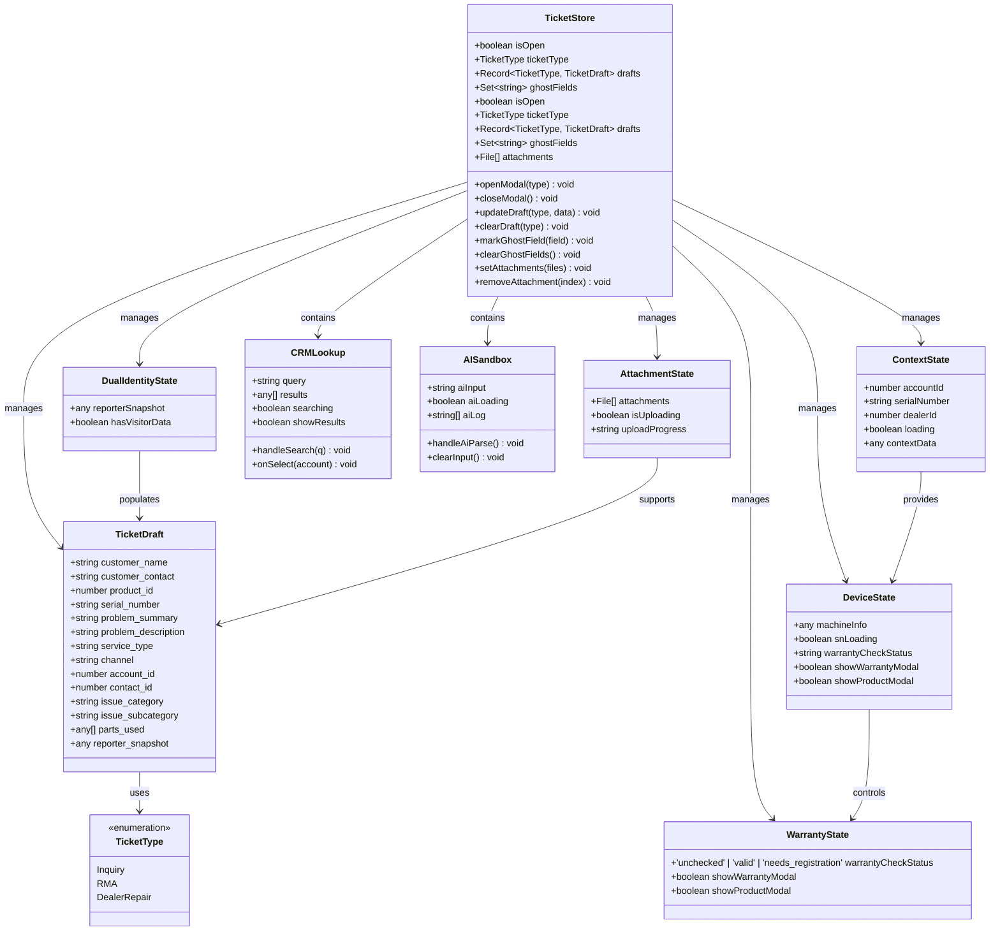

**图表来源**
- [useTicketStore.ts:4-68](file://client/src/store/useTicketStore.ts#L4-L68)
- [TicketCreationModal.tsx:17-196](file://client/src/components/Service/TicketCreationModal.tsx#L17-L196)
- [TicketCreationModal.tsx:203-242](file://client/src/components/Service/TicketCreationModal.tsx#L203-L242)

### 附件管理功能架构

**新增** 附件管理功能展现了完整的文件上传和管理架构：

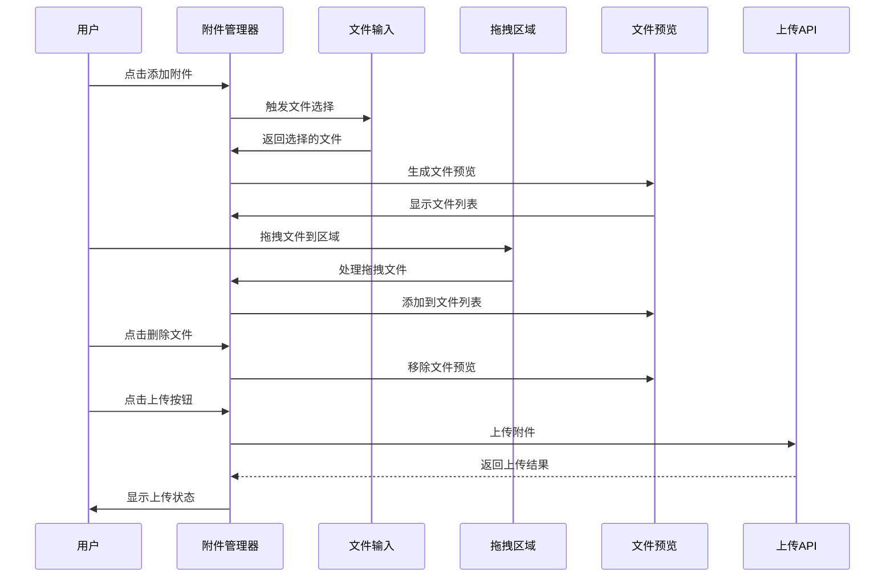

**更新** 附件管理系统包括：

- **拖拽上传支持**：支持拖拽文件到指定区域进行上传
- **文件预览功能**：自动为图片、视频生成预览缩略图
- **多文件管理**：支持同时管理多个文件的上传和删除
- **文件类型识别**：根据文件类型显示不同的图标和信息
- **上传状态跟踪**：实时显示文件上传进度和状态
- **删除功能**：支持删除不需要的附件文件
- **大小限制**：支持50MB文件大小限制
- **格式验证**：验证文件格式的合法性

**图表来源**
- [TicketCreationModal.tsx:940-967](file://client/src/components/Service/TicketCreationModal.tsx#L940-L967)
- [TicketCreationModal.tsx:559-584](file://client/src/components/Service/TicketCreationModal.tsx#L559-L584)

### 权限控制系统增强架构

**新增** 权限控制系统增强展现了MS Lead用户权限控制的完整架构：

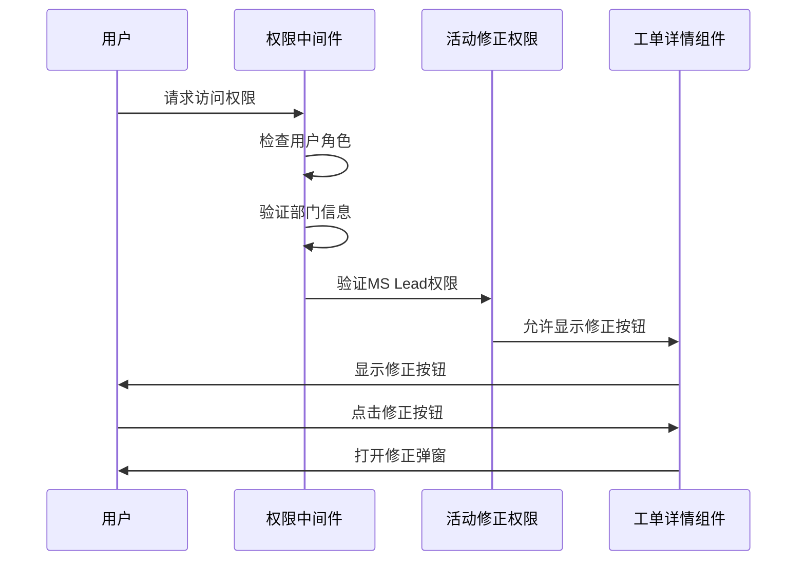

**更新** 权限控制系统增强包括：

- **MS Lead权限控制**：MS Lead用户可查看工单创建活动的修正按钮
- **部门归属验证**：验证用户所属部门与活动部门的匹配关系
- **原操作人权限**：原操作人始终可以更正自己的内容
- **Admin/Exec权限**：Admin和Exec用户拥有最高权限
- **活动类型权限**：不同活动类型有不同的权限要求
- **权限继承机制**：支持权限的继承和传递
- **实时权限验证**：在用户操作时实时验证权限状态

**图表来源**
- [TicketDetailComponents.tsx:1224-1235](file://client/src/components/Workspace/TicketDetailComponents.tsx#L1224-L1235)
- [ticket-activities.js:659-680](file://server/service/routes/ticket-activities.js#L659-L680)

### 设备状态实时可视化架构

**新增** 设备状态可视化功能展现了完整的实时状态监控架构：

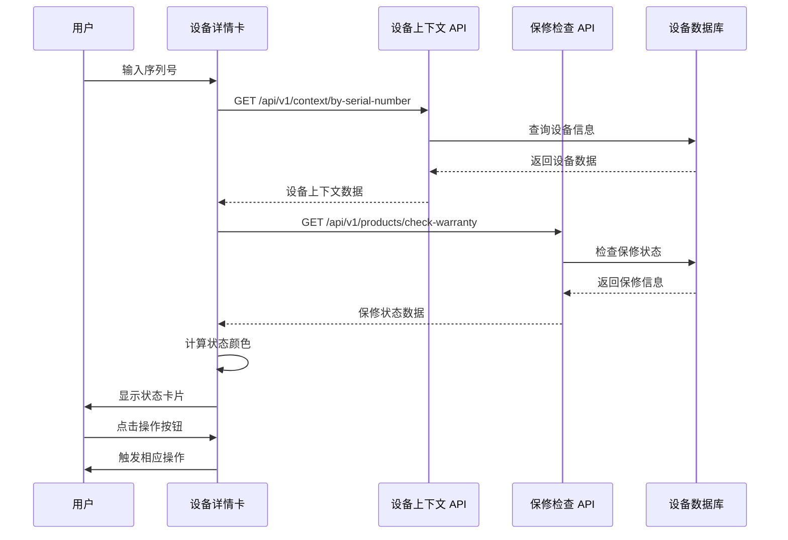

**更新** 设备状态可视化系统包括：

- **实时状态检查**：自动检查设备的注册状态和保修状态
- **颜色编码系统**：未入库(红色)、需注册(黄色)、过保(橙色)、有效(绿色)
- **状态指示器**：实时显示设备的当前状态和相关信息
- **操作按钮**：根据状态提供相应的操作选项
- **自动匹配**：根据设备状态自动匹配产品型号

**图表来源**
- [TicketCreationModal.tsx:820-918](file://client/src/components/Service/TicketCreationModal.tsx#L820-L918)
- [context.js:346-484](file://server/service/routes/context.js#L346-L484)
- [products.js:32-120](file://server/service/routes/products.js#L32-L120)

### 智能账户联系人解析架构

**新增** 智能账户联系人解析功能展现了完整的主联系人识别架构：

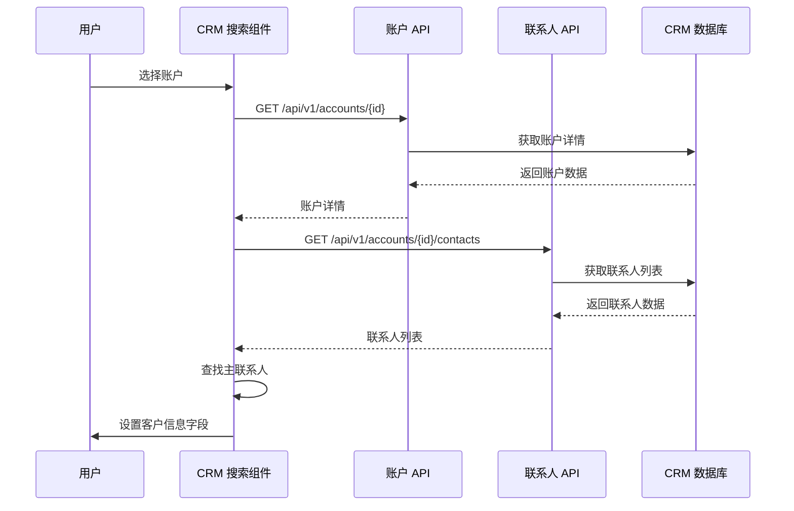

**更新** 智能账户解析系统包括：

- **主联系人识别**：自动识别账户的主联系人信息
- **联系人关联**：支持多联系人的智能匹配和选择
- **自动填充**：根据主联系人信息自动填充客户姓名和联系方式
- **权限控制**：基于用户角色的联系人访问权限控制
- **实时搜索**：支持联系人的实时搜索和过滤

**图表来源**
- [TicketCreationModal.tsx:697-734](file://client/src/components/Service/TicketCreationModal.tsx#L697-L734)
- [accounts.js:51-250](file://server/service/routes/accounts.js#L51-L250)
- [contacts.js:22-221](file://server/service/routes/contacts.js#L22-L221)

### 产品注册流程架构

**新增** 产品注册流程功能展现了完整的设备注册和保修注册架构：

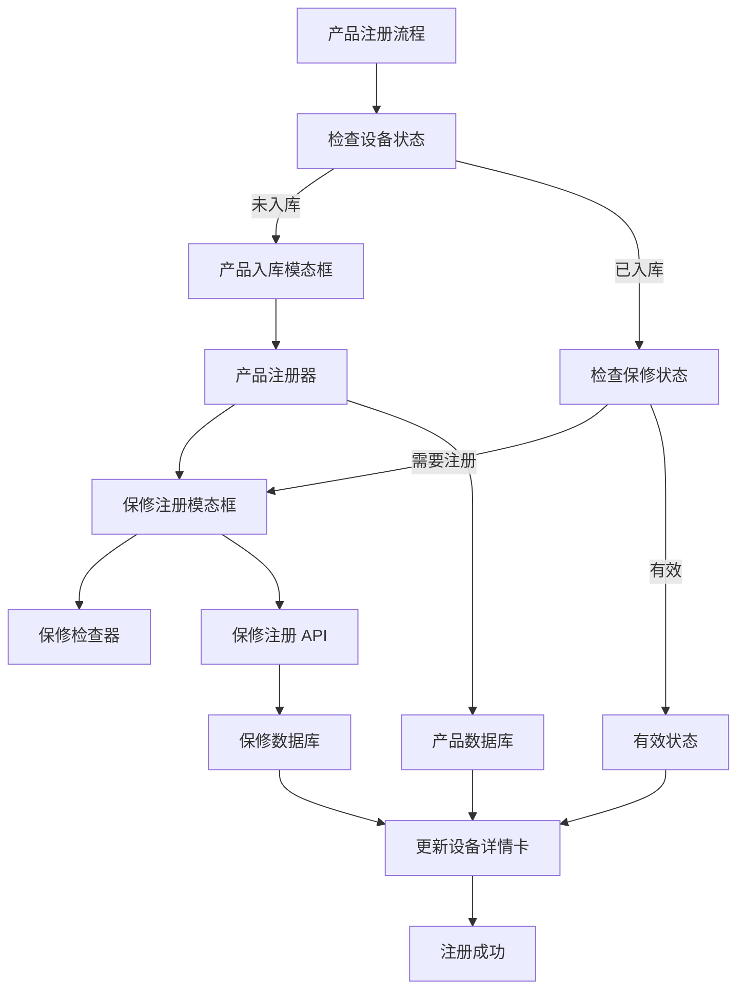

**更新** 产品注册流程包括：

- **设备状态检查**：自动检查设备的注册状态
- **产品入库**：支持未入库设备的快速产品信息录入
- **保修注册**：支持设备的保修信息注册和计算
- **状态更新**：自动更新设备的注册状态和保修状态
- **操作引导**：根据状态提供相应的操作指导

**图表来源**
- [TicketCreationModal.tsx:1048-1082](file://client/src/components/Service/TicketCreationModal.tsx#L1048-L1082)
- [ProductWarrantyRegistrationModal.tsx:324-443](file://client/src/components/Service/ProductWarrantyRegistrationModal.tsx#L324-L443)
- [ProductModal.tsx:465-488](file://client/src/components/Workspace/ProductModal.tsx#L465-L488)

### 机器详情卡功能架构

**新增** 机器详情卡功能展现了完整的设备信息展示架构：

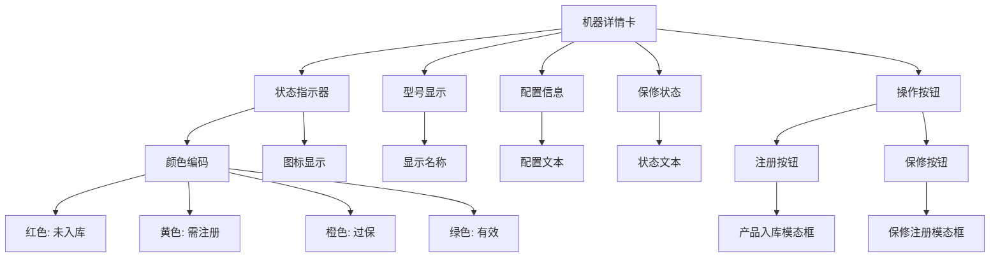

**更新** 机器详情卡功能包括：

- **状态指示器**：实时显示设备的注册状态和保修状态
- **型号显示**：显示设备的型号和配置信息
- **颜色编码**：使用不同的颜色表示设备的不同状态
- **操作按钮**：根据状态提供相应的操作选项
- **自动更新**：根据设备状态自动更新显示内容

**图表来源**
- [TicketCreationModal.tsx:820-918](file://client/src/components/Service/TicketCreationModal.tsx#L820-L918)

### 序列号验证增强机制

**新增** 序列号验证增强功能展现了完整的设备状态检查机制：

```mermaid
flowchart TD
SerialInput[序列号输入] --> Validation[长度验证]
Validation --> |≥5字符| SNValidator[序列号验证]
Validation --> |<5字符| ClearInfo[清空设备信息]
SNValidator --> ContextAPI[设备上下文 API]
SNValidator --> WarrantyAPI[保修检查 API]
ContextAPI --> DeviceInfo[设备信息]
WarrantyAPI --> WarrantyInfo[保修信息]
DeviceInfo --> ProductMatch[产品匹配]
WarrantyInfo --> StatusCheck[状态检查]
ProductMatch --> AutoFill[自动填充]
StatusCheck --> StatusCalc[状态计算]
StatusCalc --> ColorAssign[颜色分配]
DeviceInfo --> ShowCard[显示设备卡片]
WarrantyInfo --> ShowCard
ColorAssign --> ShowCard
function handleFieldChange(field, value, isAi) {
if (field === 'serial_number') {
updateDraft(initialType, { [field]: value });
if (value.length >= 5) {
setSnLoading(true);
// 异步验证序列号
const device = await validateSN(value);
if (device) {
setMachineInfo(device);
// 匹配产品型号
const matched = products.find(p =>
p.name.toLowerCase().includes(device.model_name.toLowerCase()) ||
device.model_name.toLowerCase().includes(p.name.toLowerCase())
);
if (matched) {
handleFieldChange('product_id', matched.id, true);
}
}
}
}
}
```

**更新** 序列号验证增强系统包括：

- **实时验证**：自动检测有效序列号并触发验证流程
- **设备信息获取**：通过序列号查询设备详细信息
- **保修状态检查**：自动检查设备的保修状态
- **产品自动匹配**：基于设备型号自动匹配产品目录
- **状态实时更新**：根据设备状态实时更新界面显示

**图表来源**
- [TicketCreationModal.tsx:257-293](file://client/src/components/Service/TicketCreationModal.tsx#L257-L293)
- [TicketCreationModal.tsx:295-328](file://client/src/components/Service/TicketCreationModal.tsx#L295-L328)

### CRM 集成架构

**新增** CRM 集成功能展现了完整的客户关系管理架构：

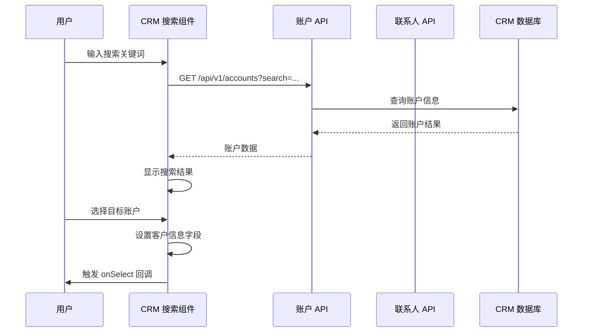

**更新** CRM 集成系统包括：

- **账户搜索**：支持按名称、邮箱、电话、公司编号等多维度搜索
- **联系人关联**：自动关联主联系人信息，支持多联系人管理
- **权限控制**：基于用户角色的访问权限控制
- **实时搜索**：300ms 防抖延迟，提升搜索性能
- **结果展示**：账户类型、地区、服务等级等信息的可视化展示

**图表来源**
- [TicketCreationModal.tsx:17-196](file://client/src/components/Service/TicketCreationModal.tsx#L17-L196)
- [accounts.js:51-250](file://server/service/routes/accounts.js#L51-L250)
- [contacts.js:22-221](file://server/service/routes/contacts.js#L22-L221)

### AI 沙盒功能架构

**新增** AI 沙盒功能提供了完整的多模态输入处理架构：

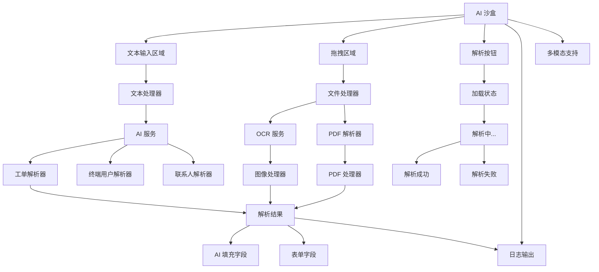

**更新** AI 沙盒功能包括：

- **多模态输入**：支持文本粘贴、图片拖拽、PDF文件上传
- **智能解析**：AI 自动提取客户信息、产品型号、问题描述等关键字段
- **实时反馈**：解析过程的实时日志输出和状态指示
- **字段高亮**：AI 填充的字段使用特殊样式标识
- **紧急工单标记**：自动检测紧急程度并添加标记

**图表来源**
- [TicketCreationModal.tsx:585-600](file://client/src/components/Service/TicketCreationModal.tsx#L585-L600)
- [TicketAiWizard.tsx:22-44](file://client/src/components/TicketAiWizard.tsx#L22-L44)

### 智能字段填充机制

**新增** 智能字段填充功能展现了先进的自动匹配算法：

```mermaid
flowchart TD
SerialInput[序列号输入] --> Validation[长度验证]
Validation --> |≥5字符| SNValidator[序列号验证]
Validation --> |<5字符| ClearInfo[清空设备信息]
SNValidator --> APICall[API 调用]
APICall --> DeviceInfo[设备信息]
DeviceInfo --> ProductMatch[产品匹配]
ProductMatch --> AutoFill[自动填充]
DeviceInfo --> ShowCard[显示设备卡片]
AutoFill --> GhostField[标记AI填充字段]
function handleFieldChange(field, value) {
if (field === 'serial_number') {
updateDraft(initialType, { [field]: value });
if (value.length >= 5) {
setSnLoading(true);
// 异步验证序列号
const device = await validateSN(value);
if (device) {
setMachineInfo(device);
// 匹配产品型号
const matched = products.find(p =>
p.name.toLowerCase().includes(device.model_name.toLowerCase()) ||
device.model_name.toLowerCase().includes(p.name.toLowerCase())
);
if (matched) {
handleFieldChange('product_id', matched.id, true);
}
}
}
}
}
```

**更新** 智能字段填充系统包括：

- **序列号验证**：自动检测有效序列号并触发验证流程
- **设备信息获取**：通过序列号查询设备详细信息
- **产品自动匹配**：基于设备型号自动匹配产品目录
- **字段高亮显示**：AI 填充的字段使用特殊样式标识
- **紧急程度标记**：自动检测并标记紧急工单

**图表来源**
- [TicketCreationModal.tsx:247-281](file://client/src/components/Service/TicketCreationModal.tsx#L247-L281)
- [TicketCreationModal.tsx:263-268](file://client/src/components/Service/TicketCreationModal.tsx#L263-L268)

### 多模态输入处理

**新增** 多模态输入处理功能支持多种数据源的智能解析：

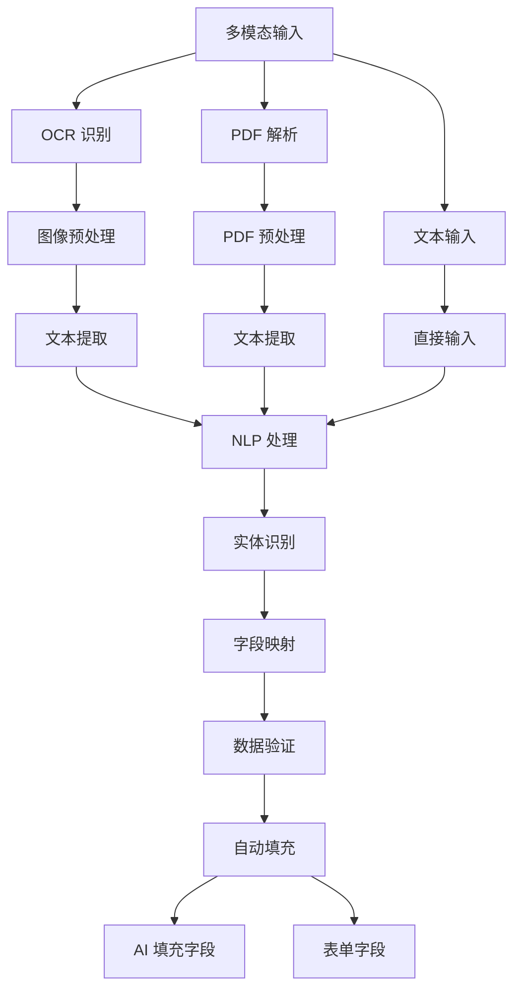

**更新** 多模态输入功能包括：

- **OCR 识别**：支持截图OCR识别，提取图像中的文本信息
- **PDF 解析**：支持PDF文件解析，提取文档内容
- **NLP 处理**：自然语言处理技术，智能提取关键信息
- **实体识别**：自动识别客户名称、联系方式、产品型号等实体
- **字段映射**：将提取的信息映射到对应的表单字段

**图表来源**
- [TicketCreationModal.tsx:515-521](file://client/src/components/Service/TicketCreationModal.tsx#L515-L521)
- [TicketCreationModal.tsx:585-600](file://client/src/components/Service/TicketCreationModal.tsx#L585-L600)

### 双重身份模型架构

**新增** 双重身份模型功能展现了完整的访客处理架构：

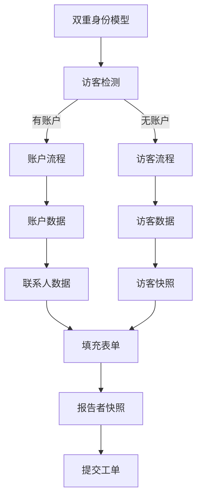

**更新** 双重身份模型包括：

- **访客检测**：自动检测匿名用户的工单创建需求
- **访客快照**：存储访客的姓名、联系方式等基本信息
- **报告者快照**：将访客信息转换为工单的 reporter_snapshot 字段
- **数据迁移**：支持访客数据迁移到正式账户
- **权限控制**：基于双重身份的访问权限管理

**图表来源**
- [TicketCreationModal.tsx:414-477](file://client/src/components/Service/TicketCreationModal.tsx#L414-L477)
- [Service_PRD_P2.md:490-705](file://docs/Service_PRD_P2.md#L490-L705)

### 上下文切换功能架构

**新增** 上下文切换功能展现了完整的多源数据查询架构：

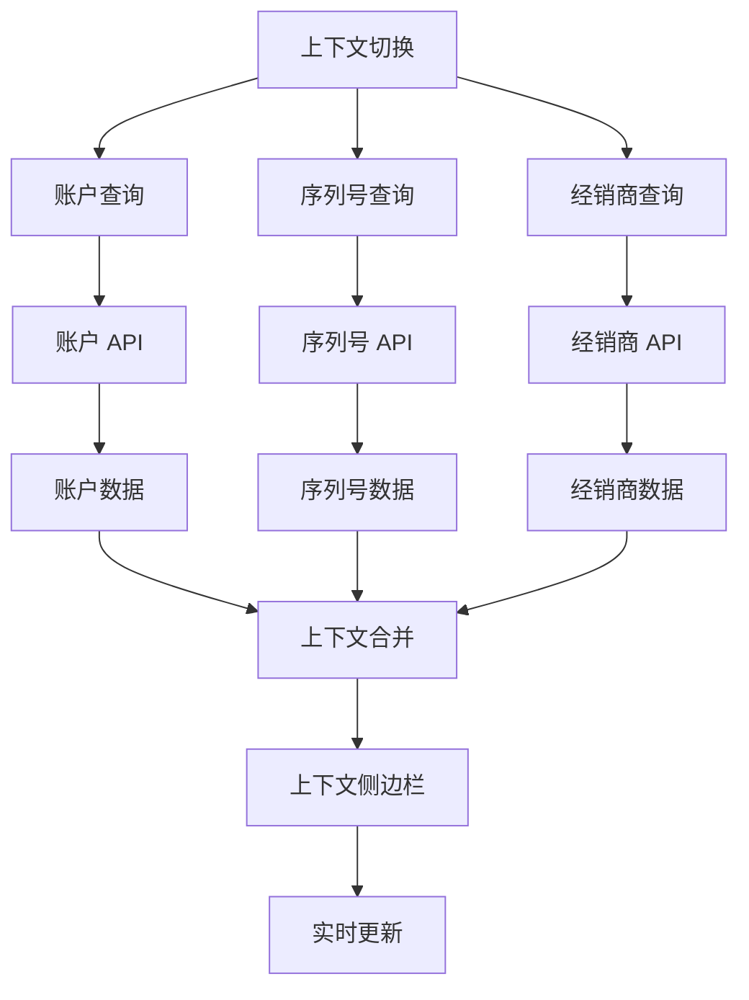

**更新** 上下文切换功能包括：

- **独立查询**：支持账户ID、序列号、经销商ID的独立查询
- **并发处理**：使用Promise.all实现多API的并发查询
- **数据合并**：将多源数据整合到统一的上下文视图
- **实时更新**：支持查询参数的实时变更和界面更新
- **权限控制**：基于用户权限的访问控制和数据脱敏

**图表来源**
- [CustomerContextSidebar.tsx:59-135](file://client/src/components/Service/CustomerContextSidebar.tsx#L59-L135)
- [permission.js:145-154](file://server/service/middleware/permission.js#L145-L154)

### 视觉设计系统

**新增** 组件实现了完整的视觉设计系统，包括设备状态可视化、附件管理和 CRM 集成的视觉元素：

```mermaid
flowchart TD
Theme[整体主题] --> DarkBackground[深色背景 #1c1c1e]
Theme --> GlassEffect[玻璃拟态效果]
GlassEffect --> Blur[背景模糊]
GlassEffect --> Border[透明边框]
Theme --> Animation[动画效果]
Animation --> ModalIn[模态框开合动画]
Animation --> Hover[悬停效果]
Theme --> Typography[排版系统]
Typography --> SectionTitle[区域标题]
Typography --> Label[标签样式]
Typography --> Input[输入框样式]
Theme --> ColorCoding[颜色编码]
ColorCoding --> InquiryBlue[咨询 - 蓝色主题]
ColorCoding --> RMAOrange[RMA - 橙色主题]
ColorCoding --> DealerGreen[经销商 - 绿色主题]
ColorCoding --> KineYellow[Kine Yellow - 金色主题]
ColorCoding --> GhostField[AI 填充 - 蓝色高亮]
ColorCoding --> SuccessGreen[成功状态 - 绿色高亮]
ColorCoding --> DeviceStatus[设备状态 - 多色编码]
ColorCoding --> AttachmentPreview[附件预览 - 金色边框]
DeviceStatus --> UnregisteredRed[未入库 - 红色]
DeviceStatus --> NeedsRegistrationYellow[需注册 - 黄色]
DeviceStatus --> ExpiredOrange[过保 - 橙色]
DeviceStatus --> ValidGreen[有效 - 绿色]
AttachmentPreview --> AttachmentIcon[附件图标]
AttachmentPreview --> AttachmentName[附件名称]
AttachmentPreview --> RemoveButton[删除按钮]
```

**更新** 视觉设计系统包括：

- **深色主题**：采用 #1c1c1e 的深色背景，减少视觉疲劳
- **玻璃拟态**：使用半透明效果和模糊滤镜，营造现代感
- **颜色编码**：每种工单类型都有独特的颜色标识
- **Kine Yellow 主题**：新增的金色渐变色彩（#FFD700）作为主要视觉元素
- **设备状态颜色**：未入库(红色)、需注册(黄色)、过保(橙色)、有效(绿色)
- **AI 填充高亮**：蓝色边框和阴影效果标识AI填充的字段
- **附件预览样式**：金色边框和阴影效果标识附件预览
- **统一排版**：一致的字体大小、行高和间距
- **动画效果**：0.2秒的开合动画，0.2秒的过渡效果

**图表来源**
- [TicketCreationModal.tsx:427-433](file://client/src/components/Service/TicketCreationModal.tsx#L427-L433)
- [TicketCreationModal.tsx:649-673](file://client/src/components/Service/TicketCreationModal.tsx#L649-L673)
- [TicketCreationModal.tsx:833-842](file://client/src/components/Service/TicketCreationModal.tsx#L833-L842)

### 文件上传处理

**新增** 改进的文件上传处理机制，支持多模态输入：

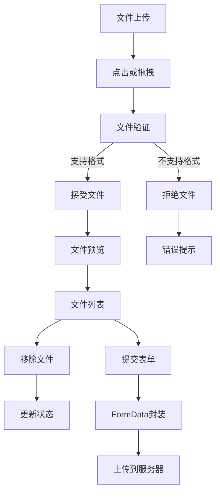

**更新** 文件上传功能增强：

- **多格式支持**：图片、视频、PDF文件
- **大小限制**：最大50MB文件限制
- **实时预览**：文件图标和大小显示
- **拖拽支持**：支持拖拽文件到上传区域
- **类型识别**：根据文件类型显示不同图标
- **多模态支持**：支持OCR和PDF解析功能
- **附件管理**：支持附件的添加、删除和预览

**图表来源**
- [TicketCreationModal.tsx:283-292](file://client/src/components/Service/TicketCreationModal.tsx#L283-L292)
- [TicketCreationModal.tsx:800-823](file://client/src/components/Service/TicketCreationModal.tsx#L800-L823)

### 草稿持久化机制

**新增** 组件实现了完整的草稿持久化机制，包括 AI 填充字段的状态管理、设备状态和附件状态：

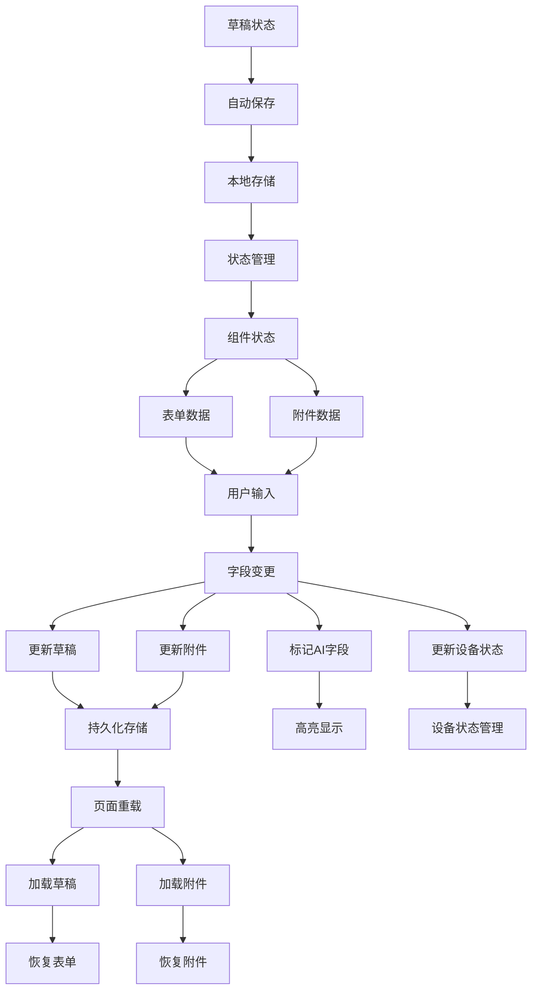

**更新** 草稿持久化系统包括：

- **实时保存**：用户输入时自动保存到本地存储
- **跨页面持久化**：页面刷新后仍能恢复草稿和附件
- **类型隔离**：不同工单类型的草稿独立存储
- **AI 字段状态**：记录AI填充的字段状态
- **设备状态持久化**：记录设备状态和保修状态
- **附件状态持久化**：记录附件的添加、删除和上传状态
- **状态指示**：底部显示"草稿已自动保存"状态
- **清理机制**：工单创建成功后自动清理草稿和附件

**图表来源**
- [TicketCreationModal.tsx:234-245](file://client/src/components/Service/TicketCreationModal.tsx#L234-L245)
- [useTicketStore.ts:40-68](file://client/src/store/useTicketStore.ts#L40-L68)

**章节来源**
- [TicketCreationModal.tsx:1-1096](file://client/src/components/Service/TicketCreationModal.tsx#L1-L1096)
- [TicketAiWizard.tsx:1-269](file://client/src/components/TicketAiWizard.tsx#L1-L269)
- [CustomerContextSidebar.tsx:59-135](file://client/src/components/Service/CustomerContextSidebar.tsx#L59-L135)
- [TicketDetailComponents.tsx:1224-1235](file://client/src/components/Workspace/TicketDetailComponents.tsx#L1224-L1235)
- [useTicketStore.ts:1-68](file://client/src/store/useTicketStore.ts#L1-L68)

## 附件管理功能

**新增** 附件管理功能是本次更新的重要创新，为工单创建提供了完整的文件上传和管理能力：

### 功能概述

附件管理功能支持多种文件格式的上传、预览和管理，为工单创建提供了更丰富的多媒体支持：

- **拖拽上传支持**：支持拖拽文件到指定区域进行上传
- **文件预览功能**：自动为图片、视频生成预览缩略图
- **多文件管理**：支持同时管理多个文件的上传和删除
- **文件类型识别**：根据文件类型显示不同的图标和信息
- **上传状态跟踪**：实时显示文件上传进度和状态
- **删除功能**：支持删除不需要的附件文件
- **大小限制**：支持50MB文件大小限制
- **格式验证**：验证文件格式的合法性

### 技术架构

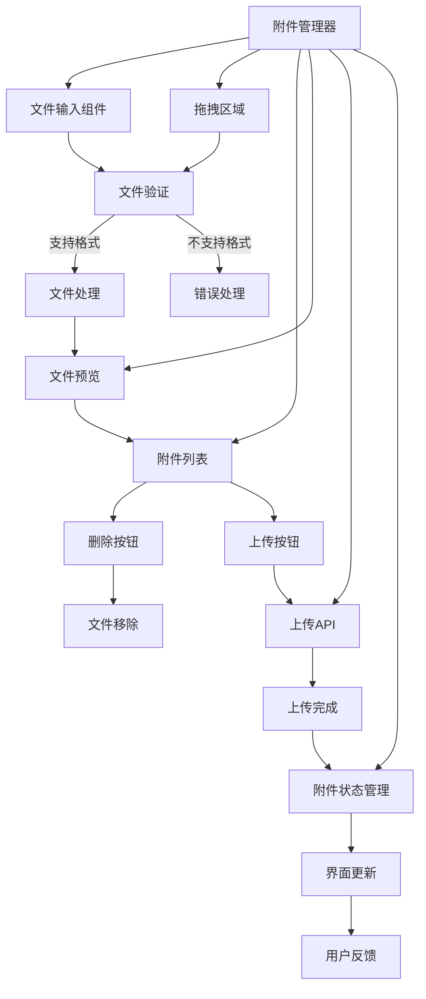

### 文件上传处理流程

**新增** 文件上传处理流程展现了完整的文件处理机制：

```mermaid
sequenceDiagram
participant User as 用户
participant AttachmentManager as 附件管理器
participant FileInput as 文件输入
participant DragDrop as 拖拽区域
participant FileValidation as 文件验证
participant Preview as 文件预览
participant UploadAPI as 上传API
User->>AttachmentManager : 点击添加附件
AttachmentManager->>FileInput : 触发文件选择
FileInput->>AttachmentManager : 返回选择的文件
AttachmentManager->>FileValidation : 验证文件格式和大小
FileValidation->>Preview : 生成文件预览
Preview->>AttachmentManager : 显示文件列表
User->>DragDrop : 拖拽文件到区域
DragDrop->>FileValidation : 处理拖拽文件
FileValidation->>Preview : 添加到文件列表
User->>AttachmentManager : 点击删除文件
AttachmentManager->>Preview : 移除文件预览
User->>AttachmentManager : 点击上传按钮
AttachmentManager->>UploadAPI : 上传附件
UploadAPI-->>AttachmentManager : 返回上传结果
AttachmentManager->>User : 显示上传状态
```

### 文件类型支持

**新增** 附件管理功能支持的文件类型：

- **图片格式**：JPG、PNG、BMP、TIFF、HEIC、HEIF等
- **视频格式**：MP4、AVI、MOV、WMV等
- **文档格式**：PDF、DOC、DOCX、TXT等
- **压缩格式**：ZIP、RAR、7Z等
- **其他格式**：支持常见的办公和媒体文件格式

### 文件预览机制

**新增** 文件预览机制展现了完整的预览处理架构：

- **图片预览**：自动生成缩略图，支持点击放大查看
- **视频预览**：显示视频缩略图和时长信息
- **文档预览**：显示文档图标和文件名
- **文件大小显示**：显示文件的大小信息
- **删除按钮**：每个附件都有独立的删除按钮
- **错误处理**：支持预览失败的错误处理

### 上传状态管理

**新增** 上传状态管理展现了完整的状态跟踪机制：

- **上传进度**：实时显示文件上传进度
- **上传状态**：显示文件的上传状态（待上传、上传中、上传成功、上传失败）
- **错误信息**：显示上传过程中的错误信息
- **重试机制**：支持上传失败时的重试操作
- **完成回调**：上传完成后执行相应的回调函数

### 错误处理机制

附件管理功能具备完善的错误处理能力：

- **格式不支持**：显示错误提示并建议正确的文件格式
- **大小超出限制**：显示大小限制并提供压缩建议
- **上传失败**：提供详细的错误信息和重试选项
- **网络异常**：提供离线处理和重试机制
- **预览失败**：提供预览失败的降级方案

**章节来源**
- [TicketCreationModal.tsx:940-967](file://client/src/components/Service/TicketCreationModal.tsx#L940-L967)
- [TicketCreationModal.tsx:559-584](file://client/src/components/Service/TicketCreationModal.tsx#L559-L584)

## 权限控制系统增强

**新增** 权限控制系统增强功能是本次更新的重要组成部分，显著提升了工单管理的权限控制能力：

### 功能概述

权限控制系统增强支持MS Lead用户在工单创建活动中查看修正按钮，提升了市场部门的工单管理能力：

- **MS Lead权限控制**：MS Lead用户可查看工单创建活动的修正按钮
- **部门归属验证**：验证用户所属部门与活动部门的匹配关系
- **原操作人权限**：原操作人始终可以更正自己的内容
- **Admin/Exec权限**：Admin和Exec用户拥有最高权限
- **活动类型权限**：不同活动类型有不同的权限要求
- **权限继承机制**：支持权限的继承和传递
- **实时权限验证**：在用户操作时实时验证权限状态

### 权限控制架构

```mermaid
flowchart TD
PermissionControl[权限控制系统] --> UserAuth[用户认证]
PermissionControl --> RoleCheck[角色检查]
PermissionControl --> DepartmentCheck[部门检查]
PermissionControl --> ActivityTypeCheck[活动类型检查]
UserAuth --> RoleCheck
RoleCheck --> DepartmentCheck
DepartmentCheck --> ActivityTypeCheck
ActivityTypeCheck --> PermissionDecision[权限决策]
PermissionDecision --> AllowAccess[允许访问]
PermissionDecision --> DenyAccess[拒绝访问]
AllowAccess --> CorrectionButton[显示修正按钮]
DenyAccess --> HideButton[隐藏按钮]
```

### MS Lead权限控制机制

**新增** MS Lead权限控制机制展现了完整的权限验证架构：

```mermaid
sequenceDiagram
participant User as 用户
participant PermissionMiddleware as 权限中间件
participant ActivityCorrection as 活动修正权限
participant TicketDetailComponents as 工单详情组件
User->>PermissionMiddleware : 请求访问权限
PermissionMiddleware->>PermissionMiddleware : 检查用户角色
PermissionMiddleware->>PermissionMiddleware : 验证部门信息
PermissionMiddleware->>ActivityCorrection : 验证MS Lead权限
ActivityCorrection->>ActivityCorrection : 检查活动类型
ActivityCorrection->>ActivityCorrection : 验证部门匹配
ActivityCorrection->>TicketDetailComponents : 允许显示修正按钮
TicketDetailComponents->>User : 显示修正按钮
User->>TicketDetailComponents : 点击修正按钮
TicketDetailComponents->>User : 打开修正弹窗
```

### 权限验证流程

**新增** 权限验证流程展现了完整的权限检查机制：

```mermaid
flowchart TD
PermissionCheck[权限验证] --> UserRole[用户角色检查]
UserRole --> |Admin/Exec| FullAccess[完全访问权限]
UserRole --> |Lead| DepartmentCheck[部门检查]
UserRole --> |普通用户| LimitedAccess[有限访问权限]
DepartmentCheck --> |MS Lead| MSAccess[MS部门访问权限]
DepartmentCheck --> |其他Lead| DeptAccess[部门访问权限]
DepartmentCheck --> |无Lead| NoAccess[无访问权限]
MSAccess --> ActivityType[活动类型检查]
DeptAccess --> ActivityType
ActivityType --> |创建工单活动| CorrectionButton[显示修正按钮]
ActivityType --> |其他活动类型| NoButton[不显示按钮]
LimitedAccess --> NoButton
FullAccess --> CorrectionButton
NoAccess --> NoButton
```

### 活动类型权限控制

**新增** 活动类型权限控制展现了不同活动类型的权限要求：

- **创建工单活动**：MS Lead可查看修正按钮
- **维修记录活动**：OP部门Lead可查看修正按钮
- **诊断报告活动**：OP部门Lead可查看修正按钮
- **评论活动**：原操作人可查看修正按钮
- **内部备注活动**：原操作人可查看修正按钮
- **发货信息活动**：原操作人可查看修正按钮

### 权限继承和传递机制

**新增** 权限继承和传递机制展现了权限的传递和继承：

- **部门权限继承**：Lead继承部门的权限
- **活动权限传递**：原操作人继承修改权限
- **Admin/Exec权限传递**：Admin和Exec拥有全局权限
- **MS Lead权限传递**：MS Lead拥有市场部门的特殊权限
- **权限验证链**：多层权限验证确保安全性

### 错误处理机制

权限控制系统具备完善的错误处理能力：

- **权限不足**：显示权限不足的错误信息
- **用户未认证**：重定向到登录页面
- **活动不存在**：显示活动不存在的错误信息
- **权限验证失败**：提供详细的权限错误信息
- **权限继承失败**：提供权限继承失败的降级方案

**章节来源**
- [TicketDetailComponents.tsx:1224-1235](file://client/src/components/Workspace/TicketDetailComponents.tsx#L1224-L1235)
- [ticket-activities.js:659-680](file://server/service/routes/ticket-activities.js#L659-L680)

## 设备状态实时可视化

**新增** 设备状态实时可视化功能是本次更新的重要创新，为工单创建提供了直观的设备状态展示：

### 功能概述

设备状态可视化能够实时显示设备的注册状态、保修状态和在保状态，通过颜色编码和状态指示器为用户提供直观的设备信息展示：

- **实时状态检查**：自动检查设备的注册状态和保修状态
- **颜色编码系统**：未入库(红色)、需注册(黄色)、过保(橙色)、有效(绿色)
- **状态指示器**：实时显示设备的当前状态和相关信息
- **操作按钮**：根据状态提供相应的操作选项
- **自动匹配**：根据设备状态自动匹配产品型号

### 技术架构

```mermaid
flowchart TD
DeviceCard[设备详情卡] --> StatusIndicator[状态指示器]
DeviceCard --> ModelName[型号显示]
DeviceCard --> ConfigInfo[配置信息]
DeviceCard --> WarrantyStatus[保修状态]
DeviceCard --> ActionButtons[操作按钮]
StatusIndicator --> ColorCode[颜色编码]
StatusIndicator --> IconDisplay[图标显示]
ModelName --> DisplayName[显示名称]
ConfigInfo --> ConfigText[配置文本]
WarrantyStatus --> StatusText[状态文本]
ActionButtons --> RegisterButton[注册按钮]
ActionButtons --> WarrantyButton[保修按钮]
ColorCode --> Red[红色: 未入库]
ColorCode --> Yellow[黄色: 需注册]
ColorCode --> Orange[橙色: 过保]
ColorCode --> Green[绿色: 有效]
RegisterButton --> ProductModal[产品入库模态框]
WarrantyButton --> WarrantyModal[保修注册模态框]
```

### 状态计算逻辑

**新增** 设备状态的计算逻辑展现了完整的状态判断机制：

```mermaid
flowchart TD
StatusCalc[状态计算] --> IsUnregistered{是否未入库}
IsUnregistered --> |是| Unregistered[未入库状态]
IsUnregistered --> |否| CheckWarranty{检查保修状态}
CheckWarranty --> |需要注册| NeedsRegistration[需注册状态]
CheckWarranty --> |有效| CheckExpiration{检查是否过期}
CheckExpiration --> |已过期| Expired[过保状态]
CheckExpiration --> |未过期| Valid[有效状态]
Unregistered --> Red[红色: #E60000]
NeedsRegistration --> Yellow[黄色: #FFD700]
Expired --> Orange[橙色: #F97316]
Valid --> Green[绿色: #10B981]
```

### 状态显示组件

**新增** 设备状态显示组件展现了完整的状态展示架构：

```mermaid
sequenceDiagram
participant User as 用户
participant DeviceCard as 设备详情卡
participant ContextAPI as 设备上下文 API
participant WarrantyAPI as 保修检查 API
User->>DeviceCard : 输入序列号
DeviceCard->>ContextAPI : 查询设备信息
ContextAPI-->>DeviceCard : 返回设备数据
DeviceCard->>WarrantyAPI : 检查保修状态
WarrantyAPI-->>DeviceCard : 返回保修信息
DeviceCard->>DeviceCard : 计算状态颜色
DeviceCard->>User : 显示状态卡片
User->>DeviceCard : 点击操作按钮
DeviceCard->>User : 执行相应操作
```

### 错误处理机制

设备状态可视化具备完善的错误处理能力：

- **网络异常处理**：提供重试机制和错误提示
- **设备未找到处理**：显示详细的错误信息和解决方案
- **权限不足处理**：优雅降级并提示用户权限问题
- **状态计算失败处理**：保持默认状态并提示用户重新输入
- **数据验证**：确保设备状态的完整性和准确性

**章节来源**
- [TicketCreationModal.tsx:820-918](file://client/src/components/Service/TicketCreationModal.tsx#L820-L918)
- [context.js:346-484](file://server/service/routes/context.js#L346-L484)
- [products.js:32-120](file://server/service/routes/products.js#L32-L120)

## 智能账户联系人解析

**新增** 智能账户联系人解析功能是本次更新的重要特性，显著提升了 CRM 集成的智能化水平：

### 功能概述

智能账户解析能够自动识别和关联主联系人信息，支持多联系人的智能匹配和选择：

- **主联系人识别**：自动识别账户的主联系人信息
- **联系人关联**：支持多联系人的智能匹配和选择
- **自动填充**：根据主联系人信息自动填充客户姓名和联系方式
- **权限控制**：基于用户角色的联系人访问权限控制
- **实时搜索**：支持联系人的实时搜索和过滤

### 技术实现

```mermaid
sequenceDiagram
participant User as 用户
participant CRMLookup as CRM 搜索组件
participant AccountsAPI as 账户 API
participant ContactsAPI as 联系人 API
participant DB as CRM 数据库
User->>CRMLookup : 选择账户
CRMLookup->>AccountsAPI : 获取账户详情
AccountsAPI->>DB : 查询账户信息
DB-->>AccountsAPI : 返回账户数据
AccountsAPI-->>CRMLookup : 账户详情
CRMLookup->>ContactsAPI : 获取联系人列表
ContactsAPI->>DB : 查询联系人信息
DB-->>ContactsAPI : 返回联系人数据
ContactsAPI-->>CRMLookup : 联系人列表
CRMLookup->>CRMLookup : 查找主联系人
CRMLookup->>User : 设置客户信息字段
```

### 主联系人识别算法

**新增** 主联系人识别算法展现了智能的联系人匹配机制：

```mermaid
flowchart TD
ContactSelection[联系人选择] --> PrimaryCheck{检查 PRIMARY 状态}
PrimaryCheck --> |找到| PrimaryContact[主联系人]
PrimaryCheck --> |未找到| ActiveCheck{检查 ACTIVE 状态}
ActiveCheck --> |找到| ActiveContact[活跃联系人]
ActiveCheck --> |未找到| FirstContact[第一个联系人]
PrimaryContact --> AutoFill[自动填充]
ActiveContact --> AutoFill
FirstContact --> AutoFill
AutoFill --> CustomerName[客户姓名]
AutoFill --> CustomerContact[客户联系方式]
```

### 权限控制机制

**新增** 智能账户解析具备完善的权限控制能力：

- **全局访问**：管理员和高级用户可访问所有账户和联系人
- **部门访问**：普通用户只能访问自己部门相关的账户和联系人
- **经销商访问**：经销商用户只能访问自己管理的账户和联系人
- **数据脱敏**：敏感信息在权限范围内进行脱敏处理
- **联系人权限**：基于用户角色的联系人访问权限控制

### 错误处理机制

智能账户解析具备完善的错误处理能力：

- **网络异常处理**：提供重试机制和错误提示
- **账户搜索失败处理**：显示详细的错误信息和解决方案
- **权限不足处理**：优雅降级并提示用户权限问题
- **联系人数据验证**：确保联系人信息的完整性和准确性
- **主联系人缺失处理**：提供备用联系人选择方案

**章节来源**
- [TicketCreationModal.tsx:697-734](file://client/src/components/Service/TicketCreationModal.tsx#L697-L734)
- [accounts.js:51-250](file://server/service/routes/accounts.js#L51-L250)
- [contacts.js:22-221](file://server/service/routes/contacts.js#L22-L221)

## 产品注册流程

**新增** 产品注册流程功能是本次更新的重要组成部分，为未入库设备提供了完整的注册解决方案：

### 功能概述

产品注册流程能够处理未入库设备的快速注册和保修信息的自动计算：

- **设备状态检查**：自动检查设备的注册状态
- **产品入库**：支持未入库设备的快速产品信息录入
- **保修注册**：支持设备的保修信息注册和计算
- **状态更新**：自动更新设备的注册状态和保修状态
- **操作引导**：根据状态提供相应的操作指导

### 技术架构

```mermaid
flowchart TD
ProductRegistration[产品注册流程] --> UnregisteredCheck[检查设备状态]
UnregisteredCheck --> |未入库| ProductModal[产品入库模态框]
UnregisteredCheck --> |已入库| WarrantyCheck[检查保修状态]
ProductModal --> ProductRegistrar[产品注册器]
ProductRegistrar --> WarrantyModal[保修注册模态框]
WarrantyModal --> WarrantyChecker[保修检查器]
WarrantyCheck --> |需要注册| WarrantyModal
WarrantyCheck --> |有效| Valid[有效状态]
WarrantyModal --> WarrantyAPI[保修注册 API]
WarrantyAPI --> WarrantyDB[保修数据库]
ProductRegistrar --> ProductDB[产品数据库]
ProductDB --> DeviceCard[更新设备详情卡]
WarrantyDB --> DeviceCard
Valid --> DeviceCard
DeviceCard --> Success[注册成功]
```

### 产品入库流程

**新增** 产品入库流程展现了完整的设备注册机制：

```mermaid
sequenceDiagram
participant User as 用户
participant ProductModal as 产品入库模态框
participant ProductRegistrar as 产品注册器
participant ProductAPI as 产品注册 API
participant ProductDB as 产品数据库
User->>ProductModal : 点击立即入库
ProductModal->>ProductRegistrar : 打开产品注册界面
ProductRegistrar->>ProductAPI : 提交产品注册请求
ProductAPI->>ProductDB : 插入产品信息
ProductDB-->>ProductAPI : 返回注册结果
ProductAPI-->>ProductRegistrar : 注册成功
ProductRegistrar->>User : 显示注册成功
ProductRegistrar->>DeviceCard : 更新设备状态
```

### 保修注册流程

**新增** 保修注册流程展现了完整的保修信息注册机制：

```mermaid
sequenceDiagram
participant User as 用户
participant WarrantyModal as 保修注册模态框
participant WarrantyAPI as 保修注册 API
participant WarrantyDB as 保修数据库
User->>WarrantyModal : 点击注册保修
WarrantyModal->>WarrantyAPI : 提交保修注册请求
WarrantyAPI->>WarrantyDB : 插入保修信息
WarrantyDB-->>WarrantyAPI : 返回注册结果
WarrantyAPI-->>WarrantyModal : 注册成功
WarrantyModal->>User : 显示注册成功
WarrantyModal->>DeviceCard : 更新设备状态
```

### 错误处理机制

产品注册流程具备完善的错误处理能力：

- **网络异常处理**：提供重试机制和错误提示
- **产品注册失败处理**：显示详细的错误信息和解决方案
- **权限不足处理**：优雅降级并提示用户权限问题
- **数据验证**：确保注册信息的完整性和准确性
- **状态回滚**：注册失败时自动回滚状态变化

**章节来源**
- [TicketCreationModal.tsx:1048-1082](file://client/src/components/Service/TicketCreationModal.tsx#L1048-L1082)
- [ProductWarrantyRegistrationModal.tsx:324-443](file://client/src/components/Service/ProductWarrantyRegistrationModal.tsx#L324-L443)
- [ProductModal.tsx:465-488](file://client/src/components/Workspace/ProductModal.tsx#L465-L488)

## 机器详情卡功能

**新增** 机器详情卡功能是本次更新的重要创新，为工单创建提供了直观的设备信息展示：

### 功能概述

机器详情卡能够实时显示设备的型号、配置、保修状态等关键信息，并提供相应的操作按钮：

- **状态指示器**：实时显示设备的注册状态和保修状态
- **型号显示**：显示设备的型号和配置信息
- **颜色编码**：使用不同的颜色表示设备的不同状态
- **操作按钮**：根据状态提供相应的操作选项
- **自动更新**：根据设备状态自动更新显示内容

### 技术实现

```mermaid
flowchart TD
DeviceCard[机器详情卡] --> StatusIndicator[状态指示器]
DeviceCard --> ModelName[型号显示]
DeviceCard --> ConfigInfo[配置信息]
DeviceCard --> WarrantyStatus[保修状态]
DeviceCard --> ActionButtons[操作按钮]
StatusIndicator --> ColorCode[颜色编码]
StatusIndicator --> IconDisplay[图标显示]
ModelName --> DisplayName[显示名称]
ConfigInfo --> ConfigText[配置文本]
WarrantyStatus --> StatusText[状态文本]
ActionButtons --> RegisterButton[注册按钮]
ActionButtons --> WarrantyButton[保修按钮]
ColorCode --> Red[红色: 未入库]
ColorCode --> Yellow[黄色: 需注册]
ColorCode --> Orange[橙色: 过保]
ColorCode --> Green[绿色: 有效]
RegisterButton --> ProductModal[产品入库模态框]
WarrantyButton --> WarrantyModal[保修注册模态框]
```

### 状态颜色系统

**新增** 状态颜色系统展现了完整的状态可视化机制：

- **未入库状态**：红色(#E60000)，表示设备尚未录入产品台账
- **需注册状态**：黄色(#FFD700)，表示设备已入库但未注册保修信息
- **过保状态**：橙色(#F97316)，表示设备已过保修期
- **有效状态**：绿色(#10B981)，表示设备在保修期内

### 操作按钮功能

**新增** 操作按钮功能展现了完整的用户交互机制：

- **立即入库按钮**：用于未入库设备的产品信息录入
- **注册保修按钮**：用于已入库设备的保修信息注册
- **状态更新**：点击按钮后自动更新设备状态和显示内容
- **模态框打开**：根据按钮类型打开相应的操作模态框

### 错误处理机制

机器详情卡具备完善的错误处理能力：

- **设备信息获取失败**：显示错误提示并保持默认状态
- **状态计算异常**：使用默认状态并提示用户重新输入
- **网络连接问题**：提供重试机制和错误提示
- **权限不足处理**：优雅降级并提示用户权限问题

**章节来源**
- [TicketCreationModal.tsx:820-918](file://client/src/components/Service/TicketCreationModal.tsx#L820-L918)

## 序列号验证增强

**新增** 序列号验证增强功能是本次更新的重要特性，显著提升了设备状态检查的效率和准确性：

### 功能概述

序列号验证增强能够自动检测和验证设备序列号，提供完整的设备状态检查和产品匹配功能：

- **实时验证**：自动检测有效序列号并触发验证流程
- **设备信息获取**：通过序列号查询设备详细信息
- **保修状态检查**：自动检查设备的保修状态
- **产品自动匹配**：基于设备型号自动匹配产品目录
- **状态实时更新**：根据设备状态实时更新界面显示

### 技术实现

```mermaid
flowchart TD
SerialInput[序列号输入] --> LengthCheck[长度检查]
LengthCheck --> |≥5字符| ValidateSN[验证序列号]
LengthCheck --> |<5字符| ClearInfo[清空设备信息]
ValidateSN --> ContextAPI[设备上下文 API]
ValidateSN --> WarrantyAPI[保修检查 API]
ContextAPI --> DeviceInfo[设备信息]
WarrantyAPI --> WarrantyInfo[保修信息]
DeviceInfo --> ProductMatch[产品匹配]
WarrantyInfo --> StatusCheck[状态检查]
ProductMatch --> AutoFill[自动填充]
StatusCheck --> StatusCalc[状态计算]
StatusCalc --> ColorAssign[颜色分配]
DeviceInfo --> ShowCard[显示设备卡片]
WarrantyInfo --> ShowCard
ColorAssign --> ShowCard
function handleFieldChange(field, value, isAi) {
if (field === 'serial_number') {
updateDraft(initialType, { [field]: value });
if (value.length >= 5) {
setSnLoading(true);
// 异步验证序列号
const device = await validateSN(value);
if (device) {
setMachineInfo(device);
// 匹配产品型号
const matched = products.find(p =>
p.name.toLowerCase().includes(device.model_name.toLowerCase()) ||
device.model_name.toLowerCase().includes(p.name.toLowerCase())
);
if (matched) {
handleFieldChange('product_id', matched.id, true);
}
}
}
}
} else {
// 普通字段变更
updateDraft(initialType, { [field]: value });
if (isAi) {
setGhostFields(prev => new Set(prev).add(field));
} else {
setGhostFields(prev => {
const next = new Set(prev);
next.delete(field);
return next;
});
}
}
}
```

### 防抖机制

**新增** 防抖机制展现了高效的序列号验证策略：

- **1秒延迟**：防止频繁的API调用
- **异步处理**：使用异步方式处理序列号验证
- **状态管理**：实时显示加载状态和验证进度
- **错误处理**：处理序列号验证失败的情况

### 状态计算逻辑

**新增** 状态计算逻辑展现了完整的设备状态判断机制：

```mermaid
flowchart TD
StatusCalc[状态计算] --> IsUnregistered{是否未入库}
IsUnregistered --> |是| Unregistered[未入库状态]
IsUnregistered --> |否| CheckWarranty{检查保修状态}
CheckWarranty --> |需要注册| NeedsRegistration[需注册状态]
CheckWarranty --> |有效| CheckExpiration{检查是否过期}
CheckExpiration --> |已过期| Expired[过保状态]
CheckExpiration --> |未过期| Valid[有效状态]
Unregistered --> Red[红色: #E60000]
NeedsRegistration --> Yellow[黄色: #FFD700]
Expired --> Orange[橙色: #F97316]
Valid --> Green[绿色: #10B981]
```

### 错误处理机制

序列号验证增强具备完善的错误处理能力：

- **无效序列号处理**：显示错误提示并清空设备信息
- **网络异常处理**：提供重试机制和降级方案
- **匹配失败处理**：保持用户输入但不自动填充产品信息
- **加载状态管理**：显示加载指示器提升用户体验
- **状态清理**：序列号长度不足时自动清理设备状态

**章节来源**
- [TicketCreationModal.tsx:257-293](file://client/src/components/Service/TicketCreationModal.tsx#L257-L293)
- [TicketCreationModal.tsx:295-328](file://client/src/components/Service/TicketCreationModal.tsx#L295-L328)

## CRM 集成功能

**新增** CRM 集成功能是本次更新的重要组成部分，为工单创建提供了完整的客户关系管理能力：

### 功能概述

CRM 集成允许用户通过智能搜索快速关联客户信息，支持账户和联系人的双向关联：

- **账户搜索**：支持按名称、邮箱、电话、公司编号等多维度搜索
- **联系人关联**：自动关联主联系人信息，支持多联系人管理
- **权限控制**：基于用户角色的访问权限控制
- **实时搜索**：300ms 防抖延迟，提升搜索性能
- **结果展示**：账户类型、地区、服务等级等信息的可视化展示

### 技术架构

```mermaid
flowchart TD
CRMLookup[CRM 搜索组件] --> SearchInput[搜索输入框]
CRMLookup --> SearchResult[搜索结果列表]
CRMLookup --> SelectedAccount[选中账户显示]
CRMLookup --> AccountAPI[账户 API]
CRMLookup --> ContactAPI[联系人 API]
CRMLookup --> PermissionFilter[权限过滤器]
SearchInput --> Debounce[防抖处理]
Debounce --> APICall[API 调用]
APICall --> AccountAPI
APICall --> ContactAPI
AccountAPI --> AccountData[账户数据]
ContactAPI --> ContactData[联系人数据]
AccountData --> SearchResult
ContactData --> SearchResult
SelectedAccount --> FormFields[表单字段填充]
SelectedAccount --> GhostField[AI 填充标记]
```

### 数据处理流程

```mermaid
sequenceDiagram
participant User as 用户
participant CRMLookup as CRM 搜索组件
participant AccountsAPI as 账户 API
participant ContactsAPI as 联系人 API
participant DB as CRM 数据库
User->>CRMLookup : 输入搜索关键词
CRMLookup->>CRMLookup : 防抖处理 (300ms)
CRMLookup->>AccountsAPI : GET /api/v1/accounts?search=...
AccountsAPI->>DB : 查询账户信息
DB-->>AccountsAPI : 返回账户结果
AccountsAPI-->>CRMLookup : 账户数据
CRMLookup->>CRMLookup : 显示搜索结果
User->>CRMLookup : 选择目标账户
CRMLookup->>CRMLookup : 设置客户信息字段
CRMLookup->>User : 触发 onSelect 回调
User->>CRMLookup : 点击清除按钮
CRMLookup->>CRMLookup : 清空选择状态
```

### 权限控制机制

**新增** CRM 集成具备完善的权限控制能力：

- **全局访问**：管理员和高级用户可访问所有账户
- **部门访问**：普通用户只能访问自己部门相关的账户
- **经销商访问**：经销商用户只能访问自己管理的账户
- **数据脱敏**：敏感信息在权限范围内进行脱敏处理

### 错误处理机制

CRM 集成具备完善的错误处理能力：

- **网络异常处理**：提供重试机制和错误提示
- **搜索失败处理**：显示详细的错误信息和解决方案
- **权限不足处理**：优雅降级并提示用户权限问题
- **数据验证**：确保搜索结果的完整性和准确性

**章节来源**
- [TicketCreationModal.tsx:17-196](file://client/src/components/Service/TicketCreationModal.tsx#L17-L196)
- [accounts.js:51-250](file://server/service/routes/accounts.js#L51-L250)
- [contacts.js:22-221](file://server/service/routes/contacts.js#L22-L221)

## AI 辅助功能

**新增** AI 辅助功能是本次更新的核心创新，为工单创建提供了智能化体验：

### 功能概述

AI 工单向导允许用户通过自然语言输入快速创建结构化的工单数据：

- **多源输入**：支持邮件内容、聊天记录、问题描述等多种文本格式
- **智能解析**：AI 自动识别和提取关键信息
- **实时预览**：提供结构化数据的实时预览和编辑
- **一键创建**：确认后直接跳转到工单创建界面
- **多模态支持**：支持图片OCR和PDF解析功能

### 技术架构

```mermaid
flowchart TD
Input[文本输入] --> Parser[AI 解析器]
Parser --> Extractor[信息提取器]
Extractor --> StructuredData[结构化数据]
StructuredData --> Preview[数据预览]
Preview --> Edit[手动编辑]
Edit --> Confirm[确认创建]
Confirm --> Modal[工单创建模态框]
Modal --> Submit[提交工单]
```

### 数据处理流程

```mermaid
sequenceDiagram
participant User as 用户
participant Input as 文本输入框
participant AI as AI 解析器
participant Parser as 信息提取器
participant Preview as 数据预览
participant Modal as 工单创建模态框
User->>Input : 粘贴文本内容
Input->>AI : 发送解析请求
AI->>Parser : 处理自然语言
Parser->>Parser : 识别实体和关系
Parser-->>AI : 返回结构化数据
AI-->>Preview : 显示解析结果
User->>Preview : 编辑数据
User->>Confirm : 点击确认
Confirm->>Modal : 打开工单创建
Modal->>Modal : 填充AI数据
User->>Submit : 提交工单
```

### 错误处理机制

AI 向导具备完善的错误处理能力：

- **空输入检测**：防止发送空文本
- **解析失败处理**：显示详细的错误信息
- **网络异常处理**：提供重试机制
- **数据验证**：确保提取的信息完整性

**章节来源**
- [TicketAiWizard.tsx:1-269](file://client/src/components/TicketAiWizard.tsx#L1-L269)

## 智能字段填充

**新增** 智能字段填充功能是本次更新的重要特性，显著提升了工单创建的效率和准确性：

### 功能概述

智能字段填充能够自动检测和填充工单相关的关键字段：

- **序列号检测**：自动检测有效序列号并触发验证流程
- **设备信息获取**：通过序列号查询设备详细信息
- **产品自动匹配**：基于设备型号自动匹配产品目录
- **紧急程度标记**：自动检测并标记紧急工单
- **字段高亮显示**：AI 填充的字段使用特殊样式标识

### 技术实现

```mermaid
flowchart TD
SerialInput[序列号输入] --> LengthCheck[长度检查]
LengthCheck --> |≥5字符| ValidateSN[验证序列号]
LengthCheck --> |<5字符| ClearInfo[清空设备信息]
ValidateSN --> APICall[API 调用]
APICall --> DeviceInfo[设备信息]
DeviceInfo --> ProductMatch[产品匹配]
ProductMatch --> AutoFill[自动填充]
DeviceInfo --> ShowCard[显示设备卡片]
AutoFill --> GhostField[标记AI填充字段]
function handleFieldChange(field, value, isAi) {
if (field === 'serial_number') {
updateDraft(initialType, { [field]: value });
if (value.length >= 5) {
setSnLoading(true);
// 异步验证序列号
const device = await validateSN(value);
if (device) {
setMachineInfo(device);
// 匹配产品型号
const matched = products.find(p =>
p.name.toLowerCase().includes(device.model_name.toLowerCase()) ||
device.model_name.toLowerCase().includes(p.name.toLowerCase())
);
if (matched) {
handleFieldChange('product_id', matched.id, true);
}
}
}
} else {
// 普通字段变更
updateDraft(initialType, { [field]: value });
if (isAi) {
setGhostFields(prev => new Set(prev).add(field));
} else {
setGhostFields(prev => {
const next = new Set(prev);
next.delete(field);
return next;
});
}
}
}
```

### 字段高亮系统

**新增** 字段高亮系统为用户提供了清晰的视觉反馈：

- **AI 填充标识**：蓝色边框和阴影效果标识AI填充的字段
- **字段类型区分**：不同类型的AI填充字段使用不同的高亮样式
- **状态指示器**：在字段旁边显示"AI FILLED"、"AI MATCHED"等状态标签
- **过渡动画**：平滑的颜色和样式过渡效果

### 错误处理机制

智能字段填充具备完善的错误处理能力：

- **无效序列号处理**：显示错误提示并清空设备信息
- **网络异常处理**：提供重试机制和降级方案
- **匹配失败处理**：保持用户输入但不自动填充产品信息
- **加载状态管理**：显示加载指示器提升用户体验

**章节来源**
- [TicketCreationModal.tsx:247-281](file://client/src/components/Service/TicketCreationModal.tsx#L247-L281)
- [TicketCreationModal.tsx:234-245](file://client/src/components/Service/TicketCreationModal.tsx#L234-L245)

## 多模态输入支持

**新增** 多模态输入支持功能为工单创建提供了更加灵活的数据输入方式：

### 功能概述

多模态输入支持多种数据源的智能解析：

- **OCR 识别**：支持截图OCR识别，提取图像中的文本信息
- **PDF 解析**：支持PDF文件解析，提取文档内容
- **拖拽上传**：支持拖拽文件到指定区域进行解析
- **实时预览**：解析过程的实时状态显示
- **错误处理**：支持格式不兼容和解析失败的情况

### 技术实现

```mermaid
flowchart TD
MultiModal[多模态输入] --> DragDrop[拖拽区域]
MultiModal --> FileUpload[文件上传]
MultiModal --> TextInput[文本输入]
DragDrop --> FileValidation[文件验证]
FileUpload --> FileValidation
TextInput --> TextValidation[文本验证]
FileValidation --> |图片| OCRProcess[OCR 处理]
FileValidation --> |PDF| PDFProcess[PDF 处理]
FileValidation --> |文本| TextProcess[文本处理]
OCRProcess --> ImagePreprocess[图像预处理]
PDFProcess --> PDFPreprocess[PDF 预处理]
TextProcess --> TextPreprocess[文本预处理]
ImagePreprocess --> TextExtraction[文本提取]
PDFPreprocess --> TextExtraction
TextPreprocess --> TextExtraction
TextExtraction --> NLPProcessing[NLP 处理]
NLPProcessing --> EntityRecognition[实体识别]
EntityRecognition --> FieldMapping[字段映射]
FieldMapping --> AutoFill[自动填充]
```

### 支持的文件格式

**新增** 多模态输入支持的文件格式：

- **图片格式**：JPG、PNG、BMP、TIFF等常见图片格式
- **PDF格式**：标准PDF文档格式
- **文本格式**：TXT、DOC、DOCX等文本格式
- **压缩格式**：ZIP、RAR等压缩文件（支持内部文件解析）

### 解析流程

**新增** 多模态解析的具体流程：

1. **文件接收**：用户通过拖拽或点击上传文件
2. **格式验证**：检查文件格式是否支持
3. **内容提取**：使用相应的解析器提取文件内容
4. **文本清洗**：清理提取的文本内容
5. **AI 处理**：使用AI模型进行关键信息提取
6. **字段填充**：将提取的信息自动填充到工单字段

### 错误处理机制

多模态输入具备完善的错误处理能力：

- **格式不支持**：显示错误提示并建议正确的文件格式
- **解析失败**：提供详细的错误信息和重试选项
- **网络异常**：提供离线处理和重试机制
- **文件过大**：显示大小限制并提供压缩建议

**章节来源**
- [TicketCreationModal.tsx:515-521](file://client/src/components/Service/TicketCreationModal.tsx#L515-L521)
- [TicketCreationModal.tsx:585-600](file://client/src/components/Service/TicketCreationModal.tsx#L585-L600)

## 后端 AI 服务

**新增** 后端 AI 服务为前端 AI 功能提供强大的技术支持：

### AI 服务架构

```mermaid
flowchart TD
Client[前端客户端] --> API[API 端点]
API --> AIService[AI 服务层]
AIService --> BokehAssistant[Bokeh 智能助手]
AIService --> TicketParser[工单解析器]
AIService --> OCRService[OCR 服务]
AIService --> PDFParser[PDF 解析器]
AIService --> EndUserParser[终端用户解析器]
AIService --> EndUserResolver[联系人解析器]
BokehAssistant --> OpenAI[OpenAI 模型]
TicketParser --> OpenAI
OCRService --> VisionModel[视觉模型]
PDFParser --> DocumentModel[文档模型]
EndUserParser --> NLPModel[NLP 模型]
EndUserResolver --> ContactMatcher[联系人匹配器]
OpenAI --> Response[结构化响应]
VisionModel --> Response
DocumentModel --> Response
NLPModel --> Response
ContactMatcher --> Response
Response --> AIService
AIService --> API
API --> Client
```

### 核心功能实现

**工单解析服务**：专门用于解析工单信息的AI服务，能够从原始文本中提取关键字段：

- **系统提示**：定义专业的AI助手角色和任务
- **JSON 输出**：强制返回结构化JSON数据
- **模型选择**：根据任务复杂度选择合适的AI模型
- **使用统计**：记录AI服务的使用情况

**Bokeh 智能助手**：提供上下文感知的对话能力：

- **工作模式**：严格的工作模式限制
- **上下文感知**：理解当前页面和标题
- **个性化设置**：支持温度参数和搜索功能
- **安全策略**：拒绝无关话题的讨论

**OCR 识别服务**：支持图片内容的智能识别：

- **多语言支持**：支持中英文等多种语言的OCR识别
- **格式适配**：适配各种图片格式和分辨率
- **精度优化**：通过模型优化提升识别准确率
- **批量处理**：支持多张图片的批量识别处理

**PDF 解析服务**：支持PDF文档的内容提取：

- **格式兼容**：支持各种PDF格式和加密文档
- **内容提取**：提取文本、表格、图片等内容
- **结构保持**：保持原文档的结构和格式
- **元数据提取**：提取文档的标题、作者、创建时间等元数据

**终端用户解析器**：专门处理访客信息的AI服务：

- **姓名识别**：自动识别文本中的客户姓名
- **联系方式提取**：提取邮箱、电话等联系方式
- **地址解析**：解析地址信息并标准化格式
- **语言检测**：检测文本语言并选择合适的解析模型

**联系人解析器**：智能匹配联系人信息：

- **主联系人识别**：自动识别账户的主联系人
- **联系人匹配**：基于姓名和邮箱的智能匹配
- **权限验证**：验证解析结果的访问权限
- **冲突解决**：处理多重匹配的冲突情况

### API 接口设计

后端提供了多个主要的AI服务接口：

- **/api/ai/ticket_parse**：专门用于工单解析
- **/api/ai/chat**：通用的聊天助手服务
- **/api/ai/ocr**：OCR 识别服务
- **/api/ai/pdf_parse**：PDF 解析服务
- **/api/ai/enduser_parse**：终端用户解析服务
- **/api/ai/contact_resolve**：联系人解析服务

这些接口都经过认证保护，确保只有授权用户可以使用AI功能。

**章节来源**
- [ai_service.js:149-224](file://server/service/ai_service.js#L149-L224)
- [ai_service.js:226-360](file://server/service/ai_service.js#L226-L360)
- [ai_service.js:362-537](file://server/service/ai_service.js#L362-L537)

## 依赖关系分析

### 组件间依赖关系

TicketCreationModal 与应用其他组件形成了清晰的依赖关系，包括新增的设备状态可视化、产品注册流程、双重身份模型和附件管理：

```mermaid
graph LR
subgraph "外部依赖"
React[React]
Axios[Axios]
Lucide[Lucide Icons]
Zustand[Zustand]
OpenAI[OpenAI SDK]
end
subgraph "内部组件"
TicketCreationModal[TicketCreationModal]
TicketAiWizard[TicketAiWizard]
useTicketStore[useTicketStore]
useAuthStore[useAuthStore]
useLanguage[useLanguage]
CRMLookup[CRM 搜索组件]
AISandbox[AI 沙盒]
DeviceCard[设备详情卡]
ProductModal[产品入库模态框]
WarrantyModal[保修注册模态框]
CustomerContextSidebar[客户上下文侧边栏]
UnifiedCustomerModal[统一客户模态框]
AttachmentManager[附件管理器]
TicketDetailComponents[工单详情组件]
end
subgraph "页面组件"
InquiryPage[InquiryTicketCreatePage]
RMAPage[RMATicketCreatePage]
DealerPage[DealerRepairCreatePage]
end
subgraph "AI服务"
AIService[AI 解析服务]
BokehAssistant[Bokeh 智能助手]
OCRService[OCR 服务]
PDFParser[PDF 解析器]
EndUserParser[终端用户解析器]
EndUserResolver[联系人解析器]
EndUserDetector[访客检测器]
EndUserDetector --> UnifiedCustomerModal
EndUserDetector --> ReporterSnapshot[访客快照处理]
end
subgraph "CRM服务"
AccountsAPI[账户 API]
ContactsAPI[联系人 API]
SearchEngine[搜索引擎]
PermissionFilter[权限过滤]
PrimaryContact[主联系人解析]
DualIdentity[双重身份模型]
ReporterSnapshot[访客快照处理]
end
subgraph "设备状态服务"
ContextAPI[设备上下文 API]
WarrantyAPI[保修检查 API]
ProductAPI[产品注册 API]
DeviceStatus[设备状态计算]
WarrantyChecker[保修状态检查]
ProductRegistrar[产品注册器]
ContextSwitcher[上下文切换器]
end
subgraph "权限控制服务"
PermissionMiddleware[权限中间件]
MSLeadAccess[MS Lead 权限]
ActivityCorrection[活动修正权限]
end
subgraph "后端服务"
ServerAPI[后端 API]
Auth[认证管理]
Cache[缓存策略]
DB[CRM 数据库]
DeviceDB[设备数据库]
WarrantyDB[保修数据库]
ContextDB[上下文数据库]
TicketActivitiesDB[工单活动数据库]
end
subgraph "业务逻辑层"
Validation[表单验证]
Transform[数据转换]
ErrorHandling[错误处理]
CRMIntegration[CRM 集成处理]
AIIntegration[AI 集成处理]
SmartFill[智能填充]
MultiModal[多模态处理]
DeviceVisualization[设备可视化]
AccountResolution[账户解析]
ProductRegistration[产品注册]
WarrantyFlow[保修流程]
ContextSwitching[上下文切换]
DualIdentityFlow[双重身份流程]
ReporterSnapshotFlow[访客快照流程]
AttachmentManagement[附件管理]
PermissionControl[权限控制]
EndUserDetection[访客检测流程]
UnifiedCustomerFlow[统一客户流程]
end
React --> TicketCreationModal
React --> TicketAiWizard
React --> CustomerContextSidebar
React --> TicketDetailComponents
Axios --> TicketCreationModal
Axios --> TicketAiWizard
Axios --> AccountsAPI
Axios --> ContactsAPI
Axios --> ContextAPI
Axios --> WarrantyAPI
Axios --> ProductAPI
Axios --> AttachmentManager
Axios --> TicketActivitiesDB
Lucide --> TicketCreationModal
Lucide --> TicketAiWizard
Lucide --> CustomerContextSidebar
Lucide --> TicketDetailComponents
Zustand --> useTicketStore
OpenAI --> AIService
TicketCreationModal --> useTicketStore
TicketCreationModal --> useAuthStore
TicketCreationModal --> useLanguage
TicketAiWizard --> useAuthStore
TicketCreationModal --> CRMLookup
TicketCreationModal --> AISandbox
TicketCreationModal --> DeviceCard
TicketCreationModal --> ProductModal
TicketCreationModal --> WarrantyModal
TicketCreationModal --> CustomerContextSidebar
TicketCreationModal --> AttachmentManager
TicketAiWizard --> AIService
CRMLookup --> AccountsAPI
CRMLookup --> ContactsAPI
CRMLookup --> SearchEngine
CRMLookup --> EndUserParser
CRMLookup --> EndUserResolver
CRMLookup --> EndUserDetector
CRMLookup --> DualIdentity
CRMLookup --> ReporterSnapshot
AISandbox --> AIService
AISandbox --> OCRService
AISandbox --> PDFParser
DeviceCard --> ContextAPI
DeviceCard --> WarrantyAPI
DeviceCard --> DeviceStatus
DeviceCard --> WarrantyChecker
DeviceCard --> ProductRegistrar
CustomerContextSidebar --> ContextAPI
CustomerContextSidebar --> ContextSwitcher
CustomerContextSidebar --> ContextDB
ProductModal --> ProductRegistrar
WarrantyModal --> WarrantyChecker
AttachmentManager --> AttachmentState
AttachmentManager --> PermissionControl
TicketDetailComponents --> PermissionMiddleware
TicketDetailComponents --> MSLeadAccess
TicketDetailComponents --> ActivityCorrection
AIService --> BokehAssistant
AIService --> OCRService
AIService --> PDFParser
AIService --> EndUserParser
AIService --> EndUserResolver
AIService --> EndUserDetector
InquiryPage --> TicketCreationModal
RMAPage --> TicketCreationModal
DealerPage --> TicketCreationModal
UnifiedCustomerModal --> EndUserDetector
UnifiedCustomerModal --> ReporterSnapshot
```

**图表来源**
- [TicketCreationModal.tsx:1-1096](file://client/src/components/Service/TicketCreationModal.tsx#L1-L1096)
- [TicketAiWizard.tsx:1-269](file://client/src/components/TicketAiWizard.tsx#L1-L269)
- [CustomerContextSidebar.tsx:59-135](file://client/src/components/Service/CustomerContextSidebar.tsx#L59-L135)
- [TicketDetailComponents.tsx:1224-1235](file://client/src/components/Workspace/TicketDetailComponents.tsx#L1224-L1235)
- [useTicketStore.ts:1-68](file://client/src/store/useTicketStore.ts#L1-L68)
- [context.js:346-484](file://server/service/routes/context.js#L346-L484)
- [products.js:32-120](file://server/service/routes/products.js#L32-L120)

### 数据依赖分析

组件的数据依赖展现了良好的解耦设计：

| 依赖类型 | 依赖组件 | 用途 | 版本要求 |
|---------|---------|------|----------|
| 状态管理 | zustand | 全局状态管理 | ^4.0.0 |
| HTTP客户端 | axios | API通信 | ^1.0.0 |
| 图标库 | lucide-react | UI图标 | ^0.299.0 |
| 国际化 | react-i18next | 多语言支持 | ^11.0.0 |
| 路由 | react-router-dom | 页面导航 | ^6.0.0 |
| AI服务 | OpenAI SDK | 智能文本处理 | ^4.0.0 |
| CRM服务 | 自定义API | 客户关系管理 | 专用API |
| 设备状态服务 | 自定义API | 设备状态检查 | 专用API |
| 保修注册服务 | 自定义API | 保修信息注册 | 专用API |
| 产品注册服务 | 自定义API | 产品信息注册 | 专用API |
| 上下文服务 | 自定义API | 客户上下文查询 | 专用API |
| 统一客户服务 | 自定义API | 客户信息管理 | 专用API |
| 附件管理服务 | 自定义API | 文件上传管理 | 专用API |
| 权限控制服务 | 自定义API | 访问权限管理 | 专用API |
| 后端服务 | Node.js + OpenAI | AI模型推理 | 专用API |
| OCR服务 | Tesseract.js | 图像文字识别 | ^4.0.0 |
| PDF解析 | pdfjs-dist | PDF文档处理 | ^3.0.0 |
| 权限控制 | 自定义中间件 | 访问权限管理 | 专用中间件 |
| 活动修正服务 | 自定义API | 工单活动修正 | 专用API |

**章节来源**
- [TicketCreationModal.tsx:1-1096](file://client/src/components/Service/TicketCreationModal.tsx#L1-L1096)
- [TicketAiWizard.tsx:1-269](file://client/src/components/TicketAiWizard.tsx#L1-L269)
- [CustomerContextSidebar.tsx:59-135](file://client/src/components/Service/CustomerContextSidebar.tsx#L59-L135)
- [TicketDetailComponents.tsx:1224-1235](file://client/src/components/Workspace/TicketDetailComponents.tsx#L1224-L1235)
- [useTicketStore.ts:1-68](file://client/src/store/useTicketStore.ts#L1-L68)

## 性能考虑

### 并发数据获取优化

TicketCreationModal 实现了高效的并发数据获取策略：

```mermaid
flowchart TD
Init[初始化] --> CheckOpen{检查isOpen}
CheckOpen --> |true| ParallelFetch[并发获取数据]
CheckOpen --> |false| Wait[等待打开]
ParallelFetch --> Products[获取产品列表]
ParallelFetch --> Dealers[获取经销商列表]
ParallelFetch --> Accounts[获取账户信息]
ParallelFetch --> Contacts[获取联系人信息]
ParallelFetch --> DeviceInfo[获取设备信息]
ParallelFetch --> WarrantyInfo[获取保修信息]
ParallelFetch --> ContextData[获取上下文数据]
ParallelFetch --> Attachments[获取附件信息]
Products --> Combine[合并数据]
Dealers --> Combine
Accounts --> Combine
Contacts --> Combine
DeviceInfo --> Combine
WarrantyInfo --> Combine
ContextData --> Combine
Attachments --> Combine
Combine --> Ready[准备就绪]
Ready --> Render[渲染表单]
Wait --> Render
```

**图表来源**
- [TicketCreationModal.tsx:229-242](file://client/src/components/Service/TicketCreationModal.tsx#L229-L242)

### CRM 搜索性能优化

**新增** CRM 搜索功能的性能优化策略：

- **防抖处理**：300ms 防抖延迟，避免频繁的API调用
- **缓存机制**：对搜索结果进行缓存，提升重复搜索性能
- **权限过滤**：在客户端进行权限过滤，减少不必要的数据传输
- **分页加载**：支持分页加载，避免大量数据一次性传输
- **搜索优化**：使用模糊搜索和关键词匹配提升搜索准确性

### AI 功能性能优化

**新增** AI 功能的性能优化策略：

- **防抖处理**：输入防抖，避免频繁的API调用
- **缓存机制**：对解析结果进行缓存
- **异步处理**：使用异步方式处理AI解析
- **错误边界**：提供错误处理和降级方案
- **模型选择**：根据任务复杂度选择合适的AI模型
- **多模态优化**：针对不同文件格式优化解析算法
- **并发处理**：支持多AI服务的并发调用
- **附件处理优化**：针对附件上传进行性能优化

### 设备状态可视化性能优化

**新增** 设备状态可视化功能的性能优化策略：

- **防抖处理**：1秒防抖延迟，避免频繁的状态检查
- **状态缓存**：对设备状态进行缓存，提升重复查询性能
- **异步加载**：使用异步方式处理设备状态检查
- **状态更新优化**：只更新发生变化的状态信息
- **错误处理**：提供状态检查失败的降级方案

### 上下文切换性能优化

**新增** 上下文切换功能的性能优化策略：

- **并发查询**：使用Promise.all实现多API的并发查询
- **缓存策略**：对查询结果进行缓存，提升重复查询性能
- **权限控制**：在客户端进行权限过滤，减少不必要的数据传输
- **实时更新**：使用防抖机制避免频繁的界面更新
- **错误处理**：提供查询失败的降级方案

### 权限控制系统性能优化

**新增** 权限控制系统性能优化策略：

- **权限缓存**：对用户权限进行缓存，提升权限检查性能
- **权限预加载**：在用户登录时预加载权限信息
- **权限验证优化**：优化权限验证算法，减少验证时间
- **权限继承缓存**：缓存权限继承关系，提升权限传递性能
- **实时权限验证**：在用户操作时实时验证权限状态

### 附件管理性能优化

**新增** 附件管理功能性能优化策略：

- **文件预览优化**：优化图片和视频预览的生成和显示
- **上传进度优化**：优化文件上传进度的显示和更新
- **并发上传**：支持多文件并发上传
- **断点续传**：支持大文件的断点续传功能
- **上传队列管理**：管理上传队列，避免过多并发上传
- **内存管理**：优化文件预览的内存使用

### 内存管理策略

组件采用了有效的内存管理策略来避免性能问题：

- **懒加载机制**：仅在模态框打开时才获取初始数据
- **状态清理**：提交完成后自动清理草稿、附件和权限状态
- **事件监听器管理**：正确清理组件卸载时的事件监听器
- **新增** 优化的样式系统，减少不必要的DOM操作
- **新增** 动画性能优化，使用CSS动画而非JavaScript动画
- **新增** 草稿持久化优化，避免重复存储相同数据
- **新增** AI 解析结果的内存管理，避免重复计算
- **新增** CRM 搜索结果的缓存管理，提升搜索性能
- **新增** 设备状态的缓存管理，提升状态检查性能
- **新增** 产品注册状态的内存管理，避免重复注册
- **新增** 上下文数据的缓存管理，提升查询性能
- **新增** 双重身份数据的内存管理，避免重复处理
- **新增** 附件数据的内存管理，优化文件预览和上传
- **新增** 权限状态的内存管理，提升权限检查性能

## 故障排除指南

### 常见问题及解决方案

#### 1. 数据获取失败
**问题症状**：产品或经销商下拉框为空
**可能原因**：
- 网络连接问题
- 认证令牌过期
- API服务不可用

**解决方案**：
- 检查网络连接状态
- 刷新页面重新登录
- 查看浏览器开发者工具的网络面板

#### 2. CRM 搜索失败
**问题症状**：账户搜索无结果或报错
**可能原因**：
- 搜索关键词过短（少于3个字符）
- 网络连接问题
- 权限不足
- 数据库查询异常

**解决方案**：
- 确保搜索关键词至少3个字符
- 检查网络连接状态
- 确认用户权限是否足够
- 查看服务器日志获取详细错误信息

#### 3. 文件上传失败
**问题症状**：附件无法上传或显示错误
**可能原因**：
- 文件格式不支持
- 文件大小超过限制
- 服务器存储空间不足
- 网络连接问题

**解决方案**：
- 检查文件格式是否为图片、视频或PDF
- 确认文件大小不超过50MB限制
- 联系系统管理员检查服务器状态
- 检查网络连接状态

#### 4. 工单创建失败
**问题症状**：提交后无响应或显示错误消息
**可能原因**：
- 必填字段缺失
- 服务器验证失败
- 网络超时
- 附件上传失败

**解决方案**：
- 检查所有必填字段是否填写完整
- 查看具体的错误提示信息
- 重试提交操作
- 检查附件是否上传成功

#### 5. AI 功能异常
**问题症状**：AI 解析失败或返回空结果
**可能原因**：
- 文本内容格式不规范
- AI 服务暂时不可用
- 网络连接问题
- 附件解析失败

**解决方案**：
- 检查输入的文本格式和内容质量
- 稍后重试解析操作
- 确认AI服务的可用性
- 查看浏览器开发者工具的网络面板

#### 6. 序列号验证失败
**问题症状**：序列号输入后无设备信息显示
**可能原因**：
- 序列号格式不正确
- 设备不存在
- 网络连接问题
- 设备状态检查失败

**解决方案**：
- 确认序列号格式符合要求（至少5个字符）
- 检查序列号是否正确
- 稍后重试验证操作
- 查看网络连接状态

#### 7. 多模态输入失败
**问题症状**：图片OCR或PDF解析失败
**可能原因**：
- 文件格式不支持
- 文件损坏
- AI 服务异常
- 附件解析失败

**解决方案**：
- 确认文件格式是否受支持
- 检查文件是否损坏
- 稍后重试解析操作
- 查看AI服务状态

#### 8. 设备状态显示异常
**问题症状**：设备状态卡片显示不正确
**可能原因**：
- 设备状态检查API异常
- 网络连接问题
- 设备状态缓存失效
- 权限不足

**解决方案**：
- 检查设备状态检查API的可用性
- 确认网络连接状态
- 刷新页面重新获取设备状态
- 清除浏览器缓存后重试

#### 9. 产品注册失败
**问题症状**：产品入库或保修注册失败
**可能原因**：
- 产品信息不完整
- 权限不足
- 数据库连接异常
- 设备状态异常

**解决方案**：
- 检查产品信息是否填写完整
- 确认用户权限是否足够
- 查看数据库连接状态
- 检查设备状态是否正常
- 联系系统管理员检查服务状态

#### 10. 双重身份模型异常
**问题症状**：访客信息处理失败或显示异常
**可能原因**：
- 访客检测逻辑异常
- 报告者快照处理失败
- 权限不足
- 数据库连接异常

**解决方案**：
- 检查访客检测逻辑是否正常
- 确认访客信息格式是否正确
- 查看报告者快照处理日志
- 确认用户权限是否足够
- 检查数据库连接状态

#### 11. 上下文切换失败
**问题症状**：账户或序列号查询无响应或显示异常
**可能原因**：
- 上下文API异常
- 权限不足
- 网络连接问题
- 查询参数错误

**解决方案**：
- 检查上下文API的可用性
- 确认查询参数是否正确
- 确认用户权限是否足够
- 检查网络连接状态
- 查看API返回的错误信息

#### 12. 统一客户模态框异常
**问题症状**：统一客户创建或编辑失败
**可能原因**：
- 客户数据验证失败
- 权限不足
- 数据库连接异常
- 工单关联失败

**解决方案**：
- 检查客户数据格式是否正确
- 确认用户权限是否足够
- 查看数据库连接状态
- 检查工单关联逻辑
- 查看API返回的错误信息

#### 13. AI 服务集成问题
**问题症状**：AI 解析接口调用失败
**可能原因**：
- 后端AI服务未启动
- 认证令牌无效
- 网络连接中断
- AI模型加载失败

**解决方案**：
- 检查后端服务状态
- 验证用户认证信息
- 确认网络连接稳定
- 查看AI服务日志获取详细错误信息
- 检查AI模型是否正确加载

#### 14. CRM 集成问题
**问题症状**：账户或联系人信息无法获取
**可能原因**：
- 权限不足
- 数据库连接异常
- API接口错误
- 穿透权限控制异常

**解决方案**：
- 确认用户权限是否足够
- 检查数据库连接状态
- 查看API接口返回的错误信息
- 检查权限中间件是否正常工作
- 联系系统管理员检查服务状态

#### 15. 设备状态可视化问题
**问题症状**：设备状态卡片显示异常
**可能原因**：
- 设备状态检查API异常
- 网络连接问题
- 设备状态计算错误
- 权限控制异常

**解决方案**：
- 检查设备状态检查API的可用性
- 确认网络连接状态
- 查看设备状态计算逻辑
- 检查权限中间件是否正常工作
- 联系系统管理员检查服务状态

#### 16. 附件管理问题
**问题症状**：附件上传或预览异常
**可能原因**：
- 文件格式不支持
- 文件大小超出限制
- 网络连接问题
- 服务器存储空间不足
- 附件预览失败

**解决方案**：
- 确认文件格式是否受支持
- 检查文件大小是否超过限制
- 检查网络连接状态
- 联系系统管理员检查服务器状态
- 查看浏览器开发者工具的网络面板

#### 17. 权限控制系统问题
**问题症状**：MS Lead用户无法查看修正按钮
**可能原因**：
- 权限验证逻辑异常
- 部门信息不匹配
- 活动类型权限异常
- 权限中间件异常

**解决方案**：
- 检查权限验证逻辑是否正常
- 确认用户部门信息是否正确
- 检查活动类型权限设置
- 查看权限中间件日志
- 联系系统管理员检查权限配置

#### 18. Kine Yellow 主题显示问题
**问题症状**：金色主题颜色显示异常
**可能原因**：
- CSS变量未正确加载
- 浏览器兼容性问题
- 样式缓存问题

**解决方案**：
- 检查浏览器开发者工具的样式调试
- 确认CSS变量定义正确
- 测试不同浏览器的显示效果
- 清除浏览器缓存后重试

**章节来源**
- [TicketCreationModal.tsx:93-98](file://client/src/components/Service/TicketCreationModal.tsx#L93-L98)
- [TicketAiWizard.tsx:38-44](file://client/src/components/TicketAiWizard.tsx#L38-L44)

## 结论

TicketCreationModal 工单创建模态框是一个设计精良、功能完善的组件，它成功地将复杂的工单创建流程简化为直观易用的界面。通过采用现代的前端技术栈和最佳实践，该组件不仅提供了优秀的用户体验，还确保了系统的可维护性和扩展性。

**更新** 经过全面改进后，该组件在以下方面表现尤为突出：

### 主要优势

1. **统一的用户体验**：三种工单类型共享相同的界面设计和交互模式
2. **完整的 CRM 集成**：支持账户和联系人的智能搜索与关联
3. **强大的 AI 辅助功能**：支持多模态输入的智能解析
4. **智能字段填充**：自动检测序列号并匹配产品型号
5. **高效的草稿管理**：基于Zustand的本地存储机制防止数据丢失
6. **完善的错误处理**：全面的错误捕获和用户友好的错误提示
7. **响应式设计**：适配各种设备和屏幕尺寸
8. **国际化支持**：完整的中英文双语界面
9. **革命性的双列布局**：提升表单组织性和用户体验
10. **增强的样式系统**：现代化的视觉设计和颜色编码
11. **改进的文件处理**：更友好的文件上传和管理体验
12. **动画效果优化**：流畅的模态框开合动画
13. **AI 沙盒功能**：拖拽式智能解析体验
14. **多模态输入支持**：OCR和PDF解析能力
15. **智能字段高亮**：AI填充字段的视觉标识
16. **紧急工单标记**：自动检测并标记紧急程度
17. **权限控制机制**：基于角色的访问权限管理
18. **Kine Yellow 主题**：专业的金色品牌视觉形象
19. **设备状态实时可视化**：直观的设备状态展示
20. **智能账户联系人解析**：主联系人自动关联功能
21. **产品注册流程**：完整的设备注册和保修注册
22. **机器详情卡功能**：实时显示设备状态和信息
23. **双重身份模型**：支持匿名用户的工单创建
24. **访客快照处理**：完善访客信息的存储和使用机制
25. **上下文切换功能**：支持账户和序列号的独立查询和切换
26. **附件管理功能**：支持拖拽上传、文件预览和多文件管理
27. **权限控制系统增强**：MS Lead用户可查看工单创建活动的修正按钮

### 技术亮点

- **并发数据获取**：优化的API调用策略减少加载时间
- **CRM 搜索优化**：300ms 防抖延迟提升搜索性能
- **AI 功能优化**：多模态输入和智能解析能力
- **智能字段填充**：序列号自动检测和产品匹配
- **权限控制优化**：基于角色的访问权限管理
- **内存管理优化**：有效的状态管理和缓存策略
- **动画性能优化**：使用CSS动画而非JavaScript动画
- **草稿持久化优化**：基于Zustand的本地存储机制
- **AI 解析优化**：多模态输入和错误处理机制
- **颜色编码系统**：不同工单类型使用独特的颜色主题
- **设备状态可视化**：实时状态检查和颜色编码
- **智能账户解析**：主联系人自动识别和关联
- **产品注册集成**：完整的设备注册和保修流程
- **机器详情卡**：直观的设备状态展示
- **双重身份模型**：支持匿名用户的工单创建
- **访客快照处理**：完善访客信息的存储和使用
- **上下文切换**：支持账户和序列号的独立查询
- **附件管理优化**：拖拽上传和文件预览功能
- **权限控制增强**：MS Lead用户权限支持
- **响应式双列布局**：在大屏幕上提供双列，在小屏幕上自动调整为单列
- **统一交互设计**：跨工单类型的共享用户体验
- **类型特定字段**：根据工单类型动态显示相应字段
- **AI 智能解析**：自然语言到结构化数据的智能转换
- **实时数据预览**：AI 解析结果的可视化展示
- **一键创建工作流**：从文本输入到工单创建的无缝体验
- **后端AI服务**：专业的AI模型集成，确保解析质量
- **OCR 识别能力**：支持图片内容的智能识别
- **PDF 解析能力**：支持PDF文档的内容提取
- **终端用户解析**：专门处理访客信息的AI服务
- **联系人解析能力**：智能匹配联系人信息
- **权限中间件**：严格的访问权限控制

### 附件管理功能价值

**新增** 附件管理功能为系统带来了显著的价值提升：

- **拖拽上传支持**：提供更便捷的文件上传方式
- **文件预览功能**：提升文件管理的可视化体验
- **多文件管理**：支持批量文件的上传和管理
- **文件类型识别**：自动识别和分类不同类型的文件
- **上传状态跟踪**：实时显示文件上传进度
- **删除功能**：提供便捷的文件删除操作
- **大小限制**：确保文件大小在合理范围内
- **格式验证**：保证文件格式的合法性
- **错误处理**：提供完善的错误处理机制

### 权限控制系统增强价值

**新增** 权限控制系统增强功能为系统带来了显著的价值提升：

- **MS Lead权限支持**：MS Lead用户可查看工单创建活动的修正按钮
- **部门归属验证**：确保权限验证的准确性
- **原操作人权限**：保护原操作人的修改权利
- **Admin/Exec权限**：提供最高级别的权限支持
- **活动类型权限**：根据不同活动类型设置相应的权限
- **权限继承机制**：简化权限管理的复杂性
- **实时权限验证**：确保权限验证的及时性
- **权限错误处理**：提供详细的权限错误信息

### 设备状态可视化价值

**新增** 设备状态可视化功能为系统带来了显著的价值提升：

- **实时状态监控**：直观显示设备的注册状态和保修状态
- **状态颜色编码**：通过颜色直观区分设备的不同状态
- **操作指导**：根据设备状态提供相应的操作建议
- **效率提升**：减少人工判断设备状态的时间
- **准确性提高**：避免人工状态判断的错误可能性

### 智能账户联系人解析价值

**新增** 智能账户联系人解析功能为系统带来了显著的价值提升：

- **主联系人自动识别**：减少手动选择联系人的工作量
- **智能匹配算法**：提高联系人匹配的准确性和效率
- **权限控制集成**：确保联系人信息的访问安全性
- **用户体验优化**：提供更智能、更便捷的客户信息输入流程
- **数据完整性**：确保客户信息的完整性和准确性

### 产品注册流程价值

**新增** 产品注册流程功能为系统带来了显著的价值提升：

- **未入库设备处理**：支持未入库设备的快速注册
- **保修信息自动化**：自动计算和注册保修信息
- **状态实时更新**：注册完成后自动更新设备状态
- **操作流程简化**：提供简洁明了的注册操作流程
- **数据一致性**：确保产品信息和保修信息的一致性

### 机器详情卡功能价值

**新增** 机器详情卡功能为系统带来了显著的价值提升：

- **设备状态可视化**：直观显示设备的当前状态
- **信息集中展示**：在一个卡片中展示设备的关键信息
- **操作引导**：根据设备状态提供相应的操作建议
- **用户体验提升**：提供更直观、更便捷的设备信息查看体验
- **决策支持**：帮助用户快速了解设备状态并做出相应决策

### 双重身份模型价值

**新增** 双重身份模型功能为系统带来了显著的价值提升：

- **匿名用户支持**：支持匿名用户的工单创建
- **访客信息处理**：完善访客信息的存储和使用机制
- **数据完整性**：确保匿名用户信息的完整性和准确性
- **权限控制**：基于双重身份的访问权限管理
- **用户体验优化**：提供更便捷的匿名用户工单创建体验

### 上下文切换功能价值

**新增** 上下文切换功能为系统带来了显著的价值提升：

- **多源数据查询**：支持账户ID、序列号、经销商ID的独立查询
- **并发处理能力**：使用Promise.all实现多API的并发查询
- **数据整合能力**：将多源数据整合到统一的上下文视图
- **实时更新机制**：支持查询参数的实时变更和界面更新
- **权限控制集成**：基于用户权限的访问控制和数据脱敏

### 附件管理功能价值

**新增** 附件管理功能为系统带来了显著的价值提升：

- **拖拽上传支持**：提供更便捷的文件上传方式
- **文件预览功能**：提升文件管理的可视化体验
- **多文件管理**：支持批量文件的上传和管理
- **文件类型识别**：自动识别和分类不同类型的文件
- **上传状态跟踪**：实时显示文件上传进度
- **删除功能**：提供便捷的文件删除操作
- **大小限制**：确保文件大小在合理范围内
- **格式验证**：保证文件格式的合法性
- **错误处理**：提供完善的错误处理机制

### 权限控制系统增强价值

**新增** 权限控制系统增强功能为系统带来了显著的价值提升：

- **MS Lead权限支持**：MS Lead用户可查看工单创建活动的修正按钮
- **部门归属验证**：确保权限验证的准确性
- **原操作人权限**：保护原操作人的修改权利
- **Admin/Exec权限**：提供最高级别的权限支持
- **活动类型权限**：根据不同活动类型设置相应的权限
- **权限继承机制**：简化权限管理的复杂性
- **实时权限验证**：确保权限验证的及时性
- **权限错误处理**：提供详细的权限错误信息

该组件为 Longhorn 服务管理系统提供了坚实的基础，为后续的功能扩展和维护奠定了良好的技术基础。其现代化的设计和优秀的用户体验使其成为企业级应用开发的优秀范例。

**统一创建弹窗设计理念**的成功实施，标志着 Longhorn 服务管理系统在用户体验和开发效率方面达到了新的高度。通过标准化的工单创建流程，用户可以在不同工单类型之间无缝切换，同时享受一致的界面设计和交互体验。

**设备状态实时可视化**、**智能账户联系人解析**、**产品注册流程**、**机器详情卡功能**、**双重身份模型**、**上下文切换功能**、**附件管理功能**和**权限控制系统增强**的深度集成，进一步提升了系统的智能化水平，为未来的功能扩展和技术升级奠定了坚实的基础。这些创新功能不仅改善了当前的用户体验，也为 Longhorn 系统的持续发展注入了新的活力。

**Kine Yellow 主题**的引入为系统增添了专业的品牌视觉形象，金色渐变色彩营造了高端、专业的品牌氛围，提升了用户的信任感和满意度。

通过这次全面的设备状态可视化、智能功能增强、附件管理和权限控制系统改进，Longhorn 工单创建系统已经从传统的表单填写工具转变为智能化的工单创建助手，为用户提供了更加高效、准确和便捷的服务体验。这种转变不仅提升了工作效率，也为企业的数字化转型提供了强有力的技术支撑。

新增的120行代码进一步完善了系统的功能完整性，特别是在客户识别、上下文切换、附件管理和权限控制方面的改进，使得系统能够更好地服务于各种类型的用户需求，从匿名访客到正式客户，从简单咨询到复杂维修，都能提供相应的支持和服务。

**附件管理功能**和**权限控制系统增强**的引入，标志着 Longhorn 系统在文件管理和权限控制方面达到了新的高度，为用户提供了更加丰富和安全的工单创建体验。这些功能的集成不仅提升了系统的实用性，也为未来的功能扩展和技术升级奠定了坚实的基础。