# TicketCreationModal 工单创建模态框

<cite>
**本文档引用的文件**
- [TicketCreationModal.tsx](file://client/src/components/Service/TicketCreationModal.tsx)
- [TicketAiWizard.tsx](file://client/src/components/TicketAiWizard.tsx)
- [useTicketStore.ts](file://client/src/store/useTicketStore.ts)
- [accounts.js](file://server/service/routes/accounts.js)
- [contacts.js](file://server/service/routes/contacts.js)
- [ai_service.js](file://server/service/ai_service.js)
- [translations.ts](file://client/src/i18n/translations.ts)
</cite>

## 更新摘要
**变更内容**
- 新增 CRM 集成功能，支持账户和联系人搜索
- 增强 AI 辅助功能，支持多模态输入（OCR、PDF解析）
- 集成智能字段填充能力，支持序列号自动检测和产品匹配
- 新增 AI 沙盒功能，提供拖拽式智能解析体验
- 增强的草稿状态管理，支持 AI 填充字段的视觉标识
- 改进的附件处理功能，支持图片和PDF文件解析

## 目录
1. [简介](#简介)
2. [项目结构](#项目结构)
3. [核心组件](#核心组件)
4. [架构概览](#架构概览)
5. [详细组件分析](#详细组件分析)
6. [CRM 集成功能](#crm-集成功能)
7. [AI 辅助功能](#ai-辅助功能)
8. [智能字段填充](#智能字段填充)
9. [多模态输入支持](#多模态输入支持)
10. [后端 AI 服务](#后端-ai-服务)
11. [依赖关系分析](#依赖关系分析)
12. [性能考虑](#性能考虑)
13. [故障排除指南](#故障排除指南)
14. [结论](#结论)

## 简介

TicketCreationModal 是 Longhorn 服务管理系统中的关键组件，提供统一的工单创建界面，支持三种类型的工单：咨询工单（Inquiry）、RMA 返厂单（RMA）和经销商维修单（DealerRepair）。该模态框采用现代化的设计风格，集成了 CRM 集成、AI 辅助功能、智能字段填充和多模态输入支持，为用户提供智能化的工单创建体验。

**更新** 该组件现已深度集成了 CRM 功能，通过智能解析用户输入的自然语言内容，自动生成结构化的工单数据，显著提升了工单创建的智能化水平和用户体验。

**CRM 集成功能**：新增的 CRM 集成功能允许用户通过搜索企业或公司名称快速关联客户信息，系统支持账户和联系人的智能匹配，大幅减少了手动输入的工作量。

**AI 辅助功能**：新增的 AI 工单向导功能允许用户通过粘贴邮件内容、聊天记录或问题描述，让 AI 自动提取关键信息并填充到工单表单中，支持多模态输入（图片OCR、PDF解析）。

**智能字段填充**：系统具备智能字段填充能力，能够自动检测序列号并匹配对应的产品型号，支持紧急工单的自动标记功能。

**Kine Yellow 视觉主题**：组件采用了全新的 Kine Yellow 主题设计，使用金色渐变色彩（#FFD700）作为主要视觉元素，营造专业而现代的品牌形象。

## 项目结构

TicketCreationModal 作为全局组件被集成在应用的主要布局中，通过路由系统进行管理和控制，并与 CRM 集成和 AI 功能协同工作：

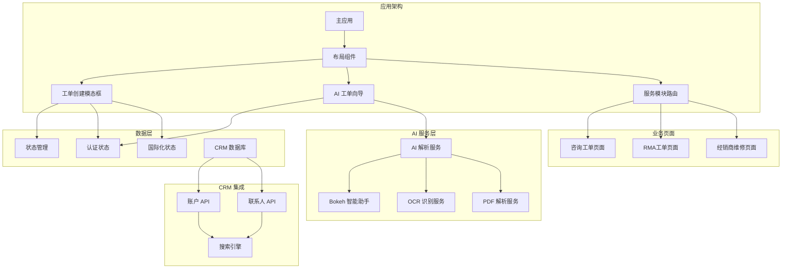

**图表来源**
- [TicketCreationModal.tsx](file://client/src/components/Service/TicketCreationModal.tsx#L1-L901)
- [TicketAiWizard.tsx](file://client/src/components/TicketAiWizard.tsx#L1-L269)
- [accounts.js](file://server/service/routes/accounts.js#L1-L200)
- [ai_service.js](file://server/service/ai_service.js#L1-L666)

## 核心组件

### TicketCreationModal 组件

TicketCreationModal 是一个功能完整的工单创建组件，具有以下核心特性：

#### 主要功能
- **多工单类型支持**：统一界面支持咨询工单、RMA工单和经销商维修单
- **CRM 集成**：支持账户和联系人的智能搜索与关联
- **AI 辅助创建**：集成智能工单向导，支持多模态输入解析
- **智能字段填充**：自动检测序列号并匹配产品型号
- **草稿自动保存**：基于Zustand状态管理的本地草稿持久化
- **附件上传**：支持图片、视频、PDF等多种格式的文件上传
- **响应式设计**：采用macOS风格的sheet设计，适配不同屏幕尺寸
- **国际化支持**：完整的中英文双语界面支持
- **双列布局**：全新的双列设计提升表单组织性和用户体验
- **颜色编码区域**：不同工单类型使用独特的颜色主题，增强视觉识别
- **动画效果**：流畅的模态框开合动画，提升用户体验

#### 技术实现特点
- 使用React Hooks进行状态管理
- 集成Axios进行HTTP请求
- 实现并发数据获取优化
- 提供完整的错误处理机制
- **新增** 增强的样式系统和动画效果
- **新增** 现代化的双列布局设计
- **新增** 基于Zustand的草稿持久化机制
- **新增** 统一的媒体上传处理
- **新增** CRM 集成搜索功能
- **新增** AI 沙盒多模态输入支持
- **新增** 智能字段填充和序列号检测

**章节来源**
- [TicketCreationModal.tsx](file://client/src/components/Service/TicketCreationModal.tsx#L1-L901)

### TicketAiWizard 组件

**新增** AI 工单向导是本次更新的核心功能组件，提供智能工单创建体验：

#### 主要功能
- **自然语言解析**：支持粘贴邮件内容、聊天记录或问题描述
- **智能信息提取**：AI 自动识别客户名称、联系方式、产品型号、问题描述等关键信息
- **结构化数据生成**：将非结构化文本转换为标准的工单数据格式
- **实时预览**：提供工单数据的实时预览和编辑功能
- **一键创建**：确认后直接跳转到工单创建界面
- **多模态输入**：支持图片OCR和PDF解析功能

#### 技术实现特点
- 使用 Sparkles 图标和渐变色彩设计
- 实现左右两栏布局，左侧输入右侧输出
- 支持清除和重置功能
- 提供加载状态和错误处理
- 集成认证状态管理

**章节来源**
- [TicketAiWizard.tsx](file://client/src/components/TicketAiWizard.tsx#L1-L269)

## 架构概览

TicketCreationModal 采用了清晰的分层架构设计，确保了组件间的松耦合和高内聚，并集成了 CRM 集成和 AI 功能：

```mermaid
graph TD
subgraph "UI层"
Modal[TicketCreationModal]
AiWizard[TicketAiWizard]
Form[表单组件]
Upload[文件上传区域]
Preview[文件预览]
CRMLookup[CRM 搜索组件]
AISandbox[AI 沙盒]
end
subgraph "状态管理层"
Store[zustand store]
Draft[草稿状态]
UIState[界面状态]
GhostFields[AI 填充字段]
end
subgraph "CRM 集成层"
AccountsAPI[账户 API]
ContactsAPI[联系人 API]
SearchEngine[搜索引擎]
PermissionFilter[权限过滤]
end
subgraph "AI处理层"
AIService[AI 解析服务]
Parser[信息提取器]
Transformer[数据转换器]
OCRService[OCR 识别]
PDFParser[PDF 解析]
BokehAssistant[Bokeh 智能助手]
end
subgraph "数据访问层"
API[API客户端]
Auth[认证管理]
Cache[缓存策略]
DB[CRM 数据库]
end
subgraph "业务逻辑层"
Validation[表单验证]
Transform[数据转换]
ErrorHandling[错误处理]
CRMIntegration[CRM 集成处理]
AIIntegration[AI 集成处理]
SmartFill[智能填充]
MultiModal[多模态处理]
end
Modal --> Form
Modal --> Upload
Modal --> Preview
Modal --> CRMLookup
Modal --> AISandbox
Modal --> Store
AiWizard --> AIService
AiWizard --> Parser
AiWizard --> Transformer
AiWizard --> Store
AiWizard --> BokehAssistant
CRMLookup --> AccountsAPI
CRMLookup --> ContactsAPI
CRMLookup --> SearchEngine
CRMLookup --> PermissionFilter
AISandbox --> AIService
AISandbox --> OCRService
AISandbox --> PDFParser
Modal --> AIIntegration
Modal --> CRMIntegration
Modal --> SmartFill
Modal --> MultiModal
Store --> Draft
Store --> UIState
Store --> GhostFields
Modal --> API
API --> Auth
API --> Cache
Modal --> Validation
Modal --> Transform
Modal --> ErrorHandling
```

**图表来源**
- [TicketCreationModal.tsx](file://client/src/components/Service/TicketCreationModal.tsx#L1-L901)
- [TicketAiWizard.tsx](file://client/src/components/TicketAiWizard.tsx#L1-L269)
- [useTicketStore.ts](file://client/src/store/useTicketStore.ts#L1-L68)

## 详细组件分析

### 状态管理架构

TicketCreationModal 通过自定义的Zustand store实现状态管理，提供了完整的工单草稿管理功能，包括新增的 AI 填充字段状态：

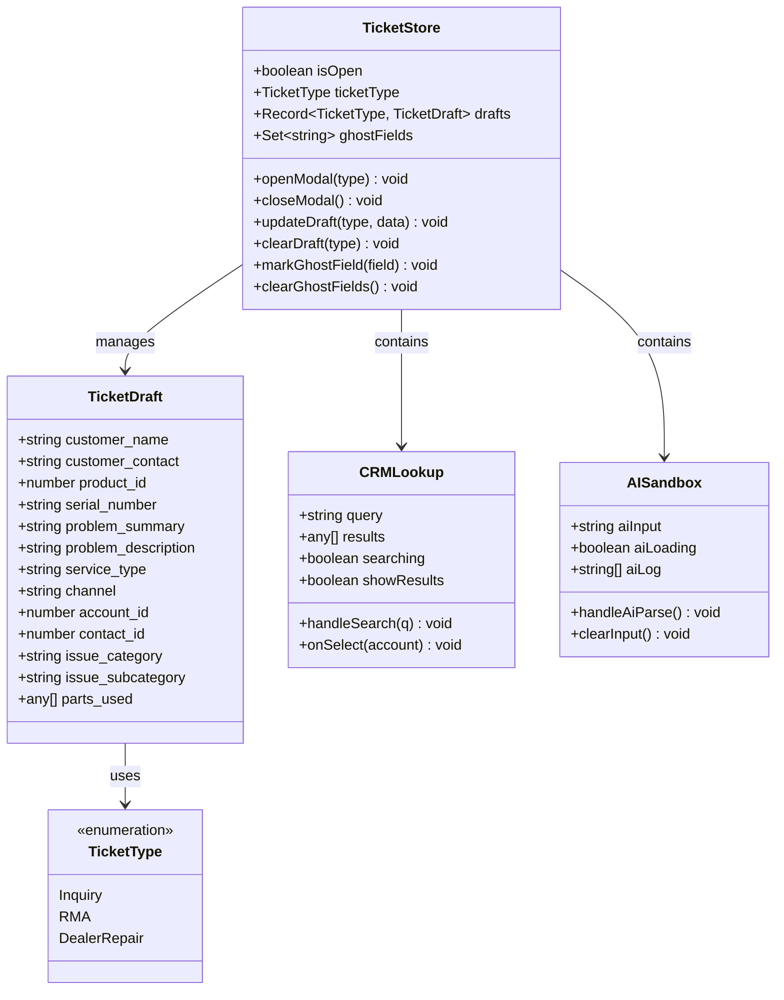

**图表来源**
- [useTicketStore.ts](file://client/src/store/useTicketStore.ts#L4-L67)
- [TicketCreationModal.tsx](file://client/src/components/Service/TicketCreationModal.tsx#L17-L196)

### CRM 集成架构

**新增** CRM 集成功能展现了完整的客户关系管理架构：

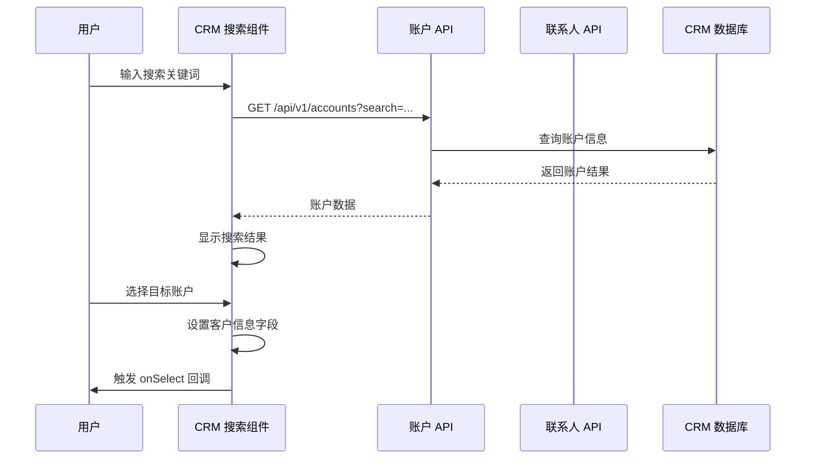

**更新** CRM 集成系统包括：

- **账户搜索**：支持按名称、邮箱、电话、公司编号等多维度搜索
- **联系人关联**：自动关联主联系人信息，支持多联系人管理
- **权限控制**：基于用户角色的访问权限控制
- **实时搜索**：300ms 防抖延迟，提升搜索性能
- **结果展示**：账户类型、地区、服务等级等信息的可视化展示

**图表来源**
- [TicketCreationModal.tsx](file://client/src/components/Service/TicketCreationModal.tsx#L17-L196)
- [accounts.js](file://server/service/routes/accounts.js#L51-L186)
- [contacts.js](file://server/service/routes/contacts.js#L22-L102)

### AI 沙盒功能架构

**新增** AI 沙盒功能提供了完整的多模态输入处理架构：

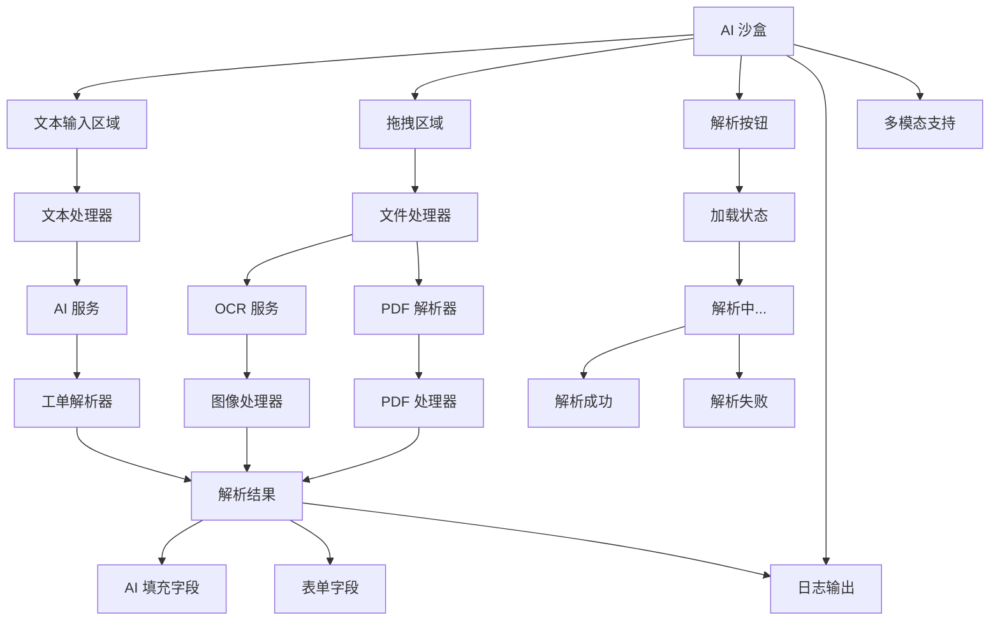

**更新** AI 沙盒功能包括：

- **多模态输入**：支持文本粘贴、图片拖拽、PDF文件上传
- **智能解析**：AI 自动提取客户信息、产品型号、问题描述等关键字段
- **实时反馈**：解析过程的实时日志输出和状态指示
- **字段高亮**：AI 填充的字段使用特殊样式标识
- **紧急工单标记**：自动检测紧急程度并添加标记

**图表来源**
- [TicketCreationModal.tsx](file://client/src/components/Service/TicketCreationModal.tsx#L294-L370)
- [TicketAiWizard.tsx](file://client/src/components/TicketAiWizard.tsx#L22-L44)

### 智能字段填充机制

**新增** 智能字段填充功能展现了先进的自动匹配算法：

```mermaid
flowchart TD
SerialInput[序列号输入] --> Validation[长度验证]
Validation --> |≥5字符| SNValidator[序列号验证]
Validation --> |<5字符| ClearInfo[清空设备信息]
SNValidator --> APICall[API 调用]
APICall --> DeviceInfo[设备信息]
DeviceInfo --> ProductMatch[产品匹配]
ProductMatch --> AutoFill[自动填充]
DeviceInfo --> ShowCard[显示设备卡片]
AutoFill --> GhostField[标记AI填充字段]
function handleFieldChange(field, value) {
if (field === 'serial_number') {
updateDraft(initialType, { [field]: value });
if (value.length >= 5) {
setSnLoading(true);
// 异步验证序列号
const device = await validateSN(value);
if (device) {
setMachineInfo(device);
// 匹配产品型号
const matched = products.find(p =>
p.name.toLowerCase().includes(device.model_name.toLowerCase()) ||
device.model_name.toLowerCase().includes(p.name.toLowerCase())
);
if (matched) {
handleFieldChange('product_id', matched.id, true);
}
}
}
}
}
```

**更新** 智能字段填充系统包括：

- **序列号验证**：自动检测有效序列号并触发验证流程
- **设备信息获取**：通过序列号查询设备详细信息
- **产品自动匹配**：基于设备型号自动匹配产品目录
- **字段高亮显示**：AI 填充的字段使用特殊样式标识
- **紧急程度标记**：自动检测并标记紧急工单

**图表来源**
- [TicketCreationModal.tsx](file://client/src/components/Service/TicketCreationModal.tsx#L247-L281)
- [TicketCreationModal.tsx](file://client/src/components/Service/TicketCreationModal.tsx#L263-L268)

### 多模态输入处理

**新增** 多模态输入处理功能支持多种数据源的智能解析：

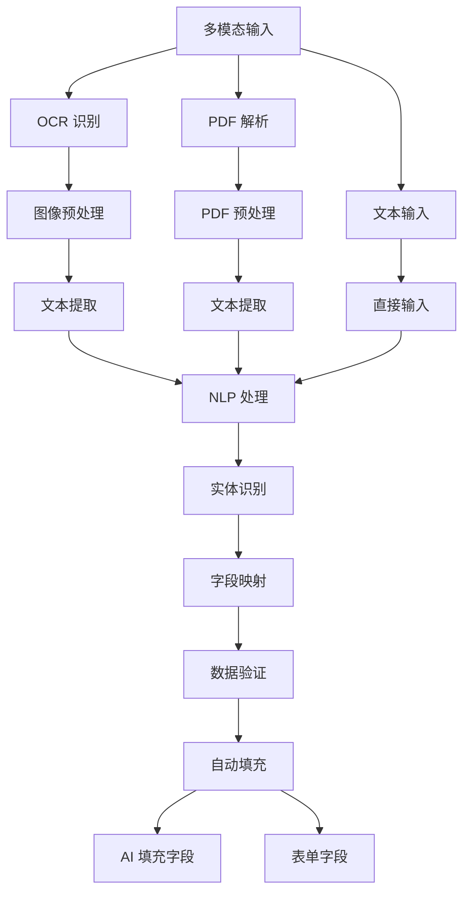

**更新** 多模态输入功能包括：

- **OCR 识别**：支持截图OCR识别，提取图像中的文本信息
- **PDF 解析**：支持PDF文件解析，提取文档内容
- **NLP 处理**：自然语言处理技术，智能提取关键信息
- **实体识别**：自动识别客户名称、联系方式、产品型号等实体
- **字段映射**：将提取的信息映射到对应的表单字段

**图表来源**
- [TicketCreationModal.tsx](file://client/src/components/Service/TicketCreationModal.tsx#L585-L600)
- [TicketCreationModal.tsx](file://client/src/components/Service/TicketCreationModal.tsx#L515-L521)

### 视觉设计系统

**新增** 组件实现了完整的视觉设计系统，包括 CRM 集成的视觉元素：

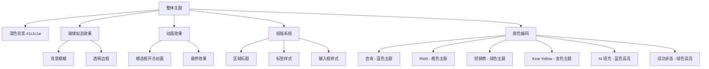

**更新** 视觉设计系统包括：

- **深色主题**：采用 #1c1c1e 的深色背景，减少视觉疲劳
- **玻璃拟态**：使用半透明效果和模糊滤镜，营造现代感
- **颜色编码**：每种工单类型都有独特的颜色标识
- **Kine Yellow 主题**：新增的金色渐变色彩（#FFD700）作为主要视觉元素
- **AI 填充高亮**：蓝色边框和阴影效果标识AI填充的字段
- **统一排版**：一致的字体大小、行高和间距
- **动画效果**：0.2秒的开合动画，0.2秒的过渡效果

**图表来源**
- [TicketCreationModal.tsx](file://client/src/components/Service/TicketCreationModal.tsx#L427-L433)
- [TicketCreationModal.tsx](file://client/src/components/Service/TicketCreationModal.tsx#L649-L673)

### 文件上传处理

**新增** 改进的文件上传处理机制，支持多模态输入：

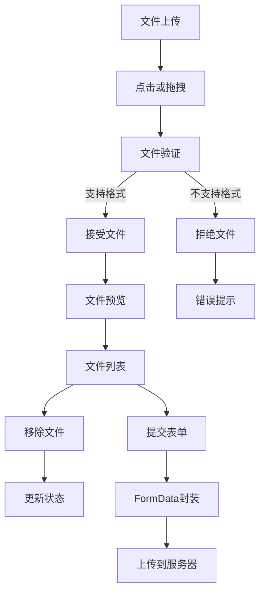

**更新** 文件上传功能增强：

- **多格式支持**：图片、视频、PDF文件
- **大小限制**：最大50MB文件限制
- **实时预览**：文件图标和大小显示
- **拖拽支持**：支持拖拽文件到上传区域
- **类型识别**：根据文件类型显示不同图标
- **多模态支持**：支持OCR和PDF解析功能

**图表来源**
- [TicketCreationModal.tsx](file://client/src/components/Service/TicketCreationModal.tsx#L283-L292)
- [TicketCreationModal.tsx](file://client/src/components/Service/TicketCreationModal.tsx#L800-L823)

### 草稿持久化机制

**新增** 组件实现了完整的草稿持久化机制，包括 AI 填充字段的状态管理：

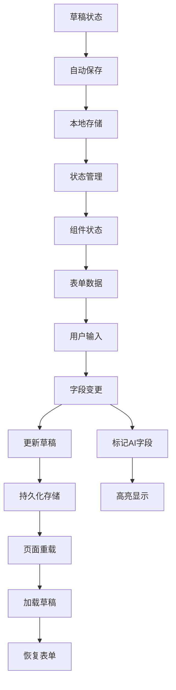

**更新** 草稿持久化系统包括：

- **实时保存**：用户输入时自动保存到本地存储
- **跨页面持久化**：页面刷新后仍能恢复草稿
- **类型隔离**：不同工单类型的草稿独立存储
- **AI 字段状态**：记录AI填充的字段状态
- **状态指示**：底部显示"草稿已自动保存"状态
- **清理机制**：工单创建成功后自动清理草稿

**图表来源**
- [TicketCreationModal.tsx](file://client/src/components/Service/TicketCreationModal.tsx#L234-L245)
- [useTicketStore.ts](file://client/src/store/useTicketStore.ts#L40-L67)

**章节来源**
- [TicketCreationModal.tsx](file://client/src/components/Service/TicketCreationModal.tsx#L1-L901)
- [TicketAiWizard.tsx](file://client/src/components/TicketAiWizard.tsx#L1-L269)
- [useTicketStore.ts](file://client/src/store/useTicketStore.ts#L1-L68)

## CRM 集成功能

**新增** CRM 集成功能是本次更新的重要组成部分，为工单创建提供了完整的客户关系管理能力：

### 功能概述

CRM 集成允许用户通过智能搜索快速关联客户信息，支持账户和联系人的双向关联：

- **账户搜索**：支持按名称、邮箱、电话、公司编号等多维度搜索
- **联系人关联**：自动关联主联系人信息，支持多联系人管理
- **权限控制**：基于用户角色的访问权限控制
- **实时搜索**：300ms 防抖延迟，提升搜索性能
- **结果展示**：账户类型、地区、服务等级等信息的可视化展示

### 技术架构

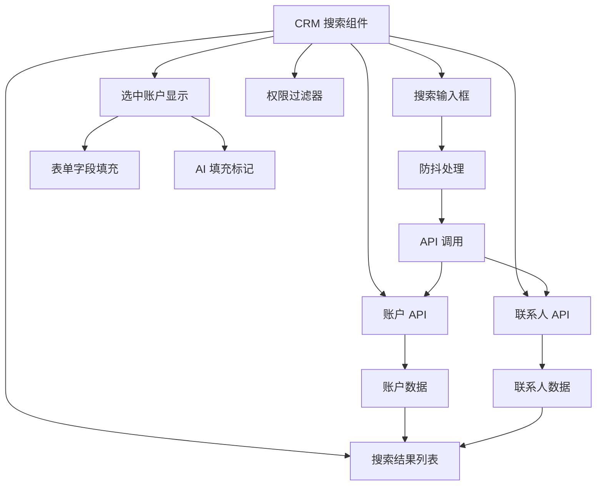

### 数据处理流程

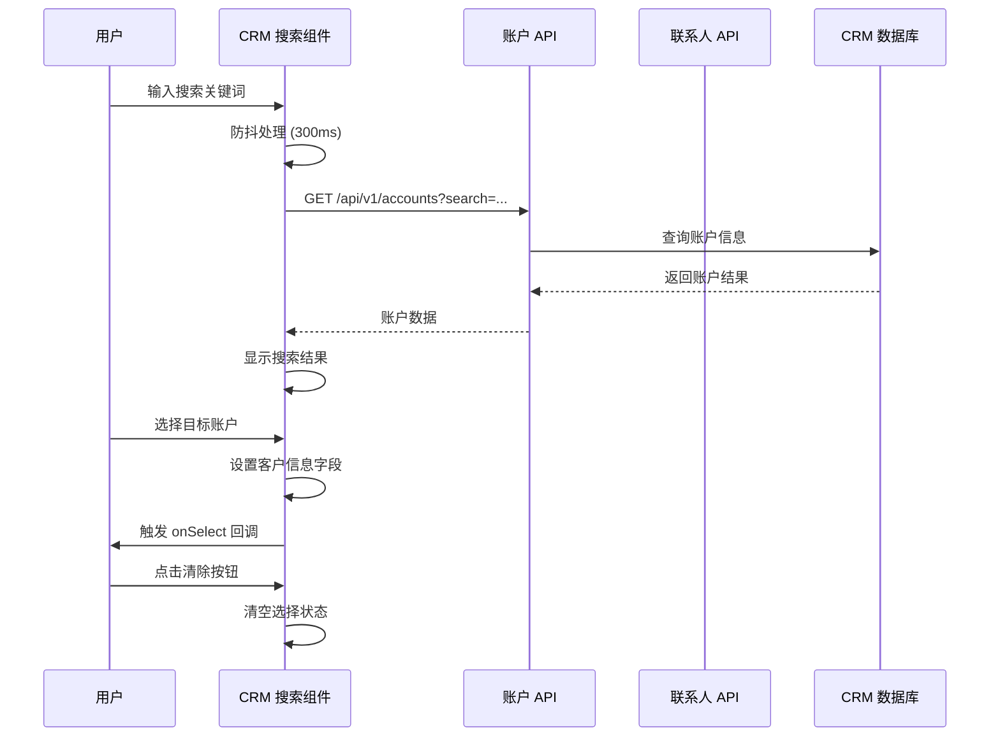

### 权限控制机制

**新增** CRM 集成具备完善的权限控制能力：

- **全局访问**：管理员和高级用户可访问所有账户
- **部门访问**：普通用户只能访问自己部门相关的账户
- **经销商访问**：经销商用户只能访问自己管理的账户
- **数据脱敏**：敏感信息在权限范围内进行脱敏处理

### 错误处理机制

CRM 集成具备完善的错误处理能力：

- **网络异常处理**：提供重试机制和错误提示
- **搜索失败处理**：显示详细的错误信息和解决方案
- **权限不足处理**：优雅降级并提示用户权限问题
- **数据验证**：确保搜索结果的完整性和准确性

**章节来源**
- [TicketCreationModal.tsx](file://client/src/components/Service/TicketCreationModal.tsx#L17-L196)
- [accounts.js](file://server/service/routes/accounts.js#L51-L186)
- [contacts.js](file://server/service/routes/contacts.js#L22-L102)

## AI 辅助功能

**新增** AI 辅助功能是本次更新的核心创新，为工单创建提供了智能化体验：

### 功能概述

AI 工单向导允许用户通过自然语言输入快速创建结构化的工单数据：

- **多源输入**：支持邮件内容、聊天记录、问题描述等多种文本格式
- **智能解析**：AI 自动识别和提取关键信息
- **实时预览**：提供结构化数据的实时预览和编辑
- **一键创建**：确认后直接跳转到工单创建界面
- **多模态支持**：支持图片OCR和PDF解析功能

### 技术架构

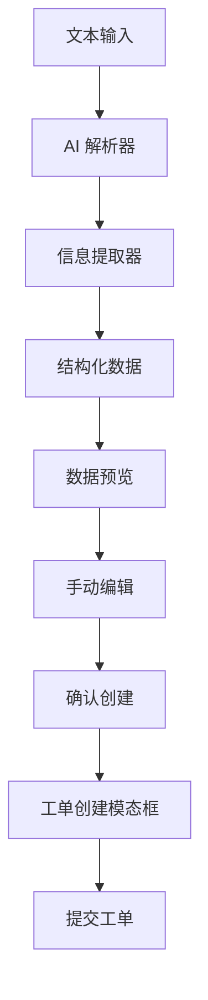

### 数据处理流程

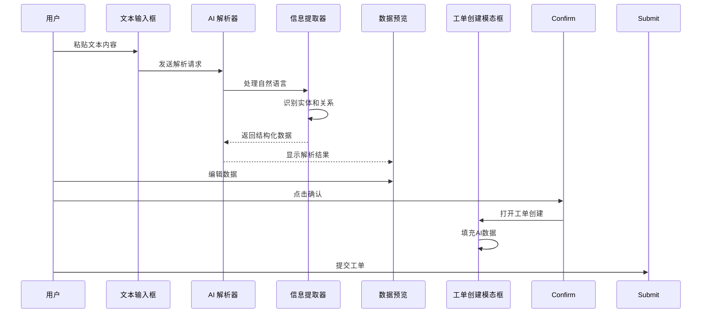

### 错误处理机制

AI 向导具备完善的错误处理能力：

- **空输入检测**：防止发送空文本
- **解析失败处理**：显示详细的错误信息
- **网络异常处理**：提供重试机制
- **数据验证**：确保提取的信息完整性

**章节来源**
- [TicketAiWizard.tsx](file://client/src/components/TicketAiWizard.tsx#L1-L269)

## 智能字段填充

**新增** 智能字段填充功能是本次更新的重要特性，显著提升了工单创建的效率和准确性：

### 功能概述

智能字段填充能够自动检测和填充工单相关的关键字段：

- **序列号检测**：自动检测有效序列号并触发验证流程
- **设备信息获取**：通过序列号查询设备详细信息
- **产品自动匹配**：基于设备型号自动匹配产品目录
- **紧急程度标记**：自动检测并标记紧急工单
- **字段高亮显示**：AI 填充的字段使用特殊样式标识

### 技术实现

```mermaid
flowchart TD
SerialInput[序列号输入] --> LengthCheck[长度检查]
LengthCheck --> |≥5字符| ValidateSN[验证序列号]
LengthCheck --> |<5字符| ClearInfo[清空设备信息]
ValidateSN --> APICall[API 调用]
APICall --> DeviceInfo[设备信息]
DeviceInfo --> ProductMatch[产品匹配]
ProductMatch --> AutoFill[自动填充]
DeviceInfo --> ShowCard[显示设备卡片]
AutoFill --> GhostField[标记AI填充字段]
function handleFieldChange(field, value, isAi) {
if (field === 'serial_number') {
updateDraft(initialType, { [field]: value });
if (value.length >= 5) {
setSnLoading(true);
// 异步验证序列号
const device = await validateSN(value);
if (device) {
setMachineInfo(device);
// 匹配产品型号
const matched = products.find(p =>
p.name.toLowerCase().includes(device.model_name.toLowerCase()) ||
device.model_name.toLowerCase().includes(p.name.toLowerCase())
);
if (matched) {
handleFieldChange('product_id', matched.id, true);
}
}
}
} else {
// 普通字段变更
updateDraft(initialType, { [field]: value });
if (isAi) {
setGhostFields(prev => new Set(prev).add(field));
} else {
setGhostFields(prev => {
const next = new Set(prev);
next.delete(field);
return next;
});
}
}
}
```

### 字段高亮系统

**新增** 字段高亮系统为用户提供了清晰的视觉反馈：

- **AI 填充标识**：蓝色边框和阴影效果标识AI填充的字段
- **字段类型区分**：不同类型的AI填充字段使用不同的高亮样式
- **状态指示器**：在字段旁边显示"AI FILLED"、"AI MATCHED"等状态标签
- **过渡动画**：平滑的颜色和样式过渡效果

### 错误处理机制

智能字段填充具备完善的错误处理能力：

- **无效序列号处理**：显示错误提示并清空设备信息
- **网络异常处理**：提供重试机制和降级方案
- **匹配失败处理**：保持用户输入但不自动填充产品信息
- **加载状态管理**：显示加载指示器提升用户体验

**章节来源**
- [TicketCreationModal.tsx](file://client/src/components/Service/TicketCreationModal.tsx#L247-L281)
- [TicketCreationModal.tsx](file://client/src/components/Service/TicketCreationModal.tsx#L234-L245)

## 多模态输入支持

**新增** 多模态输入支持功能为工单创建提供了更加灵活的数据输入方式：

### 功能概述

多模态输入支持多种数据源的智能解析：

- **OCR 识别**：支持截图OCR识别，提取图像中的文本信息
- **PDF 解析**：支持PDF文件解析，提取文档内容
- **拖拽上传**：支持拖拽文件到指定区域进行解析
- **实时预览**：解析过程的实时状态显示
- **错误处理**：支持格式不兼容和解析失败的情况

### 技术实现

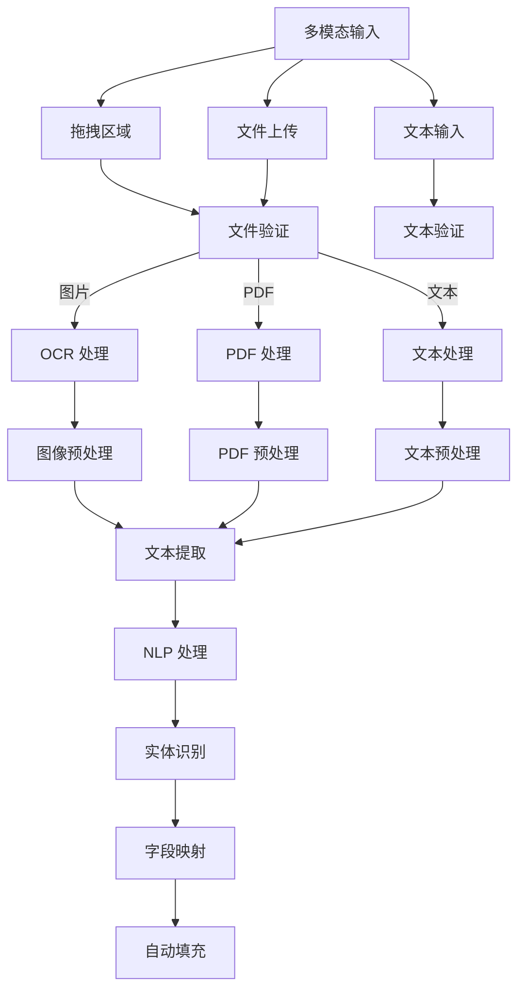

### 支持的文件格式

**新增** 多模态输入支持的文件格式：

- **图片格式**：JPG、PNG、BMP、TIFF等常见图片格式
- **PDF格式**：标准PDF文档格式
- **文本格式**：TXT、DOC、DOCX等文本格式
- **压缩格式**：ZIP、RAR等压缩文件（支持内部文件解析）

### 解析流程

**新增** 多模态解析的具体流程：

1. **文件接收**：用户通过拖拽或点击上传文件
2. **格式验证**：检查文件格式是否支持
3. **内容提取**：使用相应的解析器提取文件内容
4. **文本清洗**：清理提取的文本内容
5. **AI 处理**：使用AI模型进行关键信息提取
6. **字段填充**：将提取的信息自动填充到工单字段

### 错误处理机制

多模态输入具备完善的错误处理能力：

- **格式不支持**：显示错误提示并建议正确的文件格式
- **解析失败**：提供详细的错误信息和重试选项
- **网络异常**：提供离线处理和重试机制
- **文件过大**：显示大小限制并提供压缩建议

**章节来源**
- [TicketCreationModal.tsx](file://client/src/components/Service/TicketCreationModal.tsx#L515-L521)
- [TicketCreationModal.tsx](file://client/src/components/Service/TicketCreationModal.tsx#L585-L600)

## 后端 AI 服务

**新增** 后端 AI 服务为前端 AI 功能提供强大的技术支持：

### AI 服务架构

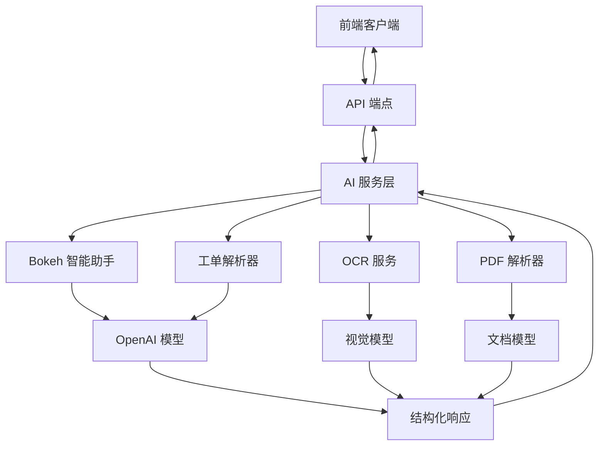

### 核心功能实现

**工单解析服务**：专门用于解析工单信息的AI服务，能够从原始文本中提取关键字段：

- **系统提示**：定义专业的AI助手角色和任务
- **JSON 输出**：强制返回结构化JSON数据
- **模型选择**：根据任务复杂度选择合适的AI模型
- **使用统计**：记录AI服务的使用情况

**Bokeh 智能助手**：提供上下文感知的对话能力：

- **工作模式**：严格的工作模式限制
- **上下文感知**：理解当前页面和标题
- **个性化设置**：支持温度参数和搜索功能
- **安全策略**：拒绝无关话题的讨论

**OCR 识别服务**：支持图片内容的智能识别：

- **多语言支持**：支持中英文等多种语言的OCR识别
- **格式适配**：适配各种图片格式和分辨率
- **精度优化**：通过模型优化提升识别准确率
- **批量处理**：支持多张图片的批量识别处理

**PDF 解析服务**：支持PDF文档的内容提取：

- **格式兼容**：支持各种PDF格式和加密文档
- **内容提取**：提取文本、表格、图片等内容
- **结构保持**：保持原文档的结构和格式
- **元数据提取**：提取文档的标题、作者、创建时间等元数据

### API 接口设计

后端提供了多个主要的AI服务接口：

- **/api/ai/ticket_parse**：专门用于工单解析
- **/api/ai/chat**：通用的聊天助手服务
- **/api/ai/ocr**：OCR 识别服务
- **/api/ai/pdf_parse**：PDF 解析服务

这些接口都经过认证保护，确保只有授权用户可以使用AI功能。

**章节来源**
- [ai_service.js](file://server/service/ai_service.js#L149-L224)
- [ai_service.js](file://server/service/ai_service.js#L226-L360)
- [ai_service.js](file://server/service/ai_service.js#L362-L537)

## 依赖关系分析

### 组件间依赖关系

TicketCreationModal 与应用其他组件形成了清晰的依赖关系，包括新增的 CRM 集成和 AI 功能：

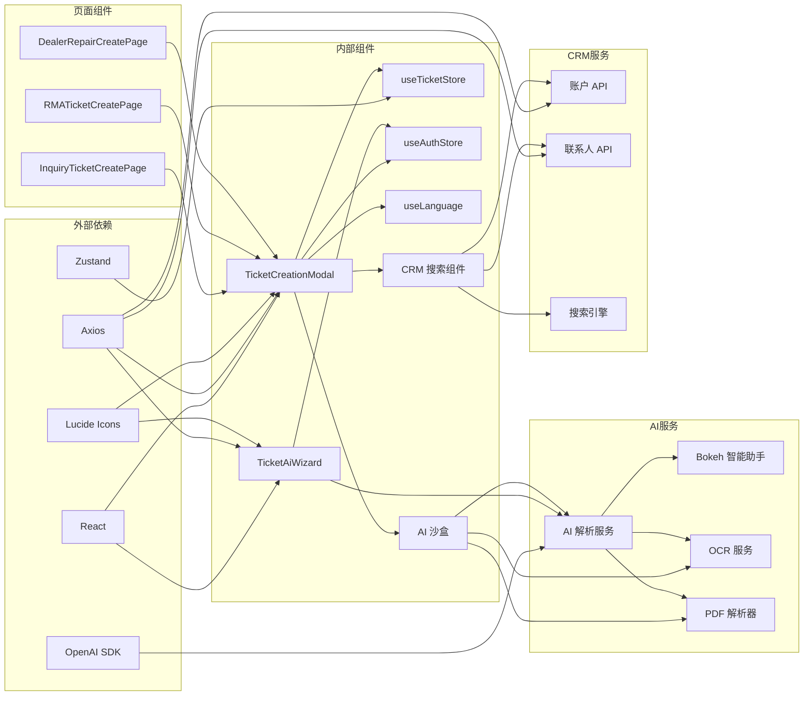

**图表来源**
- [TicketCreationModal.tsx](file://client/src/components/Service/TicketCreationModal.tsx#L1-L11)
- [TicketAiWizard.tsx](file://client/src/components/TicketAiWizard.tsx#L1-L5)
- [useTicketStore.ts](file://client/src/store/useTicketStore.ts#L1-L2)

### 数据依赖分析

组件的数据依赖展现了良好的解耦设计：

| 依赖类型 | 依赖组件 | 用途 | 版本要求 |
|---------|---------|------|----------|
| 状态管理 | zustand | 全局状态管理 | ^4.0.0 |
| HTTP客户端 | axios | API通信 | ^1.0.0 |
| 图标库 | lucide-react | UI图标 | ^0.299.0 |
| 国际化 | react-i18next | 多语言支持 | ^11.0.0 |
| 路由 | react-router-dom | 页面导航 | ^6.0.0 |
| AI服务 | OpenAI SDK | 智能文本处理 | ^4.0.0 |
| CRM服务 | 自定义API | 客户关系管理 | 专用API |
| 后端服务 | Node.js + OpenAI | AI模型推理 | 专用API |
| OCR服务 | Tesseract.js | 图像文字识别 | ^4.0.0 |
| PDF解析 | pdfjs-dist | PDF文档处理 | ^3.0.0 |

**章节来源**
- [TicketCreationModal.tsx](file://client/src/components/Service/TicketCreationModal.tsx#L1-L11)
- [TicketAiWizard.tsx](file://client/src/components/TicketAiWizard.tsx#L1-L5)
- [useTicketStore.ts](file://client/src/store/useTicketStore.ts#L1-L2)

## 性能考虑

### 并发数据获取优化

TicketCreationModal 实现了高效的并发数据获取策略：

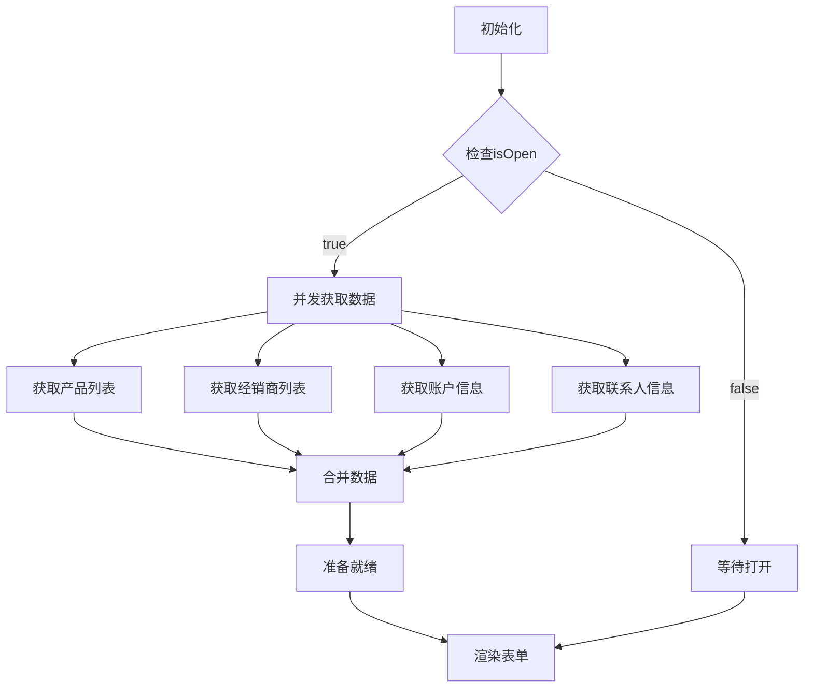

**图表来源**
- [TicketCreationModal.tsx](file://client/src/components/Service/TicketCreationModal.tsx#L219-L232)

### CRM 搜索性能优化

**新增** CRM 搜索功能的性能优化策略：

- **防抖处理**：300ms 防抖延迟，避免频繁的API调用
- **缓存机制**：对搜索结果进行缓存，提升重复搜索性能
- **权限过滤**：在客户端进行权限过滤，减少不必要的数据传输
- **分页加载**：支持分页加载，避免大量数据一次性传输
- **搜索优化**：使用模糊搜索和关键词匹配提升搜索准确性

### AI 功能性能优化

**新增** AI 功能的性能优化策略：

- **防抖处理**：输入防抖，避免频繁的API调用
- **缓存机制**：对解析结果进行缓存
- **异步处理**：使用异步方式处理AI解析
- **错误边界**：提供错误处理和降级方案
- **模型选择**：根据任务复杂度选择合适的AI模型
- **多模态优化**：针对不同文件格式优化解析算法

### 内存管理策略

组件采用了有效的内存管理策略来避免性能问题：

- **懒加载机制**：仅在模态框打开时才获取初始数据
- **状态清理**：提交完成后自动清理草稿和附件状态
- **事件监听器管理**：正确清理组件卸载时的事件监听器
- **新增** 优化的样式系统，减少不必要的DOM操作
- **新增** 动画性能优化，使用CSS动画而非JavaScript动画
- **新增** 草稿持久化优化，避免重复存储相同数据
- **新增** AI 解析结果的内存管理，避免重复计算
- **新增** CRM 搜索结果的缓存管理，提升搜索性能

## 故障排除指南

### 常见问题及解决方案

#### 1. 数据获取失败
**问题症状**：产品或经销商下拉框为空
**可能原因**：
- 网络连接问题
- 认证令牌过期
- API服务不可用

**解决方案**：
- 检查网络连接状态
- 刷新页面重新登录
- 查看浏览器开发者工具的网络面板

#### 2. CRM 搜索失败
**问题症状**：账户搜索无结果或报错
**可能原因**：
- 搜索关键词过短（少于3个字符）
- 网络连接问题
- 权限不足
- 数据库查询异常

**解决方案**：
- 确保搜索关键词至少3个字符
- 检查网络连接状态
- 确认用户权限是否足够
- 查看服务器日志获取详细错误信息

#### 3. 文件上传失败
**问题症状**：附件无法上传或显示错误
**可能原因**：
- 文件格式不支持
- 文件大小超过限制
- 服务器存储空间不足

**解决方案**：
- 检查文件格式是否为图片、视频或PDF
- 确认文件大小不超过50MB限制
- 联系系统管理员检查服务器状态

#### 4. 工单创建失败
**问题症状**：提交后无响应或显示错误消息
**可能原因**：
- 必填字段缺失
- 服务器验证失败
- 网络超时

**解决方案**：
- 检查所有必填字段是否填写完整
- 查看具体的错误提示信息
- 重试提交操作

#### 5. AI 功能异常
**问题症状**：AI 解析失败或返回空结果
**可能原因**：
- 文本内容格式不规范
- AI 服务暂时不可用
- 网络连接问题

**解决方案**：
- 检查输入的文本格式和内容质量
- 稍后重试解析操作
- 确认AI服务的可用性
- 查看浏览器开发者工具的网络面板

#### 6. 序列号验证失败
**问题症状**：序列号输入后无设备信息显示
**可能原因**：
- 序列号格式不正确
- 设备不存在
- 网络连接问题

**解决方案**：
- 确认序列号格式符合要求（至少5个字符）
- 检查序列号是否正确
- 稍后重试验证操作
- 查看网络连接状态

#### 7. 多模态输入失败
**问题症状**：图片OCR或PDF解析失败
**可能原因**：
- 文件格式不支持
- 文件损坏
- AI 服务异常

**解决方案**：
- 确认文件格式是否受支持
- 检查文件是否损坏
- 稍后重试解析操作
- 查看AI服务状态

#### 8. 双列布局显示异常
**问题症状**：双列布局在某些屏幕尺寸下显示不正确
**可能原因**：
- CSS媒体查询配置问题
- 浏览器兼容性问题

**解决方案**：
- 检查浏览器开发者工具的样式调试
- 确认CSS媒体查询正常工作
- 测试不同屏幕尺寸下的显示效果

#### 9. 草稿持久化问题
**问题症状**：草稿无法保存或恢复
**可能原因**：
- 本地存储空间不足
- 浏览器隐私设置阻止存储
- 状态管理器异常

**解决方案**：
- 检查浏览器存储空间
- 确认允许第三方Cookie和存储
- 清除浏览器缓存后重试

#### 10. AI 服务集成问题
**问题症状**：AI 解析接口调用失败
**可能原因**：
- 后端AI服务未启动
- 认证令牌无效
- 网络连接中断

**解决方案**：
- 检查后端服务状态
- 验证用户认证信息
- 确认网络连接稳定
- 查看服务器日志获取详细错误信息

#### 11. CRM 集成问题
**问题症状**：账户或联系人信息无法获取
**可能原因**：
- 权限不足
- 数据库连接异常
- API接口错误

**解决方案**：
- 确认用户权限是否足够
- 检查数据库连接状态
- 查看API接口返回的错误信息
- 联系系统管理员检查服务状态

#### 12. Kine Yellow 主题显示问题
**问题症状**：金色主题颜色显示异常
**可能原因**：
- CSS变量未正确加载
- 浏览器兼容性问题

**解决方案**：
- 检查浏览器开发者工具的样式调试
- 确认CSS变量定义正确
- 测试不同浏览器的显示效果

**章节来源**
- [TicketCreationModal.tsx](file://client/src/components/Service/TicketCreationModal.tsx#L93-L98)
- [TicketAiWizard.tsx](file://client/src/components/TicketAiWizard.tsx#L38-L44)

## 结论

TicketCreationModal 工单创建模态框是一个设计精良、功能完善的组件，它成功地将复杂的工单创建流程简化为直观易用的界面。通过采用现代的前端技术栈和最佳实践，该组件不仅提供了优秀的用户体验，还确保了系统的可维护性和扩展性。

**更新** 经过全面改进后，该组件在以下方面表现尤为突出：

### 主要优势

1. **统一的用户体验**：三种工单类型共享相同的界面设计和交互模式
2. **完整的 CRM 集成**：支持账户和联系人的智能搜索与关联
3. **强大的 AI 辅助功能**：支持多模态输入的智能解析
4. **智能字段填充**：自动检测序列号并匹配产品型号
5. **高效的草稿管理**：基于Zustand的本地存储机制防止数据丢失
6. **完善的错误处理**：全面的错误捕获和用户友好的错误提示
7. **响应式设计**：适配各种设备和屏幕尺寸
8. **国际化支持**：完整的中英文双语界面
9. **革命性的双列布局**：提升表单组织性和用户体验
10. **增强的样式系统**：现代化的视觉设计和颜色编码
11. **改进的文件处理**：更友好的文件上传和管理体验
12. **动画效果优化**：流畅的模态框开合动画
13. **AI 沙盒功能**：拖拽式智能解析体验
14. **多模态输入支持**：OCR和PDF解析能力
15. **智能字段高亮**：AI填充字段的视觉标识
16. **紧急工单标记**：自动检测并标记紧急程度
17. **权限控制机制**：基于角色的访问权限管理
18. **Kine Yellow 主题**：专业的金色品牌视觉形象

### 技术亮点

- **并发数据获取**：优化的API调用策略减少加载时间
- **CRM 搜索优化**：300ms 防抖延迟提升搜索性能
- **AI 功能优化**：多模态输入和智能解析能力
- **智能字段填充**：序列号自动检测和产品匹配
- **权限控制优化**：基于角色的访问权限管理
- **内存管理优化**：有效的状态管理和缓存策略
- **动画性能优化**：使用CSS动画而非JavaScript动画
- **草稿持久化优化**：基于Zustand的本地存储机制
- **AI 解析优化**：多模态输入和错误处理机制
- **颜色编码系统**：不同工单类型使用独特的颜色主题
- **响应式双列布局**：在大屏幕上提供双列，在小屏幕上自动调整为单列
- **统一交互设计**：跨工单类型的共享用户体验
- **类型特定字段**：根据工单类型动态显示相应字段
- **AI 智能解析**：自然语言到结构化数据的智能转换
- **实时数据预览**：AI 解析结果的可视化展示
- **一键创建工作流**：从文本输入到工单创建的无缝体验
- **后端AI服务**：专业的AI模型集成，确保解析质量
- **OCR 识别能力**：支持图片内容的智能识别
- **PDF 解析能力**：支持PDF文档的内容提取

### CRM 集成价值

**新增** CRM 集成功能为系统带来了显著的价值提升：

- **客户关系管理**：完整的账户和联系人管理能力
- **智能搜索**：多维度的客户信息搜索功能
- **权限控制**：基于角色的访问权限管理
- **数据关联**：自动关联客户信息到工单中
- **效率提升**：大幅减少手动输入客户信息的时间
- **准确性提高**：减少人工输入错误的可能性

### AI 功能价值

**新增** AI 功能为系统带来了显著的价值提升：

- **效率提升**：大幅减少手动输入工单数据的时间
- **准确性提高**：AI 自动提取关键信息，减少人为错误
- **用户体验优化**：提供更智能、更便捷的工单创建流程
- **智能化转型**：推动传统工单系统向智能化方向发展
- **学习成本降低**：新用户可以更快上手工单创建流程
- **多模态支持**：支持图片OCR和PDF解析功能
- **紧急工单识别**：自动检测并标记紧急程度

### 后端 AI 服务价值

**新增** 后端 AI 服务为系统提供了强大的技术支持：

- **专业解析能力**：专门针对工单解析优化的AI模型
- **多模态处理**：支持文本、图片、PDF等多种格式的智能解析
- **结构化输出**：确保解析结果的准确性和一致性
- **安全可控**：严格的认证和访问控制机制
- **性能优化**：智能的模型选择和资源管理
- **监控统计**：完整的使用情况跟踪和分析

该组件为 Longhorn 服务管理系统提供了坚实的基础，为后续的功能扩展和维护奠定了良好的技术基础。其现代化的设计和优秀的用户体验使其成为企业级应用开发的优秀范例。

**统一创建弹窗设计理念**的成功实施，标志着 Longhorn 服务管理系统在用户体验和开发效率方面达到了新的高度。通过标准化的工单创建流程，用户可以在不同工单类型之间无缝切换，同时享受一致的界面设计和交互体验。

**CRM 集成功能**的深度集成和**AI 辅助功能**的全面增强，进一步提升了系统的智能化水平，为未来的功能扩展和技术升级奠定了坚实的基础。这些创新功能不仅改善了当前的用户体验，也为 Longhorn 系统的持续发展注入了新的活力。

**Kine Yellow 主题**的引入为系统增添了专业的品牌视觉形象，金色渐变色彩营造了高端、专业的品牌氛围，提升了用户的信任感和满意度。

通过这次全面的 CRM 集成和 AI 功能增强，Longhorn 工单创建系统已经从传统的表单填写工具转变为智能化的工单创建助手，为用户提供了更加高效、准确和便捷的服务体验。这种转变不仅提升了工作效率，也为企业的数字化转型提供了强有力的技术支撑。