# 统一工单详情

<cite>
**本文档引用的文件**
- [UnifiedTicketDetailPage.tsx](file://client/src/components/Service/UnifiedTicketDetailPage.tsx)
- [UnifiedTicketDetail.tsx](file://client/src/components/Workspace/UnifiedTicketDetail.tsx)
- [TicketDetailComponents.tsx](file://client/src/components/Workspace/TicketDetailComponents.tsx)
- [AttachmentZone.tsx](file://client/src/components/Service/AttachmentZone.tsx)
- [AuditReasonModal.tsx](file://client/src/components/Service/AuditReasonModal.tsx)
- [ProductModal.tsx](file://client/src/components/Workspace/ProductModal.tsx)
- [ParticipantsSidebar.tsx](file://client/src/components/Workspace/ParticipantsSidebar.tsx)
- [NotificationCenter.tsx](file://client/src/components/Notifications/NotificationCenter.tsx)
- [NotificationBell.tsx](file://client/src/components/Notifications/NotificationBell.tsx)
- [tickets.js](file://server/service/routes/tickets.js)
- [system.js](file://server/service/routes/system.js)
- [039_add_attachments_count.sql](file://server/migrations/039_add_attachments_count.sql)
</cite>

## 更新摘要
**变更内容**
- 集成通知中心系统，提供完整的通知管理和提醒功能
- 新增参与者协作机制，支持工单成员邀请、转交和权限管理
- 增强活动时间轴功能，支持关键节点检测和可视化标识
- 完善三种工单类型的统一管理体验，提供一致的界面和交互
- 优化审计化修正功能，实现强制审计字段变更时的修正理由输入
- 改进序列号状态驱动工作流，优化智能场景识别和一键修正功能
- 增强附件管理功能，支持更好的文件拖拽上传和预览体验
- 优化布局设计，提升用户体验和界面一致性
- **新增** 支持新的定价架构和产品信息显示，包括产品SKU、分类和族群管理
- **新增** 增强的保修信息管理，支持产品入库后的保修注册和计算
- **新增** 序列号状态驱动的智能场景识别，支持四种业务场景的自动处理
- **更新** UnifiedTicketDetail 组件的工单详情展示增强，包括更好的序列号状态显示和一键修正功能

## 目录
1. [简介](#简介)
2. [项目结构](#项目结构)
3. [核心组件](#核心组件)
4. [架构概览](#架构概览)
5. [详细组件分析](#详细组件分析)
6. [序列号状态驱动工作流](#序列号状态驱动工作流)
7. [智能场景识别系统](#智能场景识别系统)
8. [一键修正功能](#一键修正功能)
9. [审计跟踪系统](#审计跟踪系统)
10. [状态管理功能](#状态管理功能)
11. [关键节点编辑](#关键节点编辑)
12. [活动时间轴增强](#活动时间轴增强)
13. [权限控制系统](#权限控制系统)
14. [附件系统](#附件系统)
15. [产品入库审计屏障](#产品入库审计屏障)
16. [通知中心集成](#通知中心集成)
17. [参与者协作机制](#参与者协作机制)
18. [依赖关系分析](#依赖关系分析)
19. [性能考虑](#性能考虑)
20. [故障排除指南](#故障排除指南)
21. [结论](#结论)

## 简介

统一工单详情是 Longhorn 工单管理系统中的核心功能模块，为所有类型的工单（RMA、服务、咨询）提供统一的详情展示界面。该模块实现了 macOS26 风格的双栏布局设计，左侧为主信息区，右侧为协作者和客户上下文区，支持完整的工单生命周期管理和审计功能。

**更新** UnifiedTicketDetail 组件的增强包括更好的工单详情展示，特别是在序列号状态显示和一键修正功能方面。新增的序列号状态检测机制能够智能识别四种业务场景（已入库+已注册保修、已入库+未注册保修、未入库、SN 输入错误），并提供相应的操作按钮和界面响应。增强的保修状态显示包括在保/过保状态的颜色标识和剩余天数显示，以及针对不同场景的交互按钮（注册保修、产品入库）。

新增的通知中心系统为用户提供了完整的通知管理和提醒功能，包括实时通知推送、分类标识和已读管理。参与者协作机制支持工单成员的邀请、转交和权限管理，增强了团队协作效率。活动时间轴功能得到显著增强，支持关键节点检测和可视化标识，提供更直观的工作流状态展示。三种工单类型的统一管理体验得到完善，提供一致的界面和交互体验。审计化修正功能的改进实现了强制审计字段变更时的修正理由输入，确保所有核心数据变更都有明确的审计记录。序列号状态驱动工作流的优化显著提升了系统的智能化水平，能够根据序列号的实际状态自动识别业务场景并提供相应的操作建议。

**新增** 支持新的定价架构和产品信息显示功能，包括产品SKU、分类和族群管理，以及增强的保修信息管理。序列号状态驱动的智能场景识别系统能够自动处理四种业务场景，提供一键修正和自动化的工单处理流程。

## 项目结构

统一工单详情功能主要由三个核心文件组成，并集成了通知中心和参与者协作组件：

```mermaid
graph TB
subgraph "工单详情模块"
A[UnifiedTicketDetailPage.tsx<br/>路由入口]
B[UnifiedTicketDetail.tsx<br/>主视图组件]
C[TicketDetailComponents.tsx<br/>子组件集合]
D[AttachmentZone.tsx<br/>附件上传区域]
E[ActivityDetailDrawer.tsx<br/>活动详情抽屉]
F[MSReviewPanel.tsx<br/>商务审核面板]
G[ClosingHandoverModal.tsx<br/>结案确认模态框]
H[RepairReportEditor.tsx<br/>维修记录编辑器]
I[ProductWarrantyRegistrationModal.tsx<br/>产品保修注册模态框]
J[ProductModal.tsx<br/>产品信息模态框]
K[AuditReasonModal.tsx<br/>审计化修正理由输入]
L[ParticipantsSidebar.tsx<br/>参与者协作侧边栏]
end
subgraph "通知中心系统"
M[NotificationBell.tsx<br/>通知铃铛入口]
N[NotificationCenter.tsx<br/>通知中心面板]
O[NotificationPopupManager.tsx<br/>通知弹窗管理器]
end
subgraph "相关组件"
P[ActivityTimeline<br/>活动时间轴]
Q[NodeProgressBar<br/>节点进度条]
R[MentionCommentInput<br/>评论输入框]
S[ActionBufferModal<br/>动作缓冲模态框]
T[SubmitDiagnosticModal<br/>诊断报告提交]
U[FinalSettlementModal<br/>最终结算模态框]
V[CustomerContextSidebar.tsx<br/>客户上下文侧边栏]
end
A --> B
B --> C
B --> D
B --> E
B --> F
B --> G
B --> H
B --> I
B --> J
B --> K
B --> L
B --> M
B --> N
B --> O
B --> P
B --> Q
B --> R
B --> S
B --> T
B --> U
B --> V
```

**图表来源**
- [UnifiedTicketDetailPage.tsx:1-38](file://client/src/components/Service/UnifiedTicketDetailPage.tsx#L1-L38)
- [UnifiedTicketDetail.tsx:1-3538](file://client/src/components/Workspace/UnifiedTicketDetail.tsx#L1-L3538)
- [TicketDetailComponents.tsx:1-2516](file://client/src/components/Workspace/TicketDetailComponents.tsx#L1-L2516)
- [AttachmentZone.tsx:1-108](file://client/src/components/Service/AttachmentZone.tsx#L1-L108)
- [AuditReasonModal.tsx:1-339](file://client/src/components/Service/AuditReasonModal.tsx#L1-L339)
- [ProductModal.tsx:1-975](file://client/src/components/Workspace/ProductModal.tsx#L1-L975)
- [ParticipantsSidebar.tsx:1-638](file://client/src/components/Workspace/ParticipantsSidebar.tsx#L1-L638)
- [NotificationCenter.tsx:1-440](file://client/src/components/Notifications/NotificationCenter.tsx#L1-L440)
- [NotificationBell.tsx:1-94](file://client/src/components/Notifications/NotificationBell.tsx#L1-L94)

**章节来源**
- [UnifiedTicketDetailPage.tsx:1-38](file://client/src/components/Service/UnifiedTicketDetailPage.tsx#L1-L38)
- [UnifiedTicketDetail.tsx:1-3538](file://client/src/components/Workspace/UnifiedTicketDetail.tsx#L1-L3538)
- [TicketDetailComponents.tsx:1-2516](file://client/src/components/Workspace/TicketDetailComponents.tsx#L1-L2516)
- [AttachmentZone.tsx:1-108](file://client/src/components/Service/AttachmentZone.tsx#L1-L108)
- [AuditReasonModal.tsx:1-339](file://client/src/components/Service/AuditReasonModal.tsx#L1-L339)
- [ProductModal.tsx:1-975](file://client/src/components/Workspace/ProductModal.tsx#L1-L975)
- [ParticipantsSidebar.tsx:1-638](file://client/src/components/Workspace/ParticipantsSidebar.tsx#L1-L638)
- [NotificationCenter.tsx:1-440](file://client/src/components/Notifications/NotificationCenter.tsx#L1-L440)
- [NotificationBell.tsx:1-94](file://client/src/components/Notifications/NotificationBell.tsx#L1-L94)

## 核心组件

### UnifiedTicketDetailPage - 路由入口

统一工单详情页面的路由入口组件，负责接收 URL 参数并传递给主视图组件：

- **路由路径**: `/service/tickets/:id`
- **参数处理**: 解析工单 ID 和上下文参数
- **场景支持**: my_tasks、team_queue、mentioned、search、archive
- **导航集成**: 提供返回上一页的功能

### UnifiedTicketDetail - 主视图组件

核心工单详情展示组件，实现完整的双栏布局和交互功能：

#### 数据结构定义

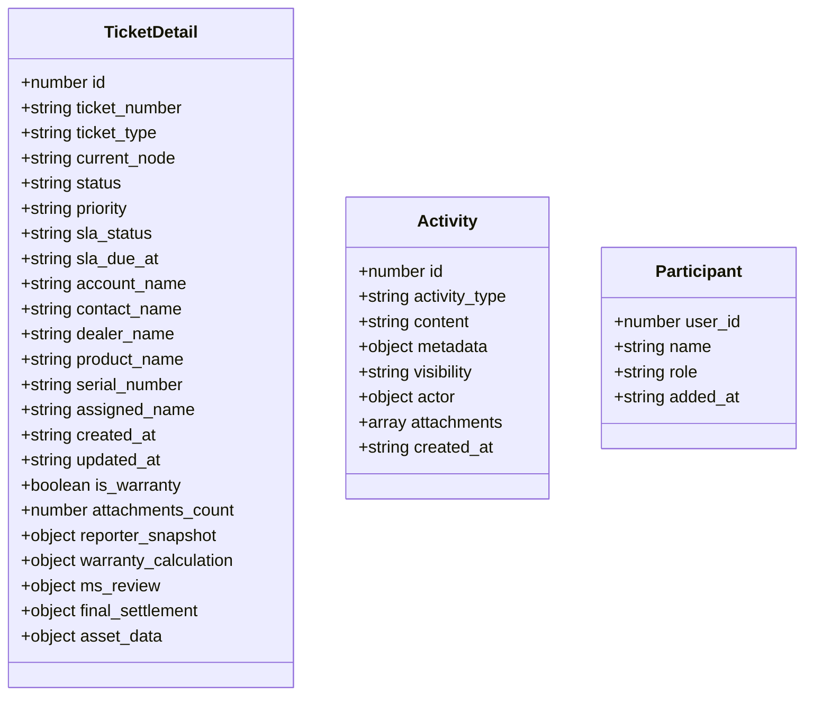
```mermaid
classDiagram
class TicketDetail {
+number id
+string ticket_number
+string ticket_type
+string current_node
+string status
+string priority
+string sla_status
+string sla_due_at
+string account_name
+string contact_name
+string dealer_name
+string product_name
+string serial_number
+string assigned_name
+string created_at
+string updated_at
+boolean is_warranty
+number attachments_count
+object reporter_snapshot
+object warranty_calculation
+object ms_review
+object final_settlement
+object asset_data
}
class Activity {
+number id
+string activity_type
+string content
+object metadata
+string visibility
+object actor
+array attachments
+string created_at
}
class Participant {
+number user_id
+string name
+string role
+string added_at
}
```

**图表来源**
- [UnifiedTicketDetail.tsx:58-95](file://client/src/components/Workspace/UnifiedTicketDetail.tsx#L58-L95)
- [TicketDetailComponents.tsx:77-105](file://client/src/components/Workspace/TicketDetailComponents.tsx#L77-L105)

#### 核心功能特性

1. **双栏布局设计**: 左侧70%主信息区，右侧30%上下文区
2. **响应式设计**: 支持不同屏幕尺寸的适配
3. **权限控制**: 基于 acting user 的阶梯式权限系统
4. **序列号状态驱动工作流**: 基于序列号状态的智能场景识别
5. **一键修正功能**: 核心字段的快速更正和审计追踪
6. **审计功能**: 完整的变更记录和审批流程
7. **工作流集成**: 支持 RMA、服务、咨询三种工单类型
8. **附件系统**: 完整的附件管理和预览功能
9. **关键节点编辑**: 支持直接编辑关键节点信息
10. **状态管理**: 统一的状态映射和节点流转控制
11. **活动时间轴**: 增强的关键节点检测和可视化
12. **智能场景识别**: 基于序列号状态的业务场景自动识别
13. **审计化修正**: 强制审计字段变更时的修正理由输入
14. **产品入库审计**: 增强的保修信息修改安全控制
15. **通知中心集成**: 实时通知管理和提醒功能
16. **参与者协作**: 工单成员邀请、转交和权限管理
17. **统一工单管理**: 三种工单类型的统一界面和交互体验
18. **新增** **定价架构支持**: 支持产品SKU、分类和族群管理
19. **新增** **保修信息管理**: 增强的保修注册和计算功能
20. **新增** **智能场景处理**: 四种业务场景的自动识别和处理
21. **更新** **增强的工单详情展示**: 更好的序列号状态显示和一键修正功能

**章节来源**
- [UnifiedTicketDetail.tsx:174-3538](file://client/src/components/Workspace/UnifiedTicketDetail.tsx#L174-L3538)

## 架构概览

统一工单详情采用模块化的架构设计，集成了通知中心和参与者协作机制：

```mermaid
graph TD
subgraph "用户界面层"
A[UnifiedTicketDetailPage]
B[UnifiedTicketDetail]
C[子组件集合]
D[AttachmentZone]
E[ActivityDetailDrawer]
F[MSReviewPanel]
G[ClosingHandoverModal]
H[RepairReportEditor]
I[ProductWarrantyRegistrationModal]
J[ProductModal]
K[AuditReasonModal]
L[ParticipantsSidebar]
M[NotificationBell]
N[NotificationCenter]
end
subgraph "状态管理层"
O[React Hooks]
P[useAuthStore]
Q[useUIStore]
R[useViewAs]
S[useToast]
T[useNotificationStore]
end
subgraph "数据访问层"
U[Axios API]
V[RESTful服务端]
end
subgraph "业务逻辑层"
W[权限验证]
X[工作流控制]
Y[审计记录]
Z[附件管理]
AA[状态管理]
BB[关键节点编辑]
CC[序列号状态驱动工作流]
DD[智能场景识别]
EE[一键修正功能]
FF[审计化修正]
GG[产品入库审计]
HH[通知管理]
II[参与者协作]
JJ[定价架构支持]
KK[保修信息管理]
LL[智能场景处理]
MM[增强的工单详情展示]
end
A --> B
B --> C
B --> D
B --> E
B --> F
B --> G
B --> H
B --> I
B --> J
B --> K
B --> L
B --> M
B --> N
B --> O
D --> O
O --> P
O --> Q
O --> R
O --> S
O --> T
B --> U
D --> U
U --> V
B --> W
B --> X
B --> Y
B --> Z
B --> AA
B --> BB
B --> CC
B --> DD
B --> EE
B --> FF
B --> GG
B --> HH
B --> II
B --> JJ
B --> KK
B --> LL
B --> MM
```

**图表来源**
- [UnifiedTicketDetail.tsx:174-3538](file://client/src/components/Workspace/UnifiedTicketDetail.tsx#L174-L3538)
- [TicketDetailComponents.tsx:1-2516](file://client/src/components/Workspace/TicketDetailComponents.tsx#L1-L2516)
- [AttachmentZone.tsx:1-108](file://client/src/components/Service/AttachmentZone.tsx#L1-L108)
- [AuditReasonModal.tsx:1-339](file://client/src/components/Service/AuditReasonModal.tsx#L1-L339)
- [ProductModal.tsx:1-975](file://client/src/components/Workspace/ProductModal.tsx#L1-L975)
- [ParticipantsSidebar.tsx:1-638](file://client/src/components/Workspace/ParticipantsSidebar.tsx#L1-L638)
- [NotificationCenter.tsx:1-440](file://client/src/components/Notifications/NotificationCenter.tsx#L1-L440)
- [NotificationBell.tsx:1-94](file://client/src/components/Notifications/NotificationBell.tsx#L1-L94)

## 详细组件分析

### 工单详情主视图组件

#### 权限控制系统

统一工单详情实现了复杂的权限控制机制，基于 acting user 进行权限判断：

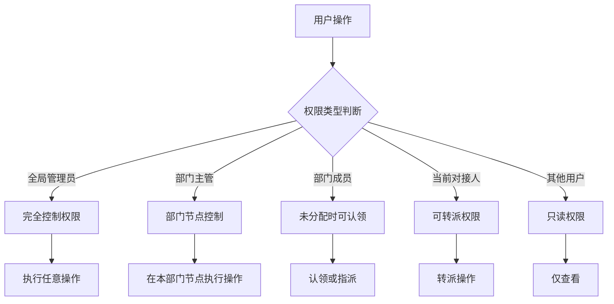
```mermaid
flowchart TD
A[用户操作] --> B{权限类型判断}
B --> |全局管理员| C[完全控制权限]
B --> |部门主管| D[部门节点控制]
B --> |部门成员| E[未分配时可认领]
B --> |当前对接人| F[可转派权限]
B --> |其他用户| G[只读权限]
C --> H[执行任意操作]
D --> I[在本部门节点执行操作]
E --> J[认领或指派]
F --> K[转派操作]
G --> L[仅查看]
```

**图表来源**
- [UnifiedTicketDetail.tsx:298-337](file://client/src/components/Workspace/UnifiedTicketDetail.tsx#L298-L337)

#### 工作流节点映射

不同工单类型的工作流节点映射：

| 工单类型 | 节点序列 |
|---------|----------|
| RMA | draft → submitted → op_receiving → op_diagnosing → ms_review → op_repairing → ms_closing → op_shipping → resolved |
| 服务 | draft → open → processing → resolved |
| 咨询 | open → waiting → open |

#### 关键节点编辑功能

统一工单详情支持关键节点的直接编辑功能：

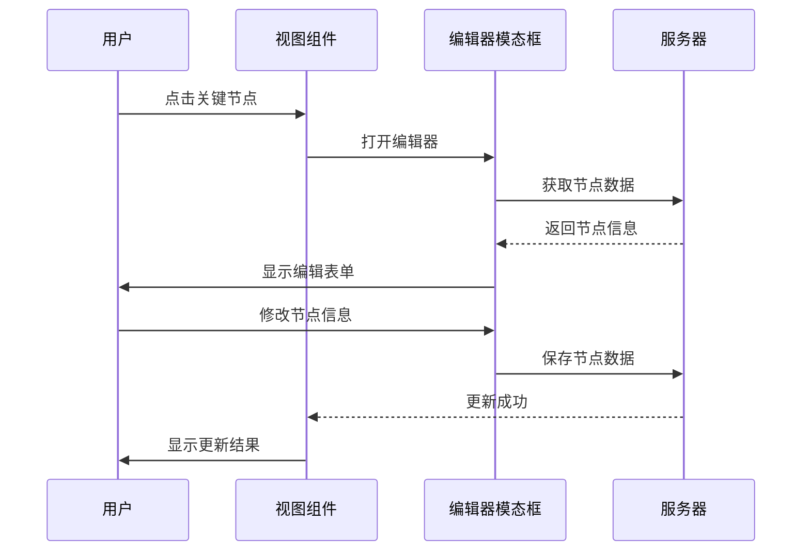
```mermaid
sequenceDiagram
participant U as 用户
participant V as 视图组件
participant M as 编辑器模态框
participant S as 服务器
U->>V : 点击关键节点
V->>M : 打开编辑器
M->>S : 获取节点数据
S-->>M : 返回节点信息
M->>U : 显示编辑表单
U->>M : 修改节点信息
M->>S : 保存节点数据
S-->>V : 更新成功
V->>U : 显示更新结果
```

**图表来源**
- [UnifiedTicketDetail.tsx:726-770](file://client/src/components/Workspace/UnifiedTicketDetail.tsx#L726-L770)

**章节来源**
- [UnifiedTicketDetail.tsx:106-129](file://client/src/components/Workspace/UnifiedTicketDetail.tsx#L106-L129)
- [UnifiedTicketDetail.tsx:298-337](file://client/src/components/Workspace/UnifiedTicketDetail.tsx#L298-L337)

### 活动时间轴组件

活动时间轴是工单详情的核心交互组件，提供了丰富的活动展示和操作功能：

#### 活动类型分类

| 活动类型 | 描述 | 图标 | 颜色 |
|---------|------|------|------|
| comment | 用户评论 | MessageSquare | 绿色 |
| status_change | 状态变更 | ArrowRight | 蓝色 |
| creation | 工单创建 | Plus | 蓝色 |
| assignment | 指派操作 | UserCheck | 黄色 |
| priority_change | 优先级变更 | AlertTriangle | 黄色 |
| mention | 提及操作 | AtSign | 紫色 |
| field_update | 字段更新 | Edit3 | 黄色 |
| diagnostic_report | 诊断报告 | Wrench | 绿色 |
| op_repair_report | 维修记录 | Wrench | 黄色 |
| soft_delete | 删除操作 | Trash2 | 红色 |
| key_node_op_receive | 收货入库节点 | Package | 绿色 |
| key_node_op_shipping | 发货节点 | Truck | 绿色 |
| key_node_ms_review | 商务审核节点 | CheckCircle | 绿色 |
| key_node_ms_closing | 结案确认节点 | CheckCircle | 绿色 |

#### 关键节点检测机制

系统能够智能识别和展示关键节点的完成状态：

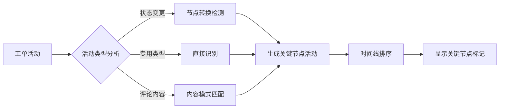
```mermaid
flowchart LR
A[工单活动] --> B{活动类型分析}
B --> |状态变更| C[节点转换检测]
B --> |专用类型| D[直接识别]
B --> |评论内容| E[内容模式匹配]
C --> F[生成关键节点活动]
D --> F
E --> F
F --> G[时间线排序]
G --> H[显示关键节点标记]
```

**图表来源**
- [TicketDetailComponents.tsx:422-595](file://client/src/components/Workspace/TicketDetailComponents.tsx#L422-L595)

#### 附件展示功能

活动时间轴中的附件展示功能支持多种文件类型，特别增强了 HEIC 图像格式的处理：

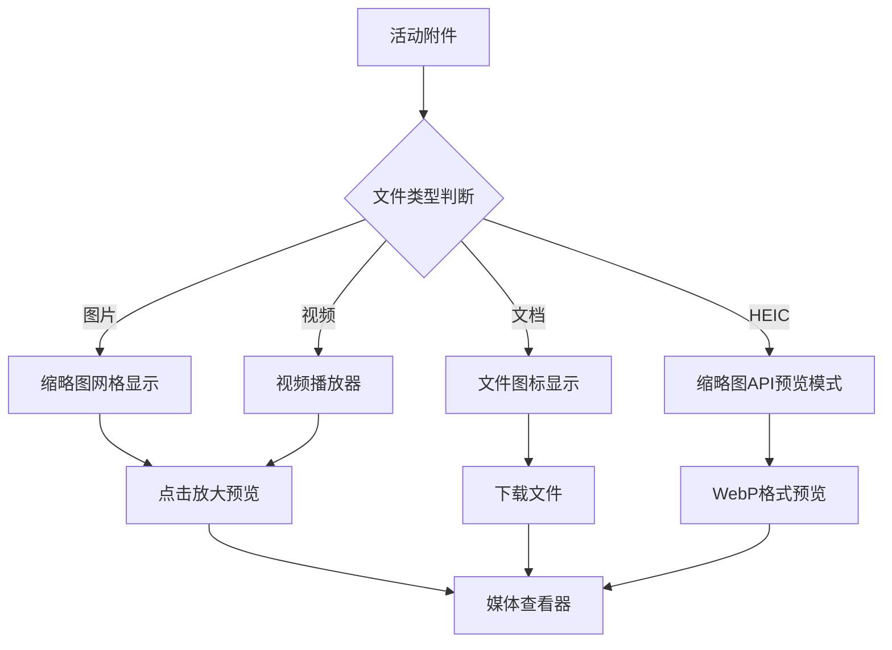
```mermaid
flowchart TD
A[活动附件] --> B{文件类型判断}
B --> |图片| C[缩略图网格显示]
B --> |视频| D[视频播放器]
B --> |文档| E[文件图标显示]
B --> |HEIC| F[缩略图API预览模式]
C --> G[点击放大预览]
D --> G
E --> H[下载文件]
F --> I[WebP格式预览]
G --> J[媒体查看器]
H --> J
I --> J
```

**图表来源**
- [TicketDetailComponents.tsx:2219-2384](file://client/src/components/Workspace/TicketDetailComponents.tsx#L2219-L2384)

**章节来源**
- [TicketDetailComponents.tsx:361-1115](file://client/src/components/Workspace/TicketDetailComponents.tsx#L361-L1115)

### 子组件集合

#### CollapsiblePanel - 可折叠面板

提供统一的面板样式和交互体验：

- 支持标题、图标、计数器显示
- 默认展开/收起状态控制
- 响应式设计适配

#### MediaLightbox - 媒体查看器

实现图片和视频的全屏预览功能：

- 支持键盘快捷键操作
- 平滑的动画过渡效果
- 自适应屏幕尺寸

#### MentionCommentInput - 提及评论输入

集成了用户提及功能的评论输入组件：

- 实时用户搜索和提及
- 附件上传支持
- 可见性控制选项

**章节来源**
- [TicketDetailComponents.tsx:120-157](file://client/src/components/Workspace/TicketDetailComponents.tsx#L120-L157)
- [TicketDetailComponents.tsx:286-359](file://client/src/components/Workspace/TicketDetailComponents.tsx#L286-L359)

### 附件上传区域组件

#### AttachmentZone - 附件上传区域

新增的附件上传组件，提供直观的文件拖拽上传功能：

- **拖拽支持**: 支持文件拖拽到指定区域
- **文件类型限制**: 限制为图片、视频、PDF、文本文件
- **预览功能**: 实时预览已选择的文件
- **移除功能**: 支持移除不需要的文件
- **响应式布局**: 根据文件数量自动调整网格布局

**章节来源**
- [AttachmentZone.tsx:1-108](file://client/src/components/Service/AttachmentZone.tsx#L1-L108)

### 审计化修正组件

#### AuditReasonModal - 审计化修正理由输入

新增的审计化修正组件，实现强制审计字段变更时的修正理由输入：

- **强制审计**: 核心字段变更时要求填写修正理由
- **对比显示**: 展示旧值和新值的对比
- **权限控制**: 仅管理员可进行特权修正
- **透明记录**: 所有修正都被记录到工单时间轴

**章节来源**
- [AuditReasonModal.tsx:1-339](file://client/src/components/Service/AuditReasonModal.tsx#L1-L339)

### 产品入库审计屏障

#### ProductModal - 产品信息管理

增强的产品信息管理组件，集成了审计屏障功能：

- **序列号自动匹配**: 根据序列号前缀自动匹配产品型号
- **系统设置集成**: 支持产品下拉设置的过滤
- **保修信息暂存**: 方案B：产品入库后处理暂存的保修数据
- **审计屏障**: 更改保修信息需要经过确认流程
- **计算引擎**: 提供保修计算规则的详细说明
- **新增** **定价架构支持**: 支持产品SKU、分类和族群管理
- **新增** **智能场景处理**: 根据序列号状态自动处理业务场景

**章节来源**
- [ProductModal.tsx:1-975](file://client/src/components/Workspace/ProductModal.tsx#L1-L975)

### 通知中心集成

#### NotificationBell - 通知铃铛入口

通知中心的入口组件，提供实时通知提醒：

- **未读计数**: 显示未读通知数量
- **动态刷新**: 支持系统设置的刷新间隔
- **悬停提示**: 显示通知状态和数量
- **点击切换**: 切换通知中心面板显示

#### NotificationCenter - 通知中心面板

完整的通知管理面板，提供通知的查看和管理功能：

- **分类标识**: 不同类型通知的图标和颜色标识
- **已读管理**: 支持单个和批量标记已读
- **点击跳转**: 点击通知自动跳转到相关页面
- **滚动加载**: 支持无限滚动加载更多通知
- **空状态**: 无通知时的友好提示

**章节来源**
- [NotificationBell.tsx:1-94](file://client/src/components/Notifications/NotificationBell.tsx#L1-L94)
- [NotificationCenter.tsx:1-440](file://client/src/components/Notifications/NotificationCenter.tsx#L1-L440)

### 参与者协作机制

#### ParticipantsSidebar - 协作者侧边栏

完整的参与者管理组件，支持工单成员的协作：

- **成员列表**: 显示所有协作者及其角色
- **邀请功能**: 支持邀请新成员加入工单
- **权限管理**: 不同角色具有不同的权限级别
- **转交功能**: 支持工单的转交操作
- **退出协作**: 支持成员退出工单讨论
- **搜索筛选**: 支持按姓名和部门搜索成员

**章节来源**
- [ParticipantsSidebar.tsx:1-638](file://client/src/components/Workspace/ParticipantsSidebar.tsx#L1-L638)

## 序列号状态驱动工作流

### 序列号状态检测机制

统一工单详情实现了基于序列号状态的智能工作流驱动：

#### 序列号状态识别

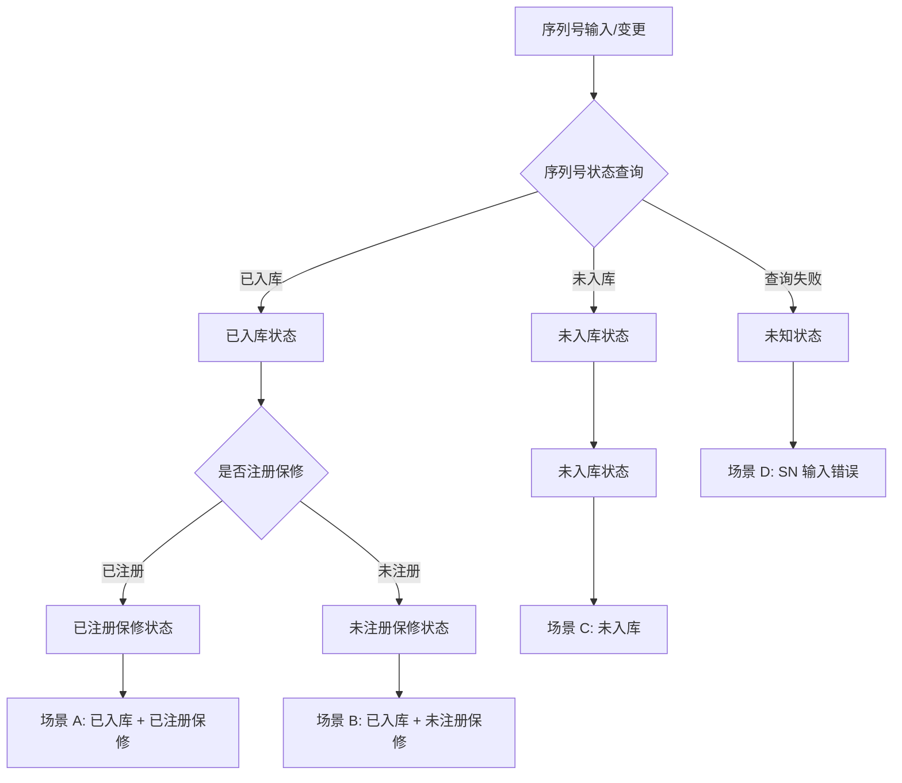
```mermaid
flowchart TD
A[序列号输入/变更] --> B{序列号状态查询}
B --> |已入库| C[已入库状态]
B --> |未入库| D[未入库状态]
B --> |查询失败| E[未知状态]
C --> F{是否注册保修}
F --> |已注册| G[已注册保修状态]
F --> |未注册| H[未注册保修状态]
D --> I[未入库状态]
G --> J[场景 A: 已入库 + 已注册保修]
H --> K[场景 B: 已入库 + 未注册保修]
I --> L[场景 C: 未入库]
E --> M[场景 D: SN 输入错误]
```

**图表来源**
- [UnifiedTicketDetail.tsx:346-357](file://client/src/components/Workspace/UnifiedTicketDetail.tsx#L346-L357)

#### 序列号状态驱动的界面响应

系统根据序列号状态自动调整界面元素：

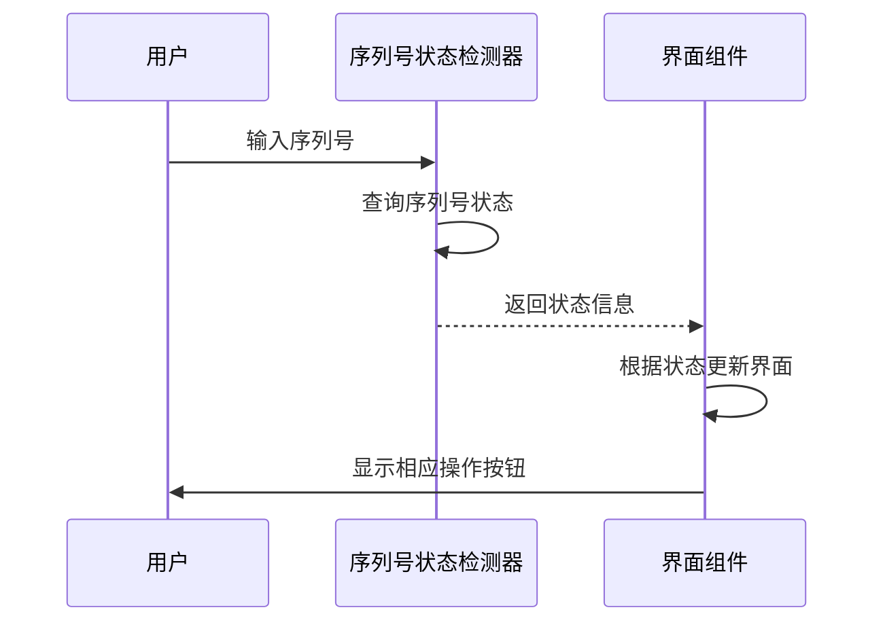
```mermaid
sequenceDiagram
participant U as 用户
participant S as 序列号状态检测器
participant UI as 界面组件
U->>S : 输入序列号
S->>S : 查询序列号状态
S-->>UI : 返回状态信息
UI->>UI : 根据状态更新界面
UI->>U : 显示相应操作按钮
```

**图表来源**
- [UnifiedTicketDetail.tsx:346-357](file://client/src/components/Workspace/UnifiedTicketDetail.tsx#L346-L357)

**章节来源**
- [UnifiedTicketDetail.tsx:346-357](file://client/src/components/Workspace/UnifiedTicketDetail.tsx#L346-L357)

## 智能场景识别系统

### 场景识别逻辑

系统实现了四种主要的业务场景识别：

#### 场景 A：已入库 + 已注册保修
- **界面显示**: 保修状态（在保/过保）+ 剩余天数
- **操作按钮**: 仅显示 SN 链接，无操作按钮
- **用户行为**: 可点击 SN 链接跳转到产品详情页

#### 场景 B：已入库 + 未注册保修
- **界面显示**: "保修待确认" (黄色警示)
- **操作按钮**: 显示 [注册保修] 按钮
- **用户行为**: 点击打开 `ProductWarrantyRegistrationModal` 录入销售信息

#### 场景 C：未入库
- **界面显示**: "保修未知" (橙色警示)
- **操作按钮**: 显示 [产品入库] 按钮
- **用户行为**: 点击打开 `ProductModal` (预填 SN + 型号)，入库成功后自动关联工单 product_id，刷新后变为场景 B

#### 场景 D：SN 输入错误
- **界面显示**: "保修未知"
- **操作按钮**: 无操作按钮（无法对错误 SN 入库）
- **用户行为**: 允许继续创建工单，后续通过"一键修正"修改 SN

**章节来源**
- [Service PRD_P2.md:440-461](file://docs/Service PRD_P2.md#L440-L461)

## 一键修正功能

### 一键修正机制

统一工单详情实现了核心字段的快速修正功能：

#### 一键修正触发条件

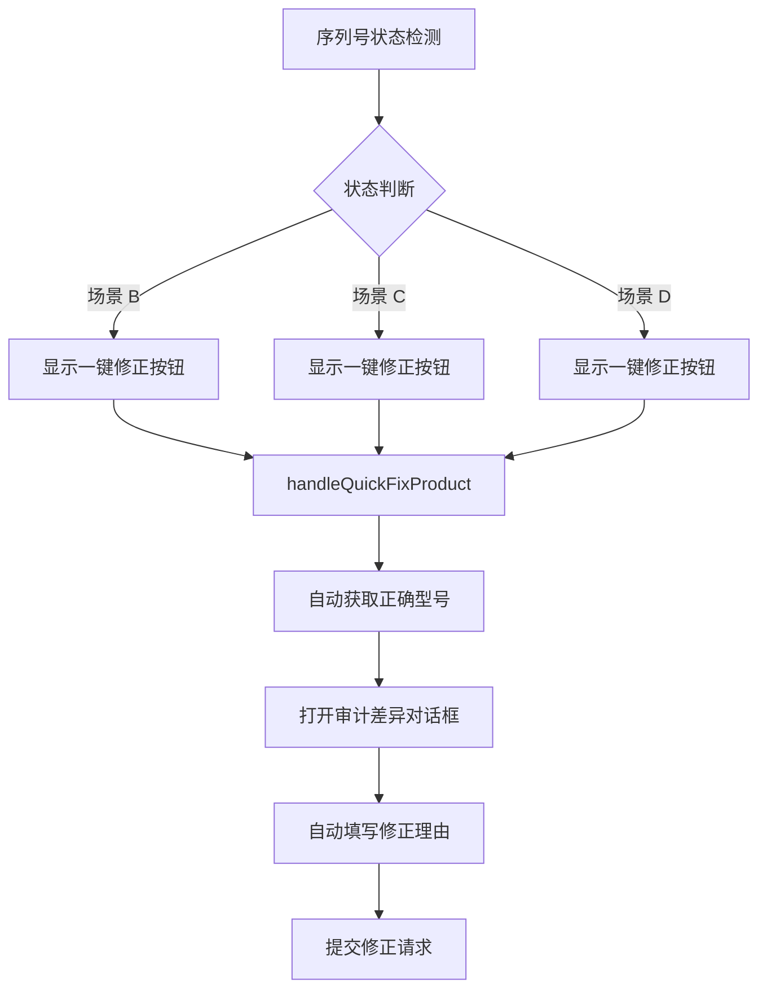
```mermaid
flowchart TD
A[序列号状态检测] --> B{状态判断}
B --> |场景 B| C[显示一键修正按钮]
B --> |场景 C| D[显示一键修正按钮]
B --> |场景 D| E[显示一键修正按钮]
C --> F[handleQuickFixProduct]
D --> F
E --> F
F --> G[自动获取正确型号]
G --> H[打开审计差异对话框]
H --> I[自动填写修正理由]
I --> J[提交修正请求]
```

**图表来源**
- [UnifiedTicketDetail.tsx:403-433](file://client/src/components/Workspace/UnifiedTicketDetail.tsx#L403-L433)

#### 一键修正实现流程

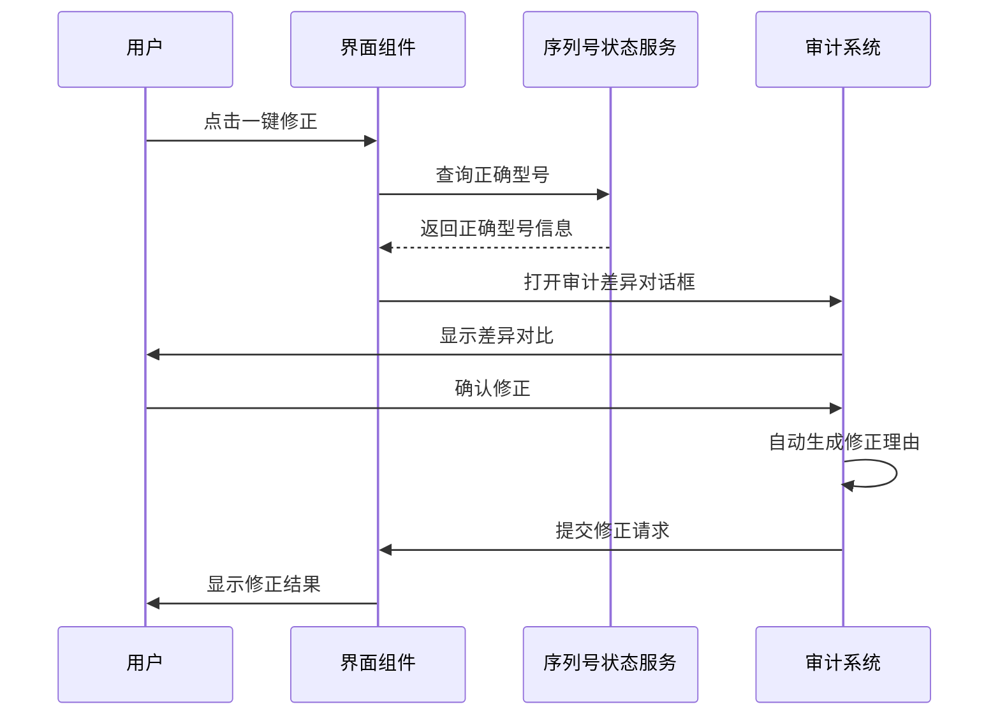
```mermaid
sequenceDiagram
participant U as 用户
participant UI as 界面组件
participant AS as 序列号状态服务
participant AUDIT as 审计系统
U->>UI : 点击一键修正
UI->>AS : 查询正确型号
AS-->>UI : 返回正确型号信息
UI->>AUDIT : 打开审计差异对话框
AUDIT->>U : 显示差异对比
U->>AUDIT : 确认修正
AUDIT->>AUDIT : 自动生成修正理由
AUDIT->>UI : 提交修正请求
UI->>U : 显示修正结果
```

**图表来源**
- [UnifiedTicketDetail.tsx:403-433](file://client/src/components/Workspace/UnifiedTicketDetail.tsx#L403-L433)

#### 一键修正权限控制

- **触发权限**: 仅当序列号状态为场景 B、C、D 时显示一键修正按钮
- **执行权限**: 需要具备相应的编辑权限
- **审计要求**: 自动检测风险字段并要求填写修正理由

**章节来源**
- [UnifiedTicketDetail.tsx:403-433](file://client/src/components/Workspace/UnifiedTicketDetail.tsx#L403-L433)

## 审计跟踪系统

### 核心数据变更声明

统一工单详情实现了严格的审计跟踪机制，要求对核心数据变更进行强制声明：

#### 审计字段识别

系统自动识别核心审计字段，包括：
- 序列号（serial_number）
- 产品型号（product_id）
- 优先级（priority）
- 状态（status）
- 问题简述（problem_summary）
- 详细描述（problem_description）
- 维修内容（repair_content）
- 金额（payment_amount）
- 保修判定（is_warranty）
- 处理记录（resolution）
- 当前节点（current_node）

#### 审计差异对比

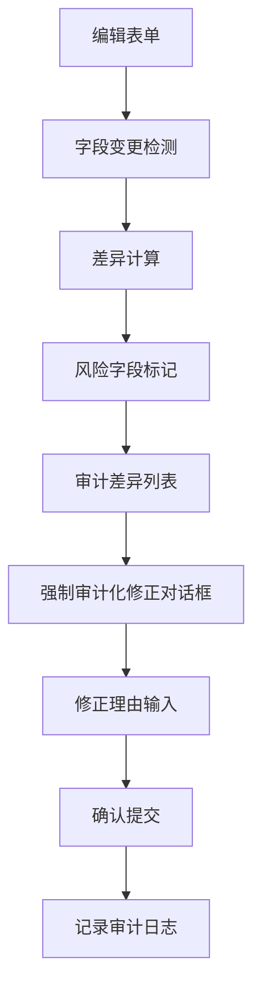
```mermaid
flowchart TD
A[编辑表单] --> B[字段变更检测]
B --> C[差异计算]
C --> D[风险字段标记]
D --> E[审计差异列表]
E --> F[强制审计化修正对话框]
F --> G[修正理由输入]
G --> H[确认提交]
H --> I[记录审计日志]
```

**图表来源**
- [UnifiedTicketDetail.tsx:473-516](file://client/src/components/Workspace/UnifiedTicketDetail.tsx#L473-L516)

#### 审计日志记录

所有核心数据变更都会在工单时间轴中永久记录：
- 变更字段名称和标签
- 旧值和新值的对比显示
- 变更时间和操作人
- 修正理由和审批状态
- 影响范围和风险等级

**章节来源**
- [UnifiedTicketDetail.tsx:2280-2342](file://client/src/components/Workspace/UnifiedTicketDetail.tsx#L2280-L2342)

## 状态管理功能

### 统一状态映射

系统实现了统一的工单状态映射机制，确保不同节点的一致性：

#### 节点到状态映射

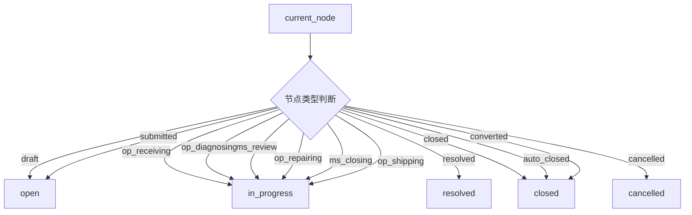
```mermaid
flowchart TD
A[current_node] --> B{节点类型判断}
B --> |draft| C[open]
B --> |submitted| C
B --> |op_receiving| D[in_progress]
B --> |op_diagnosing| D
B --> |ms_review| D
B --> |op_repairing| D
B --> |ms_closing| D
B --> |op_shipping| D
B --> |resolved| E[resolved]
B --> |closed| F[closed]
B --> |auto_closed| F
B --> |converted| F
B --> |cancelled| G[cancelled]
```

**图表来源**
- [tickets.js:377-405](file://server/service/routes/tickets.js#L377-L405)

#### 状态颜色编码

系统使用品牌色彩对不同状态进行视觉区分：
- **开放**: 蓝色 (#3B82F6)
- **进行中**: 紫色 (#8B5CF6)
- **等待**: 金色 (#FFD700)
- **已解决**: 绿色 (#10B981)
- **已关闭**: 绿色 (#10B981)
- **已废弃**: 灰色 (#6B7280)

**章节来源**
- [tickets.js:377-405](file://server/service/routes/tickets.js#L377-L405)

## 关键节点编辑

### 节点编辑器集成

统一工单详情提供了完整的节点编辑功能，支持多个关键节点的直接编辑：

#### 收货入库节点编辑

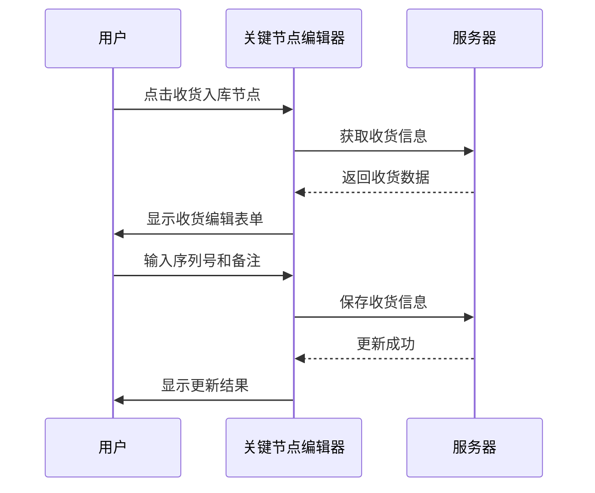
```mermaid
sequenceDiagram
participant U as 用户
participant V as 关键节点编辑器
participant S as 服务器
U->>V : 点击收货入库节点
V->>S : 获取收货信息
S-->>V : 返回收货数据
V->>U : 显示收货编辑表单
U->>V : 输入序列号和备注
V->>S : 保存收货信息
S-->>V : 更新成功
V->>U : 显示更新结果
```

**图表来源**
- [UnifiedTicketDetail.tsx:726-736](file://client/src/components/Workspace/UnifiedTicketDetail.tsx#L726-L736)

#### 发货信息节点编辑

支持多种发货方式的信息录入：
- 快递直发（express）
- 货代中转（forwarder）
- 客户自提（pickup）
- 合并发货（combined）

#### 商务审核节点编辑

提供详细的审核信息录入界面：
- 保修判定（in_warranty/out_warranty）
- 预估费用
- 审核备注
- 客户确认状态

#### 结案确认节点编辑

支持结案相关信息的录入：
- 发货方式
- 款项确认状态
- 实收金额
- 结案备注

**章节来源**
- [UnifiedTicketDetail.tsx:726-770](file://client/src/components/Workspace/UnifiedTicketDetail.tsx#L726-L770)

## 活动时间轴增强

### 关键节点可视化

活动时间轴新增了关键节点的可视化标识：

#### 重要节点标记

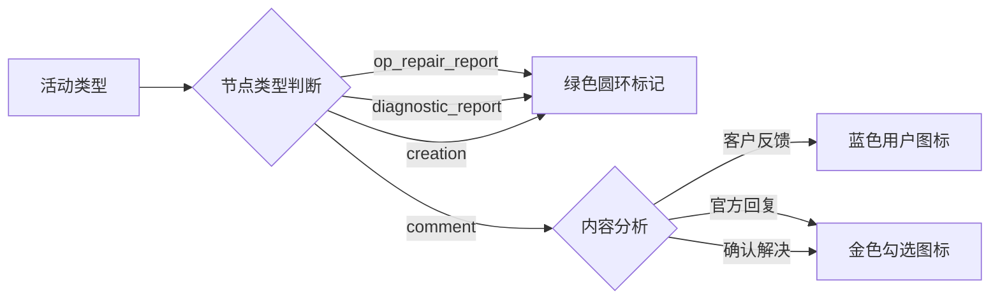
```mermaid
flowchart LR
A[活动类型] --> B{节点类型判断}
B --> |op_repair_report| C[绿色圆环标记]
B --> |diagnostic_report| C
B --> |creation| C
B --> |comment| D{内容分析}
D --> |客户反馈| E[蓝色用户图标]
D --> |官方回复| F[金色勾选图标]
D --> |确认解决| F
```

**图表来源**
- [TicketDetailComponents.tsx:741-758](file://client/src/components/Workspace/TicketDetailComponents.tsx#L741-L758)

#### 关键节点详情抽屉

点击关键节点可打开详细信息抽屉：
- 收货入库详情（序列号修正、收货备注）
- 发货信息详情（发货方式、快递单号、货代信息）
- 商务审核详情（保修判定、预估费用、审核备注）
- 结案确认详情（发货方式、款项确认、实收金额）

**章节来源**
- [TicketDetailComponents.tsx:822-948](file://client/src/components/Workspace/TicketDetailComponents.tsx#L822-L948)

## 权限控制系统

### acting User 权限模型

统一工单详情实现了基于 acting user 的精细化权限控制：

#### 权限层级结构

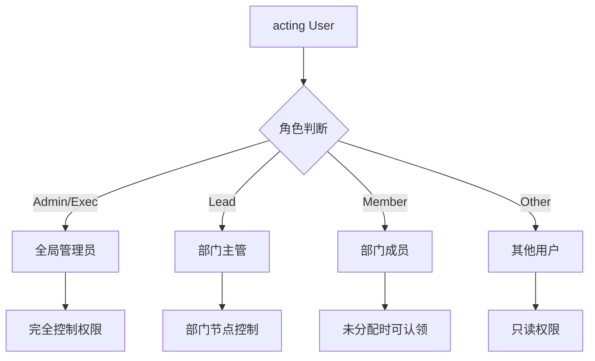
```mermaid
flowchart TD
A[acting User] --> B{角色判断}
B --> |Admin/Exec| C[全局管理员]
B --> |Lead| D[部门主管]
B --> |Member| E[部门成员]
B --> |Other| F[其他用户]
C --> G[完全控制权限]
D --> H[部门节点控制]
E --> I[未分配时可认领]
F --> J[只读权限]
```

**图表来源**
- [UnifiedTicketDetail.tsx:298-337](file://client/src/components/Workspace/UnifiedTicketDetail.tsx#L298-L337)

#### 部门节点权限

系统根据当前节点确定部门归属：
- **MS 节点**: draft, submitted, ms_review, ms_closing, waiting_customer, handling, awaiting_customer
- **OP 节点**: op_receiving, op_diagnosing, op_repairing, op_shipping, op_shipping_transit
- **GE 节点**: ge_review, ge_closing
- **RD 节点**: rd_consulting, rd_resolved

**章节来源**
- [UnifiedTicketDetail.tsx:304-323](file://client/src/components/Workspace/UnifiedTicketDetail.tsx#L304-L323)

## 附件系统

### 服务端接口实现

工单详情接口现已支持完整的附件返回，包括附件数组、附件计数和缩略图预览功能：

#### 附件数据结构

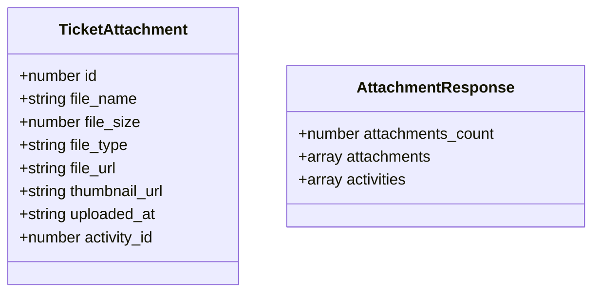
```mermaid
classDiagram
class TicketAttachment {
+number id
+string file_name
+number file_size
+string file_type
+string file_url
+string thumbnail_url
+string uploaded_at
+number activity_id
}
class AttachmentResponse {
+number attachments_count
+array attachments
+array activities
}
```

**图表来源**
- [tickets.js:1396-1400](file://server/service/routes/tickets.js#L1396-L1400)

#### 附件获取流程

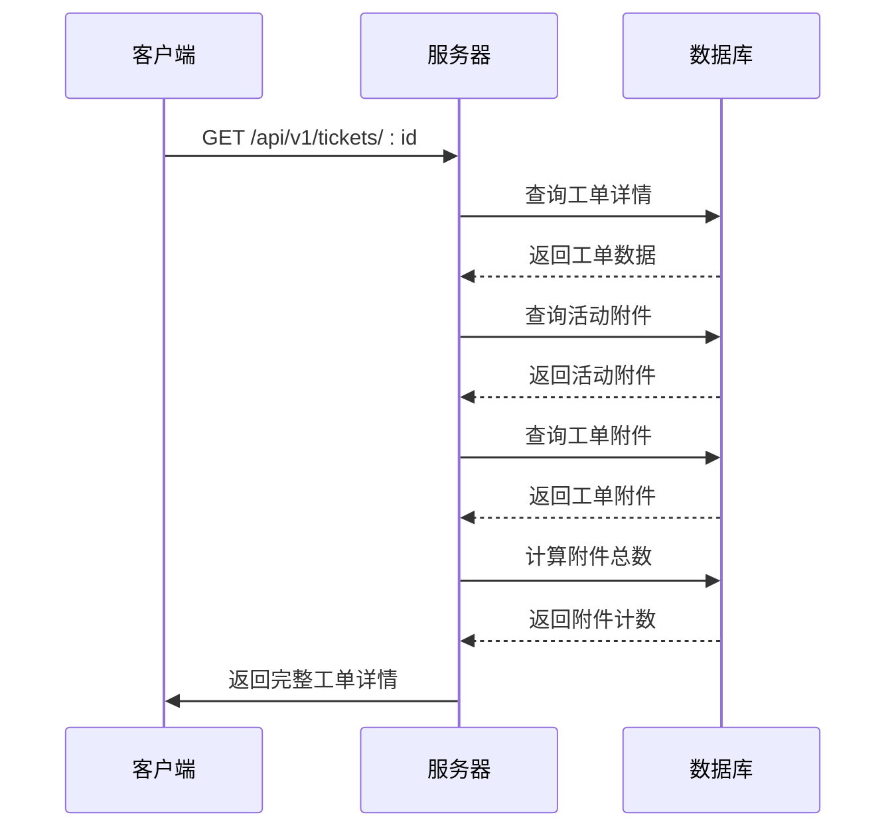
```mermaid
sequenceDiagram
participant C as 客户端
participant S as 服务器
participant DB as 数据库
C->>S : GET /api/v1/tickets/ : id
S->>DB : 查询工单详情
DB-->>S : 返回工单数据
S->>DB : 查询活动附件
DB-->>S : 返回活动附件
S->>DB : 查询工单附件
DB-->>S : 返回工单附件
S->>DB : 计算附件总数
DB-->>S : 返回附件计数
S->>C : 返回完整工单详情
```

**图表来源**
- [tickets.js:1315-1400](file://server/service/routes/tickets.js#L1315-L1400)

### 客户端附件处理

#### 附件状态管理

客户端通过 `ticketAttachments` 状态管理工单附件：

- **状态存储**: `useState<any[]>([])`
- **数据来源**: 从服务端接口获取
- **显示逻辑**: 基于 `attachments_count` 和 `ticketAttachments.length` 判断

#### 附件显示组件

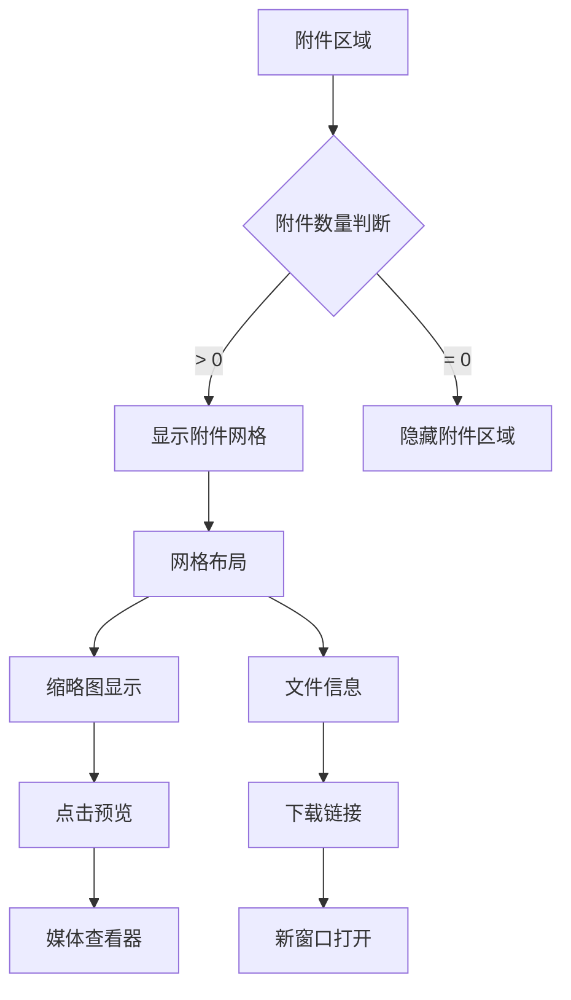
```mermaid
flowchart TD
A[附件区域] --> B{附件数量判断}
B --> |> 0| C[显示附件网格]
B --> |= 0| D[隐藏附件区域]
C --> E[网格布局]
E --> F[缩略图显示]
E --> G[文件信息]
F --> H[点击预览]
G --> I[下载链接]
H --> J[媒体查看器]
I --> K[新窗口打开]
```

**图表来源**
- [UnifiedTicketDetail.tsx:2208-2264](file://client/src/components/Workspace/UnifiedTicketDetail.tsx#L2208-L2264)

#### 缩略图生成机制

服务端支持动态缩略图生成，特别增强了 HEIC 图像格式的处理：

- **缩略图大小**: 400px (默认) 和 1200px (预览模式)
- **格式支持**: WebP (优先) 和 JPG (回退)
- **HEIC处理**: 使用 macOS 原生 sips 工具进行 HEIC/HEIF 转换，然后转换为 WebP 格式
- **EXIF支持**: 自动旋转和保留 EXIF 方向信息

**章节来源**
- [system.js:515-524](file://server/service/routes/system.js#L515-L524)
- [UnifiedTicketDetail.tsx:2242-2246](file://client/src/components/Workspace/UnifiedTicketDetail.tsx#L2242-L2246)

### 数据库结构支持

系统通过数据库迁移添加了附件计数支持：

- **新增列**: `attachments_count` INTEGER DEFAULT 0
- **数据填充**: 自动计算现有工单的附件数量
- **查询优化**: 提供快速的附件计数查询能力

**章节来源**
- [039_add_attachments_count.sql:1-11](file://server/migrations/039_add_attachments_count.sql#L1-L11)

## 产品入库审计屏障

### 审计屏障机制

产品入库审计屏障是新增的安全控制机制，用于保护保修信息的完整性：

#### 审计屏障触发条件

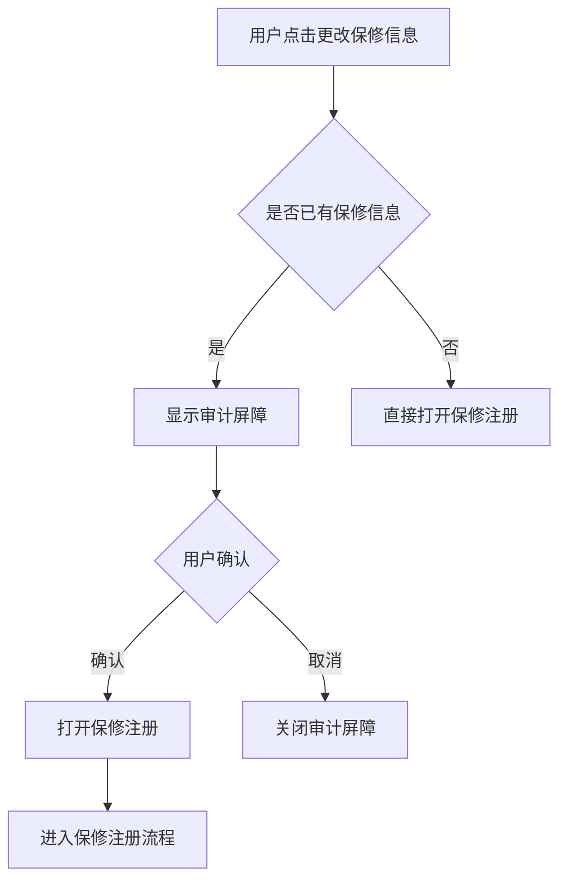
```mermaid
flowchart TD
A[用户点击更改保修信息] --> B{是否已有保修信息}
B --> |是| C[显示审计屏障]
B --> |否| D[直接打开保修注册]
C --> E{用户确认}
E --> |确认| F[打开保修注册]
E --> |取消| G[关闭审计屏障]
F --> H[进入保修注册流程]
```

**图表来源**
- [ProductModal.tsx:823-870](file://client/src/components/Workspace/ProductModal.tsx#L823-L870)

#### 审计屏障功能特性

- **5秒倒计时**: 用户需要确认理解更改保修信息的风险
- **审计记录**: 所有保修信息变更都会被记录在审计日志中
- **凭证要求**: 更改已有的保修信息需要合法有效的销售凭证
- **权限控制**: 仅授权用户可以进行保修信息变更

#### 保修信息暂存机制

系统实现了方案B的保修信息暂存机制：

```mermaid
flowchart TD
A[产品入库] --> B{是否已有保修信息}
B --> |是| C[直接保存产品信息]
B --> |否| D[暂存保修数据]
D --> E[保存产品信息]
E --> F[后台注册保修]
F --> G[完成入库流程]
```

**图表来源**
- [ProductModal.tsx:268-314](file://client/src/components/Workspace/ProductModal.tsx#L268-L314)

#### 新增** 定价架构支持

**更新** 系统现在支持新的定价架构和产品信息显示：

- **产品SKU管理**: 支持产品SKU的选择和关联
- **产品分类**: 支持Camera、EVF、Accessory三类产品分类
- **产品族群**: 支持A-E五个产品族群的管理
- **序列号前缀匹配**: 根据序列号自动匹配产品型号
- **系统设置集成**: 支持产品下拉设置的过滤和配置
- **智能场景处理**: 根据序列号状态自动处理四种业务场景

**章节来源**
- [ProductModal.tsx:823-870](file://client/src/components/Workspace/ProductModal.tsx#L823-L870)
- [ProductModal.tsx:268-314](file://client/src/components/Workspace/ProductModal.tsx#L268-L314)

## 通知中心集成

### 通知管理机制

统一工单详情集成了完整的通知中心系统，提供实时的通知管理和提醒功能：

#### 通知类型分类

系统支持多种通知类型，每种类型都有特定的图标和颜色标识：

| 通知类型 | 图标 | 颜色 | 描述 |
|---------|------|------|------|
| mention | @ | 蓝色 | 提及操作 |
| assignment | User+ | 蓝色 | 指派操作 |
| status_change | Info | 绿色 | 状态变更 |
| sla_warning | Warning | 黄色 | SLA 警告 |
| sla_breach | Warning | 红色 | SLA 逾期 |
| new_comment | Bell | 绿色 | 新评论 |
| participant_added | User+ | 蓝色 | 成员加入 |
| snooze_expired | Clock | 绿色 | 休眠到期 |
| system_announce | Info | 绿色 | 系统公告 |

#### 通知获取和管理

```mermaid
flowchart TD
A[用户点击通知铃铛] --> B{检查未读数量}
B --> |> 0| C[显示通知中心面板]
B --> |= 0| D[显示空状态]
C --> E[加载通知列表]
E --> F[显示通知项]
F --> G[用户点击通知]
G --> H[标记为已读]
H --> I[跳转到相关页面]
I --> J[关闭通知面板]
```

**图表来源**
- [NotificationCenter.tsx:238-298](file://client/src/components/Notifications/NotificationCenter.tsx#L238-L298)

#### 通知刷新机制

系统支持动态的刷新间隔设置，用户可以通过系统设置调整通知刷新频率：

- **默认间隔**: 30秒
- **动态调整**: 根据系统设置实时调整刷新间隔
- **轮询机制**: 使用定时器定期获取未读通知数量
- **事件监听**: 监听系统设置更新事件

**章节来源**
- [NotificationBell.tsx:1-94](file://client/src/components/Notifications/NotificationBell.tsx#L1-L94)
- [NotificationCenter.tsx:1-440](file://client/src/components/Notifications/NotificationCenter.tsx#L1-L440)

## 参与者协作机制

### 协作成员管理

统一工单详情实现了完整的参与者协作机制，支持工单成员的邀请、转交和权限管理：

#### 成员角色管理

系统支持四种不同的成员角色，每种角色具有不同的权限级别：

| 角色 | 图标 | 权限描述 | 操作限制 |
|------|------|----------|----------|
| owner | ⭐ | 创建者 | 查看、编辑、删除 |
| assignee | ✅ | 对接人 | 查看、编辑、评论、转交 |
| mentioned | 👥 | 协作中 | 查看、评论、提及 |
| follower | 👁️ | 关注者 | 查看、评论 |

#### 成员邀请流程

```mermaid
flowchart TD
A[用户点击邀请按钮] --> B{显示邀请下拉框}
B --> C[搜索可用成员]
C --> D[按常用度和部门分组]
D --> E[用户选择成员]
E --> F[发送邀请请求]
F --> G[更新参与者列表]
G --> H[显示邀请成功提示]
```

**图表来源**
- [ParticipantsSidebar.tsx:106-118](file://client/src/components/Workspace/ParticipantsSidebar.tsx#L106-L118)

#### 成员转交机制

系统支持工单的转交操作，确保工作流的连续性：

- **权限控制**: 仅对接人和管理员可执行转交
- **原因记录**: 转交时必须填写转交原因
- **通知机制**: 自动通知转交的相关人员
- **历史记录**: 转交历史会被记录在工单时间轴中

#### 成员退出协作

系统支持成员主动退出工单讨论：

- **确认机制**: 退出前需要确认操作
- **倒计时保护**: 3秒倒计时防止误操作
- **权限回收**: 退出后不再接收相关通知
- **历史记录**: 退出记录会被保存

**章节来源**
- [ParticipantsSidebar.tsx:1-638](file://client/src/components/Workspace/ParticipantsSidebar.tsx#L1-L638)

## 依赖关系分析

统一工单详情模块的依赖关系体现了清晰的层次结构：

```mermaid
graph TB
subgraph "外部依赖"
A[React]
B[axios]
C[lucide-react]
D[framer-motion]
E[react-dropzone]
F[sharp]
G[exifreader]
H[sharp-heic]
end
subgraph "状态管理"
I[useAuthStore]
J[useUIStore]
K[useViewAs]
L[useToast]
M[useNotificationStore]
end
subgraph "工具函数"
N[useLanguage]
O[useNavigationState]
P[useResumableUpload]
end
subgraph "核心组件"
Q[UnifiedTicketDetailPage]
R[UnifiedTicketDetail]
S[TicketDetailComponents]
T[AttachmentZone]
U[ActivityDetailDrawer]
V[MSReviewPanel]
W[ClosingHandoverModal]
X[RepairReportEditor]
Y[ProductWarrantyRegistrationModal]
Z[ProductModal]
AA[AuditReasonModal]
BB[ParticipantsSidebar]
CC[NotificationBell]
DD[NotificationCenter]
end
A --> Q
B --> R
C --> R
D --> S
E --> T
F --> R
G --> R
H --> R
I --> R
J --> R
K --> R
L --> R
M --> R
N --> R
O --> R
P --> R
Q --> R
R --> S
R --> T
R --> U
R --> V
R --> W
R --> X
R --> Y
R --> Z
R --> AA
R --> BB
R --> CC
R --> DD
S --> AE[CollapsiblePanel]
S --> AF[MediaLightbox]
S --> AG[ActivityTimeline]
S --> AH[ParticipantsPanel]
S --> AI[TicketInfoCard]
```

**图表来源**
- [UnifiedTicketDetailPage.tsx:8-28](file://client/src/components/Service/UnifiedTicketDetailPage.tsx#L8-L28)
- [UnifiedTicketDetail.tsx:10-35](file://client/src/components/Workspace/UnifiedTicketDetail.tsx#L10-L35)
- [AttachmentZone.tsx:2-4](file://client/src/components/Service/AttachmentZone.tsx#L2-L4)
- [AuditReasonModal.tsx:8-10](file://client/src/components/Service/AuditReasonModal.tsx#L8-L10)
- [ProductModal.tsx:1-7](file://client/src/components/Workspace/ProductModal.tsx#L1-L7)
- [ParticipantsSidebar.tsx:1-6](file://client/src/components/Workspace/ParticipantsSidebar.tsx#L1-L6)
- [NotificationCenter.tsx:1-5](file://client/src/components/Notifications/NotificationCenter.tsx#L1-L5)
- [NotificationBell.tsx:1-6](file://client/src/components/Notifications/NotificationBell.tsx#L1-L6)

**章节来源**
- [UnifiedTicketDetailPage.tsx:8-38](file://client/src/components/Service/UnifiedTicketDetailPage.tsx#L8-L38)
- [UnifiedTicketDetail.tsx:10-35](file://client/src/components/Workspace/UnifiedTicketDetail.tsx#L10-L35)
- [AttachmentZone.tsx:1-108](file://client/src/components/Service/AttachmentZone.tsx#L1-L108)
- [AuditReasonModal.tsx:1-339](file://client/src/components/Service/AuditReasonModal.tsx#L1-L339)
- [ProductModal.tsx:1-975](file://client/src/components/Workspace/ProductModal.tsx#L1-L975)
- [ParticipantsSidebar.tsx:1-638](file://client/src/components/Workspace/ParticipantsSidebar.tsx#L1-L638)
- [NotificationCenter.tsx:1-440](file://client/src/components/Notifications/NotificationCenter.tsx#L1-L440)
- [NotificationBell.tsx:1-94](file://client/src/components/Notifications/NotificationBell.tsx#L1-L94)

## 性能考虑

统一工单详情在设计时充分考虑了性能优化：

### 并行数据加载

系统采用并行请求策略来提升加载速度：

- 工单详情数据
- 系统设置配置
- 文档存在性检查
- 参与者和附件信息
- 序列号状态查询

### 懒加载策略

- 子组件按需加载
- 图片和媒体资源延迟加载
- 附件缩略图优化

### 缓存机制

- 本地状态缓存
- API 响应缓存
- 用户权限缓存
- 序列号状态缓存
- 通知状态缓存
- **新增** 产品模型和SKU缓存
- **更新** 增强的工单详情展示缓存

### 附件性能优化

- **缩略图缓存**: 服务端生成并缓存缩略图，支持 WebP 格式优化
- **HEIC优化**: 使用预览模式减少内存占用，macOS 系统使用原生 sips 工具处理
- **懒加载**: 附件网格按需渲染，图片加载时显示加载指示器
- **条件预览**: HEIC 图像自动使用缩略图 API 的预览模式
- **拖拽上传**: react-dropzone 提供高效的文件拖拽处理
- **审计差异计算**: 前端智能比较字段变化，避免不必要的重渲染
- **序列号状态缓存**: 避免重复查询相同的序列号状态
- **审计屏障防抖**: 防止重复触发审计确认流程
- **通知轮询优化**: 动态刷新间隔，减少不必要的轮询请求
- **参与者搜索缓存**: 本地缓存用户搜索结果，提升搜索响应速度
- **产品模型预加载**: 预加载产品模型和SKU数据，提升序列号匹配速度
- **智能场景缓存**: 缓存序列号状态和场景识别结果
- **增强的工单详情展示优化**: 优化序列号状态显示和一键修正功能的性能

## 故障排除指南

### 常见问题及解决方案

#### 工单加载失败

**症状**: 工单详情页面显示错误信息

**可能原因**:
- 网络连接异常
- 工单 ID 无效
- 权限不足

**解决步骤**:
1. 检查网络连接状态
2. 验证工单 ID 格式
3. 确认用户权限级别
4. 刷新页面重试

#### 权限相关问题

**症状**: 无法执行某些操作或看到受限内容

**解决方法**:
- 检查用户所属部门和角色
- 验证当前工单节点权限
- 确认 acting user 设置

#### 性能问题

**症状**: 页面加载缓慢或响应迟滞

**优化建议**:
- 清理浏览器缓存
- 关闭不必要的标签页
- 检查网络带宽
- 减少同时打开的工单数量

#### 附件相关问题

**症状**: 附件无法显示或下载失败

**可能原因**:
- 文件权限问题
- 缩略图生成失败
- 网络连接中断
- HEIC 格式兼容性问题
- 拖拽上传失败

**解决步骤**:
1. 检查文件权限设置
2. 验证缩略图缓存目录
3. 确认网络连接稳定
4. 清理浏览器缓存
5. 对于 HEIC 文件，检查系统是否支持 sips 工具
6. 检查 react-dropzone 是否正常工作

#### 序列号状态识别问题

**症状**: 序列号状态识别不准确或按钮显示异常

**可能原因**:
- 序列号查询服务不可用
- 序列号格式不正确
- 缓存数据过期

**解决步骤**:
1. 检查序列号查询服务状态
2. 验证序列号格式是否符合要求
3. 清理序列号状态缓存
4. 重新输入序列号进行测试

#### 一键修正功能问题

**症状**: 一键修正按钮不可用或修正失败

**可能原因**:
- 序列号状态不符合一键修正条件
- 用户权限不足
- 系统服务异常

**解决步骤**:
1. 检查当前序列号状态是否符合一键修正条件
2. 验证用户是否具备相应的编辑权限
3. 检查系统服务是否正常运行
4. 尝试手动修正核心字段

#### 审计跟踪问题

**症状**: 核心数据变更未被正确记录

**解决步骤**:
1. 检查是否选择了正确的审计字段
2. 确认修正理由是否填写
3. 验证用户权限是否足够
4. 检查网络连接状态
5. 重新尝试提交操作

#### 审计化修正问题

**症状**: 审计化修正弹窗无法正常显示或提交失败

**可能原因**:
- 审计字段检测异常
- 修正理由为空
- 权限不足

**解决步骤**:
1. 检查是否选择了需要审计的核心字段
2. 确认修正理由是否至少5个字符
3. 验证用户是否具备审计权限
4. 检查网络连接状态
5. 重新尝试提交操作

#### 产品入库审计屏障问题

**症状**: 更改保修信息时无法通过审计屏障

**可能原因**:
- 审计屏障倒计时未完成
- 用户未确认理解风险
- 权限不足

**解决步骤**:
1. 等待5秒倒计时完成
2. 确认理解更改保修信息的风险
3. 验证用户是否具备更改保修信息的权限
4. 检查系统设置中的产品下拉配置
5. 重新尝试操作

#### 通知中心问题

**症状**: 通知无法正常显示或刷新

**可能原因**:
- 通知服务异常
- 浏览器通知权限未授权
- 网络连接问题
- 刷新间隔设置异常

**解决步骤**:
1. 检查通知服务状态
2. 验证浏览器通知权限
3. 确认网络连接正常
4. 检查系统设置中的刷新间隔
5. 重新加载页面

#### 参与者协作问题

**症状**: 成员邀请、转交或退出功能异常

**可能原因**:
- 用户权限不足
- 网络连接问题
- 服务器响应异常
- 搜索功能异常

**解决步骤**:
1. 验证当前用户的权限级别
2. 检查网络连接状态
3. 确认服务器响应正常
4. 尝试清除搜索缓存
5. 重新登录系统

#### 定价架构问题

**症状**: 产品SKU、分类或族群选择异常

**可能原因**:
- 产品模型数据加载失败
- 系统设置配置错误
- 序列号前缀匹配失败
- 缓存数据过期

**解决步骤**:
1. 检查产品模型和SKU数据加载状态
2. 验证系统设置中的产品下拉配置
3. 确认序列号前缀是否正确
4. 清理产品数据缓存
5. 重新加载页面

#### 保修信息管理问题

**症状**: 保修注册或计算功能异常

**可能原因**:
- 保修计算服务异常
- 销售凭证上传失败
- 产品信息不完整
- 权限不足

**解决步骤**:
1. 检查保修计算服务状态
2. 验证销售凭证文件格式和大小
3. 确认产品信息是否完整
4. 验证用户是否具备保修管理权限
5. 重新尝试操作

#### 增强的工单详情展示问题

**症状**: 序列号状态显示异常或一键修正功能失效

**可能原因**:
- 序列号状态缓存过期
- 一键修正权限不足
- 服务端状态查询异常
- 前端状态更新失败

**解决步骤**:
1. 检查序列号状态缓存是否过期
2. 验证用户权限是否具备一键修正功能
3. 确认服务端序列号状态查询是否正常
4. 清理前端状态缓存并重新加载
5. 检查网络连接状态

**章节来源**
- [UnifiedTicketDetail.tsx:917-931](file://client/src/components/Workspace/UnifiedTicketDetail.tsx#L917-L931)

## 结论

统一工单详情模块是 Longhorn 工单管理系统的重要组成部分，通过精心设计的架构和丰富的功能特性，为用户提供了完整的工单管理体验。该模块不仅实现了统一的界面风格和交互体验，更重要的是建立了一套完善的权限控制和审计机制，确保了工单处理过程的透明性和可追溯性。

**更新** UnifiedTicketDetail 组件的增强显著提升了工单详情展示的质量，特别是在序列号状态显示和一键修正功能方面。新增的序列号状态检测机制能够智能识别四种业务场景（已入库+已注册保修、已入库+未注册保修、未入库、SN 输入错误），并提供相应的操作按钮和界面响应。增强的保修状态显示包括在保/过保状态的颜色标识和剩余天数显示，以及针对不同场景的交互按钮（注册保修、产品入库）。一键修正功能的改进使得用户能够更便捷地修正序列号等核心字段，系统会自动检测风险字段并要求填写修正理由。

新增的通知中心系统显著提升了用户的协作效率，提供了实时的通知管理和提醒功能，包括分类标识、已读管理和自动跳转等特性。参与者协作机制的引入使得团队协作更加便捷，支持成员邀请、转交和权限管理等功能。活动时间轴功能的增强提供了更直观的工作流状态展示，关键节点检测和可视化标识让用户能够快速了解工单进展。三种工单类型的统一管理体验得到了完善，提供了一致的界面和交互体验。审计化修正功能的改进实现了强制审计字段变更时的修正理由输入，确保所有核心数据变更都有明确的审计记录。序列号状态驱动工作流的优化显著提升了系统的智能化水平，能够根据序列号的实际状态自动识别业务场景并提供相应的操作建议。

**新增** 支持新的定价架构和产品信息显示功能，包括产品SKU、分类和族群管理，以及增强的保修信息管理。序列号状态驱动的智能场景识别系统能够自动处理四种业务场景，提供一键修正和自动化的工单处理流程。这些新增功能进一步强化了系统的智能化和自动化水平，为企业的工单管理提供了强有力的技术保障。

模块的主要优势包括：

1. **统一性**: 支持多种工单类型的统一展示
2. **权限控制**: 基于 acting user 的精细权限管理
3. **序列号状态驱动**: 基于序列号状态的智能场景识别
4. **一键修正**: 核心字段的快速更正和审计追踪
5. **审计功能**: 完整的变更记录和审批流程
6. **用户体验**: macOS26 风格的现代化界面设计
7. **扩展性**: 模块化的架构便于功能扩展和维护
8. **附件管理**: 完整的附件上传、存储和预览功能
9. **格式兼容**: 支持多种文件格式，包括现代图像格式
10. **性能优化**: 智能的缩略图缓存和懒加载机制
11. **拖拽上传**: 直观的文件拖拽上传体验
12. **关键节点编辑**: 支持直接编辑收货入库、发货信息、商务审核、结案确认等关键节点
13. **状态管理**: 统一的状态映射和节点流转控制
14. **活动时间轴增强**: 关键节点检测和可视化标识
15. **响应式设计**: 适配不同屏幕尺寸的设备
16. **审计化修正**: 强制审计字段变更时的修正理由输入
17. **产品入库审计**: 增强的保修信息修改安全控制
18. **系统设置集成**: 支持产品下拉设置的过滤和配置
19. **保修信息暂存**: 方案B：产品入库后处理暂存的保修数据
20. **计算引擎**: 提供保修计算规则的详细说明
21. **通知中心集成**: 实时通知管理和提醒功能
22. **参与者协作**: 工单成员邀请、转交和权限管理
23. **统一工单管理**: 三种工单类型的统一界面和交互体验
24. **通知管理**: 分类标识、已读管理和自动跳转
25. **成员管理**: 四种角色权限和操作限制
26. **协作效率**: 提升团队协作和沟通效率
27. **新增** **定价架构支持**: 支持产品SKU、分类和族群管理
28. **新增** **智能场景处理**: 四种业务场景的自动识别和处理
29. **新增** **序列号状态驱动**: 基于序列号状态的智能场景识别
30. **新增** **产品信息管理**: 增强的产品信息显示和管理功能
31. **更新** **增强的工单详情展示**: 更好的序列号状态显示和一键修正功能

该模块的成功实施为整个工单管理系统的稳定运行奠定了坚实基础，为后续的功能扩展和性能优化提供了良好的技术支撑。新增的通知中心系统、参与者协作机制、审计化修正功能、定价架构支持、智能场景处理功能以及增强的工单详情展示功能进一步强化了系统的智能化和自动化水平，为企业的工单管理提供了强有力的技术保障。