# 统一工单详情

<cite>
**本文档引用的文件**
- [UnifiedTicketDetailPage.tsx](file://client/src/components/Service/UnifiedTicketDetailPage.tsx)
- [UnifiedTicketDetail.tsx](file://client/src/components/Workspace/UnifiedTicketDetail.tsx)
- [TicketDetailComponents.tsx](file://client/src/components/Workspace/TicketDetailComponents.tsx)
- [AttachmentZone.tsx](file://client/src/components/Service/AttachmentZone.tsx)
- [tickets.js](file://server/service/routes/tickets.js)
- [system.js](file://server/service/routes/system.js)
- [039_add_attachments_count.sql](file://server/migrations/039_add_attachments_count.sql)
</cite>

## 更新摘要
**变更内容**
- 新增审计跟踪功能，支持核心数据变更的强制声明和记录
- 增强状态管理功能，实现统一的工单状态映射和节点流转控制
- 完善关键节点编辑功能，支持收货入库、发货信息、商务审核、结案确认等节点的直接编辑
- 优化活动时间轴，新增关键节点检测和可视化标识
- 强化权限控制系统，基于 acting user 的精细化权限管理

## 目录
1. [简介](#简介)
2. [项目结构](#项目结构)
3. [核心组件](#核心组件)
4. [架构概览](#架构概览)
5. [详细组件分析](#详细组件分析)
6. [审计跟踪系统](#审计跟踪系统)
7. [状态管理功能](#状态管理功能)
8. [关键节点编辑](#关键节点编辑)
9. [活动时间轴增强](#活动时间轴增强)
10. [权限控制系统](#权限控制系统)
11. [附件系统](#附件系统)
12. [依赖关系分析](#依赖关系分析)
13. [性能考虑](#性能考虑)
14. [故障排除指南](#故障排除指南)
15. [结论](#结论)

## 简介

统一工单详情是 Longhorn 工单管理系统中的核心功能模块，为所有类型的工单（RMA、服务、咨询）提供统一的详情展示界面。该模块实现了 macOS26 风格的双栏布局设计，左侧为主信息区，右侧为协作者和客户上下文区，支持完整的工单生命周期管理和审计功能。

**更新** 新增的审计跟踪功能实现了核心数据变更的强制声明机制，所有涉及关键字段的修改都会在工单时间轴中永久记录。状态管理功能提供了统一的工单状态映射和节点流转控制，确保不同工单类型的一致性体验。关键节点编辑功能允许用户直接编辑收货入库、发货信息、商务审核、结案确认等关键节点的详细信息，大大提升了工作效率。

## 项目结构

统一工单详情功能主要由三个核心文件组成，并新增了审计跟踪和状态管理相关组件：

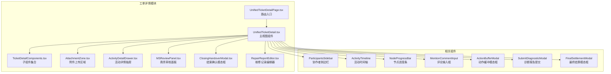

**图表来源**
- [UnifiedTicketDetailPage.tsx:1-38](file://client/src/components/Service/UnifiedTicketDetailPage.tsx#L1-L38)
- [UnifiedTicketDetail.tsx:1-3366](file://client/src/components/Workspace/UnifiedTicketDetail.tsx#L1-L3366)
- [TicketDetailComponents.tsx:1-2318](file://client/src/components/Workspace/TicketDetailComponents.tsx#L1-L2318)
- [AttachmentZone.tsx:1-108](file://client/src/components/Service/AttachmentZone.tsx#L1-L108)

**章节来源**
- [UnifiedTicketDetailPage.tsx:1-38](file://client/src/components/Service/UnifiedTicketDetailPage.tsx#L1-L38)
- [UnifiedTicketDetail.tsx:1-3366](file://client/src/components/Workspace/UnifiedTicketDetail.tsx#L1-L3366)
- [TicketDetailComponents.tsx:1-2318](file://client/src/components/Workspace/TicketDetailComponents.tsx#L1-L2318)
- [AttachmentZone.tsx:1-108](file://client/src/components/Service/AttachmentZone.tsx#L1-L108)

## 核心组件

### UnifiedTicketDetailPage - 路由入口

统一工单详情页面的路由入口组件，负责接收 URL 参数并传递给主视图组件：

- **路由路径**: `/service/tickets/:id`
- **参数处理**: 解析工单 ID 和上下文参数
- **场景支持**: my_tasks、team_queue、mentioned、search、archive
- **导航集成**: 提供返回上一页的功能

### UnifiedTicketDetail - 主视图组件

核心工单详情展示组件，实现完整的双栏布局和交互功能：

#### 数据结构定义

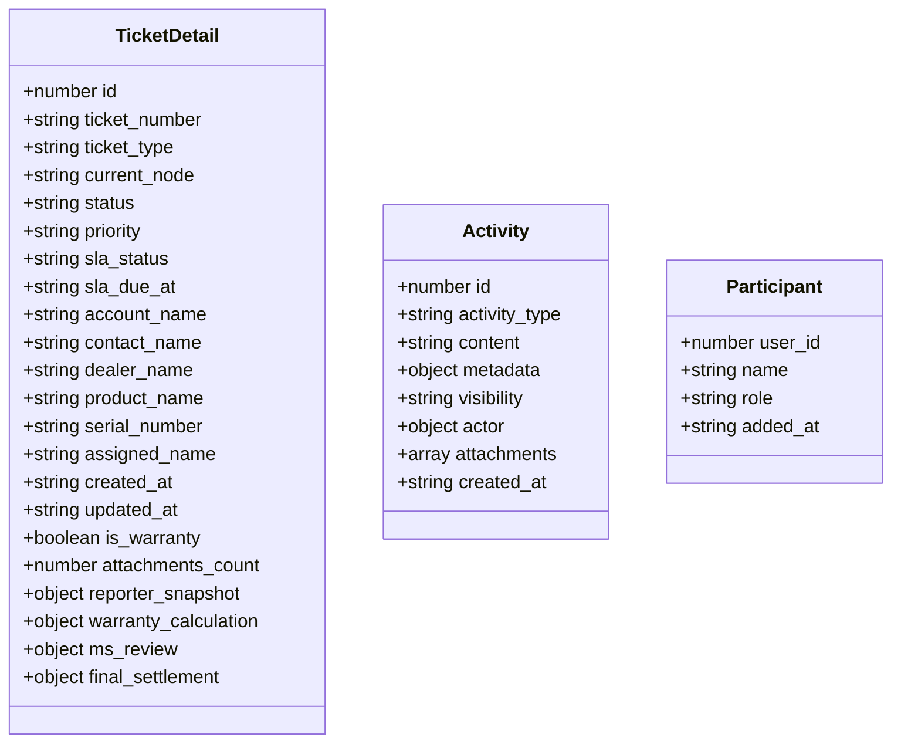

**图表来源**
- [UnifiedTicketDetail.tsx:39-75](file://client/src/components/Workspace/UnifiedTicketDetail.tsx#L39-L75)
- [TicketDetailComponents.tsx:22-50](file://client/src/components/Workspace/TicketDetailComponents.tsx#L22-L50)

#### 核心功能特性

1. **双栏布局设计**: 左侧70%主信息区，右侧30%上下文区
2. **响应式设计**: 支持不同屏幕尺寸的适配
3. **权限控制**: 基于 acting user 的阶梯式权限系统
4. **审计功能**: 完整的变更记录和审批流程
5. **工作流集成**: 支持 RMA、服务、咨询三种工单类型
6. **附件系统**: 完整的附件管理和预览功能
7. **关键节点编辑**: 支持直接编辑关键节点信息
8. **状态管理**: 统一的状态映射和节点流转控制
9. **活动时间轴**: 增强的关键节点检测和可视化
10. **审计跟踪**: 核心数据变更的强制声明机制

**章节来源**
- [UnifiedTicketDetail.tsx:143-3366](file://client/src/components/Workspace/UnifiedTicketDetail.tsx#L143-L3366)

## 架构概览

统一工单详情采用模块化的架构设计，实现了清晰的关注点分离：

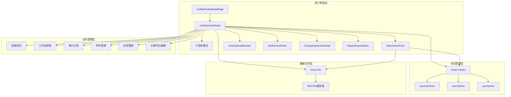

**图表来源**
- [UnifiedTicketDetail.tsx:143-3366](file://client/src/components/Workspace/UnifiedTicketDetail.tsx#L143-L3366)
- [TicketDetailComponents.tsx:1-2318](file://client/src/components/Workspace/TicketDetailComponents.tsx#L1-L2318)
- [AttachmentZone.tsx:1-108](file://client/src/components/Service/AttachmentZone.tsx#L1-L108)

## 详细组件分析

### 工单详情主视图组件

#### 权限控制系统

统一工单详情实现了复杂的权限控制机制，基于 acting user 进行权限判断：

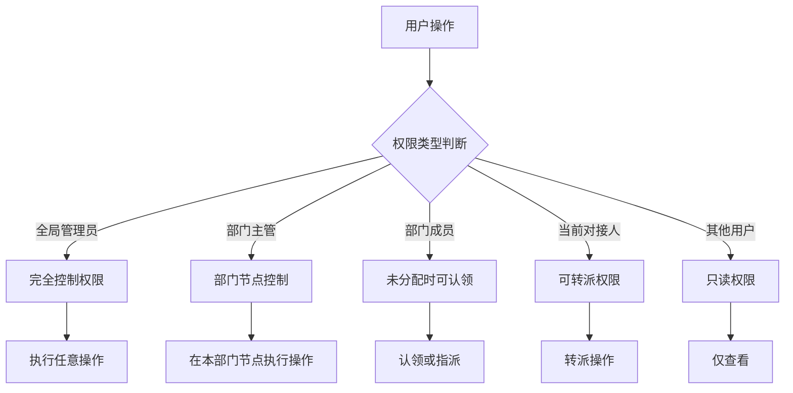

**图表来源**
- [UnifiedTicketDetail.tsx:272-311](file://client/src/components/Workspace/UnifiedTicketDetail.tsx#L272-L311)

#### 工作流节点映射

不同工单类型的工作流节点映射：

| 工单类型 | 节点序列 |
|---------|----------|
| RMA | draft → submitted → op_receiving → op_diagnosing → ms_review → op_repairing → ms_closing → op_shipping → resolved |
| 服务 | draft → open → processing → resolved |
| 咨询 | open → waiting → open |

#### 关键节点编辑功能

统一工单详情支持关键节点的直接编辑功能：

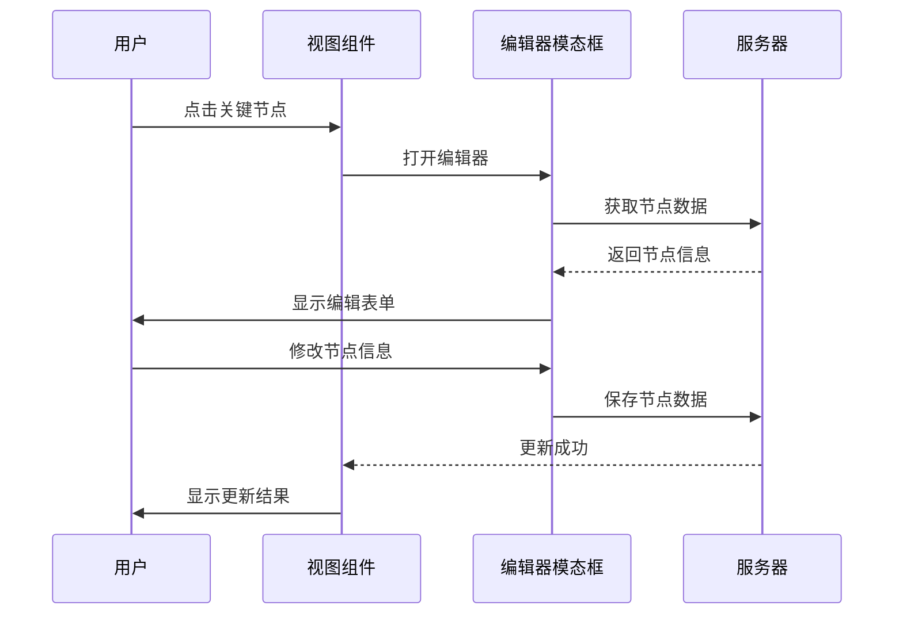

**图表来源**
- [UnifiedTicketDetail.tsx:670-714](file://client/src/components/Workspace/UnifiedTicketDetail.tsx#L670-L714)

**章节来源**
- [UnifiedTicketDetail.tsx:82-103](file://client/src/components/Workspace/UnifiedTicketDetail.tsx#L82-L103)
- [UnifiedTicketDetail.tsx:272-311](file://client/src/components/Workspace/UnifiedTicketDetail.tsx#L272-L311)

### 活动时间轴组件

活动时间轴是工单详情的核心交互组件，提供了丰富的活动展示和操作功能：

#### 活动类型分类

| 活动类型 | 描述 | 图标 | 颜色 |
|---------|------|------|------|
| comment | 用户评论 | MessageSquare | 绿色 |
| status_change | 状态变更 | ArrowRight | 蓝色 |
| creation | 工单创建 | Plus | 蓝色 |
| assignment | 指派操作 | UserCheck | 黄色 |
| priority_change | 优先级变更 | AlertTriangle | 黄色 |
| mention | 提及操作 | AtSign | 紫色 |
| field_update | 字段更新 | Edit3 | 黄色 |
| diagnostic_report | 诊断报告 | Wrench | 绿色 |
| op_repair_report | 维修记录 | Wrench | 黄色 |
| soft_delete | 删除操作 | Trash2 | 红色 |

#### 关键节点检测机制

系统能够智能识别和展示关键节点的完成状态：

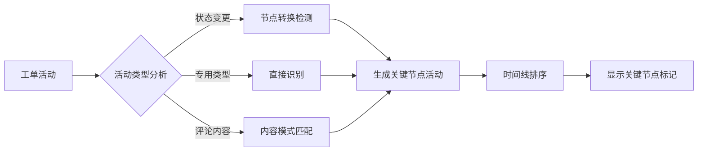

**图表来源**
- [TicketDetailComponents.tsx:340-515](file://client/src/components/Workspace/TicketDetailComponents.tsx#L340-L515)

#### 附件展示功能

活动时间轴中的附件展示功能支持多种文件类型，特别增强了 HEIC 图像格式的处理：

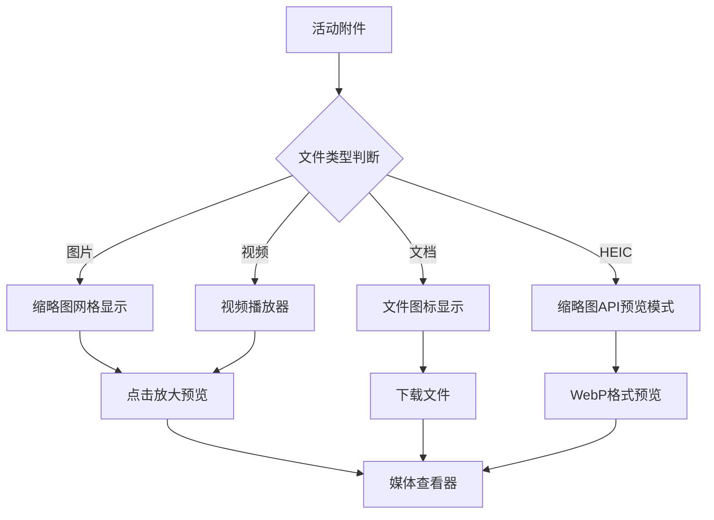

**图表来源**
- [TicketDetailComponents.tsx:2055-2176](file://client/src/components/Workspace/TicketDetailComponents.tsx#L2055-L2176)

**章节来源**
- [TicketDetailComponents.tsx:206-973](file://client/src/components/Workspace/TicketDetailComponents.tsx#L206-L973)

### 子组件集合

#### CollapsiblePanel - 可折叠面板

提供统一的面板样式和交互体验：

- 支持标题、图标、计数器显示
- 默认展开/收起状态控制
- 响应式设计适配

#### MediaLightbox - 媒体查看器

实现图片和视频的全屏预览功能：

- 支持键盘快捷键操作
- 平滑的动画过渡效果
- 自适应屏幕尺寸

#### MentionCommentInput - 提及评论输入

集成了用户提及功能的评论输入组件：

- 实时用户搜索和提及
- 附件上传支持
- 可见性控制选项

**章节来源**
- [TicketDetailComponents.tsx:56-102](file://client/src/components/Workspace/TicketDetailComponents.tsx#L56-L102)
- [TicketDetailComponents.tsx:231-304](file://client/src/components/Workspace/TicketDetailComponents.tsx#L231-L304)

### 附件上传区域组件

#### AttachmentZone - 附件上传区域

新增的附件上传组件，提供直观的文件拖拽上传功能：

- **拖拽支持**: 支持文件拖拽到指定区域
- **文件类型限制**: 限制为图片、视频、PDF、文本文件
- **预览功能**: 实时预览已选择的文件
- **移除功能**: 支持移除不需要的文件
- **响应式布局**: 根据文件数量自动调整网格布局

**章节来源**
- [AttachmentZone.tsx:1-108](file://client/src/components/Service/AttachmentZone.tsx#L1-L108)

## 审计跟踪系统

### 核心数据变更声明

统一工单详情实现了严格的审计跟踪机制，要求对核心数据变更进行强制声明：

#### 审计字段识别

系统自动识别核心审计字段，包括：
- 序列号（serial_number）
- 产品型号（product_id）
- 优先级（priority）
- 状态（status）
- 问题简述（problem_summary）
- 详细描述（problem_description）
- 维修内容（repair_content）
- 金额（payment_amount）
- 保修判定（is_warranty）
- 处理记录（resolution）
- 当前节点（current_node）

#### 审计差异对比

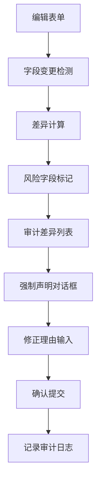

**图表来源**
- [UnifiedTicketDetail.tsx:447-490](file://client/src/components/Workspace/UnifiedTicketDetail.tsx#L447-L490)

#### 审计日志记录

所有核心数据变更都会在工单时间轴中永久记录：
- 变更字段名称和标签
- 旧值和新值的对比显示
- 变更时间和操作人
- 修正理由和审批状态
- 影响范围和风险等级

**章节来源**
- [UnifiedTicketDetail.tsx:2280-2342](file://client/src/components/Workspace/UnifiedTicketDetail.tsx#L2280-L2342)

## 状态管理功能

### 统一状态映射

系统实现了统一的工单状态映射机制，确保不同节点的一致性：

#### 节点到状态映射

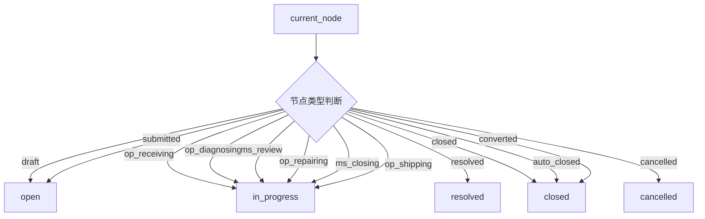

**图表来源**
- [tickets.js:377-405](file://server/service/routes/tickets.js#L377-L405)

#### 状态颜色编码

系统使用品牌色彩对不同状态进行视觉区分：
- **开放**: 蓝色 (#3B82F6)
- **进行中**: 紫色 (#8B5CF6)
- **等待**: 金色 (#FFD700)
- **已解决**: 绿色 (#10B981)
- **已关闭**: 绿色 (#10B981)
- **已废弃**: 灰色 (#6B7280)

**章节来源**
- [tickets.js:377-405](file://server/service/routes/tickets.js#L377-L405)

## 关键节点编辑

### 节点编辑器集成

统一工单详情提供了完整的节点编辑功能，支持多个关键节点的直接编辑：

#### 收货入库节点编辑

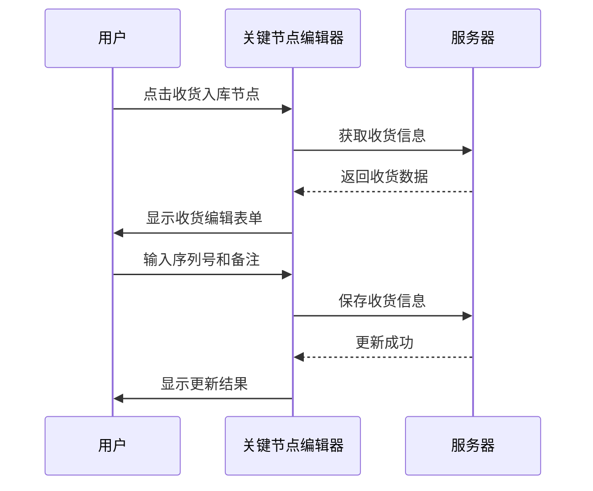

**图表来源**
- [UnifiedTicketDetail.tsx:670-691](file://client/src/components/Workspace/UnifiedTicketDetail.tsx#L670-L691)

#### 发货信息节点编辑

支持多种发货方式的信息录入：
- 快递直发（express）
- 货代中转（forwarder）
- 客户自提（pickup）
- 合并发货（combined）

#### 商务审核节点编辑

提供详细的审核信息录入界面：
- 保修判定（in_warranty/out_warranty）
- 预估费用
- 审核备注
- 客户确认状态

#### 结案确认节点编辑

支持结案相关信息的录入：
- 发货方式
- 款项确认状态
- 实收金额
- 结案备注

**章节来源**
- [UnifiedTicketDetail.tsx:670-714](file://client/src/components/Workspace/UnifiedTicketDetail.tsx#L670-L714)

## 活动时间轴增强

### 关键节点可视化

活动时间轴新增了关键节点的可视化标识：

#### 重要节点标记

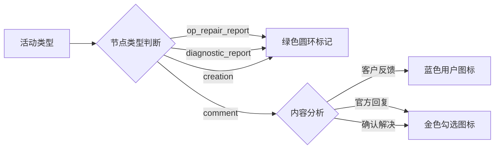

**图表来源**
- [TicketDetailComponents.tsx:662-753](file://client/src/components/Workspace/TicketDetailComponents.tsx#L662-L753)

#### 关键节点详情抽屉

点击关键节点可打开详细信息抽屉：
- 收货入库详情（序列号修正、收货备注）
- 发货信息详情（发货方式、快递单号、货代信息）
- 商务审核详情（保修判定、预估费用、审核备注）
- 结案确认详情（发货方式、款项确认、实收金额）

**章节来源**
- [TicketDetailComponents.tsx:1472-1683](file://client/src/components/Workspace/TicketDetailComponents.tsx#L1472-L1683)

## 权限控制系统

### acting User 权限模型

统一工单详情实现了基于 acting user 的精细化权限控制：

#### 权限层级结构

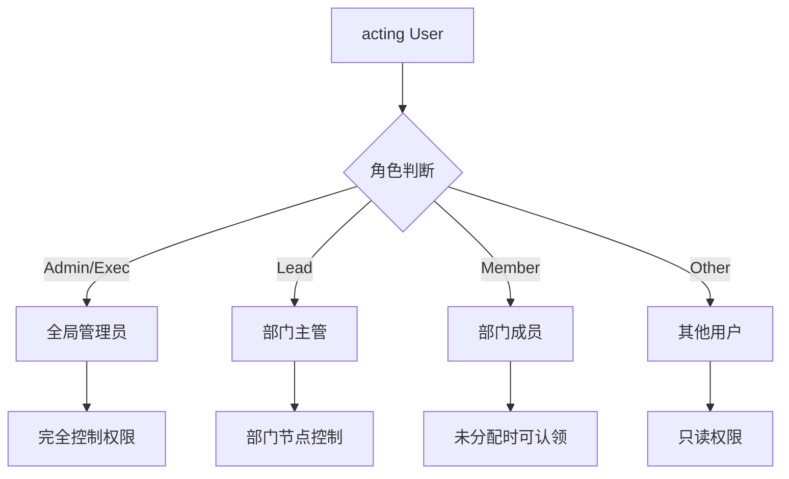

**图表来源**
- [UnifiedTicketDetail.tsx:272-311](file://client/src/components/Workspace/UnifiedTicketDetail.tsx#L272-L311)

#### 部门节点权限

系统根据当前节点确定部门归属：
- **MS 节点**: draft, submitted, ms_review, ms_closing, waiting_customer, handling, awaiting_customer
- **OP 节点**: op_receiving, op_diagnosing, op_repairing, op_shipping, op_shipping_transit
- **GE 节点**: ge_review, ge_closing
- **RD 节点**: rd_consulting, rd_resolved

**章节来源**
- [UnifiedTicketDetail.tsx:279-298](file://client/src/components/Workspace/UnifiedTicketDetail.tsx#L279-L298)

## 附件系统

### 服务端接口实现

工单详情接口现已支持完整的附件返回，包括附件数组、附件计数和缩略图预览功能：

#### 附件数据结构

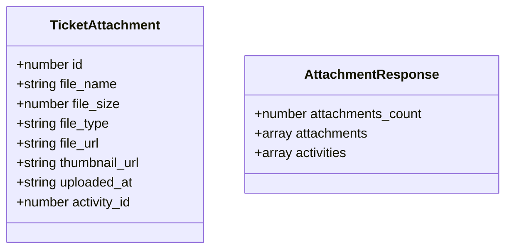

**图表来源**
- [tickets.js:1396-1400](file://server/service/routes/tickets.js#L1396-L1400)

#### 附件获取流程

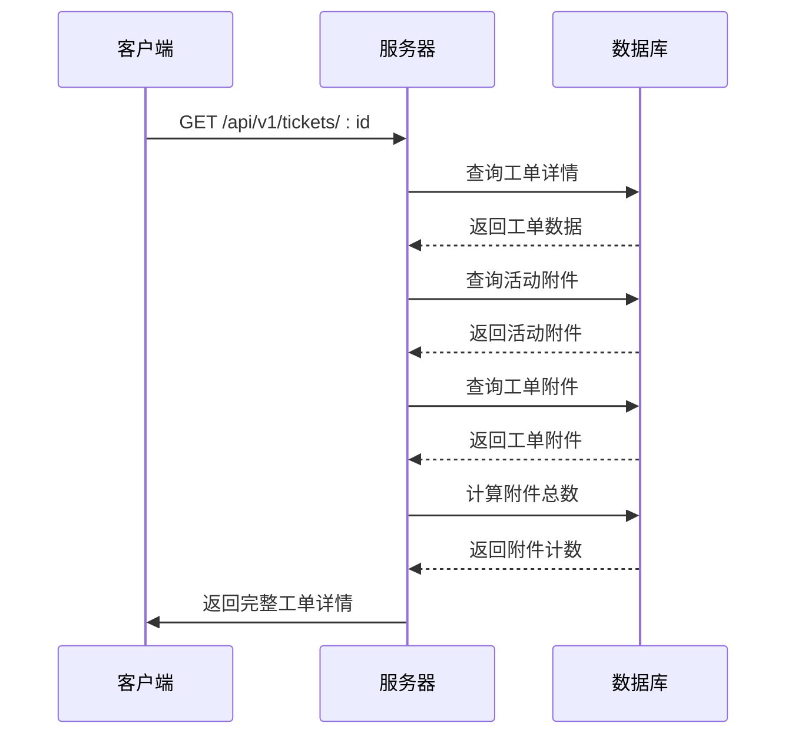

**图表来源**
- [tickets.js:1315-1400](file://server/service/routes/tickets.js#L1315-L1400)

### 客户端附件处理

#### 附件状态管理

客户端通过 `ticketAttachments` 状态管理工单附件：

- **状态存储**: `useState<any[]>([])`
- **数据来源**: 从服务端接口获取
- **显示逻辑**: 基于 `attachments_count` 和 `ticketAttachments.length` 判断

#### 附件显示组件

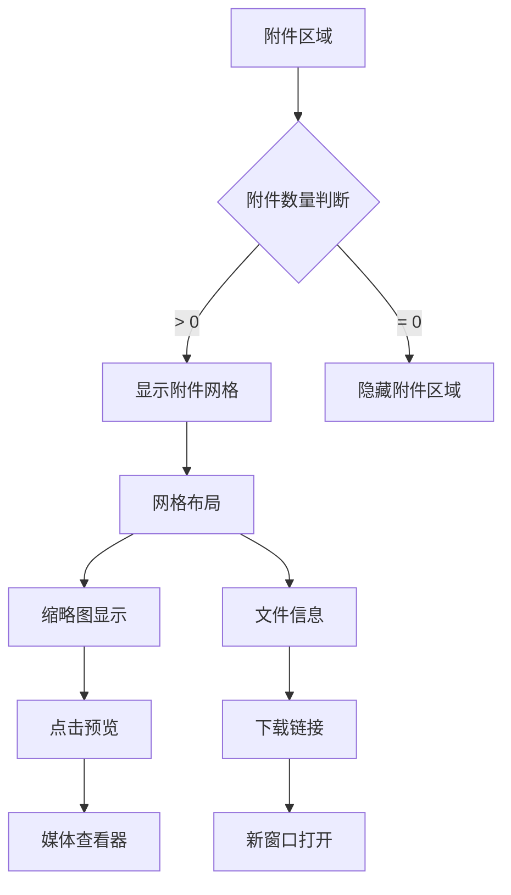

**图表来源**
- [UnifiedTicketDetail.tsx:2208-2264](file://client/src/components/Workspace/UnifiedTicketDetail.tsx#L2208-L2264)

#### 缩略图生成机制

服务端支持动态缩略图生成，特别增强了 HEIC 图像格式的处理：

- **缩略图大小**: 400px (默认) 和 1200px (预览模式)
- **格式支持**: WebP (优先) 和 JPG (回退)
- **HEIC处理**: 使用 macOS 原生 sips 工具进行 HEIC/HEIF 转换，然后转换为 WebP 格式
- **EXIF支持**: 自动旋转和保留 EXIF 方向信息

**章节来源**
- [system.js:515-524](file://server/service/routes/system.js#L515-L524)
- [UnifiedTicketDetail.tsx:2242-2246](file://client/src/components/Workspace/UnifiedTicketDetail.tsx#L2242-L2246)

### 数据库结构支持

系统通过数据库迁移添加了附件计数支持：

- **新增列**: `attachments_count` INTEGER DEFAULT 0
- **数据填充**: 自动计算现有工单的附件数量
- **查询优化**: 提供快速的附件计数查询能力

**章节来源**
- [039_add_attachments_count.sql:1-11](file://server/migrations/039_add_attachments_count.sql#L1-L11)

## 依赖关系分析

统一工单详情模块的依赖关系体现了清晰的层次结构：

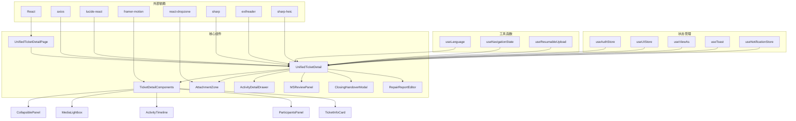

**图表来源**
- [UnifiedTicketDetailPage.tsx:8-28](file://client/src/components/Service/UnifiedTicketDetailPage.tsx#L8-L28)
- [UnifiedTicketDetail.tsx:10-35](file://client/src/components/Workspace/UnifiedTicketDetail.tsx#L10-L35)
- [AttachmentZone.tsx:2-4](file://client/src/components/Service/AttachmentZone.tsx#L2-L4)

**章节来源**
- [UnifiedTicketDetailPage.tsx:8-38](file://client/src/components/Service/UnifiedTicketDetailPage.tsx#L8-L38)
- [UnifiedTicketDetail.tsx:10-35](file://client/src/components/Workspace/UnifiedTicketDetail.tsx#L10-L35)
- [AttachmentZone.tsx:1-108](file://client/src/components/Service/AttachmentZone.tsx#L1-L108)

## 性能考虑

统一工单详情在设计时充分考虑了性能优化：

### 并行数据加载

系统采用并行请求策略来提升加载速度：

- 工单详情数据
- 系统设置配置
- 文档存在性检查
- 参与者和附件信息

### 懒加载策略

- 子组件按需加载
- 图片和媒体资源延迟加载
- 附件缩略图优化

### 缓存机制

- 本地状态缓存
- API 响应缓存
- 用户权限缓存

### 附件性能优化

- **缩略图缓存**: 服务端生成并缓存缩略图，支持 WebP 格式优化
- **HEIC优化**: 使用预览模式减少内存占用，macOS 系统使用原生 sips 工具处理
- **懒加载**: 附件网格按需渲染，图片加载时显示加载指示器
- **条件预览**: HEIC 图像自动使用缩略图 API 的预览模式
- **拖拽上传**: react-dropzone 提供高效的文件拖拽处理
- **审计差异计算**: 前端智能比较字段变化，避免不必要的重渲染

## 故障排除指南

### 常见问题及解决方案

#### 工单加载失败

**症状**: 工单详情页面显示错误信息

**可能原因**:
- 网络连接异常
- 工单 ID 无效
- 权限不足

**解决步骤**:
1. 检查网络连接状态
2. 验证工单 ID 格式
3. 确认用户权限级别
4. 刷新页面重试

#### 权限相关问题

**症状**: 无法执行某些操作或看到受限内容

**解决方法**:
- 检查用户所属部门和角色
- 验证当前工单节点权限
- 确认 acting user 设置

#### 性能问题

**症状**: 页面加载缓慢或响应迟滞

**优化建议**:
- 清理浏览器缓存
- 关闭不必要的标签页
- 检查网络带宽
- 减少同时打开的工单数量

#### 附件相关问题

**症状**: 附件无法显示或下载失败

**可能原因**:
- 文件权限问题
- 缩略图生成失败
- 网络连接中断
- HEIC 格式兼容性问题
- 拖拽上传失败

**解决步骤**:
1. 检查文件权限设置
2. 验证缩略图缓存目录
3. 确认网络连接稳定
4. 清理浏览器缓存
5. 对于 HEIC 文件，检查系统是否支持 sips 工具
6. 检查 react-dropzone 是否正常工作

#### 审计跟踪问题

**症状**: 核心数据变更未被正确记录

**解决步骤**:
1. 检查是否选择了正确的审计字段
2. 确认修正理由是否填写
3. 验证用户权限是否足够
4. 检查网络连接状态
5. 重新尝试提交操作

**章节来源**
- [UnifiedTicketDetail.tsx:917-931](file://client/src/components/Workspace/UnifiedTicketDetail.tsx#L917-L931)

## 结论

统一工单详情模块是 Longhorn 工单管理系统的重要组成部分，通过精心设计的架构和丰富的功能特性，为用户提供了完整的工单管理体验。该模块不仅实现了统一的界面风格和交互体验，更重要的是建立了一套完善的权限控制和审计机制，确保了工单处理过程的透明性和可追溯性。

**更新** 新增的审计跟踪功能显著提升了系统的合规性和数据完整性，核心数据变更的强制声明机制确保了所有重要修改都有据可查。状态管理功能的统一化处理使得不同工单类型在状态流转上保持一致，大大简化了用户的操作复杂度。关键节点编辑功能的引入让用户能够直接编辑重要的业务信息，无需跳转到复杂的编辑界面，极大提升了工作效率。

模块的主要优势包括：

1. **统一性**: 支持多种工单类型的统一展示
2. **权限控制**: 基于 acting user 的精细权限管理
3. **审计功能**: 完整的变更记录和审批流程
4. **用户体验**: macOS26 风格的现代化界面设计
5. **扩展性**: 模块化的架构便于功能扩展和维护
6. **附件管理**: 完整的附件上传、存储和预览功能
7. **格式兼容**: 支持多种文件格式，包括现代图像格式
8. **性能优化**: 智能的缩略图缓存和懒加载机制
9. **拖拽上传**: 直观的文件拖拽上传体验
10. **关键节点编辑**: 支持直接编辑收货入库、发货信息、商务审核、结案确认等关键节点
11. **状态管理**: 统一的状态映射和节点流转控制
12. **活动时间轴增强**: 关键节点检测和可视化标识
13. **响应式设计**: 适配不同屏幕尺寸的设备

该模块的成功实施为整个工单管理系统的稳定运行奠定了坚实基础，为后续的功能扩展和性能优化提供了良好的技术支撑。新增的审计跟踪和状态管理功能进一步强化了系统的合规性和可靠性，为企业的工单管理提供了强有力的技术保障。