# useCachedTickets Hook 文档

<cite>
**本文档中引用的文件**
- [useCachedTickets.ts](file://client/src/hooks/useCachedTickets.ts)
- [useAuthStore.ts](file://client/src/store/useAuthStore.ts)
- [useTicketStore.ts](file://client/src/store/useTicketStore.ts)
- [InquiryTicketListPage.tsx](file://client/src/components/InquiryTickets/InquiryTicketListPage.tsx)
- [RMATicketListPage.tsx](file://client/src/components/RMATickets/RMATicketListPage.tsx)
- [DealerRepairListPage.tsx](file://client/src/components/DealerRepairs/DealerRepairListPage.tsx)
- [inquiry-tickets.js](file://server/service/routes/inquiry-tickets.js)
- [rma-tickets.js](file://server/service/routes/rma-tickets.js)
- [dealer-repairs.js](file://server/service/routes/dealer-repairs.js)
- [package.json](file://client/package.json)
</cite>

## 更新摘要
**变更内容**
- 更新了 Hook 的核心功能描述，强调统一缓存管理能力
- 新增了预取功能和缓存失效功能的详细说明
- 增强了性能优化和用户体验相关的功能描述
- 补充了完整的 API 接口说明和使用示例

## 目录
1. [简介](#简介)
2. [项目结构](#项目结构)
3. [核心组件](#核心组件)
4. [架构概览](#架构概览)
5. [详细组件分析](#详细组件分析)
6. [依赖关系分析](#依赖关系分析)
7. [性能考虑](#性能考虑)
8. [故障排除指南](#故障排除指南)
9. [结论](#结论)

## 简介

`useCachedTickets` 是一个基于 SWR（Stale-While-Revalidate）的 React Hook，专门用于缓存和管理三种类型的工单数据：咨询工单（Inquiry Tickets）、RMA 工单（Return Merchandise Authorization）和经销商维修工单（Dealer Repairs）。该 Hook 提供了智能缓存、请求去重、后台刷新和错误处理等功能，显著提升了用户体验和应用性能。

**更新** 该 Hook 现已支持统一的缓存管理机制，能够智能处理三种不同类型的工单数据，提供一致的缓存策略和性能优化。

## 项目结构

Longhorn 应用采用三层工单模型架构，支持三种不同级别的服务工单：

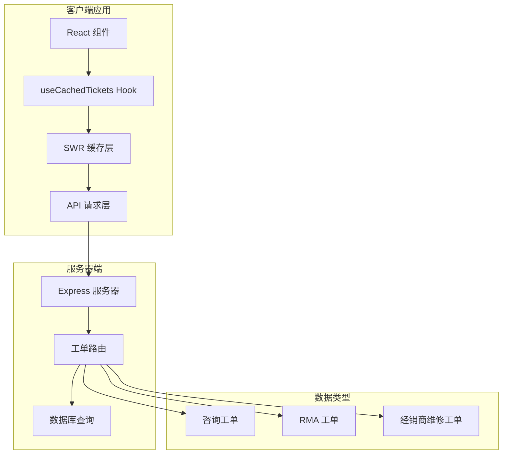

**图表来源**
- [useCachedTickets.ts](file://client/src/hooks/useCachedTickets.ts#L1-L136)
- [inquiry-tickets.js](file://server/service/routes/inquiry-tickets.js#L1-L707)
- [rma-tickets.js](file://server/service/routes/rma-tickets.js#L1-L653)
- [dealer-repairs.js](file://server/service/routes/dealer-repairs.js#L1-L472)

**章节来源**
- [useCachedTickets.ts](file://client/src/hooks/useCachedTickets.ts#L1-L136)
- [package.json](file://client/package.json#L12-L29)

## 核心组件

### 主要功能特性

`useCachedTickets` Hook 提供了以下核心功能：

1. **智能缓存管理**：基于 SWR 的缓存系统，支持缓存失效和重新验证
2. **请求去重**：在指定时间内自动去重相同请求
3. **后台刷新**：在保持现有数据的同时进行后台数据更新
4. **响应式参数**：支持动态查询参数变化
5. **错误处理**：完整的错误状态管理和用户反馈
6. **统一缓存策略**：支持三种工单类型的统一缓存管理

### 数据结构定义

Hook 定义了关键的数据接口：

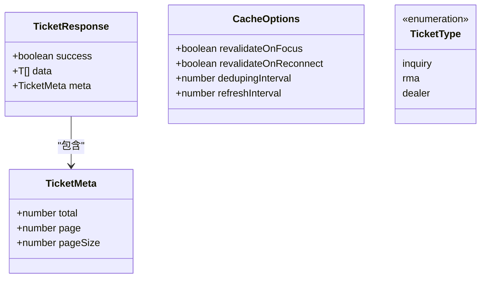

**图表来源**
- [useCachedTickets.ts](file://client/src/hooks/useCachedTickets.ts#L5-L22)

**章节来源**
- [useCachedTickets.ts](file://client/src/hooks/useCachedTickets.ts#L1-L136)

## 架构概览

### 整体架构流程

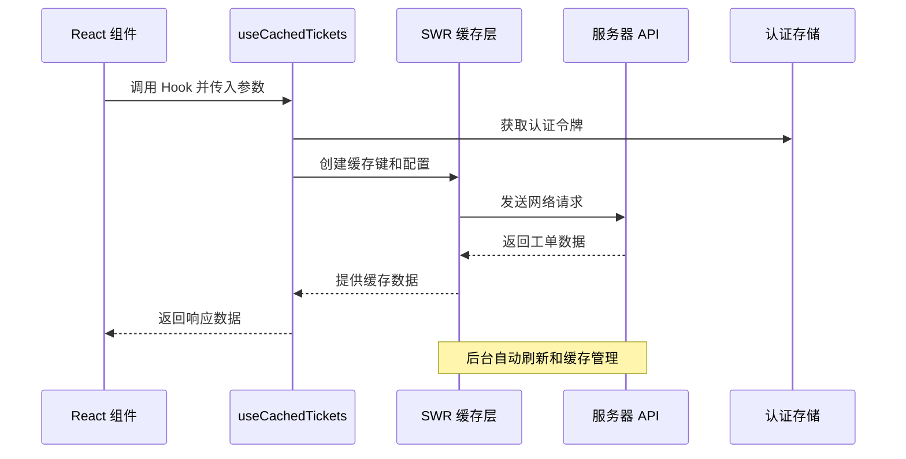

**图表来源**
- [useCachedTickets.ts](file://client/src/hooks/useCachedTickets.ts#L46-L95)
- [useAuthStore.ts](file://client/src/store/useAuthStore.ts#L1-L31)

### 数据流架构

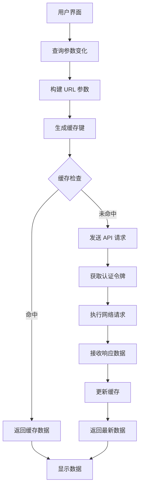

**图表来源**
- [useCachedTickets.ts](file://client/src/hooks/useCachedTickets.ts#L59-L84)

**章节来源**
- [useCachedTickets.ts](file://client/src/hooks/useCachedTickets.ts#L39-L95)

## 详细组件分析

### useCachedTickets Hook 实现

#### 核心实现逻辑

Hook 的主要实现包括以下几个关键部分：

1. **参数构建和验证**
2. **缓存键生成**
3. **SWR 配置设置**
4. **数据返回和状态管理**

#### 函数签名和参数

```mermaid
flowchart LR
A[useCachedTickets] --> B[TicketType]
A --> C[Record<string, string | number | undefined>]
A --> D[CacheOptions]
B --> E[inquiry | rma | dealer]
C --> F[查询参数对象]
D --> G[缓存选项配置]
```

**图表来源**
- [useCachedTickets.ts](file://client/src/hooks/useCachedTickets.ts#L46-L50)

#### 缓存策略实现

Hook 使用了多种缓存优化策略：

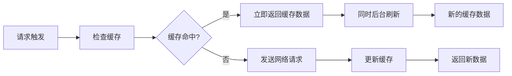

**图表来源**
- [useCachedTickets.ts](file://client/src/hooks/useCachedTickets.ts#L73-L84)

**章节来源**
- [useCachedTickets.ts](file://client/src/hooks/useCachedTickets.ts#L46-L95)

### 服务器端 API 集成

#### 工单类型映射

Hook 将前端的工单类型映射到对应的服务器端路由：

| 前端类型 | 服务器端路由 | 描述 |
|---------|-------------|------|
| inquiry | `/api/v1/inquiry-tickets` | 咨询工单 |
| rma | `/api/v1/rma-tickets` | RMA 工单 |
| dealer | `/api/v1/dealer-repairs` | 经销商维修工单 |

#### API 响应格式

服务器端 API 返回统一的响应格式：

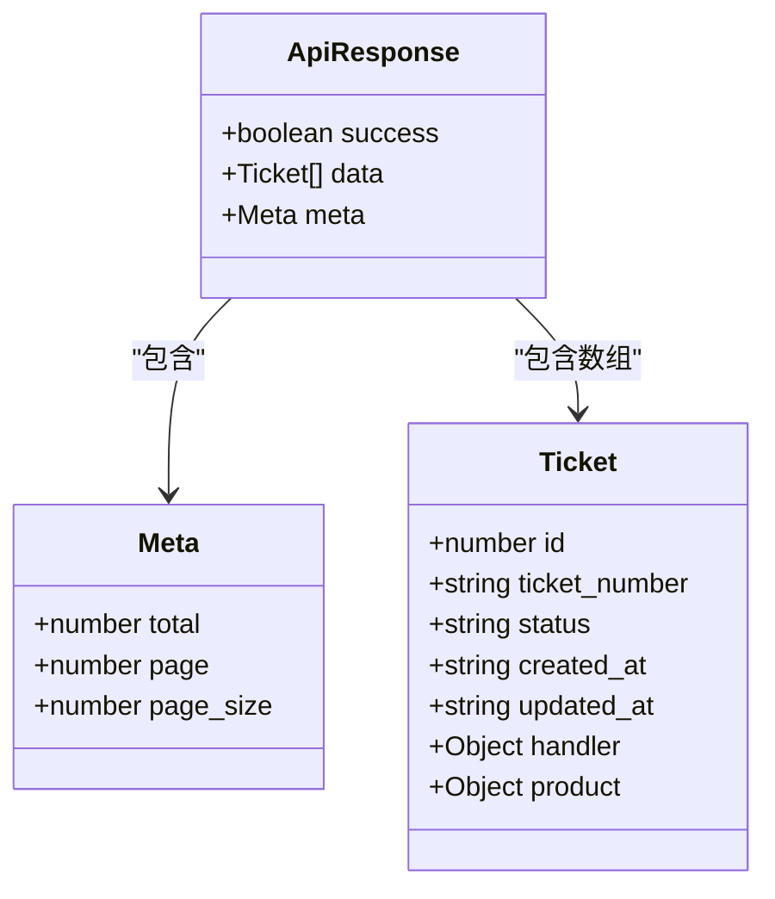

**图表来源**
- [useCachedTickets.ts](file://client/src/hooks/useCachedTickets.ts#L11-L15)

**章节来源**
- [inquiry-tickets.js](file://server/service/routes/inquiry-tickets.js#L397-L410)
- [rma-tickets.js](file://server/service/routes/rma-tickets.js#L313-L326)
- [dealer-repairs.js](file://server/service/routes/dealer-repairs.js#L222-L235)

### 组件使用示例

#### 咨询工单列表页面集成

在实际的组件中，Hook 的使用方式如下：

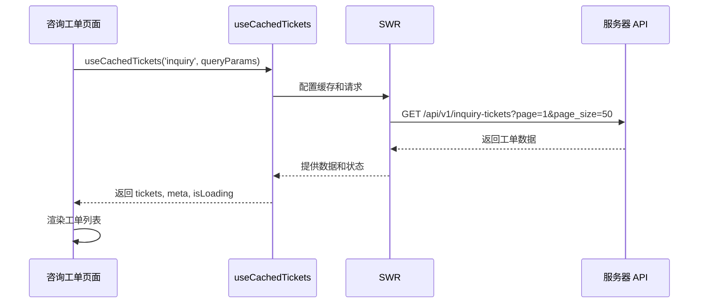

**图表来源**
- [InquiryTicketListPage.tsx](file://client/src/components/InquiryTickets/InquiryTicketListPage.tsx#L89-L91)

**章节来源**
- [InquiryTicketListPage.tsx](file://client/src/components/InquiryTickets/InquiryTicketListPage.tsx#L51-L91)

### 辅助函数实现

#### 预取功能

Hook 提供了预取功能，允许在用户导航前预热缓存：

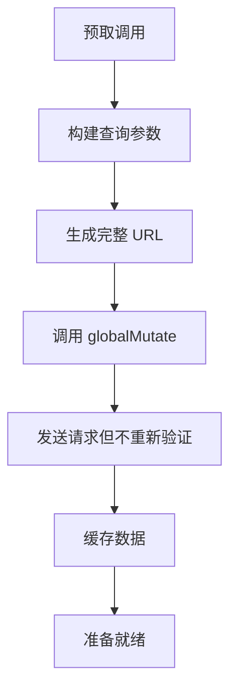

**图表来源**
- [useCachedTickets.ts](file://client/src/hooks/useCachedTickets.ts#L101-L121)

#### 缓存失效功能

提供针对特定工单类型的缓存失效机制：

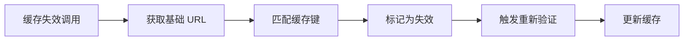

**图表来源**
- [useCachedTickets.ts](file://client/src/hooks/useCachedTickets.ts#L127-L135)

**章节来源**
- [useCachedTickets.ts](file://client/src/hooks/useCachedTickets.ts#L97-L135)

## 依赖关系分析

### 外部依赖

Hook 依赖以下关键外部库：

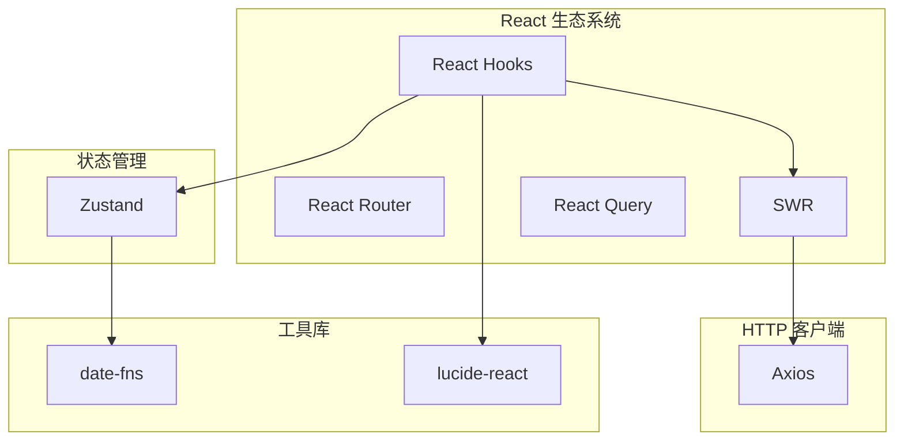

**图表来源**
- [package.json](file://client/package.json#L12-L29)

### 内部依赖关系

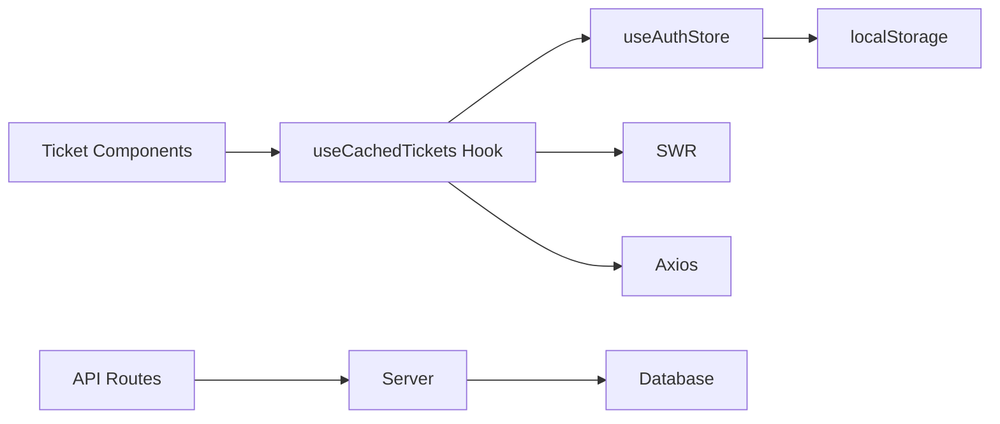

**图表来源**
- [useCachedTickets.ts](file://client/src/hooks/useCachedTickets.ts#L1-L3)
- [useAuthStore.ts](file://client/src/store/useAuthStore.ts#L1-L31)

**章节来源**
- [useCachedTickets.ts](file://client/src/hooks/useCachedTickets.ts#L1-L3)
- [useAuthStore.ts](file://client/src/store/useAuthStore.ts#L1-L31)

## 性能考虑

### 缓存策略优化

1. **去重间隔**：默认 2 秒内的重复请求会被去重
2. **后台刷新**：在保持数据可用性的同时进行后台更新
3. **内存管理**：合理设置缓存大小和过期策略
4. **网络优化**：使用 HTTP 缓存头和条件请求
5. **统一缓存管理**：三种工单类型共享相同的缓存策略

### 用户体验优化

1. **即时反馈**：使用缓存数据提供即时响应
2. **加载状态**：区分首次加载和后台刷新的不同状态
3. **错误处理**：优雅地处理网络错误和数据异常
4. **性能监控**：提供性能指标和调试信息
5. **预取优化**：通过预取功能提升导航性能

## 故障排除指南

### 常见问题和解决方案

#### 缓存相关问题

1. **缓存未更新**
   - 检查 `revalidateOnReconnect` 设置
   - 使用 `invalidateTicketCache` 手动失效缓存
   - 验证网络连接状态

2. **内存泄漏**
   - 检查组件卸载时的清理逻辑
   - 验证 SWR 配置中的 `dedupingInterval`
   - 监控缓存大小增长

#### 认证相关问题

1. **401 错误**
   - 检查 `useAuthStore` 中的令牌状态
   - 验证令牌是否过期
   - 实现自动刷新机制

2. **权限不足**
   - 检查用户角色和权限
   - 验证服务器端的访问控制
   - 确认查询参数的过滤条件

#### 预取和缓存失效问题

1. **预取失败**
   - 检查令牌状态
   - 验证查询参数的有效性
   - 确认网络连接正常

2. **缓存失效不生效**
   - 检查工单类型映射
   - 验证缓存键生成逻辑
   - 确认全局缓存状态

**章节来源**
- [useCachedTickets.ts](file://client/src/hooks/useCachedTickets.ts#L73-L84)
- [useAuthStore.ts](file://client/src/store/useAuthStore.ts#L17-L30)

## 结论

`useCachedTickets` Hook 是 Longhorn 应用中一个精心设计的缓存解决方案，它通过以下方式提升了整体性能和用户体验：

1. **智能缓存管理**：基于 SWR 的高效缓存策略
2. **响应式数据流**：自动处理参数变化和数据更新
3. **错误处理机制**：完善的错误状态管理和用户反馈
4. **可扩展架构**：支持多种工单类型和灵活的配置选项
5. **统一缓存策略**：为三种工单类型提供一致的缓存管理体验
6. **性能优化**：包含预取和缓存失效等高级功能

该 Hook 为三个层级的工单系统提供了统一的数据访问接口，简化了组件开发并提升了应用的整体性能。通过合理的缓存策略和错误处理，它确保了用户在各种网络条件下都能获得流畅的使用体验。新增的预取和缓存失效功能进一步增强了系统的灵活性和性能表现。