# VoC客户声音管理系统

<cite>
**本文档中引用的文件**
- [App.tsx](file://client/src/App.tsx)
- [useAuthStore.ts](file://client/src/store/useAuthStore.ts)
- [index.js](file://server/index.js)
- [AuthManager.swift](file://ios/LonghornApp/Services/AuthManager.swift)
- [User.swift](file://ios/LonghornApp/Models/User.swift)
- [Dashboard.tsx](file://client/src/components/Dashboard.tsx)
- [SYSTEM_CONTEXT.md](file://docs/SYSTEM_CONTEXT.md)
- [package.json](file://client/package.json)
- [server/package.json](file://server/package.json)
- [LonghornApp.swift](file://ios/LonghornApp/LonghornApp.swift)
- [inquiry-tickets.js](file://server/service/routes/inquiry-tickets.js)
</cite>

## 目录
1. [简介](#简介)
2. [项目结构](#项目结构)
3. [核心组件](#核心组件)
4. [架构概览](#架构概览)
5. [详细组件分析](#详细组件分析)
6. [依赖关系分析](#依赖关系分析)
7. [性能考虑](#性能考虑)
8. [故障排除指南](#故障排除指南)
9. [结论](#结论)

## 简介

VoC客户声音管理系统是一个基于现代技术栈构建的企业级文件管理和客户服务系统。该系统旨在收集、处理和分析客户反馈，提供多平台支持（Web、iOS），并具备强大的权限控制和文件管理功能。

系统采用三层架构设计，包含：
- **前端客户端**：React 18 + TypeScript + Vite 构建的现代化Web应用
- **移动端客户端**：SwiftUI + MVVM架构的iOS应用
- **后端服务**：Node.js + Express.js + SQLite3的高性能API服务

## 项目结构

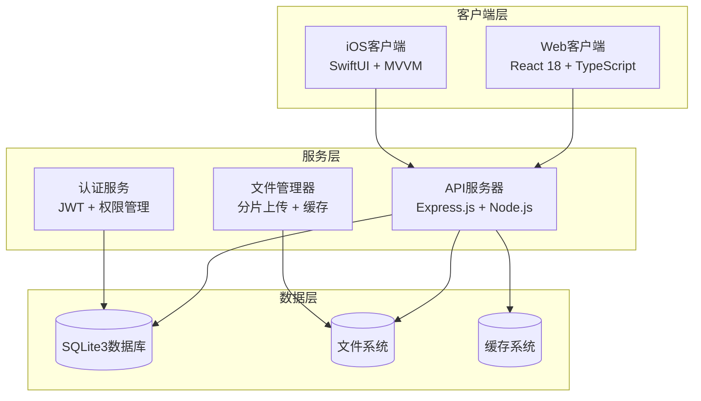

**图表来源**
- [SYSTEM_CONTEXT.md](file://docs/SYSTEM_CONTEXT.md#L1-L96)
- [package.json](file://client/package.json#L1-L46)
- [server/package.json](file://server/package.json#L1-L31)

**章节来源**
- [SYSTEM_CONTEXT.md](file://docs/SYSTEM_CONTEXT.md#L1-L96)
- [package.json](file://client/package.json#L1-L46)
- [server/package.json](file://server/package.json#L1-L31)

## 核心组件

### 1. 多模块导航系统

系统采用模块化设计，支持两个主要功能模块：

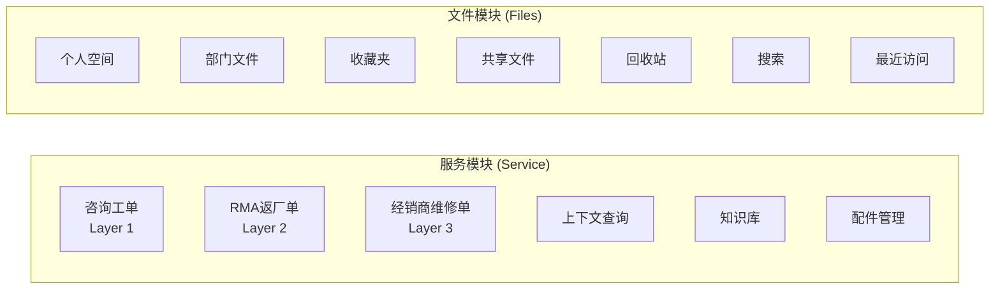

**图表来源**
- [App.tsx](file://client/src/App.tsx#L118-L198)

### 2. 权限管理体系

系统实现三级权限控制：
- **只读权限**：仅允许浏览和下载
- **贡献权限**：可上传和新建，但只能修改删除自己上传的文件
- **完全权限**：管理员和部门负责人拥有完整管理权限

**章节来源**
- [SYSTEM_CONTEXT.md](file://docs/SYSTEM_CONTEXT.md#L52-L59)

### 3. 文件处理机制

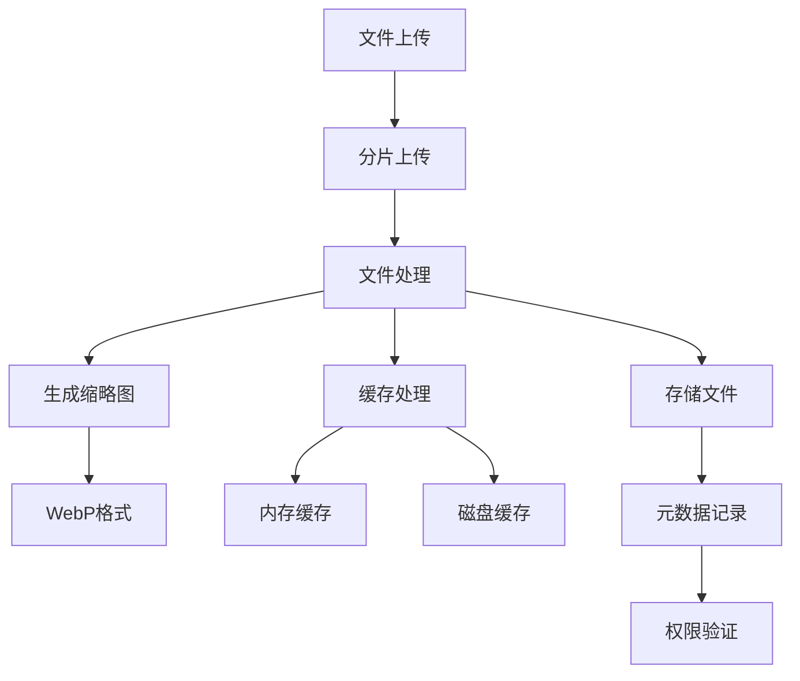

**图表来源**
- [SYSTEM_CONTEXT.md](file://docs/SYSTEM_CONTEXT.md#L60-L67)

**章节来源**
- [SYSTEM_CONTEXT.md](file://docs/SYSTEM_CONTEXT.md#L60-L67)

## 架构概览

### 系统架构图

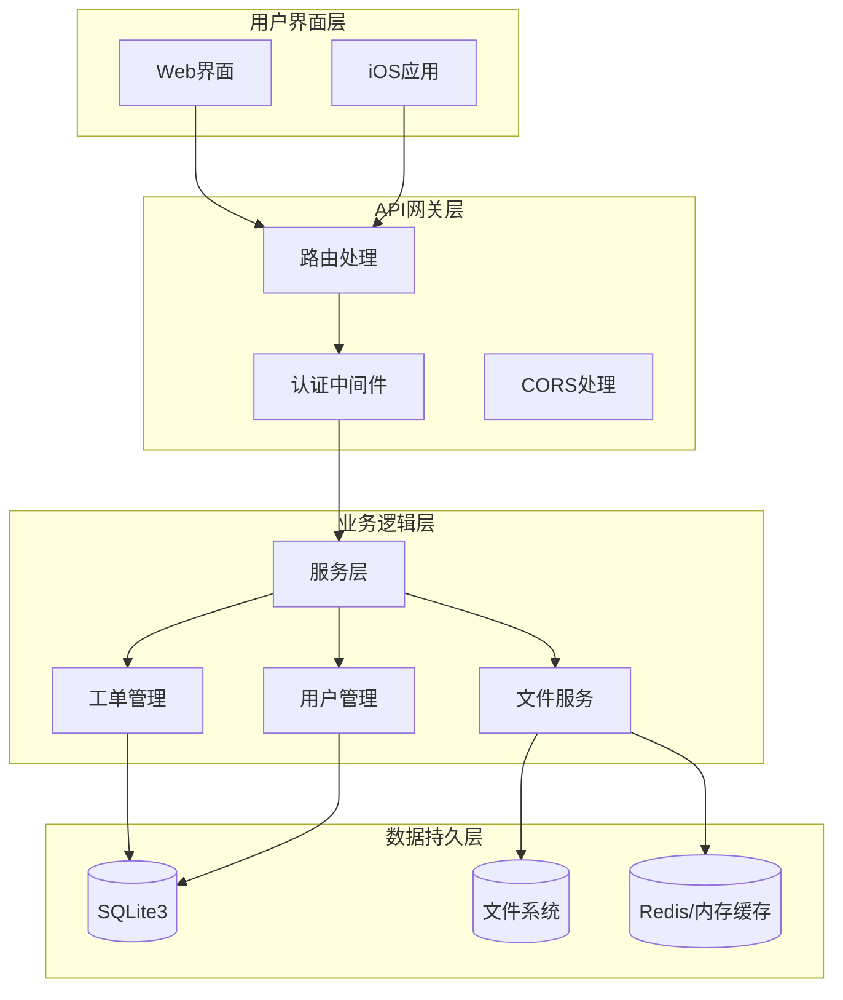

**图表来源**
- [index.js](file://server/index.js#L22-L641)
- [LonghornApp.swift](file://ios/LonghornApp/LonghornApp.swift#L12-L25)

### 数据流架构

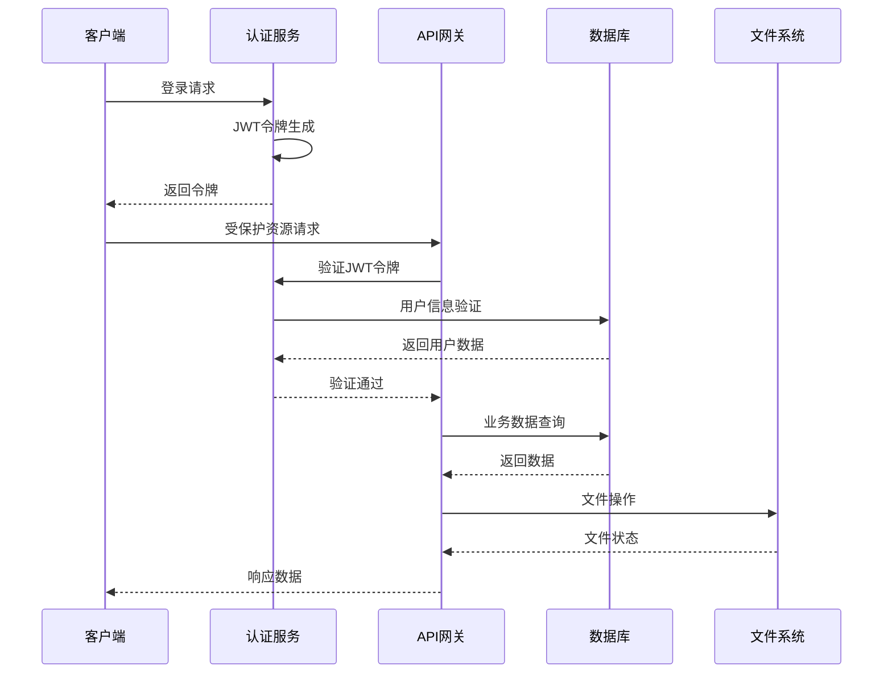

**图表来源**
- [AuthManager.swift](file://ios/LonghornApp/Services/AuthManager.swift#L44-L69)
- [useAuthStore.ts](file://client/src/store/useAuthStore.ts#L17-L30)

## 详细组件分析

### 1. 认证系统

#### 前端认证流程

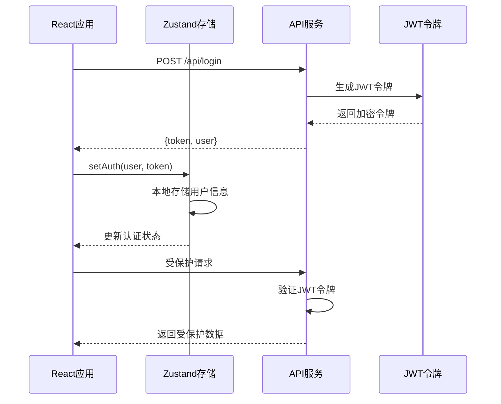

**图表来源**
- [useAuthStore.ts](file://client/src/store/useAuthStore.ts#L17-L30)
- [App.tsx](file://client/src/App.tsx#L96-L115)

#### 移动端认证流程

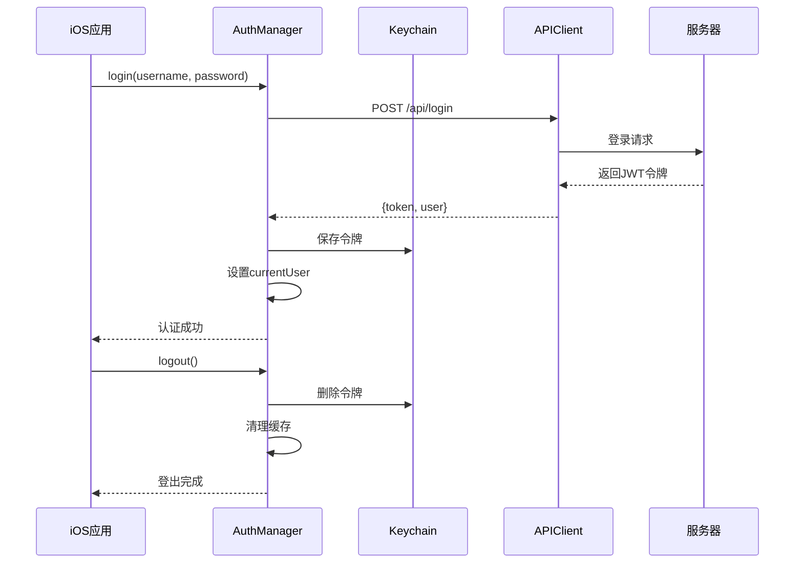

**图表来源**
- [AuthManager.swift](file://ios/LonghornApp/Services/AuthManager.swift#L44-L89)

**章节来源**
- [useAuthStore.ts](file://client/src/store/useAuthStore.ts#L1-L31)
- [AuthManager.swift](file://ios/LonghornApp/Services/AuthManager.swift#L1-L195)

### 2. 工单管理系统

#### 咨询工单处理流程

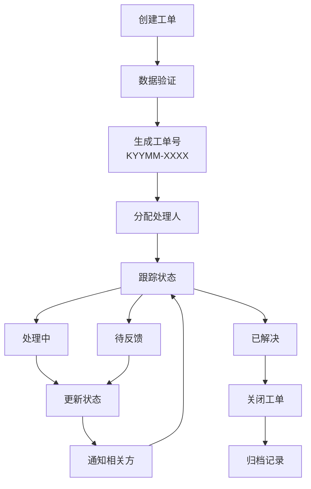

**图表来源**
- [inquiry-tickets.js](file://server/service/routes/inquiry-tickets.js#L20-L47)

#### 工单统计面板

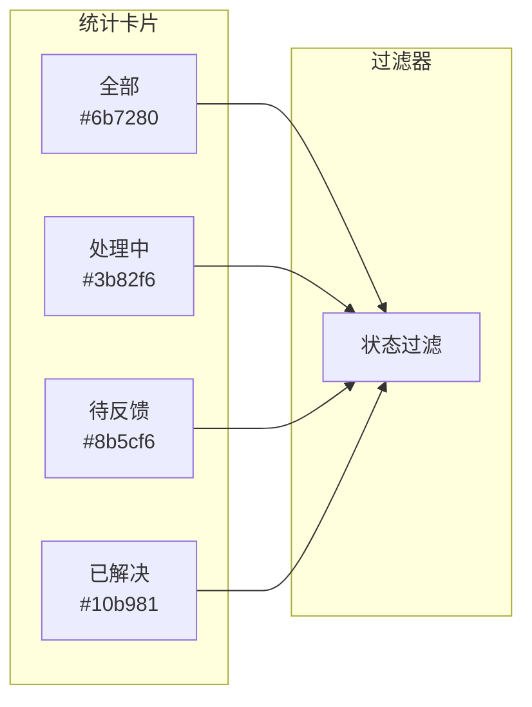

**图表来源**
- [App.tsx](file://client/src/App.tsx#L569-L608)

**章节来源**
- [inquiry-tickets.js](file://server/service/routes/inquiry-tickets.js#L1-L200)
- [App.tsx](file://client/src/App.tsx#L569-L608)

### 3. 文件管理系统

#### 文件权限验证流程

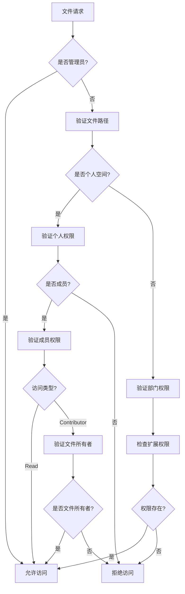

**图表来源**
- [index.js](file://server/index.js#L506-L559)

**章节来源**
- [index.js](file://server/index.js#L506-L559)

### 4. 仪表板系统

#### 用户统计面板

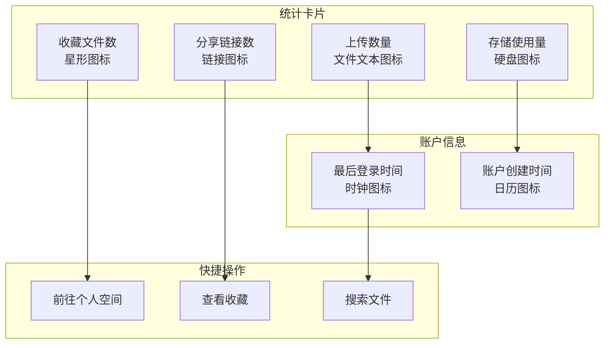

**图表来源**
- [Dashboard.tsx](file://client/src/components/Dashboard.tsx#L102-L374)

**章节来源**
- [Dashboard.tsx](file://client/src/components/Dashboard.tsx#L1-L378)

## 依赖关系分析

### 技术栈依赖图

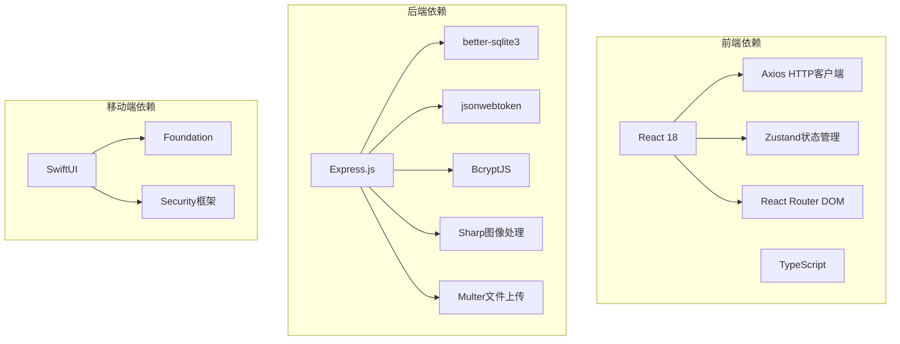

**图表来源**
- [package.json](file://client/package.json#L12-L30)
- [server/package.json](file://server/package.json#L15-L29)
- [LonghornApp.swift](file://ios/LonghornApp/LonghornApp.swift#L9-L25)

### 模块间依赖关系

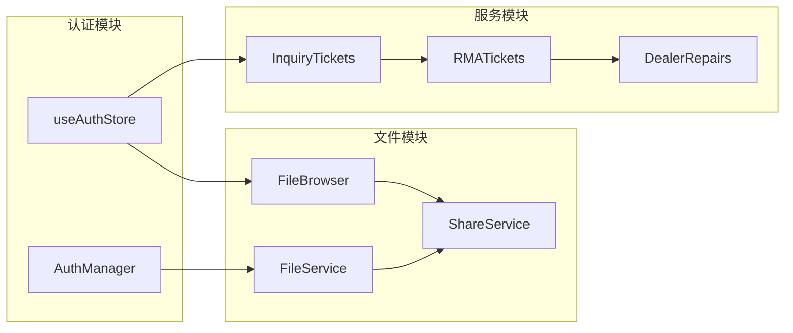

**图表来源**
- [App.tsx](file://client/src/App.tsx#L1-L50)

**章节来源**
- [package.json](file://client/package.json#L12-L30)
- [server/package.json](file://server/package.json#L15-L29)

## 性能考虑

### 1. 缓存策略

系统实现了多层次缓存机制：

- **内存缓存**：用于频繁访问的数据，如用户统计信息
- **磁盘缓存**：用于静态资源和生成的缩略图
- **浏览器缓存**：利用ETag和Last-Modified头实现智能缓存

### 2. 文件处理优化

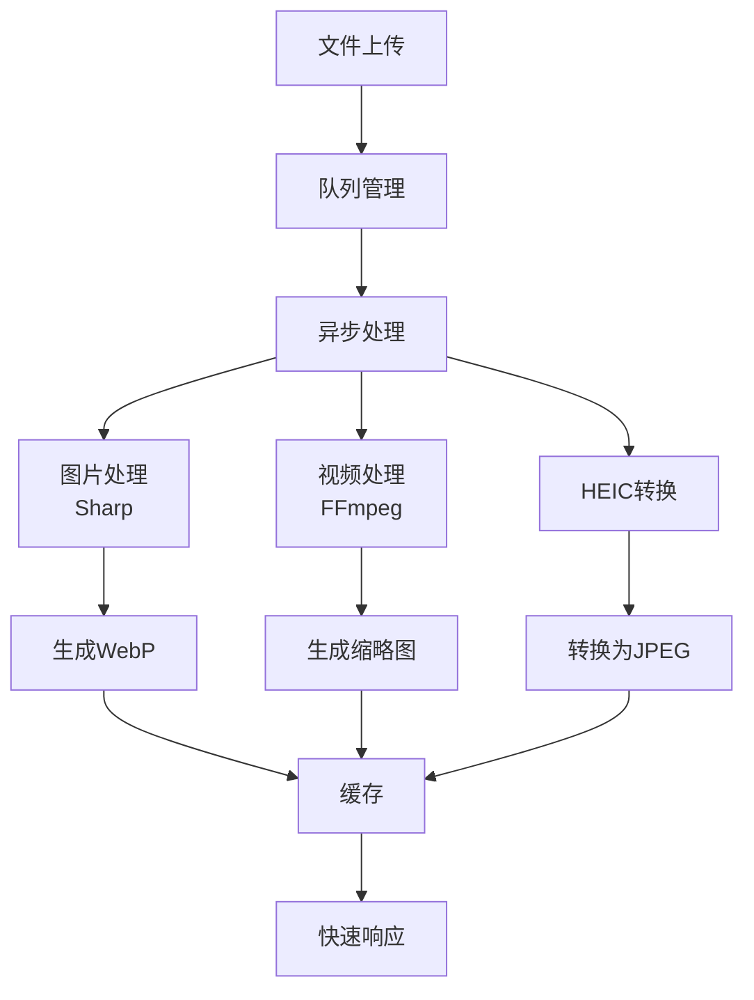

**图表来源**
- [SYSTEM_CONTEXT.md](file://docs/SYSTEM_CONTEXT.md#L62-L66)

### 3. 并发处理

系统针对不同场景进行了优化：
- **视频转码**：主要依赖CPU处理，M1芯片性能充足但需注意并发限制
- **文件预览**：使用本地缓存减少网络传输
- **权限验证**：数据库查询添加适当索引提高性能

**章节来源**
- [SYSTEM_CONTEXT.md](file://docs/SYSTEM_CONTEXT.md#L75-L79)

## 故障排除指南

### 1. 常见问题诊断

#### 权限相关问题

**症状**：用户无法访问特定文件或目录
**排查步骤**：
1. 检查用户角色和部门信息
2. 验证文件路径权限设置
3. 确认扩展权限配置
4. 查看权限验证日志

#### 文件访问问题

**症状**：文件无法下载或预览异常
**排查步骤**：
1. 检查文件是否存在且未被删除
2. 验证文件权限设置
3. 确认缓存状态
4. 检查文件格式支持情况

### 2. 日志和监控

系统提供了完善的日志记录机制：

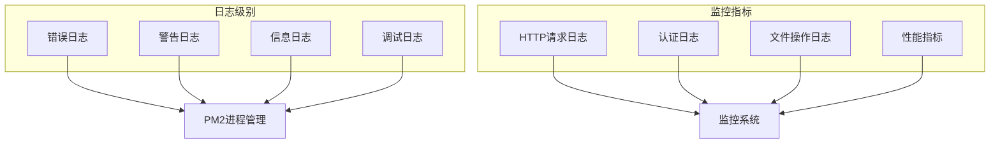

**章节来源**
- [SYSTEM_CONTEXT.md](file://docs/SYSTEM_CONTEXT.md#L73-L89)

### 3. 紧急处理流程

当遇到系统异常时，按照以下流程处理：

1. **立即检查**：查看PM2日志和系统状态
2. **临时恢复**：启动备用服务或降级功能
3. **根本解决**：定位问题根源并修复
4. **预防措施**：完善监控和告警机制

## 结论

VoC客户声音管理系统是一个功能完整、架构清晰的企业级应用。系统的主要优势包括：

### 核心优势

1. **多平台支持**：Web和iOS双端同步，用户体验一致
2. **权限安全**：三级权限控制，确保数据安全
3. **性能优化**：多层次缓存和异步处理机制
4. **扩展性强**：模块化设计便于功能扩展
5. **开发友好**：完善的开发工具链和文档

### 技术亮点

- **现代化技术栈**：React 18 + TypeScript + SwiftUI
- **高效数据库**：SQLite3 + better-sqlite3
- **智能文件处理**：分片上传 + 多格式支持
- **完善的认证**：JWT + Keychain集成
- **跨平台部署**：支持多种部署方式

### 发展建议

1. **监控完善**：增加更详细的性能监控指标
2. **测试覆盖**：提高自动化测试覆盖率
3. **文档更新**：保持技术文档与代码同步
4. **安全加固**：持续改进安全防护措施
5. **用户体验**：根据用户反馈优化界面设计

该系统为企业提供了完整的客户声音收集和管理解决方案，具备良好的可维护性和扩展性，能够满足现代企业的数字化转型需求。