# 三层工单模型

<cite>
**本文档引用的文件**
- [020_p2_unified_tickets.sql](file://server/service/migrations/020_p2_unified_tickets.sql)
- [021_migrate_tickets_data.js](file://server/service/migrations/021_migrate_tickets_data.js)
- [025_ticket_audit_softdelete.sql](file://server/service/migrations/025_ticket_audit_softdelete.sql)
- [add_knowledge_audit_log.sql](file://server/migrations/add_knowledge_audit_log.sql)
- [tickets.js](file://server/service/routes/tickets.js)
- [ticket-activities.js](file://server/service/routes/ticket-activities.js)
- [sla_service.js](file://server/service/sla_service.js)
- [AuditReasonModal.tsx](file://client/src/components/Service/AuditReasonModal.tsx)
- [DeleteTicketModal.tsx](file://client/src/components/Service/DeleteTicketModal.tsx)
- [UnifiedTicketDetailPage.tsx](file://client/src/components/Service/UnifiedTicketDetailPage.tsx)
- [UnifiedTicketDetail.tsx](file://client/src/components/Workspace/UnifiedTicketDetail.tsx)
- [MentionCommentInput.tsx](file://client/src/components/Workspace/MentionCommentInput.tsx)
- [NodeProgressBar.tsx](file://client/src/components/Workspace/NodeProgressBar.tsx)
- [ParticipantsSidebar.tsx](file://client/src/components/Workspace/ParticipantsSidebar.tsx)
- [WorkspacePage.tsx](file://client/src/components/Service/WorkspacePage.tsx)
- [NotificationCenter.tsx](file://client/src/components/Notifications/NotificationCenter.tsx)
- [bokeh.js](file://server/service/routes/bokeh.js)
- [useCachedTickets.ts](file://client/src/hooks/useCachedTickets.ts)
</cite>

## 更新摘要
**变更内容**
- 系统已完成从三层独立工单系统到统一多态工单架构的重大升级
- 新增审计和软删除功能：审计原因模态框(AuditReasonModal)、删除工单模态框(DeleteTicketModal)、统一工单详情页面(UnifiedTicketDetailPage)
- 新增数据库层面的审计日志表和软删除字段
- 完善了工单审计追踪和合规管理能力
- 增强了工单修改的合规性和可追溯性

## 目录
1. [简介](#简介)
2. [架构升级概述](#架构升级概述)
3. [统一工单架构](#统一工单架构)
4. [审计与合规功能](#审计与合规功能)
5. [前端组件架构](#前端组件架构)
6. [数据迁移与兼容性](#数据迁移与兼容性)
7. [API接口变更](#api接口变更)
8. [工作区功能](#工作区功能)
9. [新功能特性](#新功能特性)
10. [性能优化](#性能优化)
11. [故障排除](#故障排除)
12. [结论](#结论)

## 简介

Longhorn三层工单模型经过重大架构升级，已从原有的独立工单系统转变为统一的polymorphic工单架构。这一升级标志着系统从分散管理向统一治理的重要转折，实现了工单类型的标准化和流程的统一化管理。

**系统定位转变**：系统已完成从"三层独立工单"到"统一多态工单"的架构转型，通过单一数据库表和统一API接口管理所有工单类型，实现了真正的服务一体化。

**统一工单API上线**：全新的`/api/v1/tickets`统一工单API正式启用，支持inquiry（咨询）、rma（返厂）、svc（本地）三种工单类型的统一管理，提供一致的CRUD操作接口。

**向后兼容机制**：通过向后兼容适配层，系统能够自动将旧的`/api/v1/inquiry-tickets`、`/api/v1/rma-tickets`、`/api/v1/dealer-repairs` API请求转发到新的统一API，确保现有应用的无缝迁移。

**前端架构升级**：新增macOS26风格的工作区界面，包含UnifiedTicketDetail统一工单详情、MentionCommentInput评论输入、NodeProgressBar节点进度条、ParticipantsSidebar参与者侧边栏等组件。

**审计与合规增强**：新增审计原因模态框和删除工单模态框，完善了工单修改的合规管理和审计追踪能力。

## 架构升级概述

### 三层架构到统一架构的演进

```mermaid
graph TB
subgraph "P1 三层架构"
A[独立工单表] --> B[inquiry_tickets]
A --> C[rma_tickets]
A --> D[dealer_repairs]
E[独立API] --> F[/api/v1/inquiry-tickets]
E --> G[/api/v1/rma-tickets]
E --> H[/api/v1/dealer-repairs]
I[独立编号] --> J[KYYMM-XXXX]
I --> K[RMA-{C}-YYMM-XXXX]
I --> L[SVC-D-YYMM-XXXX]
end
subgraph "P2 统一架构"
M[统一工单表] --> N[tickets表]
O[统一API] --> P[/api/v1/tickets]
Q[统一编号] --> R[统一格式管理]
N --> S[ticket_type字段]
S --> T[inquiry/rma/svc]
U[向后兼容适配] --> V[自动路由转发]
V --> W[字段映射转换]
W --> X[状态机转换]
end
B --> M
C --> M
D --> M
F --> U
G --> U
H --> U
```

**图表来源**
- [020_p2_unified_tickets.sql](file://server/service/migrations/020_p2_unified_tickets.sql#L8-L122)
- [021_migrate_tickets_data.js](file://server/service/migrations/021_migrate_tickets_data.js#L51-L329)

### 统一工单表设计

统一工单架构的核心是单一的`tickets`表，通过`ticket_type`字段实现多态管理：

- **单一数据源**：所有工单类型共享同一个物理表
- **类型标识**：通过`ticket_type`字段区分inquiry、rma、svc三类工单
- **字段复用**：公共字段在不同类型间复用，特有字段通过条件逻辑处理
- **统一索引**：为所有查询场景建立统一的索引策略

**章节来源**
- [020_p2_unified_tickets.sql](file://server/service/migrations/020_p2_unified_tickets.sql#L8-L122)

## 统一工单架构

### 数据库架构升级

统一工单架构引入了全新的数据库设计，实现了真正的多态工单管理：

#### 统一工单表结构

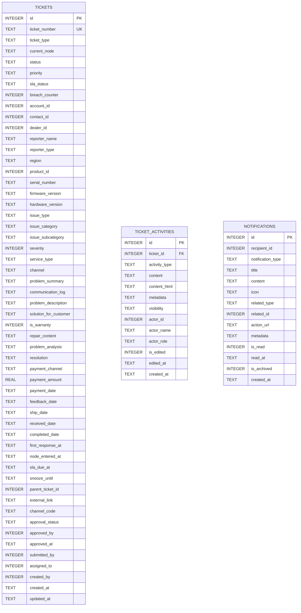

**图表来源**
- [020_p2_unified_tickets.sql](file://server/service/migrations/020_p2_unified_tickets.sql#L8-L122)
- [020_p2_unified_tickets.sql](file://server/service/migrations/020_p2_unified_tickets.sql#L145-L193)
- [020_p2_unified_tickets.sql](file://server/service/migrations/020_p2_unified_tickets.sql#L205-L247)

#### 状态机统一管理

统一工单架构实现了三种工单类型的状态机统一管理：

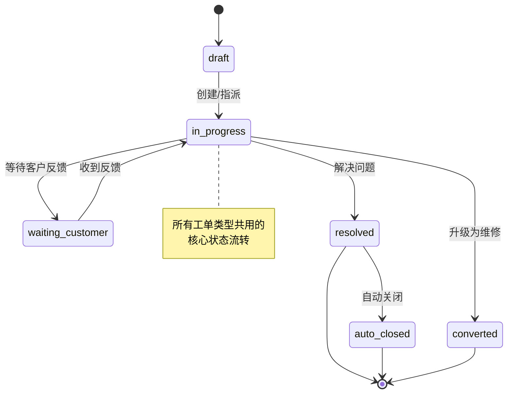

**章节来源**
- [020_p2_unified_tickets.sql](file://server/service/migrations/020_p2_unified_tickets.sql#L12-L19)

### 工单活动时间轴

统一工单架构引入了完整的活动时间轴系统，记录所有工单操作历史：

- **统一活动类型**：status_change、comment、internal_note、attachment等
- **可见性控制**：all、internal、technician三种可见性级别
- **参与者管理**：JSON格式存储参与者列表，支持@提及功能
- **元数据支持**：支持各种活动类型的自定义元数据

**章节来源**
- [020_p2_unified_tickets.sql](file://server/service/migrations/020_p2_unified_tickets.sql#L145-L193)

### 通知系统集成

统一工单架构集成了完整的通知系统：

- **多类型通知**：@提及、工单指派、状态变更、SLA预警等
- **目标用户**：基于角色的收件人自动识别
- **关联实体**：支持工单和系统两类关联实体
- **状态管理**：已读、归档状态跟踪

**章节来源**
- [020_p2_unified_tickets.sql](file://server/service/migrations/020_p2_unified_tickets.sql#L205-L247)

## 审计与合规功能

### 审计字段管理

系统实现了严格的审计字段管理机制，确保关键字段修改的合规性：

#### 审计字段清单

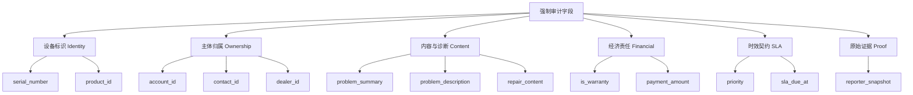

**图表来源**
- [tickets.js](file://server/service/routes/tickets.js#L16-L30)

#### 终结期节点保护

系统对终结期节点实施特殊保护，防止关键字段被修改：

- **终结期节点**：resolved、closed、auto_closed、converted、cancelled
- **管理员特权**：终结期工单允许管理员进行强制修改
- **审计要求**：所有关键字段修改必须提供审计原因

**章节来源**
- [tickets.js](file://server/service/routes/tickets.js#L32-L33)

### 审计日志系统

系统建立了完整的审计日志追踪机制：

#### 审计日志表结构

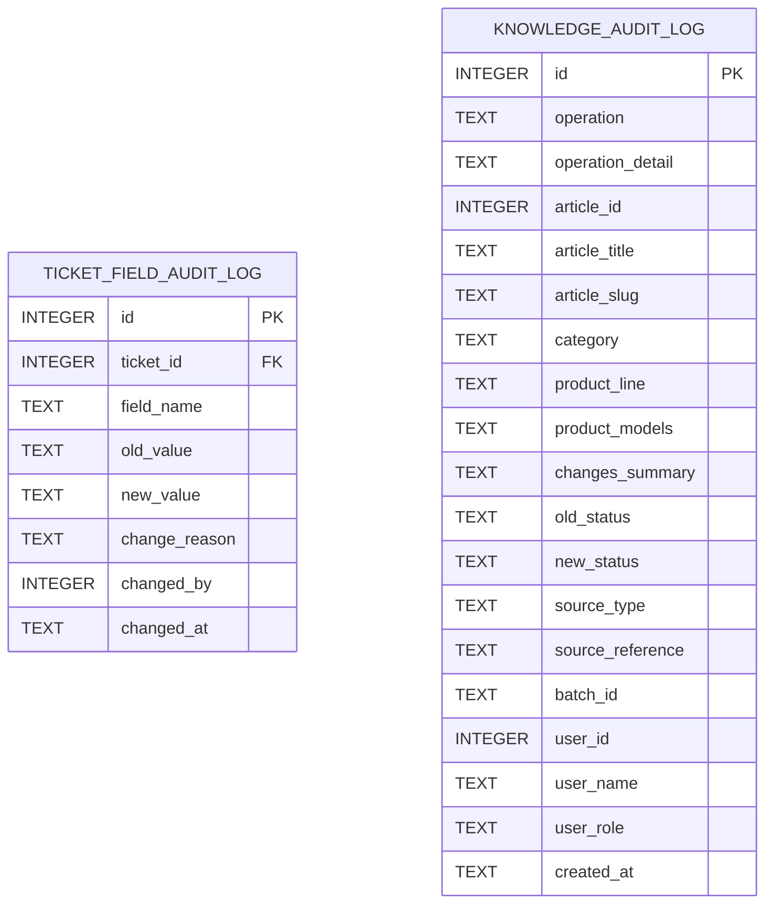

**图表来源**
- [025_ticket_audit_softdelete.sql](file://server/service/migrations/025_ticket_audit_softdelete.sql#L23-L35)
- [add_knowledge_audit_log.sql](file://server/migrations/add_knowledge_audit_log.sql#L4-L41)

#### 审计日志记录流程

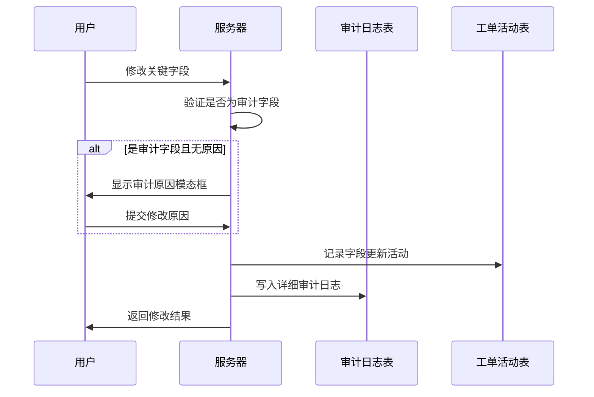

**图表来源**
- [AuditReasonModal.tsx](file://client/src/components/Service/AuditReasonModal.tsx#L47-L52)
- [tickets.js](file://server/service/routes/tickets.js#L986-L1048)

**章节来源**
- [025_ticket_audit_softdelete.sql](file://server/service/migrations/025_ticket_audit_softdelete.sql#L23-L35)
- [tickets.js](file://server/service/routes/tickets.js#L986-L1048)

### 软删除功能

系统实现了墓碑化软删除机制，确保数据的可追溯性：

#### 软删除字段设计

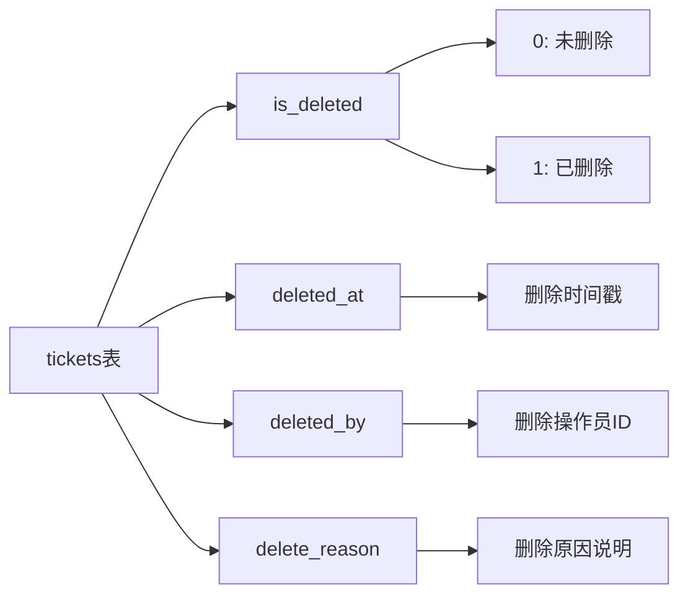

**图表来源**
- [025_ticket_audit_softdelete.sql](file://server/service/migrations/025_ticket_audit_softdelete.sql#L7-L10)

#### 软删除操作流程

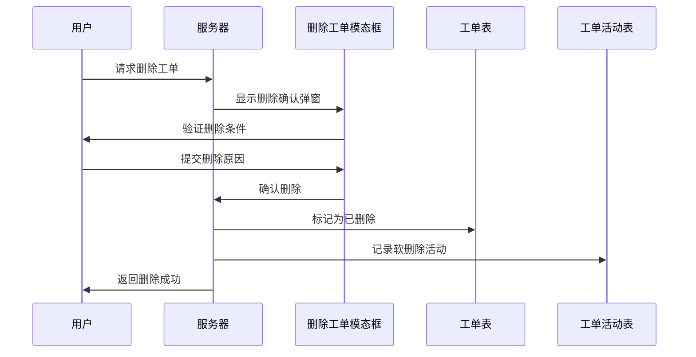

**图表来源**
- [DeleteTicketModal.tsx](file://client/src/components/Service/DeleteTicketModal.tsx#L48-L53)
- [tickets.js](file://server/service/routes/tickets.js#L1212-L1231)

**章节来源**
- [025_ticket_audit_softdelete.sql](file://server/service/migrations/025_ticket_audit_softdelete.sql#L7-L10)
- [DeleteTicketModal.tsx](file://client/src/components/Service/DeleteTicketModal.tsx#L27-L53)
- [tickets.js](file://server/service/routes/tickets.js#L1212-L1231)

## 前端组件架构

### 统一工单详情组件

新增的UnifiedTicketDetail组件提供了统一的工单详情视图，采用macOS26风格设计：

#### 双栏布局设计

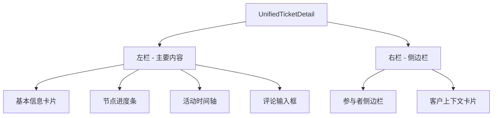

**图表来源**
- [UnifiedTicketDetail.tsx](file://client/src/components/Workspace/UnifiedTicketDetail.tsx#L160-L348)

#### 核心组件功能

- **基本信息展示**：工单号、状态、优先级、SLA状态、客户信息等
- **节点进度可视化**：针对RMA/SVC工单的阶段流转进度条
- **活动时间轴**：完整的工单操作历史记录
- **评论系统**：支持@提及的评论输入和显示

**章节来源**
- [UnifiedTicketDetail.tsx](file://client/src/components/Workspace/UnifiedTicketDetail.tsx#L1-L389)

### AuditReasonModal审计原因模态框

专门设计的审计原因输入组件，确保关键字段修改的合规性：

#### 审计原因输入流程

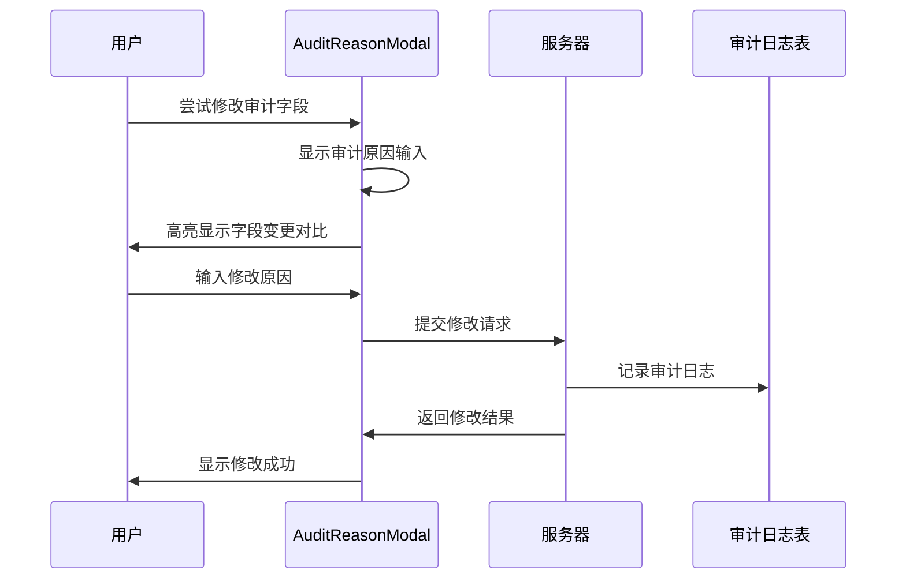

**图表来源**
- [AuditReasonModal.tsx](file://client/src/components/Service/AuditReasonModal.tsx#L47-L52)

#### 功能特性

- **字段变更对比**：清晰显示旧值和新值的对比
- **强制原因输入**：关键字段修改必须提供原因说明
- **终结期保护**：终结期工单的特权修改模式
- **实时验证**：确保修改原因的完整性和有效性

**章节来源**
- [AuditReasonModal.tsx](file://client/src/components/Service/AuditReasonModal.tsx#L32-L345)

### DeleteTicketModal删除工单模态框

专门设计的删除确认组件，确保工单删除操作的合规性：

#### 删除确认流程

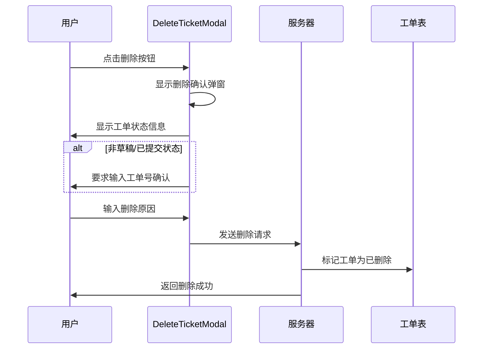

**图表来源**
- [DeleteTicketModal.tsx](file://client/src/components/Service/DeleteTicketModal.tsx#L48-L53)

#### 功能特性

- **状态检查**：根据工单状态决定是否需要确认
- **原因强制**：删除操作必须提供原因说明
- **管理员模式**：管理员权限下的特殊处理
- **安全确认**：重要状态下要求二次确认

**章节来源**
- [DeleteTicketModal.tsx](file://client/src/components/Service/DeleteTicketModal.tsx#L27-L386)

### UnifiedTicketDetailPage统一工单详情页面

新增的路由入口组件，提供统一的工单详情访问方式：

#### 路由处理流程

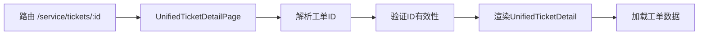

**图表来源**
- [UnifiedTicketDetailPage.tsx](file://client/src/components/Service/UnifiedTicketDetailPage.tsx#L11-L31)

#### 功能特性

- **统一入口**：所有工单详情路由统一指向此页面
- **ID验证**：确保工单ID的有效性
- **导航支持**：提供返回上一页的功能
- **错误处理**：无效ID时显示友好提示

**章节来源**
- [UnifiedTicketDetailPage.tsx](file://client/src/components/Service/UnifiedTicketDetailPage.tsx#L1-L34)

### MentionCommentInput评论输入组件

专门设计的评论输入组件，支持智能@提及功能：

#### @提及功能实现

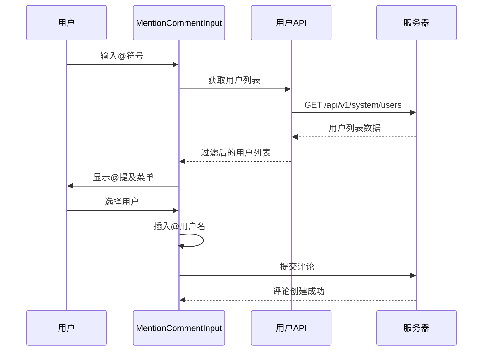

**图表来源**
- [MentionCommentInput.tsx](file://client/src/components/Workspace/MentionCommentInput.tsx#L29-L116)

#### 功能特性

- **智能@提及**：输入@符号时自动显示用户选择菜单
- **键盘导航**：支持上下键选择和回车确认
- **可见性控制**：支持所有人可见、内部可见、仅OP可见三种模式
- **实时验证**：自动验证提及用户的有效性

**章节来源**
- [MentionCommentInput.tsx](file://client/src/components/Workspace/MentionCommentInput.tsx#L1-L259)

### NodeProgressBar节点进度条

专门为RMA和SVC工单设计的节点进度可视化组件：

#### 节点流程设计

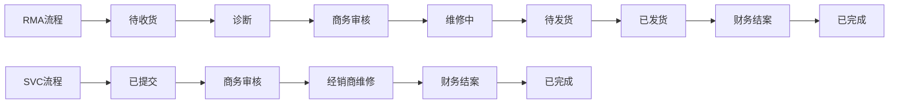

**图表来源**
- [NodeProgressBar.tsx](file://client/src/components/Workspace/NodeProgressBar.tsx#L10-L29)

#### 进度指示功能

- **阶段可视化**：圆形节点显示当前所处阶段
- **部门标识**：显示负责部门（OP/MS/DL/GE）
- **状态动画**：当前阶段的脉冲动画效果
- **国际化支持**：支持中英文标签显示

**章节来源**
- [NodeProgressBar.tsx](file://client/src/components/Workspace/NodeProgressBar.tsx#L1-L205)

### ParticipantsSidebar参与者侧边栏

完整的参与者管理组件，支持工单协作：

#### 参与者管理功能

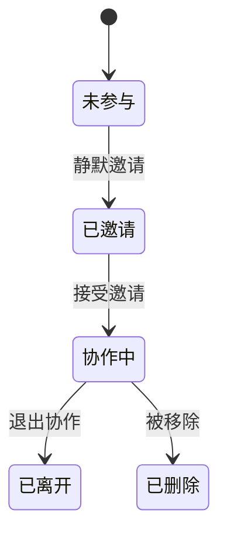

#### 角色权限系统

- **创建者**：拥有最高权限，可管理所有参与者
- **处理人**：主要责任人，可编辑工单内容
- **协作中**：普通参与者，可查看和评论
- **自动@提及**：评论中@的用户自动成为参与者

**章节来源**
- [ParticipantsSidebar.tsx](file://client/src/components/Workspace/ParticipantsSidebar.tsx#L1-L206)

## 数据迁移与兼容性

### 历史数据迁移

系统完成了从旧架构到新架构的完整数据迁移，确保业务连续性：

#### 迁移策略

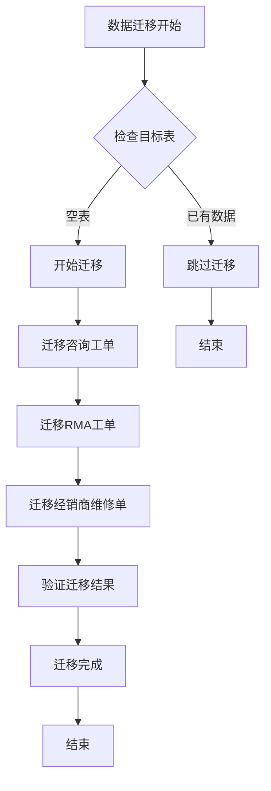

#### 字段映射转换

迁移过程中实现了精确的字段映射和状态转换：

- **状态映射**：旧状态到新状态机的准确转换
- **优先级映射**：R1/R2/R3到P0/P1/P2的优先级转换
- **类型转换**：reporter_type的dealer/customer/internal识别
- **父子关系**：父工单ID的自动查找和转换

**章节来源**
- [021_migrate_tickets_data.js](file://server/service/migrations/021_migrate_tickets_data.js#L51-L329)

### 向后兼容适配层

系统通过适配层确保旧应用的无缝运行：

#### API路由转发

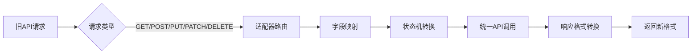

#### 字段映射规则

适配器自动处理字段格式转换：

- **inquiry类型映射**：customer_id→account_id，handler_id→assigned_to
- **rma类型映射**：repair_priority→priority，inquiry_ticket_id→parent_ticket_id
- **svc类型映射**：customer_id→account_id，inquiry_ticket_id→parent_ticket_id
- **优先级双向转换**：R/P等级的互转

**章节来源**
- [tickets.js](file://server/service/routes/tickets.js#L218-L339)

## API接口变更

### 统一工单API规范

新的统一工单API提供了统一的CRUD操作接口：

#### 核心API端点

| 方法 | 端点 | 描述 |
|------|------|------|
| GET | `/api/v1/tickets` | 获取工单列表 |
| POST | `/api/v1/tickets` | 创建新工单 |
| GET | `/api/v1/tickets/{id}` | 获取工单详情 |
| PATCH | `/api/v1/tickets/{id}` | 更新工单信息 |
| DELETE | `/api/v1/tickets/{id}` | 删除工单 |
| POST | `/api/v1/tickets/{id}/snooze` | 设置贪睡模式 |
| GET | `/api/v1/tickets/{id}/activities` | 获取活动列表 |
| POST | `/api/v1/tickets/{id}/activities` | 添加活动记录 |
| POST | `/api/v1/tickets/{id}/participants` | 添加参与者 |
| DELETE | `/api/v1/tickets/{id}/participants/{userId}` | 移除参与者 |

#### 统一查询参数

统一工单API支持丰富的查询过滤参数：

- **类型过滤**：ticket_type (inquiry/rma/svc)
- **状态过滤**：status、current_node、priority、sla_status
- **归属过滤**：account_id、dealer_id、assigned_to、submitted_by
- **时间过滤**：created_from、created_to
- **关键字搜索**：keyword（支持工单号、摘要、描述、序列号、账户名）

**章节来源**
- [tickets.js](file://server/service/routes/tickets.js#L218-L339)

### 向后兼容API

为了确保现有应用的兼容性，系统保留了旧的API端点：

#### 适配器路由配置

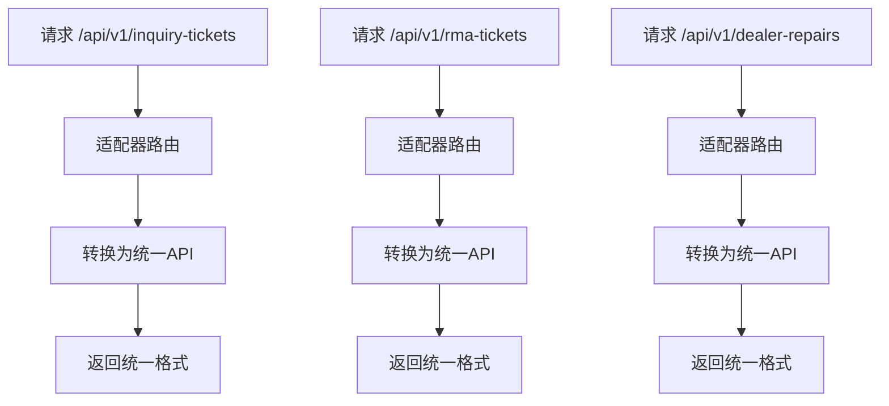

#### 自动字段转换

适配器自动处理字段格式转换：

- **日期格式**：统一ISO 8601格式
- **状态字段**：新旧状态码的自动映射
- **优先级字段**：R/P等级的双向转换
- **关联字段**：account_id/contact_id的自动识别

**章节来源**
- [tickets.js](file://server/service/routes/tickets.js#L218-L339)

### 审计相关API

新增的审计功能通过以下API端点提供支持：

#### 审计日志查询

- **GET** `/api/v1/tickets/{id}/audit-log` - 获取工单审计日志
- **GET** `/api/v1/tickets/{id}/audit-log/{field}` - 获取特定字段的审计历史

#### 软删除相关

- **PATCH** `/api/v1/tickets/{id}/undelete` - 恢复已删除工单
- **GET** `/api/v1/tickets?is_deleted=1` - 查询已删除工单

**章节来源**
- [025_ticket_audit_softdelete.sql](file://server/service/migrations/025_ticket_audit_softdelete.sql#L23-L35)
- [tickets.js](file://server/service/routes/tickets.js#L1212-L1231)

## 工作区功能

### 工作区架构设计

新的工作区采用三视图架构，提供统一的工单管理界面：

#### 三视图设计

```mermaid
graph TB
A[工作区] --> B[我的任务]
A --> C[@提到我的]
A --> D[团队队列]
B --> E[TicketList]
C --> E
D --> E
E --> F[UnifiedTicketDetail]
```

#### 视图切换机制

- **我的任务**：显示分配给当前用户的工单
- **@提到我的**：显示包含当前用户@提及的工单
- **团队队列**：显示团队负责的工单

**章节来源**
- [WorkspacePage.tsx](file://client/src/components/Service/WorkspacePage.tsx#L76-L102)
- [WorkspaceComponents.tsx](file://client/src/components/Workspace/WorkspaceComponents.tsx#L59-L118)

### 工具栏和过滤器

工作区工具栏提供强大的筛选和搜索功能：

#### 过滤器选项

- **工单类型**：咨询、RMA、经销商维修
- **优先级**：P0紧急、P1高、P2普通
- **状态**：开放、处理中、等待、已解决、已关闭
- **搜索**：支持关键字全文搜索

#### 实时统计

- **收件箱计数**：未处理工单数量
- **指派计数**：分配给当前用户的工单
- **SLA告警**：即将超时的工单
- **总数统计**：所有工单的汇总

**章节来源**
- [WorkspaceComponents.tsx](file://client/src/components/Workspace/WorkspaceComponents.tsx#L130-L200)

## 新功能特性

### SLA引擎集成

统一工单架构引入了完整的SLA（服务等级协议）引擎：

#### 优先级管理

| 优先级 | 响应时间 | 解决时间 | 描述 |
|--------|----------|----------|------|
| P0 | 2小时 | 36小时 | 紧急问题，最高优先级 |
| P1 | 8小时 | 3个工作日 | 高优先级问题 |
| P2 | 24小时 | 7个工作日 | 标准优先级问题 |

#### SLA状态监控

- **实时监控**：自动跟踪每个节点的SLA状态
- **预警机制**：临近超时自动发送预警通知
- **超时统计**：累计超时次数和影响分析

**章节来源**
- [020_p2_unified_tickets.sql](file://server/service/migrations/020_p2_unified_tickets.sql#L22-L30)
- [sla_service.js](file://server/service/sla_service.js#L8-L28)

### 活动时间轴功能

统一工单架构提供了完整的活动时间轴功能：

#### 活动类型支持

- **状态变更**：工单状态的完整变更历史
- **评论互动**：用户间的实时评论和讨论
- **附件管理**：工单相关文件的上传和管理
- **@提及**：自动检测和通知被提及的用户

#### 可见性控制

- **公开可见**：所有用户都能看到的活动
- **内部可见**：仅内部员工可见的活动
- **技术可见**：仅技术支持人员可见的活动

**章节来源**
- [020_p2_unified_tickets.sql](file://server/service/migrations/020_p2_unified_tickets.sql#L150-L163)
- [ticket-activities.js](file://server/service/routes/ticket-activities.js#L245-L315)

### 通知系统

统一工单架构集成了智能通知系统：

#### 通知类型

- **@提及通知**：当被@时自动通知
- **工单指派通知**：新工单指派时的通知
- **状态变更通知**：工单状态更新时的通知
- **SLA预警通知**：SLA即将超时时的预警
- **SLA超时通知**：SLA超时时的通知
- **新评论通知**：新评论时的通知
- **参与者添加通知**：被加入参与者时的通知
- **贪睡到期通知**：贪睡到期时的通知
- **系统公告通知**：系统公告时的通知

#### 智能路由

- **角色识别**：自动识别通知接收者的角色
- **权限控制**：确保通知内容的适当性
- **个性化设置**：支持用户的个性化通知偏好

**章节来源**
- [020_p2_unified_tickets.sql](file://server/service/migrations/020_p2_unified_tickets.sql#L210-L220)
- [NotificationCenter.tsx](file://client/src/components/Notifications/NotificationCenter.tsx#L22-L35)

### 协作机制

统一工单架构引入了完整的协作机制：

#### 参与者管理

- **角色系统**：创建者、处理人、协作中三种角色
- **权限控制**：不同角色具有不同的操作权限
- **自动@提及**：评论中@的用户自动成为参与者
- **静默邀请**：管理员可直接邀请用户参与

#### 贪睡模式

- **临时延迟**：用户可设置特定时间段内的提醒延迟
- **智能提醒**：贪睡结束后自动恢复提醒
- **团队协作**：支持团队成员间的贪睡协调

**章节来源**
- [020_p2_unified_tickets.sql](file://server/service/migrations/020_p2_unified_tickets.sql#L32-L34)
- [UnifiedTicketDetail.tsx](file://client/src/components/Workspace/UnifiedTicketDetail.tsx#L113-L125)

### 审计与合规增强

系统新增的审计功能显著增强了合规管理能力：

#### 审计字段变更追踪

- **强制审计字段**：关键业务字段的修改必须记录
- **变更对比**：自动记录旧值和新值的对比
- **修改原因**：强制要求提供修改原因说明
- **终结期保护**：终结期工单的特殊修改流程

#### 软删除管理

- **墓碑化删除**：删除标记而非物理删除
- **删除原因**：强制要求提供删除原因
- **恢复功能**：支持已删除工单的恢复
- **审计追踪**：完整的删除操作记录

**章节来源**
- [tickets.js](file://server/service/routes/tickets.js#L16-L33)
- [025_ticket_audit_softdelete.sql](file://server/service/migrations/025_ticket_audit_softdelete.sql#L7-L10)

## 性能优化

### 数据库性能优化

统一工单架构在数据库层面实现了多项性能优化：

#### 索引策略

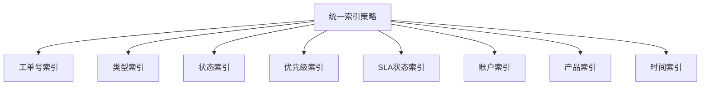

- **复合索引**：为常用查询组合建立复合索引
- **分区策略**：按时间分区优化大表查询
- **统计信息**：定期更新数据库统计信息

#### 查询优化

- **统一查询**：所有工单类型使用相同的查询逻辑
- **缓存策略**：热点数据的智能缓存机制
- **连接优化**：减少不必要的表连接操作

### API性能优化

#### 请求优化

- **批量操作**：支持批量工单查询和更新
- **分页机制**：默认分页大小200，支持自定义
- **排序优化**：支持多字段排序的索引优化

#### 缓存机制

- **响应缓存**：热门查询结果的短期缓存
- **状态缓存**：工单状态的实时缓存
- **配置缓存**：系统配置的静态缓存

**章节来源**
- [useCachedTickets.ts](file://client/src/hooks/useCachedTickets.ts#L80-L122)

## 故障排除

### 常见迁移问题

#### 数据迁移失败

**症状**：数据迁移过程中出现错误

**排查步骤**:
1. 检查源数据库连接状态
2. 验证目标数据库权限
3. 确认磁盘空间充足
4. 查看迁移日志中的具体错误

**解决方案**:
- 重新启动迁移脚本
- 检查数据库连接配置
- 清理中断的事务状态
- 验证数据完整性

#### 字段映射错误

**症状**：迁移后的数据字段值不正确

**排查步骤**:
1. 检查状态映射表是否正确
2. 验证优先级转换逻辑
3. 确认类型转换规则
4. 查看特殊字符处理

**解决方案**:
- 更新映射配置
- 修复转换逻辑
- 手动修正特殊数据
- 重新执行部分迁移

### API兼容性问题

#### 适配器路由错误

**症状**：旧API请求无法正确转发

**排查步骤**:
1. 检查适配器路由配置
2. 验证字段映射规则
3. 确认状态转换逻辑
4. 查看适配器日志

**解决方案**:
- 重启适配器服务
- 更新路由配置
- 修正映射规则
- 重新部署适配器

#### 数据格式不兼容

**症状**：统一API返回的数据格式与预期不符

**排查步骤**:
1. 检查统一API响应格式
2. 验证字段转换逻辑
3. 确认日期格式处理
4. 查看特殊字段处理

**解决方案**:
- 更新前端数据处理逻辑
- 修正适配器转换规则
- 添加数据格式验证
- 实施向前兼容处理

### 前端组件问题

#### 统一工单详情加载失败

**症状**：UnifiedTicketDetail组件无法加载工单数据

**排查步骤**:
1. 检查API响应格式
2. 验证认证令牌有效性
3. 确认工单ID存在性
4. 查看网络请求状态

**解决方案**:
- 检查API端点可用性
- 验证用户权限
- 重新获取认证令牌
- 实施重试机制

#### @提及功能异常

**症状**：MentionCommentInput组件的@提及功能失效

**排查步骤**:
1. 检查用户列表API
2. 验证@符号检测逻辑
3. 确认用户选择交互
4. 查看控制台错误

**解决方案**:
- 修复用户API调用
- 修正正则表达式匹配
- 优化键盘事件处理
- 添加错误边界处理

#### 审计原因输入问题

**症状**：AuditReasonModal组件无法正常显示或提交

**排查步骤**:
1. 检查审计字段验证逻辑
2. 验证模态框显示条件
3. 确认表单提交流程
4. 查看错误日志

**解决方案**:
- 修复审计字段检测逻辑
- 修正模态框显示条件
- 优化表单验证流程
- 添加错误处理机制

### 性能问题

#### 查询响应慢

**症状**：统一API查询响应时间过长

**排查步骤**:
1. 检查数据库索引使用情况
2. 验证查询执行计划
3. 确认缓存命中率
4. 查看数据库连接池状态

**解决方案**:
- 优化查询索引
- 实施查询缓存
- 调整数据库配置
- 实施分页查询

#### 内存使用过高

**症状**：系统内存使用持续增长

**排查步骤**:
1. 检查内存泄漏情况
2. 验证缓存清理机制
3. 确认连接池配置
4. 查看垃圾回收状态

**解决方案**:
- 优化内存使用模式
- 实施缓存清理策略
- 调整连接池大小
- 实施内存监控

## 结论

Longhorn三层工单模型的统一化改造标志着系统架构的重大升级，实现了从分散管理到统一治理的根本性转变。

### 架构优势

**统一管理**：单一工单表和统一API实现了真正的工单一体化管理，消除了数据孤岛和操作复杂性。

**标准化流程**：统一的状态机和活动时间轴确保了所有工单类型的流程一致性，提升了服务质量和效率。

**智能监控**：SLA引擎和通知系统的集成实现了工单处理的智能化监控和管理。

**兼容性保障**：完善的向后兼容适配层确保了业务连续性，降低了迁移风险。

**协作增强**：全新的协作机制和@提及功能提升了团队协作效率。

**合规保障**：新增的审计功能和软删除机制显著增强了系统的合规性和数据安全性。

### 技术创新

**多态设计**：通过单一表多态设计实现了工单类型的灵活管理，既保持了类型差异又实现了统一管理。

**活动时间轴**：完整的活动记录系统提供了工单处理的完整审计轨迹，支持合规要求和质量改进。

**智能通知**：基于角色的智能通知系统提升了沟通效率和响应速度。

**前端现代化**：macOS26风格的界面设计和组件化架构提升了用户体验。

**性能优化**：统一的索引策略和查询优化确保了大规模数据场景下的性能表现。

**审计追踪**：完整的审计日志系统提供了全面的操作追踪和合规保障。

### 业务价值

**运营效率**：统一的工单管理减少了操作复杂性和培训成本，提升了整体运营效率。

**服务质量**：标准化的流程和SLA监控确保了服务质量的一致性和可预期性。

**成本控制**：统一的架构降低了维护成本和系统复杂度，实现了更好的成本效益。

**扩展能力**：统一的架构为未来的功能扩展和业务发展奠定了坚实基础。

**合规保障**：完善的审计功能和软删除机制满足了企业级的合规要求。

### 发展前景

统一工单架构为Longhorn系统的未来发展提供了强大的技术支撑，通过持续的优化和创新，将为用户提供更加智能、高效、可靠的服务体验。系统的统一化改造不仅是技术升级，更是服务理念的转变，从被动响应向主动服务的转型，为Kinefinity的客户服务提供了更加坚实的保障。

**更新** 系统现已完全实现从三层独立工单到统一多态工单架构的转型，通过统一API、统一数据模型、统一状态机管理，实现了真正的服务一体化。新增的前端组件和工作区功能提供了现代化的用户体验，SLA引擎和协作机制确保了服务的专业化管理。向后兼容适配层确保了业务连续性，为Kinefinity的售后服务体系奠定了坚实的技术基础。

**新增审计与软删除功能进一步增强了系统的合规性和数据安全性**，通过强制审计字段变更记录、详细的审计日志追踪、墓碑化软删除机制，系统实现了全面的操作审计和数据保护，满足了企业级应用的严格要求。