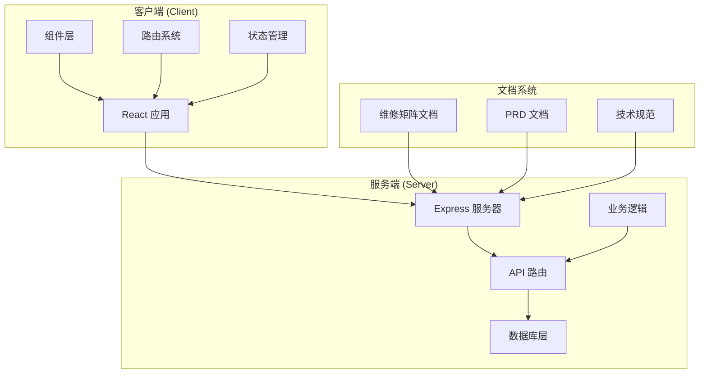
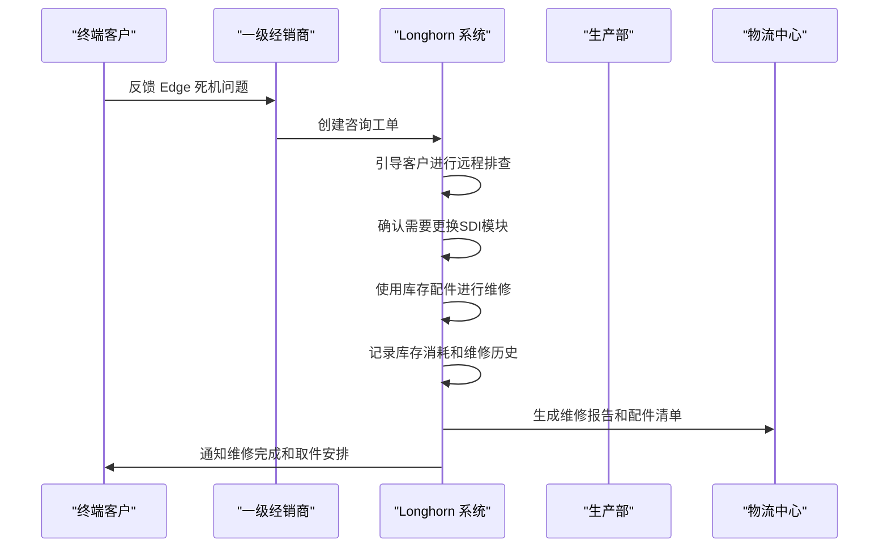
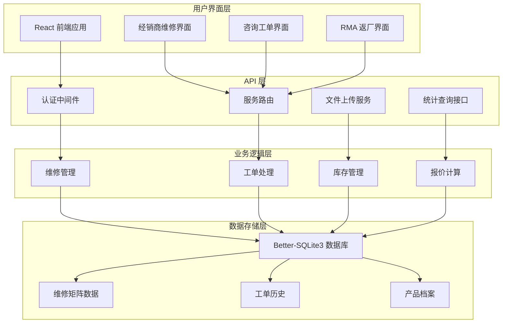
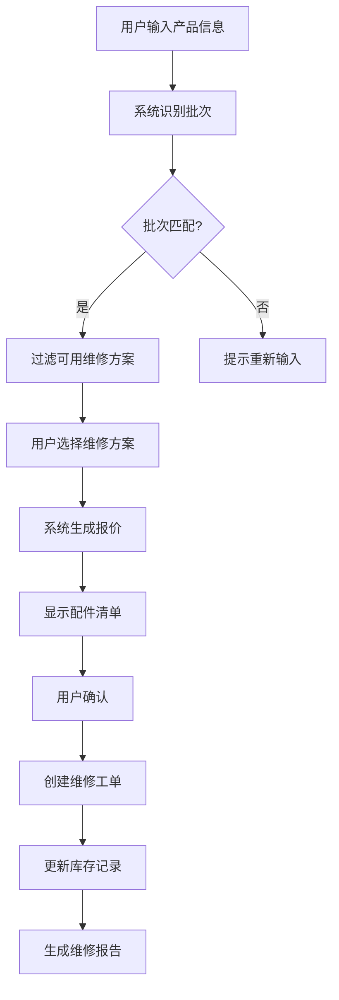
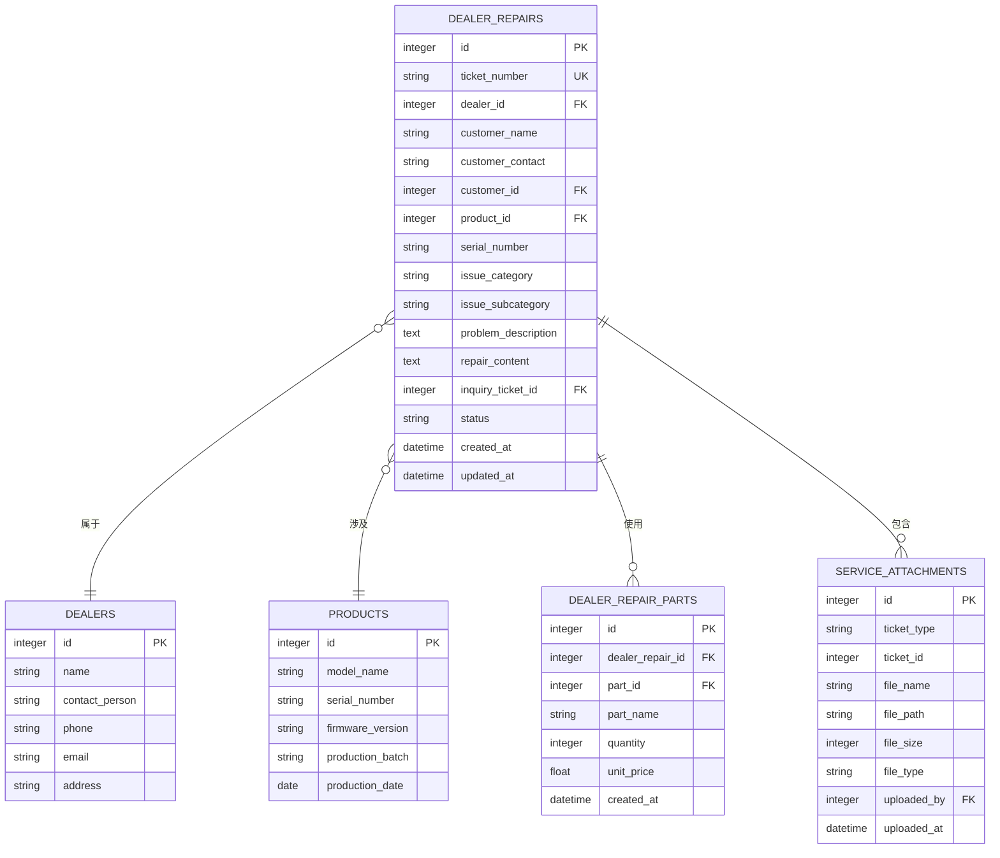
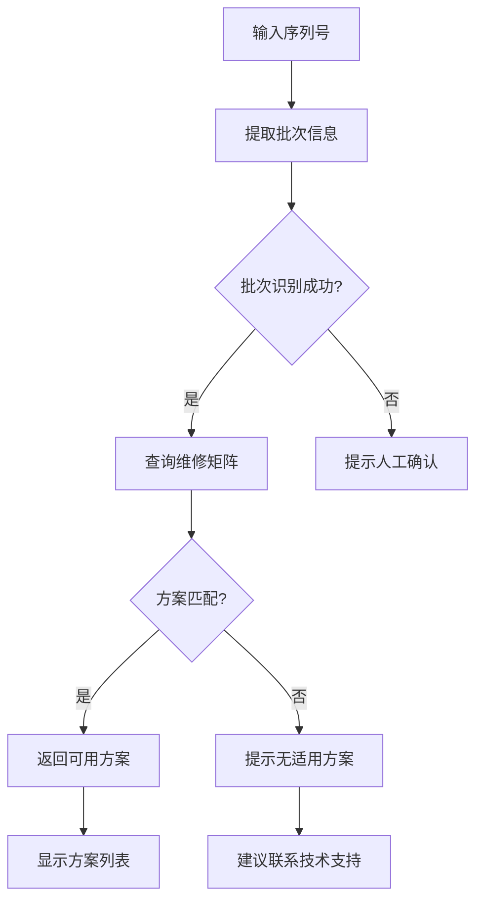
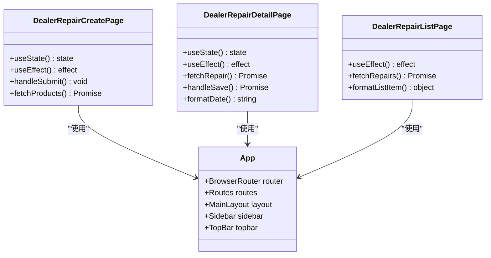
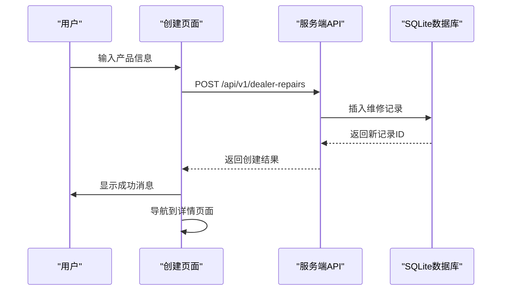
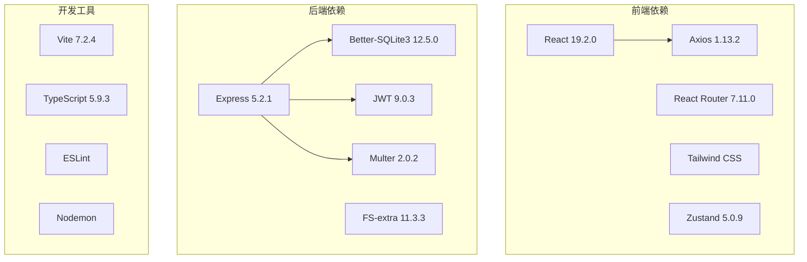
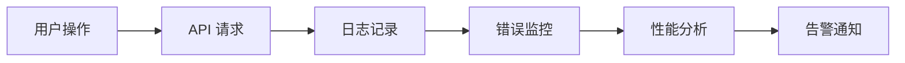

# 边缘前置维修矩阵

<cite>
**本文档引用的文件**
- [Edge_Front_Repair_Matrix.md](file://docs/Edge_Front_Repair_Matrix.md)
- [Service_PRD.md](file://docs/Service_PRD.md)
- [dealer-repairs.js](file://server/service/routes/dealer-repairs.js)
- [009_three_layer_tickets.sql](file://server/service/migrations/009_three_layer_tickets.sql)
- [006_repair_management.sql](file://server/service/migrations/006_repair_management.sql)
- [index.js](file://server/service/index.js)
- [App.tsx](file://client/src/App.tsx)
- [DealerRepairCreatePage.tsx](file://client/src/components/DealerRepairs/DealerRepairCreatePage.tsx)
- [DealerRepairDetailPage.tsx](file://client/src/components/DealerRepairs/DealerRepairDetailPage.tsx)
- [index.js](file://server/index.js)
- [package.json](file://client/package.json)
- [package.json](file://server/package.json)
</cite>

## 目录
1. [简介](#简介)
2. [项目结构](#项目结构)
3. [核心组件](#核心组件)
4. [架构概览](#架构概览)
5. [详细组件分析](#详细组件分析)
6. [依赖关系分析](#依赖关系分析)
7. [性能考虑](#性能考虑)
8. [故障排除指南](#故障排除指南)
9. [结论](#结论)

## 简介

边缘前置维修矩阵是 Kinefinity 产品服务闭环系统中的一个关键组成部分，专门针对 MAVO Edge 8K 和 Edge 6K 摄影机的前部维修场景制定标准化的维修方案。该矩阵确保不同批次的机型（Edge 8K 1/2/3 和 Edge 6K 1/2）能够获得正确的配件组合和报价，避免一线服务人员因配件混用导致的兼容性问题。

系统采用三层工单模型，其中经销商维修单（Dealer Repairs）作为第三层，专门处理不需要寄回总部的本地维修场景。维修矩阵为每个维修方案定义了详细的配件清单、工时费和报价规则，支持在保和过保的不同定价策略。

## 项目结构

Longhorn 项目采用前后端分离的架构设计，主要包含以下核心组件：

**图表来源**
- [App.tsx](file://client/src/App.tsx#L1-L211)
- [index.js](file://server/index.js#L1-L800)

**章节来源**
- [App.tsx](file://client/src/App.tsx#L1-L211)
- [index.js](file://server/index.js#L1-L800)

## 核心组件

### 维修矩阵系统

维修矩阵系统基于标准化的维修方案，为不同批次的 Edge 摄影机提供精确的维修指导：

| 方案代码 | 适用机型 | 维修内容 | 配件清单 | 工时费 | 总价 |
|---------|---------|---------|---------|--------|------|
| **B1** | Edge 8K 1/2 | 仅更换前部框架 | 前部框架 + FRONT模块 + 碳纤维(C1) | 国内: ¥200 海外: $50 | 国内: ¥1190 海外: $249 |
| **B2** | Edge 8K 2 | 前部简化方案 | 前部框架(简化) + FRONT模块 | 国内: ¥100 海外: $30 | 国内: ¥799 海外: $199 |
| **A1** | Edge 8K 1/2 | 完整更换 | 前部框架 + ND模块 + ND电机 + FRONT模块 + 碳纤维(C1) | 国内: ¥500 海外: $100 | 国内: ¥4190 海外: $849 |
| **A2** | Edge 8K 3, Edge 6K 2 | 新架构ND更换 | 前部框架(1.86) + ND模块 + ND电机 + 碳纤维(C2) | 国内: ¥400 海外: $80 | 国内: ¥2990 海外: $549 |
| **A3** | Edge 6K 1 | 早期ND更换 | 前部框架(6K) + ND模块 + ND电机 | 国内: ¥450 海外: $90 | 国内: ¥3790 海外: $649 |

### 三层工单模型

系统采用统一的三层工单模型，确保服务流程的标准化：

**图表来源**
- [Service_PRD.md](file://docs/Service_PRD.md#L988-L1008)

**章节来源**
- [Edge_Front_Repair_Matrix.md](file://docs/Edge_Front_Repair_Matrix.md#L1-L291)
- [Service_PRD.md](file://docs/Service_PRD.md#L68-L147)

## 架构概览

### 系统架构图

**图表来源**
- [index.js](file://server/service/index.js#L1-L266)
- [dealer-repairs.js](file://server/service/routes/dealer-repairs.js#L1-L472)

### 数据流架构

**图表来源**
- [Edge_Front_Repair_Matrix.md](file://docs/Edge_Front_Repair_Matrix.md#L210-L246)

**章节来源**
- [index.js](file://server/service/index.js#L1-L266)
- [dealer-repairs.js](file://server/service/routes/dealer-repairs.js#L1-L472)

## 详细组件分析

### 经销商维修系统

#### 数据模型设计

经销商维修系统基于标准化的数据模型，支持完整的维修生命周期管理：

**图表来源**
- [009_three_layer_tickets.sql](file://server/service/migrations/009_three_layer_tickets.sql#L136-L198)
- [006_repair_management.sql](file://server/service/migrations/006_repair_management.sql#L10-L43)

#### API 接口设计

系统提供完整的 RESTful API 接口，支持经销商维修的全生命周期管理：

| 端点 | 方法 | 描述 | 请求体 | 响应 |
|------|------|------|--------|------|
| `/api/v1/dealer-repairs` | GET | 获取维修工单列表 | 查询参数 | 工单数组 |
| `/api/v1/dealer-repairs` | POST | 创建新的维修工单 | 工单数据 | 新工单信息 |
| `/api/v1/dealer-repairs/:id` | GET | 获取指定工单详情 | - | 工单详情 |
| `/api/v1/dealer-repairs/:id` | PATCH | 更新工单信息 | 更新数据 | 更新后的工单 |
| `/api/v1/dealer-repairs/:id` | DELETE | 删除工单 | - | 删除结果 |
| `/api/v1/dealer-repairs/stats` | GET | 获取统计信息 | - | 统计数据 |

**章节来源**
- [dealer-repairs.js](file://server/service/routes/dealer-repairs.js#L1-L472)

### 前部维修矩阵集成

#### 方案过滤机制

系统实现了智能的维修方案过滤机制，根据产品的批次信息自动筛选适用的维修方案：

**图表来源**
- [Edge_Front_Repair_Matrix.md](file://docs/Edge_Front_Repair_Matrix.md#L28-L42)

#### 报价计算逻辑

系统根据维修方案自动计算报价，支持在保和过保的不同定价策略：

| 维修类型 | 在保价格 | 过保价格 | 说明 |
|---------|---------|---------|------|
| **B1 方案** | 免费 | ¥1190/¥249 | 仅更换前部框架 |
| **B2 方案** | 免费/VIP | ¥799/¥199 | 前部简化方案 |
| **A1 方案** | 免费 | ¥4190/¥849 | 完整更换方案 |
| **A2 方案** | 免费 | ¥2990/¥549 | 新架构ND更换 |
| **A3 方案** | 免费 | ¥3790/¥649 | 6K早期ND更换 |

**章节来源**
- [Edge_Front_Repair_Matrix.md](file://docs/Edge_Front_Repair_Matrix.md#L186-L207)

### 前端用户界面

#### 组件架构

React 前端应用采用模块化的组件架构，支持经销商维修的完整工作流程：

**图表来源**
- [DealerRepairCreatePage.tsx](file://client/src/components/DealerRepairs/DealerRepairCreatePage.tsx#L1-L221)
- [DealerRepairDetailPage.tsx](file://client/src/components/DealerRepairs/DealerRepairDetailPage.tsx#L1-L505)
- [App.tsx](file://client/src/App.tsx#L1-L211)

#### 用户交互流程

**图表来源**
- [DealerRepairCreatePage.tsx](file://client/src/components/DealerRepairs/DealerRepairCreatePage.tsx#L45-L79)

**章节来源**
- [DealerRepairCreatePage.tsx](file://client/src/components/DealerRepairs/DealerRepairCreatePage.tsx#L1-L221)
- [DealerRepairDetailPage.tsx](file://client/src/components/DealerRepairs/DealerRepairDetailPage.tsx#L1-L505)

## 依赖关系分析

### 技术栈依赖

系统采用现代化的技术栈，确保良好的性能和可维护性：

**图表来源**
- [package.json](file://client/package.json#L12-L29)
- [package.json](file://server/package.json#L15-L29)

### 数据库关系

系统使用 Better-SQLite3 作为主要的数据存储，支持完整的 CRUD 操作和事务处理：

| 表名 | 主要用途 | 关键字段 | 约束条件 |
|------|---------|---------|---------|
| **dealer_repairs** | 经销商维修记录 | ticket_number, status, dealer_id | 唯一索引, 外键约束 |
| **dealer_repair_parts** | 维修配件使用记录 | dealer_repair_id, part_id, quantity | 复合索引, 外键约束 |
| **service_attachments** | 服务附件存储 | ticket_type, ticket_id, file_path | 复合索引 |
| **parts_catalog** | 配件目录管理 | part_number, category, is_active | 唯一索引, 状态控制 |
| **repair_quotations** | 维修报价管理 | quotation_number, issue_id, status | 唯一索引, 状态枚举 |

**章节来源**
- [009_three_layer_tickets.sql](file://server/service/migrations/009_three_layer_tickets.sql#L136-L198)
- [006_repair_management.sql](file://server/service/migrations/006_repair_management.sql#L10-L103)

## 性能考虑

### 数据库优化

系统采用多种数据库优化策略，确保在高并发场景下的稳定性能：

1. **连接池管理**: 使用 WAL 模式提高并发读写性能
2. **索引优化**: 为常用查询字段建立复合索引
3. **查询优化**: 使用参数化查询防止 SQL 注入
4. **缓存策略**: 对频繁访问的数据建立内存缓存

### 前端性能优化

React 应用采用现代前端优化技术：

1. **组件懒加载**: 按需加载大型组件减少初始包大小
2. **状态管理**: 使用 Zustand 替代 Redux 提高性能
3. **路由优化**: 实现客户端路由预加载
4. **资源压缩**: Vite 构建时自动压缩静态资源

### API 性能监控

系统提供完整的 API 性能监控机制：

- **请求追踪**: 记录每个 API 请求的处理时间和错误信息
- **响应时间**: 监控关键 API 的响应时间分布
- **错误率统计**: 实时监控 API 错误率和成功率
- **并发控制**: 限制同时处理的请求数量防止系统过载

## 故障排除指南

### 常见问题诊断

#### 维修方案无法匹配

**症状**: 选择产品后无法看到任何维修方案

**可能原因**:
1. 产品序列号格式不正确
2. 产品批次信息缺失
3. 维修矩阵配置错误

**解决方案**:
1. 验证序列号格式是否符合要求
2. 检查产品档案中的批次信息
3. 确认维修矩阵文档的最新版本

#### 报价计算错误

**症状**: 系统显示的报价与预期不符

**可能原因**:
1. 在保状态判断错误
2. 汇率转换问题
3. 配件价格更新延迟

**解决方案**:
1. 检查客户合同状态
2. 验证汇率设置
3. 同步配件价格数据库

#### 文件上传失败

**症状**: 附件上传过程中断

**可能原因**:
1. 文件大小超出限制
2. 文件类型不被允许
3. 服务器磁盘空间不足

**解决方案**:
1. 检查文件大小限制设置
2. 验证允许的文件类型
3. 清理服务器磁盘空间

**章节来源**
- [Edge_Front_Repair_Matrix.md](file://docs/Edge_Front_Repair_Matrix.md#L250-L275)

### 系统监控

#### 日志记录

系统实现完整的日志记录机制：

#### 健康检查

系统提供自动健康检查功能：

- **数据库连接**: 定期检查数据库连接状态
- **API 可用性**: 监控关键 API 的可用性
- **磁盘空间**: 监控服务器磁盘使用情况
- **内存使用**: 监控应用内存使用情况

## 结论

边缘前置维修矩阵系统通过标准化的维修方案和智能化的系统集成，有效解决了 Edge 摄影机前部维修中的兼容性问题。系统采用三层工单模型，确保从咨询到维修的完整服务流程，同时通过严格的配件管理和报价计算，保证了维修质量和成本控制。

该系统的成功实施不仅提高了维修效率，减少了错误维修的发生，还为后续的系统扩展和功能增强奠定了坚实的基础。通过持续的优化和改进，系统将继续为 Kinefinity 的客户服务提供强有力的支持。

未来的发展方向包括：
1. **AI 辅助诊断**: 集成人工智能技术提供更精准的问题诊断
2. **预测性维护**: 基于数据分析预测潜在的硬件问题
3. **移动端支持**: 开发专用的移动应用提升用户体验
4. **国际化扩展**: 支持更多语言和地区的服务需求