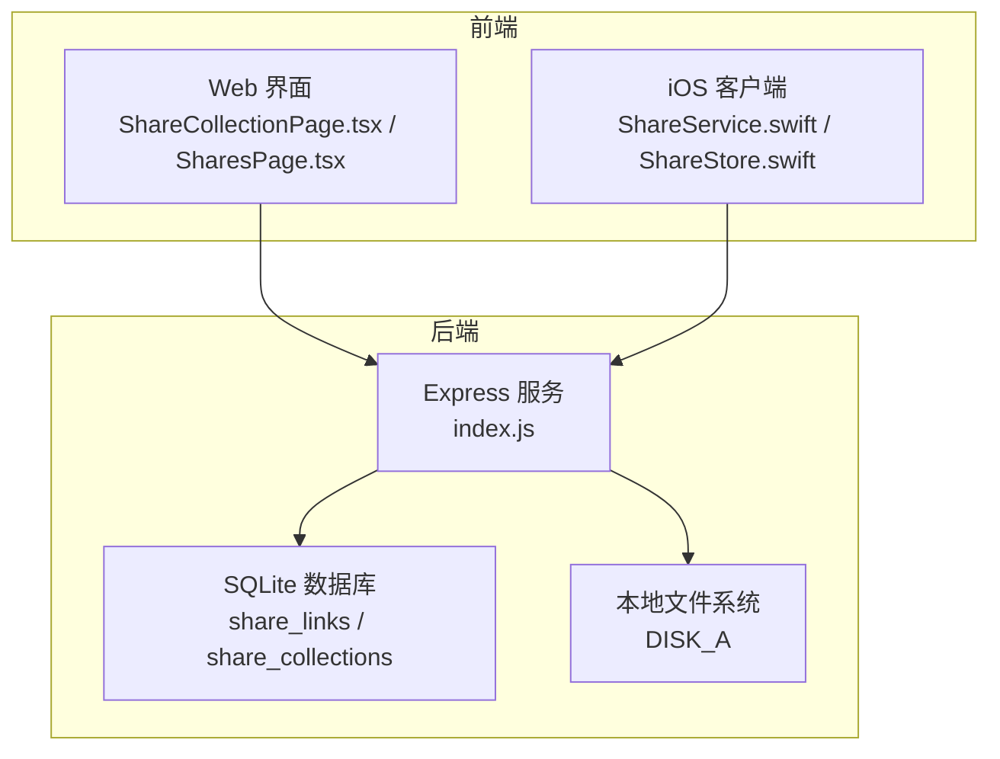
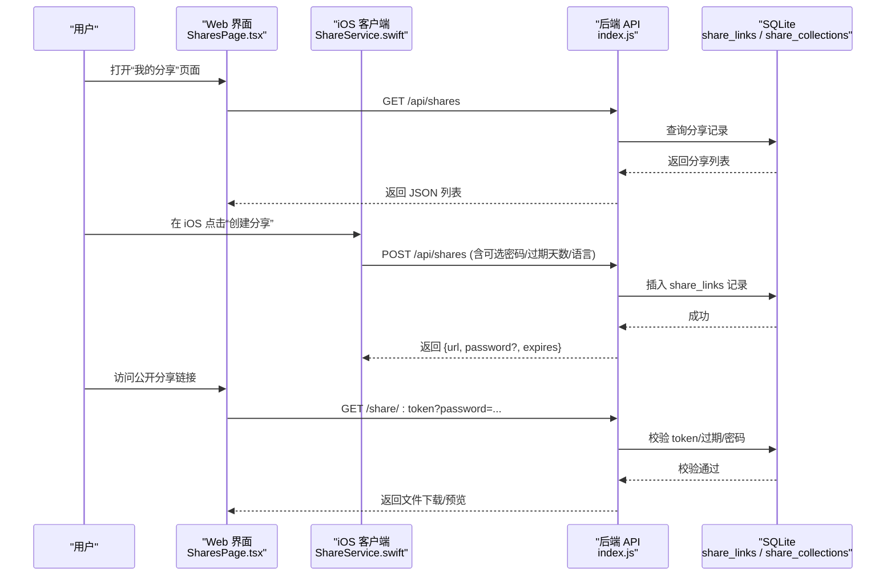
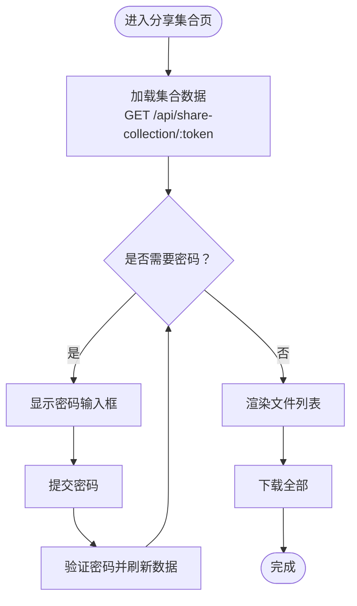
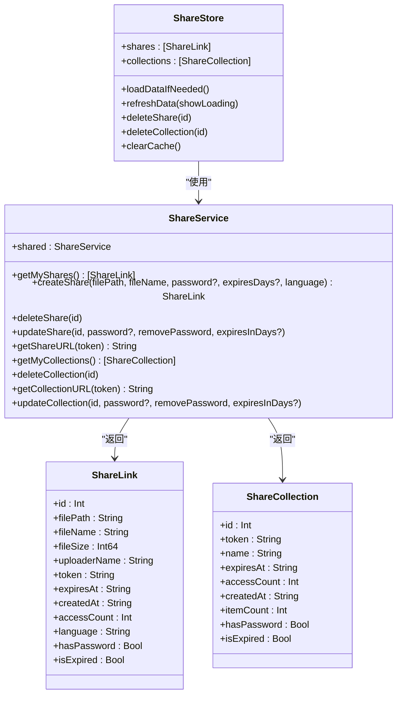
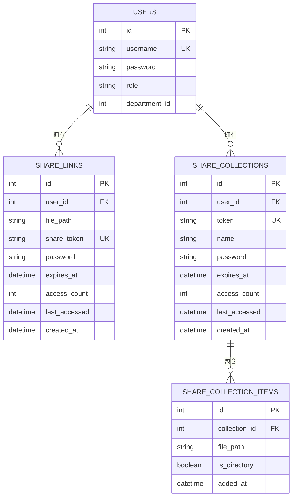
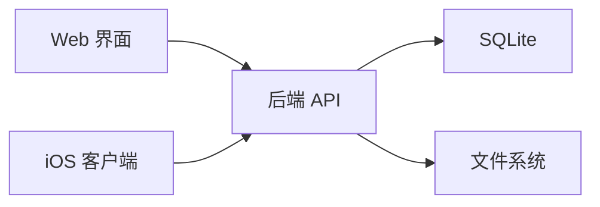

# 分享系统

<cite>
**本文引用的文件**   
- [client/src/components/ShareCollectionPage.tsx](file://client/src/components/ShareCollectionPage.tsx)
- [client/src/components/SharesPage.tsx](file://client/src/components/SharesPage.tsx)
- [client/src/components/ShareResultModal.tsx](file://client/src/components/ShareResultModal.tsx)
- [ios/LonghornApp/Services/ShareService.swift](file://ios/LonghornApp/Services/ShareService.swift)
- [ios/LonghornApp/Services/ShareStore.swift](file://ios/LonghornApp/Services/ShareStore.swift)
- [ios/LonghornApp/Models/ShareLink.swift](file://ios/LonghornApp/Models/ShareLink.swift)
- [server/index.js](file://server/index.js)
- [server/migrations/phase2.sql](file://server/migrations/phase2.sql)
- [server/migrations/add_share_collections.sql](file://server/migrations/add_share_collections.sql)
</cite>

## 目录
1. [简介](#简介)
2. [项目结构](#项目结构)
3. [核心组件](#核心组件)
4. [架构总览](#架构总览)
5. [详细组件分析](#详细组件分析)
6. [依赖关系分析](#依赖关系分析)
7. [性能考量](#性能考量)
8. [故障排查指南](#故障排查指南)
9. [结论](#结论)
10. [附录](#附录)

## 简介
本文件为 Longhorn 分享系统的完整技术文档，覆盖前端与后端的分享链接生成、密码保护、访问权限控制、分享集合管理、批量分享、访问统计、安全性保障、过期与撤销机制、前端界面设计、后端逻辑实现、数据库存储优化、API 接口定义、安全最佳实践以及分享追踪与滥用防护策略。文档以循序渐进的方式呈现，既适合开发者深入理解实现细节，也便于非技术读者把握整体流程。

## 项目结构
Longhorn 采用前后端分离架构：
- 前端（Web/iOS）负责用户交互、分享页面展示、复制链接、批量操作等。
- 后端（Node.js + better-sqlite3）提供 REST API、鉴权、权限校验、分享链接与集合管理、访问统计与过期控制、静态资源与缩略图服务等。

图表来源
- [server/index.js](file://server/index.js#L1-L80)
- [client/src/components/ShareCollectionPage.tsx](file://client/src/components/ShareCollectionPage.tsx#L1-L324)
- [client/src/components/SharesPage.tsx](file://client/src/components/SharesPage.tsx#L1-L658)
- [ios/LonghornApp/Services/ShareService.swift](file://ios/LonghornApp/Services/ShareService.swift#L1-L86)
- [ios/LonghornApp/Services/ShareStore.swift](file://ios/LonghornApp/Services/ShareStore.swift#L1-L130)

章节来源
- [server/index.js](file://server/index.js#L1-L80)
- [client/src/components/ShareCollectionPage.tsx](file://client/src/components/ShareCollectionPage.tsx#L1-L324)
- [client/src/components/SharesPage.tsx](file://client/src/components/SharesPage.tsx#L1-L658)
- [ios/LonghornApp/Services/ShareService.swift](file://ios/LonghornApp/Services/ShareService.swift#L1-L86)
- [ios/LonghornApp/Services/ShareStore.swift](file://ios/LonghornApp/Services/ShareStore.swift#L1-L130)

## 核心组件
- 前端分享页面（Web）
  - 分享集合页：用于展示批量分享集合内容、密码输入、下载全部等。
  - 我的分享页：展示单文件分享与批量分享集合，支持复制链接、批量删除、详情查看、过期状态标记等。
  - 分享结果弹窗：展示新生成的分享链接、可选密码与过期时间，并支持一键复制。
- iOS 分享服务与存储
  - ShareService：封装分享相关 API 调用（创建、删除、更新、获取列表、URL 组装）。
  - ShareStore：统一拉取与缓存分享数据，支持乐观更新与错误回滚。
  - ShareLink/ShareCollection 模型：统一序列化/反序列化与格式化显示。
- 后端服务
  - 鉴权中间件：基于 JWT 的用户认证。
  - 权限校验：基于角色与扩展权限的路径访问控制。
  - 分享 API：创建、查询、更新、删除分享；公开访问处理（密码校验、过期检查、访问计数）。
  - 分享集合 API：集合创建、查询、删除、集合内文件列表与打包下载。
  - 数据库迁移：share_links 与 share_collections 表及索引。

章节来源
- [client/src/components/ShareCollectionPage.tsx](file://client/src/components/ShareCollectionPage.tsx#L1-L324)
- [client/src/components/SharesPage.tsx](file://client/src/components/SharesPage.tsx#L1-L658)
- [client/src/components/ShareResultModal.tsx](file://client/src/components/ShareResultModal.tsx#L1-L146)
- [ios/LonghornApp/Services/ShareService.swift](file://ios/LonghornApp/Services/ShareService.swift#L1-L86)
- [ios/LonghornApp/Services/ShareStore.swift](file://ios/LonghornApp/Services/ShareStore.swift#L1-L130)
- [ios/LonghornApp/Models/ShareLink.swift](file://ios/LonghornApp/Models/ShareLink.swift#L1-L137)
- [server/index.js](file://server/index.js#L268-L295)
- [server/index.js](file://server/index.js#L300-L353)
- [server/migrations/phase2.sql](file://server/migrations/phase2.sql#L1-L32)
- [server/migrations/add_share_collections.sql](file://server/migrations/add_share_collections.sql#L1-L32)

## 架构总览
分享系统的关键交互链路如下：

图表来源
- [client/src/components/SharesPage.tsx](file://client/src/components/SharesPage.tsx#L65-L92)
- [ios/LonghornApp/Services/ShareService.swift](file://ios/LonghornApp/Services/ShareService.swift#L24-L39)
- [server/index.js](file://server/index.js#L1902-L1950)
- [server/index.js](file://server/index.js#L2011-L2132)

## 详细组件分析

### 前端分享页面（Web）
- 分享集合页（ShareCollectionPage）
  - 功能要点：根据 token 获取集合信息；若需密码则弹出输入框；支持下载全部；语言切换；错误提示。
  - 关键交互：参数校验、axios 请求、状态管理、UI 展示。
- 我的分享页（SharesPage）
  - 功能要点：拉取文件分享与集合列表；复制链接；批量选择与删除；详情弹窗；过期状态高亮；文件类型预览。
  - 关键交互：分页/排序合并视图、确认对话框、批量删除并发请求。
- 分享结果弹窗（ShareResultModal）
  - 功能要点：展示分享 URL、可选密码、过期时间；一键复制；关闭。

图表来源
- [client/src/components/ShareCollectionPage.tsx](file://client/src/components/ShareCollectionPage.tsx#L42-L87)

章节来源
- [client/src/components/ShareCollectionPage.tsx](file://client/src/components/ShareCollectionPage.tsx#L1-L324)
- [client/src/components/SharesPage.tsx](file://client/src/components/SharesPage.tsx#L1-L658)
- [client/src/components/ShareResultModal.tsx](file://client/src/components/ShareResultModal.tsx#L1-L146)

### iOS 分享服务与存储
- ShareService
  - 提供获取我的分享、创建分享、删除分享、更新分享、获取分享 URL、获取我的集合、删除集合、获取集合 URL、更新集合等方法。
- ShareStore
  - 负责数据缓存与刷新：首次加载、缓存有效期（默认 5 分钟）、并发拉取分享与集合、错误回滚、乐观更新。
- ShareLink/ShareCollection 模型
  - 统一字段映射、过期判断、日期格式化等。

图表来源
- [ios/LonghornApp/Services/ShareService.swift](file://ios/LonghornApp/Services/ShareService.swift#L1-L86)
- [ios/LonghornApp/Services/ShareStore.swift](file://ios/LonghornApp/Services/ShareStore.swift#L1-L130)
- [ios/LonghornApp/Models/ShareLink.swift](file://ios/LonghornApp/Models/ShareLink.swift#L1-L137)

章节来源
- [ios/LonghornApp/Services/ShareService.swift](file://ios/LonghornApp/Services/ShareService.swift#L1-L86)
- [ios/LonghornApp/Services/ShareStore.swift](file://ios/LonghornApp/Services/ShareStore.swift#L1-L130)
- [ios/LonghornApp/Models/ShareLink.swift](file://ios/LonghornApp/Models/ShareLink.swift#L1-L137)

### 后端分享逻辑与数据库
- 鉴权与权限
  - 鉴权中间件：从 Authorization 头解析 JWT，校验失败返回 401/403。
  - 权限校验：管理员全通；个人空间成员路径全通；部门路径按角色放行；扩展权限表支持精确路径与过期控制。
- 分享 API
  - 创建分享：写入 share_links，返回 token、可选密码哈希、过期时间、访问统计初始化。
  - 查询分享：返回当前用户的所有分享，补充文件名、大小、上传者、密码存在性。
  - 更新分享：支持修改密码（可移除）、设置过期天数。
  - 删除分享：按 id 删除。
  - 公开访问：校验 token、过期、密码；命中后访问计数+1；文件不存在返回特定错误页。
- 分享集合 API
  - 创建集合：生成唯一 token，保存集合元数据与条目（文件/目录）。
  - 查询集合：按 token 返回集合信息与条目列表；支持密码保护与过期控制。
  - 下载集合：打包集合内文件为 zip 并流式返回。
  - 删除集合：级联删除集合条目。
- 数据库结构
  - share_links：单文件分享主表，含 user_id、file_path、share_token、password、expires_at、access_count、last_accessed、created_at。
  - share_collections：批量分享集合主表，含 user_id、token、name、password、expires_at、access_count、last_accessed、created_at。
  - share_collection_items：集合内条目，外键级联删除。

图表来源
- [server/migrations/phase2.sql](file://server/migrations/phase2.sql#L13-L31)
- [server/migrations/add_share_collections.sql](file://server/migrations/add_share_collections.sql#L4-L29)

章节来源
- [server/index.js](file://server/index.js#L268-L295)
- [server/index.js](file://server/index.js#L300-L353)
- [server/index.js](file://server/index.js#L1902-L1950)
- [server/index.js](file://server/index.js#L1707-L1755)
- [server/index.js](file://server/index.js#L2011-L2132)
- [server/index.js](file://server/index.js#L3130-L3206)
- [server/index.js](file://server/index.js#L3355-L3432)
- [server/migrations/phase2.sql](file://server/migrations/phase2.sql#L1-L32)
- [server/migrations/add_share_collections.sql](file://server/migrations/add_share_collections.sql#L1-L32)

### 分享链接生成机制
- 单文件分享
  - 前端调用创建接口，传入目标文件路径、可选密码、过期天数、语言。
  - 后端生成唯一 token，写入 share_links，返回 {url, password?, expires}。
- 批量分享集合
  - 前端调用创建集合接口，传入集合名称、可选密码、过期天数、语言。
  - 后端生成唯一 token，写入 share_collections，并插入集合条目（文件/目录）。
- 公开访问
  - 用户访问 /share/:token 或 /share-collection/:token。
  - 若受保护，先校验过期，再校验密码；通过后访问计数+1并返回资源。

章节来源
- [ios/LonghornApp/Services/ShareService.swift](file://ios/LonghornApp/Services/ShareService.swift#L24-L39)
- [server/index.js](file://server/index.js#L1902-L1950)
- [server/index.js](file://server/index.js#L3130-L3206)
- [server/index.js](file://server/index.js#L2011-L2132)

### 密码保护策略与访问权限控制
- 密码保护
  - 创建分享时可设置密码，后端对密码进行哈希存储。
  - 公开访问时若存在密码，需在查询参数中提供正确密码方可访问。
- 过期控制
  - 支持设置过期天数，过期后链接返回“已过期”。
- 权限控制
  - 管理员可访问所有资源；个人空间路径默认放行；部门路径按角色放行；扩展权限表支持更细粒度控制。
- 访问统计
  - 每次成功访问会增加 access_count 并记录 last_accessed。

章节来源
- [server/index.js](file://server/index.js#L2011-L2132)
- [server/index.js](file://server/index.js#L300-L353)
- [server/index.js](file://server/index.js#L2044-L2049)

### 分享集合管理与批量分享
- 集合创建与删除
  - 创建集合：返回集合 token 与集合信息。
  - 删除集合：级联删除集合内条目。
- 集合内容与下载
  - 查询集合：返回集合元数据与条目列表。
  - 下载集合：后端打包集合内文件为 zip 并流式返回。
- 批量删除
  - 前端支持多选批量删除分享与集合，后端并发执行删除并返回结果。

章节来源
- [client/src/components/SharesPage.tsx](file://client/src/components/SharesPage.tsx#L181-L228)
- [server/index.js](file://server/index.js#L3130-L3206)
- [server/index.js](file://server/index.js#L3355-L3432)
- [server/index.js](file://server/index.js#L3206-L3260)
- [server/index.js](file://server/index.js#L3432-L3466)

### 访问统计分析
- 统计维度
  - access_count：累计访问次数。
  - last_accessed：最近访问时间。
  - created_at：创建时间。
- 展示方式
  - Web/iOS 端在详情面板与列表中展示访问次数与时序信息，过期状态高亮。

章节来源
- [client/src/components/SharesPage.tsx](file://client/src/components/SharesPage.tsx#L424-L430)
- [ios/LonghornApp/Models/ShareLink.swift](file://ios/LonghornApp/Models/ShareLink.swift#L1-L137)

### 安全性保障、过期机制与撤销功能
- 安全性
  - JWT 鉴权；密码使用哈希存储；公开访问前严格校验过期与密码。
- 过期机制
  - 创建时可指定过期天数；访问时实时校验过期；过期返回明确错误页。
- 撤销功能
  - 删除分享/集合即刻失效；集合删除级联清理条目。

章节来源
- [server/index.js](file://server/index.js#L268-L295)
- [server/index.js](file://server/index.js#L2011-L2132)
- [server/index.js](file://server/index.js#L3432-L3466)

### 前端分享界面设计与交互
- 分享集合页
  - 密码输入、下载全部、语言切换、错误提示。
- 我的分享页
  - 列表展示、复制链接、批量删除、详情弹窗、文件类型预览。
- 分享结果弹窗
  - 展示 URL、密码、过期时间，一键复制。

章节来源
- [client/src/components/ShareCollectionPage.tsx](file://client/src/components/ShareCollectionPage.tsx#L97-L134)
- [client/src/components/SharesPage.tsx](file://client/src/components/SharesPage.tsx#L317-L466)
- [client/src/components/ShareResultModal.tsx](file://client/src/components/ShareResultModal.tsx#L15-L146)

### 后端分享逻辑实现与数据库存储优化
- 实现要点
  - 鉴权与权限校验前置；公开访问路径先过期/密码校验；访问计数原子更新。
- 存储优化
  - 索引：share_links(token, user_id)，share_collections(token, user_id)，集合条目索引。
  - 批量下载：集合打包为 zip 流式输出，减少内存占用。
  - 文件系统：DISK_A 作为根目录，缩略图缓存于 .thumbnails，压缩传输。

章节来源
- [server/index.js](file://server/index.js#L1902-L1950)
- [server/index.js](file://server/index.js#L3206-L3260)
- [server/migrations/phase2.sql](file://server/migrations/phase2.sql#L27-L31)
- [server/migrations/add_share_collections.sql](file://server/migrations/add_share_collections.sql#L18-L29)

### API 接口文档
- 分享相关
  - GET /api/shares：获取当前用户的所有分享（含文件名、大小、上传者、密码存在性）。
  - POST /api/shares：创建分享（可选 password、expiresIn、language）。
  - PUT /api/shares/:id：更新分享（可选 password、removePassword、expiresInDays）。
  - DELETE /api/shares/:id：删除分享。
  - GET /share/:token：公开访问分享（带密码参数时校验密码）。
- 分享集合相关
  - GET /api/my-share-collections：获取当前用户的所有分享集合。
  - POST /api/share-collection：创建分享集合（可选 password、expiresIn、language）。
  - GET /api/share-collection/:token：获取分享集合详情与条目列表。
  - GET /api/share-collection/:token/download：下载集合为 zip。
  - DELETE /api/share-collection/:id：删除分享集合（级联删除条目）。

章节来源
- [server/index.js](file://server/index.js#L1707-L1755)
- [server/index.js](file://server/index.js#L1902-L1950)
- [server/index.js](file://server/index.js#L2011-L2132)
- [server/index.js](file://server/index.js#L3130-L3206)
- [server/index.js](file://server/index.js#L3355-L3432)
- [server/index.js](file://server/index.js#L3206-L3260)

### 安全最佳实践
- 密码策略
  - 使用强哈希（bcrypt）存储密码；建议最小长度与复杂度要求。
- 过期策略
  - 默认合理过期时间（如 7/30 天），支持按需延长。
- 访问控制
  - 仅授权用户可创建/管理分享；公开链接仅允许读取。
- 审计与追踪
  - 记录 access_count 与 last_accessed；必要时增加访问日志表。
- 性能与可用性
  - 集合下载使用流式输出；缩略图缓存与并发限制；前端缓存与乐观更新。

章节来源
- [server/index.js](file://server/index.js#L2044-L2049)
- [ios/LonghornApp/Services/ShareStore.swift](file://ios/LonghornApp/Services/ShareStore.swift#L37-L53)

### 分享追踪、滥用防护与性能优化策略
- 追踪
  - 访问计数与最近访问时间可用于分析热门资源与访问趋势。
- 滥用防护
  - 限制匿名访问频率（可结合速率限制中间件）；对异常访问模式报警。
- 性能优化
  - 前端缓存（iOS 默认 5 分钟）；后端索引优化；缩略图并发队列；压缩传输；集合下载流式输出。

章节来源
- [ios/LonghornApp/Services/ShareStore.swift](file://ios/LonghornApp/Services/ShareStore.swift#L20-L22)
- [server/index.js](file://server/index.js#L418-L427)
- [server/index.js](file://server/index.js#L556-L577)

## 依赖关系分析
- 前端依赖
  - Web：React + axios；国际化、Toast、确认对话框等工具。
  - iOS：SwiftUI + Combine；网络层封装（APIClient）。
- 后端依赖
  - Express + better-sqlite3；JWT、bcrypt、multer、sharp、archiver。
- 数据库
  - share_links 与 share_collections 主表，share_collection_items 子表，索引覆盖常用查询。

图表来源
- [server/index.js](file://server/index.js#L1-L80)
- [ios/LonghornApp/Services/ShareService.swift](file://ios/LonghornApp/Services/ShareService.swift#L1-L86)
- [client/src/components/SharesPage.tsx](file://client/src/components/SharesPage.tsx#L1-L658)

章节来源
- [server/index.js](file://server/index.js#L1-L80)
- [ios/LonghornApp/Services/ShareService.swift](file://ios/LonghornApp/Services/ShareService.swift#L1-L86)
- [client/src/components/SharesPage.tsx](file://client/src/components/SharesPage.tsx#L1-L658)

## 性能考量
- 前端
  - iOS 使用缓存与并发拉取，减少重复请求；Web 使用本地状态与懒加载。
- 后端
  - 启用 gzip 压缩；缩略图生成队列限制并发；集合下载使用流式输出；索引优化查询。
- 存储
  - 缩略图缓存目录与空文件清理；集合条目级联删除避免垃圾数据。

章节来源
- [server/index.js](file://server/index.js#L418-L427)
- [server/index.js](file://server/index.js#L556-L577)
- [server/index.js](file://server/index.js#L3206-L3260)
- [ios/LonghornApp/Services/ShareStore.swift](file://ios/LonghornApp/Services/ShareStore.swift#L37-L53)

## 故障排查指南
- 无法访问公开链接
  - 检查 token 是否正确、是否过期、是否需要密码；确认后端返回的错误页内容。
- 密码错误
  - 确认密码是否正确；注意大小写与特殊字符；尝试重新生成链接。
- 文件不存在
  - 源文件被移动或删除；检查 DISK_A 对应路径是否存在。
- 401/403
  - 确认 JWT 令牌有效、用户角色与权限；检查权限扩展表配置。
- iOS 无法复制链接
  - 检查剪贴板权限与 Safari 注入兼容性；使用备用复制方案。
- 集合下载失败
  - 检查集合条目是否为空；确认磁盘空间与 zip 打包进程；查看后端日志。

章节来源
- [server/index.js](file://server/index.js#L2011-L2132)
- [server/index.js](file://server/index.js#L3355-L3432)
- [ios/LonghornApp/Services/ShareStore.swift](file://ios/LonghornApp/Services/ShareStore.swift#L78-L88)

## 结论
Longhorn 分享系统通过前后端协同实现了从创建、保护、过期控制到访问统计与批量管理的完整闭环。前端提供直观的分享界面与 iOS 侧的高效缓存与乐观更新，后端以 SQLite 为基础，配合索引与流式输出，在保证安全性的同时兼顾性能与可维护性。建议在生产环境中进一步完善速率限制、访问日志与告警机制，持续优化用户体验与系统稳定性。

## 附录
- 术语
  - 分享链接：指向单个文件的公开链接。
  - 分享集合：包含多个文件/目录的批量分享集合。
  - 过期时间：链接的有效期，到期后不可访问。
  - 密码保护：访问链接前需提供正确密码。
- 常见问题
  - 如何延长分享链接有效期？通过更新接口设置新的过期天数。
  - 如何批量删除分享？在“我的分享”页面勾选后点击批量删除。
  - 如何查看访问统计？在详情面板与列表中查看访问次数与最近访问时间。