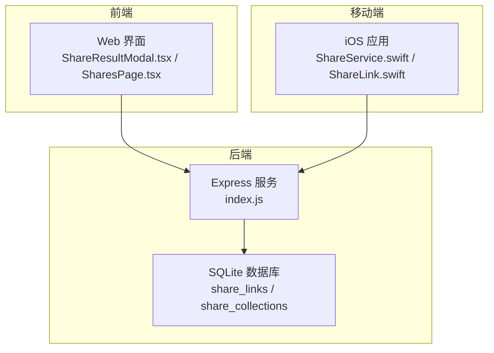
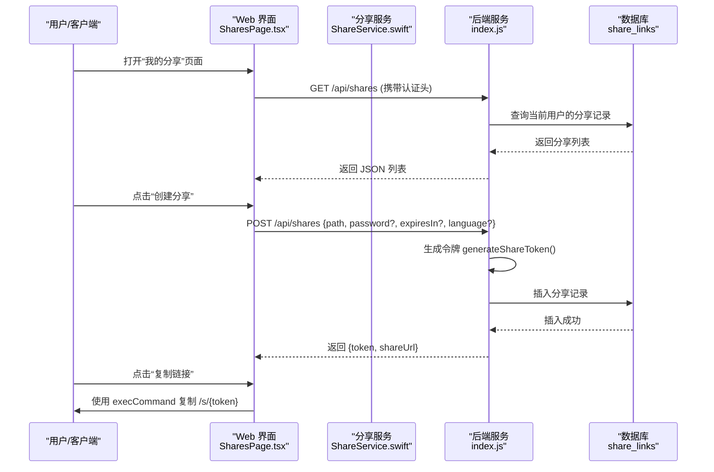
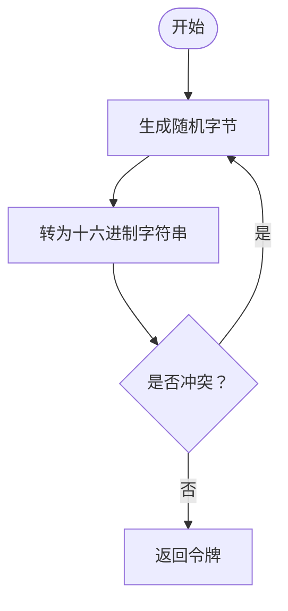
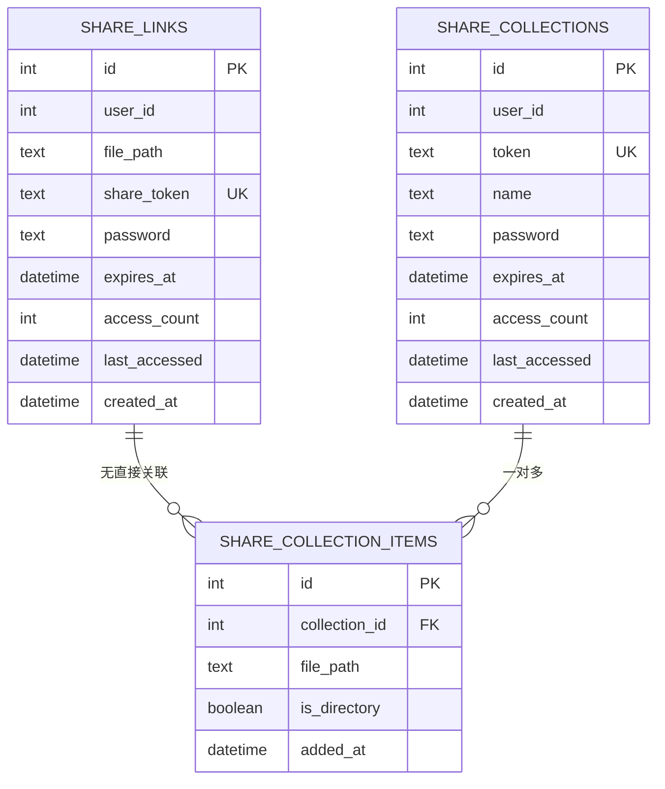
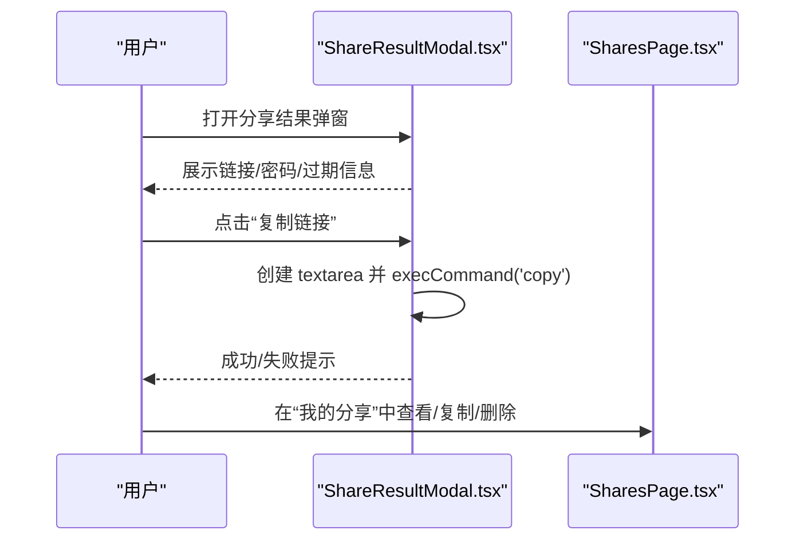
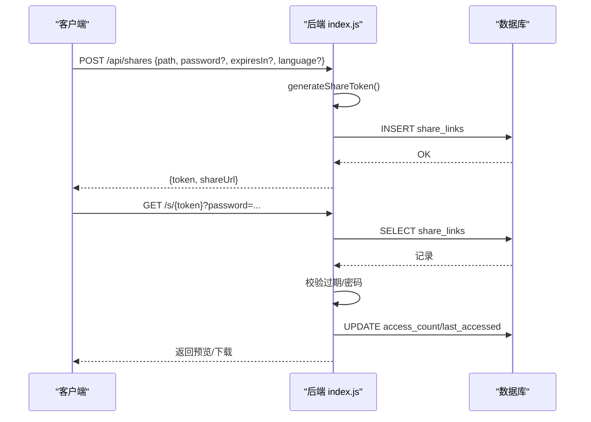
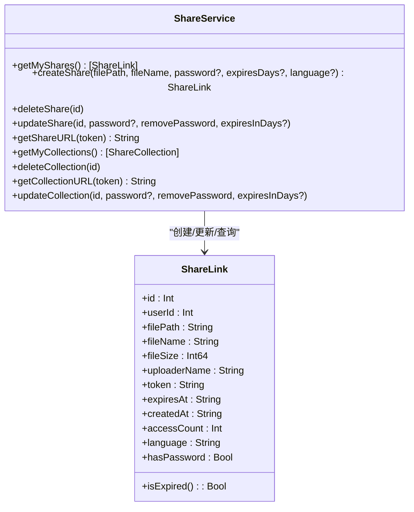
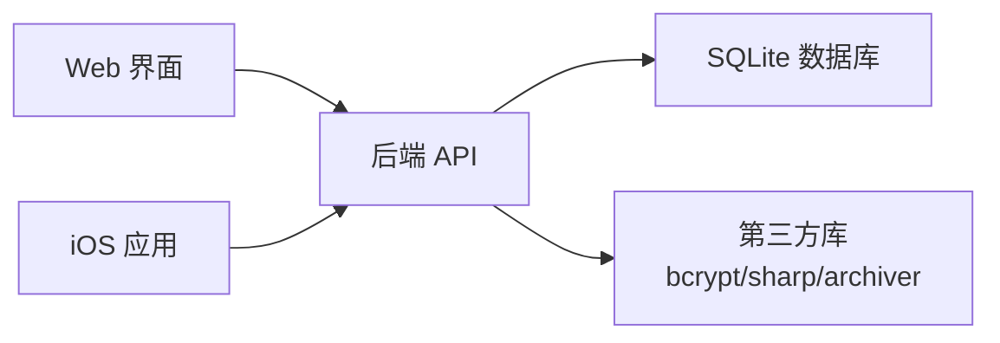

# 分享链接生成

<cite>
**本文引用的文件**
- [server/index.js](file://server/index.js)
- [server/migrations/phase2.sql](file://server/migrations/phase2.sql)
- [server/migrations/add_share_collections.sql](file://server/migrations/add_share_collections.sql)
- [client/src/components/ShareResultModal.tsx](file://client/src/components/ShareResultModal.tsx)
- [client/src/components/SharesPage.tsx](file://client/src/components/SharesPage.tsx)
- [ios/LonghornApp/Services/ShareService.swift](file://ios/LonghornApp/Services/ShareService.swift)
- [ios/LonghornApp/Models/ShareLink.swift](file://ios/LonghornApp/Models/ShareLink.swift)
</cite>

## 目录
1. [简介](#简介)
2. [项目结构](#项目结构)
3. [核心组件](#核心组件)
4. [架构总览](#架构总览)
5. [详细组件分析](#详细组件分析)
6. [依赖关系分析](#依赖关系分析)
7. [性能考量](#性能考量)
8. [故障排查指南](#故障排查指南)
9. [结论](#结论)
10. [附录](#附录)

## 简介
本文件围绕“分享链接生成机制”进行系统化技术文档编制，覆盖以下主题：
- 分享链接创建流程与唯一标识符生成算法
- 数据库存储策略与索引设计
- 前端分享界面交互与复制行为
- 后端链接生成逻辑与安全令牌机制（密码保护、过期控制）
- 链接参数编码、URL 优化与跨平台兼容性
- API 接口规范、错误处理与性能优化策略
- 链接有效期管理、自动清理机制与存储空间优化

## 项目结构
本项目采用前后端分离架构：
- 客户端（Web）：React + TypeScript，负责分享结果展示与复制行为
- 移动端（iOS）：Swift，封装分享服务与数据模型
- 服务端（Node.js + Better-SQLite3）：提供分享链接的创建、访问、密码校验、过期检查与批量分享集合功能

图表来源
- [server/index.js](file://server/index.js#L1700-L2216)
- [client/src/components/ShareResultModal.tsx](file://client/src/components/ShareResultModal.tsx#L1-L146)
- [client/src/components/SharesPage.tsx](file://client/src/components/SharesPage.tsx#L1-L658)
- [ios/LonghornApp/Services/ShareService.swift](file://ios/LonghornApp/Services/ShareService.swift#L1-L86)
- [ios/LonghornApp/Models/ShareLink.swift](file://ios/LonghornApp/Models/ShareLink.swift#L1-L137)

章节来源
- [server/index.js](file://server/index.js#L1700-L2216)
- [client/src/components/ShareResultModal.tsx](file://client/src/components/ShareResultModal.tsx#L1-L146)
- [client/src/components/SharesPage.tsx](file://client/src/components/SharesPage.tsx#L1-L658)
- [ios/LonghornApp/Services/ShareService.swift](file://ios/LonghornApp/Services/ShareService.swift#L1-L86)
- [ios/LonghornApp/Models/ShareLink.swift](file://ios/LonghornApp/Models/ShareLink.swift#L1-L137)

## 核心组件
- 唯一标识符生成器：使用加密安全的随机字节生成十六进制字符串作为分享令牌
- 分享链接表（单文件）：存储用户、目标路径、令牌、密码哈希、过期时间、访问统计等
- 分享集合表（批量分享）：支持多文件集合的令牌、密码、过期时间与访问统计
- 前端分享结果弹窗：展示生成的链接、可选密码与过期信息，并提供一键复制
- 后端公开访问路由：校验过期与密码，更新访问计数，提供预览与下载
- 移动端分享服务：封装创建、查询、删除、更新分享的网络请求与 URL 组装

章节来源
- [server/index.js](file://server/index.js#L1700-L2216)
- [server/migrations/phase2.sql](file://server/migrations/phase2.sql#L13-L31)
- [server/migrations/add_share_collections.sql](file://server/migrations/add_share_collections.sql#L4-L31)
- [client/src/components/ShareResultModal.tsx](file://client/src/components/ShareResultModal.tsx#L1-L146)
- [ios/LonghornApp/Services/ShareService.swift](file://ios/LonghornApp/Services/ShareService.swift#L1-L86)

## 架构总览
分享链路由三类路径构成：
- 后端 API 路由：创建、查询、更新、删除分享；公开访问与密码验证
- 公开访问页面：基于令牌的友好页面，支持密码输入与预览
- 下载接口：带密码参数的下载与预览生成

图表来源
- [client/src/components/SharesPage.tsx](file://client/src/components/SharesPage.tsx#L1-L658)
- [ios/LonghornApp/Services/ShareService.swift](file://ios/LonghornApp/Services/ShareService.swift#L1-L86)
- [server/index.js](file://server/index.js#L1700-L2216)

## 详细组件分析

### 唯一标识符生成与令牌算法
- 生成方式：使用加密安全的随机源生成固定长度字节，再转为十六进制字符串
- 优点：碰撞概率极低，适合短链接令牌
- 存储：令牌字段在数据库中建立唯一索引，确保查找高效且去重

图表来源
- [server/index.js](file://server/index.js#L1703-L1705)

章节来源
- [server/index.js](file://server/index.js#L1703-L1705)

### 数据库存储策略与索引
- 单文件分享表（share_links）
  - 字段：用户ID、文件路径、唯一令牌、密码哈希、过期时间、访问计数、最后访问时间、创建时间
  - 索引：令牌列、用户列
- 批量分享集合表（share_collections）
  - 字段：用户ID、唯一令牌、名称、密码哈希、过期时间、访问计数、最后访问时间、创建时间
  - 关联表：share_collection_items 记录集合中的每个文件/目录
  - 索引：令牌列、用户列；集合项索引

图表来源
- [server/migrations/phase2.sql](file://server/migrations/phase2.sql#L13-L31)
- [server/migrations/add_share_collections.sql](file://server/migrations/add_share_collections.sql#L4-L31)

章节来源
- [server/migrations/phase2.sql](file://server/migrations/phase2.sql#L13-L31)
- [server/migrations/add_share_collections.sql](file://server/migrations/add_share_collections.sql#L4-L31)

### 前端分享界面交互设计
- 分享结果弹窗
  - 展示生成的分享链接、可选密码与过期时间
  - 提供一键复制按钮，兼容 Safari 的同步复制策略
- 我的分享页面
  - 列表展示单文件分享与集合分享，支持复制链接、删除、批量删除
  - 过期状态高亮显示，详情页展示访问统计、过期时间、最后访问等

图表来源
- [client/src/components/ShareResultModal.tsx](file://client/src/components/ShareResultModal.tsx#L1-L146)
- [client/src/components/SharesPage.tsx](file://client/src/components/SharesPage.tsx#L94-L150)

章节来源
- [client/src/components/ShareResultModal.tsx](file://client/src/components/ShareResultModal.tsx#L1-L146)
- [client/src/components/SharesPage.tsx](file://client/src/components/SharesPage.tsx#L94-L150)

### 后端链接生成逻辑与安全机制
- 创建分享
  - 参数：文件路径、可选密码、可选有效期（天）、语言
  - 密码：使用哈希算法保存；有效期：计算到期时间
  - 返回：令牌与公开访问 URL（/s/{token}）
- 公开访问
  - 校验：是否存在、是否过期、是否需要密码
  - 密码：若需密码，先渲染密码表单；提交后校验哈希
  - 访问统计：命中即更新访问计数与最后访问时间
  - 预览：对图片/视频提供预览页面与下载接口
- 批量分享集合
  - 支持多文件集合创建，集合级密码与有效期
  - 公开访问时校验集合存在性、过期与密码，列出集合内文件信息

图表来源
- [server/index.js](file://server/index.js#L1903-L1936)
- [server/index.js](file://server/index.js#L2103-L2154)
- [server/index.js](file://server/index.js#L2156-L2216)

章节来源
- [server/index.js](file://server/index.js#L1903-L1936)
- [server/index.js](file://server/index.js#L2103-L2154)
- [server/index.js](file://server/index.js#L2156-L2216)

### 移动端集成与 URL 生成
- iOS 侧通过分享服务统一调用后端 API，构造公开访问 URL（/s/{token} 或 /c/{token}）
- 数据模型映射后端返回的字段，包含过期判断、格式化时间等

图表来源
- [ios/LonghornApp/Services/ShareService.swift](file://ios/LonghornApp/Services/ShareService.swift#L1-L86)
- [ios/LonghornApp/Models/ShareLink.swift](file://ios/LonghornApp/Models/ShareLink.swift#L1-L137)

章节来源
- [ios/LonghornApp/Services/ShareService.swift](file://ios/LonghornApp/Services/ShareService.swift#L1-L86)
- [ios/LonghornApp/Models/ShareLink.swift](file://ios/LonghornApp/Models/ShareLink.swift#L1-L137)

### 链接参数编码、URL 优化与跨平台兼容
- URL 参数
  - 公开访问页面支持密码查询参数（GET），用于一次性密码校验
  - 下载接口支持密码与尺寸参数（预览模式）
- 跨平台兼容
  - Safari 同步复制策略：通过临时 textarea 触发 execCommand
  - 图片/视频预览：根据扩展名选择合适的预览与下载路径
  - 语言国际化：根据分享记录的语言字段渲染页面文案

章节来源
- [client/src/components/ShareResultModal.tsx](file://client/src/components/ShareResultModal.tsx#L99-L125)
- [client/src/components/SharesPage.tsx](file://client/src/components/SharesPage.tsx#L94-L150)
- [server/index.js](file://server/index.js#L2103-L2154)
- [server/index.js](file://server/index.js#L2156-L2216)

### API 接口规范
- 创建分享（单文件）
  - 方法：POST
  - 路径：/api/shares
  - 请求体：{ path, password?, expiresIn?, language? }
  - 响应：{ success: true, id, token, shareUrl }
- 获取分享列表
  - 方法：GET
  - 路径：/api/shares
  - 响应：数组，每项包含 id、file_path、token、expires_at、access_count、created_at、language、has_password、file_name、file_size、uploader
- 更新分享
  - 方法：PUT
  - 路径：/api/shares/:id
  - 请求体：{ password?, removePassword, expiresInDays? }
  - 响应：{ success, changes }
- 删除分享
  - 方法：DELETE
  - 路径：/api/shares/:id
  - 响应：{ success }
- 公开访问（单文件）
  - 方法：GET
  - 路径：/s/:token
  - 查询参数：password（可选）
  - 响应：HTML 页面（含预览与下载）
- 下载接口（单文件）
  - 方法：GET
  - 路径：/api/download-share/:token
  - 查询参数：password（可选）、size（可选，preview）
  - 响应：二进制文件或预览图
- 创建分享集合
  - 方法：POST
  - 路径：/api/share-collection
  - 请求体：{ items 或 paths, name?, password?, expiresIn?, language? }
  - 响应：{ success, shareUrl, token }
- 访问分享集合
  - 方法：GET
  - 路径：/api/share-collection/:token
  - 查询参数：password（可选）
  - 响应：{ name, items, createdAt, accessCount, language }

章节来源
- [server/index.js](file://server/index.js#L1707-L1755)
- [server/index.js](file://server/index.js#L1903-L1936)
- [server/index.js](file://server/index.js#L2010-L2100)
- [server/index.js](file://server/index.js#L2103-L2154)
- [server/index.js](file://server/index.js#L2156-L2216)
- [server/index.js](file://server/index.js#L3130-L3165)
- [server/index.js](file://server/index.js#L3167-L3200)

### 错误处理机制
- 未认证/权限不足：401/403
- 资源不存在：404
- 已过期：410
- 密码错误：401
- 服务器内部错误：500
- 前端复制失败：toast 提示与降级处理

章节来源
- [server/index.js](file://server/index.js#L2011-L2066)
- [server/index.js](file://server/index.js#L2069-L2100)
- [server/index.js](file://server/index.js#L2103-L2154)
- [client/src/components/ShareResultModal.tsx](file://client/src/components/ShareResultModal.tsx#L110-L125)

### 性能优化策略
- 数据库
  - 为令牌与用户字段建立索引，加速查找
  - 使用 WAL 模式提升并发写入性能
- 文件预览与下载
  - 预览图缓存：按路径与尺寸生成缓存键，避免重复转换
  - 图像处理：优先使用 sharp；HEIC 使用系统工具转换
  - 视频缩略图：限制并发数量，避免 CPU/IO 抖动
- 压缩与缓存
  - 开启 gzip 压缩
  - 静态资源与缩略图设置合理缓存头
- 前端
  - Safari 同步复制，减少异步回退
  - 列表懒加载与虚拟滚动（视具体实现）

章节来源
- [server/index.js](file://server/index.js#L29-L31)
- [server/index.js](file://server/index.js#L556-L577)
- [server/index.js](file://server/index.js#L646-L679)
- [server/index.js](file://server/index.js#L418-L421)

### 有效期管理与自动清理
- 有效期设置
  - 创建时可指定过期天数，服务端换算为到期时间
  - 访问前检查到期时间，过期返回 410
- 自动清理
  - 定时任务：每日清理回收站中超过 30 天的条目
  - 分享集合与单文件分享本身不自动删除，建议业务侧定期清理或结合过期策略

章节来源
- [server/index.js](file://server/index.js#L1912-L1917)
- [server/index.js](file://server/index.js#L2116-L2118)
- [server/index.js](file://server/index.js#L3052-L3070)

### 存储空间优化
- 缩略图缓存：按文件路径与尺寸生成缓存键，命中则直接返回
- 预览图生成：优先复用缓存，失败再生成并原子写入
- 回收站清理：定时删除超期条目，释放磁盘空间

章节来源
- [server/index.js](file://server/index.js#L517-L551)
- [server/index.js](file://server/index.js#L2177-L2209)
- [server/index.js](file://server/index.js#L3052-L3070)

## 依赖关系分析
- 前端依赖后端 API 与静态资源
- iOS 通过 ShareService 统一访问后端接口
- 后端依赖 SQLite 存储与第三方库（bcrypt、sharp、archiver 等）

图表来源
- [server/index.js](file://server/index.js#L1-L14)
- [client/src/components/SharesPage.tsx](file://client/src/components/SharesPage.tsx#L1-L10)
- [ios/LonghornApp/Services/ShareService.swift](file://ios/LonghornApp/Services/ShareService.swift#L1-L20)

章节来源
- [server/index.js](file://server/index.js#L1-L14)
- [client/src/components/SharesPage.tsx](file://client/src/components/SharesPage.tsx#L1-L10)
- [ios/LonghornApp/Services/ShareService.swift](file://ios/LonghornApp/Services/ShareService.swift#L1-L20)

## 性能考量
- 数据库层
  - 索引：令牌与用户字段
  - WAL：提升写入吞吐
- 处理层
  - 预览队列：限制并发，避免 CPU/IO 过载
  - 缓存：缩略图与预览图缓存
- 网络层
  - 压缩：开启 gzip
  - 缓存：静态资源与缩略图设置长缓存

章节来源
- [server/index.js](file://server/index.js#L29-L31)
- [server/index.js](file://server/index.js#L556-L577)
- [server/index.js](file://server/index.js#L646-L679)
- [server/index.js](file://server/index.js#L418-L421)

## 故障排查指南
- 复制失败（Safari）
  - 使用临时 textarea + execCommand 方案；若失败，提示 toast 并引导手动复制
- 密码错误
  - 公开访问页面会返回错误文案；确认密码是否正确
- 链接过期
  - 返回 410；重新生成分享
- 文件不存在
  - 文件被移动或删除；更新分享或重新上传
- 权限不足
  - 未登录或无访问权限；检查认证与路径权限

章节来源
- [client/src/components/ShareResultModal.tsx](file://client/src/components/ShareResultModal.tsx#L110-L125)
- [server/index.js](file://server/index.js#L2011-L2066)
- [server/index.js](file://server/index.js#L2069-L2100)
- [server/index.js](file://server/index.js#L2103-L2154)

## 结论
本机制以“加密安全的令牌 + 数据库索引 + 明确的生命周期管理”为核心，实现了从创建到访问的完整闭环。前端与移动端通过统一的后端 API 实现一致体验，同时在性能与可靠性方面采取了多项优化措施。建议在生产环境中配合定期清理与监控告警，保障系统的长期稳定运行。

## 附录
- 术语
  - 令牌：分享链接的唯一标识符
  - 集合：批量分享的文件集合
  - 预览：针对图片/视频的缩略图或网页预览
- 参考路径
  - 令牌生成：[server/index.js](file://server/index.js#L1703-L1705)
  - 分享创建：[server/index.js](file://server/index.js#L1903-L1936)
  - 公开访问：[server/index.js](file://server/index.js#L2103-L2154)
  - 下载接口：[server/index.js](file://server/index.js#L2156-L2216)
  - 集合创建：[server/index.js](file://server/index.js#L3130-L3165)
  - 集合访问：[server/index.js](file://server/index.js#L3167-L3200)