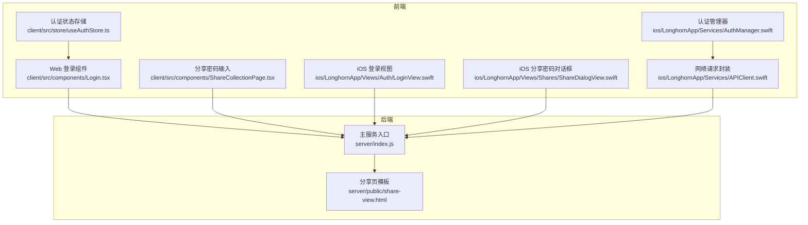
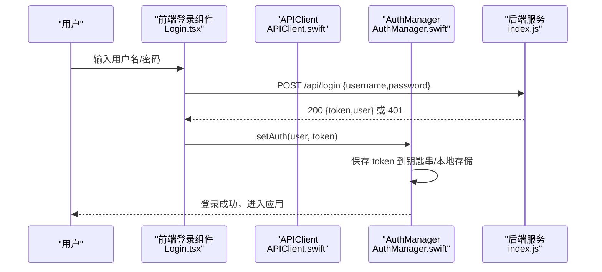
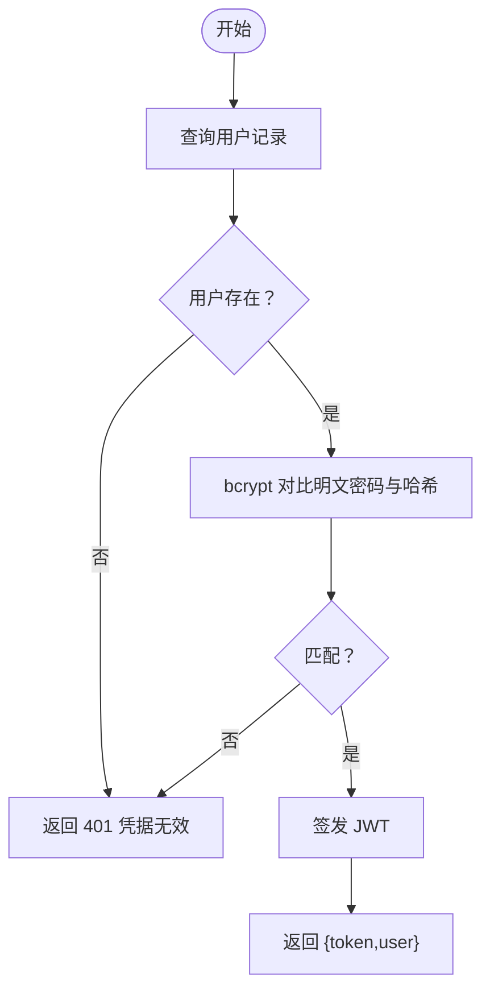
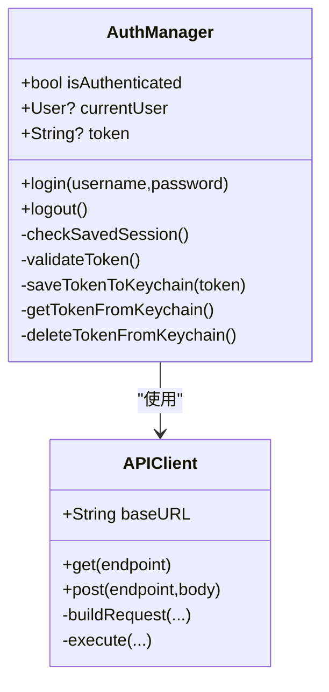
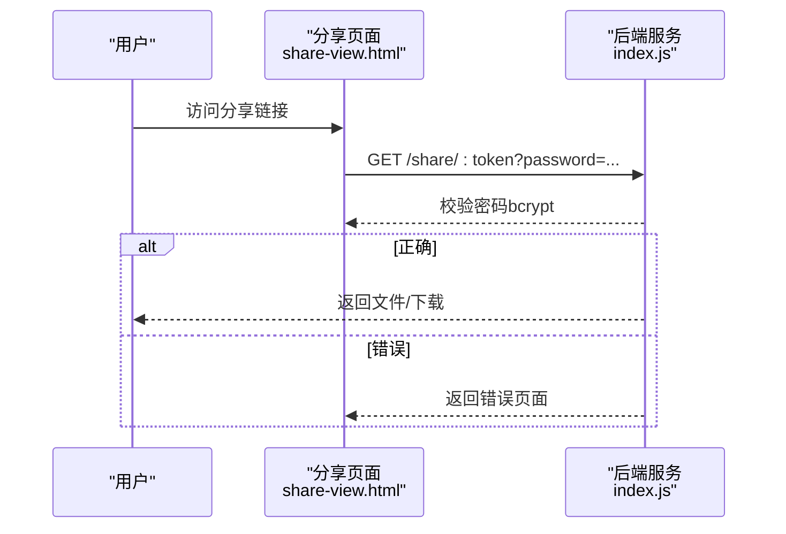
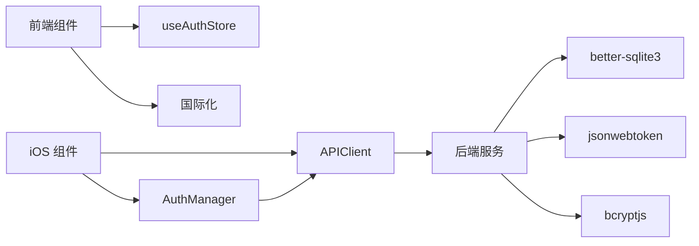

# 密码保护机制

<cite>
**本文引用的文件**
- [client/src/components/Login.tsx](file://client/src/components/Login.tsx)
- [client/src/store/useAuthStore.ts](file://client/src/store/useAuthStore.ts)
- [ios/LonghornApp/Services/AuthManager.swift](file://ios/LonghornApp/Services/AuthManager.swift)
- [ios/LonghornApp/Services/APIClient.swift](file://ios/LonghornApp/Services/APIClient.swift)
- [server/index.js](file://server/index.js)
- [server/public/share-view.html](file://server/public/share-view.html)
- [client/src/components/ShareCollectionPage.tsx](file://client/src/components/ShareCollectionPage.tsx)
- [ios/LonghornApp/Views/Shares/ShareDialogView.swift](file://ios/LonghornApp/Views/Shares/ShareDialogView.swift)
- [ios/LonghornApp/Views/Auth/LoginView.swift](file://ios/LonghornApp/Views/Auth/LoginView.swift)
</cite>

## 目录
1. [引言](#引言)
2. [项目结构](#项目结构)
3. [核心组件](#核心组件)
4. [架构总览](#架构总览)
5. [详细组件分析](#详细组件分析)
6. [依赖关系分析](#依赖关系分析)
7. [性能考量](#性能考量)
8. [故障排查指南](#故障排查指南)
9. [结论](#结论)
10. [附录](#附录)

## 引言
本文件系统化梳理 Longhorn 的密码保护机制，覆盖密码加密存储策略、哈希算法选择与安全强度评估；前端密码输入界面设计、后端密码验证逻辑与会话管理；密码重试限制与账户锁定策略现状与建议；安全审计日志与合规性要求；以及密码修改流程、忘记密码处理与多语言支持。同时提供传输加密、存储安全与隐私保护策略，以及漏洞防护与最佳实践。

## 项目结构
Longhorn 采用前后端分离架构：
- 前端（Web/iOS）负责用户交互与本地会话持久化
- 后端（Node.js + better-sqlite3）负责认证、授权、资源访问控制与分享链接密码校验
- 分享页面通过静态 HTML 提供密码校验入口

图表来源
- [client/src/components/Login.tsx](file://client/src/components/Login.tsx#L15-L27)
- [client/src/components/ShareCollectionPage.tsx](file://client/src/components/ShareCollectionPage.tsx#L97-L121)
- [ios/LonghornApp/Views/Auth/LoginView.swift](file://ios/LonghornApp/Views/Auth/LoginView.swift#L188-L225)
- [ios/LonghornApp/Views/Shares/ShareDialogView.swift](file://ios/LonghornApp/Views/Shares/ShareDialogView.swift#L206-L235)
- [client/src/store/useAuthStore.ts](file://client/src/store/useAuthStore.ts#L17-L30)
- [ios/LonghornApp/Services/APIClient.swift](file://ios/LonghornApp/Services/APIClient.swift#L247-L315)
- [ios/LonghornApp/Services/AuthManager.swift](file://ios/LonghornApp/Services/AuthManager.swift#L44-L69)
- [server/index.js](file://server/index.js#L684-L713)
- [server/public/share-view.html](file://server/public/share-view.html#L49-L102)

章节来源
- [client/src/components/Login.tsx](file://client/src/components/Login.tsx#L1-L161)
- [client/src/store/useAuthStore.ts](file://client/src/store/useAuthStore.ts#L1-L30)
- [ios/LonghornApp/Services/AuthManager.swift](file://ios/LonghornApp/Services/AuthManager.swift#L1-L195)
- [ios/LonghornApp/Services/APIClient.swift](file://ios/LonghornApp/Services/APIClient.swift#L1-L326)
- [server/index.js](file://server/index.js#L1-L200)
- [server/public/share-view.html](file://server/public/share-view.html#L49-L102)

## 核心组件
- 前端登录与会话管理
  - Web 登录表单与状态管理：提交用户名/密码，接收 token 与用户信息，写入本地存储
  - iOS 登录视图与认证管理器：发起登录请求，保存 token 至钥匙串，用户信息至 UserDefaults，并周期性校验 token 有效性
- 后端认证与授权
  - 登录接口：查询用户、使用 bcrypt 对比明文密码与数据库中的哈希值，签发 JWT
  - 分享密码校验：对分享链接的密码进行 bcrypt 校验，正确则允许下载并更新访问统计
- 分享密码输入界面
  - Web/iOS 提供统一的密码输入 UI，用于受保护的分享链接访问

章节来源
- [client/src/components/Login.tsx](file://client/src/components/Login.tsx#L15-L27)
- [client/src/store/useAuthStore.ts](file://client/src/store/useAuthStore.ts#L17-L30)
- [ios/LonghornApp/Services/AuthManager.swift](file://ios/LonghornApp/Services/AuthManager.swift#L44-L69)
- [server/index.js](file://server/index.js#L684-L713)
- [server/index.js](file://server/index.js#L2069-L2090)

## 架构总览
下图展示从用户输入密码到后端验证与会话建立的关键流程：

图表来源
- [client/src/components/Login.tsx](file://client/src/components/Login.tsx#L15-L27)
- [ios/LonghornApp/Services/AuthManager.swift](file://ios/LonghornApp/Services/AuthManager.swift#L44-L69)
- [ios/LonghornApp/Services/APIClient.swift](file://ios/LonghornApp/Services/APIClient.swift#L68-L88)
- [server/index.js](file://server/index.js#L684-L713)

## 详细组件分析

### 密码加密存储策略与哈希算法
- 存储策略
  - 用户密码在注册时使用 bcrypt 进行哈希存储，后端登录时以明文与数据库中的哈希进行对比
- 哈希算法选择
  - bcrypt 已在后端引入并用于用户注册时的密码哈希；登录时亦使用 bcrypt 对比
- 安全强度评估
  - bcrypt 具备自适应成本因子，适合密码存储；当前代码中注册使用了成本因子，登录使用了比较函数
  - 建议：确保生产环境使用足够高的成本因子（如 12+），并定期评估硬件性能调整成本因子

章节来源
- [server/index.js](file://server/index.js#L9-L9)
- [server/index.js](file://server/index.js#L934-L937)
- [server/index.js](file://server/index.js#L693-L693)

### 前端密码输入界面设计
- Web 登录界面
  - 使用受保护的密码输入框，提交后调用 /api/login 接口，错误时显示国际化提示
- iOS 登录界面
  - 使用 SecureField 输入密码，支持显示/隐藏切换，文本内容类型为密码
- 分享密码输入
  - Web/iOS 均提供独立的密码输入卡片，用于受保护的分享链接访问

章节来源
- [client/src/components/Login.tsx](file://client/src/components/Login.tsx#L96-L115)
- [ios/LonghornApp/Views/Auth/LoginView.swift](file://ios/LonghornApp/Views/Auth/LoginView.swift#L188-L225)
- [client/src/components/ShareCollectionPage.tsx](file://client/src/components/ShareCollectionPage.tsx#L97-L121)
- [ios/LonghornApp/Views/Shares/ShareDialogView.swift](file://ios/LonghornApp/Views/Shares/ShareDialogView.swift#L206-L235)

### 后端密码验证逻辑与会话管理
- 登录验证
  - 查询用户记录，若存在且密码哈希匹配，则签发 JWT 并返回 token 与用户信息
- 会话管理
  - 前端将 token 写入本地存储（Web）或钥匙串（iOS），并在后续请求中携带 Authorization 头
  - iOS 在启动时尝试恢复会话，并异步验证 token 有效性，失败则自动登出
- 分享链接密码校验
  - 对分享链接的密码进行 bcrypt 校验，正确则允许下载并更新访问计数

图表来源
- [server/index.js](file://server/index.js#L684-L713)

章节来源
- [server/index.js](file://server/index.js#L684-L713)
- [ios/LonghornApp/Services/AuthManager.swift](file://ios/LonghornApp/Services/AuthManager.swift#L94-L123)
- [ios/LonghornApp/Services/APIClient.swift](file://ios/LonghornApp/Services/APIClient.swift#L247-L315)

### 密码重试限制与账户锁定策略
- 现状
  - 后端未实现针对登录失败的重试限制或临时账户锁定机制
  - 分享密码校验失败仅返回 401，未见速率限制或锁定逻辑
- 建议
  - 引入登录失败计数与冷却窗口（例如连续失败 N 次后锁定 X 分钟）
  - 对分享链接密码校验增加失败次数限制与短期封禁
  - 结合 IP/设备维度进行风控，避免暴力破解

章节来源
- [server/index.js](file://server/index.js#L2069-L2090)

### 安全审计日志
- 现状
  - 后端启用了全局 HTTP 日志记录，可观察请求路径与客户端 IP
  - 未发现专门的认证与访问审计日志（如登录成功/失败、密码错误次数、分享访问日志）
- 建议
  - 新增认证审计日志：记录登录时间、IP、UA、结果、用户 ID
  - 新增分享访问审计日志：记录分享链接、访问时间、IP、结果
  - 日志脱敏与合规：避免记录明文密码，遵循最小可见原则

章节来源
- [server/index.js](file://server/index.js#L424-L427)

### 密码修改流程与忘记密码处理
- 密码修改
  - iOS 管理端支持更新用户密码字段（空字符串表示不修改），后端注册时使用 bcrypt 哈希
- 忘记密码
  - 仓库未发现“忘记密码”功能实现（如邮箱验证、重置令牌、验证码等）
- 建议
  - 实现“忘记密码”流程：邮箱/手机号验证、一次性重置令牌、到期失效
  - 修改密码时强制复杂度规则与历史密码禁止

章节来源
- [ios/LonghornApp/Services/AdminService.swift](file://ios/LonghornApp/Services/AdminService.swift#L59-L64)
- [server/index.js](file://server/index.js#L934-L937)

### 多语言支持
- 分享页面国际化文案由后端 i18n 对象提供，支持中/英/德/日
- 前端登录界面与分享密码输入界面均使用国际化钩子渲染提示文本

章节来源
- [server/index.js](file://server/index.js#L125-L200)
- [client/src/components/Login.tsx](file://client/src/components/Login.tsx#L8-L8)
- [client/src/components/ShareCollectionPage.tsx](file://client/src/components/ShareCollectionPage.tsx#L97-L121)

### 会话管理机制
- 前端
  - Web：使用本地存储保存 token 与用户信息
  - iOS：使用钥匙串保存 token，UserDefaults 保存用户信息；启动时恢复并验证 token
- 后端
  - 使用 JWT 作为会话标识；中间件从 Authorization 头提取并验证 token
- 自动登出
  - iOS 在 token 校验失败时触发登出并清理缓存

图表来源
- [ios/LonghornApp/Services/AuthManager.swift](file://ios/LonghornApp/Services/AuthManager.swift#L13-L181)
- [ios/LonghornApp/Services/APIClient.swift](file://ios/LonghornApp/Services/APIClient.swift#L38-L315)

章节来源
- [client/src/store/useAuthStore.ts](file://client/src/store/useAuthStore.ts#L17-L30)
- [ios/LonghornApp/Services/AuthManager.swift](file://ios/LonghornApp/Services/AuthManager.swift#L44-L123)
- [ios/LonghornApp/Services/APIClient.swift](file://ios/LonghornApp/Services/APIClient.swift#L247-L315)

### 分享链接密码保护
- Web 分享页
  - 通过 GET 表单输入密码，后端使用 bcrypt 校验，错误时返回带错误提示的页面
- iOS 分享对话框
  - 提供密码输入与复制按钮，支持多语言展示

图表来源
- [server/public/share-view.html](file://server/public/share-view.html#L49-L102)
- [server/index.js](file://server/index.js#L2069-L2090)

章节来源
- [server/public/share-view.html](file://server/public/share-view.html#L49-L102)
- [server/index.js](file://server/index.js#L2069-L2090)
- [ios/LonghornApp/Views/Shares/ShareDialogView.swift](file://ios/LonghornApp/Views/Shares/ShareDialogView.swift#L206-L235)

## 依赖关系分析
- 组件耦合
  - 前端登录组件依赖认证状态存储与国际化；iOS 登录依赖认证管理器与网络封装
  - 后端登录接口依赖数据库与 JWT/BCRYPT 库
- 外部依赖
  - bcrypt：密码哈希与对比
  - jsonwebtoken：JWT 签发与验证
  - better-sqlite3：本地数据库存储

图表来源
- [client/src/store/useAuthStore.ts](file://client/src/store/useAuthStore.ts#L1-L30)
- [ios/LonghornApp/Services/AuthManager.swift](file://ios/LonghornApp/Services/AuthManager.swift#L1-L195)
- [ios/LonghornApp/Services/APIClient.swift](file://ios/LonghornApp/Services/APIClient.swift#L1-L326)
- [server/index.js](file://server/index.js#L1-L200)

章节来源
- [client/src/store/useAuthStore.ts](file://client/src/store/useAuthStore.ts#L1-L30)
- [ios/LonghornApp/Services/AuthManager.swift](file://ios/LonghornApp/Services/AuthManager.swift#L1-L195)
- [ios/LonghornApp/Services/APIClient.swift](file://ios/LonghornApp/Services/APIClient.swift#L1-L326)
- [server/index.js](file://server/index.js#L1-L200)

## 性能考量
- 密码哈希成本因子
  - 建议在注册与登录路径上保持一致的成本因子，避免过度消耗 CPU
- JWT 验证
  - 中间件每次请求均需验证 token，建议启用缓存或减少不必要的路由暴露
- 分享密码校验
  - 对频繁访问的分享链接可考虑短期缓存校验结果，但需权衡安全性

## 故障排查指南
- 登录失败
  - 检查后端是否正确返回 401；确认用户名是否存在、密码哈希是否匹配
  - 前端错误提示是否正确显示国际化文案
- 会话异常
  - iOS 钥匙串读取失败或 token 过期：触发自动登出并清理缓存
  - Web 本地存储被清空导致重复登录：确认本地存储键值是否存在
- 分享链接访问失败
  - 确认分享链接是否仍有效、密码是否正确；查看后端错误页面提示

章节来源
- [server/index.js](file://server/index.js#L684-L713)
- [ios/LonghornApp/Services/AuthManager.swift](file://ios/LonghornApp/Services/AuthManager.swift#L115-L123)
- [ios/LonghornApp/Services/APIClient.swift](file://ios/LonghornApp/Services/APIClient.swift#L287-L301)

## 结论
Longhorn 的密码保护机制在后端实现了基于 bcrypt 的密码存储与 JWT 会话管理，在前端提供了直观的登录与分享密码输入界面。当前尚未实现登录重试限制、账户锁定与专门的安全审计日志。建议尽快补齐这些安全能力，并完善“忘记密码”流程与密码修改策略，以满足更严格的安全与合规要求。

## 附录

### 密码安全最佳实践
- 强制密码复杂度与长度
- 禁止使用常见弱密码与历史密码
- 登录失败重试限制与临时锁定
- 会话超时与静默登出
- 审计日志与告警联动

### 漏洞防护措施
- 防暴力破解：速率限制、验证码、人机验证
- 防会话劫持：HTTPS、HttpOnly/SameSite Cookie（如使用 Cookie）、短 Token 生命周期
- 防注入与越权：参数校验、权限模型细化

### 合规性要求
- 数据最小化：仅收集必要信息，避免存储明文密码
- 数据保留与删除：按政策定期清理日志与临时数据
- 用户权利：提供访问、更正、删除请求通道