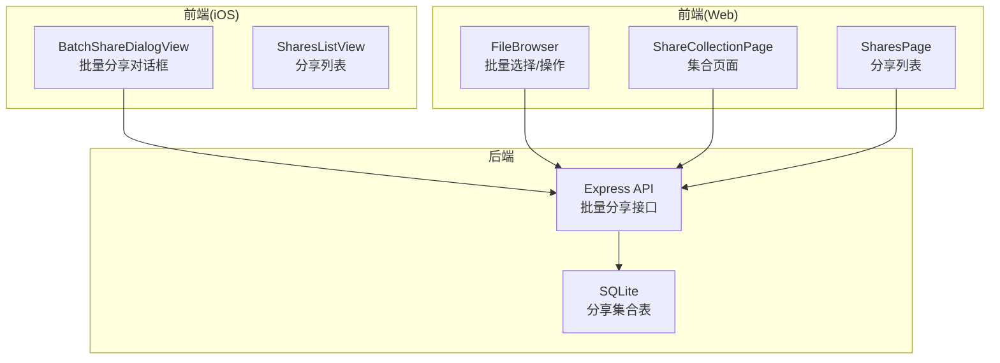
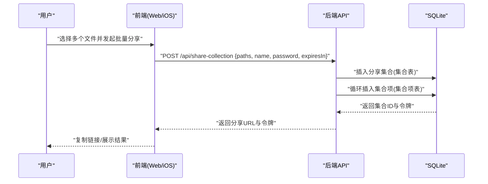
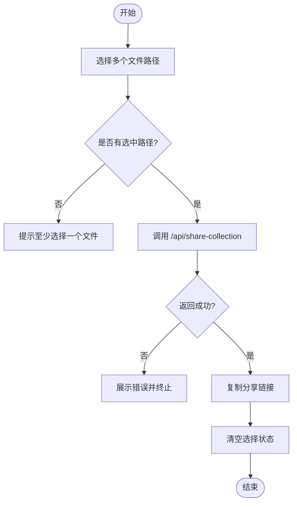
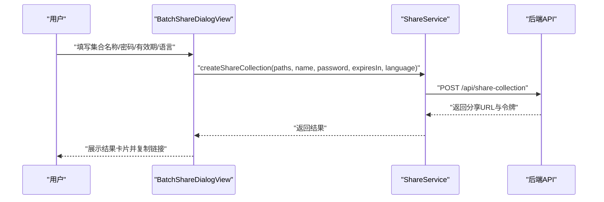
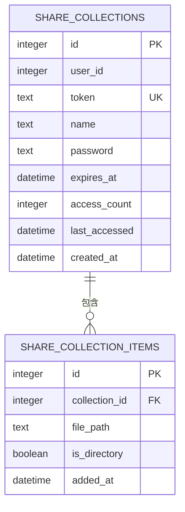
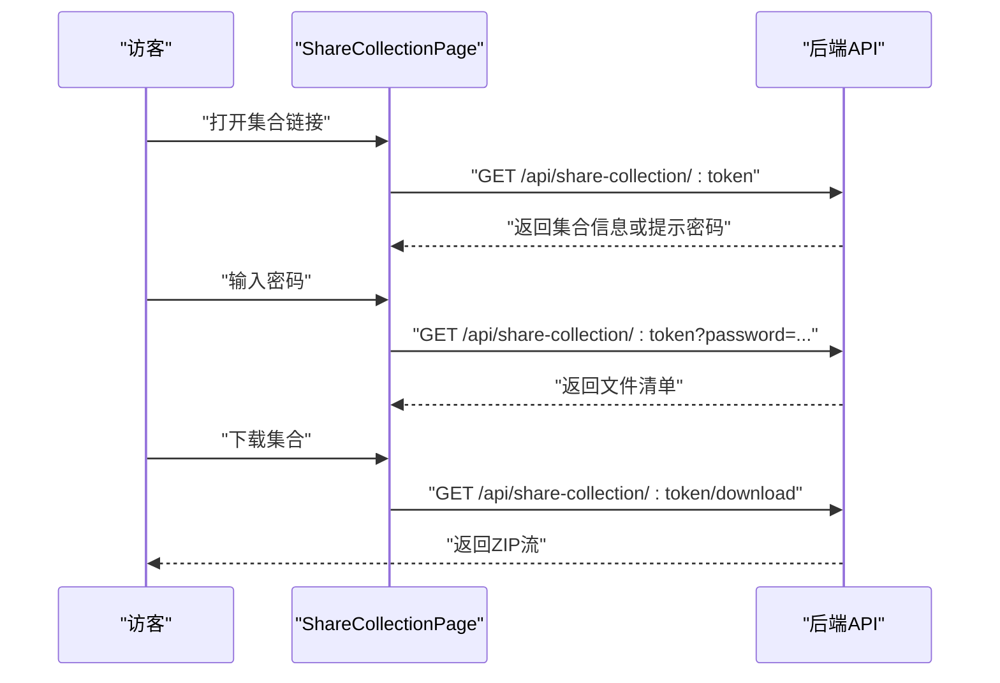
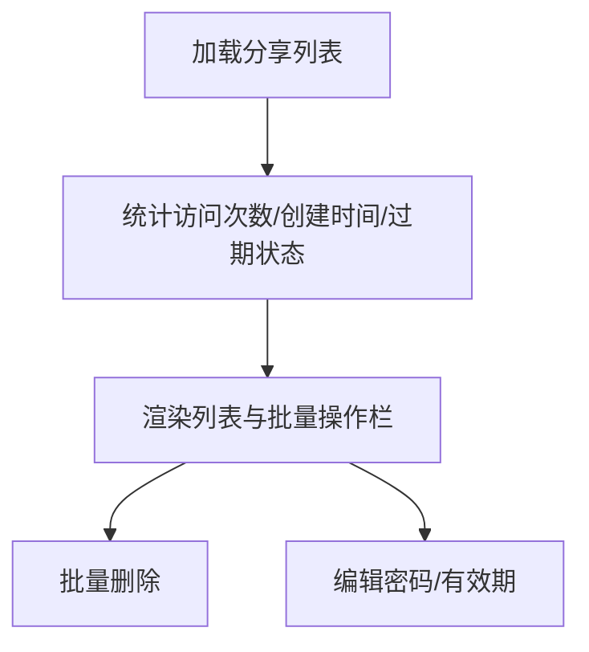
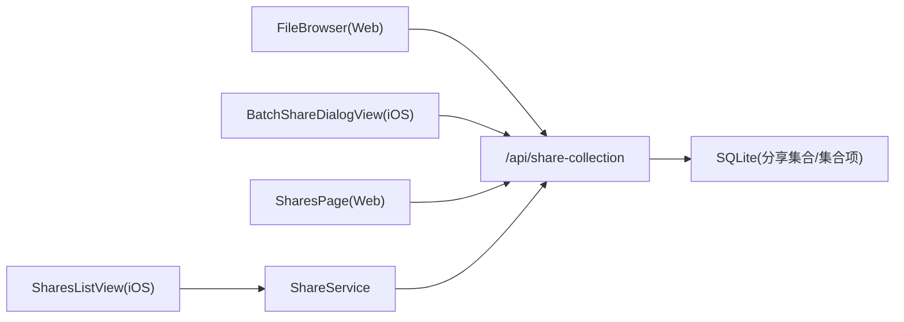

# 批量分享管理

<cite>
**本文档引用的文件**
- [client/src/components/FileBrowser.tsx](file://client/src/components/FileBrowser.tsx)
- [client/src/components/ShareCollectionPage.tsx](file://client/src/components/ShareCollectionPage.tsx)
- [client/src/components/SharesPage.tsx](file://client/src/components/SharesPage.tsx)
- [ios/LonghornApp/Views/Shares/BatchShareDialogView.swift](file://ios/LonghornApp/Views/Shares/BatchShareDialogView.swift)
- [ios/LonghornApp/Views/Shares/SharesListView.swift](file://ios/LonghornApp/Views/Shares/SharesListView.swift)
- [ios/LonghornApp/Services/ShareService.swift](file://ios/LonghornApp/Services/ShareService.swift)
- [ios/LonghornApp/Models/ShareLink.swift](file://ios/LonghornApp/Models/ShareLink.swift)
- [server/index.js](file://server/index.js)
- [server/migrations/add_share_collections.sql](file://server/migrations/add_share_collections.sql)
- [docs/3_PRD.md](file://docs/3_PRD.md)
</cite>

## 目录
1. [简介](#简介)
2. [项目结构](#项目结构)
3. [核心组件](#核心组件)
4. [架构总览](#架构总览)
5. [详细组件分析](#详细组件分析)
6. [依赖关系分析](#依赖关系分析)
7. [性能考虑](#性能考虑)
8. [故障排除指南](#故障排除指南)
9. [结论](#结论)
10. [附录](#附录)

## 简介
本技术文档围绕批量分享管理功能进行系统化梳理，覆盖前端批量操作界面、后端批量处理逻辑与数据库事务管理，以及性能优化、并发控制与错误处理策略。文档同时阐述批量分享模板、分享历史记录与批量操作统计，提供批量分享 API 接口、批量权限继承与批量撤销能力，并总结用户体验设计、操作反馈与进度监控实践。

## 项目结构
Longhorn 采用前后端分离架构：前端使用 React/Vite（Web）与 SwiftUI（iOS），后端基于 Node.js + Express + SQLite。批量分享功能主要涉及以下模块：
- 前端 Web：文件浏览器、批量分享对话框、分享列表与结果展示
- 前端 iOS：批量分享对话框、分享列表与编辑面板
- 后端：批量分享接口、分享集合表结构与访问控制
- 数据库：SQLite 表结构定义与索引

**图表来源**
- [client/src/components/FileBrowser.tsx](file://client/src/components/FileBrowser.tsx#L643-L715)
- [client/src/components/ShareCollectionPage.tsx](file://client/src/components/ShareCollectionPage.tsx#L31-L87)
- [client/src/components/SharesPage.tsx](file://client/src/components/SharesPage.tsx#L51-L92)
- [ios/LonghornApp/Views/Shares/BatchShareDialogView.swift](file://ios/LonghornApp/Views/Shares/BatchShareDialogView.swift#L185-L210)
- [ios/LonghornApp/Views/Shares/SharesListView.swift](file://ios/LonghornApp/Views/Shares/SharesListView.swift#L45-L86)
- [server/index.js](file://server/index.js#L3130-L3165)
- [server/migrations/add_share_collections.sql](file://server/migrations/add_share_collections.sql#L1-L32)

**章节来源**
- [docs/3_PRD.md](file://docs/3_PRD.md#L14-L21)
- [server/migrations/add_share_collections.sql](file://server/migrations/add_share_collections.sql#L1-L32)

## 核心组件
- 批量文件选择机制：前端通过点击或快捷键选择多个文件路径，状态集中维护在组件状态中，用于后续批量操作。
- 分享集合创建流程：后端接收批量路径，校验存在性与类型，插入分享集合与集合项，返回分享链接与令牌。
- 批量权限设置：支持密码保护与有效期设置；集合访问时进行密码校验与过期判断。
- 前端批量操作界面：提供批量删除、移动、下载与批量分享等操作入口与反馈。
- 后端批量处理逻辑：事务化插入集合项，确保原子性；公开接口支持集合访问与打包下载。
- 数据库事务管理：集合与集合项通过外键关联，删除集合时级联清理项。

**章节来源**
- [client/src/components/FileBrowser.tsx](file://client/src/components/FileBrowser.tsx#L129-L150)
- [client/src/components/FileBrowser.tsx](file://client/src/components/FileBrowser.tsx#L643-L715)
- [server/index.js](file://server/index.js#L3130-L3165)
- [server/index.js](file://server/index.js#L3320-L3353)
- [server/migrations/add_share_collections.sql](file://server/migrations/add_share_collections.sql#L4-L29)

## 架构总览
批量分享从用户操作到数据持久化的整体流程如下：

**图表来源**
- [client/src/components/FileBrowser.tsx](file://client/src/components/FileBrowser.tsx#L643-L715)
- [ios/LonghornApp/Views/Shares/BatchShareDialogView.swift](file://ios/LonghornApp/Views/Shares/BatchShareDialogView.swift#L185-L210)
- [server/index.js](file://server/index.js#L3130-L3165)
- [server/index.js](file://server/index.js#L3320-L3353)

## 详细组件分析

### 前端批量选择与操作（Web）
- 批量选择：通过点击事件维护选中路径数组，支持全选/反选；与文件列表状态联动。
- 批量分享：调用后端批量分享接口，提交选中路径、集合名称、密码与有效期；成功后复制链接并清空选择。
- 错误处理：捕获异常并以 Toast 展示错误信息；避免重复提交。

**图表来源**
- [client/src/components/FileBrowser.tsx](file://client/src/components/FileBrowser.tsx#L129-L150)
- [client/src/components/FileBrowser.tsx](file://client/src/components/FileBrowser.tsx#L643-L715)

**章节来源**
- [client/src/components/FileBrowser.tsx](file://client/src/components/FileBrowser.tsx#L129-L150)
- [client/src/components/FileBrowser.tsx](file://client/src/components/FileBrowser.tsx#L643-L715)

### 前端批量分享对话框（iOS）
- 界面元素：集合名称输入、密码开关、有效期选择、语言设置与提交按钮。
- 交互流程：收集参数后调用服务层创建分享集合，成功后展示结果卡片并支持复制链接。
- 状态管理：加载状态、错误信息与结果状态独立维护。

**图表来源**
- [ios/LonghornApp/Views/Shares/BatchShareDialogView.swift](file://ios/LonghornApp/Views/Shares/BatchShareDialogView.swift#L185-L210)
- [ios/LonghornApp/Services/ShareService.swift](file://ios/LonghornApp/Services/ShareService.swift#L18-L39)

**章节来源**
- [ios/LonghornApp/Views/Shares/BatchShareDialogView.swift](file://ios/LonghornApp/Views/Shares/BatchShareDialogView.swift#L10-L107)
- [ios/LonghornApp/Views/Shares/BatchShareDialogView.swift](file://ios/LonghornApp/Views/Shares/BatchShareDialogView.swift#L185-L210)
- [ios/LonghornApp/Services/ShareService.swift](file://ios/LonghornApp/Services/ShareService.swift#L18-L39)

### 后端批量分享接口与数据库
- 接口职责：接收路径数组，校验存在性与类型，插入分享集合与集合项，返回分享 URL。
- 数据库结构：分享集合表与集合项表，集合项外键关联集合，删除集合时级联删除项。
- 安全控制：访问集合时进行密码校验与过期判断；下载集合时打包压缩并流式输出。

**图表来源**
- [server/migrations/add_share_collections.sql](file://server/migrations/add_share_collections.sql#L4-L29)

**章节来源**
- [server/index.js](file://server/index.js#L3130-L3165)
- [server/index.js](file://server/index.js#L3320-L3353)
- [server/index.js](file://server/index.js#L3167-L3204)
- [server/index.js](file://server/index.js#L3206-L3240)
- [server/migrations/add_share_collections.sql](file://server/migrations/add_share_collections.sql#L1-L32)

### 分享集合页面与权限验证
- 页面渲染：根据令牌获取集合信息与文件清单，支持密码输入与语言切换。
- 权限验证：访问集合时若需密码则提示输入；过期集合返回 410。
- 下载功能：公开接口支持按令牌下载整个集合为 ZIP。

**图表来源**
- [client/src/components/ShareCollectionPage.tsx](file://client/src/components/ShareCollectionPage.tsx#L42-L87)
- [server/index.js](file://server/index.js#L3167-L3204)
- [server/index.js](file://server/index.js#L3206-L3240)

**章节来源**
- [client/src/components/ShareCollectionPage.tsx](file://client/src/components/ShareCollectionPage.tsx#L31-L87)
- [server/index.js](file://server/index.js#L3167-L3204)
- [server/index.js](file://server/index.js#L3206-L3240)

### 分享历史记录与批量操作统计
- 历史记录：分享集合表包含创建时间、访问计数与最后访问时间，便于追踪使用情况。
- 批量操作统计：前端分享列表展示访问次数、创建时间与过期状态，支持批量删除与编辑。

**图表来源**
- [client/src/components/SharesPage.tsx](file://client/src/components/SharesPage.tsx#L51-L92)
- [client/src/components/SharesPage.tsx](file://client/src/components/SharesPage.tsx#L181-L228)
- [server/index.js](file://server/index.js#L3242-L3258)

**章节来源**
- [client/src/components/SharesPage.tsx](file://client/src/components/SharesPage.tsx#L51-L92)
- [client/src/components/SharesPage.tsx](file://client/src/components/SharesPage.tsx#L181-L228)
- [server/index.js](file://server/index.js#L3242-L3258)

## 依赖关系分析
- 前端 Web 与 iOS 均依赖后端提供的批量分享 API。
- 后端依赖 SQLite 存储分享集合与集合项，通过外键保证引用完整性。
- iOS 端通过 ShareService 封装 API 请求，BatchShareDialogView 与 SharesListView 调用服务层。

**图表来源**
- [client/src/components/FileBrowser.tsx](file://client/src/components/FileBrowser.tsx#L643-L715)
- [ios/LonghornApp/Views/Shares/BatchShareDialogView.swift](file://ios/LonghornApp/Views/Shares/BatchShareDialogView.swift#L185-L210)
- [ios/LonghornApp/Views/Shares/SharesListView.swift](file://ios/LonghornApp/Views/Shares/SharesListView.swift#L45-L86)
- [ios/LonghornApp/Services/ShareService.swift](file://ios/LonghornApp/Services/ShareService.swift#L18-L39)
- [server/index.js](file://server/index.js#L3130-L3165)

**章节来源**
- [client/src/components/FileBrowser.tsx](file://client/src/components/FileBrowser.tsx#L643-L715)
- [ios/LonghornApp/Views/Shares/BatchShareDialogView.swift](file://ios/LonghornApp/Views/Shares/BatchShareDialogView.swift#L185-L210)
- [ios/LonghornApp/Views/Shares/SharesListView.swift](file://ios/LonghornApp/Views/Shares/SharesListView.swift#L45-L86)
- [ios/LonghornApp/Services/ShareService.swift](file://ios/LonghornApp/Services/ShareService.swift#L18-L39)
- [server/index.js](file://server/index.js#L3130-L3165)

## 性能考虑
- 并发控制：后端批量插入集合项时逐条执行，建议在高并发场景下引入连接池与事务批处理以减少锁竞争。
- I/O 优化：集合下载采用流式压缩输出，避免一次性加载全部文件到内存；缩略图生成引入队列限制并发数。
- 前端体验：批量分享成功后立即复制链接，减少用户等待；Toast 提示与禁用按钮防止重复提交。
- 数据库索引：集合表与集合项表建立索引，加速按令牌查询与分组统计。

**章节来源**
- [server/index.js](file://server/index.js#L556-L577)
- [server/index.js](file://server/index.js#L3206-L3240)
- [server/migrations/add_share_collections.sql](file://server/migrations/add_share_collections.sql#L18-L29)

## 故障排除指南
- 批量分享失败：检查请求体格式（paths 数组）、路径是否存在、密码与有效期参数；查看后端错误日志。
- 链接无法访问：确认集合未过期、密码正确；检查令牌有效性与数据库记录。
- 下载失败：确认集合项存在、文件未被删除；检查压缩过程与网络中断。
- iOS 复制链接失败：回退到 execCommand 方案；确保在用户手势触发上下文中执行。

**章节来源**
- [client/src/components/FileBrowser.tsx](file://client/src/components/FileBrowser.tsx#L699-L715)
- [server/index.js](file://server/index.js#L3167-L3204)
- [server/index.js](file://server/index.js#L3206-L3240)
- [ios/LonghornApp/Views/Shares/BatchShareDialogView.swift](file://ios/LonghornApp/Views/Shares/BatchShareDialogView.swift#L185-L210)

## 结论
批量分享管理通过前后端协同实现了从文件选择、集合创建、权限设置到访问与下载的完整闭环。数据库层面通过外键与索引保障数据一致性与查询效率；后端接口提供幂等与安全控制；前端提供直观的批量操作与反馈。建议在高并发场景进一步优化数据库事务与 I/O 流程，持续完善错误处理与用户体验。

## 附录

### 批量分享 API 接口清单
- 创建分享集合（Web/iOS）
  - 方法：POST
  - 路径：/api/share-collection
  - 请求体字段：paths（数组，必填）、name（字符串）、password（字符串，可选）、expiresIn（数字，天）、language（字符串，默认 zh）
  - 返回：shareUrl、token
- 访问分享集合（公开）
  - 方法：GET
  - 路径：/api/share-collection/:token
  - 查询参数：password（可选）
  - 返回：集合名称、文件清单、创建时间、访问计数、语言
- 下载分享集合（公开）
  - 方法：GET
  - 路径：/api/share-collection/:token/download
  - 查询参数：password（可选）
  - 返回：ZIP 文件流
- 获取我的分享集合（用户）
  - 方法：GET
  - 路径：/api/my-share-collections
  - 返回：集合列表（含 item_count）
- 更新分享集合（用户）
  - 方法：PUT
  - 路径：/api/share-collection/:id
  - 请求体字段：password（字符串，可选）、expiresInDays（数字，可选）、removePassword（布尔，可选）
- 删除分享集合（用户）
  - 方法：DELETE
  - 路径：/api/share-collection/:id

**章节来源**
- [server/index.js](file://server/index.js#L3130-L3165)
- [server/index.js](file://server/index.js#L3167-L3204)
- [server/index.js](file://server/index.js#L3206-L3240)
- [server/index.js](file://server/index.js#L3242-L3258)
- [server/index.js](file://server/index.js#L3272-L3314)

### 批量权限继承与批量撤销
- 权限继承：集合项来源于用户选择的文件路径，集合本身具备独立的密码与有效期设置，不直接继承源文件权限。
- 批量撤销：通过分享列表的批量删除或单个删除接口撤销集合与文件分享链接。

**章节来源**
- [client/src/components/SharesPage.tsx](file://client/src/components/SharesPage.tsx#L181-L228)
- [server/index.js](file://server/index.js#L3260-L3270)

### 用户体验设计与进度监控
- 选择与反馈：提供全选/反选、批量删除与 Toast 提示；iOS 提供选择计数与批量操作栏。
- 进度监控：Web 端复制链接后即时反馈；iOS 成功后展示结果卡片并支持复制链接。
- 错误处理：统一错误提示与日志记录，确保用户可感知失败原因。

**章节来源**
- [client/src/components/FileBrowser.tsx](file://client/src/components/FileBrowser.tsx#L643-L715)
- [ios/LonghornApp/Views/Shares/BatchShareDialogView.swift](file://ios/LonghornApp/Views/Shares/BatchShareDialogView.swift#L109-L173)
- [ios/LonghornApp/Views/Shares/SharesListView.swift](file://ios/LonghornApp/Views/Shares/SharesListView.swift#L294-L324)