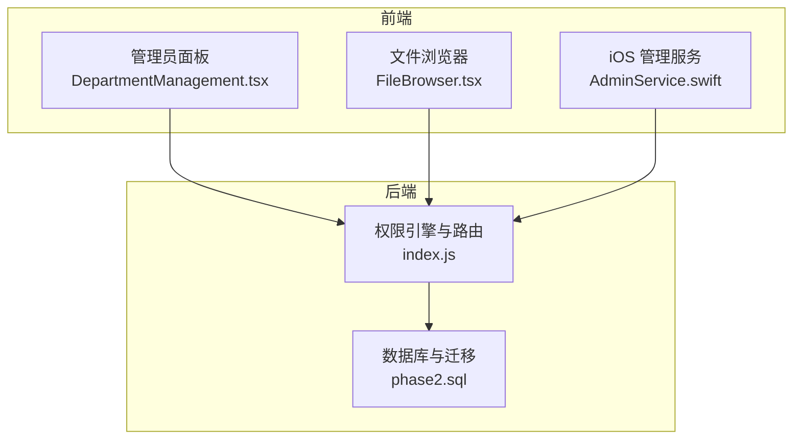
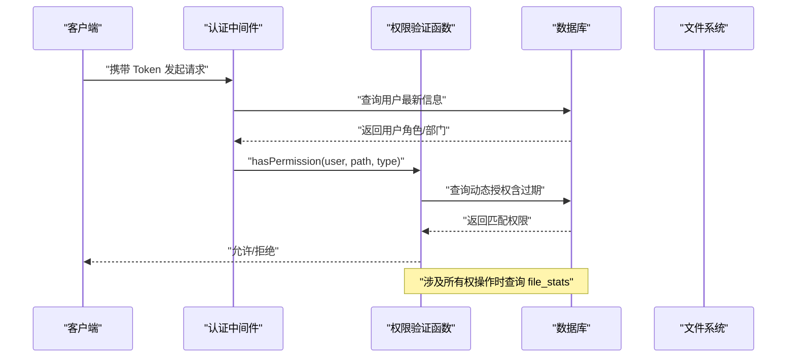
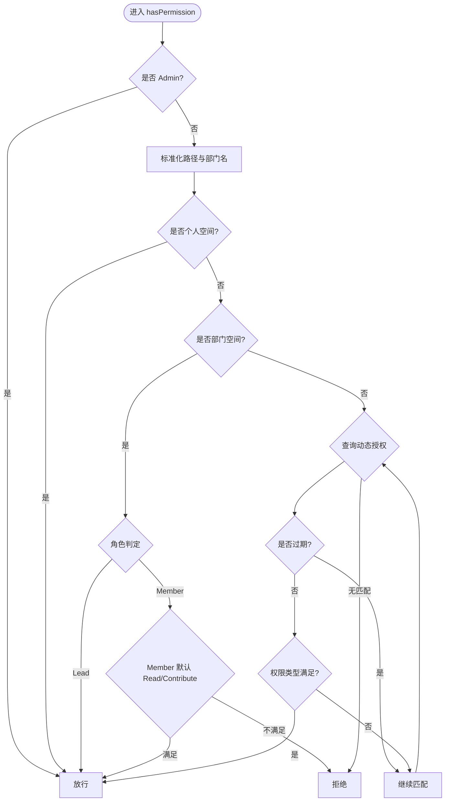
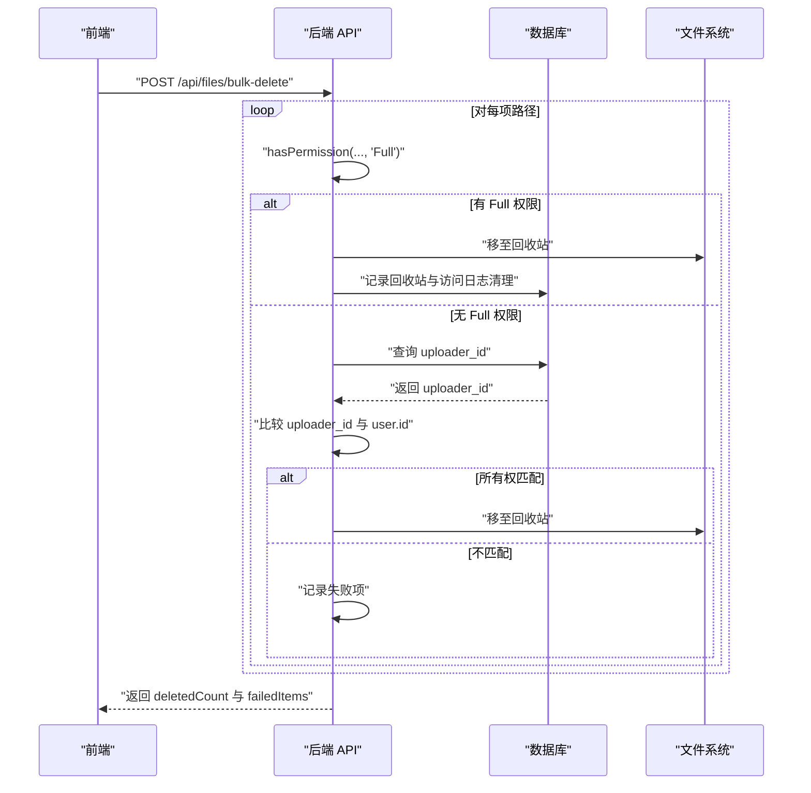
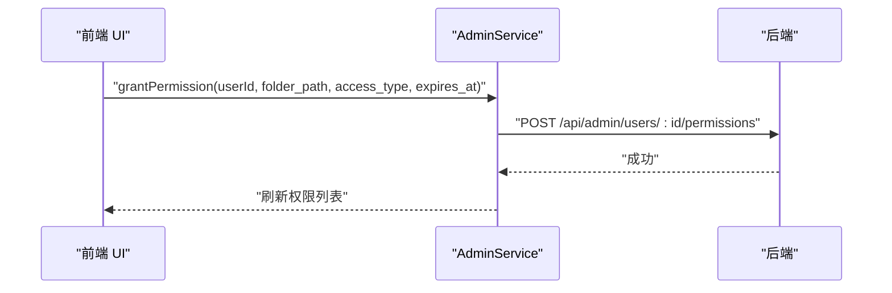
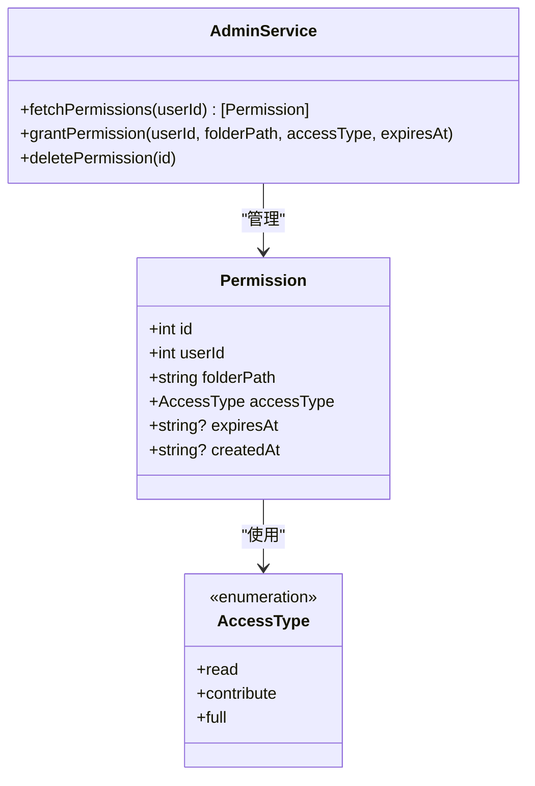
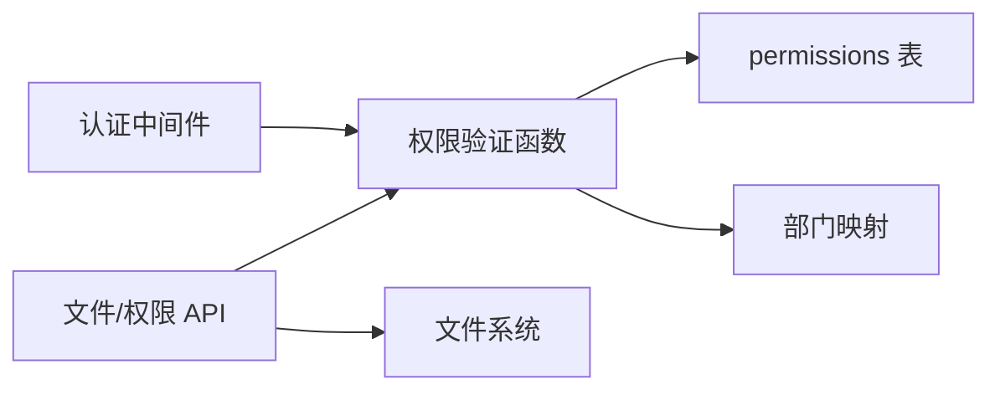

# 访问权限控制

<cite>
**本文引用的文件**
- [CONTRIBUTE 权限系统实施总结](file://docs/CONTRIBUTE_PERMISSION_IMPLEMENTATION.md)
- [后端入口与权限引擎](file://server/index.js)
- [权限模型与枚举定义](file://ios/LonghornApp/Models/Permission.swift)
- [管理员服务与权限 API](file://ios/LonghornApp/Services/AdminService.swift)
- [部门管理组件（前端）](file://client/src/components/DepartmentManagement.tsx)
- [文件浏览器（前端）- 删除与批量操作](file://client/src/components/FileBrowser.tsx)
- [文件浏览器（前端备份）- 删除与批量操作](file://client/src/components/FileBrowser.tsx.bak2)
- [权限数据库迁移](file://server/migrations/phase2.sql)
- [权限系统调试脚本](file://server/debug_logic_test.js)
</cite>

## 目录
1. [简介](#简介)
2. [项目结构](#项目结构)
3. [核心组件](#核心组件)
4. [架构总览](#架构总览)
5. [详细组件分析](#详细组件分析)
6. [依赖关系分析](#依赖关系分析)
7. [性能考量](#性能考量)
8. [故障排查指南](#故障排查指南)
9. [结论](#结论)
10. [附录](#附录)

## 简介
本文件面向访问权限控制系统，围绕“基于角色的权限模型、路径权限验证与动态授权机制”展开，覆盖前端权限检查界面、后端权限验证逻辑与数据库权限存储，并补充权限继承规则、冲突处理、更新同步、API 接口、缓存策略、性能优化、审计日志、异常检测与安全评估，以及权限配置管理、批量权限操作与权限模板能力。

## 项目结构
本系统采用前后端分离架构：
- 后端：基于 Node.js 的服务器，提供认证中间件、权限验证函数、文件与权限相关 API。
- 前端（Web/iOS）：负责权限 UI、权限申请与展示、调用后端 API 并呈现结果。
- 数据层：SQLite 数据库，存储用户、部门、权限、星标、分享等元数据。

图表来源
- [后端入口与权限引擎](file://server/index.js#L268-L295)
- [权限数据库迁移](file://server/migrations/phase2.sql#L1-L32)
- [部门管理组件（前端）](file://client/src/components/DepartmentManagement.tsx#L116-L315)
- [文件浏览器（前端）- 删除与批量操作](file://client/src/components/FileBrowser.tsx#L524-L552)
- [管理员服务与权限 API](file://ios/LonghornApp/Services/AdminService.swift#L48-L91)

章节来源
- [后端入口与权限引擎](file://server/index.js#L268-L295)
- [权限数据库迁移](file://server/migrations/phase2.sql#L1-L32)

## 核心组件
- 角色与权限类型
  - 角色：Admin、Lead、Member
  - 权限类型：Read、Contribute（新增）、Full
- 权限模型
  - 个人空间：始终放行
  - 部门空间：Lead 全放行；Member 在部门内默认 Read/Contribute
  - 动态授权：permissions 表按路径前缀匹配，支持过期时间
- 权限验证函数
  - hasPermission(user, folderPath, accessType)：统一校验入口
- API 层
  - 管理员权限管理：列出、授予、删除用户权限
  - 用户自身权限查询：过滤过期项
  - 文件操作：上传、删除、批量删除、批量移动等均受权限约束

章节来源
- [CONTRIBUTE 权限系统实施总结](file://docs/CONTRIBUTE_PERMISSION_IMPLEMENTATION.md#L13-L28)
- [后端入口与权限引擎](file://server/index.js#L300-L353)
- [权限模型与枚举定义](file://ios/LonghornApp/Models/Permission.swift#L4-L8)
- [管理员服务与权限 API](file://ios/LonghornApp/Services/AdminService.swift#L48-L91)

## 架构总览
系统采用“认证中间件 + 权限验证函数 + 路由层”的分层设计。认证中间件加载最新用户信息（含角色与部门），随后各路由调用 hasPermission 判断访问权限；对涉及所有权的操作（如删除、移动），后端会查询 file_stats 获取 uploader_id 并进行所有权校验。

图表来源
- [后端入口与权限引擎](file://server/index.js#L268-L295)
- [后端入口与权限引擎](file://server/index.js#L300-L353)
- [后端入口与权限引擎](file://server/index.js#L2818-L2823)

## 详细组件分析

### 组件一：权限验证引擎（后端）
- 设计要点
  - hasPermission：统一入口，支持个人空间、部门空间、动态授权三类规则
  - 部门名称映射：兼容“名称 (代码)”格式与预设映射
  - 动态授权：按路径前缀匹配，支持过期过滤
  - 扩展点：可扩展为“继承/冲突”规则（见下一节）
- 复杂度与性能
  - 单次权限检查：O(N) 查询动态授权（N 为匹配条目数）
  - 建议：对高频路径建立索引、缓存近期结果
- 错误处理
  - 未登录/无效 Token：401/403
  - 路由级权限不足：403
  - 数据库异常：500

图表来源
- [后端入口与权限引擎](file://server/index.js#L300-L353)

章节来源
- [后端入口与权限引擎](file://server/index.js#L300-L353)

### 组件二：动态授权与路径继承
- 存储结构
  - permissions 表：user_id、folder_path（前缀匹配）、access_type、expires_at
- 继承与冲突
  - 继承：子路径自动继承父路径授权
  - 冲突：同一路径多条授权时，优先取更高等级授权（需在业务层明确）
- 过期处理
  - 查询时过滤过期授权；用户自身权限查询也进行过滤
- 建议
  - 引入“授权优先级”字段，避免歧义
  - 提供“合并/清理”工具，定期规整重复授权

章节来源
- [后端入口与权限引擎](file://server/index.js#L340-L351)
- [后端入口与权限引擎](file://server/index.js#L1147-L1169)

### 组件三：文件操作与所有权校验
- 上传
  - 权限从 Full 降级为 Contribute（新增）
- 删除/批量删除
  - Full 或 Admin：直接放行
  - Member：仅允许删除自己上传的文件（fileOwnerId === user.id）
  - 批量删除：逐项检查，记录失败项
- 移动
  - 目标目录：Contribute 放行（新增）
  - 源文件：Full 或 Admin 放行；否则需所有权校验

图表来源
- [后端入口与权限引擎](file://server/index.js#L2606-L2622)
- [后端入口与权限引擎](file://server/index.js#L2818-L2823)

章节来源
- [CONTRIBUTE 权限系统实施总结](file://docs/CONTRIBUTE_PERMISSION_IMPLEMENTATION.md#L46-L65)
- [后端入口与权限引擎](file://server/index.js#L2606-L2622)
- [后端入口与权限引擎](file://server/index.js#L2818-L2823)

### 组件四：前端权限检查界面
- 管理端
  - 部门管理组件提供权限类型选择（Read/Contribute/Full）与有效期设置
- 文件操作
  - 删除/批量删除：根据后端返回的 failedItems 提示部分成功
  - 移动：目标目录 Contribute 即可，源文件需所有权或 Full

图表来源
- [部门管理组件（前端）](file://client/src/components/DepartmentManagement.tsx#L116-L315)
- [管理员服务与权限 API](file://ios/LonghornApp/Services/AdminService.swift#L74-L85)
- [后端入口与权限引擎](file://server/index.js#L1031-L1051)

章节来源
- [部门管理组件（前端）](file://client/src/components/DepartmentManagement.tsx#L116-L315)
- [文件浏览器（前端）- 删除与批量操作](file://client/src/components/FileBrowser.tsx#L524-L552)
- [文件浏览器（前端备份）- 删除与批量操作](file://client/src/components/FileBrowser.tsx.bak2#L377-L402)

### 组件五：权限 API 与数据模型
- 数据模型
  - AccessType：Read、Contribute、Full
  - Permission：id、user_id、folder_path、access_type、expires_at、created_at
- 管理 API
  - GET /api/admin/users/:id/permissions：列出用户权限（Lead 仅限本部门）
  - POST /api/admin/users/:id/permissions：授予权限（Lead 仅限本部门目录）
  - DELETE /api/admin/permissions/:id：删除权限（Lead 仅限本部门）
  - GET /api/user/permissions：用户自身有效权限（过滤过期）

图表来源
- [权限模型与枚举定义](file://ios/LonghornApp/Models/Permission.swift#L4-L8)
- [权限模型与枚举定义](file://ios/LonghornApp/Models/Permission.swift#L10-L26)
- [管理员服务与权限 API](file://ios/LonghornApp/Services/AdminService.swift#L48-L91)

章节来源
- [权限模型与枚举定义](file://ios/LonghornApp/Models/Permission.swift#L4-L8)
- [权限模型与枚举定义](file://ios/LonghornApp/Models/Permission.swift#L10-L26)
- [管理员服务与权限 API](file://ios/LonghornApp/Services/AdminService.swift#L48-L91)
- [后端入口与权限引擎](file://server/index.js#L1016-L1064)
- [后端入口与权限引擎](file://server/index.js#L1147-L1169)

### 组件六：数据库权限存储与迁移
- permissions 表：支持前缀匹配与过期时间
- 索引：建议为 user_id、folder_path 建立复合索引以提升查询性能
- 历史数据：file_stats 中 uploader_id 缺失时，Member 无法删除，需补全

章节来源
- [权限数据库迁移](file://server/migrations/phase2.sql#L1-L32)
- [CONTRIBUTE 权限系统实施总结](file://docs/CONTRIBUTE_PERMISSION_IMPLEMENTATION.md#L137-L152)

## 依赖关系分析
- 组件耦合
  - 路由层依赖认证中间件与权限验证函数
  - 权限验证函数依赖数据库查询与部门映射
  - 文件操作 API 依赖权限验证与文件系统
- 外部依赖
  - JWT 认证、SQLite、文件系统
- 潜在循环依赖
  - 当前结构清晰，无明显循环依赖

图表来源
- [后端入口与权限引擎](file://server/index.js#L268-L295)
- [后端入口与权限引擎](file://server/index.js#L300-L353)
- [权限数据库迁移](file://server/migrations/phase2.sql#L1-L32)

章节来源
- [后端入口与权限引擎](file://server/index.js#L268-L295)
- [后端入口与权限引擎](file://server/index.js#L300-L353)
- [权限数据库迁移](file://server/migrations/phase2.sql#L1-L32)

## 性能考量
- 查询优化
  - 为 permissions.user_id、permissions.folder_path 建立索引
  - 对高频路径进行本地缓存（短期 TTL）
- 批量操作
  - 批量删除/移动时，尽量减少数据库往返，合并事务
- IO 优化
  - 预热常用目录统计，延迟计算大目录大小
- 建议
  - 引入 Redis 缓存最近访问路径的权限结果
  - 对 file_stats.uploader_id 缺失的历史数据进行回填

[本节为通用性能建议，无需特定文件引用]

## 故障排查指南
- 常见问题
  - “权限不足”：确认角色、部门与动态授权是否匹配
  - 批量操作部分失败：检查 failedItems，定位无权限或所有权不符的项
  - 历史文件无法删除：确认 file_stats.uploader_id 是否存在
- 调试手段
  - 使用调试脚本输出路径解析与权限判定过程
  - 查看后端日志与数据库查询计划
- 建议
  - 前端展示更详细的失败原因（如“仅允许删除自己上传的文件”）
  - 后端记录权限拒绝审计日志（用户、路径、时间、原因）

章节来源
- [权限系统调试脚本](file://server/debug_logic_test.js#L43-L80)
- [CONTRIBUTE 权限系统实施总结](file://docs/CONTRIBUTE_PERMISSION_IMPLEMENTATION.md#L193-L214)

## 结论
本系统通过“角色 + 三级权限 + 动态授权”的组合，实现了细粒度且可扩展的访问控制。后端统一的权限验证函数与前端丰富的 UI 配合，提供了良好的用户体验与安全性。建议后续完善权限继承/冲突规则、增强审计与异常检测、优化批量操作反馈与缓存策略，并补齐历史数据所有权信息，以进一步提升系统稳定性与可维护性。

[本节为总结性内容，无需特定文件引用]

## 附录

### 权限控制 API 接口清单
- 管理员
  - GET /api/admin/users/:id/permissions
  - POST /api/admin/users/:id/permissions
  - DELETE /api/admin/permissions/:id
- 用户
  - GET /api/user/permissions
- 文件操作（示例）
  - POST /api/files/bulk-delete
  - POST /api/files/bulk-move
  - POST /api/upload

章节来源
- [后端入口与权限引擎](file://server/index.js#L1016-L1064)
- [后端入口与权限引擎](file://server/index.js#L1147-L1169)
- [后端入口与权限引擎](file://server/index.js#L2606-L2622)
- [后端入口与权限引擎](file://server/index.js#L2807-L2831)

### 权限缓存策略建议
- 短期缓存：最近访问路径的权限结果（TTL=数分钟）
- 清洗策略：权限变更后主动失效相关缓存
- 命中率优化：对热门目录（如个人空间根）进行预热

[本节为通用建议，无需特定文件引用]

### 审计日志与异常检测
- 审计日志
  - 记录：用户、路径、时间、操作类型、结果、原因
  - 存储：独立表或外部日志系统
- 异常检测
  - 高频拒绝：识别潜在滥用或配置错误
  - 批量失败：触发告警并提示人工复核

[本节为通用建议，无需特定文件引用]

### 权限配置管理与批量操作
- 配置管理
  - 权限模板：预设常见授权组合（如“部门只读”、“跨部门贡献”）
  - 批量授权：支持按用户组或目录批量应用
- 更新同步
  - 变更传播：即时生效或定时批量同步
  - 冲突解决：按优先级或时间顺序合并

[本节为通用建议，无需特定文件引用]