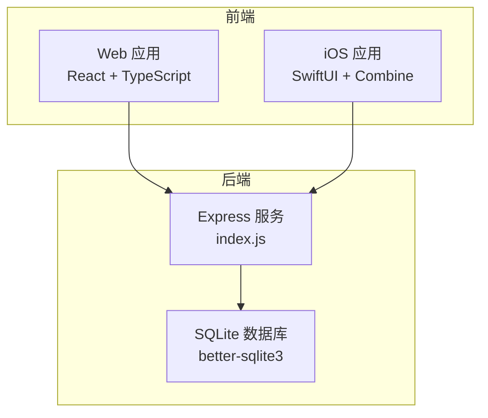
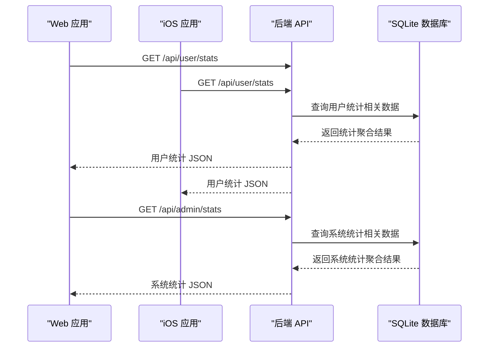
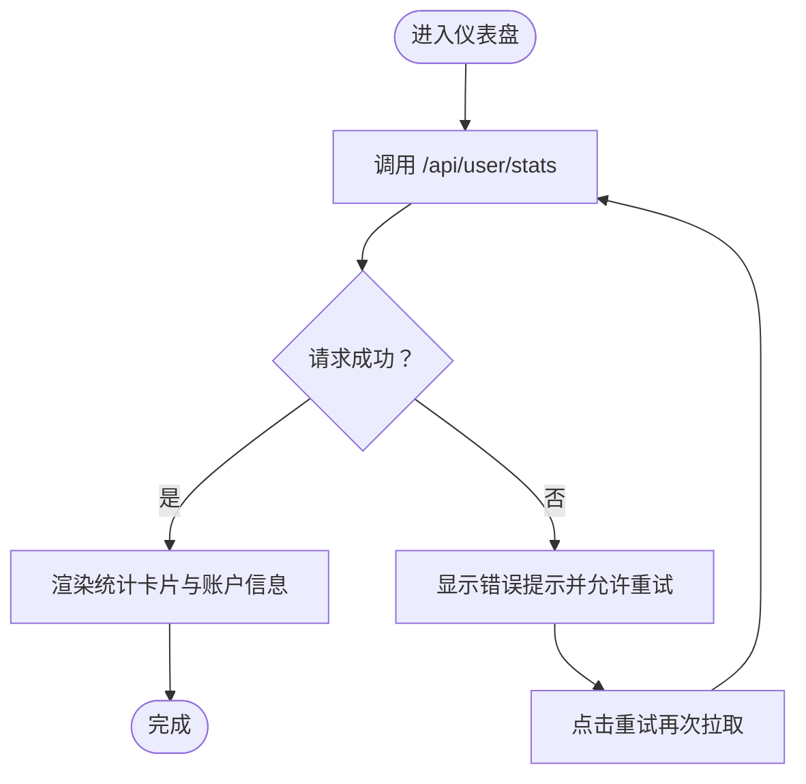
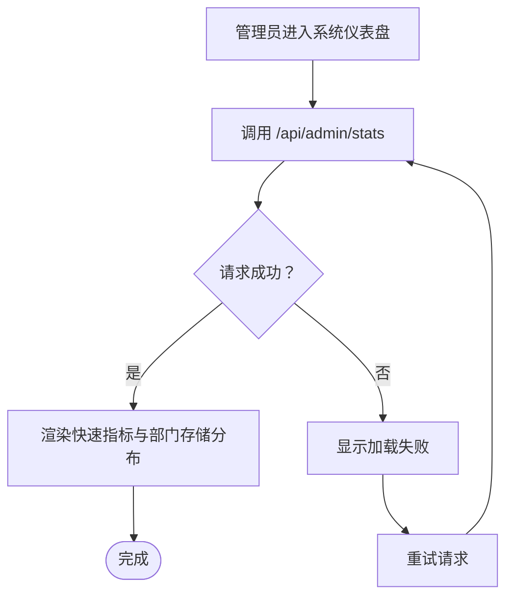
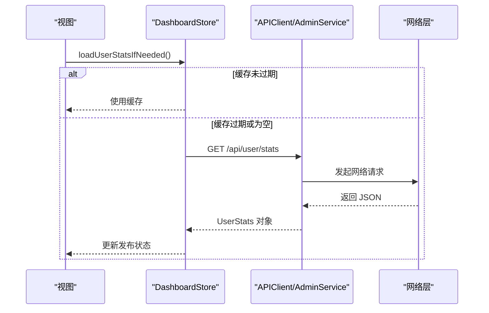
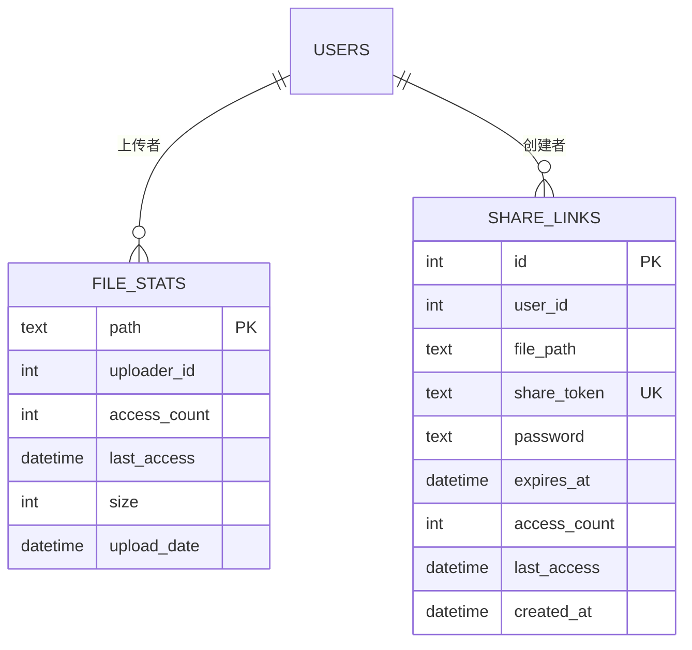
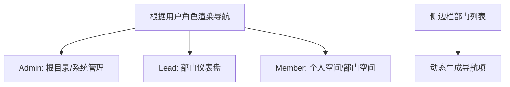
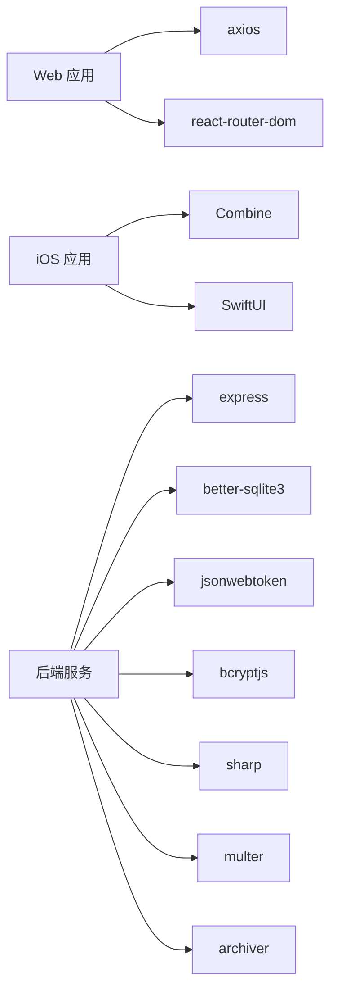

# 访问统计分析

<cite>
**本文引用的文件**
- [server/index.js](file://server/index.js)
- [client/src/App.tsx](file://client/src/App.tsx)
- [client/src/components/Dashboard.tsx](file://client/src/components/Dashboard.tsx)
- [client/src/components/SystemDashboard.tsx](file://client/src/components/SystemDashboard.tsx)
- [ios/LonghornApp/Services/DashboardStore.swift](file://ios/LonghornApp/Services/DashboardStore.swift)
- [ios/LonghornApp/Views/Main/DashboardView.swift](file://ios/LonghornApp/Views/Main/DashboardView.swift)
- [ios/LonghornApp/Views/Main/DetailStatsView.swift](file://ios/LonghornApp/Views/Main/DetailStatsView.swift)
- [ios/LonghornApp/Views/Files/FileStatsView.swift](file://ios/LonghornApp/Views/Files/FileStatsView.swift)
- [ios/LonghornApp/Models/UserStats.swift](file://ios/LonghornApp/Models/UserStats.swift)
- [server/migrations/phase2.sql](file://server/migrations/phase2.sql)
- [server/scripts/backfill-stats.js](file://server/scripts/backfill-stats.js)
</cite>

## 目录
1. [简介](#简介)
2. [项目结构](#项目结构)
3. [核心组件](#核心组件)
4. [架构总览](#架构总览)
5. [详细组件分析](#详细组件分析)
6. [依赖关系分析](#依赖关系分析)
7. [性能考量](#性能考量)
8. [故障排查指南](#故障排查指南)
9. [结论](#结论)
10. [附录](#附录)

## 简介
本文件面向“访问统计分析系统”的技术文档，聚焦于访问日志收集机制、统计数据存储策略与实时分析能力，覆盖前端统计图表展示、后端数据分析逻辑与性能指标计算；同时提供访问统计 API 接口、数据导出与报表生成机制建议、隐私保护与数据匿名化策略、可视化设计与数据刷新策略以及异常数据处理方案。

## 项目结构
系统由三部分组成：
- 后端服务：基于 Node.js + better-sqlite3 的统计与文件服务，提供用户统计、系统统计、分享统计等接口。
- 前端 Web 应用：React + TypeScript，负责仪表盘、系统仪表盘、个人空间与部门空间的统计展示与交互。
- 移动端应用：SwiftUI + Combine，负责用户统计缓存与刷新、详情页统计展示。

**图示来源**
- [server/index.js](file://server/index.js#L1-L80)
- [client/src/App.tsx](file://client/src/App.tsx#L1-L126)
- [ios/LonghornApp/Services/DashboardStore.swift](file://ios/LonghornApp/Services/DashboardStore.swift#L1-L135)

**章节来源**
- [server/index.js](file://server/index.js#L1-L80)
- [client/src/App.tsx](file://client/src/App.tsx#L1-L126)
- [ios/LonghornApp/Services/DashboardStore.swift](file://ios/LonghornApp/Services/DashboardStore.swift#L1-L135)

## 核心组件
- 用户统计接口与模型
  - Web 端通过 GET /api/user/stats 获取用户维度统计（上传数量、存储使用量、星标数量、分享数量、最近登录、账号创建时间等）。
  - iOS 端通过 DashboardStore 缓存用户统计，5 分钟有效期，避免频繁请求。
  - 统计模型在 iOS 端以 Swift 结构体定义，字段与后端一致。

- 系统统计接口与展示
  - Web 端通过 GET /api/admin/stats 获取系统级统计（今日/周/月新增、存储使用、部门存储分布、活跃用户、前上传者等），用于系统仪表盘。

- 访问日志与文件统计
  - 后端存在 file_stats 表，用于记录文件路径、上传者、访问计数、最后访问时间、文件大小与上传日期。
  - 存量数据回填脚本可扫描磁盘 A 并补全 size 与 upload_date 字段。
  - 分享链接表包含访问计数与最后访问时间，便于统计分享访问情况。

- 路由与权限
  - Web 应用路由根据用户角色与部门权限动态渲染侧边栏与导航入口。
  - iOS 应用侧边栏与导航同样受用户角色与可访问部门影响。

**章节来源**
- [client/src/components/Dashboard.tsx](file://client/src/components/Dashboard.tsx#L1-L378)
- [client/src/components/SystemDashboard.tsx](file://client/src/components/SystemDashboard.tsx#L1-L199)
- [ios/LonghornApp/Services/DashboardStore.swift](file://ios/LonghornApp/Services/DashboardStore.swift#L1-L135)
- [ios/LonghornApp/Models/UserStats.swift](file://ios/LonghornApp/Models/UserStats.swift#L1-L18)
- [server/migrations/phase2.sql](file://server/migrations/phase2.sql#L1-L32)
- [server/scripts/backfill-stats.js](file://server/scripts/backfill-stats.js#L1-L46)
- [client/src/App.tsx](file://client/src/App.tsx#L1-L126)

## 架构总览
系统采用前后端分离架构，后端提供 REST 接口，前端通过 HTTP 客户端调用；移动端通过网络层访问后端接口并本地缓存统计结果。

**图示来源**
- [client/src/components/Dashboard.tsx](file://client/src/components/Dashboard.tsx#L41-L55)
- [client/src/components/SystemDashboard.tsx](file://client/src/components/SystemDashboard.tsx#L42-L56)
- [ios/LonghornApp/Services/DashboardStore.swift](file://ios/LonghornApp/Services/DashboardStore.swift#L36-L61)
- [server/index.js](file://server/index.js#L1-L80)

## 详细组件分析

### 用户统计组件（Web）
- 功能要点
  - 首次进入仪表盘时拉取 /api/user/stats。
  - 展示上传数量、存储使用量、星标数量、分享数量、最近登录与账号创建时间。
  - 提供点击跳转到个人空间、星标页、搜索页等快捷操作。

- 数据格式
  - 字段包括上传数量、存储使用量、星标数量、分享数量、最近登录时间、账号创建时间、用户名、角色等。

**图示来源**
- [client/src/components/Dashboard.tsx](file://client/src/components/Dashboard.tsx#L37-L55)

**章节来源**
- [client/src/components/Dashboard.tsx](file://client/src/components/Dashboard.tsx#L1-L378)

### 系统统计组件（Web）
- 功能要点
  - 管理员访问系统仪表盘时拉取 /api/admin/stats。
  - 展示今日/周/月新增、总文件数、存储使用总量、部门存储分布、活跃用户、前上传者等。

- 数据格式
  - 包含 todayStats、weekStats、monthStats、storage（used、perDept、members）、users（total、active）、topUploaders、totalFiles 等。

**图示来源**
- [client/src/components/SystemDashboard.tsx](file://client/src/components/SystemDashboard.tsx#L36-L56)

**章节来源**
- [client/src/components/SystemDashboard.tsx](file://client/src/components/SystemDashboard.tsx#L1-L199)

### 用户统计缓存（iOS）
- 功能要点
  - DashboardStore 提供用户统计缓存，5 分钟有效期。
  - 支持按需加载与强制刷新，失败时打印错误但不影响 UI。
  - 与 APIClient/AdminService/FileService 协作获取不同维度统计。

**图示来源**
- [ios/LonghornApp/Services/DashboardStore.swift](file://ios/LonghornApp/Services/DashboardStore.swift#L36-L61)

**章节来源**
- [ios/LonghornApp/Services/DashboardStore.swift](file://ios/LonghornApp/Services/DashboardStore.swift#L1-L135)
- [ios/LonghornApp/Views/Main/DetailStatsView.swift](file://ios/LonghornApp/Views/Main/DetailStatsView.swift#L1-L57)
- [ios/LonghornApp/Views/Files/FileStatsView.swift](file://ios/LonghornApp/Views/Files/FileStatsView.swift#L1-L18)
- [ios/LonghornApp/Models/UserStats.swift](file://ios/LonghornApp/Models/UserStats.swift#L1-L18)

### 文件统计与访问日志（后端）
- 数据结构
  - file_stats：记录文件路径、上传者、访问计数、最后访问时间、文件大小、上传日期。
  - share_links：记录分享链接、访问计数、最后访问时间、过期时间等。
  - 索引：为 starred_files、share_links 建立索引以提升查询性能。

- 回填脚本
  - 扫描磁盘 A 并补全 file_stats 的 size 与 upload_date 字段，确保历史数据可用。

**图示来源**
- [server/migrations/phase2.sql](file://server/migrations/phase2.sql#L1-L32)
- [server/scripts/backfill-stats.js](file://server/scripts/backfill-stats.js#L10-L43)

**章节来源**
- [server/migrations/phase2.sql](file://server/migrations/phase2.sql#L1-L32)
- [server/scripts/backfill-stats.js](file://server/scripts/backfill-stats.js#L1-L46)

### 路由与权限（前端）
- 角色与导航
  - 管理员可见根目录与系统管理入口；部门负责人可见部门仪表盘；普通成员仅可见个人与所属部门空间。
  - 侧边栏根据用户可访问部门动态生成导航项。

**图示来源**
- [client/src/App.tsx](file://client/src/App.tsx#L78-L120)

**章节来源**
- [client/src/App.tsx](file://client/src/App.tsx#L1-L126)

## 依赖关系分析
- 前端依赖
  - axios：发起 HTTP 请求。
  - date-fns：格式化时间距离。
  - react-router-dom：路由控制与导航。
- 后端依赖
  - better-sqlite3：本地数据库。
  - express：HTTP 服务框架。
  - bcryptjs/jwt：认证与鉴权。
  - sharp/archiver/multer：缩略图生成、压缩包与文件上传。
- 移动端依赖
  - Combine：响应式数据流。
  - SwiftUI：界面与交互。

**图示来源**
- [server/index.js](file://server/index.js#L1-L14)
- [client/src/App.tsx](file://client/src/App.tsx#L1-L20)
- [ios/LonghornApp/Services/DashboardStore.swift](file://ios/LonghornApp/Services/DashboardStore.swift#L8-L10)

**章节来源**
- [server/index.js](file://server/index.js#L1-L14)
- [client/src/App.tsx](file://client/src/App.tsx#L1-L20)
- [ios/LonghornApp/Services/DashboardStore.swift](file://ios/LonghornApp/Services/DashboardStore.swift#L8-L10)

## 性能考量
- 前端缓存
  - iOS DashboardStore 采用 5 分钟有效期缓存用户统计，减少重复请求。
  - Web 端在仪表盘组件内自行缓存首次拉取结果，避免重复请求。
- 后端优化
  - better-sqlite3 使用 WAL 模式提升并发读写性能。
  - 为常用查询建立索引（如分享令牌、用户 ID、星标路径等）。
- 图片与缩略图
  - 缩略图生成使用队列限制并发，避免 CPU 与 IO 过载。
  - 缓存生成的 WebP 缩略图，命中则直接返回，降低重复处理成本。
- 网络与压缩
  - 启用 gzip 压缩，减少传输体积。
  - Range 请求支持，提升大文件预览体验。

**章节来源**
- [ios/LonghornApp/Services/DashboardStore.swift](file://ios/LonghornApp/Services/DashboardStore.swift#L30-L61)
- [server/index.js](file://server/index.js#L29-L31)
- [server/index.js](file://server/index.js#L556-L577)
- [server/index.js](file://server/index.js#L418-L420)

## 故障排查指南
- 常见问题
  - 无法获取用户统计：检查 /api/user/stats 是否返回 401/403（未登录或权限不足），确认前端是否携带有效 Token。
  - 系统统计加载失败：检查 /api/admin/stats 权限与网络连通性。
  - iOS 缓存未更新：确认 DashboardStore 的缓存有效期与手动刷新逻辑。
  - 缩略图生成失败：查看 ffmpeg/sips 可用性与日志文件，确认输入格式支持。
- 日志与调试
  - 后端全局中间件输出 HTTP 请求日志（方法、URL、客户端 IP）。
  - 缩略图生成错误日志写入文件，便于定位失败原因。
- 数据一致性
  - 使用回填脚本补齐 file_stats 的 size 与 upload_date，确保历史数据可用。

**章节来源**
- [server/index.js](file://server/index.js#L424-L427)
- [server/index.js](file://server/index.js#L583-L645)
- [server/scripts/backfill-stats.js](file://server/scripts/backfill-stats.js#L22-L43)

## 结论
本系统通过前后端协作实现了从访问日志到统计分析的闭环：后端提供可靠的数据存储与聚合接口，前端负责直观的可视化展示与交互，移动端通过缓存与刷新策略保障用户体验。后续可在现有基础上扩展实时分析、异常检测与报表导出能力，并完善隐私与合规机制。

## 附录

### 访问统计 API 接口清单
- GET /api/user/stats
  - 描述：获取当前用户的统计信息（上传数量、存储使用量、星标数量、分享数量、最近登录、账号创建时间等）。
  - 认证：需要 Bearer Token。
  - 响应：用户统计对象（字段参考 iOS UserStats 模型与 Web Dashboard 组件）。

- GET /api/admin/stats
  - 描述：获取系统级统计（今日/周/月新增、存储使用、部门存储分布、活跃用户、前上传者等）。
  - 认证：需要管理员权限。
  - 响应：系统统计对象（字段参考 SystemDashboard 组件）。

- GET /api/user/accessible-departments
  - 描述：获取用户可访问的部门列表，用于前端侧边栏渲染。
  - 认证：需要 Bearer Token。
  - 响应：部门数组。

- GET /api/thumbnail
  - 描述：生成并缓存缩略图（支持图片与视频/HEIC）。
  - 参数：path（文件路径，需 URL 编码）、size（尺寸，默认 200）、preview（是否大图模式）。
  - 响应：WebP 图像。

- GET /api/status
  - 描述：健康检查接口。
  - 响应：服务状态信息。

**章节来源**
- [client/src/components/Dashboard.tsx](file://client/src/components/Dashboard.tsx#L41-L55)
- [client/src/components/SystemDashboard.tsx](file://client/src/components/SystemDashboard.tsx#L42-L56)
- [client/src/App.tsx](file://client/src/App.tsx#L134-L150)
- [server/index.js](file://server/index.js#L483-L679)
- [server/index.js](file://server/index.js#L477-L480)

### 数据导出与报表生成机制建议
- 导出接口
  - 新增 /api/export/stats?type=user|system&format=csv|json，支持按用户或系统维度导出统计。
  - 增加分页与过滤参数（时间范围、部门、用户等）。
- 报表模板
  - 提供 Excel/CSV 模板，自动填充访问次数、地理位置（若启用）、设备类型、时间段分布等。
- 异步任务
  - 使用队列异步生成报表文件，完成后通过邮件或下载链接通知用户。

[本节为机制建议，不涉及具体源码实现]

### 隐私保护、数据匿名化与合规
- 最小化采集
  - 仅记录必要字段（访问计数、最后访问时间、文件路径等），避免敏感信息。
- 匿名化
  - 用户标识在统计中仅保留去标识化形式（如用户 ID 或匿名标识符）。
- 存储安全
  - SQLite 文件加密存储，访问控制严格限制。
- 合规要求
  - 遵循数据最小化、透明度与用户同意原则，提供数据删除与导出请求通道。

[本节为通用实践建议，不涉及具体源码实现]

### 统计可视化设计与数据刷新策略
- 设计
  - 使用柱状图/折线图展示访问趋势与时段分布，使用饼图展示部门存储占比。
- 刷新
  - Web：仪表盘组件在挂载时拉取一次，支持手动刷新按钮。
  - iOS：DashboardStore 5 分钟自动刷新，支持下拉刷新与首次进入触发加载。
- 异常处理
  - 网络失败时显示占位与重试按钮；缩略图失败时降级为占位图。

**章节来源**
- [client/src/components/Dashboard.tsx](file://client/src/components/Dashboard.tsx#L65-L97)
- [ios/LonghornApp/Services/DashboardStore.swift](file://ios/LonghornApp/Services/DashboardStore.swift#L36-L61)