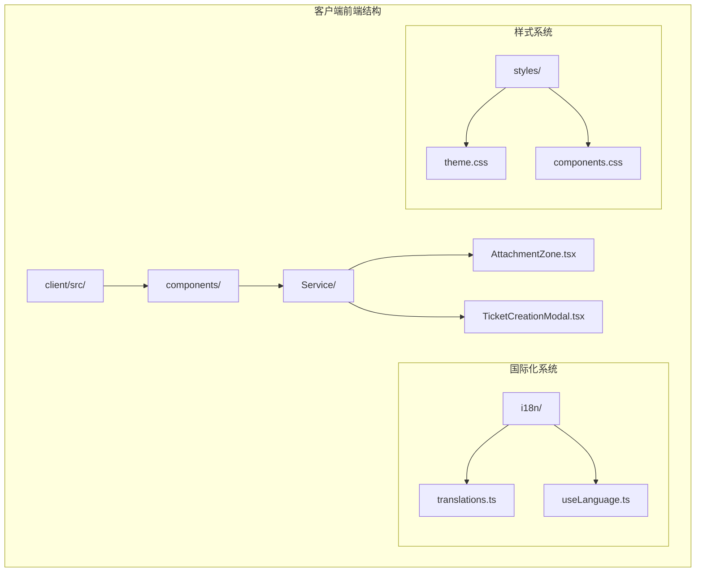
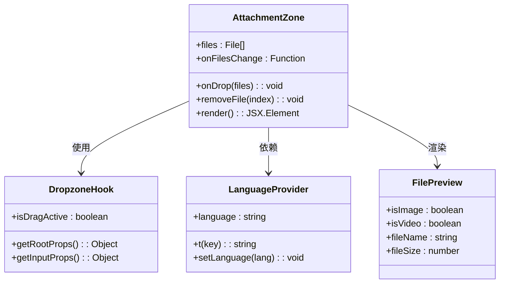
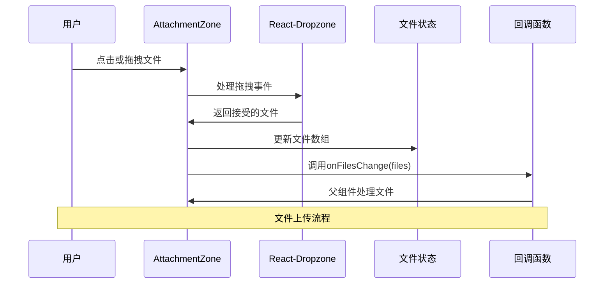
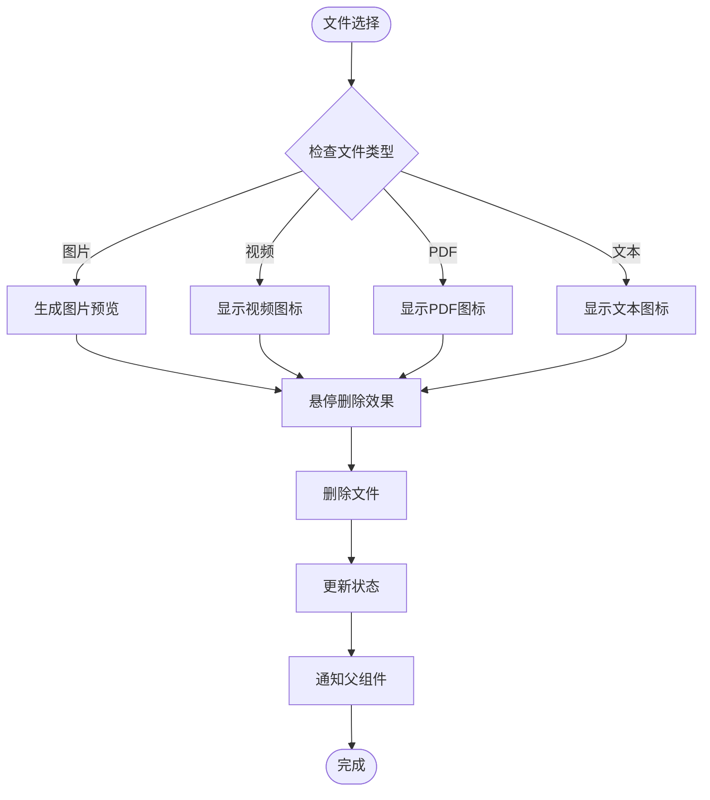
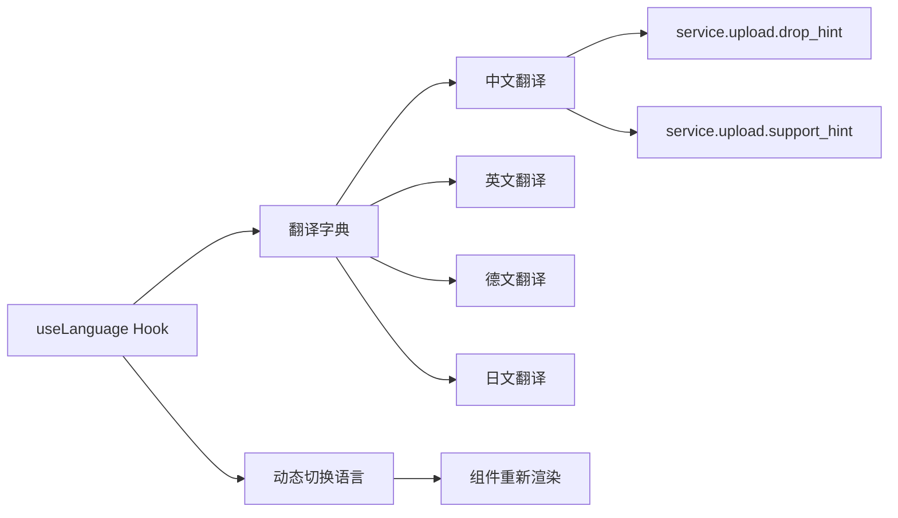
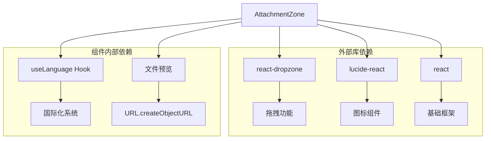
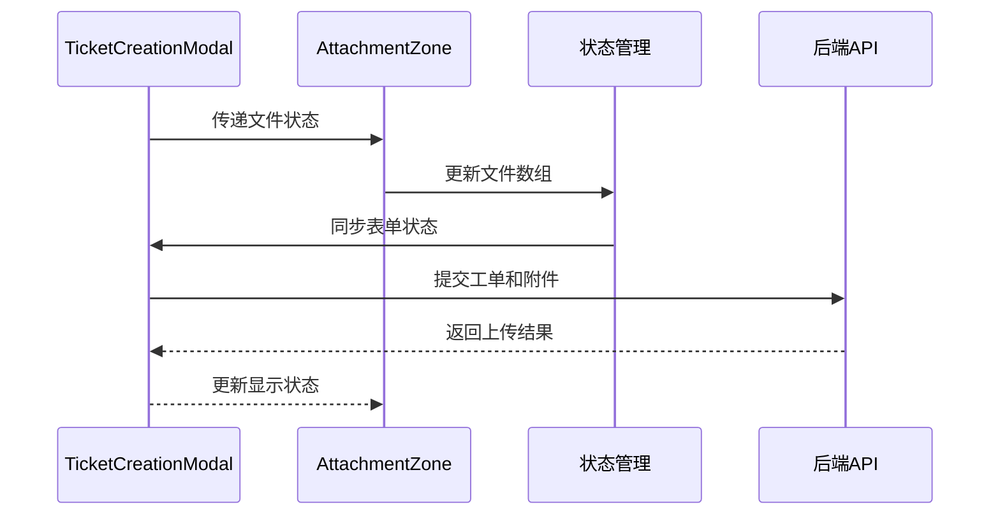

# AttachmentZone 附件上传组件

<cite>
**本文档引用的文件**
- [AttachmentZone.tsx](file://client/src/components/Service/AttachmentZone.tsx)
- [useLanguage.ts](file://client/src/i18n/useLanguage.ts)
- [translations.ts](file://client/src/i18n/translations.ts)
- [TicketCreationModal.tsx](file://client/src/components/Service/TicketCreationModal.tsx)
</cite>

## 目录
1. [简介](#简介)
2. [项目结构](#项目结构)
3. [核心组件](#核心组件)
4. [架构概览](#架构概览)
5. [详细组件分析](#详细组件分析)
6. [依赖关系分析](#依赖关系分析)
7. [性能考虑](#性能考虑)
8. [故障排除指南](#故障排除指南)
9. [结论](#结论)

## 简介

AttachmentZone 是 Longhorn 服务模块中的一个核心附件上传组件，基于 react-dropzone 库构建，提供了直观的拖拽式文件上传功能。该组件支持多种文件类型的上传，包括图片、视频、PDF 文档和纯文本文件，并提供了完整的文件管理功能，包括文件预览、删除和状态反馈。

该组件采用现代化的 React 函数式组件设计，集成了国际化支持和响应式布局，为用户提供流畅的文件上传体验。组件通过回调函数与父组件进行数据交互，实现了松耦合的设计模式。

## 项目结构

AttachmentZone 组件位于客户端前端代码的服务模块中，遵循了清晰的文件组织结构：



**图表来源**
- [AttachmentZone.tsx:1-108](file://client/src/components/Service/AttachmentZone.tsx#L1-L108)
- [TicketCreationModal.tsx:1-200](file://client/src/components/Service/TicketCreationModal.tsx#L1-L200)

**章节来源**
- [AttachmentZone.tsx:1-108](file://client/src/components/Service/AttachmentZone.tsx#L1-L108)
- [TicketCreationModal.tsx:1-200](file://client/src/components/Service/TicketCreationModal.tsx#L1-L200)

## 核心组件

### 组件接口定义

AttachmentZone 组件通过 TypeScript 接口定义了清晰的属性契约：

```typescript
interface AttachmentZoneProps {
    files: File[];
    onFilesChange: (files: File[]) => void;
}
```

该接口定义了两个核心属性：
- `files`: 当前已选择的文件数组
- `onFilesChange`: 文件状态变化时的回调函数

### 主要功能特性

1. **拖拽上传**: 集成 react-dropzone 实现拖拽式文件上传
2. **多格式支持**: 支持图片、视频、PDF 和纯文本文件
3. **实时预览**: 自动生成文件缩略图和预览
4. **交互式管理**: 提供文件删除和悬停效果
5. **国际化支持**: 完整的多语言文本支持
6. **响应式设计**: 适配不同屏幕尺寸的网格布局

**章节来源**
- [AttachmentZone.tsx:6-16](file://client/src/components/Service/AttachmentZone.tsx#L6-L16)

## 架构概览

### 组件架构图



**图表来源**
- [AttachmentZone.tsx:11-108](file://client/src/components/Service/AttachmentZone.tsx#L11-L108)
- [useLanguage.ts:30-59](file://client/src/i18n/useLanguage.ts#L30-L59)

### 数据流架构



**图表来源**
- [AttachmentZone.tsx:14-22](file://client/src/components/Service/AttachmentZone.tsx#L14-L22)

## 详细组件分析

### 核心实现逻辑

#### 文件处理机制

组件的核心文件处理逻辑通过以下步骤实现：

1. **拖拽事件处理**: 使用 `useDrop` 钩子捕获拖拽事件
2. **文件类型验证**: 通过 accept 属性限制文件类型
3. **状态更新**: 将新文件合并到现有文件数组中
4. **回调通知**: 通过 `onFilesChange` 通知父组件

#### 文件预览系统



**图表来源**
- [AttachmentZone.tsx:60-102](file://client/src/components/Service/AttachmentZone.tsx#L60-L102)

**章节来源**
- [AttachmentZone.tsx:14-32](file://client/src/components/Service/AttachmentZone.tsx#L14-L32)
- [AttachmentZone.tsx:60-102](file://client/src/components/Service/AttachmentZone.tsx#L60-L102)

### 国际化集成

#### 多语言支持实现

组件通过 `useLanguage` 钩子实现了完整的国际化支持：



**图表来源**
- [useLanguage.ts:30-59](file://client/src/i18n/useLanguage.ts#L30-L59)
- [translations.ts:1819-1820](file://client/src/i18n/translations.ts#L1819-L1820)

#### 翻译键值定义

组件使用的国际化键值包括：
- `service.upload.drop_hint`: "点击或拖拽文件到此处上传"
- `service.upload.support_hint`: "支持图片、视频、PDF等 (最大 50MB)"

**章节来源**
- [translations.ts:1819-1820](file://client/src/i18n/translations.ts#L1819-L1820)
- [translations.ts:3513-3514](file://client/src/i18n/translations.ts#L3513-L3514)

### 样式系统

#### 响应式网格布局

组件采用了 Tailwind CSS 类名实现响应式设计：

```mermaid
graph TB
A[Grid Container] --> B[2列@手机]
A --> C[3列@平板]
A --> D[4列@桌面]
B --> E[移动端优化]
C --> F[平板适配]
D --> G[桌面端最佳体验]
E --> H[触摸友好的间距]
F --> H
G --> H
H --> I[统一的视觉体验]
```

**图表来源**
- [AttachmentZone.tsx:60-102](file://client/src/components/Service/AttachmentZone.tsx#L60-L102)

## 依赖关系分析

### 外部依赖



**图表来源**
- [AttachmentZone.tsx:1-5](file://client/src/components/Service/AttachmentZone.tsx#L1-L5)

### 内部组件交互

#### 在工单创建模态框中的应用

AttachmentZone 组件主要在工单创建流程中发挥作用：



**图表来源**
- [TicketCreationModal.tsx:1-200](file://client/src/components/Service/TicketCreationModal.tsx#L1-L200)

**章节来源**
- [TicketCreationModal.tsx:1-200](file://client/src/components/Service/TicketCreationModal.tsx#L1-L200)

## 性能考虑

### 文件处理优化

1. **内存管理**: 使用 `URL.createObjectURL` 生成文件预览，避免大文件内存占用
2. **状态更新**: 通过不可变更新模式避免不必要的重渲染
3. **条件渲染**: 仅在有文件时渲染文件列表，减少 DOM 元素数量

### 用户体验优化

1. **即时反馈**: 拖拽激活状态提供视觉反馈
2. **悬停效果**: 文件项的悬停删除按钮提供明确的操作提示
3. **响应式布局**: 自适应不同屏幕尺寸的显示效果

## 故障排除指南

### 常见问题及解决方案

#### 文件类型不支持

**问题**: 用户尝试上传不支持的文件类型
**解决方案**: 组件会自动过滤不支持的文件类型，仅接受指定的 MIME 类型

#### 文件过大

**问题**: 用户尝试上传超过大小限制的文件
**解决方案**: 需要在服务端配置相应的文件大小限制

#### 浏览器兼容性

**问题**: 某些浏览器不支持拖拽功能
**解决方案**: 组件提供点击选择文件的替代方案

**章节来源**
- [AttachmentZone.tsx:24-32](file://client/src/components/Service/AttachmentZone.tsx#L24-L32)

## 结论

AttachmentZone 附件上传组件是一个设计精良、功能完整的文件上传解决方案。它通过以下特点体现了优秀的软件工程实践：

1. **模块化设计**: 清晰的接口定义和单一职责原则
2. **用户体验**: 直观的拖拽操作和丰富的视觉反馈
3. **国际化支持**: 完整的多语言本地化实现
4. **性能优化**: 合理的内存管理和渲染优化
5. **可维护性**: 基于现代 React 最佳实践的代码结构

该组件为 Longhorn 服务模块提供了可靠的文件上传基础设施，支持各种业务场景下的附件管理需求。其设计充分考虑了用户交互、性能表现和可扩展性，是前端组件开发的优秀范例。