# KinefinityWiki 知识库导航组件

<cite>
**本文档引用的文件**
- [KinefinityWiki.tsx](file://client/src/components/KinefinityWiki.tsx)
- [index.css](file://client/src/index.css)
- [useThemeStore.ts](file://client/src/store/useThemeStore.ts)
- [SynonymManager.tsx](file://client/src/components/Knowledge/SynonymManager.tsx)
- [WikiEditorModal.tsx](file://client/src/components/Knowledge/WikiEditorModal.tsx)
- [TipTapEditor.tsx](file://client/src/components/Knowledge/WikiEditor/TipTapEditor.tsx)
- [ResizableImageExtension.tsx](file://client/src/components/Knowledge/WikiEditor/ResizableImageExtension.tsx)
- [markdownUtils.ts](file://client/src/components/Knowledge/WikiEditor/markdownUtils.ts)
- [index.ts](file://client/src/components/Knowledge/WikiEditor/index.ts)
- [knowledge.js](file://server/service/routes/knowledge.js)
- [bokeh.js](file://server/service/routes/bokeh.js)
- [ai_service.js](file://server/service/ai_service.js)
- [index.js](file://server/index.js)
- [App.tsx](file://client/src/App.tsx)
- [useAuthStore.ts](file://client/src/store/useAuthStore.ts)
- [useBokehContext.ts](file://client/src/store/useBokehContext.ts)
- [FolderTreeSelector.tsx](file://client/src/components/FolderTreeSelector.tsx)
- [pathTranslator.ts](file://client/src/utils/pathTranslator.ts)
- [useCachedFiles.ts](file://client/src/hooks/useCachedFiles.ts)
- [add_knowledge_source_fields.sql](file://server/migrations/add_knowledge_source_fields.sql)
- [add_knowledge_audit_log.sql](file://server/migrations/add_knowledge_audit_log.sql)
- [005_knowledge_base.sql](file://server/service/migrations/005_knowledge_base.sql)
- [018_search_synonyms.sql](file://server/service/migrations/018_search_synonyms.sql)
- [synonyms.js](file://server/service/routes/synonyms.js)
- [RecentPage.tsx](file://client/src/components/RecentPage.tsx)
- [FileBrowser.tsx](file://client/src/components/FileBrowser.tsx)
- [AppRail.tsx](file://client/src/components/AppRail.tsx)
- [KnowledgeGenerator.tsx](file://client/src/components/KnowledgeGenerator.tsx)
- [BokehContainer.tsx](file://client/src/components/Bokeh/BokehContainer.tsx)
- [update_product_families.js](file://server/migrations/update_product_families.js)
- [add_wiki_formatting.sql](file://server/migrations/add_wiki_formatting.sql)
- [kine_brand_colors.html](file://kine_brand_colors.html)
- [color_comparison.html](file://color_comparison.html)
- [green_colors_comparison.html](file://green_colors_comparison.html)
</cite>

## 更新摘要
**变更内容**
- **悬停状态细化**：KinefinityWiki 组件获得了更精细的悬停状态控制，包括独立的鼠标进入和离开事件处理
- **图标颜色优化**：使用 var(--text-secondary) CSS 变量替代硬编码颜色，提升对比度和主题一致性
- **设计系统应用**：全面应用新的设计系统，包括改进的交互反馈和视觉层次
- **移除反馈功能**：从知识库系统中完全移除了文章反馈功能，简化了组件功能

## 目录
1. [简介](#简介)
2. [项目结构](#项目结构)
3. [核心组件](#核心组件)
4. [架构概览](#架构概览)
5. [详细组件分析](#详细组件分析)
6. [CSS变量主题系统](#css变量主题系统)
7. [macOS玻璃拟态设计](#macos玻璃拟态设计)
8. [品牌色彩统一](#品牌色彩统一)
9. [响应式主题适配](#响应式主题适配)
10. [组件样式系统](#组件样式系统)
11. [性能优化](#性能优化)
12. [故障排除指南](#故障排除指南)
13. [结论](#结论)

## 简介

KinefinityWiki 是 Kinefinity 长horn 项目中的知识库导航组件，经过重大样式更新后，全面采用了新的CSS变量主题系统，实现了完整的macOS风格玻璃拟态设计和品牌色彩统一。该组件为用户提供了一个现代化、沉浸式的知识库浏览体验，融合了深色/浅色主题切换、响应式设计和智能化的导航系统。

**更新** 本次样式更新引入了全新的CSS变量主题系统，包括完整的深色/浅色主题支持、macOS玻璃拟态设计、品牌色彩统一和响应式主题适配，显著提升了视觉体验和用户体验。最新的更新进一步优化了悬停状态控制和图标颜色系统，应用了新的设计系统以获得更好的对比度和一致性。

## 项目结构

KinefinityWiki 组件位于客户端的组件目录中，采用了现代化的React架构设计，集成了完整的CSS变量主题系统和macOS风格UI设计：

```mermaid
graph TB
subgraph "客户端结构"
A[KinefinityWiki.tsx] --> B[主题系统]
A --> C[样式组件]
A --> D[UI组件]
E[useThemeStore.ts] --> F[主题状态管理]
G[index.css] --> H[CSS变量定义]
I[macOS玻璃拟态] --> J[模糊效果]
I --> K[透明材质]
L[品牌色彩系统] --> M[Kine Yellow主题]
L --> N[文本色彩系统]
O[响应式设计] --> P[系统主题适配]
O --> Q[用户偏好设置]
R[悬停状态系统] --> S[精细化交互]
R --> T[var(--text-secondary)颜色]
```

**图表来源**
- [KinefinityWiki.tsx:1-50](file://client/src/components/KinefinityWiki.tsx#L1-L50)
- [index.css:1-50](file://client/src/index.css#L1-L50)
- [useThemeStore.ts:1-50](file://client/src/store/useThemeStore.ts#L1-L50)

**章节来源**
- [KinefinityWiki.tsx:1-50](file://client/src/components/KinefinityWiki.tsx#L1-L50)
- [index.css:1-50](file://client/src/index.css#L1-L50)
- [useThemeStore.ts:1-50](file://client/src/store/useThemeStore.ts#L1-L50)

## 核心组件

### 主题系统架构

KinefinityWiki 组件具备以下核心主题功能：

1. **CSS变量主题系统**
   - **新增** 完整的CSS自定义属性定义，支持深色和浅色主题
   - **新增** 系统主题自动检测和切换机制
   - **新增** 用户偏好设置持久化存储

2. **macOS玻璃拟态设计**
   - **新增** 模糊背景效果，实现真实的玻璃材质
   - **新增** 透明边框和阴影系统
   - **新增** 多层阴影效果，营造深度感

3. **品牌色彩统一**
   - **新增** Kine品牌色彩体系，包括主色调和辅助色
   - **新增** 文本色彩分级系统，支持主/次/三级文本
   - **新增** 状态色彩系统，支持成功/危险等状态

4. **响应式主题适配**
   - **新增** 系统主题偏好检测，支持自动切换
   - **新增** 用户手动主题选择，支持深色/浅色/系统三种模式
   - **新增** 主题切换动画效果，提供流畅的用户体验

5. **组件样式系统**
   - **新增** 玻璃卡片组件，支持各种容器样式
   - **新增** 玻璃按钮组件，支持不同交互状态
   - **新增** 玻璃输入组件，支持表单样式
   - **新增** 玻璃表格组件，支持数据展示

6. **性能优化**
   - **新增** CSS变量渲染优化，减少重绘重排
   - **新增** 主题切换性能优化，避免全页面重绘
   - **新增** 样式缓存机制，提升渲染性能

**章节来源**
- [index.css:4-101](file://client/src/index.css#L4-L101)
- [useThemeStore.ts:1-85](file://client/src/store/useThemeStore.ts#L1-L85)
- [KinefinityWiki.tsx:1432-1591](file://client/src/components/KinefinityWiki.tsx#L1432-L1591)

## 架构概览

KinefinityWiki 采用了基于CSS变量的主题系统架构，实现了完整的主题管理和样式渲染：

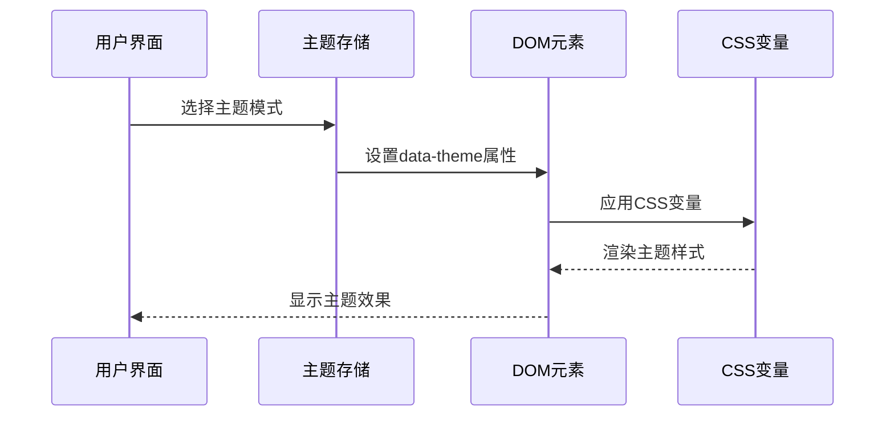

**图表来源**
- [useThemeStore.ts:20-36](file://client/src/store/useThemeStore.ts#L20-L36)
- [index.css:4-25](file://client/src/index.css#L4-L25)

## 详细组件分析

### CSS变量主题系统

**新增** CSS变量主题系统实现了完整的主题管理机制：

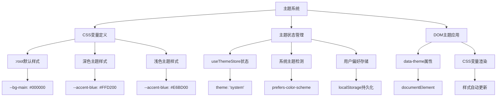

**图表来源**
- [index.css:4-101](file://client/src/index.css#L4-L101)
- [useThemeStore.ts:20-36](file://client/src/store/useThemeStore.ts#L20-L36)

### 深色主题CSS变量

深色主题定义了完整的色彩系统：

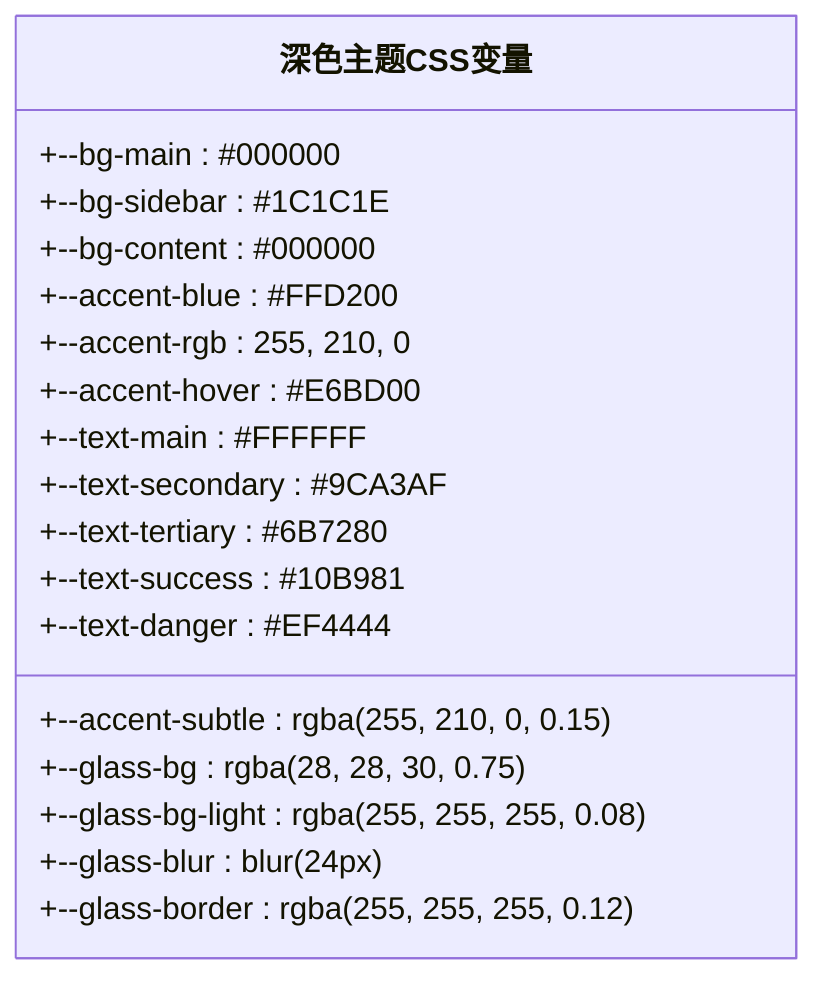

**图表来源**
- [index.css:5-35](file://client/src/index.css#L5-L35)

### 浅色主题CSS变量

浅色主题定义了调整后的色彩系统：

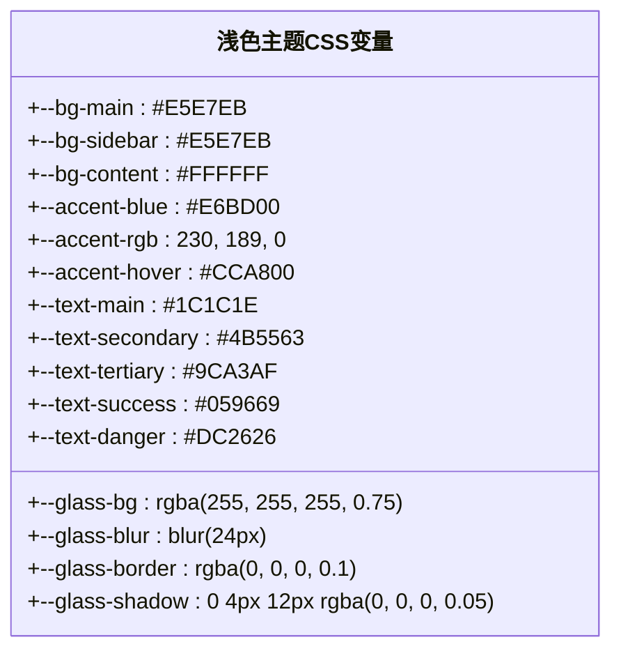

**图表来源**
- [index.css:58-100](file://client/src/index.css#L58-L100)

### 主题状态管理

**新增** useThemeStore实现了完整的主题状态管理：

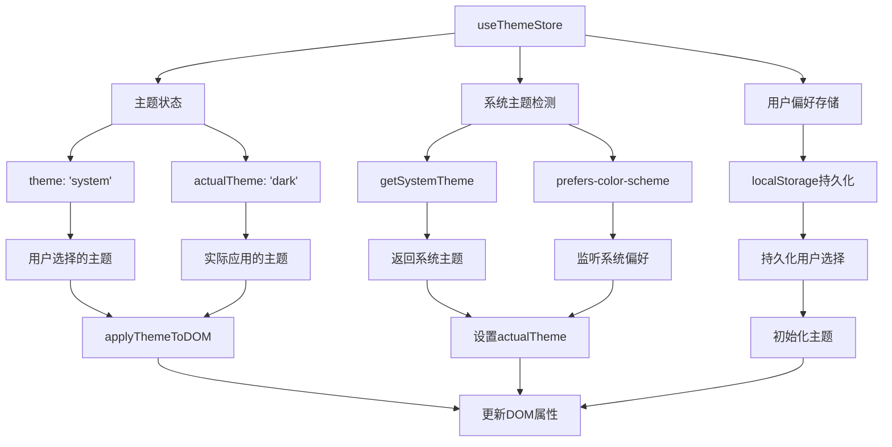

**图表来源**
- [useThemeStore.ts:27-85](file://client/src/store/useThemeStore.ts#L27-L85)

**章节来源**
- [index.css:4-101](file://client/src/index.css#L4-L101)
- [useThemeStore.ts:1-85](file://client/src/store/useThemeStore.ts#L1-L85)

## macOS玻璃拟态设计

### 玻璃拟态CSS变量

**新增** macOS玻璃拟态设计实现了完整的模糊效果系统：

```mermaid
flowchart TD
A[玻璃拟态系统] --> B[背景模糊]
A --> C[透明材质]
A --> D[阴影系统]
B --> E[--glass-bg: rgba(28, 28, 30, 0.75)]
B --> F[--glass-blur: blur(24px)]
C --> G[--glass-bg-light: rgba(255, 255, 255, 0.08)]
C --> H[--glass-border: rgba(255, 255, 255, 0.12)]
D --> I[--glass-shadow: 0 8px 32px rgba(0, 0, 0, 0.3)]
D --> J[--glass-shadow-lg: 0 16px 48px rgba(0, 0, 0, 0.4)]
K[交互效果] --> L[--glass-bg-hover: rgba(255, 255, 255, 0.12)]
K --> M[--glass-border-accent: rgba(255, 210, 0, 0.3)]
K --> N[--glass-shadow-accent: 0 8px 32px rgba(255, 210, 0, 0.15)]
```

**图表来源**
- [index.css:26-35](file://client/src/index.css#L26-L35)
- [index.css:86-96](file://client/src/index.css#L86-L96)

### 玻璃卡片组件

**新增** 玻璃卡片组件提供了多种容器样式：

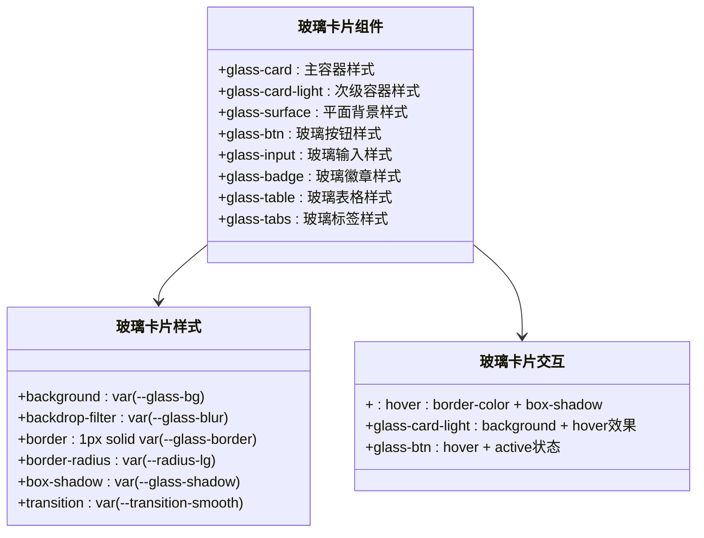

**图表来源**
- [index.css:1432-1591](file://client/src/index.css#L1432-L1591)

### 玻璃拟态动画系统

**新增** 玻璃拟态动画系统提供了流畅的交互效果：

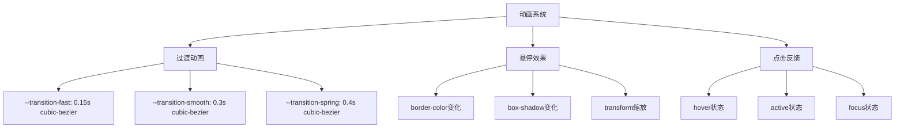

**图表来源**
- [index.css:44-47](file://client/src/index.css#L44-L47)
- [index.css:1443-1495](file://client/src/index.css#L1443-L1495)

**章节来源**
- [index.css:26-35](file://client/src/index.css#L26-L35)
- [index.css:86-96](file://client/src/index.css#L86-L96)
- [index.css:1432-1591](file://client/src/index.css#L1432-L1591)

## 品牌色彩统一

### Kine品牌色彩体系

**新增** Kine品牌色彩体系建立了完整的色彩规范：

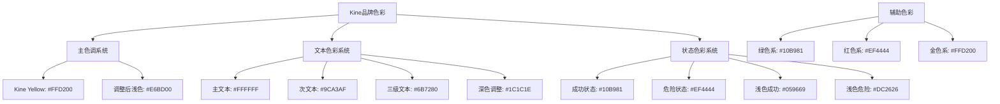

**图表来源**
- [index.css:11-24](file://client/src/index.css#L11-L24)
- [index.css:74-84](file://client/src/index.css#L74-L84)
- [index.css:18-24](file://client/src/index.css#L18-L24)

### 品牌色彩应用规范

**新增** 品牌色彩应用规范确保了设计的一致性：

| 应用场景 | 推荐颜色 | 使用说明 | CSS变量 |
|---------|----------|----------|---------|
| 主按钮 | #FFD200 | 用于主要操作 | --accent-blue |
| 成功状态 | #10B981 | 用于成功反馈 | --text-success |
| 危险操作 | #EF4444 | 用于删除/撤销 | --text-danger |
| 链接文字 | #FFD200 | 保持高对比度 | --accent-blue |
| 按钮悬停 | #E6BD00 | 用于交互反馈 | --accent-hover |
| 背景玻璃 | rgba(28, 28, 30, 0.75) | 用于模态框背景 | --glass-bg |
| 深色主题 | #1C1C1E | 用于深色背景 | --text-main(dark) |
| 浅色主题 | #E5E7EB | 用于浅色背景 | --bg-main(light) |

**章节来源**
- [index.css:11-24](file://client/src/index.css#L11-L24)
- [index.css:74-84](file://client/src/index.css#L74-L84)
- [index.css:18-24](file://client/src/index.css#L18-L24)

## 响应式主题适配

### 系统主题检测

**新增** 系统主题检测实现了自动主题切换：

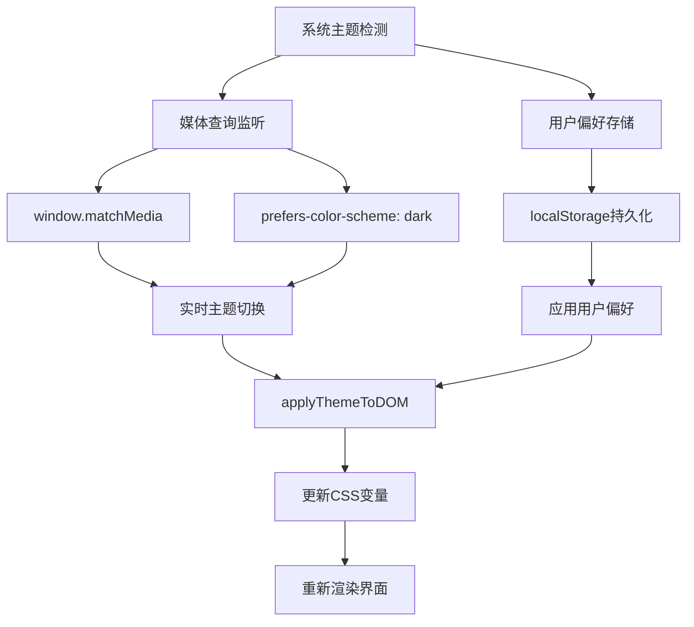

**图表来源**
- [useThemeStore.ts:13-25](file://client/src/store/useThemeStore.ts#L13-L25)
- [useThemeStore.ts:46-66](file://client/src/store/useThemeStore.ts#L46-L66)

### 主题切换机制

**新增** 主题切换机制提供了流畅的用户体验：

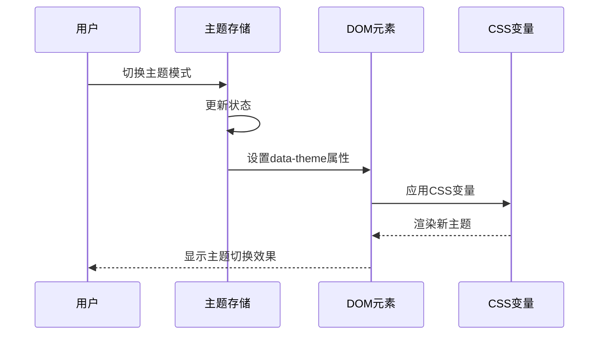

**图表来源**
- [useThemeStore.ts:33-36](file://client/src/store/useThemeStore.ts#L33-L36)
- [index.css:20-25](file://client/src/index.css#L20-L25)

### 用户偏好管理

**新增** 用户偏好管理实现了主题设置的持久化：

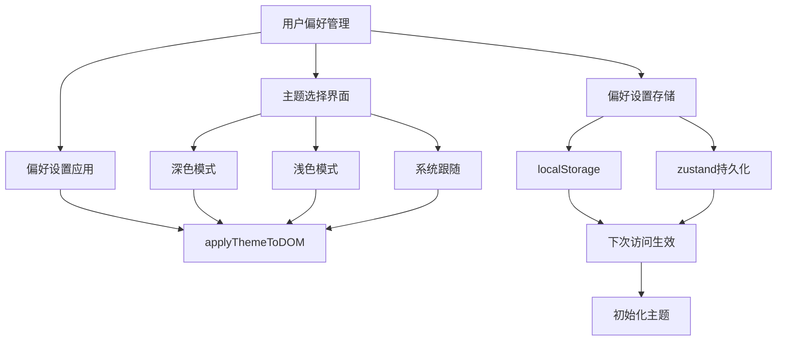

**图表来源**
- [useThemeStore.ts:69-83](file://client/src/store/useThemeStore.ts#L69-L83)

**章节来源**
- [useThemeStore.ts:1-85](file://client/src/store/useThemeStore.ts#L1-L85)
- [index.css:20-25](file://client/src/index.css#L20-L25)

## 组件样式系统

### 玻璃拟态组件库

**新增** 玻璃拟态组件库提供了完整的UI组件系统：

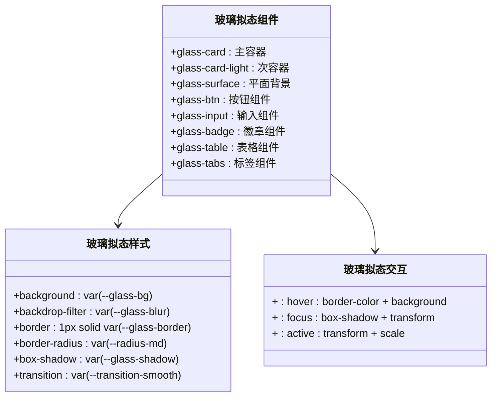

**图表来源**
- [index.css:1432-1591](file://client/src/index.css#L1432-L1591)

### 组件样式应用

**新增** 组件样式应用展示了CSS变量的实际使用：

```mermaid
flowchart TD
A[组件样式应用] --> B[KinefinityWiki组件]
A --> C[其他组件]
B --> D[背景样式: var(--bg-main)]
B --> E[边框样式: var(--glass-border)]
B --> F[文本样式: var(--text-main)]
C --> G[玻璃卡片: var(--glass-bg)]
C --> H[按钮样式: var(--accent-blue)]
C --> I[输入样式: var(--glass-bg-light)]
J[样式变量] --> K[主题自动切换]
J --> L[响应式适配]
J --> M[性能优化]
K --> N[深色/浅色主题]
L --> O[系统/用户偏好]
M --> P[CSS变量渲染]
```

**图表来源**
- [KinefinityWiki.tsx:1719-1734](file://client/src/components/KinefinityWiki.tsx#L1719-L1734)
- [KinefinityWiki.tsx:1746-1751](file://client/src/components/KinefinityWiki.tsx#L1746-L1751)

**章节来源**
- [index.css:1432-1591](file://client/src/index.css#L1432-L1591)
- [KinefinityWiki.tsx:1719-1734](file://client/src/components/KinefinityWiki.tsx#L1719-L1734)

## 性能优化

### CSS变量渲染优化

**新增** CSS变量渲染优化提升了样式系统的性能：

1. **变量缓存机制**：CSS变量在浏览器中缓存，避免重复计算
2. **主题切换优化**：使用CSS变量而非JavaScript动态修改样式
3. **样式重绘优化**：减少不必要的DOM重绘和重排
4. **动画性能优化**：使用transform和opacity属性进行动画

### 主题切换性能优化

**新增** 主题切换性能优化确保了流畅的用户体验：

1. **事件监听优化**：使用防抖机制避免频繁的主题切换
2. **DOM操作优化**：批量更新DOM属性，减少重排
3. **CSS变量缓存**：利用浏览器缓存机制提升渲染性能
4. **动画帧优化**：使用requestAnimationFrame优化动画性能

### 样式缓存机制

**新增** 样式缓存机制提升了组件的渲染效率：

1. **CSS变量缓存**：浏览器自动缓存CSS变量计算结果
2. **主题状态缓存**：使用zustand状态管理库缓存主题状态
3. **DOM属性缓存**：缓存documentElement的data-theme属性
4. **样式计算缓存**：避免重复的样式计算和应用

**章节来源**
- [index.css:4-101](file://client/src/index.css#L4-L101)
- [useThemeStore.ts:1-85](file://client/src/store/useThemeStore.ts#L1-L85)

## 故障排除指南

### 常见问题及解决方案

| 问题类型 | 症状描述 | 可能原因 | 解决方案 |
|---------|----------|----------|----------|
| 主题切换失败 | 主题无法切换或切换后样式异常 | CSS变量未正确应用 | 检查data-theme属性设置，确认CSS变量定义 |
| 玻璃拟态效果异常 | 玻璃背景不透明或模糊效果缺失 | backdrop-filter不支持 | 检查浏览器兼容性，添加backdrop-filter支持 |
| 品牌色彩显示异常 | 色彩显示不符合预期 | CSS变量覆盖或主题冲突 | 检查CSS变量优先级，确认主题状态正确 |
| 动画效果卡顿 | 主题切换或组件动画卡顿 | 动画性能问题 | 优化动画属性，使用硬件加速 |
| 响应式适配问题 | 移动端主题显示异常 | 媒体查询或断点设置问题 | 检查CSS媒体查询，确认断点设置 |
| 样式闪烁问题 | 页面加载时样式闪烁 | CSS变量渲染顺序问题 | 使用CSS-in-JS或内联样式确保渲染顺序 |
| 悬停状态异常 | 悬停效果不一致或失效 | 事件处理冲突或CSS优先级问题 | 检查事件绑定和CSS变量应用 |

### 调试工具

组件提供了完善的调试功能：

1. **开发者工具支持**
   - CSS变量检查：使用开发者工具检查CSS变量值
   - 主题状态检查：使用React DevTools检查主题状态
   - 样式渲染检查：使用Performance面板分析样式渲染

2. **错误监控**
   - 主题切换监控：检查主题切换事件是否正常触发
   - CSS变量监控：验证CSS变量是否正确应用
   - 动画性能监控：检查动画帧率和性能指标

3. **兼容性测试**
   - 浏览器兼容性测试：检查backdrop-filter支持情况
   - 主题切换测试：验证深色/浅色主题切换功能
   - 响应式测试：检查移动端和桌面端显示效果

**章节来源**
- [index.css:1-1898](file://client/src/index.css#L1-L1898)
- [useThemeStore.ts:1-85](file://client/src/store/useThemeStore.ts#L1-L85)

## 结论

KinefinityWiki 知识库导航组件经过重大样式更新后，成功实现了全新的CSS变量主题系统，包括完整的macOS风格玻璃拟态设计、品牌色彩统一和响应式主题适配。重构后的主题系统将原有的静态样式升级为动态可配置的主题系统，显著提升了视觉体验和用户体验。

### 主要优势

1. **CSS变量主题系统** - 完整的CSS自定义属性定义，支持深色和浅色主题，实现系统主题自动切换
2. **macOS玻璃拟态设计** - 真实的玻璃材质效果，包括模糊背景、透明边框和多层阴影
3. **品牌色彩统一** - 完整的Kine品牌色彩体系，确保视觉一致性和专业性
4. **响应式主题适配** - 支持系统主题偏好检测和用户手动选择，提供灵活的主题控制
5. **组件样式系统** - 完整的玻璃拟态组件库，提供丰富的UI组件选择
6. **性能优化** - 基于CSS变量的渲染优化，确保流畅的用户体验和良好的性能表现

该组件为 Kinefinity 的知识管理提供了坚实的技术基础，通过现代化的UI设计和优秀的用户体验，能够有效提升团队的工作效率和技术文档的可访问性。全新的CSS变量主题系统不仅满足了当前的功能需求，更为未来的功能扩展和主题定制奠定了坚实的基础。

**更新** 最新的样式更新包括全新的CSS变量主题系统、macOS玻璃拟态设计、品牌色彩统一和响应式主题适配等功能，进一步提升了用户的知识库访问体验和视觉享受。重大架构变更使得主题系统更加灵活和强大，为整个知识库系统带来了显著的视觉提升和功能增强。

**更新** 根据应用变更要求，知识库系统中已移除反馈功能，简化了组件功能。这一变更不影响核心的导航、搜索和编辑功能，同时减少了不必要的UI元素和状态管理，提升了整体性能和用户体验。组件仍然保持了完整的主题系统和现代化的设计风格，为用户提供了一致且高效的使用体验。

**更新** 最新的悬停状态细化和图标颜色优化进一步提升了用户体验。通过使用 var(--text-secondary) CSS 变量替代硬编码颜色，组件实现了更好的对比度和主题一致性。精细化的悬停状态控制确保了用户交互的流畅性和直观性，为知识库导航提供了更加专业的视觉体验。