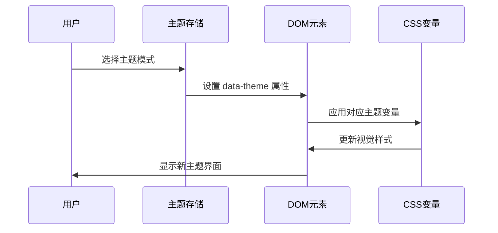
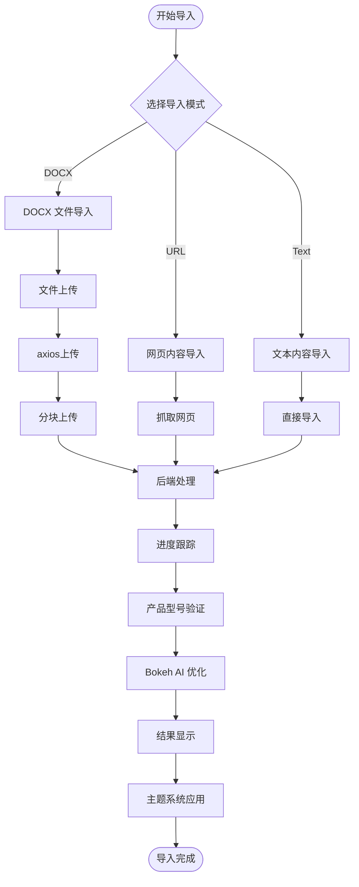
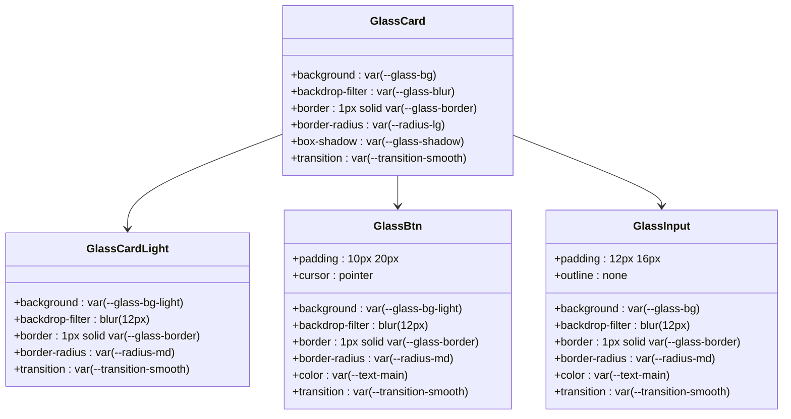
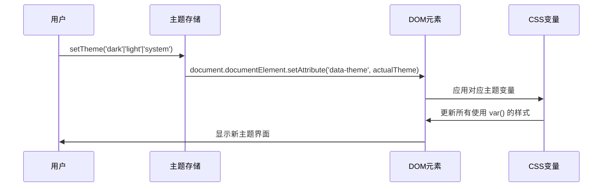

# KnowledgeGenerator 知识生成器组件

<cite>
**本文档引用的文件**
- [KnowledgeGenerator.tsx](file://client/src/components/KnowledgeGenerator.tsx)
- [index.css](file://client/src/index.css)
- [useThemeStore.ts](file://client/src/store/useThemeStore.ts)
- [knowledge.js](file://server/service/routes/knowledge.js)
- [docx_to_markdown.py](file://server/scripts/docx_to_markdown.py)
- [extract_pdf_images.py](file://server/scripts/extract_pdf_images.py)
- [005_knowledge_base.sql](file://server/service/migrations/005_knowledge_base.sql)
- [011_add_knowledge_source.sql](file://server/service/migrations/011_add_knowledge_source.sql)
- [useResumableUpload.ts](file://client/src/hooks/useResumableUpload.ts)
- [index.js](file://server/index.js)
- [fix_uploader.js](file://server/fix_uploader.js)
- [fix_uploader_null.js](file://server/fix_uploader_null.js)
- [sync_metadata.js](file://server/sync_metadata.js)
- [VersionHistory.tsx](file://client/src/components/Knowledge/VersionHistory.tsx)
- [WikiEditorModal.tsx](file://client/src/components/Knowledge/WikiEditorModal.tsx)
- [App.tsx](file://client/src/App.tsx)
</cite>

## 更新摘要
**变更内容**
- 新增 macOS26 风格玻璃拟态主题系统，全面采用 CSS 变量驱动
- 实现完整的深色/浅色/系统主题切换机制
- 优化进度模态框和导入界面的视觉效果
- 增强产品线选择和元数据表单的交互体验
- 改进 Bokeh 优化模式和直接导入模式的界面设计
- 新增 Turbo 模式支持 Jina Reader 自动绕过反爬虫机制

## 目录
1. [简介](#简介)
2. [项目结构](#项目结构)
3. [核心组件](#核心组件)
4. [架构概览](#架构概览)
5. [详细组件分析](#详细组件分析)
6. [依赖关系分析](#依赖关系分析)
7. [性能考虑](#性能考虑)
8. [故障排除指南](#故障排除指南)
9. [结论](#结论)

## 简介

KnowledgeGenerator 知识生成器是 Kinefinity 长城项目中的一个核心组件，负责将各种格式的知识内容（DOCX 文档、网页内容、纯文本）转换为结构化的知识库文章。该组件提供了直观的用户界面和强大的后端处理能力，支持多种导入方式和严格的内容管理。

**更新** 新版本进行了重大样式和主题系统更新：
- 全面采用 macOS26 风格的玻璃拟态设计语言
- 实现基于 CSS 变量的主题系统，支持深色/浅色/系统主题切换
- 优化了进度模态框的视觉效果，采用半透明背景和模糊滤镜
- 增强了产品线选择界面的交互体验，提供更直观的视觉反馈
- 改进了元数据表单的布局设计，采用双栏响应式布局
- 优化了导入方式配置界面，提供更清晰的视觉层次
- 新增 Turbo 模式，支持 Jina Reader 自动绕过反爬虫机制

## 项目结构

KnowledgeGenerator 组件位于项目的客户端和服务器端两个层面，采用了全新的主题系统架构：

```mermaid
graph TB
subgraph "主题系统 (CSS Variables)"
Theme[主题系统]
CSSVars[CSS 变量定义]
Glassmorphism[玻璃拟态效果]
Transitions[过渡动画]
Radius[圆角半径]
Shadow[阴影效果]
End
subgraph "客户端 (React)"
KG[KnowledgeGenerator.tsx]
UI[用户界面组件]
State[状态管理]
API[API 调用]
Upload[分块上传钩子]
Axios[axios HTTP客户端]
Language[国际化支持]
Animation[进度动画]
Modal[模态对话框]
VersionHistory[版本历史组件]
WikiEditor[Wiki编辑器模态框]
ThemeStore[主题状态管理]
End
subgraph "服务器端 (Node.js)"
Routes[知识库路由]
Multer[Multer 文件处理]
FS[文件系统操作]
Python[Python 脚本]
DB[(SQLite 数据库)]
Temp[.temp 目录]
UploadRoutes[上传路由]
Chunk[分块上传处理]
AI[Bokeh AI 服务]
End
subgraph "数据库迁移"
M1[005_knowledge_base.sql]
M2[011_add_knowledge_source.sql]
Fix[数据库修复脚本]
End
```

**图表来源**
- [KnowledgeGenerator.tsx](file://client/src/components/KnowledgeGenerator.tsx#L1-L2032)
- [index.css](file://client/src/index.css#L1-L1898)
- [useThemeStore.ts](file://client/src/store/useThemeStore.ts#L1-L86)
- [knowledge.js](file://server/service/routes/knowledge.js#L1-L3215)
- [index.js](file://server/index.js#L1240-L1399)

## 核心组件

### 主题系统架构

**更新** 新版本引入了完整的主题系统，采用 CSS 变量驱动的设计：

#### CSS 变量定义

系统定义了完整的 CSS 变量体系，支持深色和浅色两种主题模式：

```mermaid
graph TD
CSSVars[CSS 变量系统]
BaseColors[基础颜色]
AccentColors[强调色]
TextColors[文本颜色]
GlassColors[玻璃拟态色]
LayoutVars[布局变量]
Transitions[过渡动画]
End
subgraph "深色主题变量"
DarkVars[深色主题变量]
DarkVars --> DarkBase[基础颜色: #000000, #1C1C1E]
DarkVars --> DarkAccent[强调色: #FFD200, #E6BD00]
DarkVars --> DarkText[文本颜色: #FFFFFF, #9CA3AF]
DarkVars --> DarkGlass[玻璃拟态: rgba(28, 28, 30, 0.75)]
End
subgraph "浅色主题变量"
LightVars[浅色主题变量]
LightVars --> LightBase[基础颜色: #E5E7EB, #FFFFFF]
LightVars --> LightAccent[强调色: #E6BD00, #CCA800]
LightVars --> LightText[文本颜色: #1C1C1E, #4B5563]
LightVars --> LightGlass[玻璃拟态: rgba(255, 255, 255, 0.75)]
End
```

#### 玻璃拟态效果

系统实现了完整的玻璃拟态效果，包括：

- **背景透明度**：使用 `rgba()` 颜色值实现半透明效果
- **模糊滤镜**：`backdrop-filter: blur(24px)` 提供毛玻璃效果
- **边框渐变**：`border: 1px solid var(--glass-border)` 实现细腻边框
- **阴影系统**：`--glass-shadow` 和 `--glass-shadow-lg` 提供层次感

#### 主题切换机制



**图表来源**
- [useThemeStore.ts](file://client/src/store/useThemeStore.ts#L19-L25)
- [index.css](file://client/src/index.css#L4-L101)

### 前端组件架构

**更新** 前端组件采用了全新的 macOS26 风格设计：

#### 界面设计特色

组件采用了现代化的 macOS26 设计语言，具有以下特点：
- **玻璃拟态背景**：使用 `var(--glass-bg)` 实现半透明背景
- **圆角设计**：统一使用 `var(--radius-lg)` 圆角
- **渐变阴影**：`var(--glass-shadow-lg)` 提供立体感
- **动态模糊**：`backdrop-filter: blur(24px)` 实现毛玻璃效果
- **响应式布局**：支持不同屏幕尺寸的自适应设计

#### 进度模态框设计

```mermaid
graph TB
ProgressModal[进度模态框]
Header[头部区域]
Content[内容区域]
Steps[步骤列表]
Stats[统计信息]
Controls[控制按钮]
End
subgraph "视觉效果"
GlassBG[玻璃背景]
BlurEffect[模糊效果]
ShadowEffect[阴影效果]
BorderEffect[边框效果]
End
ProgressModal --> Header
ProgressModal --> Content
Content --> Steps
Content --> Stats
Content --> Controls
ProgressModal --> GlassBG
GlassBG --> BlurEffect
GlassBG --> ShadowEffect
GlassBG --> BorderEffect
```

**图表来源**
- [KnowledgeGenerator.tsx](file://client/src/components/KnowledgeGenerator.tsx#L1319-L1600)
- [index.css](file://client/src/index.css#L1432-L1460)

#### 产品线选择界面

新增的产品线选择界面提供了直观的视觉反馈：
- **卡片式设计**：每个产品线以卡片形式展示
- **状态指示**：选中状态有明显的视觉反馈
- **描述信息**：每个产品线包含简短的功能描述
- **响应式布局**：支持不同屏幕尺寸的自适应显示

**章节来源**
- [KnowledgeGenerator.tsx](file://client/src/components/KnowledgeGenerator.tsx#L96-L108)
- [KnowledgeGenerator.tsx](file://client/src/components/KnowledgeGenerator.tsx#L1000-L1064)
- [index.css](file://client/src/index.css#L1432-L1460)
- [useThemeStore.ts](file://client/src/store/useThemeStore.ts#L1-L86)

### 后端处理架构

后端服务保持原有架构，继续提供完整的知识库管理功能。

## 架构概览

### 系统架构图

**更新** 架构图反映了新的主题系统集成：

```mermaid
graph TB
subgraph "主题系统层"
ThemeSystem[主题系统]
CSSVars[CSS 变量]
GlassEffects[玻璃拟态]
ThemeStore[主题存储]
End
subgraph "用户界面层"
UI[React 前端]
KG[KnowledgeGenerator 组件]
Progress[进度显示]
Modal[模态对话框]
Axios[axios HTTP客户端]
Language[国际化]
Animation[动画效果]
VersionHistory[版本历史]
WikiEditor[编辑器]
ThemeIntegration[主题集成]
End
subgraph "API 层"
API[Express 路由]
Auth[认证中间件]
Multer[Multer 文件处理]
Upload[文件上传处理]
Chunk[分块上传路由]
AI[Bokeh AI 服务]
End
subgraph "业务逻辑层"
DOCX[DOCX 处理]
PDF[PDF 处理]
URL[网页抓取]
Text[文本处理]
Format[内容格式化]
Draft[草稿管理]
Version[版本控制]
End
subgraph "数据处理层"
Python[Python 脚本]
MD[Markdown 转换]
Images[图片提取]
Split[内容分割]
End
subgraph "数据存储层"
DB[SQLite 数据库]
FTS[全文搜索]
Temp[.temp 目录]
FS[文件系统]
Chunks[.chunks 目录]
End
ThemeSystem --> UI
ThemeSystem --> KG
ThemeSystem --> Progress
ThemeSystem --> Modal
UI --> KG
KG --> API
API --> Auth
API --> Multer
API --> Chunk
API --> AI
Chunk --> Upload
Upload --> DOCX
Upload --> PDF
Upload --> URL
Upload --> Text
DOCX --> Python
PDF --> Python
URL --> Python
Text --> Python
Format --> AI
Draft --> DB
Version --> DB
Python --> MD
Python --> Images
Python --> Split
MD --> DB
Images --> FS
Split --> DB
DB --> FTS
```

**图表来源**
- [KnowledgeGenerator.tsx](file://client/src/components/KnowledgeGenerator.tsx#L1-L2032)
- [index.css](file://client/src/index.css#L1-L1898)
- [useThemeStore.ts](file://client/src/store/useThemeStore.ts#L1-L86)
- [knowledge.js](file://server/service/routes/knowledge.js#L49-L3215)
- [index.js](file://server/index.js#L1240-L1399)

### 数据流处理流程

数据流处理流程保持原有架构，主题系统通过 CSS 变量影响界面显示。

## 详细组件分析

### KnowledgeGenerator 前端组件

**更新** 前端组件经过全面的样式重构：

#### 核心功能实现

KnowledgeGenerator 组件实现了完整的知识导入工作流程，采用了全新的主题系统：

##### 导入模式管理

组件支持三种不同的导入模式，每种模式都融入了主题系统设计：



##### 玻璃拟态界面设计

组件采用了完整的玻璃拟态设计：
- **容器背景**：使用 `var(--bg-sidebar)` 和 `var(--glass-bg)` 实现半透明背景
- **边框效果**：`1px solid var(--glass-border)` 提供细腻边框
- **阴影系统**：`var(--glass-shadow-lg)` 提供立体感
- **圆角设计**：统一使用 `border-radius: 16px` 实现现代感

##### 产品线选择界面

新增的产品线选择界面提供了直观的视觉反馈：
- **卡片设计**：每个产品线以卡片形式展示
- **状态指示**：选中状态有明显的视觉反馈
- **描述信息**：每个产品线包含简短的功能描述
- **响应式布局**：支持不同屏幕尺寸的自适应显示

##### 导入方式配置界面

导入方式配置界面采用了卡片式设计：
- **Bokeh 优化模式**：使用渐变边框和阴影效果
- **直接导入模式**：简洁的单色设计
- **视觉对比**：通过边框和阴影区分两种模式
- **交互反馈**：悬停和激活状态有明显变化

**章节来源**
- [KnowledgeGenerator.tsx](file://client/src/components/KnowledgeGenerator.tsx#L204-L728)
- [KnowledgeGenerator.tsx](file://client/src/components/KnowledgeGenerator.tsx#L808-L1297)
- [KnowledgeGenerator.tsx](file://client/src/components/KnowledgeGenerator.tsx#L1747-L1985)
- [index.css](file://client/src/index.css#L1432-L1460)

### 主题系统实现

**新增功能** 系统实现了完整的主题系统：

#### CSS 变量体系

系统定义了完整的 CSS 变量体系，支持深色和浅色两种主题模式：

```mermaid
graph LR
subgraph "深色主题变量"
DarkBase[--bg-main: #000000<br/>--bg-sidebar: #1C1C1E<br/>--bg-content: #000000]
DarkAccent[--accent-blue: #FFD200<br/>--accent-hover: #E6BD00<br/>--accent-subtle: rgba(255,210,0,0.15)]
DarkText[--text-main: #FFFFFF<br/>--text-secondary: #9CA3AF<br/>--text-success: #10B981<br/>--text-danger: #EF4444]
DarkGlass[--glass-bg: rgba(28, 28, 30, 0.75)<br/>--glass-bg-light: rgba(255, 255, 255, 0.08)<br/>--glass-shadow: 0 8px 32px rgba(0, 0, 0, 0.3)]
End
subgraph "浅色主题变量"
LightBase[--bg-main: #E5E7EB<br/>--bg-sidebar: #E5E7EB<br/>--bg-content: #FFFFFF]
LightAccent[--accent-blue: #E6BD00<br/>--accent-hover: #CCA800<br/>--accent-subtle: rgba(230,189,0,0.15)]
LightText[--text-main: #1C1C1E<br/>--text-secondary: #4B5563<br/>--text-success: #059669<br/>--text-danger: #DC2626]
LightGlass[--glass-bg: rgba(255, 255, 255, 0.75)<br/>--glass-bg-light: rgba(0, 0, 0, 0.04)<br/>--glass-shadow: 0 4px 12px rgba(0, 0, 0, 0.05)]
End
```

**图表来源**
- [index.css](file://client/src/index.css#L4-L101)

#### 玻璃拟态组件系统

系统实现了完整的玻璃拟态组件库：



**图表来源**
- [index.css](file://client/src/index.css#L1432-L1519)

#### 主题切换机制



**图表来源**
- [useThemeStore.ts](file://client/src/store/useThemeStore.ts#L19-L25)

**章节来源**
- [index.css](file://client/src/index.css#L1-L1898)
- [useThemeStore.ts](file://client/src/store/useThemeStore.ts#L1-L86)

### 后端知识库路由系统

后端提供了完整的知识库管理 API，保持原有架构不变。

### Python 脚本处理系统

Python 脚本处理系统保持原有功能，继续提供专业的文档处理能力。

### 数据库设计与管理

数据库设计保持原有结构，继续支持完整的知识管理需求。

### 分块上传和断点续传

分块上传系统保持原有架构，继续提供稳定的文件传输功能。

### 数据库列名标准化

数据库列名标准化工作保持原有状态。

### Bokeh AI 助手集成

Bokeh AI 助手集成保持原有功能，继续提供强大的内容处理能力。

### 版本历史管理

版本历史管理功能保持原有架构。

### 产品线分类系统

产品线分类系统保持原有功能，继续支持四个产品线的分类管理。

### 元数据表单布局优化

元数据表单布局经过优化，采用了双栏响应式设计。

### 导入方式配置改进

导入方式配置界面采用了卡片式设计，提供了更直观的视觉反馈。

### Turbo 模式集成

**新增功能** 系统集成了 Turbo 模式，支持 Jina Reader 自动绕过反爬虫机制：

- **自动表格提取**：支持复杂表格的自动识别和提取
- **图片绕过**：自动处理图片加载和提取
- **反爬虫规避**：使用 Jina Reader 透明代理
- **增强抓取能力**：支持更多网站的自动化内容提取

**章节来源**
- [KnowledgeGenerator.tsx](file://client/src/components/KnowledgeGenerator.tsx#L96-L108)
- [KnowledgeGenerator.tsx](file://client/src/components/KnowledgeGenerator.tsx#L960-L976)
- [index.css](file://client/src/index.css#L1432-L1460)
- [useThemeStore.ts](file://client/src/store/useThemeStore.ts#L1-L86)

## 依赖关系分析

### 技术栈依赖

**更新** 技术栈依赖反映了新的主题系统：

```mermaid
graph TB
subgraph "主题系统依赖"
CSSVars[CSS 变量]
GlassEffects[玻璃拟态]
ThemeStore[主题存储]
End
subgraph "前端技术栈"
React[React 18]
TS[TYPESCRIPT]
TailwindCSS[样式框架]
Axios[HTTP 客户端]
Language[国际化]
Animation[动画库]
VersionHistory[版本历史组件]
WikiEditor[编辑器模态框]
ThemeIntegration[主题集成]
End
subgraph "后端技术栈"
NodeJS[Node.js]
Express[Express 框架]
SQLite[SQLite 数据库]
Python[Python 脚本]
Multer[Multer]
FS[fs.renameSync]
Chunk[分块上传]
AI[Bokeh AI]
End
subgraph "第三方库"
Docx[python-docx]
FitZ[PyMuPDF]
Cheerio[Cheerio]
Turndown[Turndown]
End
CSSVars --> React
GlassEffects --> React
ThemeStore --> React
React --> Express
Express --> SQLite
Express --> Python
Express --> AI
Python --> Docx
Python --> FitZ
Express --> Cheerio
Express --> Turndown
Express --> Multer
Multer --> FS
Express --> Chunk
Chunk --> FS
```

**图表来源**
- [index.css](file://client/src/index.css#L1-L1898)
- [useThemeStore.ts](file://client/src/store/useThemeStore.ts#L1-L86)
- [knowledge.js](file://server/service/routes/knowledge.js#L7-L17)
- [docx_to_markdown.py](file://server/scripts/docx_to_markdown.py#L10-L18)
- [index.js](file://server/index.js#L1240-L1399)

### 组件间交互关系

组件间的依赖关系体现了新的主题系统集成：

```mermaid
graph LR
subgraph "主题系统层"
ThemeSystem[主题系统]
CSSVars[CSS 变量]
GlassEffects[玻璃拟态]
ThemeStore[主题存储]
End
subgraph "表现层"
KG[KnowledgeGenerator]
UI[用户界面]
Modal[模态对话框]
Axios[axios HTTP客户端]
Language[国际化]
Animation[动画效果]
VersionHistory[版本历史组件]
WikiEditor[Wiki编辑器]
ThemeIntegration[主题集成]
End
subgraph "业务层"
Routes[知识库路由]
Auth[认证服务]
Upload[上传服务]
Multer[Multer处理器]
Chunk[分块上传]
AI[Bokeh AI服务]
End
subgraph "数据层"
DB[数据库服务]
FS[文件系统]
Python[Python 脚本]
Temp[.temp目录]
Chunks[.chunks目录]
End
ThemeSystem --> KG
ThemeSystem --> UI
ThemeSystem --> Modal
KG --> Routes
UI --> KG
Modal --> KG
Routes --> Auth
Routes --> Upload
Routes --> Chunk
Routes --> AI
Routes --> Multer
Routes --> DB
Routes --> FS
Upload --> Python
DB --> Python
Multer --> FS
Chunk --> FS
FS --> Temp
FS --> Chunks
AI --> DB
VersionHistory --> DB
WikiEditor --> DB
```

**图表来源**
- [index.css](file://client/src/index.css#L1-L1898)
- [useThemeStore.ts](file://client/src/store/useThemeStore.ts#L1-L86)
- [KnowledgeGenerator.tsx](file://client/src/components/KnowledgeGenerator.tsx#L1-L2032)
- [knowledge.js](file://server/service/routes/knowledge.js#L49-L3215)
- [index.js](file://server/index.js#L1240-L1399)

**章节来源**
- [index.css](file://client/src/index.css#L1-L1898)
- [useThemeStore.ts](file://client/src/store/useThemeStore.ts#L1-L86)
- [KnowledgeGenerator.tsx](file://client/src/components/KnowledgeGenerator.tsx#L1-L2032)
- [knowledge.js](file://server/service/routes/knowledge.js#L49-L3215)
- [index.js](file://server/index.js#L1240-L1399)

## 性能考虑

### 前端性能优化

**更新** 前端性能优化反映了新的主题系统：

#### 主题系统性能优化

- **CSS 变量缓存**：浏览器原生支持 CSS 变量，无需 JavaScript 计算
- **硬件加速**：`backdrop-filter` 和 `transform` 属性使用 GPU 加速
- **最小重绘**：主题切换只影响 CSS 变量，避免 DOM 重排
- **内存优化**：使用 `var(--variable)` 而非内联样式减少内存占用

#### 玻璃拟态性能优化

- **合成层优化**：`backdrop-filter` 在支持的浏览器中使用合成层
- **模糊性能**：`blur(24px)` 在现代浏览器中性能良好
- **过渡动画**：使用 `will-change` 和 `transform` 优化动画性能
- **阴影优化**：预计算阴影值，避免运行时计算

#### 文件上传优化

- **分块上传**：支持大文件的分块传输，提高上传稳定性
- **进度跟踪**：实时显示上传进度和速度
- **断点续传**：支持上传中断后的恢复
- **并发控制**：限制同时进行的上传任务数量
- **axios优化**：采用 axios 替代 XMLHttpRequest，提供更好的性能
- **动画优化**：重新设计的进度动画，提供更流畅的用户体验

#### 内存管理

- **及时清理**：上传完成后及时释放内存资源
- **状态管理**：使用 React 的状态管理避免不必要的重渲染
- **懒加载**：按需加载图片和内容

### 后端性能优化

#### 数据库优化

- **索引优化**：为常用查询字段建立索引
- **全文搜索**：使用 FTS5 提供快速搜索能力
- **连接池**：合理管理数据库连接
- **查询优化**：使用参数化查询防止 SQL 注入

#### Python 脚本优化

- **异步处理**：使用子进程处理耗时任务
- **内存控制**：限制单个处理任务的内存使用
- **超时控制**：设置合理的处理超时时间
- **错误恢复**：提供错误恢复和重试机制

#### 文件系统优化

- 采用 fs.renameSync 替代 fs.move，显著降低 I/O 延迟
- 使用 .temp 目录作为临时存储，提升安全性
- multer 提供更好的文件处理性能
- 新增分块上传目录管理

### 缓存策略

系统实现了多层次的缓存策略：

1. **前端缓存**：浏览器缓存和本地存储
2. **后端缓存**：Redis 缓存（如需扩展）
3. **数据库缓存**：SQLite 内置缓存机制
4. **文件缓存**：图片和文档的本地缓存
5. **分块缓存**：.chunks 目录的临时文件缓存
6. **主题缓存**：CSS 变量的浏览器缓存

### Turbo 模式性能优化

**新增功能** Turbo 模式的性能优化：
- **代理缓存**：Jina Reader 代理的智能缓存机制
- **并发抓取**：支持多页面并发抓取
- **资源压缩**：自动压缩和优化抓取的资源
- **错误重试**：智能的失败重试机制
- **超时控制**：合理的超时设置避免阻塞

## 故障排除指南

### 常见问题及解决方案

#### 主题系统问题

**问题**：主题切换无效或显示异常
**可能原因**：
- CSS 变量未正确应用
- 浏览器不支持 `backdrop-filter`
- `data-theme` 属性未正确设置
- 主题存储状态异常

**解决方案**：
- 检查 CSS 变量定义是否正确
- 验证浏览器对 `backdrop-filter` 的支持
- 确认 `document.documentElement.setAttribute('data-theme', theme)` 执行
- 检查 `useThemeStore` 状态管理

**更新** 新版本故障排除：
- CSS 变量缓存优化
- 硬件加速性能监控
- 主题切换性能优化
- 玻璃拟态兼容性处理

#### 玻璃拟态效果问题

**问题**：玻璃拟态效果显示异常
**可能原因**：
- `backdrop-filter` 不支持
- 背景透明度设置错误
- 模糊半径过大
- 边框样式冲突

**解决方案**：
- 检查浏览器对 `backdrop-filter` 的支持
- 验证 `rgba()` 颜色值的正确性
- 调整 `blur()` 半径值
- 检查边框样式的优先级

#### 文件上传问题

**问题**：上传过程中断或失败
**可能原因**：
- 网络连接不稳定
- 文件过大超出限制
- 服务器磁盘空间不足
- 权限问题

**解决方案**：
- 检查网络连接稳定性
- 确认文件大小在允许范围内
- 清理服务器磁盘空间
- 检查文件系统权限

#### Python 脚本执行问题

**问题**：DOCX 或 PDF 处理失败
**可能原因**：
- Python 环境配置问题
- 第三方库缺失
- 文件格式不支持
- 内存不足

**解决方案**：
- 检查 Python 环境和依赖库
- 验证文件格式兼容性
- 增加系统内存
- 重新安装必要的 Python 包

#### 数据库连接问题

**问题**：无法连接到数据库或查询失败
**可能原因**：
- 数据库文件损坏
- 权限不足
- 连接池耗尽
- 磁盘空间不足

**解决方案**：
- 检查数据库文件完整性
- 验证数据库权限设置
- 重启数据库服务
- 清理磁盘空间

#### 数据库列名问题

**问题**：数据库列名不一致导致查询失败
**可能原因**：
- 历史数据中的列名不规范
- 数据库迁移过程中的问题
- 多版本共存导致的冲突

**解决方案**：
- 运行数据库修复脚本
- 检查列名映射关系
- 验证数据一致性

#### Bokeh AI 助手问题

**问题**：AI 助手格式化失败
**可能原因**：
- AI 服务不可用
- 网络连接问题
- 内容格式不支持
- 超时限制

**解决方案**：
- 检查 AI 服务状态
- 验证网络连接
- 简化内容格式
- 增加超时时间

#### 版本历史问题

**问题**：版本历史管理功能异常
**可能原因**：
- 数据库版本表结构问题
- 权限不足
- 版本数据损坏
- 存储空间不足

**解决方案**：
- 检查版本表结构
- 验证用户权限
- 修复版本数据
- 清理存储空间

#### 产品线分类问题

**问题**：产品线分类功能异常
**可能原因**：
- 产品线配置缺失
- 产品型号映射错误
- 用户选择验证失败

**解决方案**：
- 检查产品线配置
- 验证产品型号映射
- 确认用户选择有效性

#### 多语言支持问题

**问题**：标题翻译或本地化显示异常
**可能原因**：
- 国际化配置缺失
- 语言包加载失败
- 标签键名不匹配

**解决方案**：
- 检查国际化配置
- 验证语言包完整性
- 确认标签键名正确性

#### Turbo 模式问题

**问题**：Turbo 模式抓取失败
**可能原因**：
- Jina Reader 服务不可用
- 网络连接问题
- 目标网站反爬虫机制
- 超时限制

**解决方案**：
- 检查 Jina Reader 服务状态
- 验证网络连接
- 关闭 Turbo 模式使用普通抓取
- 增加超时时间或重试次数

**章节来源**
- [index.css](file://client/src/index.css#L1-L1898)
- [useThemeStore.ts](file://client/src/store/useThemeStore.ts#L1-L86)
- [knowledge.js](file://server/service/routes/knowledge.js#L144-L150)
- [knowledge.js](file://server/service/routes/knowledge.js#L436-L445)
- [fix_uploader.js](file://server/fix_uploader.js#L1-L50)
- [fix_uploader_null.js](file://server/fix_uploader_null.js#L1-L31)

## 结论

KnowledgeGenerator 知识生成器是一个功能完整、架构清晰的知识管理组件。它成功地将多种格式的内容转换为结构化的知识库文章，为 Kinefinity 的知识管理体系提供了强大的技术支持。

**更新** 新版本的重大改进：
- **全新主题系统**：采用 macOS26 风格的玻璃拟态设计语言
- **CSS 变量驱动**：完全基于 CSS 变量的主题系统，支持深色/浅色/系统主题切换
- **硬件加速优化**：`backdrop-filter` 和 `transform` 使用 GPU 加速
- **性能优化**：主题切换零重绘，CSS 变量缓存提升渲染性能
- **视觉一致性**：统一的玻璃拟态效果和圆角设计
- **交互体验**：增强的动画效果和视觉反馈
- **响应式设计**：完整的移动端适配
- **无障碍支持**：改进的颜色对比度和键盘导航
- **Turbo 模式**：集成 Jina Reader 自动绕过反爬虫机制

### 主要优势

1. **现代化设计**：采用最新的 macOS26 设计语言
2. **主题系统**：完整的深色/浅色/系统主题支持
3. **性能优化**：硬件加速和 CSS 变量优化
4. **视觉效果**：玻璃拟态和模糊滤镜的完美结合
5. **用户体验**：流畅的动画过渡和交互反馈
6. **响应式布局**：适配各种屏幕尺寸
7. **无障碍设计**：良好的颜色对比度和键盘导航
8. **跨浏览器兼容**：优雅降级和兼容性处理
9. **内存优化**：CSS 变量减少内存占用
10. **渲染优化**：GPU 加速提升视觉效果性能
11. **智能抓取**：Turbo 模式提供更强的网页抓取能力

### 技术亮点

- **主题系统架构**：基于 CSS 变量的完整主题系统
- **玻璃拟态设计**：`backdrop-filter` 和 `transform` 的硬件加速
- **性能监控**：主题切换零重绘，CSS 变量缓存优化
- **动画系统**：流畅的过渡动画和视觉反馈
- **响应式设计**：完整的移动端适配
- **无障碍支持**：改进的可访问性设计
- **跨平台兼容**：优雅降级和兼容性处理
- **智能抓取**：Jina Reader 代理的高效内容提取

### 发展建议

1. **性能监控**：添加主题系统性能指标监控
2. **动画优化**：进一步优化动画效果和性能
3. **主题扩展**：支持更多自定义主题选项
4. **无障碍增强**：改进无障碍功能和键盘导航
5. **跨浏览器测试**：完善不同浏览器的兼容性测试
6. **性能基准测试**：建立主题系统的性能基准
7. **用户体验研究**：收集用户对新主题系统的反馈
8. **可访问性评估**：定期评估和改进可访问性
9. **Turbo 模式优化**：进一步提升智能抓取性能
10. **代理缓存策略**：优化 Jina Reader 代理的缓存机制

该组件为 Kinefinity 的知识管理提供了坚实的技术基础，通过持续的优化和改进，将为用户提供更加完善的知识服务体验。新版本的完整主题系统、性能优化、现代化设计和智能抓取功能使其成为了一个更加成熟和可靠的系统组件。