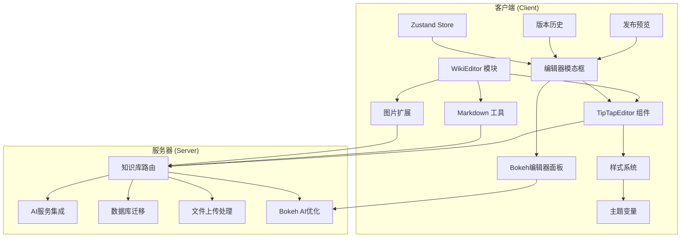
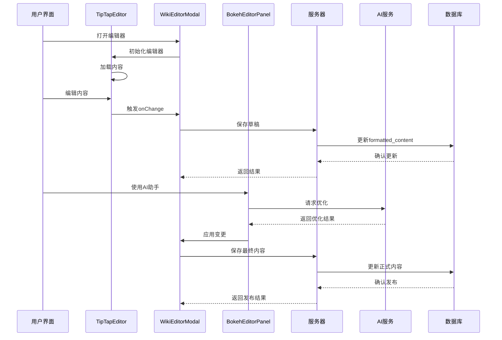
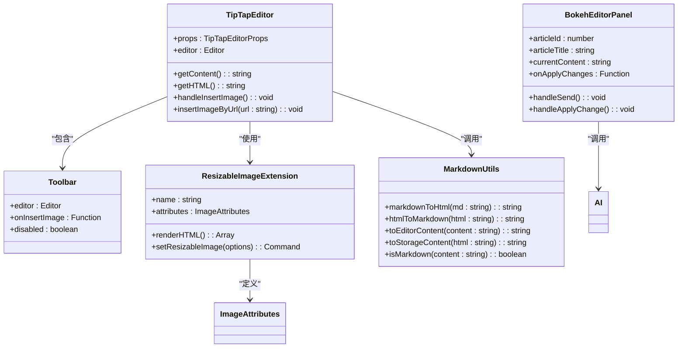
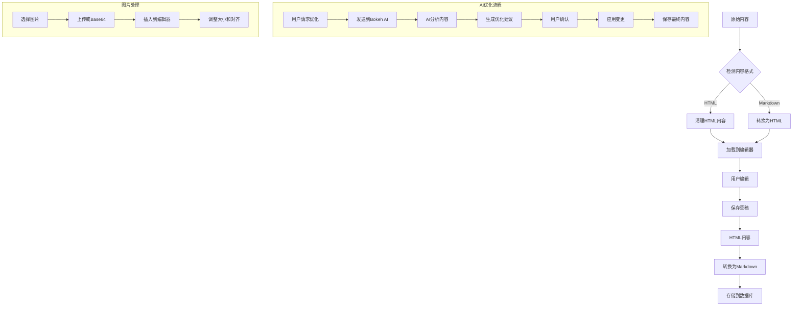
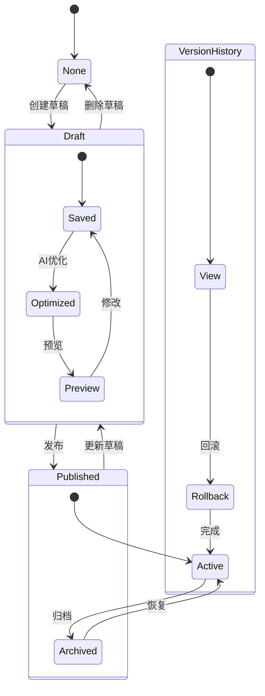
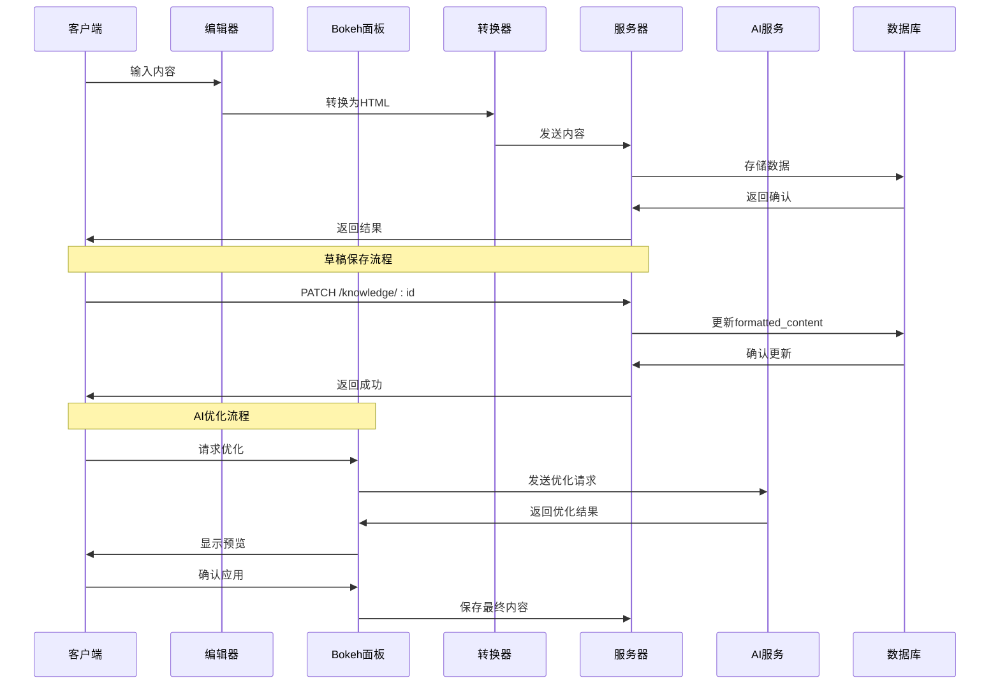

# TipTap富文本编辑器系统

<cite>
**本文档引用的文件**
- [TipTapEditor.tsx](file://client/src/components/Knowledge/WikiEditor/TipTapEditor.tsx)
- [markdownUtils.ts](file://client/src/components/Knowledge/WikiEditor/markdownUtils.ts)
- [ResizableImageExtension.tsx](file://client/src/components/Knowledge/WikiEditor/ResizableImageExtension.tsx)
- [WikiEditorModal.tsx](file://client/src/components/Knowledge/WikiEditorModal.tsx)
- [PublishPreviewModal.tsx](file://client/src/components/Knowledge/PublishPreviewModal.tsx)
- [VersionHistory.tsx](file://client/src/components/Knowledge/VersionHistory.tsx)
- [BokehEditorPanel.tsx](file://client/src/components/Bokeh/BokehEditorPanel.tsx)
- [useWikiStore.ts](file://client/src/store/useWikiStore.ts)
- [knowledge.js](file://server/service/routes/knowledge.js)
- [add_wiki_formatting.sql](file://server/migrations/add_wiki_formatting.sql)
- [package.json](file://client/package.json)
- [index.css](file://client/src/index.css)
</cite>

## 更新摘要
**变更内容**
- 更新TipTapEditor组件分析，反映其全面的样式现代化升级
- 新增蓝色主题系统和CSS变量使用说明
- 更新工具栏按钮样式和交互状态处理
- 增强内容样式和对比度优化
- 完善浅色和深色模式下的视觉一致性

## 目录
1. [简介](#简介)
2. [项目结构](#项目结构)
3. [核心组件](#核心组件)
4. [架构概览](#架构概览)
5. [详细组件分析](#详细组件分析)
6. [样式现代化升级](#样式现代化升级)
7. [依赖关系分析](#依赖关系分析)
8. [性能考虑](#性能考虑)
9. [故障排除指南](#故障排除指南)
10. [结论](#结论)

## 简介

TipTap富文本编辑器系统是一个基于React和TipTap的现代化知识库编辑解决方案。该系统提供了完整的富文本编辑功能，包括Markdown快捷键支持、图片处理、表格编辑、AI辅助优化等功能。系统采用前后端分离架构，前端使用React构建用户界面，后端使用Node.js和SQLite提供知识库管理服务。

该编辑器系统特别针对Kinefinity公司的知识库需求进行了深度定制，支持文章格式化、草稿管理、版本控制、AI优化等功能，为用户提供了一个专业而易用的编辑体验。**最新更新**强调了TipTapEditor组件在样式现代化方面的重大升级，将传统的黄色强调色替换为现代化的蓝色主题系统，并实现了完整的CSS变量支持。

## 项目结构



**图表来源**
- [TipTapEditor.tsx:1-762](file://client/src/components/Knowledge/WikiEditor/TipTapEditor.tsx#L1-L762)
- [WikiEditorModal.tsx:1-1303](file://client/src/components/Knowledge/WikiEditorModal.tsx#L1-L1303)
- [knowledge.js:1-3215](file://server/service/routes/knowledge.js#L1-L3215)

**章节来源**
- [TipTapEditor.tsx:1-762](file://client/src/components/Knowledge/WikiEditor/TipTapEditor.tsx#L1-L762)
- [WikiEditorModal.tsx:1-1303](file://client/src/components/Knowledge/WikiEditorModal.tsx#L1-L1303)
- [knowledge.js:1-3215](file://server/service/routes/knowledge.js#L1-L3215)

## 核心组件

### TipTapEditor 主编辑器组件

TipTapEditor是整个编辑器系统的核心组件，基于TipTap框架构建，提供了丰富的文本编辑功能：

- **基础编辑功能**：支持标题、粗体、斜体、删除线、高亮等基础格式化
- **高级编辑功能**：支持表格、列表、引用块、代码块等复杂内容结构
- **图片处理**：内置可调整大小的图片扩展，支持多种对齐方式
- **Markdown支持**：提供双向转换功能，支持Markdown快捷键
- **工具栏界面**：现代化的图形化工具栏，支持键盘快捷键

**更新** TipTapEditor组件现在专注于内容消毒和导出质量，确保输出内容的安全性和一致性。组件采用了全新的蓝色主题系统，使用CSS变量实现主题切换和样式一致性。

### Markdown 工具集

系统提供了完整的Markdown与HTML双向转换工具：

- **智能转换**：自动检测内容格式并进行相应转换
- **安全处理**：防止XSS攻击，清理危险HTML标签
- **格式保持**：在转换过程中保持内容结构和样式

**更新** markdownUtils模块现在特别强化了内容消毒功能，确保转换过程中的安全性。

### 可调整图片扩展

专门开发的图片处理扩展，提供了以下功能：

- **拖拽调整大小**：支持实时拖拽调整图片尺寸
- **多布局支持**：支持全宽、半宽、三分之一等布局
- **对齐控制**：支持左对齐、居中、右对齐
- **响应式设计**：适配不同屏幕尺寸

### Bokeh AI编辑器面板

**新增功能** - 集成的AI助手面板，提供：

- **智能内容优化**：根据用户指令优化文章内容
- **快速操作建议**：提供排版优化、格式检查等预设操作
- **聊天交互**：支持自然语言对话式的编辑指导
- **变更预览**：提供AI优化内容的预览和确认机制

**章节来源**
- [TipTapEditor.tsx:235-758](file://client/src/components/Knowledge/WikiEditor/TipTapEditor.tsx#L235-L758)
- [markdownUtils.ts:1-292](file://client/src/components/Knowledge/WikiEditor/markdownUtils.ts#L1-L292)
- [ResizableImageExtension.tsx:1-412](file://client/src/components/Knowledge/WikiEditor/ResizableImageExtension.tsx#L1-L412)
- [BokehEditorPanel.tsx:1-550](file://client/src/components/Bokeh/BokehEditorPanel.tsx#L1-L550)

## 架构概览



**图表来源**
- [WikiEditorModal.tsx:106-158](file://client/src/components/Knowledge/WikiEditorModal.tsx#L106-L158)
- [BokehEditorPanel.tsx:60-182](file://client/src/components/Bokeh/BokehEditorPanel.tsx#L60-L182)
- [knowledge.js:2369-2587](file://server/service/routes/knowledge.js#L2369-L2587)

系统采用分层架构设计：

1. **表现层**：React组件负责用户交互和界面展示
2. **业务逻辑层**：处理编辑器逻辑、内容管理和版本控制
3. **AI服务层**：提供内容优化和聊天功能
4. **数据访问层**：管理数据库连接和数据持久化

**章节来源**
- [WikiEditorModal.tsx:1-1303](file://client/src/components/Knowledge/WikiEditorModal.tsx#L1-L1303)
- [BokehEditorPanel.tsx:1-550](file://client/src/components/Bokeh/BokehEditorPanel.tsx#L1-L550)
- [knowledge.js:2369-2587](file://server/service/routes/knowledge.js#L2369-L2587)

## 详细组件分析

### 编辑器组件架构



**图表来源**
- [TipTapEditor.tsx:25-761](file://client/src/components/Knowledge/WikiEditor/TipTapEditor.tsx#L25-L761)
- [ResizableImageExtension.tsx:273-412](file://client/src/components/Knowledge/WikiEditor/ResizableImageExtension.tsx#L273-L412)
- [markdownUtils.ts:14-292](file://client/src/components/Knowledge/WikiEditor/markdownUtils.ts#L14-L292)
- [BokehEditorPanel.tsx:38-220](file://client/src/components/Bokeh/BokehEditorPanel.tsx#L38-L220)

### 内容转换流程



**图表来源**
- [TipTapEditor.tsx:350-390](file://client/src/components/Knowledge/WikiEditor/TipTapEditor.tsx#L350-L390)
- [markdownUtils.ts:239-291](file://client/src/components/Knowledge/WikiEditor/markdownUtils.ts#L239-L291)
- [BokehEditorPanel.tsx:104-142](file://client/src/components/Bokeh/BokehEditorPanel.tsx#L104-L142)

### 版本管理系统



**图表来源**
- [knowledge.js:2570-2587](file://server/service/routes/knowledge.js#L2570-L2587)
- [VersionHistory.tsx:94-147](file://client/src/components/Knowledge/VersionHistory.tsx#L94-L147)

**章节来源**
- [TipTapEditor.tsx:34-761](file://client/src/components/Knowledge/WikiEditor/TipTapEditor.tsx#L34-L761)
- [ResizableImageExtension.tsx:1-412](file://client/src/components/Knowledge/WikiEditor/ResizableImageExtension.tsx#L1-L412)
- [markdownUtils.ts:1-292](file://client/src/components/Knowledge/WikiEditor/markdownUtils.ts#L1-L292)
- [BokehEditorPanel.tsx:1-550](file://client/src/components/Bokeh/BokehEditorPanel.tsx#L1-L550)

## 样式现代化升级

### 蓝色主题系统

**更新** TipTapEditor组件经历了全面的样式现代化升级，主要体现在以下方面：

#### CSS变量系统
- **统一颜色管理**：使用`var(--accent-blue)`替代硬编码的黄色(#FFD700)
- **主题一致性**：确保在浅色和深色模式下的一致视觉体验
- **动态主题切换**：支持运行时的主题模式切换

#### 工具栏按钮现代化
- **状态样式**：使用`rgba(59, 130, 246, 0.15)`作为非活动状态背景
- **悬停效果**：使用`rgba(59, 130, 246, 0.25)`作为悬停状态背景
- **边框设计**：活动状态使用`1px solid rgba(59, 130, 246, 0.4)`
- **文字颜色**：活动状态使用`#3B82F6`，非活动状态使用`var(--text-secondary)`

#### 内容样式优化
- **文本对比度**：使用`var(--text-main)`和`var(--text-secondary)`确保对比度
- **引用块强调**：使用`var(--accent-blue)`作为引用块的左侧边框
- **代码高亮**：使用`rgba(59, 130, 246, 0.1)`作为代码背景，`var(--accent-blue)`作为文字颜色
- **表格设计**：使用`var(--glass-bg-hover)`和`var(--glass-bg-light)`实现层次感

#### 深色模式适配
- **背景透明度**：使用`rgba(0,0,0,0.2)`作为工具栏背景
- **边框颜色**：使用`var(--glass-border)`实现半透明边框
- **阴影效果**：使用`var(--glass-shadow)`和`var(--glass-shadow-lg)`实现层次感

#### 浅色模式适配
- **对比度优化**：在浅色模式下使用更深的蓝色变体(#E6BD00)
- **文本可读性**：使用`#1C1C1E`作为主文本颜色
- **高亮效果**：使用`rgba(37, 99, 235, 0.1)`作为高亮背景

**章节来源**
- [TipTapEditor.tsx:48-84](file://client/src/components/Knowledge/WikiEditor/TipTapEditor.tsx#L48-L84)
- [TipTapEditor.tsx:282-292](file://client/src/components/Knowledge/WikiEditor/TipTapEditor.tsx#L282-L292)
- [TipTapEditor.tsx:600-751](file://client/src/components/Knowledge/WikiEditor/TipTapEditor.tsx#L600-L751)
- [index.css:11-25](file://client/src/index.css#L11-L25)
- [index.css:112-126](file://client/src/index.css#L112-L126)

## 依赖关系分析

### 前端依赖架构

```mermaid
graph TB
subgraph "核心依赖"
A[@tiptap/react]
B[@tiptap/starter-kit]
C[turndown]
D[lucide-react]
E[framer-motion]
F[zustand]
G[axios]
end
subgraph "AI集成"
H[Bokeh AI服务]
I[Chat接口]
J[优化API]
end
subgraph "工具库"
K[react-markdown]
L[remark-gfm]
M[rehype-raw]
end
A --> B
A --> C
A --> D
E --> F
G --> H
H --> I
H --> J
K --> L
K --> M
```

**图表来源**
- [package.json:12-46](file://client/package.json#L12-L46)
- [BokehEditorPanel.tsx:10-16](file://client/src/components/Bokeh/BokehEditorPanel.tsx#L10-L16)

### 数据流处理



**图表来源**
- [TipTapEditor.tsx:106-158](file://client/src/components/Knowledge/WikiEditor/TipTapEditor.tsx#L106-L158)
- [WikiEditorModal.tsx:138-151](file://client/src/components/Knowledge/WikiEditorModal.tsx#L138-L151)
- [BokehEditorPanel.tsx:104-142](file://client/src/components/Bokeh/BokehEditorPanel.tsx#L104-L142)

**章节来源**
- [package.json:1-62](file://client/package.json#L1-L62)
- [TipTapEditor.tsx:106-158](file://client/src/components/Knowledge/WikiEditor/TipTapEditor.tsx#L106-L158)
- [BokehEditorPanel.tsx:1-550](file://client/src/components/Bokeh/BokehEditorPanel.tsx#L1-L550)

## 性能考虑

### 编辑器性能优化

1. **懒加载策略**：编辑器组件按需加载，减少初始包体积
2. **内容缓存**：使用Zustand状态管理，避免不必要的重渲染
3. **图片优化**：支持Base64编码和远程图片上传两种模式
4. **内存管理**：及时清理DOM引用，防止内存泄漏
5. **AI请求节流**：对频繁的AI优化请求进行防抖处理

### 数据传输优化

1. **增量更新**：只传输变更的内容，而非完整文档
2. **压缩处理**：对大文档进行压缩后再传输
3. **防抖机制**：对频繁的编辑操作进行防抖处理
4. **批处理**：支持批量操作，减少网络请求次数
5. **AI响应缓存**：缓存AI优化结果，避免重复计算

### 存储优化

1. **索引优化**：为常用查询字段建立数据库索引
2. **分页加载**：大量数据采用分页方式加载
3. **缓存策略**：合理使用浏览器缓存和服务器缓存
4. **清理机制**：定期清理无用的草稿和临时文件
5. **版本历史压缩**：对历史版本进行压缩存储

## 故障排除指南

### 常见问题及解决方案

#### 编辑器初始化失败
- **症状**：编辑器无法正常加载
- **原因**：依赖库加载失败或配置错误
- **解决**：检查网络连接，重新安装依赖包

#### 内容转换异常
- **症状**：Markdown与HTML转换出现错误
- **原因**：内容格式不符合预期或包含恶意代码
- **解决**：使用内置的安全清理功能，检查输入内容

#### 图片上传失败
- **症状**：图片无法上传或显示
- **原因**：文件格式不支持或网络问题
- **解决**：检查文件格式，确认网络连接稳定

#### 版本冲突
- **症状**：多个用户同时编辑同一文档
- **原因**：并发编辑导致的数据冲突
- **解决**：使用版本控制系统，提供冲突检测机制

#### AI优化失败
- **症状**：Bokeh AI助手无法正常工作
- **原因**：AI服务不可用或请求超时
- **解决**：检查AI服务状态，重试请求或使用本地优化

### 调试工具

系统提供了完善的调试功能：

1. **控制台日志**：详细的编辑器状态日志
2. **错误捕获**：全局错误处理和报告机制
3. **性能监控**：编辑器性能指标监控
4. **状态检查**：实时查看编辑器状态
5. **AI请求追踪**：跟踪AI优化请求和响应

**章节来源**
- [TipTapEditor.tsx:329-337](file://client/src/components/Knowledge/WikiEditor/TipTapEditor.tsx#L329-L337)
- [VersionHistory.tsx:88-92](file://client/src/components/Knowledge/VersionHistory.tsx#L88-L92)
- [BokehEditorPanel.tsx:169-182](file://client/src/components/Bokeh/BokehEditorPanel.tsx#L169-L182)

## 结论

TipTap富文本编辑器系统是一个功能完整、架构清晰的现代化编辑解决方案。系统通过模块化设计实现了高度的可维护性和扩展性，同时提供了丰富的编辑功能和良好的用户体验。

### 主要优势

1. **功能丰富**：支持完整的富文本编辑功能
2. **易于使用**：直观的界面设计和操作流程
3. **性能优秀**：经过优化的代码结构和数据处理
4. **扩展性强**：模块化架构便于功能扩展
5. **安全性高**：完善的输入验证和安全防护
6. **智能化**：深度集成AI助手，提供智能内容优化
7. **协作友好**：支持版本管理和多人协作编辑
8. **样式现代化**：采用蓝色主题系统，支持CSS变量和主题切换

### 技术特色

1. **AI集成**：深度集成Bokeh AI服务，提供智能内容优化和聊天功能
2. **版本管理**：完善的版本控制系统，支持回滚和比较
3. **协作支持**：多用户协作编辑和权限管理
4. **响应式设计**：适配各种设备和屏幕尺寸
5. **国际化支持**：完整的多语言支持
6. **内容格式化**：支持AI辅助的文章格式化和草稿管理
7. **图片处理**：强大的图片编辑和布局功能
8. **主题系统**：现代化的蓝色主题，支持CSS变量和深浅色模式

**更新重点** TipTapEditor组件现在专注于内容消毒和导出质量，确保输出内容的安全性和一致性。样式现代化升级使其成为了一个真正现代化的编辑器，使用蓝色主题系统替代了传统的黄色强调色，实现了更好的视觉体验和主题一致性。

该系统为Kinefinity公司的知识库管理提供了强有力的技术支撑，能够满足复杂的文档编辑和管理需求，是现代企业知识管理的理想选择。**最新更新**的Bokeh AI助手功能进一步提升了编辑体验，使内容创作更加智能高效。