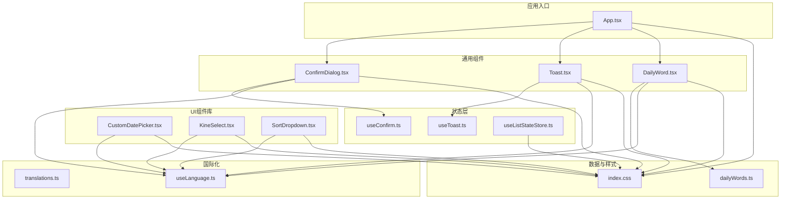
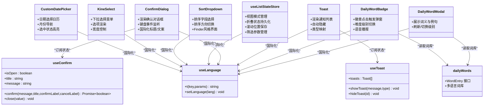
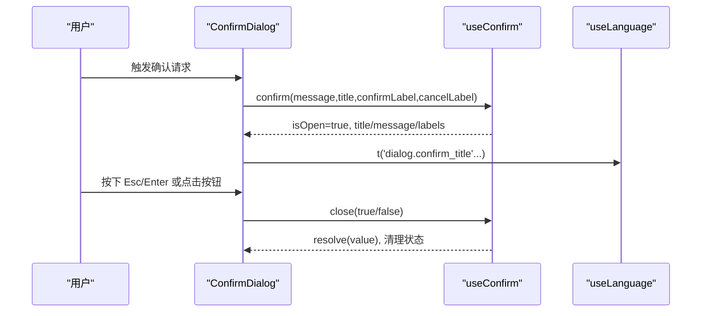
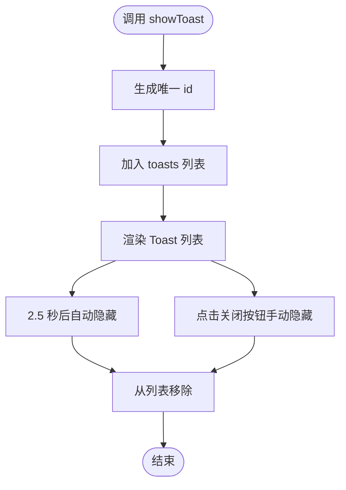
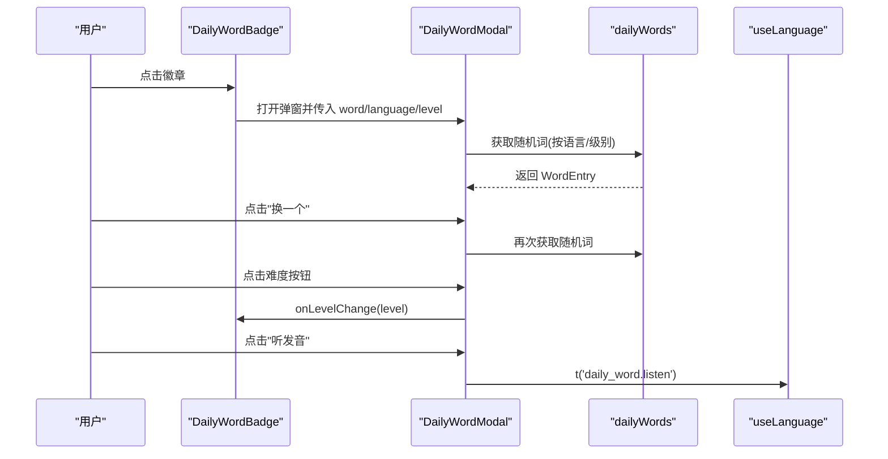
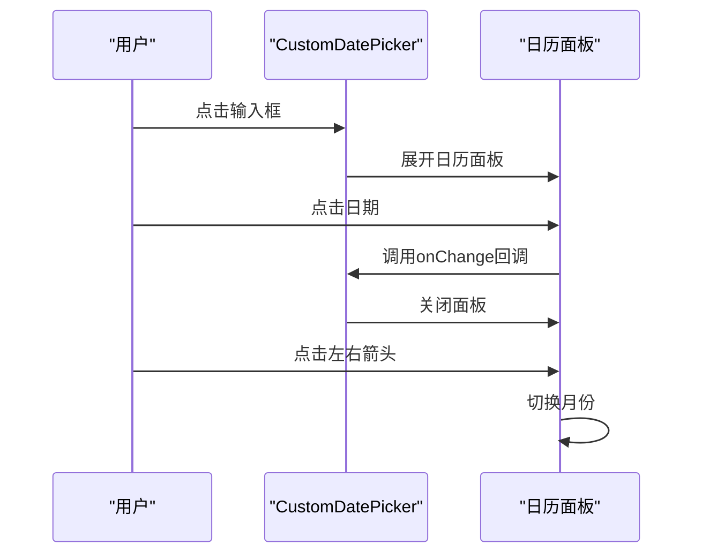
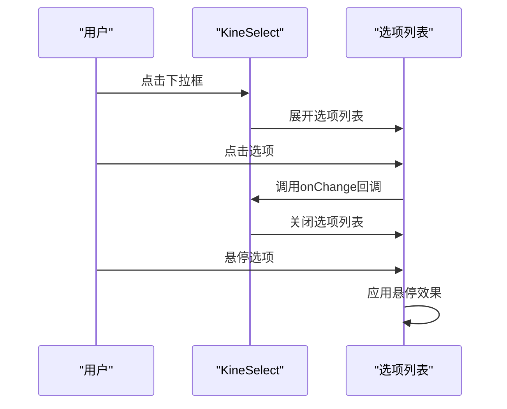
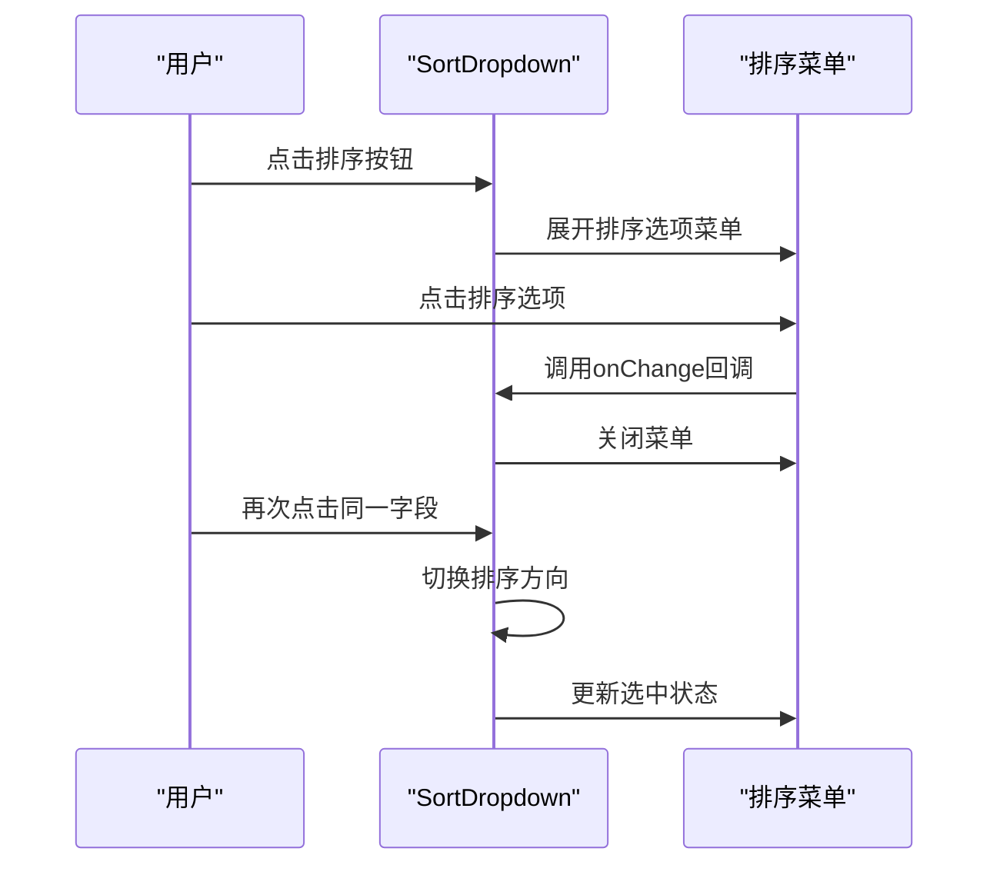
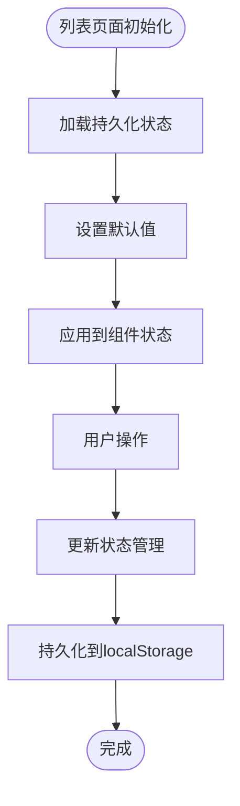
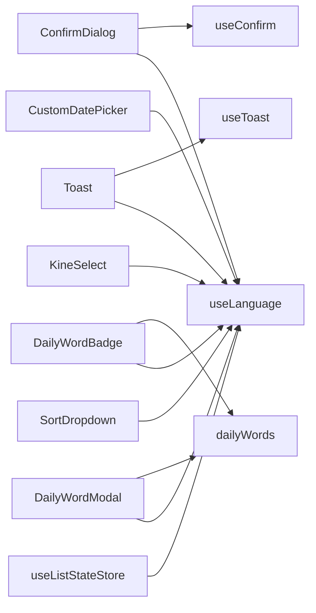

# UI 组件库

<cite>
**本文引用的文件**
- [ConfirmDialog.tsx](file://client/src/components/ConfirmDialog.tsx)
- [Toast.tsx](file://client/src/components/Toast.tsx)
- [DailyWord.tsx](file://client/src/components/DailyWord.tsx)
- [CustomDatePicker.tsx](file://client/src/components/UI/CustomDatePicker.tsx)
- [KineSelect.tsx](file://client/src/components/UI/KineSelect.tsx)
- [SortDropdown.tsx](file://client/src/components/UI/SortDropdown.tsx)
- [useConfirm.ts](file://client/src/store/useConfirm.ts)
- [useToast.ts](file://client/src/store/useToast.ts)
- [useListStateStore.ts](file://client/src/store/useListStateStore.ts)
- [dailyWords.ts](file://client/src/data/dailyWords.ts)
- [translations.ts](file://client/src/i18n/translations.ts)
- [useLanguage.ts](file://client/src/i18n/useLanguage.ts)
- [App.tsx](file://client/src/App.tsx)
- [index.css](file://client/src/index.css)
- [package.json](file://client/package.json)
</cite>

## 更新摘要
**变更内容**
- 新增排序下拉筛选组件（SortDropdown），提供 Finder 风格的排序控制界面
- 新增集中状态管理（useListStateStore），统一管理列表组件的视图偏好和筛选状态
- 增强列表组件的一致性和可维护性，支持视图模式、折叠状态、滚动位置和筛选参数的持久化
- 扩展UI组件库架构图和使用场景，提升复杂业务场景下的用户体验

## 目录
1. [引言](#引言)
2. [项目结构](#项目结构)
3. [核心组件](#核心组件)
4. [架构总览](#架构总览)
5. [组件详解](#组件详解)
6. [依赖关系分析](#依赖关系分析)
7. [性能与体验](#性能与体验)
8. [故障排查指南](#故障排查指南)
9. [结论](#结论)
10. [附录](#附录)

## 引言
本文件面向 Longhorn 前端 UI 组件库，聚焦于 ConfirmDialog、Toast、DailyWord、CustomDatePicker、KineSelect 和新增的 SortDropdown 等通用组件的设计与实现，系统阐述其接口、事件、样式定制、主题适配、响应式与无障碍支持，并给出组合使用、嵌套布局与交互行为示例，以及扩展与品牌定制建议。文档同时提供可视化架构与流程图，帮助开发者快速理解与落地。

**更新** 新增 SortDropdown 排序组件和 useListStateStore 状态管理，显著提升列表组件的一致性和可维护性。

## 项目结构
Longhorn 客户端采用 React + Zustand 架构，组件位于 client/src/components，状态通过轻量状态库管理，主题与样式集中在全局 CSS 变量中，国际化通过独立模块提供。新增的UI组件库位于 client/src/components/UI 目录下，包含自定义日期选择器、可重用选择组件和排序下拉组件，状态管理通过 useListStateStore 实现。

**图表来源**
- [App.tsx](file://client/src/App.tsx#L122-L125)
- [ConfirmDialog.tsx](file://client/src/components/ConfirmDialog.tsx#L1-L126)
- [Toast.tsx](file://client/src/components/Toast.tsx#L1-L45)
- [DailyWord.tsx](file://client/src/components/DailyWord.tsx#L1-L424)
- [CustomDatePicker.tsx](file://client/src/components/UI/CustomDatePicker.tsx#L1-L109)
- [KineSelect.tsx](file://client/src/components/UI/KineSelect.tsx#L1-L103)
- [SortDropdown.tsx](file://client/src/components/UI/SortDropdown.tsx#L1-L129)
- [useConfirm.ts](file://client/src/store/useConfirm.ts#L1-L37)
- [useToast.ts](file://client/src/store/useToast.ts#L1-L41)
- [useListStateStore.ts](file://client/src/store/useListStateStore.ts#L1-L156)
- [dailyWords.ts](file://client/src/data/dailyWords.ts#L1-L1133)
- [translations.ts](file://client/src/i18n/translations.ts#L1-L2483)
- [useLanguage.ts](file://client/src/i18n/useLanguage.ts#L1-L59)
- [index.css](file://client/src/index.css#L1-L1301)

**章节来源**
- [App.tsx](file://client/src/App.tsx#L122-L125)
- [index.css](file://client/src/index.css#L1-L1301)

## 核心组件
- ConfirmDialog：全局确认对话框，基于键盘与点击事件驱动，支持国际化标题与文案。
- Toast：全局通知提示，支持多种类型与自动隐藏。
- DailyWord：每日一词徽章与弹窗，支持多语言、多级别、语音播报与本地缓存。
- CustomDatePicker：自定义日期选择器，提供直观的日历界面和灵活的日期选择功能。
- KineSelect：可重用选择组件，支持自定义选项渲染和灵活的宽度控制。
- SortDropdown：Finder 风格排序下拉组件，提供直观的排序字段和方向选择。
- useListStateStore：集中状态管理，统一管理列表组件的视图偏好、折叠状态、滚动位置和筛选参数。

**章节来源**
- [ConfirmDialog.tsx](file://client/src/components/ConfirmDialog.tsx#L6-L126)
- [Toast.tsx](file://client/src/components/Toast.tsx#L20-L45)
- [DailyWord.tsx](file://client/src/components/DailyWord.tsx#L7-L424)
- [CustomDatePicker.tsx](file://client/src/components/UI/CustomDatePicker.tsx#L5-L109)
- [KineSelect.tsx](file://client/src/components/UI/KineSelect.tsx#L4-L103)
- [SortDropdown.tsx](file://client/src/components/UI/SortDropdown.tsx#L9-L15)
- [useListStateStore.ts](file://client/src/store/useListStateStore.ts#L11-L64)

## 架构总览
组件与状态、国际化、样式的关系如下：

**图表来源**
- [ConfirmDialog.tsx](file://client/src/components/ConfirmDialog.tsx#L6-L126)
- [useConfirm.ts](file://client/src/store/useConfirm.ts#L3-L36)
- [Toast.tsx](file://client/src/components/Toast.tsx#L20-L45)
- [useToast.ts](file://client/src/store/useToast.ts#L11-L40)
- [DailyWord.tsx](file://client/src/components/DailyWord.tsx#L7-L424)
- [CustomDatePicker.tsx](file://client/src/components/UI/CustomDatePicker.tsx#L11-L109)
- [KineSelect.tsx](file://client/src/components/UI/KineSelect.tsx#L17-L103)
- [SortDropdown.tsx](file://client/src/components/UI/SortDropdown.tsx#L17-L128)
- [useListStateStore.ts](file://client/src/store/useListStateStore.ts#L66-L155)
- [dailyWords.ts](file://client/src/data/dailyWords.ts#L1-L1133)
- [useLanguage.ts](file://client/src/i18n/useLanguage.ts#L30-L58)

## 组件详解

### ConfirmDialog 组件
- 功能特性
  - 全局模态确认框，支持 ESC 关闭、Enter 确认。
  - 国际化标题与按钮文案，支持自定义标签。
  - 使用 CSS 变量实现主题适配。
- Props 与行为
  - 无显式 props；通过全局状态 useConfirm 控制显示与内容。
  - 支持关闭回调，返回布尔值表示用户选择。
- 事件与交互
  - 键盘事件：Esc 关闭，Enter 确认。
  - 点击遮罩关闭，点击内容阻止冒泡。
- 样式与主题
  - 使用 CSS 变量：背景、边框、文字、强调色等。
  - 背景模糊与动画增强视觉层次。
- 无障碍与响应式
  - 遮罩层可点击关闭，便于键盘用户操作。
  - 在小屏设备上仍保持可点击区域与对比度。
- 使用示例
  - 在业务逻辑中调用 useConfirm.confirm(...)，等待 Promise 返回结果。
  - 可传入自定义标题、消息与按钮文案，未传入时回退至国际化键值。

**章节来源**
- [ConfirmDialog.tsx](file://client/src/components/ConfirmDialog.tsx#L6-L126)
- [useConfirm.ts](file://client/src/store/useConfirm.ts#L14-L36)
- [useLanguage.ts](file://client/src/i18n/useLanguage.ts#L44-L55)
- [index.css](file://client/src/index.css#L1-L1301)

#### 对话框交互序列

**图表来源**
- [ConfirmDialog.tsx](file://client/src/components/ConfirmDialog.tsx#L10-L35)
- [useConfirm.ts](file://client/src/store/useConfirm.ts#L19-L35)
- [useLanguage.ts](file://client/src/i18n/useLanguage.ts#L44-L55)

### Toast 组件
- 功能特性
  - 全局通知容器，支持 success/error/info/warning 类型。
  - 自动定时隐藏，支持手动关闭。
  - 图标与边框颜色按类型映射。
- Props 与行为
  - 无显式 props；通过全局状态 useToast 控制显示队列。
- 事件与交互
  - 点击"×"关闭对应 Toast。
  - 自动 2.5 秒后隐藏。
- 样式与主题
  - 类型到边框色与图标色的映射，统一视觉节奏。
  - 使用 CSS 变量保证与主题一致。
- 无障碍与响应式
  - 通知列表可滚动，避免遮挡主内容。
  - 在小屏设备上保持紧凑布局与可读性。
- 使用示例
  - 调用 useToast.showToast(message, type) 即可显示。
  - 可通过 hideToast(id) 主动关闭。

**章节来源**
- [Toast.tsx](file://client/src/components/Toast.tsx#L20-L45)
- [useToast.ts](file://client/src/store/useToast.ts#L17-L40)
- [index.css](file://client/src/index.css#L1-L1301)

#### 通知显示流程

**图表来源**
- [useToast.ts](file://client/src/store/useToast.ts#L20-L32)

### DailyWord 组件
- 功能特性
  - 顶部徽章：点击打开每日一词弹窗，支持难度级别切换与刷新。
  - 弹窗：展示单词、音标、词性、释义、例句与中文翻译，支持语音播报。
  - 多语言词库：支持中/英/德/日，不同语言的难度级别不同。
  - 本地持久化：难度级别与当前语言绑定存储。
- Props 与行为
  - DailyWordBadge：无显式 props，内部管理状态与弹窗。
  - DailyWordModal：接收 word、language、currentLevel、onClose/onRefresh/onLevelChange。
- 事件与交互
  - 点击徽章打开弹窗；点击"换一个"刷新；点击难度按钮切换级别；点击"听发音"进行语音播报。
- 样式与主题
  - 使用 CSS 变量实现玻璃质感与主题色统一。
  - 弹窗最大高度与滚动适配移动端。
- 无障碍与响应式
  - 语音播报使用 Web Speech API，降级处理。
  - 弹窗内容分块清晰，例句与翻译对比阅读友好。
- 使用示例
  - 在顶部栏直接引入 DailyWordBadge。
  - 通过 onLevelChange 与 onRefresh 回调与外部状态联动。

**章节来源**
- [DailyWord.tsx](file://client/src/components/DailyWord.tsx#L7-L424)
- [dailyWords.ts](file://client/src/data/dailyWords.ts#L1-L1133)
- [useLanguage.ts](file://client/src/i18n/useLanguage.ts#L44-L55)
- [index.css](file://client/src/index.css#L1-L1301)

#### 每日一词弹窗交互

**图表来源**
- [DailyWord.tsx](file://client/src/components/DailyWord.tsx#L106-L421)
- [dailyWords.ts](file://client/src/data/dailyWords.ts#L1-L1133)
- [useLanguage.ts](file://client/src/i18n/useLanguage.ts#L44-L55)

### CustomDatePicker 组件
- 功能特性
  - 自定义日期选择器，提供直观的日历界面。
  - 支持月份导航和日期选择。
  - 选中日期高亮显示，当前月与非当前月区分显示。
  - 支持键盘交互和点击关闭。
- Props 与行为
  - value: string - 当前选中的日期字符串（YYYY-MM-DD格式）
  - onChange: (val: string) => void - 日期变化回调
  - label: string - 标签文本
- 事件与交互
  - 点击输入框展开日历面板。
  - 点击日期选择具体日期。
  - 使用左右箭头按钮切换月份。
  - 点击遮罩或选择日期后关闭面板。
- 样式与主题
  - 使用深色主题设计，符合整体UI风格。
  - 选中状态使用金色高亮，当前月使用白色，非当前月使用浅灰色。
  - 支持悬停效果和过渡动画。
- 无障碍与响应式
  - 支持键盘操作（Tab切换、Enter选择）。
  - 在小屏设备上适配固定宽度。
- 使用示例
  - 在表单中作为日期输入控件使用。
  - 支持自定义标签和回调处理。

**章节来源**
- [CustomDatePicker.tsx](file://client/src/components/UI/CustomDatePicker.tsx#L5-L109)

#### 自定义日期选择器交互

**图表来源**
- [CustomDatePicker.tsx](file://client/src/components/UI/CustomDatePicker.tsx#L11-L109)

### KineSelect 组件
- 功能特性
  - 可重用的选择组件，支持自定义选项渲染。
  - 下拉菜单支持滚动和悬停效果。
  - 支持占位符和自定义宽度。
  - 选中项高亮显示，支持ReactNode类型的选项标签。
- Props 与行为
  - value: string - 当前选中的值
  - options: Option[] - 选项数组，每个选项包含value和label
  - onChange: (value: string) => void - 值变化回调
  - placeholder?: string - 占位符文本
  - width?: string - 组件宽度，默认100%
- 选项结构
  - Option接口：{ value: string, label: string | React.ReactNode }
- 事件与交互
  - 点击下拉框展开选项列表。
  - 点击选项触发onChange回调并关闭下拉框。
  - 支持键盘导航（上下箭头选择，Enter确认）。
  - 点击遮罩关闭下拉框。
- 样式与主题
  - 使用深色主题设计，符合整体UI风格。
  - 选中项使用金色高亮，未选中项支持悬停效果。
  - 支持旋转的下拉箭头指示状态。
- 无障碍与响应式
  - 支持键盘操作和屏幕阅读器。
  - 在小屏设备上适配默认宽度。
- 使用示例
  - 作为过滤器组件在列表页面使用。
  - 支持动态选项和自定义标签渲染。

**章节来源**
- [KineSelect.tsx](file://client/src/components/UI/KineSelect.tsx#L4-L103)

#### 可重用选择组件交互

**图表来源**
- [KineSelect.tsx](file://client/src/components/UI/KineSelect.tsx#L17-L103)

### SortDropdown 组件
- 功能特性
  - Finder 风格排序下拉组件，提供直观的排序控制界面。
  - 支持排序字段选择和排序方向切换（升序/降序）。
  - 自动切换相同字段的排序方向，新字段默认降序（最新优先）。
  - 深色主题设计，符合整体UI风格。
- Props 与行为
  - sortBy: string - 当前排序字段
  - sortOrder: 'asc' | 'desc' - 当前排序方向
  - onChange: (field: string, order: 'asc' | 'desc') => void - 排序变化回调
  - options: SortOption[] - 排序选项数组，包含field和label
  - width?: string - 组件宽度，默认40px
- 选项结构
  - SortOption接口：{ field: string, label: string }
- 事件与交互
  - 点击按钮展开排序选项菜单。
  - 点击选项触发onChange回调并关闭菜单。
  - 相同字段点击时切换排序方向（asc/desc）。
  - 新字段选择时默认设置为降序。
  - 支持点击菜单外部关闭。
- 样式与主题
  - Finder风格设计，40px正方形按钮，内置ArrowUpDown图标。
  - 选项菜单使用深色背景，选中项高亮显示。
  - 支持悬停效果和过渡动画。
- 无障碍与响应式
  - 支持键盘操作和屏幕阅读器。
  - 在小屏设备上适配固定尺寸。
- 使用示例
  - 在列表页面顶部工具栏中作为排序控制组件使用。
  - 与useListStateStore结合实现排序状态持久化。

**章节来源**
- [SortDropdown.tsx](file://client/src/components/UI/SortDropdown.tsx#L9-L129)

#### Finder风格排序组件交互

**图表来源**
- [SortDropdown.tsx](file://client/src/components/UI/SortDropdown.tsx#L26-L37)

### useListStateStore 状态管理
- 功能特性
  - 集中管理列表组件的视图偏好和筛选状态。
  - 支持三种视图模式：grouped（分组）、flat（平铺）。
  - 持久化折叠状态、滚动位置和筛选参数。
  - 自动跨页面状态恢复，提升用户体验一致性。
- 状态结构
  - ViewMode类型：'grouped' | 'flat'
  - FilterParams接口：{ time_scope, product_family, status, keyword }
- 功能分类
  - 视图模式管理：setInquiryViewMode、setRmaViewMode、setDealerViewMode
  - 折叠状态管理：setInquirySectionCollapsed、setRmaSectionCollapsed、setDealerSectionCollapsed
  - 滚动位置管理：setInquiryScrollPosition、setRmaScrollPosition、setDealerScrollPosition
  - 筛选参数管理：setInquiryFilters、setRmaFilters、setDealerFilters
- 事件与交互
  - 自动持久化到localStorage，键名为'ticket-list-state-storage'。
  - 支持getter方法根据默认状态返回最终折叠状态。
  - 提供完整的CRUD操作接口。
- 使用示例
  - 在列表页面中导入并使用状态管理hook。
  - 与SortDropdown、KineSelect等组件配合实现完整筛选功能。

**章节来源**
- [useListStateStore.ts](file://client/src/store/useListStateStore.ts#L11-L156)

#### 集中状态管理架构

**图表来源**
- [useListStateStore.ts](file://client/src/store/useListStateStore.ts#L66-L155)

## 依赖关系分析
- 组件依赖
  - ConfirmDialog 依赖 useConfirm 与 useLanguage。
  - Toast 依赖 useToast 与 useLanguage。
  - DailyWord 依赖 dailyWords 与 useLanguage。
  - CustomDatePicker 依赖 useLanguage 和日期处理库。
  - KineSelect 依赖 useLanguage 和图标库。
  - SortDropdown 依赖 useLanguage 和图标库。
  - useListStateStore 依赖 zustand 和持久化中间件。
- 状态依赖
  - useConfirm/useToast 通过 Zustand 管理全局状态，避免跨层级传递。
  - useListStateStore 管理列表组件的复杂状态，提供持久化能力。
- 外部依赖
  - lucide-react 提供图标。
  - react-router-dom 提供路由能力。
  - axios 用于侧边栏部门数据获取（与组件库无直接耦合）。
  - date-fns 用于日期计算和格式化。
  - zustand 用于状态管理，persist 中间件提供持久化。

**图表来源**
- [ConfirmDialog.tsx](file://client/src/components/ConfirmDialog.tsx#L1-L126)
- [Toast.tsx](file://client/src/components/Toast.tsx#L1-L45)
- [DailyWord.tsx](file://client/src/components/DailyWord.tsx#L1-L424)
- [CustomDatePicker.tsx](file://client/src/components/UI/CustomDatePicker.tsx#L1-L109)
- [KineSelect.tsx](file://client/src/components/UI/KineSelect.tsx#L1-L103)
- [SortDropdown.tsx](file://client/src/components/UI/SortDropdown.tsx#L1-L129)
- [useConfirm.ts](file://client/src/store/useConfirm.ts#L1-L37)
- [useToast.ts](file://client/src/store/useToast.ts#L1-L41)
- [useListStateStore.ts](file://client/src/store/useListStateStore.ts#L1-L156)
- [dailyWords.ts](file://client/src/data/dailyWords.ts#L1-L1133)
- [useLanguage.ts](file://client/src/i18n/useLanguage.ts#L1-L59)

**章节来源**
- [package.json](file://client/package.json#L12-L28)

## 性能与体验
- 状态最小化
  - useConfirm/useToast 仅维护必要字段，避免不必要的重渲染。
  - useListStateStore 使用持久化中间件，避免频繁的localStorage操作。
- 渲染优化
  - Toast 列表按需渲染，自动隐藏减少 DOM 占用。
  - DailyWord 弹窗按需打开，避免常驻内存。
  - CustomDatePicker 和 KineSelect 使用受控组件模式，避免状态同步问题。
  - SortDropdown 使用受控展开状态，避免全局事件监听。
- 动画与过渡
  - CSS 动画与过渡提升交互反馈，注意在低性能设备上的节流。
  - CustomDatePicker 使用动画库提供平滑的展开/收起效果。
  - SortDropdown 菜单使用淡入淡出动画。
- 无障碍
  - 确认对话框支持键盘操作；Toast 提供关闭按钮；DailyWord 提供语音播报与可读性良好的排版。
  - CustomDatePicker 和 KineSelect 支持键盘导航和屏幕阅读器。
  - SortDropdown 支持键盘操作和屏幕阅读器。

## 故障排查指南
- 确认对话框不出现
  - 检查 useConfirm 的 isOpen 是否被正确置为 true。
  - 确认键盘事件监听是否生效（Esc/Enter）。
- Toast 不显示或不消失
  - 检查 useToast 的 toasts 数组是否正确加入。
  - 确认自动隐藏计时器是否被清理。
- 每日一词弹窗空白
  - 检查 dailyWords 数据是否加载成功。
  - 确认语言与难度级别映射是否正确。
- 语音播报无效
  - 检查浏览器是否支持 Web Speech API。
  - 确认语言与语音语言映射函数返回值。
- CustomDatePicker 日期选择异常
  - 检查 value 格式是否为 YYYY-MM-DD。
  - 确认 onChange 回调是否正确处理日期字符串。
  - 验证日期范围和格式化函数。
- KineSelect 选项不显示
  - 检查 options 数组是否正确格式化。
  - 确认 label 可以正确渲染（支持字符串和 ReactNode）。
  - 验证 value 是否与选项的 value 匹配。
- SortDropdown 排序异常
  - 检查 sortBy 和 sortOrder 参数是否正确传递。
  - 确认 onChange 回调是否正确处理排序变化。
  - 验证 options 数组的 field 和 label 配置。
- useListStateStore 状态丢失
  - 检查 localStorage 中的 'ticket-list-state-storage' 键是否存在。
  - 确认状态结构与默认值是否匹配。
  - 验证持久化中间件配置是否正确。

**章节来源**
- [useConfirm.ts](file://client/src/store/useConfirm.ts#L14-L36)
- [useToast.ts](file://client/src/store/useToast.ts#L17-L40)
- [DailyWord.tsx](file://client/src/components/DailyWord.tsx#L19-L51)
- [CustomDatePicker.tsx](file://client/src/components/UI/CustomDatePicker.tsx#L20-L23)
- [KineSelect.tsx](file://client/src/components/UI/KineSelect.tsx#L20-L31)
- [SortDropdown.tsx](file://client/src/components/UI/SortDropdown.tsx#L26-L37)
- [useListStateStore.ts](file://client/src/store/useListStateStore.ts#L66-L155)

## 结论
Longhorn UI 组件库以简洁的状态管理与主题变量为核心，提供了确认、通知、每日一词、自定义日期选择、可重用选择和新增的排序下拉等高频通用组件。新增的 SortDropdown 组件和 useListStateStore 状态管理显著提升了列表组件的一致性和可维护性，特别是在复杂业务场景中。组件具备良好的国际化、主题适配与响应式支持，适合在企业级前端中复用与扩展。建议在业务层通过统一的 hook 调用这些组件，确保一致性与可维护性。

**更新** 新增的 SortDropdown 和 useListStateStore 组件为 Longhorn UI 组件库带来了更强大的列表管理和状态持久化能力，进一步提升了用户体验和开发效率。

## 附录

### 组件 Props 与事件清单
- ConfirmDialog
  - Props：无
  - 事件：close(value: boolean) 回调
  - 状态：useConfirm
- Toast
  - Props：无
  - 事件：hideToast(id: string)
  - 状态：useToast
- DailyWordBadge
  - Props：无
  - 事件：无
  - 状态：本地状态 + useLanguage
- DailyWordModal
  - Props：word, language, currentLevel, onClose, onRefresh, onLevelChange
  - 事件：无
  - 状态：本地状态 + useLanguage
- CustomDatePicker
  - Props：value: string, onChange: (val: string) => void, label: string
  - 事件：无
  - 状态：本地状态 + useLanguage
- KineSelect
  - Props：value: string, options: Option[], onChange: (value: string) => void, placeholder?: string, width?: string
  - 事件：无
  - 状态：本地状态 + useLanguage
- SortDropdown
  - Props：sortBy: string, sortOrder: 'asc' | 'desc', onChange: (field: string, order: 'asc' | 'desc') => void, options: SortOption[], width?: string
  - 事件：无
  - 状态：本地状态 + useLanguage
- useListStateStore
  - Props：无
  - 事件：各种状态管理方法
  - 状态：持久化状态

**章节来源**
- [ConfirmDialog.tsx](file://client/src/components/ConfirmDialog.tsx#L6-L126)
- [Toast.tsx](file://client/src/components/Toast.tsx#L20-L45)
- [DailyWord.tsx](file://client/src/components/DailyWord.tsx#L120-L128)
- [CustomDatePicker.tsx](file://client/src/components/UI/CustomDatePicker.tsx#L5-L109)
- [KineSelect.tsx](file://client/src/components/UI/KineSelect.tsx#L9-L103)
- [SortDropdown.tsx](file://client/src/components/UI/SortDropdown.tsx#L9-L129)
- [useListStateStore.ts](file://client/src/store/useListStateStore.ts#L21-L64)

### 主题与样式定制
- CSS 变量
  - 背景、边框、文本、强调色等均通过 CSS 变量定义，便于品牌定制。
- 定制步骤
  - 在全局样式中覆盖 :root 变量，或在组件容器上覆盖局部变量。
  - 保持与现有动画与阴影变量的一致性，避免视觉割裂。
- 响应式断点
  - 采用 768px 断点区分移动端与桌面端布局，组件已内建相应样式。
- 新增组件样式
  - CustomDatePicker 使用固定宽度 320px，深色主题设计。
  - KineSelect 支持自定义宽度，使用 100% 默认值。
  - SortDropdown 使用 Finder 风格设计，40px正方形按钮。
  - useListStateStore 通过 CSS 变量实现主题适配。

**章节来源**
- [index.css](file://client/src/index.css#L3-L16)
- [index.css](file://client/src/index.css#L65-L77)
- [index.css](file://client/src/index.css#L572-L590)
- [CustomDatePicker.tsx](file://client/src/components/UI/CustomDatePicker.tsx#L60-L67)
- [KineSelect.tsx](file://client/src/components/UI/KineSelect.tsx#L34-L76)
- [SortDropdown.tsx](file://client/src/components/UI/SortDropdown.tsx#L42-L63)

### 国际化与多语言
- 文案来源
  - translations.ts 提供 zh/en/de/ja 的键值映射。
- 使用方式
  - useLanguage.t(key, params?) 返回对应语言的文案。
- 建议
  - 新增文案键时，确保在所有语言键表中补齐。
  - 对于动态参数，使用 {{key}} 或 {key} 占位符。
- 新增组件国际化
  - CustomDatePicker 支持通过 label 参数传入国际化文案。
  - KineSelect 支持选项标签的国际化渲染。
  - SortDropdown 支持选项标签的国际化渲染。
  - useListStateStore 支持国际化文案显示。

**章节来源**
- [translations.ts](file://client/src/i18n/translations.ts#L4-L745)
- [useLanguage.ts](file://client/src/i18n/useLanguage.ts#L44-L55)
- [CustomDatePicker.tsx](file://client/src/components/UI/CustomDatePicker.tsx#L27-L29)
- [KineSelect.tsx](file://client/src/components/UI/KineSelect.tsx#L31-L31)
- [SortDropdown.tsx](file://client/src/components/UI/SortDropdown.tsx#L660-L666)

### 组合使用与嵌套布局
- 在 App.tsx 中，Toast 与 ConfirmDialog 作为全局挂载组件出现在路由之外，确保任何页面均可触发。
- DailyWordBadge 位于顶部栏中心位置，作为横幅级信息组件，不影响页面主体布局。
- CustomDatePicker 和 KineSelect 在多个业务页面中得到应用：
  - InquiryTicketListPage：用于时间范围筛选和产品家族选择。
  - DealerRepairListPage：用于维修记录的时间筛选和状态选择。
- SortDropdown 在三个主要列表页面中得到应用：
  - InquiryTicketListPage：提供创建时间、更新时间、工单编号等排序选项。
  - DealerRepairListPage：提供创建时间、更新时间、工单编号等排序选项。
  - RMATicketListPage：提供相应的排序选项。
- useListStateStore 在所有列表页面中得到应用：
  - 统一管理视图模式、折叠状态、滚动位置和筛选参数。
  - 支持跨页面状态恢复，提升用户体验一致性。
- 建议在业务页面中通过 hook 调用 ConfirmDialog 与 Toast，避免在组件树中重复声明。

**章节来源**
- [App.tsx](file://client/src/App.tsx#L122-L125)
- [App.tsx](file://client/src/App.tsx#L389-L390)
- [InquiryTicketListPage.tsx](file://client/src/components/InquiryTickets/InquiryTicketListPage.tsx#L652-L667)
- [DealerRepairListPage.tsx](file://client/src/components/DealerRepairs/DealerRepairListPage.tsx#L555-L571)
- [useListStateStore.ts](file://client/src/store/useListStateStore.ts#L66-L155)

### 新组件集成指南
- SortDropdown 集成步骤
  - 导入：import { SortDropdown } from '../UI/SortDropdown'
  - 使用：在列表页面顶部工具栏中作为排序控制组件
  - 配置：提供 sortBy、sortOrder 和 onChange 回调
  - 选项：定义排序选项数组，包含 field 和 label
- useListStateStore 集成步骤
  - 导入：import { useListStateStore } from '../../store/useListStateStore'
  - 使用：在列表页面中导入并使用状态管理hook
  - 配置：调用相应的setter方法管理状态
  - 持久化：状态自动持久化到localStorage
- 最佳实践
  - 保持组件的受控模式，避免状态分散。
  - 提供清晰的错误处理和边界条件检查。
  - 支持键盘操作和无障碍访问。
  - 在国际化环境中正确处理动态文案。
  - 合理使用 SortDropdown 和 useListStateStore 提升用户体验。

**章节来源**
- [InquiryTicketListPage.tsx](file://client/src/components/InquiryTickets/InquiryTicketListPage.tsx#L652-L667)
- [DealerRepairListPage.tsx](file://client/src/components/DealerRepairs/DealerRepairListPage.tsx#L555-L571)
- [SortDropdown.tsx](file://client/src/components/UI/SortDropdown.tsx#L17-L128)
- [useListStateStore.ts](file://client/src/store/useListStateStore.ts#L66-L155)