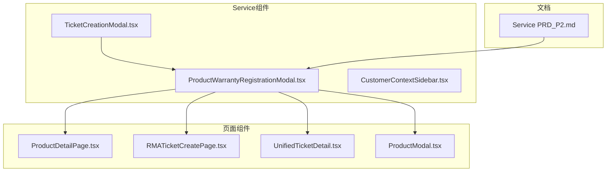
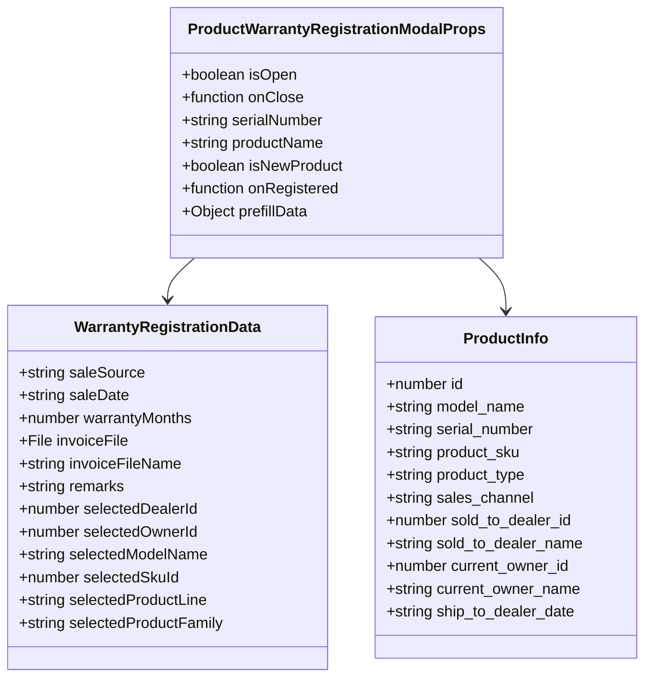
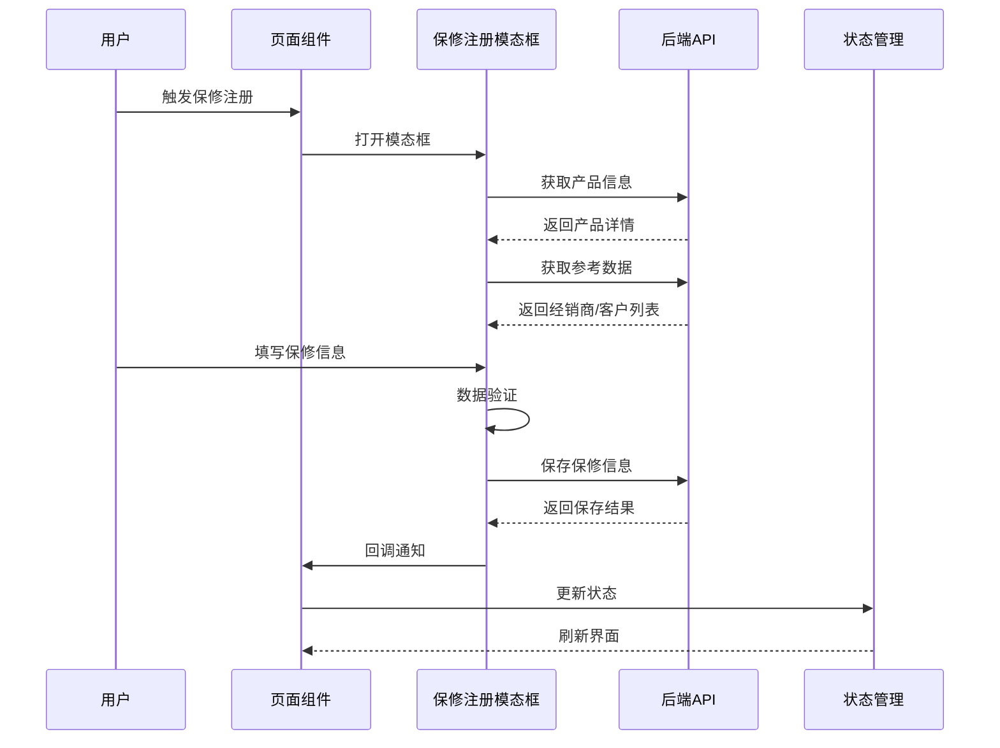
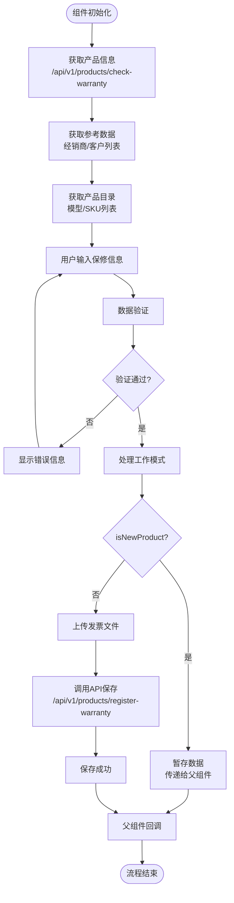
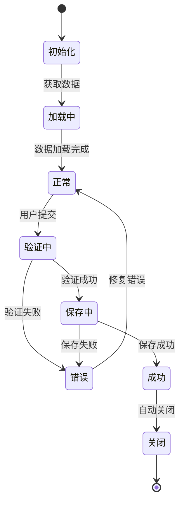
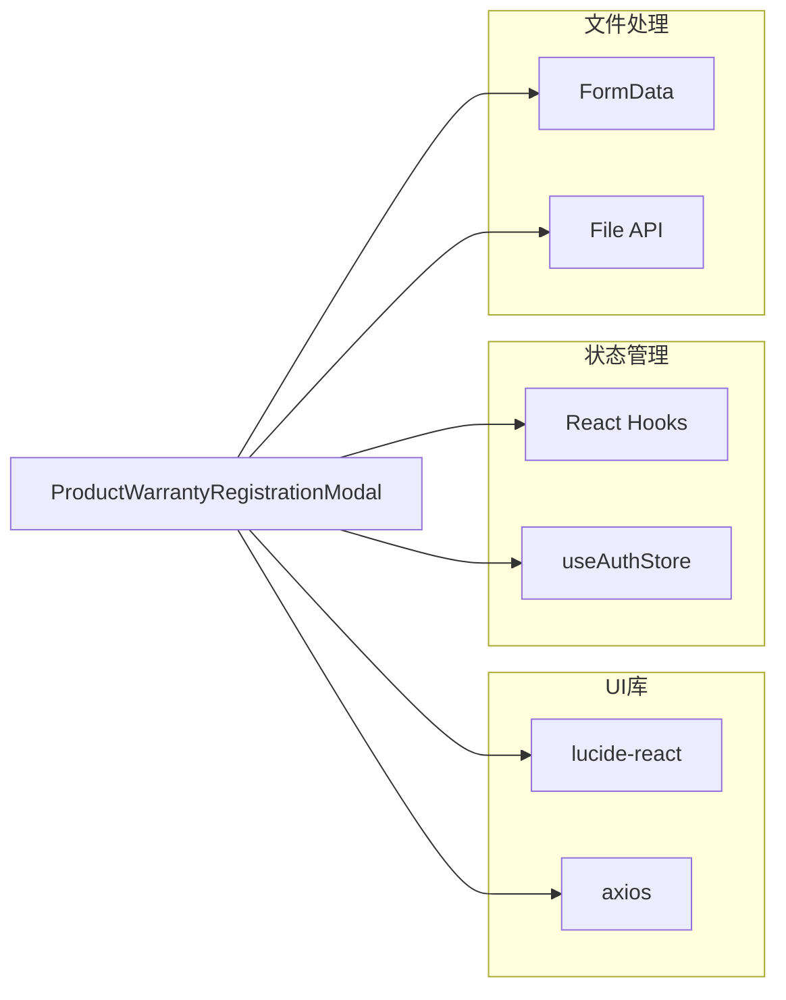
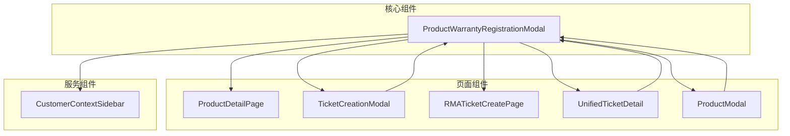

# 产品保修注册模态框组件

<cite>
**本文档引用的文件**
- [ProductWarrantyRegistrationModal.tsx](file://client/src/components/Service/ProductWarrantyRegistrationModal.tsx)
- [ProductDetailPage.tsx](file://client/src/components/ProductDetailPage.tsx)
- [TicketCreationModal.tsx](file://client/src/components/Service/TicketCreationModal.tsx)
- [RMATicketCreatePage.tsx](file://client/src/components/RMATickets/RMATicketCreatePage.tsx)
- [ProductModal.tsx](file://client/src/components/Workspace/ProductModal.tsx)
- [UnifiedTicketDetail.tsx](file://client/src/components/Workspace/UnifiedTicketDetail.tsx)
- [Service PRD_P2.md](file://docs/Service PRD_P2.md)
</cite>

## 更新摘要
**变更内容**
- 组件进行全面重构，宽度从600px扩展到900px
- 采用双列布局设计，提升信息展示效率
- 增强玻璃纤维样式，统一视觉设计语言
- 新增产品线/族群选择功能
- 新增经销商信息和所有权验证功能
- 改进表单元素一致性，优化用户体验

## 目录
1. [简介](#简介)
2. [项目结构](#项目结构)
3. [核心组件](#核心组件)
4. [架构概览](#架构概览)
5. [详细组件分析](#详细组件分析)
6. [依赖关系分析](#依赖关系分析)
7. [性能考虑](#性能考虑)
8. [故障排除指南](#故障排除指南)
9. [结论](#结论)

## 简介

产品保修注册模态框组件是一个关键的前端组件，用于处理产品的保修注册流程。该组件提供了完整的保修信息录入界面，支持发票上传、客户搜索、产品型号选择等功能，是整个服务管理系统中保修流程的核心入口。

**更新** 组件经过全面重构，采用现代化的双列布局设计，宽度从600px扩展到900px，显著提升了信息展示能力和用户体验。

该组件实现了多种工作流场景，包括：
- 仅注册保修信息（isNewProduct=false）
- 产品入库并注册保修（isNewProduct=true）
- 与多个页面的集成（产品详情页、工单创建页、统一工单详情页）

## 项目结构

该组件位于客户端代码的Service目录下，与相关的页面组件形成完整的功能模块：

**图表来源**
- [ProductWarrantyRegistrationModal.tsx:1-100](file://client/src/components/Service/ProductWarrantyRegistrationModal.tsx#L1-L100)
- [ProductDetailPage.tsx:890-912](file://client/src/components/ProductDetailPage.tsx#L890-L912)
- [TicketCreationModal.tsx:1050-1065](file://client/src/components/Service/TicketCreationModal.tsx#L1050-L1065)

**章节来源**
- [ProductWarrantyRegistrationModal.tsx:1-100](file://client/src/components/Service/ProductWarrantyRegistrationModal.tsx#L1-L100)
- [Service PRD_P2.md:390-460](file://docs/Service PRD_P2.md#L390-L460)

## 核心组件

### 组件接口定义

组件采用TypeScript接口定义，确保类型安全和良好的开发体验：

**图表来源**
- [ProductWarrantyRegistrationModal.tsx:6-37](file://client/src/components/Service/ProductWarrantyRegistrationModal.tsx#L6-L37)
- [ProductWarrantyRegistrationModal.tsx:39-78](file://client/src/components/Service/ProductWarrantyRegistrationModal.tsx#L39-L78)

### 主要功能特性

1. **多场景支持**：支持仅注册保修和产品入库两种模式
2. **发票上传**：支持JPG、PNG、PDF格式的发票文件上传
3. **智能搜索**：集成客户搜索功能，支持实时搜索和下拉选择
4. **数据验证**：完整的前端数据验证和错误处理
5. **状态管理**：使用React Hooks管理复杂的组件状态
6. **双列布局**：900px宽度的现代化布局设计
7. **产品分类**：支持产品线和族群的精确分类
8. **所有权验证**：完整的经销商和所有者信息验证

**章节来源**
- [ProductWarrantyRegistrationModal.tsx:80-100](file://client/src/components/Service/ProductWarrantyRegistrationModal.tsx#L80-L100)
- [ProductWarrantyRegistrationModal.tsx:324-443](file://client/src/components/Service/ProductWarrantyRegistrationModal.tsx#L324-L443)

## 架构概览

该组件在整个系统中的位置和作用：

**图表来源**
- [ProductWarrantyRegistrationModal.tsx:125-132](file://client/src/components/Service/ProductWarrantyRegistrationModal.tsx#L125-L132)
- [TicketCreationModal.tsx:306-328](file://client/src/components/Service/TicketCreationModal.tsx#L306-L328)

## 详细组件分析

### 数据流分析

组件的数据流设计体现了清晰的单向数据流原则：

**图表来源**
- [ProductWarrantyRegistrationModal.tsx:345-443](file://client/src/components/Service/ProductWarrantyRegistrationModal.tsx#L345-L443)

### 状态管理机制

组件使用React Hooks实现复杂的状态管理：

**图表来源**
- [ProductWarrantyRegistrationModal.tsx:90-100](file://client/src/components/Service/ProductWarrantyRegistrationModal.tsx#L90-L100)
- [ProductWarrantyRegistrationModal.tsx:324-443](file://client/src/components/Service/ProductWarrantyRegistrationModal.tsx#L324-L443)

### 集成点分析

该组件与多个页面组件形成紧密的集成关系：

| 集成组件 | 集成方式 | 功能作用 |
|---------|---------|---------|
| ProductDetailPage | 直接调用 | 产品详情页的保修注册入口 |
| TicketCreationModal | 条件触发 | RMA工单创建时的保修检查 |
| RMATicketCreatePage | 直接调用 | RMA工单创建页面的保修注册 |
| UnifiedTicketDetail | 条件触发 | 统一工单详情页的保修注册 |
| ProductModal | 数据传递 | 产品入库时的保修数据暂存 |

**章节来源**
- [ProductDetailPage.tsx:892-906](file://client/src/components/ProductDetailPage.tsx#L892-L906)
- [TicketCreationModal.tsx:1053-1064](file://client/src/components/Service/TicketCreationModal.tsx#L1053-L1064)
- [RMATicketCreatePage.tsx:357-363](file://client/src/components/RMATickets/RMATicketCreatePage.tsx#L357-L363)

## 依赖关系分析

### 外部依赖

组件依赖的主要外部库和工具：

**图表来源**
- [ProductWarrantyRegistrationModal.tsx:1-5](file://client/src/components/Service/ProductWarrantyRegistrationModal.tsx#L1-L5)

### 内部依赖关系

组件间的依赖关系展现了清晰的层次结构：

**图表来源**
- [ProductWarrantyRegistrationModal.tsx:80-88](file://client/src/components/Service/ProductWarrantyRegistrationModal.tsx#L80-L88)

**章节来源**
- [ProductWarrantyRegistrationModal.tsx:1-5](file://client/src/components/Service/ProductWarrantyRegistrationModal.tsx#L1-L5)

## 性能考虑

### 数据获取优化

组件实现了多项性能优化策略：

1. **并发数据获取**：使用Promise.all同时获取多个API数据
2. **防抖搜索**：客户搜索实现300ms防抖延迟
3. **条件渲染**：根据状态动态渲染不同内容
4. **文件上传限制**：5MB文件大小限制和格式验证
5. **双列布局优化**：900px宽度布局提升信息展示效率

### 状态更新优化

- 使用React Hooks替代类组件，减少不必要的重渲染
- 合理的状态拆分，避免大对象的频繁更新
- 使用useEffect处理副作用，确保清理函数正确释放资源

## 故障排除指南

### 常见问题及解决方案

| 问题类型 | 症状描述 | 可能原因 | 解决方案 |
|---------|---------|---------|---------|
| 文件上传失败 | 上传按钮无响应 | 文件格式不支持 | 支持JPG、PNG、PDF格式，文件大小不超过5MB |
| 客户搜索无结果 | 搜索框无下拉选项 | 网络连接问题 | 检查网络连接，等待300ms防抖时间 |
| 保修注册失败 | 提交后显示错误信息 | 必填字段缺失 | 确保选择产品型号、销售日期来源和销售日期 |
| 数据加载缓慢 | 页面加载时间过长 | API响应慢 | 检查服务器状态，优化网络连接 |
| 布局显示异常 | 双列布局错位 | 屏幕尺寸适配问题 | 确认浏览器兼容性和屏幕分辨率 |

### 错误处理机制

组件实现了多层次的错误处理：

1. **前端验证**：实时表单验证和用户友好的错误提示
2. **API错误处理**：捕获网络错误和服务器错误
3. **防御性编程**：防止错误对象导致的React崩溃

**章节来源**
- [ProductWarrantyRegistrationModal.tsx:302-322](file://client/src/components/Service/ProductWarrantyRegistrationModal.tsx#L302-L322)
- [ProductWarrantyRegistrationModal.tsx:428-442](file://client/src/components/Service/ProductWarrantyRegistrationModal.tsx#L428-L442)

## 结论

产品保修注册模态框组件是一个设计精良、功能完整的前端组件，经过全面重构后具有以下特点：

1. **高度模块化**：独立的功能模块，易于维护和扩展
2. **强类型支持**：完整的TypeScript类型定义，提升开发体验
3. **用户体验优秀**：900px宽度的双列布局设计，直观的界面和流畅的交互
4. **健壮性**：完善的错误处理和边界情况处理
5. **性能优化**：合理的数据获取策略和状态管理
6. **现代化设计**：统一的玻璃纤维样式，提升视觉体验
7. **功能完整性**：新增的产品分类、经销商信息和所有权验证功能

**更新** 组件成功地将复杂的保修注册流程封装在一个现代化、易用的界面中，通过与其他组件的紧密集成，形成了完整的保修管理生态系统。新的双列布局设计显著提升了信息展示效率，为整个服务管理系统提供了重要的功能支撑。