# 三层产品架构

<cite>
**本文档引用的文件**
- [server/index.js](file://server/index.js)
- [client/src/App.tsx](file://client/src/App.tsx)
- [client/src/components/ProductManagement.tsx](file://client/src/components/ProductManagement.tsx)
- [client/src/components/ProductDetailPage.tsx](file://client/src/components/ProductDetailPage.tsx)
- [client/src/components/ProductModelsManagement.tsx](file://client/src/components/ProductModelsManagement.tsx)
- [client/src/components/ProductSkusManagement.tsx](file://client/src/components/ProductSkusManagement.tsx)
- [server/service/routes/products.js](file://server/service/routes/products.js)
- [server/service/routes/products-admin.js](file://server/service/routes/products-admin.js)
- [server/service/routes/product-models-admin.js](file://server/service/routes/product-models-admin.js)
- [server/service/routes/product-skus.js](file://server/service/routes/product-skus.js)
- [server/service/routes/settings.js](file://server/service/routes/settings.js)
- [server/service/routes/system.js](file://server/service/routes/system.js)
- [server/migrations/015_extend_products_data.js](file://server/migrations/015_extend_products_data.js)
- [server/migrations/016_add_product_models.sql](file://server/migrations/016_add_product_models.sql)
- [server/migrations/022_add_products_sku_id.sql](file://server/migrations/022_add_products_sku_id.sql)
- [server/migrations/047_add_product_dropdown_settings.sql](file://server/migrations/047_add_product_dropdown_settings.sql)
- [server/service/migrations/034_fix_product_models_and_seed.sql](file://server/service/migrations/034_fix_product_models_and_seed.sql)
- [server/service/migrations/046_add_product_models_missing_columns.sql](file://server/service/migrations/046_add_product_models_missing_columns.sql)
- [server/scripts/migrate_ticket_product_family.js](file://server/scripts/migrate_ticket_product_family.js)
- [ios/LonghornApp/LonghornApp.swift](file://ios/LonghornApp/LonghornApp.swift)
- [docs/Service_PRD.md](file://docs/Service_PRD.md)
- [docs/Service PRD_P2.md](file://docs/Service PRD_P2.md)
</cite>

## 更新摘要
**所做更改**
- 新增三层产品架构的完整实现，包括产品目录管理、商品规格管理和设备台账管理
- 更新产品模型管理页面，支持型号级别的产品目录管理
- 新增商品规格管理页面，支持SKU级别的产品规格管理
- 增强产品管理功能，支持三层架构下的完整产品生命周期管理
- 更新数据库架构，新增产品模型和商品规格相关表结构
- 完善产品族群和类型过滤功能，支持更精细的产品分类控制

## 目录
1. [项目概述](#项目概述)
2. [项目结构](#项目结构)
3. [核心组件](#核心组件)
4. [架构总览](#架构总览)
5. [详细组件分析](#详细组件分析)
6. [产品目录管理](#产品目录管理)
7. [商品规格管理](#商品规格管理)
8. [设备台账管理](#设备台账管理)
9. [数据库架构](#数据库架构)
10. [产品目录可见性控制设置](#产品目录可见性控制设置)
11. [数据库迁移与数据补全](#数据库迁移与数据补全)
12. [依赖关系分析](#依赖关系分析)
13. [性能考量](#性能考量)
14. [故障排除指南](#故障排除指南)
15. [结论](#结论)

## 项目概述

Longhorn 是一个基于三层产品架构的企业服务管理系统，专注于构建以"客户服务"为核心的完整生态体系。系统采用统一的三层工单模型，清晰区分咨询工单、RMA返厂单和经销商维修单三种服务场景。

### 三层产品管理体系

系统实现了完整的三层产品管理模型：

1. **产品目录 (Product Model)** - 研发视角，管理产品线和规格
2. **商品规格 (Product SKU)** - 销售视角，管理套餐和配置
3. **设备台账 (Product Instance)** - 售后视角，管理序列号和资产状态

### 核心价值

- **服务闭环管理**：统一工单体系，全流程追踪
- **知识体系构建**：问题→解决方案→知识沉淀
- **产品持续改进**：客户反馈→功能期望→产品迭代
- **灵活的目录控制**：支持按产品族群和类型精确过滤
- **完整的三层架构**：从产品目录到设备台账的全生命周期管理

**章节来源**
- [docs/Service_PRD.md:1-120](file://docs/Service_PRD.md#L1-L120)
- [docs/Service_PRD.md:558-581](file://docs/Service_PRD.md#L558-L581)
- [docs/Service PRD_P2.md:795-882](file://docs/Service PRD_P2.md#L795-L882)

## 项目结构

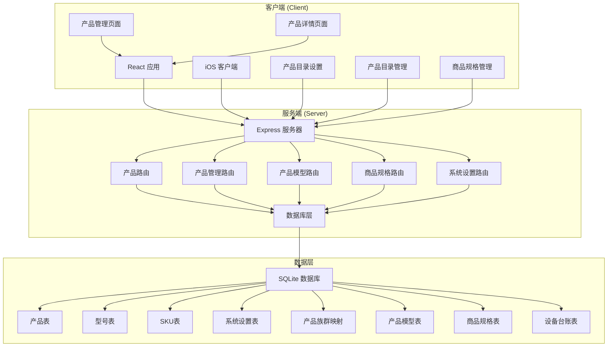

**图表来源**
- [server/index.js:1-800](file://server/index.js#L1-L800)
- [client/src/App.tsx:1-800](file://client/src/App.tsx#L1-L800)

### 项目组织结构

系统采用前后端分离架构，主要包含以下模块：

- **客户端应用**：React + TypeScript 前端应用，支持产品目录设置和过滤
- **iOS 客户端**：SwiftUI 原生移动端应用
- **服务端 API**：Node.js + Express 微服务架构，提供产品管理和设置控制
- **数据库层**：SQLite 关系型数据库，支持产品族群和类型过滤
- **文档系统**：完整的 PRD 和技术文档

**章节来源**
- [client/src/App.tsx:182-366](file://client/src/App.tsx#L182-L366)
- [ios/LonghornApp/LonghornApp.swift:1-26](file://ios/LonghornApp/LonghornApp.swift#L1-L26)

## 核心组件

### 产品管理组件

系统的核心功能围绕产品资产管理展开，主要包括：

1. **产品列表管理** - 支持按族群、状态、关键字筛选
2. **产品详情展示** - 展示完整的资产信息和关联工单
3. **保修状态管理** - 基于瀑布流逻辑的自动计算
4. **权限控制** - 基于角色的访问控制
5. **目录可见性控制** - 支持按产品族群和类型精确控制显示
6. **三层架构管理** - 支持产品目录、商品规格、设备台账的完整管理

### 服务端路由组件

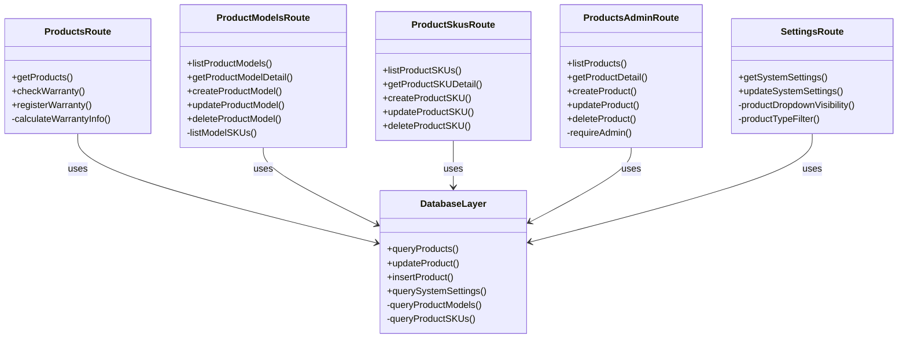

**图表来源**
- [server/service/routes/products.js:7-388](file://server/service/routes/products.js#L7-L388)
- [server/service/routes/products-admin.js:7-645](file://server/service/routes/products-admin.js#L7-L645)
- [server/service/routes/product-models-admin.js:7-373](file://server/service/routes/product-models-admin.js#L7-L373)
- [server/service/routes/product-skus.js:7-369](file://server/service/routes/product-skus.js#L7-L369)
- [server/service/routes/settings.js:20-263](file://server/service/routes/settings.js#L20-L263)

**章节来源**
- [server/service/routes/products.js:14-120](file://server/service/routes/products.js#L14-L120)
- [server/service/routes/products-admin.js:25-115](file://server/service/routes/products-admin.js#L25-L115)
- [server/service/routes/settings.js:86-94](file://server/service/routes/settings.js#L86-L94)

## 架构总览

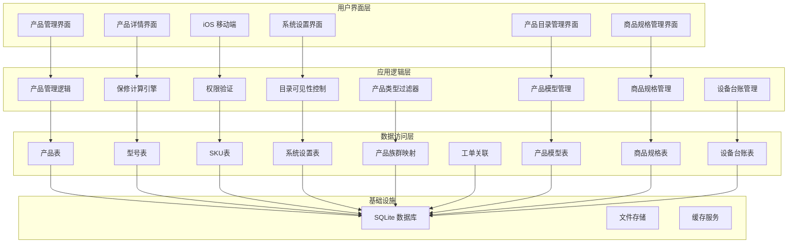

**图表来源**
- [server/index.js:1-800](file://server/index.js#L1-L800)
- [client/src/components/ProductManagement.tsx:78-175](file://client/src/components/ProductManagement.tsx#L78-L175)

### 数据流架构

系统采用事件驱动的数据流架构：

1. **用户交互** → **前端组件** → **API 调用**
2. **服务端路由** → **业务逻辑** → **数据库操作**
3. **数据变更** → **状态更新** → **界面刷新**
4. **设置变更** → **目录控制** → **显示过滤**
5. **三层架构** → **完整产品生命周期** → **服务闭环**

**章节来源**
- [client/src/App.tsx:204-297](file://client/src/App.tsx#L204-L297)
- [server/index.js:655-729](file://server/index.js#L655-L729)

## 详细组件分析

### 产品管理页面组件

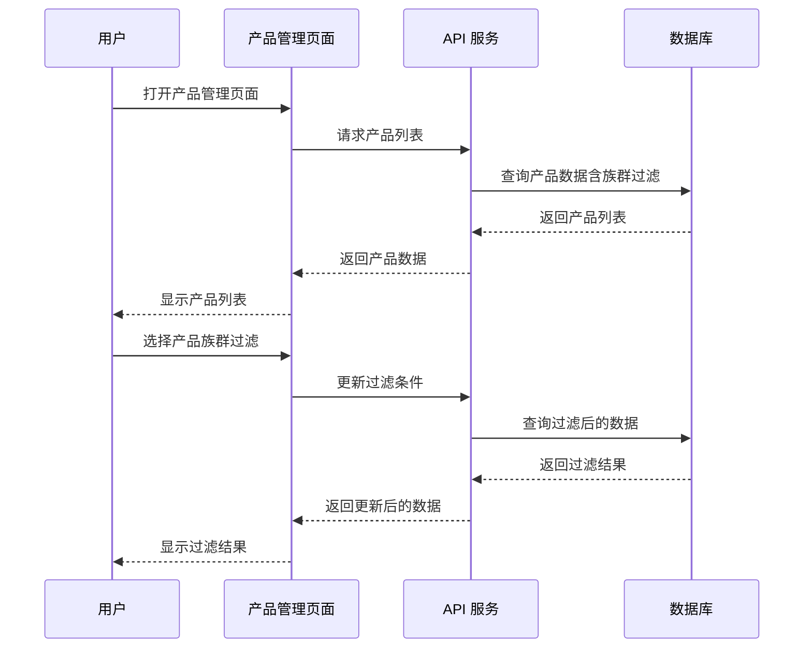

**图表来源**
- [client/src/components/ProductManagement.tsx:143-175](file://client/src/components/ProductManagement.tsx#L143-L175)
- [client/src/components/ProductManagement.tsx:212-224](file://client/src/components/ProductManagement.tsx#L212-L224)

#### 核心功能特性

1. **URL 参数驱动** - 支持通过 URL 参数进行筛选和排序
2. **权限控制** - 仅管理员和主管可见管理功能
3. **状态管理** - 支持产品状态的动态切换
4. **模态窗口** - 使用 macOS 26 设计风格的编辑对话框
5. **族群过滤** - 支持按产品族群（A-E）精确过滤显示
6. **三层架构集成** - 支持产品目录、SKU、设备台账的统一管理

**章节来源**
- [client/src/components/ProductManagement.tsx:78-250](file://client/src/components/ProductManagement.tsx#L78-L250)

### 产品详情页面组件

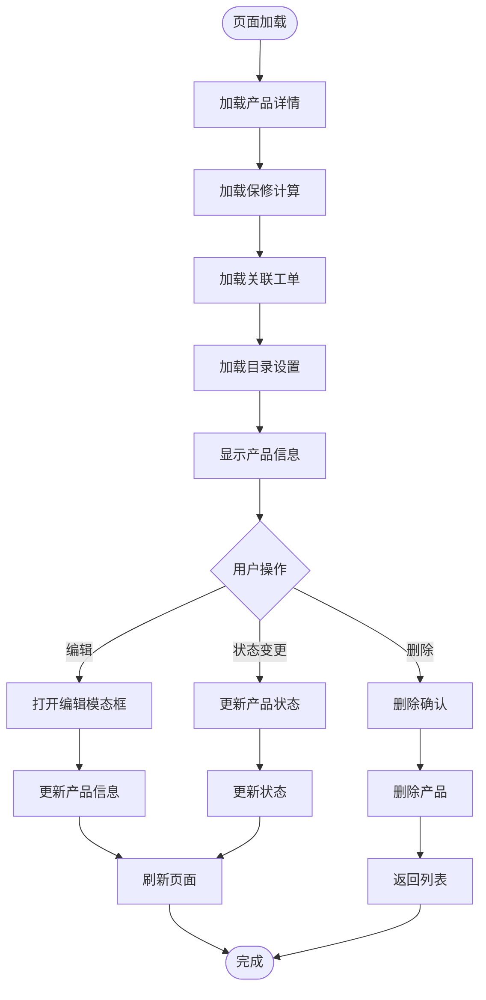

**图表来源**
- [client/src/components/ProductDetailPage.tsx:162-176](file://client/src/components/ProductDetailPage.tsx#L162-L176)
- [client/src/components/ProductDetailPage.tsx:79-104](file://client/src/components/ProductDetailPage.tsx#L79-L104)

#### 保修计算引擎

系统实现了基于瀑布流逻辑的自动保修计算：

1. **IoT激活** - 优先使用联网激活日期
2. **发票凭证** - 使用销售发票日期
3. **注册日期** - 使用客户注册日期
4. **直销发货** - 使用发货日期 + 7天
5. **经销商兜底** - 使用发货日期 + 90天

**章节来源**
- [client/src/components/ProductDetailPage.tsx:149-160](file://client/src/components/ProductDetailPage.tsx#L149-L160)
- [server/service/routes/products.js:337-384](file://server/service/routes/products.js#L337-L384)

### 服务端路由组件

#### 产品路由 (ProductsRoute)

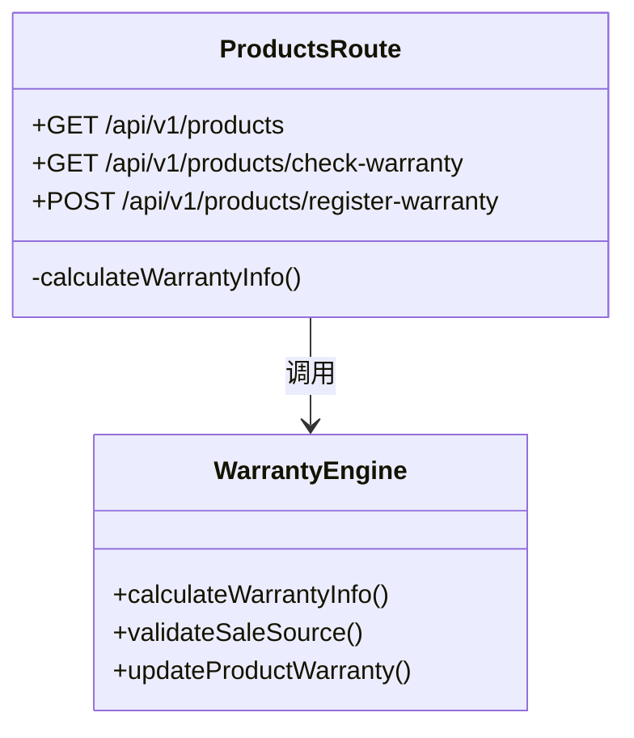

**图表来源**
- [server/service/routes/products.js:7-388](file://server/service/routes/products.js#L7-L388)

#### 产品管理路由 (ProductsAdminRoute)

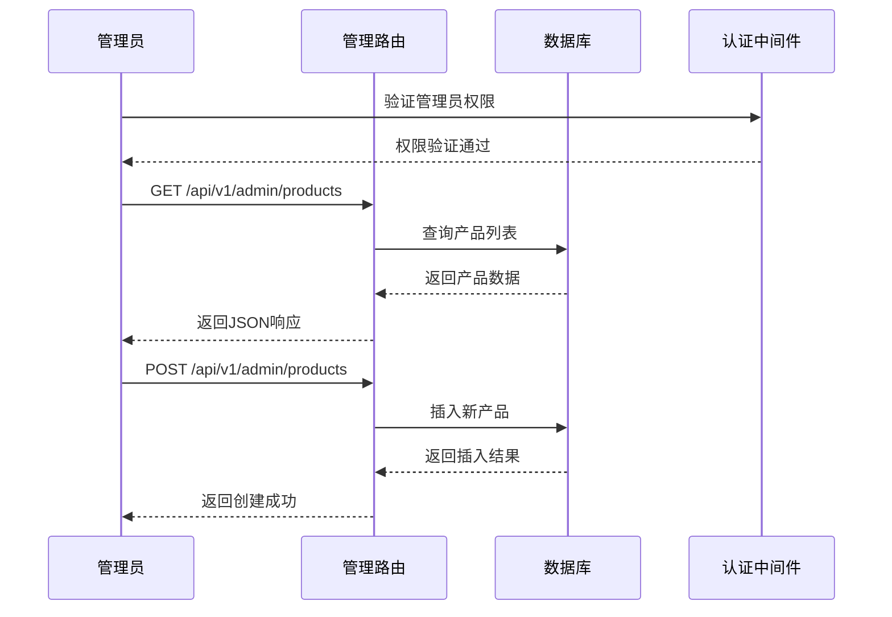

**图表来源**
- [server/service/routes/products-admin.js:10-19](file://server/service/routes/products-admin.js#L10-L19)
- [server/service/routes/products-admin.js:25-115](file://server/service/routes/products-admin.js#L25-L115)

**章节来源**
- [server/service/routes/products-admin.js:117-185](file://server/service/routes/products-admin.js#L117-L185)
- [server/service/routes/products.js:33-120](file://server/service/routes/products.js#L33-L120)

## 产品目录管理

### 产品目录架构

系统引入了全新的产品目录管理功能，支持产品型号的完整生命周期管理：

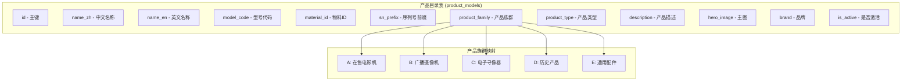

**图表来源**
- [server/migrations/016_add_product_models.sql:5-15](file://server/migrations/016_add_product_models.sql#L5-L15)

### 产品族群控制

系统支持五个产品族群的独立可见性控制：

| 族群代码 | 中文名称 | 默认可见性 | 用途 |
|---------|----------|------------|------|
| A | 在售电影机 | ✅ 可见 | 当前销售的电影摄影机 |
| B | 广播摄像机 | ❌ 不可见 | 广播级摄像机产品 |
| C | 电子寻像器 | ✅ 可见 | Eagle系列电子寻像器 |
| D | 历史产品 | ❌ 不可见 | 已停产的历史产品 |
| E | 通用配件 | ❌ 不可见 | 通用配件和附件 |

### 产品类型过滤器

系统提供了灵活的产品类型过滤功能：

1. **启用/禁用控制** - 可选择是否启用产品类型过滤
2. **类型白名单** - 管理员可定义允许显示的产品类型
3. **默认类型集合** - 包含电影机、摄像机、电子寻像器、寻像器、套装等

**章节来源**
- [server/migrations/047_add_product_dropdown_settings.sql:12-25](file://server/migrations/047_add_product_dropdown_settings.sql#L12-L25)
- [server/service/routes/settings.js:86-94](file://server/service/routes/settings.js#L86-L94)
- [server/service/routes/system.js:51-62](file://server/service/routes/system.js#L51-L62)

## 商品规格管理

### 商品规格架构

系统引入了完整的商品规格管理功能，支持SKU级别的产品规格管理：

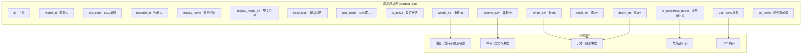

**图表来源**
- [server/service/routes/product-skus.js:141-232](file://server/service/routes/product-skus.js#L141-L232)

### 商品规格管理功能

系统提供了完整的商品规格管理功能：

1. **SKU创建** - 支持从产品型号创建SKU
2. **规格编辑** - 支持SKU基本信息的编辑
3. **物理属性管理** - 支持重量、体积、尺寸等物理属性
4. **图片管理** - 支持SKU专属图片上传
5. **状态控制** - 支持SKU的激活/停用管理
6. **关联统计** - 显示SKU关联的设备实例数量

**章节来源**
- [server/service/routes/product-skus.js:47-105](file://server/service/routes/product-skus.js#L47-L105)
- [client/src/components/ProductSkusManagement.tsx:96-179](file://client/src/components/ProductSkusManagement.tsx#L96-L179)

## 设备台账管理

### 设备台账架构

系统实现了完整的设备台账管理功能，支持设备实例的全生命周期管理：

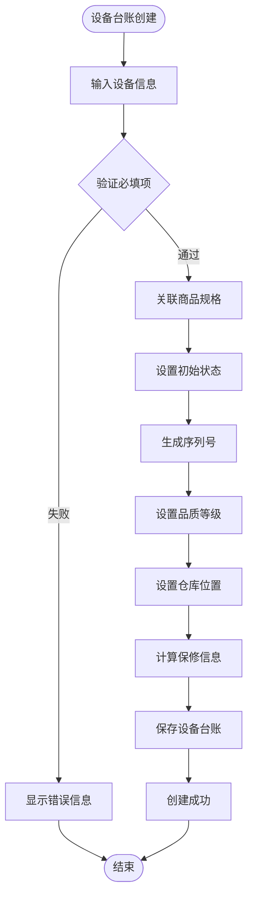

**图表来源**
- [server/service/routes/products.js:136-200](file://server/service/routes/products.js#L136-L200)

### 保修计算逻辑

系统实现了基于瀑布流逻辑的自动保修计算：

1. **IoT激活** - 优先使用联网激活日期
2. **发票凭证** - 使用销售发票日期
3. **注册日期** - 使用客户注册日期
4. **直销发货** - 使用发货日期 + 7天
5. **经销商兜底** - 使用发货日期 + 90天

**章节来源**
- [server/service/routes/products.js:75-120](file://server/service/routes/products.js#L75-L120)
- [client/src/components/ProductDetailPage.tsx:149-160](file://client/src/components/ProductDetailPage.tsx#L149-L160)

## 数据库架构

### 三层架构数据库设计

系统采用了全新的三层架构数据库设计：

```mermaid
erDiagram
PRODUCT_MODELS {
id PK
name_zh
name_en
model_code
material_id
sn_prefix
product_family
product_type
description
hero_image
brand
is_active
created_at
updated_at
}
PRODUCT_SKUS {
id PK
model_id FK
sku_code
material_id
display_name
display_name_en
spec_label
sku_image
is_active
weight_kg
volume_cum
length_cm
width_cm
depth_cm
is_dangerous_goods
upc
sn_prefix
created_at
updated_at
}
PRODUCTS {
id PK
serial_number
model_name
product_sku
sku_id FK
grade
warehouse
entry_channel
is_iot_device
is_activated
activation_date
sales_invoice_date
registration_date
ship_to_dealer_date
warranty_start_date
warranty_end_date
warranty_months
warranty_status
warranty_source
created_at
updated_at
}
PRODUCT_MODELS ||--o{ PRODUCT_SKUS : "包含"
PRODUCT_SKUS ||--o{ PRODUCTS : "生成"
```

**图表来源**
- [server/migrations/016_add_product_models.sql:5-15](file://server/migrations/016_add_product_models.sql#L5-L15)
- [server/migrations/022_add_products_sku_id.sql:6-9](file://server/migrations/022_add_products_sku_id.sql#L6-L9)

### 数据库迁移策略

系统采用了渐进式的数据库迁移策略：

1. **产品模型迁移** - 新增产品模型表结构
2. **商品规格迁移** - 新增商品规格表结构
3. **设备台账迁移** - 增加SKU关联字段
4. **索引优化** - 为常用查询字段建立索引
5. **数据补全** - 自动补全现有数据的关联关系

**章节来源**
- [server/service/migrations/034_fix_product_models_and_seed.sql:23-43](file://server/service/migrations/034_fix_product_models_and_seed.sql#L23-L43)
- [server/service/migrations/046_add_product_models_missing_columns.sql:5-22](file://server/service/migrations/046_add_product_models_missing_columns.sql#L5-L22)

## 产品目录可见性控制设置

### 设置架构

系统引入了全新的产品目录可见性控制设置，允许管理员精确控制产品下拉菜单的显示行为：

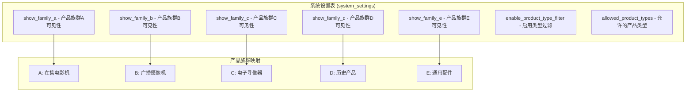

**图表来源**
- [server/migrations/047_add_product_dropdown_settings.sql:6-14](file://server/migrations/047_add_product_dropdown_settings.sql#L6-L14)

### 产品族群控制

系统支持五个产品族群的独立可见性控制：

| 族群代码 | 中文名称 | 默认可见性 | 用途 |
|---------|----------|------------|------|
| A | 在售电影机 | ✅ 可见 | 当前销售的电影摄影机 |
| B | 广播摄像机 | ❌ 不可见 | 广播级摄像机产品 |
| C | 电子寻像器 | ✅ 可见 | Eagle系列电子寻像器 |
| D | 历史产品 | ❌ 不可见 | 已停产的历史产品 |
| E | 通用配件 | ❌ 不可见 | 通用配件和附件 |

### 产品类型过滤器

系统提供了灵活的产品类型过滤功能：

1. **启用/禁用控制** - 可选择是否启用产品类型过滤
2. **类型白名单** - 管理员可定义允许显示的产品类型
3. **默认类型集合** - 包含电影机、摄像机、电子寻像器、寻像器、套装等

**章节来源**
- [server/migrations/047_add_product_dropdown_settings.sql:12-25](file://server/migrations/047_add_product_dropdown_settings.sql#L12-L25)
- [server/service/routes/settings.js:86-94](file://server/service/routes/settings.js#L86-L94)
- [server/service/routes/system.js:51-62](file://server/service/routes/system.js#L51-L62)

## 数据库迁移与数据补全

### 新增设置迁移

系统通过数据库迁移添加了产品目录控制功能：

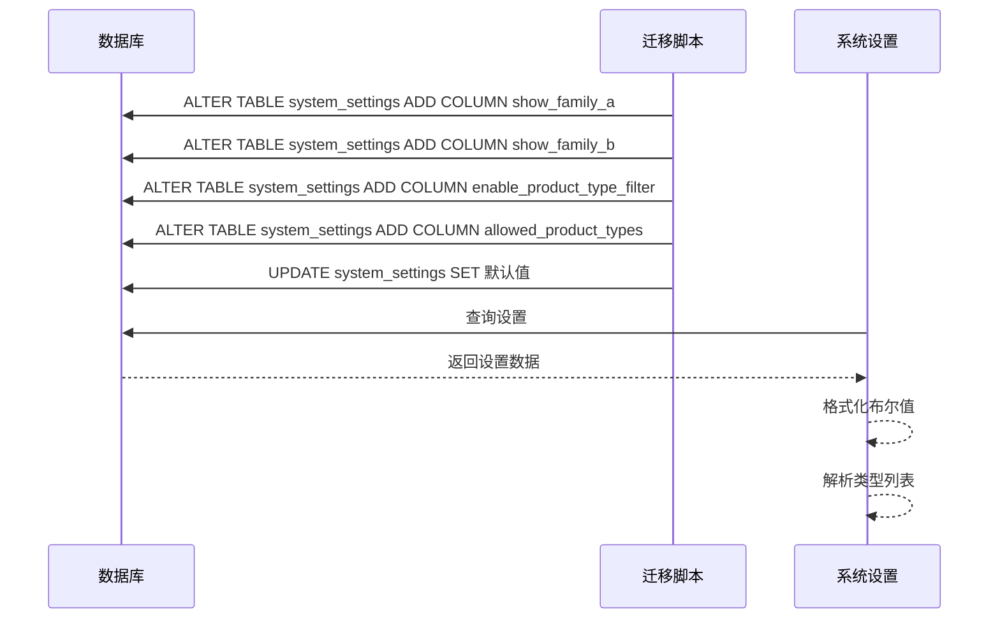

**图表来源**
- [server/migrations/047_add_product_dropdown_settings.sql:1-26](file://server/migrations/047_add_product_dropdown_settings.sql#L1-L26)

### 工单产品族群补全

系统提供了自动补全脚本，用于修复现有工单中的产品族群信息：

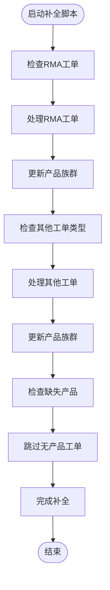

**图表来源**
- [server/scripts/migrate_ticket_product_family.js:70-107](file://server/scripts/migrate_ticket_product_family.js#L70-L107)

### 数据补全策略

系统采用智能补全策略：

1. **产品族群映射** - 自动将产品ID映射到对应的产品族群
2. **默认值处理** - 对于无法识别的产品族群，使用"Unknown"作为默认值
3. **空值处理** - 跳过没有关联产品的工单
4. **错误处理** - 记录并报告处理过程中的错误

**章节来源**
- [server/scripts/migrate_ticket_product_family.js:70-107](file://server/scripts/migrate_ticket_product_family.js#L70-L107)

## 依赖关系分析

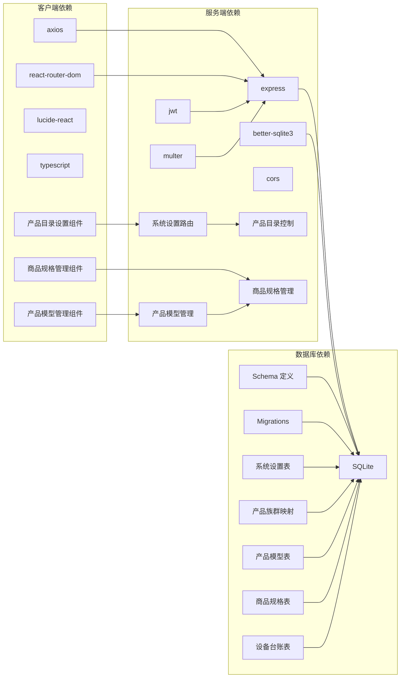

**图表来源**
- [server/index.js:1-16](file://server/index.js#L1-L16)
- [client/src/App.tsx:34-36](file://client/src/App.tsx#L34-L36)

### 核心依赖关系

1. **认证依赖**：JWT 令牌验证和用户权限控制
2. **数据依赖**：SQLite 数据库的完整产品资产管理
3. **路由依赖**：RESTful API 设计模式
4. **前端依赖**：React 组件化开发和状态管理
5. **设置依赖**：系统设置表的配置管理
6. **过滤依赖**：产品族群和类型过滤的数据库查询
7. **三层架构依赖**：产品模型、SKU、设备台账的关联关系

**章节来源**
- [server/index.js:655-729](file://server/index.js#L655-L729)
- [client/src/App.tsx:182-366](file://client/src/App.tsx#L182-L366)

## 性能考量

### 数据库优化

系统采用了多项数据库优化策略：

1. **索引优化** - 为常用查询字段建立索引
2. **事务处理** - 使用事务确保数据一致性
3. **连接池** - better-sqlite3 的连接复用
4. **查询优化** - 预编译语句减少解析开销
5. **设置缓存** - 系统设置的内存缓存机制
6. **三层架构优化** - 产品模型、SKU、设备台账的关联查询优化

### 前端性能

1. **懒加载** - 按需加载组件和数据
2. **状态缓存** - 使用本地状态减少重复请求
3. **虚拟滚动** - 大列表的性能优化
4. **防抖节流** - 搜索和筛选的性能优化
5. **目录过滤** - 前端实时过滤减少数据库负载
6. **三层架构缓存** - 产品模型和SKU的本地缓存

### 缓存策略

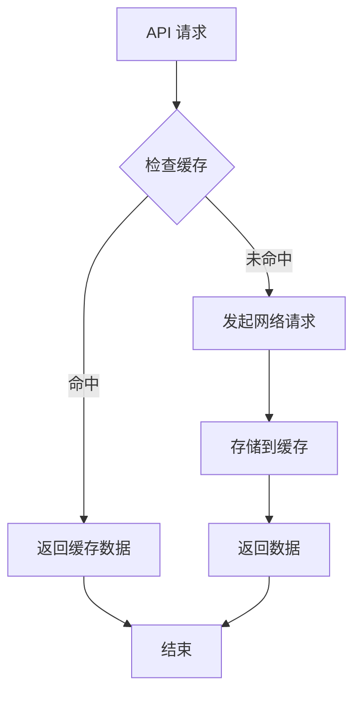

## 故障排除指南

### 常见问题诊断

1. **产品查询失败**
   - 检查数据库连接状态
   - 验证产品表结构完整性
   - 确认查询参数有效性

2. **权限验证失败**
   - 检查 JWT 令牌有效性
   - 验证用户角色和权限
   - 确认部门代码映射

3. **目录设置不生效**
   - 检查系统设置表的更新状态
   - 验证产品族群映射的正确性
   - 确认类型过滤器的配置

4. **工单产品族群缺失**
   - 检查补全脚本的执行状态
   - 验证产品ID到族群的映射关系
   - 确认数据库迁移的完整性

5. **三层架构数据不一致**
   - 检查产品模型、SKU、设备台账的关联关系
   - 验证数据库迁移的完整性
   - 确认数据补全脚本的执行状态

### 调试工具

1. **日志记录** - 详细的错误日志和调试信息
2. **API 测试** - Postman 或 curl 测试接口
3. **数据库监控** - SQLite 查询性能分析
4. **前端调试** - React DevTools 和浏览器开发者工具
5. **设置验证** - 系统设置的实时验证和测试
6. **三层架构验证** - 产品模型、SKU、设备台账的关联验证

**章节来源**
- [server/index.js:442-475](file://server/index.js#L442-L475)
- [server/service/routes/products.js:26-29](file://server/service/routes/products.js#L26-L29)

## 结论

Longhorn 三层产品架构通过清晰的层次划分和严格的权限控制，构建了一个完整的企业服务管理系统。系统的核心优势包括：

1. **架构清晰** - 三层产品管理模型逻辑清晰
2. **权限安全** - 基于角色的细粒度权限控制
3. **数据完整** - 完整的产品资产生命周期管理
4. **扩展性强** - 模块化的组件设计便于功能扩展
5. **灵活控制** - 新增的产品目录可见性控制提供精确的显示管理
6. **智能补全** - 自动化的产品族群补全确保数据完整性
7. **三层架构完整** - 从产品目录到设备台账的全生命周期管理
8. **商品规格管理** - 支持SKU级别的产品规格精细化管理
9. **物理属性管理** - 支持重量、体积、尺寸等物理属性管理
10. **业务标识管理** - 支持UPC条码等业务标识管理

该系统为 Kinefinity 提供了强大的产品服务闭环能力，支持从咨询工单到知识沉淀的完整服务流程，为企业数字化转型奠定了坚实基础。新增的三层产品架构进一步增强了系统的灵活性和用户体验，使管理员能够根据实际需求精确控制产品信息的显示范围和管理粒度。