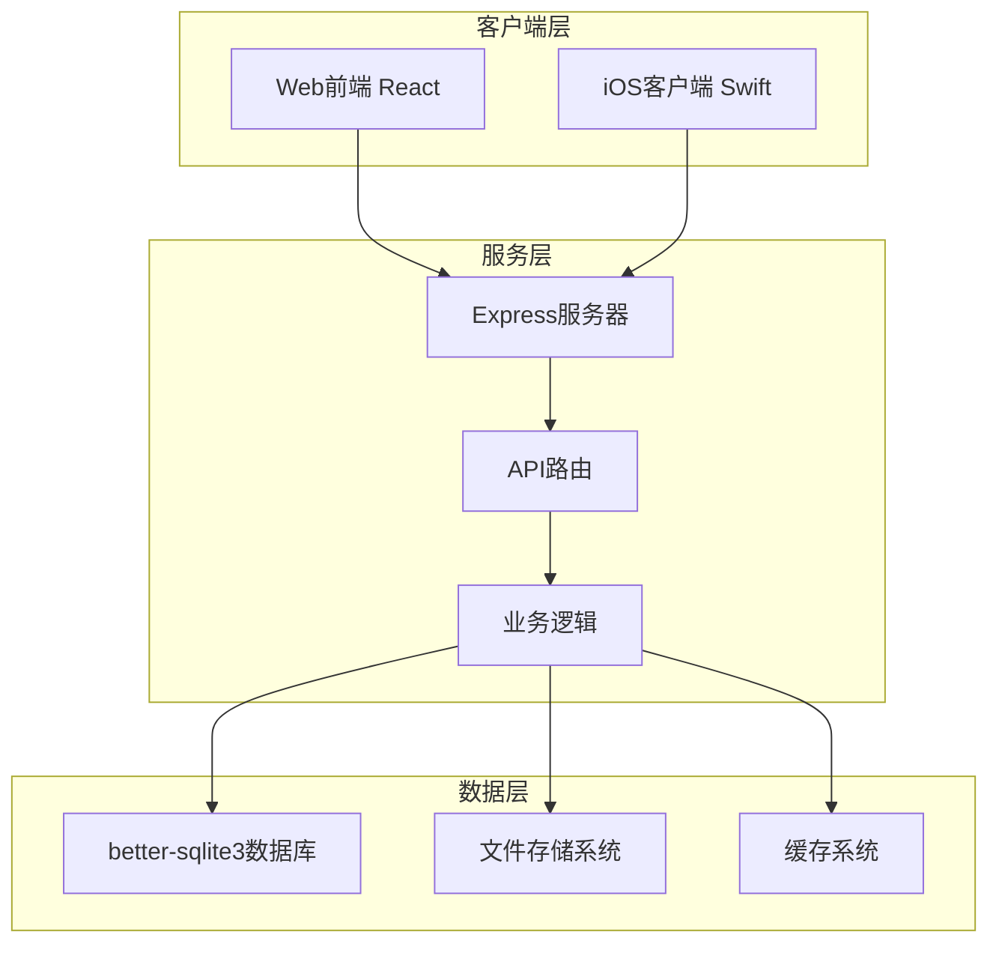
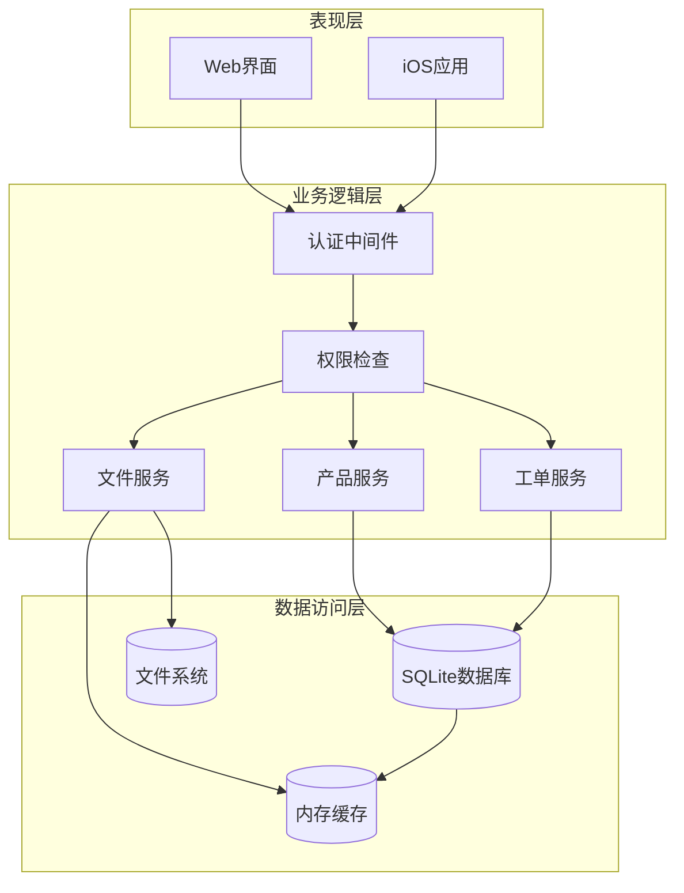
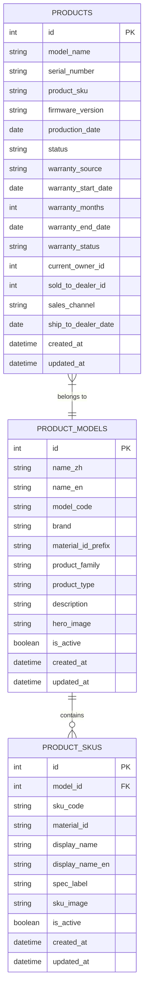
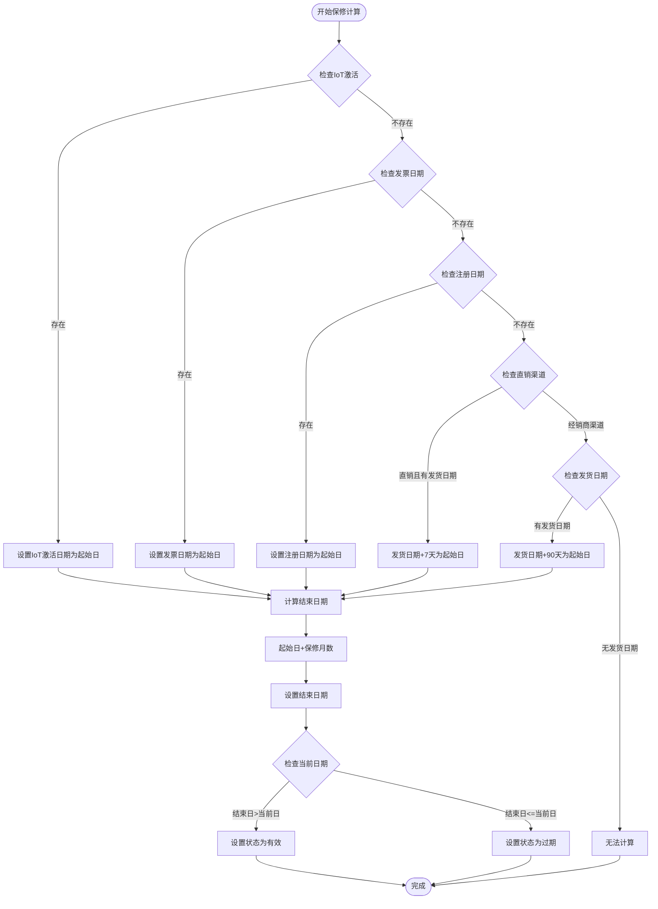
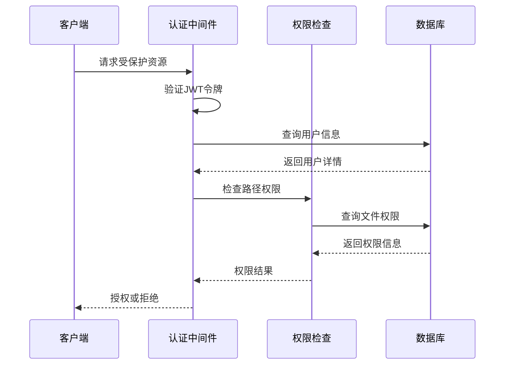
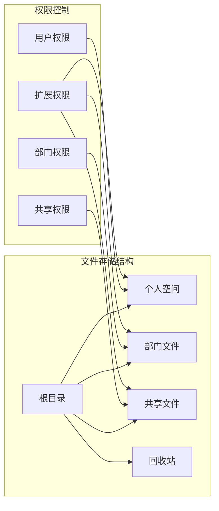
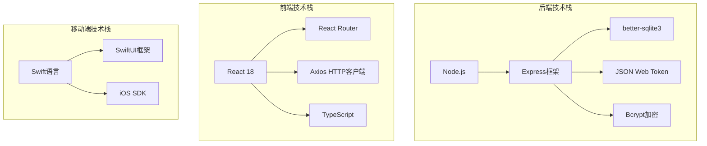
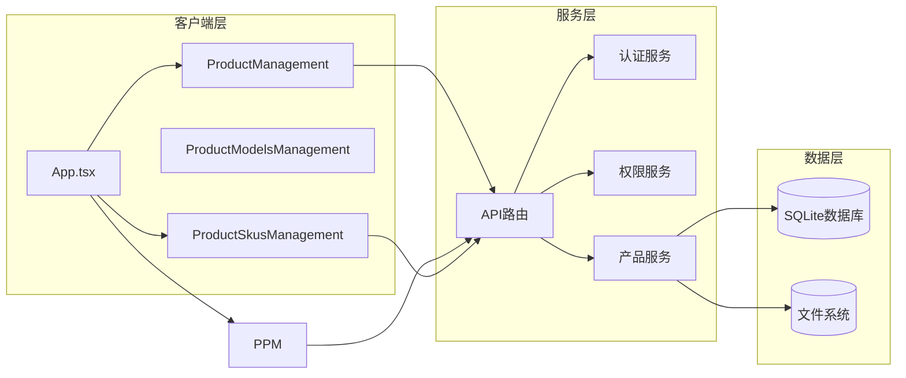

# 三层产品架构

<cite>
**本文档引用的文件**
- [server/index.js](file://server/index.js)
- [client/src/App.tsx](file://client/src/App.tsx)
- [ios/LonghornApp/LonghornApp.swift](file://ios/LonghornApp/LonghornApp.swift)
- [server/service/routes/products.js](file://server/service/routes/products.js)
- [server/service/routes/products-admin.js](file://server/service/routes/products-admin.js)
- [server/service/routes/product-models-admin.js](file://server/service/routes/product-models-admin.js)
- [server/service/routes/product-skus.js](file://server/service/routes/product-skus.js)
- [client/src/components/ProductManagement.tsx](file://client/src/components/ProductManagement.tsx)
- [client/src/components/ProductModelsManagement.tsx](file://client/src/components/ProductModelsManagement.tsx)
- [client/src/components/ProductSkusManagement.tsx](file://client/src/components/ProductSkusManagement.tsx)
</cite>

## 目录
1. [项目概述](#项目概述)
2. [项目结构](#项目结构)
3. [核心组件](#核心组件)
4. [架构概览](#架构概览)
5. [详细组件分析](#详细组件分析)
6. [依赖关系分析](#依赖关系分析)
7. [性能考虑](#性能考虑)
8. [故障排除指南](#故障排除指南)
9. [结论](#结论)

## 项目概述

Longhorn 是一个基于三层产品架构的企业级服务管理系统，专注于产品资产管理、工单处理和文件管理。该系统采用现代化的技术栈，包括 Node.js + Express 后端、React 前端和 Swift iOS 客户端，实现了完整的三层架构分离。

系统的核心特色是"三层产品架构"设计，将产品管理分为三个层次：
- **第一层（咨询层）**: Inquiry Tickets - 客户咨询和问题反馈
- **第二层（返厂层）**: RMA Tickets - 产品返厂维修和质量保证
- **第三层（经销商层）**: Dealer Repairs - 经销商维修和售后服务

## 项目结构

**图表来源**
- [server/index.js:1-800](file://server/index.js#L1-L800)
- [client/src/App.tsx:182-366](file://client/src/App.tsx#L182-L366)
- [ios/LonghornApp/LonghornApp.swift:12-25](file://ios/LonghornApp/LonghornApp.swift#L12-L25)

**章节来源**
- [server/index.js:1-800](file://server/index.js#L1-L800)
- [client/src/App.tsx:182-366](file://client/src/App.tsx#L182-L366)
- [ios/LonghornApp/LonghornApp.swift:12-25](file://ios/LonghornApp/LonghornApp.swift#L12-L25)

## 核心组件

### 1. 产品资产管理模块

系统实现了完整的三层产品架构，包含以下核心组件：

#### 产品管理组件
- **产品台账管理**: 支持设备序列号、固件版本、销售追踪等信息管理
- **产品型号管理**: 管理产品模型定义、规格参数和兼容性
- **SKU规格管理**: 管理产品规格代码、材料标识和显示名称

#### 工单处理组件
- **咨询工单**: 第一层 - 客户问题咨询和反馈
- **返厂工单**: 第二层 - 产品返厂维修和质量保证
- **经销商维修**: 第三层 - 经销商售后服务和维修

#### 文件管理组件
- **个人文件空间**: 用户专属文件存储和管理
- **部门文件共享**: 跨部门文件协作和权限控制
- **文件权限系统**: 基于角色和路径的细粒度权限控制

**章节来源**
- [client/src/components/ProductManagement.tsx:77-800](file://client/src/components/ProductManagement.tsx#L77-L800)
- [client/src/components/ProductModelsManagement.tsx:70-800](file://client/src/components/ProductModelsManagement.tsx#L70-L800)
- [client/src/components/ProductSkusManagement.tsx:35-440](file://client/src/components/ProductSkusManagement.tsx#L35-L440)

## 架构概览

**图表来源**
- [server/index.js:655-787](file://server/index.js#L655-L787)
- [server/service/routes/products.js:7-340](file://server/service/routes/products.js#L7-L340)

**章节来源**
- [server/index.js:655-787](file://server/index.js#L655-L787)
- [server/service/routes/products.js:7-340](file://server/service/routes/products.js#L7-L340)

## 详细组件分析

### 产品管理服务

#### 数据模型设计

**图表来源**
- [server/service/routes/products.js:14-340](file://server/service/routes/products.js#L14-L340)
- [server/service/routes/product-models-admin.js:99-183](file://server/service/routes/product-models-admin.js#L99-L183)
- [server/service/routes/product-skus.js:167-181](file://server/service/routes/product-skus.js#L167-L181)

#### 产品保修计算引擎

系统实现了复杂的保修计算逻辑，支持多种保修来源：

**图表来源**
- [server/service/routes/products.js:288-337](file://server/service/routes/products.js#L288-L337)

**章节来源**
- [server/service/routes/products.js:288-337](file://server/service/routes/products.js#L288-L337)

### 权限控制系统

系统实现了基于角色的权限控制（RBAC），支持多层级权限管理：

#### 权限检查流程

**图表来源**
- [server/index.js:655-787](file://server/index.js#L655-L787)

#### 角色权限映射

| 角色 | 权限范围 | 功能限制 |
|------|----------|----------|
| Admin | 系统完全控制 | 所有功能完全访问 |
| Exec | 高级管理权限 | 除系统配置外的所有功能 |
| Lead | 部门管理权限 | 部门内数据管理 |
| Member | 基础用户权限 | 个人和部门文件访问 |
| Dealer | 经销商权限 | 仅限经销商相关功能 |

**章节来源**
- [server/index.js:655-787](file://server/index.js#L655-L787)

### 文件管理系统

#### 文件存储架构

**图表来源**
- [server/index.js:734-787](file://server/index.js#L734-L787)

**章节来源**
- [server/index.js:734-787](file://server/index.js#L734-L787)

## 依赖关系分析

### 技术栈依赖

**图表来源**
- [server/package.json](file://server/package.json)
- [client/package.json](file://client/package.json)

### 组件间依赖

**图表来源**
- [client/src/App.tsx:182-366](file://client/src/App.tsx#L182-L366)
- [server/service/routes/products.js:7-340](file://server/service/routes/products.js#L7-L340)

**章节来源**
- [client/src/App.tsx:182-366](file://client/src/App.tsx#L182-L366)
- [server/service/routes/products.js:7-340](file://server/service/routes/products.js#L7-L340)

## 性能考虑

### 数据库优化策略

1. **索引优化**: 为常用查询字段建立索引
   - 产品序列号索引
   - 用户名唯一索引
   - 文件路径哈希索引

2. **查询优化**: 使用预编译语句和参数化查询
3. **连接池管理**: 合理配置数据库连接数
4. **缓存策略**: 内存缓存热点数据

### 前端性能优化

1. **懒加载**: 路由级别的代码分割
2. **虚拟滚动**: 大列表的虚拟化渲染
3. **请求去重**: 避免重复的API调用
4. **状态管理**: Redux-like状态管理优化

### 移动端优化

1. **SwiftUI性能**: 利用SwiftUI的声明式UI特性
2. **内存管理**: ARC自动内存管理
3. **网络优化**: URLSession的高效网络请求

## 故障排除指南

### 常见问题诊断

#### 认证问题
- **症状**: 401未授权错误
- **原因**: JWT令牌过期或无效
- **解决方案**: 重新登录获取新令牌

#### 权限问题
- **症状**: 403禁止访问
- **原因**: 用户权限不足
- **解决方案**: 检查用户角色和部门权限

#### 数据库问题
- **症状**: SQL查询错误
- **原因**: 数据库连接失败或表结构不匹配
- **解决方案**: 检查数据库连接配置和迁移脚本

#### 文件访问问题
- **症状**: 文件读取失败
- **原因**: 文件路径权限或磁盘空间不足
- **解决方案**: 检查文件系统权限和存储空间

**章节来源**
- [server/index.js:655-787](file://server/index.js#L655-L787)

## 结论

Longhorn三层产品架构系统展现了现代企业级应用的设计理念，通过清晰的三层分离实现了高度的模块化和可维护性。系统的核心优势包括：

1. **完整的三层架构**: 从产品资产管理到工单处理的全流程覆盖
2. **灵活的权限控制**: 基于角色和路径的细粒度权限管理
3. **现代化技术栈**: React + Node.js + Swift的跨平台解决方案
4. **可扩展性设计**: 模块化的组件架构便于功能扩展
5. **性能优化**: 多层次的性能优化策略确保系统稳定性

该系统为企业提供了完整的数字化转型工具，特别是在产品管理和客户服务方面展现了强大的功能和良好的用户体验。通过持续的优化和扩展，Longhorn有望成为行业领先的解决方案。