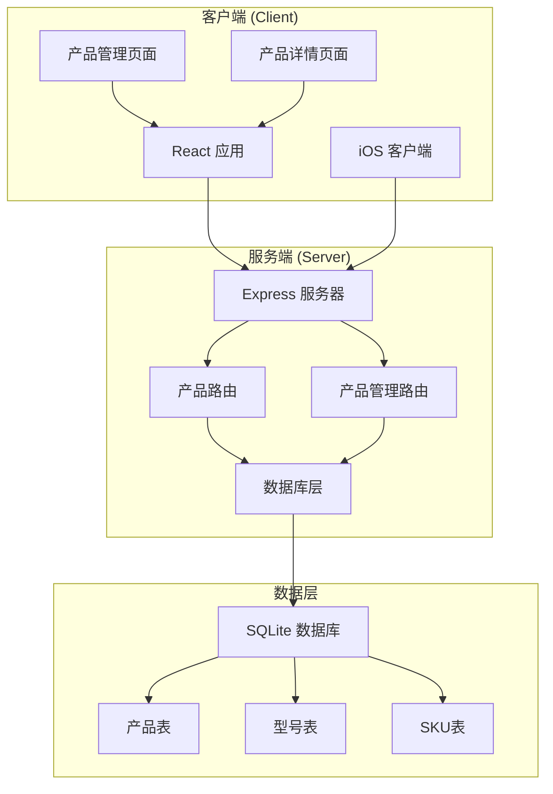
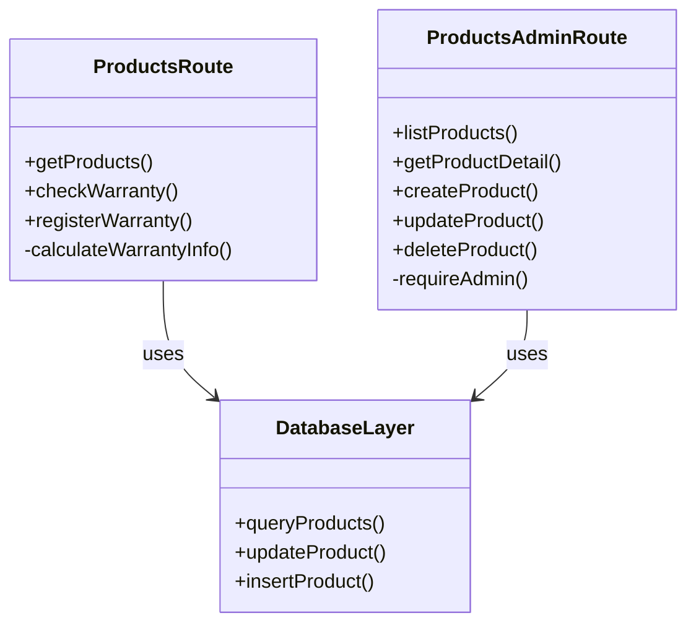
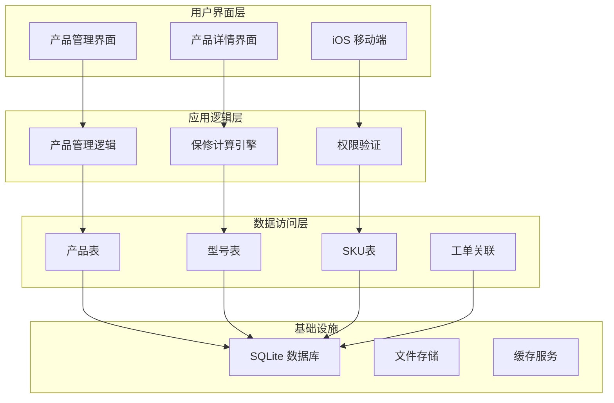
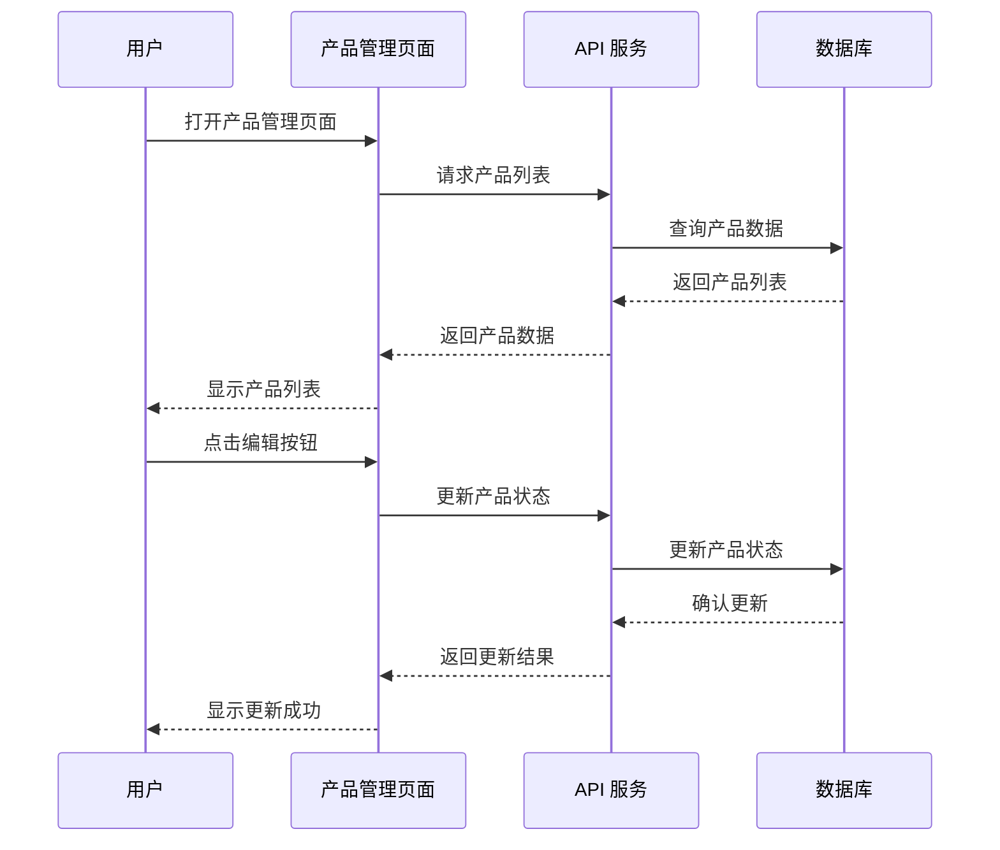
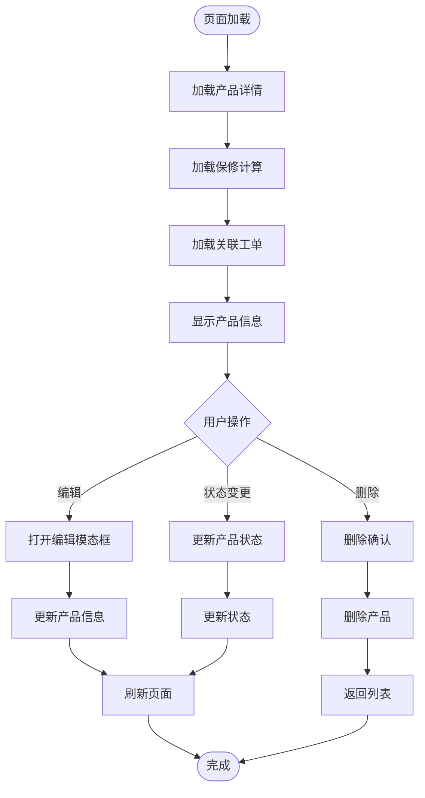
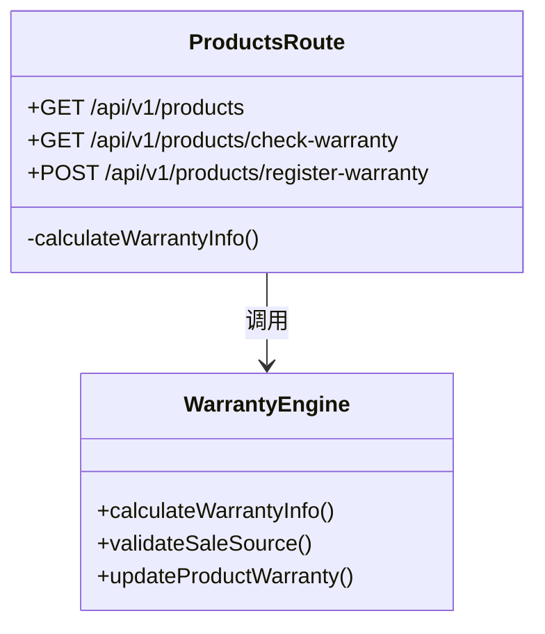
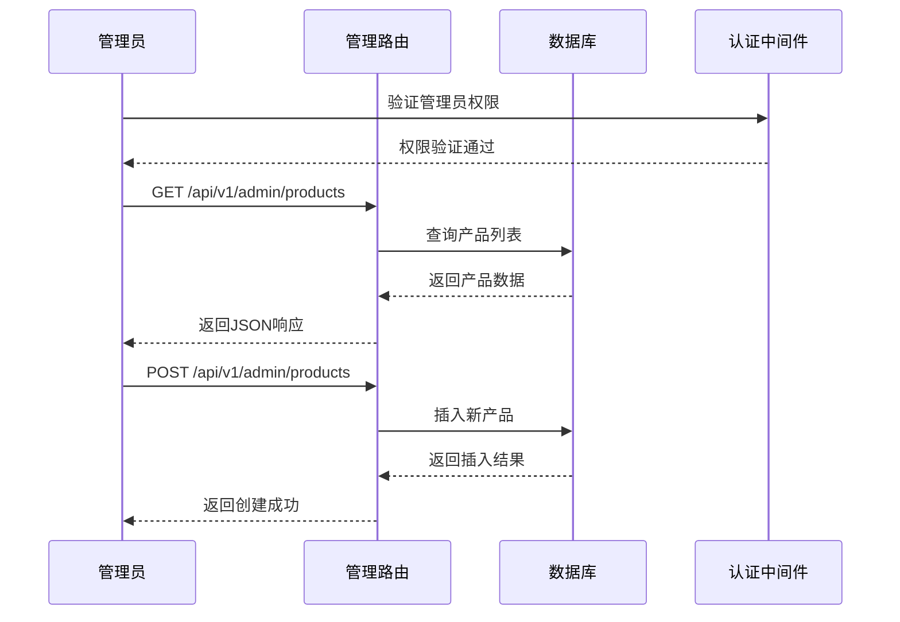
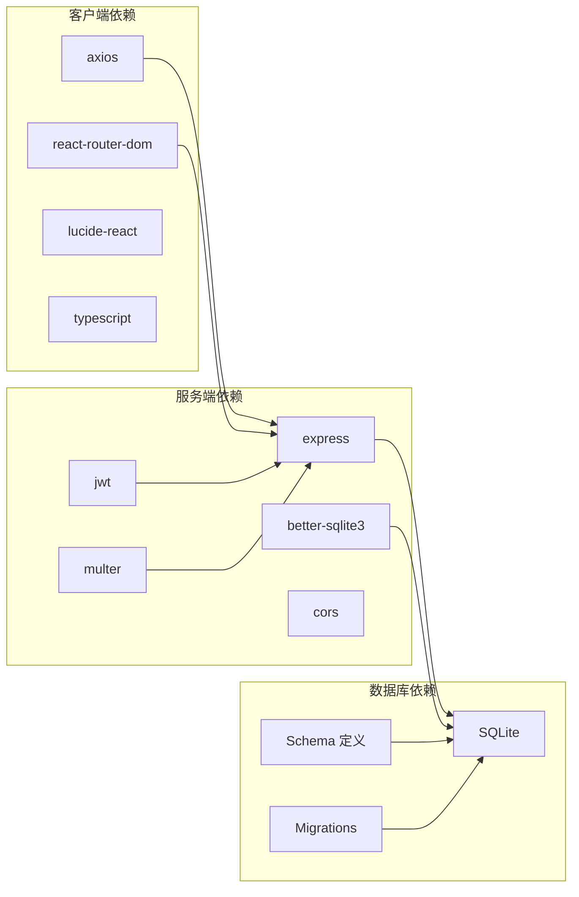
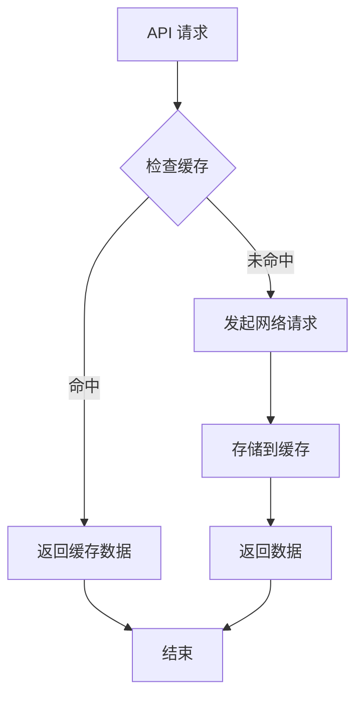

# 三层产品架构

<cite>
**本文档引用的文件**
- [server/index.js](file://server/index.js)
- [client/src/App.tsx](file://client/src/App.tsx)
- [client/src/components/ProductManagement.tsx](file://client/src/components/ProductManagement.tsx)
- [client/src/components/ProductDetailPage.tsx](file://client/src/components/ProductDetailPage.tsx)
- [server/service/routes/products.js](file://server/service/routes/products.js)
- [server/service/routes/products-admin.js](file://server/service/routes/products-admin.js)
- [server/migrations/015_extend_products_data.js](file://server/migrations/015_extend_products_data.js)
- [server/migrations/016_add_product_models.sql](file://server/migrations/016_add_product_models.sql)
- [ios/LonghornApp/LonghornApp.swift](file://ios/LonghornApp/LonghornApp.swift)
- [docs/Service_PRD.md](file://docs/Service_PRD.md)
</cite>

## 目录
1. [项目概述](#项目概述)
2. [项目结构](#项目结构)
3. [核心组件](#核心组件)
4. [架构总览](#架构总览)
5. [详细组件分析](#详细组件分析)
6. [依赖关系分析](#依赖关系分析)
7. [性能考量](#性能考量)
8. [故障排除指南](#故障排除指南)
9. [结论](#结论)

## 项目概述

Longhorn 是一个基于三层产品架构的企业服务管理系统，专注于构建以"客户服务"为核心的完整生态体系。系统采用统一的三层工单模型，清晰区分咨询工单、RMA返厂单和经销商维修单三种服务场景。

### 三层产品管理体系

系统实现了完整的三层产品管理模型：

1. **产品型号 (Product Model)** - 研发视角，管理产品线和规格
2. **产品规格 (Product SKU)** - 销售视角，管理套餐和配置
3. **产品资产 (Product Instance)** - 售后视角，管理序列号和资产状态

### 核心价值

- **服务闭环管理**：统一工单体系，全流程追踪
- **知识体系构建**：问题→解决方案→知识沉淀
- **产品持续改进**：客户反馈→功能期望→产品迭代

**章节来源**
- [docs/Service_PRD.md:1-120](file://docs/Service_PRD.md#L1-L120)
- [docs/Service_PRD.md:558-581](file://docs/Service_PRD.md#L558-L581)

## 项目结构

**图表来源**
- [server/index.js:1-800](file://server/index.js#L1-L800)
- [client/src/App.tsx:1-800](file://client/src/App.tsx#L1-L800)

### 项目组织结构

系统采用前后端分离架构，主要包含以下模块：

- **客户端应用**：React + TypeScript 前端应用
- **iOS 客户端**：SwiftUI 原生移动端应用
- **服务端 API**：Node.js + Express 微服务架构
- **数据库层**：SQLite 关系型数据库
- **文档系统**：完整的 PRD 和技术文档

**章节来源**
- [client/src/App.tsx:182-366](file://client/src/App.tsx#L182-L366)
- [ios/LonghornApp/LonghornApp.swift:1-26](file://ios/LonghornApp/LonghornApp.swift#L1-L26)

## 核心组件

### 产品管理组件

系统的核心功能围绕产品资产管理展开，主要包括：

1. **产品列表管理** - 支持按族群、状态、关键字筛选
2. **产品详情展示** - 展示完整的资产信息和关联工单
3. **保修状态管理** - 基于瀑布流逻辑的自动计算
4. **权限控制** - 基于角色的访问控制

### 服务端路由组件

**图表来源**
- [server/service/routes/products.js:7-388](file://server/service/routes/products.js#L7-L388)
- [server/service/routes/products-admin.js:7-645](file://server/service/routes/products-admin.js#L7-L645)

**章节来源**
- [server/service/routes/products.js:14-120](file://server/service/routes/products.js#L14-L120)
- [server/service/routes/products-admin.js:25-115](file://server/service/routes/products-admin.js#L25-L115)

## 架构总览

**图表来源**
- [server/index.js:1-800](file://server/index.js#L1-L800)
- [client/src/components/ProductManagement.tsx:78-175](file://client/src/components/ProductManagement.tsx#L78-L175)

### 数据流架构

系统采用事件驱动的数据流架构：

1. **用户交互** → **前端组件** → **API 调用**
2. **服务端路由** → **业务逻辑** → **数据库操作**
3. **数据变更** → **状态更新** → **界面刷新**

**章节来源**
- [client/src/App.tsx:204-297](file://client/src/App.tsx#L204-L297)
- [server/index.js:655-729](file://server/index.js#L655-L729)

## 详细组件分析

### 产品管理页面组件

**图表来源**
- [client/src/components/ProductManagement.tsx:143-175](file://client/src/components/ProductManagement.tsx#L143-L175)
- [client/src/components/ProductManagement.tsx:212-224](file://client/src/components/ProductManagement.tsx#L212-L224)

#### 核心功能特性

1. **URL 参数驱动** - 支持通过 URL 参数进行筛选和排序
2. **权限控制** - 仅管理员和主管可见管理功能
3. **状态管理** - 支持产品状态的动态切换
4. **模态窗口** - 使用 macOS 26 设计风格的编辑对话框

**章节来源**
- [client/src/components/ProductManagement.tsx:78-250](file://client/src/components/ProductManagement.tsx#L78-L250)

### 产品详情页面组件

**图表来源**
- [client/src/components/ProductDetailPage.tsx:162-176](file://client/src/components/ProductDetailPage.tsx#L162-L176)
- [client/src/components/ProductDetailPage.tsx:79-104](file://client/src/components/ProductDetailPage.tsx#L79-L104)

#### 保修计算引擎

系统实现了基于瀑布流逻辑的自动保修计算：

1. **IoT激活** - 优先使用联网激活日期
2. **发票凭证** - 使用销售发票日期
3. **注册日期** - 使用官网注册日期
4. **直销发货** - 使用发货日期 + 7天
5. **经销商兜底** - 使用发货日期 + 90天

**章节来源**
- [client/src/components/ProductDetailPage.tsx:149-160](file://client/src/components/ProductDetailPage.tsx#L149-L160)
- [server/service/routes/products.js:337-384](file://server/service/routes/products.js#L337-L384)

### 服务端路由组件

#### 产品路由 (ProductsRoute)

**图表来源**
- [server/service/routes/products.js:7-388](file://server/service/routes/products.js#L7-L388)

#### 产品管理路由 (ProductsAdminRoute)

**图表来源**
- [server/service/routes/products-admin.js:10-19](file://server/service/routes/products-admin.js#L10-L19)
- [server/service/routes/products-admin.js:25-115](file://server/service/routes/products-admin.js#L25-L115)

**章节来源**
- [server/service/routes/products-admin.js:117-185](file://server/service/routes/products-admin.js#L117-L185)
- [server/service/routes/products.js:33-120](file://server/service/routes/products.js#L33-L120)

## 依赖关系分析

**图表来源**
- [server/index.js:1-16](file://server/index.js#L1-L16)
- [client/src/App.tsx:34-36](file://client/src/App.tsx#L34-L36)

### 核心依赖关系

1. **认证依赖**：JWT 令牌验证和用户权限控制
2. **数据依赖**：SQLite 数据库的完整产品资产管理
3. **路由依赖**：RESTful API 设计模式
4. **前端依赖**：React 组件化开发和状态管理

**章节来源**
- [server/index.js:655-729](file://server/index.js#L655-L729)
- [client/src/App.tsx:182-366](file://client/src/App.tsx#L182-L366)

## 性能考量

### 数据库优化

系统采用了多项数据库优化策略：

1. **索引优化** - 为常用查询字段建立索引
2. **事务处理** - 使用事务确保数据一致性
3. **连接池** - better-sqlite3 的连接复用
4. **查询优化** - 预编译语句减少解析开销

### 前端性能

1. **懒加载** - 按需加载组件和数据
2. **状态缓存** - 使用本地状态减少重复请求
3. **虚拟滚动** - 大列表的性能优化
4. **防抖节流** - 搜索和筛选的性能优化

### 缓存策略

## 故障排除指南

### 常见问题诊断

1. **产品查询失败**
   - 检查数据库连接状态
   - 验证产品表结构完整性
   - 确认查询参数有效性

2. **权限验证失败**
   - 检查 JWT 令牌有效性
   - 验证用户角色和权限
   - 确认部门代码映射

3. **保修计算异常**
   - 检查输入数据的有效性
   - 验证瀑布流逻辑的执行路径
   - 确认日期计算的准确性

### 调试工具

1. **日志记录** - 详细的错误日志和调试信息
2. **API 测试** - Postman 或 curl 测试接口
3. **数据库监控** - SQLite 查询性能分析
4. **前端调试** - React DevTools 和浏览器开发者工具

**章节来源**
- [server/index.js:442-475](file://server/index.js#L442-L475)
- [server/service/routes/products.js:26-29](file://server/service/routes/products.js#L26-L29)

## 结论

Longhorn 三层产品架构通过清晰的层次划分和严格的权限控制，构建了一个完整的企业服务管理系统。系统的核心优势包括：

1. **架构清晰** - 三层产品管理模型逻辑清晰
2. **权限安全** - 基于角色的细粒度权限控制
3. **数据完整** - 完整的产品资产生命周期管理
4. **扩展性强** - 模块化的组件设计便于功能扩展

该系统为 Kinefinity 提供了强大的产品服务闭环能力，支持从咨询工单到知识沉淀的完整服务流程，为企业数字化转型奠定了坚实基础。