# 产品SKU详情页面

<cite>
**本文档引用的文件**
- [ProductSkuDetailPage.tsx](file://client/src/components/ProductSkuDetailPage.tsx)
- [product-skus.js](file://server/service/routes/product-skus.js)
- [App.tsx](file://client/src/App.tsx)
- [ProductSkusManagement.tsx](file://client/src/components/ProductSkusManagement.tsx)
- [useDetailStore.ts](file://client/src/store/useDetailStore.ts)
- [ProductModelDetailPage.tsx](file://client/src/components/ProductModelDetailPage.tsx)
</cite>

## 目录
1. [简介](#简介)
2. [项目结构](#项目结构)
3. [核心组件](#核心组件)
4. [架构概览](#架构概览)
5. [详细组件分析](#详细组件分析)
6. [依赖关系分析](#依赖关系分析)
7. [性能考虑](#性能考虑)
8. [故障排除指南](#故障排除指南)
9. [结论](#结论)

## 简介

产品SKU详情页面是Longhorn服务管理系统中的核心功能模块，用于展示和管理产品的具体规格信息。该页面提供了完整的SKU（库存单位）信息展示、编辑功能以及与产品型号的关联关系管理。

该页面采用现代化的React开发模式，结合TypeScript类型安全和Zustand状态管理，为用户提供直观的产品SKU管理体验。页面支持多种用户角色权限控制，包括管理员、执行官和市场部门领导等高级权限。

## 项目结构

Longhorn项目的前端架构采用模块化设计，产品SKU详情页面位于客户端组件目录中：

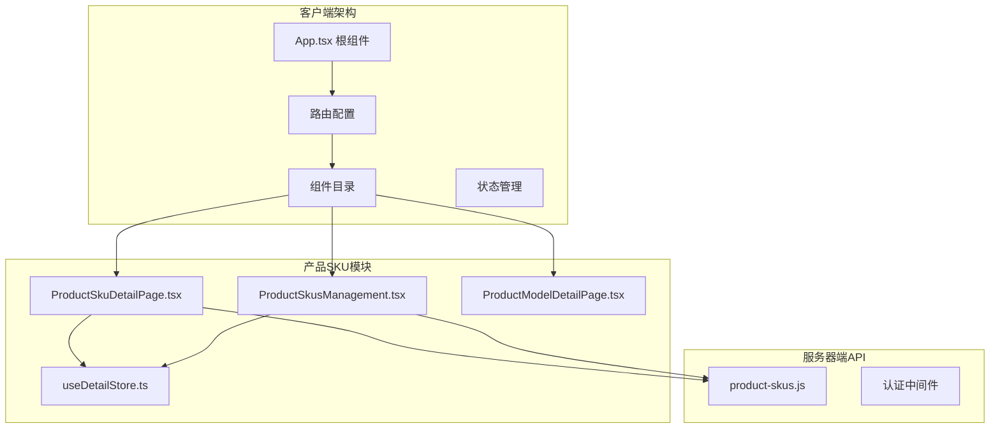

**图表来源**
- [App.tsx:264-266](file://client/src/App.tsx#L264-L266)
- [ProductSkuDetailPage.tsx:29-688](file://client/src/components/ProductSkuDetailPage.tsx#L29-L688)

**章节来源**
- [App.tsx:264-266](file://client/src/App.tsx#L264-L266)
- [ProductSkuDetailPage.tsx:1-688](file://client/src/components/ProductSkuDetailPage.tsx#L1-L688)

## 核心组件

### 主要数据结构

产品SKU详情页面使用以下核心数据结构：

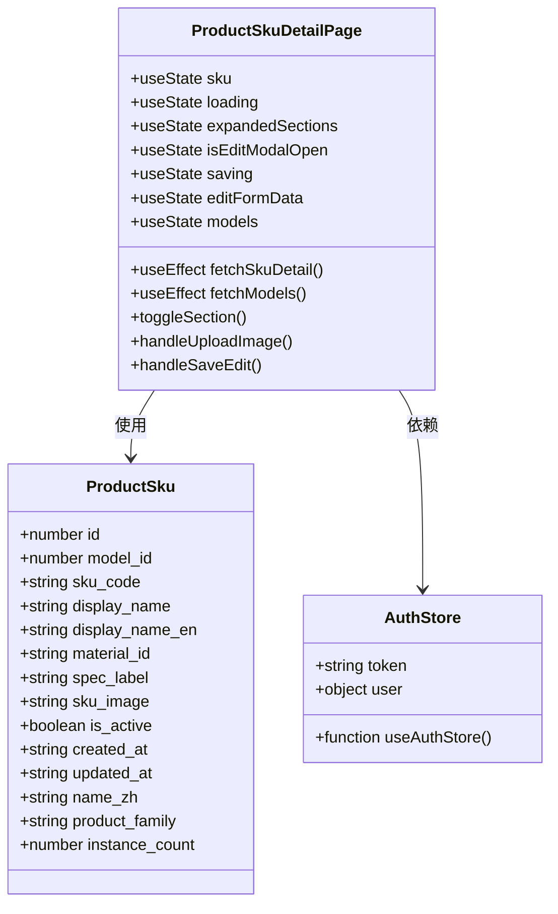

**图表来源**
- [ProductSkuDetailPage.tsx:11-27](file://client/src/components/ProductSkuDetailPage.tsx#L11-L27)
- [ProductSkuDetailPage.tsx:29-688](file://client/src/components/ProductSkuDetailPage.tsx#L29-L688)

### 权限控制系统

页面实现了多层次的权限控制机制：

| 用户角色 | 访问权限 | 管理权限 |
|---------|---------|---------|
| Admin | 完全访问 | 创建、编辑、删除SKU |
| Exec | 完全访问 | 创建、编辑、删除SKU |
| Lead (MS) | 完全访问 | 创建、编辑、删除SKU |
| Lead (其他部门) | 仅查看 | 无管理权限 |
| Member | 仅查看 | 无管理权限 |

**章节来源**
- [ProductSkuDetailPage.tsx:141-142](file://client/src/components/ProductSkuDetailPage.tsx#L141-L142)
- [product-skus.js:11-41](file://server/service/routes/product-skus.js#L11-L41)

## 架构概览

产品SKU详情页面采用前后端分离架构，通过RESTful API进行数据交互：

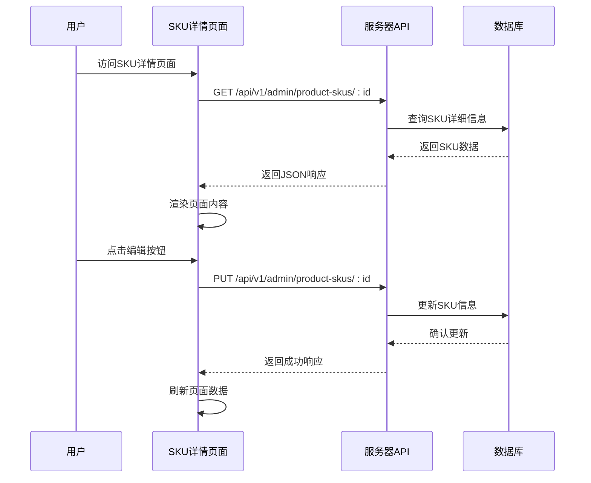

**图表来源**
- [ProductSkuDetailPage.tsx:45-60](file://client/src/components/ProductSkuDetailPage.tsx#L45-L60)
- [ProductSkuDetailPage.tsx:125-139](file://client/src/components/ProductSkuDetailPage.tsx#L125-L139)
- [product-skus.js:94-122](file://server/service/routes/product-skus.js#L94-L122)

**章节来源**
- [ProductSkuDetailPage.tsx:45-139](file://client/src/components/ProductSkuDetailPage.tsx#L45-L139)
- [product-skus.js:47-122](file://server/service/routes/product-skus.js#L47-L122)

## 详细组件分析

### 页面布局结构

SKU详情页面采用响应式布局设计，包含以下主要区域：

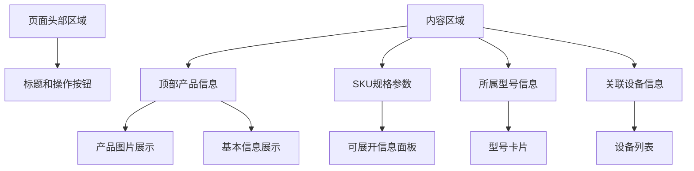

**图表来源**
- [ProductSkuDetailPage.tsx:314-503](file://client/src/components/ProductSkuDetailPage.tsx#L314-L503)

### 数据加载流程

页面的数据加载采用异步处理机制：

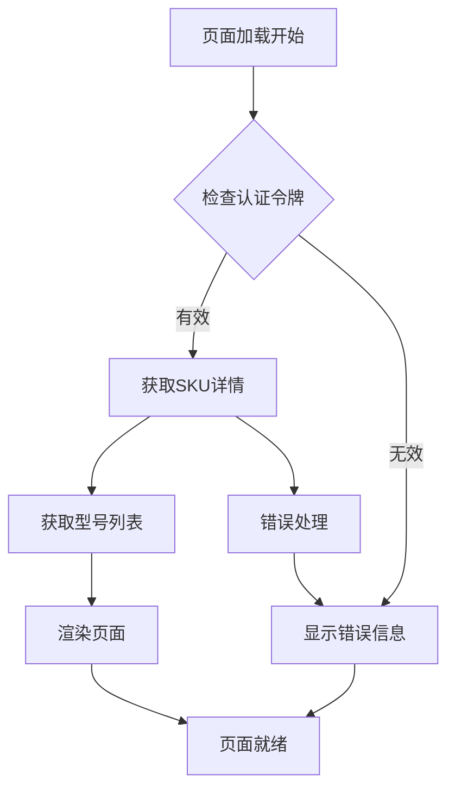

**图表来源**
- [ProductSkuDetailPage.tsx:62-65](file://client/src/components/ProductSkuDetailPage.tsx#L62-L65)
- [ProductSkuDetailPage.tsx:144-162](file://client/src/components/ProductSkuDetailPage.tsx#L144-L162)

### 编辑功能实现

SKU编辑功能提供完整的表单管理和数据验证：

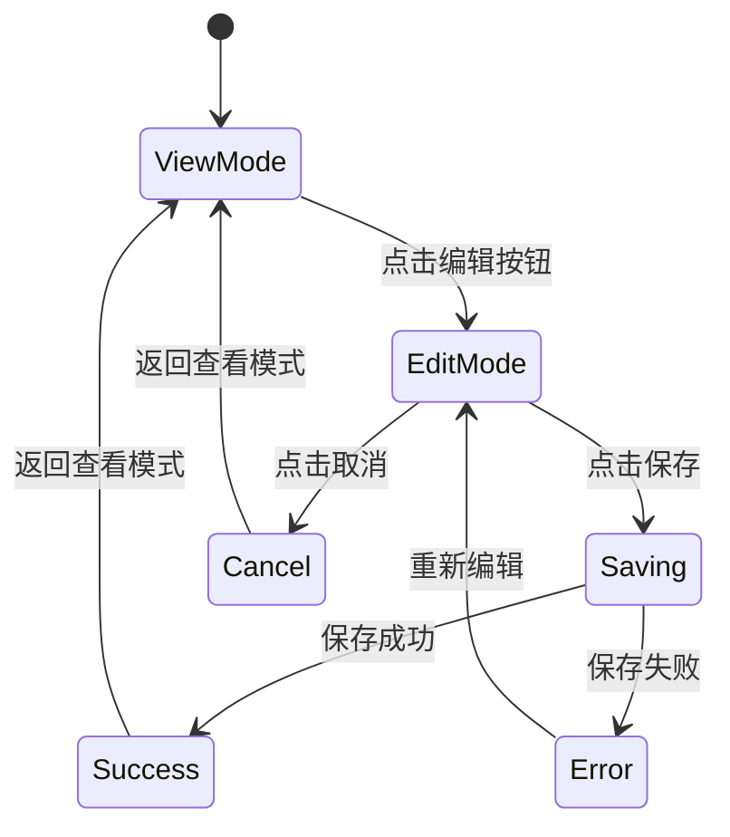

**图表来源**
- [ProductSkuDetailPage.tsx:506-682](file://client/src/components/ProductSkuDetailPage.tsx#L506-L682)

**章节来源**
- [ProductSkuDetailPage.tsx:314-682](file://client/src/components/ProductSkuDetailPage.tsx#L314-L682)

### 图片上传机制

页面集成了完整的图片上传和管理功能：

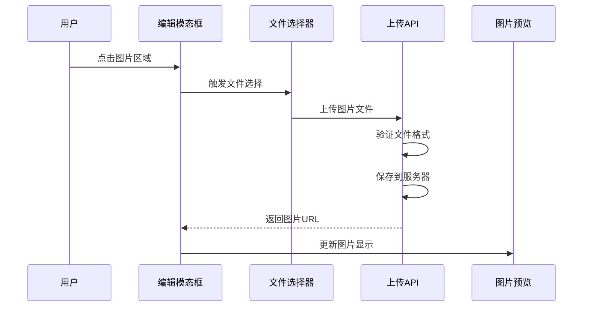

**图表来源**
- [ProductSkuDetailPage.tsx:102-123](file://client/src/components/ProductSkuDetailPage.tsx#L102-L123)
- [ProductSkuDetailPage.tsx:618-643](file://client/src/components/ProductSkuDetailPage.tsx#L618-L643)

**章节来源**
- [ProductSkuDetailPage.tsx:102-123](file://client/src/components/ProductSkuDetailPage.tsx#L102-L123)
- [ProductSkuDetailPage.tsx:618-643](file://client/src/components/ProductSkuDetailPage.tsx#L618-L643)

## 依赖关系分析

### 前端依赖关系

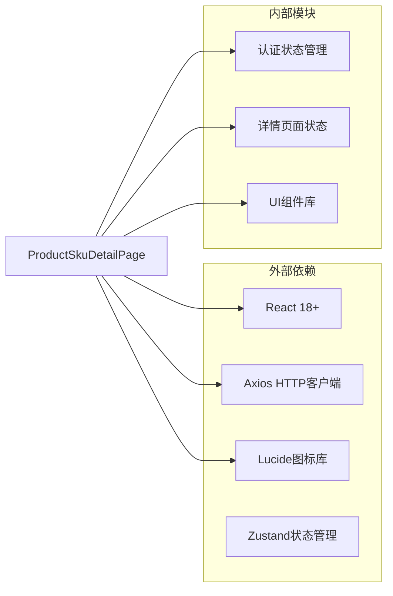

**图表来源**
- [ProductSkuDetailPage.tsx:1-10](file://client/src/components/ProductSkuDetailPage.tsx#L1-L10)

### 服务器端API依赖

服务器端API路由处理复杂的业务逻辑：

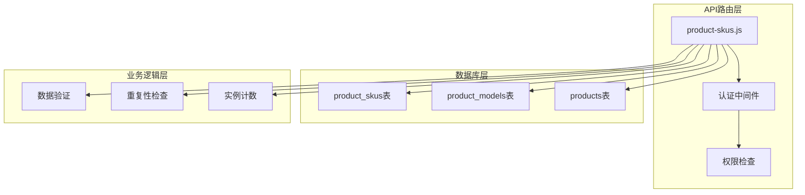

**图表来源**
- [product-skus.js:7-41](file://server/service/routes/product-skus.js#L7-L41)
- [product-skus.js:47-122](file://server/service/routes/product-skus.js#L47-L122)

**章节来源**
- [product-skus.js:7-309](file://server/service/routes/product-skus.js#L7-L309)

## 性能考虑

### 加载优化策略

页面实现了多项性能优化措施：

1. **懒加载机制**：使用React.lazy和Suspense实现组件懒加载
2. **状态缓存**：利用Zustand实现状态持久化存储
3. **条件渲染**：根据用户权限动态渲染功能模块
4. **图片优化**：支持透明背景PNG格式，优化加载速度

### 并发请求处理

页面采用Promise.all并发处理多个API请求：

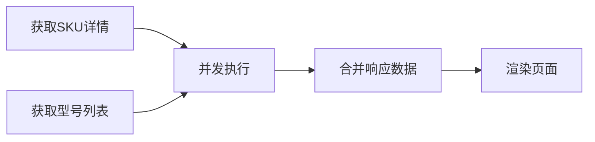

**图表来源**
- [ProductSkuDetailPage.tsx:67-78](file://client/src/components/ProductSkuDetailPage.tsx#L67-L78)

## 故障排除指南

### 常见问题及解决方案

| 问题类型 | 症状 | 解决方案 |
|---------|------|---------|
| 认证失败 | 页面无法加载或显示登录界面 | 检查用户令牌有效性 |
| 数据加载失败 | 显示空白页面或加载指示器 | 检查网络连接和API可用性 |
| 权限不足 | 编辑按钮不可用 | 验证用户角色和部门权限 |
| 图片上传失败 | 上传进度条卡住 | 检查文件格式和大小限制 |

### 错误处理机制

页面实现了完善的错误处理机制：

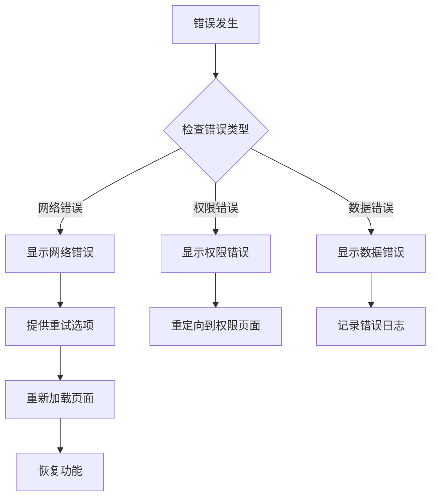

**图表来源**
- [ProductSkuDetailPage.tsx:55-58](file://client/src/components/ProductSkuDetailPage.tsx#L55-L58)
- [ProductSkuDetailPage.tsx:134-138](file://client/src/components/ProductSkuDetailPage.tsx#L134-L138)

**章节来源**
- [ProductSkuDetailPage.tsx:55-58](file://client/src/components/ProductSkuDetailPage.tsx#L55-L58)
- [ProductSkuDetailPage.tsx:134-138](file://client/src/components/ProductSkuDetailPage.tsx#L134-L138)

## 结论

产品SKU详情页面是一个功能完整、架构清晰的现代化Web应用模块。该页面成功实现了以下目标：

1. **用户体验优化**：提供直观的SKU信息展示和编辑功能
2. **权限安全**：实现细粒度的用户权限控制
3. **性能优化**：采用多种技术手段提升页面响应速度
4. **可维护性**：模块化设计便于后续功能扩展

通过前后端分离架构和RESTful API设计，该页面为Longhorn系统的资产管理提供了坚实的技术基础。未来可以进一步优化的方向包括增加更多的搜索过滤功能、改进图片处理算法、增强移动端适配等。