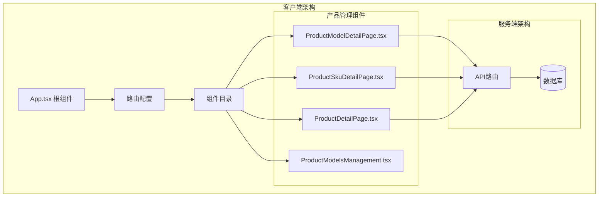
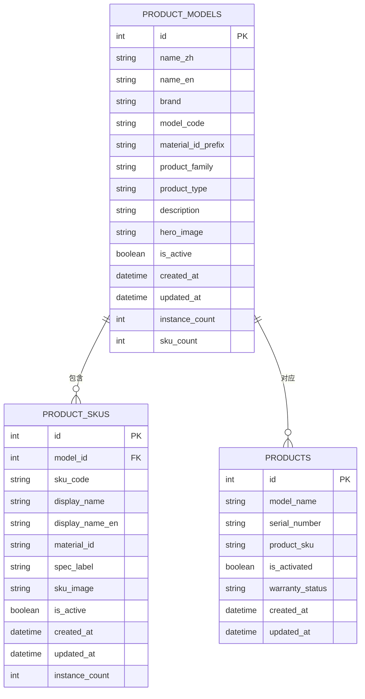
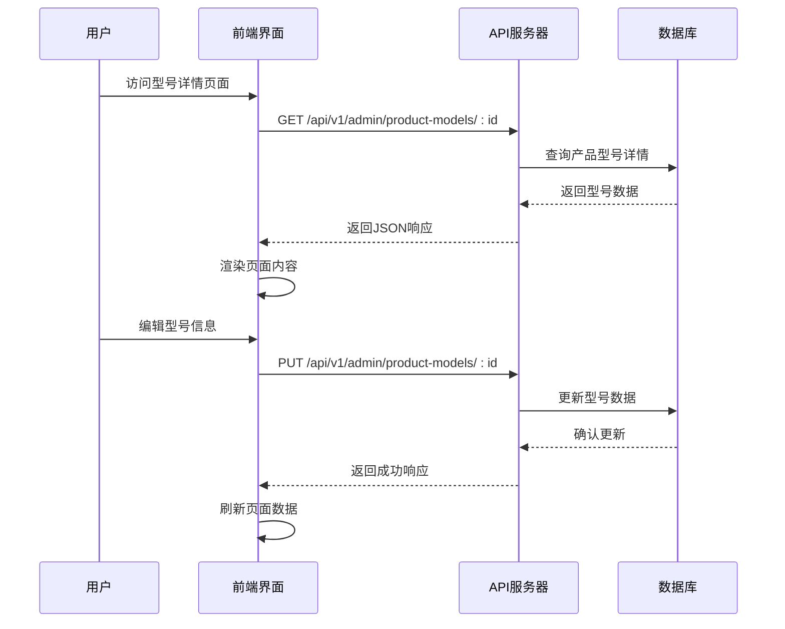
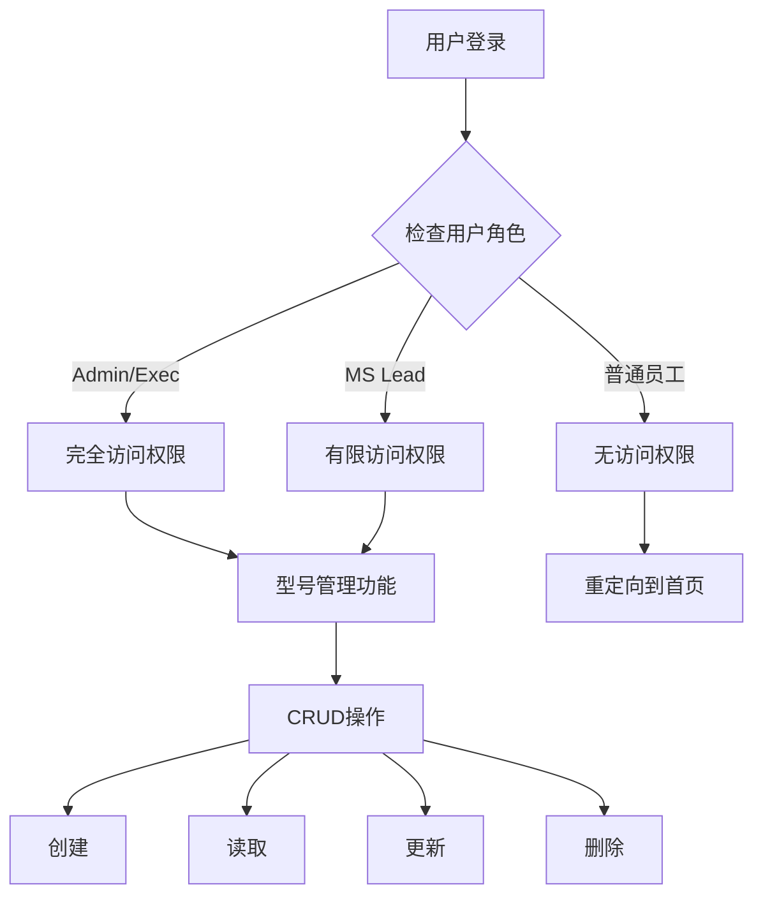
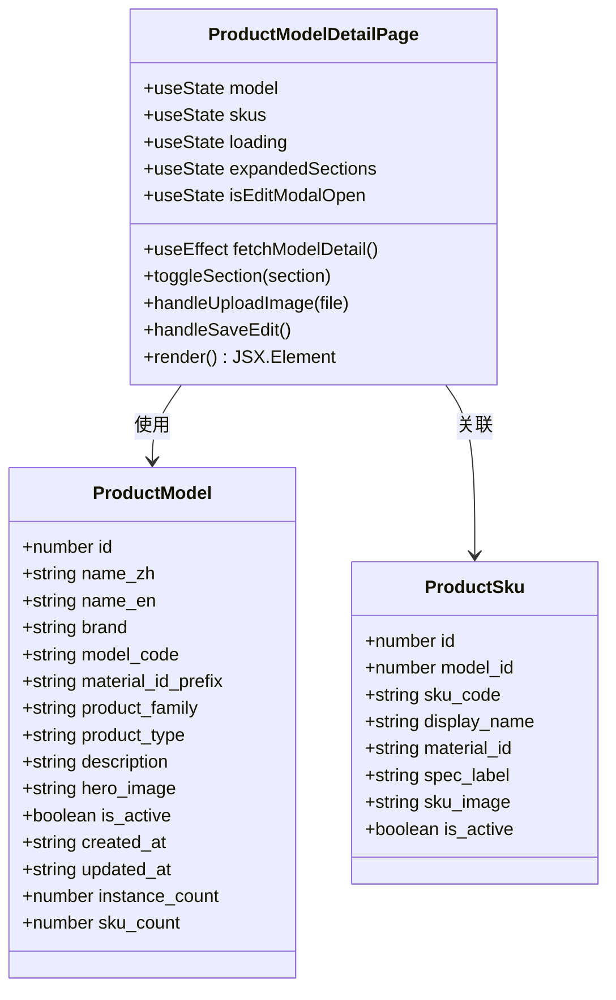
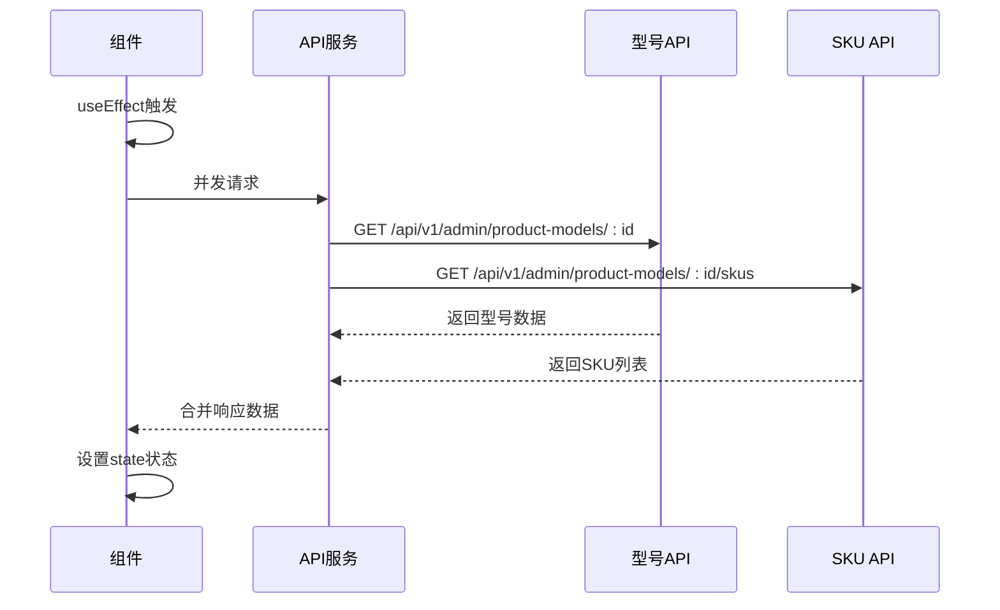
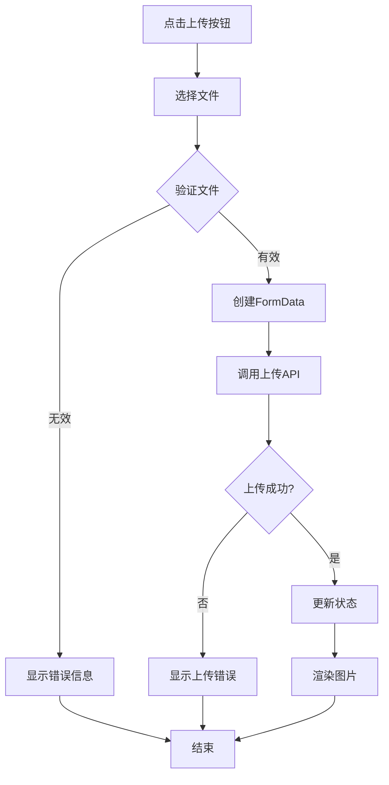
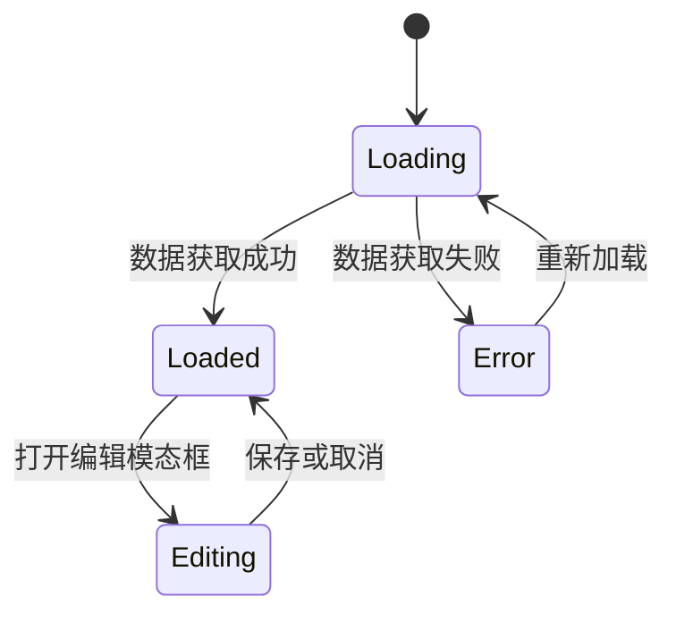
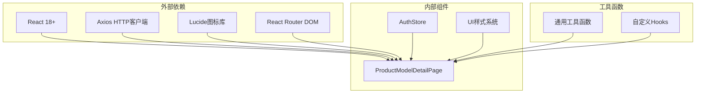

# 产品型号详情页面

<cite>
**本文档引用的文件**
- [ProductModelDetailPage.tsx](file://client/src/components/ProductModelDetailPage.tsx)
- [ProductDetailPage.tsx](file://client/src/components/ProductDetailPage.tsx)
- [ProductSkuDetailPage.tsx](file://client/src/components/ProductSkuDetailPage.tsx)
- [product-models-admin.js](file://server/service/routes/product-models-admin.js)
- [016_add_product_models.sql](file://server/migrations/016_add_product_models.sql)
- [App.tsx](file://client/src/App.tsx)
</cite>

## 目录
1. [简介](#简介)
2. [项目结构](#项目结构)
3. [核心组件](#核心组件)
4. [架构概览](#架构概览)
5. [详细组件分析](#详细组件分析)
6. [依赖关系分析](#依赖关系分析)
7. [性能考虑](#性能考虑)
8. [故障排除指南](#故障排除指南)
9. [结论](#结论)

## 简介

产品型号详情页面是Longhorn服务管理系统中的核心功能模块，用于展示和管理产品的型号信息。该页面提供了完整的型号详情展示、SKU关联管理、图片上传、状态控制等高级功能，是产品管理体系中的重要组成部分。

该页面采用现代化的React技术栈构建，集成了响应式设计、权限控制、数据验证等企业级特性，为用户提供直观、高效的产品型号管理体验。

## 项目结构

Longhorn项目的前端架构采用模块化设计，产品型号详情页面位于客户端组件目录中：

**图表来源**
- [App.tsx:255-266](file://client/src/App.tsx#L255-L266)
- [ProductModelDetailPage.tsx:47-90](file://client/src/components/ProductModelDetailPage.tsx#L47-L90)

**章节来源**
- [App.tsx:255-266](file://client/src/App.tsx#L255-L266)
- [ProductModelDetailPage.tsx:1-50](file://client/src/components/ProductModelDetailPage.tsx#L1-L50)

## 核心组件

产品型号详情页面由多个核心组件协同工作，形成完整的功能体系：

### 主要组件职责

| 组件名称 | 主要功能 | 访问权限 |
|---------|----------|----------|
| ProductModelDetailPage | 型号详情展示与管理 | Admin/Exec/MS Lead |
| ProductSkuDetailPage | SKU详情展示 | Admin/Exec/MS Lead |
| ProductDetailPage | 设备实例详情 | Admin/Exec/MS Lead |
| ProductModelsManagement | 型号列表管理 | Admin/Exec/MS Lead |

### 数据模型结构

**图表来源**
- [016_add_product_models.sql:5-15](file://server/migrations/016_add_product_models.sql#L5-L15)
- [ProductModelDetailPage.tsx:12-28](file://client/src/components/ProductModelDetailPage.tsx#L12-L28)

**章节来源**
- [ProductModelDetailPage.tsx:12-28](file://client/src/components/ProductModelDetailPage.tsx#L12-L28)
- [016_add_product_models.sql:5-15](file://server/migrations/016_add_product_models.sql#L5-L15)

## 架构概览

产品型号详情页面采用前后端分离架构，通过RESTful API进行数据交互：

**图表来源**
- [ProductModelDetailPage.tsx:63-86](file://client/src/components/ProductModelDetailPage.tsx#L63-L86)
- [product-models-admin.js:96-116](file://server/service/routes/product-models-admin.js#L96-L116)

### 权限控制机制

系统采用多层级权限控制，确保只有授权用户才能访问和修改产品型号信息：

**图表来源**
- [product-models-admin.js:19-41](file://server/service/routes/product-models-admin.js#L19-L41)

**章节来源**
- [product-models-admin.js:19-41](file://server/service/routes/product-models-admin.js#L19-L41)

## 详细组件分析

### ProductModelDetailPage 组件

ProductModelDetailPage是产品型号详情页面的核心组件，提供了完整的型号管理功能：

#### 组件架构设计

**图表来源**
- [ProductModelDetailPage.tsx:47-108](file://client/src/components/ProductModelDetailPage.tsx#L47-L108)
- [ProductModelDetailPage.tsx:12-38](file://client/src/components/ProductModelDetailPage.tsx#L12-L38)

#### 核心功能实现

##### 1. 数据获取与处理

组件使用并发请求获取型号详情和关联SKU信息：

**图表来源**
- [ProductModelDetailPage.tsx:63-86](file://client/src/components/ProductModelDetailPage.tsx#L63-L86)

##### 2. 图片上传功能

组件实现了完整的图片上传和预览功能：

**图表来源**
- [ProductModelDetailPage.tsx:141-162](file://client/src/components/ProductModelDetailPage.tsx#L141-L162)

##### 3. 编辑模态框

编辑功能提供了完整的表单管理和数据验证：

| 表单字段 | 类型 | 必填 | 描述 |
|---------|------|------|------|
| name_zh | 文本框 | 是 | 中文产品名称 |
| name_en | 文本框 | 否 | 英文产品名称 |
| model_code | 文本框 | 是 | 型号代码 |
| material_id_prefix | 文本框 | 否 | 物料号前缀 |
| product_family | 下拉框 | 是 | 产品族群 |
| product_type | 下拉框 | 是 | 产品类型 |
| brand | 文本框 | 否 | 品牌 |
| description | 文本域 | 否 | 产品描述 |
| hero_image | 图片上传 | 否 | 主视觉图片 |

**章节来源**
- [ProductModelDetailPage.tsx:47-178](file://client/src/components/ProductModelDetailPage.tsx#L47-L178)

### 产品族群映射系统

系统内置了产品族群映射表，用于标识不同类型的相机产品：

| 族群代码 | 中文名称 | 颜色标识 | 产品类型示例 |
|---------|----------|----------|-------------|
| A | 在售电影机 | #3B82F6 | MAVO Edge系列 |
| B | 历史机型 | #6B7280 | TERRA等停产机型 |
| C | 电子寻像器 | #10B981 | Eagle系列 |
| D | 通用配件 | #8B5CF6 | 存储介质、配件套装 |

### 状态管理机制

组件使用React的useState和useEffect钩子进行状态管理：

**图表来源**
- [ProductModelDetailPage.tsx:52-107](file://client/src/components/ProductModelDetailPage.tsx#L52-L107)

**章节来源**
- [ProductModelDetailPage.tsx:52-107](file://client/src/components/ProductModelDetailPage.tsx#L52-L107)

## 依赖关系分析

### 前端依赖关系

**图表来源**
- [ProductModelDetailPage.tsx:1-11](file://client/src/components/ProductModelDetailPage.tsx#L1-L11)

### 后端API依赖

系统通过RESTful API与后端服务通信：

| API端点 | 方法 | 功能描述 | 权限要求 |
|---------|------|----------|----------|
| /api/v1/admin/product-models/:id | GET | 获取型号详情 | MS员工 |
| /api/v1/admin/product-models/:id/skus | GET | 获取关联SKU列表 | MS员工 |
| /api/v1/admin/product-models/:id | PUT | 更新型号信息 | MS Lead+ |
| /api/v1/admin/product-models/:id | DELETE | 删除型号 | MS Lead+ |
| /api/v1/upload | POST | 图片上传 | 登录用户 |

**章节来源**
- [product-models-admin.js:47-358](file://server/service/routes/product-models-admin.js#L47-L358)

## 性能考虑

### 数据加载优化

1. **并发请求**: 使用Promise.all同时获取型号和SKU数据，减少等待时间
2. **缓存策略**: 利用浏览器缓存和HTTP缓存头
3. **懒加载**: 图片资源按需加载

### 内存管理

1. **状态清理**: 组件卸载时自动清理事件监听器
2. **引用优化**: 使用useRef避免不必要的重渲染
3. **条件渲染**: 根据展开状态动态渲染内容

### 用户体验优化

1. **加载指示器**: 提供清晰的加载状态反馈
2. **错误处理**: 友好的错误提示和恢复机制
3. **响应式设计**: 适配不同屏幕尺寸

## 故障排除指南

### 常见问题及解决方案

| 问题类型 | 症状 | 解决方案 |
|----------|------|----------|
| 页面空白 | 显示加载动画但无内容 | 检查网络连接和API可用性 |
| 编辑失败 | 保存按钮禁用或报错 | 验证必填字段和权限 |
| 图片上传失败 | 上传进度条卡住 | 检查文件格式和大小限制 |
| 权限不足 | 访问被拒绝 | 确认用户角色和部门信息 |

### 调试工具

1. **浏览器开发者工具**: 检查网络请求和JavaScript错误
2. **Redux DevTools**: 调试状态变化（如使用）
3. **Console日志**: 添加关键操作的日志输出

**章节来源**
- [ProductModelDetailPage.tsx:81-85](file://client/src/components/ProductModelDetailPage.tsx#L81-L85)

## 结论

产品型号详情页面是Longhorn系统中功能最完整的产品管理模块之一，具有以下特点：

### 技术优势

1. **完整的CRUD功能**: 支持产品型号的全生命周期管理
2. **权限控制严格**: 多层级权限确保数据安全
3. **用户体验优秀**: 响应式设计和流畅的交互体验
4. **扩展性强**: 模块化设计便于功能扩展

### 业务价值

1. **提升管理效率**: 集中化的型号管理减少了重复工作
2. **保证数据一致性**: 统一的数据模型和验证规则
3. **增强协作能力**: 支持多部门协作和权限分级
4. **降低维护成本**: 自动化的数据同步和状态管理

### 发展建议

1. **性能监控**: 添加详细的性能指标收集
2. **自动化测试**: 建立完整的单元和集成测试体系
3. **文档完善**: 补充详细的API文档和使用指南
4. **移动端优化**: 进一步优化移动端用户体验

该页面为Longhorn系统的数字化转型提供了坚实的技术基础，是产品管理体系的重要支撑。