# 产品管理界面

<cite>
**本文档引用的文件**
- [client/src/components/ProductManagement.tsx](file://client/src/components/ProductManagement.tsx)
- [client/src/components/ProductModelsManagement.tsx](file://client/src/components/ProductModelsManagement.tsx)
- [client/src/components/ProductSkusManagement.tsx](file://client/src/components/ProductSkusManagement.tsx)
- [client/src/components/ProductDetailPage.tsx](file://client/src/components/ProductDetailPage.tsx)
- [client/src/components/ProductDetailModal.tsx](file://client/src/components/ProductDetailModal.tsx)
- [client/src/components/ProductCard.tsx](file://client/src/components/ProductCard.tsx)
- [client/src/components/Workspace/ProductModal.tsx](file://client/src/components/Workspace/ProductModal.tsx)
- [client/src/components/Workspace/ProductSummaryCard.tsx](file://client/src/components/Workspace/ProductSummaryCard.tsx)
- [client/src/components/TicketCard.tsx](file://client/src/components/TicketCard.tsx)
- [client/src/components/Service/ProductWarrantyRegistrationModal.tsx](file://client/src/components/Service/ProductWarrantyRegistrationModal.tsx)
- [client/src/components/Workspace/UnifiedTicketDetail.tsx](file://client/src/components/Workspace/UnifiedTicketDetail.tsx)
- [ios/LonghornApp/Models/Product.swift](file://ios/LonghornApp/Models/Product.swift)
- [server/service/routes/products-admin.js](file://server/service/routes/products-admin.js)
- [server/service/routes/product-models-admin.js](file://server/service/routes/product-models-admin.js)
- [server/service/routes/products.js](file://server/service/routes/products.js)
- [server/migrations/033_product_architecture_upgrade.sql](file://server/migrations/033_product_architecture_upgrade.sql)
- [server/migrations/fix_product_family_names.js](file://server/migrations/fix_product_family_names.js)
- [server/migrations/update_product_families.js](file://server/migrations/update_product_families.js)
- [client/src/store/useAuthStore.ts](file://client/src/store/useAuthStore.ts)
- [client/src/App.tsx](file://client/src/App.tsx)
- [client/src/components/AppRail.tsx](file://client/src/components/AppRail.tsx)
- [docs/Service PRD_P2.md](file://docs/Service PRD_P2.md)
- [docs/Service_DataModel.md](file://docs/Service_DataModel.md)
</cite>

## 更新摘要
**变更内容**
- 新增统一SN状态驱动工作流系统，实现产品入库、保修注册的自动化流程
- ProductModal组件完全替代之前的tabbed界面，采用单页滚动设计
- ProductWarrantyRegistrationModal组件大幅增强，支持发票上传、客户搜索、批量操作
- UI/UX全面改进，采用macOS 26风格设计，增强视觉层次和交互体验
- 新增序列号状态智能识别，支持场景化操作按钮显示

## 目录
1. [简介](#简介)
2. [统一SN状态驱动工作流](#统一sn状态驱动工作流)
3. [三层架构概述](#三层架构概述)
4. [项目结构](#项目结构)
5. [核心组件](#核心组件)
6. [架构概览](#架构概览)
7. [详细组件分析](#详细组件分析)
8. [三层架构详解](#三层架构详解)
9. [UI/UX设计改进](#uiux设计改进)
10. [依赖关系分析](#依赖关系分析)
11. [性能考虑](#性能考虑)
12. [故障排除指南](#故障排除指南)
13. [结论](#结论)

## 简介

产品管理界面是 Longhorn 服务管理系统中的核心功能模块，负责维护和管理所有产品信息。该系统采用三层架构设计，从传统的两层架构升级为产品目录（Model）、商品规格（SKU）和设备台账（Instance）三层架构，以支持更复杂的业务需求和ERP系统集成。

系统支持多平台访问，包括 Web 端和 iOS 移动应用，提供完整的产品生命周期管理功能。三层架构确保了数据的一致性和完整性，支持产品型号、SKU规格和设备实例的精细化管理。

**更新** 本次重大架构升级引入了统一SN状态驱动工作流系统，实现了产品入库、保修注册的智能化管理。ProductModal组件采用全新的单页滚动设计替代之前的tabbed界面，提供更流畅的用户体验。ProductWarrantyRegistrationModal组件增强了发票上传、客户搜索、批量操作等功能，大幅提升了工作效率。

## 统一日志状态驱动工作流

系统引入了基于序列号（SN）状态的统一工作流驱动系统，实现了产品管理的智能化和自动化：

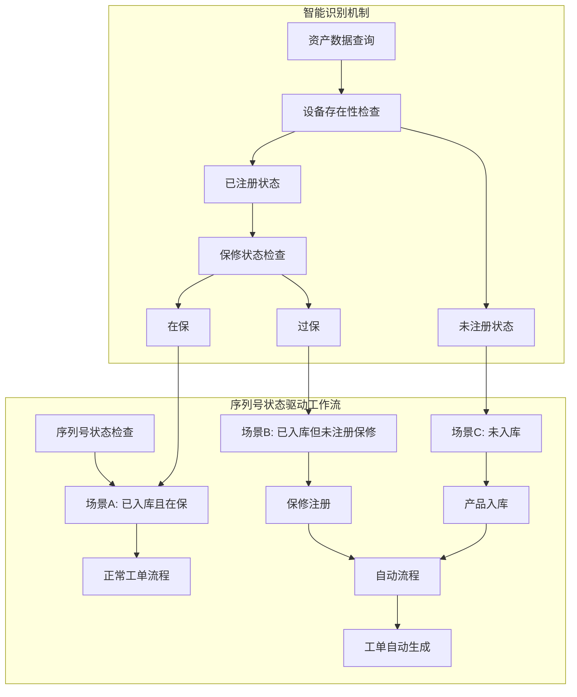

**图表来源**
- [client/src/components/Workspace/UnifiedTicketDetail.tsx:1014-1104](file://client/src/components/Workspace/UnifiedTicketDetail.tsx#L1014-L1104)
- [client/src/components/Service/ProductWarrantyRegistrationModal.tsx:165-206](file://client/src/components/Service/ProductWarrantyRegistrationModal.tsx#L165-L206)

**章节来源**
- [client/src/components/Workspace/UnifiedTicketDetail.tsx:1009-1146](file://client/src/components/Workspace/UnifiedTicketDetail.tsx#L1009-L1146)
- [client/src/components/Service/ProductWarrantyRegistrationModal.tsx:231-246](file://client/src/components/Service/ProductWarrantyRegistrationModal.tsx#L231-L246)

## 三层架构概述

Longhorn 产品管理系统的三层架构设计遵循ERP系统标准，确保与内部业务系统的无缝集成：

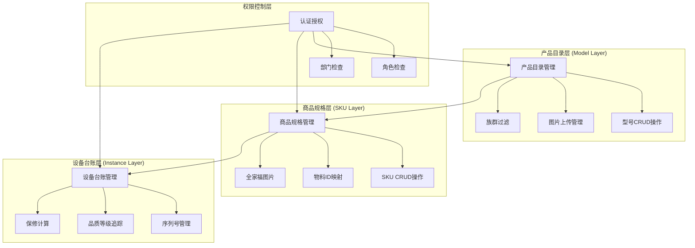

**图表来源**
- [docs/Service PRD_P2.md:716-733](file://docs/Service PRD_P2.md#L716-L733)
- [client/src/components/ProductModelsManagement.tsx:70-298](file://client/src/components/ProductModelsManagement.tsx#L70-L298)
- [client/src/components/ProductSkusManagement.tsx:35-440](file://client/src/components/ProductSkusManagement.tsx#L35-L440)
- [client/src/components/ProductManagement.tsx:77-261](file://client/src/components/ProductManagement.tsx#L77-L261)

**章节来源**
- [docs/Service PRD_P2.md:709-796](file://docs/Service PRD_P2.md#L709-L796)
- [docs/Service_DataModel.md:80-151](file://docs/Service_DataModel.md#L80-L151)

## 项目结构

Longhorn 项目的整体架构采用模块化设计，三层产品架构分布在多个层次中：

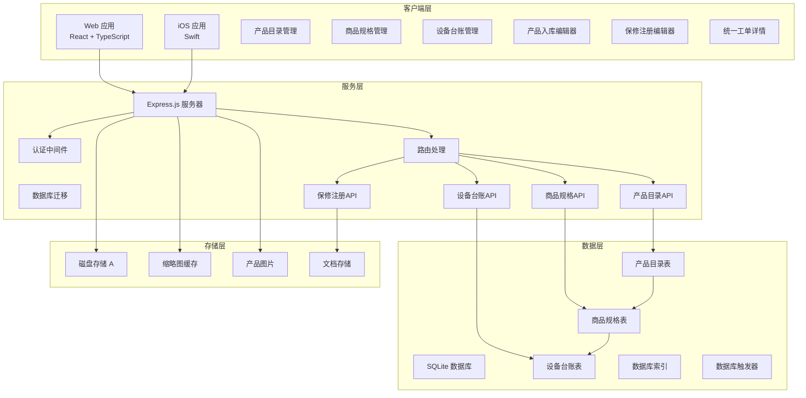

**图表来源**
- [client/src/components/ProductModelsManagement.tsx:1-943](file://client/src/components/ProductModelsManagement.tsx#L1-L943)
- [client/src/components/ProductSkusManagement.tsx:1-440](file://client/src/components/ProductSkusManagement.tsx#L1-L440)
- [client/src/components/ProductManagement.tsx:1-973](file://client/src/components/ProductManagement.tsx#L1-L973)
- [client/src/components/Workspace/ProductModal.tsx:1-495](file://client/src/components/Workspace/ProductModal.tsx#L1-L495)
- [client/src/components/Service/ProductWarrantyRegistrationModal.tsx:1-952](file://client/src/components/Service/ProductWarrantyRegistrationModal.tsx#L1-L952)
- [server/service/routes/product-models-admin.js:1-362](file://server/service/routes/product-models-admin.js#L1-L362)
- [server/service/routes/products-admin.js:1-652](file://server/service/routes/products-admin.js#L1-L652)
- [server/migrations/033_product_architecture_upgrade.sql:1-54](file://server/migrations/033_product_architecture_upgrade.sql#L1-L54)

**章节来源**
- [client/src/components/ProductModelsManagement.tsx:1-50](file://client/src/components/ProductModelsManagement.tsx#L1-L50)
- [client/src/components/ProductSkusManagement.tsx:1-50](file://client/src/components/ProductSkusManagement.tsx#L1-L50)
- [client/src/components/ProductManagement.tsx:1-50](file://client/src/components/ProductManagement.tsx#L1-L50)
- [client/src/components/Workspace/ProductModal.tsx:1-50](file://client/src/components/Workspace/ProductModal.tsx#L1-L50)
- [client/src/components/Service/ProductWarrantyRegistrationModal.tsx:1-50](file://client/src/components/Service/ProductWarrantyRegistrationModal.tsx#L1-L50)
- [server/service/routes/product-models-admin.js:1-34](file://server/service/routes/product-models-admin.js#L1-L34)
- [server/service/routes/products-admin.js:1-34](file://server/service/routes/products-admin.js#L1-L34)

## 核心组件

### 三层架构数据模型

系统定义了完整的三层架构数据模型，确保跨平台的一致性和数据完整性：

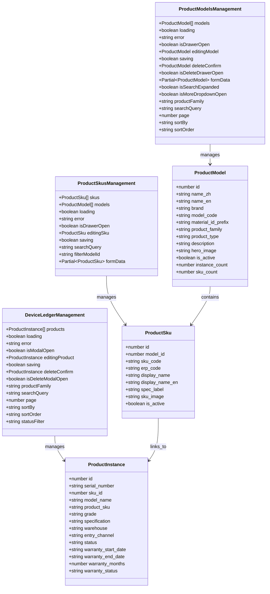

**图表来源**
- [client/src/components/ProductModelsManagement.tsx:14-46](file://client/src/components/ProductModelsManagement.tsx#L14-L46)
- [client/src/components/ProductSkusManagement.tsx:14-34](file://client/src/components/ProductSkusManagement.tsx#L14-L34)
- [client/src/components/ProductManagement.tsx:12-63](file://client/src/components/ProductManagement.tsx#L12-L63)

### 三层架构权限体系

系统采用严格的三层权限控制，确保不同角色只能访问相应的功能：

| 角色 | 产品目录 | 商品规格 | 设备台账 | 权限范围 |
|------|----------|----------|----------|----------|
| Admin | ✅ 完全访问 | ✅ 完全访问 | ✅ 完全访问 | 系统管理员 |
| Exec | ✅ 完全访问 | ✅ 完全访问 | ✅ 完全访问 | 执行董事 |
| MS Lead | ✅ 读取访问 | ✅ 读取访问 | ❌ 限制访问 | 市场部门主管 |
| MS Staff | ✅ 读取访问 | ✅ 读取访问 | ❌ 限制访问 | 市场部门员工 |
| Service Lead | ❌ 限制访问 | ❌ 限制访问 | ✅ 完全访问 | 服务部门主管 |
| Service Staff | ❌ 限制访问 | ❌ 限制访问 | ✅ 读取访问 | 服务部门员工 |

**更新** 新增了三层架构的权限控制体系，确保不同角色只能访问相应的功能模块。产品目录和商品规格的管理权限集中在MS部门，而设备台账的访问权限根据角色和部门进行细分。

**章节来源**
- [server/service/routes/product-models-admin.js:10-41](file://server/service/routes/product-models-admin.js#L10-L41)
- [client/src/components/ProductModelsManagement.tsx:288-291](file://client/src/components/ProductModelsManagement.tsx#L288-L291)
- [client/src/components/ProductSkusManagement.tsx:186-187](file://client/src/components/ProductSkusManagement.tsx#L186-L187)
- [client/src/components/ProductManagement.tsx:247-253](file://client/src/components/ProductManagement.tsx#L247-L253)

## 架构概览

产品管理系统的三层架构采用分层设计，确保功能模块的清晰分离和可维护性：

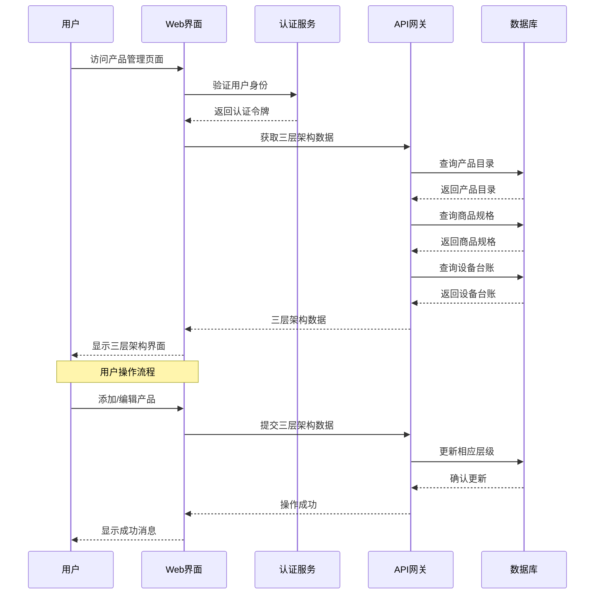

**图表来源**
- [client/src/components/ProductModelsManagement.tsx:117-138](file://client/src/components/ProductModelsManagement.tsx#L117-L138)
- [client/src/components/ProductSkusManagement.tsx:68-94](file://client/src/components/ProductSkusManagement.tsx#L68-L94)
- [client/src/components/ProductManagement.tsx:142-168](file://client/src/components/ProductManagement.tsx#L142-L168)
- [server/service/routes/product-models-admin.js:47-90](file://server/service/routes/product-models-admin.js#L47-L90)
- [server/service/routes/products-admin.js:25-115](file://server/service/routes/products-admin.js#L25-L115)

**章节来源**
- [client/src/App.tsx:180-182](file://client/src/App.tsx#L180-L182)
- [client/src/store/useAuthStore.ts:17-31](file://client/src/store/useAuthStore.ts#L17-L31)

## 详细组件分析

### Web 端三层架构管理界面

Web 端的产品管理界面提供了完整的三层架构 CRUD 功能和用户友好的交互体验，经过重大增强后具有以下特性：

#### 主要功能特性

1. **产品目录管理**
   - 支持产品型号的统一管理
   - 双页签编辑界面（基本信息/SKU体系）
   - 图片上传和管理功能
   - 族群过滤和状态管理

2. **商品规格管理**
   - 支持SKU的精细化管理
   - 物料ID映射和ERP集成
   - 规格标签和全家福图片
   - 与产品目录的关联管理

3. **设备台账管理**
   - 支持序列号和品质等级管理
   - 保修计算和状态追踪
   - 仓库位置和入库渠道管理
   - 三层架构的数据一致性保证

4. **权限控制**
   - 基于角色的三层权限管理
   - 部门级别的访问控制
   - 不同层级的编辑权限分离

#### 界面组件结构

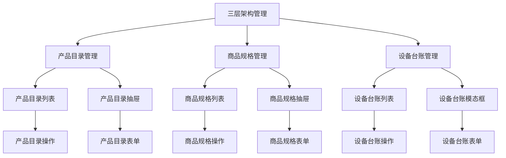

**图表来源**
- [client/src/components/ProductModelsManagement.tsx:300-943](file://client/src/components/ProductModelsManagement.tsx#L300-L943)
- [client/src/components/ProductSkusManagement.tsx:189-440](file://client/src/components/ProductSkusManagement.tsx#L189-L440)
- [client/src/components/ProductManagement.tsx:263-973](file://client/src/components/ProductManagement.tsx#L263-L973)

**章节来源**
- [client/src/components/ProductModelsManagement.tsx:32-218](file://client/src/components/ProductModelsManagement.tsx#L32-L218)
- [client/src/components/ProductSkusManagement.tsx:35-200](file://client/src/components/ProductSkusManagement.tsx#L35-L200)
- [client/src/components/ProductManagement.tsx:32-218](file://client/src/components/ProductManagement.tsx#L32-L218)

### iOS 端产品模型

iOS 端采用了类型安全的 Swift 实现，确保编译时的数据完整性：

#### 数据模型设计

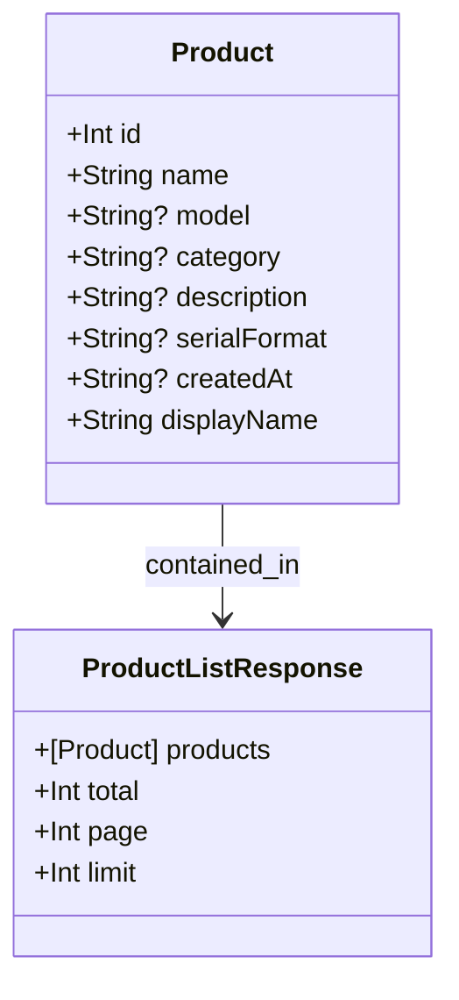

**图表来源**
- [ios/LonghornApp/Models/Product.swift:11-42](file://ios/LonghornApp/Models/Product.swift#L11-L42)

**章节来源**
- [ios/LonghornApp/Models/Product.swift:1-42](file://ios/LonghornApp/Models/Product.swift#L1-L42)

### 服务端三层架构 API 设计

服务端提供了完整的三层架构 RESTful API 接口，支持产品管理的所有核心功能：

#### 产品目录 API 端点设计

| 端点 | 方法 | 描述 | 权限要求 | 参数 |
|------|------|------|----------|------|
| `/api/v1/admin/product-models` | GET | 获取产品目录列表 | MS Staff | `product_family`, `keyword` |
| `/api/v1/admin/product-models` | POST | 创建新产品目录 | MS Lead+ | 产品目录数据 |
| `/api/v1/admin/product-models/:id` | GET | 获取单个产品目录详情 | MS Staff | - |
| `/api/v1/admin/product-models/:id` | PUT | 更新产品目录信息 | MS Lead+ | 产品目录数据 |
| `/api/v1/admin/product-models/:id` | DELETE | 删除产品目录 | MS Lead+ | - |
| `/api/v1/admin/product-models/:id/skus` | GET | 获取产品目录的SKU列表 | MS Staff | - |

**更新** 新增了专门的产品目录管理 API，支持三层架构中的第一层管理功能。

**章节来源**
- [server/service/routes/product-models-admin.js:47-200](file://server/service/routes/product-models-admin.js#L47-L200)

#### 商品规格 API 端点设计

| 端点 | 方法 | 描述 | 权限要求 | 参数 |
|------|------|------|----------|------|
| `/api/v1/admin/product-skus` | GET | 获取商品规格列表 | MS Staff | `model_id`, `keyword` |
| `/api/v1/admin/product-skus` | POST | 创建新商品规格 | MS Lead+ | 商品规格数据 |
| `/api/v1/admin/product-skus/:id` | GET | 获取单个商品规格详情 | MS Staff | - |
| `/api/v1/admin/product-skus/:id` | PUT | 更新商品规格信息 | MS Lead+ | 商品规格数据 |
| `/api/v1/admin/product-skus/:id` | DELETE | 删除商品规格 | MS Lead+ | - |

**更新** 新增了专门的商品规格管理 API，支持三层架构中的第二层管理功能。

**章节来源**
- [server/service/routes/product-models-admin.js:200-362](file://server/service/routes/product-models-admin.js#L200-L362)

#### 设备台账 API 端点设计

| 端点 | 方法 | 描述 | 权限要求 | 参数 |
|------|------|------|----------|------|
| `/api/v1/admin/products` | GET | 获取设备台账列表 | Service Staff | `product_family`, `keyword`, `status` |
| `/api/v1/admin/products` | POST | 创建新设备台账 | Service Lead+ | 设备台账数据 |
| `/api/v1/admin/products/:id` | GET | 获取单个设备台账详情 | Service Staff | - |
| `/api/v1/admin/products/:id` | PUT | 更新设备台账信息 | Service Lead+ | 设备台账数据 |
| `/api/v1/admin/products/:id` | DELETE | 删除设备台账 | Service Lead+ | - |
| `/api/v1/admin/products/:id/tickets` | GET | 获取设备关联的工单列表 | Service Staff | `page`, `page_size` |

**更新** 设备台账 API 支持三层架构中的第三层管理功能，包含完整的 CRUD 操作和工单关联。

**章节来源**
- [server/service/routes/products-admin.js:25-652](file://server/service/routes/products-admin.js#L25-L652)

### 数据库三层架构设计

系统使用 SQLite 作为主要数据存储，三层架构通过规范化设计实现高效查询：

#### 产品目录表结构

| 字段名 | 类型 | 描述 | 约束 |
|--------|------|------|------|
| id | INTEGER | 产品目录唯一标识符 | PRIMARY KEY |
| name_zh | TEXT | 中文产品名称 | NOT NULL |
| name_en | TEXT | 英文产品名称 |  |
| brand | TEXT | 品牌信息 | DEFAULT 'Kinefinity' |
| model_code | TEXT | 产品型号代码 | UNIQUE |
| material_id_prefix | TEXT | ERP物料ID前缀 |  |
| product_family | TEXT | 产品族群 | A/B/C/D |
| product_type | TEXT | 产品类型 |  |
| description | TEXT | 产品描述 |  |
| hero_image | TEXT | 主视觉图片URL |  |
| is_active | BOOLEAN | 是否启用 | DEFAULT TRUE |
| created_at | DATETIME | 创建时间 | DEFAULT CURRENT_TIMESTAMP |
| updated_at | DATETIME | 更新时间 | DEFAULT CURRENT_TIMESTAMP |

**更新** 产品目录表新增了品牌、英文名称、物料ID前缀和主视觉图片等字段，支持三层架构的完整数据结构。

**章节来源**
- [server/migrations/033_product_architecture_upgrade.sql:23-28](file://server/migrations/033_product_architecture_upgrade.sql#L23-L28)

#### 商品规格表结构

| 字段名 | 类型 | 描述 | 约束 |
|--------|------|------|------|
| id | INTEGER | 商品规格唯一标识符 | PRIMARY KEY |
| model_id | INTEGER | 关联产品目录ID | NOT NULL, FOREIGN KEY |
| sku_code | TEXT | 商品编码(A系列) | UNIQUE NOT NULL |
| erp_code | TEXT | ERP物料编码(9系列) |  |
| display_name | TEXT | 显示名称 | NOT NULL |
| display_name_en | TEXT | 英文显示名称 |  |
| spec_label | TEXT | 规格标签 |  |
| sku_image | TEXT | SKU图片URL |  |
| is_active | BOOLEAN | 是否启用 | DEFAULT TRUE |
| created_at | DATETIME | 创建时间 | DEFAULT CURRENT_TIMESTAMP |
| updated_at | DATETIME | 更新时间 | DEFAULT CURRENT_TIMESTAMP |

**更新** 商品规格表作为产品目录和设备台账之间的桥梁，支持SKU的精细化管理和ERP系统集成。

**章节来源**
- [server/migrations/033_product_architecture_upgrade.sql:5-18](file://server/migrations/033_product_architecture_upgrade.sql#L5-L18)

#### 设备台账表结构

| 字段名 | 类型 | 描述 | 约束 |
|--------|------|------|------|
| id | INTEGER | 设备台账唯一标识符 | PRIMARY KEY |
| serial_number | TEXT | 序列号 | UNIQUE |
| sku_id | INTEGER | 关联商品规格ID | FOREIGN KEY |
| model_name | TEXT | 产品型号 |  |
| product_sku | TEXT | 商品SKU |  |
| grade | TEXT | 品质等级 | DEFAULT 'A' |
| specification | TEXT | 规格描述 |  |
| warehouse | TEXT | 仓库位置 |  |
| entry_channel | TEXT | 入库渠道 |  |
| status | TEXT | 设备状态 | DEFAULT 'ACTIVE' |
| warranty_start_date | DATE | 保修开始日期 |  |
| warranty_end_date | DATE | 保修结束日期 |  |
| warranty_months | INTEGER | 保修月份 | DEFAULT 24 |
| warranty_status | TEXT | 保修状态 | DEFAULT 'ACTIVE' |
| created_at | DATETIME | 创建时间 | DEFAULT CURRENT_TIMESTAMP |
| updated_at | DATETIME | 更新时间 | DEFAULT CURRENT_TIMESTAMP |

**更新** 设备台账表支持序列号、品质等级、仓库位置和保修计算等完整功能，实现三层架构的最终层管理。

**章节来源**
- [server/migrations/033_product_architecture_upgrade.sql:30-36](file://server/migrations/033_product_architecture_upgrade.sql#L30-L36)

### 数据库三层架构迁移

系统通过数据库迁移确保三层架构的数据一致性：

#### 数据库迁移结构

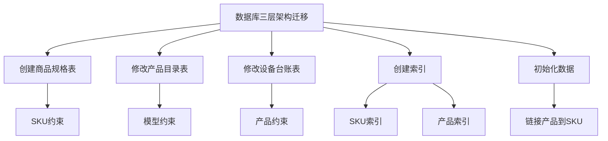

**图表来源**
- [server/migrations/033_product_architecture_upgrade.sql:1-54](file://server/migrations/033_product_architecture_upgrade.sql#L1-L54)

**章节来源**
- [server/migrations/033_product_architecture_upgrade.sql:1-54](file://server/migrations/033_product_architecture_upgrade.sql#L1-L54)

### 产品详情展示组件

系统新增了三层架构的详细产品信息展示组件：

#### 产品详情页面特性

1. **三层架构信息展示**
   - 产品目录基本信息（型号、品牌、族群）
   - 商品规格详细信息（SKU、物料ID、规格标签）
   - 设备台账状态信息（序列号、品质等级、仓库位置）

2. **交互功能**
   - 三层架构信息的分层展示
   - 更多操作菜单（编辑、状态变更、删除）
   - 删除确认对话框

3. **统计信息展示**
   - 咨询工单数量
   - RMA返厂数量
   - 维修记录数量

**章节来源**
- [client/src/components/ProductDetailPage.tsx:62-764](file://client/src/components/ProductDetailPage.tsx#L62-L764)

### 产品详情模态框组件

新增了三层架构的详细产品信息模态框组件：

#### 产品详情模态框特性

1. **三层架构双标签页编辑界面**
   - 基本信息标签页：型号、SKU、序列号、生产日期、固件版本
   - 业务信息标签页：设备状态、销售渠道、保修信息

2. **综合信息展示**
   - 产品目录、商品规格、设备台账的完整信息链
   - 关联服务工单统计和详细列表
   - 保修计算引擎结果展示

3. **交互功能**
   - 三层架构信息的详细展示
   - 保修计算详情模态框
   - 工单列表的详细展示

**章节来源**
- [client/src/components/ProductDetailModal.tsx:80-652](file://client/src/components/ProductDetailModal.tsx#L80-L652)

### 产品摘要卡片组件

新增了三层架构的产品摘要卡片组件：

#### 产品摘要卡片特性

1. **简洁设计**
   - 黄色主题配色，突出显示
   - 产品型号、序列号、族群信息
   - IoT设备和保修状态徽章

2. **三层架构信息**
   - 产品目录、商品规格、设备台账的快速概览
   - 三层架构数据的一致性展示

3. **交互反馈**
   - 悬停效果和边框变化
   - 清晰的状态指示

**章节来源**
- [client/src/components/Workspace/ProductSummaryCard.tsx:25-105](file://client/src/components/Workspace/ProductSummaryCard.tsx#L25-L105)

### 产品卡片组件

新增了三层架构的产品卡片组件：

#### 产品卡片特性

1. **简洁设计**
   - 深色背景，扁平化设计
   - 包装图标和产品名称
   - 序列号显示
   - 保修状态徽章

2. **三层架构信息**
   - 产品目录、商品规格、设备台账的简化展示
   - 三层架构数据的快速浏览

3. **交互反馈**
   - 鼠标悬停效果
   - 边框颜色变化
   - 点击事件支持

**章节来源**
- [client/src/components/ProductCard.tsx:4-67](file://client/src/components/ProductCard.tsx#L4-L67)

### 产品编辑模态框组件

**更新** ProductModal组件完全替代了之前的tabbed界面，采用全新的单页滚动设计：

#### 产品编辑模态框特性

1. **统一SN状态驱动**
   - 智能识别序列号状态（已入库/未入库、在保/过保）
   - 根据状态显示相应的操作按钮
   - 自动跳转到对应的操作流程

2. **单页滚动设计**
   - 产品信息、产品分类、补充信息、保修信息集中在一个页面
   - 可折叠的补充信息区域
   - 流畅的滚动体验

3. **智能表单验证**
   - 序列号必填验证
   - 型号选择验证
   - 产品线和族群验证
   - 状态和销售渠道验证

4. **集成保修注册**
   - 内置保修注册按钮
   - 自动传递预填数据
   - 无缝跳转到保修注册流程

**章节来源**
- [client/src/components/Workspace/ProductModal.tsx:59-342](file://client/src/components/Workspace/ProductModal.tsx#L59-L342)

### 工单卡片组件

新增了通用的工单卡片组件，支持三层架构：

#### 工单卡片特性

1. **多类型支持**
   - 咨询工单（蓝色主题）
   - RMA工单（橙色主题）
   - 经销商维修（紫色主题）

2. **三层架构关联**
   - 工单与设备台账的关联
   - 产品目录和商品规格的上下文信息
   - 三层架构数据的完整展示

3. **状态管理**
   - 多语言状态翻译
   - 颜色编码的状态指示
   - 点击跳转到工单详情

4. **信息展示**
   - 工单编号和类型
   - 标题和状态
   - 产品型号和客户信息

**章节来源**
- [client/src/components/TicketCard.tsx:53-167](file://client/src/components/TicketCard.tsx#L53-L167)

### 保修注册模态框组件

**更新** ProductWarrantyRegistrationModal组件大幅增强，支持发票上传、客户搜索、批量操作：

#### 保修注册模态框特性

1. **智能场景识别**
   - 自动识别未入库、已入库但未注册、已入库且在保三种场景
   - 根据场景显示相应的操作按钮
   - 提供一键修正功能

2. **发票上传功能**
   - 支持JPG、PNG、PDF格式
   - 最大5MB文件限制
   - 实时文件验证和错误提示

3. **客户搜索功能**
   - 支持关键词搜索客户
   - 实时搜索结果展示
   - 下拉选择框集成

4. **批量操作支持**
   - 支持多个产品的批量保修注册
   - 统一的发票上传和备注填写
   - 操作结果统一反馈

5. **预填数据传递**
   - 从ProductModal传递产品线、族群、SKU等预填数据
   - 自动生成销售日期和保修期限
   - 减少重复输入

**章节来源**
- [client/src/components/Service/ProductWarrantyRegistrationModal.tsx:1-800](file://client/src/components/Service/ProductWarrantyRegistrationModal.tsx#L1-L800)

### 统一工单详情组件

**更新** UnifiedTicketDetail组件集成了统一SN状态驱动工作流：

#### 统一工单详情特性

1. **智能序列号处理**
   - 自动查询序列号对应的设备信息
   - 智能识别设备状态和保修状态
   - 根据状态显示相应的操作按钮

2. **场景化操作**
   - 未入库设备：显示"产品入库"按钮
   - 已入库但未注册：显示"注册保修"按钮
   - 已入库且在保：显示"在保"状态
   - 已入库但过保：显示"过保"状态

3. **一键修正功能**
   - 检测到型号不匹配时显示修正按钮
   - 支持快速修正工单中的产品型号
   - 提供审计差异展示

4. **工作流集成**
   - 与产品入库、保修注册流程无缝集成
   - 自动刷新相关数据
   - 提供操作反馈

**章节来源**
- [client/src/components/Workspace/UnifiedTicketDetail.tsx:1009-1146](file://client/src/components/Workspace/UnifiedTicketDetail.tsx#L1009-L1146)

## 三层架构详解

### 产品目录（Model）层

产品目录层是三层架构的基础层，负责产品型号的统一管理：

#### 核心功能
- 产品型号定义和管理
- 品牌和族群信息维护
- 主视觉图片管理
- 产品类型和规格定义

#### 数据结构
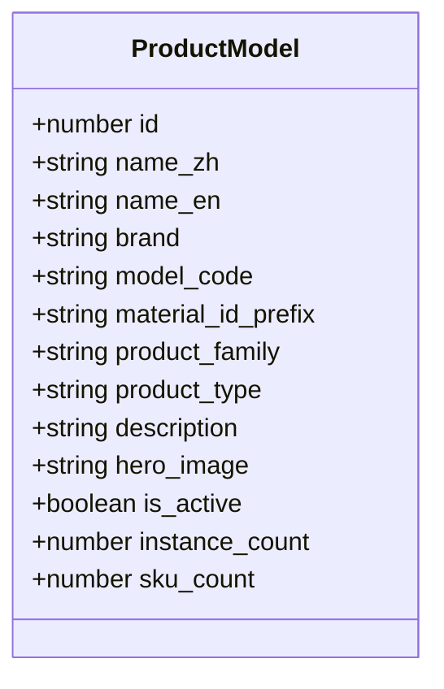

**图表来源**
- [client/src/components/ProductModelsManagement.tsx:14-32](file://client/src/components/ProductModelsManagement.tsx#L14-L32)

### 商品规格（SKU）层

商品规格层是三层架构的桥梁层，连接产品目录和设备台账：

#### 核心功能
- 商品规格定义和管理
- 物料ID映射和ERP集成
- 规格标签和全家福图片
- 与产品目录的关联管理

#### 数据结构
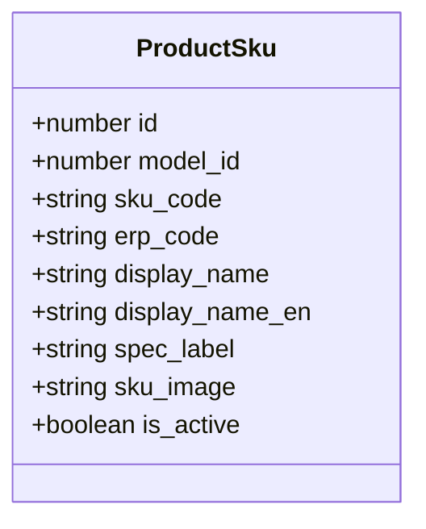

**图表来源**
- [client/src/components/ProductSkusManagement.tsx:34-45](file://client/src/components/ProductSkusManagement.tsx#L34-L45)

### 设备台账（Instance）层

设备台账层是三层架构的最终层，管理具体的设备实例：

#### 核心功能
- 序列号和品质等级管理
- 仓库位置和入库渠道管理
- 保修计算和状态追踪
- 与商品规格的关联

#### 数据结构
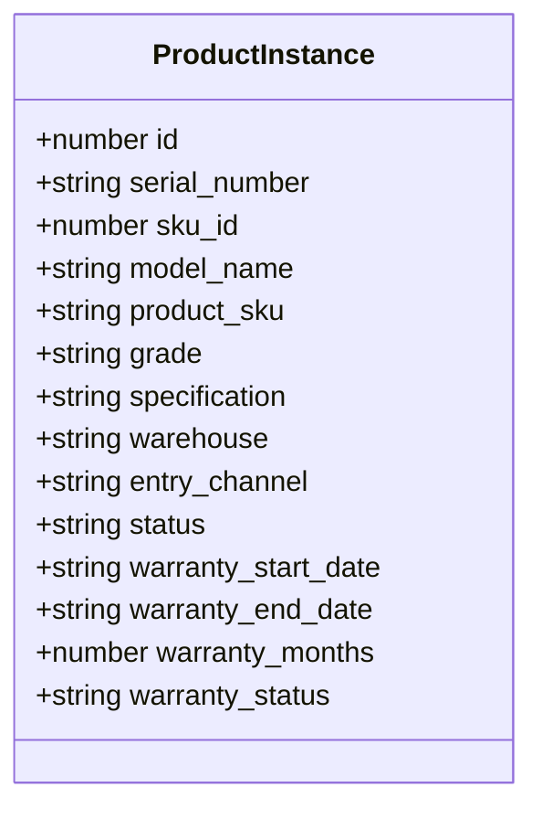

**图表来源**
- [client/src/components/ProductManagement.tsx:12-63](file://client/src/components/ProductManagement.tsx#L12-L63)

## UI/UX设计改进

### macOS 26风格设计

系统采用了全新的macOS 26风格设计，提供现代化的视觉体验：

#### 设计特色

1. **玻璃拟态效果**
   - 使用半透明背景和模糊滤镜
   - 深色和浅色主题自动切换
   - 平滑的过渡动画效果

2. **统一色彩系统**
   - 采用Kine黄作为主色调
   - 渐变色彩应用于重要元素
   - 状态颜色标准化（成功、警告、危险）

3. **响应式布局**
   - 支持桌面和移动设备
   - 自适应网格系统
   - 触摸友好的交互元素

#### 组件设计规范

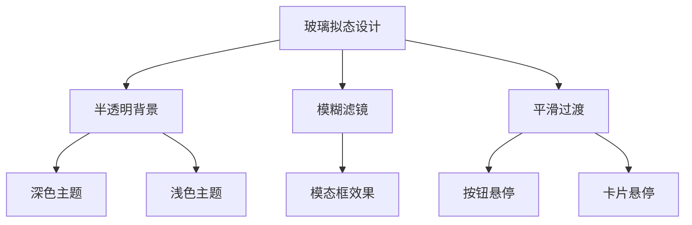

**图表来源**
- [client/src/index.css:1-2031](file://client/src/index.css#L1-L2031)

**章节来源**
- [client/src/index.css:1-2031](file://client/src/index.css#L1-L2031)

### 交互体验优化

#### 1. 智能表单验证
- 实时表单验证和错误提示
- 必填字段高亮显示
- 输入格式自动校正

#### 2. 加载状态管理
- 进度指示器和骨架屏
- 网络错误自动重试
- 加载超时处理

#### 3. 用户反馈机制
- 成功操作确认提示
- 失败原因详细说明
- 操作撤销功能

#### 4. 键盘快捷键支持
- 常用操作快捷键
- 导航快捷键
- 表单快捷键

**章节来源**
- [client/src/components/Workspace/ProductModal.tsx:131-169](file://client/src/components/Workspace/ProductModal.tsx#L131-L169)
- [client/src/components/Service/ProductWarrantyRegistrationModal.tsx:307-399](file://client/src/components/Service/ProductWarrantyRegistrationModal.tsx#L307-L399)

## 依赖关系分析

三层架构的依赖关系体现了清晰的分层设计：

```mermaid
graph TB
subgraph "表现层"
PM[ProductManagement.tsx]
PMM[ProductModelsManagement.tsx]
PSM[ProductSkusManagement.tsx]
PDM[ProductDetailModal.tsx]
PDP[ProductDetailPage.tsx]
PC[ProductCard.tsx]
PM2[ProductModal.tsx]
PSC[ProductSummaryCard.tsx]
TC[TicketCard.tsx]
WarrantyModal[ProductWarrantyRegistrationModal.tsx]
UnifiedTicket[UnifiedTicketDetail.tsx]
AR[AppRail.tsx]
end
subgraph "状态管理层"
AS[useAuthStore.ts]
end
subgraph "路由层"
APP[App.tsx]
end
subgraph "服务层"
PRA[products-admin.js]
PMA[product-models-admin.js]
PR[products.js]
WRA[warranty.js]
MIG[migrations]
end
subgraph "数据层"
DB[SQLite 数据库]
PM_TABLE[产品目录表]
PS_TABLE[商品规格表]
P_TABLE[设备台账表]
INDEXES[数据库索引]
TRIGGERS[数据库触发器]
END_USERS[终端用户表]
DEALERS[经销商表]
ACCOUNTS[账户表]
end
AS --> APP
APP --> PM
APP --> PMM
APP --> PSM
PRA --> DB
PMA --> DB
PR --> DB
WRA --> END_USERS
WRA --> DEALERS
WRA --> ACCOUNTS
MIG --> INDEXES
MIG --> TRIGGERS
PM2 --> WarrantyModal
UnifiedTicket --> WarrantyModal
```

**图表来源**
- [client/src/components/ProductModelsManagement.tsx:1-10](file://client/src/components/ProductModelsManagement.tsx#L1-L10)
- [client/src/components/ProductSkusManagement.tsx:1-10](file://client/src/components/ProductSkusManagement.tsx#L1-L10)
- [client/src/components/ProductManagement.tsx:1-10](file://client/src/components/ProductManagement.tsx#L1-L10)
- [client/src/components/Workspace/ProductModal.tsx:1-5](file://client/src/components/Workspace/ProductModal.tsx#L1-L5)
- [client/src/components/Service/ProductWarrantyRegistrationModal.tsx:1-5](file://client/src/components/Service/ProductWarrantyRegistrationModal.tsx#L1-L5)
- [client/src/store/useAuthStore.ts:1-15](file://client/src/store/useAuthStore.ts#L1-L15)

**章节来源**
- [client/src/App.tsx:48-52](file://client/src/App.tsx#L48-L52)
- [client/src/components/AppRail.tsx:1-20](file://client/src/components/AppRail.tsx#L1-L20)

## 性能考虑

### 数据加载优化

1. **分页机制**：三层架构中各层都支持分页机制，减少一次性数据传输量
2. **条件查询**：支持按产品族群、关键字和状态精确过滤
3. **缓存策略**：利用浏览器缓存和 HTTP ETag 处理重复请求
4. **懒加载优化**：搜索框展开时才触发焦点事件
5. **数据库索引优化**：为三层架构的关键字段创建索引提升查询性能

### 前端性能优化

1. **虚拟滚动**：对于大量数据时可考虑实现虚拟滚动
2. **懒加载**：图片和附件采用懒加载策略
3. **状态管理**：使用 React Hooks 和 Zustand 优化状态更新
4. **事件委托优化**：点击外部关闭下拉菜单的事件处理
5. **三层架构缓存**：产品目录、商品规格、设备台账的独立缓存

### 后端性能优化

1. **索引优化**：为三层架构的常用查询字段建立数据库索引
2. **查询优化**：使用参数化查询防止 SQL 注入
3. **连接池**：合理配置数据库连接池大小
4. **三层架构优化**：预计算三层架构关联数据避免复杂联接查询
5. **权限控制优化**：基于角色的权限检查减少不必要的查询

### 工作流性能优化

1. **序列号状态缓存**：缓存序列号状态查询结果
2. **智能跳转**：根据状态直接跳转到对应操作页面
3. **批量处理**：支持多个产品的批量操作
4. **异步处理**：发票上传和数据同步采用异步方式
5. **错误恢复**：网络中断时自动重试和状态恢复

## 故障排除指南

### 常见问题及解决方案

#### 1. 权限访问问题
**症状**：无法访问产品管理功能
**原因**：用户角色不是 Admin、Exec 或 MS Lead
**解决方案**：检查用户角色配置或联系系统管理员

#### 2. 产品删除失败
**症状**：尝试删除产品时报错
**原因**：产品关联到工单记录
**解决方案**：先清理相关工单再删除产品

#### 3. 数据同步问题
**症状**：产品信息显示不一致
**原因**：缓存未及时更新
**解决方案**：刷新页面或清除浏览器缓存

#### 4. 移动端显示异常
**症状**：iOS 应用中产品列表显示错误
**原因**：数据模型映射问题
**解决方案**：检查 JSON 序列化配置

#### 5. 三层架构数据不一致
**症状**：产品目录、商品规格、设备台账数据不匹配
**原因**：数据库约束未正确设置
**解决方案**：运行三层架构迁移脚本

#### 6. 商品规格关联错误
**症状**：设备台账无法正确关联到商品规格
**原因**：SKU代码不匹配或外键约束问题
**解决方案**：检查SKU代码格式和外键关系

#### 7. 产品目录权限控制失效
**症状**：非MS部门人员可以访问产品目录
**原因**：权限检查逻辑错误
**解决方案**：检查权限中间件配置

#### 8. 设备台账查询性能问题
**症状**：设备台账列表加载缓慢
**原因**：缺少必要的数据库索引
**解决方案**：创建SKU ID和状态字段的索引

#### 9. 三层架构权限冲突
**症状**：用户权限与预期不符
**原因**：角色和部门权限配置错误
**解决方案**：检查用户角色和部门代码配置

#### 10. 序列号状态识别错误
**症状**：序列号状态显示不正确
**原因**：资产数据查询失败或缓存过期
**解决方案**：检查网络连接和重新查询资产数据

#### 11. 保修注册发票上传失败
**症状**：发票上传后状态不更新
**原因**：文件格式不支持或网络超时
**解决方案**：检查文件格式和网络连接，重新上传

#### 12. 工单自动跳转问题
**症状**：工单详情页面无法自动跳转到对应操作
**原因**：序列号状态查询失败或权限不足
**解决方案**：检查序列号状态和用户权限

**章节来源**
- [client/src/components/ProductManagement.tsx:176-197](file://client/src/components/ProductManagement.tsx#L176-L197)
- [client/src/components/Workspace/ProductModal.tsx:131-169](file://client/src/components/Workspace/ProductModal.tsx#L131-L169)
- [client/src/components/Service/ProductWarrantyRegistrationModal.tsx:285-305](file://client/src/components/Service/ProductWarrantyRegistrationModal.tsx#L285-L305)
- [server/service/routes/products-admin.js:335-394](file://server/service/routes/products-admin.js#L335-L394)
- [server/migrations/033_product_architecture_upgrade.sql:38-41](file://server/migrations/033_product_architecture_upgrade.sql#L38-L41)

## 结论

产品管理界面作为 Longhorn 系统的核心功能模块，经过从两层架构到三层架构的重大升级后，成功实现了与ERP系统的深度对齐和更精细的产品管理能力。系统采用现代化的三层架构设计，提供了更加专业和高效的产品管理体验。

### 主要优势

1. **统一SN状态驱动工作流**：实现了产品入库、保修注册的智能化管理，大幅提升了工作效率
2. **ProductModal组件优化**：采用单页滚动设计替代tabbed界面，提供更流畅的用户体验
3. **ProductWarrantyRegistrationModal增强**：支持发票上传、客户搜索、批量操作等功能
4. **UI/UX全面改进**：采用macOS 26风格设计，提供现代化的视觉体验
5. **三层架构完整性**：实现了产品目录、商品规格、设备台账的完整三层架构
6. **ERP系统对齐**：与内部ERP系统的9系列（物料代码）和A系列（商品SKU）深度对齐
7. **权限控制严格**：基于角色和部门的三层权限管理体系
8. **数据一致性保证**：通过数据库约束和触发器确保三层架构数据的一致性
9. **跨平台兼容**：同时支持 Web 和 iOS 平台
10. **性能优化完善**：针对三层架构的查询优化和缓存策略

### 技术亮点

1. **前后端分离**：三层架构的清晰职责划分和接口设计
2. **状态管理**：使用现代 React Hooks 和 Zustand 管理三层架构状态
3. **数据库设计**：合理的三层架构表结构和索引策略
4. **错误处理**：完善的三层架构错误处理和用户反馈机制
5. **权限控制**：基于角色和部门的严格权限检查机制
6. **数据迁移**：完整的三层架构数据迁移和兼容性保证
7. **性能监控**：三层架构的查询优化和性能监控
8. **组件化设计**：模块化的三层架构组件便于维护
9. **国际化支持**：三层架构的多语言状态和错误信息显示
10. **安全保障**：三层架构的权限控制和数据安全保护
11. **工作流集成**：统一SN状态驱动工作流系统
12. **智能表单验证**：实时表单验证和错误提示机制

经过三层架构的重大升级和UI/UX改进，产品管理界面不仅保持了原有的稳定性和可靠性，还显著提升了用户体验、功能完整性和系统性能。该系统为 Longhorn 系统提供了坚实的三层架构基础，支持后续的功能扩展和业务发展需求，实现了与企业级ERP系统的无缝集成。