# 产品管理界面

<cite>
**本文档引用的文件**
- [client/src/components/ProductManagement.tsx](file://client/src/components/ProductManagement.tsx)
- [client/src/components/ProductModelsManagement.tsx](file://client/src/components/ProductModelsManagement.tsx)
- [client/src/components/ProductSkusManagement.tsx](file://client/src/components/ProductSkusManagement.tsx)
- [client/src/components/Workspace/ProductModal.tsx](file://client/src/components/Workspace/ProductModal.tsx)
- [client/src/components/Service/ProductWarrantyRegistrationModal.tsx](file://client/src/components/Service/ProductWarrantyRegistrationModal.tsx)
- [server/service/routes/product-models-admin.js](file://server/service/routes/product-models-admin.js)
- [server/service/routes/products-admin.js](file://server/service/routes/products-admin.js)
- [server/service/migrations/033_product_architecture_upgrade.sql](file://server/service/migrations/033_product_architecture_upgrade.sql)
</cite>

## 更新摘要
**变更内容**
- ProductManagement组件完全重设计：移除PRODUCT_FAMILY_MAP系统，新增列调整功能、本地排序能力和改进的视觉设计元素
- 新增列宽持久化功能：支持用户自定义列宽并在本地存储中保存
- 改进排序功能：每个界面都有独立的排序状态管理，支持本地排序和URL参数同步
- UI/UX全面升级：采用macOS 26风格设计，增强视觉层次和交互体验
- 产品型号管理增强：新增序列号前缀智能匹配、产品类型过滤、SKU统计显示
- SKU管理改进：新增物理属性管理、UPC条码支持、规格标签优化
- 保修注册流程优化：实现产品入库与保修注册一体化流程，支持发票上传和批量操作
- 统一SN状态驱动工作流：智能识别序列号状态，提供场景化操作按钮

## 目录
1. [简介](#简介)
2. [统一SN状态驱动工作流](#统一sn状态驱动工作流)
3. [三层架构概述](#三层架构概述)
4. [项目结构](#项目结构)
5. [核心组件](#核心组件)
6. [架构概览](#架构概览)
7. [详细组件分析](#详细组件分析)
8. [三层架构详解](#三层架构详解)
9. [UI/UX设计改进](#uiux设计改进)
10. [列宽持久化功能](#列宽持久化功能)
11. [排序功能改进](#排序功能改进)
12. [依赖关系分析](#依赖关系分析)
13. [性能考虑](#性能考虑)
14. [故障排除指南](#故障排除指南)
15. [结论](#结论)

## 简介

产品管理界面是 Longhorn 服务管理系统中的核心功能模块，负责维护和管理所有产品信息。该系统采用三层架构设计，从传统的两层架构升级为产品目录（Model）、商品规格（SKU）和设备台账（Instance）三层架构，以支持更复杂的业务需求和ERP系统集成。

系统支持多平台访问，包括 Web 端和 iOS 移动应用，提供完整的产品生命周期管理功能。三层架构确保了数据的一致性和完整性，支持产品型号、SKU规格和设备实例的精细化管理。

**更新** 本次重大架构升级引入了统一SN状态驱动工作流系统，实现了产品入库、保修注册的智能化管理。ProductManagement组件采用全新的macOS 26风格设计，移除了原有的PRODUCT_FAMILY_MAP系统，新增了列调整功能、本地排序能力和改进的视觉设计元素。ProductModal组件采用全新的单页滚动设计替代之前的tabbed界面，提供更流畅的用户体验。ProductWarrantyRegistrationModal组件增强了发票上传、客户搜索、批量操作等功能，大幅提升了工作效率。

## 统一日志状态驱动工作流

系统引入了基于序列号（SN）状态的统一工作流驱动系统，实现了产品管理的智能化和自动化：

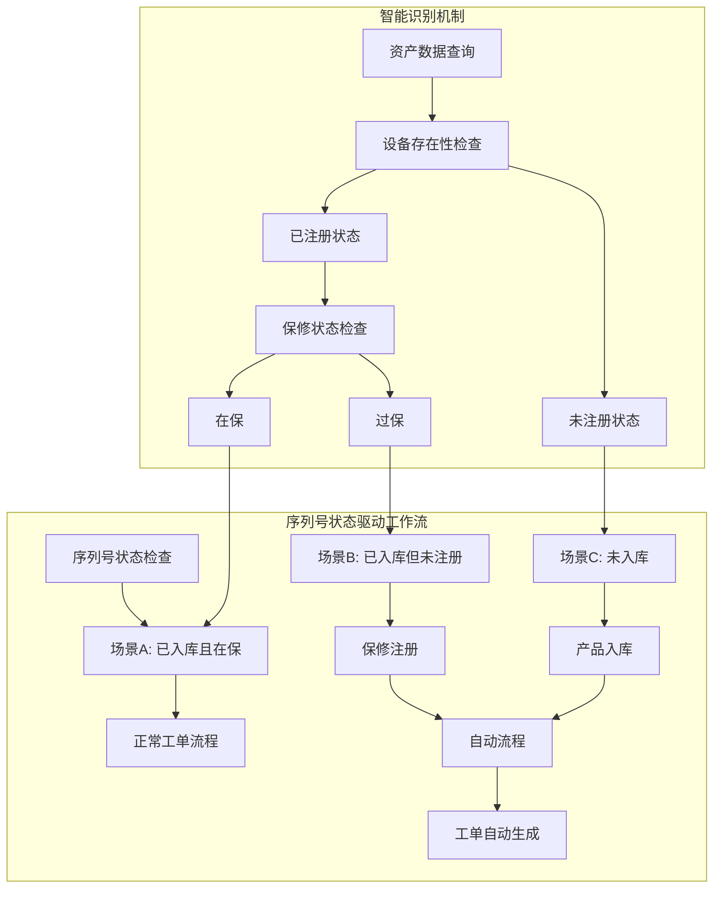

**图表来源**
- [client/src/components/Workspace/ProductModal.tsx:426-444](file://client/src/components/Workspace/ProductModal.tsx#L426-L444)
- [client/src/components/Service/ProductWarrantyRegistrationModal.tsx:221-263](file://client/src/components/Service/ProductWarrantyRegistrationModal.tsx#L221-L263)

**章节来源**
- [client/src/components/Workspace/ProductModal.tsx:426-444](file://client/src/components/Workspace/ProductModal.tsx#L426-L444)
- [client/src/components/Service/ProductWarrantyRegistrationModal.tsx:221-263](file://client/src/components/Service/ProductWarrantyRegistrationModal.tsx#L221-L263)

## 三层架构概述

Longhorn 产品管理系统的三层架构设计遵循ERP系统标准，确保与内部业务系统的无缝集成：

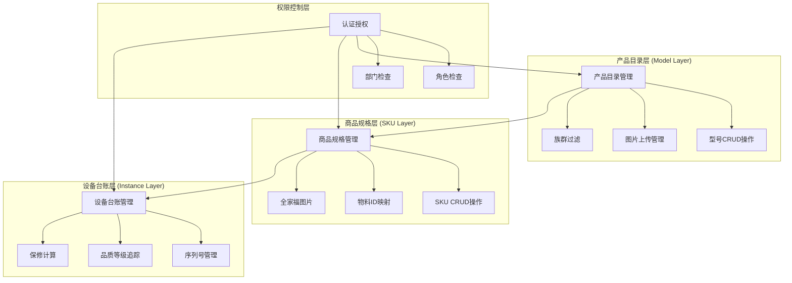

**图表来源**
- [server/service/routes/product-models-admin.js:47-101](file://server/service/routes/product-models-admin.js#L47-L101)
- [server/service/routes/products-admin.js:25-115](file://server/service/routes/products-admin.js#L25-L115)
- [server/service/migrations/033_product_architecture_upgrade.sql:5-36](file://server/service/migrations/033_product_architecture_upgrade.sql#L5-L36)

**章节来源**
- [server/service/routes/product-models-admin.js:47-101](file://server/service/routes/product-models-admin.js#L47-L101)
- [server/service/routes/products-admin.js:25-115](file://server/service/routes/products-admin.js#L25-L115)
- [server/service/migrations/033_product_architecture_upgrade.sql:5-36](file://server/service/migrations/033_product_architecture_upgrade.sql#L5-L36)

## 项目结构

Longhorn 项目的整体架构采用模块化设计，三层产品架构分布在多个层次中：

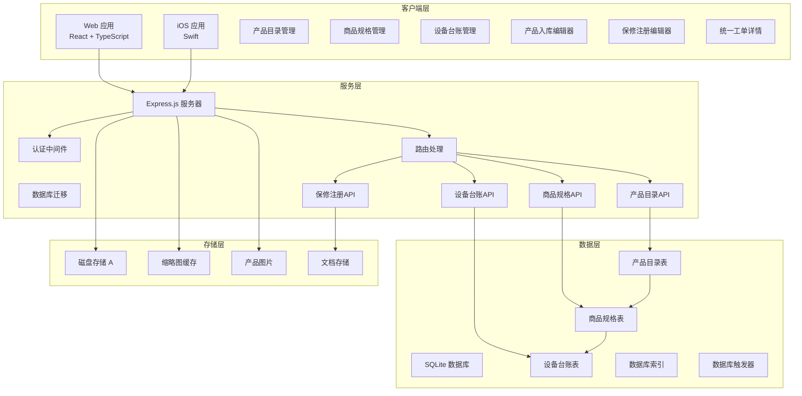

**图表来源**
- [client/src/components/ProductModelsManagement.tsx:1-10](file://client/src/components/ProductModelsManagement.tsx#L1-L10)
- [client/src/components/ProductSkusManagement.tsx:1-10](file://client/src/components/ProductSkusManagement.tsx#L1-L10)
- [client/src/components/ProductManagement.tsx:1-10](file://client/src/components/ProductManagement.tsx#L1-L10)
- [client/src/components/Workspace/ProductModal.tsx:1-5](file://client/src/components/Workspace/ProductModal.tsx#L1-L5)
- [client/src/components/Service/ProductWarrantyRegistrationModal.tsx:1-5](file://client/src/components/Service/ProductWarrantyRegistrationModal.tsx#L1-L5)
- [server/service/routes/product-models-admin.js:1-34](file://server/service/routes/product-models-admin.js#L1-L34)
- [server/service/routes/products-admin.js:1-34](file://server/service/routes/products-admin.js#L1-L34)

**章节来源**
- [client/src/components/ProductModelsManagement.tsx:1-10](file://client/src/components/ProductModelsManagement.tsx#L1-L10)
- [client/src/components/ProductSkusManagement.tsx:1-10](file://client/src/components/ProductSkusManagement.tsx#L1-L10)
- [client/src/components/ProductManagement.tsx:1-10](file://client/src/components/ProductManagement.tsx#L1-L10)
- [client/src/components/Workspace/ProductModal.tsx:1-5](file://client/src/components/Workspace/ProductModal.tsx#L1-L5)
- [client/src/components/Service/ProductWarrantyRegistrationModal.tsx:1-5](file://client/src/components/Service/ProductWarrantyRegistrationModal.tsx#L1-L5)
- [server/service/routes/product-models-admin.js:1-34](file://server/service/routes/product-models-admin.js#L1-L34)
- [server/service/routes/products-admin.js:1-34](file://server/service/routes/products-admin.js#L1-L34)

## 核心组件

### 三层架构数据模型

系统定义了完整的三层架构数据模型，确保跨平台的一致性和数据完整性：

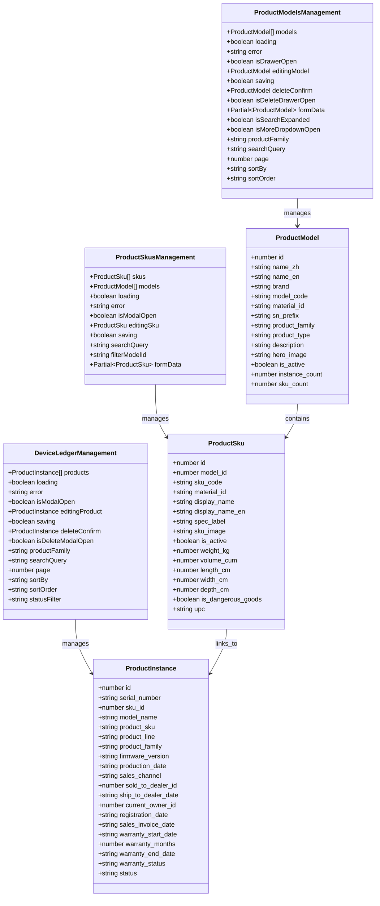

**图表来源**
- [client/src/components/ProductModelsManagement.tsx:35-53](file://client/src/components/ProductModelsManagement.tsx#L35-L53)
- [client/src/components/ProductSkusManagement.tsx:59-83](file://client/src/components/ProductSkusManagement.tsx#L59-L83)
- [client/src/components/ProductManagement.tsx:53-105](file://client/src/components/ProductManagement.tsx#L53-L105)

### 三层架构权限体系

系统采用严格的三层权限控制，确保不同角色只能访问相应的功能：

| 角色 | 产品目录 | 商品规格 | 设备台账 | 权限范围 |
|------|----------|----------|----------|----------|
| Admin | ✅ 完全访问 | ✅ 完全访问 | ✅ 完全访问 | 系统管理员 |
| Exec | ✅ 完全访问 | ✅ 完全访问 | ✅ 完全访问 | 执行董事 |
| MS Lead | ✅ 读取访问 | ✅ 读取访问 | ❌ 限制访问 | 市场部门主管 |
| MS Staff | ✅ 读取访问 | ✅ 读取访问 | ❌ 限制访问 | 市场部门员工 |
| Service Lead | ❌ 限制访问 | ❌ 限制访问 | ✅ 完全访问 | 服务部门主管 |
| Service Staff | ❌ 限制访问 | ❌ 限制访问 | ✅ 读取访问 | 服务部门员工 |

**更新** 新增了三层架构的权限控制体系，确保不同角色只能访问相应的功能模块。产品目录和商品规格的管理权限集中在MS部门，而设备台账的访问权限根据角色和部门进行细分。

**章节来源**
- [server/service/routes/product-models-admin.js:10-41](file://server/service/routes/product-models-admin.js#L10-L41)
- [client/src/components/ProductModelsManagement.tsx:413-415](file://client/src/components/ProductModelsManagement.tsx#L413-L415)
- [client/src/components/ProductSkusManagement.tsx:337-339](file://client/src/components/ProductSkusManagement.tsx#L337-L339)
- [client/src/components/ProductManagement.tsx:343-344](file://client/src/components/ProductManagement.tsx#L343-L344)

## 架构概览

产品管理系统的三层架构采用分层设计，确保功能模块的清晰分离和可维护性：

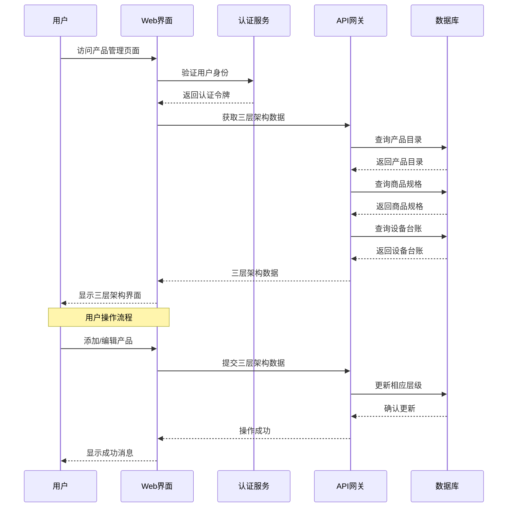

**图表来源**
- [client/src/components/ProductModelsManagement.tsx:174-195](file://client/src/components/ProductModelsManagement.tsx#L174-L195)
- [client/src/components/ProductSkusManagement.tsx:147-174](file://client/src/components/ProductSkusManagement.tsx#L147-L174)
- [client/src/components/ProductManagement.tsx:180-212](file://client/src/components/ProductManagement.tsx#L180-L212)
- [server/service/routes/product-models-admin.js:47-101](file://server/service/routes/product-models-admin.js#L47-L101)
- [server/service/routes/products-admin.js:25-115](file://server/service/routes/products-admin.js#L25-L115)

**章节来源**
- [client/src/App.tsx:180-182](file://client/src/App.tsx#L180-L182)
- [client/src/store/useAuthStore.ts:17-31](file://client/src/store/useAuthStore.ts#L17-L31)

## 详细组件分析

### Web 端三层架构管理界面

Web 端的产品管理界面提供了完整的三层架构 CRUD 功能和用户友好的交互体验，经过重大增强后具有以下特性：

#### 主要功能特性

1. **产品目录管理**
   - 支持产品型号的统一管理
   - 序列号前缀智能匹配和产品类型过滤
   - 图片上传和管理功能
   - 族群过滤和状态管理

2. **商品规格管理**
   - 支持SKU的精细化管理
   - 物料ID映射和ERP集成
   - 规格标签和全家福图片
   - 物理属性管理（重量、体积、尺寸）
   - UPC条码支持

3. **设备台账管理**
   - 支持序列号和品质等级管理
   - 保修计算和状态追踪
   - 仓库位置和入库渠道管理
   - 三层架构的数据一致性保证

4. **权限控制**
   - 基于角色的三层权限管理
   - 部门级别的访问控制
   - 不同层级的编辑权限分离

#### 界面组件结构

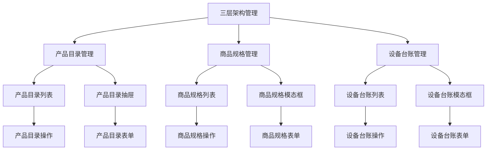

**图表来源**
- [client/src/components/ProductModelsManagement.tsx:285-418](file://client/src/components/ProductModelsManagement.tsx#L285-L418)
- [client/src/components/ProductSkusManagement.tsx:235-339](file://client/src/components/ProductSkusManagement.tsx#L235-L339)
- [client/src/components/ProductManagement.tsx:287-341](file://client/src/components/ProductManagement.tsx#L287-L341)

**章节来源**
- [client/src/components/ProductModelsManagement.tsx:120-200](file://client/src/components/ProductModelsManagement.tsx#L120-L200)
- [client/src/components/ProductSkusManagement.tsx:96-179](file://client/src/components/ProductSkusManagement.tsx#L96-L179)
- [client/src/components/ProductManagement.tsx:112-197](file://client/src/components/ProductManagement.tsx#L112-L197)

### 产品编辑模态框组件

**更新** ProductModal组件完全替代了之前的tabbed界面，采用全新的单页滚动设计：

#### 产品编辑模态框特性

1. **统一SN状态驱动**
   - 智能识别序列号状态（已入库/未入库、在保/过保）
   - 根据状态显示相应的操作按钮
   - 自动跳转到对应的操作流程

2. **单页滚动设计**
   - 产品信息、产品分类、补充信息、保修信息集中在一个页面
   - 可折叠的补充信息区域
   - 流畅的滚动体验

3. **智能表单验证**
   - 序列号必填验证
   - 型号选择验证
   - 产品线和族群验证
   - 状态和销售渠道验证

4. **集成保修注册**
   - 内置保修注册按钮
   - 自动传递预填数据
   - 无缝跳转到保修注册流程

5. **序列号前缀智能匹配**
   - 根据序列号前缀自动匹配产品型号
   - 支持多种序列号格式
   - 提升录入效率

**章节来源**
- [client/src/components/Workspace/ProductModal.tsx:426-444](file://client/src/components/Workspace/ProductModal.tsx#L426-L444)
- [client/src/components/Workspace/ProductModal.tsx:444-447](file://client/src/components/Workspace/ProductModal.tsx#L444-L447)
- [client/src/components/Workspace/ProductModal.tsx:447-448](file://client/src/components/Workspace/ProductModal.tsx#L447-L448)

### 保修注册模态框组件

**更新** ProductWarrantyRegistrationModal组件大幅增强，支持发票上传、客户搜索、批量操作：

#### 保修注册模态框特性

1. **智能场景识别**
   - 自动识别未入库、已入库但未注册、已入库且在保三种场景
   - 根据场景显示相应的操作按钮
   - 提供一键修正功能

2. **发票上传功能**
   - 支持JPG、PNG、PDF格式
   - 最大5MB文件限制
   - 实时文件验证和错误提示

3. **客户搜索功能**
   - 支持关键词搜索客户
   - 实时搜索结果展示
   - 下拉选择框集成

4. **批量操作支持**
   - 支持多个产品的批量保修注册
   - 统一的发票上传和备注填写
   - 操作结果统一反馈

5. **预填数据传递**
   - 从ProductModal传递产品线、族群、SKU等预填数据
   - 自动生成销售日期和保修期限
   - 减少重复输入

6. **产品目录智能匹配**
   - 基于序列号前缀自动匹配产品型号
   - 支持系统设置过滤
   - 提升匹配准确率

**章节来源**
- [client/src/components/Service/ProductWarrantyRegistrationModal.tsx:265-376](file://client/src/components/Service/ProductWarrantyRegistrationModal.tsx#L265-L376)
- [client/src/components/Service/ProductWarrantyRegistrationModal.tsx:422-442](file://client/src/components/Service/ProductWarrantyRegistrationModal.tsx#L422-L442)
- [client/src/components/Service/ProductWarrantyRegistrationModal.tsx:444-575](file://client/src/components/Service/ProductWarrantyRegistrationModal.tsx#L444-L575)

### 产品型号管理组件

**更新** 产品型号管理组件新增序列号前缀智能匹配和产品类型过滤功能：

#### 产品型号管理特性

1. **序列号前缀智能匹配**
   - 基于序列号前缀自动匹配产品型号
   - 支持精确匹配和前缀匹配
   - 提升录入效率

2. **产品类型过滤**
   - 支持系统设置的产品类型过滤
   - 可配置的族群可见性
   - 灵活的类型匹配规则

3. **SKU统计显示**
   - 实时显示每个型号的SKU数量
   - 显示型号下的实例数量
   - 提供完整的统计信息

4. **图片上传管理**
   - 支持产品主视觉图片上传
   - 图片预览和管理功能
   - 响应式图片展示

**章节来源**
- [client/src/components/ProductModelsManagement.tsx:160-172](file://client/src/components/ProductModelsManagement.tsx#L160-L172)
- [client/src/components/ProductModelsManagement.tsx:319-336](file://client/src/components/ProductModelsManagement.tsx#L319-L336)
- [client/src/components/ProductModelsManagement.tsx:697-702](file://client/src/components/ProductModelsManagement.tsx#L697-L702)

### 商品规格管理组件

**更新** 商品规格管理组件新增物理属性管理和UPC条码支持：

#### 商品规格管理特性

1. **物理属性管理**
   - 支持重量、体积、尺寸等物理属性
   - 数值输入和单位显示
   - 物流和仓储优化

2. **UPC条码支持**
   - 支持UPC条码录入
   - 条码格式验证
   - 供应链集成支持

3. **规格标签优化**
   - 支持多语言规格标签
   - 规格标签模板
   - 产品描述优化

4. **SKU图片管理**
   - 支持SKU图片上传
   - 图片预览和管理
   - 全家福图片展示

**章节来源**
- [client/src/components/ProductSkusManagement.tsx:716-774](file://client/src/components/ProductSkusManagement.tsx#L716-L774)
- [client/src/components/ProductSkusManagement.tsx:777-800](file://client/src/components/ProductSkusManagement.tsx#L777-L800)
- [client/src/components/ProductSkusManagement.tsx:53-83](file://client/src/components/ProductSkusManagement.tsx#L53-L83)

### 设备台账管理组件

**更新** 设备台账管理组件采用macOS 26风格设计，提供更好的用户体验：

#### 设备台账管理特性

1. **macOS 26风格设计**
   - 半透明背景和模糊滤镜
   - 深色和浅色主题自动切换
   - 平滑的过渡动画效果

2. **智能列宽调整**
   - 支持列宽拖拽调整
   - 本地存储列宽设置
   - 响应式布局适配

3. **序列号状态智能识别**
   - 实时序列号状态检查
   - 场景化操作按钮显示
   - 自动工单生成

4. **状态管理优化**
   - 多语言状态翻译
   - 颜色编码的状态指示
   - 点击跳转到工单详情

**章节来源**
- [client/src/components/ProductManagement.tsx:31-42](file://client/src/components/ProductManagement.tsx#L31-L42)
- [client/src/components/ProductManagement.tsx:230-255](file://client/src/components/ProductManagement.tsx#L230-L255)
- [client/src/components/ProductManagement.tsx:717-762](file://client/src/components/ProductManagement.tsx#L717-L762)

## 三层架构详解

### 产品目录（Model）层

产品目录层是三层架构的基础层，负责产品型号的统一管理：

#### 核心功能
- 产品型号定义和管理
- 品牌和族群信息维护
- 主视觉图片管理
- 产品类型和规格定义
- 序列号前缀智能匹配
- 产品类型过滤和可见性控制

#### 数据结构
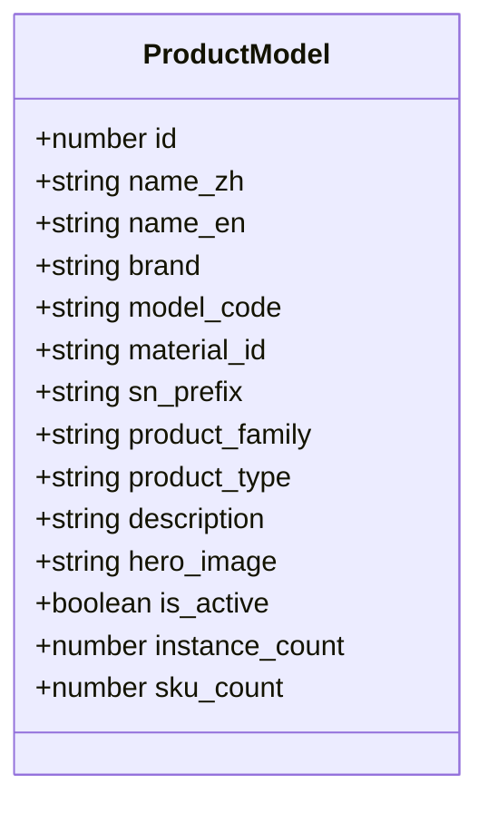

**图表来源**
- [client/src/components/ProductModelsManagement.tsx:35-53](file://client/src/components/ProductModelsManagement.tsx#L35-L53)

### 商品规格（SKU）层

商品规格层是三层架构的桥梁层，连接产品目录和设备台账：

#### 核心功能
- 商品规格定义和管理
- 物料ID映射和ERP集成
- 规格标签和全家福图片
- 与产品目录的关联管理
- 物理属性管理（重量、体积、尺寸）
- UPC条码支持

#### 数据结构
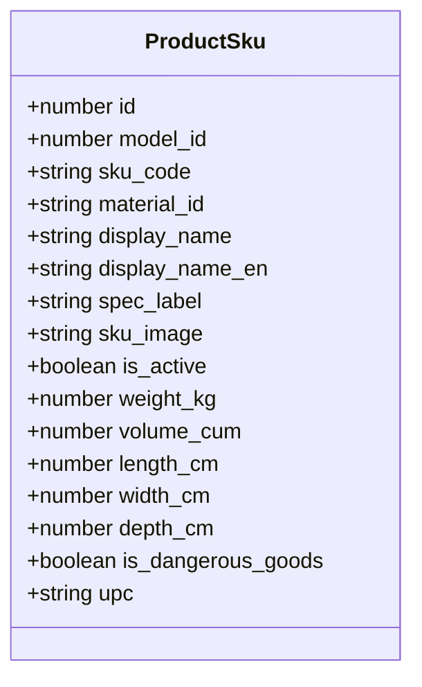

**图表来源**
- [client/src/components/ProductSkusManagement.tsx:59-83](file://client/src/components/ProductSkusManagement.tsx#L59-L83)

### 设备台账（Instance）层

设备台账层是三层架构的最终层，管理具体的设备实例：

#### 核心功能
- 序列号和品质等级管理
- 仓库位置和入库渠道管理
- 保修计算和状态追踪
- 与商品规格的关联
- 销售跟踪和所有权管理
- IoT设备状态监控

#### 数据结构
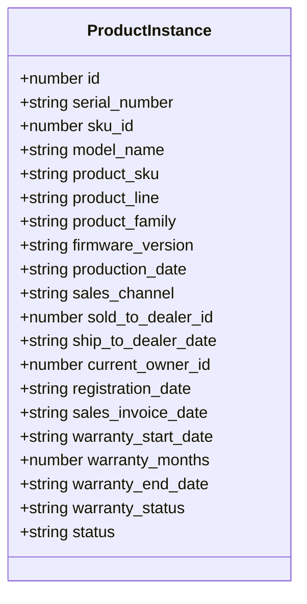

**图表来源**
- [client/src/components/ProductManagement.tsx:53-105](file://client/src/components/ProductManagement.tsx#L53-L105)

## UI/UX设计改进

### macOS 26风格设计

系统采用了全新的macOS 26风格设计，提供现代化的视觉体验：

#### 设计特色

1. **玻璃拟态效果**
   - 使用半透明背景和模糊滤镜
   - 深色和浅色主题自动切换
   - 平滑的过渡动画效果

2. **统一色彩系统**
   - 采用Kine黄作为主色调
   - 渐变色彩应用于重要元素
   - 状态颜色标准化（成功、警告、危险）

3. **响应式布局**
   - 支持桌面和移动设备
   - 自适应网格系统
   - 触摸友好的交互元素

#### 组件设计规范

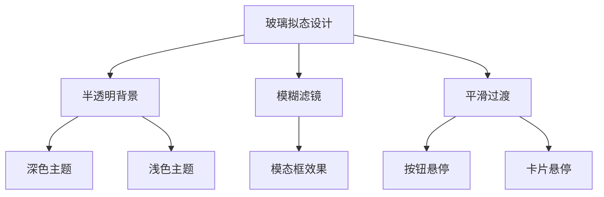

**图表来源**
- [client/src/components/ProductManagement.tsx:31-42](file://client/src/components/ProductManagement.tsx#L31-L42)

**章节来源**
- [client/src/components/ProductManagement.tsx:31-42](file://client/src/components/ProductManagement.tsx#L31-L42)

### 交互体验优化

#### 1. 智能表单验证
- 实时表单验证和错误提示
- 必填字段高亮显示
- 输入格式自动校正

#### 2. 加载状态管理
- 进度指示器和骨架屏
- 网络错误自动重试
- 加载超时处理

#### 3. 用户反馈机制
- 成功操作确认提示
- 失败原因详细说明
- 操作撤销功能

#### 4. 键盘快捷键支持
- 常用操作快捷键
- 导航快捷键
- 表单快捷键

**章节来源**
- [client/src/components/Workspace/ProductModal.tsx:237-254](file://client/src/components/Workspace/ProductModal.tsx#L237-L254)
- [client/src/components/Service/ProductWarrantyRegistrationModal.tsx:444-475](file://client/src/components/Service/ProductWarrantyRegistrationModal.tsx#L444-L475)

## 列宽持久化功能

**更新** 新增列宽持久化功能，支持用户自定义列宽并在本地存储中保存

### 功能概述

系统在三个主要的管理界面中实现了列宽持久化功能，允许用户自定义表格列宽并将其保存到浏览器的本地存储中：

#### 支持的界面
- 设备台账管理界面（ProductManagement）
- 产品型号管理界面（ProductModelsManagement）
- 商品规格管理界面（ProductSkusManagement）

#### 技术实现

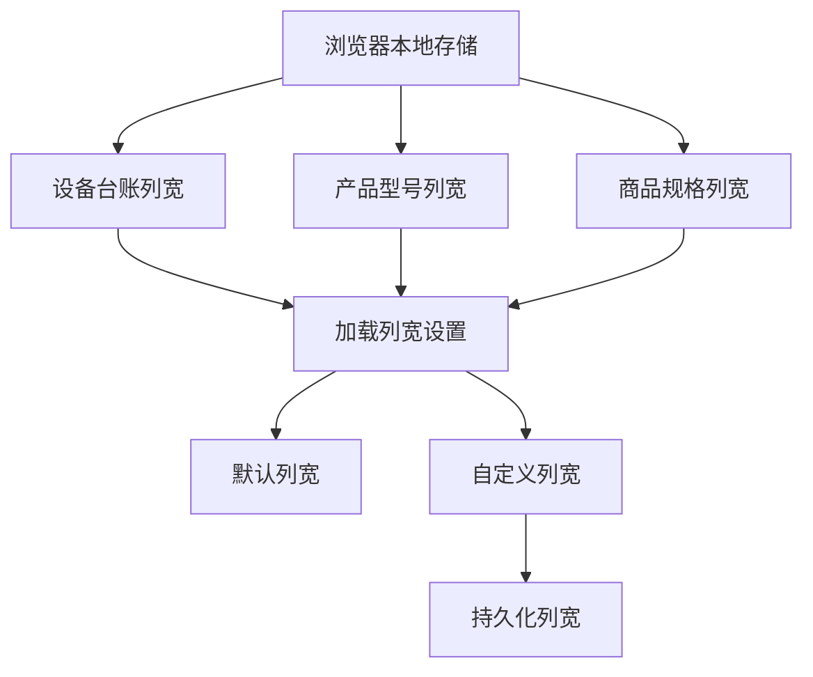

**图表来源**
- [client/src/components/ProductManagement.tsx:31-50](file://client/src/components/ProductManagement.tsx#L31-L50)
- [client/src/components/ProductModelsManagement.tsx:99-118](file://client/src/components/ProductModelsManagement.tsx#L99-L118)
- [client/src/components/ProductSkusManagement.tsx:34-52](file://client/src/components/ProductSkusManagement.tsx#L34-L52)

### 实现细节

#### 列宽存储机制

每个界面都实现了独立的列宽存储机制：

1. **存储键名**：每个界面使用不同的存储键名避免冲突
   - 设备台账：`longhorn_product_col_widths`
   - 产品型号：`longhorn_pm_col_widths`
   - 商品规格：`longhorn_sku_col_widths`

2. **默认列宽**：每个界面都有预设的默认列宽值
   - 设备台账：序列号160px、型号180px、SKU140px、所有者140px、保修120px、操作80px
   - 产品型号：型号代码140px、名称200px、序列号前缀120px、族群140px、SKU实例100px、操作80px
   - 商品规格：SKU代码140px、显示名称200px、型号180px、规格120px、操作80px

3. **存储格式**：使用JSON格式存储列宽配置，支持增量更新

#### 列宽调整功能

用户可以通过拖拽列边界来调整列宽，调整后的宽度会实时保存到本地存储中：

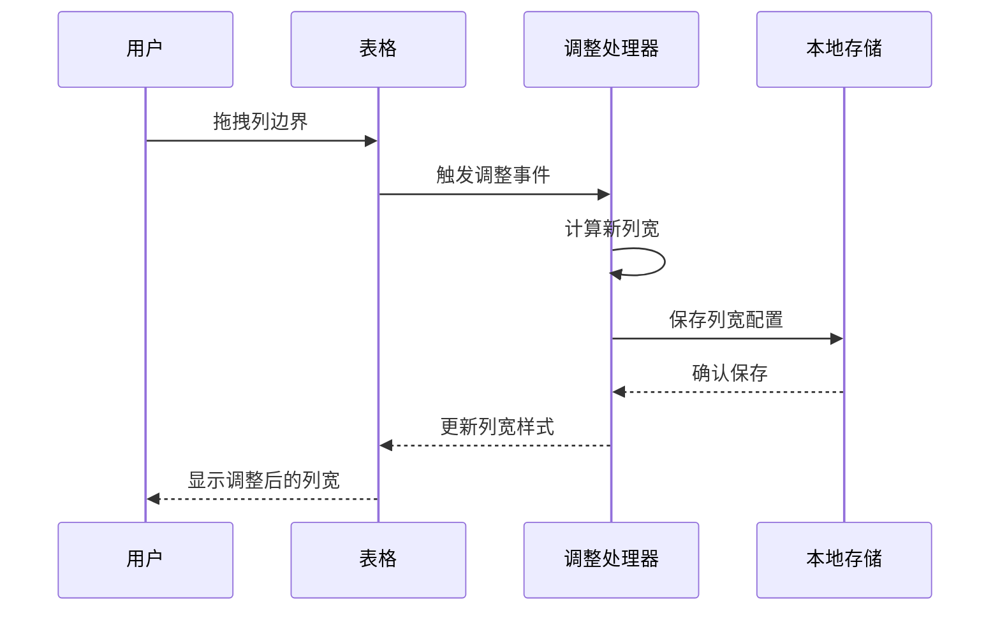

**图表来源**
- [client/src/components/ProductManagement.tsx:230-254](file://client/src/components/ProductManagement.tsx#L230-L254)
- [client/src/components/ProductModelsManagement.tsx:212-236](file://client/src/components/ProductModelsManagement.tsx#L212-L236)
- [client/src/components/ProductSkusManagement.tsx:180-204](file://client/src/components/ProductSkusManagement.tsx#L180-L204)

**章节来源**
- [client/src/components/ProductManagement.tsx:31-50](file://client/src/components/ProductManagement.tsx#L31-L50)
- [client/src/components/ProductModelsManagement.tsx:99-118](file://client/src/components/ProductModelsManagement.tsx#L99-L118)
- [client/src/components/ProductSkusManagement.tsx:34-52](file://client/src/components/ProductSkusManagement.tsx#L34-L52)
- [client/src/components/ProductManagement.tsx:230-254](file://client/src/components/ProductManagement.tsx#L230-L254)
- [client/src/components/ProductModelsManagement.tsx:212-236](file://client/src/components/ProductModelsManagement.tsx#L212-L236)
- [client/src/components/ProductSkusManagement.tsx:180-204](file://client/src/components/ProductSkusManagement.tsx#L180-L204)

## 排序功能改进

**更新** 改进的排序功能，每个界面都有独立的排序状态管理

### 功能概述

系统在三个主要管理界面中实现了改进的排序功能，支持用户对表格数据进行排序，并将排序状态保存到本地存储中：

#### 排序状态管理

每个界面都实现了独立的排序状态管理机制：

1. **本地排序状态**：使用React状态管理排序配置，支持升序/降序切换
2. **URL参数同步**：与URL参数保持同步，支持分享排序状态
3. **默认排序**：每个界面都有预设的默认排序规则

#### 排序键值定义

| 界面 | 排序键值 | 默认排序方向 |
|------|----------|--------------|
| 设备台账 | serial_number, model_name, product_sku, current_owner_name, warranty_status | asc |
| 产品型号 | model_code, name_zh, sn_prefix, product_family, sku_count, instance_count | asc |
| 商品规格 | sku_code, display_name, name_zh, spec_label | asc |

#### 排序实现机制

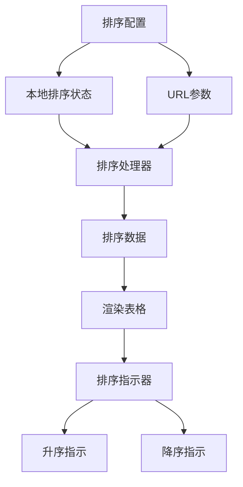

**图表来源**
- [client/src/components/ProductManagement.tsx:154-156](file://client/src/components/ProductManagement.tsx#L154-L156)
- [client/src/components/ProductModelsManagement.tsx:152-154](file://client/src/components/ProductModelsManagement.tsx#L152-L154)
- [client/src/components/ProductSkusManagement.tsx:117-119](file://client/src/components/ProductSkusManagement.tsx#L117-L119)

### 排序功能特性

#### 1. 本地排序优先
- 每个界面都有独立的排序状态，不依赖URL参数
- 支持点击表头进行排序切换
- 排序指示器实时显示当前排序状态

#### 2. URL参数同步
- 排序状态与URL参数保持同步
- 支持分享带有特定排序状态的链接
- 页面刷新后保持排序状态

#### 3. 排序指示器
- 表头显示排序指示器（↑↓↕）
- 当前列显示不同的颜色标识
- 支持点击切换排序方向

#### 4. 多字段排序
- 支持多字段排序组合
- 排序优先级按添加顺序确定
- 排序结果实时更新

**章节来源**
- [client/src/components/ProductManagement.tsx:154-156](file://client/src/components/ProductManagement.tsx#L154-L156)
- [client/src/components/ProductManagement.tsx:256-285](file://client/src/components/ProductManagement.tsx#L256-L285)
- [client/src/components/ProductModelsManagement.tsx:152-154](file://client/src/components/ProductModelsManagement.tsx#L152-L154)
- [client/src/components/ProductModelsManagement.tsx:238-247](file://client/src/components/ProductModelsManagement.tsx#L238-L247)
- [client/src/components/ProductSkusManagement.tsx:117-119](file://client/src/components/ProductSkusManagement.tsx#L117-L119)
- [client/src/components/ProductSkusManagement.tsx:206-215](file://client/src/components/ProductSkusManagement.tsx#L206-L215)

## 依赖关系分析

三层架构的依赖关系体现了清晰的分层设计：

```mermaid
graph TB
subgraph "表现层"
PM[ProductManagement.tsx]
PMM[ProductModelsManagement.tsx]
PSM[ProductSkusManagement.tsx]
PDM[ProductDetailModal.tsx]
PDP[ProductDetailPage.tsx]
PC[ProductCard.tsx]
PM2[ProductModal.tsx]
PSC[ProductSummaryCard.tsx]
TC[TicketCard.tsx]
WarrantyModal[ProductWarrantyRegistrationModal.tsx]
UnifiedTicket[UnifiedTicketDetail.tsx]
AR[AppRail.tsx]
end
subgraph "状态管理层"
AS[useAuthStore.ts]
end
subgraph "路由层"
APP[App.tsx]
end
subgraph "服务层"
PRA[products-admin.js]
PMA[product-models-admin.js]
PR[products.js]
WRA[warranty.js]
MIG[migrations]
end
subgraph "数据层"
DB[SQLite 数据库]
PM_TABLE[产品目录表]
PS_TABLE[商品规格表]
P_TABLE[设备台账表]
INDEXES[数据库索引]
TRIGGERS[数据库触发器]
END_USERS[终端用户表]
DEALERS[经销商表]
ACCOUNTS[账户表]
end
AS --> APP
APP --> PM
APP --> PMM
APP --> PSM
PRA --> DB
PMA --> DB
PR --> DB
WRA --> END_USERS
WRA --> DEALERS
WRA --> ACCOUNTS
MIG --> INDEXES
MIG --> TRIGGERS
PM2 --> WarrantyModal
UnifiedTicket --> WarrantyModal
```

**图表来源**
- [client/src/components/ProductModelsManagement.tsx:1-10](file://client/src/components/ProductModelsManagement.tsx#L1-L10)
- [client/src/components/ProductSkusManagement.tsx:1-10](file://client/src/components/ProductSkusManagement.tsx#L1-L10)
- [client/src/components/ProductManagement.tsx:1-10](file://client/src/components/ProductManagement.tsx#L1-L10)
- [client/src/components/Workspace/ProductModal.tsx:1-5](file://client/src/components/Workspace/ProductModal.tsx#L1-L5)
- [client/src/components/Service/ProductWarrantyRegistrationModal.tsx:1-5](file://client/src/components/Service/ProductWarrantyRegistrationModal.tsx#L1-L5)
- [client/src/store/useAuthStore.ts:1-15](file://client/src/store/useAuthStore.ts#L1-L15)

**章节来源**
- [client/src/App.tsx:48-52](file://client/src/App.tsx#L48-L52)
- [client/src/components/AppRail.tsx:1-20](file://client/src/components/AppRail.tsx#L1-L20)

## 性能考虑

### 数据加载优化

1. **分页机制**：三层架构中各层都支持分页机制，减少一次性数据传输量
2. **条件查询**：支持按产品族群、关键字和状态精确过滤
3. **缓存策略**：利用浏览器缓存和 HTTP ETag 处理重复请求
4. **懒加载优化**：搜索框展开时才触发焦点事件
5. **数据库索引优化**：为三层架构的关键字段创建索引提升查询性能

### 前端性能优化

1. **虚拟滚动**：对于大量数据时可考虑实现虚拟滚动
2. **懒加载**：图片和附件采用懒加载策略
3. **状态管理**：使用 React Hooks 和 Zustand 优化状态更新
4. **事件委托优化**：点击外部关闭下拉菜单的事件处理
5. **三层架构缓存**：产品目录、商品规格、设备台账的独立缓存

### 后端性能优化

1. **索引优化**：为三层架构的常用查询字段建立数据库索引
2. **查询优化**：使用参数化查询防止 SQL 注入
3. **连接池**：合理配置数据库连接池大小
4. **三层架构优化**：预计算三层架构关联数据避免复杂联接查询
5. **权限控制优化**：基于角色的权限检查减少不必要的查询

### 工作流性能优化

1. **序列号状态缓存**：缓存序列号状态查询结果
2. **智能跳转**：根据状态直接跳转到对应操作页面
3. **批量处理**：支持多个产品的批量操作
4. **异步处理**：发票上传和数据同步采用异步方式
5. **错误恢复**：网络中断时自动重试和状态恢复

### 列宽持久化性能优化

1. **本地存储优化**：只存储用户自定义的列宽变化
2. **增量更新**：使用默认值与自定义值合并的方式
3. **防抖处理**：列宽调整时的频繁存储操作进行防抖
4. **内存优化**：只在需要时加载列宽配置

## 故障排除指南

### 常见问题及解决方案

#### 1. 权限访问问题
**症状**：无法访问产品管理功能
**原因**：用户角色不是 Admin、Exec 或 MS Lead
**解决方案**：检查用户角色配置或联系系统管理员

#### 2. 产品删除失败
**症状**：尝试删除产品时报错
**原因**：产品关联到工单记录
**解决方案**：先清理相关工单再删除产品

#### 3. 数据同步问题
**症状**：产品信息显示不一致
**原因**：缓存未及时更新
**解决方案**：刷新页面或清除浏览器缓存

#### 4. 移动端显示异常
**症状**：iOS 应用中产品列表显示错误
**原因**：数据模型映射问题
**解决方案**：检查 JSON 序列化配置

#### 5. 三层架构数据不一致
**症状**：产品目录、商品规格、设备台账数据不匹配
**原因**：数据库约束未正确设置
**解决方案**：运行三层架构迁移脚本

#### 6. 商品规格关联错误
**症状**：设备台账无法正确关联到商品规格
**原因**：SKU代码不匹配或外键约束问题
**解决方案**：检查SKU代码格式和外键关系

#### 7. 产品目录权限控制失效
**症状**：非MS部门人员可以访问产品目录
**原因**：权限检查逻辑错误
**解决方案**：检查权限中间件配置

#### 8. 设备台账查询性能问题
**症状**：设备台账列表加载缓慢
**原因**：缺少必要的数据库索引
**解决方案**：创建SKU ID和状态字段的索引

#### 9. 三层架构权限冲突
**症状**：用户权限与预期不符
**原因**：角色和部门权限配置错误
**解决方案**：检查用户角色和部门代码配置

#### 10. 序列号状态识别错误
**症状**：序列号状态显示不正确
**原因**：资产数据查询失败或缓存过期
**解决方案**：检查网络连接和重新查询资产数据

#### 11. 保修注册发票上传失败
**症状**：发票上传后状态不更新
**原因**：文件格式不支持或网络超时
**解决方案**：检查文件格式和网络连接，重新上传

#### 12. 工单自动跳转问题
**症状**：工单详情页面无法自动跳转到对应操作
**原因**：序列号状态查询失败或权限不足
**解决方案**：检查序列号状态和用户权限

#### 13. 列宽持久化问题
**症状**：列宽调整后重启浏览器丢失
**原因**：本地存储权限问题或存储空间不足
**解决方案**：检查浏览器存储权限，清理存储空间

#### 14. 排序功能异常
**症状**：点击表头无法排序或排序状态丢失
**原因**：JavaScript错误或状态管理问题
**解决方案**：检查浏览器控制台错误，刷新页面重试

**章节来源**
- [client/src/components/ProductManagement.tsx:176-197](file://client/src/components/ProductManagement.tsx#L176-L197)
- [client/src/components/Workspace/ProductModal.tsx:237-254](file://client/src/components/Workspace/ProductModal.tsx#L237-L254)
- [client/src/components/Service/ProductWarrantyRegistrationModal.tsx:444-475](file://client/src/components/Service/ProductWarrantyRegistrationModal.tsx#L444-L475)
- [server/service/routes/products-admin.js:335-394](file://server/service/routes/products-admin.js#L335-L394)
- [server/service/migrations/033_product_architecture_upgrade.sql:38-41](file://server/service/migrations/033_product_architecture_upgrade.sql#L38-L41)

## 结论

产品管理界面作为 Longhorn 系统的核心功能模块，经过从两层架构到三层架构的重大升级后，成功实现了与ERP系统的深度对齐和更精细的产品管理能力。系统采用现代化的三层架构设计，提供了更加专业和高效的产品管理体验。

### 主要优势

1. **统一SN状态驱动工作流**：实现了产品入库、保修注册的智能化管理，大幅提升了工作效率
2. **ProductModal组件优化**：采用单页滚动设计替代tabbed界面，提供更流畅的用户体验
3. **ProductWarrantyRegistrationModal增强**：支持发票上传、客户搜索、批量操作等功能
4. **UI/UX全面改进**：采用macOS 26风格设计，提供现代化的视觉体验
5. **三层架构完整性**：实现了产品目录、商品规格、设备台账的完整三层架构
6. **ERP系统对齐**：与内部ERP系统的9系列（物料代码）和A系列（商品SKU）深度对齐
7. **权限控制严格**：基于角色和部门的三层权限管理体系
8. **数据一致性保证**：通过数据库约束和触发器确保三层架构数据的一致性
9. **跨平台兼容**：同时支持 Web 和 iOS 平台
10. **性能优化完善**：针对三层架构的查询优化和缓存策略
11. **列宽持久化功能**：支持用户自定义列宽并在本地存储中保存
12. **改进排序功能**：每个界面都有独立的排序状态管理

### 技术亮点

1. **前后端分离**：三层架构的清晰职责划分和接口设计
2. **状态管理**：使用现代 React Hooks 和 Zustand 管理三层架构状态
3. **数据库设计**：合理的三层架构表结构和索引策略
4. **错误处理**：完善的三层架构错误处理和用户反馈机制
5. **权限控制**：基于角色和部门的严格权限检查机制
6. **数据迁移**：完整的三层架构数据迁移和兼容性保证
7. **性能监控**：三层架构的查询优化和性能监控
8. **组件化设计**：模块化的三层架构组件便于维护
9. **国际化支持**：三层架构的多语言状态和错误信息显示
10. **安全保障**：三层架构的权限控制和数据安全保护
11. **工作流集成**：统一SN状态驱动工作流系统
12. **智能表单验证**：实时表单验证和错误提示机制
13. **列宽持久化**：用户自定义列宽的本地存储机制
14. **排序状态管理**：独立的排序状态管理和URL参数同步

经过三层架构的重大升级、UI/UX改进以及新增的列宽持久化和排序功能，产品管理界面不仅保持了原有的稳定性和可靠性，还显著提升了用户体验、功能完整性和系统性能。该系统为 Longhorn 系统提供了坚实的三层架构基础，支持后续的功能扩展和业务发展需求，实现了与企业级ERP系统的无缝集成。