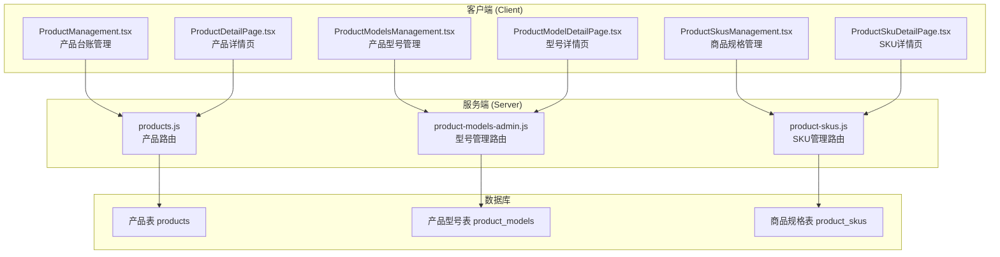
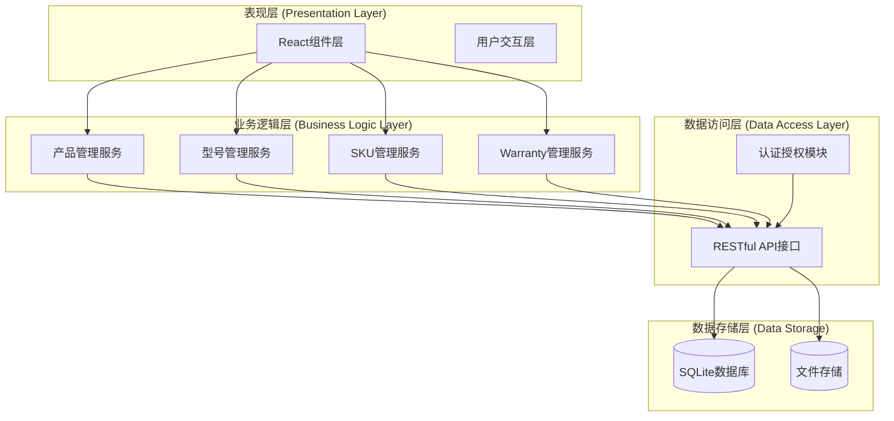
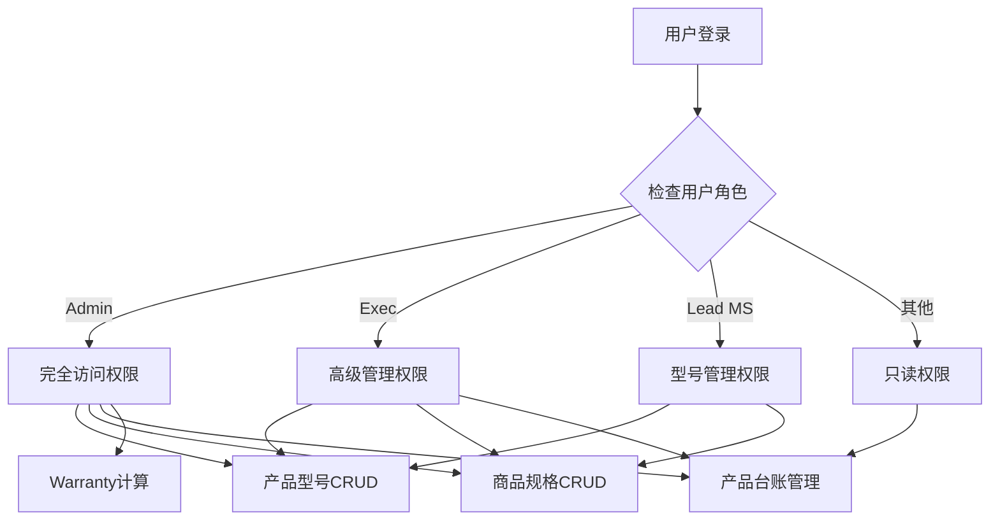
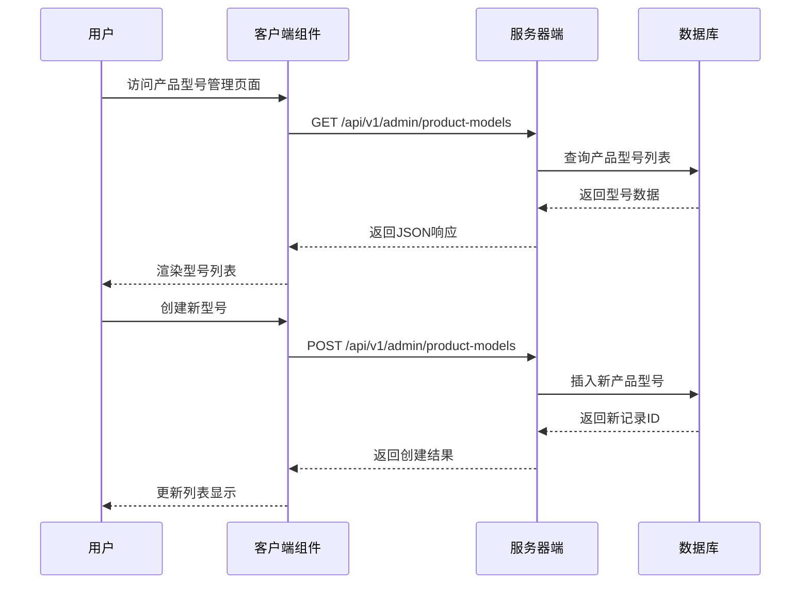
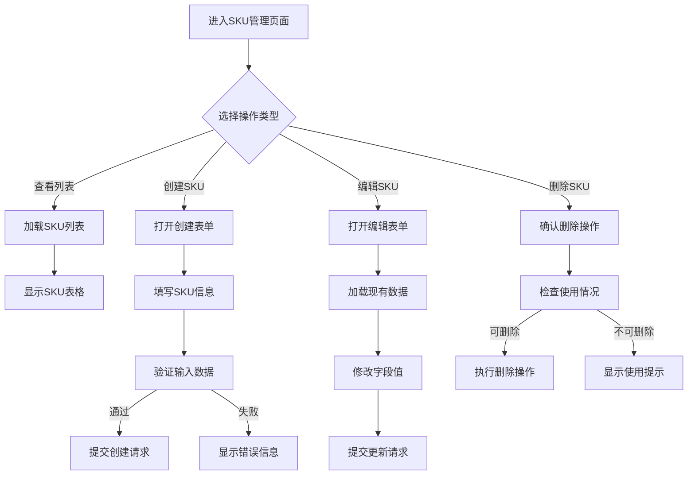
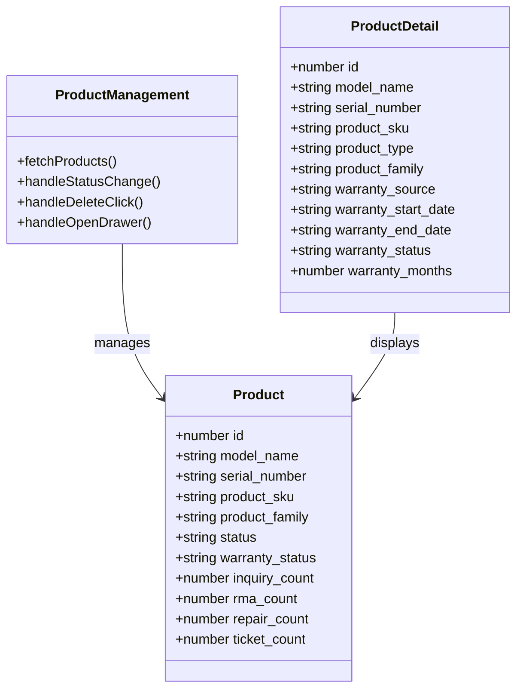
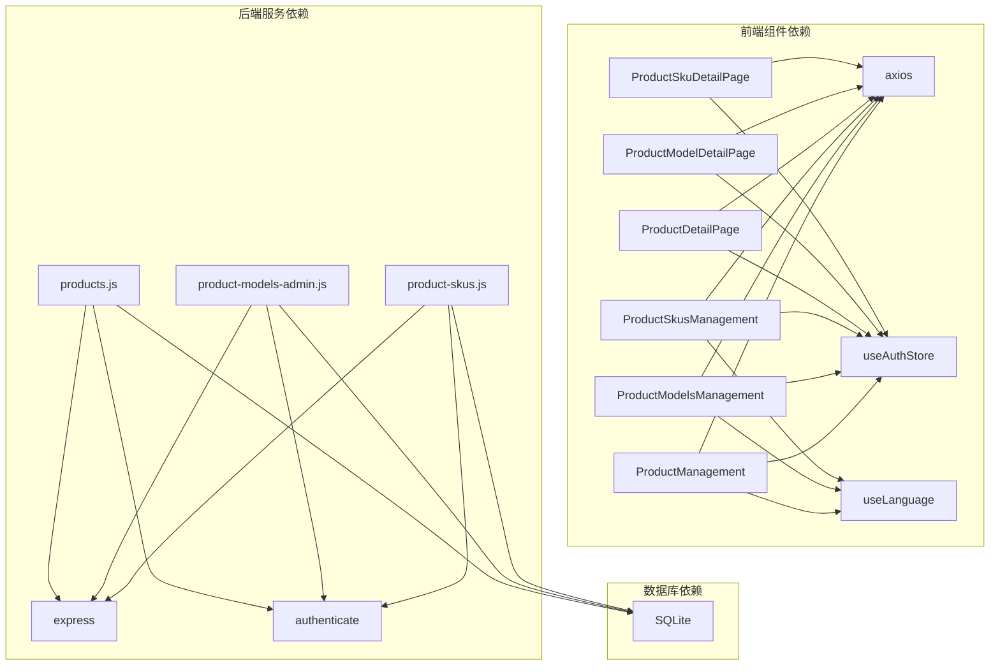

# 商品规格管理

<cite>
**本文档引用的文件**
- [ProductManagement.tsx](file://client/src/components/ProductManagement.tsx)
- [ProductModelsManagement.tsx](file://client/src/components/ProductModelsManagement.tsx)
- [ProductSkusManagement.tsx](file://client/src/components/ProductSkusManagement.tsx)
- [ProductDetailPage.tsx](file://client/src/components/ProductDetailPage.tsx)
- [ProductModelDetailPage.tsx](file://client/src/components/ProductModelDetailPage.tsx)
- [ProductSkuDetailPage.tsx](file://client/src/components/ProductSkuDetailPage.tsx)
- [products.js](file://server/service/routes/products.js)
- [product-models-admin.js](file://server/service/routes/product-models-admin.js)
- [product-skus.js](file://server/service/routes/product-skus.js)
</cite>

## 目录
1. [简介](#简介)
2. [项目结构](#项目结构)
3. [核心组件](#核心组件)
4. [架构概览](#架构概览)
5. [详细组件分析](#详细组件分析)
6. [依赖关系分析](#依赖关系分析)
7. [性能考虑](#性能考虑)
8. [故障排除指南](#故障排除指南)
9. [结论](#结论)

## 简介

Longhorn项目中的商品规格管理系统是一个完整的商品生命周期管理解决方案，涵盖了从产品型号定义到具体商品规格的全链路管理。该系统支持四类产品族群（在售电影机、历史机型、电子寻像器、通用配件），提供完整的CRUD操作、权限控制和数据验证功能。

系统采用前后端分离架构，前端使用React构建用户界面，后端基于Express.js提供RESTful API服务，数据库采用SQLite进行数据存储。整个系统实现了严格的角色权限控制，确保只有授权用户才能进行商品规格的管理和维护。

## 项目结构

商品规格管理系统的文件组织遵循清晰的功能模块划分：

**图表来源**
- [ProductManagement.tsx:1-800](file://client/src/components/ProductManagement.tsx#L1-L800)
- [ProductModelsManagement.tsx:1-800](file://client/src/components/ProductModelsManagement.tsx#L1-L800)
- [ProductSkusManagement.tsx:1-440](file://client/src/components/ProductSkusManagement.tsx#L1-L440)

**章节来源**
- [ProductManagement.tsx:1-800](file://client/src/components/ProductManagement.tsx#L1-L800)
- [ProductModelsManagement.tsx:1-800](file://client/src/components/ProductModelsManagement.tsx#L1-L800)
- [ProductSkusManagement.tsx:1-440](file://client/src/components/ProductSkusManagement.tsx#L1-L440)

## 核心组件

### 产品型号管理组件

产品型号管理组件提供了完整的型号定义和管理功能：

- **型号基本信息管理**：包括型号名称、品牌、型号代码、产品族群等
- **规格参数定义**：支持多种产品类型的规格参数配置
- **图片资源管理**：支持型号主图的上传和展示
- **状态控制**：可启用或停用特定型号

### 商品规格管理组件

商品规格管理组件专注于SKU级别的精细化管理：

- **SKU代码生成**：自动生成唯一的商品规格代码
- **规格属性配置**：支持显示名称、规格标签、物料编号等
- **图片资源管理**：每个SKU可独立配置展示图片
- **关联统计**：显示每个SKU对应的在役设备数量

### 产品台账管理组件

产品台账管理组件提供全局的产品视图：

- **多维度筛选**：按产品族群、状态、关键字等条件筛选
- **实时统计**：显示各类产品的数量统计
- **批量操作**：支持状态变更、删除等批量操作
- **快速导航**：支持跳转到产品详情页面

**章节来源**
- [ProductModelsManagement.tsx:70-300](file://client/src/components/ProductModelsManagement.tsx#L70-L300)
- [ProductSkusManagement.tsx:35-120](file://client/src/components/ProductSkusManagement.tsx#L35-L120)
- [ProductManagement.tsx:77-260](file://client/src/components/ProductManagement.tsx#L77-L260)

## 架构概览

系统采用分层架构设计，确保各层职责清晰分离：

**图表来源**
- [products.js:1-341](file://server/service/routes/products.js#L1-L341)
- [product-models-admin.js:1-362](file://server/service/routes/product-models-admin.js#L1-L362)
- [product-skus.js:1-309](file://server/service/routes/product-skus.js#L1-L309)

### 权限控制机制

系统实现了严格的权限控制体系：

**图表来源**
- [product-models-admin.js:19-41](file://server/service/routes/product-models-admin.js#L19-L41)
- [product-skus.js:19-41](file://server/service/routes/product-skus.js#L19-L41)

**章节来源**
- [product-models-admin.js:10-41](file://server/service/routes/product-models-admin.js#L10-L41)
- [product-skus.js:10-41](file://server/service/routes/product-skus.js#L10-L41)

## 详细组件分析

### 产品型号管理流程

产品型号管理是整个商品规格系统的核心，负责定义产品的基础属性和规格框架：

**图表来源**
- [ProductModelsManagement.tsx:117-142](file://client/src/components/ProductModelsManagement.tsx#L117-L142)
- [product-models-admin.js:128-196](file://server/service/routes/product-models-admin.js#L128-L196)

### 商品规格管理流程

商品规格管理负责具体的SKU级别配置和管理：

**图表来源**
- [ProductSkusManagement.tsx:68-98](file://client/src/components/ProductSkusManagement.tsx#L68-L98)
- [product-skus.js:198-273](file://server/service/routes/product-skus.js#L198-L273)

### 产品台账管理流程

产品台账管理提供全局的产品视图和操作入口：

**图表来源**
- [ProductManagement.tsx:12-63](file://client/src/components/ProductManagement.tsx#L12-L63)
- [ProductDetailPage.tsx:9-46](file://client/src/components/ProductDetailPage.tsx#L9-L46)

**章节来源**
- [ProductManagement.tsx:142-245](file://client/src/components/ProductManagement.tsx#L142-L245)
- [ProductDetailPage.tsx:62-161](file://client/src/components/ProductDetailPage.tsx#L62-L161)

### 数据模型关系

系统中的数据模型遵循规范化设计，确保数据一致性和完整性：

```mermaid
erDiagram
PRODUCT_MODELS {
int id PK
string name_zh
string name_en
string brand
string model_code
string material_id_prefix
string product_family
string product_type
string description
string hero_image
boolean is_active
datetime created_at
datetime updated_at
}
PRODUCT_SKUS {
int id PK
int model_id FK
string sku_code
string material_id
string display_name
string display_name_en
string spec_label
string sku_image
boolean is_active
datetime created_at
datetime updated_at
}
PRODUCTS {
int id PK
string model_name
string serial_number
string product_sku
int sku_id
string product_type
string product_family
string status
string warranty_source
string warranty_start_date
string warranty_end_date
string warranty_status
int warranty_months
datetime production_date
boolean is_iot_device
boolean is_activated
datetime activation_date
datetime last_connected_at
string firmware_version
string ip_address
string sales_channel
string original_order_id
int sold_to_dealer_id
int current_owner_id
string registration_date
string sales_invoice_date
string sales_invoice_proof
datetime created_at
datetime updated_at
}
PRODUCT_MODELS ||--o{ PRODUCT_SKUS : contains
PRODUCT_SKUS ||--o{ PRODUCTS : defines
```

**图表来源**
- [product-models-admin.js:164-181](file://server/service/routes/product-models-admin.js#L164-L181)
- [product-skus.js:167-181](file://server/service/routes/product-skus.js#L167-L181)
- [products.js:16-25](file://server/service/routes/products.js#L16-L25)

**章节来源**
- [product-models-admin.js:164-181](file://server/service/routes/product-models-admin.js#L164-L181)
- [product-skus.js:167-181](file://server/service/routes/product-skus.js#L167-L181)
- [products.js:16-25](file://server/service/routes/products.js#L16-L25)

## 依赖关系分析

系统各组件之间的依赖关系清晰明确：

**图表来源**
- [ProductManagement.tsx:1-10](file://client/src/components/ProductManagement.tsx#L1-L10)
- [ProductModelsManagement.tsx:1-10](file://client/src/components/ProductModelsManagement.tsx#L1-L10)
- [ProductSkusManagement.tsx:1-10](file://client/src/components/ProductSkusManagement.tsx#L1-L10)

### API接口设计

系统提供统一的RESTful API接口规范：

| 资源 | 方法 | 路径 | 功能描述 |
|------|------|------|----------|
| 产品型号 | GET | `/api/v1/admin/product-models` | 获取产品型号列表 |
| 产品型号 | POST | `/api/v1/admin/product-models` | 创建新产品型号 |
| 产品型号 | GET | `/api/v1/admin/product-models/:id` | 获取指定型号详情 |
| 产品型号 | PUT | `/api/v1/admin/product-models/:id` | 更新产品型号信息 |
| 产品型号 | DELETE | `/api/v1/admin/product-models/:id` | 删除产品型号 |
| 产品SKU | GET | `/api/v1/admin/product-skus` | 获取SKU列表 |
| 产品SKU | POST | `/api/v1/admin/product-skus` | 创建新SKU |
| 产品SKU | GET | `/api/v1/admin/product-skus/:id` | 获取SKU详情 |
| 产品SKU | PUT | `/api/v1/admin/product-skus/:id` | 更新SKU信息 |
| 产品SKU | DELETE | `/api/v1/admin/product-skus/:id` | 删除SKU |
| 产品 | GET | `/api/v1/admin/products` | 获取产品列表 |
| 产品 | GET | `/api/v1/admin/products/:id/detail` | 获取产品详情 |

**章节来源**
- [product-models-admin.js:47-126](file://server/service/routes/product-models-admin.js#L47-L126)
- [product-skus.js:47-122](file://server/service/routes/product-skus.js#L47-L122)
- [products.js:14-30](file://server/service/routes/products.js#L14-L30)

## 性能考虑

系统在设计时充分考虑了性能优化：

### 前端性能优化
- **虚拟滚动**：对于大量数据的列表采用虚拟滚动技术
- **懒加载**：图片资源采用懒加载策略
- **缓存机制**：利用浏览器缓存减少重复请求
- **状态管理**：使用React Hooks优化组件状态更新

### 后端性能优化
- **查询优化**：针对常用查询建立索引
- **分页处理**：大数据量场景下实现分页加载
- **并发控制**：限制同时进行的数据库操作
- **连接池**：使用连接池管理数据库连接

### 数据库优化
- **索引策略**：为常用查询字段建立合适索引
- **查询优化**：避免N+1查询问题
- **数据归档**：历史数据定期归档减少主表压力

## 故障排除指南

### 常见问题及解决方案

#### 权限相关问题
**问题**：用户无法访问某些功能
**原因**：用户角色权限不足
**解决方案**：
1. 检查用户角色配置
2. 验证部门代码匹配
3. 确认权限范围设置

#### 数据同步问题
**问题**：前端显示数据与实际数据库不一致
**原因**：缓存未及时更新或网络请求失败
**解决方案**：
1. 刷新页面强制重新加载
2. 检查网络连接状态
3. 清除浏览器缓存

#### 性能问题
**问题**：页面加载缓慢
**原因**：数据量过大或查询效率低
**解决方案**：
1. 实施分页加载
2. 优化数据库查询
3. 启用数据缓存

**章节来源**
- [product-models-admin.js:25-41](file://server/service/routes/product-models-admin.js#L25-L41)
- [product-skus.js:25-41](file://server/service/routes/product-skus.js#L25-L41)

## 结论

Longhorn项目的商品规格管理系统是一个设计完善的商品生命周期管理解决方案。系统通过清晰的分层架构、严格的权限控制和完整的功能覆盖，为企业提供了高效的商品规格管理能力。

系统的主要优势包括：
- **完整的功能覆盖**：从型号定义到SKU管理的全链路支持
- **严格的权限控制**：基于角色的细粒度权限管理
- **良好的用户体验**：直观的界面设计和流畅的操作体验
- **可扩展性强**：模块化设计便于功能扩展和维护

未来可以考虑的改进方向：
- 增加数据导入导出功能
- 优化移动端适配
- 增强报表统计功能
- 实现更复杂的数据验证规则