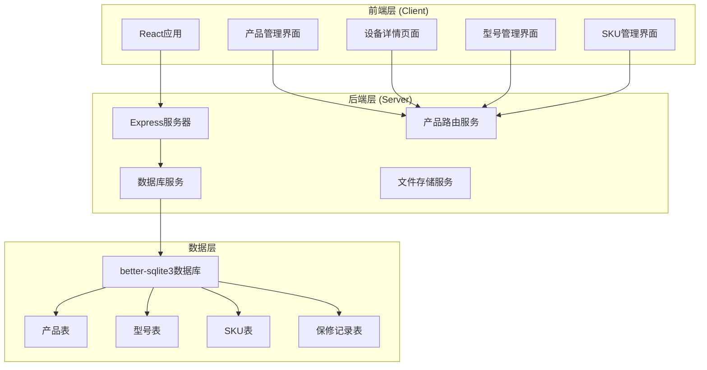
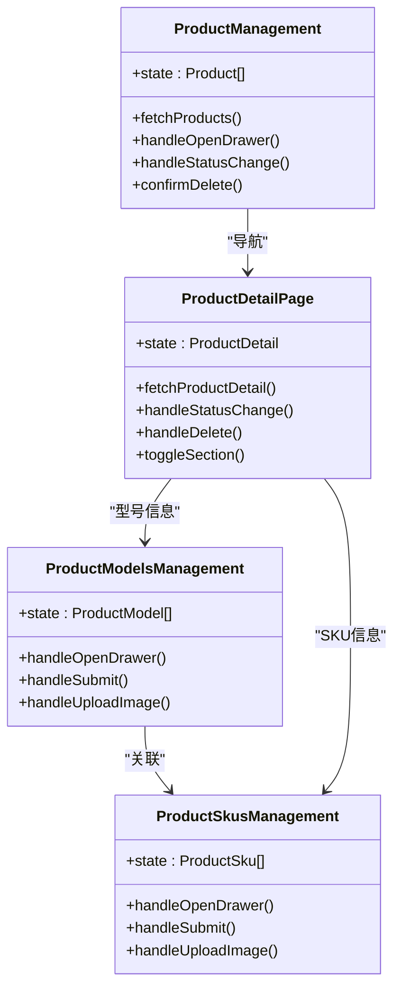
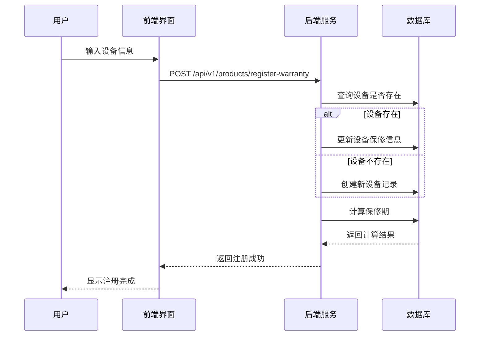
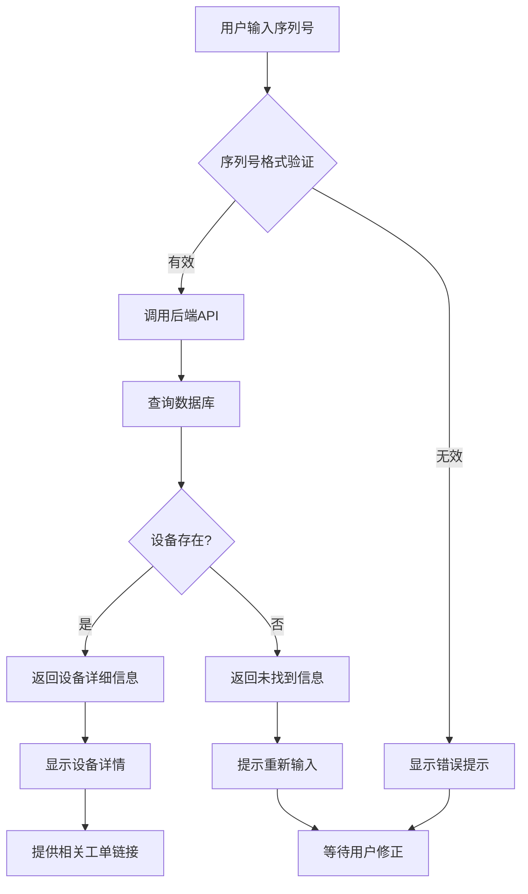
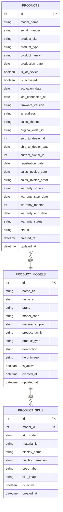
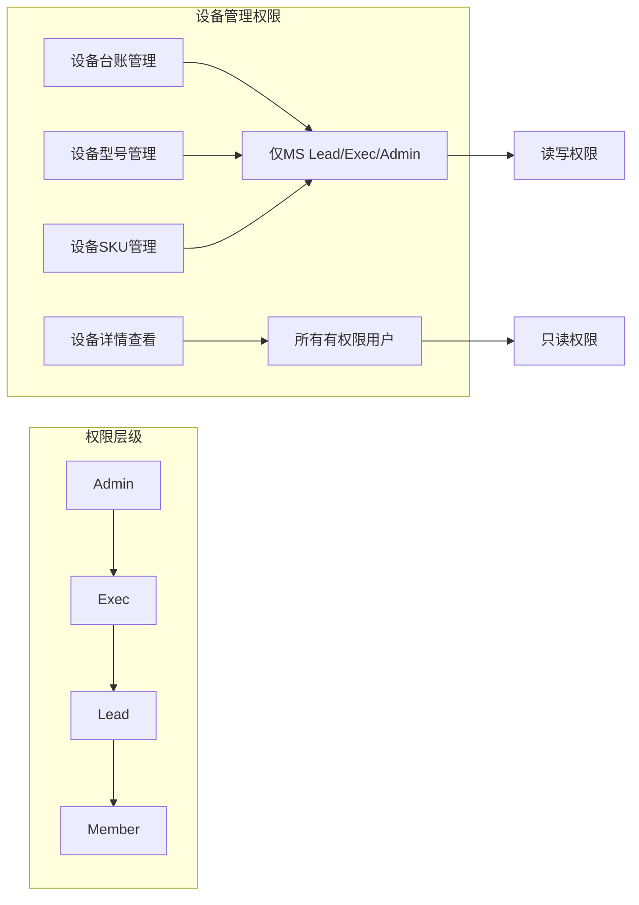
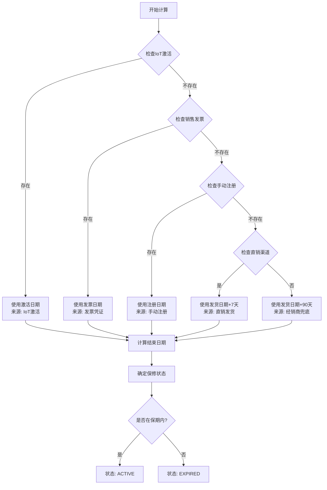
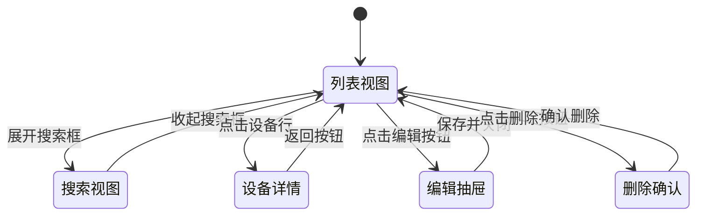
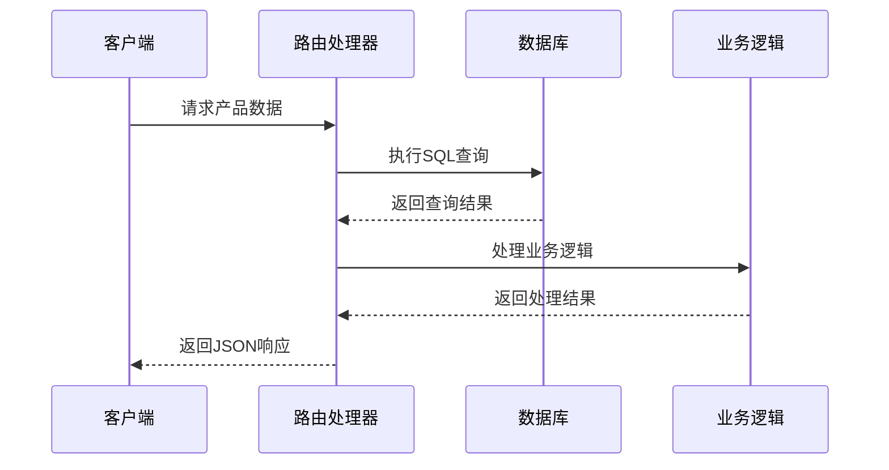

# 设备台账管理

<cite>
**本文档引用的文件**
- [App.tsx](file://client/src/App.tsx)
- [ProductManagement.tsx](file://client/src/components/ProductManagement.tsx)
- [ProductDetailPage.tsx](file://client/src/components/ProductDetailPage.tsx)
- [ProductModelsManagement.tsx](file://client/src/components/ProductModelsManagement.tsx)
- [ProductSkusManagement.tsx](file://client/src/components/ProductSkusManagement.tsx)
- [products.js](file://server/service/routes/products.js)
- [index.js](file://server/index.js)
</cite>

## 目录
1. [项目概述](#项目概述)
2. [系统架构](#系统架构)
3. [核心组件](#核心组件)
4. [设备台账管理流程](#设备台账管理流程)
5. [数据模型设计](#数据模型设计)
6. [权限控制机制](#权限控制机制)
7. [保修计算引擎](#保修计算引擎)
8. [前端组件分析](#前端组件分析)
9. [后端服务分析](#后端服务分析)
10. [总结与建议](#总结与建议)

## 项目概述

设备台账管理系统是Longhorn项目中的核心功能模块，负责管理公司所有设备资产的全生命周期。该系统基于React前端框架和Node.js后端技术栈构建，采用现代化的企业级应用架构。

系统主要功能包括：
- 设备资产的全生命周期管理
- 保修状态跟踪与计算
- 设备型号与规格管理
- 权限控制与访问管理
- 数据导入导出与备份

## 系统架构

**图表来源**
- [App.tsx:182-366](file://client/src/App.tsx#L182-L366)
- [products.js:7-341](file://server/service/routes/products.js#L7-L341)

## 核心组件

### 设备台账管理组件

系统包含四个核心的设备管理组件：

**图表来源**
- [ProductManagement.tsx:77-250](file://client/src/components/ProductManagement.tsx#L77-L250)
- [ProductDetailPage.tsx:62-160](file://client/src/components/ProductDetailPage.tsx#L62-L160)
- [ProductModelsManagement.tsx:70-140](file://client/src/components/ProductModelsManagement.tsx#L70-L140)
- [ProductSkusManagement.tsx:35-95](file://client/src/components/ProductSkusManagement.tsx#L35-L95)

**章节来源**
- [ProductManagement.tsx:1-800](file://client/src/components/ProductManagement.tsx#L1-L800)
- [ProductDetailPage.tsx:1-764](file://client/src/components/ProductDetailPage.tsx#L1-L764)
- [ProductModelsManagement.tsx:1-800](file://client/src/components/ProductModelsManagement.tsx#L1-L800)
- [ProductSkusManagement.tsx:1-440](file://client/src/components/ProductSkusManagement.tsx#L1-L440)

## 设备台账管理流程

### 设备注册流程

**图表来源**
- [products.js:136-285](file://server/service/routes/products.js#L136-L285)

### 设备查询流程

**图表来源**
- [products.js:37-120](file://server/service/routes/products.js#L37-L120)

**章节来源**
- [products.js:1-341](file://server/service/routes/products.js#L1-L341)

## 数据模型设计

### 设备主数据模型

系统采用三层数据模型设计，确保数据的一致性和完整性：

**图表来源**
- [ProductManagement.tsx:12-63](file://client/src/components/ProductManagement.tsx#L12-L63)
- [ProductDetailPage.tsx:9-46](file://client/src/components/ProductDetailPage.tsx#L9-L46)
- [ProductModelsManagement.tsx:15-32](file://client/src/components/ProductModelsManagement.tsx#L15-L32)
- [ProductSkusManagement.tsx:19-33](file://client/src/components/ProductSkusManagement.tsx#L19-L33)

### 产品族群分类

系统将产品分为四大族群，每族群具有不同的业务含义：

| 族群代码 | 族群名称 | 产品类型 | 业务含义 |
|---------|----------|----------|----------|
| A | 在售电影机 | CAMERA | 当前销售的电影摄影机 |
| B | 历史机型 | CAMERA | 已停产但仍有效的历史机型 |
| C | 电子寻像器 | VIEWFINDER | Eagle系列电子寻像器 |
| D | 通用配件 | ACCESSORY | 通用配件和附件 |

**章节来源**
- [ProductManagement.tsx:67-72](file://client/src/components/ProductManagement.tsx#L67-L72)
- [ProductModelsManagement.tsx:47-52](file://client/src/components/ProductModelsManagement.tsx#L47-L52)

## 权限控制机制

### 角色权限矩阵

系统采用基于角色的权限控制（RBAC），不同角色具有不同的设备管理权限：

**图表来源**
- [ProductManagement.tsx:247-253](file://client/src/components/ProductManagement.tsx#L247-L253)
- [ProductModelsManagement.tsx:288-291](file://client/src/components/ProductModelsManagement.tsx#L288-L291)
- [ProductSkusManagement.tsx:186-187](file://client/src/components/ProductSkusManagement.tsx#L186-L187)

### 部门访问控制

系统支持按部门维度的访问控制，确保用户只能访问其所属部门的数据：

| 部门代码 | 部门名称 | 访问权限 | 管理范围 |
|---------|----------|----------|----------|
| MS | 市场部 | 完全访问 | 所有设备数据 |
| OP | 运营部 | 读取访问 | 仅限本部门 |
| RD | 研发部 | 读取访问 | 仅限本部门 |
| GE | 综合管理 | 读取访问 | 仅限本部门 |

**章节来源**
- [index.js:655-729](file://server/index.js#L655-L729)

## 保修计算引擎

### 保修期计算逻辑

系统实现了复杂的保修期计算引擎，采用五级水位线逻辑：

**图表来源**
- [products.js:287-337](file://server/service/routes/products.js#L287-L337)

### 保修计算规则

| 计算条件 | 生效日期来源 | 保修时长 | 状态判断 |
|---------|-------------|----------|----------|
| IoT激活 | activation_date | 24个月 | 激活日期+24月 |
| 销售发票 | sales_invoice_date | 24个月 | 发票日期+24月 |
| 手动注册 | registration_date | 24个月 | 注册日期+24月 |
| 直销发货 | ship_to_dealer_date+7天 | 24个月 | 发货+7天+24月 |
| 经销商兜底 | ship_to_dealer_date+90天 | 24个月 | 发货+90天+24月 |

**章节来源**
- [products.js:287-337](file://server/service/routes/products.js#L287-L337)

## 前端组件分析

### 产品管理界面

产品管理界面采用现代化的设计模式，提供了完整的设备资产管理功能：

#### 主要功能特性

1. **多维度筛选**：支持按产品族群、状态、关键字等多条件筛选
2. **批量操作**：支持批量状态变更和删除操作
3. **实时搜索**：提供高效的搜索功能，支持序列号、型号等关键词
4. **状态可视化**：通过颜色编码直观展示设备状态

#### 界面交互流程

**图表来源**
- [ProductManagement.tsx:142-174](file://client/src/components/ProductManagement.tsx#L142-L174)

### 设备详情页面

设备详情页面提供了设备的完整信息展示和操作功能：

#### 核心信息板块

1. **基本信息**：序列号、型号、产品族群、生产日期
2. **物联网状态**：激活状态、连接历史、固件版本
3. **销售溯源**：销售渠道、经销商信息、发货记录
4. **保修信息**：保修状态、计算引擎、有效期
5. **服务历史**：关联工单数量统计

#### 交互设计特点

- **折叠面板**：支持信息板块的展开/收起
- **状态指示器**：实时显示设备状态和保修状态
- **快速操作**：提供常用操作的快捷入口

**章节来源**
- [ProductDetailPage.tsx:62-160](file://client/src/components/ProductDetailPage.tsx#L62-L160)
- [ProductDetailPage.tsx:204-236](file://client/src/components/ProductDetailPage.tsx#L204-L236)

## 后端服务分析

### 产品服务路由

后端服务采用模块化设计，每个功能模块都有独立的路由处理：

#### 核心API接口

| 接口 | 方法 | 功能描述 | 权限要求 |
|------|------|----------|----------|
| /api/v1/products | GET | 获取所有活动产品列表 | 任意登录用户 |
| /api/v1/products/check-warranty | GET | 检查设备保修状态 | 任意登录用户 |
| /api/v1/products/register-warranty | POST | 注册设备保修信息 | Admin/Exec/Lead |
| /api/v1/admin/products | GET | 获取产品列表（管理） | Admin/Exec/Lead |
| /api/v1/admin/products/:id | PUT | 更新产品状态 | Admin/Exec/Lead |
| /api/v1/admin/products/:id | DELETE | 删除产品记录 | Admin/Exec/Lead |

#### 数据库操作流程

**图表来源**
- [products.js:14-30](file://server/service/routes/products.js#L14-L30)
- [products.js:136-285](file://server/service/routes/products.js#L136-L285)

### 数据库设计

系统使用better-sqlite3作为数据库引擎，采用关系型数据模型：

#### 核心表结构

1. **products表**：存储设备主数据
2. **product_models表**：存储产品型号定义
3. **product_skus表**：存储产品规格信息
4. **warranty_records表**：存储保修记录

#### 索引优化策略

- 为常用查询字段建立索引
- 优化搜索性能
- 提高数据检索效率

**章节来源**
- [index.js:159-170](file://server/index.js#L159-L170)
- [products.js:7-341](file://server/service/routes/products.js#L7-L341)

## 总结与建议

### 系统优势

1. **架构清晰**：前后端分离，职责明确
2. **权限完善**：基于角色的细粒度权限控制
3. **功能完整**：覆盖设备管理的全生命周期
4. **用户体验**：现代化的界面设计和交互体验
5. **数据安全**：完善的权限验证和数据保护

### 改进建议

1. **性能优化**：考虑添加缓存机制提升查询性能
2. **监控告警**：增加系统运行状态监控
3. **审计日志**：完善操作审计和变更追踪
4. **移动端适配**：优化移动端用户体验
5. **自动化集成**：与ERP系统进行数据同步

### 技术亮点

- 采用React Hooks实现函数式组件
- 使用Express.js构建RESTful API
- 实现复杂的业务逻辑计算引擎
- 提供完整的权限控制机制
- 支持多语言国际化

该设备台账管理系统为企业提供了完整的设备资产管理解决方案，通过现代化的技术架构和完善的业务功能，有效提升了设备管理的效率和准确性。