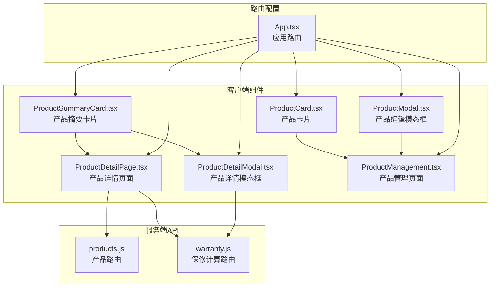
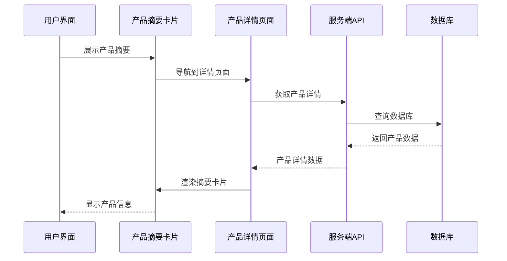
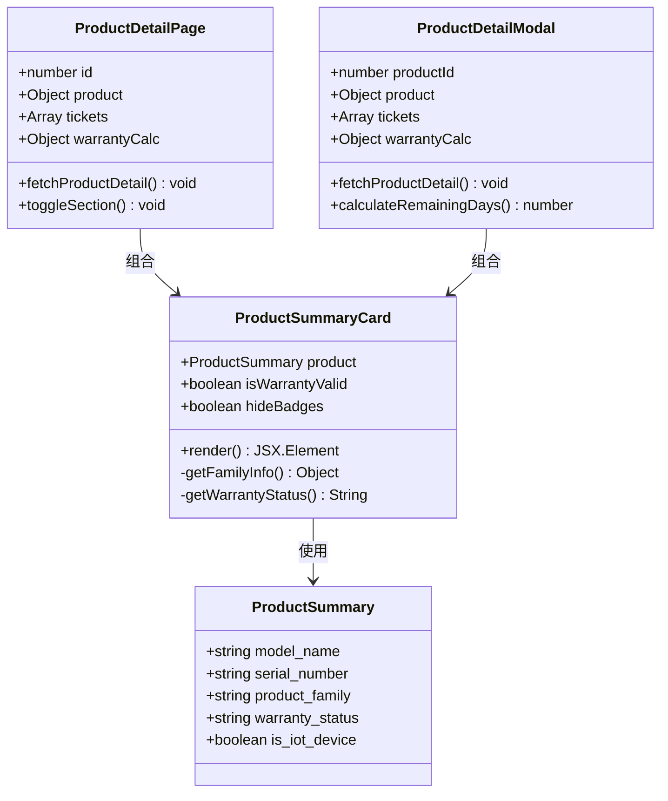
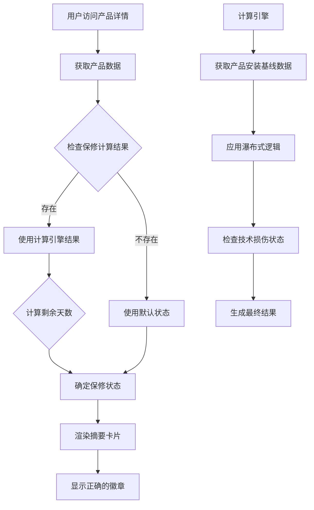
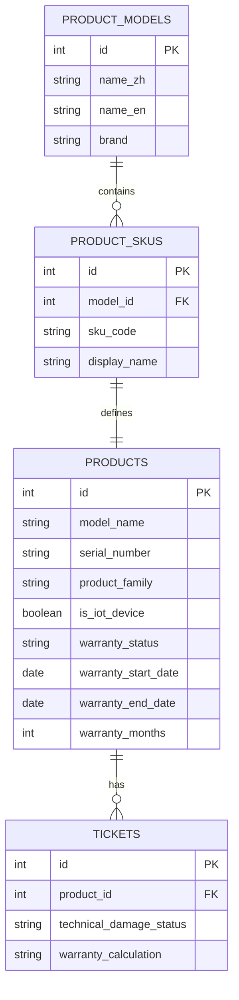
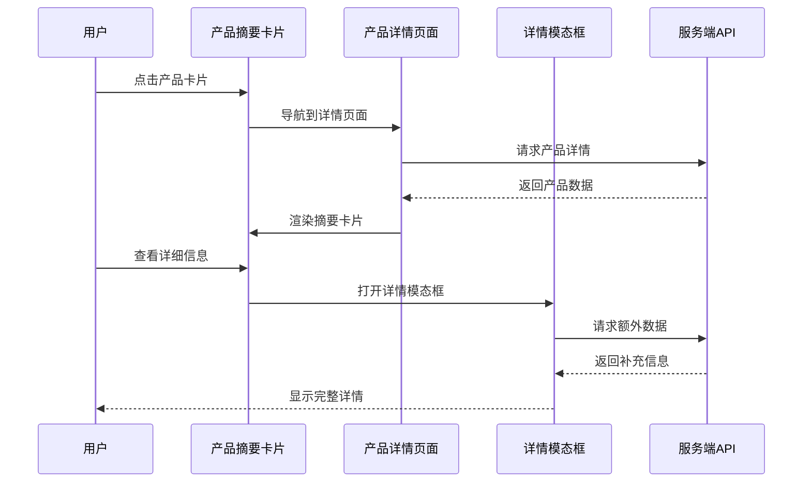
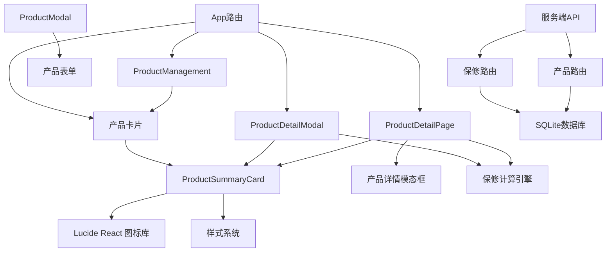
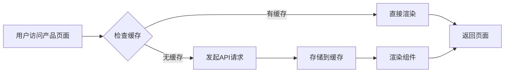

# 产品摘要卡片

<cite>
**本文档引用的文件**
- [ProductSummaryCard.tsx](file://client/src/components/Workspace/ProductSummaryCard.tsx)
- [ProductDetailPage.tsx](file://client/src/components/ProductDetailPage.tsx)
- [ProductDetailModal.tsx](file://client/src/components/ProductDetailModal.tsx)
- [ProductCard.tsx](file://client/src/components/ProductCard.tsx)
- [ProductManagement.tsx](file://client/src/components/ProductManagement.tsx)
- [ProductModal.tsx](file://client/src/components/Workspace/ProductModal.tsx)
- [App.tsx](file://client/src/App.tsx)
- [products.js](file://server/service/routes/products.js)
- [warranty.js](file://server/service/routes/warranty.js)
</cite>

## 目录
1. [简介](#简介)
2. [项目结构](#项目结构)
3. [核心组件](#核心组件)
4. [架构概览](#架构概览)
5. [详细组件分析](#详细组件分析)
6. [依赖关系分析](#依赖关系分析)
7. [性能考虑](#性能考虑)
8. [故障排除指南](#故障排除指南)
9. [结论](#结论)

## 简介

产品摘要卡片是 Longhorn 项目中的一个核心 UI 组件，用于在服务模块中展示产品信息的摘要视图。该组件提供了简洁而直观的产品信息展示，包括产品型号、序列号、产品族群、IoT 设备状态和保修状态等关键信息。

该组件采用现代化的设计风格，使用了玻璃拟态设计（Glassmorphism）和响应式布局，确保在不同设备和屏幕尺寸上都能提供良好的用户体验。组件支持多种显示模式，包括完整的摘要卡片和简化版本，以适应不同的使用场景。

## 项目结构

Longhorn 项目采用模块化的前端架构，产品摘要卡片功能分布在多个相关组件中：

**图表来源**
- [ProductSummaryCard.tsx:1-105](file://client/src/components/Workspace/ProductSummaryCard.tsx#L1-L105)
- [App.tsx:248-266](file://client/src/App.tsx#L248-L266)
- [products.js:1-200](file://server/service/routes/products.js#L1-L200)
- [warranty.js:1-200](file://server/service/routes/warranty.js#L1-L200)

**章节来源**
- [App.tsx:248-266](file://client/src/App.tsx#L248-L266)
- [ProductSummaryCard.tsx:1-105](file://client/src/components/Workspace/ProductSummaryCard.tsx#L1-L105)

## 核心组件

### 产品摘要卡片组件

产品摘要卡片是整个功能的核心组件，负责展示产品的关键信息。该组件具有以下特点：

- **响应式设计**：支持不同屏幕尺寸的自适应布局
- **视觉层次**：通过颜色和字体大小区分信息的重要性
- **交互友好**：提供悬停效果和点击反馈
- **可定制性**：支持隐藏徽章、自定义保修状态等选项

组件的主要属性包括：
- `product`: 包含产品基本信息的对象
- `isWarrantyValid`: 保修状态的布尔值
- `hideBadges`: 控制是否显示徽章的标志

**章节来源**
- [ProductSummaryCard.tsx:19-23](file://client/src/components/Workspace/ProductSummaryCard.tsx#L19-L23)

### 产品详情页面

产品详情页面集成了摘要卡片功能，并提供了更完整的产品信息展示。页面包含多个信息区块，如基本信息、IoT 状态、销售溯源、保修信息和服务历史等。

**章节来源**
- [ProductDetailPage.tsx:407-417](file://client/src/components/ProductDetailPage.tsx#L407-L417)

### 产品详情模态框

产品详情模态框提供了弹窗形式的产品信息展示，适用于需要临时查看产品详情的场景。模态框包含了与详情页面相似的信息结构，但采用了不同的布局方式。

**章节来源**
- [ProductDetailModal.tsx:194-464](file://client/src/components/ProductDetailModal.tsx#L194-L464)

## 架构概览

产品摘要卡片功能的架构设计体现了清晰的分层结构：

**图表来源**
- [ProductDetailPage.tsx:147-161](file://client/src/components/ProductDetailPage.tsx#L147-L161)
- [products.js:48-120](file://server/service/routes/products.js#L48-L120)

系统架构的关键特性：

1. **前后端分离**：前端负责展示逻辑，后端提供数据服务
2. **状态管理**：使用 React Hooks 和 Zustand 进行状态管理
3. **权限控制**：基于用户角色的访问控制机制
4. **响应式设计**：适配不同设备和屏幕尺寸

**章节来源**
- [App.tsx:248-266](file://client/src/App.tsx#L248-L266)
- [ProductDetailPage.tsx:62-115](file://client/src/components/ProductDetailPage.tsx#L62-L115)

## 详细组件分析

### 产品摘要卡片类图

**图表来源**
- [ProductSummaryCard.tsx:4-23](file://client/src/components/Workspace/ProductSummaryCard.tsx#L4-L23)
- [ProductDetailPage.tsx:9-46](file://client/src/components/ProductDetailPage.tsx#L9-L46)
- [ProductDetailModal.tsx:10-54](file://client/src/components/ProductDetailModal.tsx#L10-L54)

### 保修计算流程

产品摘要卡片与保修系统的集成体现了复杂的业务逻辑：

**图表来源**
- [ProductDetailPage.tsx:104-115](file://client/src/components/ProductDetailPage.tsx#L104-L115)
- [ProductDetailModal.tsx:80-101](file://client/src/components/ProductDetailModal.tsx#L80-L101)

### 数据模型关系

**图表来源**
- [products.js:48-120](file://server/service/routes/products.js#L48-L120)
- [warranty.js:43-125](file://server/service/routes/warranty.js#L43-L125)

**章节来源**
- [ProductSummaryCard.tsx:25-101](file://client/src/components/Workspace/ProductSummaryCard.tsx#L25-L101)
- [ProductDetailPage.tsx:199-202](file://client/src/components/ProductDetailPage.tsx#L199-L202)

### 组件交互序列

**图表来源**
- [ProductDetailPage.tsx:594-596](file://client/src/components/ProductDetailPage.tsx#L594-L596)
- [ProductDetailModal.tsx:195-464](file://client/src/components/ProductDetailModal.tsx#L195-L464)

**章节来源**
- [ProductManagement.tsx:586-596](file://client/src/components/ProductManagement.tsx#L586-L596)
- [ProductCard.tsx:4-66](file://client/src/components/ProductCard.tsx#L4-L66)

## 依赖关系分析

### 组件依赖图

**图表来源**
- [App.tsx:248-266](file://client/src/App.tsx#L248-L266)
- [ProductSummaryCard.tsx:1-2](file://client/src/components/Workspace/ProductSummaryCard.tsx#L1-L2)
- [ProductDetailPage.tsx:1-8](file://client/src/components/ProductDetailPage.tsx#L1-L8)

### 外部依赖

系统依赖的关键外部库和工具：

- **React 18**: 核心框架，提供组件化开发能力
- **Lucide React**: 图标库，提供统一的图标系统
- **Axios**: HTTP 客户端，处理 API 通信
- **Zustand**: 状态管理库，替代 Redux 的轻量级解决方案
- **Express**: 服务端框架，提供 RESTful API
- **SQLite**: 数据存储，支持本地开发和测试

**章节来源**
- [ProductSummaryCard.tsx:1-2](file://client/src/components/Workspace/ProductSummaryCard.tsx#L1-L2)
- [ProductDetailPage.tsx:3-5](file://client/src/components/ProductDetailPage.tsx#L3-L5)

## 性能考虑

### 渲染优化

产品摘要卡片组件在设计时充分考虑了性能优化：

1. **条件渲染**: 徽章组件只有在需要时才渲染
2. **样式内联**: 使用内联样式减少样式计算开销
3. **事件委托**: 减少事件监听器的数量
4. **懒加载**: 详情内容按需加载

### 数据缓存策略

**图表来源**
- [ProductDetailPage.tsx:147-161](file://client/src/components/ProductDetailPage.tsx#L147-L161)

### 内存管理

- **自动清理**: 组件卸载时自动清理事件监听器
- **状态重置**: 页面切换时重置组件状态
- **资源释放**: 模态框关闭时释放相关资源

## 故障排除指南

### 常见问题诊断

1. **产品信息不显示**
   - 检查网络连接状态
   - 验证用户权限
   - 确认产品 ID 有效性

2. **保修状态错误**
   - 检查计算引擎日志
   - 验证产品数据完整性
   - 确认技术损伤状态

3. **组件渲染异常**
   - 检查 React 版本兼容性
   - 验证依赖包完整性
   - 查看浏览器控制台错误

### 调试技巧

- **开发者工具**: 使用 React DevTools 分析组件树
- **网络监控**: 检查 API 响应时间和错误
- **状态检查**: 验证组件状态的正确性
- **性能分析**: 使用 Performance 面板分析渲染性能

**章节来源**
- [ProductDetailPage.tsx:77-89](file://client/src/components/ProductDetailPage.tsx#L77-L89)
- [ProductDetailModal.tsx:133-147](file://client/src/components/ProductDetailModal.tsx#L133-L147)

## 结论

产品摘要卡片功能展现了 Longhorn 项目在用户体验设计和系统架构方面的优秀实践。该功能通过精心设计的组件结构、清晰的数据流和完善的错误处理机制，为用户提供了直观而高效的产品信息浏览体验。

主要成就包括：

1. **设计理念**: 采用现代化的玻璃拟态设计，提供沉浸式的视觉体验
2. **功能完整性**: 集成了产品信息展示、保修状态查询和详细信息导航
3. **性能优化**: 通过多种优化策略确保流畅的用户体验
4. **可维护性**: 清晰的代码结构和模块化设计便于后续维护和扩展

该功能为整个服务模块奠定了坚实的基础，为用户提供了强大的产品信息管理能力，同时也为其他相关功能的开发提供了良好的参考模板。