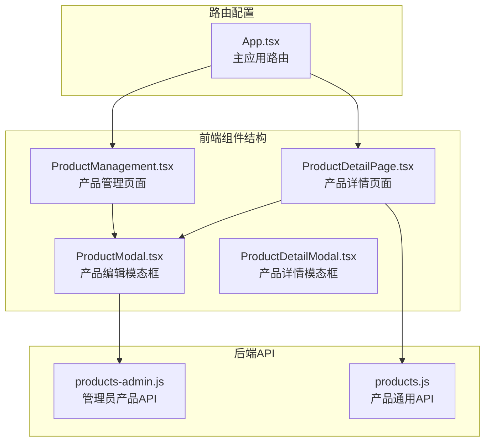
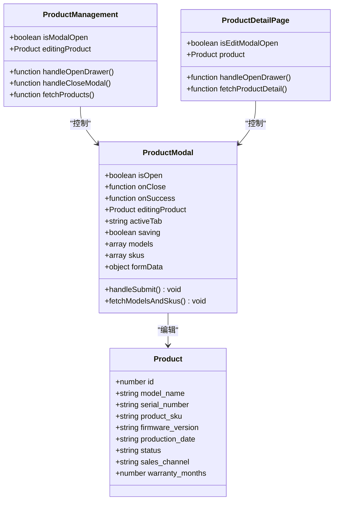
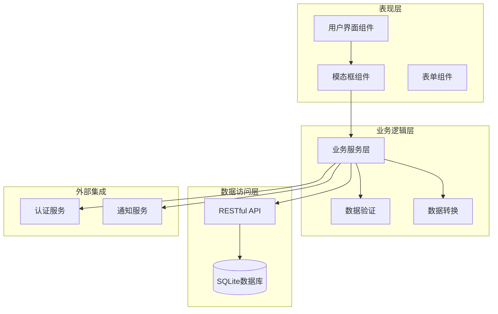
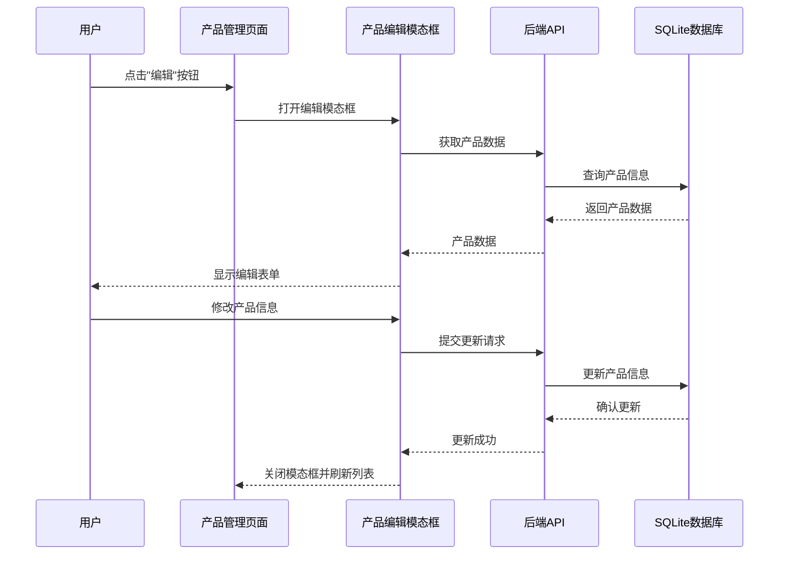
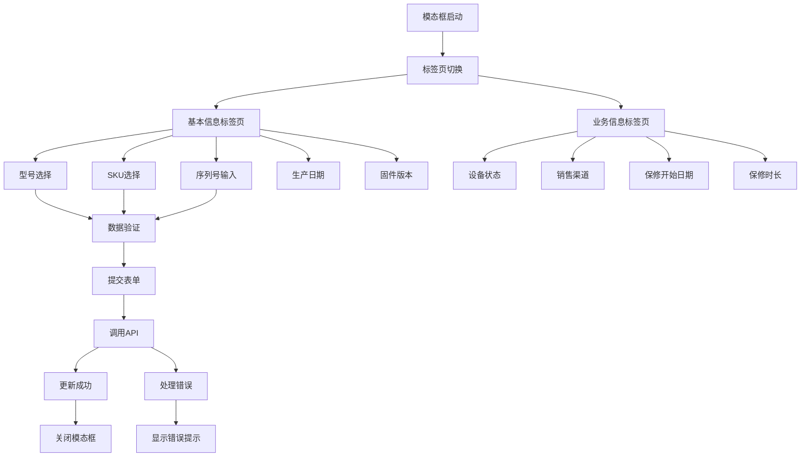
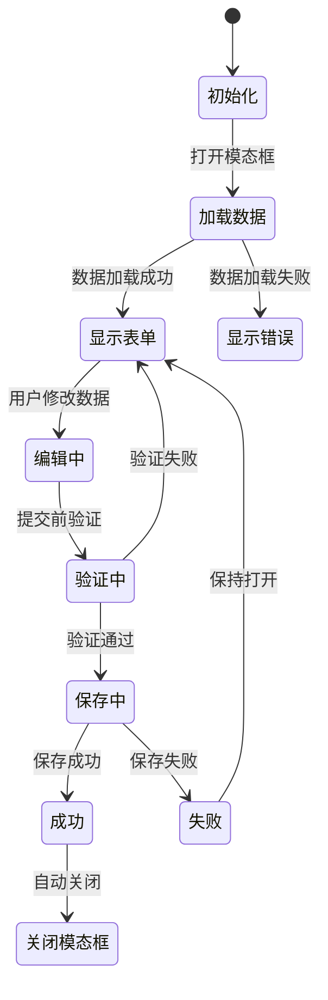
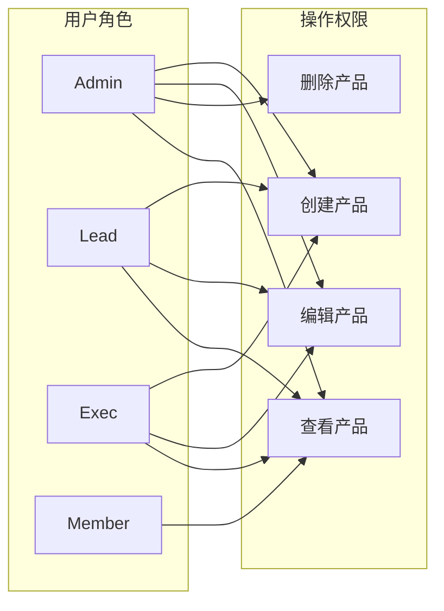
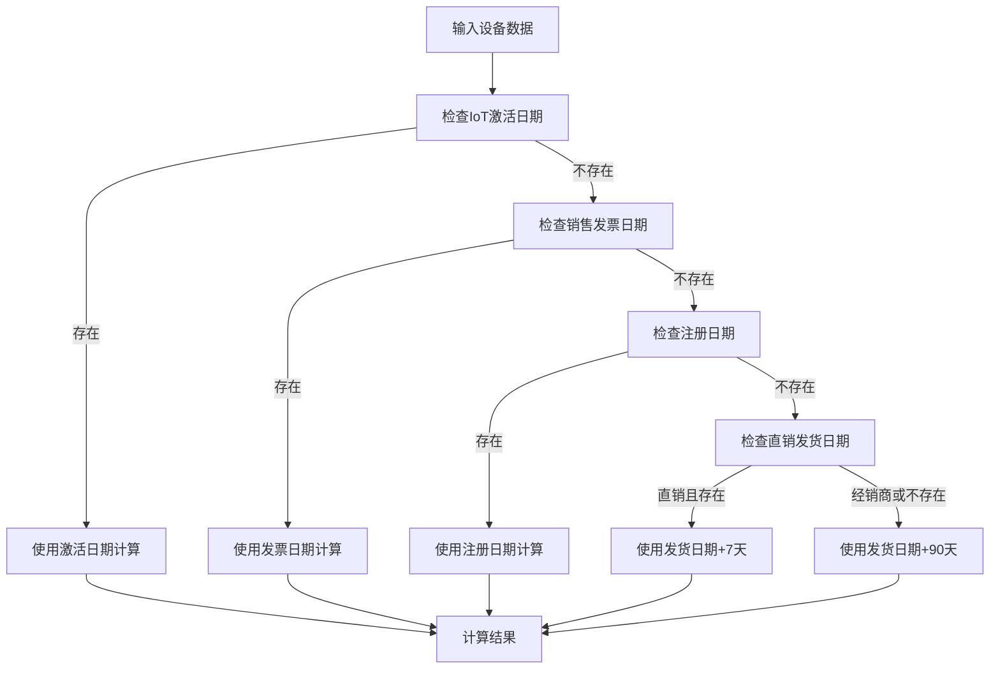
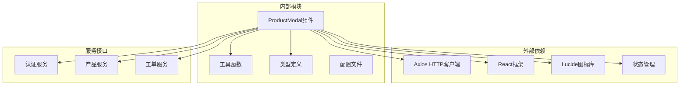
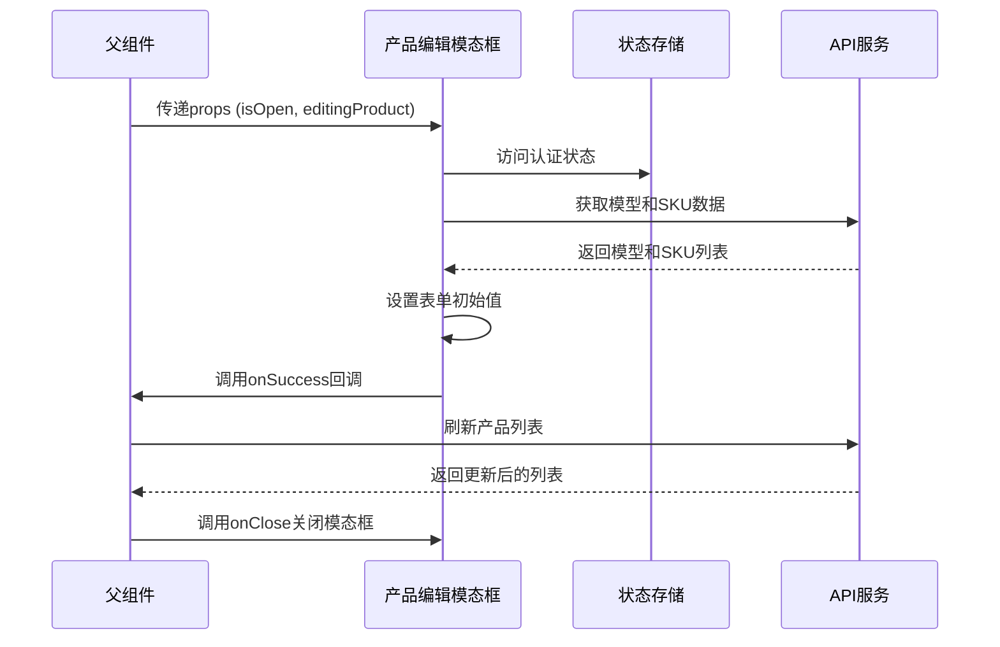

# 产品编辑模态框

<cite>
**本文档引用的文件**
- [client/src/components/Workspace/ProductModal.tsx](file://client/src/components/Workspace/ProductModal.tsx)
- [client/src/components/ProductDetailPage.tsx](file://client/src/components/ProductDetailPage.tsx)
- [client/src/components/ProductManagement.tsx](file://client/src/components/ProductManagement.tsx)
- [client/src/App.tsx](file://client/src/App.tsx)
- [server/service/routes/products-admin.js](file://server/service/routes/products-admin.js)
- [server/service/routes/products.js](file://server/service/routes/products.js)
</cite>

## 目录
1. [简介](#简介)
2. [项目结构](#项目结构)
3. [核心组件](#核心组件)
4. [架构概览](#架构概览)
5. [详细组件分析](#详细组件分析)
6. [依赖关系分析](#依赖关系分析)
7. [性能考虑](#性能考虑)
8. [故障排除指南](#故障排除指南)
9. [结论](#结论)

## 简介

产品编辑模态框是 Longhorn 服务管理系统中的核心功能模块，用于管理和编辑设备台账信息。该模态框提供了完整的 CRUD 操作能力，支持设备信息的添加、编辑、查询和删除功能。系统采用前后端分离架构，前端使用 React 构建用户界面，后端基于 Node.js 和 SQLite 数据库提供 RESTful API 接口。

该模态框集成了多种业务功能，包括设备状态管理、保修信息计算、销售溯源追踪等高级特性。通过现代化的 UI 设计和响应式布局，为用户提供直观易用的操作体验。

## 项目结构

Longhorn 项目的前端代码主要位于 `client/src/components/` 目录下，产品编辑模态框相关的组件分布在多个文件中：

**图表来源**
- [client/src/components/ProductManagement.tsx:1-973](file://client/src/components/ProductManagement.tsx#L1-L973)
- [client/src/components/Workspace/ProductModal.tsx:1-342](file://client/src/components/Workspace/ProductModal.tsx#L1-L342)
- [client/src/App.tsx:248-267](file://client/src/App.tsx#L248-L267)

**章节来源**
- [client/src/components/ProductManagement.tsx:1-973](file://client/src/components/ProductManagement.tsx#L1-L973)
- [client/src/components/Workspace/ProductModal.tsx:1-342](file://client/src/components/Workspace/ProductModal.tsx#L1-L342)
- [client/src/App.tsx:1-800](file://client/src/App.tsx#L1-L800)

## 核心组件

产品编辑模态框系统由多个相互协作的组件构成，每个组件都有明确的职责分工：

### 主要组件架构

**图表来源**
- [client/src/components/Workspace/ProductModal.tsx:52-137](file://client/src/components/Workspace/ProductModal.tsx#L52-L137)
- [client/src/components/ProductManagement.tsx:96-204](file://client/src/components/ProductManagement.tsx#L96-L204)
- [client/src/components/ProductDetailPage.tsx:62-161](file://client/src/components/ProductDetailPage.tsx#L62-L161)

### 数据模型设计

产品编辑模态框使用了完整的产品数据模型，支持多种设备属性：

| 字段类别 | 字段名称 | 数据类型 | 描述 |
|---------|----------|----------|------|
| 基本信息 | model_name | string | 型号名称 |
| 基本信息 | serial_number | string | 序列号 |
| 基本信息 | product_sku | string | 产品SKU |
| 基本信息 | firmware_version | string | 固件版本 |
| 基本信息 | production_date | string | 生产日期 |
| 基本信息 | description | string | 产品描述 |
| 设备状态 | status | enum | 设备状态 (ACTIVE/IN_REPAIR/STOLEN/SCRAPPED) |
| 销售渠道 | sales_channel | enum | 销售渠道 (DIRECT/DEALER) |
| 保修信息 | warranty_start_date | string | 保修开始日期 |
| 保修信息 | warranty_months | number | 保修时长(月) |

**章节来源**
- [client/src/components/Workspace/ProductModal.tsx:6-37](file://client/src/components/Workspace/ProductModal.tsx#L6-L37)
- [client/src/components/Workspace/ProductModal.tsx:52-57](file://client/src/components/Workspace/ProductModal.tsx#L52-L57)

## 架构概览

产品编辑模态框采用分层架构设计，确保了良好的可维护性和扩展性：

**图表来源**
- [client/src/components/Workspace/ProductModal.tsx:59-137](file://client/src/components/Workspace/ProductModal.tsx#L59-L137)
- [server/service/routes/products-admin.js:25-115](file://server/service/routes/products-admin.js#L25-L115)

### 数据流处理

**图表来源**
- [client/src/components/ProductManagement.tsx:192-204](file://client/src/components/ProductManagement.tsx#L192-L204)
- [client/src/components/Workspace/ProductModal.tsx:111-137](file://client/src/components/Workspace/ProductModal.tsx#L111-L137)
- [server/service/routes/products-admin.js:311-461](file://server/service/routes/products-admin.js#L311-L461)

**章节来源**
- [client/src/components/ProductManagement.tsx:170-175](file://client/src/components/ProductManagement.tsx#L170-L175)
- [client/src/components/Workspace/ProductModal.tsx:77-96](file://client/src/components/Workspace/ProductModal.tsx#L77-L96)

## 详细组件分析

### 产品编辑模态框核心实现

产品编辑模态框是整个系统的核心组件，提供了完整的设备信息管理功能：

#### 表单设计与布局

**图表来源**
- [client/src/components/Workspace/ProductModal.tsx:212-317](file://client/src/components/Workspace/ProductModal.tsx#L212-L317)

#### 数据验证机制

模态框实现了多层次的数据验证机制：

1. **必填字段验证**: 型号名称为必填项
2. **格式验证**: 序列号、日期格式等
3. **业务规则验证**: 设备状态枚举值验证
4. **后端验证**: 通过 API 调用进行最终验证

#### 状态管理

**图表来源**
- [client/src/components/Workspace/ProductModal.tsx:61-96](file://client/src/components/Workspace/ProductModal.tsx#L61-L96)

**章节来源**
- [client/src/components/Workspace/ProductModal.tsx:111-137](file://client/src/components/Workspace/ProductModal.tsx#L111-L137)
- [client/src/components/Workspace/ProductModal.tsx:212-317](file://client/src/components/Workspace/ProductModal.tsx#L212-L317)

### 产品管理页面集成

产品管理页面作为模态框的主要触发源，提供了完整的设备列表管理功能：

#### 列表展示与交互

产品管理页面集成了多种交互功能：

- **搜索过滤**: 支持按型号、序列号等关键词搜索
- **状态筛选**: 按设备状态进行分类筛选
- **排序功能**: 支持多字段排序
- **批量操作**: 支持批量状态变更
- **分页导航**: 支持大数据量分页浏览

#### 操作权限控制

**图表来源**
- [client/src/components/ProductManagement.tsx:247-253](file://client/src/components/ProductManagement.tsx#L247-L253)

**章节来源**
- [client/src/components/ProductManagement.tsx:263-532](file://client/src/components/ProductManagement.tsx#L263-L532)

### 详情页面集成

产品详情页面提供了更丰富的设备信息展示和编辑功能：

#### 信息面板设计

详情页面包含多个信息面板：

- **基本信息面板**: 展示设备基本属性
- **物联网状态面板**: 展示设备联网状态
- **销售溯源面板**: 展示销售相关信息
- **保修信息面板**: 展示保修状态和计算结果
- **服务历史面板**: 展示相关工单记录

#### 保修计算引擎

详情页面集成了智能的保修计算引擎，能够根据多种因素自动计算设备的保修状态：

**图表来源**
- [server/service/routes/products.js:288-337](file://server/service/routes/products.js#L288-L337)

**章节来源**
- [client/src/components/ProductDetailPage.tsx:472-575](file://client/src/components/ProductDetailPage.tsx#L472-L575)

## 依赖关系分析

产品编辑模态框系统具有清晰的依赖层次结构：

**图表来源**
- [client/src/components/Workspace/ProductModal.tsx:1-5](file://client/src/components/Workspace/ProductModal.tsx#L1-L5)

### 组件间通信

**图表来源**
- [client/src/components/Workspace/ProductModal.tsx:59-96](file://client/src/components/Workspace/ProductModal.tsx#L59-L96)

**章节来源**
- [client/src/components/Workspace/ProductModal.tsx:59-96](file://client/src/components/Workspace/ProductModal.tsx#L59-L96)

## 性能考虑

产品编辑模态框在设计时充分考虑了性能优化：

### 数据加载优化

- **并发请求**: 模型和SKU数据采用并发加载，减少等待时间
- **缓存策略**: 已加载的模型和SKU数据进行本地缓存
- **懒加载**: 仅在模态框打开时才加载相关数据

### 渲染性能

- **条件渲染**: 使用条件渲染避免不必要的DOM更新
- **受控组件**: 使用受控组件模式提高表单响应速度
- **防抖处理**: 对搜索和输入操作进行防抖处理

### 内存管理

- **清理机制**: 组件卸载时清理定时器和事件监听器
- **状态重置**: 模态框关闭时重置表单状态
- **引用优化**: 使用useRef优化DOM引用管理

## 故障排除指南

### 常见问题及解决方案

#### 模态框无法打开

**问题症状**: 点击编辑按钮后模态框不显示

**可能原因**:
1. 权限不足
2. 网络请求失败
3. 数据格式错误

**解决步骤**:
1. 检查用户角色是否具有编辑权限
2. 查看浏览器开发者工具的网络面板
3. 验证产品数据格式是否正确

#### 数据保存失败

**问题症状**: 提交表单后出现保存错误

**可能原因**:
1. 必填字段缺失
2. 数据格式不正确
3. 后端服务异常

**解决步骤**:
1. 检查必填字段是否填写完整
2. 验证数据格式符合要求
3. 查看后端API响应状态

#### 数据同步问题

**问题症状**: 模态框关闭后列表数据未更新

**可能原因**:
1. 回调函数未正确调用
2. 状态更新失败
3. 缓存未刷新

**解决步骤**:
1. 确认onSuccess回调正常执行
2. 检查状态更新逻辑
3. 强制刷新产品列表

**章节来源**
- [client/src/components/Workspace/ProductModal.tsx:131-136](file://client/src/components/Workspace/ProductModal.tsx#L131-L136)
- [client/src/components/ProductManagement.tsx:842-848](file://client/src/components/ProductManagement.tsx#L842-L848)

## 结论

产品编辑模态框是 Longhorn 服务管理系统中的重要组成部分，它通过精心设计的架构和完善的组件体系，为用户提供了强大而便捷的设备管理功能。

### 主要优势

1. **用户体验优秀**: 现代化的界面设计和流畅的交互体验
2. **功能完整性**: 支持完整的 CRUD 操作和高级业务功能
3. **权限控制严格**: 基于角色的细粒度权限管理
4. **数据一致性**: 完善的数据验证和错误处理机制
5. **性能优化**: 多层次的性能优化策略

### 技术特点

- 采用前后端分离架构，便于维护和扩展
- 使用 TypeScript 提供类型安全保证
- 实现响应式设计，支持多设备访问
- 集成现代化的 UI 组件库
- 提供完整的国际化支持

### 发展方向

未来可以考虑的功能增强：
- 添加更多设备属性和自定义字段
- 集成设备监控和告警功能
- 增强报表和数据分析能力
- 优化移动端用户体验
- 扩展与其他系统的集成能力

产品编辑模态框为 Longhorn 系统提供了坚实的基础，为后续的功能扩展和系统升级奠定了良好的技术基础。