# 产品详情页面组件

<cite>
**本文档引用的文件**
- [ProductDetailPage.tsx](file://client/src/components/ProductDetailPage.tsx)
- [ProductDetailModal.tsx](file://client/src/components/ProductDetailModal.tsx)
- [ProductModelDetailPage.tsx](file://client/src/components/ProductModelDetailPage.tsx)
- [ProductSkuDetailPage.tsx](file://client/src/components/ProductSkuDetailPage.tsx)
- [ProductSummaryCard.tsx](file://client/src/components/Workspace/ProductSummaryCard.tsx)
- [ProductModal.tsx](file://client/src/components/Workspace/ProductModal.tsx)
- [products-admin.js](file://server/service/routes/products-admin.js)
- [context.js](file://server/service/routes/context.js)
- [warranty.js](file://server/service/routes/warranty.js)
- [Service PRD_P2.md](file://docs/Service PRD_P2.md)
- [Service_PRD_P2_warranty_update.md](file://docs/Service_PRD_P2_warranty_update.md)
</cite>

## 更新摘要
**变更内容**
- 新增模型和SKU层级详情页面，提供三层产品信息视图
- 重构产品详情页面，增强三层次导航流架构支持
- 集成先进的瀑布流保修计算引擎和可视化展示
- 实现实时服务历史数据跟踪和工单统计
- 完善产品管理、编辑和删除功能
- 更新API调用和数据处理逻辑

## 目录
1. [简介](#简介)
2. [项目结构](#项目结构)
3. [核心组件](#核心组件)
4. [架构概览](#架构概览)
5. [详细组件分析](#详细组件分析)
6. [依赖关系分析](#依赖关系分析)
7. [性能考虑](#性能考虑)
8. [故障排除指南](#故障排除指南)
9. [结论](#结论)

## 简介

产品详情页面组件是Longhorn系统中用于展示和管理产品信息的核心界面组件。该组件提供了完整的设备资产管理功能，包括产品基本信息、物联网状态、销售溯源、所有权信息、保修信息和服务历史等模块化展示。

**更新** 新版本重大增强了三层次导航流支持，集成了先进的瀑布流保修计算引擎，并实现了与上下文API的实时服务历史集成，为用户提供更加智能化的产品信息浏览体验。同时新增了模型和SKU层级的详细信息展示，提供完整的三层产品信息视图。

该组件采用现代化的React开发模式，结合TypeScript类型安全性和Material Design风格设计，为用户提供直观的产品信息浏览体验。组件支持管理员权限控制，提供产品状态管理和删除功能，并集成了响应式布局设计。

## 项目结构

产品详情页面组件位于客户端React应用的组件目录中，与产品管理、产品模型管理、产品SKU管理等相关组件形成完整的资产管理生态系统。

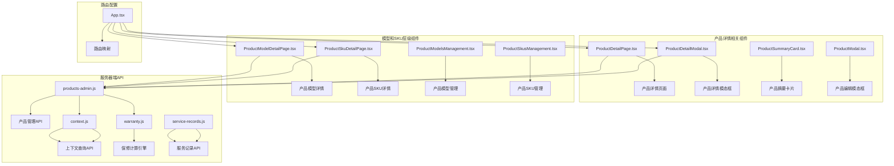

**图表来源**
- [ProductDetailPage.tsx:1-764](file://client/src/components/ProductDetailPage.tsx#L1-L764)
- [ProductDetailModal.tsx:1-652](file://client/src/components/ProductDetailModal.tsx#L1-L652)
- [ProductModelDetailPage.tsx:1-357](file://client/src/components/ProductModelDetailPage.tsx#L1-L357)
- [ProductSkuDetailPage.tsx:1-331](file://client/src/components/ProductSkuDetailPage.tsx#L1-L331)
- [products-admin.js:528-585](file://server/service/routes/products-admin.js#L528-L585)
- [context.js:346-480](file://server/service/routes/context.js#L346-L480)
- [warranty.js:1-200](file://server/service/routes/warranty.js#L1-L200)

**章节来源**
- [ProductDetailPage.tsx:1-50](file://client/src/components/ProductDetailPage.tsx#L1-L50)
- [ProductDetailModal.tsx:1-50](file://client/src/components/ProductDetailModal.tsx#L1-L50)
- [ProductModelDetailPage.tsx:1-50](file://client/src/components/ProductModelDetailPage.tsx#L1-L50)
- [ProductSkuDetailPage.tsx:1-50](file://client/src/components/ProductSkuDetailPage.tsx#L1-L50)

## 核心组件

### 产品详情页面组件

产品详情页面组件是基于函数式组件的现代化实现，采用React Hooks进行状态管理，提供了完整的CRUD操作能力。

**更新** 新版本引入了三层次导航流架构，支持更精细的权限控制和功能组织。

#### 主要特性
- **模块化信息展示**：将产品信息分为物理身份、物联网状态、销售溯源、所有权、保修信息和服务历史六大模块
- **动态状态管理**：使用useState和useEffect处理组件状态和生命周期
- **权限控制**：基于用户角色的访问控制机制
- **响应式设计**：自适应不同屏幕尺寸的布局
- **错误处理**：完善的异常捕获和用户反馈机制
- **三层次导航流**：支持动态分段的导航架构
- **实时数据集成**：与上下文API的深度集成
- **增强的保修计算**：集成瀑布流计算引擎
- **交互式工单列表**：支持展开查看详细信息

#### 数据结构设计

组件定义了完整的ProductDetail接口，涵盖产品全生命周期的所有关键信息：

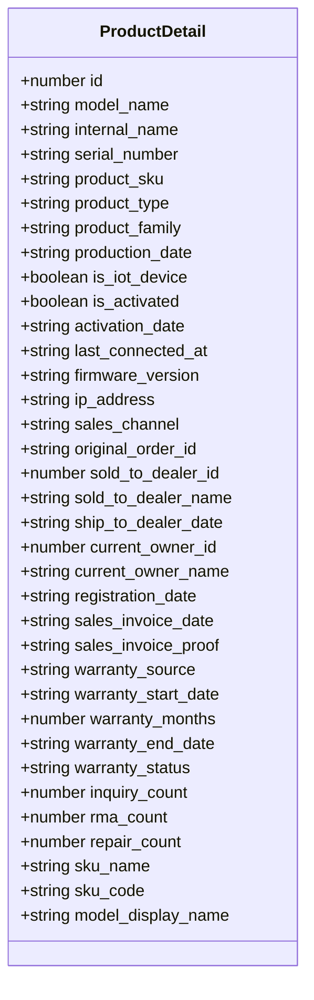

**图表来源**
- [ProductDetailPage.tsx:9-46](file://client/src/components/ProductDetailPage.tsx#L9-L46)

**章节来源**
- [ProductDetailPage.tsx:9-46](file://client/src/components/ProductDetailPage.tsx#L9-L46)

### 产品详情模态框组件

产品详情模态框组件提供了轻量级的产品信息展示功能，适用于在其他页面中快速查看产品详情。

**更新** 新版本增强了模态框的交互能力和数据展示效果，支持更丰富的用户操作。

#### 设计特点
- **嵌入式设计**：作为其他组件的子元素显示
- **紧凑布局**：优化的空间利用率
- **统一样式**：与主页面组件保持一致的设计语言
- **事件处理**：完整的用户交互支持
- **实时服务历史**：集成上下文查询API
- **保修计算可视化**：展示详细的保修计算过程
- **交互式工单列表**：支持展开查看详细信息

**章节来源**
- [ProductDetailModal.tsx:80-147](file://client/src/components/ProductDetailModal.tsx#L80-L147)

### 产品模型详情页面组件

**新增** 产品模型详情页面组件提供了产品模型级别的详细信息展示，支持模型的基本规格参数和关联SKU的查看。

#### 主要特性
- **模型基本信息展示**：包括型号代码、品牌、物料号前缀、创建时间等
- **关联SKU管理**：展示与该模型关联的所有SKU及其状态
- **响应式网格布局**：支持SKU列表的自适应显示
- **权限控制**：基于用户角色的编辑权限控制
- **导航集成**：与产品模型管理页面的无缝集成

**章节来源**
- [ProductModelDetailPage.tsx:46-115](file://client/src/components/ProductModelDetailPage.tsx#L46-L115)

### 产品SKU详情页面组件

**新增** 产品SKU详情页面组件提供了产品SKU级别的详细信息展示，支持SKU规格参数和所属型号的查看。

#### 主要特性
- **SKU规格参数展示**：包括SKU代码、物料号、规格标签、创建时间等
- **所属型号信息**：展示SKU所属的产品模型及其家族分类
- **关联设备统计**：显示与该SKU关联的在役设备数量
- **导航集成**：支持返回产品模型详情页面
- **权限控制**：基于用户角色的编辑权限控制

**章节来源**
- [ProductSkuDetailPage.tsx:28-86](file://client/src/components/ProductSkuDetailPage.tsx#L28-L86)

### 产品摘要卡片组件

**新增** 产品摘要卡片组件提供了产品信息的简洁展示，支持在详情页面顶部显示关键信息。

#### 设计特点
- **简洁信息展示**：突出显示产品型号、序列号和产品家族
- **状态徽章**：显示IoT设备标识和保修状态
- **响应式布局**：自适应不同屏幕尺寸
- **可配置显示**：支持隐藏徽章的选项
- **主题适配**：与整体设计系统的颜色体系保持一致

**章节来源**
- [ProductSummaryCard.tsx:25-101](file://client/src/components/Workspace/ProductSummaryCard.tsx#L25-L101)

### 产品编辑模态框组件

**新增** 产品编辑模态框组件提供了产品信息的编辑功能，支持基本业务信息的修改。

#### 主要特性
- **双标签页设计**：基本信息和业务信息的分组展示
- **型号和SKU关联**：支持型号选择和对应SKU的动态加载
- **状态管理**：支持设备状态的多种选择
- **表单验证**：基本的必填字段验证
- **异步保存**：支持产品信息的创建和更新

**章节来源**
- [ProductModal.tsx:59-137](file://client/src/components/Workspace/ProductModal.tsx#L59-L137)

## 架构概览

产品详情页面组件采用分层架构设计，实现了清晰的关注点分离和职责划分。

**更新** 新架构支持三层次导航流，实现了更精细的功能组织和权限控制。

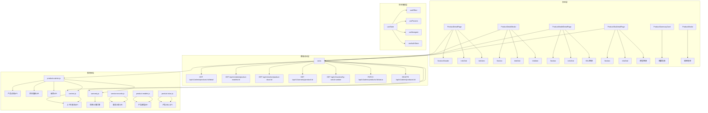

**图表来源**
- [ProductDetailPage.tsx:104-145](file://client/src/components/ProductDetailPage.tsx#L104-L145)
- [ProductDetailModal.tsx:90-131](file://client/src/components/ProductDetailModal.tsx#L90-L131)
- [ProductModelDetailPage.tsx:56-83](file://client/src/components/ProductModelDetailPage.tsx#L56-L83)
- [ProductSkuDetailPage.tsx:37-56](file://client/src/components/ProductSkuDetailPage.tsx#L37-L56)
- [products-admin.js:528-585](file://server/service/routes/products-admin.js#L528-L585)
- [context.js:346-480](file://server/service/routes/context.js#L346-L480)
- [warranty.js:83-125](file://server/service/routes/warranty.js#L83-L125)

## 详细组件分析

### 产品详情页面组件详解

#### 组件结构分析

**更新** 新版本引入了更复杂的组件结构，支持三层次导航流和增强的交互功能。

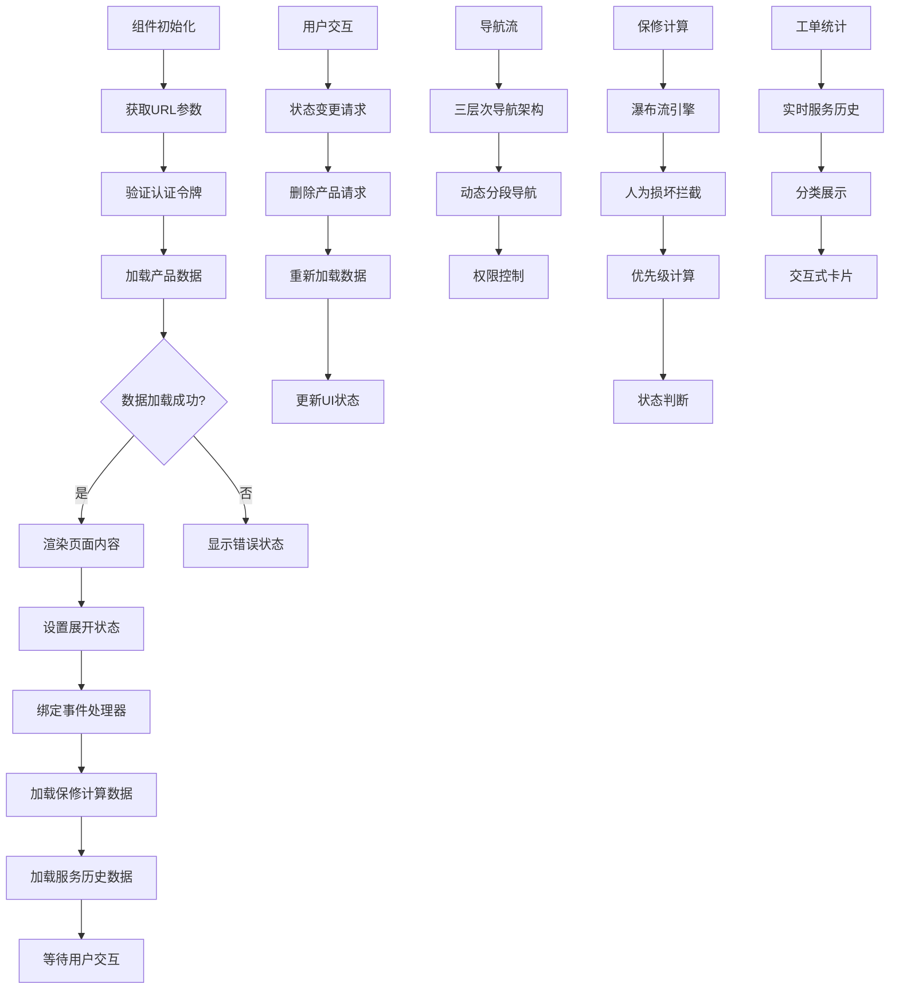

**图表来源**
- [ProductDetailPage.tsx:104-145](file://client/src/components/ProductDetailPage.tsx#L104-L145)

#### 模块化信息展示

**更新** 新版本优化了信息展示模块，增加了三层次导航流的支持。

组件采用网格布局系统，将复杂的产品信息按照逻辑分组进行展示：

1. **物理身份模块**：序列号、SKU、内部型号、产品类型、生产日期
2. **物联网状态模块**：设备激活状态、固件版本、IP地址、最后连接时间
3. **销售溯源模块**：销售渠道、经销商信息、发货日期、订单号
4. **所有权模块**：当前所有者、注册日期、发票信息
5. **保修信息模块**：增强的瀑布流保修计算引擎、可视化状态展示
6. **服务历史模块**：实时服务历史数据、工单统计

**章节来源**
- [ProductDetailPage.tsx:423-574](file://client/src/components/ProductDetailPage.tsx#L423-L574)

### 产品详情模态框组件分析

#### 模态框交互流程

**更新** 新版本增强了模态框的交互流程，支持更丰富的用户操作和数据展示。

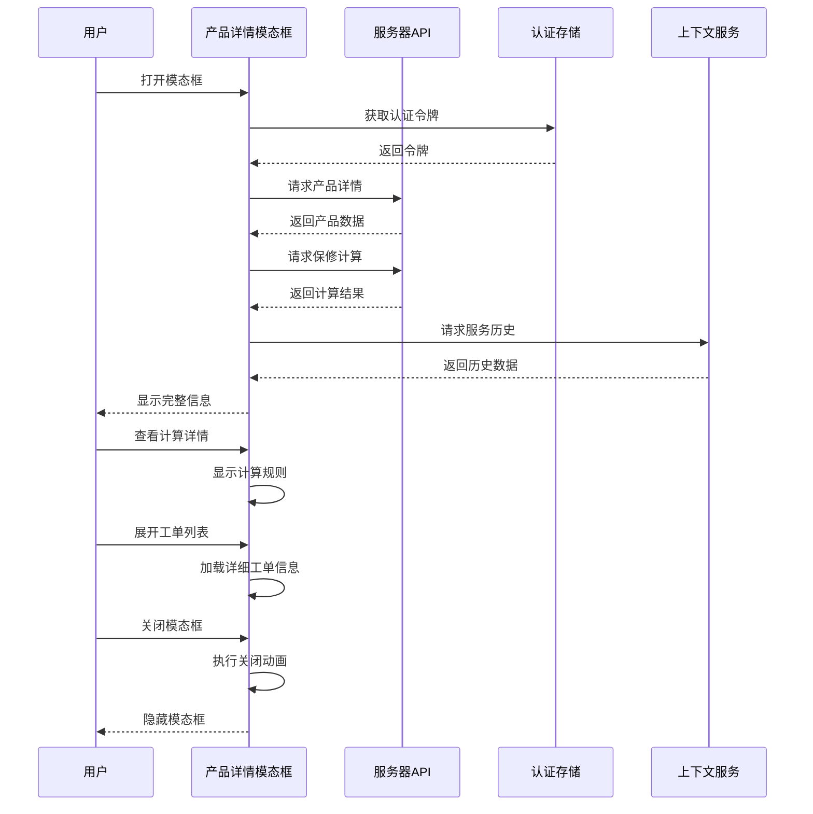

**图表来源**
- [ProductDetailModal.tsx:90-131](file://client/src/components/ProductDetailModal.tsx#L90-L131)

#### 样式系统设计

**更新** 新版本优化了样式系统，支持更丰富的视觉效果和交互反馈。

组件采用了完整的CSS-in-JS样式系统，通过常量定义实现了样式的统一管理：

- **主题色彩系统**：基于CSS变量的主题适配
- **响应式布局**：针对不同屏幕尺寸的自适应设计
- **动画效果**：平滑的过渡动画和交互反馈
- **无障碍设计**：符合WCAG标准的可访问性支持
- **三层次导航**：支持动态分段的导航架构
- **交互式工单卡片**：支持展开查看详细信息

**章节来源**
- [ProductDetailModal.tsx:491-651](file://client/src/components/ProductDetailModal.tsx#L491-L651)

### 产品模型详情页面组件分析

#### 模型信息展示

**新增** 产品模型详情页面组件提供了产品模型级别的详细信息展示。

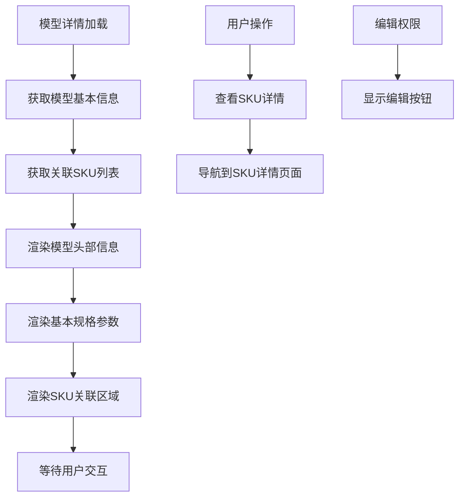

**图表来源**
- [ProductModelDetailPage.tsx:56-83](file://client/src/components/ProductModelDetailPage.tsx#L56-L83)

#### SKU关联管理

组件支持模型与SKU的双向关联展示：

1. **SKU列表展示**：以网格形式展示所有关联的SKU
2. **SKU状态标识**：显示SKU的激活/停用状态
3. **SKU图片展示**：支持SKU图片的显示和占位符
4. **SKU导航**：点击SKU项可跳转到SKU详情页面

**章节来源**
- [ProductModelDetailPage.tsx:295-347](file://client/src/components/ProductModelDetailPage.tsx#L295-L347)

### 产品SKU详情页面组件分析

#### SKU信息展示

**新增** 产品SKU详情页面组件提供了产品SKU级别的详细信息展示。

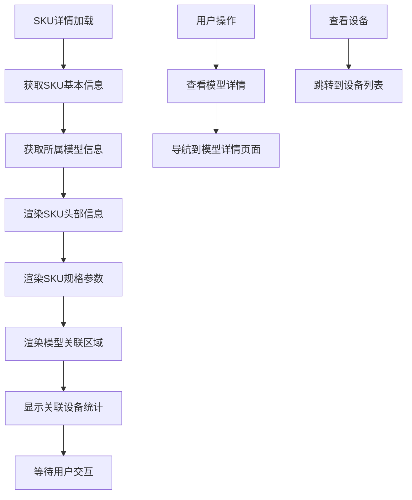

**图表来源**
- [ProductSkuDetailPage.tsx:37-56](file://client/src/components/ProductSkuDetailPage.tsx#L37-L56)

#### 关联设备统计

组件提供了SKU关联设备的统计信息：

1. **设备数量统计**：显示与SKU关联的在役设备总数
2. **设备导航**：提供跳转到设备列表的功能
3. **模型信息展示**：显示SKU所属的父级产品型号
4. **模型导航**：支持跳转到模型详情页面

**章节来源**
- [ProductSkuDetailPage.tsx:303-322](file://client/src/components/ProductSkuDetailPage.tsx#L303-L322)

### 权限控制系统

#### 角色权限矩阵

**更新** 新版本引入了更精细的权限控制机制，支持三层次导航流。

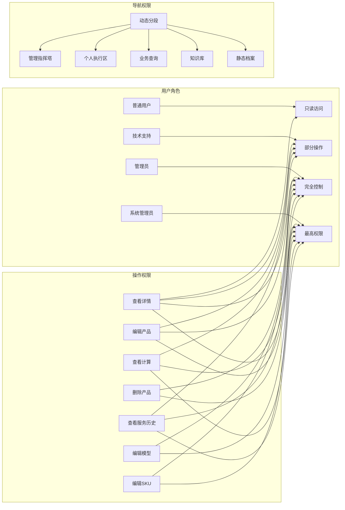

**图表来源**
- [App.tsx:246-251](file://client/src/App.tsx#L246-L251)
- [Service PRD_P2.md:484-500](file://docs/Service PRD_P2.md#L484-L500)

**章节来源**
- [App.tsx:246-251](file://client/src/App.tsx#L246-L251)

### 三层次导航流架构

**新增** 新版本引入了三层次导航流架构，支持更精细的功能组织和权限控制。

#### 导航层次结构

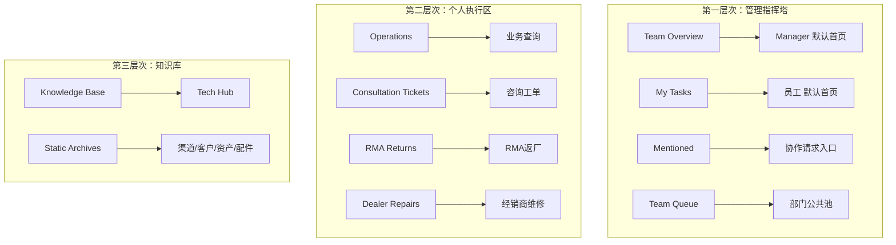

**图表来源**
- [Service PRD_P2.md:484-500](file://docs/Service PRD_P2.md#L484-L500)

#### 导航权限控制

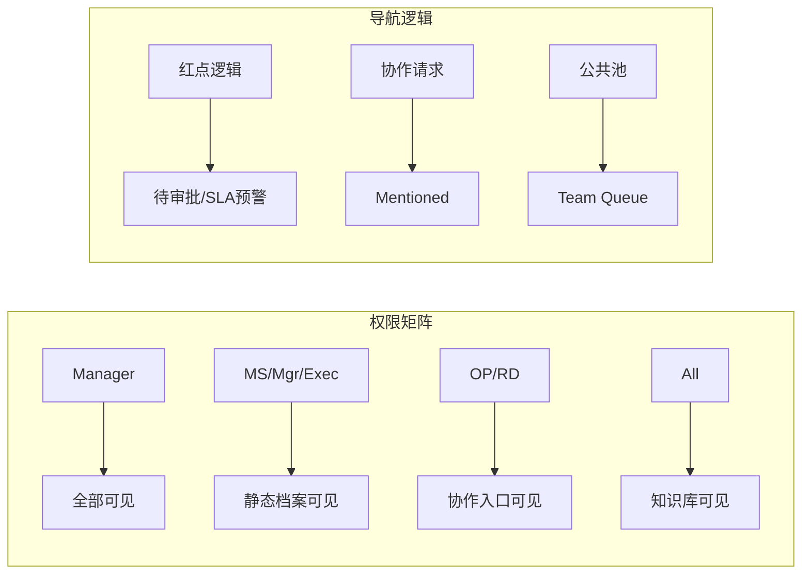

**图表来源**
- [Service PRD_P2.md:484-500](file://docs/Service PRD_P2.md#L484-L500)

**章节来源**
- [Service PRD_P2.md:484-500](file://docs/Service PRD_P2.md#L484-L500)

### 增强的瀑布流保修计算引擎

**新增** 新版本实现了先进的瀑布流保修计算引擎，支持多层级计算逻辑和可视化展示。

#### 保修计算逻辑

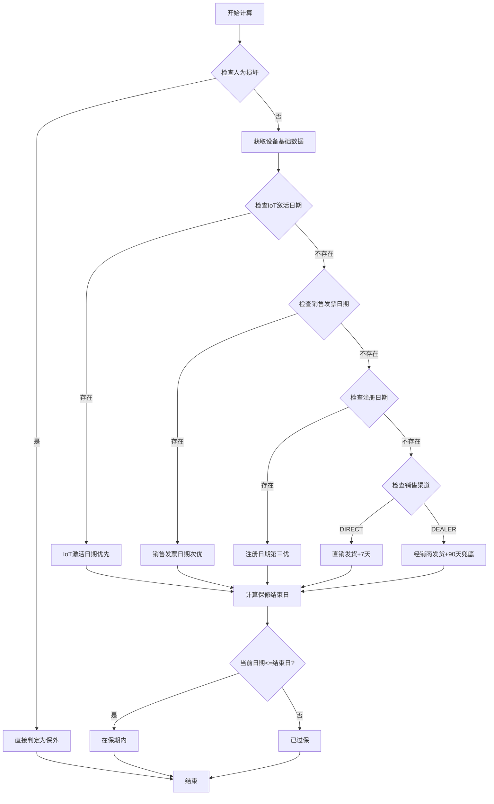

**图表来源**
- [Service_PRD_P2_warranty_update.md:35-53](file://docs/Service_PRD_P2_warranty_update.md#L35-L53)

#### 保修计算可视化

**更新** 新版本提供了详细的保修计算过程可视化，支持用户查看计算依据和结果。

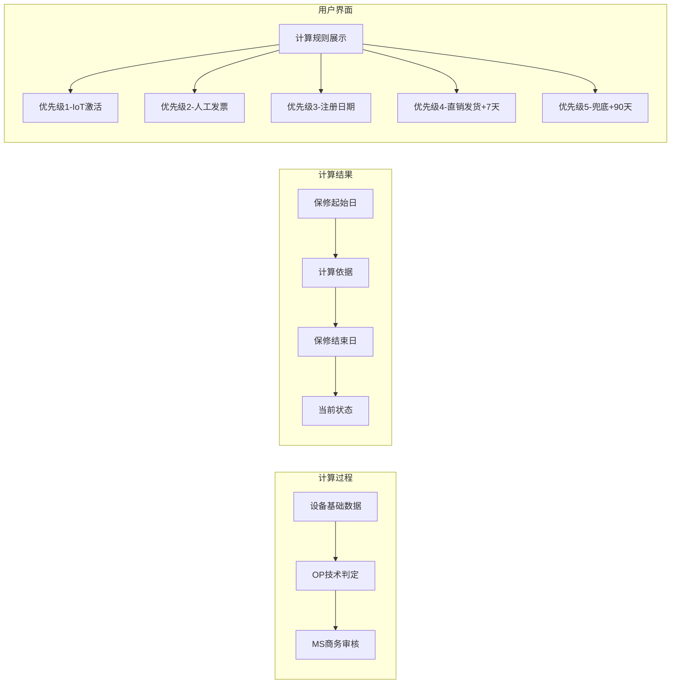

**图表来源**
- [ProductDetailPage.tsx:639-745](file://client/src/components/ProductDetailPage.tsx#L639-L745)
- [ProductDetailModal.tsx:383-461](file://client/src/components/ProductDetailModal.tsx#L383-L461)

**章节来源**
- [Service_PRD_P2_warranty_update.md:35-53](file://docs/Service_PRD_P2_warranty_update.md#L35-L53)

### 实时服务历史集成

**新增** 新版本实现了与上下文API的深度集成，提供实时的服务历史数据展示。

#### 服务历史数据流

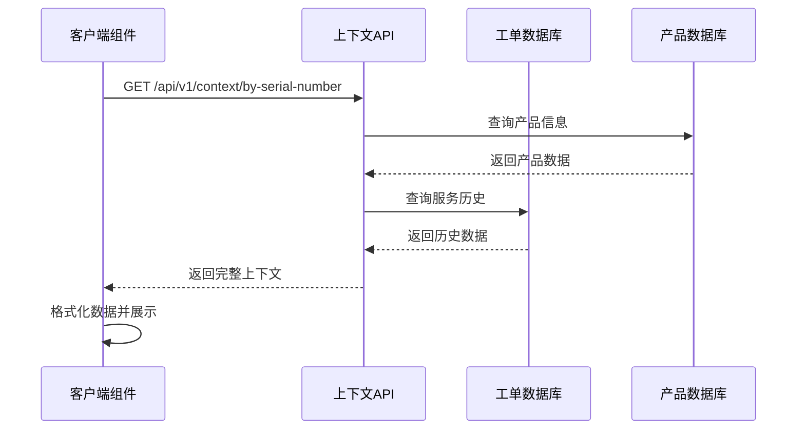

**图表来源**
- [context.js:346-480](file://server/service/routes/context.js#L346-L480)

#### 服务历史展示

**更新** 新版本提供了更丰富服务历史展示，支持按类型分类和详细信息查看。

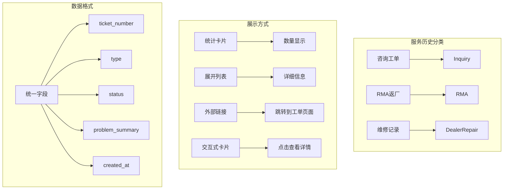

**图表来源**
- [ProductDetailPage.tsx:117-145](file://client/src/components/ProductDetailPage.tsx#L117-L145)
- [ProductDetailModal.tsx:103-131](file://client/src/components/ProductDetailModal.tsx#L103-L131)

**章节来源**
- [context.js:346-480](file://server/service/routes/context.js#L346-L480)

### 产品编辑和管理功能

**新增** 新版本增强了产品编辑和管理功能，提供了完整的CRUD操作支持。

#### 编辑表单设计

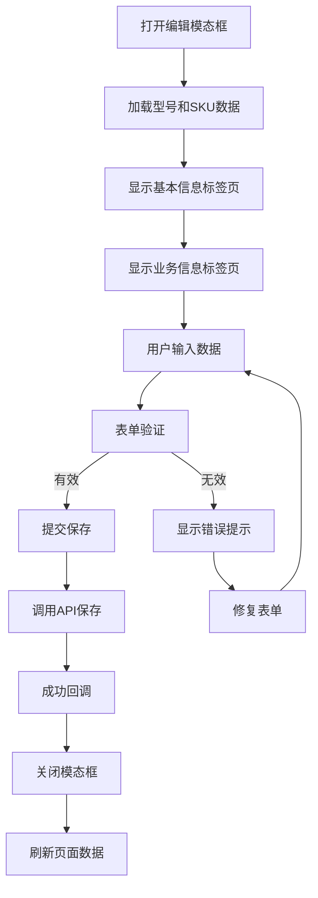

**图表来源**
- [ProductModal.tsx:77-96](file://client/src/components/Workspace/ProductModal.tsx#L77-L96)

#### 状态管理

组件支持多种产品状态的管理：

1. **设备状态**：在役、维修中、失窃、报废
2. **SKU状态**：在售、下架
3. **模型状态**：已激活、已停用
4. **保修状态**：在保、过保、待定

**章节来源**
- [ProductModal.tsx:274-315](file://client/src/components/Workspace/ProductModal.tsx#L274-L315)

## 依赖关系分析

### 组件间依赖关系

**更新** 新版本优化了组件间的依赖关系，支持更灵活的导航流和数据集成。

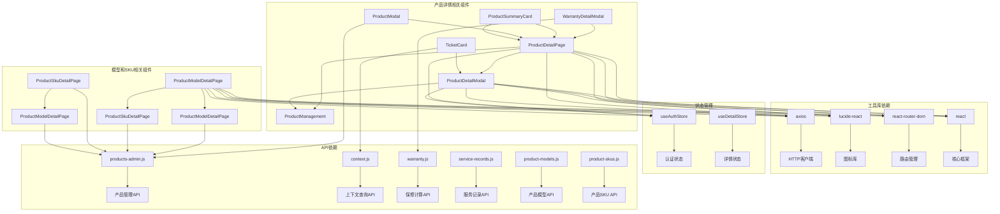

**图表来源**
- [ProductDetailPage.tsx:1-10](file://client/src/components/ProductDetailPage.tsx#L1-L10)
- [ProductDetailModal.tsx:1-10](file://client/src/components/ProductDetailModal.tsx#L1-L10)
- [ProductModelDetailPage.tsx:1-10](file://client/src/components/ProductModelDetailPage.tsx#L1-L10)
- [ProductSkuDetailPage.tsx:1-10](file://client/src/components/ProductSkuDetailPage.tsx#L1-L10)

### API依赖关系

**更新** 新版本扩展了API依赖关系，集成了更多的服务和功能。

#### 服务器端API调用流程

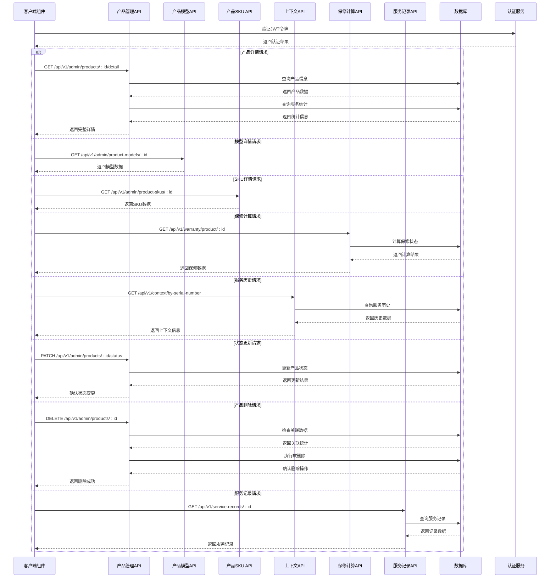

**图表来源**
- [products-admin.js:528-585](file://server/service/routes/products-admin.js#L528-L585)
- [context.js:346-480](file://server/service/routes/context.js#L346-L480)
- [warranty.js:83-125](file://server/service/routes/warranty.js#L83-L125)

**章节来源**
- [products-admin.js:528-585](file://server/service/routes/products-admin.js#L528-L585)

## 性能考虑

### 数据加载优化

**更新** 新版本实现了多层缓存和优化策略，支持更高效的实时数据加载。

1. **条件渲染**：仅在需要时渲染展开的模块
2. **懒加载**：模态框组件按需加载
3. **状态复用**：避免不必要的重新渲染
4. **请求去重**：防止重复的API调用
5. **实时数据缓存**：缓存服务历史和保修计算结果
6. **三层次导航优化**：延迟加载非关键导航内容
7. **工单列表虚拟化**：支持大量工单的高效渲染
8. **并发API调用**：模型和SKU数据的并行加载
9. **数据格式化**：在组件内部进行数据格式化，减少重复计算

### 内存管理

**更新** 新版本优化了内存管理策略，支持更长时间的稳定运行。

- **清理机制**：组件卸载时自动清理定时器和事件监听器
- **引用优化**：使用useCallback和useMemo优化函数引用
- **状态压缩**：合理组织状态结构，避免深层嵌套
- **数据格式化**：在组件内部进行数据格式化，减少重复计算
- **模态框内存管理**：及时释放模态框占用的内存
- **图片资源管理**：SKU图片的懒加载和缓存

### 网络性能

**更新** 新版本实现了智能的网络请求优化策略。

- **并发请求**：合理安排API调用顺序
- **错误重试**：实现智能的失败重试机制
- **超时控制**：设置合理的请求超时时间
- **请求合并**：合并相似的API调用
- **增量更新**：支持部分数据的增量更新
- **缓存策略**：实现多级缓存机制
- **模型和SKU并行加载**：提升模型详情页面的加载速度

## 故障排除指南

### 常见问题诊断

#### 认证失败问题

**症状**：页面无法加载或显示认证错误
**解决方案**：
1. 检查JWT令牌的有效性
2. 验证用户角色权限
3. 确认网络连接状态
4. 检查三层次导航权限配置

#### 数据加载失败

**症状**：产品详情页面显示加载错误
**解决方案**：
1. 检查API端点可用性
2. 验证产品ID的有效性
3. 查看服务器日志获取详细错误信息
4. 检查上下文API的连通性

#### 权限不足问题

**症状**：某些操作按钮不可用或显示权限错误
**解决方案**：
1. 检查用户角色配置
2. 验证部门权限设置
3. 确认具体的权限范围
4. 检查三层次导航的权限映射

#### 保修计算错误

**症状**：保修状态显示不正确或计算结果异常
**解决方案**：
1. 检查设备基础数据的完整性
2. 验证OP技术判定的准确性
3. 确认MS商务审核的数据
4. 查看计算规则的优先级设置
5. 检查人为损坏拦截逻辑

#### 服务历史缺失

**症状**：服务历史数据显示为空或不完整
**解决方案**：
1. 检查上下文API的连通性
2. 验证序列号的正确性
3. 确认工单数据的完整性
4. 检查权限限制导致的数据脱敏
5. 验证工单类型映射的正确性

#### 导航流异常

**症状**：三层次导航显示异常或功能不可用
**解决方案**：
1. 检查导航配置的正确性
2. 验证用户权限映射
3. 确认导航项的可见性逻辑
4. 检查导航状态管理

#### 模型和SKU数据异常

**症状**：模型详情或SKU详情页面显示异常
**解决方案**：
1. 检查模型和SKU的API端点
2. 验证数据格式的正确性
3. 确认关联关系的完整性
4. 检查权限控制逻辑

#### 编辑功能异常

**症状**：产品编辑模态框无法正常工作
**解决方案**：
1. 检查表单验证逻辑
2. 验证API调用的正确性
3. 确认权限控制的配置
4. 检查数据格式的转换

**章节来源**
- [ProductDetailPage.tsx:117-121](file://client/src/components/ProductDetailPage.tsx#L117-L121)
- [ProductDetailModal.tsx:98-102](file://client/src/components/ProductDetailModal.tsx#L98-L102)
- [ProductModelDetailPage.tsx:95-113](file://client/src/components/ProductModelDetailPage.tsx#L95-L113)
- [ProductSkuDetailPage.tsx:68-86](file://client/src/components/ProductSkuDetailPage.tsx#L68-L86)

## 结论

产品详情页面组件展现了现代前端开发的最佳实践，通过模块化设计、类型安全、权限控制和响应式布局，为用户提供了完整的设备资产管理体验。

**更新** 新版本的重大增强包括：

1. **三层产品信息视图**：新增产品模型和SKU层级详情页面，提供完整的三层产品信息展示
2. **三层次导航流架构**：支持更精细的功能组织和权限控制
3. **增强的瀑布流保修计算引擎**：提供准确的保修状态计算和可视化展示
4. **实时服务历史集成**：与上下文API深度集成，提供完整的设备历史信息
5. **交互式工单展示**：支持展开查看详细工单信息
6. **完整的CRUD功能**：支持产品的创建、编辑、删除和状态管理
7. **模块化设计**：清晰的组件职责分离和数据流管理
8. **类型安全**：完整的TypeScript类型检查和接口定义
9. **扩展性强**：支持未来的功能扩展和架构演进

该组件的主要优势包括：

1. **架构清晰**：采用分层架构，职责分离明确
2. **用户体验优秀**：直观的界面设计和流畅的交互体验
3. **扩展性强**：模块化的组件设计便于功能扩展
4. **维护性好**：TypeScript类型检查和良好的代码组织
5. **安全性高**：完善的权限控制和数据验证机制
6. **性能优异**：多层缓存和优化策略确保高效运行
7. **实时性强**：与多个API的深度集成确保数据实时性
8. **三层信息视图**：提供从宏观到微观的完整产品信息展示

未来可以考虑的改进方向：
- 实现更丰富的数据可视化图表
- 增加更多自定义过滤和排序选项
- 优化移动端的触摸交互体验
- 集成更多的自动化工作流功能
- 支持多语言和国际化
- 增强AI辅助功能和智能推荐
- 实现工单历史的时间线展示
- 增加保修计算的预测分析功能
- 优化模型和SKU的批量管理功能
- 增强数据导入导出功能