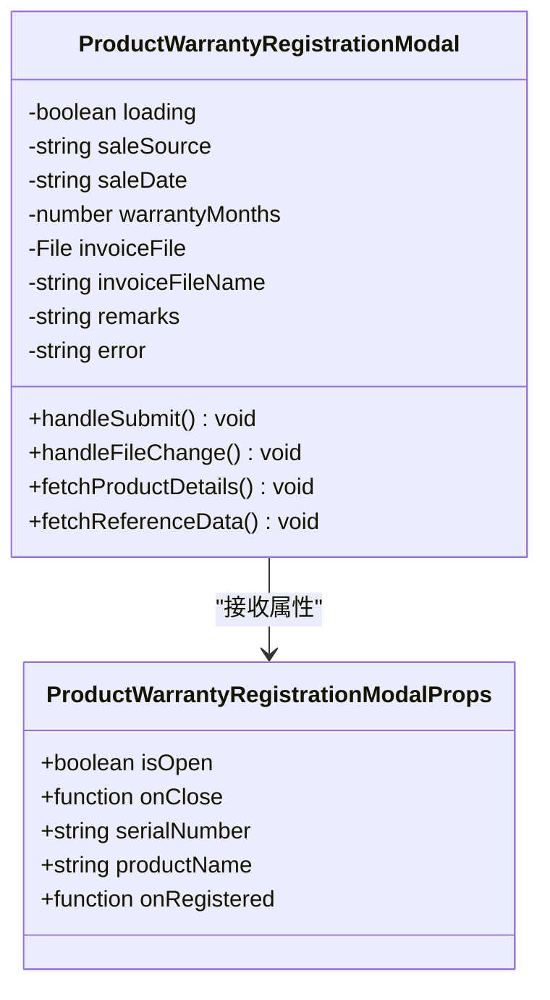
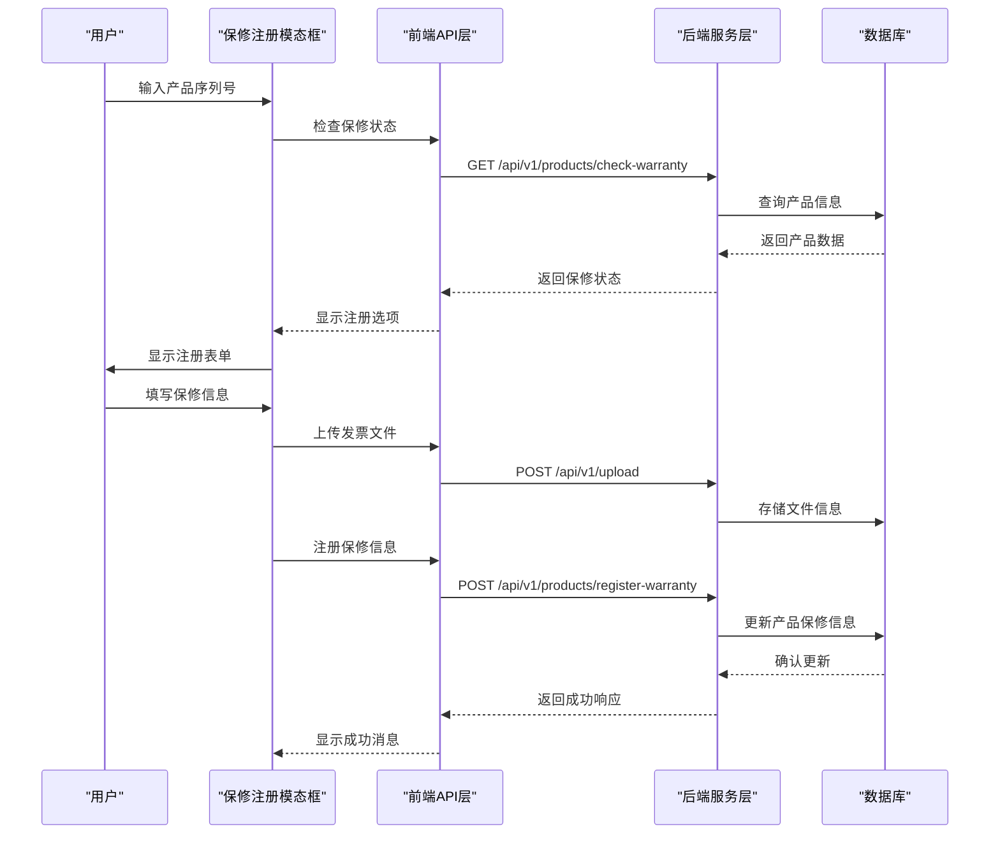
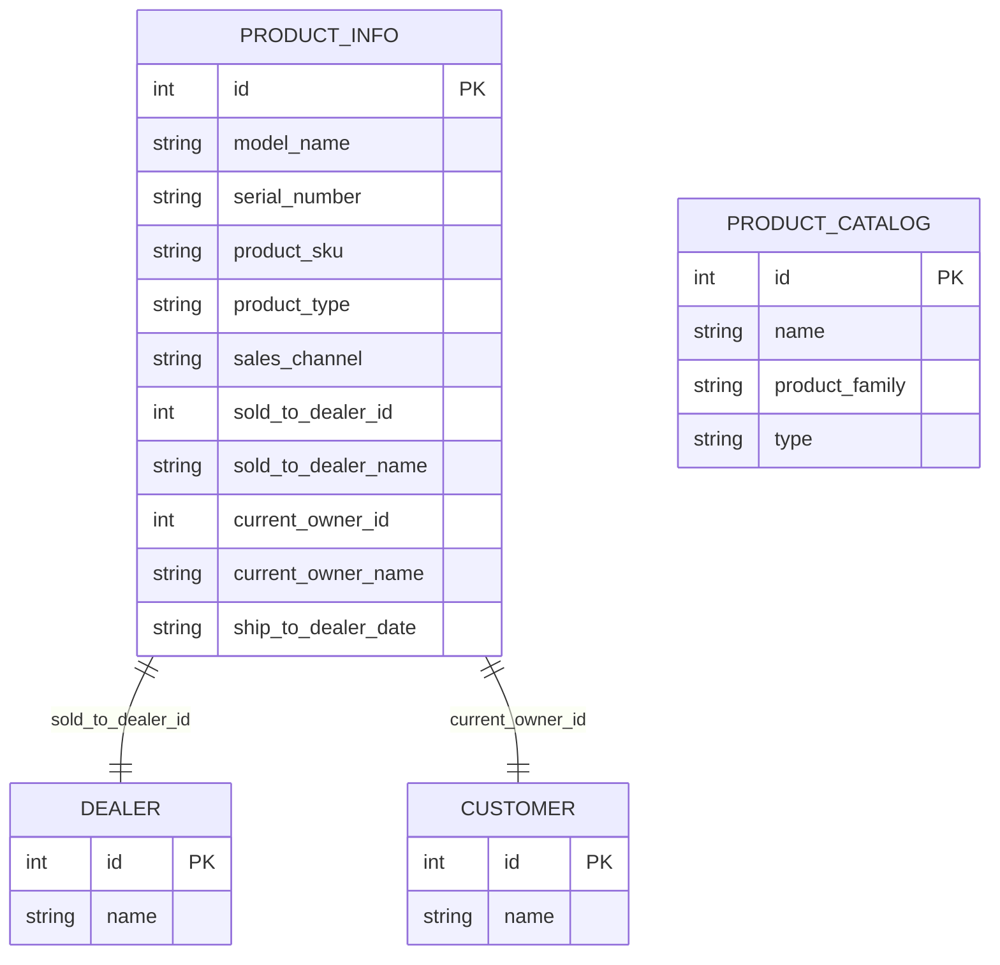
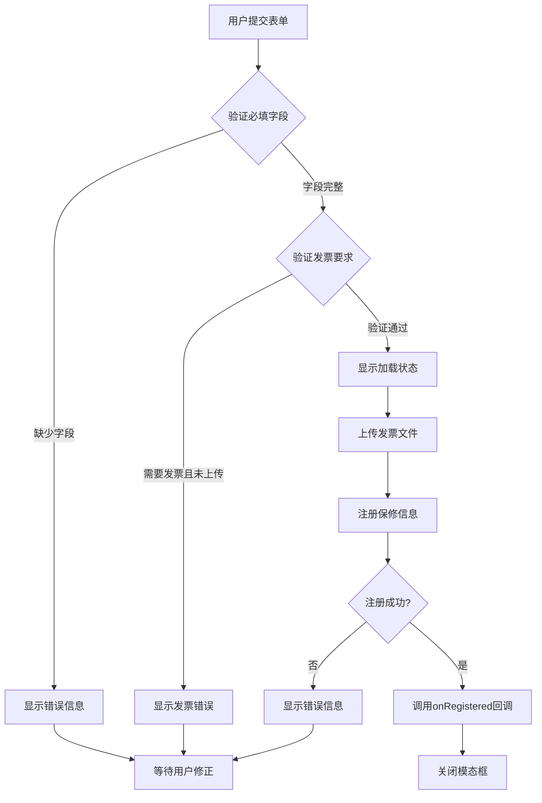
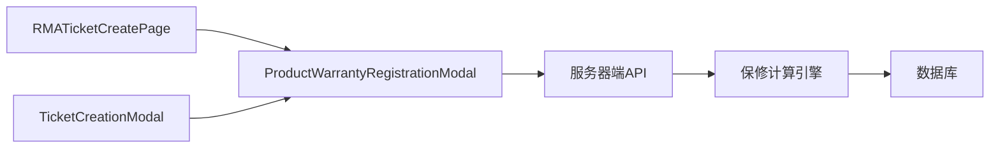
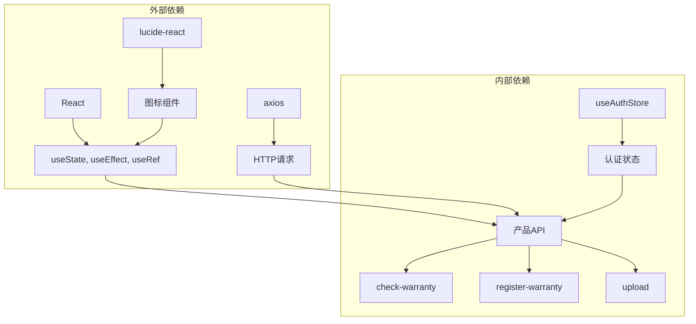
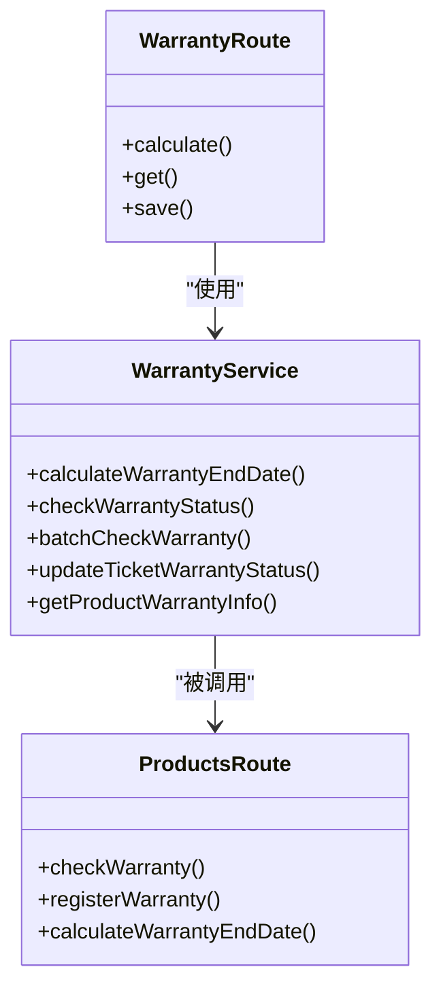

# 保修注册模态框组件

<cite>
**本文档引用的文件**
- [ProductWarrantyRegistrationModal.tsx](file://client/src/components/Service/ProductWarrantyRegistrationModal.tsx)
- [RMATicketCreatePage.tsx](file://client/src/components/RMATickets/RMATicketCreatePage.tsx)
- [TicketCreationModal.tsx](file://client/src/components/Service/TicketCreationModal.tsx)
- [warranty_service.js](file://server/service/warranty_service.js)
- [warranty.js](file://server/service/routes/warranty.js)
- [products.js](file://server/service/routes/products.js)
</cite>

## 目录
1. [简介](#简介)
2. [项目结构](#项目结构)
3. [核心组件](#核心组件)
4. [架构概览](#架构概览)
5. [详细组件分析](#详细组件分析)
6. [依赖关系分析](#依赖关系分析)
7. [性能考虑](#性能考虑)
8. [故障排除指南](#故障排除指南)
9. [结论](#结论)

## 简介

保修注册模态框组件是Longhorn服务管理系统中的关键功能模块，专门用于处理产品保修信息的注册和管理。该组件提供了完整的用户界面，允许用户为未注册保修信息的产品录入必要的保修数据，包括销售日期、发票凭证、产品型号等关键信息。

该组件采用现代化的React开发模式，集成了完整的表单验证、文件上传、实时搜索等功能，并与后端的保修计算引擎深度集成，确保保修状态的准确性和一致性。

## 项目结构

该组件位于客户端的Service目录下，与相关的页面组件共同构成了完整的保修管理功能体系：

```mermaid
graph TB
subgraph "客户端组件结构"
A[Service/] --> B[ProductWarrantyRegistrationModal.tsx]
A --> C[TicketCreationModal.tsx]
D[RMATickets/] --> E[RMATicketCreatePage.tsx]
end
subgraph "服务器端API"
F[warranty_service.js] --> G[calculateWarranty()]
H[products.js] --> I[check-warranty]
H --> J[register-warranty]
end
B --> F
B --> H
C --> B
E --> B
```

**图表来源**
- [ProductWarrantyRegistrationModal.tsx](file://client/src/components/Service/ProductWarrantyRegistrationModal.tsx#L1-L892)
- [TicketCreationModal.tsx](file://client/src/components/Service/TicketCreationModal.tsx#L1-L992)
- [RMATicketCreatePage.tsx](file://client/src/components/RMATickets/RMATicketCreatePage.tsx#L1-L369)

**章节来源**
- [ProductWarrantyRegistrationModal.tsx](file://client/src/components/Service/ProductWarrantyRegistrationModal.tsx#L1-L892)
- [TicketCreationModal.tsx](file://client/src/components/Service/TicketCreationModal.tsx#L1-L992)
- [RMATicketCreatePage.tsx](file://client/src/components/RMATickets/RMATicketCreatePage.tsx#L1-L369)

## 核心组件

### 主要功能特性

1. **多源销售日期录入**：支持通过发票或客户陈述两种方式录入销售日期
2. **智能产品型号搜索**：提供实时的产品型号搜索和自动完成功能
3. **发票文件上传**：支持JPG、PNG、PDF格式的发票文件上传
4. **经销商和所有者管理**：支持选择销售经销商和当前所有者
5. **保修期计算**：基于PRD规范的多层水位逻辑计算保修有效期
6. **实时状态检查**：与后端API集成，实时验证产品保修状态

### 组件接口设计



**图表来源**
- [ProductWarrantyRegistrationModal.tsx](file://client/src/components/Service/ProductWarrantyRegistrationModal.tsx#L6-L51)

**章节来源**
- [ProductWarrantyRegistrationModal.tsx](file://client/src/components/Service/ProductWarrantyRegistrationModal.tsx#L1-L892)

## 架构概览

该组件采用了分层架构设计，确保了前后端的良好分离和数据流的清晰性：



**图表来源**
- [ProductWarrantyRegistrationModal.tsx](file://client/src/components/Service/ProductWarrantyRegistrationModal.tsx#L260-L350)
- [products.js](file://server/service/routes/products.js#L136-L272)

## 详细组件分析

### 数据模型设计

组件使用了多个数据接口来管理不同类型的信息：



**图表来源**
- [ProductWarrantyRegistrationModal.tsx](file://client/src/components/Service/ProductWarrantyRegistrationModal.tsx#L14-L43)

### 表单验证流程

组件实现了多层次的表单验证机制：



**图表来源**
- [ProductWarrantyRegistrationModal.tsx](file://client/src/components/Service/ProductWarrantyRegistrationModal.tsx#L260-L350)

### 文件上传处理

组件支持多种文件格式的上传，并包含完整的文件验证逻辑：

| 文件类型 | 支持格式 | 最大文件大小 | 用途 |
|---------|---------|-------------|------|
| 发票凭证 | JPG, PNG, PDF | 5MB | 保修注册证明 |
| 图片文件 | JPG, PNG | 5MB | 设备照片 |
| 文档文件 | PDF | 5MB | 技术文档 |

**章节来源**
- [ProductWarrantyRegistrationModal.tsx](file://client/src/components/Service/ProductWarrantyRegistrationModal.tsx#L238-L258)

### 与其他组件的集成

该组件与多个页面组件协同工作：



**图表来源**
- [RMATicketCreatePage.tsx](file://client/src/components/RMATickets/RMATicketCreatePage.tsx#L356-L363)
- [TicketCreationModal.tsx](file://client/src/components/Service/TicketCreationModal.tsx#L961-L972)

**章节来源**
- [RMATicketCreatePage.tsx](file://client/src/components/RMATickets/RMATicketCreatePage.tsx#L1-L369)
- [TicketCreationModal.tsx](file://client/src/components/Service/TicketCreationModal.tsx#L1-L992)

## 依赖关系分析

### 前端依赖

组件依赖于多个外部库和内部模块：



**图表来源**
- [ProductWarrantyRegistrationModal.tsx](file://client/src/components/Service/ProductWarrantyRegistrationModal.tsx#L1-L5)
- [products.js](file://server/service/routes/products.js#L1-L287)

### 后端服务依赖

服务器端提供了完整的保修管理API：



**图表来源**
- [warranty_service.js](file://server/service/warranty_service.js#L1-L205)
- [products.js](file://server/service/routes/products.js#L1-L287)
- [warranty.js](file://server/service/routes/warranty.js#L1-L240)

**章节来源**
- [warranty_service.js](file://server/service/warranty_service.js#L1-L205)
- [products.js](file://server/service/routes/products.js#L1-L287)
- [warranty.js](file://server/service/routes/warranty.js#L1-L240)

## 性能考虑

### 优化策略

1. **防抖搜索**：对客户搜索功能实现300ms防抖，减少不必要的API调用
2. **懒加载数据**：仅在模态框打开时加载相关数据
3. **文件大小限制**：限制上传文件大小为5MB，避免内存问题
4. **条件渲染**：根据用户操作动态渲染相关UI元素

### 缓存机制

组件实现了多层缓存策略：
- **本地状态缓存**：React状态管理
- **API响应缓存**：避免重复的API调用
- **产品目录缓存**：预加载产品目录数据

## 故障排除指南

### 常见问题及解决方案

| 问题类型 | 症状 | 解决方案 |
|---------|------|---------|
| 文件上传失败 | 上传按钮无响应 | 检查文件格式和大小限制 |
| 产品搜索无结果 | 搜索框无匹配项 | 确认产品型号正确性和网络连接 |
| 保修注册失败 | 显示错误消息 | 检查必填字段和服务器连接 |
| 状态检查异常 | 无法获取保修状态 | 验证序列号格式和权限设置 |

### 错误处理机制

组件实现了完善的错误处理：
- **网络错误**：显示友好的错误提示
- **文件验证错误**：明确指出文件格式和大小问题
- **业务逻辑错误**：提供具体的解决建议

**章节来源**
- [ProductWarrantyRegistrationModal.tsx](file://client/src/components/Service/ProductWarrantyRegistrationModal.tsx#L345-L347)

## 结论

保修注册模态框组件是一个功能完整、设计合理的前端组件，它成功地解决了产品保修信息管理的核心需求。组件具有以下特点：

1. **用户体验优秀**：直观的界面设计和流畅的操作体验
2. **功能完整性**：涵盖了保修注册的所有必要功能
3. **技术实现先进**：采用现代React开发模式和最佳实践
4. **可维护性强**：清晰的代码结构和完善的注释
5. **扩展性良好**：易于添加新功能和修改现有功能

该组件与后端服务的紧密集成确保了数据的一致性和准确性，为整个服务管理系统的保修管理功能奠定了坚实的基础。