# 保修注册模态框组件

<cite>
**本文档引用的文件**
- [ProductWarrantyRegistrationModal.tsx](file://client/src/components/Service/ProductWarrantyRegistrationModal.tsx)
- [CustomDatePicker.tsx](file://client/src/components/UI/CustomDatePicker.tsx)
- [UnifiedCustomerModal.tsx](file://client/src/components/Service/UnifiedCustomerModal.tsx)
- [ProductModal.tsx](file://client/src/components/Workspace/ProductModal.tsx)
- [products.js](file://server/service/routes/products.js)
- [system.js](file://server/service/routes/system.js)
- [047_add_product_dropdown_settings.sql](file://server/service/migrations/047_add_product_dropdown_settings.sql)
</cite>

## 更新摘要
**变更内容**
- **产品型号过滤系统**：新增基于系统设置的SN前缀匹配、产品类型限制、家族可见性控制
- **日期选择器增强**：CustomDatePicker提供年月选择器、位置自适应、禁用日期范围控制
- **客户创建流程优化**：UnifiedCustomerModal支持多种客户类型、联系人管理、生命周期阶段设置
- **销售来源验证增强**：新增发货记录和客户陈述的详细验证逻辑
- **系统设置集成**：支持动态配置产品下拉框显示规则
- **双列布局优化**：改进的左右分区布局，提升用户体验

## 目录
1. [简介](#简介)
2. [项目结构](#项目结构)
3. [核心组件](#核心组件)
4. [架构概览](#架构概览)
5. [详细组件分析](#详细组件分析)
6. [产品型号过滤系统](#产品型号过滤系统)
7. [日期选择器增强功能](#日期选择器增强功能)
8. [客户创建流程优化](#客户创建流程优化)
9. [销售来源验证增强](#销售来源验证增强)
10. [系统设置集成](#系统设置集成)
11. [依赖关系分析](#依赖关系分析)
12. [性能考虑](#性能考虑)
13. [故障排除指南](#故障排除指南)
14. [结论](#结论)

## 简介

保修注册模态框组件是Longhorn服务管理系统中的关键功能模块，专门用于处理产品保修信息的注册和管理。该组件提供了完整的用户界面，允许用户为未注册保修信息的产品录入必要的保修数据，包括销售日期、发票凭证、产品型号等关键信息。

**重大功能增强**：该组件现已支持多种销售来源类型的灵活选择，包括发票、客户声明、发货记录三种不同的销售日期来源。每种来源类型都有相应的验证规则和数据收集流程，确保保修注册的准确性和合规性。

**产品型号过滤系统**：组件集成了基于系统设置的智能产品型号过滤功能，支持SN前缀自动匹配、产品类型限制、家族可见性控制等高级功能，显著提升了产品选择的准确性和效率。

**日期选择器增强**：集成了功能丰富的CustomDatePicker组件，提供年月选择器、位置自适应、禁用日期范围控制等特性，改善了日期输入体验。

**客户创建流程优化**：通过UnifiedCustomerModal集成，提供了一体化的客户创建和管理功能，支持多种客户类型、联系人管理和生命周期阶段设置。

**系统设置集成**：组件与系统设置深度集成，支持动态配置产品下拉框显示规则，包括产品族群可见性控制和产品类型过滤设置。

该组件采用现代化的React开发模式，集成了完整的表单验证、文件上传、实时搜索等功能，并与后端的保修计算引擎深度集成，确保保修状态的准确性和一致性。

## 项目结构

该组件位于客户端的Service目录下，与相关的页面组件共同构成了完整的保修管理功能体系：

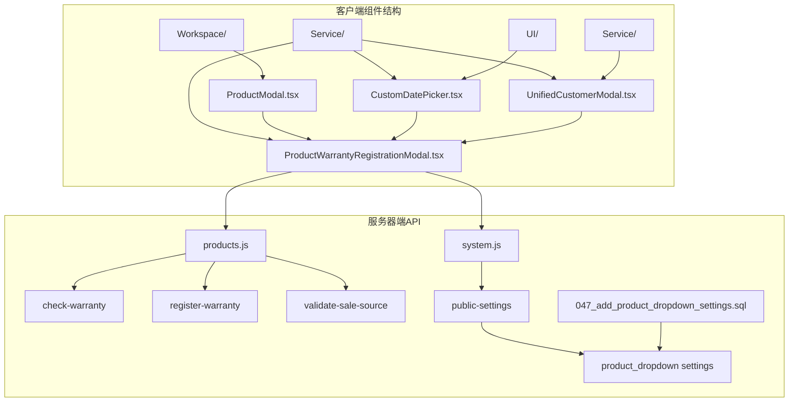
```mermaid
graph TB
subgraph "客户端组件结构"
A[Service/] --> B[ProductWarrantyRegistrationModal.tsx]
A --> C[CustomDatePicker.tsx]
A --> D[UnifiedCustomerModal.tsx]
E[Workspace/] --> F[ProductModal.tsx]
G[UI/] --> C
H[Service/] --> D
end
subgraph "服务器端API"
I[products.js] --> J[check-warranty]
I --> K[register-warranty]
I --> L[validate-sale-source]
M[system.js] --> N[public-settings]
N --> O[product_dropdown settings]
P[047_add_product_dropdown_settings.sql] --> O
end
B --> I
B --> M
F --> B
C --> B
D --> B
```

**图表来源**
- [ProductWarrantyRegistrationModal.tsx:1-1223](file://client/src/components/Service/ProductWarrantyRegistrationModal.tsx#L1-L1223)
- [CustomDatePicker.tsx:1-296](file://client/src/components/UI/CustomDatePicker.tsx#L1-L296)
- [UnifiedCustomerModal.tsx:1-798](file://client/src/components/Service/UnifiedCustomerModal.tsx#L1-L798)
- [ProductModal.tsx:160-359](file://client/src/components/Workspace/ProductModal.tsx#L160-L359)
- [system.js:17-72](file://server/service/routes/system.js#L17-L72)
- [047_add_product_dropdown_settings.sql:1-25](file://server/service/migrations/047_add_product_dropdown_settings.sql#L1-L25)

## 核心组件

### 主要功能特性

1. **多源销售日期录入**：支持通过发票、客户陈述、发货记录三种方式录入销售日期
2. **智能产品型号过滤**：基于系统设置实现SN前缀匹配、产品类型限制、家族可见性控制
3. **增强的日期选择器**：提供年月选择器、位置自适应、禁用日期范围控制
4. **发票文件上传**：支持JPG、PNG、PDF格式的发票文件上传
5. **经销商和所有者管理**：支持选择销售经销商和当前所有者
6. **保修期计算**：基于PRD规范的多层水位逻辑计算保修有效期
7. **实时状态检查**：与后端API集成，实时验证产品保修状态
8. **产品线分类**：支持Camera（相机）、EVF（电子寻像器）、Accessory（配件）三类产品线选择
9. **产品家族细分**：支持A-E六个产品家族的精细化分类管理
10. **玻璃纤维样式**：全面应用现代化的玻璃效果和CSS变量系统
11. **双列布局设计**：采用CSS Grid实现900px宽度的两列布局
12. **客户搜索功能**：支持通过名称关键词搜索现有客户
13. **统一客户管理**：集成UnifiedCustomerModal，简化客户创建流程
14. **批量操作支持**：支持产品入库和保修注册的组合操作
15. **增强的表单验证**：针对不同销售来源类型实施特定的验证规则
16. **系统设置集成**：支持动态配置产品下拉框显示规则

### 组件接口设计

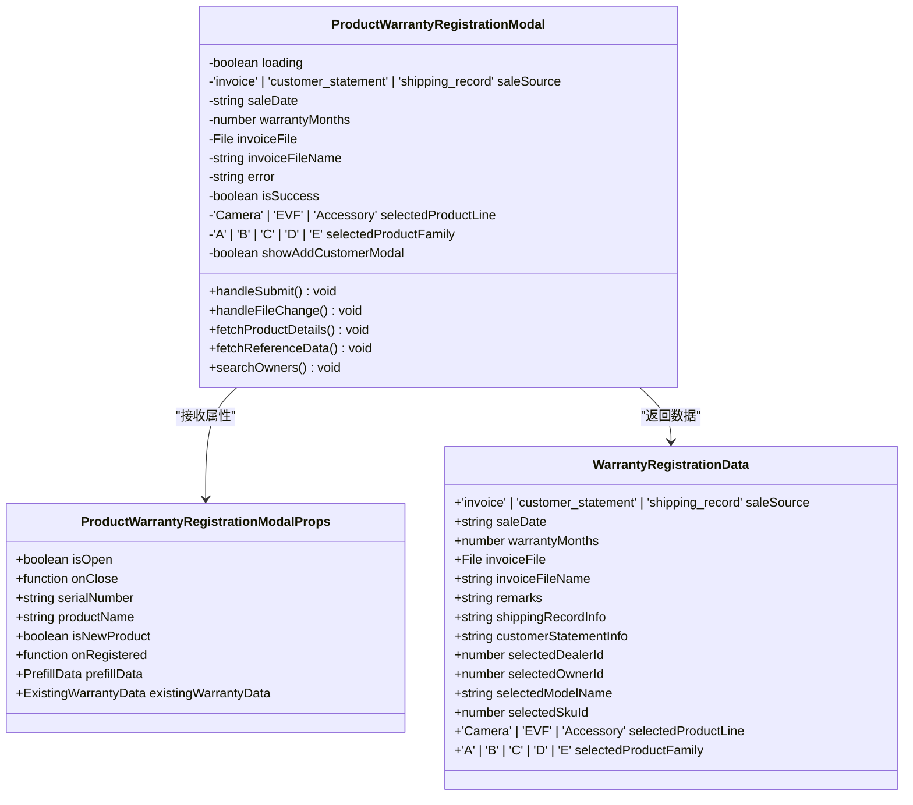
```mermaid
classDiagram
class ProductWarrantyRegistrationModalProps {
+boolean isOpen
+function onClose
+string serialNumber
+string productName
+boolean isNewProduct
+function onRegistered
+PrefillData prefillData
+ExistingWarrantyData existingWarrantyData
}
class WarrantyRegistrationData {
+'invoice' | 'customer_statement' | 'shipping_record' saleSource
+string saleDate
+number warrantyMonths
+File invoiceFile
+string invoiceFileName
+string remarks
+string shippingRecordInfo
+string customerStatementInfo
+number selectedDealerId
+number selectedOwnerId
+string selectedModelName
+number selectedSkuId
+'Camera' | 'EVF' | 'Accessory' selectedProductLine
+'A' | 'B' | 'C' | 'D' | 'E' selectedProductFamily
}
class ProductWarrantyRegistrationModal {
-boolean loading
-'invoice' | 'customer_statement' | 'shipping_record' saleSource
-string saleDate
-number warrantyMonths
-File invoiceFile
-string invoiceFileName
-string error
-boolean isSuccess
-'Camera' | 'EVF' | 'Accessory' selectedProductLine
-'A' | 'B' | 'C' | 'D' | 'E' selectedProductFamily
-boolean showAddCustomerModal
+handleSubmit() void
+handleFileChange() void
+fetchProductDetails() void
+fetchReferenceData() void
+searchOwners() void
}
ProductWarrantyRegistrationModal --> ProductWarrantyRegistrationModalProps : "接收属性"
ProductWarrantyRegistrationModal --> WarrantyRegistrationData : "返回数据"
```

**图表来源**
- [ProductWarrantyRegistrationModal.tsx:10-54](file://client/src/components/Service/ProductWarrantyRegistrationModal.tsx#L10-L54)

**章节来源**
- [ProductWarrantyRegistrationModal.tsx:1-1223](file://client/src/components/Service/ProductWarrantyRegistrationModal.tsx#L1-L1223)

## 架构概览

该组件采用了分层架构设计，确保了前后端的良好分离和数据流的清晰性：

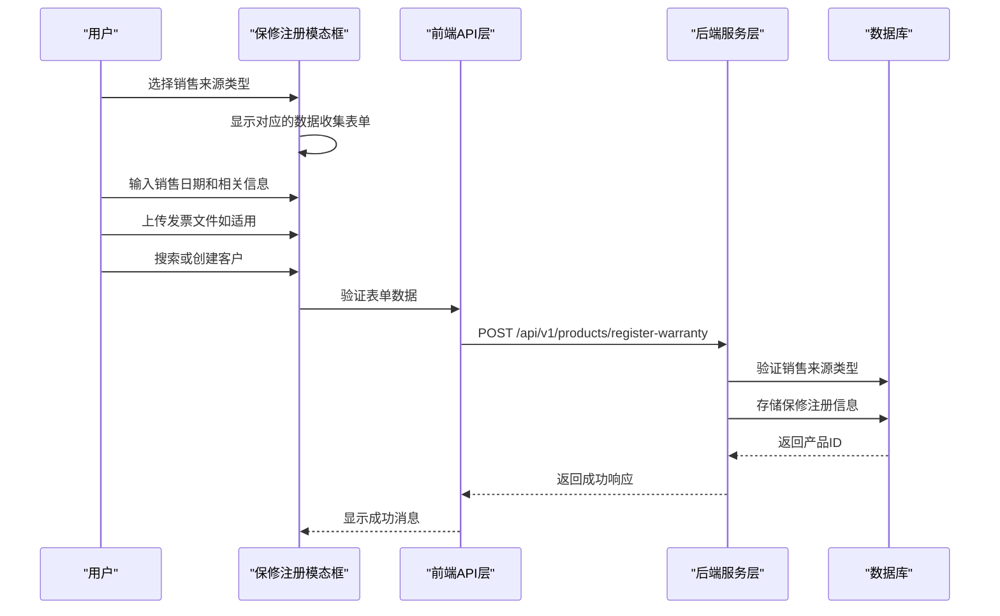
```mermaid
sequenceDiagram
participant 用户 as "用户"
participant 模态框 as "保修注册模态框"
participant 前端 as "前端API层"
participant 后端 as "后端服务层"
participant 数据库 as "数据库"
用户->>模态框 : 选择销售来源类型
模态框->>模态框 : 显示对应的数据收集表单
用户->>模态框 : 输入销售日期和相关信息
用户->>模态框 : 上传发票文件如适用
用户->>模态框 : 搜索或创建客户
模态框->>前端 : 验证表单数据
前端->>后端 : POST /api/v1/products/register-warranty
后端->>数据库 : 验证销售来源类型
后端->>数据库 : 存储保修注册信息
数据库-->>后端 : 返回产品ID
后端-->>前端 : 返回成功响应
前端-->>模态框 : 显示成功消息
```

**图表来源**
- [ProductWarrantyRegistrationModal.tsx:444-575](file://client/src/components/Service/ProductWarrantyRegistrationModal.tsx#L444-L575)
- [products.js:150-349](file://server/service/routes/products.js#L150-L349)

## 详细组件分析

### 数据模型设计

组件使用了多个数据接口来管理不同类型的信息，新增了销售来源类型和相关验证字段：

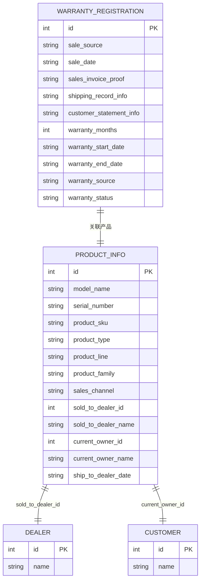
```mermaid
erDiagram
PRODUCT_INFO {
int id PK
string model_name
string serial_number
string product_sku
string product_type
string product_line
string product_family
string sales_channel
int sold_to_dealer_id
string sold_to_dealer_name
int current_owner_id
string current_owner_name
string ship_to_dealer_date
}
DEALER {
int id PK
string name
}
CUSTOMER {
int id PK
string name
}
WARRANTY_REGISTRATION {
int id PK
string sale_source
string sale_date
string sales_invoice_proof
string shipping_record_info
string customer_statement_info
int warranty_months
string warranty_start_date
string warranty_end_date
string warranty_source
string warranty_status
}
PRODUCT_INFO ||--|| DEALER : "sold_to_dealer_id"
PRODUCT_INFO ||--|| CUSTOMER : "current_owner_id"
WARRANTY_REGISTRATION ||--|| PRODUCT_INFO : "关联产品"
```

**图表来源**
- [ProductWarrantyRegistrationModal.tsx:56-92](file://client/src/components/Service/ProductWarrantyRegistrationModal.tsx#L56-L92)

### 表单验证流程

组件实现了多层次的表单验证机制，针对不同的销售来源类型实施特定的验证规则：

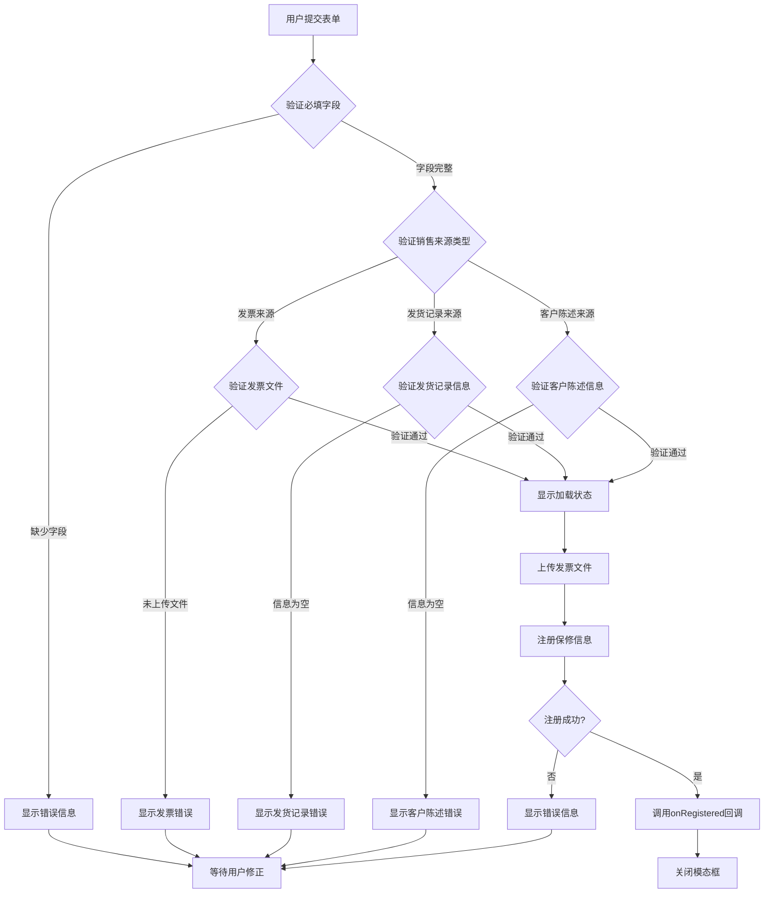
```mermaid
flowchart TD
A[用户提交表单] --> B{验证必填字段}
B --> |缺少字段| C[显示错误信息]
B --> |字段完整| D{验证销售来源类型}
D --> |发票来源| E{验证发票文件}
E --> |未上传文件| F[显示发票错误]
E --> |验证通过| G[显示加载状态]
D --> |发货记录来源| H{验证发货记录信息}
H --> |信息为空| I[显示发货记录错误]
H --> |验证通过| G
D --> |客户陈述来源| J{验证客户陈述信息}
J --> |信息为空| K[显示客户陈述错误]
J --> |验证通过| G
G --> L[上传发票文件]
L --> M[注册保修信息]
M --> N{注册成功?}
N --> |是| O[调用onRegistered回调]
N --> |否| P[显示错误信息]
C --> Q[等待用户修正]
F --> Q
I --> Q
K --> Q
O --> R[关闭模态框]
P --> Q
```

**图表来源**
- [ProductWarrantyRegistrationModal.tsx:444-575](file://client/src/components/Service/ProductWarrantyRegistrationModal.tsx#L444-L575)

### 文件上传处理

组件支持多种文件格式的上传，并包含完整的文件验证逻辑：

| 文件类型 | 支持格式 | 最大文件大小 | 用途 |
|---------|---------|-------------|------|
| 发票凭证 | JPG, PNG, PDF | 5MB | 保修注册证明 |
| 图片文件 | JPG, PNG | 5MB | 设备照片 |
| 文档文件 | PDF | 5MB | 技术文档 |

**章节来源**
- [ProductWarrantyRegistrationModal.tsx:422-442](file://client/src/components/Service/ProductWarrantyRegistrationModal.tsx#L422-L442)

### 与其他组件的集成

该组件与多个页面组件协同工作，支持产品分类的统一管理：

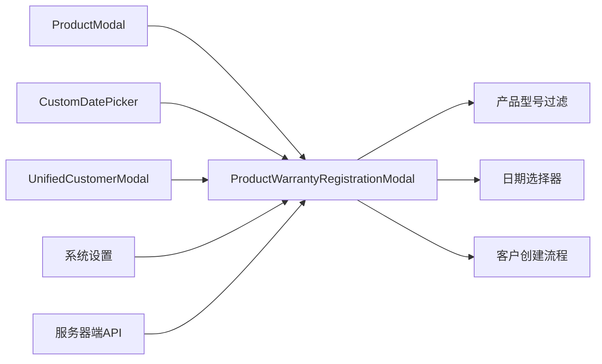
```mermaid
graph LR
A[ProductModal] --> B[ProductWarrantyRegistrationModal]
C[CustomDatePicker] --> B
D[UnifiedCustomerModal] --> B
E[系统设置] --> B
F[服务器端API] --> B
B --> G[产品型号过滤]
B --> H[日期选择器]
B --> I[客户创建流程]
```

**图表来源**
- [ProductModal.tsx:160-359](file://client/src/components/Workspace/ProductModal.tsx#L160-L359)
- [CustomDatePicker.tsx:1-296](file://client/src/components/UI/CustomDatePicker.tsx#L1-L296)
- [UnifiedCustomerModal.tsx:1-798](file://client/src/components/Service/UnifiedCustomerModal.tsx#L1-L798)

**章节来源**
- [ProductWarrantyRegistrationModal.tsx:1-1223](file://client/src/components/Service/ProductWarrantyRegistrationModal.tsx#L1-L1223)

## 产品型号过滤系统

### 系统设置集成

组件集成了基于系统设置的智能产品型号过滤功能，支持动态配置产品下拉框显示规则：

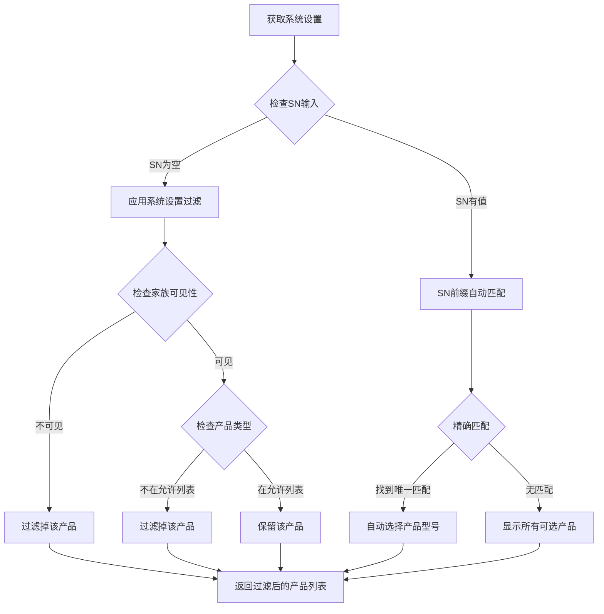
```mermaid
flowchart TD
A[获取系统设置] --> B{检查SN输入}
B --> |SN为空| C[应用系统设置过滤]
B --> |SN有值| D[SN前缀自动匹配]
C --> E{检查家族可见性}
E --> |不可见| F[过滤掉该产品]
E --> |可见| G{检查产品类型}
G --> |不在允许列表| H[过滤掉该产品]
G --> |在允许列表| I[保留该产品]
D --> J{精确匹配}
J --> |找到唯一匹配| K[自动选择产品型号]
J --> |无匹配| L[显示所有可选产品]
I --> M[返回过滤后的产品列表]
K --> M
L --> M
F --> M
H --> M
```

**图表来源**
- [ProductWarrantyRegistrationModal.tsx:284-311](file://client/src/components/Service/ProductWarrantyRegistrationModal.tsx#L284-L311)
- [ProductModal.tsx:171-198](file://client/src/components/Workspace/ProductModal.tsx#L171-L198)

### 过滤规则详解

系统设置包含以下关键配置：

| 设置项 | 类型 | 默认值 | 描述 |
|--------|------|--------|------|
| family_visibility | 对象 | {A: true, B: false, C: true, D: true, E: false} | 控制各产品族群的可见性 |
| enable_type_filter | 布尔值 | true | 是否启用产品类型过滤 |
| allowed_types | 字符串数组 | ['电影机','摄像机','电子寻像器','寻像器','套装'] | 允许显示的产品类型列表 |

### SN前缀匹配机制

组件实现了智能的SN前缀匹配功能：

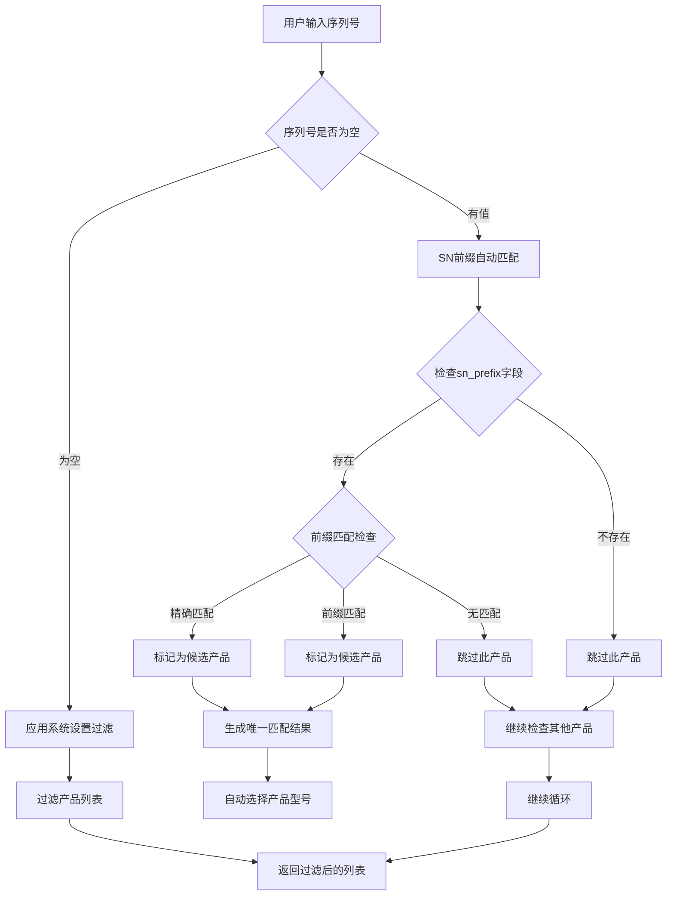
```mermaid
graph TD
A[用户输入序列号] --> B{序列号是否为空}
B --> |为空| C[应用系统设置过滤]
B --> |有值| D[SN前缀自动匹配]
C --> E[过滤产品列表]
D --> F{检查sn_prefix字段}
F --> |不存在| G[跳过此产品]
F --> |存在| H{前缀匹配检查}
H --> |精确匹配| I[标记为候选产品]
H --> |前缀匹配| J[标记为候选产品]
H --> |无匹配| K[跳过此产品]
I --> L[生成唯一匹配结果]
J --> L
K --> M[继续检查其他产品]
G --> M
E --> N[返回过滤后的列表]
L --> O[自动选择产品型号]
M --> P[继续循环]
P --> N
```

**图表来源**
- [ProductWarrantyRegistrationModal.tsx:314-321](file://client/src/components/Service/ProductWarrantyRegistrationModal.tsx#L314-L321)
- [ProductModal.tsx:203-221](file://client/src/components/Workspace/ProductModal.tsx#L203-L221)

**章节来源**
- [ProductWarrantyRegistrationModal.tsx:284-355](file://client/src/components/Service/ProductWarrantyRegistrationModal.tsx#L284-L355)
- [ProductModal.tsx:171-221](file://client/src/components/Workspace/ProductModal.tsx#L171-L221)
- [system.js:51-62](file://server/service/routes/system.js#L51-L62)
- [047_add_product_dropdown_settings.sql:1-25](file://server/service/migrations/047_add_product_dropdown_settings.sql#L1-L25)

## 日期选择器增强功能

### CustomDatePicker组件特性

组件集成了功能丰富的CustomDatePicker组件，提供了以下增强功能：

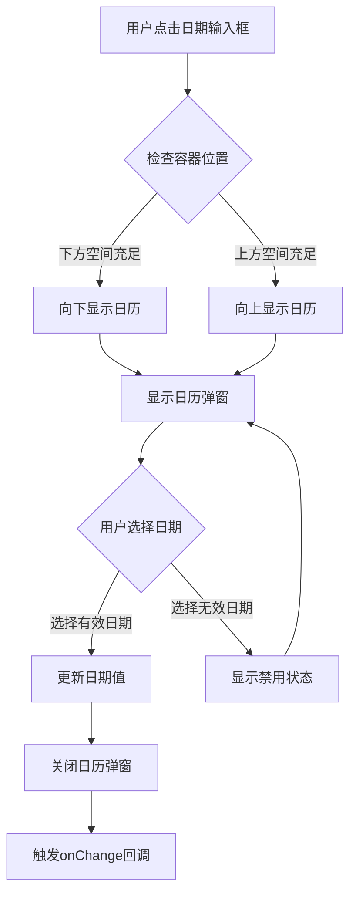
```mermaid
flowchart TD
A[用户点击日期输入框] --> B{检查容器位置}
B --> |下方空间充足| C[向下显示日历]
B --> |上方空间充足| D[向上显示日历]
C --> E[显示日历弹窗]
D --> E
E --> F{用户选择日期}
F --> |选择有效日期| G[更新日期值]
F --> |选择无效日期| H[显示禁用状态]
G --> I[关闭日历弹窗]
H --> E
I --> J[触发onChange回调]
```

**图表来源**
- [CustomDatePicker.tsx:48-63](file://client/src/components/UI/CustomDatePicker.tsx#L48-L63)
- [CustomDatePicker.tsx:26-46](file://client/src/components/UI/CustomDatePicker.tsx#L26-L46)

### 年月选择器功能

组件支持年月两级选择器：

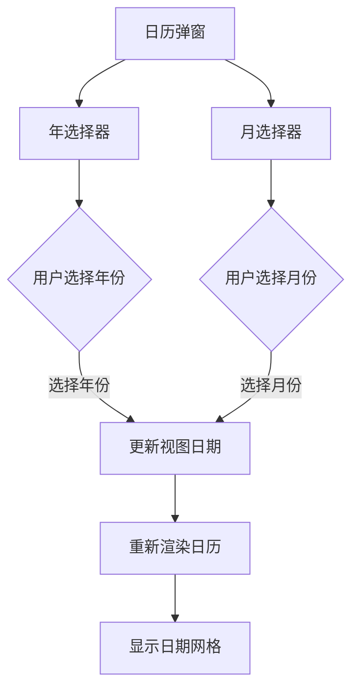
```mermaid
graph TD
A[日历弹窗] --> B[年选择器]
A --> C[月选择器]
B --> D{用户选择年份}
D --> |选择年份| E[更新视图日期]
C --> F{用户选择月份}
F --> |选择月份| E
E --> G[重新渲染日历]
G --> H[显示日期网格]
```

**图表来源**
- [CustomDatePicker.tsx:146-246](file://client/src/components/UI/CustomDatePicker.tsx#L146-L246)

### 禁用日期范围控制

组件实现了灵活的禁用日期控制机制：

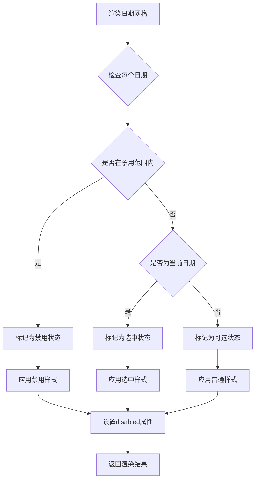
```mermaid
flowchart TD
A[渲染日期网格] --> B{检查每个日期}
B --> C{是否在禁用范围内}
C --> |是| D[标记为禁用状态]
C --> |否| E{是否为当前日期}
E --> |是| F[标记为选中状态]
E --> |否| G[标记为可选状态]
D --> H[应用禁用样式]
F --> I[应用选中样式]
G --> J[应用普通样式]
H --> K[设置disabled属性]
I --> K
J --> K
K --> L[返回渲染结果]
```

**图表来源**
- [CustomDatePicker.tsx:254-288](file://client/src/components/UI/CustomDatePicker.tsx#L254-L288)

### 位置自适应机制

组件实现了智能的位置自适应功能：

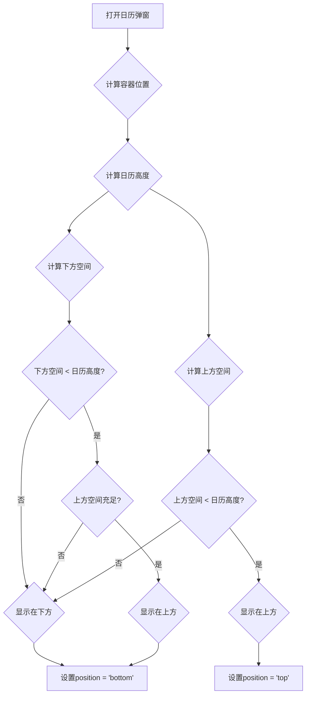
```mermaid
flowchart TD
A[打开日历弹窗] --> B{计算容器位置}
B --> C{计算日历高度}
C --> D{计算下方空间}
C --> E{计算上方空间}
D --> F{下方空间 < 日历高度?}
E --> G{上方空间 < 日历高度?}
F --> |是| H{上方空间充足?}
F --> |否| I{显示在下方}
H --> |是| J{显示在上方}
H --> |否| I
G --> |是| K{显示在上方}
G --> |否| I
I --> L[设置position = 'bottom']
J --> L
K --> M[设置position = 'top']
```

**图表来源**
- [CustomDatePicker.tsx:48-63](file://client/src/components/UI/CustomDatePicker.tsx#L48-L63)

**章节来源**
- [CustomDatePicker.tsx:1-296](file://client/src/components/UI/CustomDatePicker.tsx#L1-L296)

## 客户创建流程优化

### UnifiedCustomerModal集成

组件集成了功能完整的UnifiedCustomerModal，提供了一体化的客户创建和管理功能：

```mermaid
flowchart TD
A[用户点击"新建客户"] --> B[打开UnifiedCustomerModal]
B --> C{检查预填数据}
C --> |有预填数据| D[使用预填数据初始化表单]
C --> |无预填数据| E[使用默认配置初始化表单]
D --> F{用户选择客户类型}
E --> F
F --> |个人客户| G[显示个人客户表单字段]
F --> |组织客户| H[显示组织客户表单字段]
F --> |经销商客户| I[显示经销商客户表单字段]
G --> J[用户填写表单]
H --> J
I --> J
J --> K[验证表单数据]
K --> |验证通过| L[提交客户创建请求]
K --> |验证失败| M[显示错误信息]
L --> N[创建成功]
N --> O[关闭模态框]
O --> P[刷新客户列表]
P --> Q[自动填充到主表单]
```

**图表来源**
- [ProductWarrantyRegistrationModal.tsx:1201-1217](file://client/src/components/Service/ProductWarrantyRegistrationModal.tsx#L1201-L1217)
- [UnifiedCustomerModal.tsx:107-168](file://client/src/components/Service/UnifiedCustomerModal.tsx#L107-L168)

### 客户类型支持

组件支持三种主要的客户类型：

| 客户类型 | 代码 | 描述 | 特殊字段 |
|----------|------|------|----------|
| 个人客户 | INDIVIDUAL | 个人消费者 | 无 |
| 组织客户 | ORGANIZATION | 企业/机构 | 服务等级、地址信息 |
| 经销商客户 | DEALER | 销售渠道伙伴 | 经销商代码、维修权限 |

### 联系人管理功能

组件提供了完整的联系人管理功能：

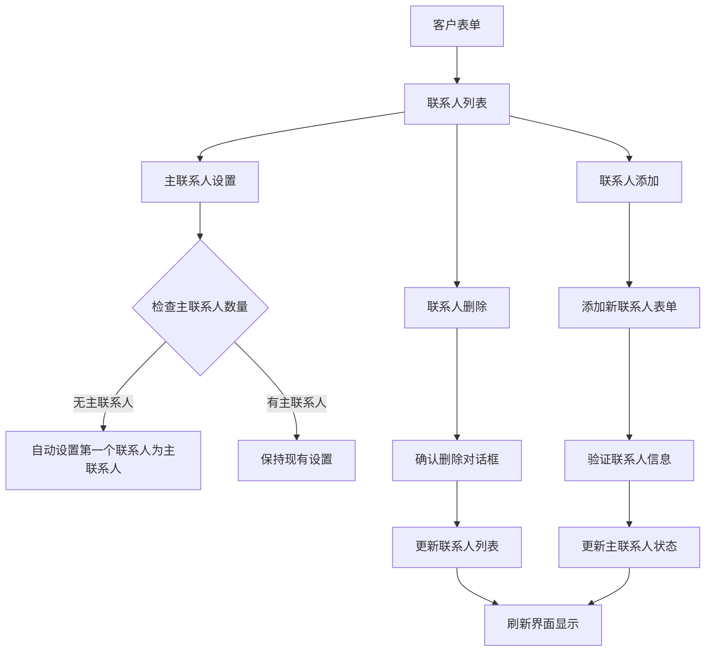
```mermaid
graph TD
A[客户表单] --> B[联系人列表]
B --> C[主联系人设置]
B --> D[联系人添加]
B --> E[联系人删除]
C --> F{检查主联系人数量}
F --> |无主联系人| G[自动设置第一个联系人为主联系人]
F --> |有主联系人| H[保持现有设置]
D --> I[添加新联系人表单]
E --> J[确认删除对话框]
I --> K[验证联系人信息]
J --> L[更新联系人列表]
K --> M[更新主联系人状态]
L --> N[刷新界面显示]
M --> N
```

**图表来源**
- [UnifiedCustomerModal.tsx:170-195](file://client/src/components/Service/UnifiedCustomerModal.tsx#L170-L195)

**章节来源**
- [ProductWarrantyRegistrationModal.tsx:1201-1217](file://client/src/components/Service/ProductWarrantyRegistrationModal.tsx#L1201-L1217)
- [UnifiedCustomerModal.tsx:1-798](file://client/src/components/Service/UnifiedCustomerModal.tsx#L1-L798)

## 销售来源验证增强

### 验证规则详解

组件实现了针对不同销售来源类型的详细验证规则：

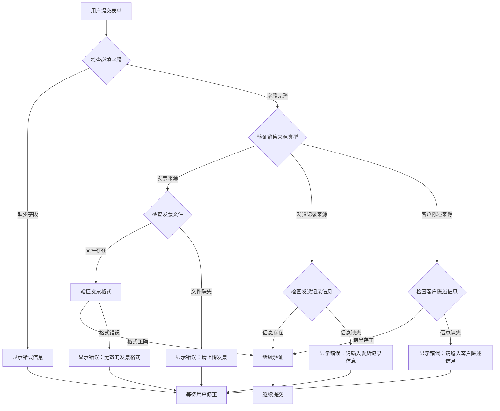
```mermaid
flowchart TD
A[用户提交表单] --> B{检查必填字段}
B --> |缺少字段| C[显示错误信息]
B --> |字段完整| D{验证销售来源类型}
D --> |发票来源| E{检查发票文件}
E --> |文件存在| F[验证发票格式]
E --> |文件缺失| G[显示错误：请上传发票]
F --> |格式正确| H[继续验证]
F --> |格式错误| I[显示错误：无效的发票格式]
D --> |发货记录来源| J{检查发货记录信息}
J --> |信息存在| H
J --> |信息缺失| K[显示错误：请输入发货记录信息]
D --> |客户陈述来源| L{检查客户陈述信息}
L --> |信息存在| H
L --> |信息缺失| M[显示错误：请输入客户陈述信息]
H --> N[继续提交]
G --> O[等待用户修正]
I --> O
K --> O
M --> O
C --> O
```

**图表来源**
- [ProductWarrantyRegistrationModal.tsx:444-468](file://client/src/components/Service/ProductWarrantyRegistrationModal.tsx#L444-L468)

### 发货记录验证逻辑

发货记录来源的验证逻辑：

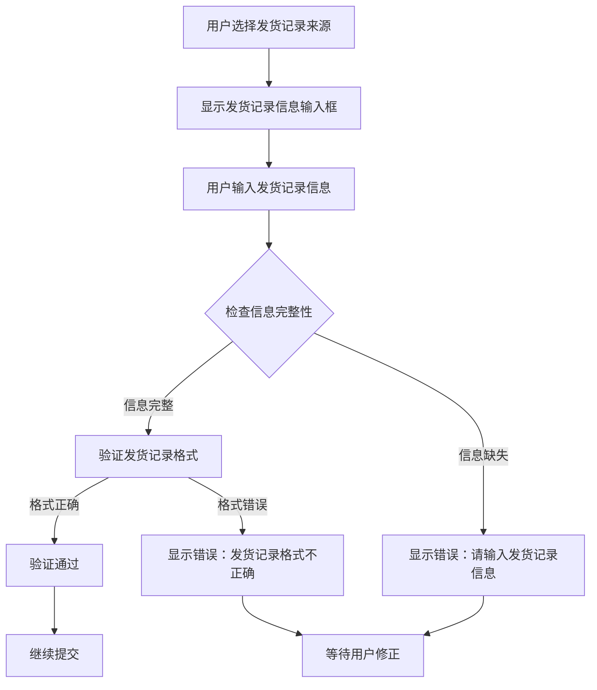
```mermaid
flowchart TD
A[用户选择发货记录来源] --> B[显示发货记录信息输入框]
B --> C[用户输入发货记录信息]
C --> D{检查信息完整性}
D --> |信息完整| E[验证发货记录格式]
D --> |信息缺失| F[显示错误：请输入发货记录信息]
E --> |格式正确| G[验证通过]
E --> |格式错误| H[显示错误：发货记录格式不正确]
G --> I[继续提交]
F --> J[等待用户修正]
H --> J
```

**图表来源**
- [ProductWarrantyRegistrationModal.tsx:936-954](file://client/src/components/Service/ProductWarrantyRegistrationModal.tsx#L936-L954)

### 客户陈述验证逻辑

客户陈述来源的验证逻辑：

```mermaid
flowchart TD
A[用户选择客户陈述来源] --> B[显示客户陈述信息输入框]
B --> C[用户输入客户陈述信息]
C --> D{检查信息完整性}
D --> |信息完整| E[验证客户陈述内容]
D --> |信息缺失| F[显示错误：请输入客户陈述信息]
E --> |内容合理| G[验证通过]
E --> |内容不合理| H[显示错误：客户陈述信息不符合要求]
G --> I[继续提交]
F --> J[等待用户修正]
H --> J
```

**图表来源**
- [ProductWarrantyRegistrationModal.tsx:956-974](file://client/src/components/Service/ProductWarrantyRegistrationModal.tsx#L956-L974)

**章节来源**
- [ProductWarrantyRegistrationModal.tsx:444-468](file://client/src/components/Service/ProductWarrantyRegistrationModal.tsx#L444-L468)
- [ProductWarrantyRegistrationModal.tsx:936-974](file://client/src/components/Service/ProductWarrantyRegistrationModal.tsx#L936-L974)

## 系统设置集成

### 产品下拉设置

组件与系统设置深度集成，支持动态配置产品下拉框显示规则：

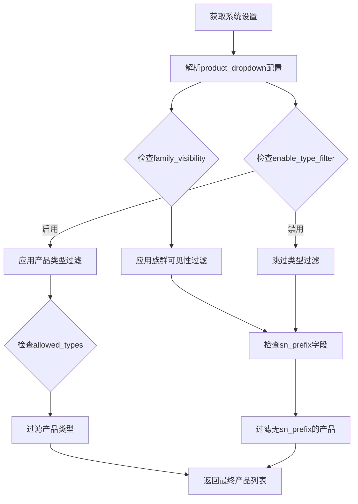
```mermaid
graph TD
A[获取系统设置] --> B[解析product_dropdown配置]
B --> C{检查family_visibility}
C --> D[应用族群可见性过滤]
B --> E{检查enable_type_filter}
E --> |启用| F[应用产品类型过滤]
E --> |禁用| G[跳过类型过滤]
F --> H{检查allowed_types}
H --> I[过滤产品类型]
I --> J[返回最终产品列表]
D --> K[检查sn_prefix字段]
K --> L[过滤无sn_prefix的产品]
L --> J
G --> K
```

**图表来源**
- [ProductWarrantyRegistrationModal.tsx:284-311](file://client/src/components/Service/ProductWarrantyRegistrationModal.tsx#L284-L311)
- [system.js:51-62](file://server/service/routes/system.js#L51-L62)

### 设置数据结构

系统设置包含以下关键配置：

| 配置项 | 数据类型 | 默认值 | 描述 |
|--------|----------|--------|------|
| show_family_a | 整数 | 1 | 是否显示产品族群A |
| show_family_b | 整数 | 0 | 是否显示产品族群B |
| show_family_c | 整数 | 1 | 是否显示产品族群C |
| show_family_d | 整数 | 1 | 是否显示产品族群D |
| show_family_e | 整数 | 0 | 是否显示产品族群E |
| enable_product_type_filter | 整数 | 1 | 是否启用产品类型过滤 |
| allowed_product_types | 字符串 | '电影机,摄像机,电子寻像器,寻像器,套装' | 允许的产品类型列表 |

### 设置应用流程

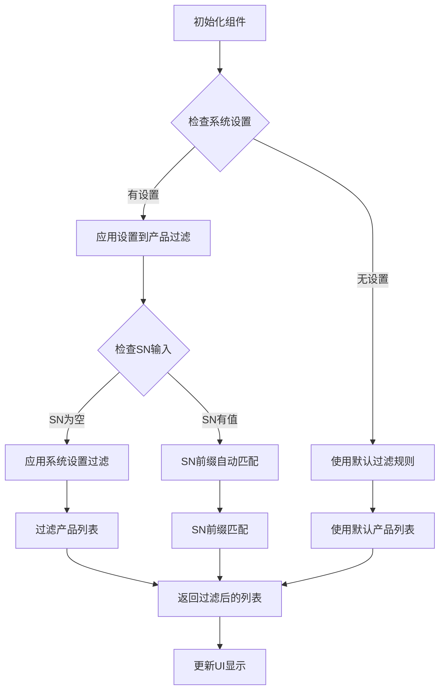
```mermaid
flowchart TD
A[初始化组件] --> B{检查系统设置}
B --> |有设置| C[应用设置到产品过滤]
B --> |无设置| D[使用默认过滤规则]
C --> E{检查SN输入}
E --> |SN为空| F[应用系统设置过滤]
E --> |SN有值| G[SN前缀自动匹配]
F --> H[过滤产品列表]
G --> I[SN前缀匹配]
H --> J[返回过滤后的列表]
I --> J
D --> K[使用默认产品列表]
K --> J
J --> L[更新UI显示]
```

**图表来源**
- [ProductWarrantyRegistrationModal.tsx:284-355](file://client/src/components/Service/ProductWarrantyRegistrationModal.tsx#L284-L355)

**章节来源**
- [system.js:17-72](file://server/service/routes/system.js#L17-L72)
- [047_add_product_dropdown_settings.sql:1-25](file://server/service/migrations/047_add_product_dropdown_settings.sql#L1-L25)

## 依赖关系分析

### 前端依赖

组件依赖于多个外部库和内部模块，包括新增的产品分类映射：

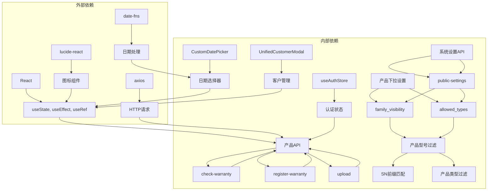
```mermaid
graph TB
subgraph "外部依赖"
A[React] --> B[useState, useEffect, useRef]
C[axios] --> D[HTTP请求]
E[lucide-react] --> F[图标组件]
G[date-fns] --> H[日期处理]
end
subgraph "内部依赖"
I[useAuthStore] --> J[认证状态]
K[CustomDatePicker] --> L[日期选择器]
M[UnifiedCustomerModal] --> N[客户管理]
O[产品API] --> P[check-warranty]
O --> Q[register-warranty]
O --> R[upload]
S[系统设置API] --> T[public-settings]
U[产品下拉设置] --> V[family_visibility]
U --> W[allowed_types]
X[产品型号过滤] --> Y[SN前缀匹配]
X --> Z[产品类型过滤]
end
B --> O
D --> O
F --> B
H --> L
J --> O
L --> B
N --> B
P --> O
Q --> O
R --> O
S --> T
T --> V
T --> W
V --> X
W --> X
```

**图表来源**
- [ProductWarrantyRegistrationModal.tsx:1-8](file://client/src/components/Service/ProductWarrantyRegistrationModal.tsx#L1-L8)
- [CustomDatePicker.tsx:1-4](file://client/src/components/UI/CustomDatePicker.tsx#L1-L4)
- [UnifiedCustomerModal.tsx:13-17](file://client/src/components/Service/UnifiedCustomerModal.tsx#L13-L17)

### 后端服务依赖

服务器端提供了完整的保修管理API，支持新的销售来源类型验证：

```mermaid
classDiagram
class ProductsRoute {
+checkWarranty()
+registerWarranty()
+calculateWarrantyEndDate()
+calculateWarrantyInfo()
}
class SystemRoute {
+publicSettings()
+dictionaries()
+rmaRules()
}
class WarrantyService {
+calculateWarrantyEndDate()
+checkWarrantyStatus()
+batchCheckWarranty()
+updateTicketWarrantyStatus()
+getProductWarrantyInfo()
}
ProductsRoute --> WarrantyService : "被调用"
SystemRoute --> ProductsRoute : "使用"
```

**图表来源**
- [products.js:1-396](file://server/service/routes/products.js#L1-L396)
- [system.js:1-200](file://server/service/routes/system.js#L1-L200)

**章节来源**
- [products.js:1-396](file://server/service/routes/products.js#L1-L396)
- [system.js:1-200](file://server/service/routes/system.js#L1-L200)

## 性能考虑

### 优化策略

1. **防抖搜索**：对客户搜索功能实现300ms防抖，减少不必要的API调用
2. **懒加载数据**：仅在模态框打开时加载相关数据
3. **文件大小限制**：限制上传文件大小为5MB，避免内存问题
4. **条件渲染**：根据用户操作动态渲染相关UI元素
5. **产品分类缓存**：缓存产品线和家族映射数据，提升选择效率
6. **双列布局优化**：利用CSS Grid实现高效的布局渲染
7. **销售来源类型缓存**：缓存用户选择的销售来源类型，避免重复验证
8. **客户搜索缓存**：缓存最近搜索结果，提升搜索响应速度
9. **UnifiedCustomerModal懒加载**：仅在需要时加载客户创建模态框
10. **系统设置缓存**：缓存系统设置，避免重复获取
11. **SN前缀匹配优化**：使用高效的字符串匹配算法
12. **日期选择器位置缓存**：缓存日历弹窗的位置状态

### 缓存机制

组件实现了多层缓存策略：
- **本地状态缓存**：React状态管理
- **API响应缓存**：避免重复的API调用
- **产品目录缓存**：预加载产品目录数据
- **分类映射缓存**：缓存产品线和家族映射关系
- **销售来源类型缓存**：缓存用户选择的销售来源类型
- **客户搜索缓存**：缓存最近的搜索结果
- **系统设置缓存**：缓存系统配置信息
- **SN前缀匹配缓存**：缓存匹配结果

### 布局性能

新的双列布局设计在性能方面进行了优化：
- **CSS Grid**：使用现代布局技术，减少JavaScript计算
- **固定宽度**：900px固定宽度简化布局计算
- **玻璃效果**：通过CSS变量实现，避免额外的图片资源
- **模态框动画**：使用CSS关键帧动画，避免JavaScript动画开销
- **日期选择器优化**：使用虚拟滚动和位置缓存
- **客户模态框懒加载**：仅在需要时加载

## 故障排除指南

### 常见问题及解决方案

| 问题类型 | 症状 | 解决方案 |
|---------|------|---------|
| 文件上传失败 | 上传按钮无响应 | 检查文件格式和大小限制 |
| 产品搜索无结果 | 搜索框无匹配项 | 确认产品型号正确性和网络连接 |
| 保修注册失败 | 显示错误消息 | 检查必填字段和服务器连接 |
| 状态检查异常 | 无法获取保修状态 | 验证序列号格式和权限设置 |
| 销售来源验证失败 | 不同来源类型报错 | 检查对应的数据收集是否完整 |
| 发票文件格式错误 | 显示无效的发票格式 | 确认文件格式为JPG/PNG/PDF |
| 客户陈述信息为空 | 显示客户陈述错误 | 输入详细的销售陈述信息 |
| 发货记录信息为空 | 显示发货记录错误 | 输入发货单号、日期等相关信息 |
| 产品线选择错误 | 产品线选项无效 | 确认产品线代码正确（Camera/EVF/Accessory） |
| 产品家族分类错误 | 家族选项无效 | 确认家族代码正确（A/B/C/D/E） |
| 布局显示异常 | 双列布局错位 | 检查CSS变量和浏览器兼容性 |
| 玻璃效果失效 | 卡片透明度异常 | 验证CSS变量定义和浏览器支持 |
| 客户搜索无响应 | 搜索框无反应 | 检查网络连接和API可用性 |
| UnifiedCustomerModal无法打开 | 弹窗不显示 | 检查模态框状态和DOM挂载 |
| 客户创建失败 | 提交后无响应 | 检查必填字段和服务器错误日志 |
| 产品型号过滤异常 | 产品列表显示不正确 | 检查系统设置配置和SN前缀匹配 |
| 日期选择器位置错误 | 日历弹窗显示在错误位置 | 检查容器位置和空间检测逻辑 |
| 系统设置不生效 | 产品下拉框显示异常 | 检查系统设置API和缓存状态 |
| SN前缀匹配失败 | 无法自动匹配产品型号 | 检查SN输入和产品前缀配置 |

### 错误处理机制

组件实现了完善的错误处理：
- **网络错误**：显示友好的错误提示
- **文件验证错误**：明确指出文件格式和大小问题
- **业务逻辑错误**：提供具体的解决建议
- **销售来源验证错误**：提示正确的数据收集格式
- **分类验证错误**：提示正确的分类代码格式
- **布局渲染错误**：提供降级显示方案
- **客户搜索错误**：显示搜索失败提示并允许重试
- **UnifiedCustomerModal错误**：显示创建失败原因并允许重新创建
- **产品型号过滤错误**：显示过滤失败原因并允许手动选择
- **日期选择器错误**：显示日期选择失败原因并允许重新选择
- **系统设置错误**：显示设置加载失败原因并允许重试

**章节来源**
- [ProductWarrantyRegistrationModal.tsx:444-575](file://client/src/components/Service/ProductWarrantyRegistrationModal.tsx#L444-L575)

## 结论

保修注册模态框组件是一个功能完整、设计合理的前端组件，它成功地解决了产品保修信息管理的核心需求。经过重大功能增强后，组件现在具备以下特点：

1. **用户体验优秀**：采用现代化的双列布局设计，提供更好的信息组织和视觉层次
2. **功能完整性**：涵盖了保修注册的所有必要功能，包括新增的三种销售来源类型
3. **智能产品过滤**：通过系统设置实现SN前缀匹配、产品类型限制、家族可见性控制
4. **日期选择优化**：集成功能丰富的CustomDatePicker，提供更好的日期输入体验
5. **客户管理一体化**：通过UnifiedCustomerModal集成，提供完整的客户创建和管理功能
6. **技术实现先进**：采用现代React开发模式和最佳实践，全面应用CSS变量和玻璃纤维样式
7. **可维护性强**：清晰的代码结构和完善的注释，支持复杂的销售来源类型逻辑
8. **扩展性良好**：易于添加新功能和修改现有功能，支持未来的功能扩展
9. **分类管理完善**：支持Camera、EVF、Accessory三类产品线和A-E六个产品家族的精细化管理
10. **销售来源多样化**：支持发票、客户陈述、发货记录三种销售来源类型，适应不同业务场景
11. **验证机制完善**：针对不同销售来源类型实施特定的验证规则，确保数据质量
12. **客户搜索高效**：集成智能搜索功能，支持关键词搜索和快速客户选择
13. **视觉效果出色**：通过CSS变量系统实现统一的主题控制和现代化的玻璃纤维效果
14. **性能优化到位**：实现了多层缓存和性能优化策略，确保流畅的用户体验
15. **系统设置集成**：支持动态配置产品下拉框显示规则，提升系统的灵活性
16. **日期选择器增强**：提供年月选择器、位置自适应、禁用日期范围控制等高级功能

该组件与后端服务的紧密集成确保了数据的一致性和准确性，为整个服务管理系统的保修管理功能奠定了坚实的基础。新增的产品型号过滤系统、日期选择器增强功能、客户创建流程优化以及系统设置集成显著提升了系统的灵活性和实用性，能够适应更多样化的销售场景和业务需求。双列布局设计和玻璃纤维样式的全面应用为用户提供了现代化、高品质的视觉体验和操作界面。

通过这次重大更新，保修注册模态框组件不仅在功能上得到了大幅增强，还在用户体验、性能表现和可维护性方面达到了新的高度，为Longhorn服务管理系统的整体发展做出了重要贡献。