# 前端组件架构

<cite>
**本文档引用的文件**
- [package.json](file://client/package.json)
- [vite.config.ts](file://client/vite.config.ts)
- [main.tsx](file://client/src/main.tsx)
- [App.tsx](file://client/src/App.tsx)
- [index.css](file://client/src/index.css)
- [App.css](file://client/src/App.css)
- [useAuthStore.ts](file://client/src/store/useAuthStore.ts)
- [useToast.ts](file://client/src/store/useToast.ts)
- [useConfirm.ts](file://client/src/store/useConfirm.ts)
- [useThemeStore.ts](file://client/src/store/useThemeStore.ts)
- [useWikiStore.ts](file://client/src/store/useWikiStore.ts)
- [useTicketStore.ts](file://client/src/store/useTicketStore.ts)
- [useDetailStore.ts](file://client/src/store/useDetailStore.ts)
- [useListStateStore.ts](file://client/src/store/useListStateStore.ts)
- [useRouteMemoryStore.ts](file://client/src/store/useRouteMemoryStore.ts)
- [useLanguage.ts](file://client/src/i18n/useLanguage.ts)
- [translations.ts](file://client/src/i18n/translations.ts)
- [useCachedFiles.ts](file://client/src/hooks/useCachedFiles.ts)
- [FileBrowser.tsx](file://client/src/components/FileBrowser.tsx)
- [dateLocale.ts](file://client/src/utils/dateLocale.ts)
- [pathTranslator.ts](file://client/src/utils/pathTranslator.ts)
- [tsconfig.json](file://client/tsconfig.json)
- [tsconfig.app.json](file://client/tsconfig.app.json)
- [eslint.config.js](file://client/eslint.config.js)
- [AdminSettings.tsx](file://client/src/components/Admin/AdminSettings.tsx)
- [AppRail.tsx](file://client/src/components/AppRail.tsx)
- [ServiceNavigation.tsx](file://client/src/components/Service/ServiceNavigation.tsx)
- [ServiceOverviewPage.tsx](file://client/src/components/Service/ServiceOverviewPage.tsx)
- [WorkspacePage.tsx](file://client/src/components/Service/WorkspacePage.tsx)
- [CustomerContextSidebar.tsx](file://client/src/components/Service/CustomerContextSidebar.tsx)
- [AttachmentZone.tsx](file://client/src/components/Service/AttachmentZone.tsx)
- [NotificationCenter.tsx](file://client/src/components/Notifications/NotificationCenter.tsx)
- [SlaComponents.tsx](file://client/src/components/Tickets/SlaComponents.tsx)
- [WorkspaceComponents.tsx](file://client/src/components/Workspace/WorkspaceComponents.tsx)
- [OverviewDashboard.tsx](file://client/src/components/Workspace/OverviewDashboard.tsx)
- [UnifiedTicketDetail.tsx](file://client/src/components/Workspace/UnifiedTicketDetail.tsx)
- [MentionCommentInput.tsx](file://client/src/components/Workspace/MentionCommentInput.tsx)
- [NodeProgressBar.tsx](file://client/src/components/Workspace/NodeProgressBar.tsx)
- [ParticipantsSidebar.tsx](file://client/src/components/Workspace/ParticipantsSidebar.tsx)
- [TicketDetailComponents.tsx](file://client/src/components/Workspace/TicketDetailComponents.tsx)
- [ViewAsComponents.tsx](file://client/src/components/Workspace/ViewAsComponents.tsx)
- [DebugOverlay.tsx](file://client/src/components/DebugOverlay.tsx)
- [ContactCleaningModal.tsx](file://client/src/components/Service/ContactCleaningModal.tsx)
- [ConvertIndividualModal.tsx](file://client/src/components/Service/ConvertIndividualModal.tsx)
- [LinkCorporateModal.tsx](file://client/src/components/Service/LinkCorporateModal.tsx)
- [AccountContactSelector.tsx](file://client/src/components/AccountContactSelector.tsx)
- [ActionBufferModal.tsx](file://client/src/components/Workspace/ActionBufferModal.tsx)
- [AssigneeSelector.tsx](file://client/src/components/Workspace/AssigneeSelector.tsx)
- [SubmitDiagnosticModal.tsx](file://client/src/components/Workspace/SubmitDiagnosticModal.tsx)
- [index.ts](file://client/src/components/Service/index.ts)
- [index.ts](file://client/src/components/Notifications/index.ts)
- [index.ts](file://client/src/components/Workspace/index.ts)
</cite>

## 更新摘要
**所做更改**
- 新增五大状态管理store：useWikiStore、useTicketStore、useDetailStore、useListStateStore、useRouteMemoryStore，形成完整的状态管理体系
- 新增ActionBufferModal组件 - 支持RMA/SVC流程节点的缓冲确认操作
- 新增AssigneeSelector组件 - 提供智能指派选择器，支持部门过滤和确认机制
- 新增SubmitDiagnosticModal组件 - 支持技术诊断报告提交和保修判定
- 增强UnifiedTicketDetail组件 - 集成三大新组件，完善工单流程操作
- 增强MentionCommentInput组件 - 新增@提及功能和交互频率统计
- 增强ParticipantsSidebar组件 - 新增智能分组和交互频率统计
- 增强AccountContactSelector组件 - 新增搜索防抖和工单统计显示
- 新增DebugOverlay调试系统 - 提供UI调试模式和权限代码显示
- 完成CSS变量主题系统迁移 - 从硬编码RGBA值到统一的CSS变量体系

## 目录
1. [引言](#引言)
2. [项目结构](#项目结构)
3. [核心组件](#核心组件)
4. [架构总览](#架构总览)
5. [组件详解](#组件详解)
6. [状态管理增强](#状态管理增强)
7. [Service模块组件](#service模块组件)
8. [通知中心组件](#通知中心组件)
9. [SLA组件库](#sla组件库)
10. [工作区组件群](#工作区组件群)
11. [Workspace组件集合](#workspace组件集合)
12. [新增组件详解](#新增组件详解)
13. [客户管理模态组件](#客户管理模态组件)
14. [调试覆盖层组件](#调试覆盖层组件)
15. [主题系统](#主题系统)
16. [样式系统升级](#样式系统升级)
17. [依赖关系分析](#依赖关系分析)
18. [性能考量](#性能考量)
19. [故障排查指南](#故障排查指南)
20. [结论](#结论)
21. [附录](#附录)

## 引言
本文件面向 Longhorn 前端组件架构，围绕 React 19 + TypeScript 的设计与实现，系统梳理组件设计模式、状态管理模式、路由配置、国际化与主题/响应式支持、自定义 Hook 的设计与复用策略、组件库使用与样式扩展、以及构建、打包与部署策略。文档同时提供可视化图示帮助理解模块间交互与数据流。

**更新** 本次更新重点增加了五大状态管理store的完整实现：useWikiStore（知识库搜索状态）、useTicketStore（工单草稿状态）、useDetailStore（详情页状态）、useListStateStore（列表页状态）、useRouteMemoryStore（路由记忆状态）。这些新增store与现有的UI状态管理store（useAuthStore、useToast、useConfirm、useThemeStore）共同构成了完整的状态管理体系。同时新增的三大核心组件（ActionBufferModal、AssigneeSelector、SubmitDiagnosticModal）与DebugOverlay调试系统进一步完善了前端架构的组件化设计和开发工具链。

## 项目结构
客户端位于 client 目录，采用 Vite + React 19 + TypeScript 技术栈，按功能域分层组织：
- src/main.tsx：应用入口，挂载根组件和DebugProvider
- src/App.tsx：路由与布局主入口，定义公共布局、侧边栏、顶部栏、路由守卫与重定向
- src/components：页面级组件（文件浏览器、仪表盘、分享页、回收站等）
- src/store：基于 Zustand 的状态管理（认证、提示、确认对话框、主题、Wiki、Ticket、详情、列表、路由记忆）
- src/hooks：基于 SWR 的缓存化数据钩子（文件列表、预取）
- src/i18n：本地化实现（语言切换、事件总线、翻译字典）
- src/utils：工具函数（日期本地化、路径段翻译）
- 样式系统：基于CSS变量的主题系统，支持深色/浅色模式和系统偏好检测
- 配置：vite.config.ts、tsconfig.*、eslint.config.js

```mermaid
graph TB
subgraph "应用入口"
M["main.tsx"]
A["App.tsx"]
end
subgraph "路由与布局"
R["路由配置<br/>Protected/Public Routes"]
L["MainLayout/Sidebar/TopBar"]
end
subgraph "状态管理"
AS["useAuthStore.ts"]
TS["useToast.ts"]
CS["useConfirm.ts"]
TH["useThemeStore.ts"]
WS["useWikiStore.ts"]
TTS["useTicketStore.ts"]
DS["useDetailStore.ts"]
LS["useListStateStore.ts"]
RMS["useRouteMemoryStore.ts"]
end
subgraph "样式系统"
CSS["index.css<br/>CSS变量定义"]
APP["App.css<br/>基础样式"]
GLASS["玻璃效果系统<br/>macOS 26风格"]
end
subgraph "数据与缓存"
HC["useCachedFiles.ts"]
FB["FileBrowser.tsx"]
end
subgraph "国际化"
UL["useLanguage.ts"]
TR["translations.ts"]
end
subgraph "工具"
DL["dateLocale.ts"]
PT["pathTranslator.ts"]
end
subgraph "Service模块"
SN["ServiceNavigation.tsx"]
SOP["ServiceOverviewPage.tsx"]
WP["WorkspacePage.tsx"]
CCS["CustomerContextSidebar.tsx"]
AZ["AttachmentZone.tsx"]
end
subgraph "通知中心"
NC["NotificationCenter.tsx"]
end
subgraph "SLA组件库"
SLA["SlaComponents.tsx"]
end
subgraph "工作区组件群"
WC["WorkspaceComponents.tsx"]
OD["OverviewDashboard.tsx"]
end
subgraph "Workspace组件集合"
UTD["UnifiedTicketDetail.tsx"]
MCI["MentionCommentInput.tsx"]
NPB["NodeProgressBar.tsx"]
PS["ParticipantsSidebar.tsx"]
TDC["TicketDetailComponents.tsx"]
VAC["ViewAsComponents.tsx"]
end
subgraph "新增组件"
ABM["ActionBufferModal.tsx"]
ASM["AssigneeSelector.tsx"]
SDM["SubmitDiagnosticModal.tsx"]
end
subgraph "客户管理模态组件"
CCM["ContactCleaningModal.tsx"]
CIM["ConvertIndividualModal.tsx"]
LCM["LinkCorporateModal.tsx"]
ACS["AccountContactSelector.tsx"]
end
subgraph "调试覆盖层"
DO["DebugOverlay.tsx"]
DIP["DebugInfoPanel"]
DMT["DebugModeToggle"]
DB["DebugBadge"]
end
M --> A
A --> R
R --> L
L --> FB
FB --> HC
A --> AS
A --> TH
A --> UL
UL --> TR
FB --> TS
FB --> CS
FB --> CSS
FB --> GLASS
FB --> DL
FB --> PT
A --> SN
A --> NC
A --> SLA
A --> WC
A --> OD
A --> UTD
A --> MCI
A --> NPB
A --> PS
A --> TDC
A --> VAC
A --> ABM
A --> ASM
A --> SDM
A --> CCM
A --> CIM
A --> LCM
A --> ACS
A --> DIP
DO --> DMT
DO --> DB
```

**图表来源**
- [main.tsx:1-25](file://client/src/main.tsx#L1-L25)
- [App.tsx:124-200](file://client/src/App.tsx#L124-L200)
- [index.css:1-101](file://client/src/index.css#L1-L101)
- [useThemeStore.ts:1-86](file://client/src/store/useThemeStore.ts#L1-L86)
- [useAuthStore.ts:1-37](file://client/src/store/useAuthStore.ts#L1-L37)
- [useToast.ts:1-41](file://client/src/store/useToast.ts#L1-L41)
- [useConfirm.ts:1-42](file://client/src/store/useConfirm.ts#L1-L42)
- [useWikiStore.ts:1-50](file://client/src/store/useWikiStore.ts#L1-L50)
- [useTicketStore.ts:1-103](file://client/src/store/useTicketStore.ts#L1-L103)
- [useDetailStore.ts:1-42](file://client/src/store/useDetailStore.ts#L1-L42)
- [useListStateStore.ts:1-156](file://client/src/store/useListStateStore.ts#L1-L156)
- [useRouteMemoryStore.ts:1-47](file://client/src/store/useRouteMemoryStore.ts#L1-L47)

**章节来源**
- [main.tsx:1-25](file://client/src/main.tsx#L1-L25)
- [vite.config.ts:1-82](file://client/vite.config.ts#L1-L82)
- [tsconfig.app.json:1-29](file://client/tsconfig.app.json#L1-L29)
- [eslint.config.js:1-24](file://client/eslint.config.js#L1-L24)

## 核心组件
- 路由与布局：App.tsx 定义公开与受保护路由、登录守卫、主布局 MainLayout、侧边栏 Sidebar、顶部栏 TopBar，并通过 Outlet 渲染子路由内容。
- 认证与会话：useAuthStore.ts 提供用户信息与令牌的持久化存储与登出逻辑。
- 通知与确认：useToast.ts 与 useConfirm.ts 通过 Zustand 管理 Toast 列表与确认对话框 Promise 化流程。
- 主题管理：useThemeStore.ts 提供深色/浅色/系统主题切换，基于CSS变量实现动态主题切换。
- 知识库状态：useWikiStore.ts 管理 Wiki 搜索上下文、查询状态和产品线选择。
- 工单状态：useTicketStore.ts 管理工单创建/编辑草稿、纠错模式状态。
- 详情页状态：useDetailStore.ts 管理账户详情页的展开状态和联系人显示。
- 列表页状态：useListStateStore.ts 管理工单列表的视图模式、分组状态和过滤条件。
- 路由记忆：useRouteMemoryStore.ts 记忆用户访问的列表路由，提供返回功能。
- 数据缓存：useCachedFiles.ts 基于 SWR 实现目录列表的缓存、去重、轮询与预取。
- 国际化：useLanguage.ts 提供语言切换与事件广播；translations.ts 提供多语言字典。
- 工具函数：dateLocale.ts 与 pathTranslator.ts 支持日期本地化与路径段翻译。

**章节来源**
- [App.tsx:124-200](file://client/src/App.tsx#L124-L200)
- [useAuthStore.ts:1-37](file://client/src/store/useAuthStore.ts#L1-L37)
- [useToast.ts:1-41](file://client/src/store/useToast.ts#L1-L41)
- [useConfirm.ts:1-42](file://client/src/store/useConfirm.ts#L1-L42)
- [useThemeStore.ts:1-86](file://client/src/store/useThemeStore.ts#L1-L86)
- [useWikiStore.ts:1-50](file://client/src/store/useWikiStore.ts#L1-L50)
- [useTicketStore.ts:1-103](file://client/src/store/useTicketStore.ts#L1-L103)
- [useDetailStore.ts:1-42](file://client/src/store/useDetailStore.ts#L1-L42)
- [useListStateStore.ts:1-156](file://client/src/store/useListStateStore.ts#L1-L156)
- [useRouteMemoryStore.ts:1-47](file://client/src/store/useRouteMemoryStore.ts#L1-L47)
- [useCachedFiles.ts:1-102](file://client/src/hooks/useCachedFiles.ts#L1-L102)
- [useLanguage.ts:1-59](file://client/src/i18n/useLanguage.ts#L1-L59)
- [translations.ts:1-800](file://client/src/i18n/translations.ts#L1-L800)
- [dateLocale.ts:1-20](file://client/src/utils/dateLocale.ts#L1-L20)
- [pathTranslator.ts:1-53](file://client/src/utils/pathTranslator.ts#L1-L53)

## 架构总览
Longhorn 前端采用"路由驱动 + 组件分层 + 状态集中"的架构：
- 路由层：BrowserRouter + Routes + Route 元素，区分公开与受保护路由，结合 useAuthStore 进行登录态校验。
- 布局层：MainLayout 封装侧边栏与内容区域，TopBar 提供搜索、用户菜单与语言切换。
- 状态层：Zustand store 管理各类业务状态，包括认证、UI交互、主题、Wiki、Ticket、详情、列表、路由记忆等。
- 数据层：SWR 钩子统一管理文件列表与目录变更，Zustand 管理轻量 UI 状态（Toast、确认框、主题）。
- 样式层：基于CSS变量的主题系统，支持深色/浅色模式自动切换，确保所有组件使用统一的颜色语义。
- 国际化层：useLanguage 与 translations 提供语言切换与文本渲染，dateLocale 与 pathTranslator 提供 UI 层本地化细节。
- 调试层：DebugOverlay 提供UI调试模式，支持权限代码显示和开发辅助功能。

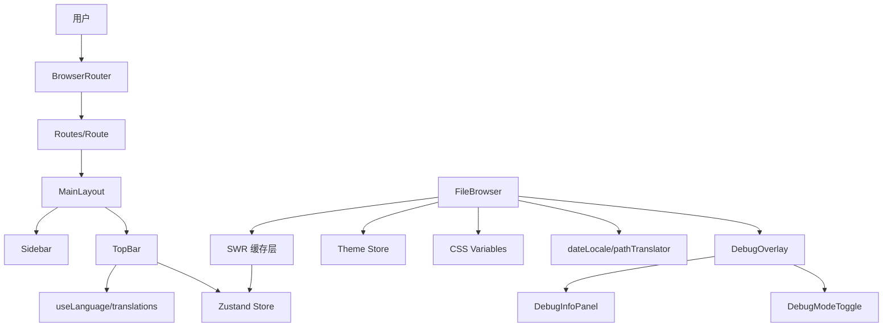

**图表来源**
- [App.tsx:124-200](file://client/src/App.tsx#L124-L200)
- [useCachedFiles.ts:1-102](file://client/src/hooks/useCachedFiles.ts#L1-L102)
- [useThemeStore.ts:1-86](file://client/src/store/useThemeStore.ts#L1-L86)
- [useLanguage.ts:1-59](file://client/src/i18n/useLanguage.ts#L1-L59)
- [dateLocale.ts:1-20](file://client/src/utils/dateLocale.ts#L1-L20)
- [pathTranslator.ts:1-53](file://client/src/utils/pathTranslator.ts#L1-L53)
- [DebugOverlay.tsx:1-255](file://client/src/components/DebugOverlay.tsx#L1-L255)

## 组件详解

### 路由与布局组件
- 受保护路由：当用户不存在或角色缺失时重定向至登录；否则渲染 MainLayout。
- 主布局：包含移动端遮罩、侧边栏与内容区，Outlet 渲染子路由。
- 侧边栏：根据用户角色与可访问部门动态渲染导航项，支持语言与部门名称翻译。
- 顶部栏：提供搜索、用户菜单（语言切换、个人空间、仪表盘、登出）、版本信息展示。

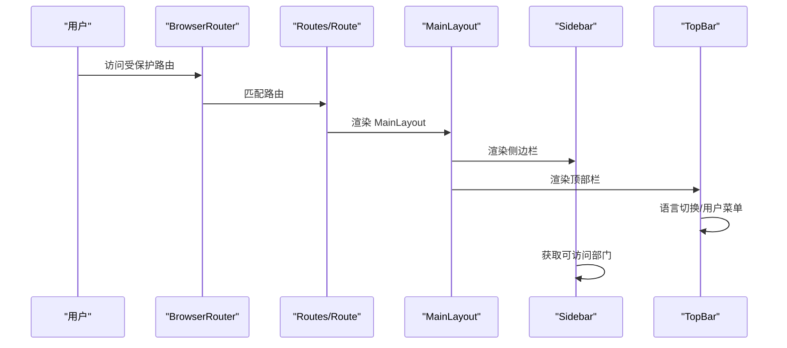

**图表来源**
- [App.tsx:124-200](file://client/src/App.tsx#L124-L200)
- [App.tsx:128-268](file://client/src/App.tsx#L128-L268)
- [App.tsx:349-616](file://client/src/App.tsx#L349-L616)

**章节来源**
- [App.tsx:124-200](file://client/src/App.tsx#L124-L200)
- [App.tsx:128-268](file://client/src/App.tsx#L128-L268)
- [App.tsx:349-616](file://client/src/App.tsx#L349-L616)

### 状态管理（Zustand）
- useAuthStore：持久化用户与令牌，提供 setAuth 与 logout。
- useToast：维护 Toast 列表，支持自动消失与手动隐藏。
- useConfirm：Promise 化确认对话框，通过 resolve 传递结果。
- useThemeStore：管理主题状态，支持深色/浅色/系统主题切换。
- useWikiStore：管理 Wiki 搜索上下文、查询状态和产品线选择。
- useTicketStore：管理工单草稿、纠错模式和目标工单ID。
- useDetailStore：管理详情页展开状态和联系人显示。
- useListStateStore：管理列表页视图模式、分组状态和过滤条件。
- useRouteMemoryStore：记忆路由并提供返回功能。

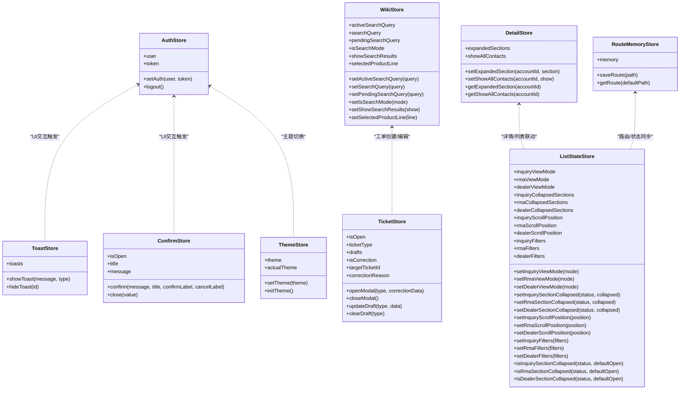

**图表来源**
- [useAuthStore.ts:1-37](file://client/src/store/useAuthStore.ts#L1-L37)
- [useToast.ts:1-41](file://client/src/store/useToast.ts#L1-L41)
- [useConfirm.ts:1-42](file://client/src/store/useConfirm.ts#L1-L42)
- [useThemeStore.ts:1-86](file://client/src/store/useThemeStore.ts#L1-L86)
- [useWikiStore.ts:1-50](file://client/src/store/useWikiStore.ts#L1-L50)
- [useTicketStore.ts:1-103](file://client/src/store/useTicketStore.ts#L1-L103)
- [useDetailStore.ts:1-42](file://client/src/store/useDetailStore.ts#L1-L42)
- [useListStateStore.ts:1-156](file://client/src/store/useListStateStore.ts#L1-L156)
- [useRouteMemoryStore.ts:1-47](file://client/src/store/useRouteMemoryStore.ts#L1-L47)

**章节来源**
- [useAuthStore.ts:1-37](file://client/src/store/useAuthStore.ts#L1-L37)
- [useToast.ts:1-41](file://client/src/store/useToast.ts#L1-L41)
- [useConfirm.ts:1-42](file://client/src/store/useConfirm.ts#L1-L42)
- [useThemeStore.ts:1-86](file://client/src/store/useThemeStore.ts#L1-L86)
- [useWikiStore.ts:1-50](file://client/src/store/useWikiStore.ts#L1-L50)
- [useTicketStore.ts:1-103](file://client/src/store/useTicketStore.ts#L1-L103)
- [useDetailStore.ts:1-42](file://client/src/store/useDetailStore.ts#L1-L42)
- [useListStateStore.ts:1-156](file://client/src/store/useListStateStore.ts#L1-L156)
- [useRouteMemoryStore.ts:1-47](file://client/src/store/useRouteMemoryStore.ts#L1-L47)

### 数据缓存与请求（SWR + Axios）
- useCachedFiles：封装目录列表请求，支持模式化查询（全部/最近/星标/个人），去重、轮询与预取。
- FileBrowser：消费 useCachedFiles，配合上下文菜单、预览、上传、分享、移动、删除等操作。

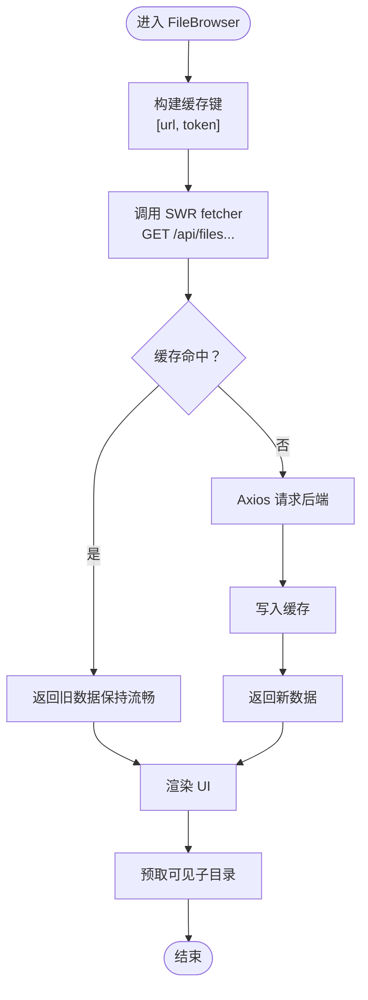

**图表来源**
- [useCachedFiles.ts:27-86](file://client/src/hooks/useCachedFiles.ts#L27-L86)
- [FileBrowser.tsx:96-102](file://client/src/components/FileBrowser.tsx#L96-L102)

**章节来源**
- [useCachedFiles.ts:1-102](file://client/src/hooks/useCachedFiles.ts#L1-L102)
- [FileBrowser.tsx:1-200](file://client/src/components/FileBrowser.tsx#L1-L200)

### 国际化与本地化
- useLanguage：本地语言存储与事件广播，t(key, params) 支持参数插值。
- translations：多语言字典，覆盖应用各模块文案。
- dateLocale：根据语言返回 date-fns 本地化对象。
- pathTranslator：将路径中的部门代码段翻译为本地化名称。

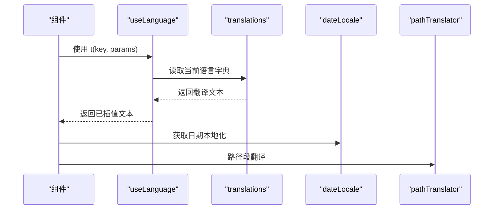

**图表来源**
- [useLanguage.ts:1-59](file://client/src/i18n/useLanguage.ts#L1-L59)
- [translations.ts:1-800](file://client/src/i18n/translations.ts#L1-L800)
- [dateLocale.ts:1-20](file://client/src/utils/dateLocale.ts#L1-L20)
- [pathTranslator.ts:1-53](file://client/src/utils/pathTranslator.ts#L1-L53)

**章节来源**
- [useLanguage.ts:1-59](file://client/src/i18n/useLanguage.ts#L1-L59)
- [translations.ts:1-800](file://client/src/i18n/translations.ts#L1-L800)
- [dateLocale.ts:1-20](file://client/src/utils/dateLocale.ts#L1-L20)
- [pathTranslator.ts:1-53](file://client/src/utils/pathTranslator.ts#L1-L53)

### 组件间通信与数据流
- 路由层向布局层传递用户信息，布局层向子组件注入 t、useAuthStore、useToast、useConfirm、useThemeStore。
- FileBrowser 通过 SWR 与后端交互，状态通过 Zustand 管理 UI 交互反馈。
- 侧边栏与顶部栏通过 useLanguage 控制文案与语言切换，Sidebar 动态拉取可访问部门列表。
- 主题系统通过 useThemeStore 管理主题状态，CSS变量实现全局样式更新。
- 调试覆盖层通过DebugProvider提供全局调试状态，支持权限代码显示和开发辅助。

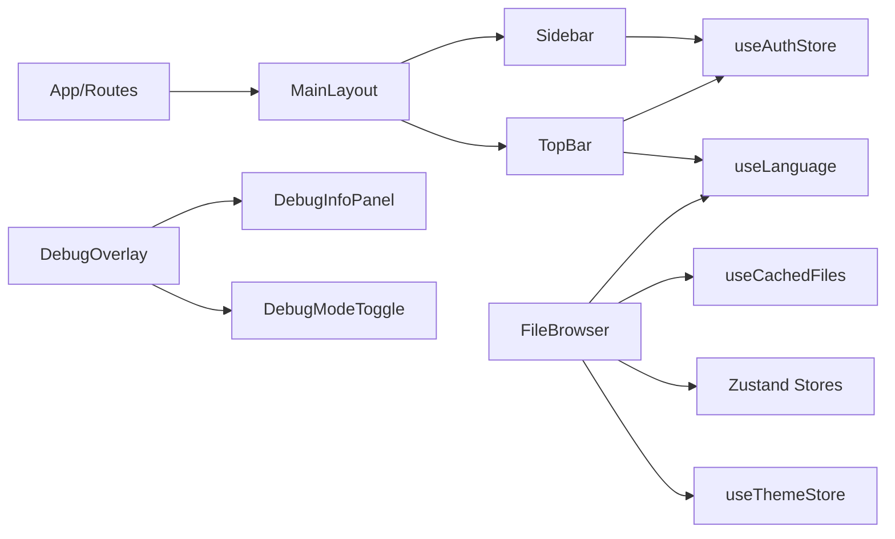

**图表来源**
- [App.tsx:124-200](file://client/src/App.tsx#L124-L200)
- [useCachedFiles.ts:1-102](file://client/src/hooks/useCachedFiles.ts#L1-L102)
- [useLanguage.ts:1-59](file://client/src/i18n/useLanguage.ts#L1-L59)
- [useAuthStore.ts:1-37](file://client/src/store/useAuthStore.ts#L1-L37)
- [useThemeStore.ts:1-86](file://client/src/store/useThemeStore.ts#L1-L86)
- [DebugOverlay.tsx:1-255](file://client/src/components/DebugOverlay.tsx#L1-L255)

**章节来源**
- [App.tsx:124-200](file://client/src/App.tsx#L124-L200)
- [useCachedFiles.ts:1-102](file://client/src/hooks/useCachedFiles.ts#L1-L102)
- [useLanguage.ts:1-59](file://client/src/i18n/useLanguage.ts#L1-L59)
- [useAuthStore.ts:1-37](file://client/src/store/useAuthStore.ts#L1-L37)
- [useThemeStore.ts:1-86](file://client/src/store/useThemeStore.ts#L1-L86)
- [DebugOverlay.tsx:1-255](file://client/src/components/DebugOverlay.tsx#L1-L255)

## 状态管理增强

### Zustand Store 体系架构

Longhorn 前端实现了完整的 Zustand Store 体系，涵盖认证、UI交互、主题、业务状态等多个维度：

#### 认证与会话状态
- **useAuthStore**：管理用户认证信息和令牌，支持持久化存储和登出功能
- **useConfirm**：管理确认对话框状态，支持Promise化流程控制
- **useToast**：管理Toast通知状态，支持自动消失和手动隐藏

#### 主题与UI状态
- **useThemeStore**：管理主题切换，支持深色/浅色/系统主题模式
- **useWikiStore**：管理Wiki搜索状态，包括查询上下文和产品线选择
- **useTicketStore**：管理工单创建/编辑草稿，支持纠错模式

#### 业务状态管理
- **useDetailStore**：管理详情页状态，支持展开状态和联系人显示控制
- **useListStateStore**：管理列表页状态，支持视图模式、分组状态和过滤条件
- **useRouteMemoryStore**：管理路由记忆，支持用户访问历史记录

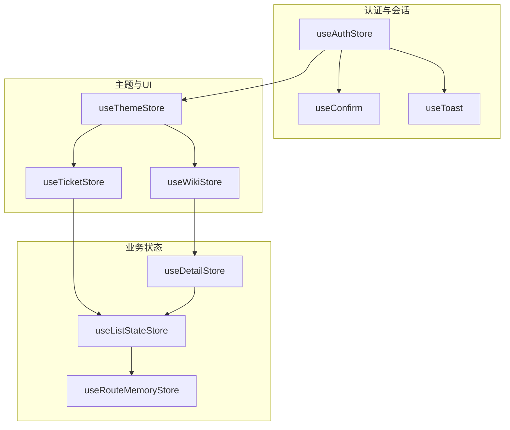

**图表来源**
- [useAuthStore.ts:1-37](file://client/src/store/useAuthStore.ts#L1-L37)
- [useConfirm.ts:1-42](file://client/src/store/useConfirm.ts#L1-L42)
- [useToast.ts:1-41](file://client/src/store/useToast.ts#L1-L41)
- [useThemeStore.ts:1-86](file://client/src/store/useThemeStore.ts#L1-L86)
- [useWikiStore.ts:1-50](file://client/src/store/useWikiStore.ts#L1-L50)
- [useTicketStore.ts:1-103](file://client/src/store/useTicketStore.ts#L1-L103)
- [useDetailStore.ts:1-42](file://client/src/store/useDetailStore.ts#L1-L42)
- [useListStateStore.ts:1-156](file://client/src/store/useListStateStore.ts#L1-L156)
- [useRouteMemoryStore.ts:1-47](file://client/src/store/useRouteMemoryStore.ts#L1-L47)

#### 状态持久化策略
- 使用Zustand的persist中间件实现状态持久化
- 支持部分状态序列化（partialize），避免存储不必要的状态
- 提供存储键名管理，避免状态冲突
- 支持状态重建后的DOM应用

**章节来源**
- [useAuthStore.ts:1-37](file://client/src/store/useAuthStore.ts#L1-L37)
- [useConfirm.ts:1-42](file://client/src/store/useConfirm.ts#L1-L42)
- [useToast.ts:1-41](file://client/src/store/useToast.ts#L1-L41)
- [useThemeStore.ts:1-86](file://client/src/store/useThemeStore.ts#L1-L86)
- [useWikiStore.ts:1-50](file://client/src/store/useWikiStore.ts#L1-L50)
- [useTicketStore.ts:1-103](file://client/src/store/useTicketStore.ts#L1-L103)
- [useDetailStore.ts:1-42](file://client/src/store/useDetailStore.ts#L1-L42)
- [useListStateStore.ts:1-156](file://client/src/store/useListStateStore.ts#L1-L156)
- [useRouteMemoryStore.ts:1-47](file://client/src/store/useRouteMemoryStore.ts#L1-L47)

## Service模块组件

### Service导航组件
ServiceNavigation.tsx 实现了统一的服务模块导航架构，具备以下特性：
- 折叠式分组导航，支持展开/收起状态持久化
- 活动状态高亮显示，支持多级路由匹配
- 徽章支持未读数量显示
- macOS26玻璃形态风格，使用CSS变量实现主题适配

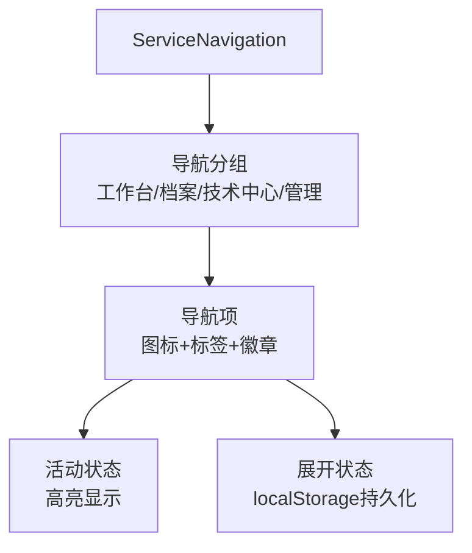

**图表来源**
- [ServiceNavigation.tsx:67-115](file://client/src/components/Service/ServiceNavigation.tsx#L67-L115)
- [ServiceNavigation.tsx:117-142](file://client/src/components/Service/ServiceNavigation.tsx#L117-L142)

**章节来源**
- [ServiceNavigation.tsx:1-347](file://client/src/components/Service/ServiceNavigation.tsx#L1-L347)
- [index.ts:1-3](file://client/src/components/Service/index.ts#L1-L3)

### 服务概览页面
ServiceOverviewPage.tsx 提供服务管理仪表盘，包含：
- 全局统计卡片：待处理工单、今日完成、平均响应时间、P0紧急工单
- 风险工单列表：SLA超时风险的工单提醒
- 团队负载分析：成员工单数量与超负荷状态
- SLA健康度指标：超时率可视化展示

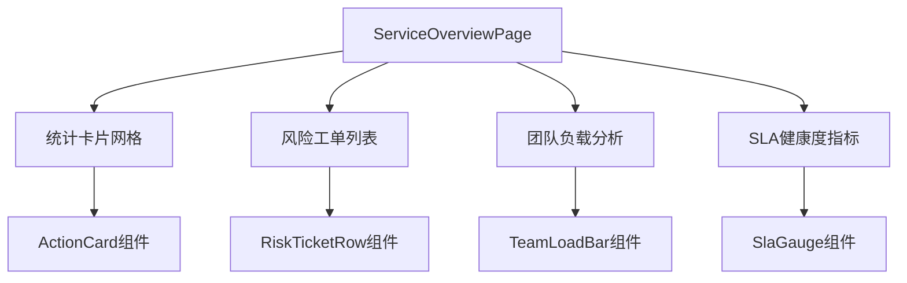

**图表来源**
- [ServiceOverviewPage.tsx:174-215](file://client/src/components/Service/ServiceOverviewPage.tsx#L174-L215)
- [ServiceOverviewPage.tsx:302-348](file://client/src/components/Service/ServiceOverviewPage.tsx#L302-L348)

**章节来源**
- [ServiceOverviewPage.tsx:1-477](file://client/src/components/Service/ServiceOverviewPage.tsx#L1-L477)

### 工作台页面
WorkspacePage.tsx 实现个人执行台，支持：
- 多视图模式：收件箱、指派给我、SLA告警、全部工单
- 工单搜索与过滤：支持关键字搜索和多条件筛选
- 工单列表：优先级、SLA状态、客户信息、产品信息
- 交互功能：收藏、静音、导航到详情页

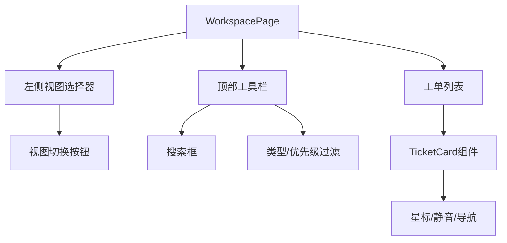

**图表来源**
- [WorkspacePage.tsx:186-311](file://client/src/components/Service/WorkspacePage.tsx#L186-L311)
- [WorkspacePage.tsx:296-310](file://client/src/components/Service/WorkspacePage.tsx#L296-L310)

**章节来源**
- [WorkspacePage.tsx:1-753](file://client/src/components/Service/WorkspacePage.tsx#L1-L753)

### 客户上下文侧边栏
CustomerContextSidebar.tsx 提供工单关联信息展示和客户管理功能：

**核心功能**：
- 经销商信息卡片：名称、代码、联系人信息
- 客户信息卡片：基本信息、联系人、地区、所属经销商
- 设备详情卡片：型号、序列号、固件版本、保修状态
- 注册附件：可折叠显示的配件清单
- **新增**：客户清理功能（ContactCleaningModal）
- **新增**：联系人转换功能（ConvertIndividualModal）
- **新增**：企业链接功能（LinkCorporateModal）

**状态管理**：
- 支持四种客户状态：未知身份、临时对接、标准企业、个人客户
- 智能展开/收起控制
- 实时数据同步与缓存

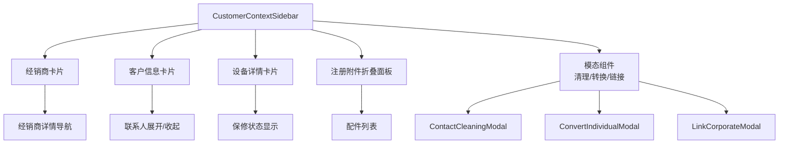

**图表来源**
- [CustomerContextSidebar.tsx:196-247](file://client/src/components/Service/CustomerContextSidebar.tsx#L196-L247)
- [CustomerContextSidebar.tsx:250-409](file://client/src/components/Service/CustomerContextSidebar.tsx#L250-L409)
- [CustomerContextSidebar.tsx:769-800](file://client/src/components/Service/CustomerContextSidebar.tsx#L769-L800)

**章节来源**
- [CustomerContextSidebar.tsx:1-824](file://client/src/components/Service/CustomerContextSidebar.tsx#L1-L824)

### 附件上传区域
AttachmentZone.tsx 实现拖拽上传功能：
- 拖拽区域：支持图片、视频、PDF、文本文件
- 文件预览：图片缩略图、视频图标、文档图标
- 删除功能：悬停显示删除按钮
- 类型识别：根据文件类型显示相应图标

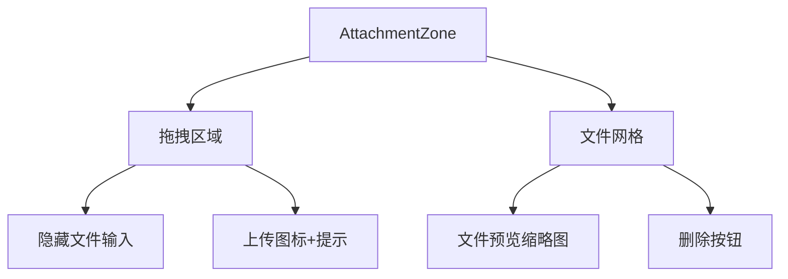

**图表来源**
- [AttachmentZone.tsx:34-104](file://client/src/components/Service/AttachmentZone.tsx#L34-L104)

**章节来源**
- [AttachmentZone.tsx:1-108](file://client/src/components/Service/AttachmentZone.tsx#L1-L108)

## 通知中心组件

### 通知中心面板
NotificationCenter.tsx 实现macOS 26风格的通知中心：
- 悬浮面板：右上角弹出式通知中心
- 通知列表：支持未读/已读状态、相对时间显示
- 操作功能：标记已读、全部已读、点击跳转
- 点击外部关闭：支持点击面板外区域关闭

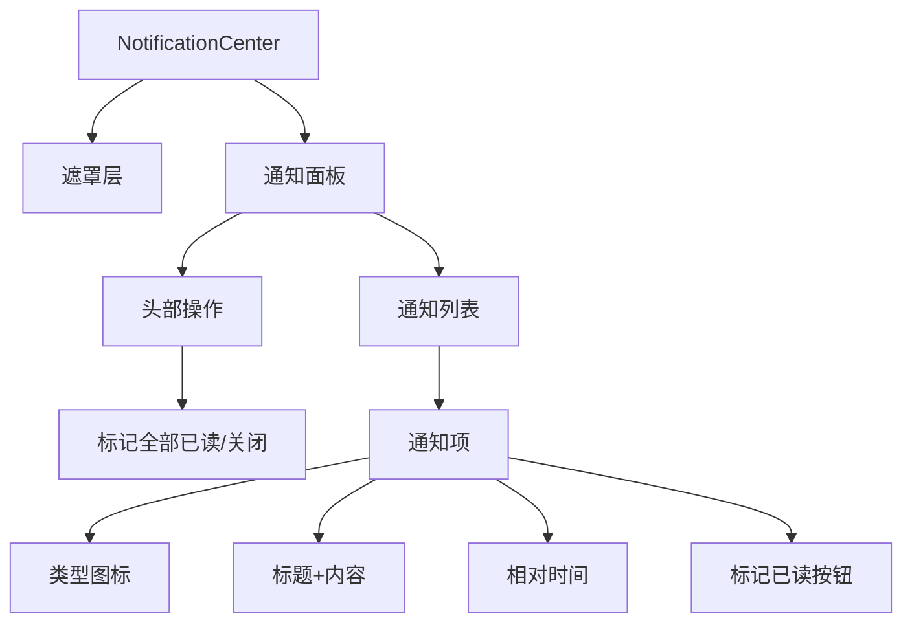

**图表来源**
- [NotificationCenter.tsx:238-286](file://client/src/components/Notifications/NotificationCenter.tsx#L238-L286)
- [NotificationCenter.tsx:276-283](file://client/src/components/Notifications/NotificationCenter.tsx#L276-L283)

**章节来源**
- [NotificationCenter.tsx:1-438](file://client/src/components/Notifications/NotificationCenter.tsx#L1-L438)
- [index.ts:1-7](file://client/src/components/Notifications/index.ts#L1-L7)

## SLA组件库

### SLA可视化组件
SlaComponents.tsx 提供完整的SLA可视化组件库：
- PriorityBadge：优先级标签组件，支持P0/P1/P2三种级别
- SlaStatusBadge：SLA状态标签，显示正常/警告/超时状态
- SlaTimer：实时倒计时组件，显示剩余时间与进度条
- TicketStatusChip：工单状态标签，基于节点状态映射

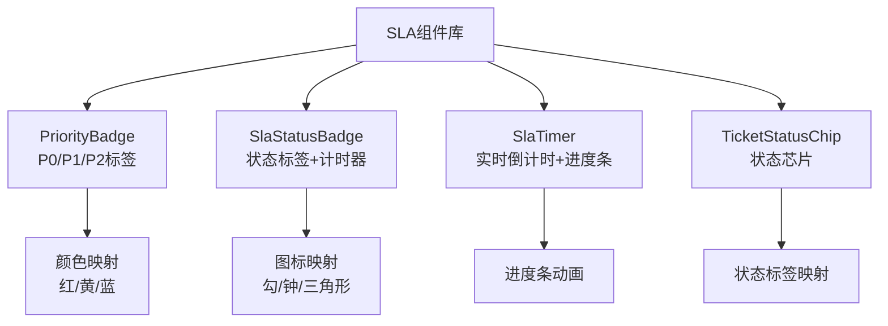

**图表来源**
- [SlaComponents.tsx:47-70](file://client/src/components/Tickets/SlaComponents.tsx#L47-L70)
- [SlaComponents.tsx:81-144](file://client/src/components/Tickets/SlaComponents.tsx#L81-L144)
- [SlaComponents.tsx:157-261](file://client/src/components/Tickets/SlaComponents.tsx#L157-L261)

**章节来源**
- [SlaComponents.tsx:1-335](file://client/src/components/Tickets/SlaComponents.tsx#L1-L335)

## 工作区组件群

### 工作区可复用组件
WorkspaceComponents.tsx 提供工作区组件群，支持：
- WorkspaceSidebar：视图选择侧边栏，支持收件箱、指派给我、SLA告警、全部工单
- WorkspaceToolbar：工具栏，包含搜索框和过滤器
- TicketList：工单列表容器，支持加载状态和空状态
- TicketListItem：单个工单列表项，显示优先级、状态、客户信息
- WorkspaceLayout：工作区布局组件，支持侧边栏和详情面板

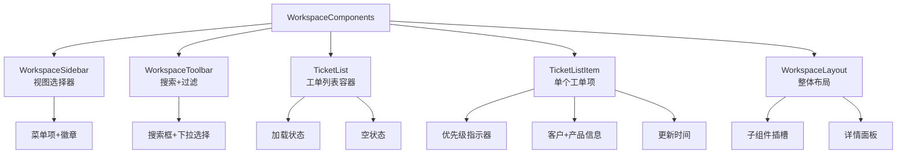

**图表来源**
- [WorkspaceComponents.tsx:59-118](file://client/src/components/Workspace/WorkspaceComponents.tsx#L59-L118)
- [WorkspaceComponents.tsx:130-223](file://client/src/components/Workspace/WorkspaceComponents.tsx#L130-L223)
- [WorkspaceComponents.tsx:236-346](file://client/src/components/Workspace/WorkspaceComponents.tsx#L236-L346)

**章节来源**
- [WorkspaceComponents.tsx:1-468](file://client/src/components/Workspace/WorkspaceComponents.tsx#L1-L468)
- [index.ts:1-10](file://client/src/components/Workspace/index.ts#L1-L10)

### 仪表盘组件
OverviewDashboard.tsx 提供服务概览仪表盘组件：
- StatCard：统计卡片组件，支持趋势箭头显示
- SlaHealthIndicator：SLA健康度指标，包含健康度环形图
- TypeDistribution：工单类型分布图表
- RecentActivityList：最近活动列表

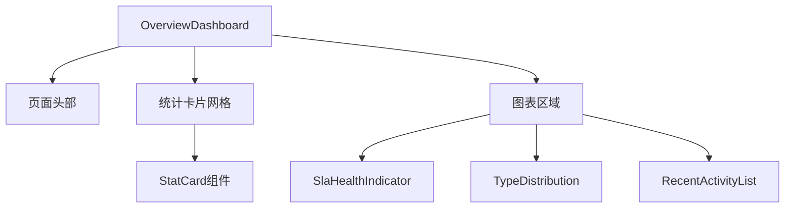

**图表来源**
- [OverviewDashboard.tsx:409-491](file://client/src/components/Workspace/OverviewDashboard.tsx#L409-L491)
- [OverviewDashboard.tsx:449-473](file://client/src/components/Workspace/OverviewDashboard.tsx#L449-L473)

**章节来源**
- [OverviewDashboard.tsx:1-501](file://client/src/components/Workspace/OverviewDashboard.tsx#L1-L501)

## Workspace组件集合

### 统一工单详情视图
UnifiedTicketDetail.tsx 实现了统一的工单详情视图，采用macOS26风格的双栏布局设计：

**组件架构**：
- 左栏（70%）：基本信息 → 节点进度条（RMA/SVC）→ 活动时间轴 → 评论输入
- 右栏（30%）：参与者侧边栏 → 客户上下文侧边栏

**核心功能**：
- 工单详情获取与缓存
- 动态状态显示（状态标签、优先级标签、SLA状态）
- 节点进度条可视化（RMA/SVC工单专用）
- 活动时间轴展示
- 评论输入与@提及功能
- 参与者管理与协作
- **新增**：调试模式集成，支持权限代码显示
- **新增**：ActionBufferModal流程缓冲确认
- **新增**：AssigneeSelector智能指派选择器
- **新增**：SubmitDiagnosticModal诊断报告提交

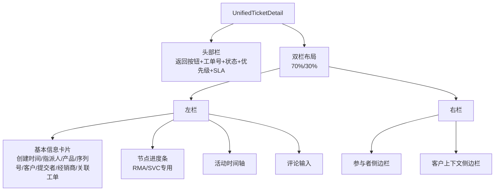

**图表来源**
- [UnifiedTicketDetail.tsx:1-389](file://client/src/components/Workspace/UnifiedTicketDetail.tsx#L1-L389)

**章节来源**
- [UnifiedTicketDetail.tsx:1-389](file://client/src/components/Workspace/UnifiedTicketDetail.tsx#L1-L389)

### 提及评论输入组件
MentionCommentInput.tsx 提供智能的评论输入功能，支持用户@提及和增强的交互体验：

**核心特性**：
- 实时@提及建议（@符号触发）
- 键盘导航支持（上下键选择、回车确认）
- 用户搜索过滤（支持用户名搜索）
- 提及列表限制（最多8个用户）
- 提及验证与清理
- **新增**：可见性选择（所有人/内部/仅OP）
- **新增**：Command+Enter快捷键提交
- **新增**：附件上传支持（图片、PDF、文档）
- **新增**：交互频率统计与智能分组
- **新增**：本地存储的互动历史记录

**交互流程**：
1. 用户输入@符号触发提及模式
2. 显示用户建议列表（按用户名匹配）
3. 键盘导航选择目标用户
4. 自动插入@用户名到文本中
5. 提及列表去重与验证
6. 支持不同可见性级别的评论
7. 记录用户互动频率用于智能排序

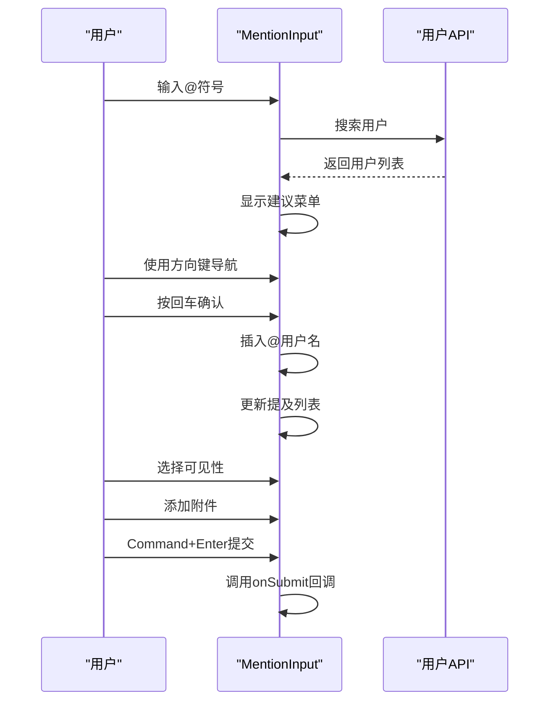

**图表来源**
- [MentionCommentInput.tsx:29-102](file://client/src/components/Workspace/MentionCommentInput.tsx#L29-L102)

**章节来源**
- [MentionCommentInput.tsx:1-446](file://client/src/components/Workspace/MentionCommentInput.tsx#L1-L446)
- [TicketDetailComponents.tsx:179-179](file://client/src/components/Workspace/TicketDetailComponents.tsx#L179-L179)

### 节点进度条组件
NodeProgressBar.tsx 实现RMA/SVC工单的阶段流转可视化：

**支持的工单类型**：
- RMA（退货）：8个阶段节点
- SVC（经销商维修）：5个阶段节点
- Inquiry（咨询）：4个阶段节点

**节点状态**：
- 已完成：绿色勾选图标，带发光效果
- 当前节点：蓝色圆形，带脉冲动画
- 未来节点：灰色圆形，无状态

**国际化支持**：
- 中文节点标签
- 英文节点标签
- 部门标识（OP/MS/DL/GD等）

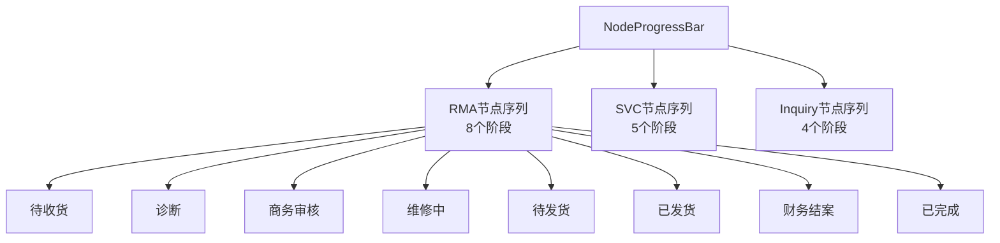

**图表来源**
- [NodeProgressBar.tsx:10-29](file://client/src/components/Workspace/NodeProgressBar.tsx#L10-L29)

**章节来源**
- [NodeProgressBar.tsx:1-205](file://client/src/components/Workspace/NodeProgressBar.tsx#L1-L205)

### 参与者侧边栏组件
ParticipantsSidebar.tsx 提供工单协作成员管理，具备智能分组和交互统计功能：

**核心功能**：
- 参与者列表展示（头像+姓名+角色）
- 静默邀请成员加入
- 退出协作功能
- 角色标识（创建者/处理人/协作中）

**智能分组**：
- **新增**：交互频率统计（基于本地存储）
- **新增**：常用联系人分组（↑n 次互动）
- **新增**：部门分组（按部门名称分组）
- **新增**：智能排序（互动频率+部门相关性）

**角色定义**：
- Owner：创建者（金色标签）
- Assignee：处理人（绿色标签）
- Mentioned：被@提及（蓝色标签）
- Follower：关注者（紫色标签）

**交互设计**：
- 悬停效果：背景色变化
- 退出按钮：仅当前用户可见
- 邀请表单：选择用户后静默添加

```mermaid
graph TB
PS["ParticipantsSidebar"]
PS --> Header["头部栏<br/>协作成员+邀请按钮"]
PS --> Invite["邀请表单<br/>用户选择+添加按钮"]
PS --> Groups["智能分组<br/>常用/部门/其他"]
PS --> List["参与者列表"]
List --> Owner["创建者<br/>金色标签"]
List --> Assignee["处理人<br/>绿色标签"]
List --> Mentioned["协作成员<br/>蓝色标签"]
List --> Follower["关注者<br/>紫色标签"]
List --> Leave["退出按钮<br/>仅当前用户"]
Groups --> Frequent["⭐ 常用用户<br/>↑n次互动"]
Groups --> Dept["部门分组<br/>按部门名称"]
```

**图表来源**
- [ParticipantsSidebar.tsx:55-67](file://client/src/components/Workspace/ParticipantsSidebar.tsx#L55-L67)

**章节来源**
- [ParticipantsSidebar.tsx:1-401](file://client/src/components/Workspace/ParticipantsSidebar.tsx#L1-L401)

### 工单详情增强组件
TicketDetailComponents.tsx 提供工单详情页的增强组件集合：

**ActivityTimeline**：活动时间轴组件
- 支持多种活动类型（评论、状态变更、指派、@提及、附件）
- 不同类型的图标与颜色标识
- 可见性标签（所有人/内部/仅OP）
- 相对时间显示

**CommentInput**：评论输入组件
- 基于MentionCommentInput的简化版本
- 支持可见性选择（所有人/内部/仅OP）
- 发送按钮状态控制

**ParticipantsPanel**：参与者面板
- 展示所有参与者（创建者、处理人、被@人员）
- 角色标签与头像
- 去重处理（避免重复显示）

**TicketInfoCard**：工单信息卡片
- 工单号与优先级显示
- SLA状态图标（警告/违约）
- 保修状态标识
- 产品信息展示

```mermaid
graph TB
TDC["TicketDetailComponents"]
TDC --> Timeline["ActivityTimeline<br/>活动时间轴"]
TDC --> Comment["CommentInput<br/>评论输入"]
TDC --> Panel["ParticipantsPanel<br/>参与者面板"]
TDC --> Card["TicketInfoCard<br/>工单信息卡片"]
Timeline --> Types["活动类型图标<br/>评论/状态/指派/@提及/附件"]
Timeline --> Visibility["可见性标签<br/>所有人/内部/仅OP"]
Comment --> Mention["@提及功能"]
Panel --> Roles["角色标签<br/>创建者/处理人/被@"]
Card --> Status["状态标识<br/>SLA/保修"]
```

**图表来源**
- [TicketDetailComponents.tsx:49-173](file://client/src/components/Workspace/TicketDetailComponents.tsx#L49-L173)
- [TicketDetailComponents.tsx:179-179](file://client/src/components/Workspace/TicketDetailComponents.tsx#L179-L179)

**章节来源**
- [TicketDetailComponents.tsx:1-418](file://client/src/components/Workspace/TicketDetailComponents.tsx#L1-L418)

### 视图切换组件
ViewAsComponents.tsx 提供管理员以其他用户身份查看的功能：

**核心组件**：
- ViewAsIndicator：当前视图指示器（固定底部）
- ViewAsSelector：模态框用户选择器
- useViewAs：自定义Hook

**安全机制**：
- 仅管理员可使用
- 通过sessionStorage存储目标用户ID
- API请求头携带X-View-As-User标识

**用户选择器功能**：
- 搜索过滤（按用户名/角色）
- 分组显示（Admin/Employee/Market/Dealer）
- 角色标识与部门信息
- 静默切换（无通知）

```mermaid
graph TB
VAC["ViewAsComponents"]
VAC --> Indicator["ViewAsIndicator<br/>固定底部指示器"]
VAC --> Selector["ViewAsSelector<br/>模态框用户选择器"]
VAC --> Hook["useViewAs<br/>自定义Hook"]
Indicator --> Exit["退出按钮"]
Selector --> Search["搜索框"]
Selector --> Group["用户分组<br/>Admin/Employee/Market/Dealer"]
Hook --> Storage["sessionStorage<br/>viewAsUserId"]
Hook --> Header["API请求头<br/>X-View-As-User"]
```

**图表来源**
- [ViewAsComponents.tsx:31-76](file://client/src/components/Workspace/ViewAsComponents.tsx#L31-L76)
- [ViewAsComponents.tsx:89-259](file://client/src/components/Workspace/ViewAsComponents.tsx#L89-L259)
- [ViewAsComponents.tsx:265-299](file://client/src/components/Workspace/ViewAsComponents.tsx#L265-L299)

**章节来源**
- [ViewAsComponents.tsx:1-306](file://client/src/components/Workspace/ViewAsComponents.tsx#L1-L306)

## 新增组件详解

### ActionBufferModal组件
ActionBufferModal.tsx 实现了RMA/SVC流程节点的缓冲确认操作，提供安全的流程推进机制：

**核心功能**：
- 支持多个流程节点的确认操作：op_repairing、op_shipping、ms_review、ms_closing、ge_review、op_receiving、submitted
- 针对不同节点提供特定的表单字段和验证规则
- 自动创建活动日志并记录流程推进信息
- 支持附件上传和序列号修正
- 完整的表单验证和错误处理

**节点特定表单**：
- **op_repairing**：维修工作详述和老化测试结论
- **op_shipping**：物流快递公司和快递单号
- **ms_review**：报价单/PI关联信息（非保修单）
- **ms_closing**：补充声明/备注和支付状态确认
- **ge_review**：实收金额、收款日期和收款渠道
- **op_receiving/submitted**：序列号修正、收货备注和开箱照片

**安全机制**：
- 所有关键操作都需要用户确认
- 自动记录操作日志和元数据
- 支持序列号差异检测和修正
- 附件上传支持多文件和预览

```mermaid
sequenceDiagram
participant U as "用户"
participant ABM as "ActionBufferModal"
participant API as "后端API"
U->>ABM : 选择流程操作
ABM->>ABM : 验证表单数据
ABM->>API : 创建活动日志
API-->>ABM : 返回活动ID
ABM->>API : 上传附件如有
API-->>ABM : 附件上传完成
ABM->>API : 推进工单节点
API-->>ABM : 节点推进成功
ABM-->>U : 操作完成
```

**图表来源**
- [ActionBufferModal.tsx:27-244](file://client/src/components/Workspace/ActionBufferModal.tsx#L27-L244)
- [ActionBufferModal.tsx:268-345](file://client/src/components/Workspace/ActionBufferModal.tsx#L268-L345)

**章节来源**
- [ActionBufferModal.tsx:1-423](file://client/src/components/Workspace/ActionBufferModal.tsx#L1-L423)

### AssigneeSelector组件
AssigneeSelector.tsx 提供智能的工单指派选择器，支持部门过滤和双重确认机制：

**核心功能**：
- 智能用户搜索和分组显示
- 基于当前节点的部门过滤
- 双重确认机制防止误操作
- 部门代码解析和映射
- 实时搜索和用户状态显示

**智能过滤机制**：
- 根据当前节点自动确定目标部门
- OP节点：仅显示OP部门用户
- MS节点：仅显示MS部门用户  
- GE节点：仅显示GE部门用户
- 特殊节点：draft/open/waiting/resolved/closed显示MS用户
- submitted/shipped节点：显示OP用户

**双重确认流程**：
1. 用户点击指派按钮
2. 弹出确认模态框，要求输入变更理由
3. 5秒倒计时确认
4. 确认后执行指派操作
5. 自动刷新工单详情

**用户界面设计**：
- 未指派状态：红色高亮显示，带警告图标
- 悬停效果：增强的阴影和背景色
- 部门分组：按部门名称分组显示
- 搜索功能：实时过滤用户列表

```mermaid
sequenceDiagram
participant U as "用户"
participant AS as "AssigneeSelector"
participant API as "后端API"
U->>AS : 点击指派按钮
AS->>AS : 检查用户权限
AS->>AS : 过滤目标部门用户
AS->>U : 显示用户选择器
U->>AS : 选择目标用户
AS->>U : 显示确认模态框
U->>AS : 输入变更理由
U->>AS : 确认指派
AS->>API : 更新工单指派
API-->>AS : 指派成功
AS->>U : 刷新工单详情
```

**图表来源**
- [AssigneeSelector.tsx:121-146](file://client/src/components/Workspace/AssigneeSelector.tsx#L121-L146)
- [AssigneeSelector.tsx:148-186](file://client/src/components/Workspace/AssigneeSelector.tsx#L148-L186)

**章节来源**
- [AssigneeSelector.tsx:1-356](file://client/src/components/Workspace/AssigneeSelector.tsx#L1-L356)

### SubmitDiagnosticModal组件
SubmitDiagnosticModal.tsx 实现了技术诊断报告的提交功能，支持完整的诊断流程：

**核心功能**：
- 故障诊断结论输入
- 维修方案和建议制定
- 保修状态初步判定
- 诊断照片和视频附件上传
- 自动流程推进到MS Review节点

**诊断流程**：
1. 技术人员提交诊断报告
2. 系统自动创建诊断活动
3. 更新工单状态到MS Review
4. 设置保修状态
5. 通知相关人员

**表单设计**：
- 故障判定：详细描述硬件问题和损坏状态
- 维修建议：建议更换部件和处理方案
- 保修判定：免费保修或付费维修选项
- 附件上传：支持多文件上传和预览

**安全机制**：
- 必填字段验证
- 大文件上传进度显示
- 操作确认和错误处理
- 自动流程推进

```mermaid
sequenceDiagram
participant T as "技术人员"
participant SDM as "SubmitDiagnosticModal"
participant API as "后端API"
T->>SDM : 输入诊断信息
SDM->>SDM : 验证必填字段
SDM->>API : 创建诊断活动
API-->>SDM : 活动创建成功
SDM->>API : 上传诊断附件
API-->>SDM : 附件上传完成
SDM->>API : 推进工单到MS Review
API-->>SDM : 工单状态更新
SDM-->>T : 操作完成
```

**图表来源**
- [SubmitDiagnosticModal.tsx:37-84](file://client/src/components/Workspace/SubmitDiagnosticModal.tsx#L37-L84)

**章节来源**
- [SubmitDiagnosticModal.tsx:1-281](file://client/src/components/Workspace/SubmitDiagnosticModal.tsx#L1-L281)

### UnifiedTicketDetail组件集成
UnifiedTicketDetail.tsx 深度集成了三大新增组件，完善了工单流程操作体系：

**ActionBufferModal集成**：
- 自动检测需要缓冲确认的节点
- mandatoryNodes数组定义需要确认的节点
- 对ms_closing节点进行特殊处理（保修单直接推进）
- 提供统一的确认界面和表单验证

**AssigneeSelector集成**：
- 在头部状态栏集成智能指派选择器
- 支持部门过滤和权限控制
- 实时指派状态显示
- 未指派状态的高亮显示

**SubmitDiagnosticModal集成**：
- 在诊断节点提供诊断报告提交入口
- 支持RMA/SVC工单的诊断流程
- 自动流程推进和状态更新
- 诊断附件管理和预览

**权限控制**：
- 基于actingUser的阶梯式权限守卫
- 部门主管和全局管理员的不同权限
- 节点所有权映射和访问控制
- 编辑权限的严格验证

**章节来源**
- [UnifiedTicketDetail.tsx:563-593](file://client/src/components/Workspace/UnifiedTicketDetail.tsx#L563-L593)
- [UnifiedTicketDetail.tsx:709-728](file://client/src/components/Workspace/UnifiedTicketDetail.tsx#L709-L728)
- [UnifiedTicketDetail.tsx:1529-1549](file://client/src/components/Workspace/UnifiedTicketDetail.tsx#L1529-L1549)

## 客户管理模态组件

### 客户清理模态组件
ContactCleaningModal.tsx 提供临时访客联系人的入库和清洗功能：

**核心功能**：
- 从工单报告快照中提取联系人信息
- 自动填充姓名、电话、邮箱、职位
- 支持联系人信息的编辑和验证
- 一键入库并关联到指定企业

**使用场景**：
- 临时访客（状态 2）需要正式入库
- 需要清洗和标准化联系人信息
- 快速建立联系人档案

**交互流程**：
1. 用户点击"入库联系人并清洗"
2. 弹出模态框显示预填信息
3. 用户确认或修改联系人信息
4. 提交表单完成入库和关联

```mermaid
sequenceDiagram
participant U as "用户"
participant CCS as "CustomerContextSidebar"
participant CCM as "ContactCleaningModal"
U->>CCS : 点击"入库联系人并清洗"
CCS->>CCM : 打开模态框
CCM->>CCM : 预填报告快照信息
U->>CCM : 修改联系人信息
U->>CCM : 点击"确认入库并关联"
CCM->>CCS : 调用onSuccess回调
CCS->>CCS : 刷新客户上下文
```

**图表来源**
- [ContactCleaningModal.tsx:37-59](file://client/src/components/Service/ContactCleaningModal.tsx#L37-L59)

**章节来源**
- [ContactCleaningModal.tsx:1-162](file://client/src/components/Service/ContactCleaningModal.tsx#L1-L162)

### 联系人转换模态组件
ConvertIndividualModal.tsx 提供访客转换为个人或企业客户的功能：

**核心功能**：
- 支持个人散客和机构企业两种客户类型
- 客户身份选择（潜在客户/正式客户）
- 自动填充姓名、电话、邮箱
- 灵活的客户信息编辑

**转换策略**：
- 个人散客：适合个人消费者或小型企业
- 机构企业：适合正式注册的企业客户
- 潜在客户：用于营销线索管理
- 正式客户：用于正式业务往来

**使用场景**：
- 访客信息完善后需要正式建档
- 从潜在客户转化为正式客户
- 个人用户升级为企业用户

```mermaid
graph TB
CIM["ConvertIndividualModal"]
CIM --> Type["客户类型选择<br/>个人/企业"]
CIM --> Stage["客户身份选择<br/>潜在/正式"]
CIM --> Info["基本信息表单<br/>姓名/电话/邮箱"]
Type --> Individual["个人散客"]
Type --> Organization["机构企业"]
Stage --> Prospect["潜在客户"]
Stage --> Active["正式客户"]
Info --> Form["表单验证与提交"]
```

**图表来源**
- [ConvertIndividualModal.tsx:34-53](file://client/src/components/Service/ConvertIndividualModal.tsx#L34-L53)

**章节来源**
- [ConvertIndividualModal.tsx:1-204](file://client/src/components/Service/ConvertIndividualModal.tsx#L1-L204)

### 企业链接模态组件
LinkCorporateModal.tsx 提供工单与现有客户档案关联的功能：

**核心功能**：
- 集成AccountContactSelector组件
- 支持账户和联系人的级联选择
- 允许空联系人作为临时对接人
- 实时预览报告人姓名

**选择策略**：
- 已有联系人：直接关联到具体联系人
- 无联系人：作为临时对接人关联到企业
- 自定义报告人：可编辑报告人姓名

**使用场景**：
- 工单来源客户已存在档案
- 需要快速关联到现有客户
- 临时对接人场景

```mermaid
graph TB
LCM["LinkCorporateModal"]
LCM --> Selector["AccountContactSelector<br/>账户-联系人选择器"]
LCM --> Preview["报告人预览<br/>当前访客快照"]
LCM --> Submit["关联提交<br/>更新工单信息"]
Selector --> Accounts["账户搜索与选择"]
Selector --> Contacts["联系人级联加载"]
Accounts --> Results["搜索结果列表"]
Contacts --> Options["联系人选项"]
Preview --> Snapshot["访客信息快照"]
Submit --> Success["关联成功回调"]
```

**图表来源**
- [LinkCorporateModal.tsx:33-63](file://client/src/components/Service/LinkCorporateModal.tsx#L33-L63)

**章节来源**
- [LinkCorporateModal.tsx:1-170](file://client/src/components/Service/LinkCorporateModal.tsx#L1-L170)

### 账户联系人选择器
AccountContactSelector.tsx 提供完整的账户-联系人选择功能：

**核心功能**：
- 账户搜索和选择（支持关键词搜索）
- 联系人级联加载和选择
- 账户类型图标和颜色标识
- 工单统计信息显示

**高级特性**：
- 搜索防抖机制（300ms延迟）
- 账户类型智能分类（经销商/机构/个人）
- 联系人状态显示（主要联系人/无效/主要）
- 服务等级标识（VIP/VVIP/普通）
- 工单统计聚合（咨询/RMA/维修）

**使用场景**：
- 客户管理界面
- 工单创建/编辑
- 报告人选择
- 客户关联操作

```mermaid
graph TB
ACS["AccountContactSelector"]
ACS --> Search["搜索输入<br/>关键词搜索"]
ACS --> Dropdown["下拉列表<br/>账户结果"]
ACS --> Details["详情卡片<br/>账户信息"]
ACS --> Contacts["联系人选择<br/>级联加载"]
ACS --> Stats["工单统计<br/>咨询/RMA/维修"]
ACS --> Type["类型标识<br/>经销商/机构/个人"]
ACS --> Level["服务等级<br/>VIP/VVIP/普通"]
Search --> Debounce["防抖机制<br/>300ms延迟"]
Dropdown --> Results["搜索结果<br/>账户列表"]
Details --> Primary["主要联系人<br/>联系方式"]
Contacts --> Radio["单选按钮<br/>联系人选择"]
```

**图表来源**
- [AccountContactSelector.tsx:114-133](file://client/src/components/AccountContactSelector.tsx#L114-L133)
- [AccountContactSelector.tsx:213-228](file://client/src/components/AccountContactSelector.tsx#L213-L228)
- [AccountContactSelector.tsx:320-327](file://client/src/components/AccountContactSelector.tsx#L320-L327)

**章节来源**
- [AccountContactSelector.tsx:1-493](file://client/src/components/AccountContactSelector.tsx#L1-L493)

## 调试覆盖层组件

### DebugOverlay调试系统

Longhorn 前端新增了完整的DebugOverlay调试覆盖层系统，为开发和测试提供强大的调试工具：

#### DebugProvider上下文
DebugProvider作为全局调试状态提供者，管理调试模式的启用/禁用状态：
- 使用localStorage持久化调试模式状态
- 提供toggleDebugMode和setDebugMode方法
- 通过useDebugMode Hook在组件中访问调试状态

#### DebugModeToggle开关组件
在AdminSettings中集成的调试模式开关：
- 支持UI调试模式的开启/关闭
- 显示当前调试模式状态
- 集成玻璃效果设计风格
- 与localStorage状态同步

#### DebugBadge权限标签组件
为界面元素添加权限代码标签：
- 支持四种标签类型：permission（权限）、mask（脱敏）、role（角色）、field（字段）
- 自动检测并显示对应的权限代码
- 使用不同颜色标识不同类型（绿/琥珀/蓝/紫）
- 仅在调试模式下显示

#### DebugInfoPanel浮动面板
全局浮动的调试信息面板：
- 固定在右上角显示调试状态
- 显示当前激活的调试标签类型说明
- 支持半透明玻璃效果
- 仅在调试模式下显示

#### 调试模式集成
- 在main.tsx中通过DebugProvider包装整个应用
- 在App.tsx中渲染DebugInfoPanel全局面板
- 在AdminSettings中提供调试模式开关
- 在UnifiedTicketDetail中集成权限标签显示

```mermaid
graph TB
DP["DebugProvider"]
DP --> DM["DebugMode"]
DP --> TM["toggleDebugMode"]
DP --> SM["setDebugMode"]
DMT["DebugModeToggle"]
DB["DebugBadge"]
DIP["DebugInfoPanel"]
UTD["UnifiedTicketDetail"]
DP --> DMT
DP --> DB
DP --> DIP
UTD --> DB
DIP --> DM
DMT --> DM
```

**图表来源**
- [DebugOverlay.tsx:46-77](file://client/src/components/DebugOverlay.tsx#L46-L77)
- [DebugOverlay.tsx:149-201](file://client/src/components/DebugOverlay.tsx#L149-L201)
- [DebugOverlay.tsx:83-143](file://client/src/components/DebugOverlay.tsx#L83-L143)
- [DebugOverlay.tsx:207-246](file://client/src/components/DebugOverlay.tsx#L207-L246)
- [main.tsx:20-22](file://client/src/main.tsx#L20-L22)
- [App.tsx:158-159](file://client/src/App.tsx#L158-L159)
- [AdminSettings.tsx:1333-1333](file://client/src/components/Admin/AdminSettings.tsx#L1333-L1333)

**章节来源**
- [DebugOverlay.tsx:1-255](file://client/src/components/DebugOverlay.tsx#L1-L255)
- [main.tsx:1-25](file://client/src/main.tsx#L1-L25)
- [App.tsx:158-159](file://client/src/App.tsx#L158-L159)
- [AdminSettings.tsx:1324-1335](file://client/src/components/Admin/AdminSettings.tsx#L1324-L1335)

### 调试模式功能特性

**权限代码显示**：
- 在界面元素上自动显示权限标签
- 支持实时权限验证和RBAC逻辑测试
- 便于开发和测试时验证权限控制

**开发辅助功能**：
- 提供UI调试模式开关
- 支持不同类型的权限标签（权限/脱敏/角色/字段）
- 集成Glass UI设计风格

**状态管理**：
- 使用localStorage持久化调试状态
- 支持全局调试状态同步
- 与应用其他组件无缝集成

**章节来源**
- [DebugOverlay.tsx:1-255](file://client/src/components/DebugOverlay.tsx#L1-L255)
- [AdminSettings.tsx:1324-1335](file://client/src/components/Admin/AdminSettings.tsx#L1324-L1335)

## 主题系统

### CSS变量主题系统架构

Longhorn 前端实现了完整的CSS变量主题系统，支持深色/浅色/系统三种主题模式，采用macOS 26风格的玻璃效果设计：

#### 主题变量定义
系统定义了全面的CSS变量体系，涵盖基础颜色、强调色、玻璃效果、阴影、过渡和布局等各个方面：

**基础颜色变量**：
- `--bg-main`：主背景色（深色：#000000，浅色：#E5E7EB）
- `--bg-sidebar`：侧边栏背景色（深色：#1C1C1E，浅色：#E5E7EB）
- `--bg-content`：内容区域背景色（深色：#000000，浅色：#FFFFFF）

**强调色变量**：
- `--accent-blue`：强调蓝色（Kine黄）（深色：#FFD200，浅色：#E6BD00）
- `--accent-rgb`：强调色RGB值（255, 210, 0）
- `--accent-hover`：强调色悬停状态（深色：#E6BD00，浅色：#CCA800）
- `--accent-subtle`：强调色柔和版本（rgba(var(--accent-rgb), 0.15)）

**玻璃效果变量**：
- `--glass-bg`：玻璃背景色（深色：rgba(28, 28, 30, 0.75)，浅色：rgba(255, 255, 255, 0.75)）
- `--glass-bg-light`：玻璃背景轻量版（深色：rgba(255, 255, 255, 0.08)，浅色：rgba(0, 0, 0, 0.04)）
- `--glass-bg-hover`：玻璃背景悬停状态（深色：rgba(255, 255, 255, 0.12)，浅色：rgba(0, 0, 0, 0.08)）
- `--glass-blur`：玻璃模糊效果（blur(24px)）
- `--glass-border`：玻璃边框（深色：rgba(255, 255, 255, 0.12)，浅色：rgba(0, 0, 0, 0.1)）
- `--glass-border-accent`：强调色玻璃边框（深色：rgba(255, 210, 0, 0.3)，浅色：rgba(230, 189, 0, 0.3)）
- `--glass-shadow`：玻璃阴影（深色：0 8px 32px rgba(0, 0, 0, 0.3)，浅色：0 4px 12px rgba(0, 0, 0, 0.05)）
- `--glass-shadow-lg`：大号玻璃阴影（深色：0 16px 48px rgba(0, 0, 0, 0.4)，浅色：0 16px 32px rgba(0, 0, 0, 0.1)）
- `--glass-shadow-accent`：强调色玻璃阴影（深色：0 8px 32px rgba(255, 210, 0, 0.15)，浅色：0 8px 16px rgba(230, 189, 0, 0.15)）

**布局和过渡变量**：
- `--radius-sm`：小圆角（8px）
- `--radius-md`：中圆角（12px）
- `--radius-lg`：大圆角（16px）
- `--radius-xl`：超大圆角（20px）
- `--radius-2xl`：2倍超大圆角（24px）
- `--transition-fast`：快速过渡（all 0.15s cubic-bezier(0.4, 0, 0.2, 1)）
- `--transition-smooth`：平滑过渡（all 0.3s cubic-bezier(0.4, 0, 0.2, 1)）
- `--transition-spring`：弹性过渡（all 0.4s cubic-bezier(0.34, 1.56, 0.64, 1)）
- `--sidebar-width`：侧边栏宽度（220px）
- `--topnav-height`：顶部导航高度（52px）

#### 深色/浅色主题支持

系统通过`:root`和`[data-theme="*"]`选择器实现主题切换：

```css
/* 深色主题默认值 */
:root,
[data-theme="dark"] {
  --bg-main: #000000;
  --bg-sidebar: #1C1C1E;
  --text-main: #FFFFFF;
  --accent-blue: #FFD200;
  --glass-bg: rgba(28, 28, 30, 0.75);
}

/* 浅色主题覆盖值 */
[data-theme="light"] {
  --bg-main: #E5E7EB;
  --bg-sidebar: #E5E7EB;
  --text-main: #1C1C1E;
  --accent-blue: #E6BD00;
  --glass-bg: rgba(255, 255, 255, 0.75);
}
```

#### 主题切换机制

useThemeStore.ts实现了完整的主题管理系统：

**主题状态管理**：
- `theme`：用户选择的主题（'light' | 'dark' | 'system'）
- `actualTheme`：实际应用的主题（'light' | 'dark'）
- `setTheme()`：设置新主题并应用到DOM
- `initTheme()`：初始化主题系统并设置监听器

**DOM主题应用**：
通过`document.documentElement.setAttribute('data-theme', actualTheme)`动态切换主题，实现CSS变量的实时更新。

**系统主题监听**：
使用`window.matchMedia('(prefers-color-scheme: dark)')`监听系统主题变化，在系统主题改变时自动更新应用主题。

**持久化存储**：
使用Zustand的persist中间件将用户主题偏好存储在localStorage中，键名为`kinefinity-theme-storage`。

```mermaid
sequenceDiagram
participant U as "用户"
participant TS as "useThemeStore"
participant DOM as "DOM元素"
participant CSS as "CSS变量"
U->>TS : 选择主题
TS->>TS : setTheme(newTheme)
TS->>DOM : 设置data-theme属性
DOM->>CSS : 应用新的CSS变量
CSS-->>U : 更新界面主题
```

**图表来源**
- [useThemeStore.ts:19-37](file://client/src/store/useThemeStore.ts#L19-L37)
- [useThemeStore.ts:39-67](file://client/src/store/useThemeStore.ts#L39-L67)

**章节来源**
- [useThemeStore.ts:1-86](file://client/src/store/useThemeStore.ts#L1-L86)
- [index.css:4-101](file://client/src/index.css#L4-L101)

### 主题初始化流程

App.tsx中集成了主题初始化逻辑，确保应用启动时正确设置主题：

**初始化步骤**：
1. 应用启动时调用`useThemeStore.getState().initTheme()`
2. 检测系统主题偏好并设置初始主题
3. 在DOM上应用data-theme属性
4. 设置系统主题变化监听器
5. 监听媒体查询变化事件

**主题初始化位置**：
在App.tsx的组件中，通过`useThemeStore.getState().initTheme()`确保主题系统在应用启动时正确初始化。

**章节来源**
- [App.tsx:814-1000](file://client/src/App.tsx#L814-L1000)
- [useThemeStore.ts:39-67](file://client/src/store/useThemeStore.ts#L39-L67)

## 样式系统升级

### CSS变量主题系统

Longhorn 前端完成了从硬编码RGBA值到CSS变量系统的全面迁移，建立了完整的主题体系：

#### 主题变量定义
- **基础颜色变量**：`--bg-main`、`--bg-sidebar`、`--bg-content`、`--text-main`、`--text-secondary`
- **强调色变量**：`--accent-blue`、`--accent-rgb`、`--accent-hover`、`--accent-subtle`
- **玻璃效果变量**：`--glass-bg`、`--glass-bg-light`、`--glass-bg-hover`、`--glass-blur`、`--glass-border`
- **阴影变量**：`--shadow-sm`、`--shadow-md`、`--transition-fast`、`--transition-smooth`
- **布局变量**：`--sidebar-width`、`--topnav-height`、`--radius-*` 圆角尺寸

#### 深色/浅色主题支持
```css
/* 深色主题默认值 */
:root,
[data-theme="dark"] {
  --bg-main: #000000;
  --bg-sidebar: #1C1C1E;
  --text-main: #FFFFFF;
  --accent-blue: #FFD200;
  --glass-bg: rgba(28, 28, 30, 0.75);
}

/* 浅色主题覆盖值 */
[data-theme="light"] {
  --bg-main: #E5E7EB;
  --bg-sidebar: #E5E7EB;
  --text-main: #1C1C1E;
  --accent-blue: #E6BD00;
  --glass-bg: rgba(255, 255, 255, 0.75);
}
```

#### 主题切换机制
- **动态DOM属性**：通过 `document.documentElement.setAttribute('data-theme', actualTheme)` 实现主题切换
- **系统偏好检测**：自动检测用户系统主题设置
- **持久化存储**：使用Zustand的persist中间件保存用户主题偏好

#### 组件中的CSS变量使用
组件通过 `var(--variable-name)` 方式使用主题变量，确保在不同主题下自动适配：

```jsx
// 示例：按钮组件使用CSS变量
<button 
  style={{
    backgroundColor: 'var(--accent-blue)',
    color: 'var(--bg-main)',
    borderColor: 'var(--glass-border)'
  }}
>
  点击按钮
</button>
```

#### 玻璃效果设计系统

系统实现了完整的macOS 26风格玻璃效果设计：

**玻璃卡片系统**：
- `.glass-card`：主要容器样式，支持悬停效果和强调色边框
- `.glass-card-light`：二级/嵌套容器，支持悬停变色
- `.glass-surface`：平面背景，无立体感
- `.glass-btn`：带玻璃效果的操作按钮
- `.glass-input`：带玻璃效果的表单输入框
- `.glass-badge`：状态指示器
- `.glass-divider`：玻璃分割线
- `.glass-table`：玻璃表格样式
- `.glass-tabs`：模块/分区导航

**玻璃效果变量**：
- `--glass-bg`：主玻璃背景（rgba(28, 28, 30, 0.75) 深色，rgba(255, 255, 255, 0.75) 浅色）
- `--glass-blur`：模糊效果（blur(24px)）
- `--glass-border`：玻璃边框
- `--glass-shadow`：玻璃阴影效果
- `--glass-shadow-accent`：强调色玻璃阴影

**强调光晕效果**：
- `.accent-glow`：强调色光晕效果，支持渐变背景和透明度动画

#### 样式迁移影响
- **75个文件**完成样式重构，移除硬编码RGBA值
- **统一颜色语义**：所有组件使用相同的CSS变量命名约定
- **更好的可维护性**：主题修改只需更新CSS变量定义
- **增强的可访问性**：自动适配对比度要求
- **macOS 26风格**：实现现代化的玻璃效果设计

**章节来源**
- [index.css:1-1898](file://client/src/index.css#L1-L1898)
- [useThemeStore.ts:1-86](file://client/src/store/useThemeStore.ts#L1-L86)
- [App.tsx:340-570](file://client/src/App.tsx#L340-L570)
- [AdminSettings.tsx:1185-1212](file://client/src/components/Admin/AdminSettings.tsx#L1185-L1212)
- [AppRail.tsx:72-135](file://client/src/components/AppRail.tsx#L72-L135)

## 依赖关系分析
- 依赖生态：React 19、React Router 7、Zustand、SWR、Axios、Lucide、Framer Motion、Tailwind Merge、date-fns、i18next、xlsx、docx-preview、QR 码等。
- 构建与开发：Vite、TypeScript、ESLint、React Hooks 规则、React Refresh。
- 样式系统：CSS变量、主题切换、响应式设计、玻璃效果。
- **新增**：DebugOverlay调试系统，支持UI调试模式和权限代码显示。
- **新增**：三大核心组件（ActionBufferModal、AssigneeSelector、SubmitDiagnosticModal），完善工单流程操作体系。
- **新增**：五大状态管理store（useWikiStore、useTicketStore、useDetailStore、useListStateStore、useRouteMemoryStore），形成完整的状态管理体系。
- **新增**：客户管理模态组件，提供完整的客户生命周期管理功能。

```mermaid
graph TB
P["package.json 依赖"]
V["vite.config.ts"]
TS["tsconfig.*"]
ES["eslint.config.js"]
CSS["CSS变量系统"]
DO["DebugOverlay系统"]
ABM["ActionBufferModal"]
ASM["AssigneeSelector"]
SDM["SubmitDiagnosticModal"]
CCM["ContactCleaningModal"]
CIM["ConvertIndividualModal"]
LCM["LinkCorporateModal"]
ACS["AccountContactSelector"]
WS["useWikiStore"]
TTS["useTicketStore"]
DS["useDetailStore"]
LS["useListStateStore"]
RMS["useRouteMemoryStore"]
P --> V
P --> TS
P --> ES
P --> CSS
P --> DO
P --> ABM
P --> ASM
P --> SDM
P --> CCM
P --> CIM
P --> LCM
P --> ACS
P --> WS
P --> TTS
P --> DS
P --> LS
P --> RMS
V --> P
TS --> P
ES --> P
CSS --> P
DO --> P
ABM --> P
ASM --> P
SDM --> P
CCM --> P
CIM --> P
LCM --> P
ACS --> P
WS --> P
TTS --> P
DS --> P
LS --> P
RMS --> P
```

**图表来源**
- [package.json:1-45](file://client/package.json#L1-L45)
- [vite.config.ts:1-82](file://client/vite.config.ts#L1-L82)
- [tsconfig.app.json:1-29](file://client/tsconfig.app.json#L1-L29)
- [eslint.config.js:1-24](file://client/eslint.config.js#L1-L24)
- [index.css:1-101](file://client/src/index.css#L1-L101)
- [DebugOverlay.tsx:1-255](file://client/src/components/DebugOverlay.tsx#L1-L255)
- [ActionBufferModal.tsx:1-423](file://client/src/components/Workspace/ActionBufferModal.tsx#L1-L423)
- [AssigneeSelector.tsx:1-356](file://client/src/components/Workspace/AssigneeSelector.tsx#L1-L356)
- [SubmitDiagnosticModal.tsx:1-281](file://client/src/components/Workspace/SubmitDiagnosticModal.tsx#L1-L281)
- [ContactCleaningModal.tsx:1-162](file://client/src/components/Service/ContactCleaningModal.tsx#L1-L162)
- [ConvertIndividualModal.tsx:1-204](file://client/src/components/Service/ConvertIndividualModal.tsx#L1-L204)
- [LinkCorporateModal.tsx:1-170](file://client/src/components/Service/LinkCorporateModal.tsx#L1-L170)
- [AccountContactSelector.tsx:1-493](file://client/src/components/AccountContactSelector.tsx#L1-L493)
- [useWikiStore.ts:1-50](file://client/src/store/useWikiStore.ts#L1-L50)
- [useTicketStore.ts:1-103](file://client/src/store/useTicketStore.ts#L1-L103)
- [useDetailStore.ts:1-42](file://client/src/store/useDetailStore.ts#L1-L42)
- [useListStateStore.ts:1-156](file://client/src/store/useListStateStore.ts#L1-L156)
- [useRouteMemoryStore.ts:1-47](file://client/src/store/useRouteMemoryStore.ts#L1-L47)

**章节来源**
- [package.json:1-45](file://client/package.json#L1-L45)
- [vite.config.ts:1-82](file://client/vite.config.ts#L1-L82)
- [tsconfig.json:1-8](file://client/tsconfig.json#L1-L8)
- [tsconfig.app.json:1-29](file://client/tsconfig.app.json#L1-L29)
- [eslint.config.js:1-24](file://client/eslint.config.js#L1-L24)
- [DebugOverlay.tsx:1-255](file://client/src/components/DebugOverlay.tsx#L1-L255)

## 性能考量
- 请求缓存与去重：SWR 默认去重间隔与轮询策略降低网络压力，keepPreviousData 提升导航体验。
- 预取策略：useCachedFiles 支持预热缓存与按需预取，提升首屏与跳转性能。
- 状态粒度：Zustand 用于 UI 状态（Toast/Confirm/Theme），避免冗余渲染。
- 主题切换性能：CSS变量切换比JavaScript动态样式更高效，无重排重绘开销。
- 玻璃效果性能：使用backdrop-filter和transform属性，现代浏览器支持良好。
- 国际化成本：useLanguage 采用事件广播，减少上下文传播开销。
- 构建优化：Vite 注入版本常量，代理本地 API，开发体验与构建效率兼顾。
- 新组件性能：Service组件采用memo化和虚拟滚动优化大型列表性能。
- Workspace组件优化：UnifiedTicketDetail使用懒加载和条件渲染，减少不必要的重渲染。
- **新增**：五大状态管理store采用persist中间件，支持部分序列化，减少存储开销。
- **新增**：DebugOverlay调试系统使用localStorage存储状态，避免频繁的DOM操作。
- **新增**：三大核心组件采用防抖搜索和确认机制，提升用户体验。
- **新增**：AssigneeSelector使用portal渲染，避免DOM层级过深影响性能。
- **新增**：ActionBufferModal和SubmitDiagnosticModal支持大文件分步上传，避免长时间阻塞。
- **新增**：客户管理模态组件采用防抖搜索机制，提升搜索性能。
- **新增**：参与者侧边栏智能分组使用本地存储的交互频率，避免重复网络请求。

**章节来源**
- [useCachedFiles.ts:40-86](file://client/src/hooks/useCachedFiles.ts#L40-L86)
- [useThemeStore.ts:19-37](file://client/src/store/useThemeStore.ts#L19-L37)
- [vite.config.ts:62-82](file://client/vite.config.ts#L62-L82)
- [DebugOverlay.tsx:46-70](file://client/src/components/DebugOverlay.tsx#L46-L70)
- [ActionBufferModal.tsx:268-345](file://client/src/components/Workspace/ActionBufferModal.tsx#L268-L345)
- [AssigneeSelector.tsx:131-146](file://client/src/components/Workspace/AssigneeSelector.tsx#L131-L146)
- [SubmitDiagnosticModal.tsx:37-84](file://client/src/components/Workspace/SubmitDiagnosticModal.tsx#L37-L84)
- [AccountContactSelector.tsx:182-198](file://client/src/components/AccountContactSelector.tsx#L182-L198)
- [ParticipantsSidebar.tsx:134-175](file://client/src/components/Workspace/ParticipantsSidebar.tsx#L134-L175)

## 故障排查指南
- 登录态异常：检查 useAuthStore 是否正确持久化 user/token，登录后是否触发 setAuth。
- 侧边栏部门列表为空：确认 Sidebar 中的部门接口返回与 Authorization 头是否正确。
- Toast 不消失：检查 useToast 的自动清理定时器是否被重复触发或提前清理。
- 主题切换失效：检查 useThemeStore 的 initTheme 是否正确执行，CSS变量是否正确应用到HTML元素。
- 玻璃效果不显示：检查浏览器是否支持backdrop-filter属性，确认CSS变量正确加载。
- 国际化不生效：确认 useLanguage 的语言存储与事件广播是否触发，translations 是否包含对应 key。
- 文件列表不刷新：检查 useCachedFiles 的缓存键与 SWR 配置，必要时调用 mutate 或 refresh。
- 样式显示异常：检查CSS变量是否正确加载，主题切换逻辑是否正常工作。
- Service组件异常：检查ServiceNavigation的localStorage持久化、WorkspacePage的数据获取、NotificationCenter的状态管理。
- SLA组件显示错误：确认SLA时间计算逻辑、状态映射关系、颜色配置是否正确。
- 工作区组件问题：检查WorkspaceComponents的props传递、状态同步、事件处理。
- Workspace组件异常：检查UnifiedTicketDetail的数据获取、MentionCommentInput的@提及功能、NodeProgressBar的节点状态、ParticipantsSidebar的协作管理。
- 视图切换功能：确认useViewAs的权限检查、sessionStorage存储、API请求头设置。
- **新增**：五大状态管理store异常：检查persist中间件配置、部分序列化设置、存储键名冲突。
- **新增**：调试模式问题：检查localStorage中debug模式状态、DebugProvider是否正确包装应用、DebugInfoPanel是否正确渲染。
- **新增**：ActionBufferModal问题：检查节点验证逻辑、表单数据提交、附件上传、活动日志创建。
- **新增**：AssigneeSelector问题：检查用户权限、部门过滤、双重确认机制、API调用。
- **新增**：SubmitDiagnosticModal问题：检查必填字段验证、附件上传、流程推进、错误处理。
- **新增**：客户管理模态组件问题：检查模态组件的API调用、表单验证、回调函数执行。
- **新增**：AccountContactSelector问题：检查搜索防抖、级联加载、状态管理、错误处理。

**章节来源**
- [useAuthStore.ts:17-30](file://client/src/store/useAuthStore.ts#L17-L30)
- [App.tsx:128-150](file://client/src/App.tsx#L128-L150)
- [useToast.ts:17-40](file://client/src/store/useToast.ts#L17-L40)
- [useThemeStore.ts:39-67](file://client/src/store/useThemeStore.ts#L39-L67)
- [useLanguage.ts:1-59](file://client/src/i18n/useLanguage.ts#L1-L59)
- [useCachedFiles.ts:58-86](file://client/src/hooks/useCachedFiles.ts#L58-L86)
- [useWikiStore.ts:1-50](file://client/src/store/useWikiStore.ts#L1-L50)
- [useTicketStore.ts:1-103](file://client/src/store/useTicketStore.ts#L1-L103)
- [useDetailStore.ts:1-42](file://client/src/store/useDetailStore.ts#L1-L42)
- [useListStateStore.ts:1-156](file://client/src/store/useListStateStore.ts#L1-L156)
- [useRouteMemoryStore.ts:1-47](file://client/src/store/useRouteMemoryStore.ts#L1-L47)
- [DebugOverlay.tsx:46-70](file://client/src/components/DebugOverlay.tsx#L46-L70)
- [ActionBufferModal.tsx:246-266](file://client/src/components/Workspace/ActionBufferModal.tsx#L246-L266)
- [AssigneeSelector.tsx:121-146](file://client/src/components/Workspace/AssigneeSelector.tsx#L121-L146)
- [SubmitDiagnosticModal.tsx:37-41](file://client/src/components/Workspace/SubmitDiagnosticModal.tsx#L37-L41)
- [ContactCleaningModal.tsx:37-59](file://client/src/components/Service/ContactCleaningModal.tsx#L37-L59)
- [ConvertIndividualModal.tsx:34-53](file://client/src/components/Service/ConvertIndividualModal.tsx#L34-L53)
- [LinkCorporateModal.tsx:33-63](file://client/src/components/Service/LinkCorporateModal.tsx#L33-L63)
- [AccountContactSelector.tsx:114-133](file://client/src/components/AccountContactSelector.tsx#L114-L133)

## 结论
Longhorn 前端以 React 19 + TypeScript 为基础，结合 SWR 的缓存策略与 Zustand 的轻量状态管理，实现了清晰的路由与布局、稳定的文件浏览体验、完善的国际化与本地化支持。通过预取与去重策略优化性能，借助 Vite 与 ESLint 提升开发与构建效率。

**更新** 本次更新标志着前端架构的重要里程碑，新增的五大状态管理store（useWikiStore、useTicketStore、useDetailStore、useListStateStore、useRouteMemoryStore）与现有的UI状态管理store形成了完整的状态管理体系。新增的ActionBufferModal（流程缓冲确认）、AssigneeSelector（智能指派选择器）、SubmitDiagnosticModal（诊断报告提交）等组件，以及DebugOverlay调试系统，进一步完善了前端架构的组件化设计和开发工具链。

**新增** 三大核心组件与现有的UnifiedTicketDetail深度集成，形成了完整的工单流程操作体系。ActionBufferModal确保关键操作的安全性，AssigneeSelector提供智能的部门过滤和双重确认机制，SubmitDiagnosticModal简化了技术诊断流程。这些组件通过AccountContactSelector实现了账户-联系人的智能选择，支持搜索、分组、统计等高级功能。

新的Workspace组件群实现了从硬编码颜色值迁移到基于CSS变量的主题系统，实现了更好的可维护性、可扩展性和用户体验。完整的主题初始化流程确保应用启动时正确设置主题，系统主题监听机制提供无缝的主题切换体验。macOS 26风格的玻璃效果设计系统为应用带来了现代化的视觉表现，所有组件都通过CSS变量实现了统一的主题适配。

DebugOverlay调试系统的引入为开发和测试提供了强大的工具支持，包括UI调试模式、权限代码显示、用户@提及功能增强等功能，显著提升了开发效率和调试体验。这些新增功能与现有的组件架构完美融合，为Longhorn项目的长期发展提供了强有力的技术支撑。

通过模块化的组件设计，提高了代码的可维护性和复用性，为开发者提供了更加灵活和强大的工具集，支持复杂业务场景下的工单管理需求和开发调试工作。

## 附录

### 组件库与样式定制
- 图标库：Lucide React，按需引入图标组件。
- 动画与过渡：Framer Motion 提供页面与组件动画能力。
- 样式合并：Tailwind Merge 用于类名冲突合并。
- 表格与文档预览：xlsx、docx-preview 支持 Excel 与 Word 预览。
- 主题系统：基于CSS变量的完整主题体系，支持动态主题切换。
- 玻璃效果：macOS 26风格的玻璃效果设计系统，提供现代化视觉体验。
- Service组件：统一的服务模块组件架构，支持导航、工作台、上下文等功能。
- 通知系统：macOS 26风格的通知中心，提供沉浸式通知体验。
- SLA可视化：完整的SLA状态可视化组件库，支持多种显示模式。
- 工作区组件：可复用的工作区组件群，支持灵活的布局组合。
- Workspace组件：统一的工单详情组件集合，支持@提及、节点进度、参与者管理等功能。
- 视图切换：管理员以其他用户身份查看的安全机制。
- **新增**：调试覆盖层：完整的DebugOverlay调试系统，支持UI调试模式和权限代码显示。
- **新增**：流程缓冲确认：ActionBufferModal提供关键操作的安全确认机制。
- **新增**：智能指派选择器：AssigneeSelector支持部门过滤和双重确认。
- **新增**：诊断报告提交：SubmitDiagnosticModal简化技术诊断流程。
- **新增**：客户管理模态组件：完整的客户生命周期管理功能，支持清理、转换、链接操作。
- **新增**：智能选择器：AccountContactSelector提供账户-联系人级联选择和智能分组。
- **新增**：五大状态管理store：useWikiStore、useTicketStore、useDetailStore、useListStateStore、useRouteMemoryStore，形成完整的状态管理体系。

**章节来源**
- [package.json:12-28](file://client/package.json#L12-L28)
- [index.css:1-1898](file://client/src/index.css#L1-L1898)
- [ServiceNavigation.tsx:1-347](file://client/src/components/Service/ServiceNavigation.tsx#L1-L347)
- [NotificationCenter.tsx:1-438](file://client/src/components/Notifications/NotificationCenter.tsx#L1-L438)
- [SlaComponents.tsx:1-335](file://client/src/components/Tickets/SlaComponents.tsx#L1-L335)
- [WorkspaceComponents.tsx:1-468](file://client/src/components/Workspace/WorkspaceComponents.tsx#L1-L468)
- [UnifiedTicketDetail.tsx:1-389](file://client/src/components/Workspace/UnifiedTicketDetail.tsx#L1-L389)
- [MentionCommentInput.tsx:1-259](file://client/src/components/Workspace/MentionCommentInput.tsx#L1-L259)
- [NodeProgressBar.tsx:1-205](file://client/src/components/Workspace/NodeProgressBar.tsx#L1-L205)
- [ParticipantsSidebar.tsx:1-206](file://client/src/components/Workspace/ParticipantsSidebar.tsx#L1-L206)
- [TicketDetailComponents.tsx:1-418](file://client/src/components/Workspace/TicketDetailComponents.tsx#L1-L418)
- [ViewAsComponents.tsx:1-306](file://client/src/components/Workspace/ViewAsComponents.tsx#L1-L306)
- [DebugOverlay.tsx:1-255](file://client/src/components/DebugOverlay.tsx#L1-L255)
- [ActionBufferModal.tsx:1-423](file://client/src/components/Workspace/ActionBufferModal.tsx#L1-L423)
- [AssigneeSelector.tsx:1-356](file://client/src/components/Workspace/AssigneeSelector.tsx#L1-L356)
- [SubmitDiagnosticModal.tsx:1-281](file://client/src/components/Workspace/SubmitDiagnosticModal.tsx#L1-L281)
- [ContactCleaningModal.tsx:1-162](file://client/src/components/Service/ContactCleaningModal.tsx#L1-L162)
- [ConvertIndividualModal.tsx:1-204](file://client/src/components/Service/ConvertIndividualModal.tsx#L1-L204)
- [LinkCorporateModal.tsx:1-170](file://client/src/components/Service/LinkCorporateModal.tsx#L1-L170)
- [AccountContactSelector.tsx:1-493](file://client/src/components/AccountContactSelector.tsx#L1-L493)
- [useWikiStore.ts:1-50](file://client/src/store/useWikiStore.ts#L1-L50)
- [useTicketStore.ts:1-103](file://client/src/store/useTicketStore.ts#L1-L103)
- [useDetailStore.ts:1-42](file://client/src/store/useDetailStore.ts#L1-L42)
- [useListStateStore.ts:1-156](file://client/src/store/useListStateStore.ts#L1-L156)
- [useRouteMemoryStore.ts:1-47](file://client/src/store/useRouteMemoryStore.ts#L1-L47)

### 构建与部署
- 开发服务器：Vite 提供本地服务与热更新，端口与代理配置指向后端。
- 版本注入：构建时注入版本号、提交哈希、提交时间与构建时间。
- 生产构建：TypeScript 编译与 Vite 打包，输出静态资源。
- 主题优化：CSS变量在生产环境中的性能优势。
- 玻璃效果优化：backdrop-filter在现代浏览器中的兼容性考虑。
- 组件优化：Service组件采用memo化和虚拟滚动，提升大数据量场景下的性能表现。
- Workspace组件优化：UnifiedTicketDetail使用条件渲染和懒加载，减少不必要的重渲染。
- **新增**：五大状态管理store优化：使用persist中间件和部分序列化，减少存储开销。
- **新增**：调试系统优化：DebugOverlay使用localStorage存储状态，避免频繁的DOM操作，提升调试性能。
- **新增**：核心组件优化：三大组件采用防抖搜索、确认机制和分步上传，提升用户体验。
- **新增**：ActionBufferModal优化：支持大文件分步上传，避免长时间阻塞。
- **新增**：AssigneeSelector优化：使用portal渲染，避免DOM层级过深影响性能。
- **新增**：SubmitDiagnosticModal优化：支持大文件上传进度显示和错误处理。
- **新增**：客户管理组件优化：模态组件采用防抖搜索和本地存储，提升用户体验。
- **新增**：智能分组优化：参与者侧边栏使用本地存储的交互频率，避免重复网络请求。

**章节来源**
- [vite.config.ts:62-82](file://client/vite.config.ts#L62-L82)
- [package.json:6-11](file://client/package.json#L6-L11)
- [useThemeStore.ts:19-37](file://client/src/store/useThemeStore.ts#L19-L37)
- [DebugOverlay.tsx:46-70](file://client/src/components/DebugOverlay.tsx#L46-L70)
- [ActionBufferModal.tsx:268-345](file://client/src/components/Workspace/ActionBufferModal.tsx#L268-L345)
- [AssigneeSelector.tsx:131-146](file://client/src/components/Workspace/AssigneeSelector.tsx#L131-L146)
- [SubmitDiagnosticModal.tsx:37-84](file://client/src/components/Workspace/SubmitDiagnosticModal.tsx#L37-L84)
- [AccountContactSelector.tsx:182-198](file://client/src/components/AccountContactSelector.tsx#L182-L198)
- [ParticipantsSidebar.tsx:134-175](file://client/src/components/Workspace/ParticipantsSidebar.tsx#L134-L175)