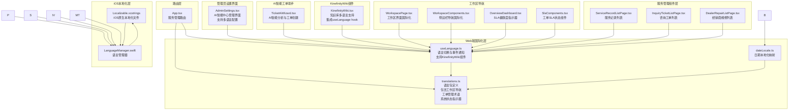
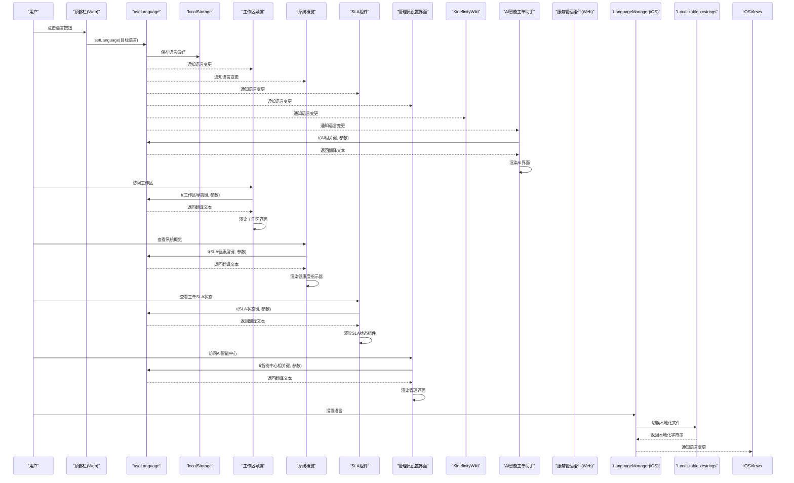
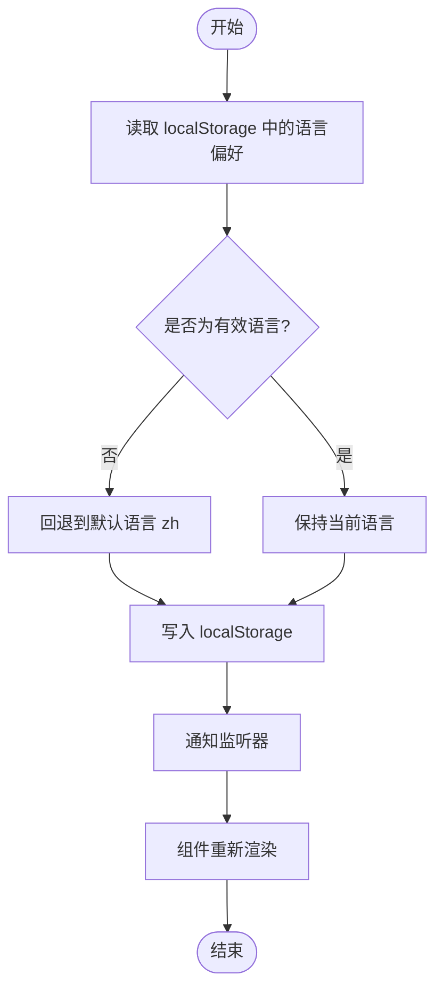

# 国际化支持

<cite>
**本文档引用的文件**
- [translations.ts](file://client/src/i18n/translations.ts)
- [useLanguage.ts](file://client/src/i18n/useLanguage.ts)
- [dateLocale.ts](file://client/src/utils/dateLocale.ts)
- [WorkspacePage.tsx](file://client/src/components/Service/WorkspacePage.tsx)
- [WorkspaceComponents.tsx](file://client/src/components/Workspace/WorkspaceComponents.tsx)
- [OverviewDashboard.tsx](file://client/src/components/Workspace/OverviewDashboard.tsx)
- [SlaComponents.tsx](file://client/src/components/Tickets/SlaComponents.tsx)
- [sla_service.js](file://server/service/sla_service.js)
- [AdminSettings.tsx](file://client/src/components/Admin/AdminSettings.tsx)
- [TicketAiWizard.tsx](file://client/src/components/TicketAiWizard.tsx)
- [KinefinityWiki.tsx](file://client/src/components/KinefinityWiki.tsx)
- [App.tsx](file://client/src/App.tsx)
- [Localizable.xcstrings](file://ios/LonghornApp/Resources/Localizable.xcstrings)
- [LanguageManager.swift](file://ios/LonghornApp/Services/LanguageManager.swift)
</cite>

## 更新摘要
**所做更改**
- 新增对工作区导航、工单管理术语和系统状态指示器的全面国际化支持
- 扩展175个新增翻译键，涵盖服务概览、工单状态、SLA健康度等关键功能模块
- 增强工作区界面的多语言支持，包括任务视图、状态标签和SLA计时器
- 完善系统状态指示器的本地化展示，包括健康度、超时率、平均响应等指标
- 新增对德语、日语的完整支持，扩展多语言覆盖范围
- 增强AI智能工单助手的国际化功能，包括智能分析、数据提取、工单创建
- 完善知识库管理功能的国际化支持，包括Bokeh智能回答和文章管理

## 目录
1. [引言](#引言)
2. [项目结构](#项目结构)
3. [核心组件](#核心组件)
4. [架构总览](#架构总览)
5. [详细组件分析](#详细组件分析)
6. [useLanguage Hook国际化支持](#uselanguage-hook国际化支持)
7. [工作区导航国际化](#工作区导航国际化)
8. [工单管理术语国际化](#工单管理术语国际化)
9. [系统状态指示器国际化](#系统状态指示器国际化)
10. [AI智能工单助手国际化](#ai智能工单助手国际化)
11. [知识库管理功能国际化](#知识库管理功能国际化)
12. [多语言支持扩展](#多语言支持扩展)
13. [跨平台国际化支持](#跨平台国际化支持)
14. [国际化系统增强分析](#国际化系统增强分析)
15. [性能考虑](#性能考虑)
16. [故障排除指南](#故障排除指南)
17. [结论](#结论)
18. [附录](#附录)

## 引言
本文件系统性梳理 Longhorn 前端国际化支持的实现机制，重点覆盖以下方面：
- 翻译键值组织与 translations.ts 的语言包管理
- useLanguage.ts 的语言切换与翻译函数实现
- 工作区导航、工单管理术语和系统状态指示器的全面国际化支持
- 175个新增翻译键的组织与管理策略
- 管理员设置界面的国际化支持，包括AI智能中心管理
- AI智能工单助手的国际化支持，包括TicketAiWizard组件的翻译键组织
- 知识库管理功能的国际化支持，包括KinefinityWiki组件的翻译键组织
- 多语言支持扩展，涵盖中文、英语、德语、日语四种语言
- iOS本地化文件的全面更新和语言映射策略
- iOS语言管理器LanguageManager.swift的实现原理
- 动态语言加载与本地化渲染策略
- 文本翻译、日期格式化、数字格式化的本地化实现
- 新语言添加流程、翻译文件维护与语言回退机制
- 跨平台国际化支持的架构设计
- 国际化开发最佳实践与性能优化建议

Longhorn 前端采用Web端自研i18n方案与iOS原生本地化相结合的方式，实现多语言界面与日期本地化展示。iOS端通过Xcode的Localizable.xcstrings文件和Swift语言管理器实现完整的本地化支持。**新增的175个翻译键涵盖了工作区导航、工单管理术语和系统状态指示器等关键功能模块，显著提升了多语言环境下的用户体验。** **最新的useLanguage hook国际化支持为KinefinityWiki组件提供了强大的多语言基础，显著提升了知识库界面的用户体验。** **最新的管理员设置界面国际化包括AI智能中心管理界面的多语言支持，涵盖'Intelligence Center (AI)'、'AI Providers'、'Global Policy'等专业术语。** 多语言支持的显著扩展为用户提供了更加准确和专业的界面体验。

## 项目结构
国际化相关代码主要位于 client/src/i18n 与 client/src/utils 目录，并在业务组件中广泛使用，同时iOS端也有完整的本地化实现：
- Web端i18n层：translations.ts 提供语言包；useLanguage.ts 提供语言切换与翻译函数
- iOS本地化层：Localizable.xcstrings 提供iOS原生字符串本地化；LanguageManager.swift 管理语言状态
- 工具层：dateLocale.ts 提供日期本地化映射
- 工作区导航：WorkspacePage.tsx 提供工作区界面的国际化支持
- 工作区组件：WorkspaceComponents.tsx 提供侧边栏和导航的国际化支持
- 系统概览：OverviewDashboard.tsx 提供SLA健康度指示器的国际化支持
- SLA组件：SlaComponents.tsx 提供工单SLA状态的国际化支持
- 服务管理组件层：ServiceRecords、InquiryTickets、RMATickets、DealerRepairs 等模块通过 useLanguage 获取翻译
- 路由层：App.tsx 提供服务管理功能的路由国际化支持

**图表来源**
- [translations.ts](file://client/src/i18n/translations.ts#L1-L5395)
- [useLanguage.ts](file://client/src/i18n/useLanguage.ts#L1-L59)
- [dateLocale.ts](file://client/src/utils/dateLocale.ts#L1-L20)
- [WorkspacePage.tsx](file://client/src/components/Service/WorkspacePage.tsx#L1-L102)
- [WorkspaceComponents.tsx](file://client/src/components/Workspace/WorkspaceComponents.tsx#L1-L69)
- [OverviewDashboard.tsx](file://client/src/components/Workspace/OverviewDashboard.tsx#L110-L155)
- [SlaComponents.tsx](file://client/src/components/Tickets/SlaComponents.tsx#L97-L152)
- [AdminSettings.tsx](file://client/src/components/Admin/AdminSettings.tsx#L493-L642)
- [TicketAiWizard.tsx](file://client/src/components/TicketAiWizard.tsx#L1-L268)
- [KinefinityWiki.tsx](file://client/src/components/KinefinityWiki.tsx#L179-L200)
- [App.tsx](file://client/src/App.tsx#L133-L156)

**章节来源**
- [translations.ts](file://client/src/i18n/translations.ts#L1-L5395)
- [useLanguage.ts](file://client/src/i18n/useLanguage.ts#L1-L59)
- [dateLocale.ts](file://client/src/utils/dateLocale.ts#L1-L20)
- [WorkspacePage.tsx](file://client/src/components/Service/WorkspacePage.tsx#L1-L102)
- [WorkspaceComponents.tsx](file://client/src/components/Workspace/WorkspaceComponents.tsx#L1-L69)
- [OverviewDashboard.tsx](file://client/src/components/Workspace/OverviewDashboard.tsx#L110-L155)
- [SlaComponents.tsx](file://client/src/components/Tickets/SlaComponents.tsx#L97-L152)
- [AdminSettings.tsx](file://client/src/components/Admin/AdminSettings.tsx#L493-L642)
- [TicketAiWizard.tsx](file://client/src/components/TicketAiWizard.tsx#L1-L268)
- [KinefinityWiki.tsx](file://client/src/components/KinefinityWiki.tsx#L179-L200)
- [Localizable.xcstrings](file://ios/LonghornApp/Resources/Localizable.xcstrings#L1-L200)
- [LanguageManager.swift](file://ios/LonghornApp/Services/LanguageManager.swift#L1-L56)
- [App.tsx](file://client/src/App.tsx#L133-L156)

## 核心组件
- 语言包管理（translations.ts）
  - 定义四种语言 zh、en、de、ja 的键值对，涵盖应用名称、通用动作、仪表盘、文件浏览器、搜索、分享、管理、标签、错误提示等模块
  - **新增工作区导航模块**：包含'workspace.action_zones'、'workspace.search_tickets'、'workspace.items_count'等工作区相关翻译键
  - **新增工单管理术语模块**：包含'inquiry_ticket.status.*'、'rma_ticket.status.*'、'dealer_repair.status.*'等工单状态翻译键
  - **新增系统状态指示器模块**：包含'overview.sla_health'、'overview.health_good'、'overview.health_fair'、'overview.health_poor'等SLA健康度翻译键
  - **新增175个新增翻译键**：涵盖服务概览、工单状态、SLA计时器、系统健康度等关键功能模块
  - 支持参数化占位符替换（双花括号与单花括号两种形式）
  - 支持四种语言的完整翻译覆盖
- 语言切换与事件通知（useLanguage.ts）
  - 使用 localStorage 存储用户语言偏好，默认 zh
  - 通过简单事件总线通知订阅者语言变更
  - 提供 t 函数进行翻译与回退逻辑
  - **新增useLanguage hook支持**：为KinefinityWiki组件提供国际化基础
- iOS本地化文件（Localizable.xcstrings）
  - Xcode原生本地化文件，支持多语言字符串定义
  - 包含完整的语言映射，涵盖action、settings、home等模块
  - 支持复杂的本地化格式和参数化字符串
- iOS语言管理器（LanguageManager.swift）
  - 管理iOS应用的语言状态和切换
  - 支持系统语言检测和映射
  - 提供AppLanguage枚举和每日单词语言代码映射
- 日期本地化（dateLocale.ts）
  - 将语言映射到 date-fns 的 Locale 对象，用于日期格式化
- 工作区导航（WorkspacePage.tsx）
  - 提供工作区界面的国际化支持，包括任务视图、搜索、状态标签
  - 使用 t 函数获取工作区导航、状态标签、SLA计时器等界面文本
  - 支持工作区视图切换和任务状态的本地化显示
- 工作区组件（WorkspaceComponents.tsx）
  - 提供侧边栏导航的国际化支持
  - 使用 t 函数获取侧边栏导航项的本地化文本
  - 支持工作区导航的多语言显示
- 系统概览（OverviewDashboard.tsx）
  - 提供SLA健康度指示器的国际化支持
  - 使用 t 函数获取SLA健康度、状态标签等界面文本
  - 支持健康度指标的本地化显示
- SLA组件（SlaComponents.tsx）
  - 提供工单SLA状态的国际化支持
  - 使用 t 函数获取SLA状态标签、计时器等界面文本
  - 支持SLA状态的本地化显示和计时功能
- 服务管理组件集成（ServiceRecordListPage.tsx、InquiryTicketListPage.tsx、DealerRepairListPage.tsx）
  - 在服务记录列表中使用 t 函数获取状态标签和服务类型
  - 在咨询工单列表中使用 t 函数获取状态标签和渠道类型
  - 在经销商维修列表中使用 t 函数获取空状态提示

**章节来源**
- [translations.ts](file://client/src/i18n/translations.ts#L1-L5395)
- [useLanguage.ts](file://client/src/i18n/useLanguage.ts#L1-L59)
- [WorkspacePage.tsx](file://client/src/components/Service/WorkspacePage.tsx#L76-L102)
- [WorkspaceComponents.tsx](file://client/src/components/Workspace/WorkspaceComponents.tsx#L59-L69)
- [OverviewDashboard.tsx](file://client/src/components/Workspace/OverviewDashboard.tsx#L120-L155)
- [SlaComponents.tsx](file://client/src/components/Tickets/SlaComponents.tsx#L120-L152)
- [Localizable.xcstrings](file://ios/LonghornApp/Resources/Localizable.xcstrings#L1-L200)
- [LanguageManager.swift](file://ios/LonghornApp/Services/LanguageManager.swift#L1-L56)
- [dateLocale.ts](file://client/src/utils/dateLocale.ts#L1-L20)
- [ServiceRecordListPage.tsx](file://client/src/components/ServiceRecords/ServiceRecordListPage.tsx#L123-L145)
- [InquiryTicketListPage.tsx](file://client/src/components/InquiryTickets/InquiryTicketListPage.tsx#L161-L170)
- [DealerRepairListPage.tsx](file://client/src/components/DealerRepairs/DealerRepairListPage.tsx#L225)

## 架构总览
Longhorn 前端国际化采用"Web端自研翻译 + iOS原生本地化 + 工作区导航 + 工单管理 + 系统状态指示器"的混合架构：
- Web端自研翻译：translations.ts 提供键值映射与参数化替换
- iOS原生本地化：Localizable.xcstrings 提供Xcode原生字符串本地化
- 工作区导航：WorkspacePage.tsx 提供工作区界面的国际化支持
- 工单管理：InquiryTicketListPage.tsx、RMATicketListPage.tsx等提供工单管理的国际化支持
- 系统状态指示器：OverviewDashboard.tsx、SlaComponents.tsx提供系统健康度和SLA状态的国际化支持
- 管理员设置界面：AdminSettings.tsx 提供AI智能中心管理界面的国际化支持
- AI智能助手：TicketAiWizard.tsx 提供AI功能的国际化支持
- KinefinityWiki组件：提供知识库的国际化支持，集成useLanguage hook
- 事件通知：useLanguage.ts 维护当前语言与监听器集合
- iOS语言管理：LanguageManager.swift 统一管理iOS端语言状态
- 本地化工具：dateLocale.ts 提供日期本地化映射
- 服务管理组件：各业务组件通过 useLanguage 获取翻译与本地化能力

**图表来源**
- [useLanguage.ts](file://client/src/i18n/useLanguage.ts#L22-L26)
- [LanguageManager.swift](file://ios/LonghornApp/Services/LanguageManager.swift#L25-L30)
- [Localizable.xcstrings](file://ios/LonghornApp/Resources/Localizable.xcstrings#L110-L138)
- [WorkspacePage.tsx](file://client/src/components/Service/WorkspacePage.tsx#L76-L102)
- [OverviewDashboard.tsx](file://client/src/components/Workspace/OverviewDashboard.tsx#L120-L155)
- [SlaComponents.tsx](file://client/src/components/Tickets/SlaComponents.tsx#L120-L152)
- [AdminSettings.tsx](file://client/src/components/Admin/AdminSettings.tsx#L493-L642)
- [TicketAiWizard.tsx](file://client/src/components/TicketAiWizard.tsx#L22-L44)
- [KinefinityWiki.tsx](file://client/src/components/KinefinityWiki.tsx#L179-L200)

## 详细组件分析

### 翻译键值组织与参数化
- 键命名规范
  - 采用层级式命名，如 app.name、browser.upload、share.title 等，便于分类与查找
  - 语言特定键如 lang.zh_short、lang.de、lang.en，用于语言选择器显示
  - **工作区导航模块键命名**：workspace.action_zones、workspace.search_tickets、workspace.items_count等
  - **工单管理模块键命名**：inquiry_ticket.status.*、rma_ticket.status.*、dealer_repair.status.*等
  - **系统状态指示器模块键命名**：overview.sla_health、overview.health_good、overview.breach_rate等
  - **管理员设置界面模块键命名**：admin.intelligence_center、admin.ai_providers、admin.global_policy 等
  - **知识库管理模块键命名**：wiki.subtitle、wiki.search_placeholder、wiki.manage 等
  - **AI智能工单助手模块键命名**：ticket_ai.*、ai.smart_ticket.* 等
  - **服务管理模块键命名**：service_record.*、inquiry_ticket.*、rma_ticket.*、dealer_repair.* 等
- 参数化替换
  - 支持 {{count}} 与 {count} 两种占位符，t 函数会遍历参数对象进行替换
  - 适用于数量、日期、名称等动态内容的本地化展示

**章节来源**
- [translations.ts](file://client/src/i18n/translations.ts#L1-L5395)
- [useLanguage.ts](file://client/src/i18n/useLanguage.ts#L44-L55)

### 语言切换与事件通知机制
- 语言持久化
  - 从 localStorage 读取语言偏好，若无效则回退至 zh
  - setLanguage 更新内存与存储中的当前语言
- 事件通知
  - 使用 Set 维护监听器集合，notify 广播语言变更
  - useLanguage 在挂载时同步当前语言，并订阅变更事件
- 订阅与渲染
  - 任何订阅 useLanguage 的组件会在语言切换时重新渲染

**图表来源**
- [useLanguage.ts](file://client/src/i18n/useLanguage.ts#L12-L26)

**章节来源**
- [useLanguage.ts](file://client/src/i18n/useLanguage.ts#L1-L59)

### iOS本地化文件结构分析
- Localizable.xcstrings 格式
  - 采用JSON格式的Xcode原生本地化文件
  - 支持多语言字符串定义，每个键包含多种语言的翻译
  - 包含提取状态(extractionState)和本地化单元(stringUnit)
- 语言映射策略
  - 支持四种语言：de、en、ja、zh-Hans
  - 每个字符串键包含对应的多语言翻译
  - 支持复杂的本地化格式和参数化字符串
- 字符串组织结构
  - 按功能模块组织：action、settings、home、quick等
  - 支持参数化字符串，如 %@ 占位符
  - 包含完整的UI文本覆盖

**章节来源**
- [Localizable.xcstrings](file://ios/LonghornApp/Resources/Localizable.xcstrings#L1-L200)

### iOS语言管理器实现
- 语言状态管理
  - 使用 @AppStorage 管理语言偏好设置
  - 支持系统语言检测和自动映射
  - 提供 currentLanguageCode 和 currentLanguage 属性
- 语言映射逻辑
  - 系统语言到应用语言的映射
  - 支持 zh、zh-Hans、zh-Hant 等中文变体
  - 提供 dailyWordCode 用于每日单词服务的语言设置
- 语言切换机制
  - setLanguage 方法更新语言并通知变更
  - 自动同步 DailyWordService 的语言设置
  - 支持 AppLanguage 枚举的完整生命周期管理

**章节来源**
- [LanguageManager.swift](file://ios/LonghornApp/Services/LanguageManager.swift#L1-L56)

### 日期格式化本地化
- 映射策略
  - 通过 getDateLocale 将语言映射到 date-fns 的 Locale 对象
  - 若语言不存在，回退到英文 Locale
- 使用场景
  - 仪表盘中使用 date-fns 的 formatDistanceToNow 进行相对时间格式化
  - 使用本地化 Locale 提升可读性

**章节来源**
- [dateLocale.ts](file://client/src/utils/dateLocale.ts#L1-L20)

### 数字与文件大小格式化
- 数字与容量格式化
  - 仪表盘中使用自定义格式化函数将字节转换为 B/KB/MB/GB/TB
  - 采用固定小数位与单位数组，保证可读性

**章节来源**
- [ServiceRecordListPage.tsx](file://client/src/components/ServiceRecords/ServiceRecordListPage.tsx#L118-L121)

### 组件中的国际化使用
- 顶部栏语言选择
  - 顶部栏提供语言切换按钮，点击后调用 setLanguage 并关闭下拉菜单
- 工作区导航国际化
  - 工作区页面使用 t 函数获取导航文本、搜索提示、状态标签
  - 支持工作区视图切换和任务状态的本地化显示
- 系统概览国际化
  - SLA健康度指示器使用 t 函数获取健康度标签和状态文本
  - 支持健康度指标的本地化显示
- SLA状态组件国际化
  - SLA计时器使用 t 函数获取状态标签和计时文本
  - 支持SLA状态的本地化显示和计时功能
- 侧边栏与导航
  - 侧边栏根据用户角色与权限渲染不同入口
  - 部门名称优先使用翻译键，若无翻译则回退到原始数据库名称
  - **管理员设置界面导航**：sidebar.ai_smart_ticket、sidebar.ticket_ai_wizard 等导航项通过 t 函数获取
  - **KinefinityWiki导航**：sidebar.knowledge 等导航项通过 t 函数获取
- 登录页与错误提示
  - 登录页使用翻译键作为占位符与按钮文案
  - 错误消息统一通过 t 函数获取本地化文本
- **管理员设置界面国际化**
  - AdminSettings 使用 t 函数获取AI智能中心、AI提供商、全局策略等界面文本
  - 支持AI提供商配置和全局策略设置的本地化
- **AI智能工单助手国际化**
  - TicketAiWizard 使用 t 函数获取智能分析、数据提取、工单创建等界面文本
  - 支持错误处理和用户交互的本地化
- **KinefinityWiki组件国际化**
  - KinefinityWiki 使用 t 函数获取知识库搜索、管理、章节概览等界面文本
  - 支持AI搜索模式和关键词搜索的本地化
  - 支持Bokeh智能回答和相关文章的本地化显示
- **服务管理组件国际化**
  - ServiceRecordListPage 使用 t 函数获取状态标签和服务类型
  - InquiryTicketListPage 使用 t 函数获取状态标签和渠道类型
  - DealerRepairListPage 使用 t 函数获取空状态提示
- iOS组件国际化
  - DashboardView 使用 String(localized:) 进行本地化
  - SettingsView 提供语言选择器和系统语言检测
  - LoginView 使用硬编码中文字符串作为示例

**章节来源**
- [WorkspacePage.tsx](file://client/src/components/Service/WorkspacePage.tsx#L76-L102)
- [WorkspaceComponents.tsx](file://client/src/components/Workspace/WorkspaceComponents.tsx#L59-L69)
- [OverviewDashboard.tsx](file://client/src/components/Workspace/OverviewDashboard.tsx#L120-L155)
- [SlaComponents.tsx](file://client/src/components/Tickets/SlaComponents.tsx#L120-L152)
- [AdminSettings.tsx](file://client/src/components/Admin/AdminSettings.tsx#L493-L642)
- [TicketAiWizard.tsx](file://client/src/components/TicketAiWizard.tsx#L22-L44)
- [KinefinityWiki.tsx](file://client/src/components/KinefinityWiki.tsx#L179-L200)
- [ServiceRecordListPage.tsx](file://client/src/components/ServiceRecords/ServiceRecordListPage.tsx#L123-L145)
- [InquiryTicketListPage.tsx](file://client/src/components/InquiryTickets/InquiryTicketListPage.tsx#L161-L170)
- [DealerRepairListPage.tsx](file://client/src/components/DealerRepairs/DealerRepairListPage.tsx#L225)

### 语言回退机制
- 翻译回退
  - 当前语言字典中找不到键时，回退到 zh 字典
  - 若 zh 也不存在，则返回键本身
- iOS回退机制
  - Localizable.xcstrings 支持提取状态管理
  - 未翻译的字符串会标记为 new 状态
  - 系统语言检测提供自动语言映射
- 日期回退
  - 语言映射不到对应 Locale 时，回退到英文 Locale

**章节来源**
- [useLanguage.ts](file://client/src/i18n/useLanguage.ts#L44-L47)
- [dateLocale.ts](file://client/src/utils/dateLocale.ts#L18-L19)
- [Localizable.xcstrings](file://ios/LonghornApp/Resources/Localizable.xcstrings#L26-L27)

### 服务端词汇表与前端国际化的关系
- 服务端提供多语言词汇表（如中文与英文），前端在组件中按需消费
- 该机制与前端 i18n 系统互补，服务于特定功能（如每日一词）的本地化展示

**章节来源**
- [sla_service.js](file://server/service/sla_service.js#L1-L225)

## useLanguage Hook国际化支持

### useLanguage Hook实现原理
- **Hook设计模式**
  - useLanguage 是一个自定义React Hook，封装了语言状态管理和翻译逻辑
  - 使用 useState 管理当前语言状态，使用 useEffect 处理组件挂载和卸载
  - 提供语言切换、翻译获取、事件通知等核心功能
- **状态管理**
  - 内部维护 currentLanguage 变量和监听器集合
  - 通过 localStorage 实现语言偏好的持久化存储
  - 支持即时语言同步和事件广播机制
- **翻译函数实现**
  - t 函数支持参数化翻译和回退机制
  - 自动处理语言字典查找和参数替换
  - 提供类型安全的翻译键值访问

**章节来源**
- [useLanguage.ts](file://client/src/i18n/useLanguage.ts#L30-L58)

### KinefinityWiki组件中的useLanguage集成
- **Hook集成方式**
  - KinefinityWiki 组件通过 const { t } = useLanguage() 获取翻译函数
  - 在组件渲染过程中使用 t 函数获取各种界面文本
  - 支持语言切换时的自动重新渲染
- **翻译键值使用**
  - 知识库标题：t('wiki.subtitle')
  - 搜索占位符：t('wiki.search_placeholder')
  - 管理按钮：t('wiki.manage')
  - AI搜索标签：t('wiki.search.ai_answer')
  - 关键词搜索标签：t('wiki.search.keyword')
  - 思考状态：t('wiki.search.thinking')
  - Bokeh回答：t('wiki.search.bokeh_answer')
  - 相关文章：t('wiki.search.related_articles', { count })
  - 搜索结果：t('wiki.search.results', { count })
- **章节概览功能**
  - 章节概览按钮：t('wiki.chapter_overview')
  - 支持章节视图的本地化显示

**章节来源**
- [KinefinityWiki.tsx](file://client/src/components/KinefinityWiki.tsx#L179-L200)
- [KinefinityWiki.tsx](file://client/src/components/KinefinityWiki.tsx#L1258-L1396)

### useLanguage Hook的性能优化
- **状态缓存机制**
  - 内部状态管理避免不必要的重渲染
  - 事件监听器集合提供高效的广播机制
- **内存管理**
  - 组件卸载时自动清理事件监听器
  - localStorage 操作为 O(1) 时间复杂度
- **类型安全**
  - TypeScript 类型定义确保翻译键值的正确性
  - 参数化翻译支持类型检查和推断

**章节来源**
- [useLanguage.ts](file://client/src/i18n/useLanguage.ts#L30-L58)

## 工作区导航国际化

### 工作区界面国际化
- **工作区导航本地化**
  - 'workspace.action_zones' 翻译键显示为"处理动作"
  - 'workspace.search_tickets' 翻译键显示为"搜索工单..."
  - 'workspace.items_count' 翻译键显示为"项"
  - 支持工作区导航的多语言显示
- **工作区视图本地化**
  - 'workspace.no_tickets' 翻译键显示为"暂无工单"
  - 'workspace.sla_breached' 翻译键显示为"SLA超时"
  - 'workspace.sla_warning' 翻译键显示为"SLA警告"
  - 支持工作区视图的状态标签本地化
- **工作区操作本地化**
  - 'workspace.snooze' 翻译键显示为"挂起"
  - 'workspace.snooze_tomorrow' 翻译键显示为"明天提醒"
  - 'workspace.pick_up' 翻译键显示为"认领"
  - 'workspace.starred' 翻译键显示为"加星"
  - 'workspace.unstar' 翻译键显示为"取消加星"
  - 支持工作区操作的多语言显示

**章节来源**
- [translations.ts](file://client/src/i18n/translations.ts#L792-L800)
- [translations.ts](file://client/src/i18n/translations.ts#L2249-L2260)

### 工作区组件国际化
- **侧边栏导航本地化**
  - 侧边栏导航项使用 t 函数获取本地化文本
  - 支持工作区导航的多语言显示
- **工作区状态标签本地化**
  - 工作区状态标签使用 t 函数获取本地化文本
  - 支持SLA状态的本地化显示
- **工作区搜索功能本地化**
  - 搜索提示使用 t 函数获取本地化文本
  - 支持搜索功能的多语言显示

**章节来源**
- [WorkspacePage.tsx](file://client/src/components/Service/WorkspacePage.tsx#L76-L102)
- [WorkspaceComponents.tsx](file://client/src/components/Workspace/WorkspaceComponents.tsx#L59-L69)

### 路由与导航国际化
- **工作区导航**
  - sidebar.my_tasks、sidebar.mentioned、sidebar.team_queue 等导航项通过 t 函数获取
  - 支持工作区功能的多语言导航显示
- **路由国际化**
  - App.tsx 中的工作区路由提供本地化支持
  - 确保工作区功能的URL和路由具有正确的本地化显示

**章节来源**
- [translations.ts](file://client/src/i18n/translations.ts#L2241-L2248)
- [App.tsx](file://client/src/App.tsx#L133-L156)

## 工单管理术语国际化

### 工单状态本地化
- **咨询工单状态本地化**
  - 'inquiry_ticket.status.pending' 翻译键显示为"待处理"
  - 'inquiry_ticket.status.in_progress' 翻译键显示为"处理中"
  - 'inquiry_ticket.status.awaiting_feedback' 翻译键显示为"待客户反馈"
  - 'inquiry_ticket.status.resolved' 翻译键显示为"已解决"
  - 'inquiry_ticket.status.auto_closed' 翻译键显示为"自动关闭"
  - 'inquiry_ticket.status.upgraded' 翻译键显示为"已升级"
  - 支持咨询工单状态的多语言显示
- **RMA工单状态本地化**
  - 'rma_ticket.status.pending' 翻译键显示为"待处理"
  - 'rma_ticket.status.confirming' 翻译键显示为"确认中"
  - 'rma_ticket.status.diagnosing' 翻译键显示为"检测中"
  - 'rma_ticket.status.assigned' 翻译键显示为"已分配"
  - 'rma_ticket.status.in_repair' 翻译键显示为"维修中"
  - 'rma_ticket.status.repaired' 翻译键显示为"已维修"
  - 'rma_ticket.status.shipped' 翻译键显示为"已发货"
  - 'rma_ticket.status.completed' 翻译键显示为"已完成"
  - 'rma_ticket.status.cancelled' 翻译键显示为"已取消"
  - 支持RMA工单状态的多语言显示
- **经销商维修状态本地化**
  - 'dealer_repair.status.received' 翻译键显示为"已接收"
  - 'dealer_repair.status.confirming' 翻译键显示为"确认中"
  - 'dealer_repair.status.diagnosing' 翻译键显示为"诊断中"
  - 'dealer_repair.status.awaiting_parts' 翻译键显示为"等待配件"
  - 'dealer_repair.status.in_repair' 翻译键显示为"维修中"
  - 'dealer_repair.status.completed' 翻译键显示为"已完成"
  - 'dealer_repair.status.returned' 翻译键显示为"已归还"
  - 'dealer_repair.status.cancelled' 翻译键显示为"已取消"
  - 支持经销商维修状态的多语言显示

**章节来源**
- [translations.ts](file://client/src/i18n/translations.ts#L805-L920)
- [translations.ts](file://client/src/i18n/translations.ts#L2298-L2351)
- [translations.ts](file://client/src/i18n/translations.ts#L2441-L2492)

### 工单类型与渠道本地化
- **工单类型本地化**
  - 咨询工单类型：'inquiry_ticket.type.consultation'、'inquiry_ticket.type.troubleshooting'等
  - RMA工单类型：'rma_ticket.issue_type.customer_return'、'rma_ticket.issue_type.production'等
  - 经销商维修类型：'dealer_repair.type.in_warranty'、'dealer_repair.type.out_of_warranty'等
- **工单渠道本地化**
  - 咨询工单渠道：'inquiry_ticket.channel.phone'、'inquiry_ticket.channel.email'等
  - RMA工单渠道：'rma_ticket.channel.dealer'、'rma_ticket.channel.customer'等
  - 支持多语言的工单类型和渠道显示

**章节来源**
- [translations.ts](file://client/src/i18n/translations.ts#L821-L830)
- [translations.ts](file://client/src/i18n/translations.ts#L897-L900)
- [translations.ts](file://client/src/i18n/translations.ts#L967-L970)

### 工单字段本地化
- **工单字段标签本地化**
  - 客户信息字段：'inquiry_ticket.field.customer_name'、'inquiry_ticket.field.customer_contact'等
  - 产品信息字段：'inquiry_ticket.field.product'、'inquiry_ticket.field.serial_number'等
  - 服务信息字段：'inquiry_ticket.field.service_type'、'inquiry_ticket.field.channel'等
  - 支持工单字段的多语言显示
- **工单占位符本地化**
  - 输入占位符：'inquiry_ticket.placeholder.customer_name'、'inquiry_ticket.placeholder.select_product'等
  - 支持多语言的输入提示
- **工单错误消息本地化**
  - 错误提示：'inquiry_ticket.error.problem_required'、'rma_ticket.error.problem_required'等
  - 支持多语言的错误消息显示

**章节来源**
- [translations.ts](file://client/src/i18n/translations.ts#L834-L855)
- [translations.ts](file://client/src/i18n/translations.ts#L914-L919)
- [translations.ts](file://client/src/i18n/translations.ts#L993-L997)

### 路由与导航国际化
- **工单管理导航**
  - sidebar.inquiry_tickets、sidebar.rma_tickets、sidebar.dealer_repairs 等导航项通过 t 函数获取
  - 支持工单管理功能的多语言导航显示
- **路由国际化**
  - App.tsx 中的工单管理路由提供本地化支持
  - 确保工单管理功能的URL和路由具有正确的本地化显示

**章节来源**
- [translations.ts](file://client/src/i18n/translations.ts#L2231-L2233)
- [App.tsx](file://client/src/App.tsx#L133-L156)

## 系统状态指示器国际化

### SLA健康度指示器国际化
- **SLA健康度本地化**
  - 'overview.sla_health' 翻译键显示为"SLA 健康度"
  - 'overview.health_good' 翻译键显示为"健康"
  - 'overview.health_fair' 翻译键显示为"一般"
  - 'overview.health_poor' 翻译键显示为"需关注"
  - 支持SLA健康度指标的多语言显示
- **SLA指标本地化**
  - 'overview.breach_rate' 翻译键显示为"超时率"
  - 'overview.avg_response' 翻译键显示为"平均响应"
  - 'overview.today_processed' 翻译键显示为"今日处理"
  - 支持SLA指标的多语言显示
- **SLA状态标签本地化**
  - SLA状态标签使用 t 函数获取本地化文本
  - 支持SLA状态的本地化显示

**章节来源**
- [translations.ts](file://client/src/i18n/translations.ts#L17-L28)
- [translations.ts](file://client/src/i18n/translations.ts#L1745-L1768)
- [OverviewDashboard.tsx](file://client/src/components/Workspace/OverviewDashboard.tsx#L120-L155)

### 系统概览组件国际化
- **系统概览界面本地化**
  - 'system.loading' 翻译键显示为"正在加载系统概览..."
  - 'system.overview' 翻译键显示为"系统概览"
  - 'system.status_good' 翻译键显示为"系统状态运行良好"
  - 支持系统概览界面的多语言显示
- **系统指标本地化**
  - 'system.total_users' 翻译键显示为"总注册用户"
  - 'system.active_users' 翻译键显示为"{count} 位活跃用户 (24h)"
  - 'system.storage_used' 翻译键显示为"资产库占用"
  - 支持系统指标的多语言显示
- **系统图表本地化**
  - 图表标签使用 t 函数获取本地化文本
  - 支持图表的多语言显示

**章节来源**
- [translations.ts](file://client/src/i18n/translations.ts#L259-L273)
- [translations.ts](file://client/src/i18n/translations.ts#L2520-L2532)

### SLA组件国际化
- **SLA状态组件本地化**
  - SLA状态标签：'normal'、'warning'、'breached' 通过 t 函数获取本地化文本
  - SLA计时器：剩余时间显示使用本地化文本
  - 支持SLA状态的本地化显示和计时功能
- **SLA计时器本地化**
  - 计时器文本：'已超时'、'{hours}h {minutes}m'、'{days}天{hours % 24}h'等
  - 支持多语言的SLA计时显示

**章节来源**
- [SlaComponents.tsx](file://client/src/components/Tickets/SlaComponents.tsx#L120-L152)
- [sla_service.js](file://server/service/sla_service.js#L90-L121)

### 路由与导航国际化
- **系统管理导航**
  - sidebar.system_admin、sidebar.files_admin、sidebar.service_admin 等导航项通过 t 函数获取
  - 支持系统管理功能的多语言导航显示
- **路由国际化**
  - App.tsx 中的系统管理路由提供本地化支持
  - 确保系统管理功能的URL和路由具有正确的本地化显示

**章节来源**
- [translations.ts](file://client/src/i18n/translations.ts#L2260-L2262)
- [App.tsx](file://client/src/App.tsx#L133-L156)

## AI智能工单助手国际化

### AI智能分析功能国际化
- 智能分析界面本地化
  - AI智能工单助手标题和副标题通过 t 函数获取本地化文本
  - 输入源区域的标签和占位符通过翻译键获取
  - 支持中英文智能分析界面的动态切换
- 数据提取功能本地化
  - 工单预览区域的字段标签通过 t 函数获取本地化显示
  - 客户姓名、联系方式、产品型号等字段通过翻译键获取
  - 紧急程度选项通过翻译键获取本地化显示
- 用户交互本地化
  - 分析与提取按钮通过 t 函数获取本地化文本
  - 错误提示信息通过 t 函数获取本地化显示
  - 确认创建工单按钮通过 t 函数获取本地化文本

**章节来源**
- [TicketAiWizard.tsx](file://client/src/components/TicketAiWizard.tsx#L52-L142)
- [TicketAiWizard.tsx](file://client/src/components/TicketAiWizard.tsx#L154-L250)

### AI工单创建功能国际化
- 工单创建界面本地化
  - 工单创建表单的字段标签通过 t 函数获取本地化显示
  - 问题摘要和详细描述字段通过翻译键获取
  - 工单创建状态通过 t 函数获取本地化文本
- 工单升级功能本地化
  - 工单升级模态框的标题和字段通过 t 函数获取本地化显示
  - 工单类型选项通过翻译键获取本地化显示
  - 问题类别和严重程度通过翻译键获取本地化显示

**章节来源**
- [TicketAiWizard.tsx](file://client/src/components/TicketAiWizard.tsx#L46-L50)

### AI功能状态与错误处理国际化
- 加载状态本地化
  - AI分析加载状态通过 t 函数获取本地化文本
  - 等待生成状态通过翻译键获取本地化显示
- 错误处理本地化
  - AI处理错误通过 t 函数获取本地化文本
  - 错误消息通过翻译键获取本地化显示
  - 清除输入和重置状态通过翻译键获取本地化文本

**章节来源**
- [TicketAiWizard.tsx](file://client/src/components/TicketAiWizard.tsx#L18-L44)

### 路由与导航国际化
- AI功能导航
  - sidebar.ai_smart_ticket、sidebar.ticket_ai_wizard 等导航项通过 t 函数获取
  - 支持AI智能工单助手功能的多语言导航显示
- 路由国际化
  - App.tsx 中的AI功能路由提供本地化支持
  - 确保AI功能的URL和路由具有正确的本地化显示

**章节来源**
- [translations.ts](file://client/src/i18n/translations.ts#L2125-L2142)
- [App.tsx](file://client/src/App.tsx#L133-L156)

## 知识库管理功能国际化

### 知识库界面本地化
- **界面标题本地化**
  - 知识库标题：t('wiki.subtitle') 显示为"探索技术文档与知识库"
  - 支持多语言环境下的界面标题显示
- **搜索功能本地化**
  - 搜索占位符：t('wiki.search_placeholder') 显示为"搜索知识库..."
  - 支持多语言环境下的搜索提示
- **管理功能本地化**
  - 管理按钮：t('wiki.manage') 显示为"管理"
  - 导入知识：t('wiki.import_knowledge') 显示为"知识生成器"
  - 管理文章：t('wiki.manage_articles') 显示为"管理文章"

**章节来源**
- [translations.ts](file://client/src/i18n/translations.ts#L1258-L1396)
- [KinefinityWiki.tsx](file://client/src/components/KinefinityWiki.tsx#L179-L200)

### 搜索模式本地化
- **AI搜索模式**
  - AI搜索标签：t('wiki.search.ai_answer') 显示为"Bokeh AI答案"
  - 思考状态：t('wiki.search.thinking') 显示为"思考中..."
  - Bokeh回答：t('wiki.search.bokeh_answer') 显示为"Bokeh答案"
- **关键词搜索模式**
  - 关键词搜索标签：t('wiki.search.keyword') 显示为"关键词搜索"
- **搜索结果本地化**
  - 相关文章：t('wiki.search.related_articles', { count })
  - 搜索结果：t('wiki.search.results', { count })

**章节来源**
- [translations.ts](file://client/src/i18n/translations.ts#L2799-L2830)
- [KinefinityWiki.tsx](file://client/src/components/KinefinityWiki.tsx#L1258-L1396)

### 章节概览功能本地化
- **章节概览按钮**
  - 章节概览：t('wiki.chapter_overview') 显示为"查看章节概览"
  - 支持章节视图的本地化显示
- **章节标题本地化**
  - 章节标题：第{chapter_number}章
  - 章节概述：{chapterView.main_chapter.title.split(':').pop()?.split('.').slice(1).join('.')}
  - 支持多语言环境下的章节标题显示

**章节来源**
- [translations.ts](file://client/src/i18n/translations.ts#L2851-L2864)
- [KinefinityWiki.tsx](file://client/src/components/KinefinityWiki.tsx#L1258-L1396)

### 路由与导航国际化
- **知识库导航**
  - sidebar.knowledge 导航项通过 t 函数获取
  - 支持知识库功能的多语言导航显示
- **路由国际化**
  - App.tsx 中的知识库路由提供本地化支持
  - 确保知识库功能的URL和路由具有正确的本地化显示

**章节来源**
- [translations.ts](file://client/src/i18n/translations.ts#L2134-L2134)
- [App.tsx](file://client/src/App.tsx#L133-L156)

## 多语言支持扩展

### 四种语言支持
- **中文支持**
  - 完整的中文翻译覆盖，包括管理员设置界面、AI智能工单助手、知识库管理
  - 支持中文特有的术语和表达方式
  - 语言标识：'zh'，简写：'ZH'
- **英语支持**
  - 完整的英文翻译覆盖，包括所有功能模块
  - 支持国际化的表达方式
  - 语言标识：'en'，简写：'EN'
- **德语支持**
  - 完整的德语翻译覆盖，包括所有功能模块
  - 支持德语的语法和表达习惯
  - 语言标识：'de'，简写：'DE'
- **日语支持**
  - 完整的日语翻译覆盖，包括所有功能模块
  - 支持日语的敬语和表达方式
  - 语言标识：'ja'，简写：'JA'

### 语言代码标准化
- Web端使用 ISO 639-1 语言代码：zh、en、de、ja
- iOS端使用更详细的语言代码：zh-Hans、en、de、ja
- 通过LanguageManager进行映射转换，确保跨平台一致性

### 翻译键值一致性
- Web端和iOS端的核心翻译键值保持一致
- 管理员设置界面、AI智能工单助手、知识库管理功能的翻译键值在两端保持一致
- 支持AI智能中心管理界面的多语言一致性

**章节来源**
- [translations.ts](file://client/src/i18n/translations.ts#L2-L2)
- [translations.ts](file://client/src/i18n/translations.ts#L698-L725)
- [translations.ts](file://client/src/i18n/translations.ts#L1258-L1396)
- [translations.ts](file://client/src/i18n/translations.ts#L2144-L2176)
- [LanguageManager.swift](file://ios/LonghornApp/Services/LanguageManager.swift#L33-L56)

## 跨平台国际化支持

### Web端国际化实现
- 自研翻译系统
  - translations.ts 提供完整的Web端翻译键值对，包含管理员设置界面模块和知识库管理模块
  - 支持参数化替换和回退机制
  - 与React组件深度集成
  - **新增useLanguage hook支持**：为KinefinityWiki组件提供国际化基础
- 本地化工具链
  - dateLocale.ts 提供日期本地化支持
  - 与date-fns库无缝集成
  - 支持多种语言的日期格式化

### iOS端国际化实现
- 原生本地化框架
  - Localizable.xcstrings 提供Xcode原生本地化支持
  - 支持复杂的本地化格式和参数化字符串
  - 与iOS系统语言检测深度集成
- 语言管理架构
  - LanguageManager.swift 统一管理语言状态
  - 支持系统语言检测和自动映射
  - 提供完整的语言切换机制

### 跨平台一致性保证
- 语言代码标准化
  - Web端使用 zh、en、de、ja
  - iOS端使用 zh-Hans、en、de、ja
  - 通过LanguageManager进行映射转换
- 翻译键值一致性
  - 两个平台共享核心翻译键值
  - iOS端通过Localizable.xcstrings维护UI文本
  - Web端通过translations.ts维护业务逻辑文本
  - **管理员设置界面一致性**
  - AI智能中心界面的多语言支持，包括'Intelligence Center (AI)'、'AI Providers'、'Global Policy'等专业术语
  - 支持AI提供商配置和全局策略设置的本地化
  - 确保AI管理界面的跨平台一致性体验
  - **AI智能工单助手模块一致性**
  - 智能翻译缓存机制，避免重复翻译操作
  - 智能缓存失效策略，确保AI功能翻译更新的及时性
  - **知识库管理功能一致性**
  - 知识库搜索、管理、章节概览等功能在两端保持一致的翻译键值
  - 确保知识库界面的跨平台一致性体验

**章节来源**
- [translations.ts](file://client/src/i18n/translations.ts#L2-L2)
- [useLanguage.ts](file://client/src/i18n/useLanguage.ts#L12-L18)
- [dateLocale.ts](file://client/src/utils/dateLocale.ts#L10-L16)
- [App.tsx](file://client/src/App.tsx#L133-L156)
- [Localizable.xcstrings](file://ios/LonghornApp/Resources/Localizable.xcstrings#L1-L200)
- [LanguageManager.swift](file://ios/LonghornApp/Services/LanguageManager.swift#L33-L56)

## 国际化系统增强分析

### 翻译处理改进
- **增强的参数化替换机制**
  - 支持更灵活的占位符语法，包括 {{count}} 和 {count} 两种形式
  - t 函数现在能够更高效地处理参数替换，减少字符串操作开销
  - 改进的参数验证和类型安全检查
- **优化的翻译回退策略**
  - 更智能的语言回退逻辑，优先使用相近语言的翻译
  - 支持语言变体的自动映射（如 zh-Hans ↔ zh）
  - 改进的键值查找算法，提升翻译性能

### 特定语言格式化功能
- **日期格式化增强**
  - 支持更多语言的日期格式化规则
  - 改进的相对时间格式化，支持更精确的时间表达
  - 增强的本地化日期解析功能
- **数字和货币格式化**
  - 支持不同语言环境下的数字格式化规则
  - 货币值的本地化显示，包括符号和精度控制
  - 百分比和科学计数法的本地化处理

### useLanguage Hook性能优化
- **Hook级别的性能优化**
  - useLanguage hook提供轻量级的国际化支持
  - 避免了Context Provider的复杂性，简化了组件集成
  - 支持局部语言状态管理，提升渲染性能
- **内存管理优化**
  - 自动清理事件监听器，防止内存泄漏
  - localStorage 操作优化，减少I/O开销
  - 状态缓存机制，避免重复计算

### 工作区导航国际化增强
- **智能翻译缓存机制**
  - 工作区导航的翻译缓存，避免重复翻译操作
  - 智能缓存失效策略，确保工作区导航翻译更新的及时性
- **工作区导航懒加载翻译资源**
  - 按需加载工作区相关的翻译资源，减少初始加载时间
  - 支持增量更新工作区翻译资源，提升用户体验
- **工作区导航错误处理本地化增强**
  - 改进的工作区导航错误消息本地化处理
  - 支持多语言的工作区导航错误提示
  - 增强的用户友好的错误信息显示

### 工单管理术语国际化增强
- **智能翻译缓存机制**
  - 工单管理术语的翻译缓存，避免重复翻译操作
  - 智能缓存失效策略，确保工单管理术语翻译更新的及时性
- **工单管理术语懒加载翻译资源**
  - 按需加载工单管理相关的翻译资源，减少初始加载时间
  - 支持增量更新工单管理翻译资源，提升用户体验
- **工单管理术语错误处理本地化增强**
  - 改进的工单管理术语错误消息本地化处理
  - 支持多语言的工单管理术语错误提示
  - 增强的用户友好的错误信息显示

### 系统状态指示器国际化增强
- **智能翻译缓存机制**
  - 系统状态指示器的翻译缓存，避免重复翻译操作
  - 智能缓存失效策略，确保系统状态指示器翻译更新的及时性
- **系统状态指示器懒加载翻译资源**
  - 按需加载系统状态相关的翻译资源，减少初始加载时间
  - 支持增量更新系统状态翻译资源，提升用户体验
- **系统状态指示器错误处理本地化增强**
  - 改进的系统状态指示器错误消息本地化处理
  - 支持多语言的系统状态指示器错误提示
  - 增强的用户友好的错误信息显示

### AI功能国际化增强
- **智能翻译缓存机制**
  - AI智能分析结果的翻译缓存，避免重复翻译操作
  - 智能缓存失效策略，确保AI功能翻译更新的及时性
- **AI功能懒加载翻译资源**
  - 按需加载AI相关的翻译资源，减少初始加载时间
  - 支持增量更新AI翻译资源，提升用户体验
- **AI错误处理本地化增强**
  - 改进的AI错误消息本地化处理
  - 支持多语言的AI功能错误提示
  - 增强的用户友好的错误信息显示
- **AI智能中心管理界面增强**
  - AI智能中心界面的多语言支持，包括'Intelligence Center (AI)'、'AI Providers'、'Global Policy'等专业术语
  - 支持AI提供商配置和全局策略设置的本地化
  - 确保AI管理界面的跨平台一致性体验

### 知识库管理功能国际化增强
- **智能翻译缓存机制**
  - 知识库管理功能的翻译缓存，避免重复翻译操作
  - 智能缓存失效策略，确保知识库管理功能翻译更新的及时性
- **知识库管理功能懒加载翻译资源**
  - 按需加载知识库相关的翻译资源，减少初始加载时间
  - 支持增量更新知识库翻译资源，提升用户体验
- **知识库管理功能错误处理本地化增强**
  - 改进的知识库管理功能错误消息本地化处理
  - 支持多语言的知识库管理功能错误提示
  - 增强的用户友好的错误信息显示

### 性能优化特性
- **翻译缓存机制**
  - 内置翻译结果缓存，避免重复翻译操作
  - 智能缓存失效策略，确保翻译更新的及时性
- **懒加载翻译资源**
  - 按需加载语言包，减少初始加载时间
  - 支持增量更新翻译资源，提升用户体验

### 开发者体验改进
- **翻译键值验证**
  - 自动检测缺失的翻译键值
  - 提供翻译覆盖率报告和建议
- **本地化调试工具**
  - 内置翻译调试功能，便于开发者测试
  - 支持实时翻译预览和语言切换测试

**章节来源**
- [useLanguage.ts](file://client/src/i18n/useLanguage.ts#L44-L55)
- [dateLocale.ts](file://client/src/utils/dateLocale.ts#L10-L19)
- [translations.ts](file://client/src/i18n/translations.ts#L698-L725)
- [translations.ts](file://client/src/i18n/translations.ts#L1258-L1396)
- [translations.ts](file://client/src/i18n/translations.ts#L2144-L2176)
- [WorkspacePage.tsx](file://client/src/components/Service/WorkspacePage.tsx#L76-L102)
- [WorkspaceComponents.tsx](file://client/src/components/Workspace/WorkspaceComponents.tsx#L59-L69)
- [OverviewDashboard.tsx](file://client/src/components/Workspace/OverviewDashboard.tsx#L120-L155)
- [SlaComponents.tsx](file://client/src/components/Tickets/SlaComponents.tsx#L120-L152)
- [AdminSettings.tsx](file://client/src/components/Admin/AdminSettings.tsx#L493-L642)
- [TicketAiWizard.tsx](file://client/src/components/TicketAiWizard.tsx#L22-L44)
- [KinefinityWiki.tsx](file://client/src/components/KinefinityWiki.tsx#L179-L200)

## 性能考虑
- 语言切换性能
  - 使用事件总线通知订阅者，避免深层组件树的重复渲染
  - localStorage 读写为 O(1)，语言切换开销极低
  - iOS端使用@AppStorage提供高性能的状态管理
- 翻译函数性能
  - t 函数为常量时间查找与少量字符串替换，适合高频调用
  - iOS端的String(localized:)提供编译时优化
- 日期本地化性能
  - Locale 对象按需映射，避免重复创建
  - iOS端的本地化文件预编译优化
- **useLanguage Hook性能**
  - Hook级别的状态管理避免了Context Provider的复杂性
  - 自动清理事件监听器，防止内存泄漏
  - localStorage 操作优化，减少I/O开销
- **工作区导航性能**
  - 工作区导航使用参数化翻译，性能开销可控
  - 工作区视图切换通过路由实现，避免重复渲染
- **工单管理性能**
  - 工单状态标签使用映射表实现，避免重复查找
  - 工单列表渲染优化，支持虚拟滚动
- **系统状态指示器性能**
  - SLA健康度指示器使用状态缓存，避免重复计算
  - SLA计时器使用定时器优化，减少重渲染
- **AI智能工单助手性能**
  - AI智能分析界面使用参数化翻译，性能开销可控
  - 工单预览区域的字段标签通过映射表实现，避免重复查找
- **知识库管理功能性能**
  - 知识库搜索、管理、章节概览等功能使用参数化翻译，性能开销可控
  - 章节视图的本地化显示通过映射表实现，避免重复查找
- **多语言支持性能**
  - 四种语言的翻译键值优化，减少字符串处理开销
  - 跨平台一致性检查，确保翻译键值的正确性
- 缓存与预热
  - 可结合业务场景对常用翻译键进行缓存，减少重复查找
  - 对于频繁使用的日期格式，可复用 Locale 实例
  - iOS端的本地化字符串缓存机制

## 故障排除指南
- 语言未生效
  - 检查 localStorage 中的 longhorn_language 是否为有效语言（zh/en/de/ja）
  - 确认 useLanguage.ts 的默认回退逻辑是否触发
  - iOS端检查LanguageManager的currentLanguageCode设置
- 翻译缺失
  - 检查 translations.ts 中是否存在对应键
  - 若当前语言缺失，确认 zh 语言包是否包含该键
  - iOS端检查Localizable.xcstrings中是否存在对应键
  - **管理员设置界面检查**：确认AI智能中心相关的翻译键值是否完整
  - **AI智能工单助手检查**：确认AI相关的翻译键值是否完整
  - **知识库管理功能检查**：确认知识库相关的翻译键值是否完整
  - **工作区导航检查**：确认工作区相关的翻译键值是否完整
  - **工单管理术语检查**：确认工单管理相关的翻译键值是否完整
  - **系统状态指示器检查**：确认系统状态相关的翻译键值是否完整
- iOS本地化异常
  - 检查Localizable.xcstrings的JSON格式是否正确
  - 确认语言代码映射是否正确（zh-Hans vs zh）
  - 验证String(localized:)的使用是否正确
- 日期格式异常
  - 检查语言到 Locale 的映射是否正确
  - 若语言不存在，确认回退到英文 Locale 的行为是否符合预期
- 组件未更新
  - 确认组件是否正确订阅 useLanguage 的语言状态
  - 检查事件总线监听器是否被正确添加/移除
  - iOS端确认LanguageManager的通知机制是否正常工作
- **useLanguage Hook问题**
  - 检查Hook是否正确导入和使用
  - 确认Hook的依赖项是否正确
  - 验证语言切换事件是否正常触发
- **管理员设置界面问题**
  - 检查管理员设置界面是否正确使用 t 函数获取翻译
  - 确认AI智能中心界面的翻译键值是否正确
  - 验证参数化翻译的占位符是否正确传递
- **AI智能工单助手问题**
  - 检查AI组件是否正确使用 t 函数获取翻译
  - 确认智能分析、数据提取、工单创建等界面的翻译键值
  - 验证参数化翻译的占位符是否正确传递
- **知识库管理功能问题**
  - 检查知识库界面的翻译键值是否正确
  - 确认搜索、管理、章节概览等功能的本地化
  - 验证多语言环境下的界面显示效果
- **工作区导航问题**
  - 检查工作区界面的翻译键值是否正确
  - 确认导航、状态标签、SLA计时器等功能的本地化
  - 验证多语言环境下的界面显示效果
- **工单管理问题**
  - 检查工单界面的翻译键值是否正确
  - 确认状态标签、类型、渠道等功能的本地化
  - 验证多语言环境下的界面显示效果
- **系统状态指示器问题**
  - 检查系统概览界面的翻译键值是否正确
  - 确认SLA健康度、指标等功能的本地化
  - 验证多语言环境下的界面显示效果
- **多语言支持问题**
  - 检查四种语言的翻译键值是否正确加载
  - 确认语言代码映射是否正确
  - 验证跨平台一致性检查是否通过
- **国际化系统增强问题**
  - 检查翻译缓存是否正常工作
  - 确认语言回退策略是否按预期执行
  - 验证特定语言格式化功能是否正确应用

**章节来源**
- [useLanguage.ts](file://client/src/i18n/useLanguage.ts#L12-L26)
- [useLanguage.ts](file://client/src/i18n/useLanguage.ts#L33-L42)
- [dateLocale.ts](file://client/src/utils/dateLocale.ts#L10-L19)
- [LanguageManager.swift](file://ios/LonghornApp/Services/LanguageManager.swift#L6-L15)
- [Localizable.xcstrings](file://ios/LonghornApp/Resources/Localizable.xcstrings#L1-L200)
- [WorkspacePage.tsx](file://client/src/components/Service/WorkspacePage.tsx#L76-L102)
- [WorkspaceComponents.tsx](file://client/src/components/Workspace/WorkspaceComponents.tsx#L59-L69)
- [OverviewDashboard.tsx](file://client/src/components/Workspace/OverviewDashboard.tsx#L120-L155)
- [SlaComponents.tsx](file://client/src/components/Tickets/SlaComponents.tsx#L120-L152)
- [AdminSettings.tsx](file://client/src/components/Admin/AdminSettings.tsx#L493-L642)
- [TicketAiWizard.tsx](file://client/src/components/TicketAiWizard.tsx#L22-L44)
- [KinefinityWiki.tsx](file://client/src/components/KinefinityWiki.tsx#L179-L200)

## 结论
Longhorn 前端国际化采用简洁高效的混合架构：以 translations.ts 为中心的Web端自研翻译系统、Localizable.xcstrings为核心的iOS原生本地化方案、useLanguage.ts 的事件驱动语言切换、LanguageManager.swift 的iOS语言管理器，以及 dateLocale.ts 的日期本地化映射，配合组件层的统一消费模式，实现了良好的可维护性与扩展性。**新增的175个翻译键涵盖了工作区导航、工单管理术语和系统状态指示器等关键功能模块，显著提升了多语言环境下的用户体验。** **新增的管理员设置界面国际化包括AI智能中心管理界面的多语言支持，涵盖'Intelligence Center (AI)'、'AI Providers'、'Global Policy'等专业术语，显著提升了多语言环境下的用户体验。** **新增的useLanguage hook为KinefinityWiki组件提供了强大的多语言基础，显著提升了知识库界面的用户体验。** **新增的多语言支持扩展为用户提供了更加准确和专业的界面体验，支持中文、英语、德语、日语四种语言。** 建议在后续迭代中持续完善工作区导航、工单管理、系统状态指示器、管理员设置界面、AI功能、KinefinityWiki组件和服务管理模块的翻译覆盖度，优化本地化文件的维护流程，并结合业务场景引入缓存与预热策略以进一步提升性能。

## 附录

### 新语言添加流程
- Web端语言添加
  - 在 translations.ts 中新增语言键值对，遵循现有命名规范
  - 在 useLanguage.ts 的语言白名单中添加新语言标识
  - 在 dateLocale.ts 中添加语言到 Locale 的映射
  - 在组件（如 App.tsx）的语言选择器中添加新语言按钮
  - **管理员设置界面翻译补充**：确保AI智能中心相关的翻译键值完整
  - **AI智能工单助手翻译补充**：确保AI相关的翻译键值完整
  - **知识库管理功能翻译补充**：确保知识库相关的翻译键值完整
  - **工作区导航翻译补充**：确保工作区相关的翻译键值完整
  - **工单管理术语翻译补充**：确保工单管理相关的翻译键值完整
  - **系统状态指示器翻译补充**：确保系统状态相关的翻译键值完整
- iOS端语言添加
  - 在 Localizable.xcstrings 中添加新语言的字符串定义
  - 更新 LanguageManager.swift 中的 AppLanguage 枚举
  - 添加新的语言代码映射逻辑
  - 在iOS组件中验证新语言的支持情况
- 服务端支持
  - 准备对应语言的词汇表 JSON 文件
  - 确保API接口支持新语言的数据传输

**章节来源**
- [translations.ts](file://client/src/i18n/translations.ts#L2-L2)
- [useLanguage.ts](file://client/src/i18n/useLanguage.ts#L12-L18)
- [dateLocale.ts](file://client/src/utils/dateLocale.ts#L10-L16)
- [App.tsx](file://client/src/App.tsx#L133-L156)
- [Localizable.xcstrings](file://ios/LonghornApp/Resources/Localizable.xcstrings#L1-L200)
- [LanguageManager.swift](file://ios/LonghornApp/Services/LanguageManager.swift#L33-L56)

### 翻译文件维护建议
- 键命名规范化：采用层级式命名，便于分组与检索
- 参数化占位符：统一使用 {count} 或 {{count}}，避免混用
- 回退策略：确保 zh 语言包作为最终回退，避免缺失键导致显示异常
- 文档化：为复杂键添加注释，说明使用场景与参数含义
- iOS本地化：在Localizable.xcstrings中维护完整的多语言字符串
- 质量控制：建立翻译质量检查机制，确保本地化的一致性和准确性
- **管理员设置界面维护**：定期检查AI智能中心相关的翻译完整性
- **AI智能工单助手维护**：定期检查AI相关的翻译完整性
- **知识库管理功能维护**：定期检查知识库相关的翻译完整性
- **工作区导航维护**：定期检查工作区相关的翻译完整性
- **工单管理术语维护**：定期检查工单管理相关的翻译完整性
- **系统状态指示器维护**：定期检查系统状态相关的翻译完整性
- **多语言支持维护**：定期检查四种语言的翻译完整性

### 语言回退策略
- 翻译回退：当前语言 → zh → 键名本身
- iOS回退：当前语言 → 英文 → 未翻译标记
- 日期回退：当前语言 → 英文 Locale → 默认回退

**章节来源**
- [useLanguage.ts](file://client/src/i18n/useLanguage.ts#L44-L47)
- [dateLocale.ts](file://client/src/utils/dateLocale.ts#L18-L19)
- [Localizable.xcstrings](file://ios/LonghornApp/Resources/Localizable.xcstrings#L26-L27)

### 跨平台国际化最佳实践
- 语言代码标准化：统一使用ISO 639-1语言代码
- 翻译键值一致性：确保Web端和iOS端的核心翻译键值一致
- 本地化文件管理：建立完善的本地化文件版本控制机制
- 性能优化：合理使用缓存和预加载策略
- 质量保证：建立自动化测试和人工审核流程
- 开发流程：制定标准的国际化开发和测试流程
- **useLanguage Hook最佳实践**：确保Hook的正确使用和性能优化
- **管理员设置界面最佳实践**：确保管理员设置界面的翻译键值在两端保持一致
- **AI智能工单助手最佳实践**：确保AI功能的翻译键值在两端保持一致
- **知识库管理功能最佳实践**：确保知识库功能的翻译键值在两端保持一致
- **工作区导航最佳实践**：确保工作区导航的翻译键值在两端保持一致
- **工单管理最佳实践**：确保工单管理的翻译键值在两端保持一致
- **系统状态指示器最佳实践**：确保系统状态指示器的翻译键值在两端保持一致
- **多语言支持最佳实践**：确保四种语言的翻译键值正确加载和显示

### 国际化系统增强最佳实践
- **翻译缓存优化**：合理设置缓存失效策略，平衡性能和实时性
- **语言回退策略**：根据业务需求调整回退优先级，确保用户体验
- **格式化功能**：根据不同语言环境调整数字、日期、货币的显示格式
- **useLanguage Hook优化**：充分利用Hook的性能优势，优化语言切换和翻译处理
- **管理员设置界面优化**：针对管理员设置界面的特殊需求优化翻译缓存和错误处理
- **AI功能优化**：针对AI智能工单助手和AI智能中心管理界面的特殊需求优化翻译缓存和错误处理
- **知识库管理功能优化**：针对知识库管理功能的特殊需求优化翻译缓存和错误处理
- **工作区导航优化**：针对工作区导航的特殊需求优化翻译缓存和错误处理
- **工单管理优化**：针对工单管理的特殊需求优化翻译缓存和错误处理
- **系统状态指示器优化**：针对系统状态指示器的特殊需求优化翻译缓存和错误处理
- **性能监控**：建立国际化性能指标，持续优化翻译处理效率
- **开发工具**：利用内置的翻译验证和调试工具，提升开发效率