# 客户管理组件

<cite>
**本文档引用的文件**
- [client/src/components/CustomerManagement.tsx](file://client/src/components/CustomerManagement.tsx)
- [client/src/components/AccountContactSelector.tsx](file://client/src/components/AccountContactSelector.tsx)
- [client/src/components/ContactManager.tsx](file://client/src/components/ContactManager.tsx)
- [client/src/components/AccountDetailPage.tsx](file://client/src/components/AccountDetailPage.tsx)
- [client/src/components/CustomerDetailPage.tsx](file://client/src/components/CustomerDetailPage.tsx)
- [client/src/components/Service/CustomerContextSidebar.tsx](file://client/src/components/Service/CustomerContextSidebar.tsx)
- [client/src/components/InquiryTickets/InquiryTicketDetailPage.tsx](file://client/src/components/InquiryTickets/InquiryTicketDetailPage.tsx)
- [client/src/components/DealerRepairs/DealerRepairDetailPage.tsx](file://client/src/components/DealerRepairs/DealerRepairDetailPage.tsx)
- [server/service/routes/accounts.js](file://server/service/routes/accounts.js)
- [server/service/routes/context.js](file://server/service/routes/context.js)
- [server/service/migrations/013_migrate_to_account_contact.sql](file://server/service/migrations/013_migrate_to_account_contact.sql)
- [ios/LonghornApp/Models/Customer.swift](file://ios/LonghornApp/Models/Customer.swift)
- [server/index.js](file://server/index.js)
- [docs/Service_API.md](file://docs/Service_API.md)
- [client/src/App.tsx](file://client/src/App.tsx)
- [client/src/store/useAuthStore.ts](file://client/src/store/useAuthStore.ts)
</cite>

## 更新摘要
**变更内容**
- 新增 CustomerContextSidebar 组件，提供高级客户关系管理功能
- 增强联系人跟踪和通信工具
- 新增服务历史可视化功能
- 完善上下文查询和工单统计
- 扩展客户管理功能和界面元素
- **重大架构升级：三卡片布局设计、实时上下文切换、增强的视觉呈现**

## 目录
1. [简介](#简介)
2. [项目结构](#项目结构)
3. [核心组件](#核心组件)
4. [架构概览](#架构概览)
5. [详细组件分析](#详细组件分析)
6. [依赖关系分析](#依赖关系分析)
7. [性能考虑](#性能考虑)
8. [故障排除指南](#故障排除指南)
9. [结论](#结论)

## 简介

客户管理组件是 Longhorn 服务管理系统中的核心功能模块，经过重大升级后，现已成为统一账户联系人管理架构的核心部分。该组件提供完整的账户生命周期管理功能，包括账户维护、联系人管理、上下文查询以及权限控制。

**更新** 系统现已从传统的客户管理架构升级为统一的账户联系人管理架构，支持账户（DEALER/ORGANIZATION/INDIVIDUAL）和联系人（Contact）的分离管理，提供更灵活的企业级客户关系管理能力。

新增的 CustomerContextSidebar 组件进一步增强了客户关系管理功能，提供高级的上下文查询、联系人跟踪、服务历史可视化和改进的通信工具。该组件支持多种账户类型，并提供基于角色的访问控制机制。通过统一的账户数据模型，系统能够为不同角色的用户提供相应的账户视图和操作权限。

**重大架构升级** CustomerContextSidebar 组件采用了全新的三卡片布局设计，包括：
- **经销商信息卡片**（金色主题）- 展示经销商详细信息和联系人
- **客户信息卡片**（标准主题）- 展示账户信息和工单统计
- **设备详情卡片**（蓝色主题）- 展示设备规格和注册附件

## 项目结构

统一账户联系人管理架构采用前后端分离的架构设计，主要包含以下层次：

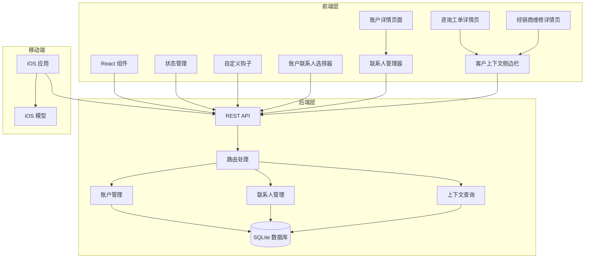

**图表来源**
- [client/src/components/CustomerManagement.tsx](file://client/src/components/CustomerManagement.tsx#L1-L793)
- [client/src/components/AccountContactSelector.tsx](file://client/src/components/AccountContactSelector.tsx#L1-L463)
- [client/src/components/ContactManager.tsx](file://client/src/components/ContactManager.tsx#L1-L519)
- [client/src/components/Service/CustomerContextSidebar.tsx](file://client/src/components/Service/CustomerContextSidebar.tsx#L1-L557)
- [client/src/components/InquiryTickets/InquiryTicketDetailPage.tsx](file://client/src/components/InquiryTickets/InquiryTicketDetailPage.tsx#L450-L471)
- [client/src/components/DealerRepairs/DealerRepairDetailPage.tsx](file://client/src/components/DealerRepairs/DealerRepairDetailPage.tsx#L480-L504)
- [server/service/routes/accounts.js](file://server/service/routes/accounts.js#L1-L1161)
- [server/service/routes/context.js](file://server/service/routes/context.js#L1-L404)

**章节来源**
- [client/src/components/CustomerManagement.tsx](file://client/src/components/CustomerManagement.tsx#L1-L793)
- [client/src/components/AccountContactSelector.tsx](file://client/src/components/AccountContactSelector.tsx#L1-L463)
- [client/src/components/ContactManager.tsx](file://client/src/components/ContactManager.tsx#L1-L519)
- [client/src/components/Service/CustomerContextSidebar.tsx](file://client/src/components/Service/CustomerContextSidebar.tsx#L1-L557)
- [client/src/components/InquiryTickets/InquiryTicketDetailPage.tsx](file://client/src/components/InquiryTickets/InquiryTicketDetailPage.tsx#L450-L471)
- [client/src/components/DealerRepairs/DealerRepairDetailPage.tsx](file://client/src/components/DealerRepairs/DealerRepairDetailPage.tsx#L480-L504)
- [server/service/routes/accounts.js](file://server/service/routes/accounts.js#L1-L1161)
- [server/service/routes/context.js](file://server/service/routes/context.js#L1-L404)

## 核心组件

### 前端组件架构

统一账户联系人管理架构由七个主要前端组件构成：

1. **CustomerManagement** - 主要的客户管理界面（现已现代化）
2. **AccountContactSelector** - 账户联系人选择器组件
3. **ContactManager** - 联系人管理组件
4. **AccountDetailPage** - 账户详情页面
5. **CustomerDetailPage** - 客户详情页面
6. **CustomerContextSidebar** - 客户上下文侧边栏组件（新增，重大升级）
7. **工单详情页面** - InquiryTicketDetailPage 和 DealerRepairDetailPage（集成 CustomerContextSidebar）

### 数据模型设计

系统采用统一的账户联系人数据模型，支持多种账户类型和联系人属性：

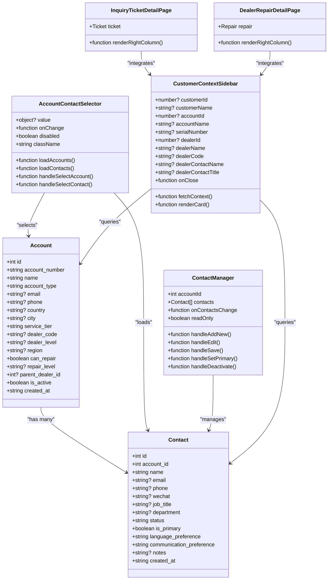

**图表来源**
- [client/src/components/AccountContactSelector.tsx](file://client/src/components/AccountContactSelector.tsx#L18-L45)
- [client/src/components/ContactManager.tsx](file://client/src/components/ContactManager.tsx#L19-L35)
- [client/src/components/Service/CustomerContextSidebar.tsx](file://client/src/components/Service/CustomerContextSidebar.tsx#L9-L21)
- [client/src/components/CustomerManagement.tsx](file://client/src/components/CustomerManagement.tsx#L12-L30)
- [client/src/components/InquiryTickets/InquiryTicketDetailPage.tsx](file://client/src/components/InquiryTickets/InquiryTicketDetailPage.tsx#L450-L471)
- [client/src/components/DealerRepairs/DealerRepairDetailPage.tsx](file://client/src/components/DealerRepairs/DealerRepairDetailPage.tsx#L480-L504)

**章节来源**
- [client/src/components/AccountContactSelector.tsx](file://client/src/components/AccountContactSelector.tsx#L18-L45)
- [client/src/components/ContactManager.tsx](file://client/src/components/ContactManager.tsx#L19-L35)
- [client/src/components/Service/CustomerContextSidebar.tsx](file://client/src/components/Service/CustomerContextSidebar.tsx#L9-L21)
- [client/src/components/CustomerManagement.tsx](file://client/src/components/CustomerManagement.tsx#L12-L30)
- [client/src/components/InquiryTickets/InquiryTicketDetailPage.tsx](file://client/src/components/InquiryTickets/InquiryTicketDetailPage.tsx#L450-L471)
- [client/src/components/DealerRepairs/DealerRepairDetailPage.tsx](file://client/src/components/DealerRepairs/DealerRepairDetailPage.tsx#L480-L504)

## 架构概览

统一账户联系人管理系统的整体架构采用分层设计，确保了良好的可维护性和扩展性：

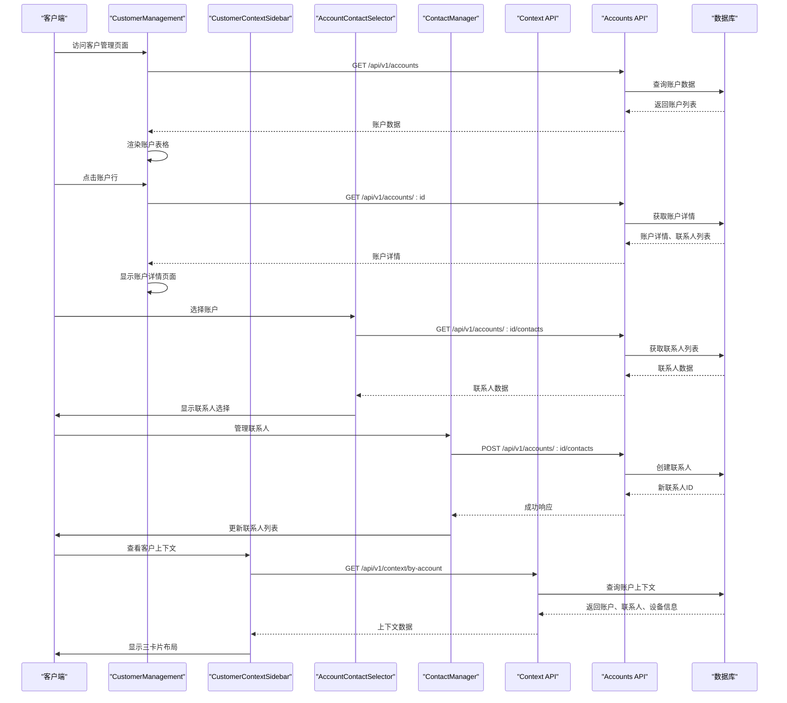

**图表来源**
- [client/src/components/CustomerManagement.tsx](file://client/src/components/CustomerManagement.tsx#L111-L151)
- [client/src/components/AccountContactSelector.tsx](file://client/src/components/AccountContactSelector.tsx#L105-L144)
- [client/src/components/ContactManager.tsx](file://client/src/components/ContactManager.tsx#L103-L166)
- [client/src/components/Service/CustomerContextSidebar.tsx](file://client/src/components/Service/CustomerContextSidebar.tsx#L36-L89)
- [server/service/routes/accounts.js](file://server/service/routes/accounts.js#L50-L170)
- [server/service/routes/context.js](file://server/service/routes/context.js#L165-L305)

## 详细组件分析

### CustomerManagement 组件（现代化版本）

CustomerManagement 是客户管理的核心界面组件，经过重大升级后，现在支持统一的账户联系人管理架构：

#### 功能特性

1. **统一账户管理**
   - 支持账户类型筛选：DEALER/ORGANIZATION/INDIVIDUAL
   - 使用新的 accounts API 替代传统的 customers API
   - 支持账户状态管理：active/inactive/deleted

2. **搜索和筛选**
   - 支持按账户编号、名称、邮箱、电话搜索
   - 支持按地区、服务等级筛选
   - 分页加载机制

3. **CRUD 操作**
   - 创建新账户（包含联系人信息）
   - 编辑现有账户信息
   - 软删除和恢复账户
   - 彻底删除账户

#### 数据流分析

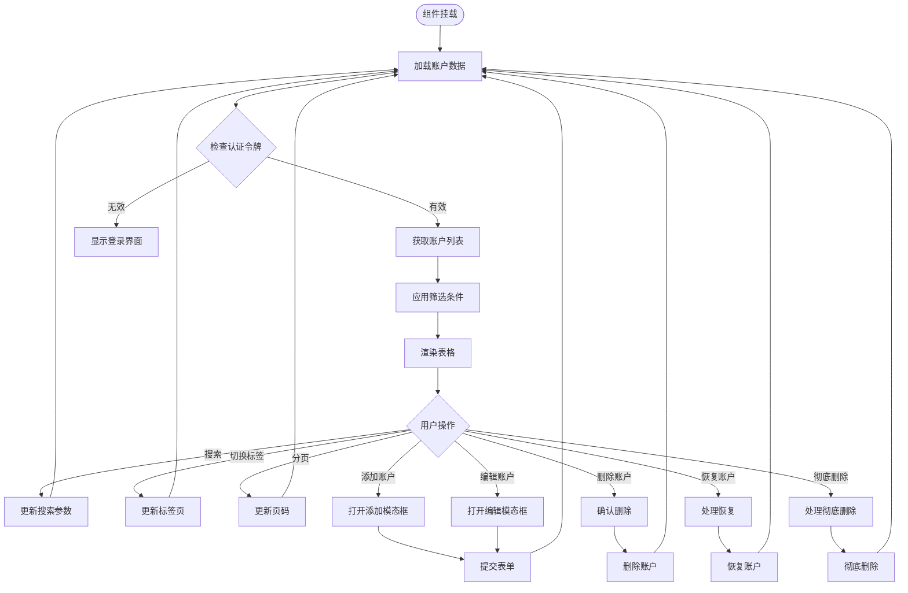

**图表来源**
- [client/src/components/CustomerManagement.tsx](file://client/src/components/CustomerManagement.tsx#L111-L165)

**章节来源**
- [client/src/components/CustomerManagement.tsx](file://client/src/components/CustomerManagement.tsx#L36-L793)

### AccountContactSelector 组件

AccountContactSelector 是一个专门的账户联系人选择器组件，用于工单创建/编辑时选择账户和联系人：

#### 核心功能

1. **账户搜索和选择**
   - 支持账户名称、邮箱、电话的模糊搜索
   - 账户类型图标和颜色标识
   - 账户详情卡片展示

2. **联系人级联加载**
   - 根据选择的账户自动加载联系人列表
   - 支持联系人状态显示（PRIMARY/ACTIVE/INACTIVE）
   - 联系人选择和报告人姓名设置

3. **快速创建**
   - 支持创建新账户的快捷入口
   - 防抖搜索优化用户体验

#### 选择流程

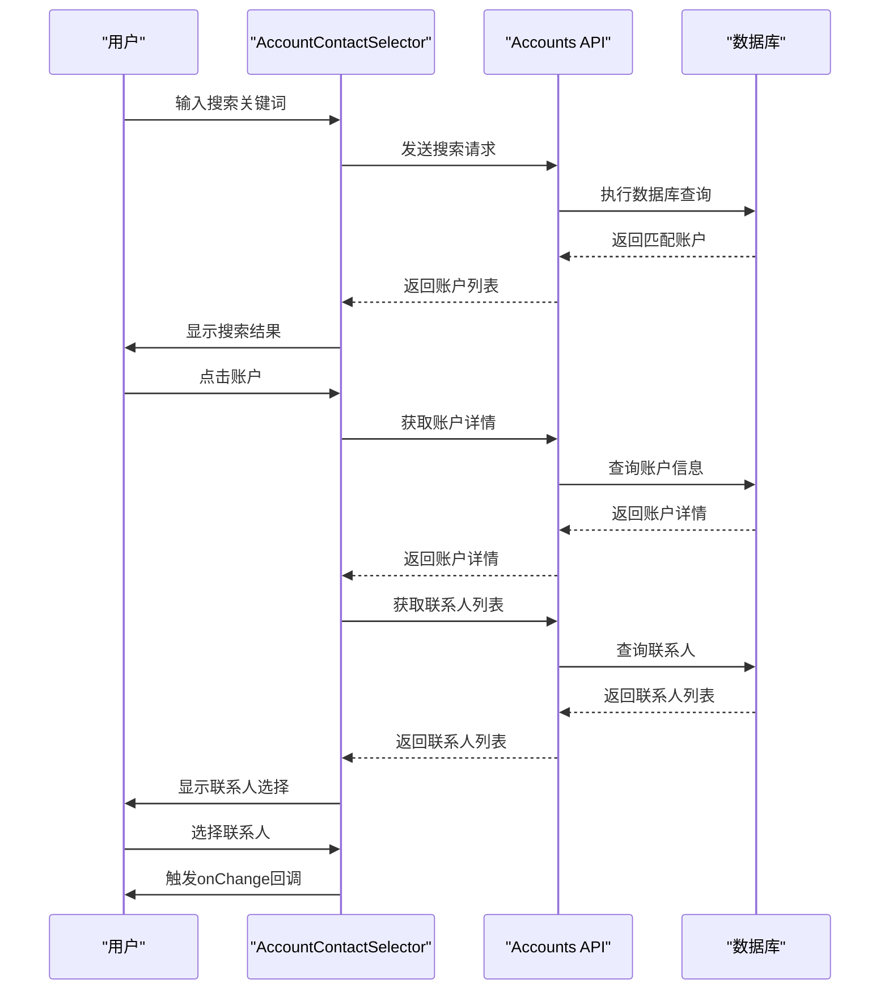

**图表来源**
- [client/src/components/AccountContactSelector.tsx](file://client/src/components/AccountContactSelector.tsx#L105-L144)
- [client/src/components/AccountContactSelector.tsx](file://client/src/components/AccountContactSelector.tsx#L204-L231)

**章节来源**
- [client/src/components/AccountContactSelector.tsx](file://client/src/components/AccountContactSelector.tsx#L82-L463)

### ContactManager 组件

ContactManager 是一个专门的联系人管理组件，用于账户详情页显示和管理联系人：

#### 核心功能

1. **联系人列表管理**
   - 显示联系人列表，按状态排序（PRIMARY > ACTIVE > INACTIVE）
   - 支持联系人状态徽章显示
   - 联系人详情卡片展示

2. **联系人 CRUD 操作**
   - 添加新联系人（支持设置主要联系人）
   - 编辑现有联系人信息
   - 设置主要联系人（自动处理其他联系人的状态）
   - 标记联系人离职（INACTIVE 状态）

3. **表单管理**
   - 完整的联系人信息表单
   - 必填字段验证
   - 错误处理和用户反馈

#### 管理流程

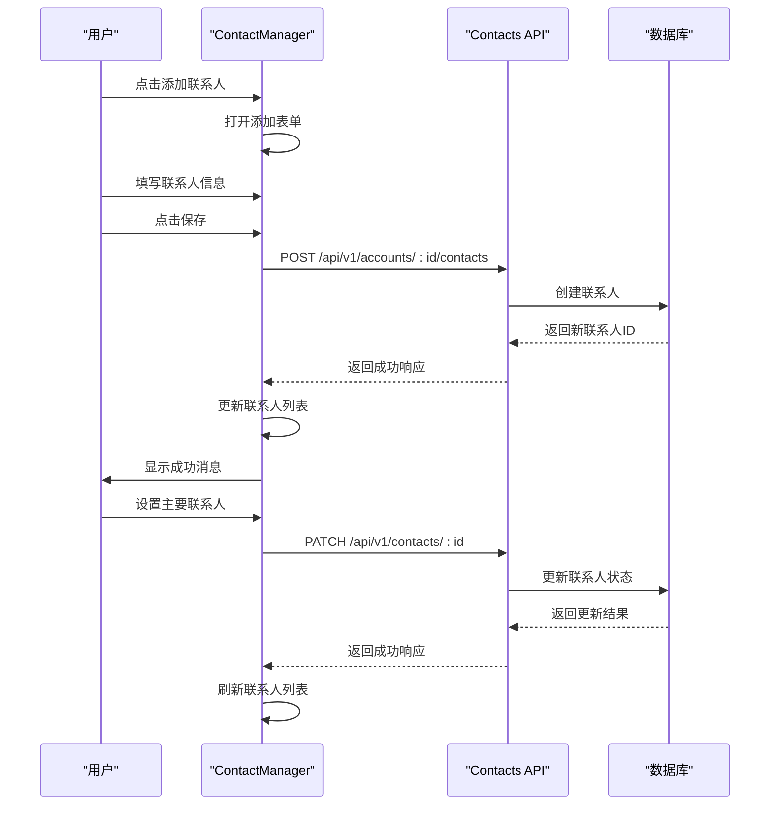

**图表来源**
- [client/src/components/ContactManager.tsx](file://client/src/components/ContactManager.tsx#L103-L166)
- [client/src/components/ContactManager.tsx](file://client/src/components/ContactManager.tsx#L169-L193)

**章节来源**
- [client/src/components/ContactManager.tsx](file://client/src/components/ContactManager.tsx#L60-L519)

### AccountDetailPage 组件

AccountDetailPage 是账户详情页面，集成了 ContactManager 组件：

#### 核心功能

1. **账户信息展示**
   - 账户基本信息卡片
   - 账户类型和状态标识
   - 经销商信息（DEALER 类型）
   - 上级经销商信息（企业客户）

2. **联系人管理**
   - 集成 ContactManager 组件
   - 实时联系人列表更新
   - 联系人状态管理

3. **设备和服务历史**
   - 设备资产管理
   - 服务历史记录
   - 工单历史查询

**章节来源**
- [client/src/components/AccountDetailPage.tsx](file://client/src/components/AccountDetailPage.tsx#L93-L472)

### CustomerContextSidebar 组件（重大架构升级）

CustomerContextSidebar 是一个全新的客户上下文侧边栏组件，提供高级的客户关系管理功能。经过重大架构升级后，现在采用三卡片布局设计：

#### 核心功能

1. **多维度上下文查询**
   - 支持按客户 ID/名称查询
   - 支持按账户 ID/名称查询
   - 支持按设备序列号查询
   - 支持经销商信息查询

2. **三卡片布局设计**
   - **经销商信息卡片**（金色主题）- 展示经销商详细信息和联系人
   - **客户信息卡片**（标准主题）- 展示账户信息和工单统计
   - **设备详情卡片**（蓝色主题）- 展示设备规格和注册附件

3. **高级工单统计**
   - 客户维度工单统计（咨询、RMA、维修）
   - 设备维度工单统计
   - AI 自动生成的客户画像

4. **联系人智能管理**
   - 主要联系人突出显示
   - 联系人展开/收起功能
   - 多联系人状态管理

5. **设备注册附件**
   - 可折叠的部件目录
   - 设备信息可视化
   - 保修状态跟踪

#### 实时上下文切换功能

组件支持实时上下文切换，根据传入的不同参数动态查询相应的数据：

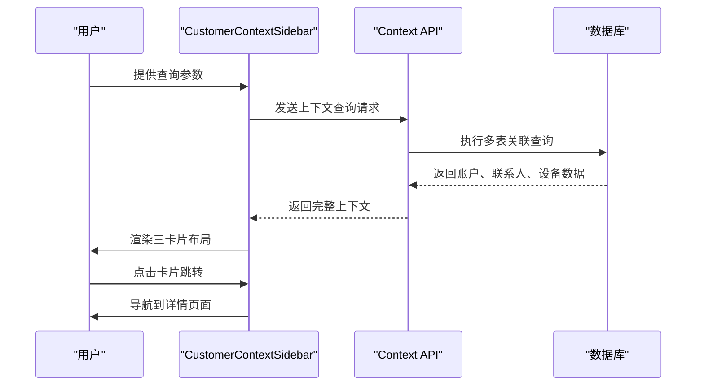

**图表来源**
- [client/src/components/Service/CustomerContextSidebar.tsx](file://client/src/components/Service/CustomerContextSidebar.tsx#L36-L89)
- [server/service/routes/context.js](file://server/service/routes/context.js#L165-L305)

#### 视觉呈现增强

组件采用了增强的视觉设计：
- **金色主题**：经销商卡片使用金色渐变背景和边框
- **标准主题**：客户卡片使用透明度较低的白色背景
- **蓝色主题**：设备卡片使用蓝色渐变背景
- **交互效果**：鼠标悬停时的平滑过渡动画
- **图标系统**：使用 lucide-react 图标库提供一致的视觉语言

#### 上下文查询流程

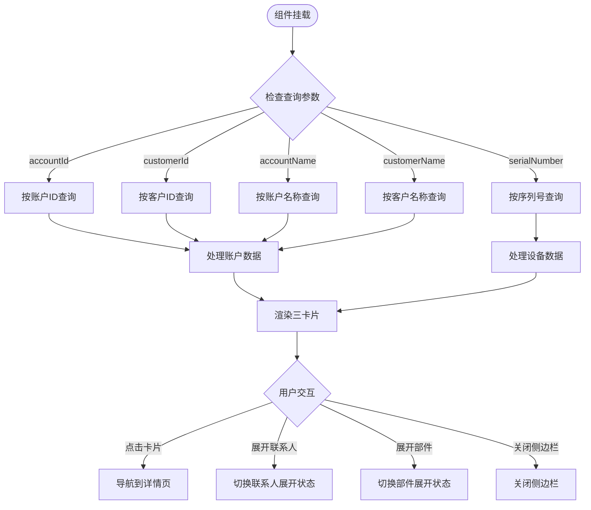

**图表来源**
- [client/src/components/Service/CustomerContextSidebar.tsx](file://client/src/components/Service/CustomerContextSidebar.tsx#L36-L89)
- [client/src/components/Service/CustomerContextSidebar.tsx](file://client/src/components/Service/CustomerContextSidebar.tsx#L314-L386)
- [client/src/components/Service/CustomerContextSidebar.tsx](file://client/src/components/Service/CustomerContextSidebar.tsx#L499-L541)

**章节来源**
- [client/src/components/Service/CustomerContextSidebar.tsx](file://client/src/components/Service/CustomerContextSidebar.tsx#L1-L557)

### 工单详情页面集成

CustomerContextSidebar 已集成到多个工单详情页面中：

#### InquiryTicketDetailPage 集成

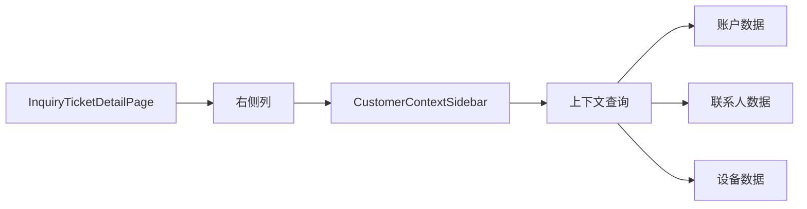

#### DealerRepairDetailPage 集成

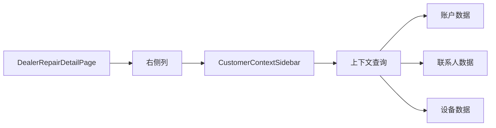

**图表来源**
- [client/src/components/InquiryTickets/InquiryTicketDetailPage.tsx](file://client/src/components/InquiryTickets/InquiryTicketDetailPage.tsx#L450-L471)
- [client/src/components/DealerRepairs/DealerRepairDetailPage.tsx](file://client/src/components/DealerRepairs/DealerRepairDetailPage.tsx#L480-L504)

**章节来源**
- [client/src/components/InquiryTickets/InquiryTicketDetailPage.tsx](file://client/src/components/InquiryTickets/InquiryTicketDetailPage.tsx#L450-L471)
- [client/src/components/DealerRepairs/DealerRepairDetailPage.tsx](file://client/src/components/DealerRepairs/DealerRepairDetailPage.tsx#L480-L504)

### iOS 客户模型

iOS 应用中的客户模型保持向后兼容，但已适配新的统一架构：

#### 数据模型特性

1. **向后兼容**
   - 保持原有的 Customer 模型结构
   - 支持新的账户联系人数据格式
   - 兼容迁移后的数据结构

2. **数据转换**
   - 自动转换账户数据格式
   - 处理联系人信息映射
   - 支持混合数据源

**章节来源**
- [ios/LonghornApp/Models/Customer.swift](file://ios/LonghornApp/Models/Customer.swift#L10-L79)

## 依赖关系分析

### 组件间依赖

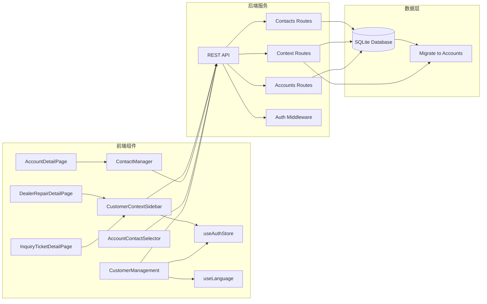

**图表来源**
- [client/src/components/CustomerManagement.tsx](file://client/src/components/CustomerManagement.tsx#L1-L9)
- [client/src/components/AccountContactSelector.tsx](file://client/src/components/AccountContactSelector.tsx#L13-L16)
- [client/src/components/ContactManager.tsx](file://client/src/components/ContactManager.tsx#L14-L16)
- [client/src/components/Service/CustomerContextSidebar.tsx](file://client/src/components/Service/CustomerContextSidebar.tsx#L1-L7)
- [client/src/store/useAuthStore.ts](file://client/src/store/useAuthStore.ts#L1-L30)
- [server/service/routes/accounts.js](file://server/service/routes/accounts.js#L10-L11)
- [server/service/routes/context.js](file://server/service/routes/context.js#L4-L5)
- [server/service/migrations/013_migrate_to_account_contact.sql](file://server/service/migrations/013_migrate_to_account_contact.sql#L1-L4)

### 权限控制机制

系统实现了基于角色的权限控制，支持新的账户联系人架构：

1. **管理员权限**
   - 可访问所有账户数据
   - 可执行删除和恢复操作
   - 可管理所有账户

2. **经销商权限**
   - 仅能访问自己名下的账户
   - 可管理账户下的联系人
   - 无法删除其他经销商的账户

3. **认证集成**
   - 使用 Bearer Token 进行身份验证
   - 在每个 API 请求中包含认证头
   - 支持账户级别的权限控制

**章节来源**
- [client/src/components/CustomerManagement.tsx](file://client/src/components/CustomerManagement.tsx#L37-L38)
- [server/service/routes/accounts.js](file://server/service/routes/accounts.js#L684-L800)

## 性能考虑

### 数据库优化

1. **索引策略**
   - 账户类型索引：`idx_accounts_type`
   - 账户编号索引：`idx_accounts_number`
   - 联系人状态索引：`idx_contacts_status`
   - 地区索引：`idx_accounts_location`

2. **查询优化**
   - 分页查询避免大量数据传输
   - 条件筛选减少不必要的数据加载
   - 连接查询优化关联数据获取
   - 账户-联系人分离查询优化

### 前端性能

1. **懒加载**
   - 账户详情按需加载
   - 联系人列表延迟渲染
   - 模态框内容延迟加载
   - 上下文卡片按需渲染

2. **缓存策略**
   - URL 参数缓存
   - 表单数据临时存储
   - 账户详情缓存
   - 上下文数据缓存

3. **渲染优化**
   - 虚拟滚动处理大量数据
   - 条件渲染减少 DOM 元素
   - 防抖搜索优化 API 调用
   - 卡片动画优化用户体验

4. **三卡片布局优化**
   - 按需渲染卡片内容
   - 展开/收起功能减少初始渲染负载
   - 图标懒加载提升首屏性能

## 故障排除指南

### 常见问题及解决方案

1. **认证失败**
   - 检查 Bearer Token 是否正确传递
   - 验证用户角色权限
   - 确认会话是否过期

2. **数据访问受限**
   - 用户只能访问自己名下的账户
   - 检查 `parent_dealer_id` 条件
   - 验证账户类型过滤

3. **API 调用错误**
   - 检查网络连接状态
   - 验证 API 端点路径
   - 查看服务器日志

4. **账户迁移问题**
   - 确认数据库迁移已完成
   - 检查 accounts 和 contacts 表结构
   - 验证数据完整性

5. **上下文查询失败**
   - 检查查询参数是否正确
   - 验证账户/设备是否存在
   - 确认权限范围

6. **三卡片布局问题**
   - 检查组件 props 传入是否正确
   - 验证数据格式和类型
   - 查看控制台错误信息

### 调试工具

1. **浏览器开发者工具**
   - 网络面板监控 API 调用
   - 控制台查看错误信息
   - 存储面板检查认证状态

2. **服务器日志**
   - 查看数据库查询日志
   - 监控 API 错误信息
   - 跟踪用户操作记录

**章节来源**
- [client/src/components/CustomerManagement.tsx](file://client/src/components/CustomerManagement.tsx#L146-L151)
- [client/src/components/AccountContactSelector.tsx](file://client/src/components/AccountContactSelector.tsx#L119-L124)
- [client/src/components/ContactManager.tsx](file://client/src/components/ContactManager.tsx#L160-L166)
- [client/src/components/Service/CustomerContextSidebar.tsx](file://client/src/components/Service/CustomerContextSidebar.tsx#L160-L168)

## 结论

统一账户联系人管理组件是一个功能完整、架构清晰的客户关系管理解决方案。通过从传统客户管理架构升级为统一的账户联系人架构，并新增 CustomerContextSidebar 组件，系统能够更好地支持复杂的企业级客户关系管理需求。

### 主要优势

1. **统一数据模型**：支持多种账户类型和联系人属性
2. **灵活的权限控制**：基于角色的访问限制和账户级别的权限控制
3. **完整的 CRUD 功能**：支持账户和联系人的全生命周期管理
4. **高级上下文查询**：提供丰富的账户相关信息和工单统计
5. **智能联系人管理**：支持主要联系人识别和状态管理
6. **设备历史可视化**：提供设备注册附件和工单历史
7. **跨平台支持**：Web 和 iOS 应用的数据同步
8. **向后兼容**：保持对现有系统的兼容性
9. **性能优化**：合理的数据库设计和查询优化
10. **重大架构升级**：三卡片布局设计、实时上下文切换、增强的视觉呈现

### 技术特点

1. **模块化设计**：清晰的组件分离和职责划分
2. **响应式架构**：支持实时数据更新和状态管理
3. **安全性考虑**：完善的认证授权机制
4. **性能优化**：合理的数据库设计和查询优化
5. **用户体验**：直观的界面设计和交互流程
6. **可扩展性**：支持未来功能扩展和业务发展

**重大架构升级** 新增的 CustomerContextSidebar 组件为 Longhorn 服务管理系统提供了强大的客户关系管理能力，通过三卡片布局设计、高级工单统计和智能联系人管理，大大提升了客户服务效率和体验。该组件为后续的功能扩展和业务发展奠定了坚实基础。新的架构不仅提升了系统的灵活性和可维护性，还为未来的业务发展提供了更大的空间。

经过重大架构升级的 CustomerContextSidebar 组件现在具备了：
- **实时上下文切换**：支持多种查询方式的即时响应
- **增强的视觉呈现**：三色主题设计提供清晰的信息层次
- **智能数据展示**：AI 生成的客户画像和工单统计
- **交互式用户体验**：展开/收起功能和卡片导航
- **完整的数据覆盖**：账户、联系人、设备的全面信息

这些改进使得 Longhorn 服务管理系统在客户关系管理方面达到了新的高度，为用户提供了一个强大而直观的客户管理工具。