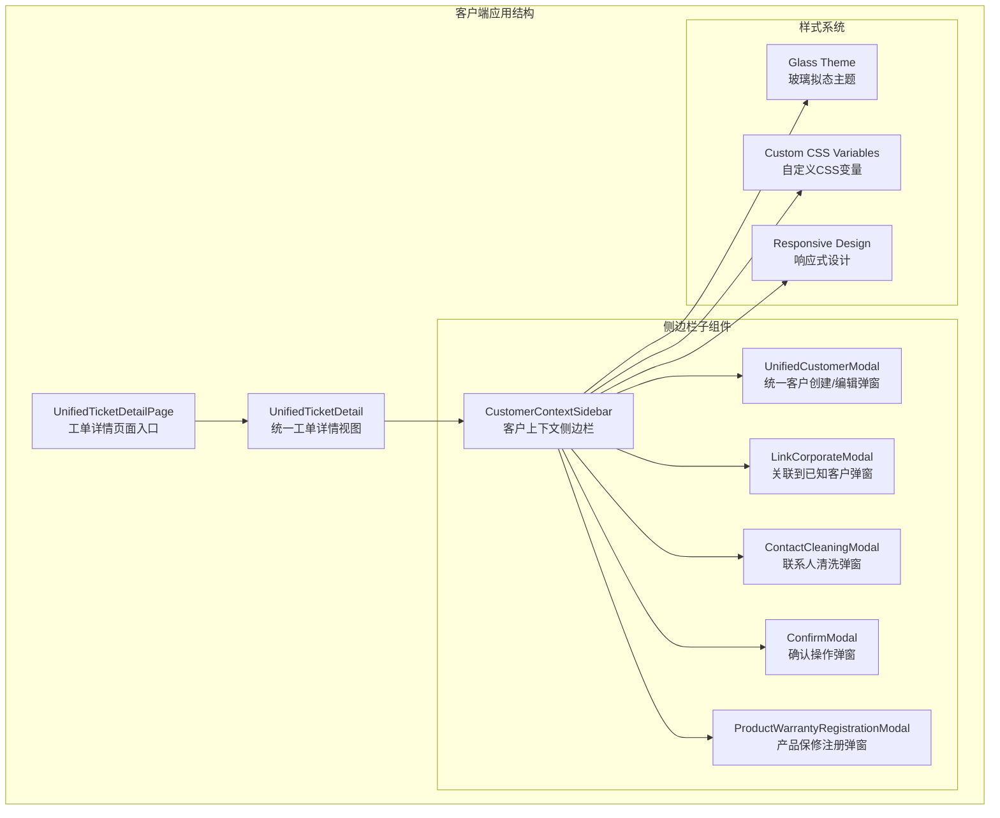
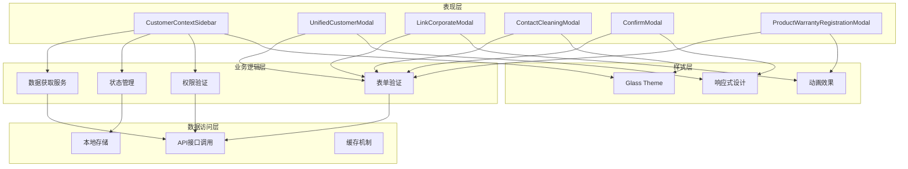
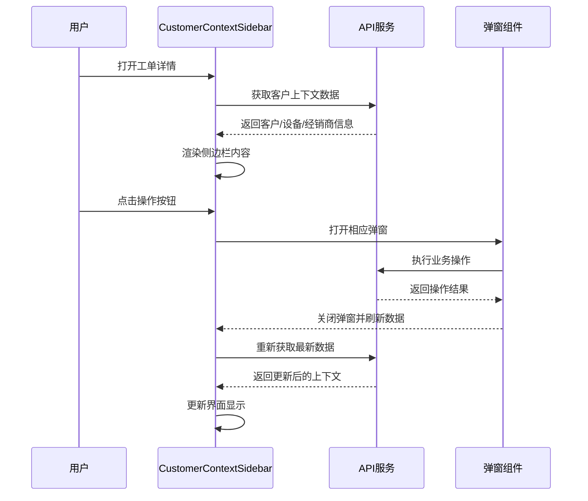
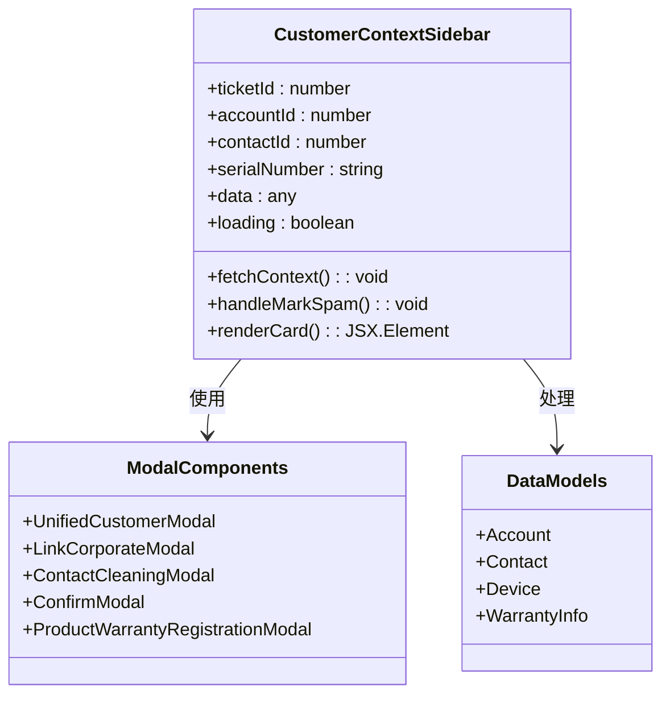
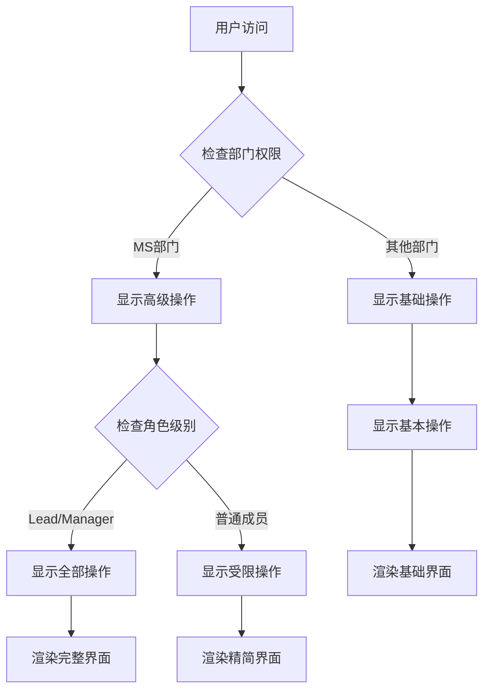
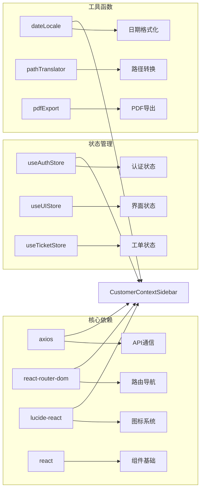

# 客户上下文侧边栏

<cite>
**本文档引用的文件**
- [CustomerContextSidebar.tsx](file://client/src/components/Service/CustomerContextSidebar.tsx)
- [UnifiedCustomerModal.tsx](file://client/src/components/Service/UnifiedCustomerModal.tsx)
- [LinkCorporateModal.tsx](file://client/src/components/Service/LinkCorporateModal.tsx)
- [ContactCleaningModal.tsx](file://client/src/components/Service/ContactCleaningModal.tsx)
- [ConfirmModal.tsx](file://client/src/components/Service/ConfirmModal.tsx)
- [ProductWarrantyRegistrationModal.tsx](file://client/src/components/Service/ProductWarrantyRegistrationModal.tsx)
- [UnifiedTicketDetail.tsx](file://client/src/components/Workspace/UnifiedTicketDetail.tsx)
- [UnifiedTicketDetailPage.tsx](file://client/src/components/Service/UnifiedTicketDetailPage.tsx)
</cite>

## 目录
1. [简介](#简介)
2. [项目结构](#项目结构)
3. [核心组件](#核心组件)
4. [架构概览](#架构概览)
5. [详细组件分析](#详细组件分析)
6. [依赖关系分析](#依赖关系分析)
7. [性能考虑](#性能考虑)
8. [故障排除指南](#故障排除指南)
9. [结论](#结论)

## 简介

客户上下文侧边栏是 Longhorn 服务管理系统中的一个关键功能模块，旨在为工单处理人员提供全面的客户相关信息展示和操作界面。该组件集成了客户信息、设备详情、联系人管理和多种业务操作功能，通过直观的界面设计和丰富的交互体验，帮助客服人员快速了解客户背景、设备状态并执行相应的业务操作。

该系统采用现代化的 React 架构，结合 TypeScript 类型安全和 TailwindCSS 样式系统，实现了高度可定制和响应式的用户界面。组件设计遵循 macOS 26 风格，提供了优雅的视觉效果和流畅的用户体验。

## 项目结构

Longhorn 项目采用模块化的前端架构，客户上下文侧边栏位于服务组件目录下，与工单详情页面紧密集成：



**图表来源**
- [UnifiedTicketDetailPage.tsx:1-38](file://client/src/components/Service/UnifiedTicketDetailPage.tsx#L1-L38)
- [UnifiedTicketDetail.tsx:1-800](file://client/src/components/Workspace/UnifiedTicketDetail.tsx#L1-L800)
- [CustomerContextSidebar.tsx:1-954](file://client/src/components/Service/CustomerContextSidebar.tsx#L1-L954)

**章节来源**
- [UnifiedTicketDetailPage.tsx:1-38](file://client/src/components/Service/UnifiedTicketDetailPage.tsx#L1-L38)
- [UnifiedTicketDetail.tsx:1-800](file://client/src/components/Workspace/UnifiedTicketDetail.tsx#L1-L800)

## 核心组件

### 客户上下文侧边栏主组件

CustomerContextSidebar 是整个功能的核心组件，负责整合和展示所有客户相关信息。该组件具有以下关键特性：

#### 数据获取机制
- **并行API调用**：同时获取客户信息、设备信息和经销商信息
- **智能缓存策略**：避免重复请求相同数据
- **错误处理**：优雅处理API调用失败的情况

#### 界面布局设计
- **三段式卡片布局**：经销商信息、客户信息、设备详情
- **可折叠内容**：支持展开/折叠详细信息
- **状态指示器**：清晰显示各种业务状态

#### 业务操作集成
- **联系人管理**：支持联系人清洗和创建
- **客户关联**：将访客与现有客户关联
- **设备注册**：为未入库设备创建产品记录

**章节来源**
- [CustomerContextSidebar.tsx:36-156](file://client/src/components/Service/CustomerContextSidebar.tsx#L36-L156)
- [CustomerContextSidebar.tsx:261-954](file://client/src/components/Service/CustomerContextSidebar.tsx#L261-L954)

### 统一客户创建/编辑弹窗

UnifiedCustomerModal 提供了完整的客户信息管理功能，支持多种创建模式：

#### 多模式支持
- **访客转客户模式**：针对未知访客的简化创建流程
- **完整客户档案模式**：标准的客户信息录入
- **关联客户模式**：将访客信息关联到现有客户

#### 智能表单处理
- **动态字段显示**：根据客户类型显示相应字段
- **联系人管理**：支持添加多个联系人
- **权限控制**：基于用户角色限制操作权限

**章节来源**
- [UnifiedCustomerModal.tsx:75-318](file://client/src/components/Service/UnifiedCustomerModal.tsx#L75-L318)
- [UnifiedCustomerModal.tsx:48-793](file://client/src/components/Service/UnifiedCustomerModal.tsx#L48-L793)

## 架构概览

客户上下文侧边栏采用了清晰的分层架构设计，确保了代码的可维护性和扩展性：



**图表来源**
- [CustomerContextSidebar.tsx:1-954](file://client/src/components/Service/CustomerContextSidebar.tsx#L1-L954)
- [UnifiedCustomerModal.tsx:1-793](file://client/src/components/Service/UnifiedCustomerModal.tsx#L1-L793)
- [LinkCorporateModal.tsx:1-587](file://client/src/components/Service/LinkCorporateModal.tsx#L1-L587)

### 数据流架构



**图表来源**
- [CustomerContextSidebar.tsx:59-156](file://client/src/components/Service/CustomerContextSidebar.tsx#L59-L156)
- [UnifiedTicketDetail.tsx:601-647](file://client/src/components/Workspace/UnifiedTicketDetail.tsx#L601-L647)

## 详细组件分析

### 客户上下文侧边栏组件

#### 核心功能实现

CustomerContextSidebar 组件通过精心设计的状态管理和条件渲染，实现了复杂的数据展示和业务逻辑：



**图表来源**
- [CustomerContextSidebar.tsx:14-58](file://client/src/components/Service/CustomerContextSidebar.tsx#L14-L58)
- [CustomerContextSidebar.tsx:36-41](file://client/src/components/Service/CustomerContextSidebar.tsx#L36-L41)

#### 状态管理机制

组件内部实现了复杂的状态管理，包括：

- **数据状态**：管理从API获取的各种数据
- **加载状态**：控制加载指示器的显示
- **展开状态**：管理各个卡片的展开/折叠状态
- **模态框状态**：控制各种弹窗的显示和隐藏

#### 权限控制实现

系统实现了多层次的权限控制机制：



**图表来源**
- [CustomerContextSidebar.tsx:365-410](file://client/src/components/Service/CustomerContextSidebar.tsx#L365-L410)

**章节来源**
- [CustomerContextSidebar.tsx:42-58](file://client/src/components/Service/CustomerContextSidebar.tsx#L42-L58)
- [CustomerContextSidebar.tsx:231-239](file://client/src/components/Service/CustomerContextSidebar.tsx#L231-L239)

### 弹窗组件系统

#### 统一客户创建/编辑弹窗

UnifiedCustomerModal 提供了高度灵活的客户管理功能：

##### 表单字段动态生成
- **客户类型驱动**：根据客户类型动态显示相关字段
- **经销商特殊字段**：为经销商显示等级、维修能力等专属字段
- **联系人管理**：支持添加、删除和编辑联系人信息

##### 数据同步机制
- **实时搜索**：支持客户名称和联系方式的实时搜索
- **数据验证**：在提交前进行完整的数据验证
- **错误处理**：提供友好的错误提示和解决方案

**章节来源**
- [UnifiedCustomerModal.tsx:90-168](file://client/src/components/Service/UnifiedCustomerModal.tsx#L90-L168)
- [UnifiedCustomerModal.tsx:197-318](file://client/src/components/Service/UnifiedCustomerModal.tsx#L197-L318)

#### 关联到已知客户弹窗

LinkCorporateModal 实现了访客与现有客户的智能关联功能：

##### 智能搜索算法
- **多字段搜索**：支持按名称、编号、联系方式等多种方式搜索
- **防抖机制**：优化搜索性能，避免频繁API调用
- **结果排序**：根据匹配度和相关性排序搜索结果

##### 联系人选择流程
- **账户选择**：用户可以选择合适的客户账户
- **联系人关联**：支持选择具体的联系人或使用访客信息
- **操作确认**：提供清晰的操作确认和回滚机制

**章节来源**
- [LinkCorporateModal.tsx:68-125](file://client/src/components/Service/LinkCorporateModal.tsx#L68-L125)
- [LinkCorporateModal.tsx:127-167](file://client/src/components/Service/LinkCorporateModal.tsx#L127-L167)

### 数据模型和类型定义

系统使用TypeScript定义了完整的数据模型：

#### 客户信息模型
```typescript
interface Account {
    id: number;
    name: string;
    account_type: 'DEALER' | 'ORGANIZATION' | 'INDIVIDUAL';
    email?: string;
    phone?: string;
    country?: string;
    city?: string;
    service_tier?: string;
    primary_contact_name?: string;
    parent_dealer_id?: number;
}
```

#### 设备信息模型
```typescript
interface Device {
    id: number;
    serial_number: string;
    model_name: string;
    product_family: string;
    firmware_version: string;
    warranty_status: string;
    is_unregistered: boolean;
}
```

#### 工单上下文模型
```typescript
interface TicketContext {
    ticketId?: number;
    accountId?: number;
    contactId?: number;
    reporterSnapshot?: any;
    serialNumber?: string;
    customerName?: string;
    contactName?: string;
    dealerId?: number;
    dealerName?: string;
}
```

**章节来源**
- [LinkCorporateModal.tsx:8-31](file://client/src/components/Service/LinkCorporateModal.tsx#L8-L31)
- [CustomerContextSidebar.tsx:14-34](file://client/src/components/Service/CustomerContextSidebar.tsx#L14-L34)

## 依赖关系分析

### 组件间依赖关系



**图表来源**
- [CustomerContextSidebar.tsx:1-12](file://client/src/components/Service/CustomerContextSidebar.tsx#L1-L12)
- [UnifiedTicketDetail.tsx:10-34](file://client/src/components/Workspace/UnifiedTicketDetail.tsx#L10-L34)

### 外部API依赖

系统依赖多个后端API服务来获取和更新数据：

#### 上下文数据API
- `/api/v1/context/by-account`：获取客户和设备上下文
- `/api/v1/context/by-serial-number`：通过序列号获取设备信息

#### 客户管理API
- `/api/v1/accounts`：客户信息管理
- `/api/v1/contacts`：联系人信息管理

#### 工单操作API
- `/api/v1/tickets/{id}/clean-contact`：联系人清洗
- `/api/v1/tickets/{id}/mark-spam`：标记垃圾工单

**章节来源**
- [CustomerContextSidebar.tsx:73-135](file://client/src/components/Service/CustomerContextSidebar.tsx#L73-L135)
- [UnifiedCustomerModal.tsx:231-310](file://client/src/components/Service/UnifiedCustomerModal.tsx#L231-L310)

## 性能考虑

### 优化策略

#### 并行数据加载
系统采用 Promise.allSettled 实现并行API调用，显著提升了数据加载速度：

```javascript
const promises = [];

// 并行发起多个API请求
promises.push(axios.get(url1));
promises.push(axios.get(url2));
promises.push(axios.get(url3));

await Promise.allSettled(promises);
```

#### 智能缓存机制
- **内存缓存**：避免重复请求相同数据
- **条件渲染**：只有在需要时才渲染复杂组件
- **懒加载**：弹窗组件按需加载

#### 内存管理
- **组件卸载清理**：及时清理事件监听器和定时器
- **状态重置**：在组件卸载时重置相关状态
- **引用优化**：使用useCallback和useMemo优化函数引用

### 性能监控

系统实现了完善的性能监控机制：

- **加载时间统计**：跟踪API调用和渲染时间
- **内存使用监控**：监控组件内存占用情况
- **错误日志记录**：记录性能相关的错误信息

## 故障排除指南

### 常见问题和解决方案

#### 数据加载失败
**问题症状**：侧边栏显示"暂无上下文信息"
**可能原因**：
- API服务不可用
- 网络连接问题
- 权限不足

**解决方案**：
1. 检查网络连接状态
2. 验证用户权限
3. 查看API响应状态码
4. 重新加载页面

#### 模态框无法打开
**问题症状**：点击按钮无反应
**可能原因**：
- 状态管理异常
- 权限验证失败
- DOM元素未正确渲染

**解决方案**：
1. 检查控制台错误信息
2. 验证用户权限
3. 确认状态变量正确设置
4. 重新初始化组件

#### 数据同步问题
**问题症状**：更新后界面未反映最新数据
**可能原因**：
- 缺少数据刷新
- 状态更新不完整
- 缓存数据未清除

**解决方案**：
1. 调用数据刷新函数
2. 确认所有状态都已更新
3. 清除相关缓存
4. 重新获取数据

**章节来源**
- [CustomerContextSidebar.tsx:151-156](file://client/src/components/Service/CustomerContextSidebar.tsx#L151-L156)
- [UnifiedCustomerModal.tsx:312-318](file://client/src/components/Service/UnifiedCustomerModal.tsx#L312-L318)

### 调试技巧

#### 开发者工具使用
- **React DevTools**：检查组件状态和props
- **Network面板**：监控API调用和响应
- **Console面板**：查看错误日志和警告信息

#### 日志记录最佳实践
- **关键操作日志**：记录重要的用户操作
- **错误捕获**：确保所有异常都被妥善处理
- **性能指标**：记录关键的性能数据

## 结论

客户上下文侧边栏是 Longhorn 服务管理系统中的核心功能模块，通过精心设计的架构和丰富的功能特性，为客服人员提供了强大而易用的客户信息管理工具。

### 主要优势

1. **用户体验优秀**：采用现代化的设计理念和交互模式
2. **功能完整性**：涵盖了客户服务的各个方面
3. **扩展性强**：模块化设计便于功能扩展和维护
4. **性能优异**：优化的数据加载和渲染机制

### 技术特色

- **类型安全**：完整的TypeScript类型定义
- **状态管理**：清晰的状态管理和数据流
- **权限控制**：细粒度的权限管理和安全控制
- **响应式设计**：适配各种设备和屏幕尺寸

### 未来发展方向

1. **AI集成**：集成人工智能助手提供智能建议
2. **移动端优化**：进一步优化移动端用户体验
3. **数据分析**：增强数据分析和报表功能
4. **自动化流程**：引入更多自动化处理流程

该组件系统展现了现代Web应用开发的最佳实践，为类似的企业服务管理系统提供了优秀的参考模板。