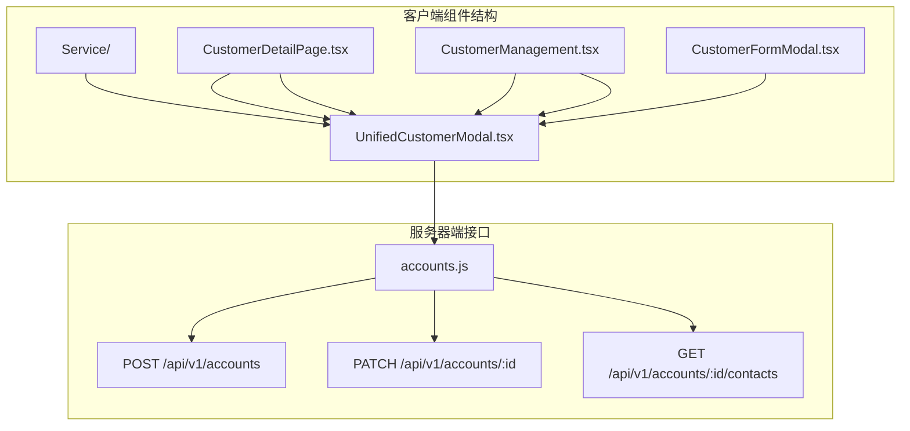
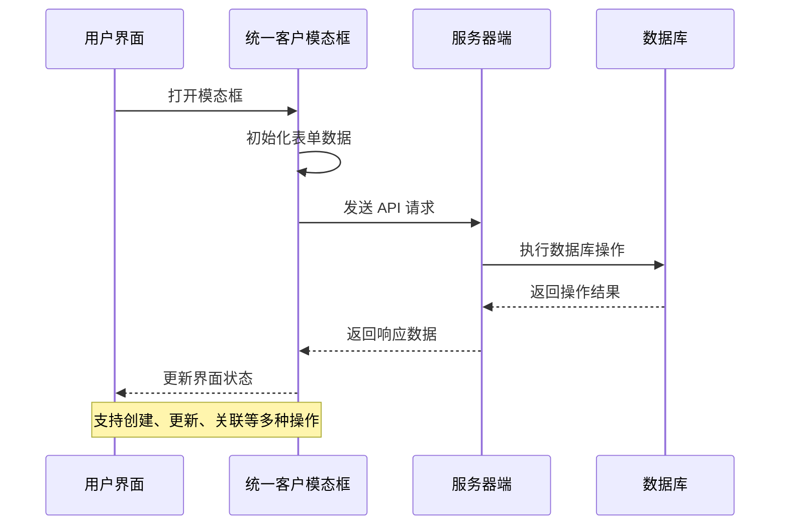
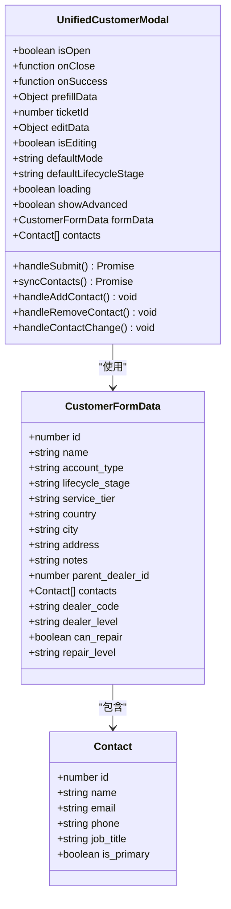
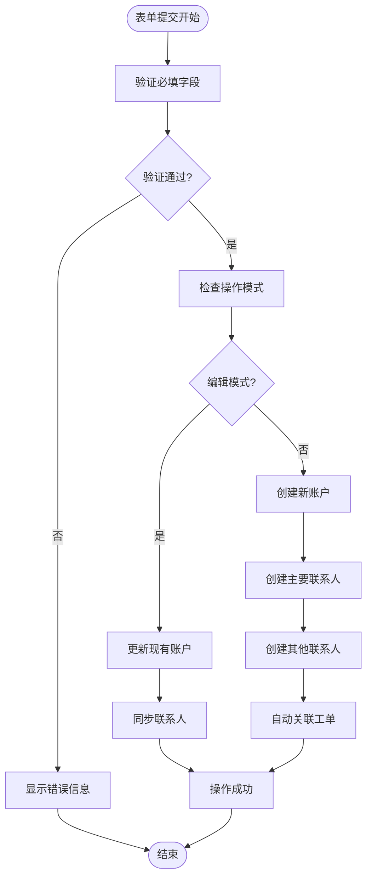
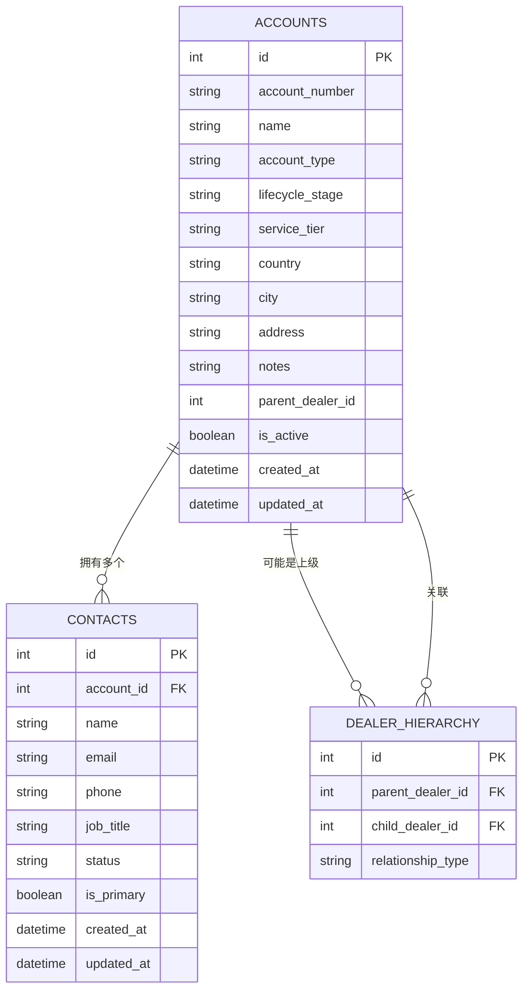
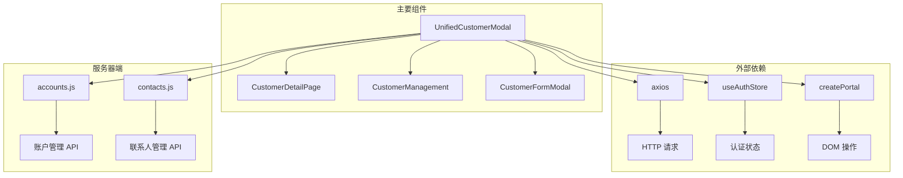

# 统一客户模态框

<cite>
**本文档引用的文件**
- [UnifiedCustomerModal.tsx](file://client/src/components/Service/UnifiedCustomerModal.tsx)
- [CustomerFormModal.tsx](file://client/src/components/CustomerFormModal.tsx)
- [CustomerDetailPage.tsx](file://client/src/components/CustomerDetailPage.tsx)
- [CustomerManagement.tsx](file://client/src/components/CustomerManagement.tsx)
- [accounts.js](file://server/service/routes/accounts.js)
- [index.css](file://client/src/index.css)
- [uiux.md](file://.agent/workflows/uiux.md)
</cite>

## 目录
1. [简介](#简介)
2. [项目结构](#项目结构)
3. [核心组件](#核心组件)
4. [架构概览](#架构概览)
5. [详细组件分析](#详细组件分析)
6. [依赖关系分析](#依赖关系分析)
7. [性能考虑](#性能考虑)
8. [故障排除指南](#故障排除指南)
9. [结论](#结论)

## 简介

统一客户模态框是 Longhorn 服务管理系统中的核心组件，旨在提供一致的客户管理体验。该组件支持多种使用场景，包括工单详情页的访客添加、客户档案页面的新建以及关联客户弹窗中的新客户创建。

该模态框采用 macOS26 设计风格，使用 Kine Yellow (#FFD700) 作为主题色，实现了经销商、机构客户和个人客户的统一管理。通过左右分栏布局和高级选项折叠功能，提供了直观易用的用户体验。

## 项目结构

Longhorn 项目的前端架构采用模块化设计，统一客户模态框位于 Service 组件目录下，与其他相关组件形成完整的客户管理体系：



**图表来源**
- [UnifiedCustomerModal.tsx:1-104](file://client/src/components/Service/UnifiedCustomerModal.tsx#L1-L104)
- [CustomerDetailPage.tsx:72-120](file://client/src/components/CustomerDetailPage.tsx#L72-L120)
- [CustomerManagement.tsx:37-90](file://client/src/components/CustomerManagement.tsx#L37-L90)

**章节来源**
- [UnifiedCustomerModal.tsx:1-104](file://client/src/components/Service/UnifiedCustomerModal.tsx#L1-L104)
- [CustomerDetailPage.tsx:72-120](file://client/src/components/CustomerDetailPage.tsx#L72-L120)
- [CustomerManagement.tsx:37-90](file://client/src/components/CustomerManagement.tsx#L37-L90)

## 核心组件

### 统一客户模态框 (UnifiedCustomerModal)

统一客户模态框是整个客户管理系统的中枢组件，支持三种主要模式：

1. **简化模式**：用于工单详情页的访客添加
2. **完整模式**：用于客户档案页面的新建
3. **编辑模式**：用于现有客户的修改

该组件具有以下关键特性：

- **响应式设计**：支持 900px 宽度的固定布局
- **macOS26 风格**：采用毛玻璃效果和圆角设计
- **主题色彩**：使用 Kine Yellow (#FFD700) 作为主要强调色
- **双面板布局**：左侧基本信息面板，右侧联系人列表
- **高级选项折叠**：通过 ChevronDown/ChevronUp 图标控制展开/收起

**章节来源**
- [UnifiedCustomerModal.tsx:1-793](file://client/src/components/Service/UnifiedCustomerModal.tsx#L1-L793)

### 客户表单模态框 (CustomerFormModal)

客户表单模态框提供了传统的标签页式界面，支持：

- **标签页导航**：基本信息和联系人信息两个标签
- **国际化支持**：通过 useLanguage hook 实现多语言
- **表单验证**：确保必填字段的完整性
- **联系人管理**：支持添加、删除和编辑联系人

**章节来源**
- [CustomerFormModal.tsx:1-530](file://client/src/components/CustomerFormModal.tsx#L1-L530)

## 架构概览

统一客户模态框在整个系统中的位置和交互关系如下：



**图表来源**
- [UnifiedCustomerModal.tsx:198-318](file://client/src/components/Service/UnifiedCustomerModal.tsx#L198-L318)
- [accounts.js:203-285](file://server/service/routes/accounts.js#L203-L285)

系统架构的关键特点：

1. **前后端分离**：前端负责用户交互，后端处理业务逻辑
2. **RESTful API**：使用标准 HTTP 方法进行数据操作
3. **状态管理**：通过 props 和回调函数传递状态
4. **错误处理**：统一的错误捕获和用户反馈机制

**章节来源**
- [UnifiedCustomerModal.tsx:198-318](file://client/src/components/Service/UnifiedCustomerModal.tsx#L198-L318)
- [accounts.js:203-285](file://server/service/routes/accounts.js#L203-L285)

## 详细组件分析

### 统一客户模态框类图



**图表来源**
- [UnifiedCustomerModal.tsx:19-72](file://client/src/components/Service/UnifiedCustomerModal.tsx#L19-L72)

### 表单提交流程



**图表来源**
- [UnifiedCustomerModal.tsx:198-318](file://client/src/components/Service/UnifiedCustomerModal.tsx#L198-L318)
- [UnifiedCustomerModal.tsx:320-362](file://client/src/components/Service/UnifiedCustomerModal.tsx#L320-L362)

### 数据模型关系



**图表来源**
- [accounts.js:254-285](file://server/service/routes/accounts.js#L254-L285)

**章节来源**
- [UnifiedCustomerModal.tsx:198-362](file://client/src/components/Service/UnifiedCustomerModal.tsx#L198-L362)
- [accounts.js:254-285](file://server/service/routes/accounts.js#L254-L285)

## 依赖关系分析

### 组件间依赖关系



**图表来源**
- [UnifiedCustomerModal.tsx:13-17](file://client/src/components/Service/UnifiedCustomerModal.tsx#L13-L17)
- [CustomerDetailPage.tsx:72-8](file://client/src/components/CustomerDetailPage.tsx#L72-L8)

### 样式和主题系统

统一客户模态框严格遵循 macOS26 设计规范，使用 CSS 自定义属性实现主题切换：

```mermaid
graph LR
subgraph "主题系统"
A[:root] --> B[暗色主题]
A --> C[亮色主题]
B --> D[--accent-blue: #FFD700]
C --> E[--accent-blue: #E6BD00]
B --> F[--glass-bg: rgba(28, 28, 30, 0.75)]
C --> G[--glass-bg: rgba(255, 255, 255, 0.75)]
end
subgraph "组件样式"
H[模态框背景] --> I[--modal-bg]
H --> J[--modal-overlay]
K[玻璃效果] --> L[--glass-bg]
K --> M[--glass-shadow]
end
D --> H
E --> H
F --> K
G --> K
```

**图表来源**
- [index.css:11-100](file://client/src/index.css#L11-L100)
- [index.css:102-189](file://client/src/index.css#L102-L189)

**章节来源**
- [index.css:11-189](file://client/src/index.css#L11-L189)
- [uiux.md:1-7](file://.agent/workflows/uiux.md#L1-L7)

## 性能考虑

### 渲染优化策略

1. **条件渲染**：只有在 isOpen 为 true 时才渲染模态框内容
2. **状态最小化**：使用 useState 钩子管理必要的状态
3. **事件委托**：通过 props 传递回调函数减少事件绑定
4. **内存管理**：使用 createPortal 直接挂载到 body，避免 DOM 树过深

### 网络请求优化

1. **批量操作**：编辑模式下一次性同步所有联系人变更
2. **缓存策略**：利用 axios 的内置缓存机制
3. **错误重试**：实现基本的错误处理和用户反馈
4. **并发控制**：限制同时进行的 API 调用数量

## 故障排除指南

### 常见问题及解决方案

| 问题类型 | 症状 | 可能原因 | 解决方案 |
|---------|------|----------|----------|
| 表单验证错误 | 提交时显示错误信息 | 必填字段为空 | 确保客户名称和联系人信息完整 |
| API 调用失败 | 操作失败提示 | 网络连接或权限问题 | 检查网络状态和用户权限 |
| 数据同步问题 | 编辑后数据未更新 | 并发更新冲突 | 实施乐观锁或重新加载数据 |
| 样式显示异常 | 模态框样式错乱 | 主题切换问题 | 检查 CSS 变量和主题设置 |

### 调试技巧

1. **开发者工具**：使用浏览器开发者工具监控网络请求
2. **状态检查**：通过 React DevTools 检查组件状态
3. **日志记录**：在关键节点添加 console.log 输出
4. **错误边界**：实现错误边界组件捕获异常

**章节来源**
- [UnifiedCustomerModal.tsx:312-318](file://client/src/components/Service/UnifiedCustomerModal.tsx#L312-L318)

## 结论

统一客户模态框作为 Longhorn 服务管理系统的核心组件，成功实现了以下目标：

1. **一致性**：为用户提供统一的客户管理体验
2. **灵活性**：支持多种使用场景和操作模式
3. **可扩展性**：基于模块化设计便于功能扩展
4. **用户体验**：遵循 macOS26 设计规范，提供直观的操作界面

该组件通过合理的架构设计和严格的代码规范，为整个客户管理体系奠定了坚实的基础。未来可以考虑进一步优化性能表现，增强国际化支持，并扩展更多客户管理功能。