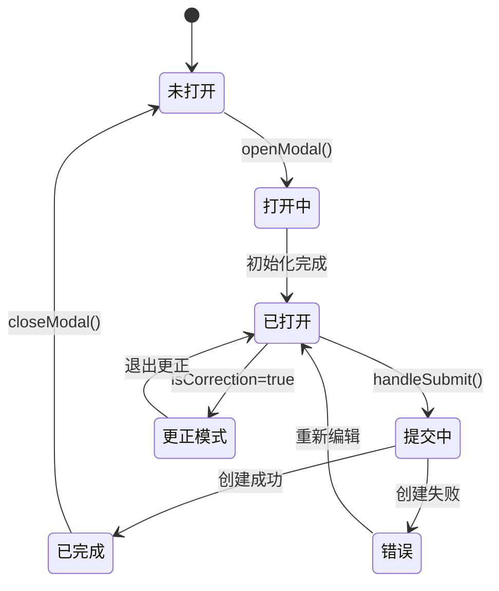
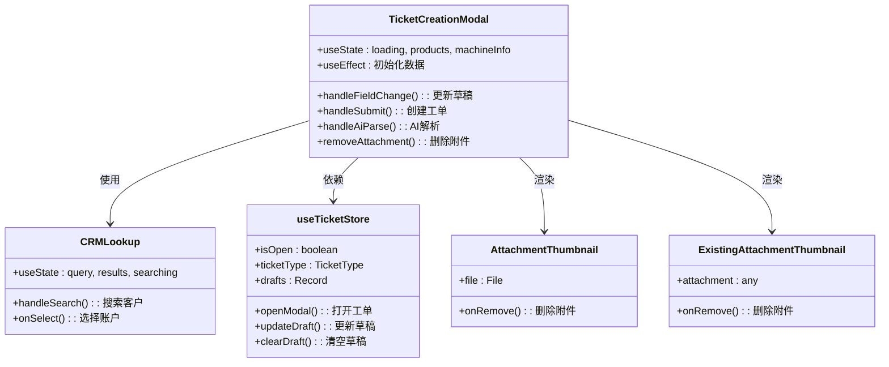
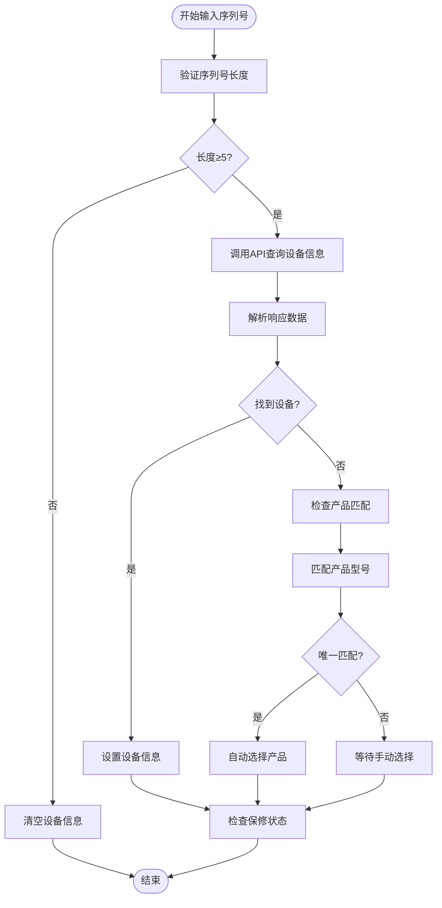
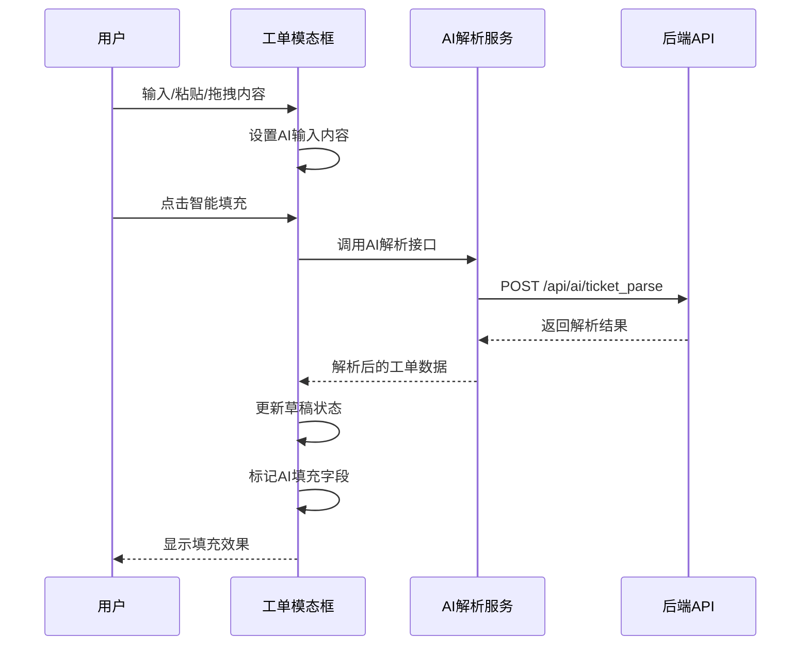
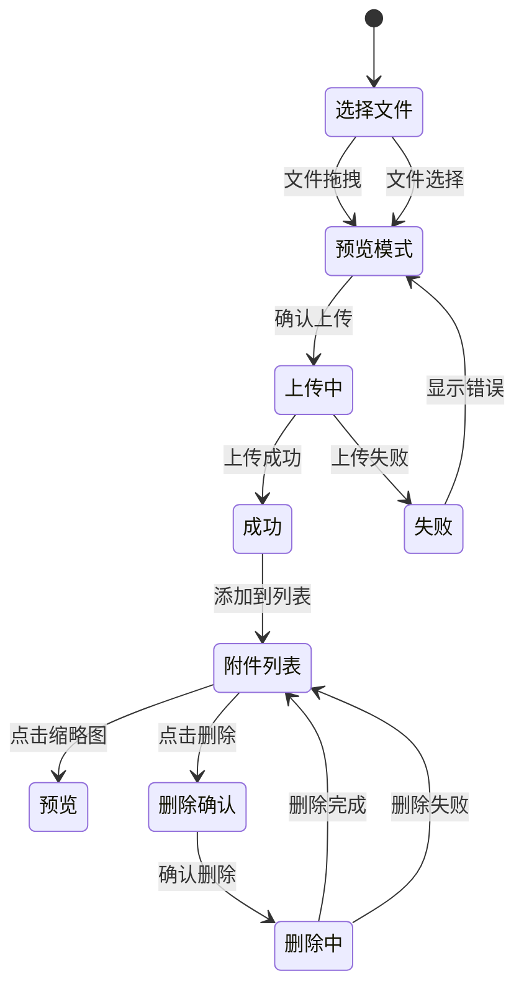
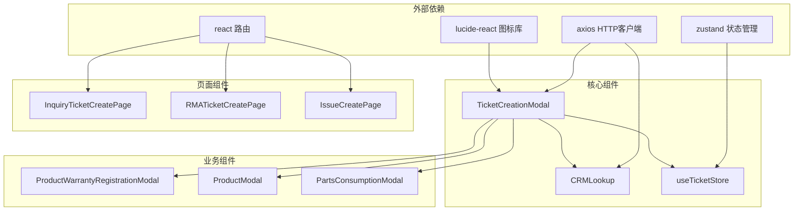
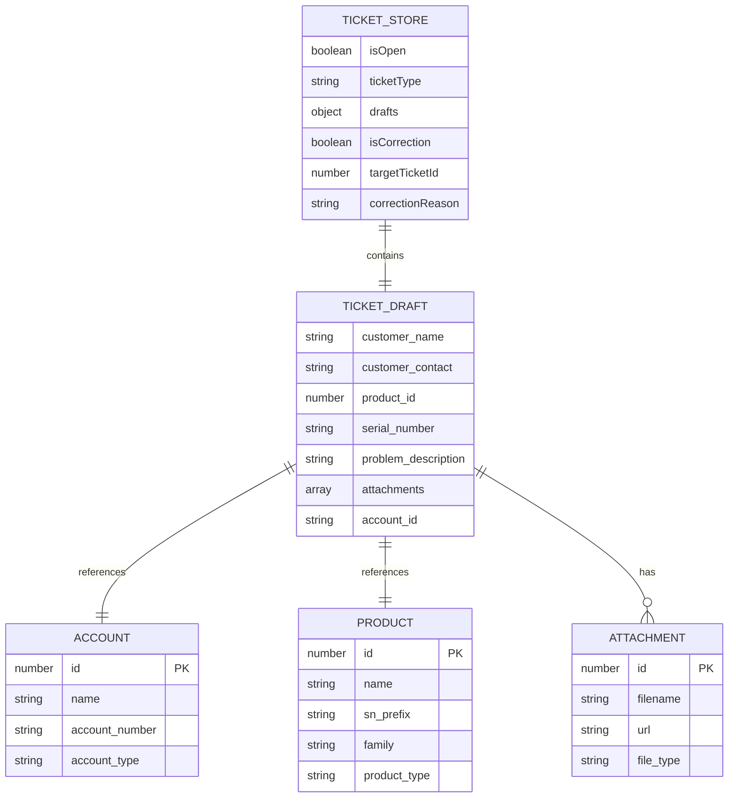

# 工单创建模态框

<cite>
**本文档引用的文件**
- [TicketCreationModal.tsx](file://client/src/components/Service/TicketCreationModal.tsx)
- [useTicketStore.ts](file://client/src/store/useTicketStore.ts)
- [CRMLookup.tsx](file://client/src/components/Service/CRMLookup.tsx)
- [InquiryTicketCreatePage.tsx](file://client/src/components/InquiryTickets/InquiryTicketCreatePage.tsx)
- [RMATicketCreatePage.tsx](file://client/src/components/RMATickets/RMATicketCreatePage.tsx)
- [IssueCreatePage.tsx](file://client/src/components/Issues/IssueCreatePage.tsx)
- [PRD.md](file://client/docs/PRD.md)
</cite>

## 目录
1. [简介](#简介)
2. [项目结构](#项目结构)
3. [核心组件](#核心组件)
4. [架构总览](#架构总览)
5. [详细组件分析](#详细组件分析)
6. [依赖关系分析](#依赖关系分析)
7. [性能考虑](#性能考虑)
8. [故障排除指南](#故障排除指南)
9. [结论](#结论)

## 简介

工单创建模态框是 Longhorn 系统中用于创建各类服务工单的核心界面组件。该模态框提供了统一的工单创建体验，支持三种工单类型：咨询工单（Inquiry）、返厂维修工单（RMA）和经销商维修工单（DealerRepair）。模态框采用现代化的毛玻璃设计风格，集成了 AI 辅助填写、序列号自动识别、产品型号智能匹配、附件管理等高级功能。

## 项目结构

工单创建模态框位于客户端组件结构中的 Service 模块下，与相关的页面组件共同构成了完整的工单管理系统：

```mermaid
graph TB
subgraph "工单系统架构"
subgraph "Service 模块"
TCM[TicketCreationModal<br/>工单创建模态框]
CRM[CRMLookup<br/>CRM客户搜索]
PWR[ProductWarrantyRegistrationModal<br/>产品保修注册]
PM[ProductModal<br/>产品入库]
end
subgraph "页面组件"
ITCP[InquiryTicketCreatePage<br/>咨询工单页面]
RTCP[RMATicketCreatePage<br/>RMA工单页面]
IPTC[IssueCreatePage<br/>问题反馈页面]
end
subgraph "状态管理"
UTS[useTicketStore<br/>工单状态存储]
end
subgraph "API 接口"
API1[/api/v1/tickets<br/>工单创建/更新]
API2[/api/v1/context/by-serial-number<br/>序列号查询]
API3[/api/v1/products/check-warranty<br/>保修状态检查]
API4[/api/v1/accounts<br/>客户搜索]
end
end
TCM --> CRM
TCM --> UTS
TCM --> API1
TCM --> API2
TCM --> API3
CRM --> API4
ITCP --> API1
RTCP --> API1
IPTC --> API1
```

**图表来源**
- [TicketCreationModal.tsx:1-1322](file://client/src/components/Service/TicketCreationModal.tsx#L1-L1322)
- [useTicketStore.ts:1-103](file://client/src/store/useTicketStore.ts#L1-L103)
- [CRMLookup.tsx:1-204](file://client/src/components/Service/CRMLookup.tsx#L1-L204)

**章节来源**
- [TicketCreationModal.tsx:1-1322](file://client/src/components/Service/TicketCreationModal.tsx#L1-L1322)
- [useTicketStore.ts:1-103](file://client/src/store/useTicketStore.ts#L1-L103)

## 核心组件

### 工单创建模态框 (TicketCreationModal)

工单创建模态框是整个工单系统的核心组件，提供了统一的创建界面和复杂的业务逻辑处理：

#### 主要功能特性

1. **多工单类型支持**
   - 咨询工单 (Inquiry)
   - 返厂维修工单 (RMA) 
   - 经销商维修工单 (DealerRepair)

2. **AI 智能辅助**
   - 文本/图片/文件拖拽输入
   - 智能信息提取和填充
   - AI 日志追踪

3. **序列号智能识别**
   - 实时序列号验证
   - 产品型号自动匹配
   - 台账状态检查

4. **附件管理**
   - 支持图片、视频、文档等多种格式
   - 实时预览和删除
   - 云端存储集成

#### 状态管理架构



**图表来源**
- [TicketCreationModal.tsx:405-485](file://client/src/components/Service/TicketCreationModal.tsx#L405-L485)
- [useTicketStore.ts:55-77](file://client/src/store/useTicketStore.ts#L55-L77)

**章节来源**
- [TicketCreationModal.tsx:91-190](file://client/src/components/Service/TicketCreationModal.tsx#L91-L190)
- [TicketCreationModal.tsx:405-485](file://client/src/components/Service/TicketCreationModal.tsx#L405-L485)

## 架构总览

工单创建模态框采用了模块化的架构设计，将不同的功能职责分离到独立的组件中：



**图表来源**
- [TicketCreationModal.tsx:21-89](file://client/src/components/Service/TicketCreationModal.tsx#L21-L89)
- [CRMLookup.tsx:26-31](file://client/src/components/Service/CRMLookup.tsx#L26-L31)
- [useTicketStore.ts:22-37](file://client/src/store/useTicketStore.ts#L22-L37)

## 详细组件分析

### 序列号智能识别流程

序列号智能识别是工单创建模态框的核心功能之一，实现了从序列号到产品型号的自动匹配：



**图表来源**
- [TicketCreationModal.tsx:206-292](file://client/src/components/Service/TicketCreationModal.tsx#L206-L292)

#### 产品型号智能匹配算法

产品型号的智能匹配基于序列号前缀匹配规则：

| 匹配场景 | 匹配规则 | 示例 |
|---------|---------|------|
| 精确匹配 | `产品sn_prefix === 输入序列号` | 输入 `KVF_1` → 匹配 `KVF_1` |
| 前缀匹配 | `输入序列号.startsWith(产品sn_prefix)` | 输入 `KVF_130` → 匹配 `KVF_1` |
| 前缀开头 | `产品sn_prefix.startsWith(输入序列号)` | 输入 `KV` → 匹配所有 `KV` 开头的产品 |

**章节来源**
- [TicketCreationModal.tsx:206-257](file://client/src/components/Service/TicketCreationModal.tsx#L206-L257)
- [TicketCreationModal.tsx:836-980](file://client/src/components/Service/TicketCreationModal.tsx#L836-L980)

### AI 智能填充机制

AI 智能填充功能允许用户通过粘贴文本、图片或拖拽文件的方式快速填充工单信息：



**图表来源**
- [TicketCreationModal.tsx:328-403](file://client/src/components/Service/TicketCreationModal.tsx#L328-L403)

#### AI 填充字段映射

| AI 字段 | 目标字段 | 填充规则 |
|---------|----------|----------|
| `customer_name` | `customer_name` | 直接映射 |
| `contact_info` | `customer_contact` | 直接映射 |
| `product_model` | `product_id` | 产品名称模糊匹配 |
| `serial_number` | `serial_number` | 直接映射 |
| `issue_summary` | `problem_description` | 添加紧急标识 |
| `communication_log` | `problem_description` | 追加通信日志 |

**章节来源**
- [TicketCreationModal.tsx:328-403](file://client/src/components/Service/TicketCreationModal.tsx#L328-L403)

### 附件管理系统

附件管理系统支持多种文件类型的上传和管理：



**图表来源**
- [TicketCreationModal.tsx:294-326](file://client/src/components/Service/TicketCreationModal.tsx#L294-L326)
- [TicketCreationModal.tsx:1108-1135](file://client/src/components/Service/TicketCreationModal.tsx#L1108-L1135)

#### 支持的文件类型

| 文件类型 | MIME 类型 | 扩展名 |
|---------|-----------|--------|
| 图片 | `image/*` | `.jpg`, `.jpeg`, `.png`, `.gif`, `.webp` |
| HEIC 图片 | `image/*` | `.heic`, `.heif` |
| 视频 | `video/*` | `.mp4`, `.mov`, `.avi`, `.mkv` |
| H.265 视频 | `video/*` | `.h265`, `.hevc` |
| 文档 | `application/*` | `.pdf`, `.doc`, `.docx`, `.xls`, `.xlsx` |

**章节来源**
- [TicketCreationModal.tsx:21-61](file://client/src/components/Service/TicketCreationModal.tsx#L21-L61)
- [TicketCreationModal.tsx:1108-1135](file://client/src/components/Service/TicketCreationModal.tsx#L1108-L1135)

## 依赖关系分析

### 组件依赖图



**图表来源**
- [TicketCreationModal.tsx:1-16](file://client/src/components/Service/TicketCreationModal.tsx#L1-L16)
- [useTicketStore.ts:1-2](file://client/src/store/useTicketStore.ts#L1-L2)

### 状态管理模式

工单创建模态框采用集中式状态管理，通过 Zustand 实现：



**图表来源**
- [useTicketStore.ts:6-20](file://client/src/store/useTicketStore.ts#L6-L20)

**章节来源**
- [useTicketStore.ts:1-103](file://client/src/store/useTicketStore.ts#L1-L103)

## 性能考虑

### 优化策略

1. **防抖机制**
   - 序列号验证使用 1000ms 防抖
   - 产品搜索使用 300ms 防抖
   - AI 解析使用 500ms 防抖

2. **懒加载策略**
   - 产品列表按需加载
   - 附件预览按需生成
   - CRM 搜索结果缓存

3. **内存管理**
   - 临时文件 URL 及时清理
   - 组件卸载时清理定时器
   - 状态持久化存储

### 性能监控指标

| 指标类型 | 目标值 | 监控方法 |
|---------|--------|----------|
| 模态框加载时间 | < 2s | 组件挂载时间 |
| 序列号查询响应 | < 1s | API 响应时间 |
| AI 解析响应 | < 3s | 接口超时控制 |
| 附件上传速度 | > 1MB/s | 传输速率监控 |

## 故障排除指南

### 常见问题及解决方案

#### 序列号识别失败

**问题症状**：输入序列号后无法自动匹配产品型号

**可能原因**：
1. 序列号长度不足 5 位
2. 产品数据库中无匹配记录
3. 序列号格式不符合规范

**解决步骤**：
1. 确认序列号输入完整且正确
2. 手动选择产品型号
3. 检查产品数据库连接状态

#### AI 解析失败

**问题症状**：点击智能填充后无任何反应

**可能原因**：
1. 网络连接异常
2. AI 服务不可用
3. 输入内容格式不支持

**解决步骤**：
1. 检查网络连接状态
2. 重试 AI 解析功能
3. 尝试手动填写关键字段

#### 附件上传失败

**问题症状**：附件添加后无法上传

**可能原因**：
1. 文件大小超过限制
2. 文件类型不受支持
3. 服务器存储空间不足

**解决步骤**：
1. 检查文件大小和类型
2. 清理缓存后重试
3. 联系系统管理员

**章节来源**
- [TicketCreationModal.tsx:206-257](file://client/src/components/Service/TicketCreationModal.tsx#L206-L257)
- [TicketCreationModal.tsx:328-403](file://client/src/components/Service/TicketCreationModal.tsx#L328-L403)

## 结论

工单创建模态框作为 Longhorn 系统的核心组件，展现了现代 Web 应用的设计理念和技术实现。通过模块化架构、智能化功能和优雅的用户体验，该组件为用户提供了高效、便捷的工单创建体验。

### 主要优势

1. **统一的用户体验**：三种工单类型共享相同的创建界面
2. **智能化辅助**：AI 解析和自动填充减少手工输入
3. **实时验证**：序列号和产品型号的实时验证确保数据准确性
4. **灵活的状态管理**：支持草稿保存和多工单类型切换

### 技术亮点

1. **模块化设计**：清晰的组件职责分离
2. **状态持久化**：Zustand 实现的本地状态管理
3. **性能优化**：防抖、懒加载等优化策略
4. **错误处理**：完善的异常捕获和用户提示机制

该工单创建模态框不仅满足了当前的业务需求，还为未来的功能扩展奠定了坚实的技术基础。